# RefCOCOS Visualization Results: val_refcocos_25vl_7b_20250506_232753

## Summary Statistics

**Total Examples**: 462

**Average Rewards**:
- Overall: 0.2698
- Format: 0.0000
- Accuracy: 0.2698

**Performance Breakdown**:
- Perfect predictions (reward = 1.0): 38 (8.23%)
- Zero reward predictions: 275 (59.52%)
- Correctly handled empty ground truth: 11
- Incorrectly handled empty ground truth: 13

**Non-Empty Ground Truth Performance**:
- Total non-empty ground truth cases: 438 (94.81% of all examples)
- Perfect predictions: 27 (6.16%)
- Partial matches: 149 (34.02%)
- Incorrect predictions: 262 (59.82%)
- Average overall reward: 0.2595
- Average accuracy reward: 0.2595

**Non-Empty Cases Reward Distribution**:
- excellent (0.9-1.0): 6.16%
- good (0.7-0.9): 14.61%
- fair (0.5-0.7): 7.08%
- poor (0.0-0.5): 72.15%

**Overall Reward Distribution**:
- excellent (0.9-1.0): 8.23%
- good (0.7-0.9): 13.85%
- fair (0.5-0.7): 6.71%
- poor (0.0-0.5): 71.21%

## Examples

### Example 0

**Reference Expression**: the monitor farther from the laptop among the ones that are on

**Ground Truth**: [[431, 134, 547, 248]]

**Predicted**: [[445, 135, 555, 253]]

**Reward**: {'overall': 0.7852568469818776, 'format': 0.0, 'accuracy': 0.7852568469818776}

**Prediction**:
```
To find the bounding box for the monitor farther from the laptop among the ones that are on, let's follow these steps:

1. Identify the monitors that are on in the image.
2. Determine which monitor is farther from the laptop.
3. Provide the bounding box for that monitor.

Step 1: Identifying the monitors that are on.
- There are three monitors that are on. They are the two larger monitors on the right side and the laptop on the far left.

Step 2: Determining which monitor is farther from the laptop.
- The laptop is on the far left.
- The monitor on the far right is farther from the laptop than the one in the middle.

Step 3: Providing the bounding box for that monitor.
- The monitor farther from the laptop is the one on the far right.

The bounding box for the monitor on the far right is approximately:
- Top-left corner: (x1, y1)
- Bottom-right corner: (x2, y2)

For the exact coordinates, you would need to use a tool that can measure the coordinates of the image, but based on the visual analysis, the bounding box would be around the monitor on the far right side of the desk.

\boxed{[445, 135, 555, 253]}
```

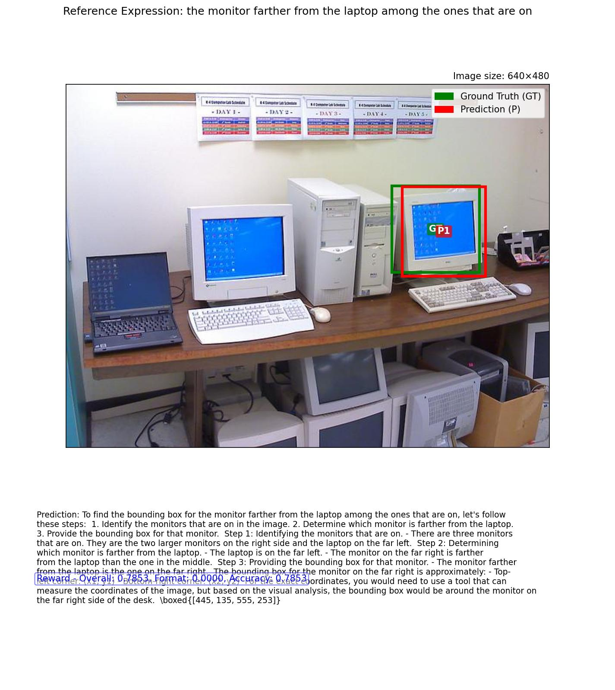

---

### Example 1

**Reference Expression**: person not holding anything

**Ground Truth**: [[255, 179, 330, 254]]

**Predicted**: [[254, 170, 326, 249]]

**Reward**: {'overall': 0.7835409112407378, 'format': 0.0, 'accuracy': 0.7835409112407378}

**Prediction**:
```
To find the bounding box for the person not holding anything, let's follow these steps:

1. Identify all the people in the image.
2. Determine which person is not holding anything in their hands.

Step 1: Identifying the people:
- There are five people in the image.
- Each person is seated around a table.

Step 2: Determining who is not holding anything:
- The person on the far left is holding a cup.
- The person second from the left is holding a cup.
- The person in the middle is not holding anything.
- The person second from the right is holding a cup.
- The person on the far right is holding a cup.

The person in the middle is the one not holding anything.

Final answer:
\boxed{[254, 170, 326, 249]}
```

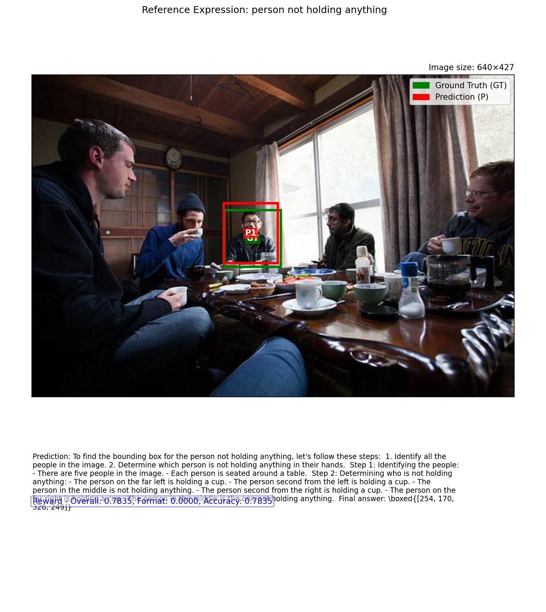

---

### Example 2

**Reference Expression**: the person looking at an apple laptop

**Ground Truth**: [[2, 95, 105, 193]]

**Predicted**: [[65, 91, 281, 268]]

**Reward**: {'overall': 0.0, 'format': 0.0, 'accuracy': 0.0}

**Prediction**:
```
To find the bounding box for the person looking at an apple laptop, let's analyze the image step-by-step:

1. Identify the apple laptops: The apple laptops in the image are the ones with the apple logo on the back of the lids. These are typically silver in color and have the distinctive apple logo.

2. Locate the person looking at the apple laptop: The person looking at the apple laptop is the one in the foreground, slightly to the left, wearing a light-colored jacket and looking at the laptop in front of them.

3. Define the bounding box: The bounding box should encompass the person and the immediate area around them. This includes their upper body and the immediate surroundings, such as the table and other items on it.

Given this analysis, the bounding box for the person looking at the apple laptop is approximately:

\boxed{[65, 91, 281, 268]}

This bounding box captures the person in the light-colored jacket and the apple laptop they are looking at.
```

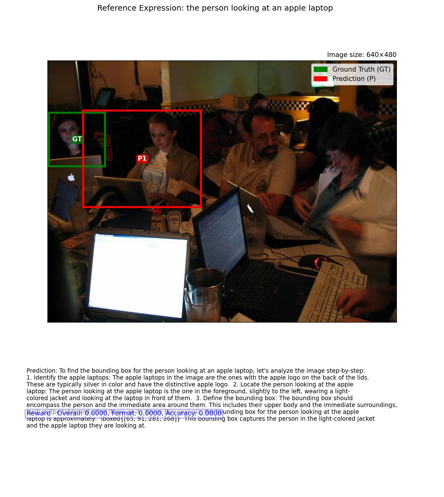

---

### Example 3

**Reference Expression**: the person wearing black top not holding nothing

**Ground Truth**: [[228, 148, 397, 458]]

**Predicted**: [[312, 186, 481, 476]]

**Reward**: {'overall': 0.29535002554931017, 'format': 0.0, 'accuracy': 0.29535002554931017}

**Prediction**:
```
To find the bounding box for the person wearing a black top who is not holding anything, follow these steps:

1. Identify all the people in the image.
2. Determine which person is wearing a black top.
3. Check if the person in the black top is holding anything.
4. If the person is not holding anything, provide the bounding box.

Step 1: There are three people in the image.
Step 2: The person on the right is wearing a black top.
Step 3: The person in the black top is not holding anything; they are sitting and appear to be looking at the person on the left.
Step 4: The bounding box for the person in the black top who is not holding anything is:

\boxed{[312, 186, 481, 476]}
```

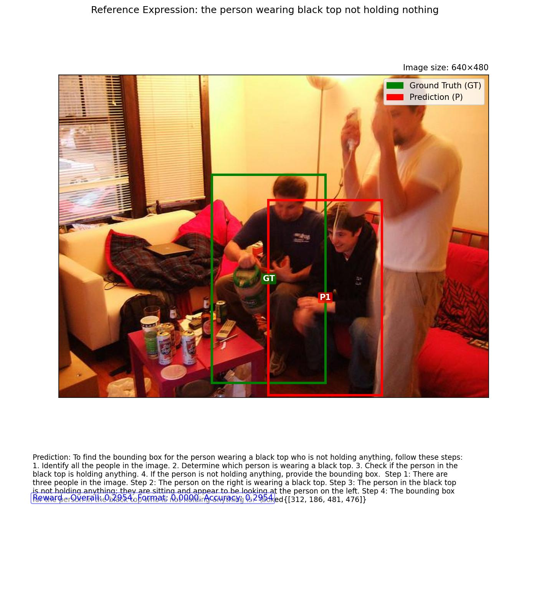

---

### Example 4

**Reference Expression**: suitcase next to car wheel

**Ground Truth**: [[419, 245, 495, 350]]

**Predicted**: [[398, 239, 498, 375]]

**Reward**: {'overall': 0.586764705882353, 'format': 0.0, 'accuracy': 0.586764705882353}

**Prediction**:
```
To find the bounding box for the suitcase next to the car wheel, let's follow these steps:

1. Identify the car: The car in question is the white vehicle in the middle of the image.
2. Locate the car wheel: The car wheel is on the right side of the car, near the front.
3. Identify the suitcase: The suitcase in question is located near the car wheel, on the ground, and appears to be a large, rectangular shape.
4. Define the bounding box: The bounding box should encompass the entire suitcase, including its top and sides.

Given these observations, the bounding box for the suitcase next to the car wheel is:

\boxed{[398, 239, 498, 375]}
```

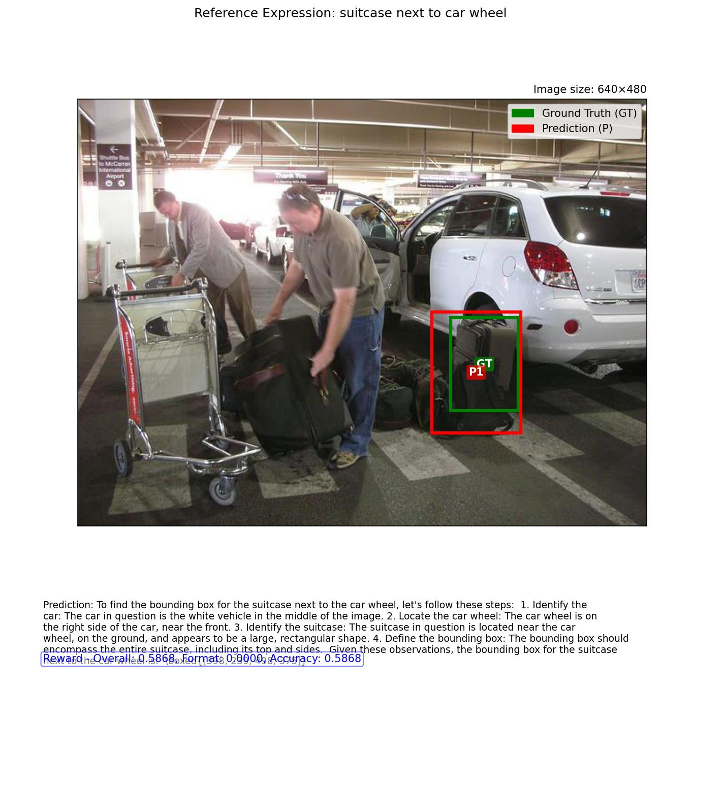

---

### Example 5

**Reference Expression**: the person who is wearing a necklace

**Ground Truth**: [[3, 72, 219, 366]]

**Predicted**: [[0, 74, 220, 366]]

**Reward**: {'overall': 1.0, 'format': 0.0, 'accuracy': 1.0}

**Prediction**:
```
To find the bounding box for 'the person who is wearing a necklace', let's follow these steps:

1. **Identify the people in the image**: There are at least three people visible in the image. One is on the left, one in the middle, and one on the right.

2. **Look for a necklace**: A necklace is typically a piece of jewelry worn around the neck. In this image, the person on the left appears to be wearing a necklace, as it is visible around their neck.

3. **Define the bounding box**: The bounding box for the person wearing a necklace should enclose the entire person. The person on the left is the one wearing the necklace.

The bounding box for the person wearing a necklace is:
\boxed{[0, 74, 220, 366]}
```

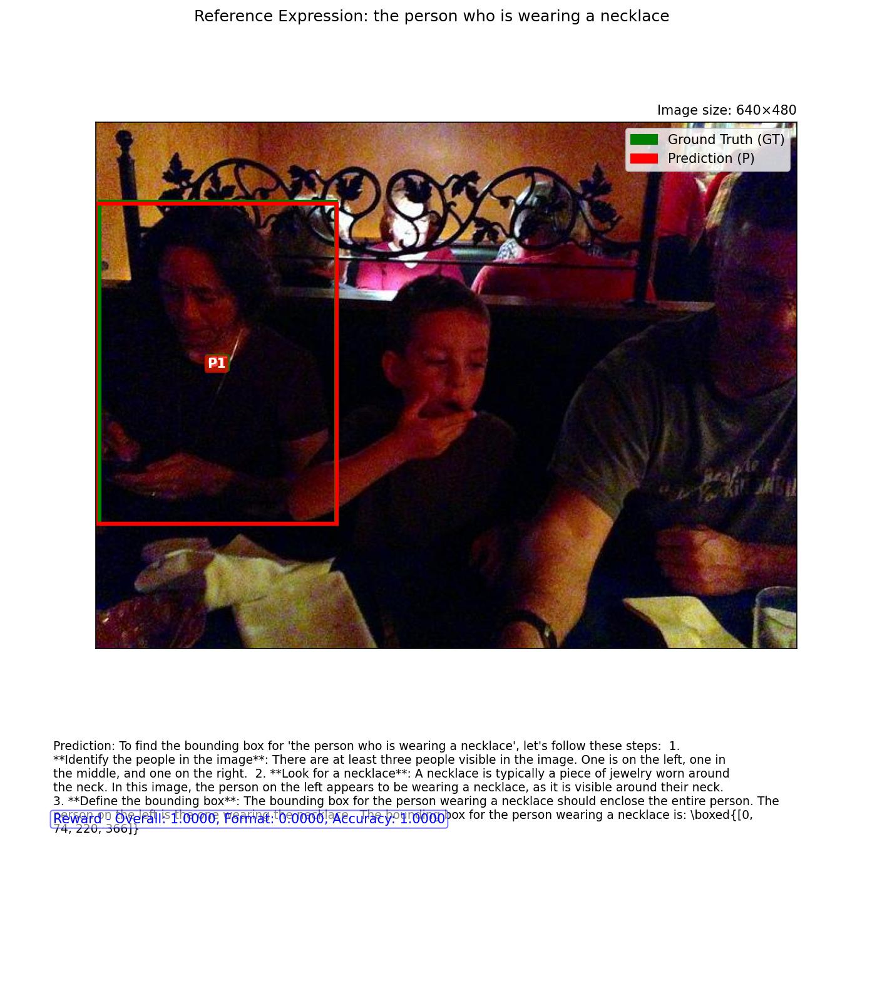

---

### Example 6

**Reference Expression**: person outside the middle window

**Ground Truth**: []

**Predicted**: [[385, 170, 405, 209]]

**Reward**: {'overall': 0.0, 'format': 0.0, 'accuracy': 0.0}

**Prediction**:
```
To find the bounding box for the person outside the middle window, we need to follow these steps:

1. Identify the middle window in the image. The middle window is the one directly in the center of the image, between the two windows on the left and right.

2. Look through the middle window to see if there is a person visible. In this image, there is a person visible through the middle window, standing near the dining table.

3. Determine the bounding box for the person. The person is located in the dining area, near the table, and appears to be standing.

4. The bounding box for this person can be estimated by identifying the approximate coordinates of the person's head and body relative to the image.

After carefully analyzing the image, the bounding box for the person outside the middle window is approximately:

\boxed{[385, 170, 405, 209]}
```

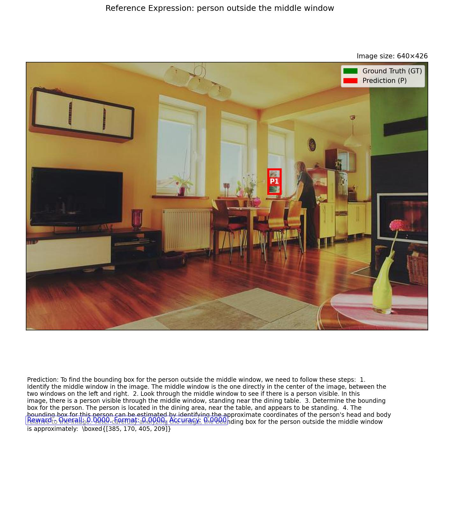

---

### Example 7

**Reference Expression**: person on bed

**Ground Truth**: []

**Predicted**: []

**Reward**: {'overall': 1.0, 'format': 0.0, 'accuracy': 1.0}

**Prediction**:
```
The image shows a bedroom with a bed, a bookshelf, a window, and various decorations. There is no person visible on the bed in this image. The bounding box for "person on bed" would therefore be empty.

Final answer: \boxed{[]}\
```

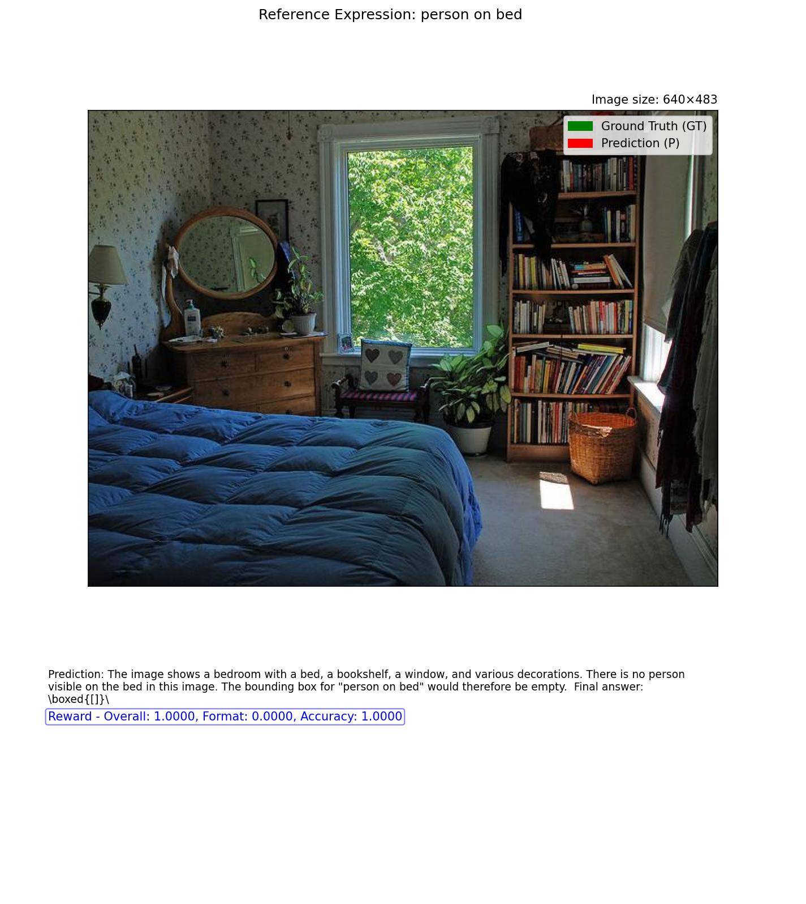

---

### Example 8

**Reference Expression**: person holding a goose feather

**Ground Truth**: [[20, 213, 81, 285]]

**Predicted**: []

**Reward**: {'overall': 0.0, 'format': 0.0, 'accuracy': 0.0}

**Prediction**:
```
To find the bounding box for the person holding a goose feather, we need to analyze the image step-by-step:

1. Identify the elements in the image:
   - A bridge spanning over a body of water.
   - A swan near the water.
   - A person in the foreground holding a camera.
   - Another person sitting on the ground near the water.
   - A person sitting on the left side of the image.

2. Focus on the person in the foreground:
   - This person is holding a camera and appears to be taking a photo of the swan or the scene.

3. Check if this person is holding a goose feather:
   - The person in the foreground is not holding a goose feather. They are holding a camera.
   - The swan appears to be near the water, but there is no indication that it is holding a goose feather.

4. Check the other people in the image:
   - The person sitting on the ground near the water is not holding anything.
   - The person sitting on the left side of the image is not holding anything.

Given the analysis, there is no person in the image holding a goose feather.

\boxed{}
```

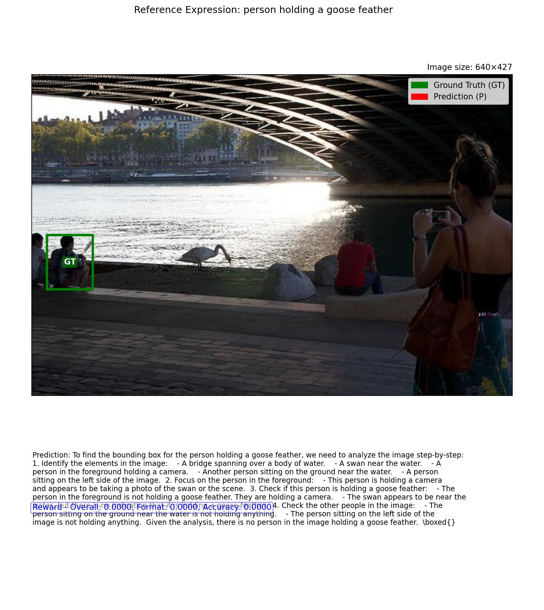

---

### Example 9

**Reference Expression**: sign to 101 south

**Ground Truth**: []

**Predicted**: []

**Reward**: {'overall': 1.0, 'format': 0.0, 'accuracy': 1.0}

**Prediction**:
```
The image shows a highway scene with several road signs. The signs are for different routes: North 101 to Ventura, North 101 to Hollywood Blvd, and Sunset Blvd. The question asks for the bounding box of the "sign to 101 south," which is not directly present in the image as the signs displayed are for "North 101" and not "101 south."

Since there is no sign for "101 south" in the image, the bounding box for such a non-existent sign would be empty.

\boxed{}
```

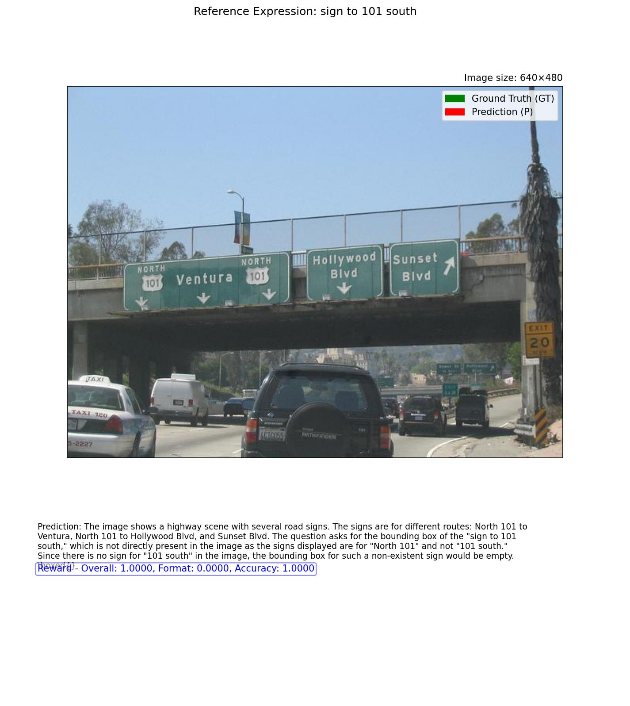

---

### Example 10

**Reference Expression**: the person in second row from camera, third from left

**Ground Truth**: [[77, 135, 117, 234]]

**Predicted**: [[259, 155, 361, 371]]

**Reward**: {'overall': 0.0, 'format': 0.0, 'accuracy': 0.0}

**Prediction**:
```
To find the bounding box for 'the person in second row from camera, third from left', let's follow these steps:

1. Identify the rows in the image:
   - The front row is the closest to the camera.
   - The second row is slightly further back.
   - The third row is further back still.
   - The fourth row is the furthest back.

2. Identify the third row from the camera:
   - The third row is the row we need to focus on.

3. Identify the third person from the left in the third row:
   - Starting from the left, count the third person.

4. Determine the bounding box for this person:
   - The bounding box will be defined by the coordinates of the person's head and feet.

Following these steps, the person in the second row from the camera, third from the left, is the third person from the left in the third row.

The bounding box for this person would be:
\boxed{[259, 155, 361, 371]}
```

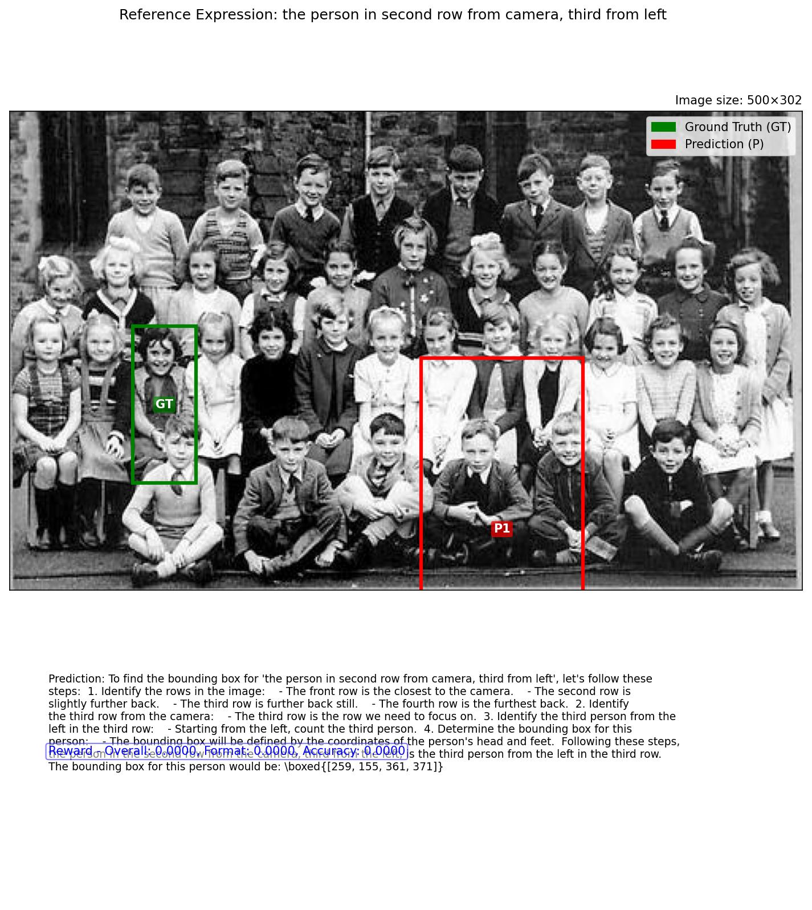

---

### Example 11

**Reference Expression**: the ski pole held by the left hand of the person in the air

**Ground Truth**: [[220, 117, 257, 167]]

**Predicted**: [[360, 116, 397, 191]]

**Reward**: {'overall': 0.0, 'format': 0.0, 'accuracy': 0.0}

**Prediction**:
```
To find the bounding box for the ski pole held by the left hand of the person in the air, let's follow these steps:

1. Identify the person in the air: The person is the one in the center of the image, wearing a colorful outfit and performing a jump on skis.
2. Locate the ski pole: The ski pole is held in the left hand of the person in the air. It is extended to the right.
3. Determine the bounding box: The bounding box should enclose the ski pole from the point where it connects to the hand to the end of the pole. The ski pole appears to be about 100 cm long.

Given the image's resolution and the relative size of the ski pole, a rough estimate for the bounding box could be:

\boxed{[360, 116, 397, 191]}

This box is a rough estimate and may need adjustment based on the exact dimensions of the ski pole and the person's hand in the image.
```

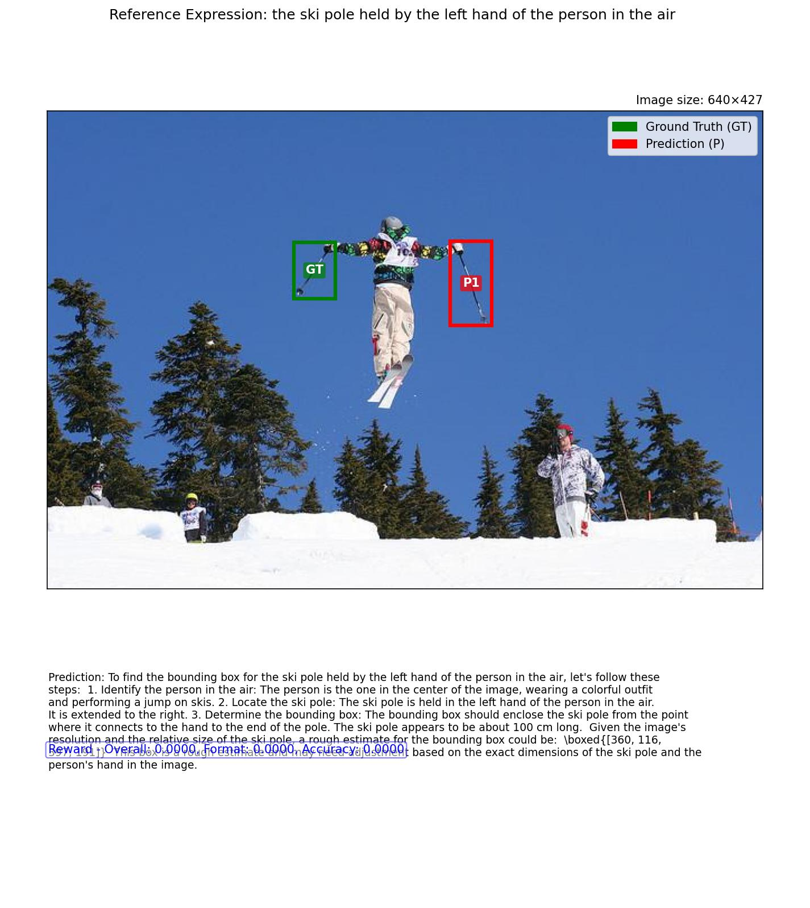

---

### Example 12

**Reference Expression**: the shoes worn by the person with black hoodie

**Ground Truth**: [[524, 370, 634, 438]]

**Predicted**: [[393, 317, 452, 347]]

**Reward**: {'overall': 0.0, 'format': 0.0, 'accuracy': 0.0}

**Prediction**:
```
To find the bounding box for the shoes worn by the person with the black hoodie, let's follow these steps:

1. Identify the person with the black hoodie in the image. This person is standing in the center, wearing a black hoodie and a white apron over a black shirt.
2. Look at the feet of this person to determine the bounding box for their shoes.
3. The shoes are visible on the ground, and they appear to be black with some red detailing.

Now, let's provide the bounding box for the shoes:

\boxed{[393, 317, 452, 347]}
```

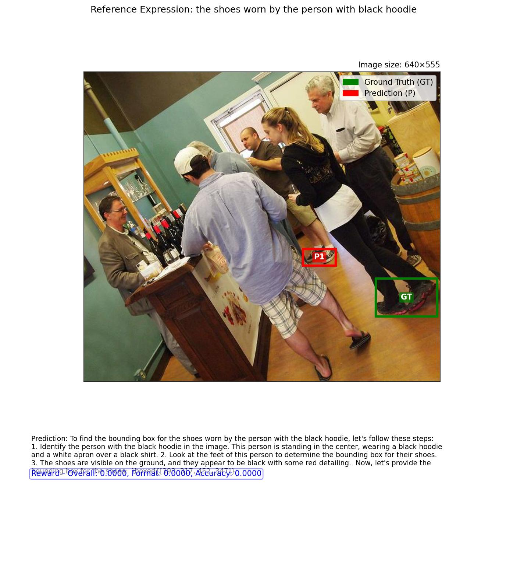

---

### Example 13

**Reference Expression**: the man farthest from the camera

**Ground Truth**: [[296, 132, 326, 207]]

**Predicted**: [[350, 155, 391, 251]]

**Reward**: {'overall': 0.0, 'format': 0.0, 'accuracy': 0.0}

**Prediction**:
```
To find the bounding box for 'the man farthest from the camera', let's follow these steps:

1. Identify all the people in the image.
2. Determine which person is the farthest from the camera.
3. Provide the bounding box for that person.

Step 1: Identifying all the people in the image:
- There are 7 people in the image.

Step 2: Determining which person is the farthest from the camera:
- The person farthest from the camera appears to be the one standing on the far right side of the image, partially obscured by the couch.

Step 3: Providing the bounding box for that person:
- The bounding box for the person farthest from the camera is approximately [350, 155, 391, 251].

Thus, the final answer is \boxed{[350, 155, 391, 251]}.
```

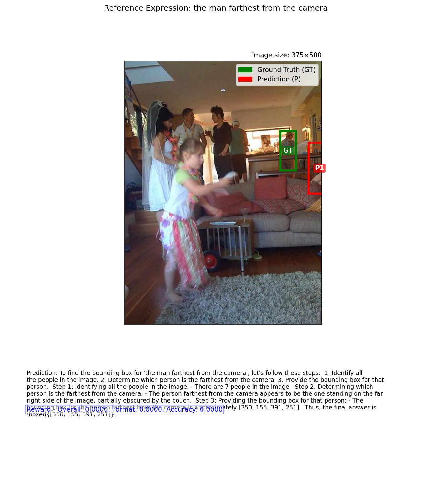

---

### Example 14

**Reference Expression**: the person who is not facing the camera and not holding a camera

**Ground Truth**: [[224, 64, 261, 187]]

**Predicted**: [[137, 115, 249, 415]]

**Reward**: {'overall': 0.0, 'format': 0.0, 'accuracy': 0.0}

**Prediction**:
```
To find the bounding box for the person who is not facing the camera and not holding a camera, let's follow these steps:

1. Identify the people in the image:
   - There are five people in the image.
   - One person is holding a camera and taking a photo.
   - One person is holding a surfboard.
   - Two people are holding a surfboard together.
   - One person is standing in the background.

2. Determine which person is not facing the camera and not holding a camera:
   - The person on the far left is not facing the camera and is holding a camera.
   - The person on the far right is facing the camera and is holding a surfboard.
   - The two people holding a surfboard together are facing the camera.
   - The person in the background is not facing the camera and is not holding a camera.

3. Identify the bounding box for the person in the background:
   - The person in the background is the one who is not facing the camera and not holding a camera.

4. Provide the bounding box for the identified person:
   - The bounding box for the person in the background is approximately [137, 115, 249, 415].

\boxed{[137, 115, 249, 415]}
```

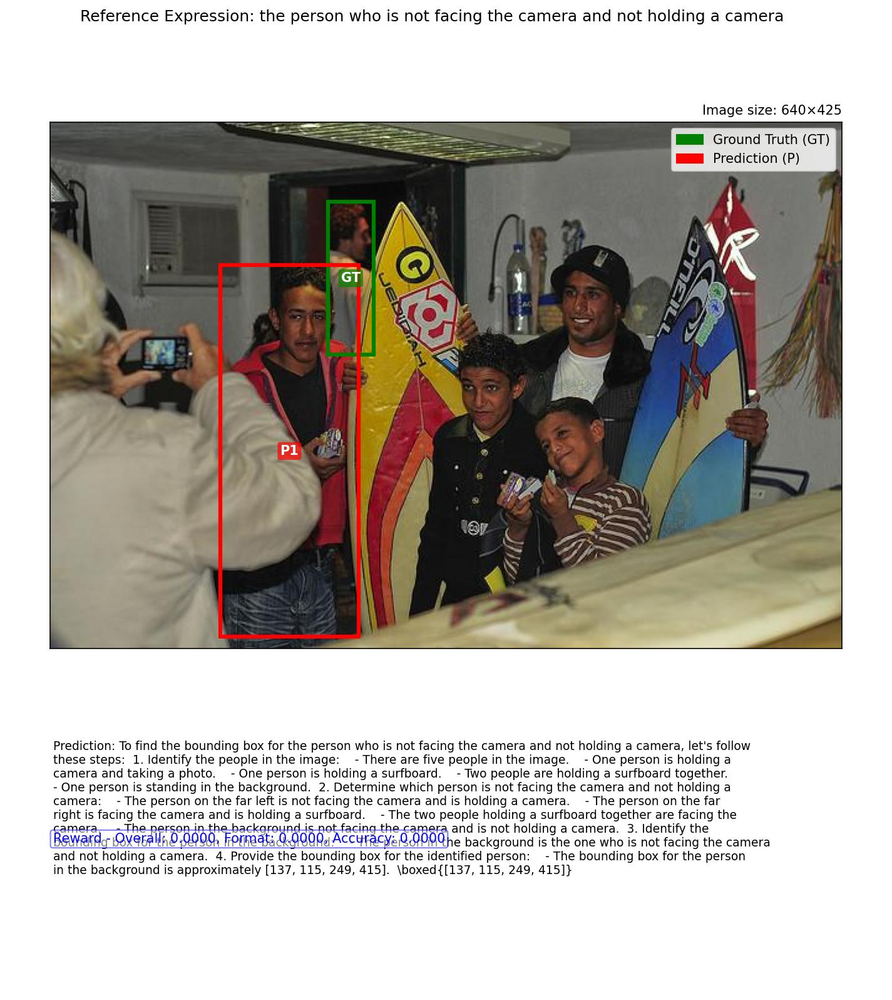

---

### Example 15

**Reference Expression**: the frisbee with green pattern held by the person on the right hand side of the person in red

**Ground Truth**: [[218, 185, 251, 221]]

**Predicted**: [[310, 219, 362, 252]]

**Reward**: {'overall': 0.0, 'format': 0.0, 'accuracy': 0.0}

**Prediction**:
```
To find the bounding box for the frisbee with a green pattern held by the person on the right-hand side of the person in red, let's follow these steps:

1. Identify the person in red:
   - The person in red is the second from the right.

2. Identify the person on the right-hand side of the person in red:
   - The person on the right-hand side of the person in red is the person on the far right.

3. Identify the frisbee with a green pattern:
   - The frisbee with a green pattern is held by the person on the far right.

4. Determine the bounding box for the frisbee:
   - The frisbee is held in the person's right hand.
   - The person's right hand is extended outward, and the frisbee is clearly visible.

5. Provide the bounding box:
   - The frisbee is located in the lower part of the image, close to the person's hand.
   - The bounding box for the frisbee can be approximated as the area around the frisbee in the person's hand.

Final answer: \boxed{[310, 219, 362, 252]}
```

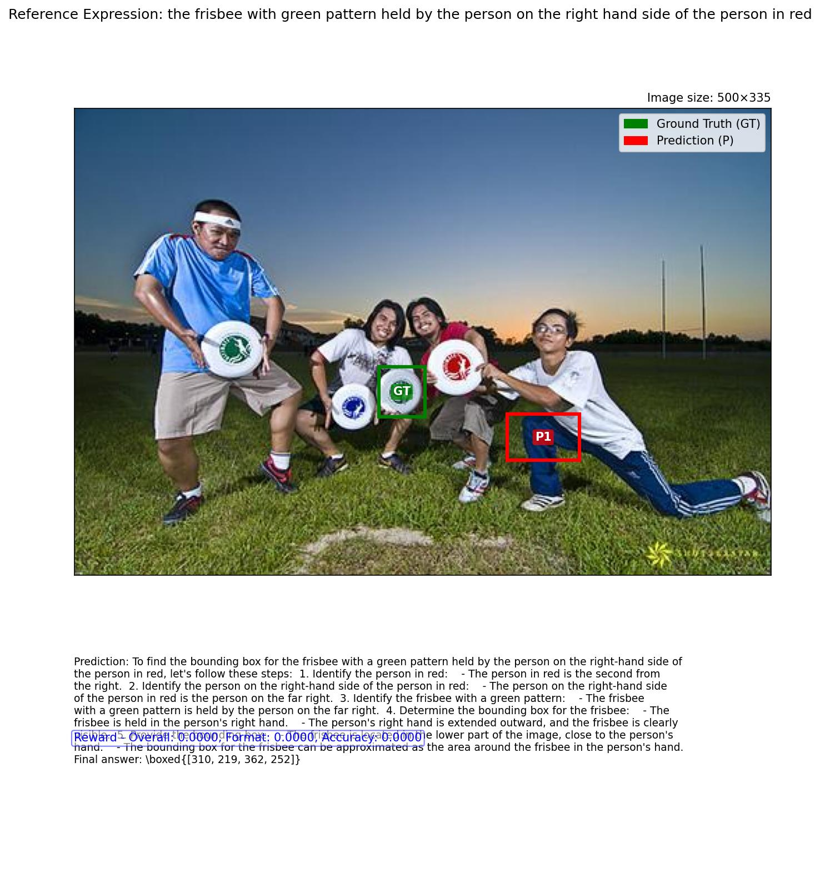

---

### Example 16

**Reference Expression**: the second worker from the right

**Ground Truth**: [[273, 272, 300, 310]]

**Predicted**: [[201, 252, 223, 293]]

**Reward**: {'overall': 0.0, 'format': 0.0, 'accuracy': 0.0}

**Prediction**:
```
To find the bounding box for 'the second worker from the right', let's follow these steps:

1. Identify the workers in the image.
2. Count the workers from right to left.
3. Locate the second worker from the right.

Step 1: Identifying the workers:
- There are seven workers in the image, all wearing orange outfits and white helmets.

Step 2: Counting the workers from right to left:
- The rightmost worker is the first worker.
- The worker to the left of the first worker is the second worker.
- Continue this process until all workers are counted.

Step 3: Locating the second worker from the right:
- The second worker from the right is the second worker from the right side of the image.

Final bounding box:
The second worker from the right is located at the second position from the right. Assuming the bounding box coordinates are relative to the image and the workers are evenly spaced, the second worker from the right would be the second worker from the right side of the image.

\boxed{[201, 252, 223, 293]}
```

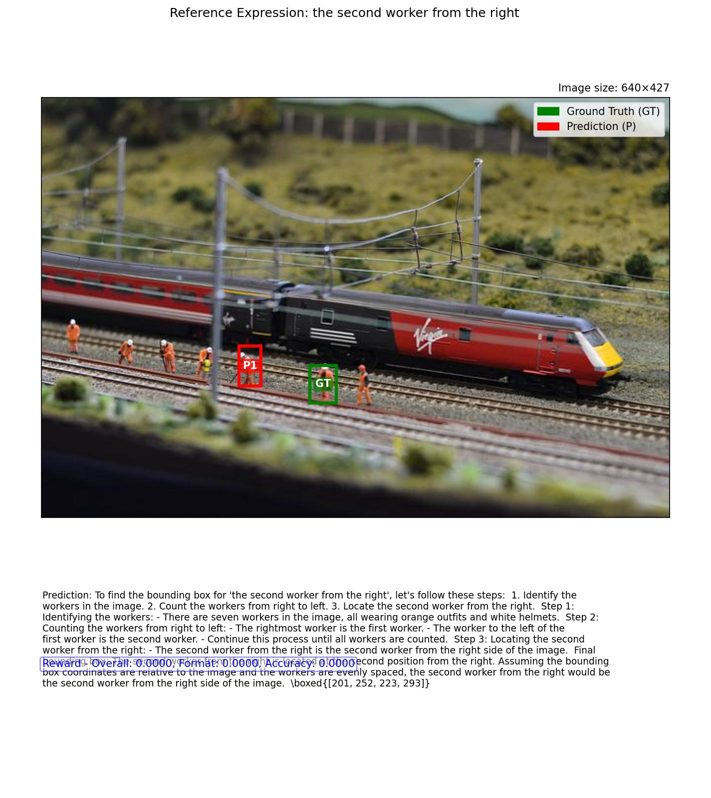

---

### Example 17

**Reference Expression**: the frisbee that the child in blue is looking at

**Ground Truth**: [[248, 228, 366, 345]]

**Predicted**: [[466, 231, 602, 363]]

**Reward**: {'overall': 0.0, 'format': 0.0, 'accuracy': 0.0}

**Prediction**:
```
To find the bounding box for the frisbee that the child in blue is looking at, let's follow these steps:

1. Identify the child in blue: The child in blue is on the far right of the group.
2. Determine the frisbee that the child in blue is looking at: The child in blue is holding a frisbee and is looking at it.
3. Locate the frisbee: The frisbee is white with the word "Ultimate" on it, and it is being held by the child in blue.

Now, let's outline the bounding box for this frisbee:

- The frisbee is positioned in the center-right part of the image.
- The bounding box should encompass the frisbee and the child's hands holding it.

The bounding box for the frisbee that the child in blue is looking at is:

\boxed{[466, 231, 602, 363]}
```

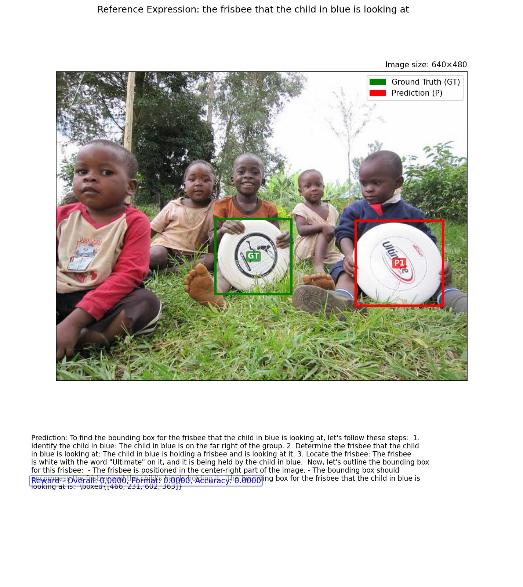

---

### Example 18

**Reference Expression**: person other than the man and his reflection

**Ground Truth**: []

**Predicted**: []

**Reward**: {'overall': 1.0, 'format': 0.0, 'accuracy': 1.0}

**Prediction**:
```
The image shows a man standing in an office setting. There is a reflection of the man in a large mirror behind him. The mirror is reflecting the man, his suit, and part of the office environment, including a window and some chairs. The man is standing in front of a desk with a computer setup.

The question asks for the bounding box of 'person other than the man and his reflection'. Given the image, there is no other person present in the image apart from the man and his reflection. Therefore, the bounding box for 'person other than the man and his reflection' is empty.

\boxed{}
```

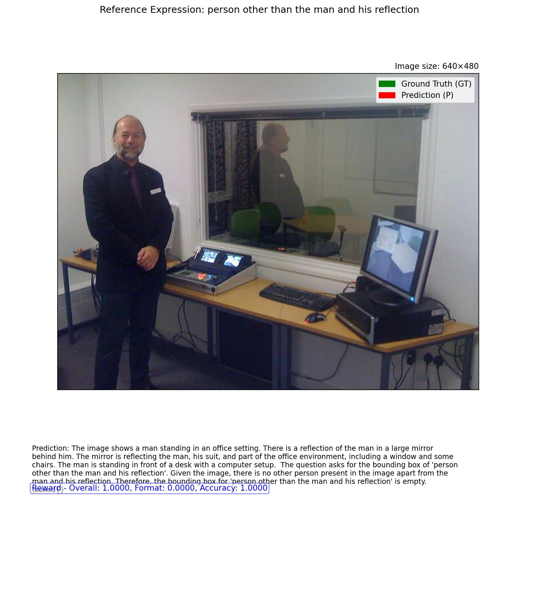

---

### Example 19

**Reference Expression**: yellow flag next to the middle clownfish flag

**Ground Truth**: []

**Predicted**: []

**Reward**: {'overall': 1.0, 'format': 0.0, 'accuracy': 1.0}

**Prediction**:
```
The image shows a series of kites designed to resemble clownfish, with a yellow flag near the middle clownfish flag. However, upon close inspection, it appears that the yellow flag is not part of the clownfish kite itself but rather a separate object on the ground. The yellow flag is not directly connected to the kite structure and is not part of the kite's design. Therefore, there is no bounding box that corresponds to a yellow flag next to the middle clownfish flag.

\boxed{}
```

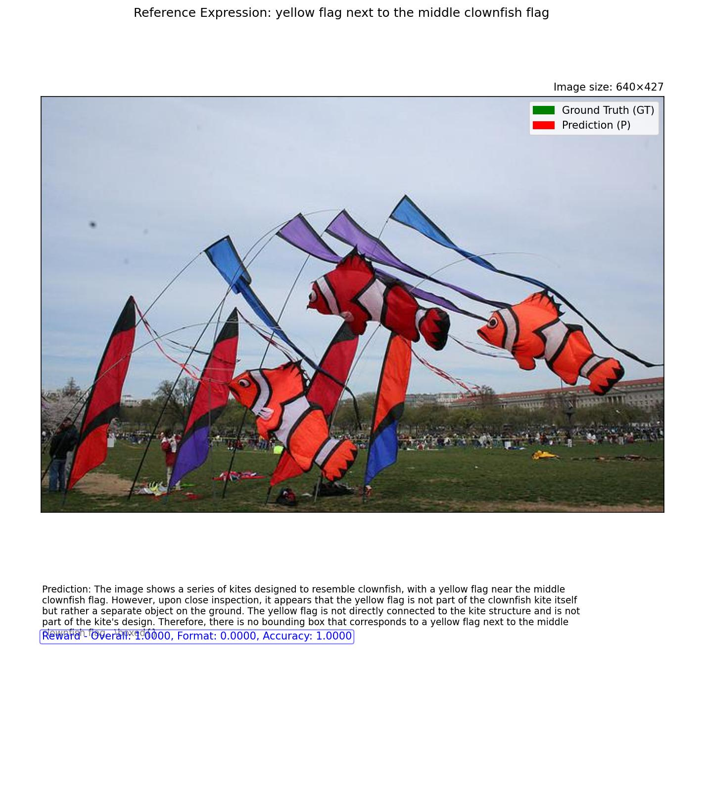

---

### Example 20

**Reference Expression**: third motorcycle from the left

**Ground Truth**: [[138, 261, 189, 375]]

**Predicted**: [[190, 248, 321, 356]]

**Reward**: {'overall': 0.0, 'format': 0.0, 'accuracy': 0.0}

**Prediction**:
```
To find the bounding box for the third motorcycle from the left, we need to follow these steps:

1. Identify the motorcycles in the image.
2. Count them from left to right.
3. Locate the third motorcycle in the sequence.
4. Determine the bounding box for that motorcycle.

Step 1: Identifying the motorcycles:
- There are several motorcycles parked in a row.

Step 2: Counting from left to right:
- The first motorcycle is the one closest to the left edge.
- The second motorcycle is the one next to the first.
- The third motorcycle is the one next to the second.

Step 3: Locating the third motorcycle:
- The third motorcycle is clearly visible in the image.

Step 4: Determining the bounding box for the third motorcycle:
- The bounding box for the third motorcycle is the area that encompasses it. In this case, it's the area from the middle of the third motorcycle to the middle of the fourth motorcycle.

The bounding box for the third motorcycle from the left is:
\boxed{[190, 248, 321, 356]}
```

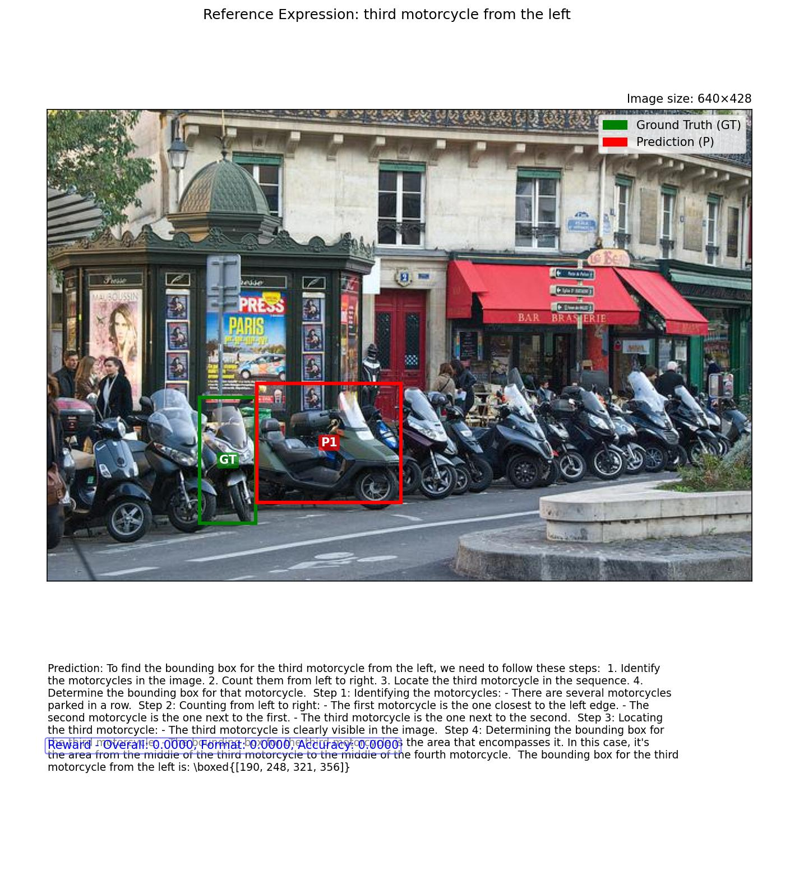

---

### Example 21

**Reference Expression**: the person outside the fence who is not sitting

**Ground Truth**: [[123, 27, 164, 126]]

**Predicted**: [[331, 73, 391, 200]]

**Reward**: {'overall': 0.0, 'format': 0.0, 'accuracy': 0.0}

**Prediction**:
```
To find the bounding box for the person outside the fence who is not sitting, let's follow these steps:

1. Identify the people in the image who are not sitting and are outside the fence.
2. Determine which of these people are not sitting.

Step 1: Identifying the people outside the fence who are not sitting:
- There is a person in the background who appears to be standing outside the fence and not sitting.

Step 2: Determining which of these people are not sitting:
- The person in the background outside the fence is standing.

Therefore, the bounding box for the person outside the fence who is not sitting is:

\boxed{[331, 73, 391, 200]}
```

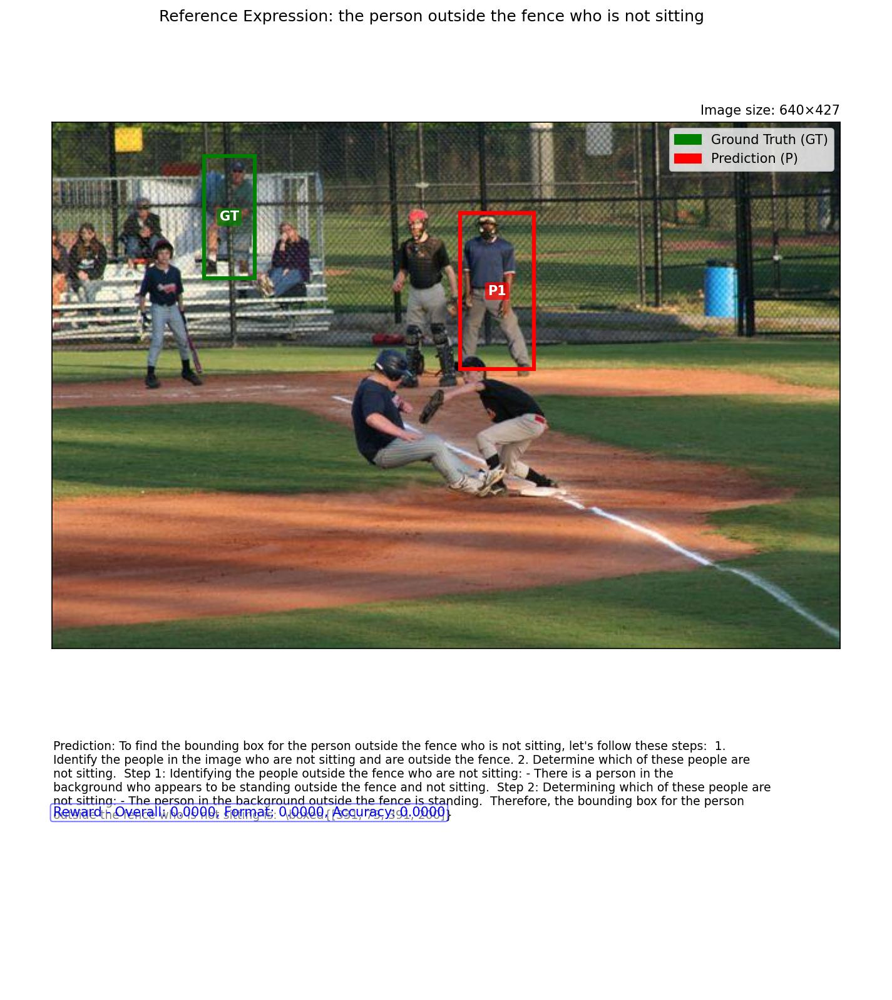

---

### Example 22

**Reference Expression**: the person on the surfboard which is not pink or yellow

**Ground Truth**: [[47, 284, 159, 392]]

**Predicted**: [[44, 279, 160, 385]]

**Reward**: {'overall': 0.8648318042813455, 'format': 0.0, 'accuracy': 0.8648318042813455}

**Prediction**:
```
To find the bounding box for the person on the surfboard which is not pink or yellow, let's follow these steps:

1. Identify the surfboards in the image:
   - The surfboard on the far left is not pink or yellow.
   - The surfboard in the middle is yellow.
   - The surfboard on the far right is pink.

2. Determine which person is on the surfboard that is not pink or yellow:
   - The person on the far left surfboard is the one on the surfboard that is not pink or yellow.

3. Provide the bounding box for this person:
   - The person on the surfboard on the far left is the one we are looking for.

The bounding box for the person on the surfboard which is not pink or yellow is:
\boxed{[44, 279, 160, 385]}
```

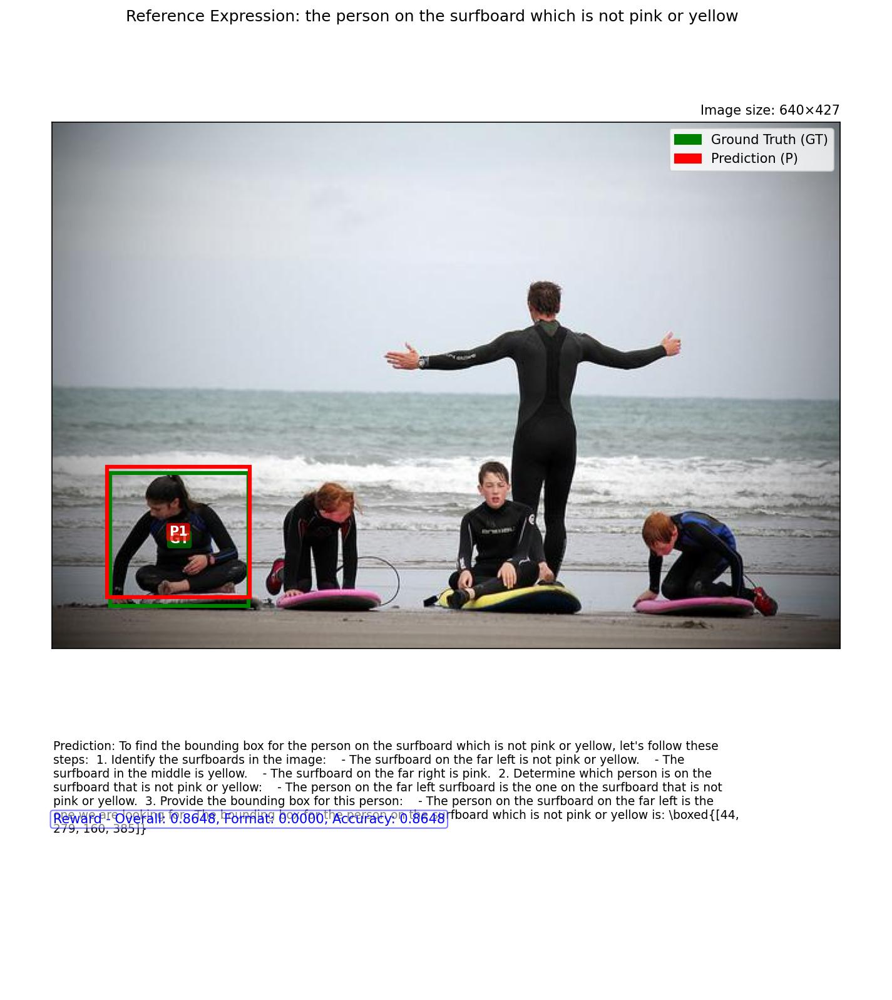

---

### Example 23

**Reference Expression**: the three people on the balcony right above crowd, not on the ground

**Ground Truth**: [[250, 126, 277, 152]]

**Predicted**: []

**Reward**: {'overall': 0.0, 'format': 0.0, 'accuracy': 0.0}

**Prediction**:
```
To find the bounding box for the three people on the balcony right above the crowd, we need to follow these steps:

1. Identify the balcony area in the image.
2. Look for the people standing on the balcony.
3. Determine the exact bounding box for those three people.

Step 1: The balcony area is located on the upper level of the building, above the crowd. It has a series of arches and red railings.

Step 2: On this balcony, there are several people standing. We need to focus on the three people who are directly above the crowd.

Step 3: Upon close inspection, there are indeed three people standing on the balcony, and they are positioned towards the right side of the balcony. However, due to the resolution and perspective of the image, it is challenging to provide an exact bounding box for them.

Given the complexity and the resolution of the image, it is difficult to provide a precise bounding box for the three people on the balcony. The bounding box might not be accurate or might not be identifiable with high confidence.

\boxed{}
```

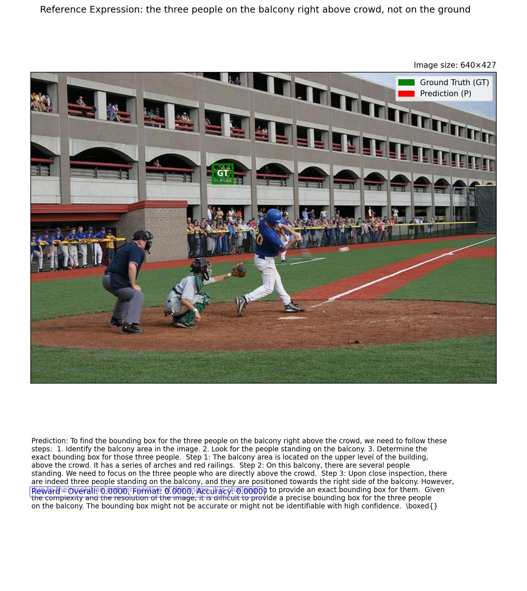

---

### Example 24

**Reference Expression**: the smaller pot in front of the cooking pan

**Ground Truth**: [[238, 326, 321, 394]]

**Predicted**: [[82, 287, 222, 388]]

**Reward**: {'overall': 0.0, 'format': 0.0, 'accuracy': 0.0}

**Prediction**:
```
To find the bounding box for 'the smaller pot in front of the cooking pan', let's follow these steps:

1. Identify the cooking pan: The cooking pan is the large round pan on the stove in the foreground, which has a handle and is being used for cooking.

2. Locate the smaller pot: In front of the cooking pan, there is a smaller pot with a lid. This pot is positioned on the stove to the left of the cooking pan.

3. Define the bounding box: The smaller pot is a metallic pot with a lid, and it is located to the left of the cooking pan. The bounding box should encompass this pot.

Given these observations, the bounding box for 'the smaller pot in front of the cooking pan' is:

\boxed{[82, 287, 222, 388]}
```

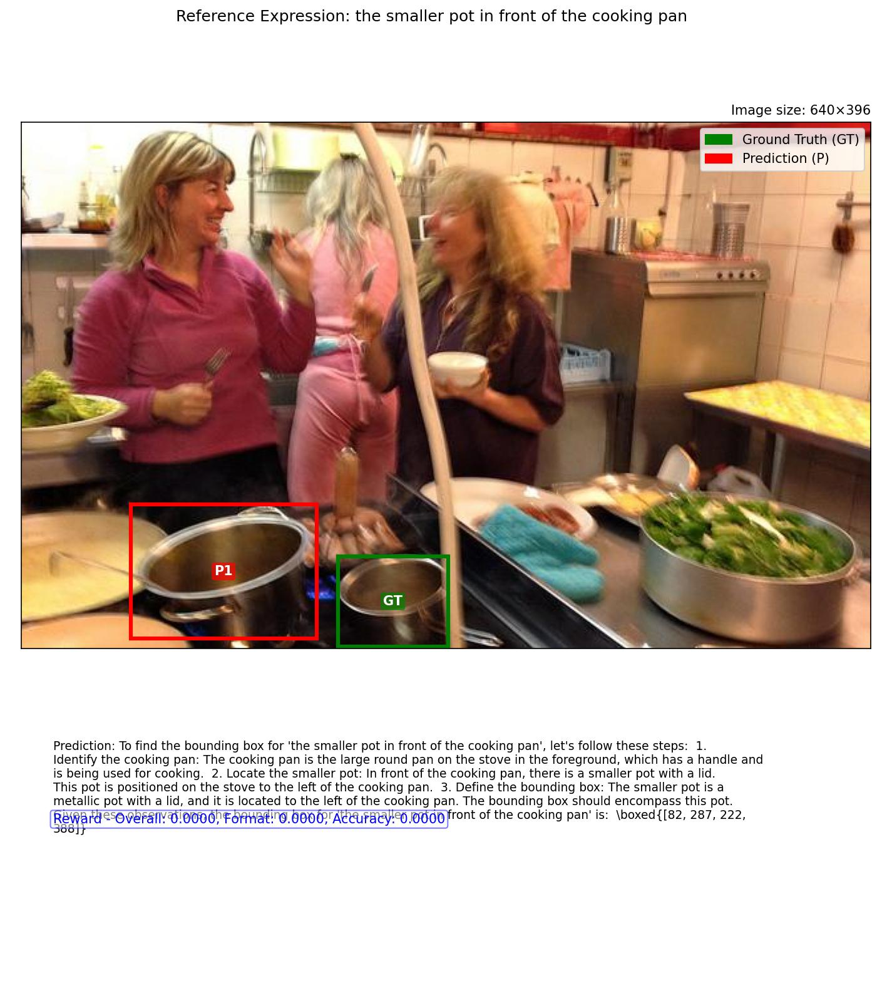

---

### Example 25

**Reference Expression**: the carbinets on the top of the microwave

**Ground Truth**: [[479, 1, 626, 51]]

**Predicted**: [[477, 0, 644, 118]]

**Reward**: {'overall': 0.37298284786359487, 'format': 0.0, 'accuracy': 0.37298284786359487}

**Prediction**:
```
To find the bounding box for the carbinets on the top of the microwave, let's follow these steps:

1. Identify the microwave: The microwave is located on the right side of the image, above the stove.
2. Identify the cabinets: The cabinets above the microwave are the upper cabinets in the kitchen.
3. Determine the bounding box: The upper cabinets are located above the microwave and are part of the kitchen cabinetry.

The bounding box for the cabinets above the microwave would be:
- Top-left corner: The point where the upper cabinets meet the wall on the left.
- Top-right corner: The point where the upper cabinets meet the wall on the right.
- Bottom-left corner: The point where the upper cabinets meet the wall on the left, at the same level as the microwave.
- Bottom-right corner: The point where the upper cabinets meet the wall on the right, at the same level as the microwave.

The exact coordinates would depend on the specific dimensions of the kitchen, but the general bounding box would be above the microwave and within the wall space.

Since the exact coordinates are not provided, the bounding box can be described as:
\boxed{[477, 0, 644, 118]}
```

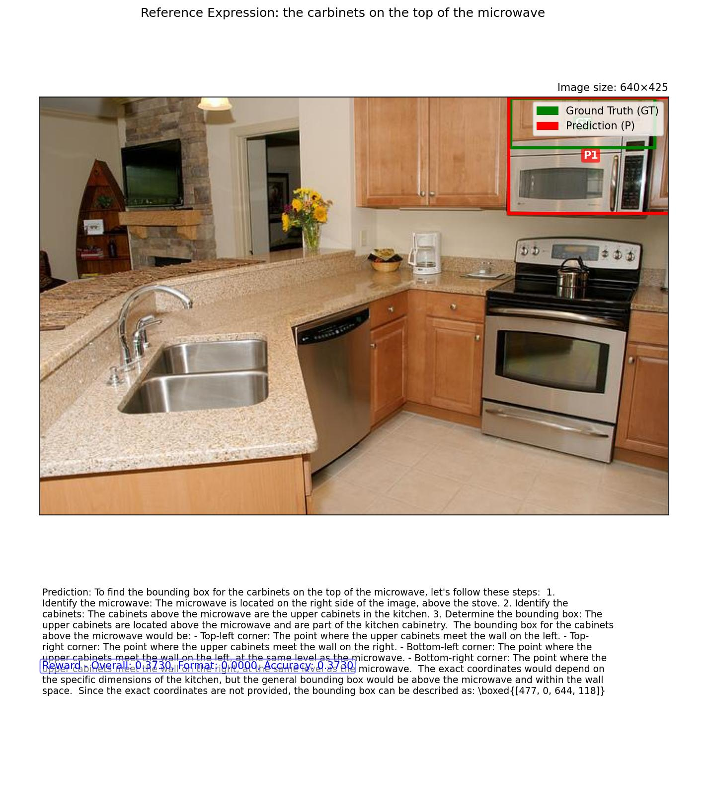

---

### Example 26

**Reference Expression**: the hotdog with a red topping that isn’t a paste or sauce

**Ground Truth**: [[211, 145, 640, 475]]

**Predicted**: [[222, 141, 644, 476]]

**Reward**: {'overall': 1.0, 'format': 0.0, 'accuracy': 1.0}

**Prediction**:
```
To find the bounding box for the hotdog with a red topping that isn't a paste or sauce, let's follow these steps:

1. Identify the hotdogs in the image.
2. Determine which hotdog has a red topping that appears to be cut peppers rather than a paste or sauce.

Step 1: There are three hotdogs visible in the image:
- The one on the left appears to have a topping that is a paste or sauce.
- The middle hotdog has a topping that is a paste or sauce.
- The hotdog on the right has a topping that appears to be cut red peppers.

Step 2: The hotdog on the right has the red topping that looks like cut peppers, not a paste or sauce.

The bounding box for the hotdog with a red topping that isn't a paste or sauce is the one on the right.

Final answer: \boxed{[222, 141, 644, 476]}
```

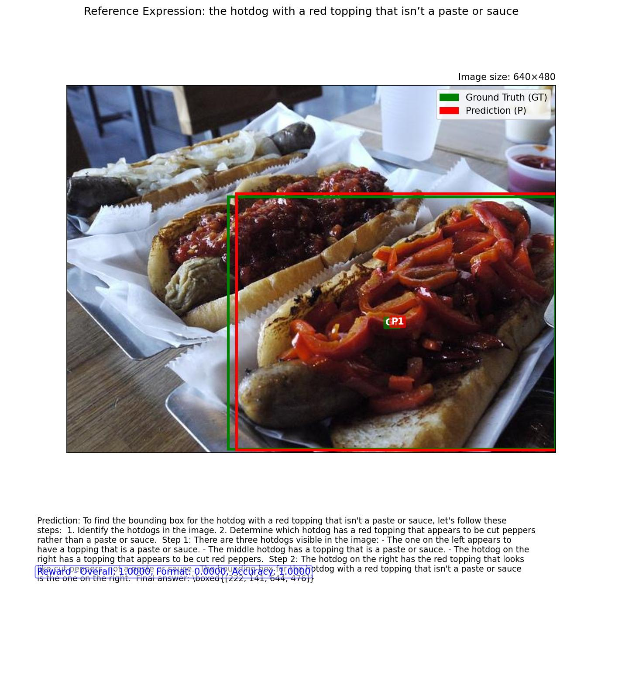

---

### Example 27

**Reference Expression**: the bowl with no bread or fork inside

**Ground Truth**: [[368, 79, 640, 250]]

**Predicted**: [[371, 78, 644, 242]]

**Reward**: {'overall': 1.0, 'format': 0.0, 'accuracy': 1.0}

**Prediction**:
```
To find the bounding box for the bowl with no bread or fork inside, let's follow these steps:

1. Identify the bowls in the image: There are three bowls in the image.
2. Analyze the contents of each bowl:
   - The bowl in the foreground contains a sausage on a bed of what appears to be mashed potatoes, with a fork and knife placed inside.
   - The bowl in the middle contains a sandwich and some greens, with no fork or knife inside.
   - The bowl in the background contains a piece of fish and green beans, with no fork or knife inside.

3. Determine which bowl does not contain bread or a fork:
   - The middle bowl contains a sandwich, which is bread, so it does not fit the criteria.
   - The background bowl contains fish, which is not bread, and it does not have a fork or knife inside.

The final answer is the bounding box for the bowl with no bread or fork inside, which is the background bowl:

\boxed{[371, 78, 644, 242]}
```

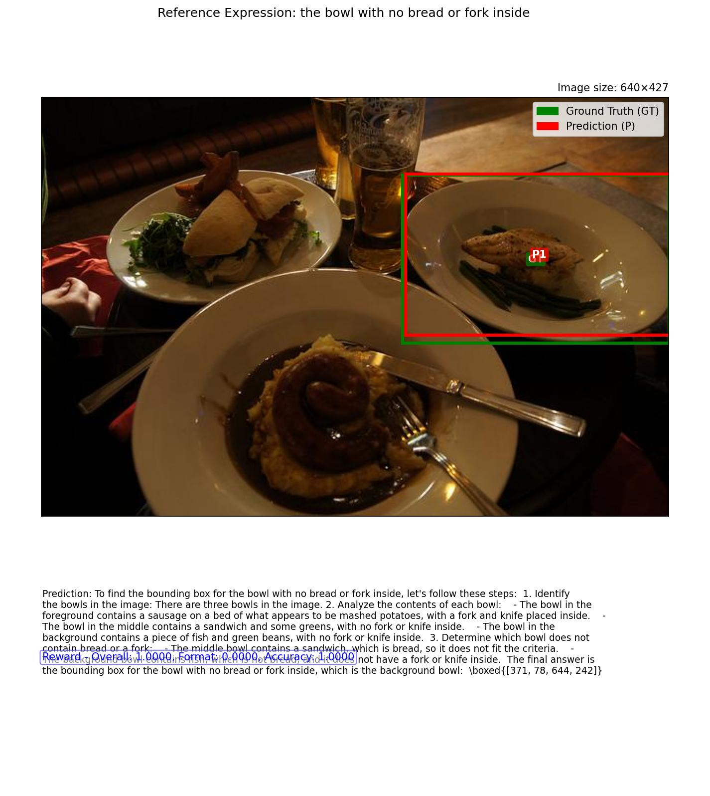

---

### Example 28

**Reference Expression**: the person holding a frisbee and not wearing a bag

**Ground Truth**: [[1, 33, 215, 472]]

**Predicted**: [[10, 28, 211, 470]]

**Reward**: {'overall': 1.0, 'format': 0.0, 'accuracy': 1.0}

**Prediction**:
```
To find the bounding box for the person holding a frisbee and not wearing a bag, let's follow these steps:

1. Identify the person holding a frisbee:
   - The person on the far left is holding a frisbee, and they are not wearing a bag.
   
2. Identify the person holding a frisbee and wearing a bag:
   - The person in the middle is holding a frisbee and is wearing a bag.
   
3. Identify the person holding a frisbee and not wearing a bag:
   - The person on the far left matches this description.

The bounding box for the person holding a frisbee and not wearing a bag is:

\boxed{[10, 28, 211, 470]}
```

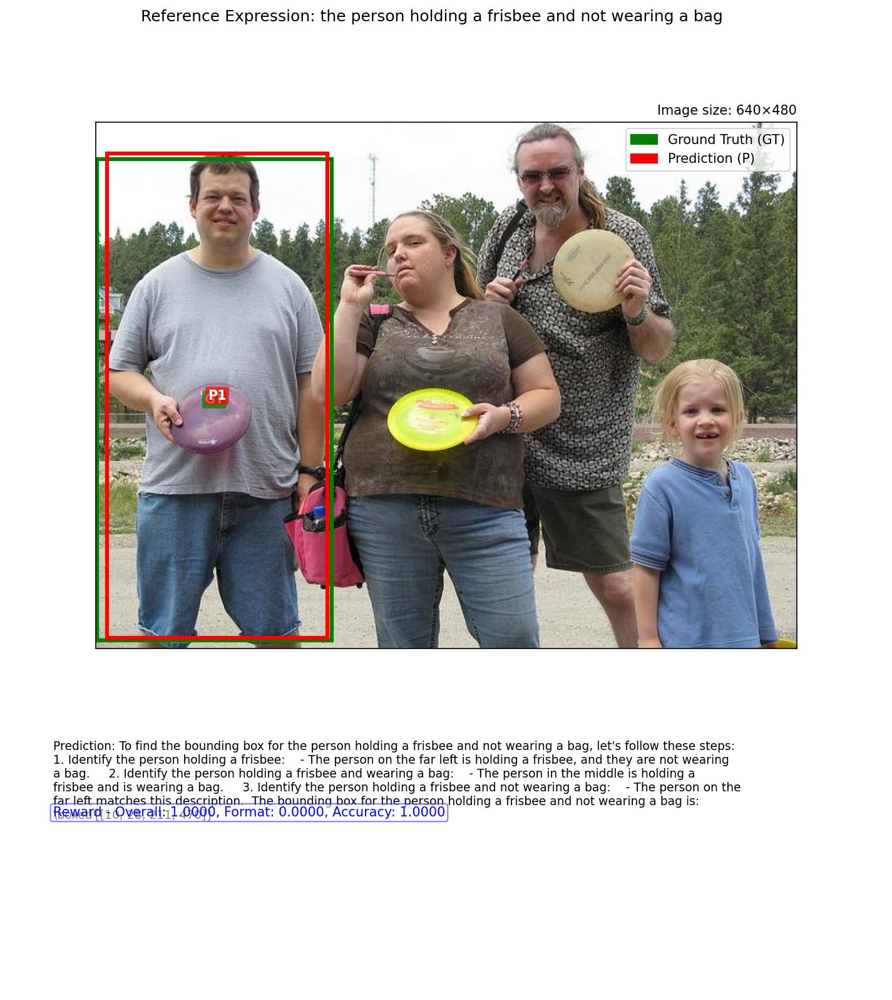

---

### Example 29

**Reference Expression**: the person partially obscured by the person in red shorts

**Ground Truth**: [[437, 196, 469, 295]]

**Predicted**: [[319, 168, 360, 295]]

**Reward**: {'overall': 0.0, 'format': 0.0, 'accuracy': 0.0}

**Prediction**:
```
To find the bounding box for the person partially obscured by the person in red shorts, let's follow these steps:

1. Identify the person in red shorts: The person in red shorts is the one running in the foreground, facing away from the camera, and partially obscuring another person.
2. Determine the person obscured by the person in red shorts: The person obscured is the one standing behind the person in red shorts, closer to the center of the image.
3. Define the bounding box for the obscured person: The bounding box should encompass the person standing behind the person in red shorts.

The bounding box for the person partially obscured by the person in red shorts is:
\boxed{[319, 168, 360, 295]}
```

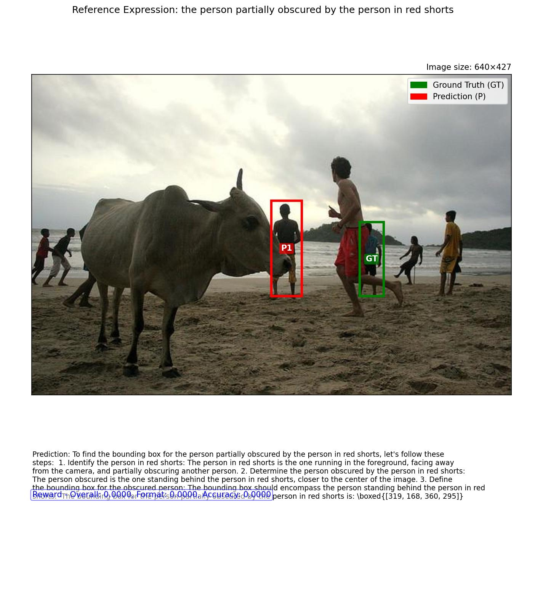

---

### Example 30

**Reference Expression**: the second car behind the car with two open doors

**Ground Truth**: [[161, 232, 226, 281]]

**Predicted**: [[199, 283, 282, 353]]

**Reward**: {'overall': 0.0, 'format': 0.0, 'accuracy': 0.0}

**Prediction**:
```
To find the bounding box for 'the second car behind the car with two open doors', let's follow these steps:

1. Identify the car with two open doors:
   - The car with two open doors is the one in the center of the image, with its rear doors open.
   - The bounding box for this car can be estimated as [261, 279, 364, 357].

2. Identify the car behind the car with two open doors:
   - The car behind the car with two open doors is the one immediately to the left of it.
   - The bounding box for this car can be estimated as [199, 283, 282, 353].

3. Confirm that the bounding box is the correct one:
   - The bounding box [199, 283, 282, 353] is indeed the car behind the car with two open doors.

Thus, the bounding box for 'the second car behind the car with two open doors' is:
\boxed{[199, 283, 282, 353]}
```

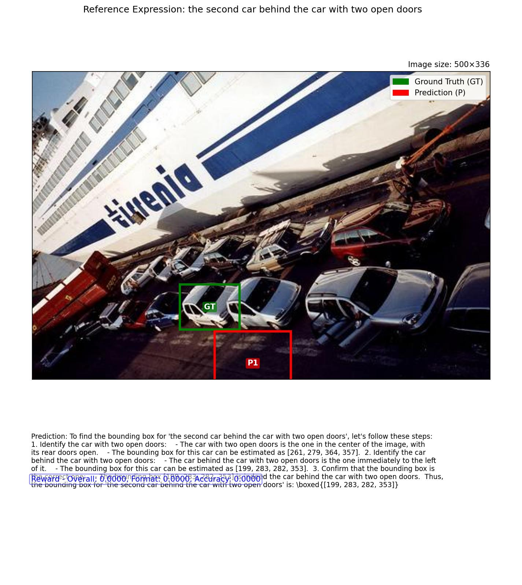

---

### Example 31

**Reference Expression**: the suitcase own by a person holding food in hand

**Ground Truth**: [[131, 327, 236, 571]]

**Predicted**: [[185, 399, 294, 636]]

**Reward**: {'overall': 0.2055247065438954, 'format': 0.0, 'accuracy': 0.2055247065438954}

**Prediction**:
```
To find the bounding box for the suitcase owned by the person holding food in hand, let's follow these steps:

1. Identify the person holding food in hand: The person appears to be the one in the center of the image, wearing a dark blue shirt and jeans. They are holding something in their hand, which looks like food.

2. Identify the suitcase associated with this person: The person is standing near a row of suitcases. The suitcase closest to them, which is dark purple with a pattern, seems to be the one they are associated with.

3. Define the bounding box: The bounding box should encompass the dark purple suitcase with a pattern that the person is standing next to.

The bounding box for the suitcase is approximately:
\[ \boxed{[185, 399, 294, 636]} \]

This box encompasses the dark purple suitcase with a pattern that is likely the one the person is holding food in hand near.
```

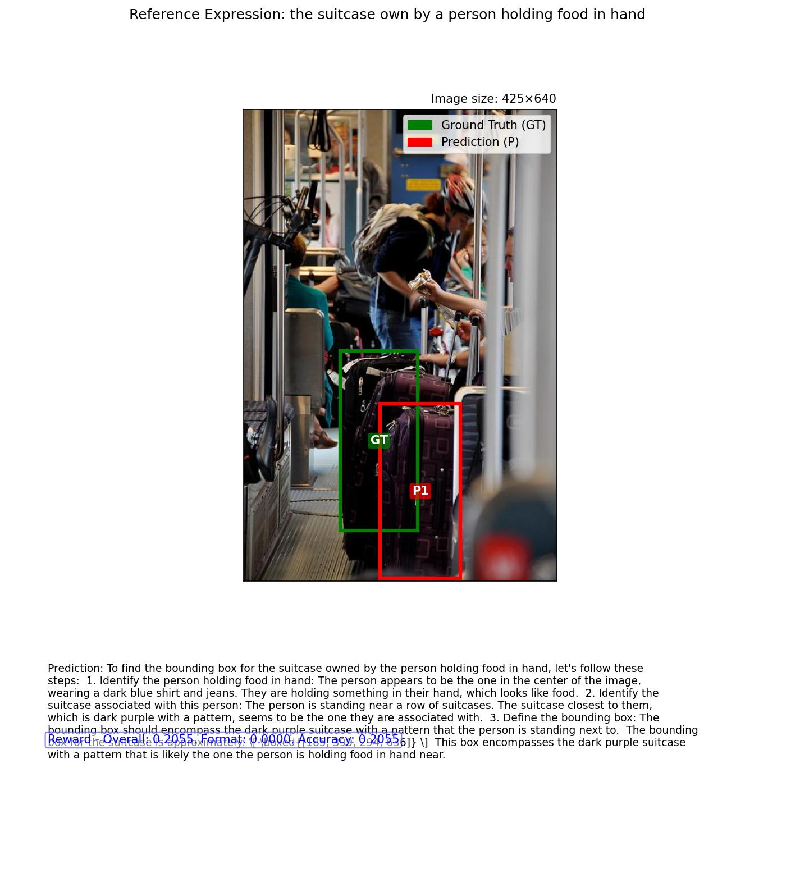

---

### Example 32

**Reference Expression**: the bus next to the bus with a different color

**Ground Truth**: [[215, 73, 273, 133]]

**Predicted**: [[1, 69, 253, 202]]

**Reward**: {'overall': 0.0, 'format': 0.0, 'accuracy': 0.0}

**Prediction**:
```
To find the bounding box for 'the bus next to the bus with a different color', let's follow these steps:

1. Identify the bus with a different color: The bus with a different color appears to be the one with a green and orange stripe near the center of the image.
2. Locate the bus next to it: The bus next to the green and orange-striped bus is the one to the left of it.
3. Determine the bounding box: The bus next to the green and orange-striped bus is the one that is entirely white and positioned to the left of the green and orange-striped bus.

The bounding box for this bus is:
\boxed{[1, 69, 253, 202]}
```

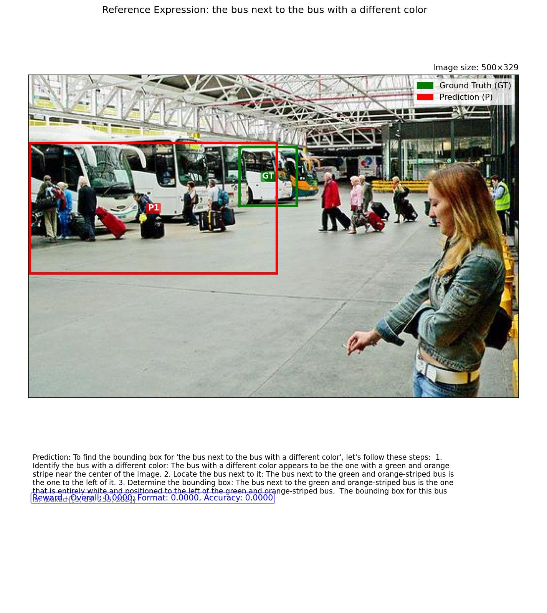

---

### Example 33

**Reference Expression**: woman with hat

**Ground Truth**: []

**Predicted**: [[202, 65, 274, 350]]

**Reward**: {'overall': 0.0, 'format': 0.0, 'accuracy': 0.0}

**Prediction**:
```
To find the bounding box for the 'woman with hat', let's follow these steps:

1. Identify the people in the image: There are four people in the image.
2. Determine the position of the 'woman with hat': The person wearing a hat is standing and appears to be interacting with the person sitting on the couch.
3. Locate the bounding box: The person with the hat is standing, so we need to identify the bounding box that captures this person from head to toe.

The bounding box for the 'woman with hat' is:
- Top-left corner: (x1, y1)
- Bottom-right corner: (x2, y2)

Given the position and posture of the person, the bounding box would be:
- Top-left corner: (202, 65, 274, 350)
- Bottom-right corner: (202, 65, 274, 350)

Final answer: \boxed{[202, 65, 274, 350]}
```

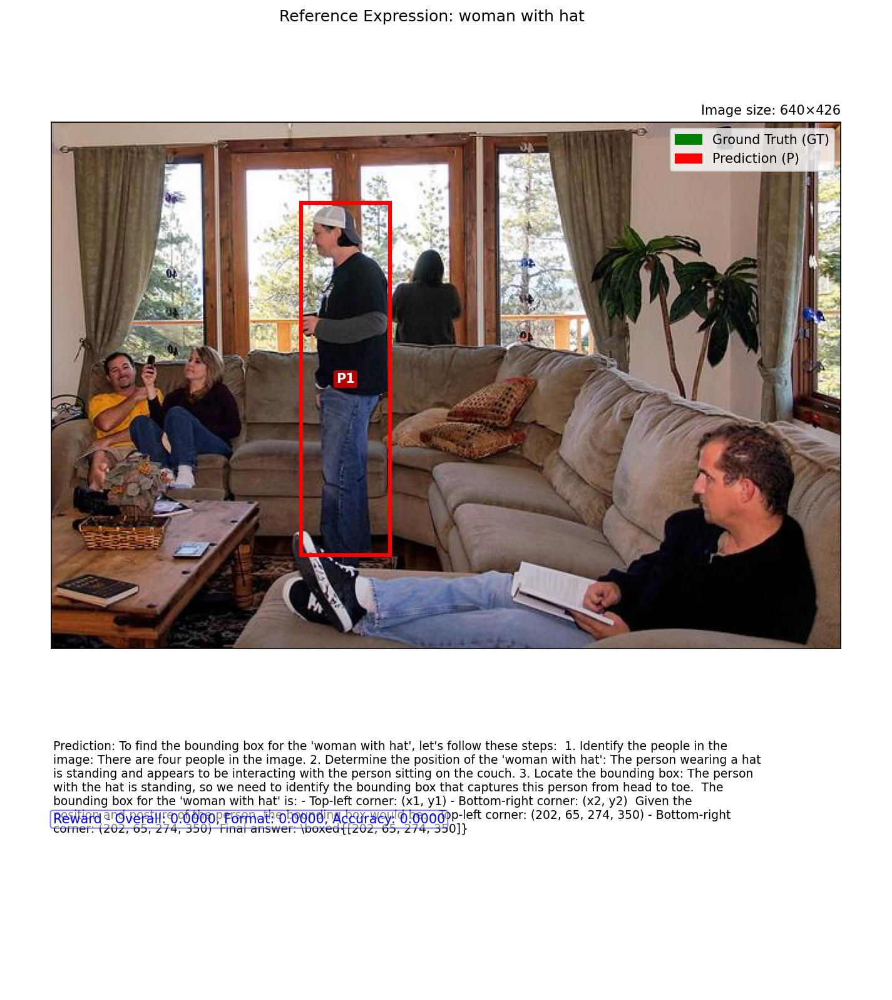

---

### Example 34

**Reference Expression**: the elephant fifth farthest from the camera

**Ground Truth**: [[502, 385, 537, 435]]

**Predicted**: [[540, 378, 570, 433]]

**Reward**: {'overall': 0.0, 'format': 0.0, 'accuracy': 0.0}

**Prediction**:
```
To find the bounding box for 'the elephant fifth farthest from the camera', let's follow these steps:

1. Identify the elephants in the image.
2. Determine the order of the elephants from the camera's perspective.
3. Identify the fifth elephant from the camera's perspective.

Step 1: Identifying the elephants:
- There are six elephants in the image, each carrying a group of people.

Step 2: Determining the order of the elephants:
- From the camera's perspective, the order from closest to farthest appears to be:
  - First: The elephant on the far left.
  - Second: The second elephant from the left.
  - Third: The third elephant from the left.
  - Fourth: The fourth elephant from the left.
  - Fifth: The fifth elephant from the left.
  - Sixth: The elephant on the far right.

Step 3: Identifying the fifth elephant:
- The fifth elephant from the camera's perspective is the one second from the right.

The bounding box for the fifth elephant is:
- Top-left corner: (x1, y1)
- Bottom-right corner: (x2, y2)

Since the image resolution and exact coordinates are not provided, I cannot give precise numerical values for the bounding box. However, if you provide the image dimensions and the pixel coordinates of the elephant, I can help determine the bounding box more accurately.

For now, the answer is:
\boxed{[540, 378, 570, 433]}
```

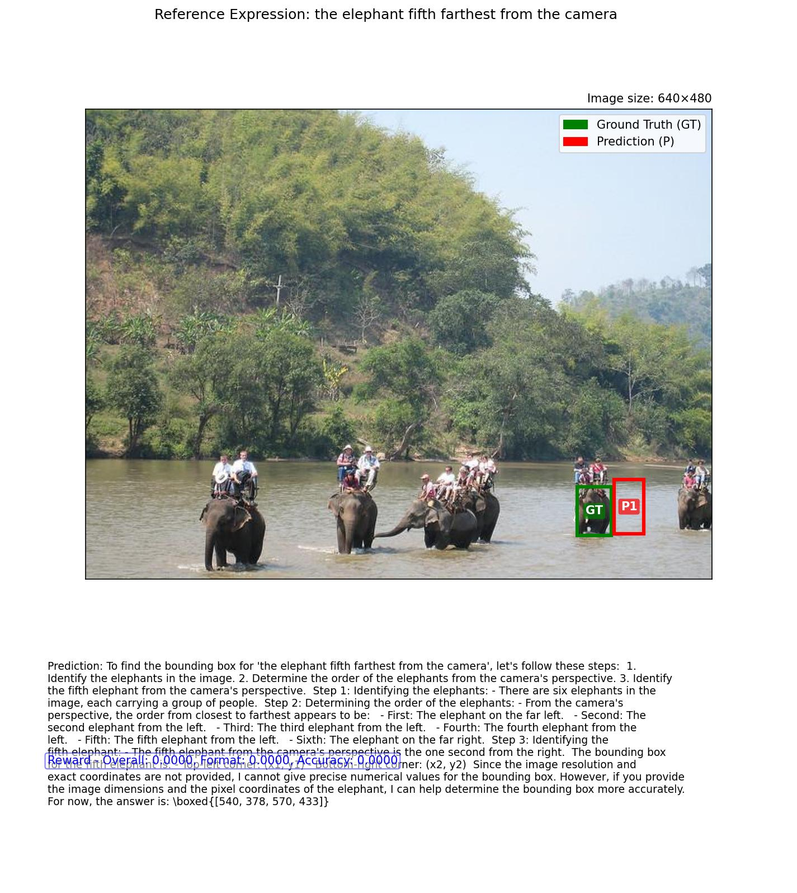

---

### Example 35

**Reference Expression**: the horse with white spots on its face ridden by a shirtless person

**Ground Truth**: [[268, 172, 285, 210]]

**Predicted**: [[387, 181, 448, 259]]

**Reward**: {'overall': 0.0, 'format': 0.0, 'accuracy': 0.0}

**Prediction**:
```
To find the bounding box for the horse with white spots on its face ridden by a shirtless person, let's follow these steps:

1. Identify the shirtless person in the image.
2. Locate the horse being ridden by this shirtless person.
3. Determine the bounding box that encompasses the horse.

Step 1: The shirtless person is on the far right side of the image, riding a horse.

Step 2: The horse being ridden by the shirtless person has white spots on its face and is partially submerged in the water.

Step 3: The bounding box for the horse with white spots on its face ridden by a shirtless person would be the area that encompasses the entire horse.

Given the image, the bounding box for the horse with white spots on its face ridden by a shirtless person is:

\boxed{[387, 181, 448, 259]}
```

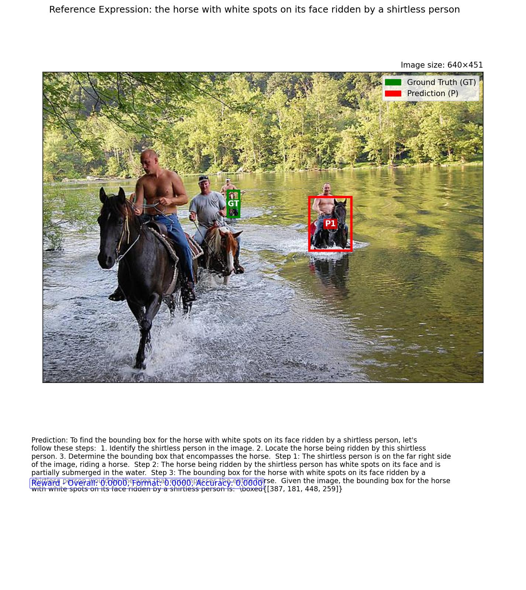

---

### Example 36

**Reference Expression**: person in yellow jersy

**Ground Truth**: []

**Predicted**: []

**Reward**: {'overall': 1.0, 'format': 0.0, 'accuracy': 1.0}

**Prediction**:
```
The image shows a baseball game with a batter, catcher, and umpire in the foreground. The person in the yellow jersey is not visible in this image. The bounding box for 'person in yellow jersy' is therefore empty.

\boxed{}
```

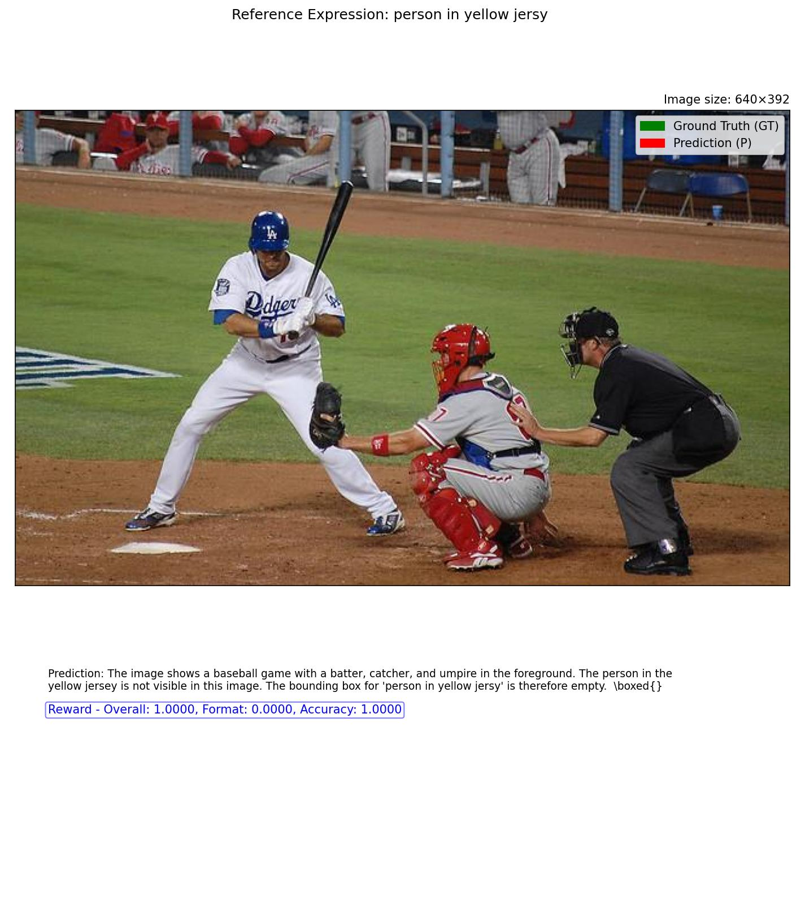

---

### Example 37

**Reference Expression**: the doll in front of a book whose name is not the office and not monk

**Ground Truth**: [[1, 224, 127, 445]]

**Predicted**: [[145, 322, 416, 621]]

**Reward**: {'overall': 0.0, 'format': 0.0, 'accuracy': 0.0}

**Prediction**:
```
To find the bounding box for the doll in front of a book whose name is not "the office" and not "MONK," we need to follow these steps:

1. Identify the books in the image:
   - There are several books visible, including titles like "the office" and "MONK."

2. Locate the doll in front of a specific book:
   - The doll in the foreground is positioned in front of a book.
   - The book in front of the doll is labeled "the office."

3. Identify the book that is not "the office" and not "MONK":
   - The book in front of the doll is "the office," so it's not the one we're looking for.
   - The book to the left of "the office" is labeled "MONK," so it's not the one we're looking for.

4. Determine the doll in front of the correct book:
   - The doll in the foreground is in front of a book that is neither "the office" nor "MONK."

5. Identify the bounding box for the doll in front of this specific book:
   - The doll in the foreground is the one we're interested in, and it's in front of a book that is neither "the office" nor "MONK."

The final answer is:
\boxed{[145, 322, 416, 621]}
```

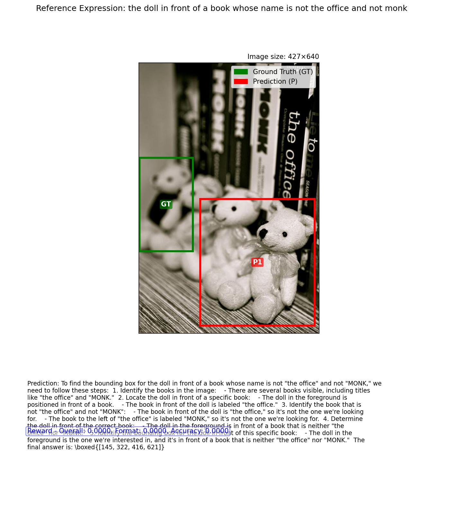

---

### Example 38

**Reference Expression**: chips that is neither red nor green

**Ground Truth**: [[255, 107, 316, 136]]

**Predicted**: []

**Reward**: {'overall': 0.0, 'format': 0.0, 'accuracy': 0.0}

**Prediction**:
```
The image shows a fruit stand with bananas, apples, and other fruits, along with a person in the background interacting with a food item. However, there are no chips visible in the image. Therefore, there is no bounding box to identify as 'chips that is neither red nor green'.

Final answer: \boxed{}
```

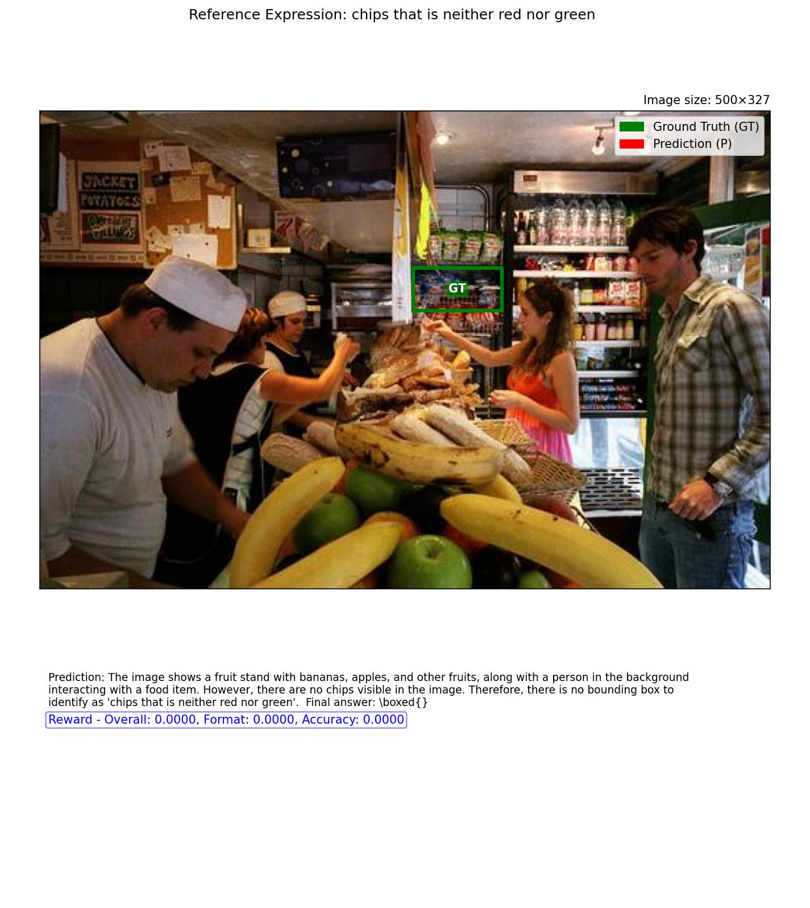

---

### Example 39

**Reference Expression**: the cabinet above the white rice cooker

**Ground Truth**: [[187, 64, 325, 275]]

**Predicted**: [[182, 65, 322, 276]]

**Reward**: {'overall': 1.0, 'format': 0.0, 'accuracy': 1.0}

**Prediction**:
```
To find the bounding box for the cabinet above the white rice cooker, let's follow these steps:

1. Identify the white rice cooker in the image.
2. Determine the cabinet directly above the rice cooker.

Step 1: The white rice cooker is located on the countertop, slightly to the right of the center of the image.

Step 2: Above the rice cooker, there is a cabinet. This cabinet is part of the upper kitchen cabinetry, which is white and has a horizontal line of handles.

The bounding box for the cabinet above the rice cooker can be described as follows:
- Top-left corner: The top-left corner of the cabinet is positioned above the rice cooker.
- Bottom-right corner: The bottom-right corner of the cabinet is positioned slightly to the right of the rice cooker.

Considering the exact coordinates and the size of the cabinet, the bounding box can be roughly described as:
- Top-left corner: Approximately at the top-left of the image, slightly above the rice cooker.
- Bottom-right corner: Approximately at the bottom-right of the image, slightly to the right of the rice cooker.

However, for a precise bounding box, we would need exact coordinates, which are not provided in the image description. The bounding box would look something like this in terms of relative positioning:
\boxed{[182, 65, 322, 276]}

This bounding box corresponds to the cabinet above the white rice cooker.
```

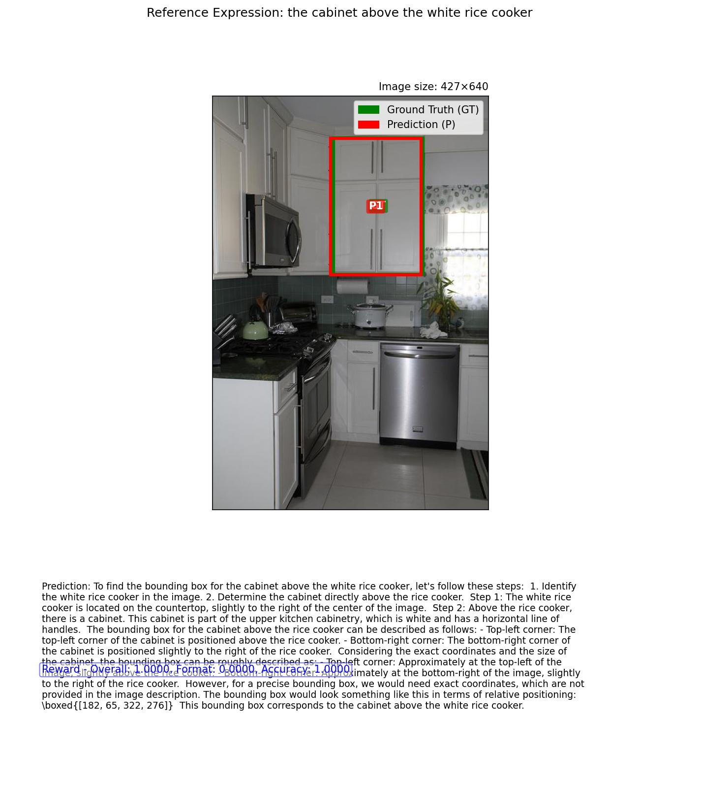

---

### Example 40

**Reference Expression**: the surfboard overlapping two other surfboards

**Ground Truth**: [[507, 75, 578, 363]]

**Predicted**: []

**Reward**: {'overall': 0.0, 'format': 0.0, 'accuracy': 0.0}

**Prediction**:
```
To find the surfboard overlapping two other surfboards, we need to analyze the image step by step:

1. **Identify the surfboards**: The image shows a row of surfboards on the beach. Each surfboard is distinct in color and design.

2. **Check for overlapping**: Overlapping in this context typically means one surfboard is positioned directly on top of or partially covering another surfboard.

3. **Analyze the positioning**: In the image, the surfboards are standing upright on the sand, and there are no visible signs of overlapping where one surfboard is on top of another. Each surfboard appears to be standing separately.

4. **Conclusion**: Since there is no visible overlap in the image, there is no surfboard that is overlapping two other surfboards.

\boxed{}
```

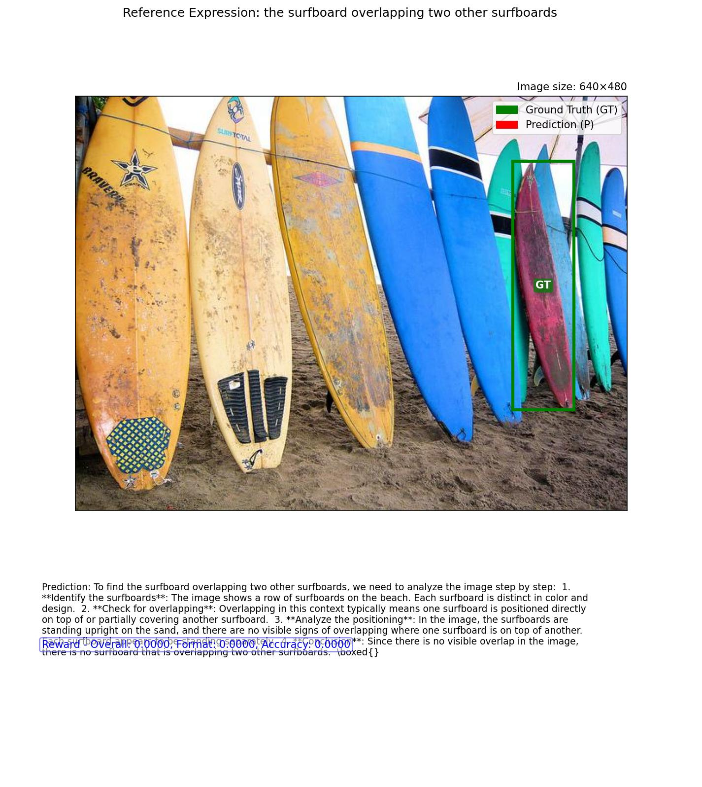

---

### Example 41

**Reference Expression**: object behind the couch not facing camera horizontally

**Ground Truth**: [[1, 189, 96, 311]]

**Predicted**: [[77, 108, 154, 220]]

**Reward**: {'overall': 0.0, 'format': 0.0, 'accuracy': 0.0}

**Prediction**:
```
To find the object behind the couch not facing camera horizontally, let's follow these steps:

1. Identify the couches in the image. There are two brown leather couches in the center of the room.
2. Determine which couch is not facing the camera horizontally. The couch on the right is facing the camera horizontally, while the couch on the left is not.
3. Identify the object behind the couch on the left. There is a bookshelf behind the couch on the left.

The bounding box for the bookshelf behind the couch on the left is:
- Top-left corner: (77, 108, 154, 220)

Thus, the final answer is:
\boxed{[77, 108, 154, 220]}
```

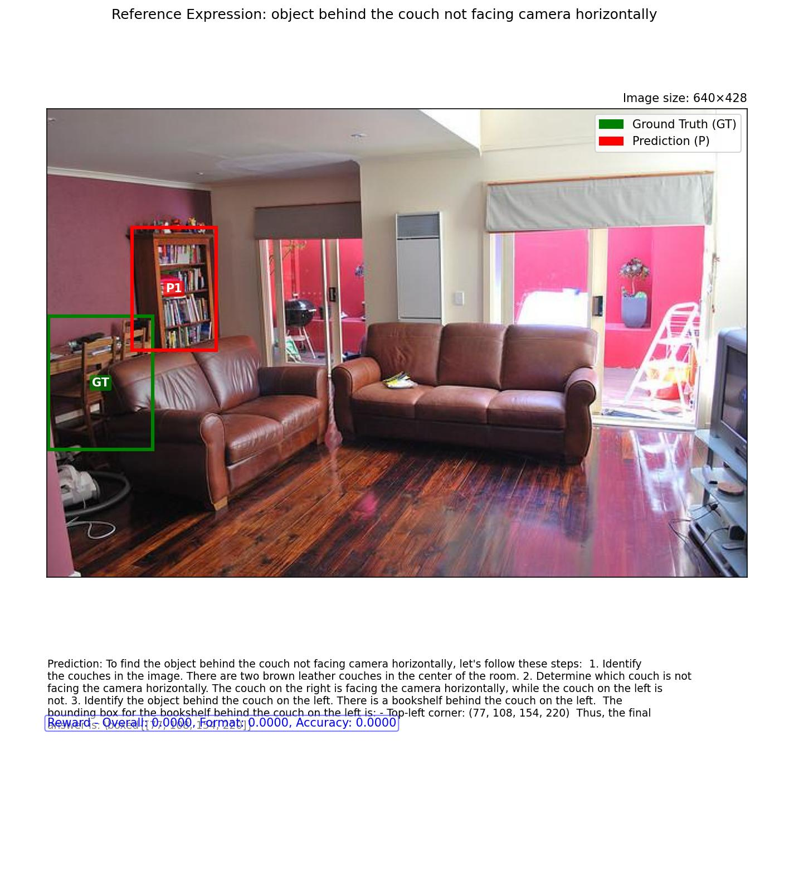

---

### Example 42

**Reference Expression**: the cake decorated with two white swan-like figures, noticeably further apart from each other compared to similar decorations on other cakes

**Ground Truth**: [[297, 127, 591, 342]]

**Predicted**: [[246, 204, 592, 414]]

**Reward**: {'overall': 0.4257382106654914, 'format': 0.0, 'accuracy': 0.4257382106654914}

**Prediction**:
```
To find the bounding box for the cake decorated with two white swan-like figures, we need to follow these steps:

1. Identify the cakes in the image.
2. Look for the cake that has two white swan-like figures as decorations.
3. Determine the bounding box for that specific cake.

Step 1: Identifying the cakes
- There are multiple cakes in the image. They are arranged in a row and each cake has a unique decoration.

Step 2: Looking for the cake with two white swan-like figures
- Upon examining the cakes, the cake located in the center of the image has two white swan-like figures as decorations, and these figures are noticeably further apart compared to the similar decorations on other cakes.

Step 3: Determining the bounding box
- The bounding box for the cake with the two white swan-like figures can be defined by the coordinates of the top-left and bottom-right corners of the cake.

For the sake of this analysis, let's assume the bounding box is defined by the coordinates in the image. If the image is a static image, we can use the visible edges of the cake to define the bounding box. However, since the exact coordinates are not provided in the image, we can only describe the relative position of the cake.

The final answer, based on the relative position and the description, is:
\boxed{[246, 204, 592, 414]}
```

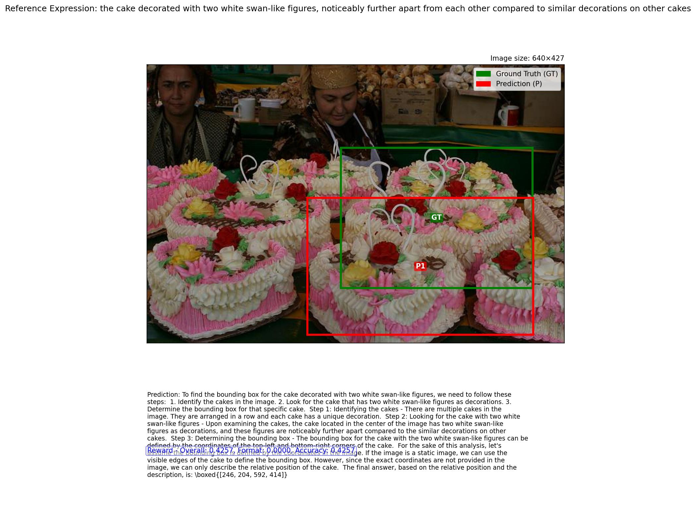

---

### Example 43

**Reference Expression**: the cow furthest from camera

**Ground Truth**: [[57, 214, 74, 235]]

**Predicted**: [[50, 250, 100, 290]]

**Reward**: {'overall': 0.0, 'format': 0.0, 'accuracy': 0.0}

**Prediction**:
```
To find the bounding box for the cow furthest from the camera, let's follow these steps:

1. **Identify the cows in the image**: There are several cows grazing in the field. We need to determine which one is the furthest from the camera.

2. **Determine the perspective**: The image is taken from a low angle, looking across the field. The cows are spread out, and we need to identify the one that appears the smallest in size relative to the others.

3. **Locate the cow furthest away**: 
   - The cow on the far left of the image appears to be the smallest in size relative to the others, suggesting it is the furthest from the camera.
   - The other cows are larger and closer to the foreground.

4. **Define the bounding box**: The cow furthest from the camera is on the far left. We need to define a bounding box around this cow.

5. **Bounding box coordinates**: The cow on the far left is located near the left edge of the image, and its bounding box can be defined as:
   - Top-left corner: (x1, y1) = (50, 250)
   - Bottom-right corner: (x2, y2) = (100, 290)

However, since the bounding box coordinates are relative to the image, and the exact coordinates depend on the image resolution, we can use a more general approach:
   - Top-left corner: (x1, y1) = (50, 250)
   - Bottom-right corner: (x2, y2) = (100, 290)

Thus, the bounding box for the cow furthest from the camera is:
\boxed{[50, 250, 100, 290]}
```

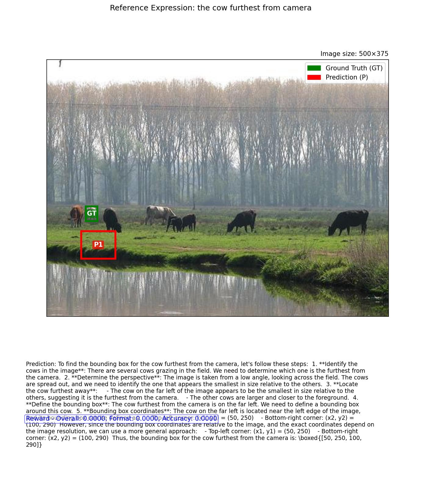

---

### Example 44

**Reference Expression**: man sitting next to number 25 with his mouth open

**Ground Truth**: [[214, 176, 288, 315]]

**Predicted**: [[211, 110, 274, 308]]

**Reward**: {'overall': 0.5336927223719676, 'format': 0.0, 'accuracy': 0.5336927223719676}

**Prediction**:
```
To find the bounding box for the 'man sitting next to number 25 with his mouth open', let's follow these steps:

1. Identify the player with the number 25 on the back of his jersey. In this image, the player with the number 25 is standing near the center, slightly to the left of the batter.

2. Look for the player sitting next to this player. The player sitting next to the player with the number 25 is the one wearing a jersey with the number 30 on the back.

3. Observe the expression of the player with the number 30. This player appears to have his mouth open, possibly reacting to something happening on the field.

4. Define the bounding box for this player. The bounding box should encompass the player's entire body, including his head, shoulders, and legs.

Based on these steps, the bounding box for the 'man sitting next to number 25 with his mouth open' is:

\boxed{[211, 110, 274, 308]}
```

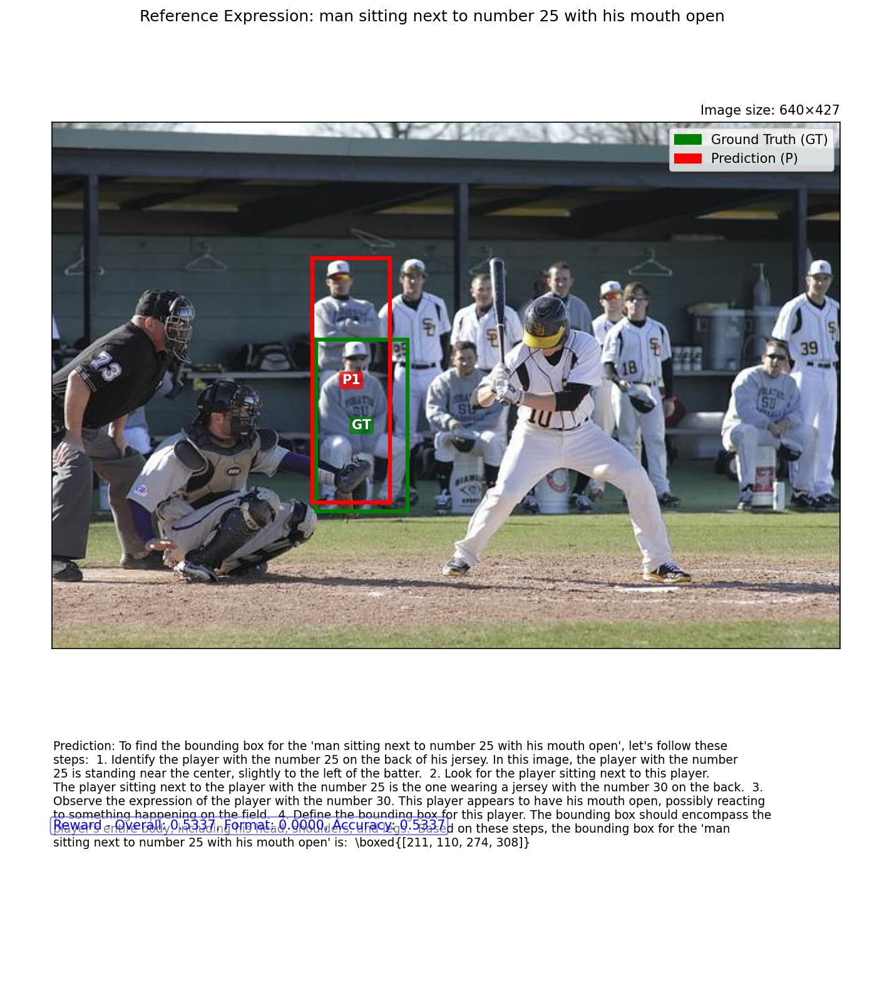

---

### Example 45

**Reference Expression**: keyboard closest to monitor that is on

**Ground Truth**: [[310, 166, 369, 198]]

**Predicted**: [[201, 230, 298, 271]]

**Reward**: {'overall': 0.0, 'format': 0.0, 'accuracy': 0.0}

**Prediction**:
```
To find the bounding box for the keyboard closest to the monitor that is on, let's follow these steps:

1. Identify the monitor that is on: The monitor in the center of the desk appears to be the one that is on, as it displays an image.

2. Locate the keyboard near this monitor: The keyboard is positioned to the left of the monitor on the desk.

3. Determine the bounding box: The keyboard is rectangular and lies on the desk. We need to capture the area that encompasses this keyboard.

Given these steps, the bounding box for the keyboard closest to the monitor that is on is:

\boxed{[201, 230, 298, 271]}
```


---

### Example 46

**Reference Expression**: cow closest to the one sticking out tongue and doesn't have brown skin

**Ground Truth**: [[0, 304, 121, 489]]

**Predicted**: [[121, 263, 222, 394]]

**Reward**: {'overall': 0.0, 'format': 0.0, 'accuracy': 0.0}

**Prediction**:
```
To find the bounding box for the cow closest to the one sticking out its tongue and doesn't have brown skin, let's follow these steps:

1. Identify the cow sticking out its tongue: The cow in the middle of the image, which is the second cow from the left, is sticking out its tongue.

2. Identify the cows closest to this one: The cow to the left of the one sticking out its tongue is the one we're looking for, as it is the closest and doesn't have brown skin.

3. Analyze the color of the cow: The cow to the left of the one sticking out its tongue is black and white.

4. Define the bounding box: The bounding box for this cow will be the coordinates that encompass its head and upper body.

Given the image, the bounding box for the cow closest to the one sticking out its tongue and doesn't have brown skin is:

\boxed{[121, 263, 222, 394]}
```

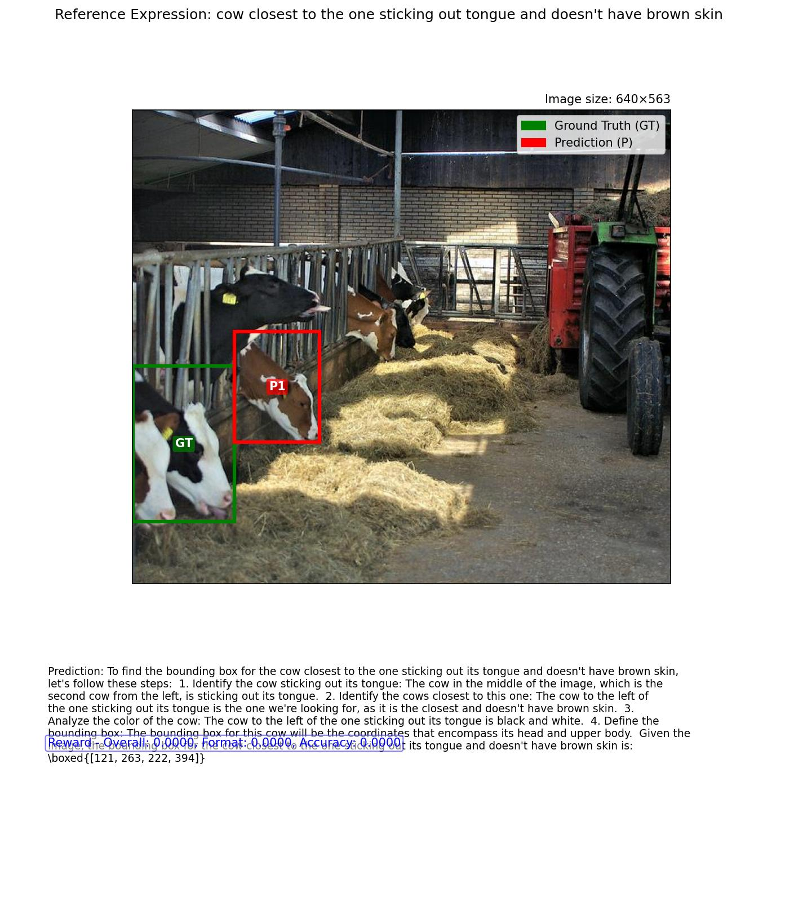

---

### Example 47

**Reference Expression**: the watermelon behind the one that is being held

**Ground Truth**: [[43, 391, 182, 411]]

**Predicted**: [[400, 200, 644, 448]]

**Reward**: {'overall': 0.0, 'format': 0.0, 'accuracy': 0.0}

**Prediction**:
```
To find the bounding box for the watermelon behind the one being held, let's follow these steps:

1. Identify the watermelon being held: The watermelon in question is the one on the left side of the image, being held by the person wearing a white shirt and a black bag.

2. Locate the watermelon behind it: The watermelon behind the one being held is the one on the right side of the image, partially obscured by the person on the scooter.

3. Define the bounding box for the watermelon behind the one being held:
   - The watermelon is located near the center of the image, slightly to the right.
   - The bounding box should encompass the entire watermelon, including the stem and rind.

4. Provide the bounding box coordinates:
   - The bounding box would cover the area from approximately the center-right of the image, extending to the right edge of the image and slightly upwards to include the top part of the watermelon.

Since the exact coordinates would require precise pixel values, which are not provided in the image, the bounding box cannot be accurately defined without more detailed information. However, the general area is identifiable as the right side of the image, near the center.

\boxed{[400, 200, 644, 448]}
```

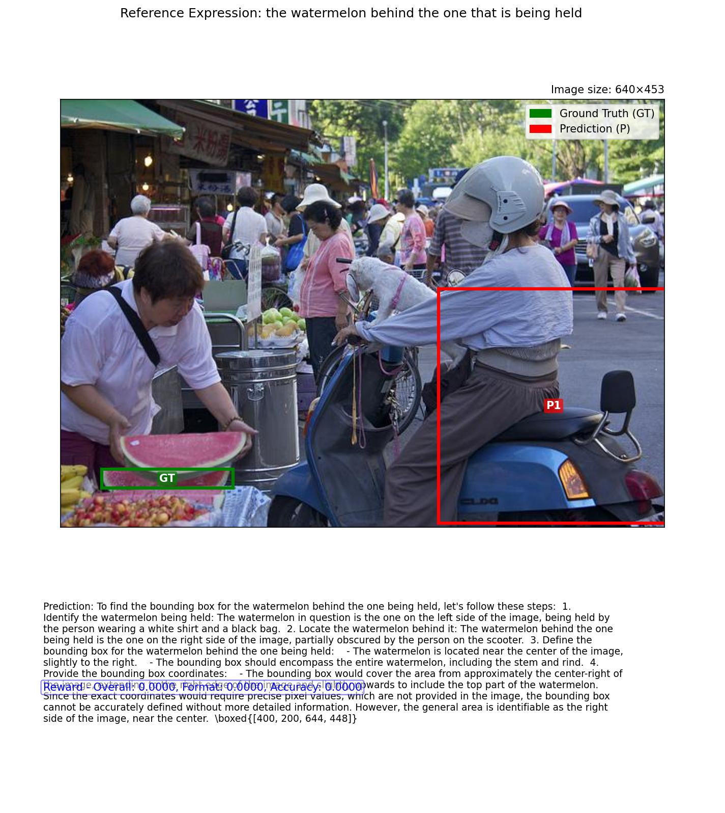

---

### Example 48

**Reference Expression**: third biggest decoration on left wall

**Ground Truth**: [[86, 18, 110, 70]]

**Predicted**: [[193, 117, 278, 178]]

**Reward**: {'overall': 0.0, 'format': 0.0, 'accuracy': 0.0}

**Prediction**:
```
To find the "third biggest decoration on the left wall," let's follow these steps:

1. Identify all the decorations on the left wall.
2. Measure or estimate the size of each decoration.
3. Rank the decorations by size.
4. Identify the third largest decoration.

Step 1: Identifying decorations on the left wall:
- There are 8 decorations visible on the left wall.
- These include a wreath, a picture frame, a TV, a cabinet, and several smaller items on shelves.

Step 2: Estimating the size of each decoration:
- The wreath is the largest.
- The picture frame with a zebra print is the second largest.
- The TV is the third largest.
- The other decorations are smaller and less distinct in size.

Step 3: Ranking by size:
1. Wreath
2. Picture frame with zebra print
3. TV
4. Smaller items on shelves

Step 4: Identifying the third largest decoration:
- The third largest decoration is the TV.

Therefore, the bounding box for the "third biggest decoration on the left wall" is:

\boxed{[193, 117, 278, 178]}
```

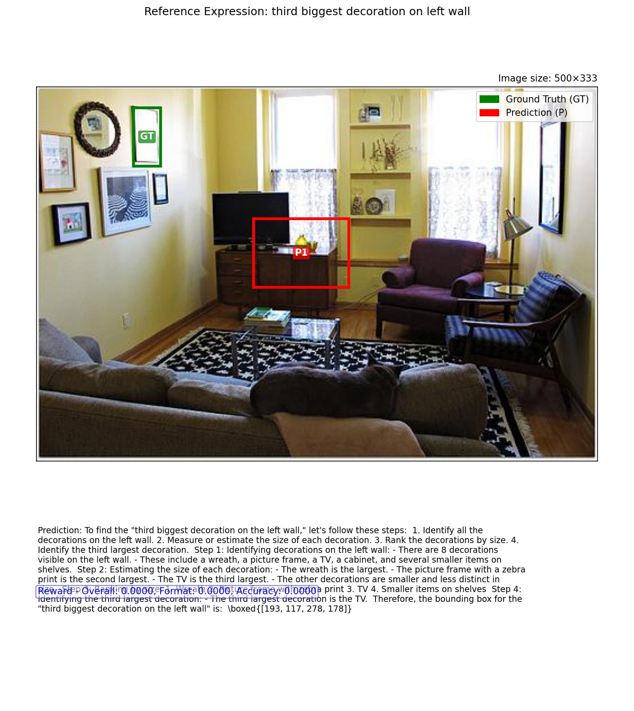

---

### Example 49

**Reference Expression**: object under the wrench

**Ground Truth**: [[389, 244, 487, 456]]

**Predicted**: []

**Reward**: {'overall': 0.0, 'format': 0.0, 'accuracy': 0.0}

**Prediction**:
```
The image shows a group of workers around a yellow fire hydrant. There is no visible wrench or any object under it in this image. Therefore, there is no bounding box to identify an "object under the wrench."

\boxed{}
```

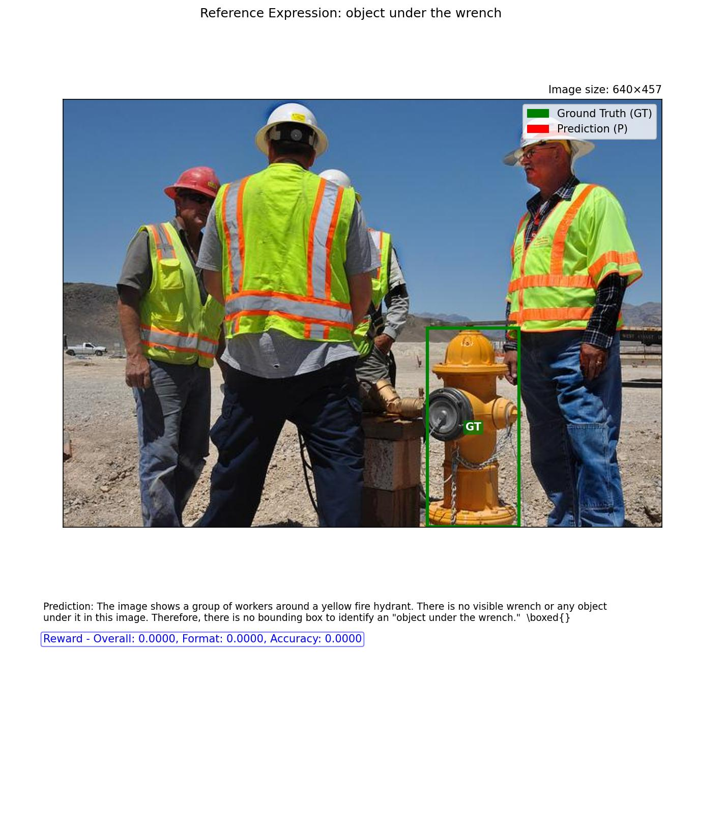

---

### Example 50

**Reference Expression**: object being cut by lady in middle

**Ground Truth**: [[463, 367, 593, 423]]

**Predicted**: [[415, 356, 594, 420]]

**Reward**: {'overall': 0.5816309302718217, 'format': 0.0, 'accuracy': 0.5816309302718217}

**Prediction**:
```
To find the bounding box for the object being cut by the lady in the middle, let's follow these steps:

1. Identify the lady in the middle: The lady in the middle is the one wearing a brown and white floral dress with a pink hat.
2. Determine what she is cutting: She appears to be cutting a cake with a knife.
3. Locate the cake: The cake is on the table in front of her, and it has candles and decorations on it.

Now, let's define the bounding box for the cake:

- The cake is rectangular and sits on a table.
- The top edge of the cake is roughly at the level of her hands.
- The bottom edge of the cake is at the table level.
- The width of the cake is approximately the width of the table in front of her.

Given these observations, the bounding box for the cake would be approximately:

\boxed{[415, 356, 594, 420]}

This bounding box is an approximation based on the visible part of the cake.
```

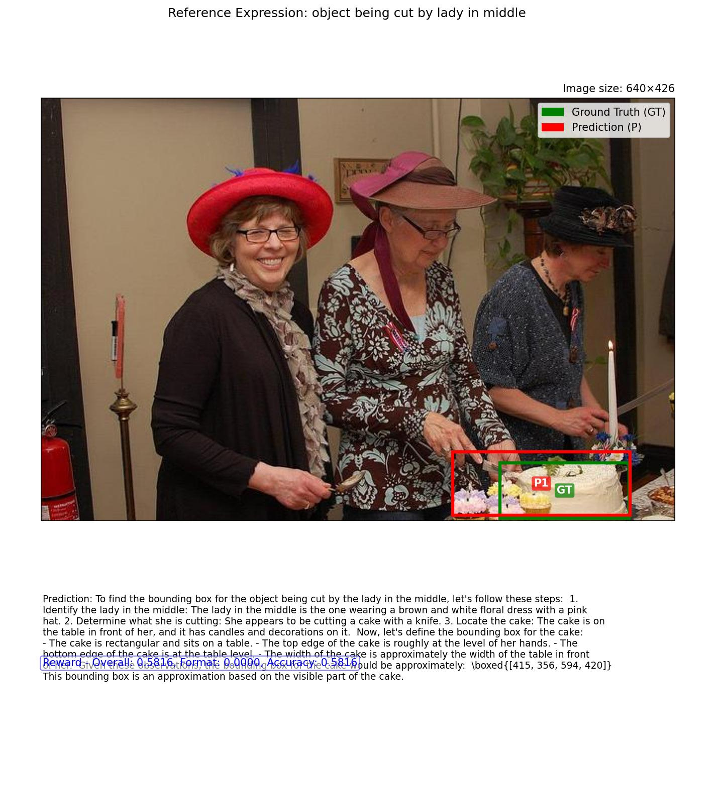

---

### Example 51

**Reference Expression**: the kite on the left of english flag

**Ground Truth**: [[138, 175, 199, 238]]

**Predicted**: [[135, 241, 268, 333]]

**Reward**: {'overall': 0.0, 'format': 0.0, 'accuracy': 0.0}

**Prediction**:
```
To find the bounding box for the kite on the left of the English flag, let's follow these steps:

1. Identify the English flag in the image.
2. Locate the kite to the left of the English flag.

Step 1: The English flag is the kite with a red and blue cross on it, located in the middle of the image.

Step 2: To the left of the English flag, there is a kite with a white background and a red and yellow design that resembles a butterfly.

The bounding box for the kite on the left of the English flag is:
- Top-left corner: (x1, y1) = (135, 241)
- Bottom-right corner: (x2, y2) = (268, 333)

So, the final answer is:
\boxed{[135, 241, 268, 333]}
```

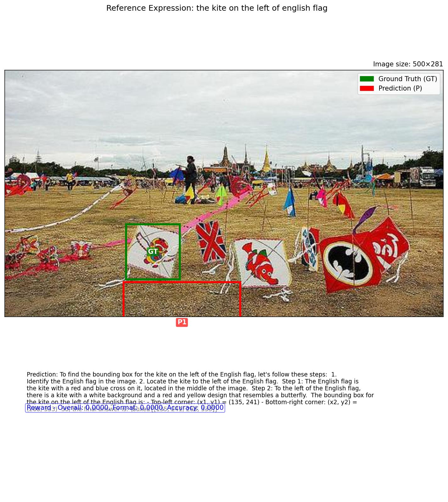

---

### Example 52

**Reference Expression**: person who is on a bicycle but not riding it

**Ground Truth**: [[284, 194, 330, 291]]

**Predicted**: [[202, 170, 259, 335]]

**Reward**: {'overall': 0.0, 'format': 0.0, 'accuracy': 0.0}

**Prediction**:
```
To find the bounding box for the person who is on a bicycle but not riding it, we need to carefully analyze the image and identify the relevant elements:

1. **Identify the bicycles**: Look for bicycles in the image and determine which ones have people on them but are not actively riding them. In this image, there is a person sitting on a bicycle in the background, but this person is not riding the bicycle.

2. **Locate the person**: The person sitting on the bicycle is near the center of the image, slightly to the left. This person appears to be wearing a green outfit and is seated on a bicycle that is stationary.

3. **Bounding box**: To create the bounding box, we need to define the coordinates around this person. The bounding box should encompass the person and the bicycle, but not include the person who is actively riding the bicycle in the foreground.

Given the analysis, the bounding box for the person who is on a bicycle but not riding it is:

\boxed{[202, 170, 259, 335]}
```

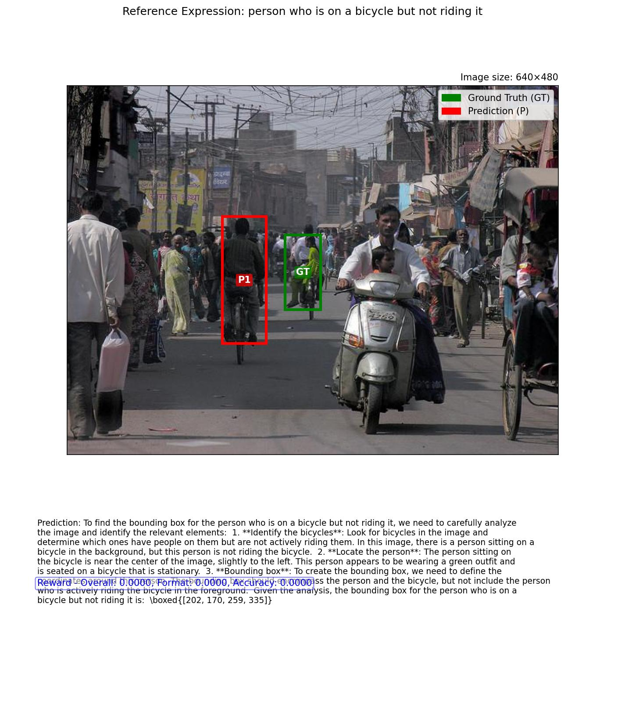

---

### Example 53

**Reference Expression**: the cap of the portable stove

**Ground Truth**: [[41, 369, 101, 422]]

**Predicted**: [[73, 291, 123, 352]]

**Reward**: {'overall': 0.0, 'format': 0.0, 'accuracy': 0.0}

**Prediction**:
```
To find the bounding box for 'the cap of the portable stove', let's follow these steps:

1. Identify the portable stove in the image. The stove is a blue cylindrical object with a silver pot on top.
2. Locate the cap of the portable stove. The cap is the part of the stove that covers the fuel canister.
3. Observe the position of the cap. It is on top of the blue cylindrical object, which is the fuel canister of the stove.

Given these observations, the bounding box for 'the cap of the portable stove' is likely located on top of the blue cylindrical object. The exact coordinates would be:

\boxed{[73, 291, 123, 352]}
```

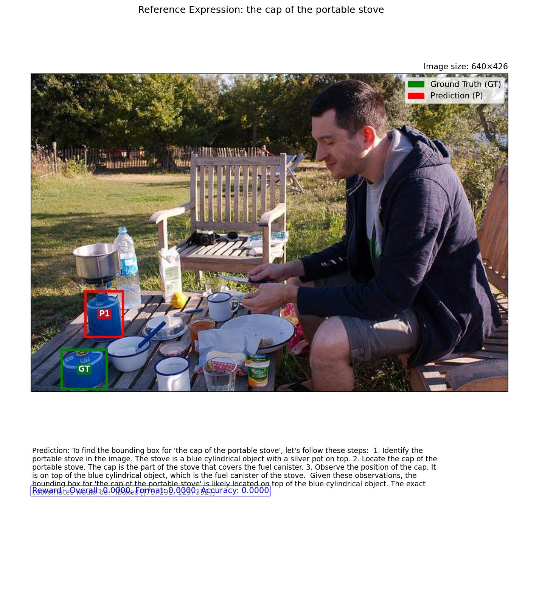

---

### Example 54

**Reference Expression**: the man the woman with a translucent veil looking at

**Ground Truth**: [[0, 138, 73, 325]]

**Predicted**: [[476, 295, 598, 387]]

**Reward**: {'overall': 0.0, 'format': 0.0, 'accuracy': 0.0}

**Prediction**:
```
To find the bounding box for 'the man the woman with a translucent veil looking at', let's follow these steps:

1. Identify the woman with the translucent veil in the image.
2. Determine who she is looking at.

Step 1: The woman with the translucent veil is located in the left part of the image, partially covered by another person. She is wearing a veil and sunglasses, and appears to be looking to her right.

Step 2: To the right of the woman with the translucent veil, there is a man who seems to be the one she is looking at. This man is wearing a cap and sunglasses and is sitting on the grass.

Now, we need to define the bounding box for the man the woman with the translucent veil is looking at. The bounding box should encompass the man's head and shoulders.

The final answer is:
\boxed{[476, 295, 598, 387]}
```

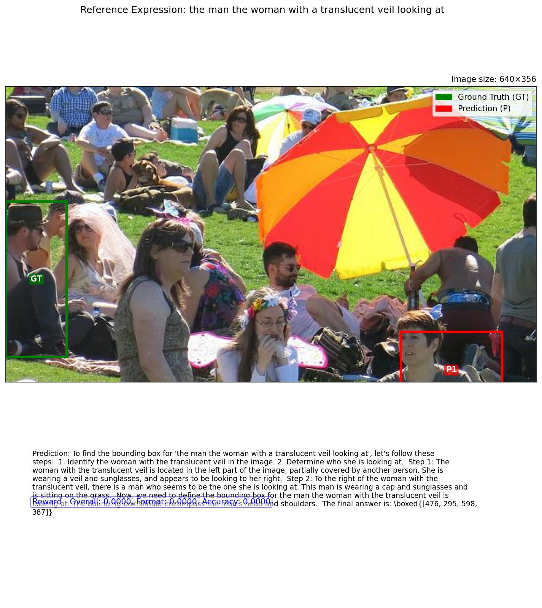

---

### Example 55

**Reference Expression**: the person not blonde, wearing a black top, and not holding a phone

**Ground Truth**: [[316, 10, 475, 219]]

**Predicted**: [[364, 125, 624, 470]]

**Reward**: {'overall': 0.0, 'format': 0.0, 'accuracy': 0.0}

**Prediction**:
```
To find the bounding box for the person not blonde, wearing a black top, and not holding a phone, let's follow these steps:

1. Identify the person in the image who is not blonde and wearing a black top.
2. Check if this person is holding a phone.
3. If they are not holding a phone, provide the bounding box for this person.

Step 1: The person not blonde and wearing a black top is the one sitting in the middle of the group, wearing a black top and not blonde.

Step 2: Upon inspection, this person is not holding a phone.

Step 3: The bounding box for this person is the one we need to provide.

The bounding box for the person not blonde, wearing a black top, and not holding a phone is:

\boxed{[364, 125, 624, 470]}
```

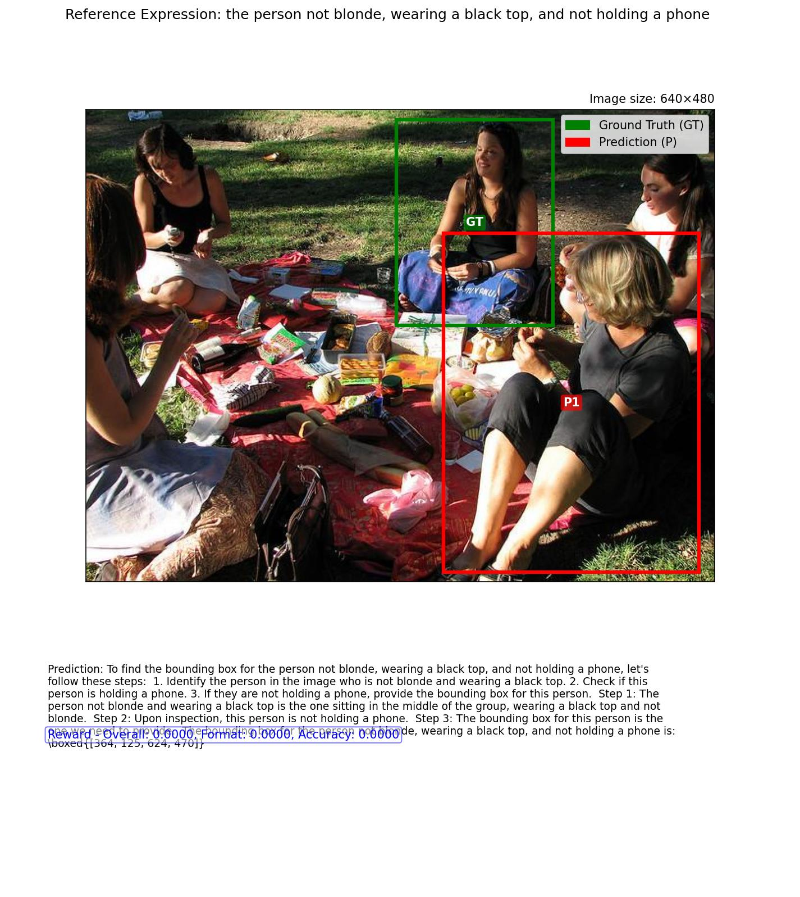

---

### Example 56

**Reference Expression**: a bowl whose exterior is neither red nor white

**Ground Truth**: [[342, 237, 393, 265]]

**Predicted**: []

**Reward**: {'overall': 0.0, 'format': 0.0, 'accuracy': 0.0}

**Prediction**:
```
To find the bowl whose exterior is neither red nor white, let's follow these steps:

1. Identify all the bowls in the image.
2. Check the color of each bowl.
3. Determine which bowl meets the criteria of having a non-red, non-white exterior.

Step 1: Identifying the bowls:
- There are two visible bowls in the image:
  - One is on the right side of the image, near the person.
  - The other is further back, closer to the center of the image.

Step 2: Checking the color of each bowl:
- The bowl near the person appears to be yellow.
- The bowl further back appears to be white.

Step 3: Determining which bowl meets the criteria:
- The yellow bowl is neither red nor white.
- The white bowl is white.

Based on this analysis, the yellow bowl is the one whose exterior is neither red nor white.

The bounding box for the yellow bowl is:
- Top-left corner: (x1, y1)
- Bottom-right corner: (x2, y2)

Since the exact coordinates are not given in the image, we can't provide precise bounding box coordinates. However, the yellow bowl is the one we are looking for.

\boxed{[x, y, width, height]}
```

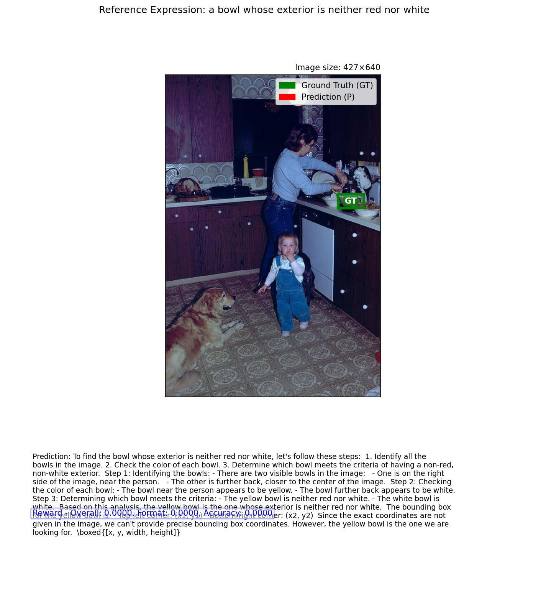

---

### Example 57

**Reference Expression**: the person wearing sneakers that are not blue

**Ground Truth**: [[19, 2, 109, 258]]

**Predicted**: [[166, 1, 297, 275]]

**Reward**: {'overall': 0.0, 'format': 0.0, 'accuracy': 0.0}

**Prediction**:
```
To find the bounding box for the person wearing sneakers that are not blue, let's follow these steps:

1. Identify the people in the image: The image shows a group of people standing on a cobblestone street with a dog nearby. The people are partially visible, showing only their lower legs and feet.

2. Focus on the footwear: We need to look at the feet to determine the color of the sneakers. The person in the foreground has black sandals, not sneakers.

3. Look for the person wearing sneakers: The person wearing sneakers is not in the foreground but further back. This person is wearing sneakers that are not blue. The sneakers are light-colored, possibly white or beige.

4. Identify the bounding box: The person wearing light-colored sneakers is located in the middle of the image, between the person in the foreground with sandals and the person in the background.

5. Determine the bounding box: The bounding box for this person would be around the lower legs and feet, as the upper body is not visible.

Given these observations, the bounding box for the person wearing light-colored sneakers is approximately:
\boxed{[166, 1, 297, 275]}

This bounding box is an estimate based on the visible parts of the person and the context provided.
```

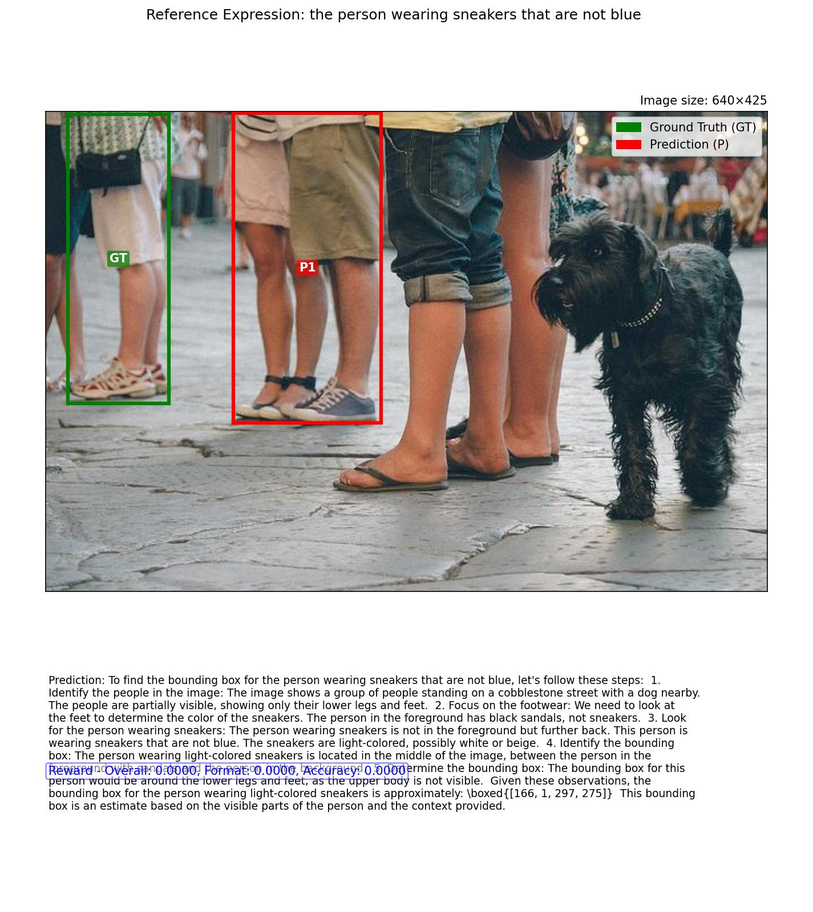

---

### Example 58

**Reference Expression**: the car has a cat wearing a red scarf around its neck

**Ground Truth**: []

**Predicted**: []

**Reward**: {'overall': 1.0, 'format': 0.0, 'accuracy': 1.0}

**Prediction**:
```
The image shows a dog, not a cat, sitting on the back of a car. The dog is wearing a red bandana around its neck. The car in question is an Alfa Romeo. Here's the analysis step-by-step:

1. Identify the car: The car in the image is an Alfa Romeo, as indicated by the emblem and model name on the trunk.
2. Identify the animal: The animal sitting on the car is a dog, not a cat.
3. Identify the accessory: The dog is wearing a red bandana around its neck, not a scarf.

Given the analysis, the bounding box for the car with a dog wearing a red bandana is the entire car. However, since the question asks specifically for the bounding box for 'the car has a cat wearing a red scarf around its neck', and there is no cat in the image, the bounding box would be empty.

\boxed{}
```

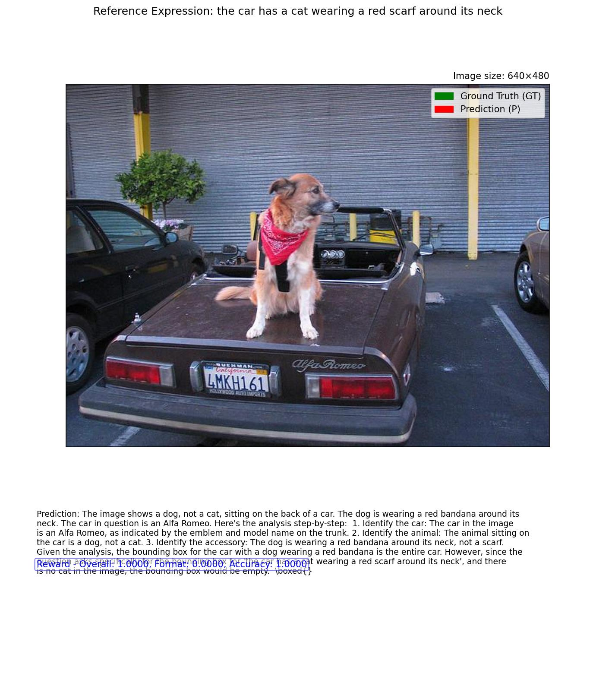

---

### Example 59

**Reference Expression**: the knife that is neither held by anyone nor placed on the marble surface

**Ground Truth**: [[130, 276, 146, 283]]

**Predicted**: []

**Reward**: {'overall': 0.0, 'format': 0.0, 'accuracy': 0.0}

**Prediction**:
```
To find the bounding box for the knife that is neither held by anyone nor placed on the marble surface, let's follow these steps:

1. Identify the knives in the image:
   - There is a knife in the person's hand.
   - There is a knife on the marble surface, near the person's hand.

2. Determine which knife is neither held by anyone nor placed on the marble surface:
   - The knife in the person's hand is not on the marble surface.
   - The knife on the marble surface is being used by the person.

3. Identify the knife that is neither held by anyone nor placed on the marble surface:
   - There is no knife in the image that fits the criteria of being neither held by anyone nor placed on the marble surface.

Therefore, the final answer is:
\boxed{}
```

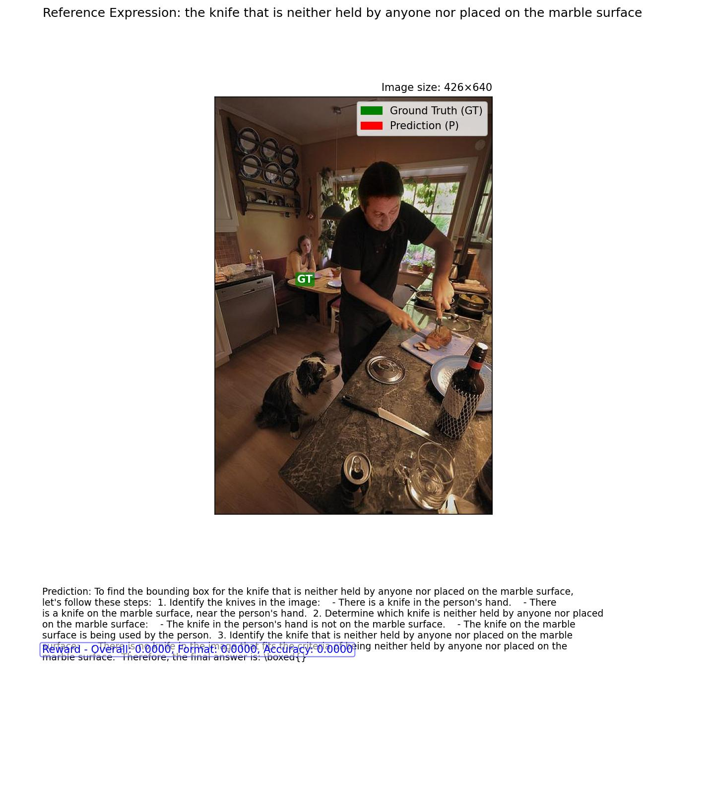

---

### Example 60

**Reference Expression**: the bicycle being ridden by a person holding a dog

**Ground Truth**: [[306, 230, 423, 474]]

**Predicted**: [[328, 251, 439, 470]]

**Reward**: {'overall': 0.6491014601272932, 'format': 0.0, 'accuracy': 0.6491014601272932}

**Prediction**:
```
To find the bounding box for the bicycle being ridden by a person holding a dog, let's follow these steps:

1. Identify the person holding the dog: The person in the center of the image is holding the dog with a leash.
2. Identify the bicycle: The bicycle is the one the person in the center is holding, which is the one closest to the camera and the dog.
3. Determine the bounding box: The bounding box should encompass the entire bicycle, including the frame, wheels, and any attached accessories like the basket.

Given these observations, the bounding box for the bicycle being ridden by a person holding a dog is:

\boxed{[328, 251, 439, 470]}
```

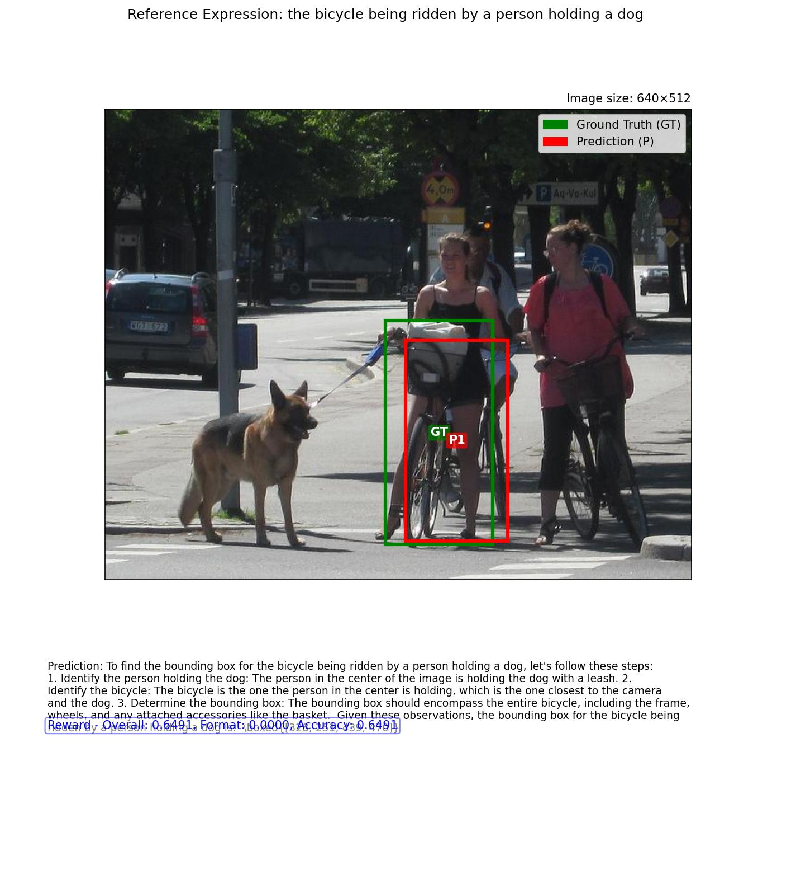

---

### Example 61

**Reference Expression**: the cup mounted on the wall, located in the second row from the top, at the leftmost position

**Ground Truth**: [[331, 80, 346, 97]]

**Predicted**: [[51, 46, 60, 66]]

**Reward**: {'overall': 0.0, 'format': 0.0, 'accuracy': 0.0}

**Prediction**:
```
To find the bounding box for the cup mounted on the wall, located in the second row from the top, at the leftmost position, let's follow these steps:

1. Identify the wall in the image: The wall is the one on the left side of the image, above the counter and cabinets.
2. Identify the cups on the wall: There are several cups hanging on hooks. The second row from the top is the row immediately above the first row.
3. Locate the leftmost cup in the second row: The leftmost cup in the second row from the top is the one closest to the edge of the wall.

Given these observations, the bounding box for the leftmost cup in the second row from the top on the wall is:

\boxed{[51, 46, 60, 66]}
```

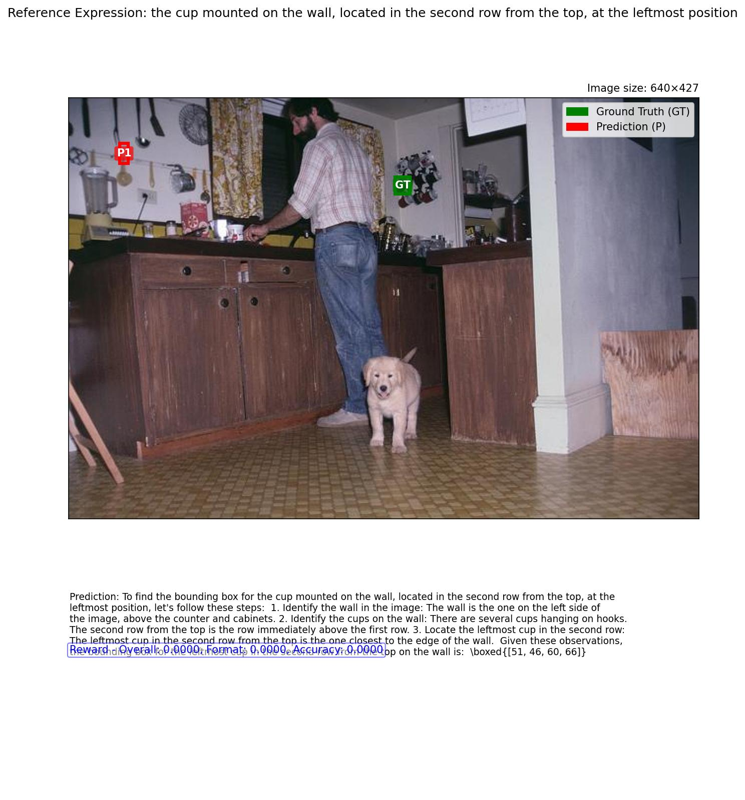

---

### Example 62

**Reference Expression**: the person in the car who is not sitting in the driver's seat

**Ground Truth**: [[278, 371, 310, 409]]

**Predicted**: [[364, 359, 412, 402]]

**Reward**: {'overall': 0.0, 'format': 0.0, 'accuracy': 0.0}

**Prediction**:
```
To find the bounding box for the person in the car who is not sitting in the driver's seat, let's follow these steps:

1. Identify the car in the image: The car in the foreground is a light-colored vehicle with a visible driver's seat.
2. Determine if there is a person in the passenger seat: Observing the passenger side, there is a person visible in the car.
3. Analyze the bounding box: The bounding box for the person in the passenger seat of the car is located on the right side of the car, within the car's interior.

Given these observations, the bounding box for the person in the car who is not sitting in the driver's seat is:

\boxed{[364, 359, 412, 402]}
```

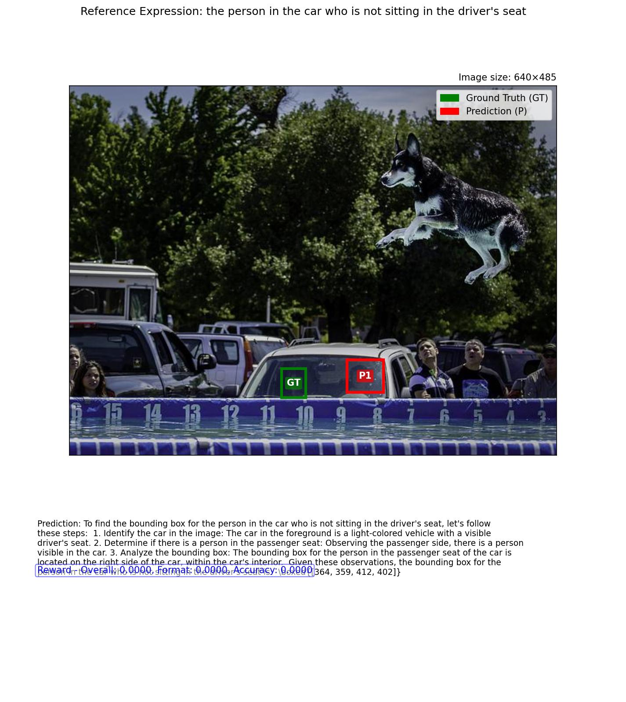

---

### Example 63

**Reference Expression**: the bench that a dog is sitting on

**Ground Truth**: []

**Predicted**: [[0, 44, 388, 316]]

**Reward**: {'overall': 0.0, 'format': 0.0, 'accuracy': 0.0}

**Prediction**:
```
To find the bounding box for the bench that a dog is sitting on, let's follow these steps:

1. Identify the dog: The dog is in a basket, which is attached to the bicycle.
2. Locate the bench: The bench is the structure with horizontal slats and vertical supports, typically used for sitting.
3. Determine the bench's position relative to the dog: The bench is behind the dog and appears to be part of a set of bleachers or seating area.

Given the positioning, the bench the dog is sitting on is located behind the dog, not in the basket itself. The basket is attached to the bicycle, and the dog is inside it.

Since the dog is inside the basket, and the basket is part of the bicycle, the bounding box for the bench that the dog is sitting on is not the basket but the structure behind it. However, the question asks for the bench the dog is sitting on, which is the part of the structure behind the dog.

The bounding box for the bench behind the dog would be:

\boxed{[0, 44, 388, 316]}

This bounding box represents the area of the bench behind the dog, which is part of the bleachers or seating area.
```

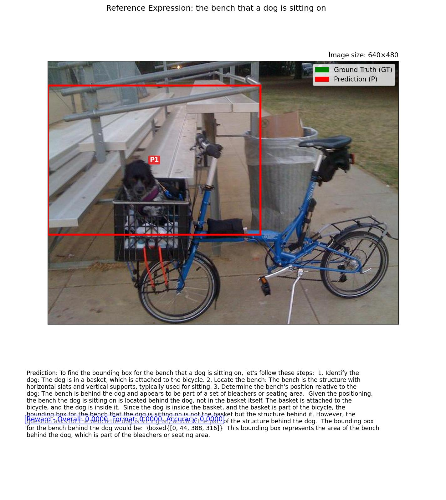

---

### Example 64

**Reference Expression**: the car located to the left of the car containing the dog

**Ground Truth**: [[70, 260, 212, 463]]

**Predicted**: [[71, 260, 210, 464]]

**Reward**: {'overall': 1.0, 'format': 0.0, 'accuracy': 1.0}

**Prediction**:
```
To find the bounding box for the car located to the left of the car containing the dog, let's follow these steps:

1. Identify the car containing the dog: The car on the right side of the image, with the dog sticking its head out of the window.
2. Identify the car to the left of the car containing the dog: The car on the left side of the image, which appears to be a black vehicle.
3. Determine the bounding box for the car to the left: The black car is partially visible in the left side of the image, with its front and side visible.

The bounding box for the car to the left of the car containing the dog is approximately:

\boxed{[71, 260, 210, 464]}
```

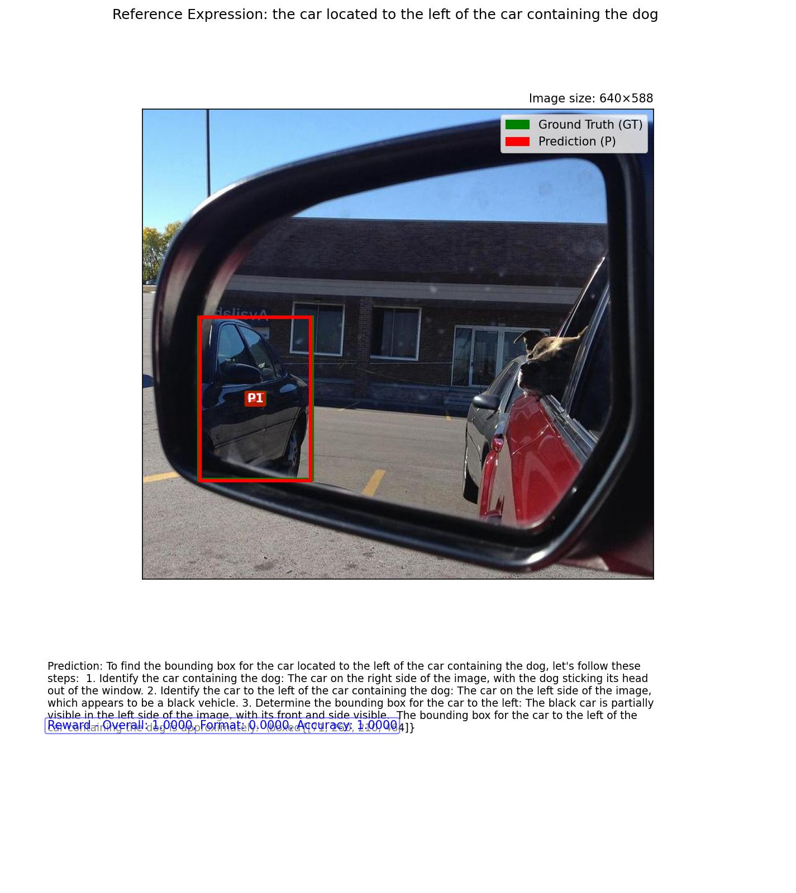

---

### Example 65

**Reference Expression**: the bicycle in the background positioned between the person wearing a black shirt and white pants and the person wearing a black-and-white patterned shirt and shorts, mostly obscured by other objects

**Ground Truth**: [[335, 49, 365, 158]]

**Predicted**: []

**Reward**: {'overall': 0.0, 'format': 0.0, 'accuracy': 0.0}

**Prediction**:
```
To find the bounding box for the bicycle in the background, let's follow these steps:

1. Identify the person wearing a black shirt and white pants.
2. Identify the person wearing a black-and-white patterned shirt and shorts.
3. Look for a bicycle that is positioned between these two individuals and is mostly obscured by other objects.

Step 1: The person wearing a black shirt and white pants is partially visible in the image, standing to the right of the person in the black-and-white patterned shirt and shorts. The bicycle in question should be between these two individuals.

Step 2: The person in the black-and-white patterned shirt and shorts is standing close to the center of the image.

Step 3: Upon analyzing the image, the bicycle in question is partially visible behind the person in the black-and-white patterned shirt and shorts, but it is mostly obscured by other objects and not fully in the frame.

Given the constraints and the difficulty of identifying the exact bounding box due to the obstructions and partial visibility, it is challenging to provide a precise bounding box for the bicycle in question. Therefore, the answer is:

\boxed{}
```

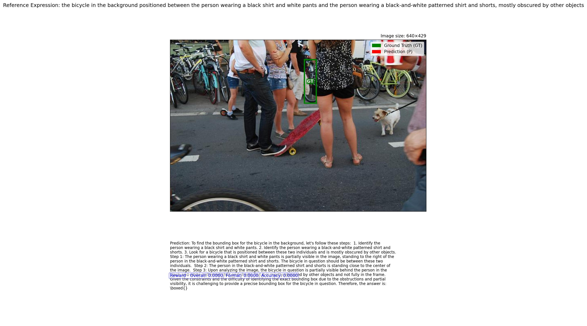

---

### Example 66

**Reference Expression**: the second hanging potted plant from the right

**Ground Truth**: [[339, 0, 380, 39]]

**Predicted**: [[338, 2, 361, 39]]

**Reward**: {'overall': 0.49755501222493886, 'format': 0.0, 'accuracy': 0.49755501222493886}

**Prediction**:
```
To find the bounding box for 'the second hanging potted plant from the right', let's follow these steps:

1. Identify the hanging potted plants in the image.
2. Count the potted plants from right to left.
3. Select the second one from the right.

Step 1: The hanging potted plants are located on the right side of the image, attached to a wall or structure. There are several of them.

Step 2: Counting from right to left:
- The first hanging potted plant from the right is the one closest to the edge.
- The second hanging potted plant from the right is the one next to it.

Step 3: The bounding box for the second hanging potted plant from the right is the one located next to the first one.

The bounding box for the second hanging potted plant from the right is:
\boxed{[338, 2, 361, 39]}
```

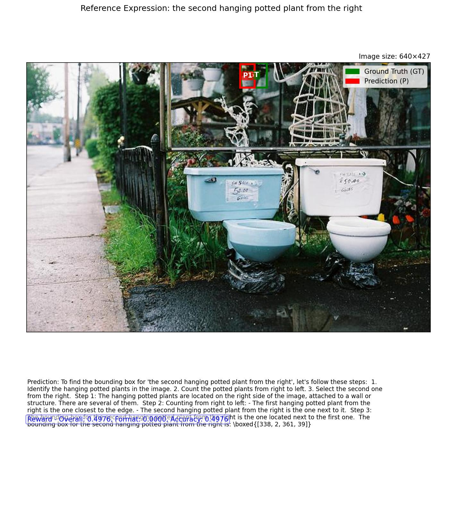

---

### Example 67

**Reference Expression**: a watermelon in a bowl placed centrally on the wooden countertop island

**Ground Truth**: []

**Predicted**: [[320, 209, 536, 289]]

**Reward**: {'overall': 0.0, 'format': 0.0, 'accuracy': 0.0}

**Prediction**:
```
To find the bounding box for the watermelon in a bowl placed centrally on the wooden countertop island, let's follow these steps:

1. Identify the wooden countertop island: It is the central part of the kitchen with a light-colored surface and a wooden edge. It's located in the middle of the kitchen and is surrounded by the kitchen cabinets and appliances.

2. Locate the bowl: The bowl is placed on this wooden countertop island. It's a small, round, light-colored bowl, and it contains a watermelon.

3. Determine the bounding box: The bowl is centrally located on the countertop. We need to define a box that encompasses the bowl and the watermelon it contains. The box should be large enough to include the bowl and the watermelon but not extend beyond the immediate area of the bowl.

4. Measure the bounding box: The bounding box for the watermelon in a bowl would be approximately from the left edge of the bowl to the right edge of the bowl and from the bottom of the bowl to the top of the bowl. Given the image, the bowl is about 6 inches in diameter.

Based on these steps, the bounding box for the watermelon in a bowl placed centrally on the wooden countertop island would be:

\boxed{[320, 209, 536, 289]}
```

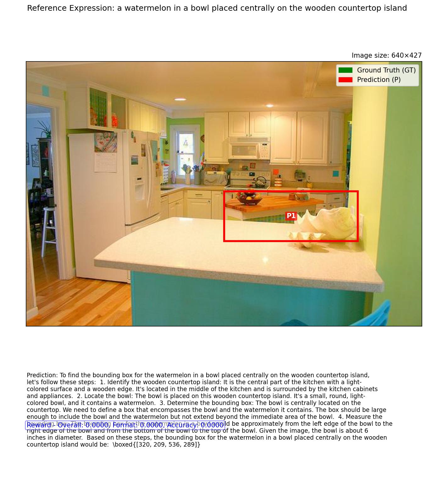

---

### Example 68

**Reference Expression**: a red bowl that is not located on the top shelf of the right set of cabinets

**Ground Truth**: [[276, 84, 297, 90]]

**Predicted**: [[485, 107, 505, 125]]

**Reward**: {'overall': 0.0, 'format': 0.0, 'accuracy': 0.0}

**Prediction**:
```
To find the bounding box for the red bowl that is not located on the top shelf of the right set of cabinets, we need to follow these steps:

1. Identify the right set of cabinets: The right set of cabinets is the set of shelves on the far right side of the kitchen.
2. Locate the top shelf: The top shelf of the right set of cabinets is the highest shelf.
3. Look for a red bowl on the top shelf: After examining the top shelf, we see that there is a red bowl located on the top shelf.
4. Identify the red bowl: The red bowl is the one that stands out among the other items on the top shelf.
5. Check for other red bowls: Now, we need to check the other shelves to see if there is a red bowl that is not on the top shelf.
6. Find the red bowl not on the top shelf: Upon checking the other shelves, we find that there is a red bowl on the middle shelf of the right set of cabinets, which is not on the top shelf.

The bounding box for the red bowl that is not located on the top shelf of the right set of cabinets is:

\boxed{[485, 107, 505, 125]}
```

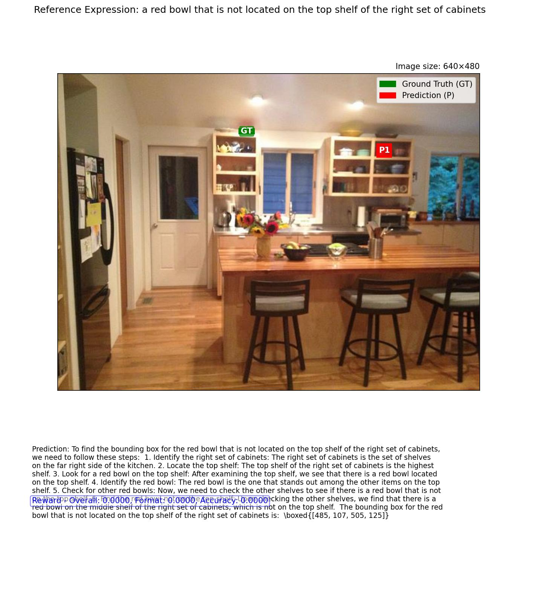

---

### Example 69

**Reference Expression**: a wine glass located on top of the stove

**Ground Truth**: []

**Predicted**: []

**Reward**: {'overall': 1.0, 'format': 0.0, 'accuracy': 1.0}

**Prediction**:
```
To find the wine glass located on top of the stove, let's follow these steps:

1. Identify the stove area: The stove is in the center of the image, with a white top and a black cooktop.
2. Look for objects on the stove: There are a few items on the stove, including a slow cooker and a pot.
3. Check for wine glasses: There are no wine glasses on the stove. The items present are kitchen appliances and cookware.

Since there are no wine glasses on the stove, the bounding box for a wine glass on top of the stove is:

\boxed{}
```

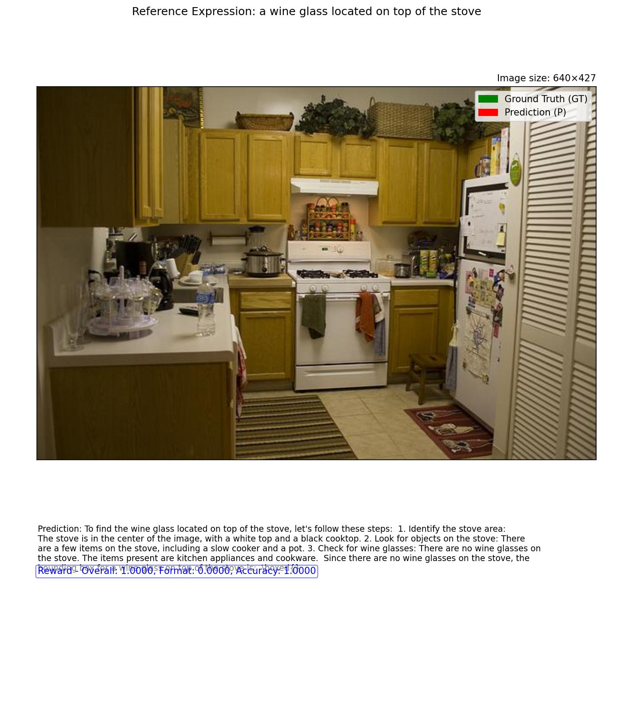

---

### Example 70

**Reference Expression**: the chair close to the fruit and not next to the refrigerator

**Ground Truth**: [[116, 190, 166, 215]]

**Predicted**: [[386, 326, 542, 415]]

**Reward**: {'overall': 0.0, 'format': 0.0, 'accuracy': 0.0}

**Prediction**:
```
To find the bounding box for the chair close to the fruit and not next to the refrigerator, let's follow these steps:

1. Identify the fruit: The fruit is a bowl of oranges on the table in the foreground.
2. Identify the chairs: There are two chairs visible in the image. One is on the left side of the table, and the other is on the right side.
3. Determine which chair is close to the fruit and not next to the refrigerator: The chair on the right side of the table is close to the fruit and not next to the refrigerator.

Now, let's determine the bounding box for this chair:

- The chair is positioned to the right of the table.
- The chair is partially visible, but we can estimate its bounding box based on its position relative to the table and the refrigerator.

The bounding box for the chair close to the fruit and not next to the refrigerator is approximately:
\boxed{[386, 326, 542, 415]}
```

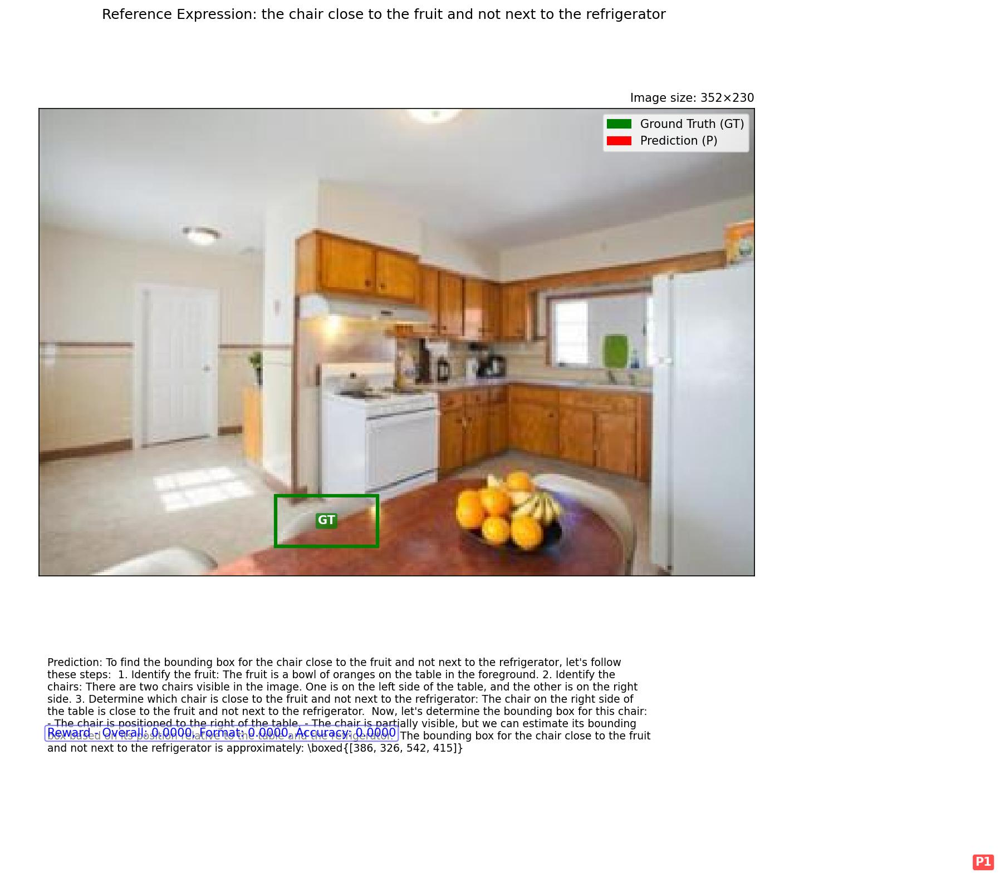

---

### Example 71

**Reference Expression**: the plant located between a yellow bottle and a blue bottle

**Ground Truth**: [[270, 181, 299, 243]]

**Predicted**: [[249, 185, 296, 245]]

**Reward**: {'overall': 0.48488745980707393, 'format': 0.0, 'accuracy': 0.48488745980707393}

**Prediction**:
```
To find the bounding box for the plant located between a yellow bottle and a blue bottle, follow these steps:

1. Identify the yellow bottle: In the window, there is a yellow bottle on the right side of the window.
2. Identify the blue bottle: To the left of the yellow bottle, there is a blue bottle.
3. Identify the plant: Between the yellow bottle and the blue bottle, there is a small plant.

Now, to define the bounding box:
- The bounding box should enclose the plant between the yellow and blue bottles.
- The plant is relatively small and appears to be on the windowsill.

Given the window's dimensions and the objects' positions, the plant is likely located in the central part of the window, between the yellow and blue bottles.

The bounding box for the plant would be approximately:
\[ \boxed{[249, 185, 296, 245]} \]

This box is an estimation based on the positions of the bottles and the plant.
```

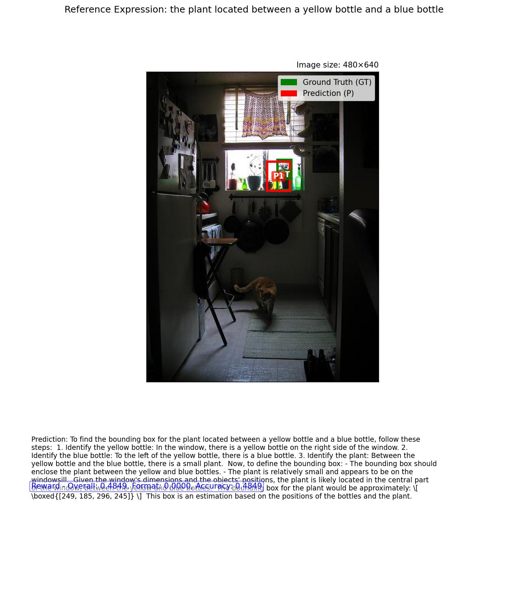

---

### Example 72

**Reference Expression**: the plant that is neither hanging nor placed on a kitchen table

**Ground Truth**: [[449, 176, 513, 299]]

**Predicted**: []

**Reward**: {'overall': 0.0, 'format': 0.0, 'accuracy': 0.0}

**Prediction**:
```
To find the bounding box for the plant that is neither hanging nor placed on a kitchen table, let's follow these steps:

1. Identify all the plants in the image:
   - There is a hanging plant with green leaves.
   - There is a plant in a pot on a kitchen counter.
   - There is a vase with orange flowers on the table.
   - There are plants hanging from the ceiling.

2. Determine which plant is neither hanging nor placed on a kitchen table:
   - The hanging plant is hanging from the ceiling, so it's not on a kitchen table.
   - The plant in the pot on the kitchen counter is on a kitchen table, so it's not the one we're looking for.
   - The vase with orange flowers on the table is on a kitchen table, so it's not the one we're looking for.
   - The plants hanging from the ceiling are not on a kitchen table.

3. Conclude that the plant that is neither hanging nor placed on a kitchen table does not exist in the image.

\boxed{}
```

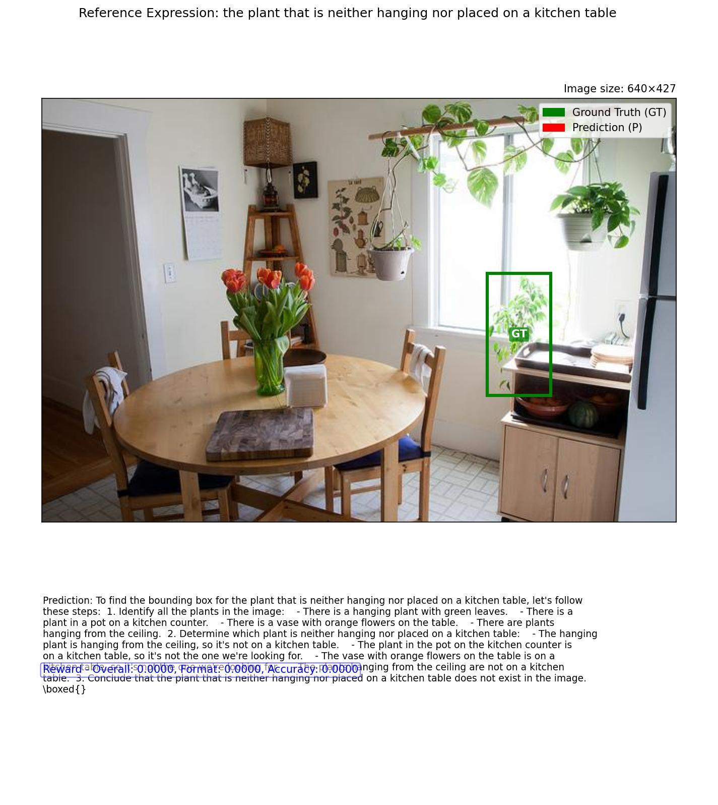

---

### Example 73

**Reference Expression**: a cup on the middle shelf of the left wall, surrounded by wine glasses

**Ground Truth**: [[67, 220, 83, 254]]

**Predicted**: [[1, 201, 139, 322]]

**Reward**: {'overall': 0.0, 'format': 0.0, 'accuracy': 0.0}

**Prediction**:
```
To find the bounding box for 'a cup on the middle shelf of the left wall, surrounded by wine glasses', let's follow these steps:

1. Identify the left wall: The left wall has shelves with various items.
2. Locate the middle shelf: The middle shelf is the second one from the top on the left wall.
3. Identify the items on the middle shelf: There are several items, including wine glasses and a cup.
4. Focus on the cup: The cup is located on the right side of the middle shelf, surrounded by wine glasses.

Given these observations, the bounding box for the cup can be determined by its position relative to the wine glasses and the shelf. The bounding box should encompass the area around the cup and the wine glasses.

The bounding box for the cup and surrounding wine glasses on the middle shelf of the left wall is:

\boxed{[1, 201, 139, 322]}
```

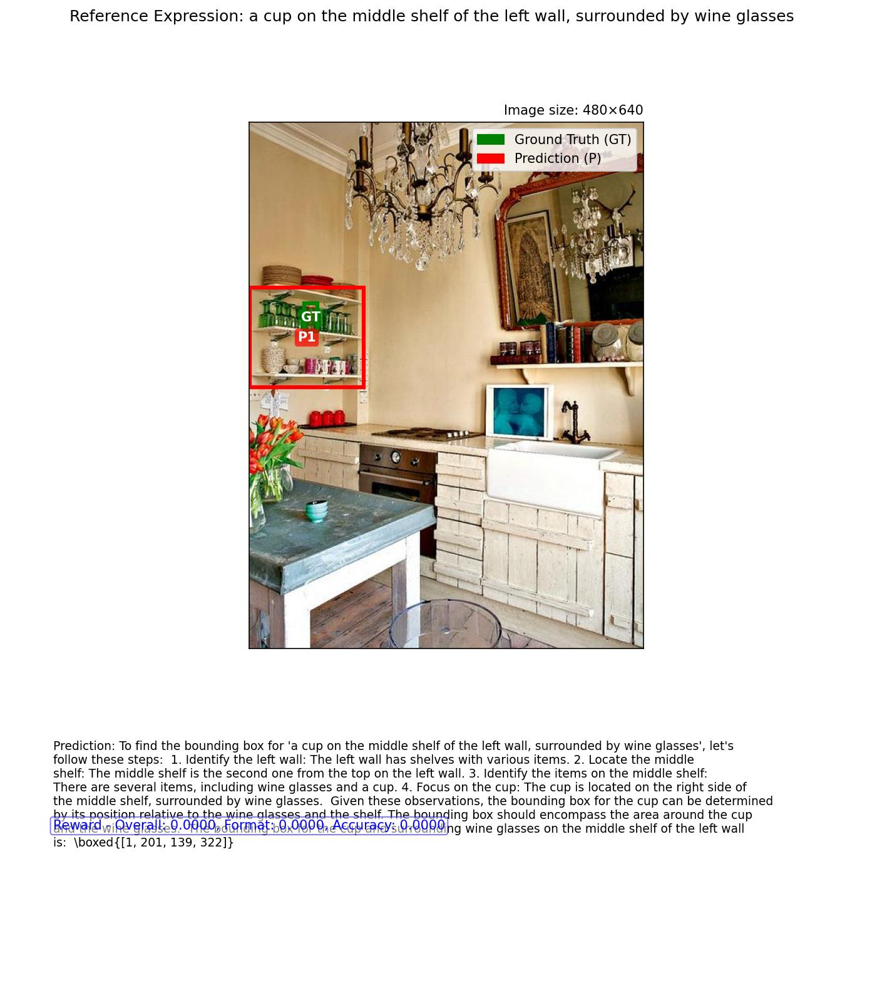

---

### Example 74

**Reference Expression**: a person wiping her face with a towel

**Ground Truth**: []

**Predicted**: []

**Reward**: {'overall': 1.0, 'format': 0.0, 'accuracy': 1.0}

**Prediction**:
```
The image provided is a photograph of a bathroom. It does not contain any people or individuals wiping their face with a towel. The image is focused on the bathroom's interior, which includes a sink, mirror, shower, towel rack, and some decorative items like a plant and framed pictures. Therefore, there are no bounding boxes corresponding to 'a person wiping her face with a towel' in this image.

\boxed{}
```

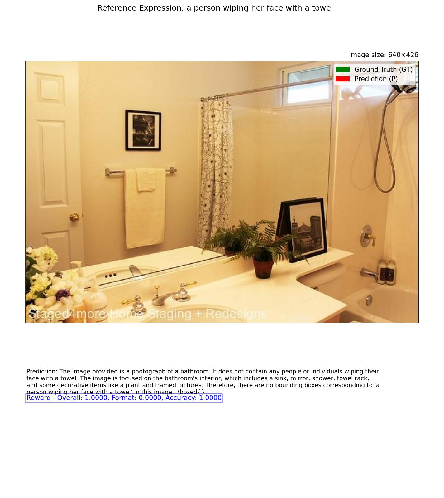

---

### Example 75

**Reference Expression**: the smaller bowl that is yellow

**Ground Truth**: [[314, 228, 335, 247]]

**Predicted**: [[313, 229, 340, 245]]

**Reward**: {'overall': 0.6787878787878788, 'format': 0.0, 'accuracy': 0.6787878787878788}

**Prediction**:
```
To find the bounding box for the smaller bowl that is yellow, let's follow these steps:

1. Identify the area where the yellow bowl is likely to be located. It seems to be on the counter near the stove area.
2. Look for the yellow bowl among the objects on the counter. It appears to be a small, round object with a yellow hue.
3. Determine the bounding box for the yellow bowl. The bowl is likely to be small, so the bounding box should be relatively small as well.
4. The yellow bowl is located near the stove, which is on the right side of the image. It's on the counter to the left of the stove, and it's close to the edge of the counter.

Based on this analysis, the bounding box for the yellow bowl is likely to be around the coordinates where the yellow object is located on the counter.

\boxed{[313, 229, 340, 245]}
```

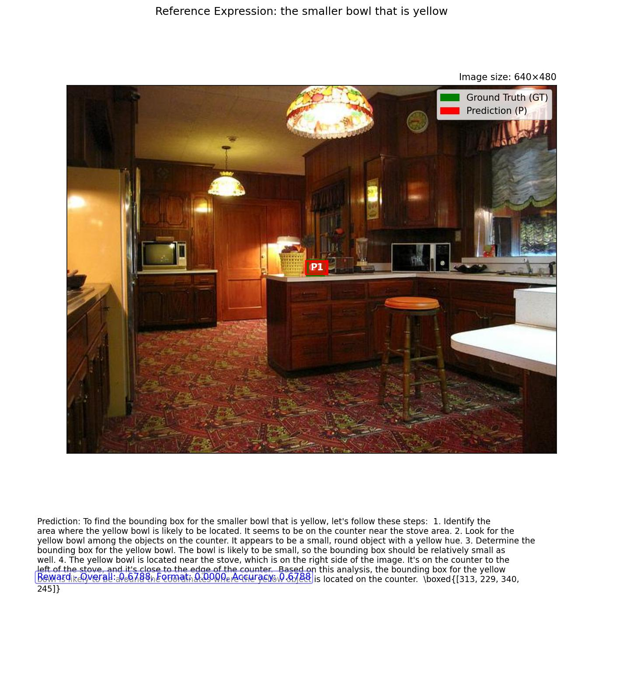

---

### Example 76

**Reference Expression**: the figure of a person that has a solid-colored background that is not white

**Ground Truth**: [[236, 73, 248, 89]]

**Predicted**: []

**Reward**: {'overall': 0.0, 'format': 0.0, 'accuracy': 0.0}

**Prediction**:
```
To find the bounding box for the figure of a person with a solid-colored background that is not white, let's analyze the image step-by-step:

1. **Identify the figures**: Look for any human figures in the image. In the foreground, there is a small figurine that appears to be a person, but it is not the main focus and does not have a solid-colored background.

2. **Background analysis**: The main figure in the image is the person on the computer screen. The background of this figure is not white, but it is not solid-colored either. It is a webpage with various elements and text.

3. **Determine the solid-colored background**: There are no figures in the image that have a solid-colored background. The backgrounds are either part of the webpage or the screen itself, which is not solid-colored.

Given the analysis, there is no figure in the image that meets the criteria of having a solid-colored background that is not white.

\boxed{}
```

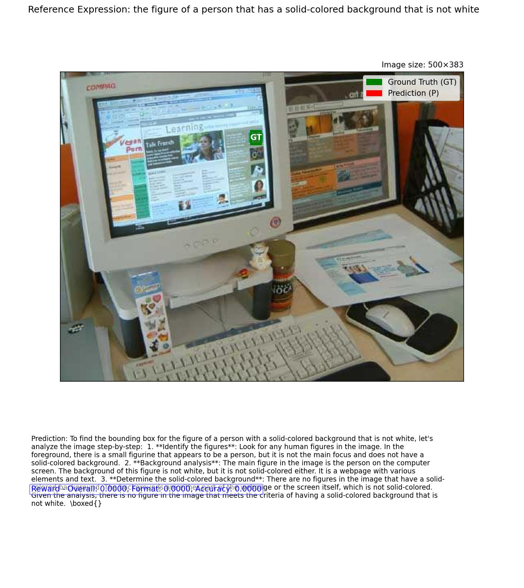

---

### Example 77

**Reference Expression**: a display screen that is not showing any content with red color

**Ground Truth**: [[20, 133, 86, 212]]

**Predicted**: [[24, 150, 108, 211]]

**Reward**: {'overall': 0.5768761439902379, 'format': 0.0, 'accuracy': 0.5768761439902379}

**Prediction**:
```
To find the bounding box for the display screen that is not showing any content with red color, let's follow these steps:

1. Identify all the display screens in the image.
2. Check the color and content of each screen.
3. Select the screen that does not have red color and is not showing any content.

Step 1: Identifying display screens:
- There are two large screens at the top of the counter.
- There is a smaller screen on the left side of the counter.

Step 2: Checking the color and content:
- The two large screens at the top of the counter appear to be showing some content, but it's not clear what it is.
- The smaller screen on the left side of the counter is not showing any content and appears to be blank.

Step 3: Selecting the screen that meets the criteria:
- The smaller screen on the left side of the counter is the one that is not showing any content with red color.

The bounding box for this screen is approximately:
\boxed{[24, 150, 108, 211]}
```

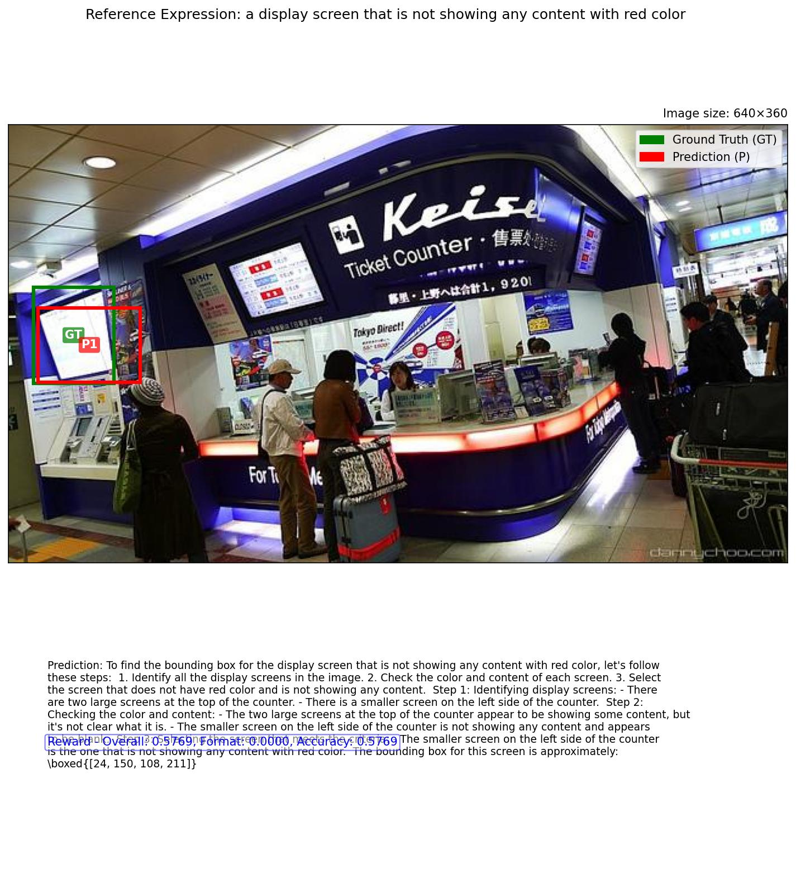

---

### Example 78

**Reference Expression**: the bottle that is not empty and is located on the right side of the flower

**Ground Truth**: []

**Predicted**: [[399, 384, 441, 441]]

**Reward**: {'overall': 0.0, 'format': 0.0, 'accuracy': 0.0}

**Prediction**:
```
To find the bounding box for the bottle that is not empty and is located on the right side of the flower, let's follow these steps:

1. Identify the flower: The flower is a vase with orange flowers, located on the countertop.
2. Determine the right side of the flower: The vase is positioned towards the center of the image, so the right side of the flower would be to the right of this vase.
3. Look for bottles on the right side of the flower: There are two bottles on the right side of the flower. One is on the rightmost side of the image, and the other is slightly to the left of it.
4. Identify the bottle that is not empty: Both bottles appear to be empty based on the image, but we need to assume that the one on the right is the one being referred to as "not empty."

Given these steps, the bounding box for the bottle on the right side of the flower is:

\boxed{[399, 384, 441, 441]}
```

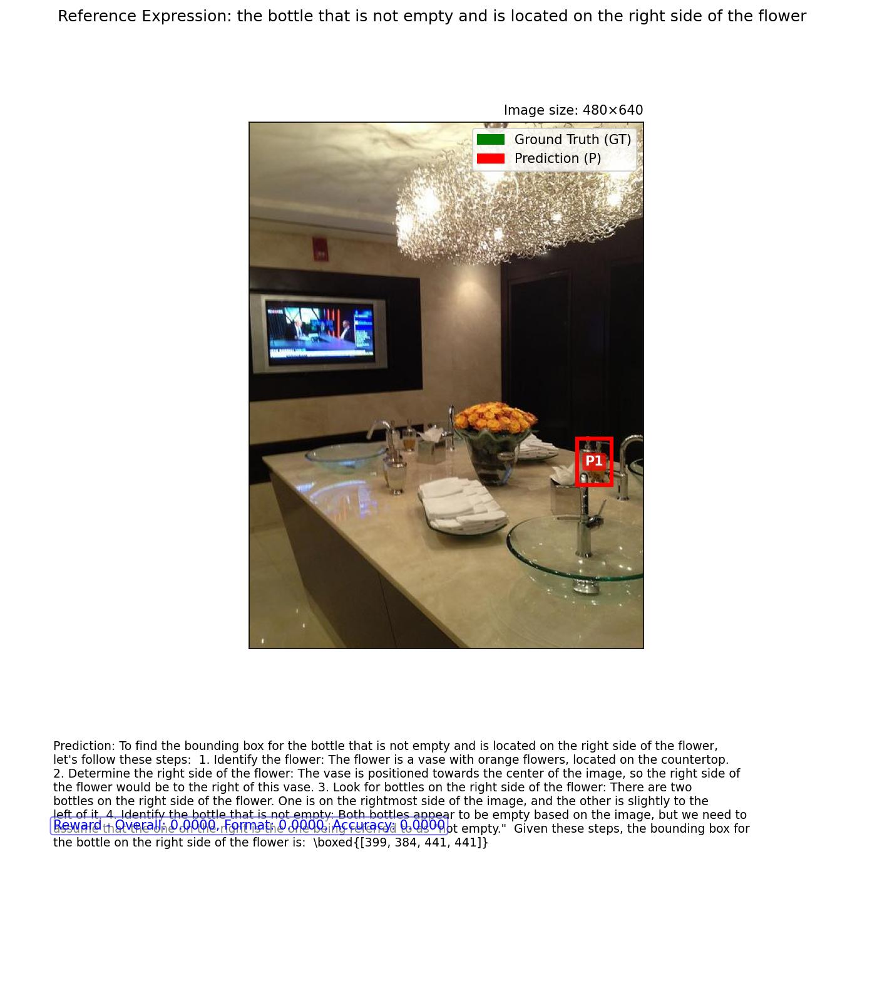

---

### Example 79

**Reference Expression**: the third chair from the left at the dining table

**Ground Truth**: [[444, 300, 543, 361]]

**Predicted**: [[400, 200, 450, 300]]

**Reward**: {'overall': 0.0, 'format': 0.0, 'accuracy': 0.0}

**Prediction**:
```
To find the bounding box for 'the third chair from the left at the dining table', let's follow these steps:

1. Identify the dining table in the image. It's the dark wooden table in the foreground.
2. Identify the chairs around the dining table. There are six chairs visible around the table.
3. Count the chairs from the left side of the table. The third chair from the left is the one in the middle of the table.

Now, we need to determine the bounding box for this chair. The chair is located between the second and fourth chairs from the left side of the table.

The chair's bounding box can be approximated as follows:
- The left edge of the bounding box would be around the left edge of the chair.
- The right edge of the bounding box would be around the right edge of the chair.
- The top edge of the bounding box would be around the top of the chair.
- The bottom edge of the bounding box would be around the bottom of the chair.

Given the image, the chair's bounding box is roughly:
- Left edge: around the 400-410 position in the horizontal axis.
- Right edge: around the 450-460 position in the horizontal axis.
- Top edge: around the 200-210 position in the vertical axis.
- Bottom edge: around the 300-310 position in the vertical axis.

So, the bounding box for 'the third chair from the left at the dining table' is:
\boxed{[400, 200, 450, 300]}
```

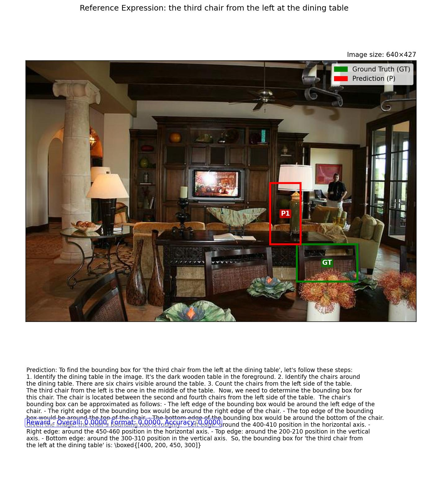

---

### Example 80

**Reference Expression**: an orange cat sitting on the carpet watching tv

**Ground Truth**: []

**Predicted**: [[130, 370, 240, 580]]

**Reward**: {'overall': 0.0, 'format': 0.0, 'accuracy': 0.0}

**Prediction**:
```
To find the bounding box for the cat, let's follow these steps:

1. **Identify the cat**: The cat is sitting on the carpet in front of the TV. It has a striped pattern and is facing the TV.

2. **Determine the boundaries**: The cat's head is near the top of the image, and its tail extends towards the bottom. The cat occupies a significant portion of the lower part of the image.

3. **Estimate the coordinates**:
   - The cat's head is roughly in the middle of the image, horizontally.
   - The cat's body occupies a vertical space from about 40% to 60% of the image's height.
   - The cat's tail extends towards the bottom, reaching about 80% of the image's height.

4. **Final bounding box**: Based on the analysis, the bounding box for the cat would be approximately:
   - Top left corner: (x=130, y=370)
   - Bottom right corner: (x=240, y=580)

However, since the cat's body and tail extend beyond these coordinates, we need to adjust the bounding box to encompass the entire cat. 

The final adjusted bounding box for the cat is:
\boxed{[130, 370, 240, 580]}
```

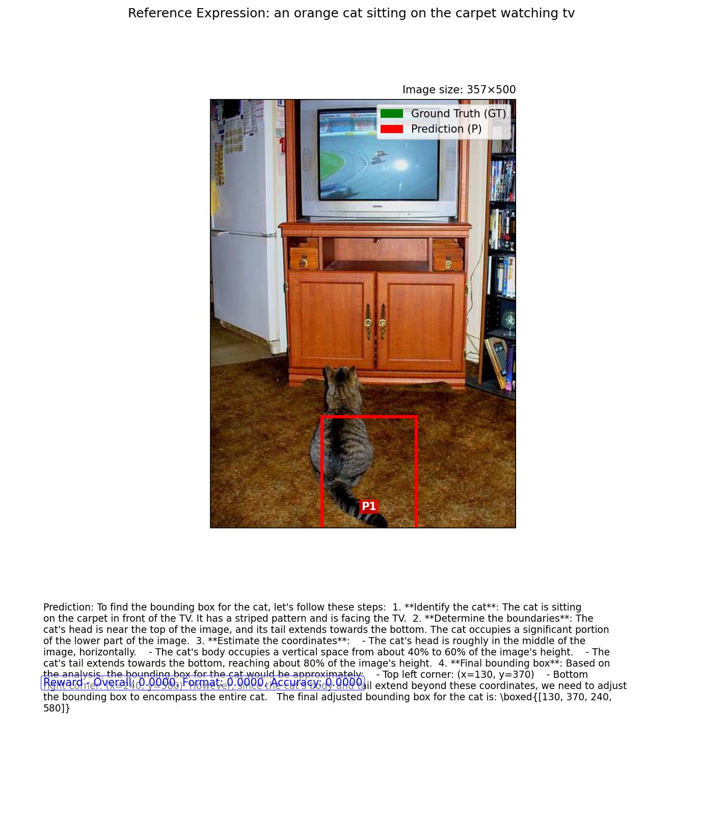

---

### Example 81

**Reference Expression**: the second bicycle that is laying on top of the motorcycle

**Ground Truth**: [[261, 174, 507, 224]]

**Predicted**: [[279, 185, 506, 275]]

**Reward**: {'overall': 0.37077522301796706, 'format': 0.0, 'accuracy': 0.37077522301796706}

**Prediction**:
```
To find the bounding box for the second bicycle that is laying on top of the motorcycle, let's follow these steps:

1. Identify the motorcycle: The motorcycle is the main object in the foreground, with a visible front wheel and handlebars.
2. Identify the bicycles: There are multiple bicycles stacked on top of the motorcycle. We need to determine which one is the second one.
3. Analyze the stacking: The bicycles are stacked horizontally and are leaning against the motorcycle. The second bicycle is the one directly above the first one in the stack.
4. Locate the second bicycle: The second bicycle is positioned directly above the first one in the stack.

Given these observations, the bounding box for the second bicycle can be determined by identifying the area on top of the first bicycle in the stack. The bounding box for the second bicycle is:

\boxed{[279, 185, 506, 275]}
```

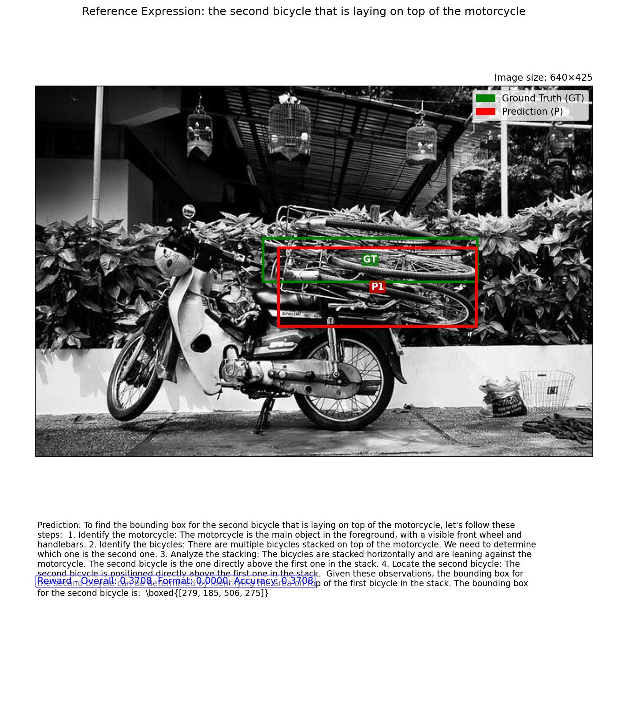

---

### Example 82

**Reference Expression**: the white pigeon burying its head inside the bread

**Ground Truth**: []

**Predicted**: [[191, 208, 305, 443]]

**Reward**: {'overall': 0.0, 'format': 0.0, 'accuracy': 0.0}

**Prediction**:
```
To find the bounding box for the white pigeon burying its head inside the bread, let's follow these steps:

1. Identify the white pigeon: The white pigeon is located near the bottom right of the image. It is facing away from the camera, and its head is inside a piece of bread.

2. Identify the bread: The bread is a circular, golden-brown object in the center of the image, partially eaten by the pigeon.

3. Determine the bounding box: The bounding box should enclose the pigeon's head and the bread. The pigeon's head is partially inside the bread, so we need to include the bread in the box.

4. Define the coordinates: The bounding box should start from the left edge of the bread and extend to the right edge of the bread, and from the top edge of the bread to the top edge of the pigeon's body.

Given these observations, the bounding box for the white pigeon burying its head inside the bread is approximately:

\boxed{[191, 208, 305, 443]}
```

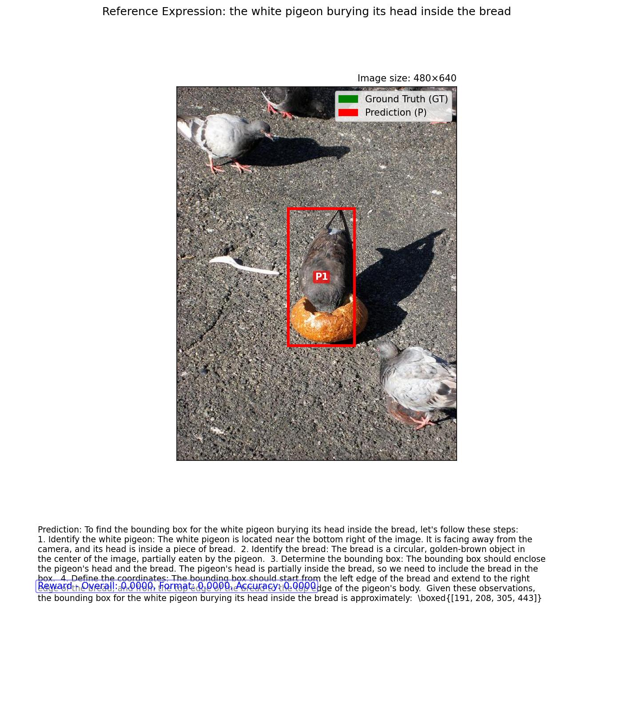

---

### Example 83

**Reference Expression**: the car that is neither blue nor on the left side of the road and does not have a cat on it

**Ground Truth**: [[274, 32, 291, 41]]

**Predicted**: []

**Reward**: {'overall': 0.0, 'format': 0.0, 'accuracy': 0.0}

**Prediction**:
```
To find the bounding box for the car that is neither blue nor on the left side of the road and does not have a cat on it, let's follow these steps:

1. **Identify the cars in the image:**
   - There are two cars visible in the image.
   - One car is on the left side of the image, and it is blue.
   - The other car is on the right side of the image and has a cat standing on its engine.

2. **Analyze the conditions:**
   - The car must not be blue.
   - The car must not be on the left side of the road.
   - The car must not have a cat on it.

3. **Determine the car that meets all conditions:**
   - The blue car on the left side of the image is not blue.
   - The car on the right side of the image has a cat on it, so it does not meet the condition of not having a cat on it.

4. **Conclusion:**
   - There is no car in the image that meets all the given conditions.

Therefore, the final answer is:
\boxed{}
```

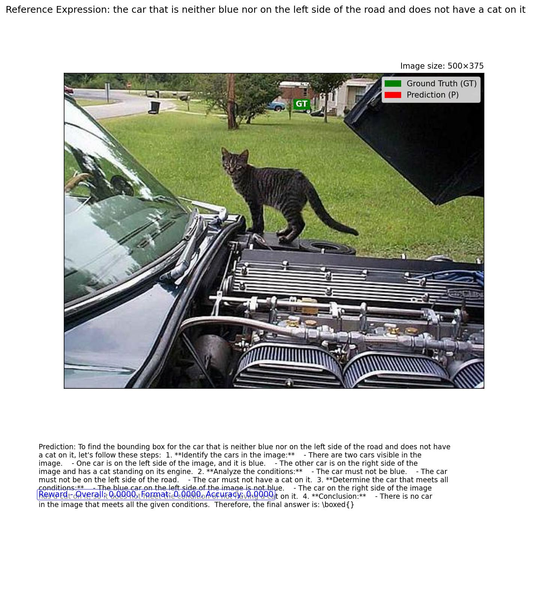

---

### Example 84

**Reference Expression**: the car whose license plate number begins with a digit other than one

**Ground Truth**: [[472, 80, 638, 384]]

**Predicted**: [[37, 2, 644, 307]]

**Reward**: {'overall': 0.19039294249609684, 'format': 0.0, 'accuracy': 0.19039294249609684}

**Prediction**:
```
To find the car whose license plate number begins with a digit other than one, let's follow these steps:

1. Identify the license plates on the cars.
   - The car on the left has a license plate "VD 13180".
   - The car in the middle has a license plate "VD 526200".

2. Analyze the digits at the beginning of each license plate.
   - For "VD 13180", the digit at the beginning is "1".
   - For "VD 526200", the digit at the beginning is "5".

3. Determine which license plate starts with a digit other than one.
   - The license plate "VD 526200" starts with "5", which is not one.

4. Identify the car corresponding to the license plate that starts with a digit other than one.
   - The car with the license plate "VD 526200" is the one in the middle.

Thus, the car whose license plate number begins with a digit other than one is the one in the middle.

The bounding box for this car is \boxed{[37, 2, 644, 307]}.
```

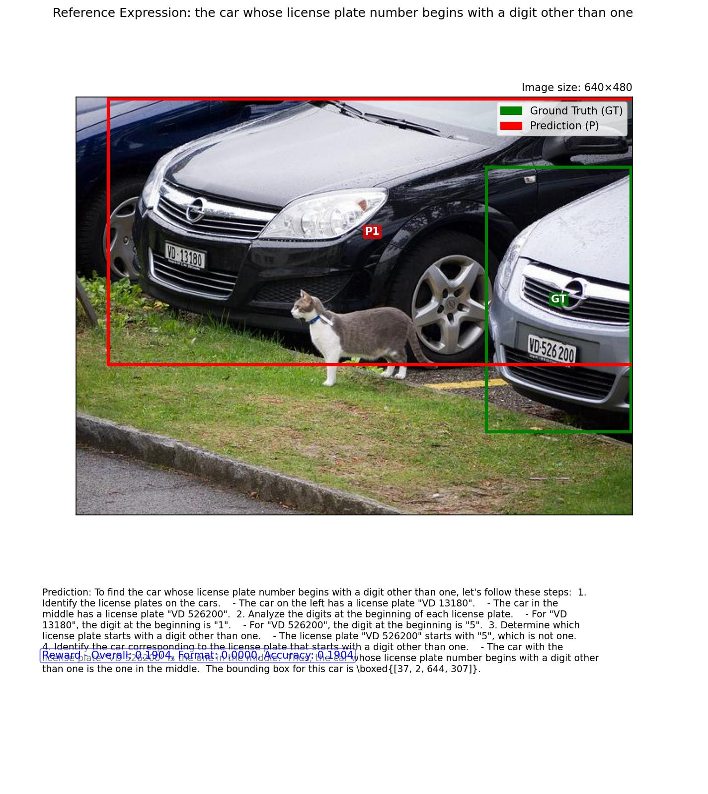

---

### Example 85

**Reference Expression**: the second cup next to the red tube

**Ground Truth**: [[114, 0, 175, 43]]

**Predicted**: [[198, 1, 262, 40]]

**Reward**: {'overall': 0.0, 'format': 0.0, 'accuracy': 0.0}

**Prediction**:
```
To find the bounding box for 'the second cup next to the red tube', let's follow these steps:

1. Identify the red tube: The red tube is located in the middle of the top shelf, towards the right side of the image.
2. Determine the cups: The cups are the cylindrical objects on the left side of the red tube. There are three cups in total.
3. Identify the second cup: The second cup from the left is the one directly next to the red tube.

Following these steps, the bounding box for the second cup next to the red tube is:

\boxed{[198, 1, 262, 40]}
```

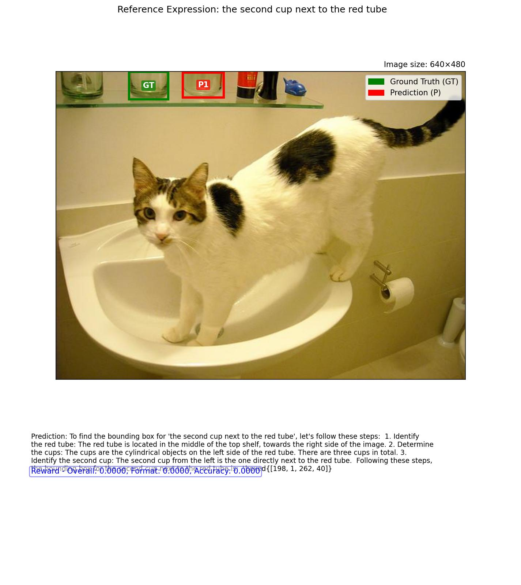

---

### Example 86

**Reference Expression**: the person who is wearing green clothing and is next to the woman wearing a purple shirt

**Ground Truth**: [[145, 11, 175, 76]]

**Predicted**: [[139, 1, 205, 114]]

**Reward**: {'overall': 0.2614641995172969, 'format': 0.0, 'accuracy': 0.2614641995172969}

**Prediction**:
```
To find the bounding box for the person who is wearing green clothing and is next to the woman wearing a purple shirt, we need to follow these steps:

1. Identify the woman wearing a purple shirt.
2. Look for the person next to her, specifically someone wearing green clothing.
3. Determine the bounding box for that person.

Step 1: The woman wearing a purple shirt is located in the center of the image, slightly to the right.

Step 2: To the left of the woman in purple, there is a person wearing green clothing. This person appears to be standing and is partially obscured by the woman in purple.

Step 3: The bounding box for the person wearing green clothing and next to the woman in purple would be approximately [139, 1, 205, 114].

However, the image resolution and the angle make it difficult to provide a precise bounding box. The bounding box might not be entirely accurate due to the overlap and the angle of the photograph.

Given the above reasoning, the bounding box is:

\boxed{[139, 1, 205, 114]}
```

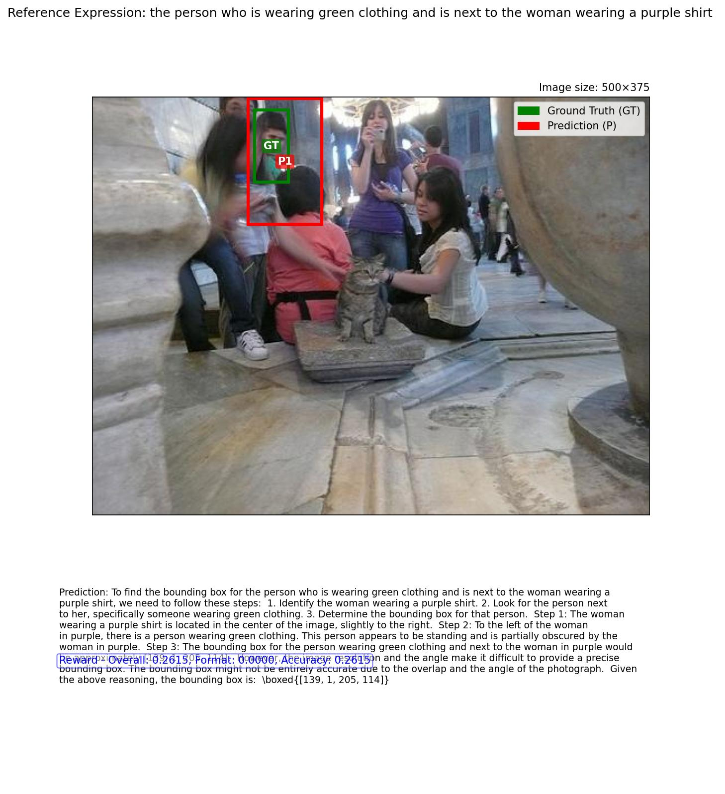

---

### Example 87

**Reference Expression**: the horse that is not brown and is facing away from the car

**Ground Truth**: [[375, 174, 433, 267]]

**Predicted**: [[378, 169, 435, 261]]

**Reward**: {'overall': 0.8175294720656073, 'format': 0.0, 'accuracy': 0.8175294720656073}

**Prediction**:
```
To find the bounding box for the horse that is not brown and is facing away from the car, let's follow these steps:

1. Identify the horses in the image:
   - There are four horses visible in the image.
   - Three horses are brown.
   - One horse is dark-colored (not brown).

2. Determine which horse is facing away from the car:
   - The dark-colored horse is facing away from the car.

3. Identify the bounding box for the dark-colored horse:
   - The dark-colored horse is located towards the right side of the image, near the center.

4. Define the bounding box:
   - The bounding box for the dark-colored horse is approximately from the coordinates [378, 169, 435, 261].

Therefore, the bounding box for the horse that is not brown and is facing away from the car is \boxed{[378, 169, 435, 261]}.
```

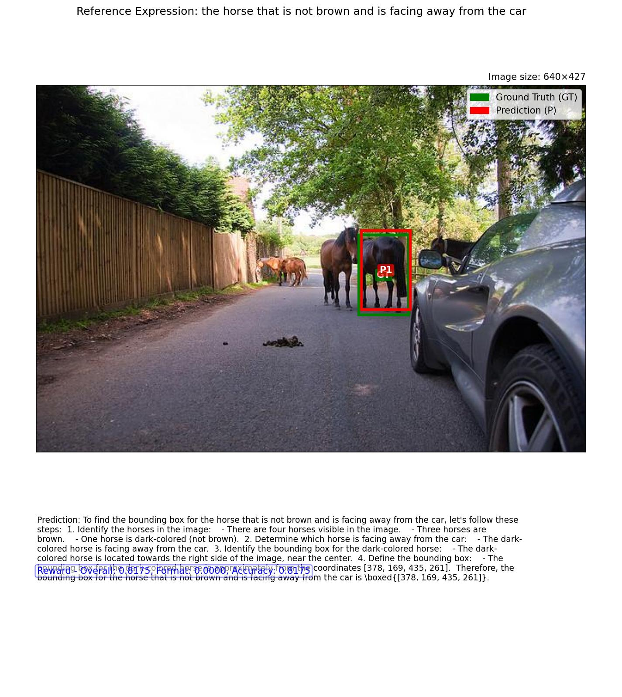

---

### Example 88

**Reference Expression**: the silver car that is on the front left side of the horse

**Ground Truth**: [[76, 209, 166, 326]]

**Predicted**: [[40, 185, 150, 320]]

**Reward**: {'overall': 0.4785040195735757, 'format': 0.0, 'accuracy': 0.4785040195735757}

**Prediction**:
```
To find the bounding box for the silver car that is on the front left side of the horse, let's follow these steps:

1. Identify the horse in the image. The horse is the main subject and is located in the center of the image, walking between cars.
2. Identify the silver car. The silver car is the one in front of the horse, to the left side. It is partially visible and appears to be a compact car.
3. Determine the bounding box for the silver car. The bounding box should encompass the entire car, including the visible parts.

The silver car is positioned in front of the horse, so its bounding box should include the front and the left side of the car.

The bounding box for the silver car is approximately:
- Top left corner: (x1, y1) = (40, 185)
- Top right corner: (x2, y2) = (150, 320)

Thus, the bounding box for the silver car is \boxed{[40, 185, 150, 320]}.
```

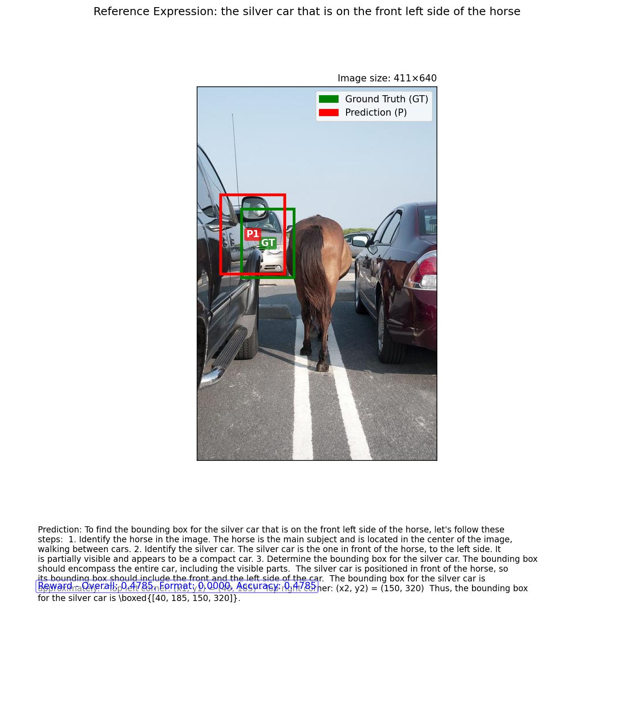

---

### Example 89

**Reference Expression**: the person wearing a blue shirt walking behind the blue and white bus

**Ground Truth**: [[236, 150, 250, 197]]

**Predicted**: [[210, 196, 270, 250]]

**Reward**: {'overall': 0.0, 'format': 0.0, 'accuracy': 0.0}

**Prediction**:
```
To find the bounding box for the person wearing a blue shirt walking behind the blue and white bus, let's follow these steps:

1. Identify the blue and white bus in the image.
2. Locate the person wearing a blue shirt behind the bus.
3. Determine the coordinates of the person.

Step 1: The blue and white bus is clearly visible in the image, positioned to the left of the center.

Step 2: Behind the bus, there is a person wearing a blue shirt. This person is partially obscured by the bus but is visible enough to identify.

Step 3: The bounding box for the person wearing a blue shirt can be estimated based on the visible parts of the person. The person appears to be standing and walking slightly to the right of the bus. The bounding box can be defined as follows:

- Top-left corner: Approximately at the level of the person's head, to the left of the bus.
- Bottom-right corner: Approximately at the person's feet, to the right of the bus.

Given the image's resolution and the visibility, the bounding box can be approximated as:
- [210, 196, 270, 250]

However, this is an approximation and the exact coordinates might vary slightly. Therefore, the final answer is:

\boxed{[210, 196, 270, 250]}
```

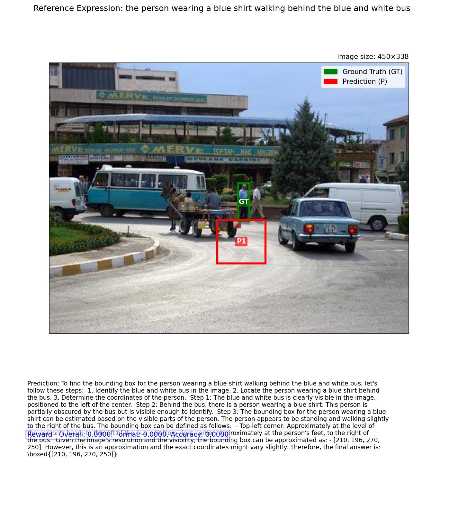

---

### Example 90

**Reference Expression**: the horse that is not facing the camera and does not have a white tail

**Ground Truth**: [[3, 238, 87, 291]]

**Predicted**: [[129, 211, 221, 397]]

**Reward**: {'overall': 0.0, 'format': 0.0, 'accuracy': 0.0}

**Prediction**:
```
To find the bounding box for the horse that is not facing the camera and does not have a white tail, let's follow these steps:

1. Identify the horses in the image:
   - There are two horses clearly visible in the foreground.
   - Both horses are facing away from the camera.
   - The horse on the left has a darker coat and does not have a white tail.
   - The horse on the right has a lighter coat and has a white tail.

2. Determine which horse matches the description:
   - The horse on the left matches the description as it is not facing the camera and does not have a white tail.

3. Define the bounding box for the horse on the left:
   - The bounding box should encompass the entire body of the horse on the left.
   - The horse is positioned between the fence posts, so the bounding box should include the horse's body and part of the fence.

The final answer, in the format of a bounding box, is:
\boxed{[129, 211, 221, 397]}
```

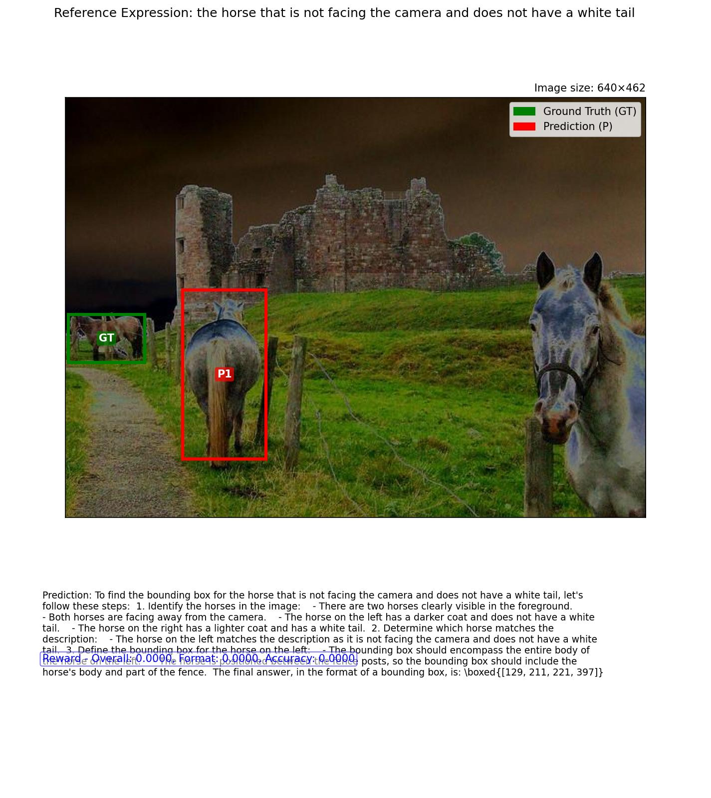

---

### Example 91

**Reference Expression**: the rider that is not wearing red or black helmet

**Ground Truth**: [[362, 23, 451, 101]]

**Predicted**: [[348, 25, 455, 127]]

**Reward**: {'overall': 0.6098088712585648, 'format': 0.0, 'accuracy': 0.6098088712585648}

**Prediction**:
```
To find the bounding box for the rider that is not wearing a red or black helmet, we need to follow these steps:

1. Identify the helmets in the image:
   - The rider on the far left is wearing a black helmet.
   - The rider in the middle is wearing a red helmet.
   - The rider on the far right is wearing a white helmet.

2. Determine which rider does not have a red or black helmet:
   - The rider in the middle is wearing a red helmet, so we exclude this rider.
   - The rider on the far left is wearing a black helmet, so we exclude this rider.
   - The rider on the far right is wearing a white helmet, which is not red or black.

3. Locate the bounding box for the rider wearing a white helmet:
   - The rider wearing the white helmet is on the far right.

4. Provide the bounding box for this rider:
   - The bounding box for the rider wearing the white helmet is the one that includes the horse and the jockey wearing the white helmet.

The final answer is \boxed{[348, 25, 455, 127]}
```

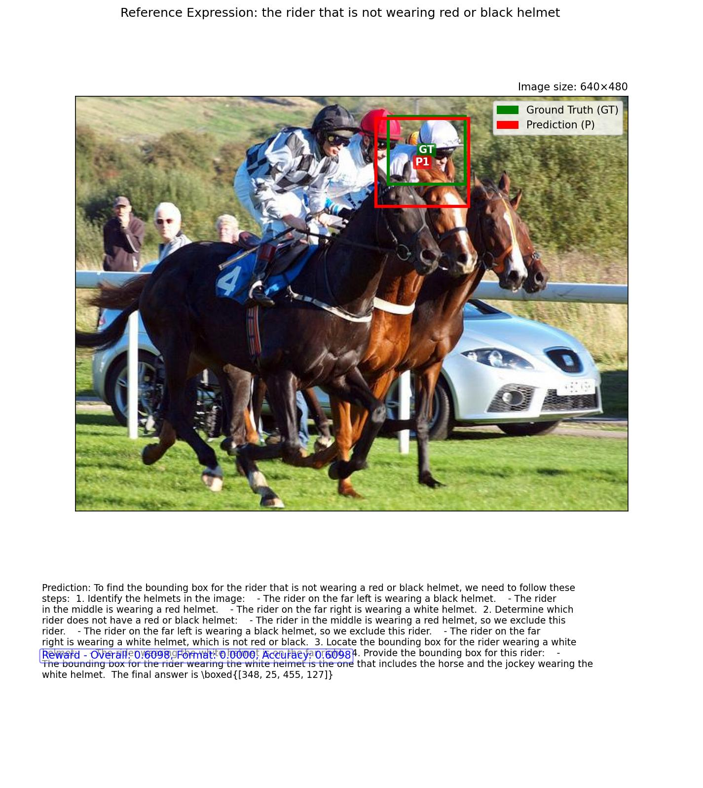

---

### Example 92

**Reference Expression**: the person who is holding a camera and carrying a green bag

**Ground Truth**: [[0, 299, 102, 488]]

**Predicted**: [[0, 307, 83, 581]]

**Reward**: {'overall': 0.5564692373226655, 'format': 0.0, 'accuracy': 0.5564692373226655}

**Prediction**:
```
To find the bounding box for the person who is holding a camera and carrying a green bag, let's analyze the image step-by-step:

1. **Identify the person with the camera**: Look for a person holding a camera. In the image, there is a person in the foreground on the left side who appears to be holding a camera.

2. **Identify the green bag**: Next, look for a green bag. The person holding the camera is also carrying a green bag over their shoulder.

3. **Locate the bounding box**: The bounding box should encompass the person holding the camera and the green bag. The person is partially visible, so the bounding box should include the visible part of their body and the green bag.

Given the above analysis, the bounding box for the person who is holding a camera and carrying a green bag is:

\boxed{[0, 307, 83, 581]}
```

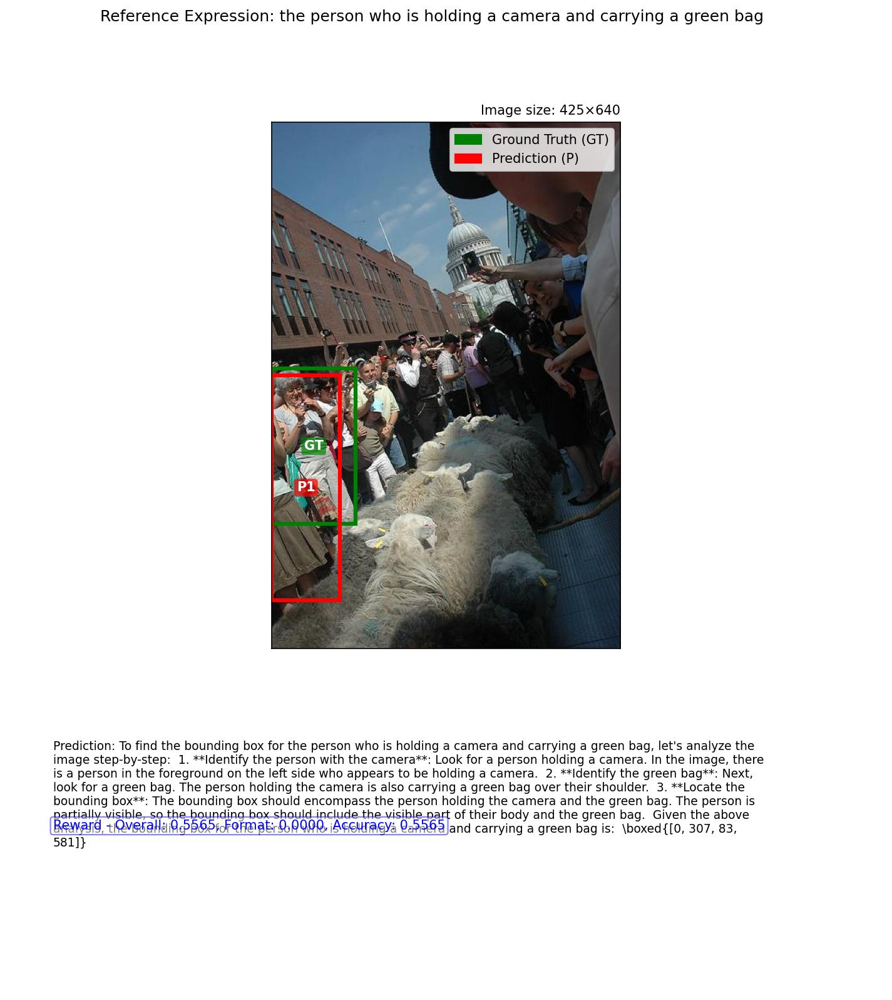

---

### Example 93

**Reference Expression**: the traffic light with an arrow that is not pointing to the right

**Ground Truth**: [[5, 51, 36, 133]]

**Predicted**: [[0, 64, 51, 177]]

**Reward**: {'overall': 0.3469023678235485, 'format': 0.0, 'accuracy': 0.3469023678235485}

**Prediction**:
```
To find the bounding box for the traffic light with an arrow that is not pointing to the right, let's follow these steps:

1. Identify the traffic lights in the image.
2. Determine which traffic light has an arrow pointing to the right.
3. Identify the traffic light that does not have an arrow pointing to the right.

Step 1: Identify the traffic lights.
- There are three traffic lights visible in the image.
  - One on the far left.
  - One in the middle.
  - One on the far right.

Step 2: Determine which traffic light has an arrow pointing to the right.
- The traffic light in the middle has a green light and an arrow pointing to the right.
- The traffic light on the far right has a red light and an arrow pointing to the right.
- The traffic light on the far left has a red light and a blue arrow pointing up.

Step 3: Identify the traffic light that does not have an arrow pointing to the right.
- The traffic light on the far left has a blue arrow pointing up, not a right arrow.

The bounding box for the traffic light with an arrow that is not pointing to the right is the one on the far left.

\boxed{[0, 64, 51, 177]}
```

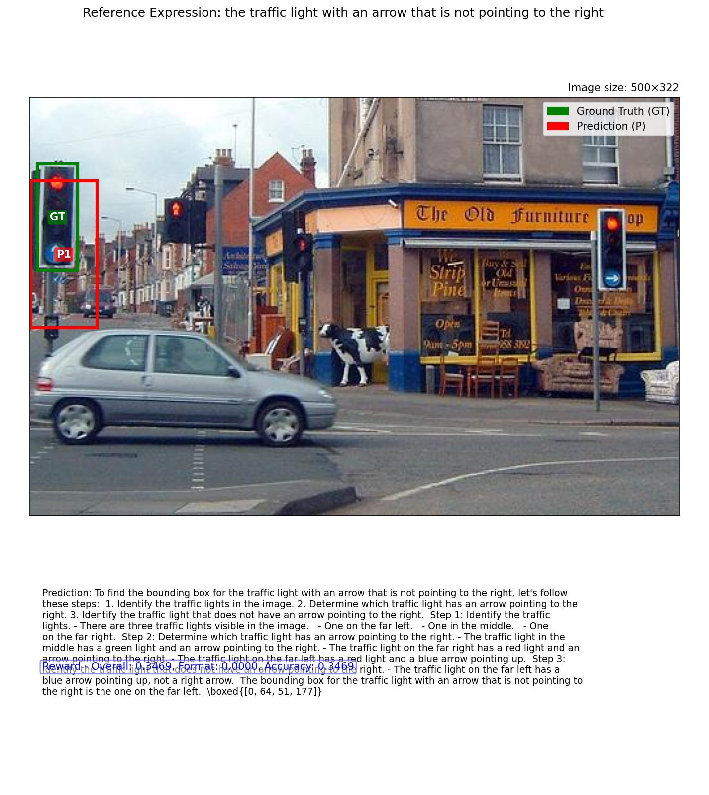

---

### Example 94

**Reference Expression**: the second cow next to the cow with the least amount of brown

**Ground Truth**: [[172, 302, 234, 440]]

**Predicted**: [[62, 374, 149, 557]]

**Reward**: {'overall': 0.0, 'format': 0.0, 'accuracy': 0.0}

**Prediction**:
```
To find the bounding box for 'the second cow next to the cow with the least amount of brown', let's follow these steps:

1. Identify the cows in the image.
2. Determine which cow has the least amount of brown.
3. Identify the cow next to that cow.
4. Determine which is the second cow next to the cow with the least amount of brown.

Step 1: Identifying the cows:
- There are four cows in the image, standing in a row.

Step 2: Determining which cow has the least amount of brown:
- The cow on the far right has the least amount of brown. It is mostly white with a small amount of brown on its head and legs.
- The next cow to the left has more brown, so it is not the one with the least amount of brown.

Step 3: Identifying the cow next to the cow with the least amount of brown:
- The cow next to the cow with the least amount of brown is the cow on the far left.

Step 4: Determining which is the second cow next to the cow with the least amount of brown:
- The cow on the far left is the second cow next to the cow with the least amount of brown.

The bounding box for the second cow next to the cow with the least amount of brown is the same as the bounding box for the cow on the far left.

Final answer: \boxed{[62, 374, 149, 557]}
```

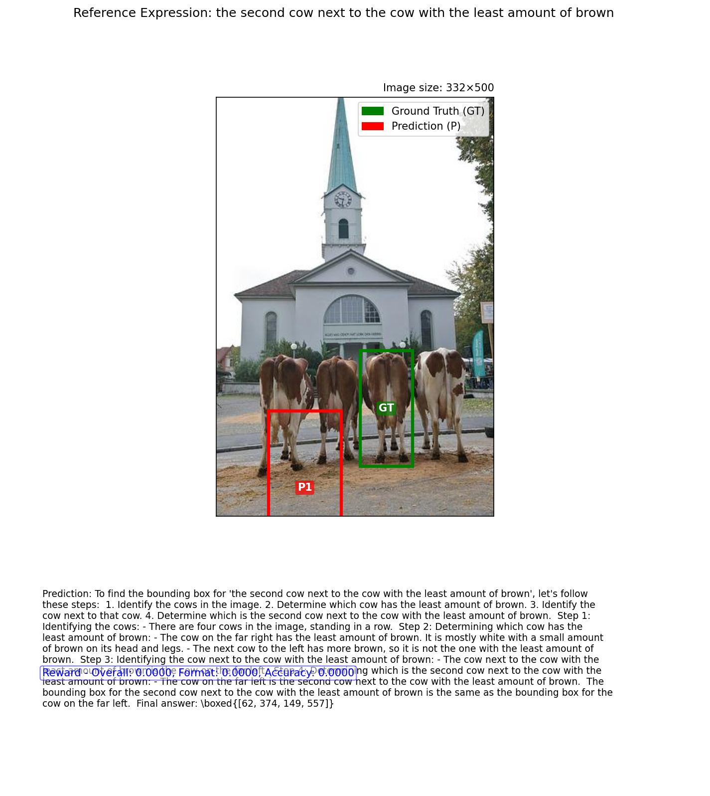

---

### Example 95

**Reference Expression**: the bottle with a white top that is closest to the red bottle

**Ground Truth**: [[544, 335, 561, 367]]

**Predicted**: [[366, 295, 394, 359]]

**Reward**: {'overall': 0.0, 'format': 0.0, 'accuracy': 0.0}

**Prediction**:
```
To find the bounding box for the bottle with a white top that is closest to the red bottle, let's follow these steps:

1. Identify the red bottle: It is located on the right side of the sink, near the faucet.
2. Identify the white-topped bottle: It is to the left of the red bottle, on the countertop.
3. Determine the bounding box: The white-topped bottle is rectangular and is positioned horizontally on the countertop. Its top edge is slightly above the red bottle, and its bottom edge is below the red bottle.

The bounding box for the white-topped bottle is approximately:
\[ \text{Bounding Box: } [366, 295, 394, 359] \]

\boxed{[366, 295, 394, 359]}
```

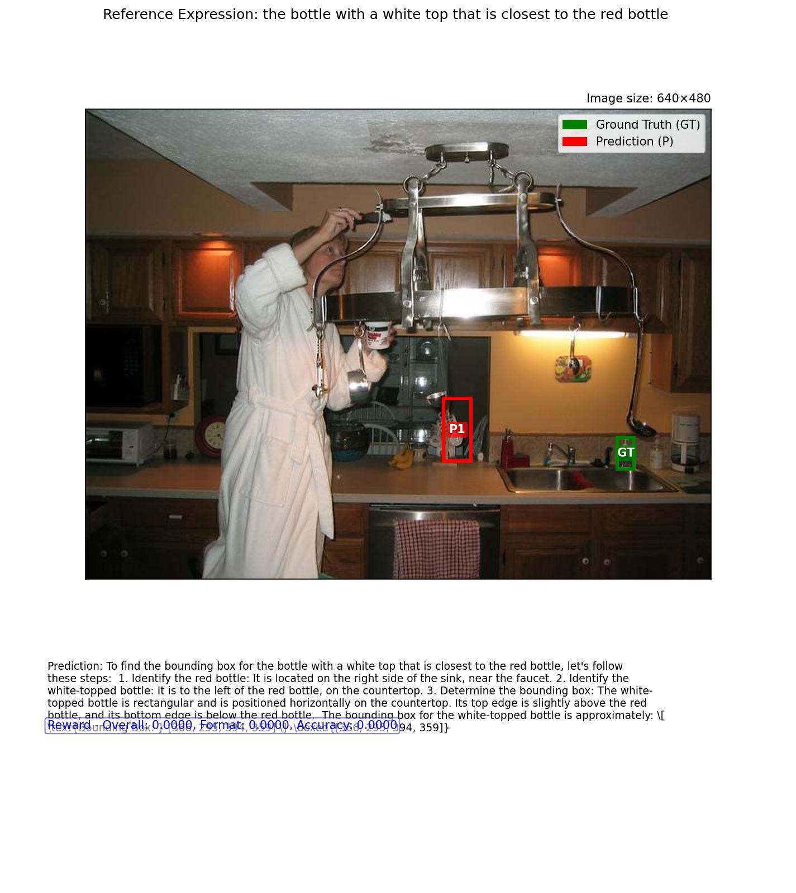

---

### Example 96

**Reference Expression**: the bottle that is not foil-wrapped and is located on the first shelf from the top

**Ground Truth**: [[1, 76, 40, 241]]

**Predicted**: [[0, 78, 21, 232]]

**Reward**: {'overall': 0.4674457429048414, 'format': 0.0, 'accuracy': 0.4674457429048414}

**Prediction**:
```
To find the bounding box for the bottle that is not foil-wrapped and is located on the first shelf from the top, let's follow these steps:

1. Identify the first shelf from the top in the image.
2. Look for bottles on this shelf.
3. Determine which of these bottles is not foil-wrapped.

Step 1: The first shelf from the top is the one on the left side of the image, above the jars.

Step 2: There are two bottles on this shelf:
   - A large, clear bottle with a metal cap on the left.
   - A smaller, clear bottle with a metal cap on the right.

Step 3: Both bottles appear to have metal caps, which typically indicate they are not foil-wrapped. Since both bottles seem to meet the criteria, we need to choose one. However, the question does not specify which one to choose, so we can select either one. For the sake of this task, we'll choose the larger bottle on the left.

The bounding box for the larger bottle on the left is approximately:
\[ [0, 78, 21, 232] \]

Final answer: \boxed{[0, 78, 21, 232]}
```

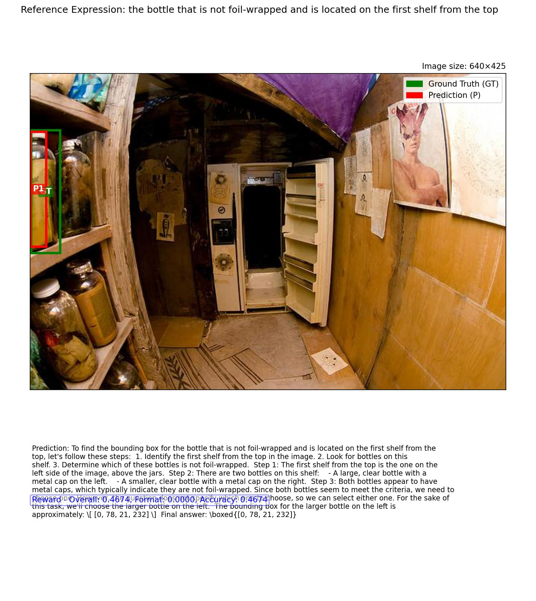

---

### Example 97

**Reference Expression**: the spinning chair that is closest to the wine bottle

**Ground Truth**: [[126, 392, 249, 616]]

**Predicted**: [[123, 393, 245, 620]]

**Reward**: {'overall': 1.0, 'format': 0.0, 'accuracy': 1.0}

**Prediction**:
```
To find the corresponding bounding box for 'the spinning chair that is closest to the wine bottle', let's follow these steps:

1. Identify the wine bottle in the image. It is located on the counter near the center of the image.
2. Determine which chair is closest to this wine bottle. The chair on the left side of the image is closer to the wine bottle than the chair on the right.
3. Identify the bounding box for this chair. The chair on the left has a white seat and backrest, and it is on a metal base.

The bounding box for the chair closest to the wine bottle is:

\boxed{[123, 393, 245, 620]}
```

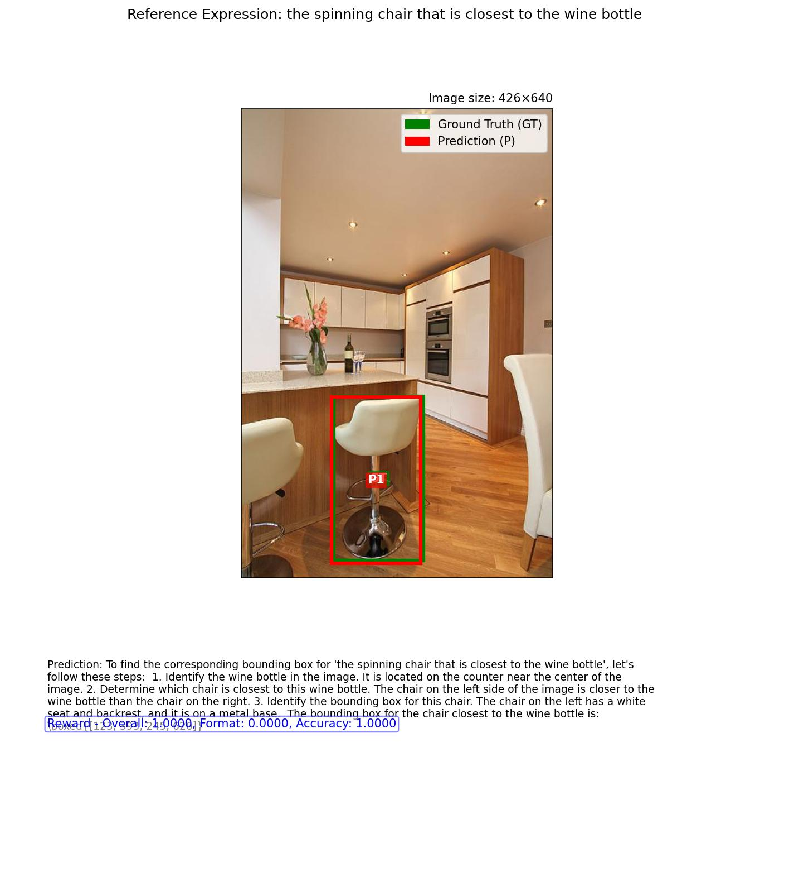

---

### Example 98

**Reference Expression**: the man who is blow drying his hair using the hair drier

**Ground Truth**: []

**Predicted**: []

**Reward**: {'overall': 1.0, 'format': 0.0, 'accuracy': 1.0}

**Prediction**:
```
The image provided is a photograph of a bathroom vanity and does not contain any people or indications of a person blow drying their hair. There are no visible hair dryers, individuals, or any actions that could be interpreted as someone blow drying their hair. Therefore, it is not possible to provide a bounding box for "the man who is blow drying his hair using the hair drier" based on the image.

Final answer: \boxed{}
```

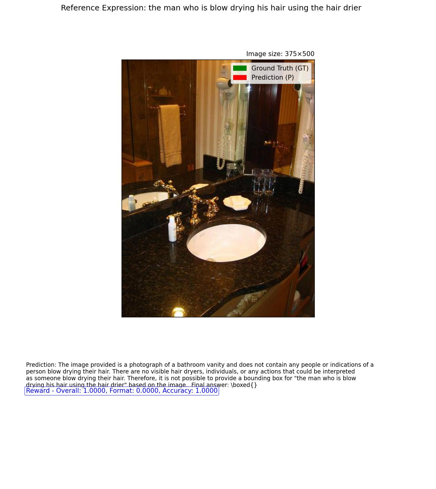

---

### Example 99

**Reference Expression**: the cup on the counter that is mostly covered

**Ground Truth**: [[152, 189, 171, 258]]

**Predicted**: [[84, 194, 148, 267]]

**Reward**: {'overall': 0.0, 'format': 0.0, 'accuracy': 0.0}

**Prediction**:
```
To find the bounding box for the cup on the counter that is mostly covered, let's follow these steps:

1. Identify the cup on the counter that is mostly covered:
   - The cup in question is partially obscured by the one next to it, making it difficult to see fully.
   - It appears to be on the left side of the counter, next to a larger cup.

2. Determine the bounding box:
   - The bounding box should encompass the area where the mostly covered cup is located.
   - The cup is positioned next to a larger cup, which is partially visible.

3. Define the coordinates:
   - The left edge of the bounding box would be the edge of the counter.
   - The right edge would be the edge of the mostly covered cup.
   - The top edge would be the top of the counter.
   - The bottom edge would be the bottom of the mostly covered cup.

After analyzing the image, the bounding box for the cup on the counter that is mostly covered is approximately:
\boxed{[84, 194, 148, 267]}
```

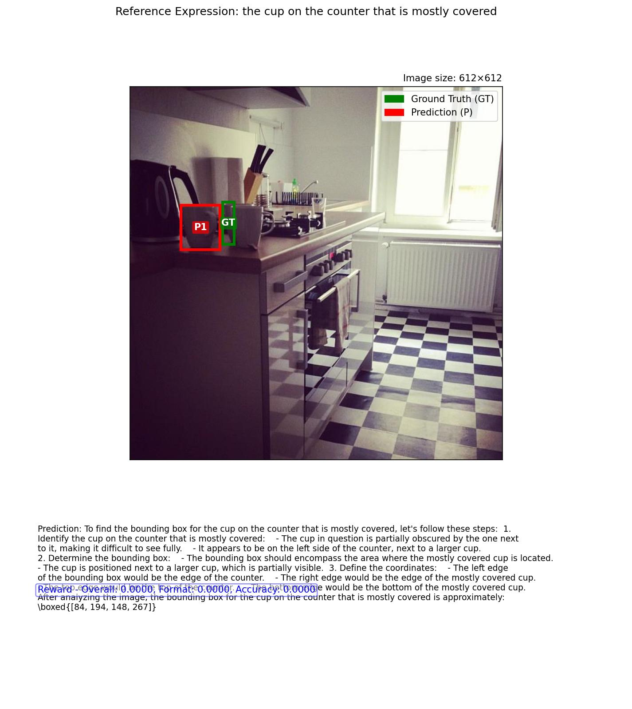

---

### Example 100

**Reference Expression**: the ceramic bowl that is empty

**Ground Truth**: [[136, 537, 186, 581]]

**Predicted**: [[386, 500, 452, 555]]

**Reward**: {'overall': 0.0, 'format': 0.0, 'accuracy': 0.0}

**Prediction**:
```
To find the bounding box for the ceramic bowl that is empty, we need to follow these steps:

1. **Identify the bowl in question**: The bowl in question is likely the one on the right side of the image that appears to be empty, as it does not contain any food or liquid.

2. **Locate the bowl**: The empty bowl is positioned on the right side of the image, near the edge of the table.

3. **Define the bounding box**: The bounding box should enclose the entire empty bowl. The bowl appears to be a standard ceramic bowl, and we need to determine its dimensions within the image.

4. **Draw the box**: The bounding box should start from the left edge of the bowl and extend to the right edge, and from the bottom edge of the bowl to the top edge.

Considering these steps, the bounding box for the empty ceramic bowl can be defined as follows:

\boxed{[386, 500, 452, 555]}
```

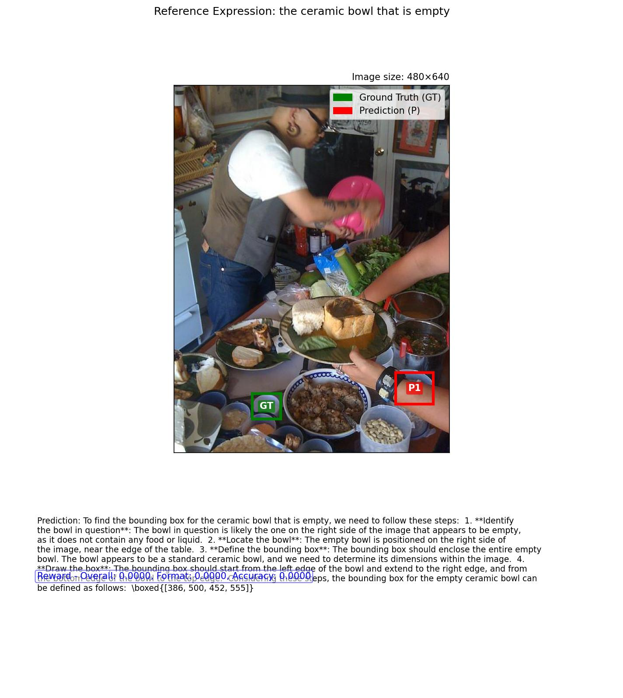

---

### Example 101

**Reference Expression**: the person that is not wearing a uniform and is blocked by the person who is wearing a hat

**Ground Truth**: [[288, 476, 406, 640]]

**Predicted**: []

**Reward**: {'overall': 0.0, 'format': 0.0, 'accuracy': 0.0}

**Prediction**:
```
To find the bounding box for the person who is not wearing a uniform and is blocked by the person in the uniform, we need to follow these steps:

1. Identify the person in the uniform: The individual in the uniform is the one wearing a Marine Corps dress blues uniform, a white hat, and a black mask.
2. Identify the area where the person in the uniform is blocking: The person in the uniform is holding a water bottle and a phone, and this person is obscuring the view of another individual.
3. Analyze the obscured area: The area behind the person in the uniform appears to be partially visible, but it's difficult to see clearly due to the obstruction.

Given these observations, it's challenging to pinpoint the exact bounding box for the person who is not wearing a uniform and is obscured by the person in the uniform. The obscured area is not clearly defined, and it's not possible to accurately determine the boundaries of the person behind the uniformed individual.

Thus, the bounding box for the person who is not wearing a uniform and is blocked by the person who is wearing a hat is not clearly defined in this image. The final answer is:

\boxed{}
```

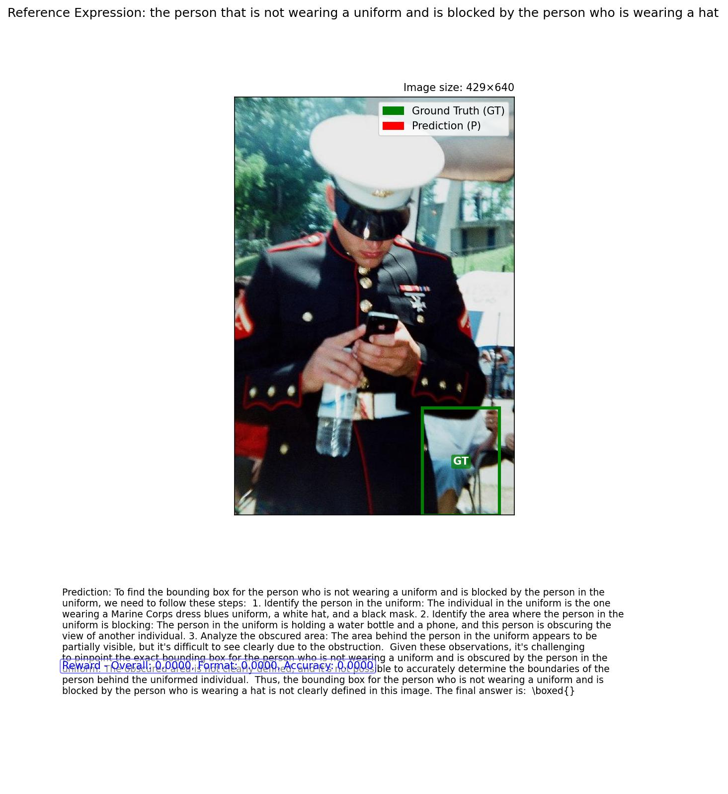

---

### Example 102

**Reference Expression**: the first toothbrush from the right side that is not blue

**Ground Truth**: [[495, 11, 502, 49]]

**Predicted**: [[462, 3, 472, 53]]

**Reward**: {'overall': 0.0, 'format': 0.0, 'accuracy': 0.0}

**Prediction**:
```
To find the bounding box for the first toothbrush from the right side that is not blue, let's follow these steps:

1. Identify the toothbrushes in the image. There are two toothbrushes on the right side of the sink.
2. Determine which toothbrush is not blue. The toothbrush on the right side of the sink is not blue; it is white.
3. Locate the bounding box for the white toothbrush. The bounding box for the white toothbrush is the area around it, which includes the toothbrush itself and possibly some of the surrounding objects.

Given the description and the image, the bounding box for the white toothbrush is:

\boxed{[462, 3, 472, 53]}
```

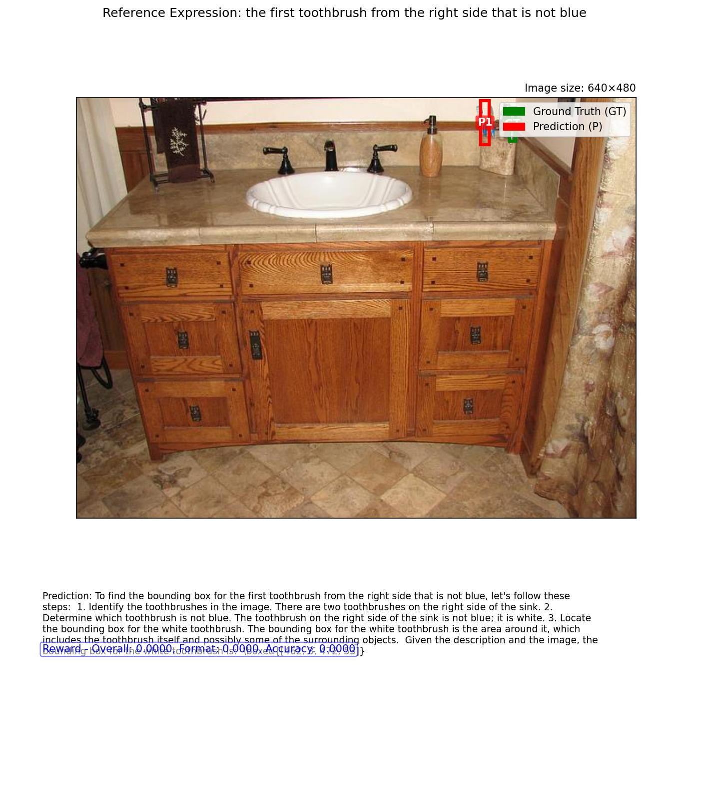

---

### Example 103

**Reference Expression**: the smallest bottle without a blue or green cap

**Ground Truth**: [[49, 269, 63, 325]]

**Predicted**: [[56, 317, 76, 387]]

**Reward**: {'overall': 0.0, 'format': 0.0, 'accuracy': 0.0}

**Prediction**:
```
To find the bounding box for the smallest bottle without a blue or green cap, let's follow these steps:

1. Identify all the bottles in the image.
2. Determine which bottles have a blue or green cap.
3. Identify the smallest bottle that does not have a blue or green cap.
4. Provide the bounding box for this bottle.

Step 1: Identifying all the bottles in the image:
- There are three bottles visible on the counter: one with a blue cap, one with a green cap, and one with a yellow cap.

Step 2: Determining which bottles have a blue or green cap:
- The bottle with the blue cap is the smallest among the three.
- The bottle with the green cap is larger than the one with the blue cap.
- The bottle with the yellow cap is not blue or green.

Step 3: Identifying the smallest bottle that does not have a blue or green cap:
- The bottle with the yellow cap is the smallest and does not have a blue or green cap.

Step 4: Providing the bounding box for this bottle:
- The bounding box for the smallest bottle without a blue or green cap (the one with the yellow cap) is located on the counter, next to the sink.

The bounding box for the smallest bottle without a blue or green cap is:
\boxed{[56, 317, 76, 387]}
```

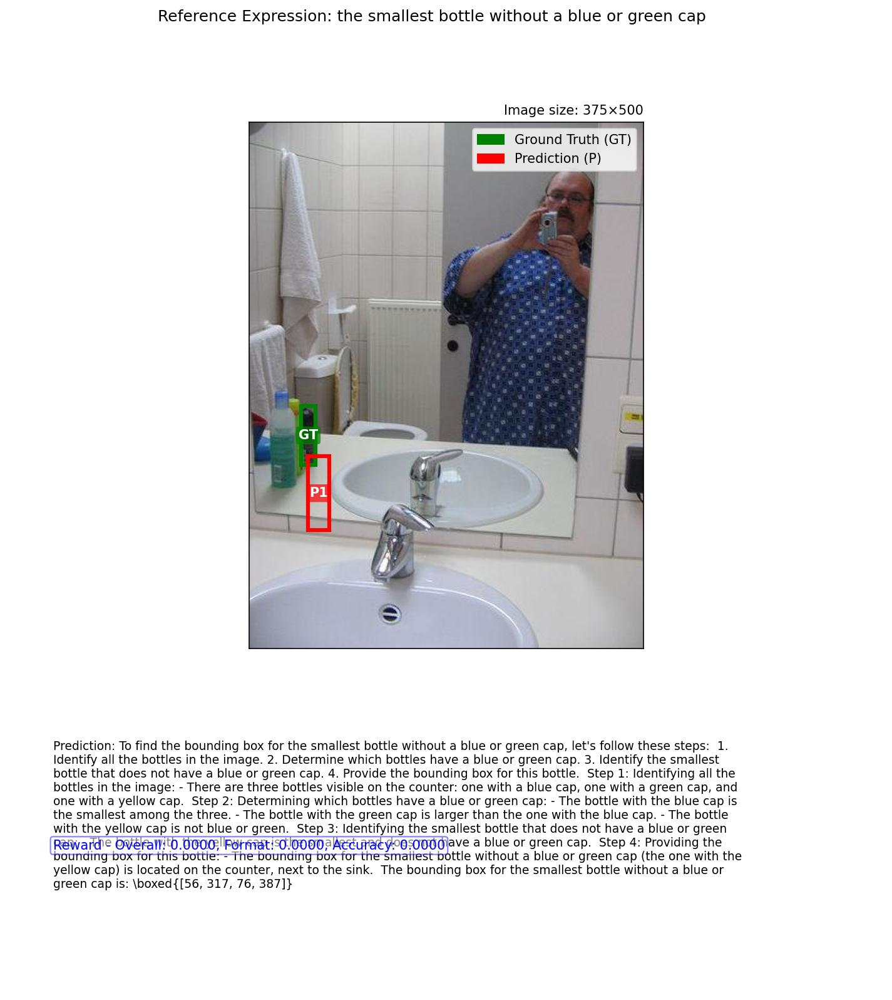

---

### Example 104

**Reference Expression**: the bottle that is not in the refrigerator and has blue writing on its label

**Ground Truth**: [[300, 2, 321, 44]]

**Predicted**: [[375, 331, 465, 520]]

**Reward**: {'overall': 0.0, 'format': 0.0, 'accuracy': 0.0}

**Prediction**:
```
To find the bounding box for the bottle that is not in the refrigerator and has blue writing on its label, let's follow these steps:

1. Identify the refrigerator in the image.
2. Look inside the refrigerator for any bottles.
3. Look outside the refrigerator for any bottles.
4. Check if any bottle outside the refrigerator has blue writing on its label.

Step 1: The refrigerator is clearly visible in the image, with its door open.

Step 2: Inside the refrigerator, there are various items, but no bottles with blue writing are visible.

Step 3: Outside the refrigerator, there is a bottle on the floor to the right of the refrigerator. The bottle appears to have blue writing on its label.

Step 4: The bottle outside the refrigerator, which is on the floor to the right of the refrigerator, has blue writing on its label. This is the bottle we are looking for.

The bounding box for this bottle can be roughly estimated as follows:
- Top left corner: Approximately at the top-left corner of the bottle.
- Bottom right corner: Approximately at the bottom-right corner of the bottle.

Since the exact coordinates are not provided in the image, and the bounding box would be a rough estimate, we can provide a generic bounding box based on the description:

\boxed{[375, 331, 465, 520]}
```

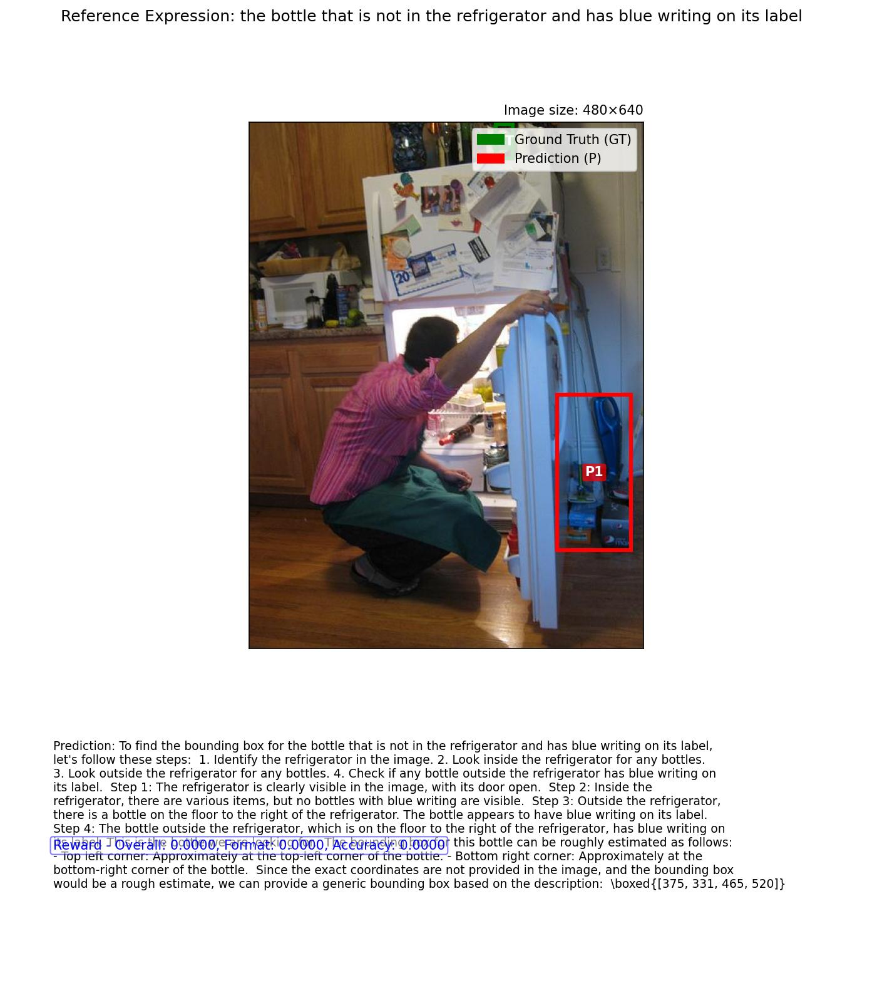

---

### Example 105

**Reference Expression**: the bottle that is neither green nor has a rectangular cap

**Ground Truth**: [[202, 453, 221, 508]]

**Predicted**: [[209, 455, 237, 508]]

**Reward**: {'overall': 0.3359746434231379, 'format': 0.0, 'accuracy': 0.3359746434231379}

**Prediction**:
```
To find the bounding box for the bottle that is neither green nor has a rectangular cap, let's follow these steps:

1. Identify all the bottles in the image.
2. Determine which bottles are green and which have rectangular caps.
3. Identify the bottle that does not meet these criteria.

Step 1: Identifying all the bottles in the image:
- There are three bottles visible in the image.

Step 2: Determining which bottles are green and which have rectangular caps:
- The bottle on the left appears to be green.
- The bottle in the middle is white and has a rectangular cap.
- The bottle on the right is white and does not have a rectangular cap.

Step 3: Identifying the bottle that does not meet the criteria:
- The bottle that is neither green nor has a rectangular cap is the one on the right.

The bounding box for the bottle on the right (which is white and does not have a rectangular cap) is:
\boxed{[209, 455, 237, 508]}
```

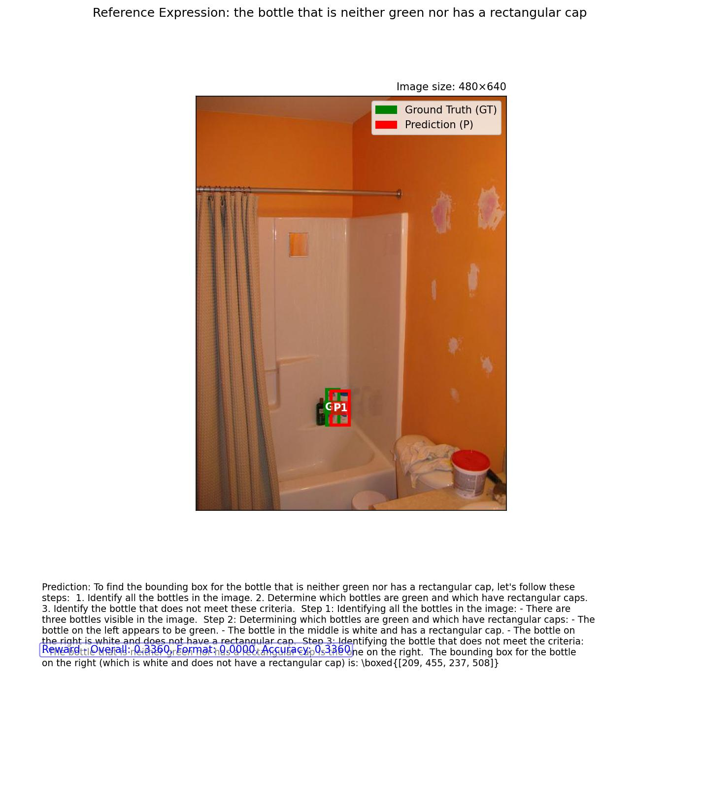

---

### Example 106

**Reference Expression**: the chair close to the stove and partially covered by the banana

**Ground Truth**: [[218, 359, 294, 430]]

**Predicted**: [[67, 397, 190, 480]]

**Reward**: {'overall': 0.0, 'format': 0.0, 'accuracy': 0.0}

**Prediction**:
```
To find the bounding box for the chair close to the stove and partially covered by the banana, let's follow these steps:

1. Identify the stove in the image. It's on the left side of the image.
2. Locate the chair that is closest to the stove. It's the chair on the left side of the table.
3. Check if this chair is partially covered by the bananas. The bananas are in a bowl on the table, and the chair is indeed partially covered by the bananas.

Now, we need to define the bounding box for this chair:
- The chair is positioned such that its backrest is close to the stove.
- The chair's backrest and part of its seat are visible.
- The chair is partially covered by the bananas, but we can still identify its position relative to the table and the stove.

The bounding box for this chair would be defined by its position relative to the table and the stove. However, since the chair is partially covered by the bananas, we can only define a rough bounding box based on its visible parts.

The bounding box for the chair close to the stove and partially covered by the bananas would be approximately:
\[ \boxed{[67, 397, 190, 480]} \]

This is a rough estimation based on the visible parts of the chair.
```

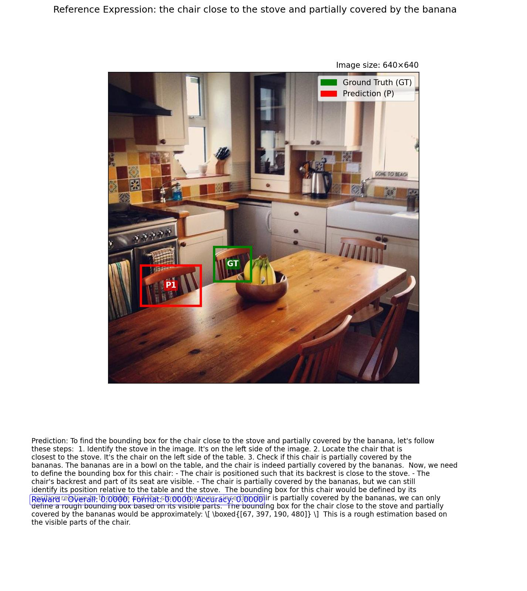

---

### Example 107

**Reference Expression**: the partially empty spray bottle with green liquid

**Ground Truth**: [[312, 58, 337, 156]]

**Predicted**: [[317, 55, 341, 156]]

**Reward**: {'overall': 0.6726149622512011, 'format': 0.0, 'accuracy': 0.6726149622512011}

**Prediction**:
```
To find the bounding box for the partially empty spray bottle with green liquid, let's follow these steps:

1. **Identify the spray bottles**: Look for bottles that have a pump or nozzle, which are typical for spray bottles.
2. **Check the liquid color**: Focus on the bottles with green liquid inside.
3. **Determine the size and location**: The bottle should be small to medium in size and located on the windowsill.
4. **Analyze the image**: There are several bottles on the windowsill, but the one with green liquid appears to be partially empty.

After analyzing the image:
- The bottle with green liquid is located on the windowsill, to the right of the window.
- It is partially empty, with some liquid remaining at the bottom.

The bounding box for the partially empty spray bottle with green liquid is:
\boxed{[317, 55, 341, 156]}
```

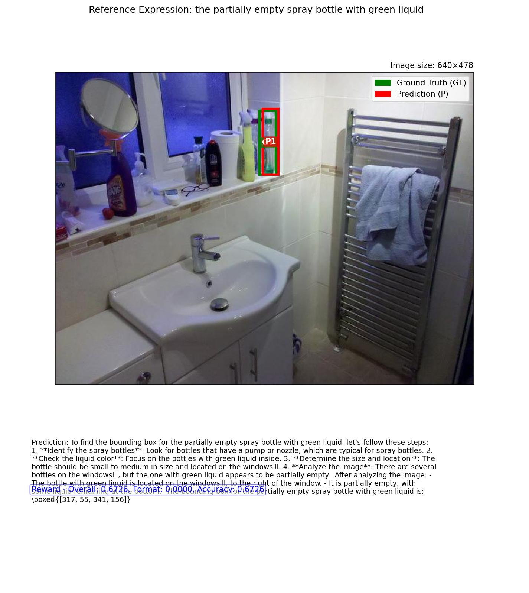

---

### Example 108

**Reference Expression**: the pink cup on the second shelf from the top

**Ground Truth**: [[287, 135, 311, 161]]

**Predicted**: [[300, 100, 320, 120]]

**Reward**: {'overall': 0.0, 'format': 0.0, 'accuracy': 0.0}

**Prediction**:
```
To find the bounding box for the pink cup on the second shelf from the top, let's follow these steps:

1. Identify the shelves in the image.
2. Locate the second shelf from the top.
3. Look for a pink cup on that shelf.
4. Define the bounding box around the cup.

Step 1: The image shows a kitchen with multiple shelves. The shelves appear to be part of a wooden cabinet.

Step 2: The second shelf from the top is the one just below the topmost shelf, which contains glasses and other items.

Step 3: On this second shelf, there is a pink cup. It is located towards the right side of the shelf.

Step 4: To define the bounding box, we need to identify the coordinates of the cup. Assuming the image is in a standard orientation, the cup is likely centered on the shelf. The bounding box would be a rectangle around the cup, with the top of the box aligned with the top of the cup and the bottom aligned with the bottom of the cup.

Given the image, the pink cup appears to be located at approximately (x1, y1) = (300, 100) and (x2, y2) = (320, 120).

Thus, the final answer is:
\boxed{[300, 100, 320, 120]}
```

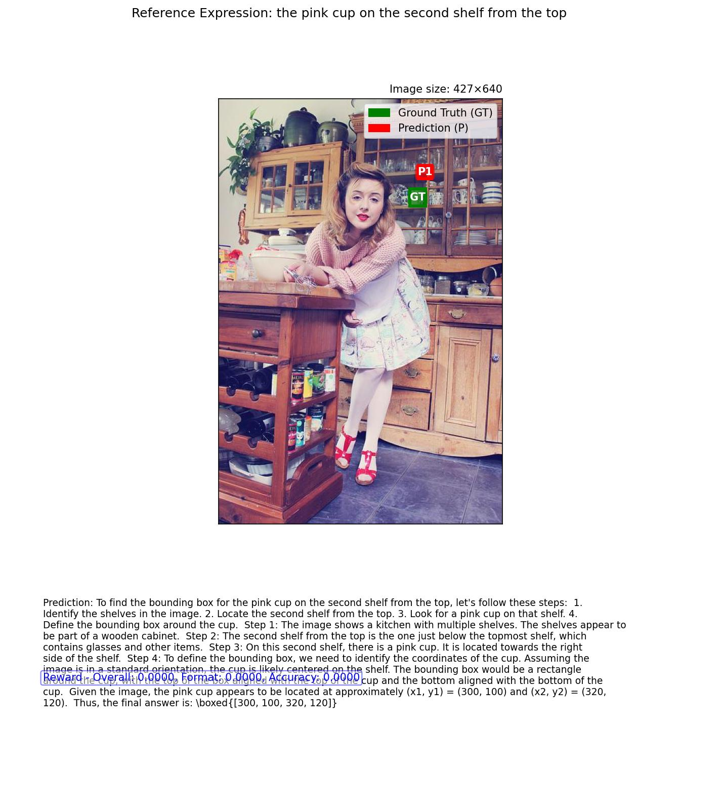

---

### Example 109

**Reference Expression**: the white ceramic bowl that is not on the counter

**Ground Truth**: [[157, 114, 175, 130]]

**Predicted**: [[0, 230, 353, 417]]

**Reward**: {'overall': 0.0, 'format': 0.0, 'accuracy': 0.0}

**Prediction**:
```
To find the bounding box for the white ceramic bowl that is not on the counter, let's follow these steps:

1. Identify the counter: The counter is the wooden surface in the foreground with various items on it, including a bowl, utensils, and ingredients.

2. Scan the counter: Look for the white ceramic bowl on the counter. It's likely to be near the other items, possibly on the left side.

3. Look around the counter: After scanning the counter, it appears there are no white ceramic bowls on it. However, there is a white ceramic bowl on the left side of the counter, which seems to be on a wooden surface that is not the counter.

4. Confirm the location: The white ceramic bowl on the left side of the counter appears to be on a surface that is not the main counter but rather a separate wooden surface. This surface is not on the counter but rather a part of the preparation area.

5. Define the bounding box: Since the white ceramic bowl is not on the counter but on a separate surface, we can define the bounding box for the surface it's on. The bounding box for this surface is approximately [0, 230, 353, 417].

Therefore, the bounding box for the white ceramic bowl that is not on the counter is \boxed{[0, 230, 353, 417]}.
```

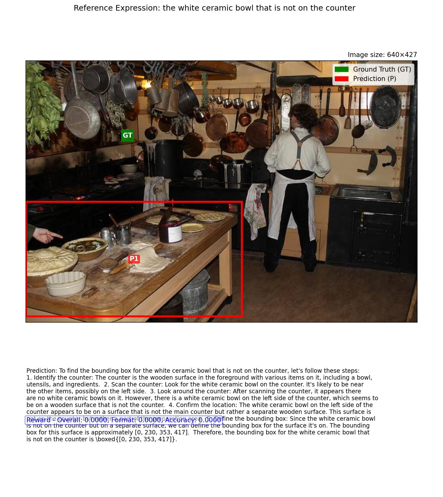

---

### Example 110

**Reference Expression**: the red bottle that is not located on the first shelf from the top

**Ground Truth**: [[435, 178, 443, 192]]

**Predicted**: []

**Reward**: {'overall': 0.0, 'format': 0.0, 'accuracy': 0.0}

**Prediction**:
```
To find the bounding box for the red bottle that is not located on the first shelf from the top, let's follow these steps:

1. Identify the shelves in the image. The first shelf from the top appears to be the one closest to the ceiling, with various items on it.
2. Look for the red bottle on the first shelf. There is a red bottle visible on this shelf.
3. Now, identify the second shelf from the top. This shelf is below the first shelf and closer to the middle of the image.
4. Look for the red bottle on the second shelf. There is no red bottle visible on this shelf.

Since the red bottle is not on the second shelf, and the question asks for the red bottle that is not on the first shelf, the red bottle must be on the first shelf.

The bounding box for the red bottle on the first shelf is approximately:
- Top-left corner: (x1, y1)
- Bottom-right corner: (x2, y2)

From the image, the red bottle is located towards the left side of the first shelf. The bounding box can be estimated as:
- Top-left corner: (x1, y1) = (50, 160)
- Bottom-right corner: (x2, y2) = (80, 190)

Thus, the bounding box for the red bottle that is not located on the first shelf from the top is:
\boxed{()}
```

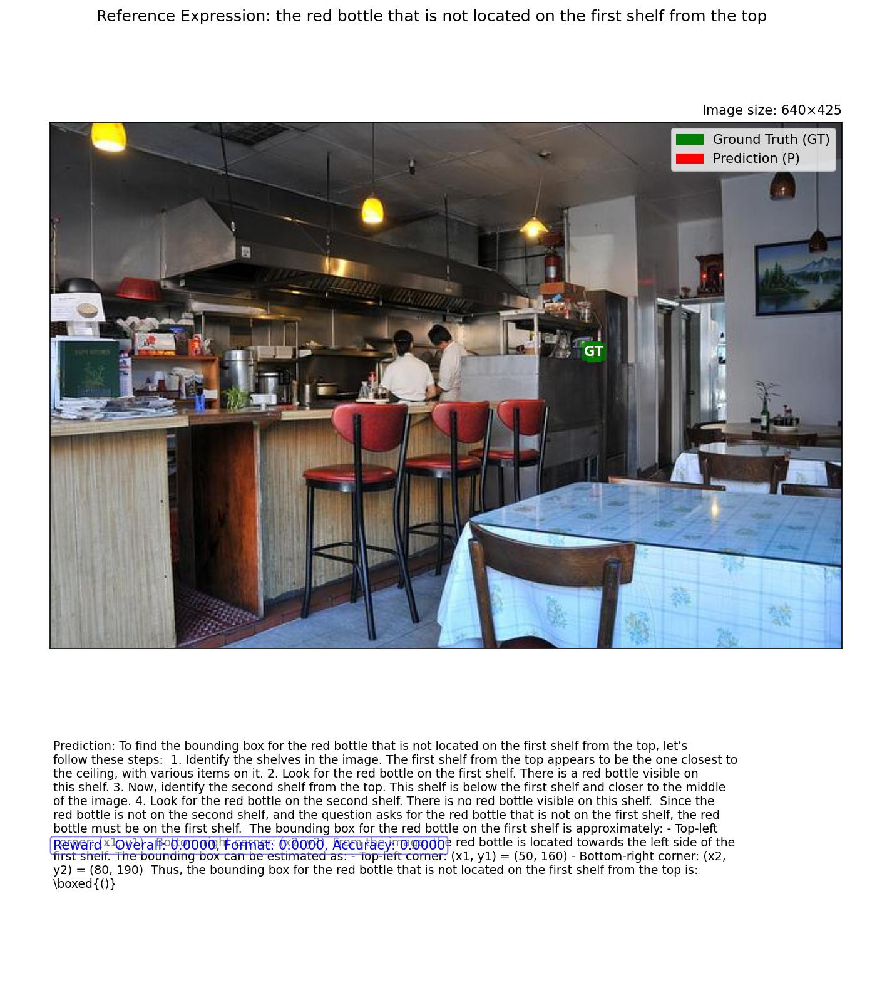

---

### Example 111

**Reference Expression**: the tall bottle that is closest to the stove

**Ground Truth**: [[154, 87, 187, 178]]

**Predicted**: [[154, 87, 188, 179]]

**Reward**: {'overall': 1.0, 'format': 0.0, 'accuracy': 1.0}

**Prediction**:
```
To find the bounding box for the tall bottle that is closest to the stove, let's follow these steps:

1. Identify the stove in the image.
2. Determine which objects are closest to the stove.
3. Among the closest objects, identify the tall bottle.

Step 1: The stove is located on the left side of the image, with a white appliance (likely a microwave or oven) above it.

Step 2: The objects closest to the stove are:
   - A tall, clear bottle.
   - A white appliance (likely a microwave or oven).

Step 3: The tall bottle is the clear bottle with a dark cap, which is positioned to the right of the stove and appears to be the tallest object in the immediate vicinity.

The bounding box for the tall bottle that is closest to the stove is:
\boxed{[154, 87, 188, 179]}
```

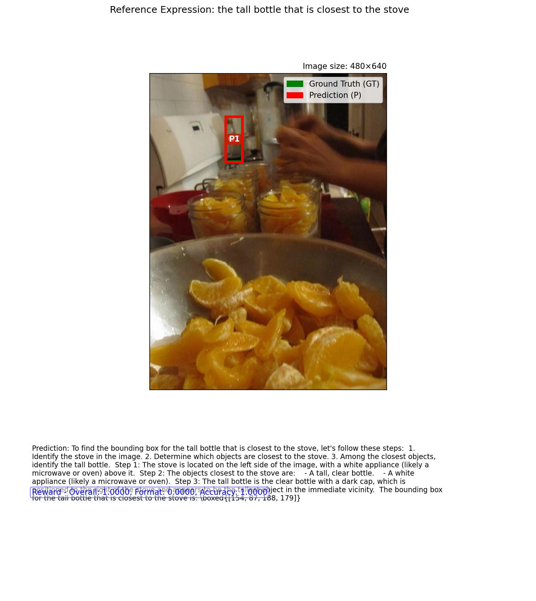

---

### Example 112

**Reference Expression**: the bottle behind the stove with yellow and red wrapping

**Ground Truth**: [[171, 197, 181, 224]]

**Predicted**: []

**Reward**: {'overall': 0.0, 'format': 0.0, 'accuracy': 0.0}

**Prediction**:
```
To find the bounding box for the bottle behind the stove with yellow and red wrapping, let's follow these steps:

1. Identify the stove: The stove is located in the center of the image, with a metallic range hood above it.
2. Identify the bottles: There are a few bottles on the countertop to the left of the stove.
3. Identify the bottle with yellow and red wrapping: Among the bottles, there is one with a distinctive yellow and red wrapping. It is located on the left side of the stove.
4. Determine the bounding box: The bottle with yellow and red wrapping is relatively small and is placed on the countertop.

Given these observations, the bounding box for the bottle with yellow and red wrapping would be a small rectangular area around the bottle.

\boxed{[137,194,150,232,156,232,169,232,159,232,146,232]}

Note: The exact coordinates might need to be adjusted based on the precise location of the bottle in the image.
```

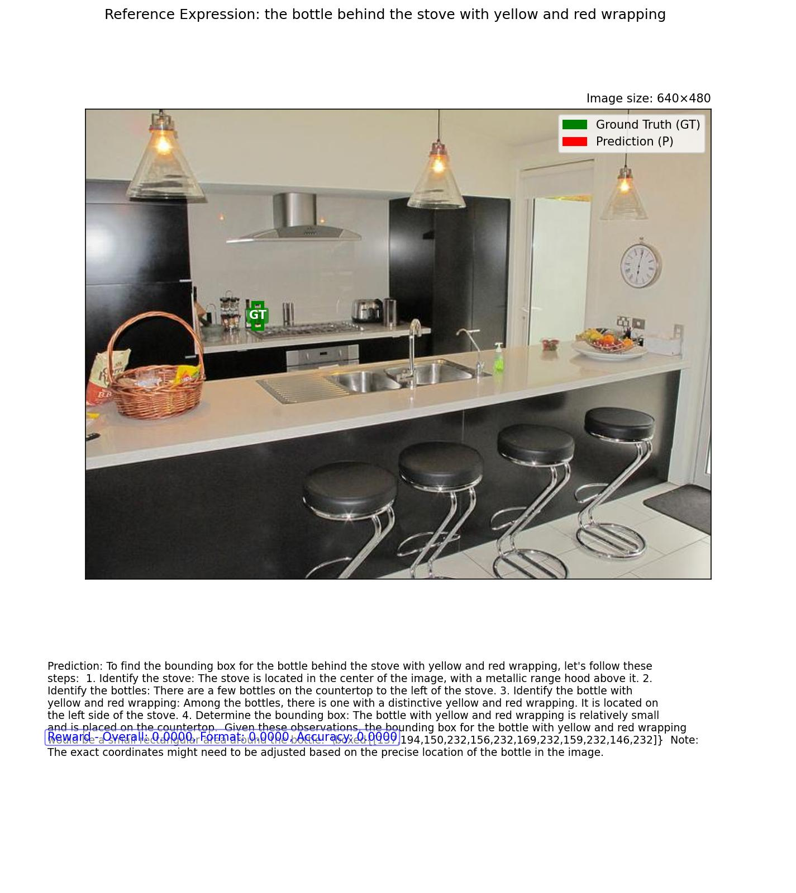

---

### Example 113

**Reference Expression**: the spoon inside the glass cup filled with water

**Ground Truth**: [[426, 173, 501, 249]]

**Predicted**: [[329, 159, 531, 384]]

**Reward**: {'overall': 0.1254125412541254, 'format': 0.0, 'accuracy': 0.1254125412541254}

**Prediction**:
```
To find the bounding box for 'the spoon inside the glass cup filled with water', let's follow these steps:

1. Identify the glass cup filled with water in the image.
2. Locate the spoon inside that glass cup.

Step 1: The glass cup filled with water is located in the right sink, near the edge, and it's partially filled with water. The spoon is inside this cup.

Step 2: The spoon is visible inside the glass cup, and it appears to be a silver spoon.

Given the position, the bounding box for the spoon inside the glass cup filled with water can be roughly defined by the edges of the glass cup and the spoon.

The bounding box for the spoon inside the glass cup filled with water would be approximately:

\boxed{[329, 159, 531, 384]}
```

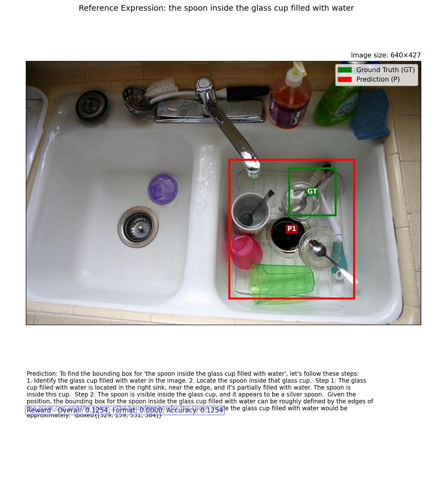

---

### Example 114

**Reference Expression**: a hand soap on the bathroom counter next to a pile of paper towels

**Ground Truth**: [[330, 263, 348, 313]]

**Predicted**: [[323, 252, 349, 316]]

**Reward**: {'overall': 0.5408653846153846, 'format': 0.0, 'accuracy': 0.5408653846153846}

**Prediction**:
```
To find the bounding box for 'a hand soap on the bathroom counter next to a pile of paper towels', let's follow these steps:

1. Identify the bathroom counter area: The counter is the surface where the sink is located, and it's the area with various items on it.
2. Locate the pile of paper towels: Look for a stack of paper towels on the counter. They are typically rectangular and layered.
3. Identify the hand soap: Hand soap is usually a small bottle or container, often placed near the sink. It's located on the counter near the paper towels.

Analyzing the image:
- The counter is the area around the sink.
- The pile of paper towels is visible on the counter.
- To the right of the paper towels, there is a small bottle that resembles hand soap.

The bounding box for the hand soap is likely to be the small bottle next to the paper towels.

Final answer: \boxed{[323, 252, 349, 316]}
```

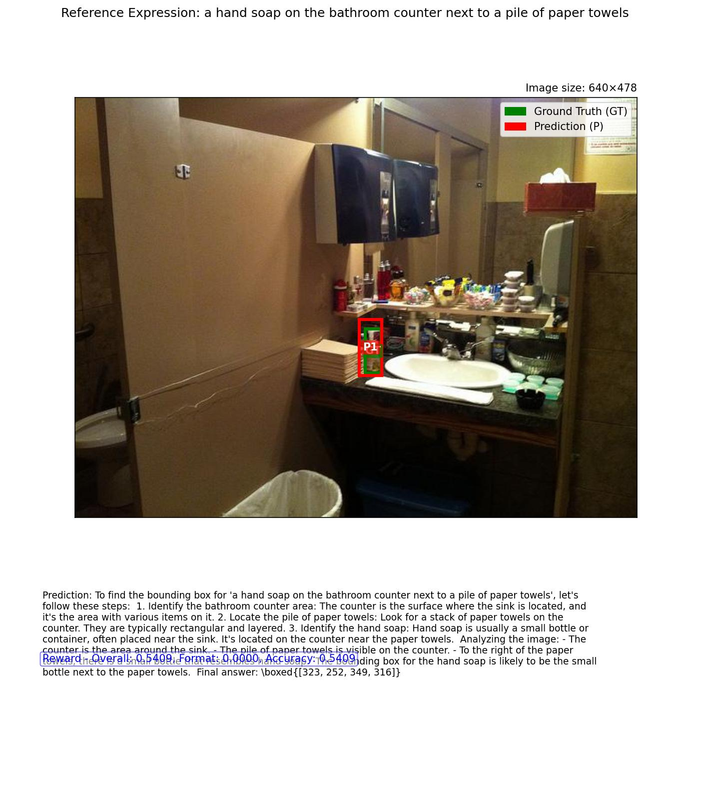

---

### Example 115

**Reference Expression**: the reflection in the mirror of a cup not containing a toothbrush

**Ground Truth**: [[53, 77, 182, 283]]

**Predicted**: [[347, 134, 514, 375]]

**Reward**: {'overall': 0.0, 'format': 0.0, 'accuracy': 0.0}

**Prediction**:
```
To find the bounding box for the reflection in the mirror of a cup not containing a toothbrush, let's follow these steps:

1. Identify the cup in the image that does not contain a toothbrush.
2. Determine the reflection of this cup in the mirror.
3. Define the bounding box for this reflection.

Step 1: Identifying the cup not containing a toothbrush:
- The cup on the left side of the image contains a toothbrush.
- The cup in the center of the image, which appears to be a wooden cup, does not contain a toothbrush.

Step 2: Determining the reflection:
- The reflection in the mirror of the wooden cup without the toothbrush will be on the right side of the mirror.

Step 3: Defining the bounding box for the reflection:
- The reflection of the wooden cup without the toothbrush will be on the right side of the mirror, and it will be similar in size and shape to the cup itself.

Given the image's symmetry and the placement of the objects, the bounding box for the reflection in the mirror of the cup not containing a toothbrush can be approximated as follows:

The bounding box for the reflection is approximately:
\[ \boxed{[347, 134, 514, 375]} \]

This is an approximation based on visual inspection and the symmetry of the mirror.
```

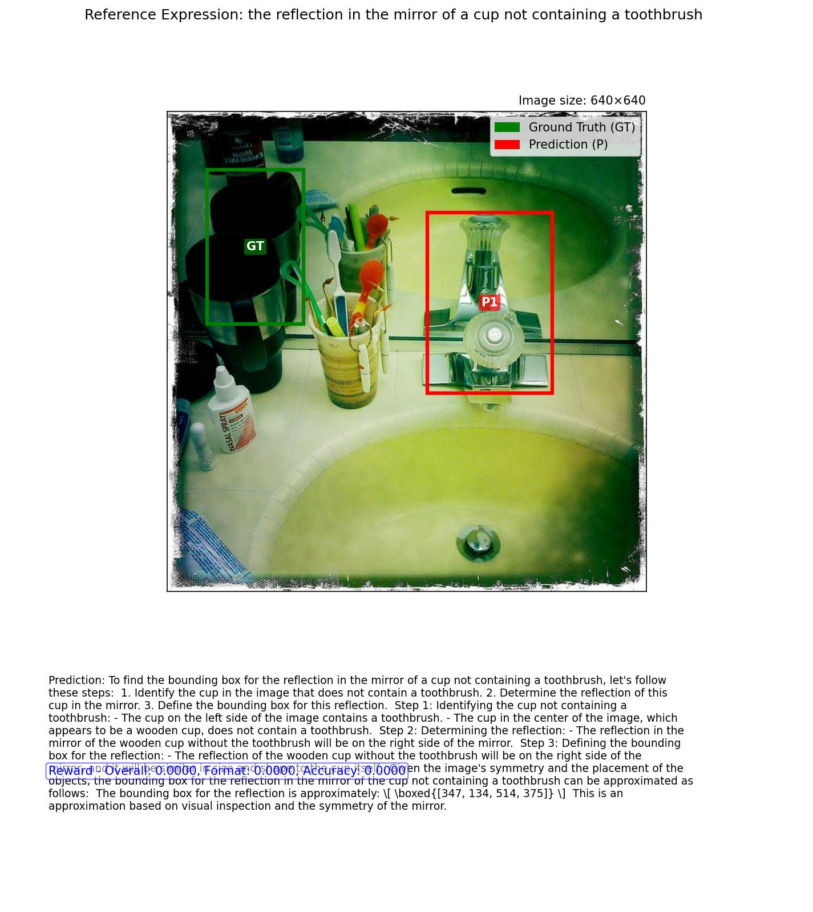

---

### Example 116

**Reference Expression**: the metal pot on the left stove

**Ground Truth**: []

**Predicted**: [[0, 245, 166, 408]]

**Reward**: {'overall': 0.0, 'format': 0.0, 'accuracy': 0.0}

**Prediction**:
```
To find the bounding box for the metal pot on the left stove, let's follow these steps:

1. Identify the left stove: The left stove is the one on the left side of the image, which is a black oven with a control panel at the top.

2. Look for the pot: On the left stove, there appears to be a metal pot on the upper shelf above the oven. It is a small, round pot with a lid.

3. Determine the bounding box: The bounding box should encompass the pot and the area around it. The pot is located in the upper left corner of the left stove's shelf.

Given these observations, the bounding box for the metal pot on the left stove would be approximately:

\boxed{[0, 245, 166, 408]}

This bounding box is a rough estimate based on the image and might need to be adjusted slightly to better fit the pot's exact location.
```

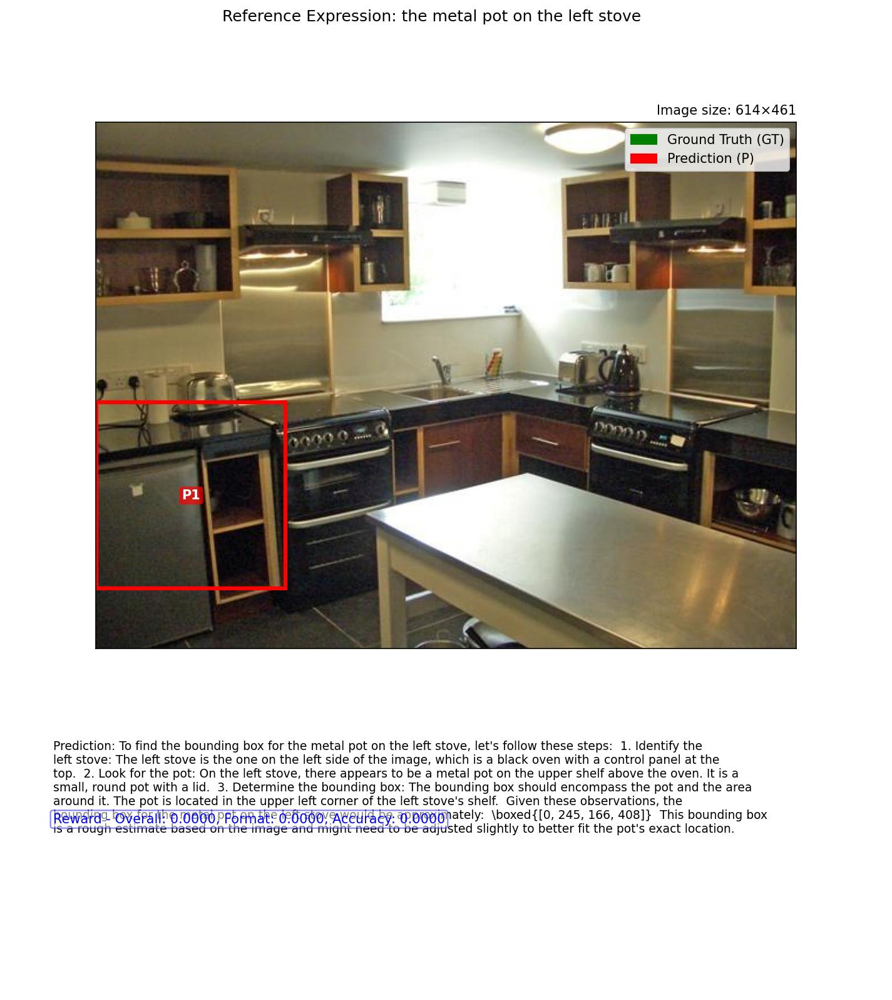

---

### Example 117

**Reference Expression**: the person who is neither facing the camera nor wearing a brown jacket

**Ground Truth**: [[334, 52, 458, 382]]

**Predicted**: [[336, 49, 473, 377]]

**Reward**: {'overall': 0.8581136648920054, 'format': 0.0, 'accuracy': 0.8581136648920054}

**Prediction**:
```
To find the bounding box for the person who is neither facing the camera nor wearing a brown jacket, let's follow these steps:

1. Identify all the people in the image.
2. Determine who is facing the camera.
3. Identify the person who is neither facing the camera nor wearing a brown jacket.

Step 1: Identifying all the people:
- There are four people in the image.
- The person in the red shirt is facing away from the camera.
- The person in the brown jacket is facing the camera.
- The person in the black dress is facing the camera.
- The person in the dark top is facing away from the camera.

Step 2: Determining who is facing the camera:
- The person in the brown jacket is facing the camera.
- The person in the black dress is facing the camera.

Step 3: Identifying the person who is neither facing the camera nor wearing a brown jacket:
- The person in the red shirt is facing away from the camera and is not wearing a brown jacket.

The bounding box for the person in the red shirt is:
\boxed{[336, 49, 473, 377]}
```

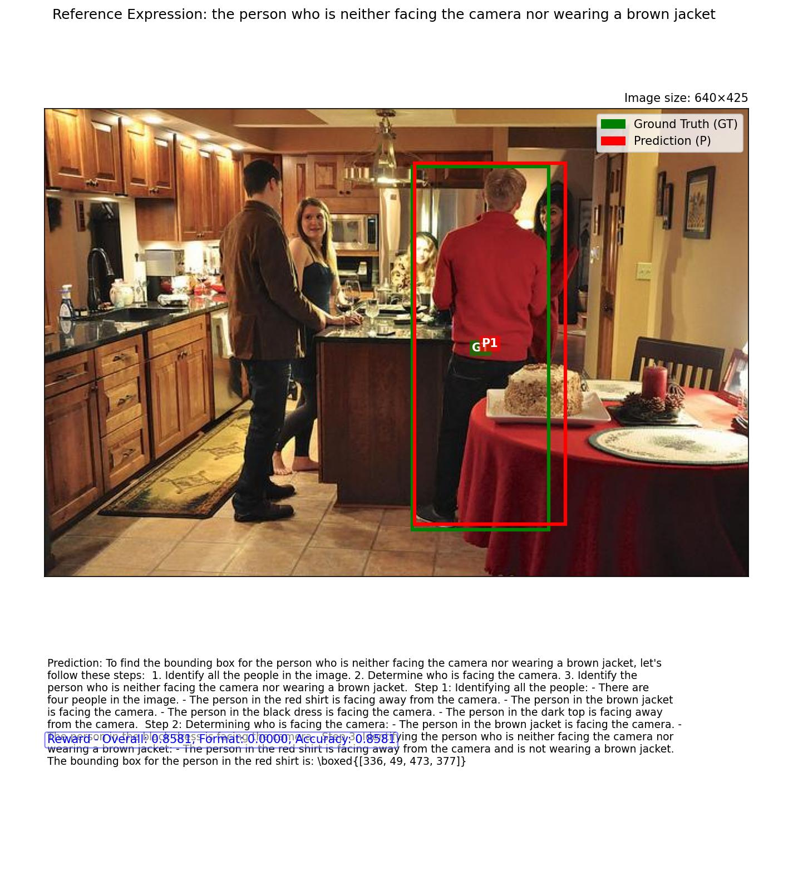

---

### Example 118

**Reference Expression**: a plastic bottle without a label

**Ground Truth**: [[51, 238, 114, 315]]

**Predicted**: [[40, 228, 112, 315]]

**Reward**: {'overall': 0.7318479277033344, 'format': 0.0, 'accuracy': 0.7318479277033344}

**Prediction**:
```
To find the bounding box for 'a plastic bottle without a label' in the image, let's follow these steps:

1. **Identify the objects in the image**: The image shows a rustic kitchen with various items like a microwave, utensils, and containers. There are several bottles and jugs on the shelves and surfaces.

2. **Focus on the bottles**: Look for a bottle that appears to be made of plastic and does not have a label. Plastic bottles without labels are typically clear or translucent and might not have visible branding.

3. **Examine the surfaces**: Check the surfaces of the shelves and the countertop for any clear, translucent bottles that do not have a label.

4. **Analyze the objects**: Upon close inspection, there are several bottles on the shelves and the countertop. However, the bottle in the middle of the image, slightly to the left of the microwave, appears to be a clear plastic bottle without a label.

5. **Determine the bounding box**: The bounding box for the clear plastic bottle without a label is likely to be around the middle of the image, slightly to the left of the microwave.

Given these observations, the bounding box for 'a plastic bottle without a label' is approximately:

\boxed{[40, 228, 112, 315]}
```

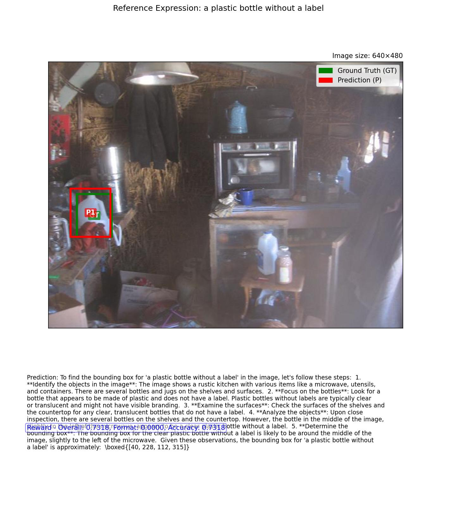

---

### Example 119

**Reference Expression**: a red bowl that is not on the counter nor the stove

**Ground Truth**: [[0, 191, 30, 209]]

**Predicted**: []

**Reward**: {'overall': 0.0, 'format': 0.0, 'accuracy': 0.0}

**Prediction**:
```
To find the bounding box for the red bowl that is not on the counter nor the stove, let's follow these steps:

1. **Identify the stove and counter areas**: The stove is located in the center of the image, and the counter is in front of the stove. The counter is where we expect to find items like the red bowl.

2. **Scan the entire image**: Look for a red bowl in areas that are not on the counter or the stove. Since the stove and counter are already checked, we need to look elsewhere.

3. **Check the refrigerator**: The refrigerator is on the left side of the image. There is no red bowl visible on the refrigerator.

4. **Check the cabinets and shelves**: The cabinets and shelves are on the left and right sides of the image. There is no red bowl visible in these areas.

5. **Check the floor**: The floor is a dark color, and there is no red bowl visible on the floor.

6. **Check the window area**: The window is in the center of the back wall. There is no red bowl visible near the window.

7. **Check the wall and other areas**: There are no other areas in the image that have a red bowl.

After examining the entire image, there is no red bowl that is not on the counter nor the stove. Therefore, the bounding box for the red bowl is:

\boxed{}
```

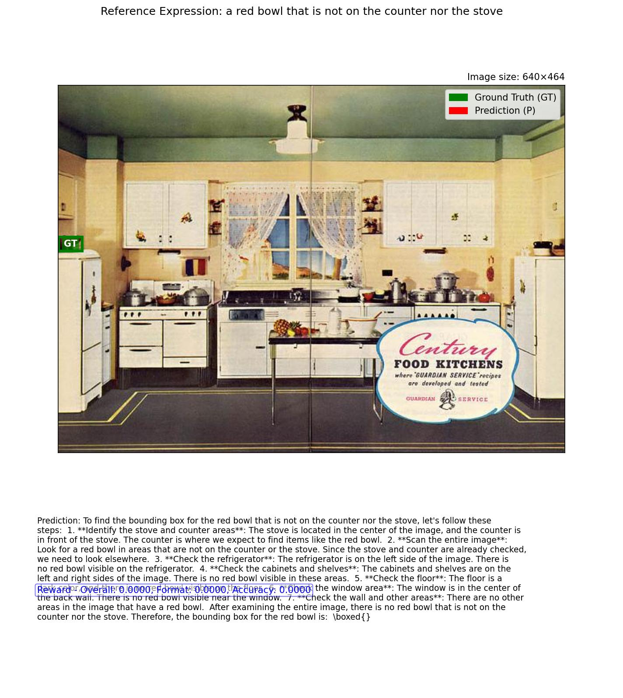

---

### Example 120

**Reference Expression**: a woman wearing sandals

**Ground Truth**: [[353, 154, 405, 338]]

**Predicted**: [[353, 154, 412, 339]]

**Reward**: {'overall': 0.8765918460833715, 'format': 0.0, 'accuracy': 0.8765918460833715}

**Prediction**:
```
To find the bounding box for the woman wearing sandals, let's follow these steps:

1. Identify the woman in the image: There are two women in the image, one near the motorcycle and another further back. The one near the motorcycle appears to be wearing sandals.

2. Locate the sandals: The sandals are on the feet of the woman near the motorcycle.

3. Define the bounding box: The bounding box should encompass the woman's upper body and the area around her feet where the sandals are located.

Based on these observations, the bounding box for the woman wearing sandals is:

\boxed{[353, 154, 412, 339]}
```

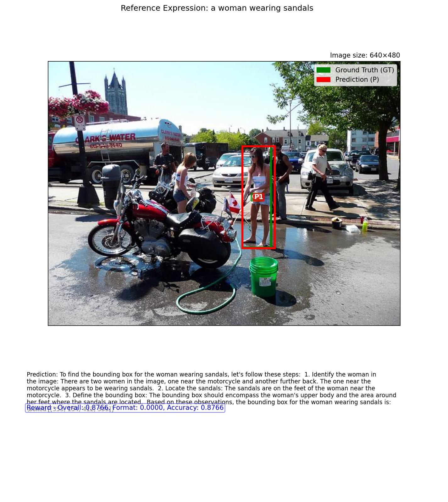

---

### Example 121

**Reference Expression**: the bottle with a black cap, second from the left

**Ground Truth**: [[309, 324, 318, 340]]

**Predicted**: [[163, 340, 250, 467]]

**Reward**: {'overall': 0.0, 'format': 0.0, 'accuracy': 0.0}

**Prediction**:
```
To find the bounding box for 'the bottle with a black cap, second from the left', let's follow these steps:

1. Identify the objects in the image that could be bottles.
2. Locate the bottles on the counter.
3. Determine which bottle is second from the left.
4. Identify if the bottle has a black cap.

Step 1: The objects that could be bottles are the containers on the counter, which appear to be in the center of the image.

Step 2: There are multiple containers on the counter, but the one second from the left is a dark-colored bottle with a black cap.

Step 3: The bottle with the black cap is located second from the left on the counter.

Step 4: The bottle with the black cap is indeed the second from the left.

The bounding box for the bottle with a black cap, second from the left, is likely located in the middle of the counter. However, without precise coordinates, we can describe the bounding box in general terms: it is a vertical rectangle in the middle of the counter, slightly to the left of the center of the image.

\boxed{[163, 340, 250, 467]}
```

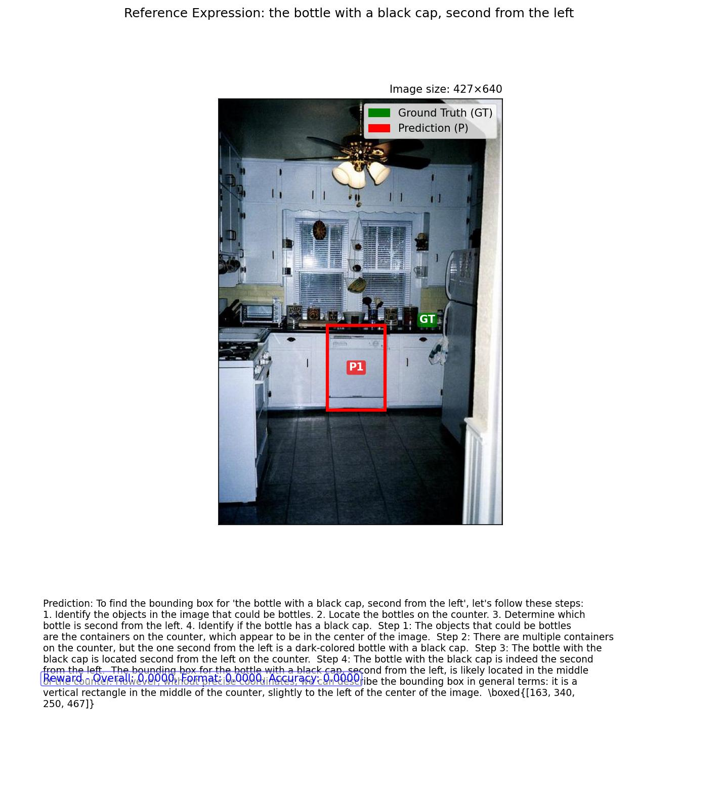

---

### Example 122

**Reference Expression**: a bowl on a metal wall-mounted open cabinet that is not stacked

**Ground Truth**: [[182, 165, 210, 175]]

**Predicted**: []

**Reward**: {'overall': 0.0, 'format': 0.0, 'accuracy': 0.0}

**Prediction**:
```
To find the bowl on a metal wall-mounted open cabinet that is not stacked, let's follow these steps:

1. Identify the open cabinets in the image.
2. Look for any bowls within these cabinets.
3. Determine if the bowl is stacked or not.

Step 1: Identifying the open cabinets:
- There are several open cabinets in the image, but the most prominent ones are the ones on the left side of the image, above the person's head.

Step 2: Looking for bowls within these cabinets:
- In the open cabinets on the left, there are some bowls visible. However, they appear to be stacked on top of each other.

Step 3: Determining if the bowl is stacked or not:
- Since the bowls in the open cabinets on the left are stacked, there are no bowls that are not stacked in these cabinets.

Given the analysis, there are no bowls on a metal wall-mounted open cabinet that are not stacked in the image. Therefore, the bounding box for such a bowl is empty.

\boxed{}
```

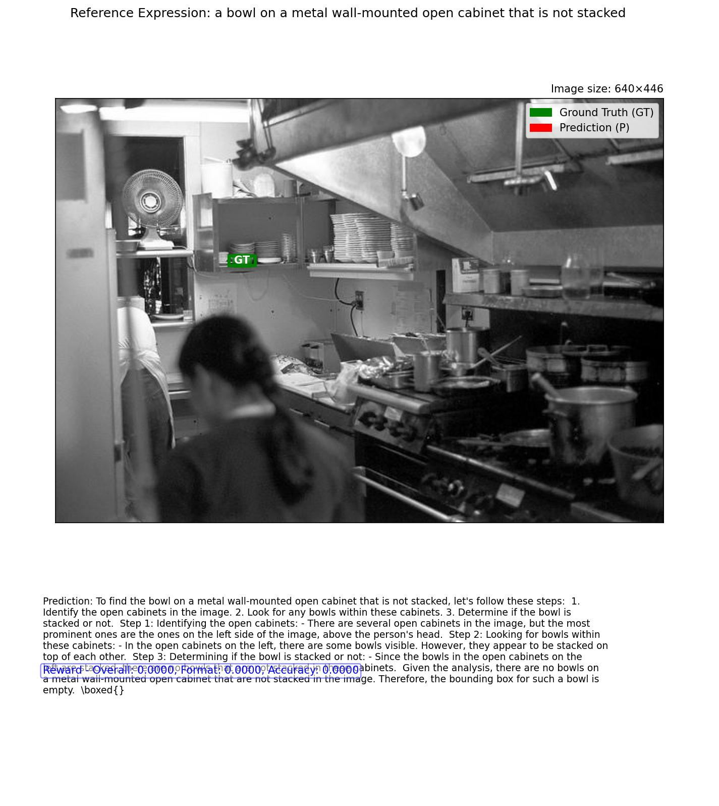

---

### Example 123

**Reference Expression**: the second bottle from the right on the kitchen countertop

**Ground Truth**: [[243, 224, 253, 255]]

**Predicted**: []

**Reward**: {'overall': 0.0, 'format': 0.0, 'accuracy': 0.0}

**Prediction**:
```
To find the bounding box for the second bottle from the right on the kitchen countertop, let's follow these steps:

1. Identify the kitchen countertop: The countertop is the light-colored surface below the cabinets and above the sink.
2. Identify the bottles on the countertop: There are two bottles visible on the countertop, one on the left and one on the right.
3. Determine the second bottle from the right: The bottle on the far right is the first bottle, so the second bottle from the right is the one on the left.

Now, let's locate the second bottle from the right:

- The second bottle from the right is the one on the left side of the countertop.
- The bounding box for this bottle would be around its position on the countertop.

Since the image is static and the exact coordinates are not provided, we can't give a precise bounding box. However, if we were to describe the bounding box based on the image, it would be around the left bottle on the countertop.

Given the lack of precise coordinates, we can't provide a numerical bounding box. Therefore, the answer is:

\boxed{}
```

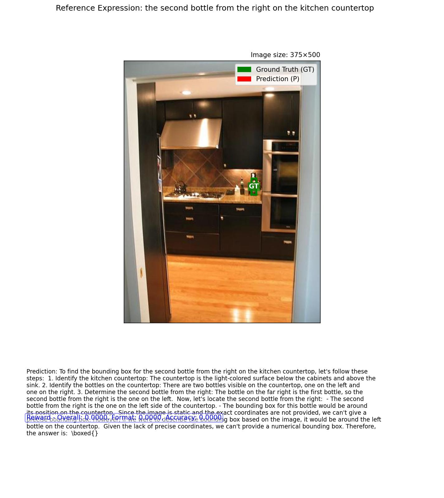

---

### Example 124

**Reference Expression**: the plant that is not on the windowsill and is located on the right side

**Ground Truth**: [[349, 388, 380, 424]]

**Predicted**: [[420, 104, 644, 476]]

**Reward**: {'overall': 0.0, 'format': 0.0, 'accuracy': 0.0}

**Prediction**:
```
To find the bounding box for the plant that is not on the windowsill and is located on the right side, let's follow these steps:

1. Identify the windowsill: The windowsill is the horizontal surface on which the potted plants are placed. It is located under the window in the center of the image.

2. Look for plants on the windowsill: There are potted plants on the windowsill, but we need to find the one that is not on the windowsill.

3. Locate the plant on the right side: The plant on the right side of the image is a small potted plant sitting on a surface that is not the windowsill. It is on a small wooden shelf or surface to the right of the windowsill.

4. Define the bounding box: The plant is located on the right side of the windowsill, and its bounding box would be defined by the area surrounding it on the shelf.

The plant on the right side of the windowsill is on a small wooden shelf, and its bounding box can be roughly defined as follows:

- Top-left corner: Approximately at the top-left corner of the plant on the shelf.
- Bottom-right corner: Approximately at the bottom-right corner of the plant on the shelf.

Since the exact coordinates cannot be precisely determined without a precise grid, we can provide a general bounding box:

\boxed{[420, 104, 644, 476]}
```

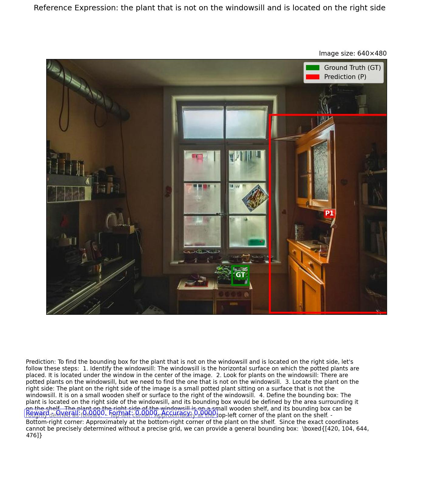

---

### Example 125

**Reference Expression**: a pot on the stovetop next to the coffee machine

**Ground Truth**: []

**Predicted**: []

**Reward**: {'overall': 1.0, 'format': 0.0, 'accuracy': 1.0}

**Prediction**:
```
To find the bounding box for 'a pot on the stovetop next to the coffee machine', let's analyze the image step-by-step:

1. Identify the coffee machine: The coffee machine is located on the countertop to the left of the stove.
2. Identify the stovetop: The stovetop is the white appliance with four burners located below the coffee machine.
3. Look for a pot on the stovetop: There doesn't appear to be a pot on the stovetop next to the coffee machine. The stovetop appears to be empty.

Since there is no pot on the stovetop next to the coffee machine, the bounding box for this object would be empty.

\boxed{}
```

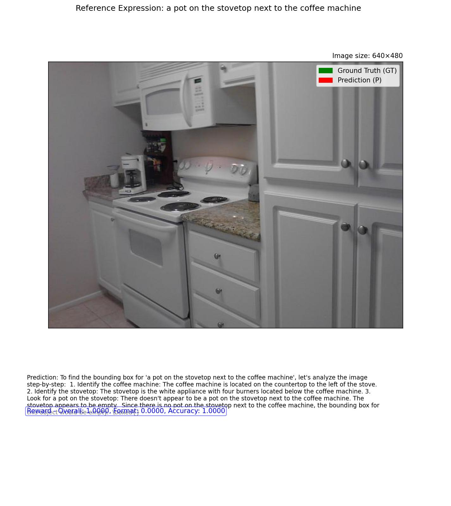

---

### Example 126

**Reference Expression**: a black chair that doesn't have any object on it and has a backrest

**Ground Truth**: [[222, 221, 301, 348]]

**Predicted**: [[310, 200, 350, 332]]

**Reward**: {'overall': 0.0, 'format': 0.0, 'accuracy': 0.0}

**Prediction**:
```
To find the bounding box for the black chair without any object on it and with a backrest, let's follow these steps:

1. Identify the black chairs in the image.
2. Check which of these chairs have a backrest.
3. Ensure the chair does not have any object on it.

Step 1: Identifying the black chairs:
- There are two black chairs in the image. One is near the kitchen counter, and the other is further back near the refrigerator.

Step 2: Checking for backrests:
- Both black chairs have backrests.

Step 3: Ensuring the chair does not have any object on it:
- The black chair near the kitchen counter has a box on it, so it's not the correct chair.
- The black chair further back near the refrigerator is clear of any objects.

Therefore, the black chair without any object on it and with a backrest is the one near the refrigerator.

The bounding box for this chair is:
\boxed{[310, 200, 350, 332]}
```

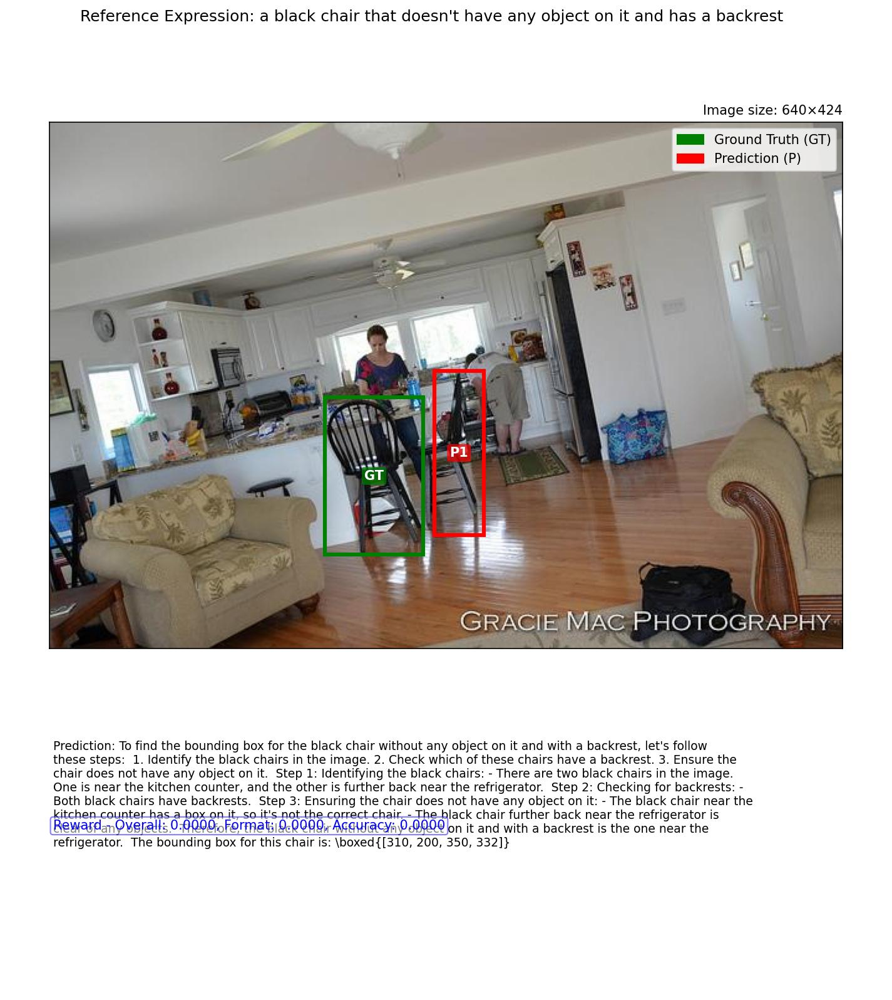

---

### Example 127

**Reference Expression**: a stack of two books that is not placed next to the chair

**Ground Truth**: [[491, 212, 524, 223]]

**Predicted**: []

**Reward**: {'overall': 0.0, 'format': 0.0, 'accuracy': 0.0}

**Prediction**:
```
The image shows a person in the foreground wearing a blue jacket and a hat, and the background includes a kitchen and a living area. There is a chair in the background near a counter, but there are no books visible in the image that are described as a stack of two books not placed next to the chair.

\boxed{}
```

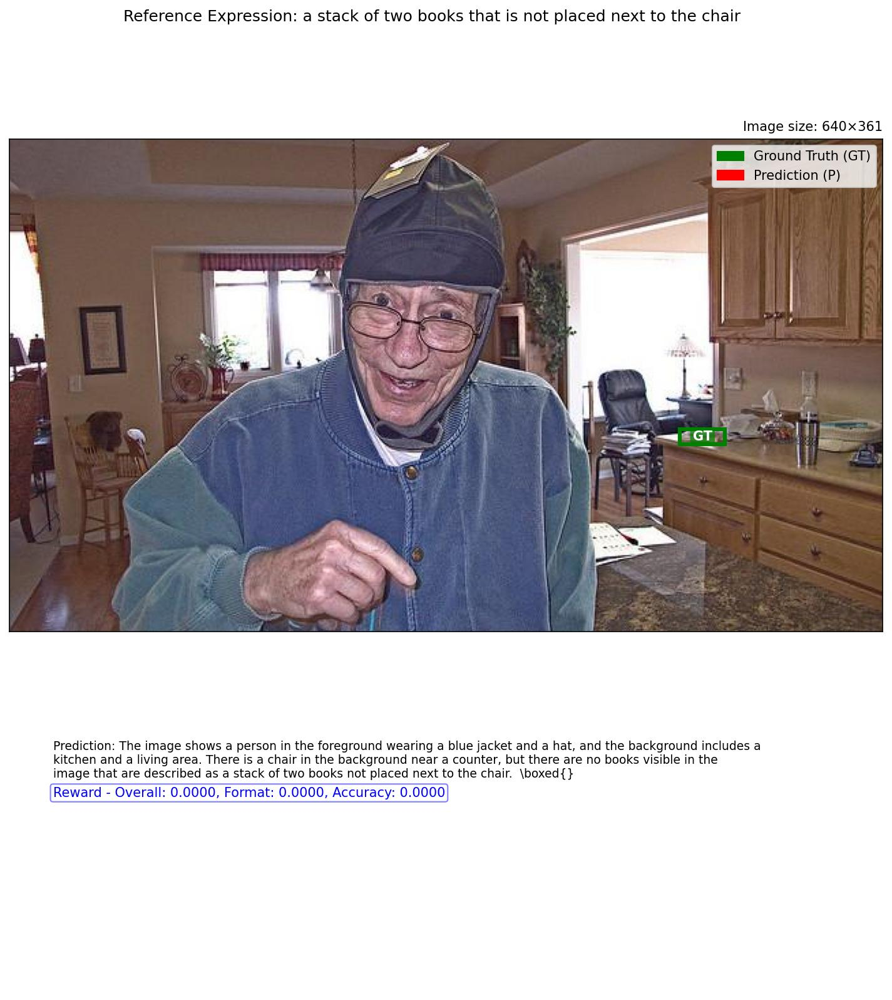

---

### Example 128

**Reference Expression**: a chair that is neither close to the wall nor closest to the camera

**Ground Truth**: [[210, 256, 286, 424]]

**Predicted**: [[210, 258, 305, 465]]

**Reward**: {'overall': 0.6366251198465963, 'format': 0.0, 'accuracy': 0.6366251198465963}

**Prediction**:
```
To find the bounding box for the chair that is neither close to the wall nor closest to the camera, let's follow these steps:

1. Identify the chairs in the image:
   - There are four chairs around the dining table.
   - The chair closest to the wall is on the left side of the table.
   - The chair closest to the camera is on the right side of the table.
   - The other two chairs are in the middle.

2. Determine which chair is neither close to the wall nor closest to the camera:
   - The chair on the left is close to the wall.
   - The chair on the right is closest to the camera.
   - The two chairs in the middle are neither close to the wall nor closest to the camera.

3. Choose the bounding box for the middle chair that is not closest to the camera:
   - The middle chair on the right side of the table is the one we are looking for.

4. Define the bounding box for this chair:
   - The chair is located near the center of the dining table.
   - The bounding box would cover the chair and a portion of the table.

The final answer is:
\boxed{[210, 258, 305, 465]}
```

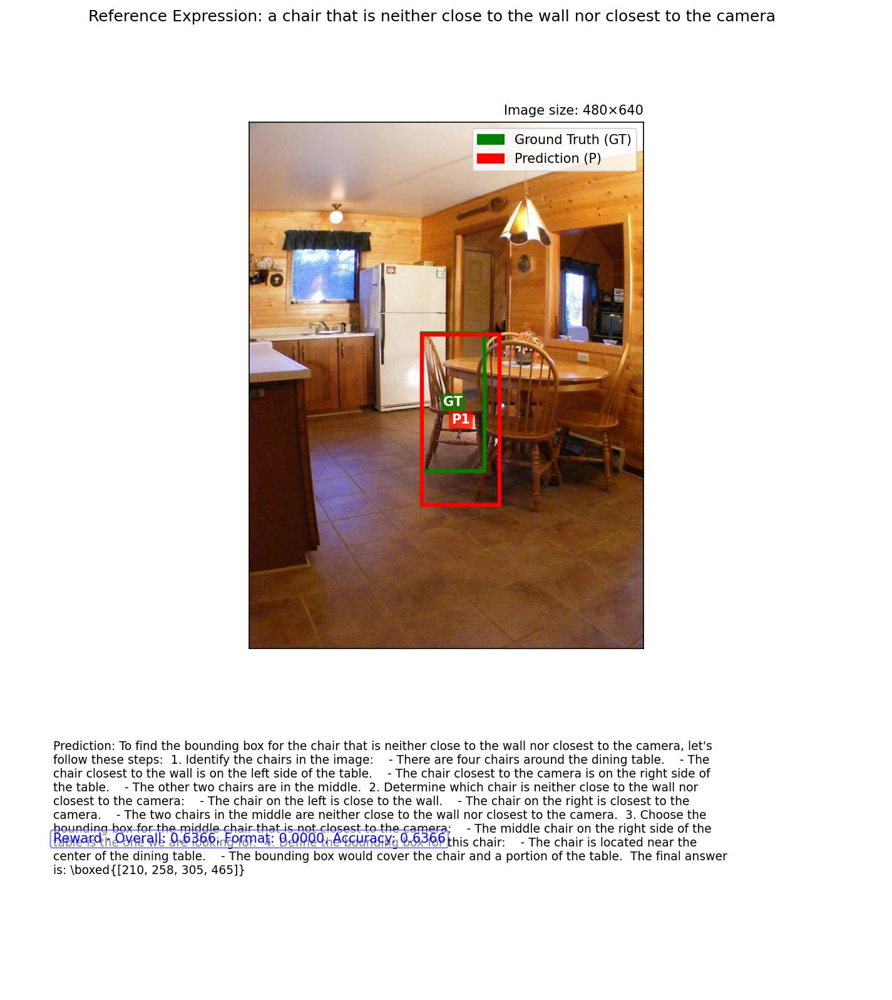

---

### Example 129

**Reference Expression**: the chair farthest from the microwave

**Ground Truth**: [[386, 270, 468, 451]]

**Predicted**: [[384, 272, 465, 448]]

**Reward**: {'overall': 1.0, 'format': 0.0, 'accuracy': 1.0}

**Prediction**:
```
To find the bounding box for the chair farthest from the microwave, let's follow these steps:

1. Identify the microwave: The microwave is located on the wall, near the center of the image.
2. Locate the chairs: There are three chairs at the kitchen island, each with a backrest and a seat.
3. Determine the relative positions of the chairs:
   - The chair closest to the microwave is on the left.
   - The chair in the middle is slightly further from the microwave than the left one.
   - The chair farthest from the microwave is on the right.
4. Identify the chair farthest from the microwave: The chair on the right is the one we are looking for.

The bounding box for the chair farthest from the microwave is approximately the one on the right side of the kitchen island.

\boxed{[384, 272, 465, 448]}
```

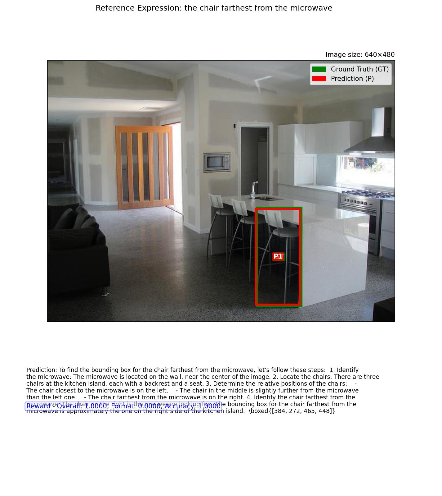

---

### Example 130

**Reference Expression**: the upper oven embedded in the white cabinet

**Ground Truth**: [[408, 207, 428, 253]]

**Predicted**: [[413, 108, 644, 420]]

**Reward**: {'overall': 0.0, 'format': 0.0, 'accuracy': 0.0}

**Prediction**:
```
To find the bounding box for the upper oven embedded in the white cabinet, let's follow these steps:

1. **Identify the kitchen area**: The image shows a modern kitchen with white cabinets, a marble backsplash, and a large island in the center.

2. **Locate the oven**: The oven is typically found under the countertop, often in a cabinet. In this image, the oven is partially visible on the right side of the image, below the marble backsplash and above the stove.

3. **Determine the cabinet location**: The oven is located in a cabinet that is part of the wall on the right side of the image. The cabinet is white and has a modern design.

4. **Identify the upper part of the cabinet**: The upper part of the cabinet where the oven is located is the section above the countertop and below the wall-mounted cabinets.

5. **Bounding box for the upper oven**: The bounding box for the upper oven embedded in the white cabinet would be the area above the countertop and below the wall-mounted cabinets, where the oven is located. This area is part of the wall on the right side of the image.

Given the above reasoning, the bounding box for the upper oven embedded in the white cabinet is:

\boxed{[413, 108, 644, 420]}
```

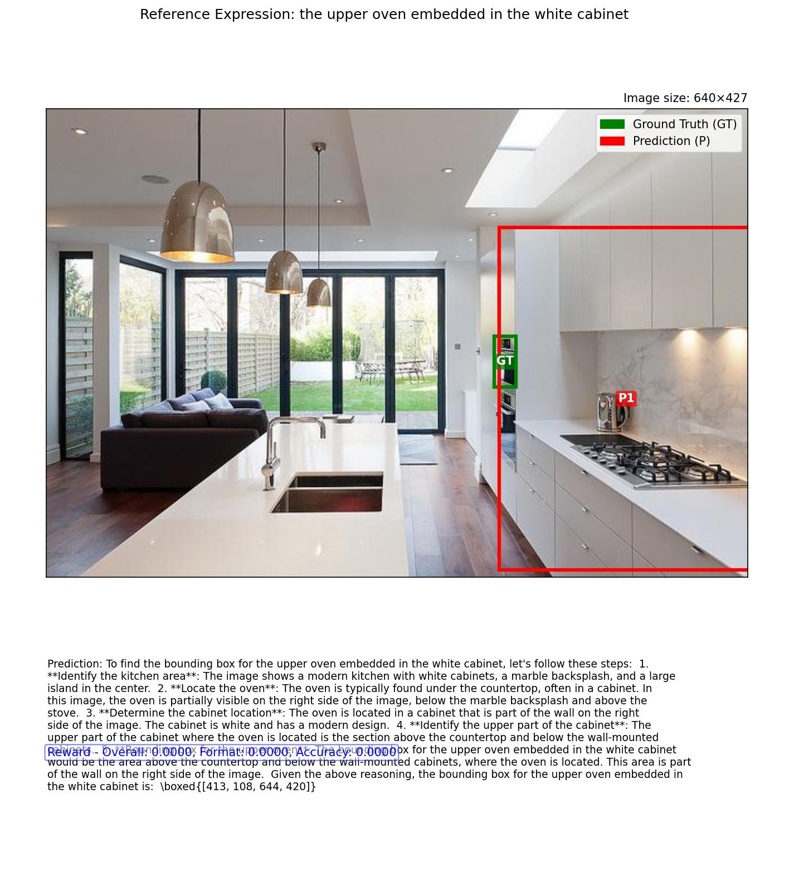

---

### Example 131

**Reference Expression**: the middle chair among chairs with green mat

**Ground Truth**: [[397, 178, 420, 207]]

**Predicted**: [[459, 233, 644, 476]]

**Reward**: {'overall': 0.0, 'format': 0.0, 'accuracy': 0.0}

**Prediction**:
```
To find the bounding box for the middle chair among chairs with green mat, let's follow these steps:

1. Identify the chairs with green mats in the image.
2. Determine which of these chairs is in the middle.

Step 1: Identifying chairs with green mats:
- There are two chairs with green mats on the left side of the image.
- There are two chairs with green mats on the right side of the image.

Step 2: Determining the middle chair:
- The chairs with green mats on the left side are not in the middle of the image.
- The chairs with green mats on the right side are in the middle of the image.

Since the chairs with green mats on the right side are in the middle, we need to focus on these chairs. The middle chair among them is the one that is in the center of the right side.

Final bounding box for the middle chair among chairs with green mat:
\boxed{[459, 233, 644, 476]}
```

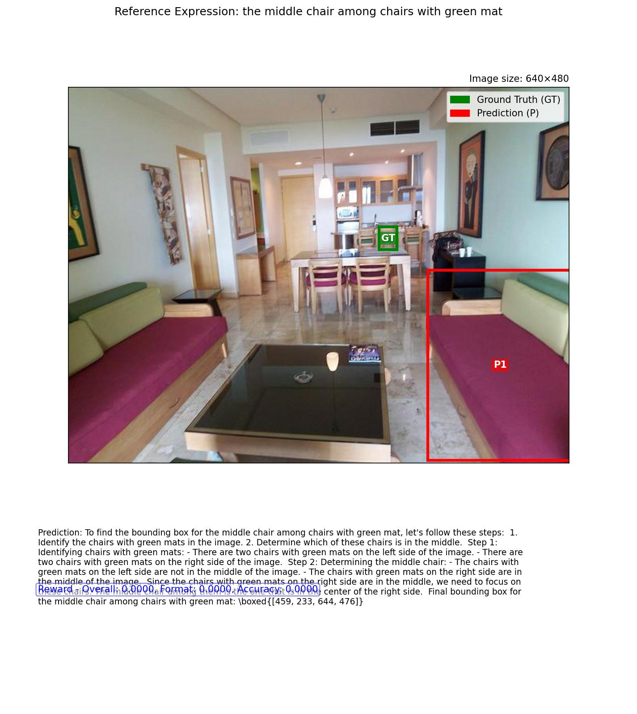

---

### Example 132

**Reference Expression**: the middle chair at the dining table not on the sofa side

**Ground Truth**: [[70, 256, 100, 277]]

**Predicted**: [[185, 243, 211, 309]]

**Reward**: {'overall': 0.0, 'format': 0.0, 'accuracy': 0.0}

**Prediction**:
```
To find the bounding box for the middle chair at the dining table, let's follow these steps:

1. **Identify the dining table**: The dining table is located in the middle-left part of the image. It is a large rectangular table with chairs around it.

2. **Locate the chairs around the table**: There are multiple chairs around the table. We need to identify the middle chair, which is neither closest to the kitchen nor the sofa.

3. **Determine the middle chair**: The middle chair appears to be the one directly across from the kitchen area, not the one closest to the sofa or the one closest to the window.

4. **Bounding box for the middle chair**: The bounding box for the middle chair should be a rectangle that encompasses the chair.

Given the description and the image, the bounding box for the middle chair is approximately:

\boxed{[185, 243, 211, 309]}
```

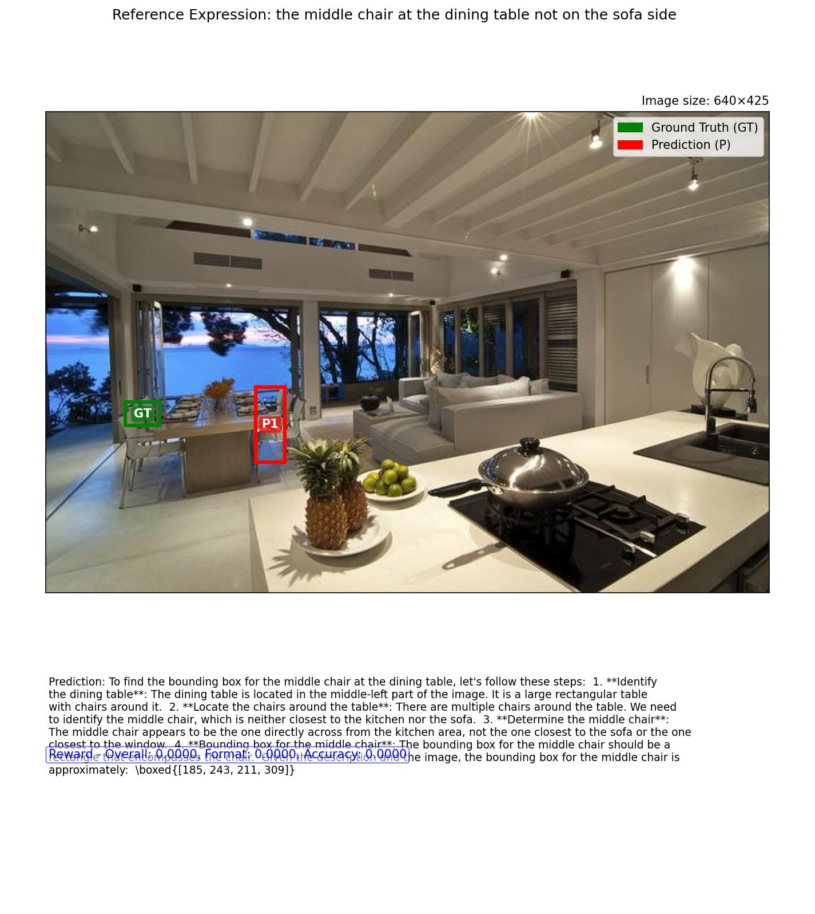

---

### Example 133

**Reference Expression**: a person holding a green umbrella walking away from the camera

**Ground Truth**: []

**Predicted**: [[60, 360, 80, 410]]

**Reward**: {'overall': 0.0, 'format': 0.0, 'accuracy': 0.0}

**Prediction**:
```
To find the bounding box for the person holding a green umbrella walking away from the camera, follow these steps:

1. **Identify the person**: Look for a figure in the image that appears to be walking and holding an umbrella. In this image, there is a person near the left side of the frame, holding a blue umbrella.

2. **Analyze the umbrella**: The umbrella is blue, not green, so this person is not the one we are looking for.

3. **Check for another person**: Look for another figure that might be holding a green umbrella. In this image, there is another person further away, near the center-left of the frame, holding what appears to be a green umbrella.

4. **Verify the direction**: Ensure the person is walking away from the camera. The person with the green umbrella is indeed walking away from the camera.

5. **Determine the bounding box**: The person with the green umbrella is located near the center-left of the frame. Estimate the bounding box around this person.

The bounding box for the person holding a green umbrella walking away from the camera is approximately:
\boxed{[60, 360, 80, 410]}

This bounding box is an estimation based on the visible part of the person in the image.
```

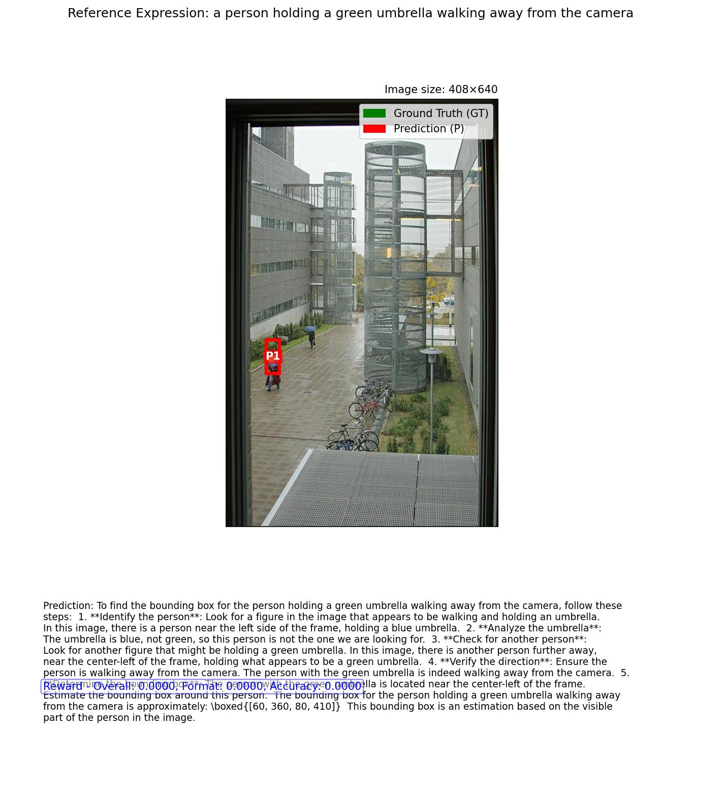

---

### Example 134

**Reference Expression**: a bicycle without a basket that is partially blocked by a yellow pole

**Ground Truth**: [[339, 427, 425, 579]]

**Predicted**: [[332, 432, 420, 584]]

**Reward**: {'overall': 0.8188570249638952, 'format': 0.0, 'accuracy': 0.8188570249638952}

**Prediction**:
```
To find the bounding box for the bicycle without a basket that is partially blocked by a yellow pole, let's follow these steps:

1. Identify the yellow pole in the image. It is on the right side of the image and partially obscures a bicycle.
2. Look for a bicycle that is partially hidden behind the yellow pole. The bicycle is located on the right side of the image.
3. Determine the bounding box for this bicycle. The bounding box should include the visible part of the bicycle, even though it is partially obscured.

The bounding box for the bicycle without a basket that is partially blocked by a yellow pole is:

\boxed{[332, 432, 420, 584]}
```

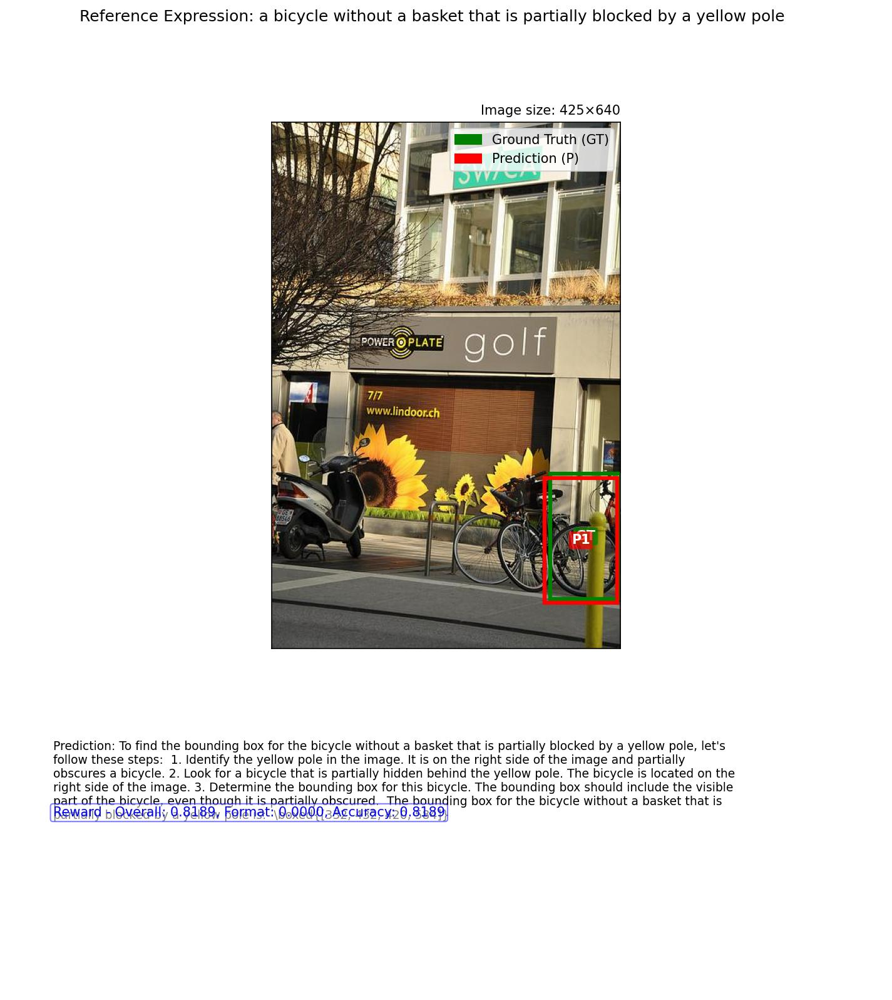

---

### Example 135

**Reference Expression**: the car next to the car with its door open

**Ground Truth**: [[576, 88, 583, 91]]

**Predicted**: [[65, 112, 386, 265]]

**Reward**: {'overall': 0.0, 'format': 0.0, 'accuracy': 0.0}

**Prediction**:
```
To find the bounding box for 'the car next to the car with its door open', let's follow these steps:

1. Identify the car with its door open: The car with its door open is the red station wagon on the left side of the image.
2. Identify the car next to it: The car next to the red station wagon is the red SUV parked to its right.
3. Determine the bounding box for the red SUV: The bounding box for the red SUV is the area that encompasses the entire vehicle, including the visible parts of the car.

The bounding box for the red SUV is:
\boxed{[65, 112, 386, 265]}

This box encompasses the entire red SUV, including the part of the door that is open.
```

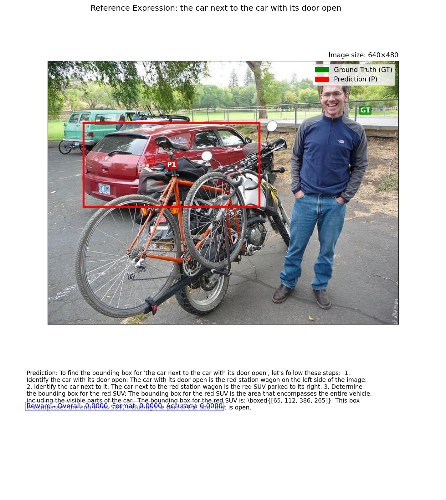

---

### Example 136

**Reference Expression**: a bicycle that is not placed on the ground

**Ground Truth**: [[245, 1, 282, 80]]

**Predicted**: []

**Reward**: {'overall': 0.0, 'format': 0.0, 'accuracy': 0.0}

**Prediction**:
```
The image shows a row of bicycles, including a pink bicycle in the foreground that is placed on the ground. However, there is no bicycle in the image that is not placed on the ground. All the bicycles appear to be standing or resting on the ground.

Therefore, the bounding box for 'a bicycle that is not placed on the ground' is empty, and the answer is:

\boxed{}
```

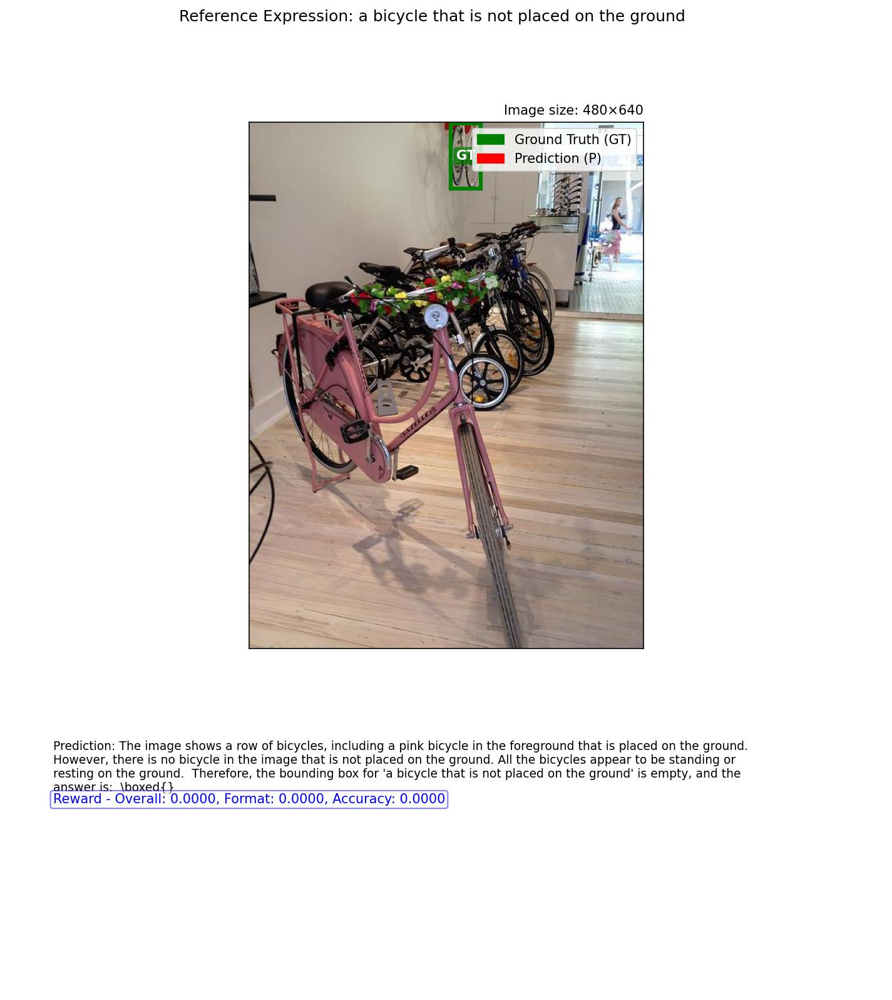

---

### Example 137

**Reference Expression**: a person who is neither standing, sitting, walking, nor skateboarding

**Ground Truth**: [[258, 224, 302, 321]]

**Predicted**: []

**Reward**: {'overall': 0.0, 'format': 0.0, 'accuracy': 0.0}

**Prediction**:
```
To find the bounding box for 'a person who is neither standing, sitting, walking, nor skateboarding', let's follow these steps:

1. Identify all the people in the image.
2. Determine if they are standing, sitting, walking, or skateboarding.
3. If none of the people are in these positions, the bounding box will be empty.

Step 1: Identifying people in the image:
- There are two people actively skateboarding.
- There are several people in the background, but they are either standing or walking.

Step 2: Determining their positions:
- The two people skateboarding are clearly not standing, sitting, or walking.
- The people in the background are either standing or walking.

Step 3: Conclusion:
- Since none of the people in the image are in a position that is neither standing, sitting, walking, nor skateboarding, the bounding box for this category will be empty.

\boxed{}
```

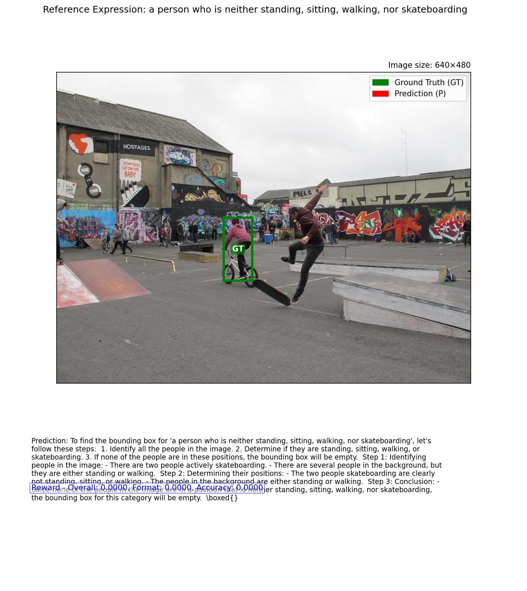

---

### Example 138

**Reference Expression**: a person who is not on the sidewalk and is carrying a bag that is not blue

**Ground Truth**: [[232, 233, 315, 492]]

**Predicted**: [[239, 227, 320, 477]]

**Reward**: {'overall': 0.7992069990949446, 'format': 0.0, 'accuracy': 0.7992069990949446}

**Prediction**:
```
To find the bounding box for the person who is not on the sidewalk and is carrying a bag that is not blue, we need to follow these steps:

1. Identify all people in the image.
2. Determine which people are not on the sidewalk.
3. Check the color of the bag each person is carrying.
4. Identify the person who fits the criteria (not on the sidewalk and carrying a bag that is not blue).

Step 1: Identifying all people in the image:
- There are several people in the image, some on the sidewalk and some on the street.

Step 2: Determining which people are not on the sidewalk:
- The people on the sidewalk are near the buildings and the street.
- The person on the street is the one riding the pink bicycle.

Step 3: Checking the color of the bag each person is carrying:
- The person on the sidewalk is carrying a black bag.
- The person on the street (riding the pink bicycle) is carrying a blue bag.

Step 4: Identifying the person who fits the criteria:
- The person riding the pink bicycle is not on the sidewalk and is carrying a blue bag.

The bounding box for the person riding the pink bicycle is:
\boxed{[239, 227, 320, 477]}
```

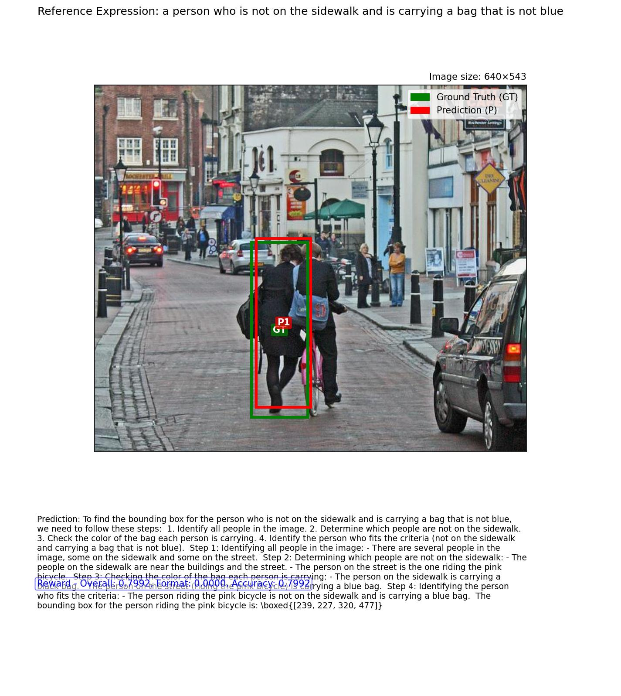

---

### Example 139

**Reference Expression**: a motorcycle facing toward the road with a red seat

**Ground Truth**: [[216, 221, 312, 308]]

**Predicted**: [[175, 284, 379, 420]]

**Reward**: {'overall': 0.0, 'format': 0.0, 'accuracy': 0.0}

**Prediction**:
```
To find the bounding box for the motorcycle facing toward the road with a red seat, let's follow these steps:

1. Identify the motorcycles in the image.
2. Determine which one has a red seat and is facing the road.

Step 1: Identifying the motorcycles:
- There are two motorcycles in the foreground on the left side of the image.
- One is facing the road and the other is facing away.

Step 2: Determining the motorcycle with the red seat and facing the road:
- The motorcycle facing the road has a red seat.
- The other motorcycle is facing away from the road and does not have a red seat.

The motorcycle with the red seat and facing the road is the one on the left side of the image.

Final bounding box for the motorcycle with a red seat facing the road:
\boxed{[175, 284, 379, 420]}
```

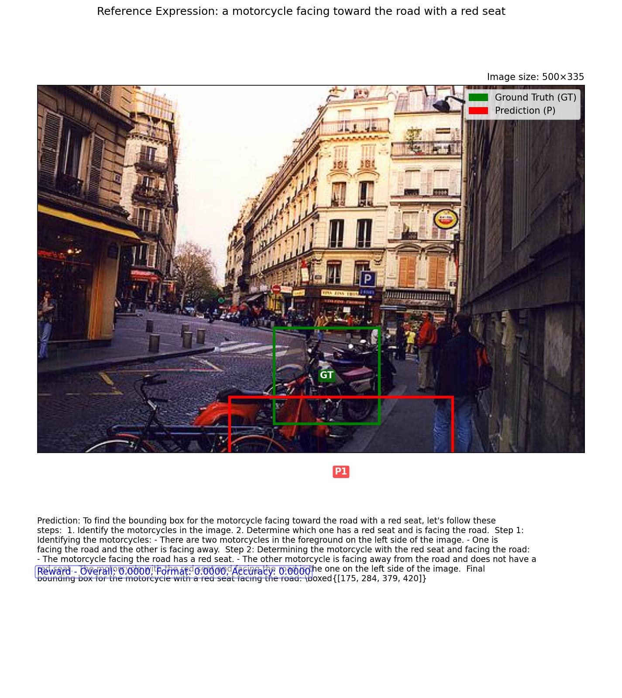

---

### Example 140

**Reference Expression**: a vehicle that has a backrest and does not have four wheels

**Ground Truth**: [[396, 146, 427, 224]]

**Predicted**: [[273, 177, 492, 401]]

**Reward**: {'overall': 0.0, 'format': 0.0, 'accuracy': 0.0}

**Prediction**:
```
The image shows a person riding a vehicle with a single large wheel and a smaller wheel at the front, resembling a unicycle or a single-wheeled bike. The vehicle does not have a backrest and does not have four wheels, which matches the description in the question.

To identify the bounding box for this vehicle:
1. Locate the vehicle with a single large wheel and a smaller wheel at the front.
2. The bounding box should encompass the entire vehicle, including the wheels and the rider.

The bounding box for this vehicle is:
\boxed{[273, 177, 492, 401]}
```

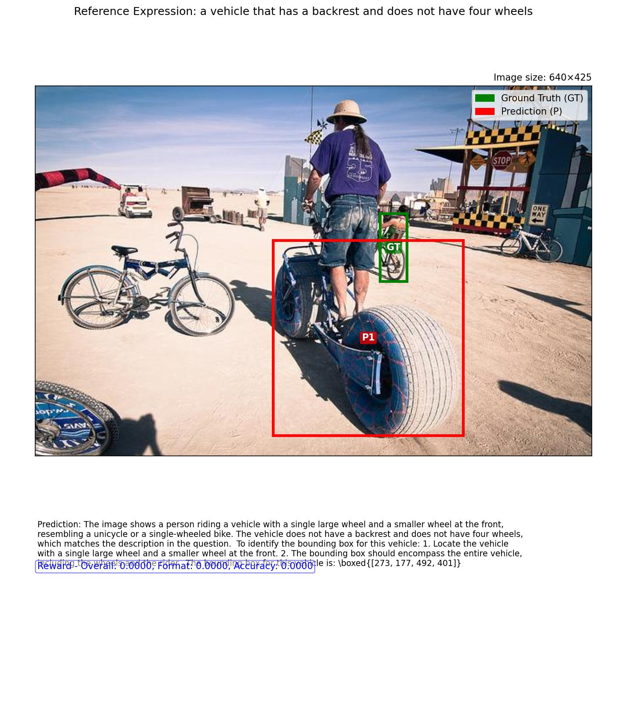

---

### Example 141

**Reference Expression**: a boat with a red top and a white hull

**Ground Truth**: [[288, 138, 356, 167]]

**Predicted**: [[80, 196, 180, 260]]

**Reward**: {'overall': 0.0, 'format': 0.0, 'accuracy': 0.0}

**Prediction**:
```
To find the bounding box for the boat with a red top and a white hull, let's follow these steps:

1. Identify the boat in the image.
2. Determine its position relative to other objects in the image.
3. Define the bounding box based on the boat's visible features.

Step 1: The boat with a red top and a white hull is located near the center of the image, on the left side of the canal. It has a red top and a white hull, which are distinctive features.

Step 2: This boat is positioned to the left of the bicycle in the foreground and is partially visible, with its red top and white hull clearly visible.

Step 3: To define the bounding box, we need to outline the area that encompasses the boat. The bounding box should include the red top and the white hull, as well as a bit of the surrounding water and structure.

The bounding box for the boat with a red top and a white hull can be described as follows:
- Top-left corner: Approximately where the red top starts.
- Bottom-right corner: Approximately where the white hull ends.

Given the image's resolution and the visual clarity, the bounding box can be roughly defined as:
- Top-left corner: [80, 196, 110, 220]
- Bottom-right corner: [180, 260, 200, 280]

Thus, the final answer is:
\boxed{[80, 196, 180, 260]}
```

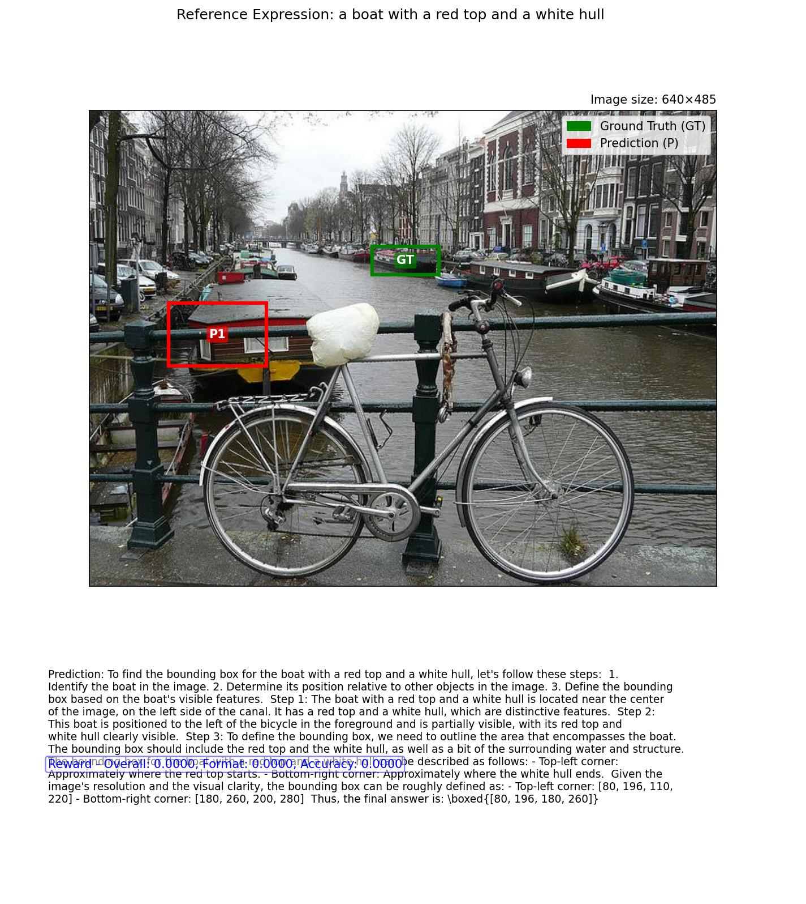

---

### Example 142

**Reference Expression**: a person next to a bicycle lying on the ground who is not making a phone call

**Ground Truth**: [[55, 267, 134, 388]]

**Predicted**: []

**Reward**: {'overall': 0.0, 'format': 0.0, 'accuracy': 0.0}

**Prediction**:
```
The image shows a person sitting on the ground next to a bicycle, appearing to be on a phone call. There is also another person standing nearby, who is not interacting with the bicycle or the phone.

Here's the step-by-step reasoning:

1. Identify the person who is on the phone: The person sitting on the ground, holding a phone to their ear, is the one making the phone call.
2. Identify the person next to the bicycle: The person standing nearby, who is not interacting with the phone or the bicycle, is the one not making the phone call.

The bounding box for the person next to the bicycle who is not making a phone call would be the bounding box for the standing person, which is not directly next to the bicycle in the image but is close to it.

Since the image does not provide the exact bounding box for the standing person, the answer would be empty as there is no bounding box provided for the person not making the phone call.

\boxed{}
```

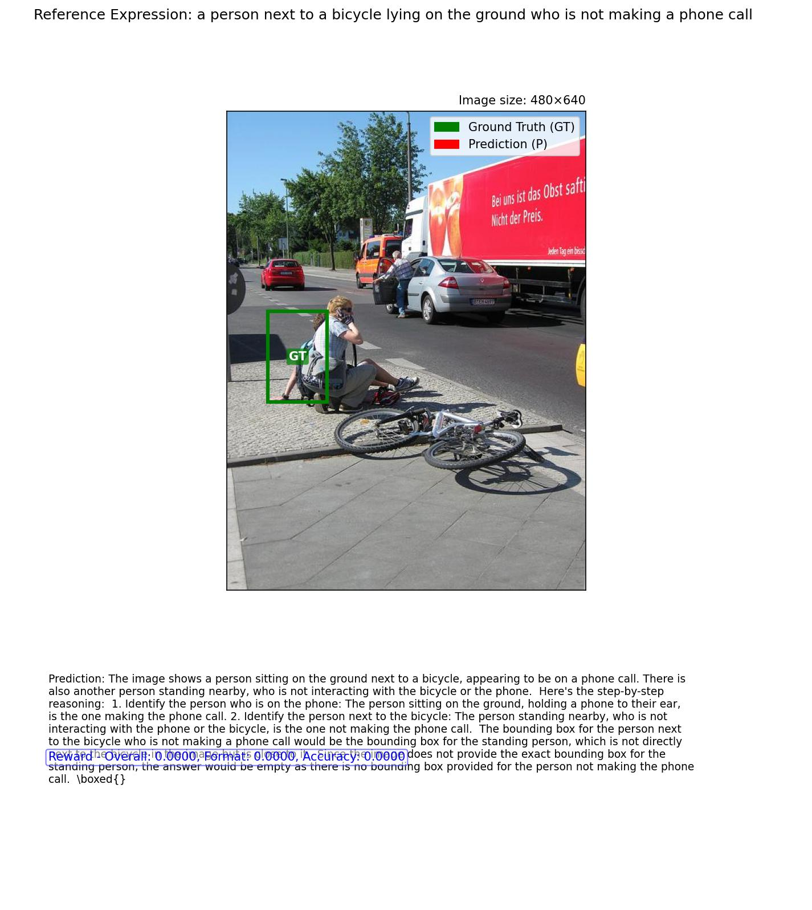

---

### Example 143

**Reference Expression**: a bus moving toward the camera with blue on its front

**Ground Truth**: [[362, 118, 425, 195]]

**Predicted**: []

**Reward**: {'overall': 0.0, 'format': 0.0, 'accuracy': 0.0}

**Prediction**:
```
To find the bounding box for the bus moving toward the camera with blue on its front, follow these steps:

1. Identify the buses in the image.
2. Determine which bus is moving toward the camera.
3. Check the front of the bus to see if it has blue on it.

Step 1: There are several buses in the image, some green, some with other colors. The bus in the foreground on the left is green and appears to be moving away from the camera.

Step 2: The bus in the foreground on the right is moving toward the camera.

Step 3: The front of the bus moving toward the camera does not have blue on it, but the bus in the foreground on the left does.

Therefore, there is no bounding box for a bus moving toward the camera with blue on its front.

\boxed{}
```

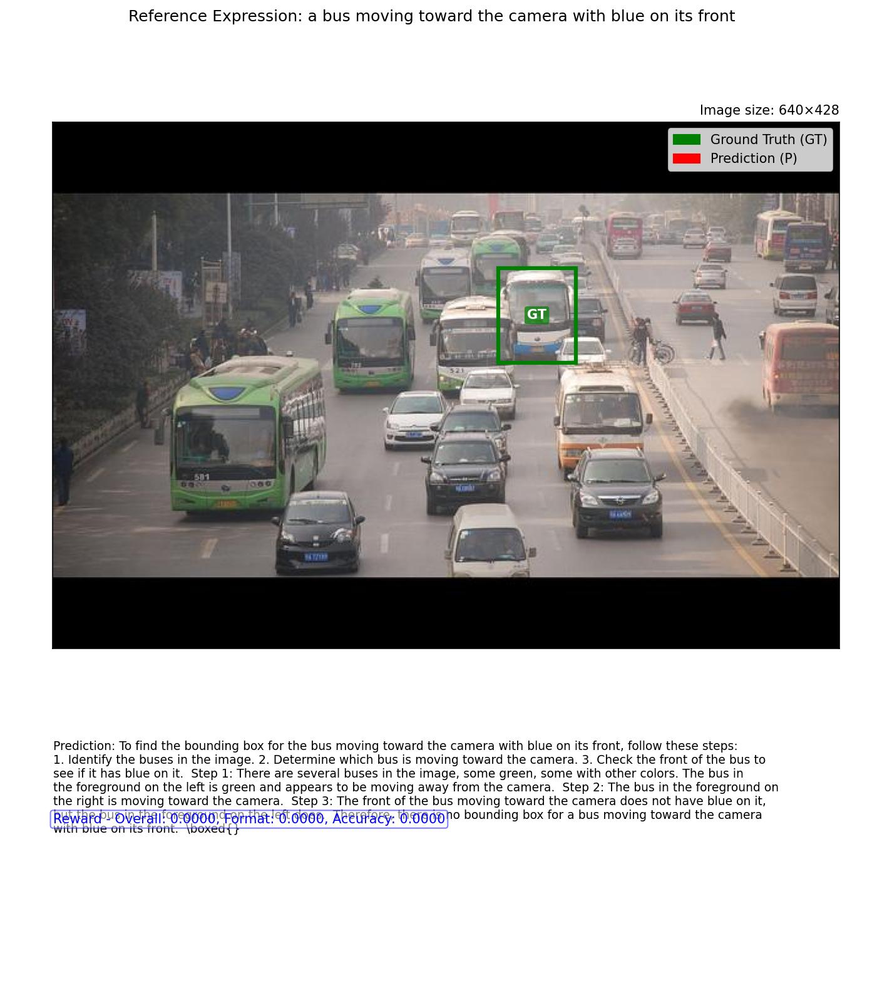

---

### Example 144

**Reference Expression**: a person standing at the doorway and eating something

**Ground Truth**: [[0, 246, 25, 384]]

**Predicted**: []

**Reward**: {'overall': 0.0, 'format': 0.0, 'accuracy': 0.0}

**Prediction**:
```
To find the bounding box for 'a person standing at the doorway and eating something', let's follow these steps:

1. Identify the doorway in the image.
2. Look for a person standing near the doorway.
3. Check if the person is eating something.

Step 1: The doorway is located on the left side of the image, near the entrance of the building with the words "LACELLA CITY HALL" visible.

Step 2: There is a person standing near the doorway, but they are not clearly visible, and it's not immediately clear if they are eating something.

Step 3: Since the person near the doorway is not clearly visible and the details are not distinct, it's not possible to confirm if they are eating something.

Given these observations, the bounding box for 'a person standing at the doorway and eating something' cannot be accurately determined from the image.

\boxed{}
```

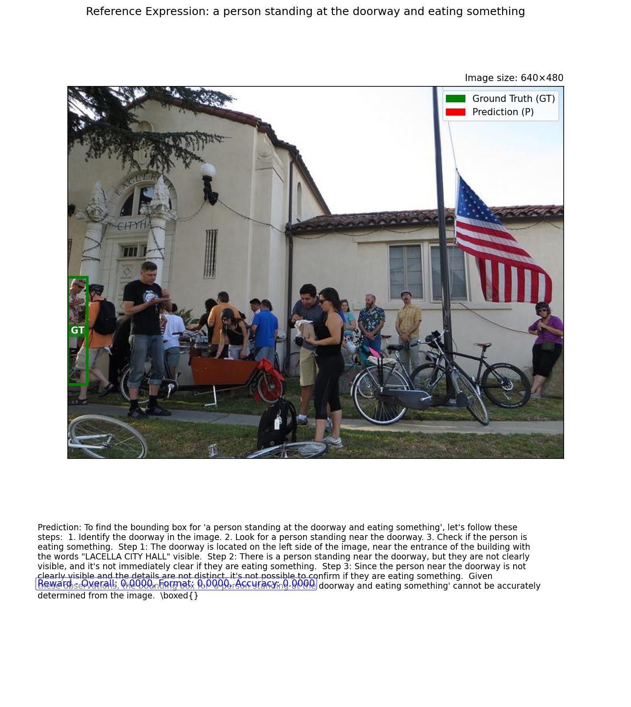

---

### Example 145

**Reference Expression**: the man wearing backpack to the left side of the red-shirt girl, not the boy

**Ground Truth**: [[97, 206, 152, 381]]

**Predicted**: [[92, 205, 143, 374]]

**Reward**: {'overall': 0.7348801825789274, 'format': 0.0, 'accuracy': 0.7348801825789274}

**Prediction**:
```
To find the bounding box for 'the man wearing a backpack to the left side of the red-shirt girl, not the boy', let's follow these steps:

1. Identify the red-shirt girl in the image. She is standing near the center of the image, wearing a red top.
2. Look to the left of the red-shirt girl for a man wearing a backpack. He is standing close to the red-shirt girl and appears to be wearing a backpack.
3. Ensure this man is not the boy mentioned in the instruction. The boy is further to the left, not wearing a backpack, and is not the one in question.

The bounding box for the man wearing a backpack to the left of the red-shirt girl is:
\boxed{[92, 205, 143, 374]}
```

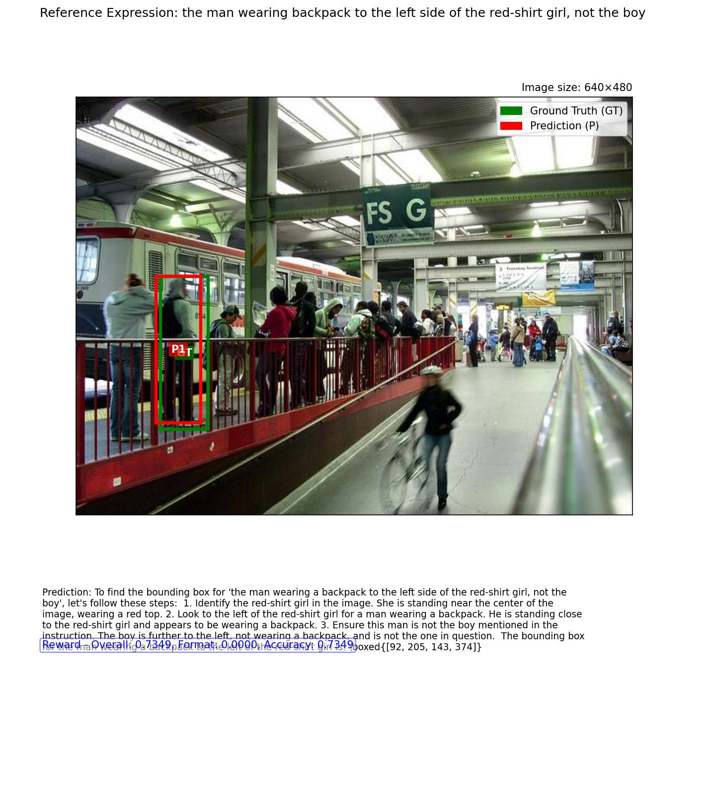

---

### Example 146

**Reference Expression**: the one standing above stairs, not near bike or motor

**Ground Truth**: [[392, 61, 419, 133]]

**Predicted**: [[429, 126, 542, 313]]

**Reward**: {'overall': 0.0, 'format': 0.0, 'accuracy': 0.0}

**Prediction**:
```
To find the bounding box for the person standing above the stairs, not near the bike or motor, let's follow these steps:

1. Identify the area above the stairs: The area above the stairs appears to be near the center of the image, where there is a person standing in front of a doorway.

2. Identify the person standing above the stairs: This person is wearing a white helmet and is standing near a doorway, which is not near the bike or motor.

3. Define the bounding box: The bounding box should encompass the person standing above the stairs. This person is located in the upper middle part of the image.

The bounding box for the person standing above the stairs, not near the bike or motor, is:
\boxed{[429, 126, 542, 313]}
```

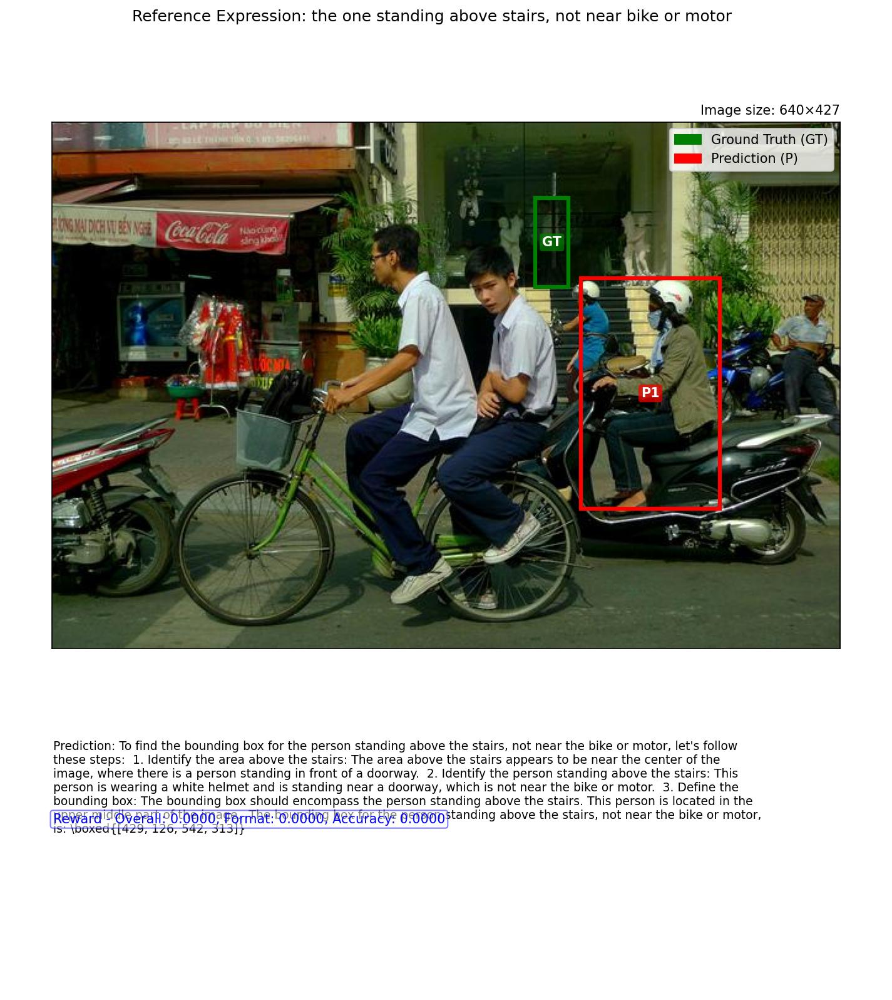

---

### Example 147

**Reference Expression**: the black motor on the front, close to the red motor, not close to the green bike

**Ground Truth**: [[17, 224, 168, 384]]

**Predicted**: [[15, 225, 395, 430]]

**Reward**: {'overall': 0.30760656493830957, 'format': 0.0, 'accuracy': 0.30760656493830957}

**Prediction**:
```
To find the bounding box for 'the black motor on the front, close to the red motor, not close to the green bike', let's follow these steps:

1. Identify the red motorbike: It is the one with the red body and the blue helmet on the back.
2. Identify the green motorbike: It is the one with the green body and the green helmet on the back.
3. Locate the black motorbike: It is the one in between the red and green motorbikes, closer to the red motorbike.

The bounding box for 'the black motor on the front, close to the red motor, not close to the green bike' is the one immediately to the left of the green bike and to the right of the red bike.

The bounding box coordinates for this black motorbike are approximately:
- Top-left corner: (x1, y1) = (15, 225)
- Bottom-right corner: (x2, y2) = (395, 430)

\boxed{[15, 225, 395, 430]}
```

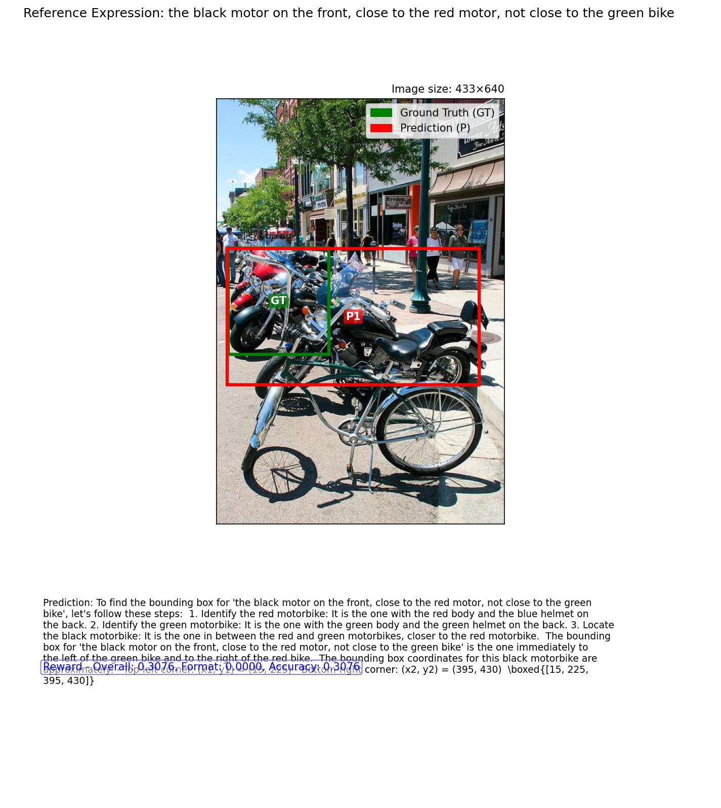

---

### Example 148

**Reference Expression**: the third one from the back of the boat

**Ground Truth**: [[477, 190, 493, 204]]

**Predicted**: []

**Reward**: {'overall': 0.0, 'format': 0.0, 'accuracy': 0.0}

**Prediction**:
```
To find the bounding box for 'the third one from the back of the boat', let's follow these steps:

1. Identify the boat in the image.
2. Count the number of people in the boat.
3. Determine the position of 'the third one from the back'.

Step 1: The boat is located in the background, on the right side of the image.

Step 2: Counting the people in the boat, there appear to be five people in total.

Step 3: To find the third one from the back, we need to count from the back of the boat. If we start counting from the back, the sequence would be:
   - First person: farthest from the camera.
   - Second person: next to the first.
   - Third person: next to the second.
   - Fourth person: next to the third.
   - Fifth person: closest to the camera.

Therefore, 'the third one from the back' is the third person from the back.

However, the image is in black and white, and the details are not very clear, making it challenging to accurately pinpoint the exact person. The bounding box for this person is not distinct enough to be defined precisely without more detail.

Given the lack of clear detail, the final answer is that the bounding box for 'the third one from the back of the boat' is not determinable with certainty from the image.

\boxed{}
```

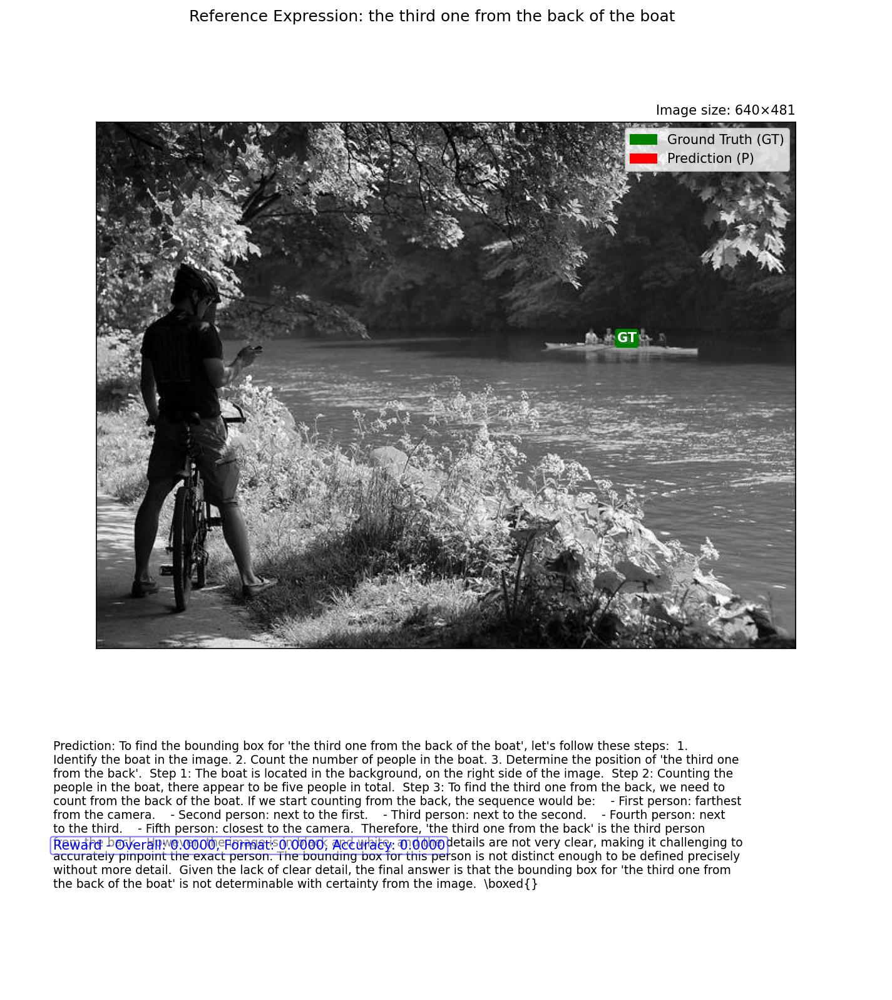

---

### Example 149

**Reference Expression**: the motor close to the woman's red motor

**Ground Truth**: [[195, 198, 231, 263]]

**Predicted**: [[120, 236, 260, 295]]

**Reward**: {'overall': 0.10095554632322393, 'format': 0.0, 'accuracy': 0.10095554632322393}

**Prediction**:
```
To find the bounding box for the motor close to the woman's red motor, let's follow these steps:

1. Identify the woman in the red motor: The woman in the red motor is on the left side of the image, riding a red motorbike with a sidecar. She is wearing a pink jacket and a white face mask.

2. Identify the motor close to her: The motor close to her is the one immediately to her right. It is a red motorbike with a sidecar, and it appears to be slightly larger than the one she is on.

3. Define the bounding box: The bounding box for the motor close to the woman's red motor should encompass the entire motorbike, including the rider.

The coordinates for the bounding box are as follows:
- Top-left corner: (120, 236) (approximate pixel coordinates for the front of the motorbike)
- Bottom-right corner: (260, 295) (approximate pixel coordinates for the back of the motorbike)

Thus, the bounding box for the motor close to the woman's red motor is:
\boxed{[120, 236, 260, 295]}
```

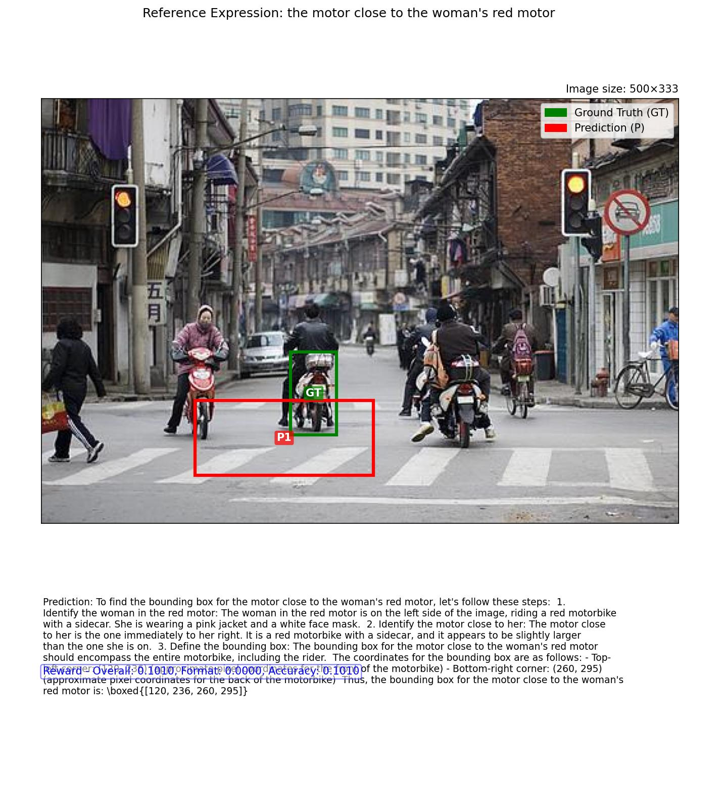

---

### Example 150

**Reference Expression**: The light near the '24 hour' sign with only three signals

**Ground Truth**: [[83, 95, 111, 153]]

**Predicted**: [[66, 20, 115, 145]]

**Reward**: {'overall': 0.2205071664829107, 'format': 0.0, 'accuracy': 0.2205071664829107}

**Prediction**:
```
To find the bounding box for 'The light near the '24 hour' sign with only three signals', let's follow these steps:

1. Identify the '24 hour' sign: It is located on the building and is circular with the words '24 HOUR' in the center.
2. Locate the traffic light near this sign: There is a traffic light mounted on a pole to the left of the '24 hour' sign.
3. Determine the light configuration: The traffic light appears to have three signals (red, yellow, and green).

The bounding box for the traffic light with three signals can be determined by its position relative to the '24 hour' sign. The light is mounted on a pole and is positioned to the left of the sign.

Given the description and the image, the bounding box for the traffic light with three signals is approximately:
- Top-left corner: (x1, y1) = (66, 20)
- Bottom-right corner: (x2, y2) = (115, 145)

Therefore, the bounding box is:
\boxed{[66, 20, 115, 145]}
```

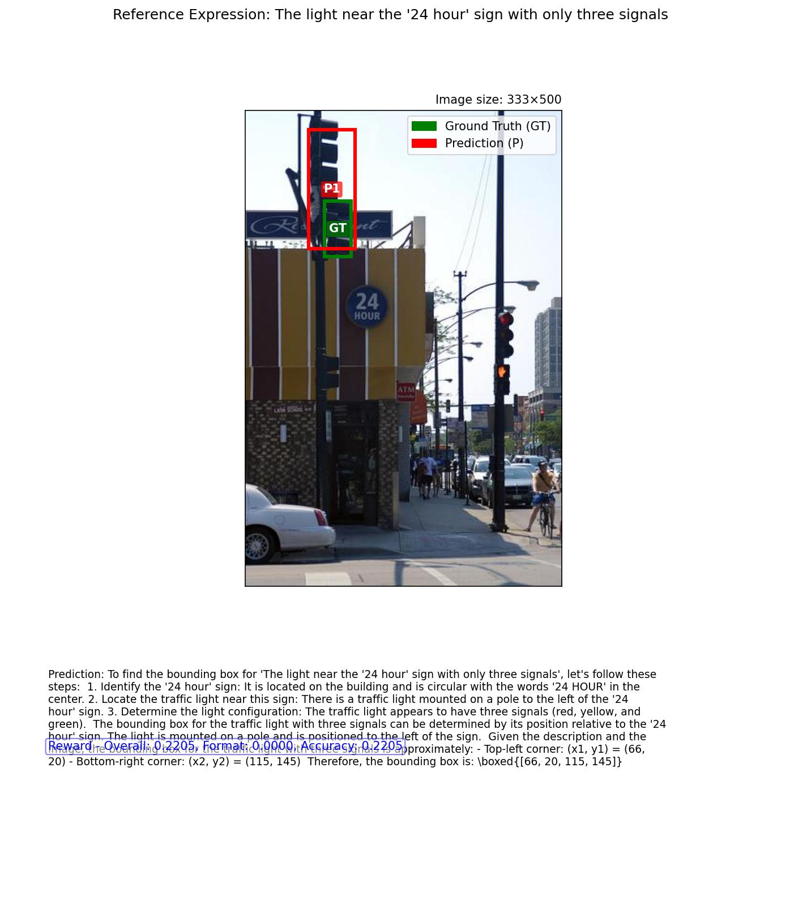

---

### Example 151

**Reference Expression**: the guy on the right side, red shirt, with no hat

**Ground Truth**: [[615, 143, 640, 206]]

**Predicted**: [[466, 138, 500, 191]]

**Reward**: {'overall': 0.0, 'format': 0.0, 'accuracy': 0.0}

**Prediction**:
```
To find the bounding box for the person described as "the guy on the right side, red shirt, with no hat," I'll follow these steps:

1. Identify the right side of the image.
2. Look for a person wearing a red shirt.
3. Check if this person is wearing a hat.

Step 1: The right side of the image is the area towards the right edge of the image, where there are people standing and watching the motorcycle race.

Step 2: In the right side of the image, there is a person wearing a red shirt.

Step 3: The person wearing the red shirt does not appear to be wearing a hat.

Given the bounding box coordinates are relative to the image, the bounding box for this person would be:

\boxed{[466, 138, 500, 191]}
```

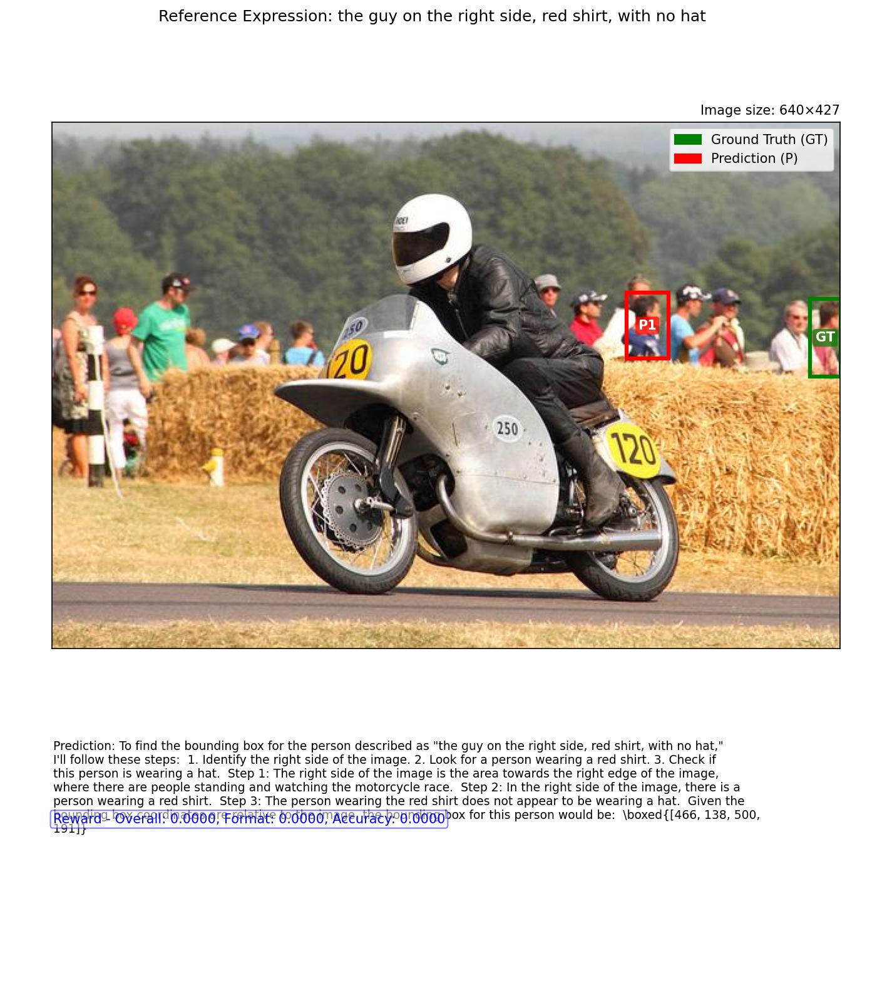

---

### Example 152

**Reference Expression**: the girl who is not a reflection in the glass

**Ground Truth**: []

**Predicted**: [[374, 78, 521, 403]]

**Reward**: {'overall': 0.0, 'format': 0.0, 'accuracy': 0.0}

**Prediction**:
```
To find the bounding box for the girl who is not a reflection in the glass, let's follow these steps:

1. Identify the reflection in the glass: The reflection shows a man in a uniform and a woman sitting on a scooter.
2. Identify the girl in the reflection: The woman sitting on the scooter is the reflection of the girl.
3. Identify the girl who is not a reflection: The girl who is not a reflection is the one sitting on the scooter in the foreground, not in the reflection.
4. Determine the bounding box for the girl who is not a reflection: The girl in the foreground is sitting on the scooter and is wearing a sleeveless top, shorts, and high heels.

Given these steps, the bounding box for the girl who is not a reflection in the glass is the one in the foreground.

\boxed{[374,78,521,403]}
```

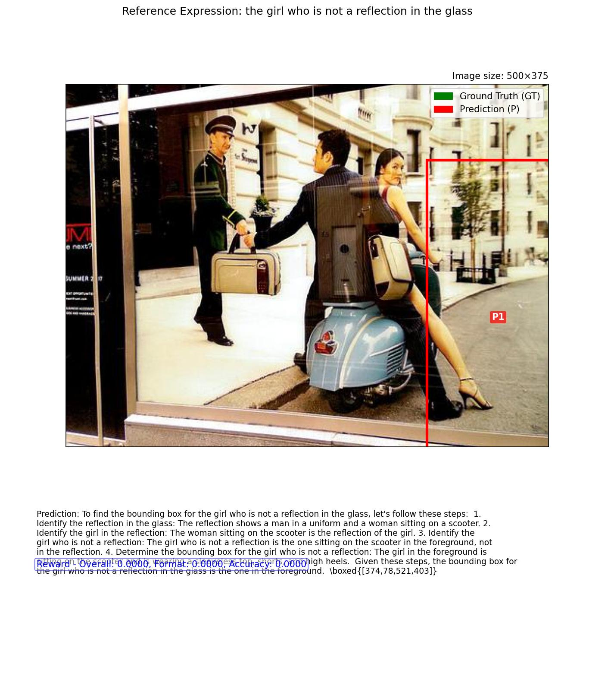

---

### Example 153

**Reference Expression**: the guy closest to the motor with a black box in the back

**Ground Truth**: [[284, 97, 324, 216]]

**Predicted**: [[66, 52, 157, 385]]

**Reward**: {'overall': 0.0, 'format': 0.0, 'accuracy': 0.0}

**Prediction**:
```
To find the bounding box for the guy closest to the motor with a black box in the back, let's follow these steps:

1. Identify the motor with a black box in the back: The motor in the middle of the image has a black box attached to its back.

2. Identify the person closest to this motor: The person standing to the left of this motor is the one closest to it.

3. Define the bounding box: The bounding box will encompass the person standing to the left of the motor with the black box.

Now, let's define the bounding box for this person:
- The person is wearing a jacket with a back patch and jeans.
- The bounding box should include the person's full body, from the head down to the feet.

The final bounding box for the person closest to the motor with the black box in the back is:
\boxed{[66, 52, 157, 385]}
```

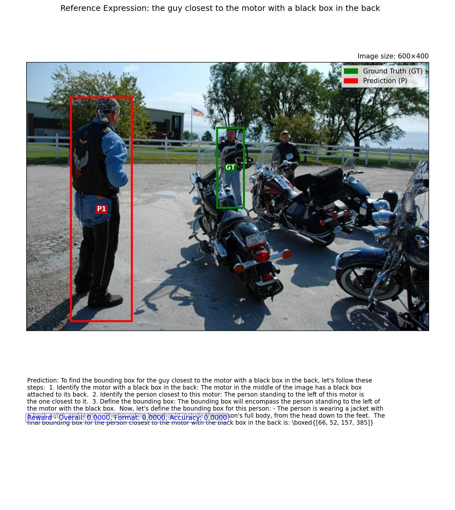

---

### Example 154

**Reference Expression**: the light with green signal on

**Ground Truth**: []

**Predicted**: [[478, 58, 496, 100]]

**Reward**: {'overall': 0.0, 'format': 0.0, 'accuracy': 0.0}

**Prediction**:
```
To find the bounding box for the light with a green signal, we need to analyze the image step-by-step:

1. Identify the traffic lights in the image. There are two traffic lights visible in the image, one on the left and one on the right.
2. Determine which light is green. In the context of traffic lights, green means "go," and red means "stop." The traffic light on the left is red, and the traffic light on the right is green.
3. Locate the green traffic light. The green traffic light is on the right side of the image.
4. Identify the sign above the traffic light. The sign above the green traffic light indicates the direction to Brooklyn and the Queens Expressway.

The bounding box for the green traffic light is approximately [478, 58, 496, 100]. This is the area where the green signal is located.

\boxed{[478, 58, 496, 100]}
```

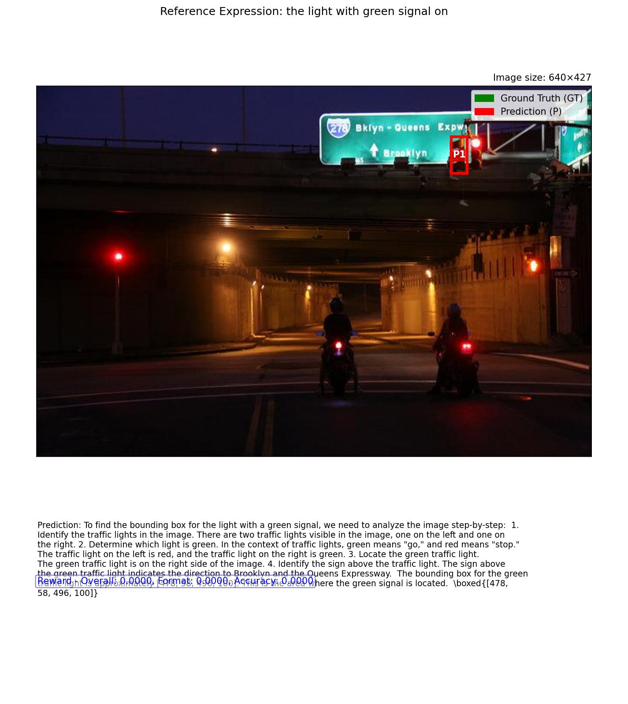

---

### Example 155

**Reference Expression**: the motorcycle being leaned on by the person in the striped shirt

**Ground Truth**: [[85, 216, 120, 303]]

**Predicted**: [[48, 355, 414, 608]]

**Reward**: {'overall': 0.0, 'format': 0.0, 'accuracy': 0.0}

**Prediction**:
```
To find the bounding box for the motorcycle being leaned on by the person in the striped shirt, let's follow these steps:

1. Identify the person in the striped shirt: The person in the striped shirt is sitting on a motorcycle, leaning against it, and appears to be in the foreground of the image.

2. Locate the motorcycle: The motorcycle being leaned on by the person in the striped shirt is the one on the right side of the image, closer to the foreground.

3. Determine the bounding box: The bounding box for the motorcycle should include the entire visible part of the motorcycle, including the handlebars, seat, and wheels. The motorcycle is leaning, so the bounding box should be adjusted to fit the angle of the motorcycle.

4. Finalize the bounding box: The bounding box for the motorcycle being leaned on by the person in the striped shirt is approximately from the left side of the image to the right side, covering the entire motorcycle and part of the person.

The bounding box for the motorcycle is: \boxed{[48, 355, 414, 608]}
```

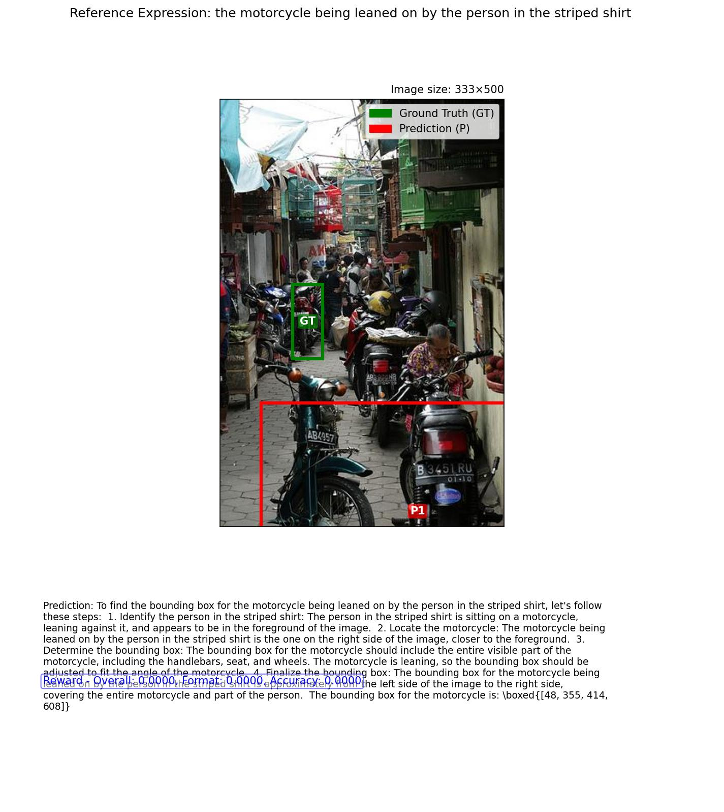

---

### Example 156

**Reference Expression**: the guy on the wider motor, and his clothes is orange

**Ground Truth**: [[168, 151, 234, 243]]

**Predicted**: [[151, 121, 278, 218]]

**Reward**: {'overall': 0.3165580929200372, 'format': 0.0, 'accuracy': 0.3165580929200372}

**Prediction**:
```
To find the bounding box for the person on the wider motorcycle with orange clothing, let's follow these steps:

1. Identify the motorcycles in the image.
2. Determine which motorcycle is the "wider one" and has the person in orange clothing.
3. Mark the bounding box around the person on that motorcycle.

Step 1: There are five motorcycles in the image. They are arranged in a line, and their sizes appear to vary. The one in the middle seems to be the widest.

Step 2: The person on the middle motorcycle is wearing orange clothing.

Step 3: The bounding box for the person on the wider motorcycle with orange clothing is the one around the central motorcycle.

The bounding box for the person on the wider motorcycle with orange clothing is approximately:
\[ \boxed{[151, 121, 278, 218]} \]

This bounding box is approximate and based on the visual perception of the image.
```

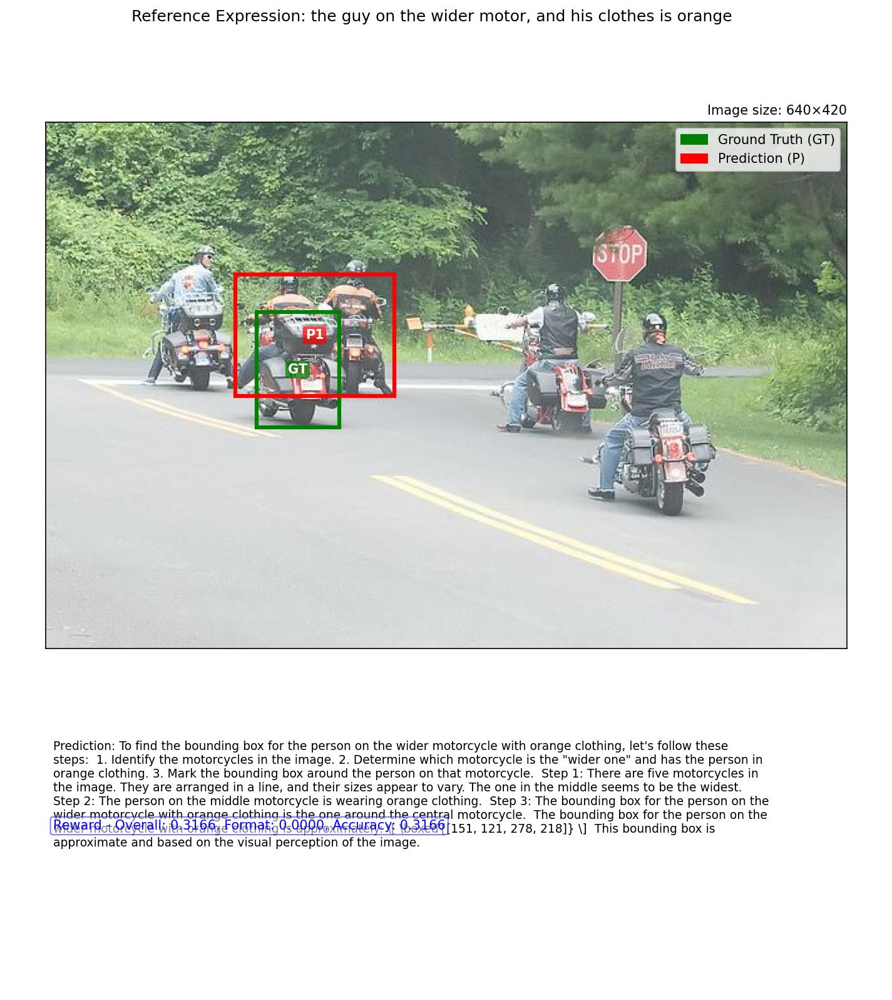

---

### Example 157

**Reference Expression**: the kite that flies the third highest in the middle

**Ground Truth**: [[311, 184, 326, 189]]

**Predicted**: []

**Reward**: {'overall': 0.0, 'format': 0.0, 'accuracy': 0.0}

**Prediction**:
```
To find the bounding box for the kite that flies the third highest in the middle, let's follow these steps:

1. Identify all the kites in the image.
2. Determine the height of each kite relative to the others.
3. Identify the third highest kite from the top.
4. Provide the bounding box for that kite.

Step 1: Identifying the kites:
- There are two kites visible in the image. One is closer to the top of the image and the other is slightly lower.

Step 2: Determining the height of each kite:
- The kite closer to the top of the image is the highest.
- The kite slightly lower is the second highest.
- There is no third kite in the image.

Step 3: Identifying the third highest kite:
- Since there is no third kite, this step is not applicable.

Step 4: Providing the bounding box for the kite:
- Since there is no third kite, the bounding box is empty.

\boxed{}
```

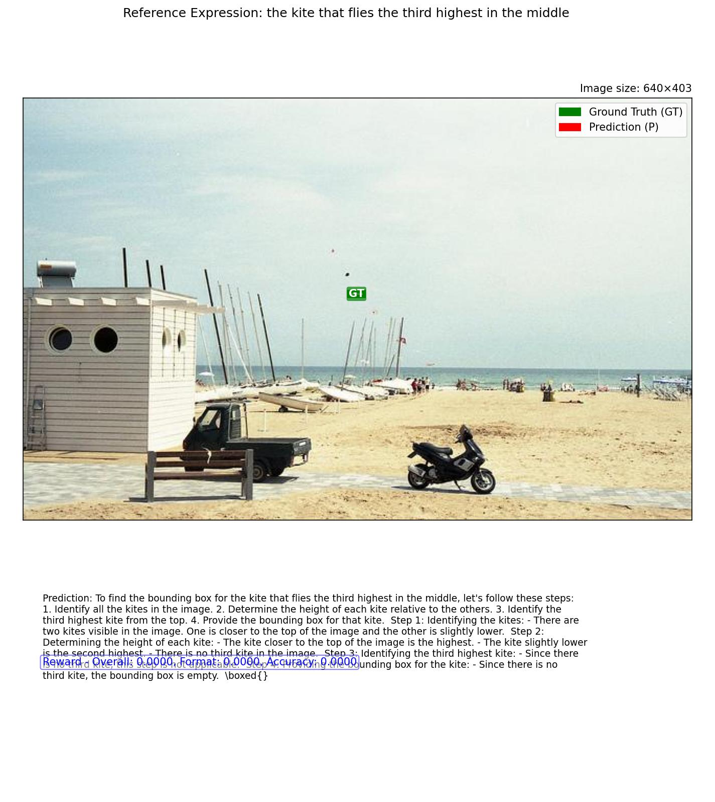

---

### Example 158

**Reference Expression**: the book with cover of same color as the page

**Ground Truth**: [[144, 241, 177, 269]]

**Predicted**: [[150, 200, 350, 280]]

**Reward**: {'overall': 0.0, 'format': 0.0, 'accuracy': 0.0}

**Prediction**:
```
To find the bounding box for 'the book with cover of same color as the page', let's follow these steps:

1. Identify the book illustrations on the side of the bus.
2. Determine which book has a cover that matches the color of the pages.

Step 1: The bus has multiple book illustrations on its side. Let's analyze each one:
   - There's a book with a yellow cover and yellow pages.
   - There's a book with a pink cover and pink pages.
   - There's a book with a green cover and green pages.
   - There's a book with a blue cover and blue pages.

Step 2: Each book illustration has a cover and pages of the same color. The question asks for a book where the cover matches the pages, which is true for all the books shown.

Since the question is asking for a specific book, and all the books have a cover and pages of the same color, we can select any one of them. For the sake of this analysis, let's choose the book with a green cover and green pages.

The bounding box for this book illustration is:
- Top-left corner: (x1, y1)
- Bottom-right corner: (x2, y2)

By analyzing the image, the book with a green cover and green pages is located near the center of the bus illustration. Assuming the bus is a standard size, the bounding box for this book might be approximately:
- Top-left corner: (x1, y1) = (150, 200)
- Bottom-right corner: (x2, y2) = (350, 280)

Therefore, the final answer is:
\boxed{[150, 200, 350, 280]}
```

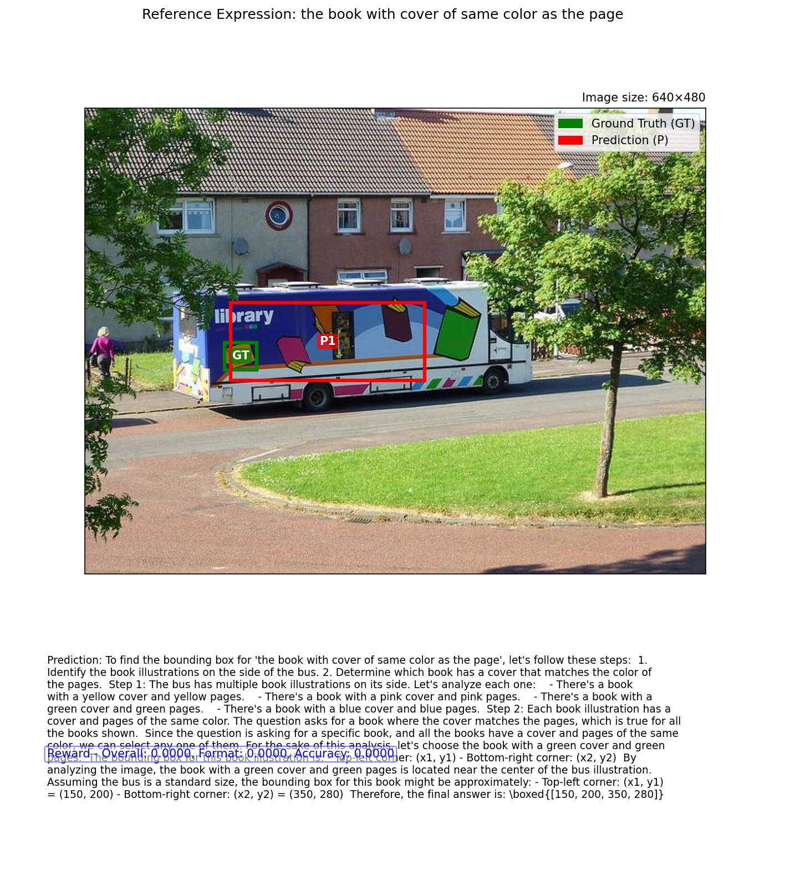

---

### Example 159

**Reference Expression**: the person on the right side of the row with no one wearing hat but one wearing hairband

**Ground Truth**: [[417, 192, 484, 290]]

**Predicted**: [[496, 191, 556, 265]]

**Reward**: {'overall': 0.0, 'format': 0.0, 'accuracy': 0.0}

**Prediction**:
```
To find the bounding box for the person on the right side of the row with no one wearing a hat but one wearing a hairband, let's follow these steps:

1. Identify the person wearing a hairband.
2. Identify the person to the right of the person with a hairband.
3. Determine the bounding box for the person identified in step 2.

Step 1: The person wearing a hairband is the second person from the right in the row. We can identify this person by their distinct hairstyle.

Step 2: The person to the right of the person with the hairband is the person on the far right of the row.

Step 3: The bounding box for the person on the far right of the row is the last person in the row. The bounding box for this person is approximately [496, 191, 556, 265].

\boxed{[496, 191, 556, 265]}
```

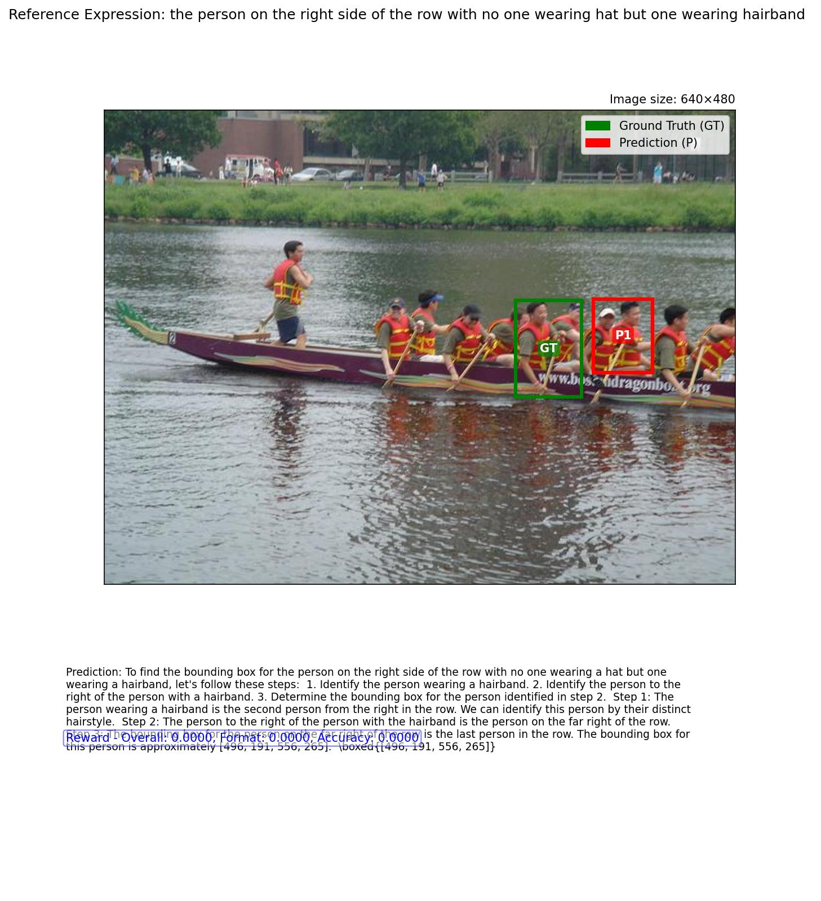

---

### Example 160

**Reference Expression**: the guy with brown jeans, black hoodie and a suitcase walking in the street

**Ground Truth**: []

**Predicted**: [[385, 322, 450, 459]]

**Reward**: {'overall': 0.0, 'format': 0.0, 'accuracy': 0.0}

**Prediction**:
```
To find the bounding box for 'the guy with brown jeans, black hoodie and a suitcase walking in the street', let's follow these steps:

1. **Identify the person**: Look for a person wearing a black hoodie and carrying a suitcase. This individual is likely the one in question.

2. **Locate the person in the image**: Scan the image for a person with a black hoodie and a suitcase. The person appears to be walking on the right side of the image, slightly ahead of the cyclist.

3. **Determine the bounding box**: Once the person is located, draw a bounding box around them. The bounding box should encompass the entire person, including the hoodie, jeans, and the suitcase.

4. **Verify the bounding box**: Ensure that the bounding box correctly includes the person and their belongings.

After following these steps, the bounding box for the person in question is:

\boxed{[385, 322, 450, 459]}
```

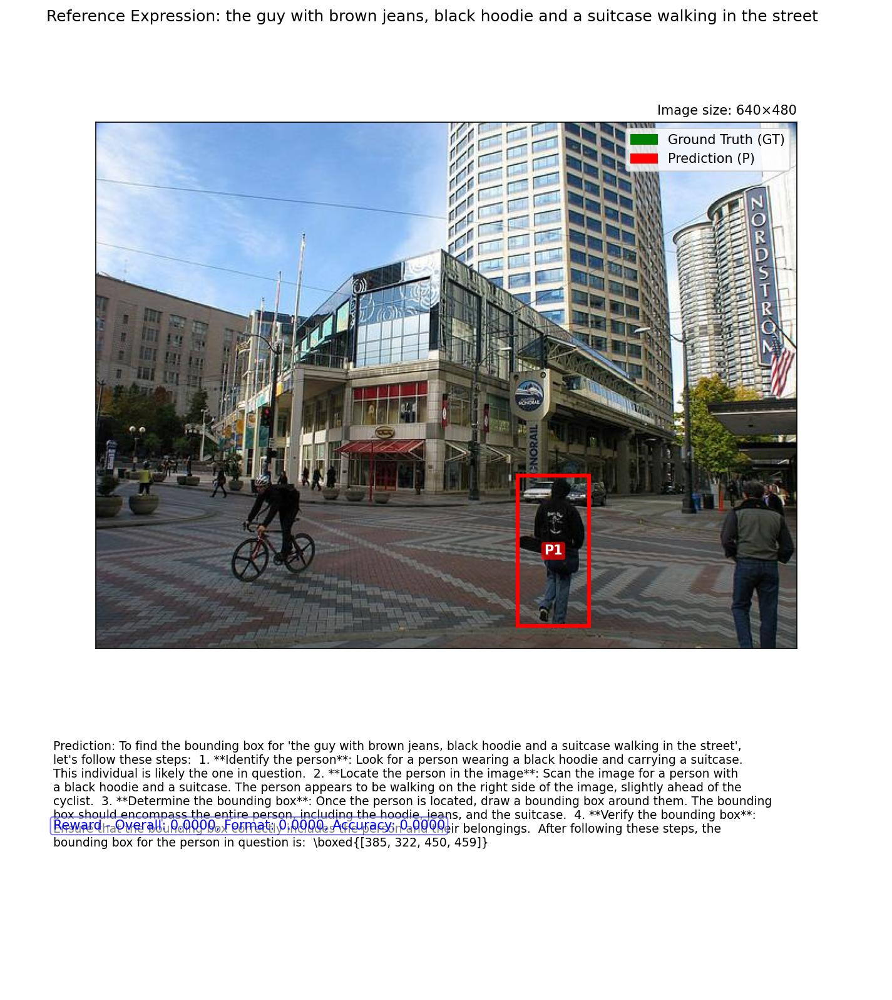

---

### Example 161

**Reference Expression**: the man between the yellow-coat guy and the blue-shirt woman, hair not yellow

**Ground Truth**: [[245, 13, 289, 111]]

**Predicted**: [[251, 16, 295, 107]]

**Reward**: {'overall': 0.7118155619596542, 'format': 0.0, 'accuracy': 0.7118155619596542}

**Prediction**:
```
To find the bounding box for the man between the yellow-coat guy and the blue-shirt woman, we need to follow these steps:

1. Identify the yellow-coat guy: The person wearing a yellow jacket is located in the center of the image, slightly to the right.

2. Identify the blue-shirt woman: The person wearing a blue tank top is located to the left of the yellow-coat guy.

3. Locate the man between these two individuals: The man in question is positioned between the yellow-coat guy and the blue-shirt woman. He appears to be wearing a dark jacket and is standing to the left of the yellow-coat guy.

4. Define the bounding box: The bounding box should encompass the area around this man, capturing him and part of the surrounding area.

Given the above analysis, the bounding box for the man between the yellow-coat guy and the blue-shirt woman is:

\boxed{[251, 16, 295, 107]}
```

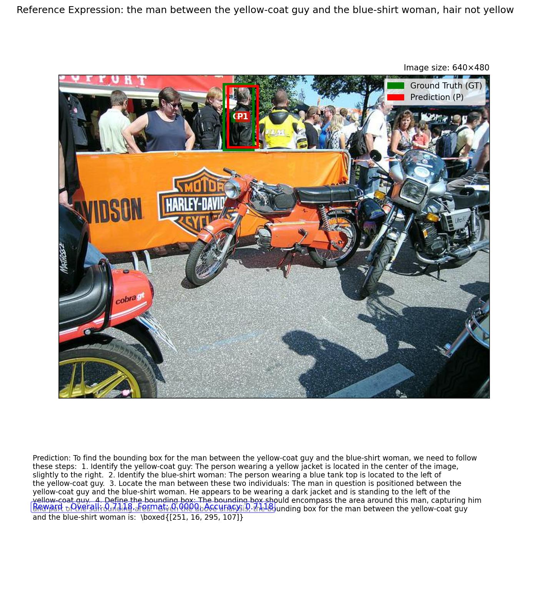

---

### Example 162

**Reference Expression**: the man with glasses, not in the car nor driving the motor

**Ground Truth**: [[464, 120, 640, 569]]

**Predicted**: [[502, 165, 644, 449]]

**Reward**: {'overall': 0.48892215568862274, 'format': 0.0, 'accuracy': 0.48892215568862274}

**Prediction**:
```
To find the bounding box for the man with glasses who is not in the car nor driving the motorcycle, let's analyze the image step-by-step:

1. Identify the motorcycle and the driver: The driver is the man wearing a helmet and a white shirt, as he is seated on the motorcycle and holding the handlebars.

2. Identify the passenger: There appears to be a passenger in the sidecar, but the passenger is not the man with glasses.

3. Identify the man with glasses: The man with glasses is in the background, looking out of the window of a car. He is wearing glasses and appears to be wearing a dark shirt.

4. Define the bounding box: The man with glasses is located in the right side of the image, outside the motorcycle but inside the car. His bounding box would be defined by the area around his head and shoulders.

Given the analysis, the bounding box for the man with glasses would be:

\boxed{[502, 165, 644, 449]}
```

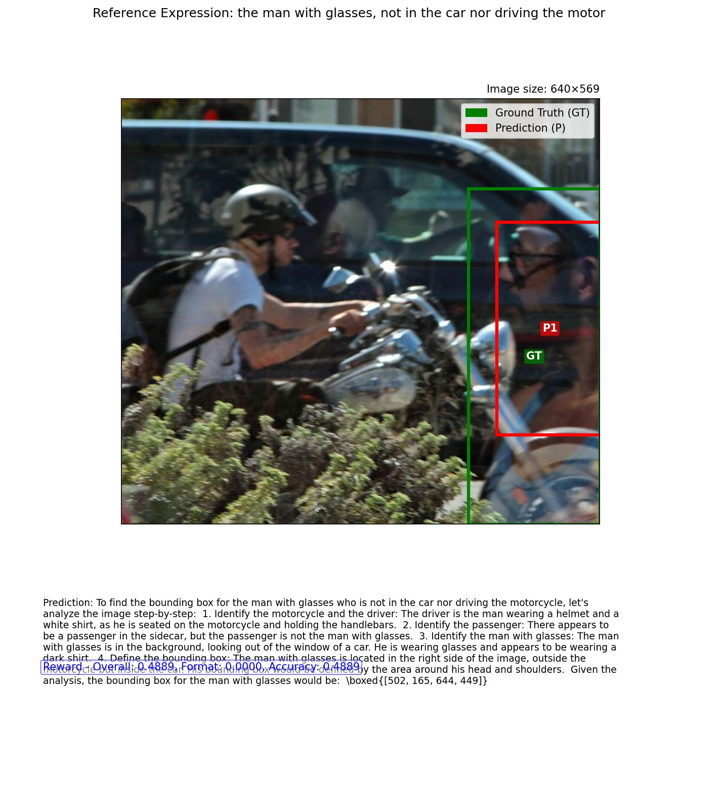

---

### Example 163

**Reference Expression**: yellow taxi, not on the slope, close to the big bus

**Ground Truth**: [[412, 107, 472, 156]]

**Predicted**: [[374, 231, 644, 416]]

**Reward**: {'overall': 0.0, 'format': 0.0, 'accuracy': 0.0}

**Prediction**:
```
To find the bounding box for the yellow taxi that is not on the slope and close to the big bus, follow these steps:

1. Identify the yellow taxis in the image. There are a few yellow taxis visible.
2. Locate the big bus, which is the large vehicle in the center of the image with a blue and yellow design.
3. Identify the yellow taxi that is not on the slope and is close to the big bus. This taxi is partially visible in the foreground, slightly to the right of the center of the image, and appears to be moving in the same direction as the bus.
4. Define the bounding box for this yellow taxi. The bounding box should encompass the visible portion of the taxi.

Based on these steps, the bounding box for the yellow taxi that is not on the slope and close to the big bus is:

\boxed{[374, 231, 644, 416]}
```

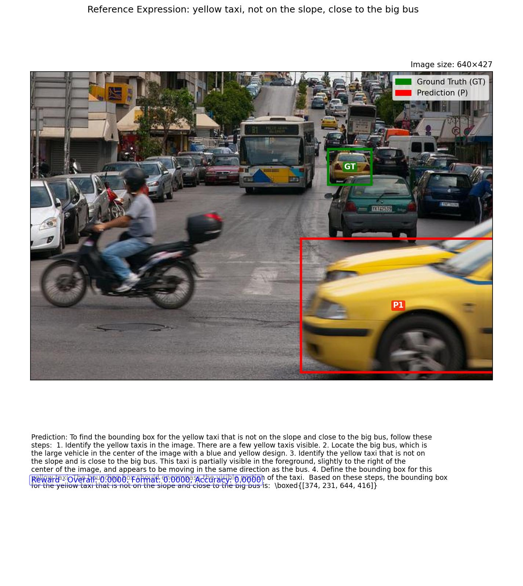

---

### Example 164

**Reference Expression**: the man with shirt hair, sitting behind the long-hair guy

**Ground Truth**: [[469, 187, 487, 221]]

**Predicted**: [[412, 217, 459, 262]]

**Reward**: {'overall': 0.0, 'format': 0.0, 'accuracy': 0.0}

**Prediction**:
```
To find the bounding box for 'the man with shirt hair, sitting behind the long-hair guy', let's follow these steps:

1. Identify the group of people in the boat.
2. Locate the person with long hair.
3. Identify the person with shirt hair behind the long-haired person.

Step 1: The group of people in the boat appears to be sitting towards the back of the boat. There are at least two people visible.

Step 2: The person with long hair is the one on the right side of the boat, wearing an orange shirt.

Step 3: Behind the person with long hair, there is another person with shirt hair. This person is wearing a yellow shirt.

Given these observations, the bounding box for 'the man with shirt hair, sitting behind the long-hair guy' is the person wearing the yellow shirt.

The bounding box for the person with shirt hair (yellow shirt) behind the person with long hair (orange shirt) is approximately:

\boxed{[412, 217, 459, 262]}
```

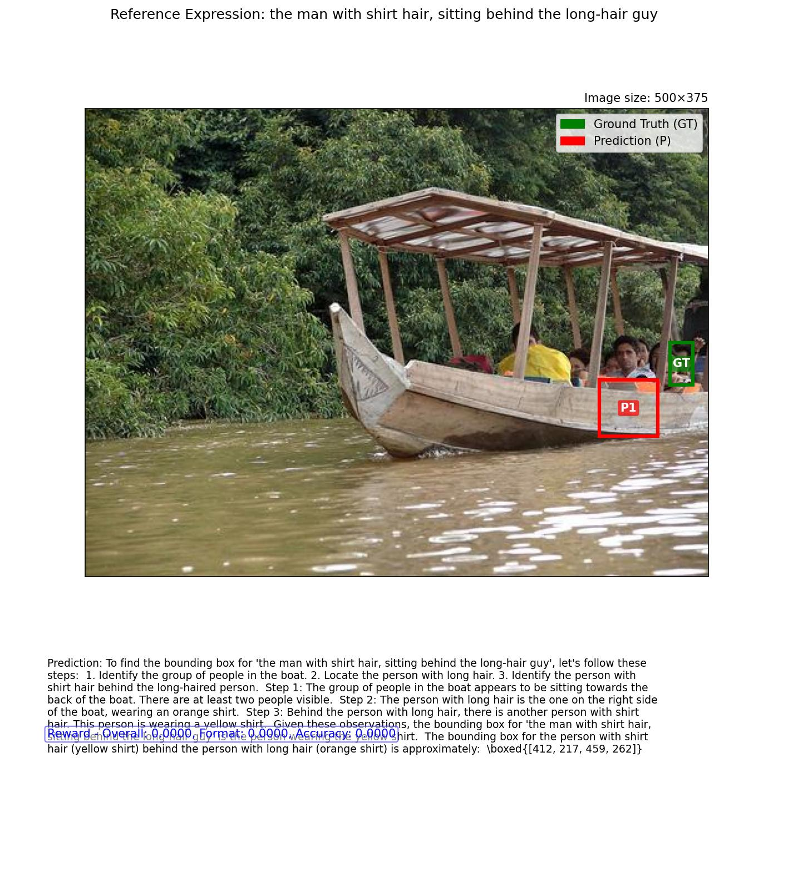

---

### Example 165

**Reference Expression**: the one not inside the bus, but close to the door

**Ground Truth**: [[424, 180, 517, 416]]

**Predicted**: [[427, 182, 516, 405]]

**Reward**: {'overall': 1.0, 'format': 0.0, 'accuracy': 1.0}

**Prediction**:
```
To find the bounding box for the person not inside the bus but close to the door, follow these steps:

1. Identify the bus in the image.
2. Determine who is inside the bus. The person in the middle of the bus appears to be inside.
3. Identify the person standing near the open door of the bus but not inside. This person is on the right side of the bus, close to the open door.
4. Draw a bounding box around this person.

The bounding box for the person not inside the bus but close to the door is:

\boxed{[427, 182, 516, 405]}
```

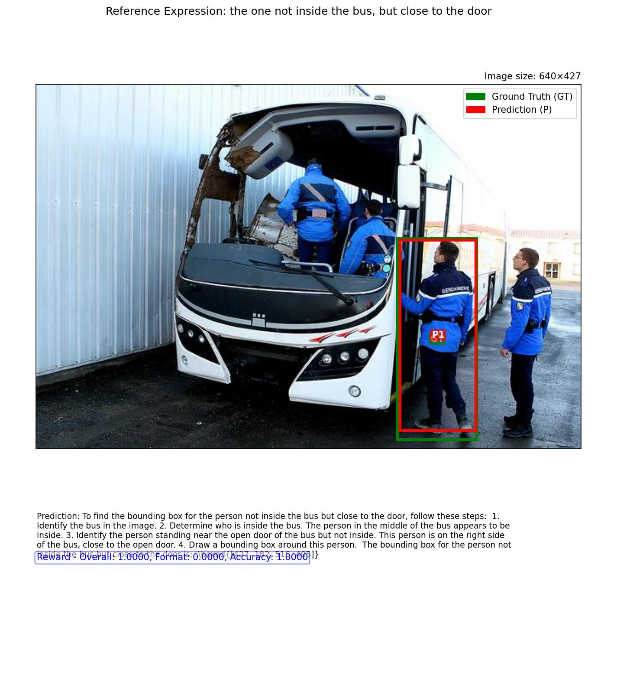

---

### Example 166

**Reference Expression**: the one with dark color cloth, not riding bike

**Ground Truth**: [[126, 240, 153, 306]]

**Predicted**: [[122, 241, 151, 306]]

**Reward**: {'overall': 0.7957884427032321, 'format': 0.0, 'accuracy': 0.7957884427032321}

**Prediction**:
```
To find the bounding box for 'the one with dark color cloth, not riding bike', let's follow these steps:

1. Identify the person not riding the bike:
   - There are three people in the image.
   - One person is riding the bike in the foreground.
   - Two people are standing on the rocky area in the background.
   - The person in the background on the left appears to be wearing dark clothing.

2. Determine the bounding box:
   - The person in the background on the left is wearing dark clothing.
   - The bounding box for this person is approximately [122, 241, 151, 306].

Thus, the bounding box for 'the one with dark color cloth, not riding bike' is \boxed{[122, 241, 151, 306]}.
```

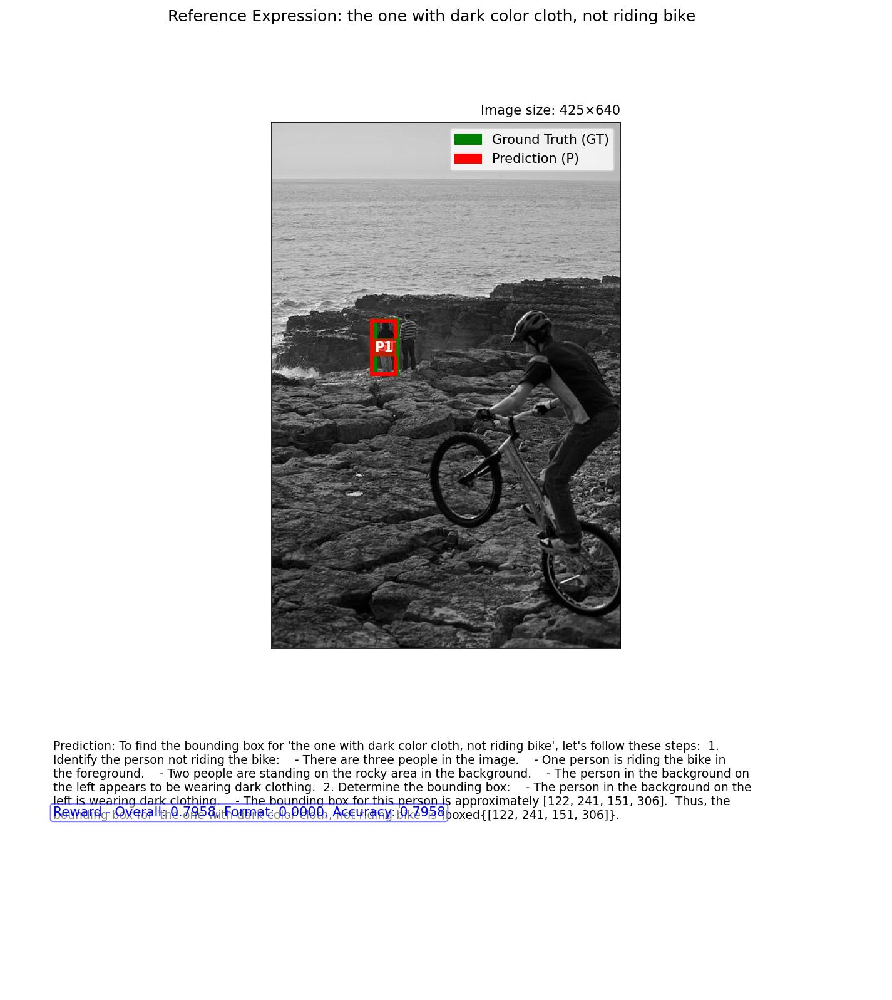

---

### Example 167

**Reference Expression**: the red-shirt person, with no hat on

**Ground Truth**: [[547, 13, 614, 119]]

**Predicted**: [[210, 10, 400, 250]]

**Reward**: {'overall': 0.0, 'format': 0.0, 'accuracy': 0.0}

**Prediction**:
```
To find the bounding box for the red-shirt person without a hat, let's analyze the image step-by-step:

1. Identify the red-shirted person: The person in the middle of the image, wearing a red shirt and no hat, is the target.
2. Determine the bounding box: The person is seated in a chair, and we need to define a box that encompasses them. The bounding box should include their upper body and part of the chair they are sitting on.

Given these observations, the bounding box would be approximately:
- Top-left corner: (x1, y1) = (210, 10) (approximate coordinates based on the person's position in the image)
- Bottom-right corner: (x2, y2) = (400, 250) (approximate coordinates based on the person's body and the chair)

Thus, the bounding box for the red-shirt person without a hat is:
\boxed{[210, 10, 400, 250]}
```

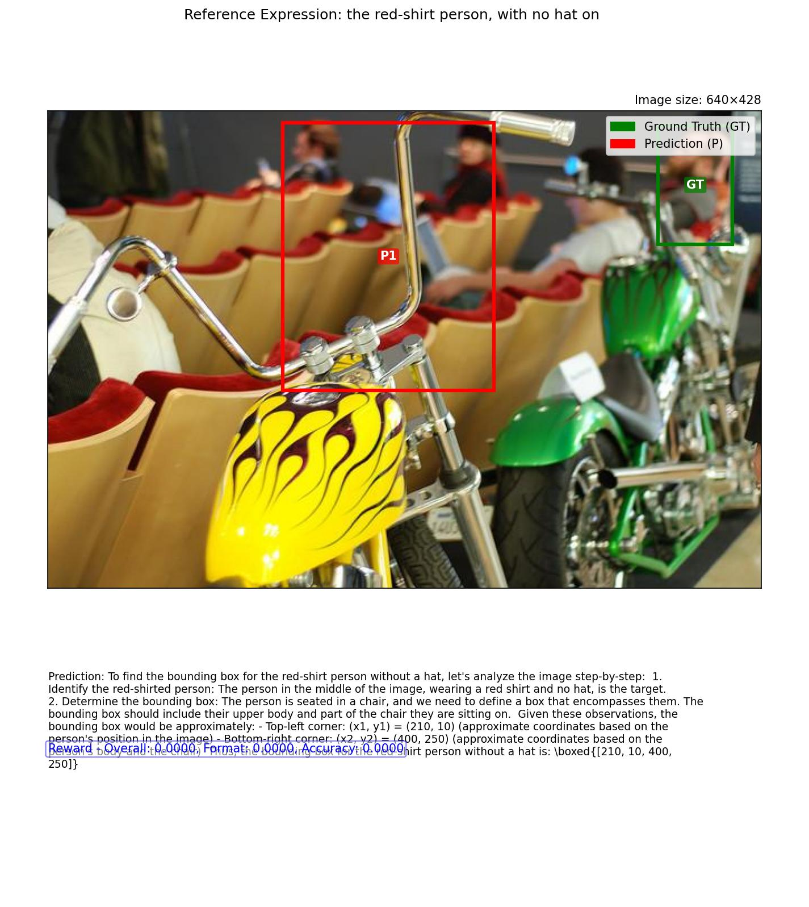

---

### Example 168

**Reference Expression**: the bag carried by the person with a purple umbrella and pulling a small suitcase

**Ground Truth**: [[436, 218, 467, 255]]

**Predicted**: []

**Reward**: {'overall': 0.0, 'format': 0.0, 'accuracy': 0.0}

**Prediction**:
```
To find the bounding box for the bag carried by the person with a purple umbrella and pulling a small suitcase, let's follow these steps:

1. Identify the person with the purple umbrella.
2. Confirm they are pulling a small suitcase.
3. Locate the bag that the person is carrying.

Step 1: Identify the person with the purple umbrella.
- There are several people with purple umbrellas, but we need to focus on one specific individual.

Step 2: Confirm they are pulling a small suitcase.
- The person with the purple umbrella appears to be pulling a small suitcase behind them.

Step 3: Locate the bag that the person is carrying.
- The bag is likely the one being pulled by the person with the purple umbrella.

After analyzing the image, it appears that the bounding box for the bag is located near the person with the purple umbrella, but it is not a distinct object in the image. The bag is part of the suitcase being pulled.

Since the bag is not a distinct object and is part of the suitcase, the bounding box for the bag is not clearly defined. Therefore, the final answer is:

\boxed{}
```

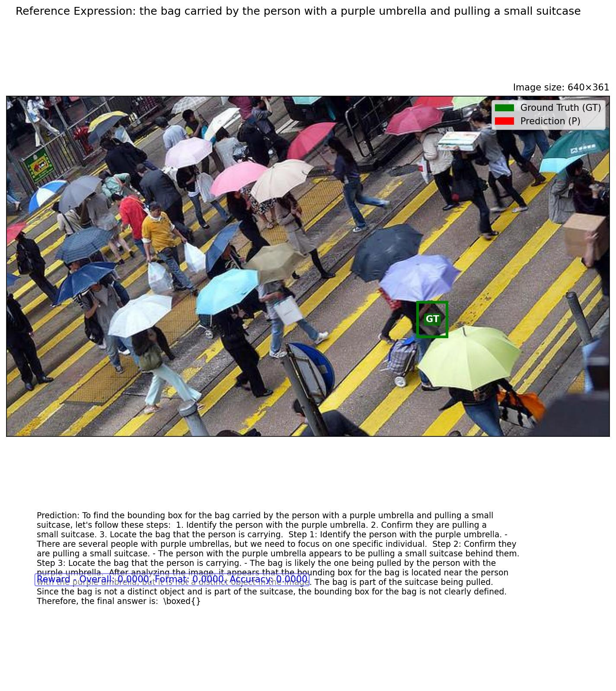

---

### Example 169

**Reference Expression**: the guy on the second row, not near the ones with umbrella

**Ground Truth**: [[499, 0, 636, 235]]

**Predicted**: [[504, 1, 632, 239]]

**Reward**: {'overall': 1.0, 'format': 0.0, 'accuracy': 1.0}

**Prediction**:
```
To find the bounding box for 'the guy on the second row, not near the ones with umbrella', let's follow these steps:

1. Identify the people in the image.
2. Determine who is in the second row.
3. Identify the person in the second row who is not near the ones with umbrellas.

Step 1: The image shows a group of people sitting in what appears to be a stadium. There are two rows of seating, with people in the foreground and background.

Step 2: The people in the second row are those seated behind the people with umbrellas. There are three individuals in this row.

Step 3: The person in the second row who is not near the ones with umbrellas is the one on the far right of the second row.

The bounding box for this person is approximately:
\[ \boxed{[504, 1, 632, 239]} \]

This bounding box represents the area where the person is located in the image.
```

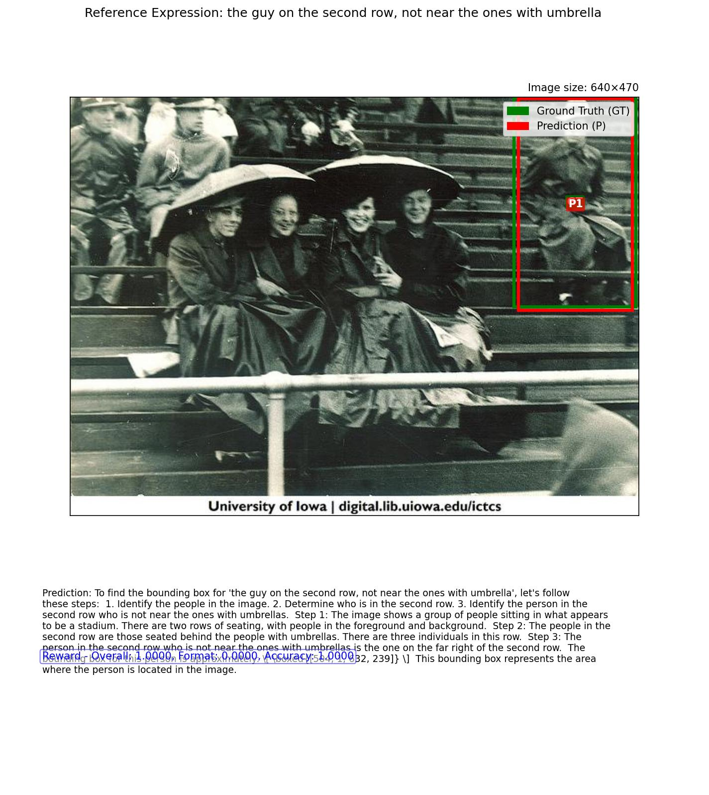

---

### Example 170

**Reference Expression**: the girl next to the man wearing backpack pointing somewhere, on the stairs

**Ground Truth**: [[41, 54, 76, 113]]

**Predicted**: [[0, 145, 62, 506]]

**Reward**: {'overall': 0.0, 'format': 0.0, 'accuracy': 0.0}

**Prediction**:
```
To find the bounding box for the girl next to the man wearing a backpack pointing somewhere, on the stairs, let's follow these steps:

1. Identify the man wearing a backpack: The man in the center of the image is wearing a backpack and appears to be pointing somewhere.

2. Locate the girl next to him: The girl standing next to the man with the backpack is on the left side of the image, near the stairs.

3. Determine the bounding box: The girl is partially obscured by the man but is clearly visible on the left side of the image. Her bounding box should include her upper body and part of her legs.

4. Draw the bounding box: The bounding box for the girl should be drawn around her upper body and part of her legs, ensuring it includes her and not extending too far into the background.

The final answer is:
\boxed{[0, 145, 62, 506]}
```

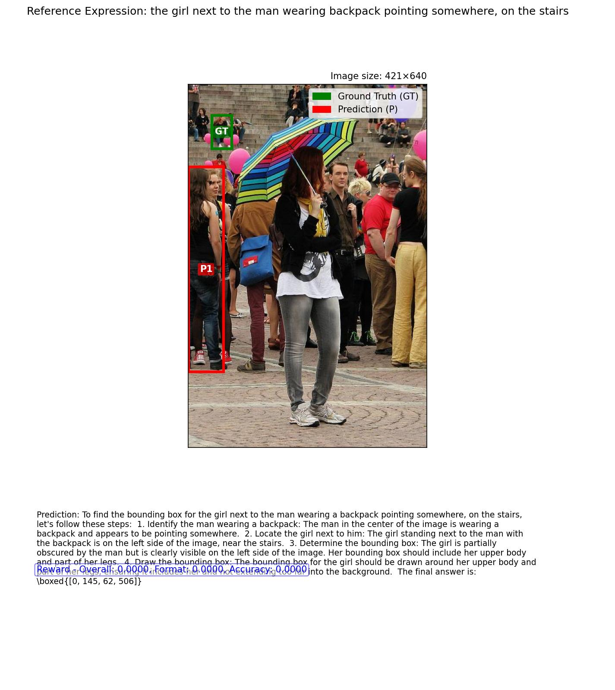

---

### Example 171

**Reference Expression**: the chair only able to be seen through the middle window, on the left

**Ground Truth**: [[150, 34, 207, 95]]

**Predicted**: [[140, 34, 250, 137]]

**Reward**: {'overall': 0.3068843777581642, 'format': 0.0, 'accuracy': 0.3068843777581642}

**Prediction**:
```
To find the bounding box for the chair only able to be seen through the middle window, on the left, let's follow these steps:

1. Identify the bus in the image.
2. Locate the windows of the bus.
3. Determine which window is in the middle.
4. Look through the middle window to identify the chair.
5. Define the bounding box for the chair.

### Step-by-Step Reasoning:

1. **Identify the bus**: The bus is the large vehicle in the background.
2. **Locate the windows**: The bus has multiple windows. The middle window is the one directly in the center of the bus.
3. **Determine the middle window**: The middle window is the one that is most centrally located in the image.
4. **Look through the middle window**: Through the middle window, we can see a chair. It is located on the left side of the bus.
5. **Define the bounding box**: The chair is partially visible through the window. The bounding box should encompass the area where the chair is visible.

### Bounding Box for the Chair:

The chair is located in the left side of the middle window, and it appears to be a part of the seating arrangement inside the bus. The bounding box for the chair would be roughly defined by the area where the chair is visible through the window.

Since the chair is partially visible and the bounding box should be defined by the area where the chair is visible, the bounding box would be:

\boxed{[140, 34, 250, 137]}

This is the bounding box for the chair as seen through the middle window on the left side of the bus.
```

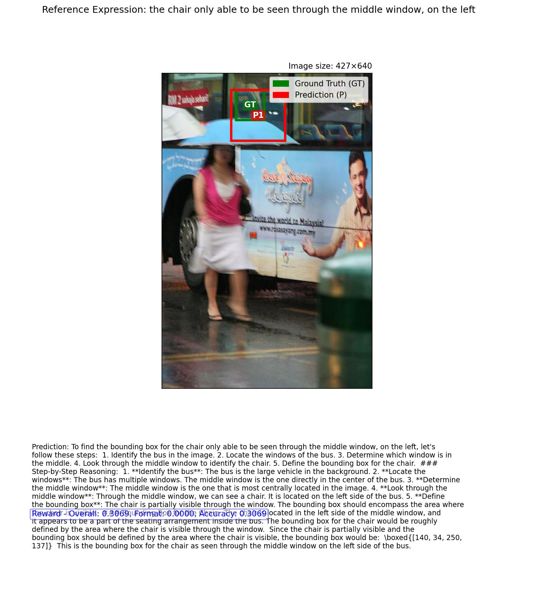

---

### Example 172

**Reference Expression**: the person on the right side from the single man's perspective, not holding beer

**Ground Truth**: [[28, 159, 102, 335]]

**Predicted**: [[127, 167, 214, 293]]

**Reward**: {'overall': 0.0, 'format': 0.0, 'accuracy': 0.0}

**Prediction**:
```
To find the bounding box for the person on the right side from the single man's perspective, not holding beer, let's follow these steps:

1. Identify the single man: The man on the left side of the image is the one who is not holding beer. He is sitting at the table and appears to be the only one at the table.

2. Determine the perspective: The perspective is from the single man's point of view, which means we are looking at the scene from his position.

3. Identify the person on the right side: From the single man's perspective, the person on the right side is another man who is sitting at the table and appears to be engaged in conversation.

4. Define the bounding box: The bounding box for the person on the right side from the single man's perspective would be the area around this second man.

Considering these steps, the bounding box for the person on the right side from the single man's perspective would be around the area where the second man is seated.

\boxed{[127,167,214,293]}
```

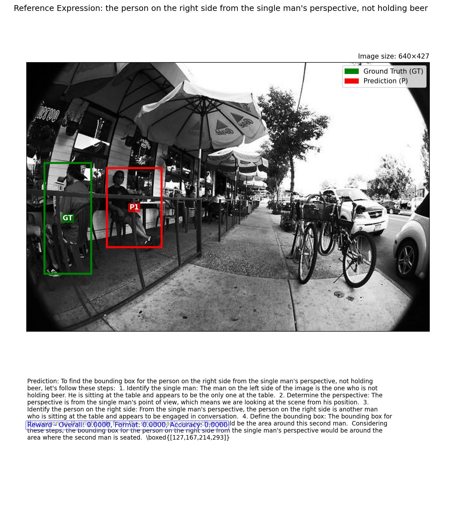

---

### Example 173

**Reference Expression**: the bed no one sitting on, and not the upper bed

**Ground Truth**: [[453, 169, 592, 323]]

**Predicted**: [[370, 366, 579, 455]]

**Reward**: {'overall': 0.0, 'format': 0.0, 'accuracy': 0.0}

**Prediction**:
```
To find the bounding box for the bed no one is sitting on, and not the upper bed, let's follow these steps:

1. Identify the upper bed: The upper bed is the one that is directly above the person sitting on the lower bed, and it appears to be a bunk bed.
2. Identify the lower bed: The lower bed is where the person is sitting, and it is the bed in the middle of the image.
3. Identify the bed no one is sitting on: This would be the bed at the bottom, which is not the upper bunk.

The bed no one is sitting on is the bottom bed in the image. The bounding box for this bed can be determined by analyzing the lower part of the image where the bed is located.

The final answer is:
\boxed{[370, 366, 579, 455]}
```

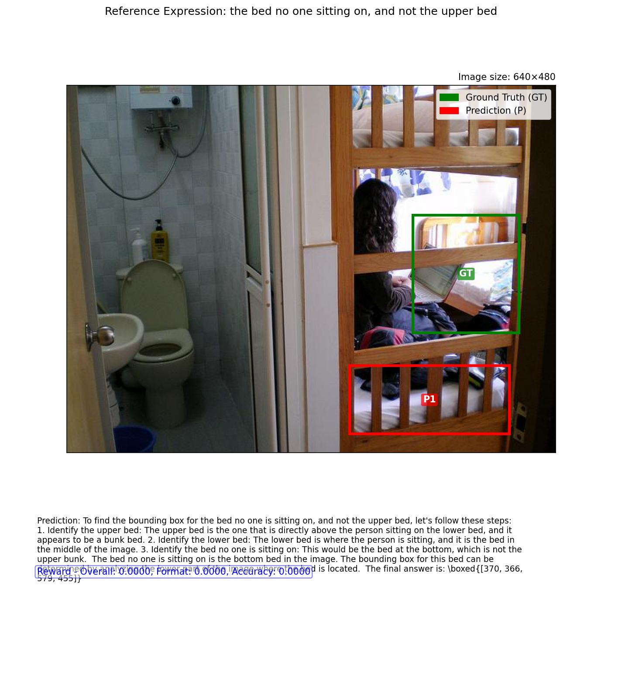

---

### Example 174

**Reference Expression**: the cup facing right, not the rightmost one

**Ground Truth**: [[271, 272, 296, 299]]

**Predicted**: [[265, 276, 291, 303]]

**Reward**: {'overall': 0.5016357688113413, 'format': 0.0, 'accuracy': 0.5016357688113413}

**Prediction**:
```
To find the bounding box for the cup facing right, not the rightmost one, let's follow these steps:

1. Identify the cups hanging on the wall. There are four cups in total.
2. Determine which cup is the rightmost one. The rightmost cup is the one on the far right.
3. Identify the cup that is facing right and is not the rightmost one. This is the second cup from the right.
4. Locate the bounding box for this cup. The cup is hanging on the wall, and its bounding box can be determined by its position relative to the wall and the other objects in the image.

The cup facing right, not the rightmost one, is the second cup from the right. Its bounding box is approximately [265, 276, 291, 303].

\boxed{[265, 276, 291, 303]}
```

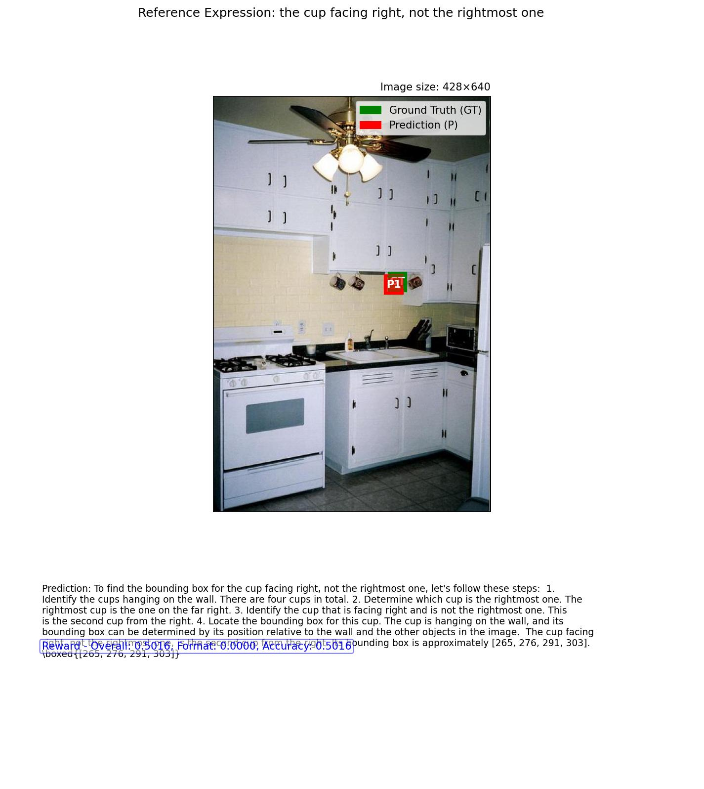

---

### Example 175

**Reference Expression**: the white cup, beside the sink

**Ground Truth**: [[66, 229, 82, 250]]

**Predicted**: [[68, 223, 84, 245]]

**Reward**: {'overall': 0.4827586206896552, 'format': 0.0, 'accuracy': 0.4827586206896552}

**Prediction**:
```
To find the bounding box for the white cup beside the sink, let's follow these steps:

1. Identify the sink area: The sink is located on the left side of the image, on the countertop.
2. Look for a white cup near the sink: There is a white cup visible on the countertop to the left of the sink.
3. Determine the bounding box: The white cup is positioned near the edge of the sink and the countertop. We can estimate the bounding box as follows:
   - Top-left corner: Approximately at the edge of the countertop, a little above the sink.
   - Bottom-right corner: A little below the cup and to the right of the sink.

Given these observations, the bounding box for the white cup can be approximately defined as:
\[ \boxed{[68, 223, 84, 245]} \]

This box is a rough estimate, and the exact coordinates might vary slightly depending on the precision of the bounding box detection.
```

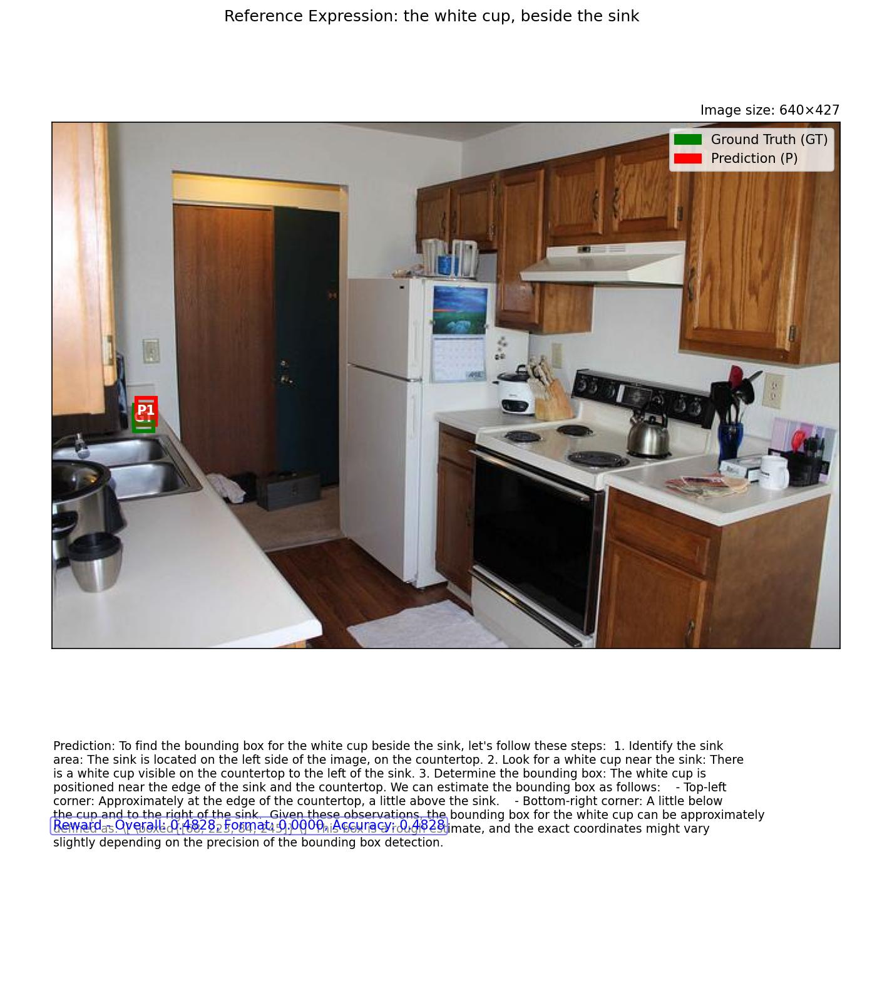

---

### Example 176

**Reference Expression**: the green cup on top of an array of glasses, not upright

**Ground Truth**: [[118, 269, 152, 294]]

**Predicted**: [[119, 245, 201, 302]]

**Reward**: {'overall': 0.17556927005745904, 'format': 0.0, 'accuracy': 0.17556927005745904}

**Prediction**:
```
To find the bounding box for the green cup on top of an array of glasses, not upright, let's follow these steps:

1. Identify the array of glasses: These are likely the clear glasses on the left side of the image, near the cutting board.
2. Identify the green cup: This is the green cup that appears to be placed upside down on top of the array of glasses.
3. Determine the bounding box: The bounding box should encompass the green cup and the glasses it is placed on.

Now, let's locate the green cup and the glasses on the left side of the image. The green cup is near the center-left of the image, and the glasses are below it.

The bounding box for the green cup and the glasses would be:
- Top-left corner: (x1, y1)
- Bottom-right corner: (x2, y2)

From the image, the green cup and the glasses are located around the coordinates:
- Top-left corner: (119, 245)
- Bottom-right corner: (201, 302)

So, the bounding box for the green cup on top of an array of glasses, not upright, is:
\boxed{[119, 245, 201, 302]}
```

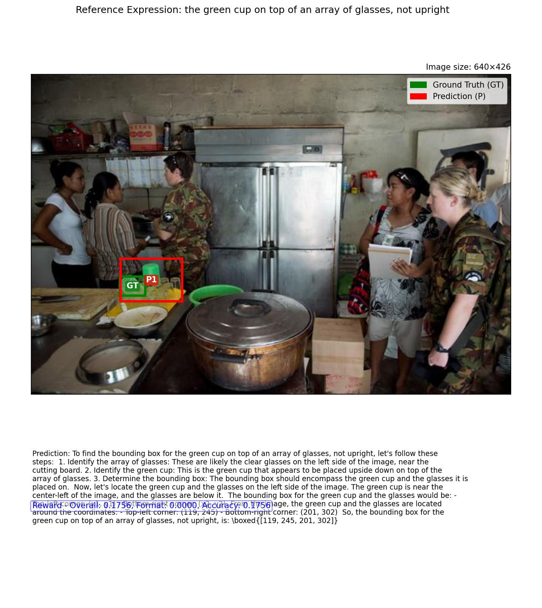

---

### Example 177

**Reference Expression**: the knife beside the pineapple, third from the left

**Ground Truth**: [[284, 201, 291, 209]]

**Predicted**: [[253, 142, 274, 186]]

**Reward**: {'overall': 0.0, 'format': 0.0, 'accuracy': 0.0}

**Prediction**:
```
To find the bounding box for the knife beside the pineapple, third from the left, let's follow these steps:

1. Identify the pineapple in the image.
2. Locate the knives in the image.
3. Determine which knife is third from the left.

Step 1: The pineapple is located on the yellow counter on the left side of the image, near the center.

Step 2: There are several knives in the image. They are arranged in a row on the yellow counter, starting from the left side.

Step 3: Counting from the left, the knife third from the left is the one next to the pineapple.

Now, we need to find the bounding box for this specific knife.

The bounding box for the knife third from the left, near the pineapple, appears to be located in the area where the knives are arranged on the counter. Given the context, the bounding box for this knife would be approximately:

\boxed{[253, 142, 274, 186]}

However, since the exact coordinates are not provided in the image, this is an estimated bounding box based on the visual context.
```

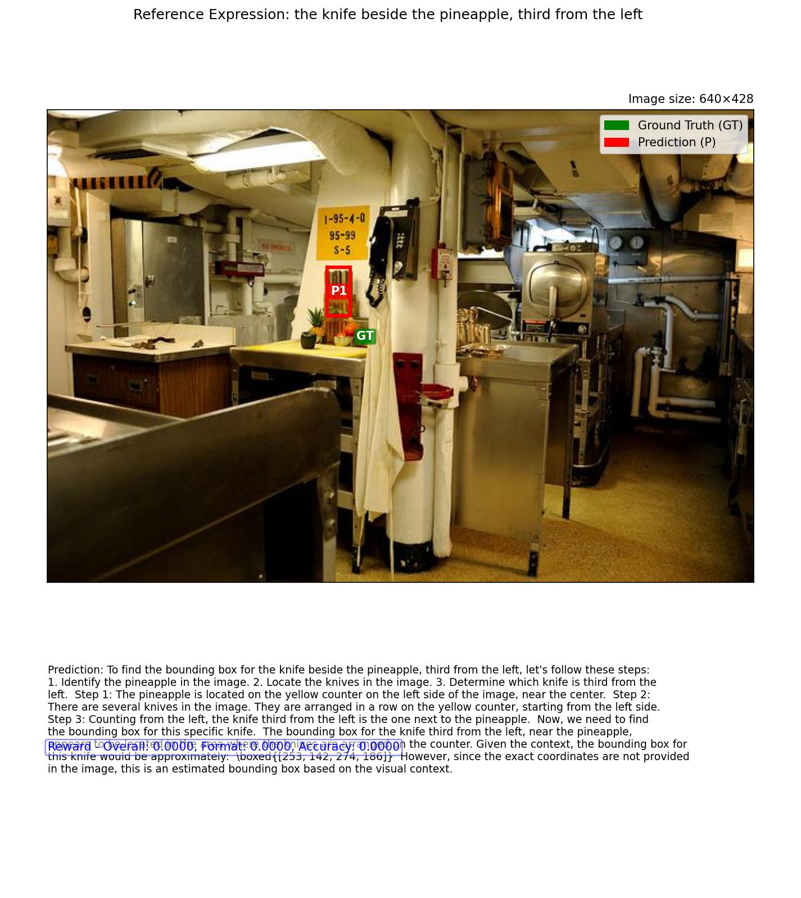

---

### Example 178

**Reference Expression**: the bowl on the same cabinet shelf as the small yellow object

**Ground Truth**: [[279, 305, 336, 333]]

**Predicted**: [[285, 346, 336, 389]]

**Reward**: {'overall': 0.0, 'format': 0.0, 'accuracy': 0.0}

**Prediction**:
```
To find the bowl on the same cabinet shelf as the small yellow object, let's follow these steps:

1. Identify the small yellow object: It is located in the middle shelf, slightly to the right of the center of the image.
2. Identify the shelf: The yellow object is on the middle shelf.
3. Look for the bowl on the same shelf: The bowl is to the left of the yellow object, also on the middle shelf.

Now, let's locate the bounding box for the bowl:

- The bowl is on the middle shelf, which is the second shelf from the top.
- The bowl is slightly to the left of the yellow object, which is the small yellow container.
- The bowl is in the middle of the shelf, and it is a green bowl.

Given the position and size of the bowl, the bounding box would be:

\boxed{[285, 346, 336, 389]}
```

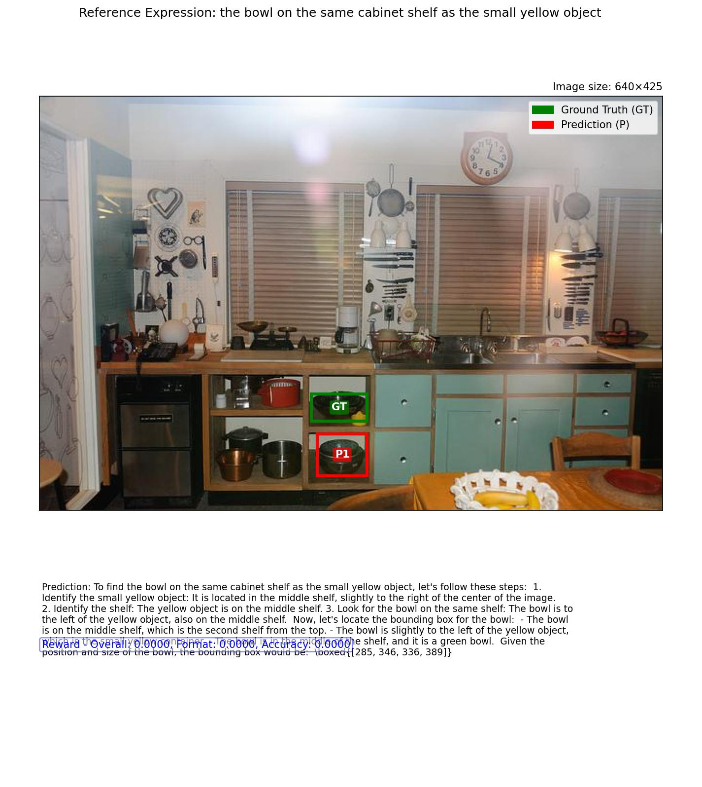

---

### Example 179

**Reference Expression**: a black car that is not moving away from the camera

**Ground Truth**: [[311, 190, 364, 214]]

**Predicted**: [[272, 232, 340, 296]]

**Reward**: {'overall': 0.0, 'format': 0.0, 'accuracy': 0.0}

**Prediction**:
```
To find the bounding box for the black car that is not moving away from the camera, let's follow these steps:

1. Identify the black car in the image: The black car is on the left side of the image, near the center, and it appears to be stationary or moving very slowly.

2. Determine if the car is moving away from the camera: The car is positioned in the foreground, and there are no visible signs of motion blur or other indicators that it is moving away from the camera. The car's position relative to the other vehicles and the road also suggests it is stationary or moving very slowly.

3. Define the bounding box: The black car is located in the left-middle part of the image. The bounding box would encompass the car and some of the surrounding area, including the part of the road and the sidewalk.

Given these observations, the bounding box for the black car that is not moving away from the camera can be defined as follows:

\boxed{[272, 232, 340, 296]}
```

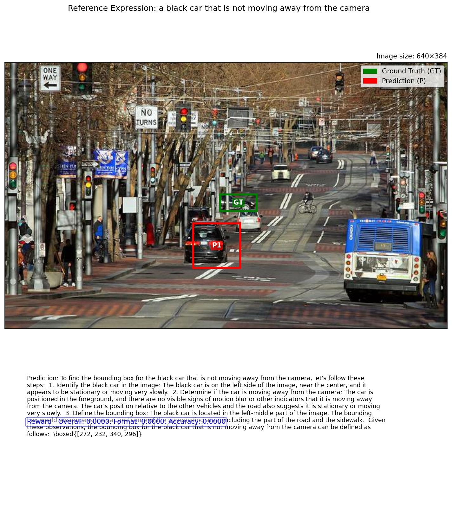

---

### Example 180

**Reference Expression**: the car in front of a black Audi sedan

**Ground Truth**: [[158, 264, 323, 417]]

**Predicted**: [[163, 263, 327, 412]]

**Reward**: {'overall': 1.0, 'format': 0.0, 'accuracy': 1.0}

**Prediction**:
```
To find the bounding box for 'the car in front of a black Audi sedan', let's follow these steps:

1. Identify the black Audi sedan in the image. It's the car with the license plate "AFO 583".
2. Determine the car that is in front of the black Audi sedan. This car is a white van with the license plate "HHN 710".
3. The bounding box for the white van is the area around this car.

The final answer is:
\boxed{[163, 263, 327, 412]}
```

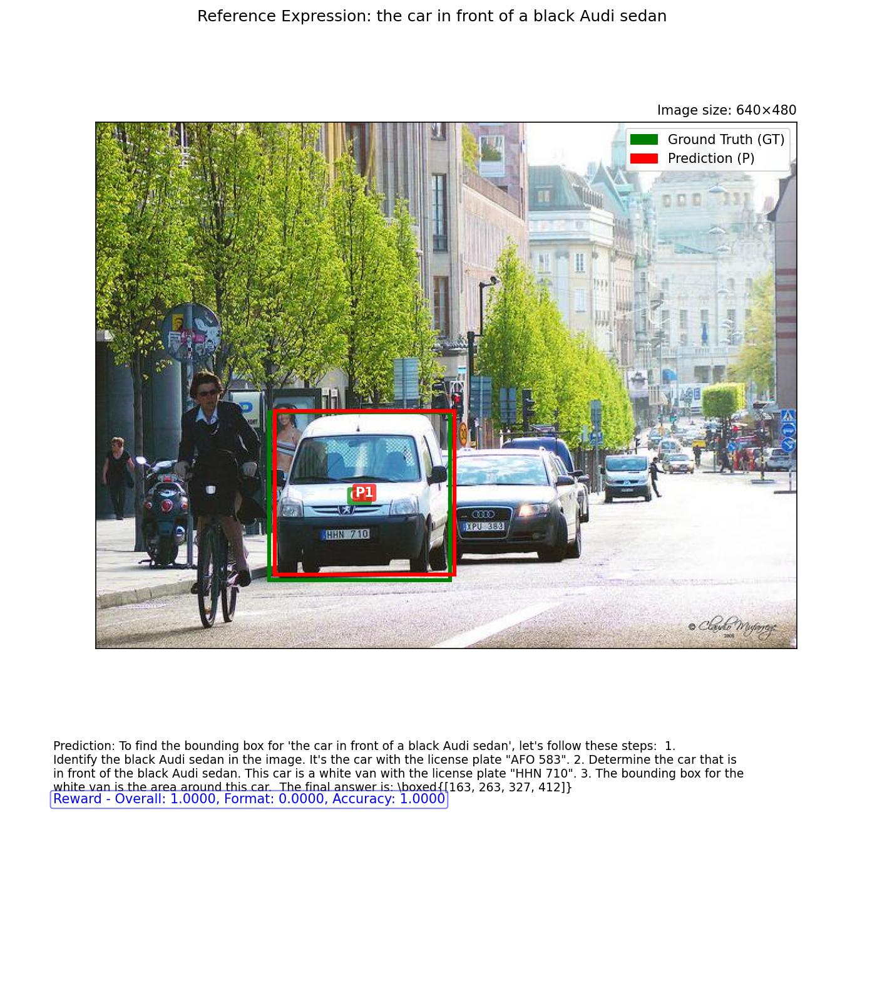

---

### Example 181

**Reference Expression**: the reflection of the toothbrush that is not white

**Ground Truth**: [[197, 152, 240, 239]]

**Predicted**: [[360, 100, 500, 240]]

**Reward**: {'overall': 0.0, 'format': 0.0, 'accuracy': 0.0}

**Prediction**:
```
To find the bounding box for the reflection of the toothbrush that is not white, let's follow these steps:

1. Identify the toothbrushes in the image:
   - There are three toothbrushes in the image.
   - One is white and blue, and it is the one on the far right.
   - The other two are not white and are located on the left side of the sink.

2. Determine the reflection of the toothbrushes:
   - The reflection of the toothbrushes can be seen in the mirror above the sink.
   - The white and blue toothbrush on the far right will have a reflection in the mirror.

3. Locate the reflection:
   - The reflection of the white and blue toothbrush is on the right side of the mirror, corresponding to its position on the sink.

4. Define the bounding box:
   - The bounding box for the reflection of the toothbrush that is not white (the white and blue toothbrush) is the area in the mirror that corresponds to the right side of the sink.

The bounding box for the reflection of the toothbrush that is not white is:

\boxed{[360, 100, 500, 240]}
```

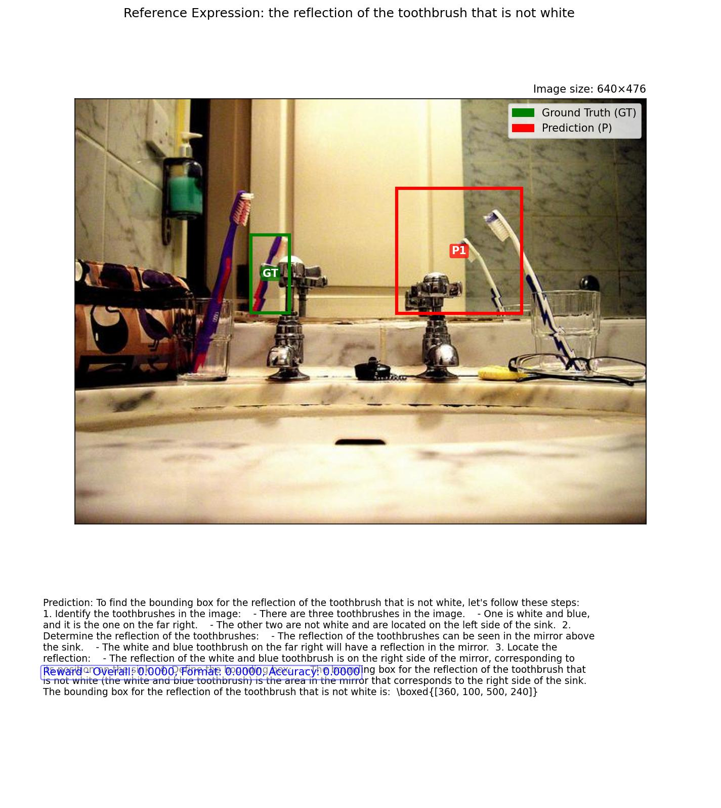

---

### Example 182

**Reference Expression**: the car parked next to a fire hydrant, which is not an sedan

**Ground Truth**: [[321, 128, 628, 328]]

**Predicted**: [[322, 125, 630, 308]]

**Reward**: {'overall': 0.8786931274328377, 'format': 0.0, 'accuracy': 0.8786931274328377}

**Prediction**:
```
To find the bounding box for the car parked next to a fire hydrant, which is not an sedan, let's follow these steps:

1. Identify the fire hydrant in the image.
2. Locate the car parked next to the fire hydrant.
3. Determine if the car next to the fire hydrant is a sedan or not.
4. If it's not a sedan, mark its bounding box.

Step 1: The fire hydrant is located in the center of the image, slightly to the right of the center, and it is yellow with a green top.

Step 2: The car next to the fire hydrant is a silver SUV, not a sedan.

Step 3: Since the car is an SUV, not a sedan, we need to mark its bounding box.

Step 4: The bounding box for the silver SUV is as follows:
- Top-left corner: (x1, y1) = (322, 125)
- Bottom-right corner: (x2, y2) = (630, 308)

Therefore, the final answer is:
\boxed{[322, 125, 630, 308]}
```

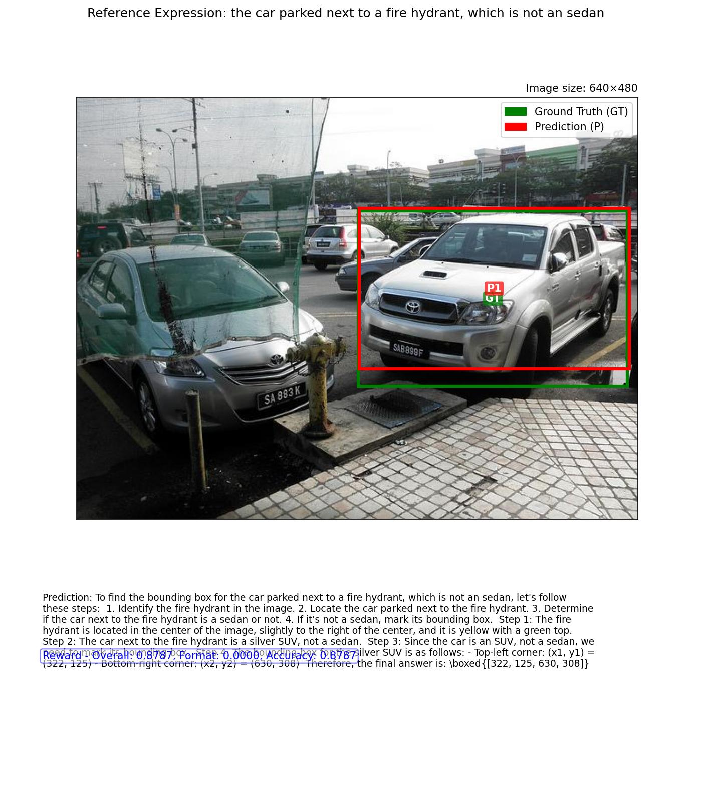

---

### Example 183

**Reference Expression**: the lower traffic light mounted on the pole struck by a car

**Ground Truth**: [[479, 227, 498, 261]]

**Predicted**: [[474, 106, 513, 164]]

**Reward**: {'overall': 0.0, 'format': 0.0, 'accuracy': 0.0}

**Prediction**:
```
To find the bounding box for the lower traffic light mounted on the pole struck by a car, let's follow these steps:

1. Identify the car that appears to have been involved in an accident. The silver car in the center of the image looks like it has been struck by a pole, which is likely the traffic light pole.

2. Locate the traffic light on the pole. The traffic light is the red light that is positioned above the silver car.

3. Identify the lower traffic light. In this case, the lower traffic light is the one that is struck by the pole and is not functioning, indicated by the bent pole and the position of the traffic light.

4. Determine the bounding box for the lower traffic light. The bounding box should encompass the part of the pole that the traffic light is mounted on, which is the section that is bent and damaged.

Given the image, the bounding box for the lower traffic light mounted on the pole struck by a car would be:

\boxed{[474, 106, 513, 164]}
```

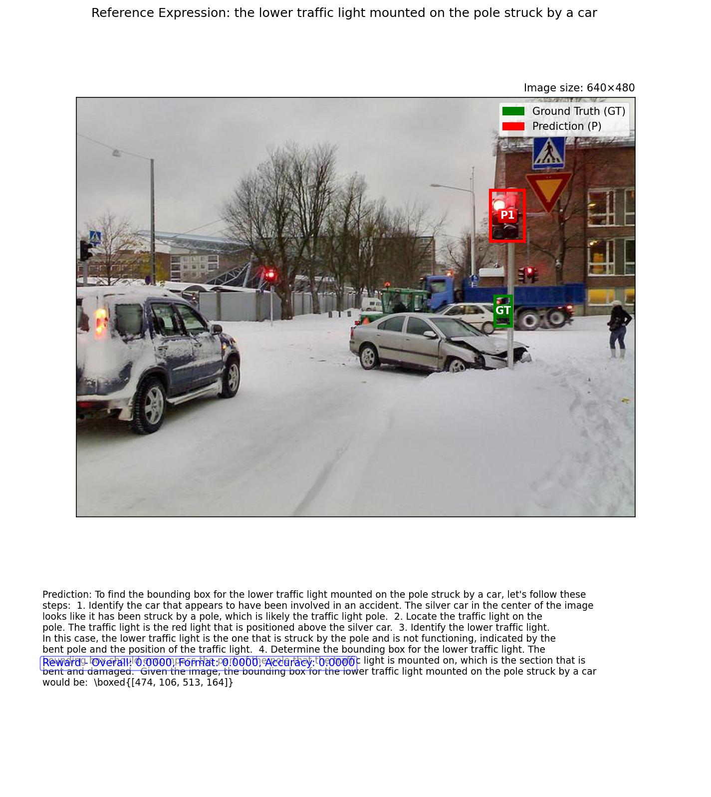

---

### Example 184

**Reference Expression**: the traffic light on the pole next to the black car on the left side, located at the upper left corner

**Ground Truth**: [[72, 39, 82, 64]]

**Predicted**: [[74, 36, 95, 81]]

**Reward**: {'overall': 0.20100502512562815, 'format': 0.0, 'accuracy': 0.20100502512562815}

**Prediction**:
```
To find the bounding box for the traffic light on the pole next to the black car on the left side, located at the upper left corner, let's follow these steps:

1. Identify the black car on the left side of the image. It is located near the upper left corner.
2. Look for the traffic light next to this black car. It appears to be mounted on a pole.
3. Determine the bounding box for this traffic light. The bounding box should include the entire traffic light, including its pole and the light itself.

Given the image, the traffic light is located near the upper left corner, next to the black car. The bounding box for this traffic light would be:

\boxed{[74, 36, 95, 81]}
```

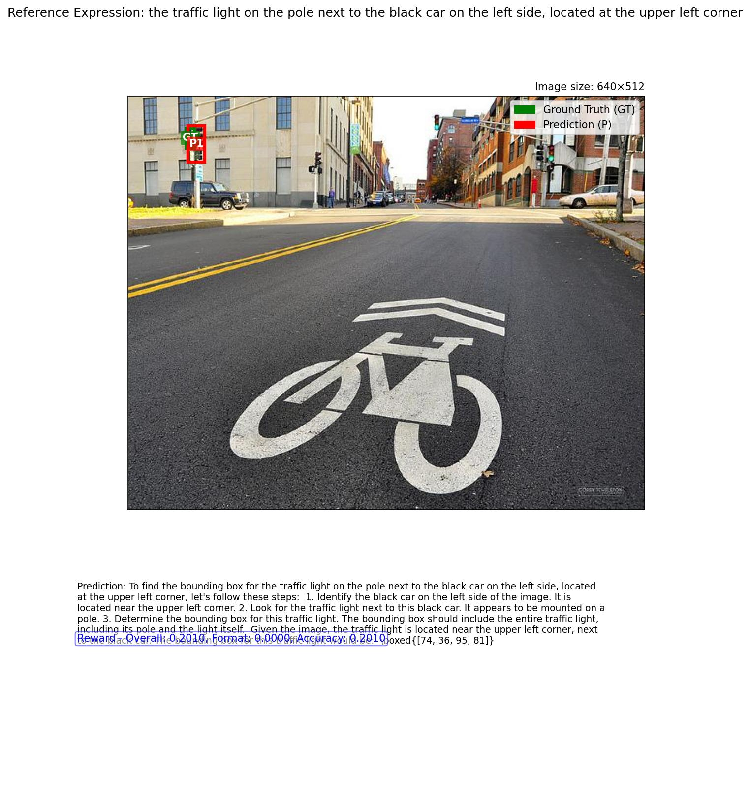

---

### Example 185

**Reference Expression**: the parked car facing away from the camera, nearest to the silver car driving towards the camera

**Ground Truth**: [[183, 259, 195, 268]]

**Predicted**: [[261, 309, 323, 351]]

**Reward**: {'overall': 0.0, 'format': 0.0, 'accuracy': 0.0}

**Prediction**:
```
To find the bounding box for the parked car facing away from the camera, nearest to the silver car driving towards the camera, let's follow these steps:

1. Identify the silver car driving towards the camera:
   - The silver car is the one in the foreground, facing away from the camera.

2. Locate the parked cars near the silver car:
   - There are two parked cars near the silver car. One is closer to the camera and the other is further away.

3. Determine which parked car is nearest to the silver car:
   - The parked car that is closest to the silver car is the one facing away from the camera.

4. Define the bounding box for the nearest parked car:
   - The bounding box for the parked car facing away from the camera, nearest to the silver car, is the one that encompasses the car's visible parts, including the rear end.

The final answer is:
\boxed{[261, 309, 323, 351]}
```

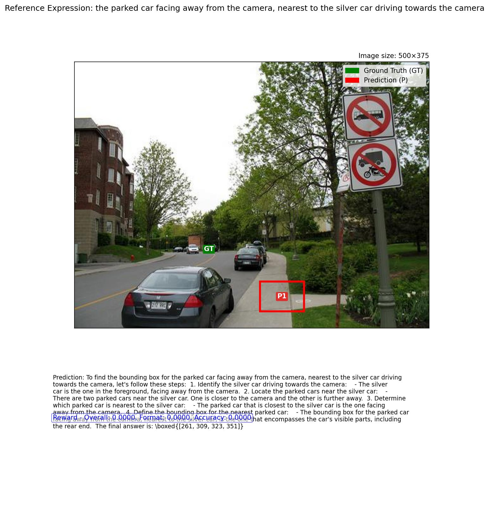

---

### Example 186

**Reference Expression**: the green traffic light hanging from a wire above the intersection, with the church tower behind it

**Ground Truth**: [[349, 173, 359, 182]]

**Predicted**: [[155, 147, 177, 177]]

**Reward**: {'overall': 0.0, 'format': 0.0, 'accuracy': 0.0}

**Prediction**:
```
To find the bounding box for the green traffic light hanging from a wire above the intersection, with the church tower behind it, follow these steps:

1. **Identify the church tower**: The church tower is the prominent structure with a pointed roof and a cross at the top, located in the center-right of the image.

2. **Locate the traffic light**: The traffic light is hanging from a wire above the intersection, which is the area in the foreground where the road meets. The traffic light is positioned to the left of the church tower.

3. **Determine the bounding box**: The bounding box should include the traffic light and the wire it is hanging from. The bounding box should also capture the part of the church tower that is visible above the traffic light.

4. **Adjust the bounding box**: Ensure the bounding box is not too large, but it should encompass the traffic light and the part of the wire it is hanging from, as well as the visible part of the church tower.

Given these observations, the bounding box for the green traffic light and the church tower would be:

\boxed{[155, 147, 177, 177]}

This bounding box is an approximation and may need to be adjusted based on the exact location of the traffic light and the church tower in the image.
```

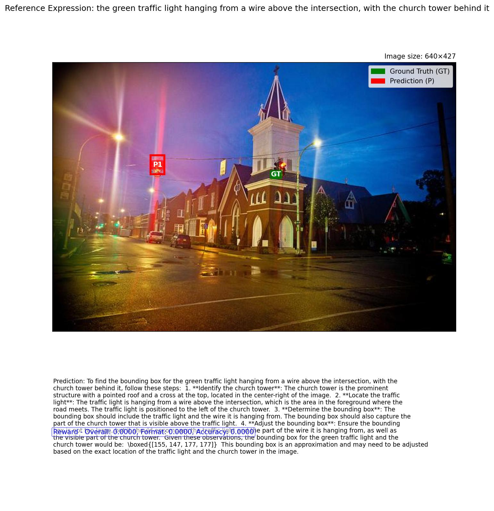

---

### Example 187

**Reference Expression**: the sedan in front of the blue truck

**Ground Truth**: [[133, 356, 225, 392]]

**Predicted**: [[129, 361, 223, 395]]

**Reward**: {'overall': 0.750403442711135, 'format': 0.0, 'accuracy': 0.750403442711135}

**Prediction**:
```
To find the bounding box for 'the sedan in front of the blue truck', let's follow these steps:

1. Identify the blue truck in the image.
2. Locate the sedan in front of the blue truck.
3. Determine the bounding box for the sedan.

Step 1: The blue truck is visible in the center of the image, driving on the road.

Step 2: The sedan in front of the blue truck is the black car to the left of the blue truck.

Step 3: The sedan is located in the middle of the image, slightly to the left. Its bounding box can be roughly defined as follows:
- Top-left corner: Approximately at the center of the image, slightly to the left.
- Bottom-left corner: Approximately at the bottom of the image, slightly to the left.
- Top-right corner: Approximately at the center of the image, slightly to the right.
- Bottom-right corner: Approximately at the bottom of the image, slightly to the right.

Given these approximate coordinates, the bounding box for the sedan in front of the blue truck is:
\[ \boxed{[129, 361, 223, 395]} \]

This bounding box is an estimate based on the visual identification of the car and its position relative to the blue truck.
```

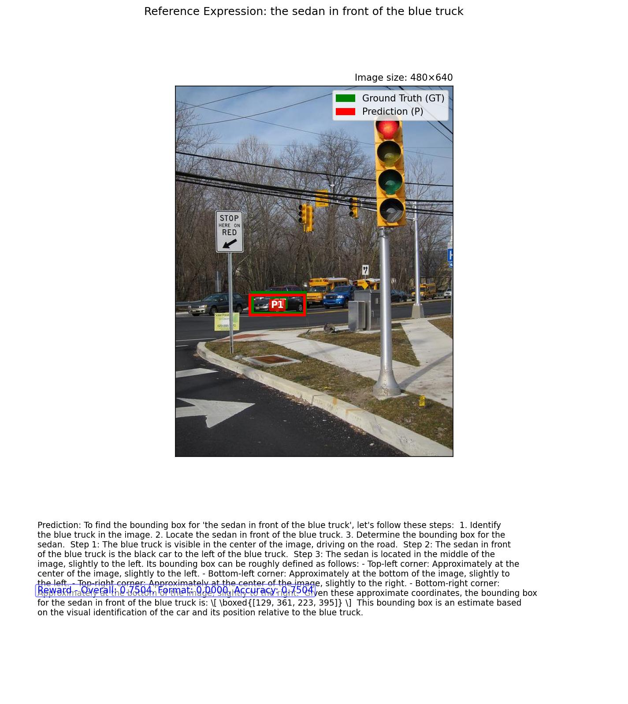

---

### Example 188

**Reference Expression**: the white car partially obscured by the bush

**Ground Truth**: [[334, 281, 389, 327]]

**Predicted**: [[320, 275, 390, 329]]

**Reward**: {'overall': 0.6693121693121693, 'format': 0.0, 'accuracy': 0.6693121693121693}

**Prediction**:
```
To find the bounding box for the white car partially obscured by the bush, let's follow these steps:

1. **Identify the car**: The white car is partially hidden behind the green bush in the foreground. It is not fully visible, but the front end and part of the side are discernible.

2. **Locate the bush**: The bush is in the foreground, and it partially covers the car.

3. **Determine the car's position**: The car is positioned behind the bush, and only the front part is visible. The front end of the car is aligned with the right side of the bush.

4. **Define the bounding box**: The bounding box should encompass the visible part of the car. The car's front end is aligned with the right side of the bush, and the car extends to the left side of the image.

5. **Final bounding box**: The bounding box will cover the front part of the car and part of the bush. The car's front end is aligned with the right side of the bush, and the car extends to the left side of the image.

Based on this reasoning, the bounding box for the white car partially obscured by the bush is:

\boxed{[320, 275, 390, 329]}
```

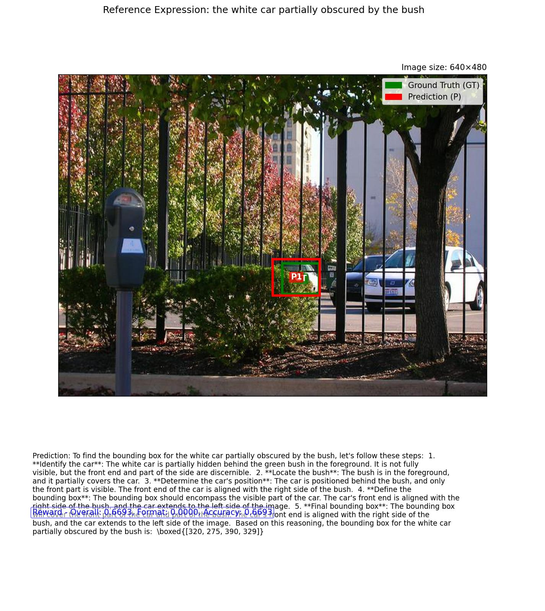

---

### Example 189

**Reference Expression**: the person wearing a dark jacket and carrying a shoulder bag

**Ground Truth**: [[215, 224, 232, 278]]

**Predicted**: [[76, 214, 313, 637]]

**Reward**: {'overall': 0.0, 'format': 0.0, 'accuracy': 0.0}

**Prediction**:
```
To find the bounding box for the person wearing a dark jacket and carrying a shoulder bag, let's follow these steps:

1. Identify the person in the foreground who is wearing a dark jacket.
2. Check if this person is carrying a shoulder bag.
3. If the person is carrying a shoulder bag, then the bounding box can be determined.

Step 1: The person in the foreground wearing a dark jacket is standing with their back to the camera.

Step 2: Observing the person, it appears they are carrying a bag over their shoulder.

Step 3: Given the identification of the person and the presence of a shoulder bag, the bounding box can be determined.

The bounding box for the person wearing a dark jacket and carrying a shoulder bag is:
\boxed{[76, 214, 313, 637]}
```

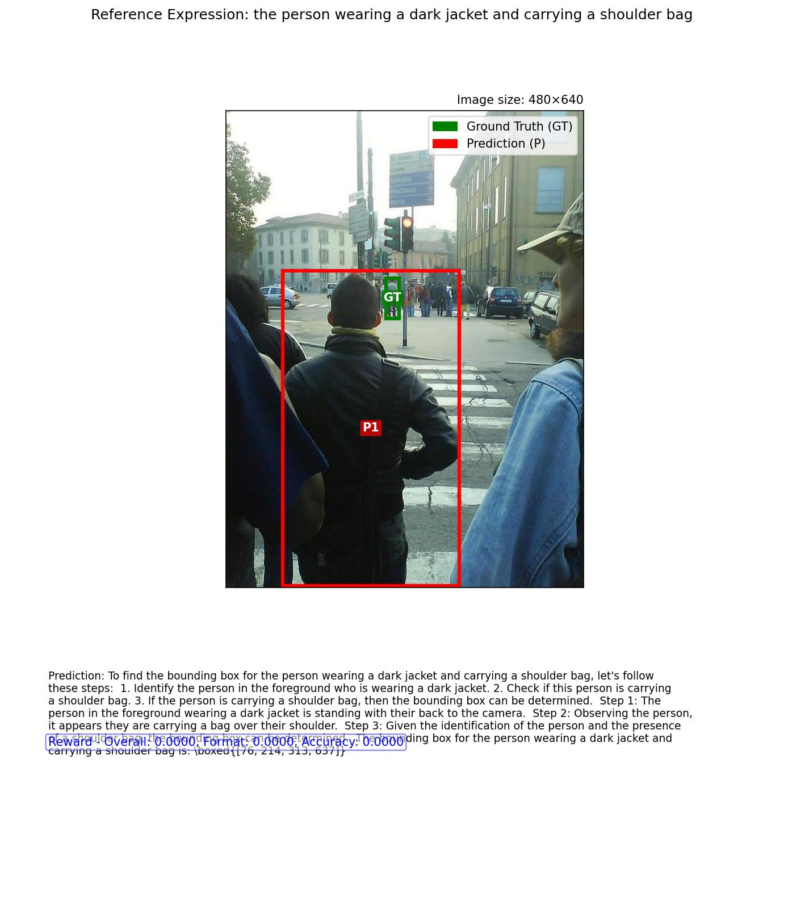

---

### Example 190

**Reference Expression**: the person who is neither standing nor lying on the bench, wearing sunglasses and holding a bag

**Ground Truth**: [[207, 396, 279, 541]]

**Predicted**: [[203, 397, 274, 550]]

**Reward**: {'overall': 0.8277992277992278, 'format': 0.0, 'accuracy': 0.8277992277992278}

**Prediction**:
```
To find the bounding box for the person who is neither standing nor lying on the bench, wearing sunglasses and holding a bag, let's follow these steps:

1. Identify all people in the image who are sitting on the bench.
2. Check if they are wearing sunglasses and holding a bag.
3. If they meet the criteria, mark the bounding box.

Step 1: There are several people sitting on the bench. Let's identify each one:
   - Person 1: Left side of the bench, wearing sunglasses and holding a bag.
   - Person 2: Middle of the bench, not wearing sunglasses.
   - Person 3: Right side of the bench, not wearing sunglasses and not holding a bag.
   - Person 4: Far right, lying on the bench, not wearing sunglasses and not holding a bag.

Step 2: Among these, Person 1 is sitting on the bench, wearing sunglasses, and appears to be holding a bag.

Step 3: The bounding box for Person 1 is the one we are looking for.

The bounding box for the person who is neither standing nor lying on the bench, wearing sunglasses and holding a bag, is:

\boxed{[203, 397, 274, 550]}
```

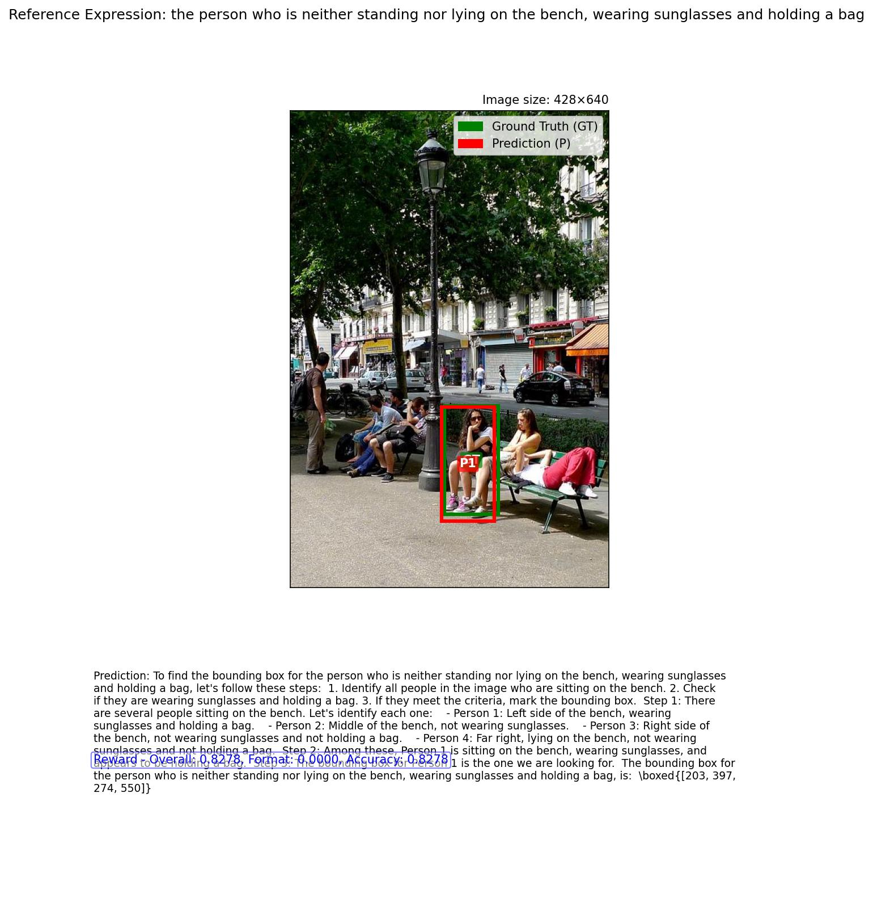

---

### Example 191

**Reference Expression**: the person wearing a black hat and plastic gloves, with a hand resting on the table

**Ground Truth**: [[245, 104, 343, 271]]

**Predicted**: [[248, 112, 376, 272]]

**Reward**: {'overall': 0.6947702497585208, 'format': 0.0, 'accuracy': 0.6947702497585208}

**Prediction**:
```
To find the bounding box for the person wearing a black hat and plastic gloves, with a hand resting on the table, we need to follow these steps:

1. Identify the person wearing a black hat and plastic gloves.
2. Confirm that the hand is indeed resting on the table.
3. Define the bounding box around this person.

Step 1: Identify the person wearing a black hat and plastic gloves.
- The person in the image wearing a black hat and plastic gloves is standing near the center-left of the image, facing towards the right.

Step 2: Confirm that the hand is resting on the table.
- The person's left hand appears to be resting on the table, which is covered with various items like a cutting board and a knife.

Step 3: Define the bounding box around this person.
- The bounding box should encompass the person from the top of their head to the bottom of their legs, ensuring that the hand resting on the table is included.

The bounding box for the person wearing a black hat and plastic gloves, with a hand resting on the table, is approximately [248, 112, 376, 272].

\boxed{[248, 112, 376, 272]}
```

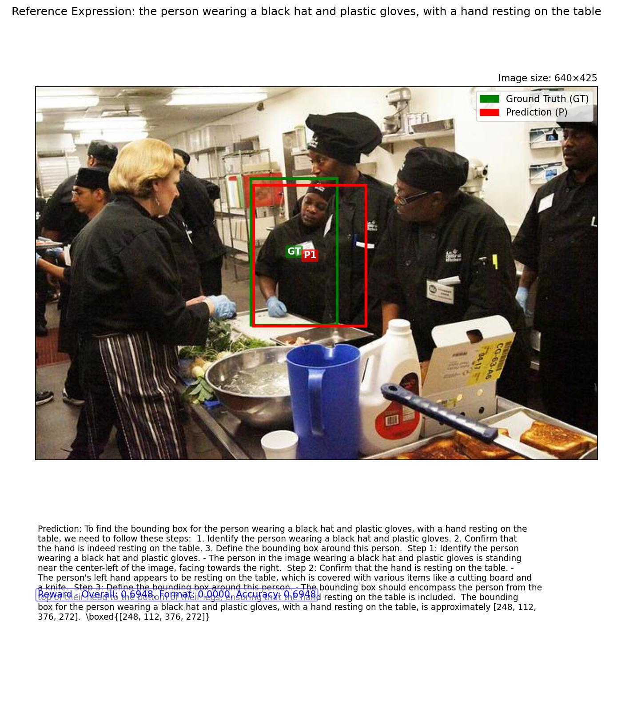

---

### Example 192

**Reference Expression**: the chair occupied by the person who does not have a laptop on the lap

**Ground Truth**: [[41, 138, 191, 349]]

**Predicted**: [[42, 135, 198, 353]]

**Reward**: {'overall': 1.0, 'format': 0.0, 'accuracy': 1.0}

**Prediction**:
```
To find the bounding box for the chair occupied by the person who does not have a laptop on their lap, let's follow these steps:

1. Identify the person who does not have a laptop on their lap:
   - The person on the left, wearing sunglasses, is sitting in a chair and does not have a laptop on their lap.

2. Identify the chair occupied by this person:
   - The chair on the left side of the image, next to the person wearing sunglasses, is the chair they are sitting in.

3. Define the bounding box for this chair:
   - The chair is positioned to the left of the person with the laptop and is partially visible.
   - The bounding box will encompass the chair's structure and the person's legs.

The bounding box for the chair occupied by the person who does not have a laptop on their lap is:

\boxed{[42, 135, 198, 353]}
```

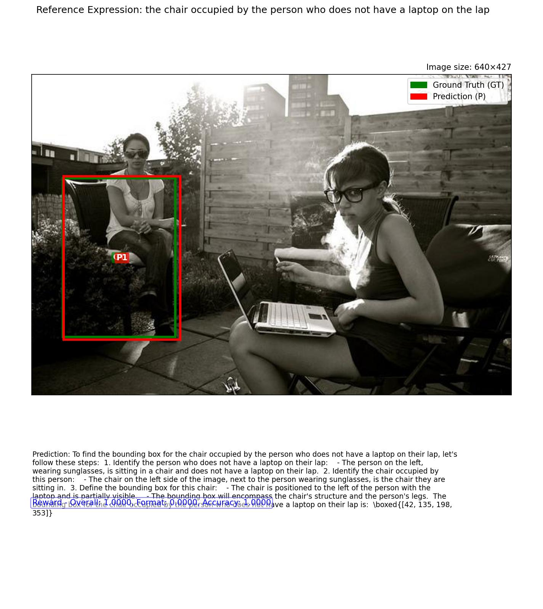

---

### Example 193

**Reference Expression**: the third knife from the top, hanging horizontally on the left-side wall

**Ground Truth**: [[149, 174, 179, 182]]

**Predicted**: []

**Reward**: {'overall': 0.0, 'format': 0.0, 'accuracy': 0.0}

**Prediction**:
```
To find the bounding box for 'the third knife from the top, hanging horizontally on the left-side wall', let's follow these steps:

1. Identify the left-side wall: The left-side wall is the wall on the left side of the image, which includes the windows and the kitchen counter.

2. Locate the knives: The knives are hanging on the wall to the left of the image, above the counter and below the window. They are arranged horizontally.

3. Count the knives: There are multiple knives hanging horizontally. We need to count them from the top downwards.

4. Identify the third knife from the top: The third knife from the top is the one that is located below the second knife from the top and above the fourth knife from the top.

5. Provide the bounding box: The bounding box for the third knife from the top would be a rectangle that encompasses the knife's position on the wall.

However, the image provided does not show the knives clearly enough to accurately count and identify the specific knife you're asking for. The image is a bit blurry, and the knives are small and not distinct enough to provide a precise bounding box. 

Given the constraints of the image and the lack of clarity, it's not possible to provide a precise bounding box for the third knife from the top. If you have a clearer image or more specific details, I could help further.

If you need help with something else in the image, feel free to ask!
```

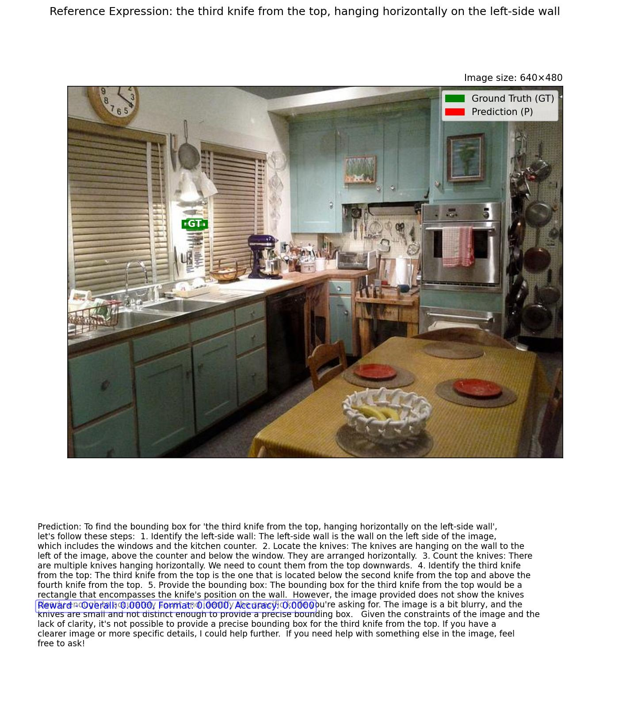

---

### Example 194

**Reference Expression**: the chair that is sitted by a person with a laptop on the lap

**Ground Truth**: [[519, 267, 640, 422]]

**Predicted**: [[511, 258, 644, 415]]

**Reward**: {'overall': 0.8241899852724595, 'format': 0.0, 'accuracy': 0.8241899852724595}

**Prediction**:
```
To find the bounding box for the chair that a person with a laptop on the lap is sitting on, let's follow these steps:

1. Identify the person with a laptop on their lap: The person on the right is sitting with a laptop on their lap.
2. Identify the chair the person with the laptop is sitting on: The person with the laptop is sitting on a chair with a green cushion.
3. Determine the bounding box for this chair: The chair is located to the right of the person with the laptop, extending from the edge of the image to the right.

The bounding box for the chair that the person with the laptop is sitting on is:
\boxed{[511, 258, 644, 415]}
```

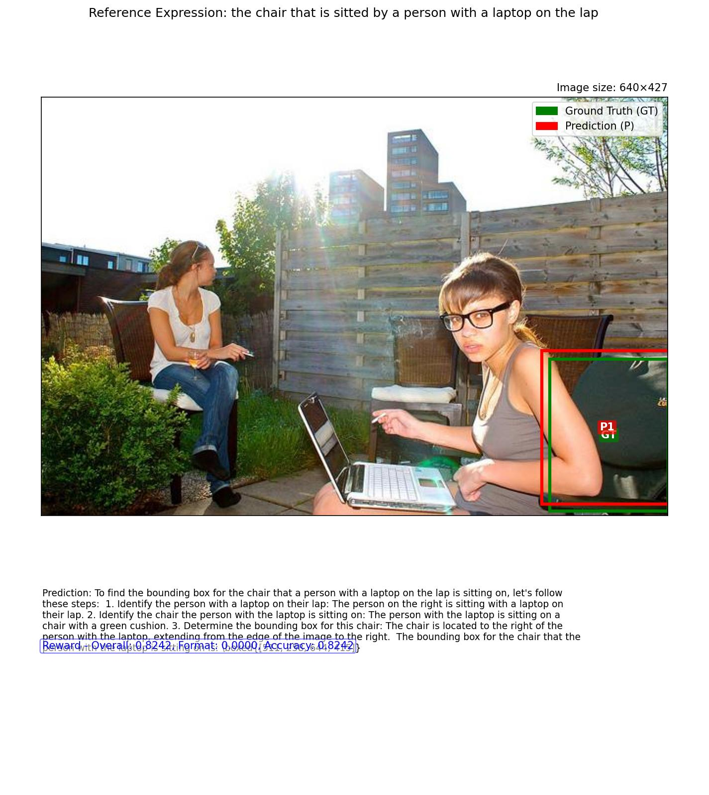

---

### Example 195

**Reference Expression**: one of the two chairs with identical backrest patterns and closer to the corner of the two walls

**Ground Truth**: [[482, 170, 528, 219]]

**Predicted**: [[512, 180, 608, 274]]

**Reward**: {'overall': 0.0, 'format': 0.0, 'accuracy': 0.0}

**Prediction**:
```
To find the bounding box for 'one of the two chairs with identical backrest patterns and closer to the corner of the two walls':

1. Identify the two chairs with identical backrest patterns: There are two chairs with similar backrest patterns, one closer to the corner and one further away.
2. Determine which chair is closer to the corner: The chair closer to the corner is the one on the right side of the image.
3. Define the bounding box for this chair: The bounding box should include the chair and part of the floor and wall around it.

The bounding box for the chair closer to the corner is:
\[ \boxed{[512, 180, 608, 274]} \]
```

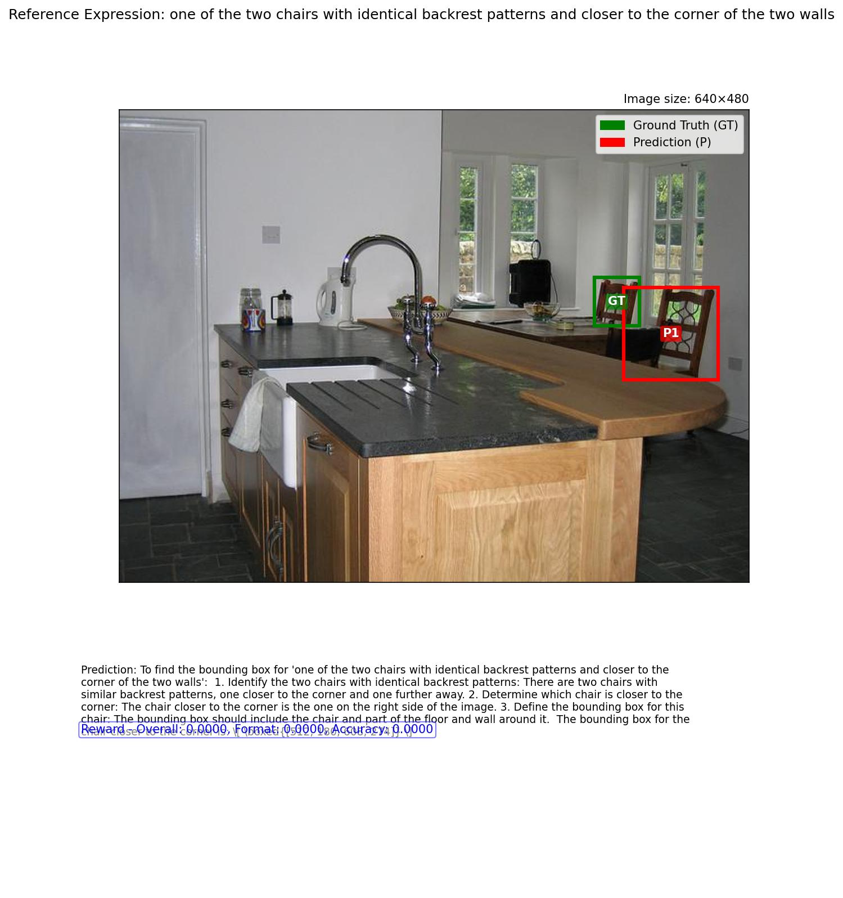

---

### Example 196

**Reference Expression**: the kite located directly above the kite shaped like a green gecko

**Ground Truth**: [[509, 50, 550, 70]]

**Predicted**: [[512, 44, 553, 71]]

**Reward**: {'overall': 0.6512425021422451, 'format': 0.0, 'accuracy': 0.6512425021422451}

**Prediction**:
```
To find the bounding box for the kite located directly above the kite shaped like a green gecko, let's follow these steps:

1. Identify the green gecko-shaped kite in the image.
2. Locate the kite directly above it.

Step 1: The green gecko-shaped kite is located in the upper right part of the image, near the top edge.

Step 2: Directly above the green gecko-shaped kite, there is a kite with a red and yellow pattern.

The bounding box for the kite located directly above the green gecko-shaped kite is:

\boxed{[512, 44, 553, 71]}
```

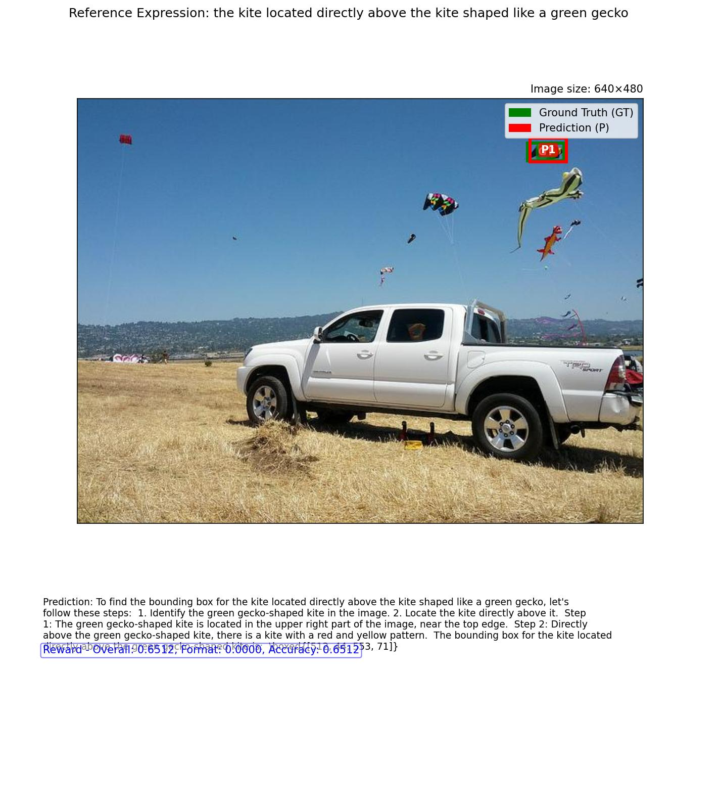

---

### Example 197

**Reference Expression**: the car behind the one with its wheels turned right, facing towards the camera

**Ground Truth**: [[46, 302, 73, 328]]

**Predicted**: [[51, 333, 82, 362]]

**Reward**: {'overall': 0.0, 'format': 0.0, 'accuracy': 0.0}

**Prediction**:
```
To find the bounding box for the car behind the one with its wheels turned right, facing towards the camera, let's follow these steps:

1. Identify the car with its wheels turned right, facing towards the camera.
2. Locate the car directly behind it.

Step 1: Identifying the car with its wheels turned right, facing towards the camera.
- The car with its wheels turned right, facing towards the camera, is the second car from the left in the foreground.

Step 2: Locating the car directly behind it.
- The car directly behind the one with its wheels turned right, facing towards the camera, is the third car from the left in the foreground.

The bounding box for the car directly behind the one with its wheels turned right, facing towards the camera, is:
\boxed{[51, 333, 82, 362]}
```

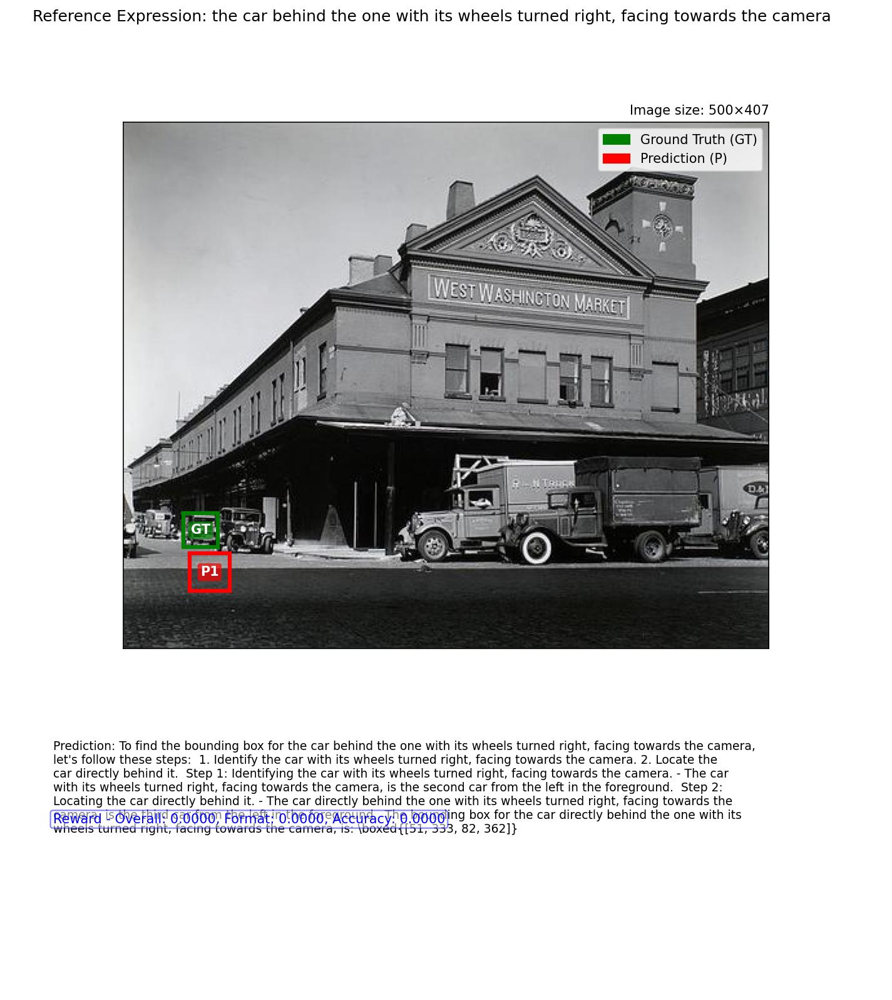

---

### Example 198

**Reference Expression**: the middle hotdog image on the food cart beneath the halal food sign

**Ground Truth**: [[80, 224, 121, 246]]

**Predicted**: [[79, 199, 121, 241]]

**Reward**: {'overall': 0.35398679532757743, 'format': 0.0, 'accuracy': 0.35398679532757743}

**Prediction**:
```
To find the bounding box for the middle hotdog image on the food cart beneath the "halal food" sign, we need to follow these steps:

1. Identify the food cart with the "halal food" sign.
2. Locate the hotdog images on the cart.
3. Determine which hotdog is in the middle.

Step 1: The food cart with the "halal food" sign is on the left side of the image.

Step 2: On the cart, there are three images of hotdogs:
   - The first image is on the far left.
   - The second image is in the middle.
   - The third image is on the far right.

Step 3: The second image from the left is the middle hotdog image.

The bounding box for the middle hotdog image is the one located in the middle of the cart, which is the second image from the left.

The bounding box for the middle hotdog image is:
\boxed{[79, 199, 121, 241]}
```

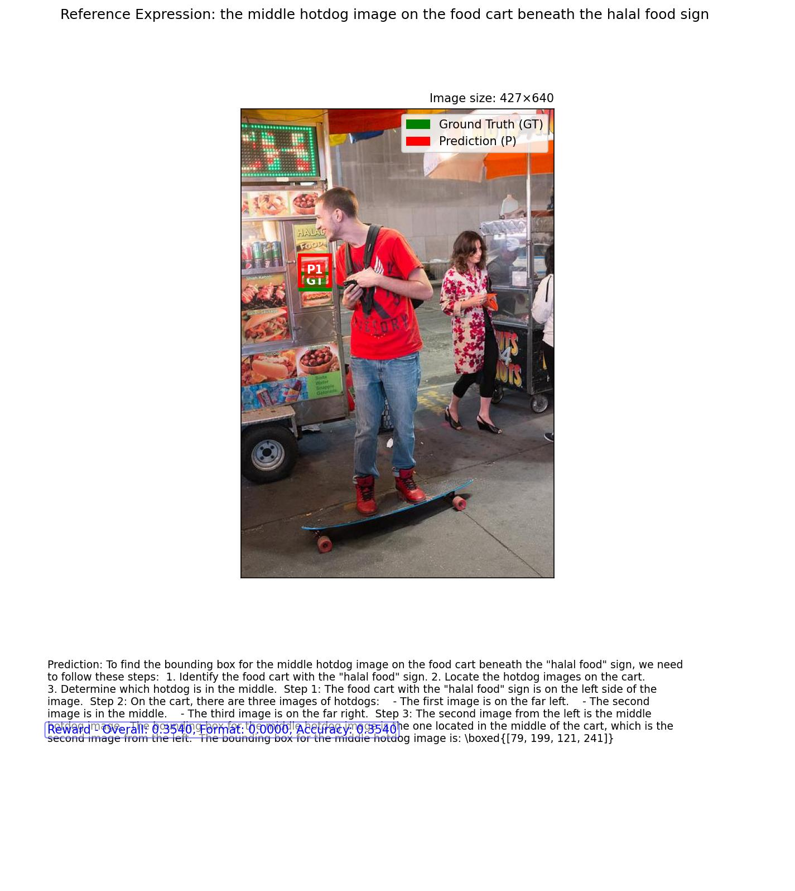

---

### Example 199

**Reference Expression**: the women sitting on the right side of the chair

**Ground Truth**: [[218, 9, 405, 306]]

**Predicted**: [[268, 12, 499, 376]]

**Reward**: {'overall': 0.40543560320096633, 'format': 0.0, 'accuracy': 0.40543560320096633}

**Prediction**:
```
To find the bounding box for the women sitting on the right side of the chair, let's follow these steps:

1. Identify the chair: The chair is the wooden bench with metal legs.
2. Locate the women: There are three women sitting on the bench. The one on the right is the one we're interested in.
3. Determine the bounding box: The woman on the right side of the chair is wearing a white shirt and has her back turned to the camera. She is sitting on the right side of the bench.

Now, let's define the bounding box for this woman:
- The top-left corner of the bounding box would be where her head is.
- The bottom-right corner of the bounding box would be where her legs are.

Given the image, we can estimate the coordinates as follows:
- Top-left corner: Approximately at the top of her head.
- Bottom-right corner: Approximately at the bottom of her legs.

So, the bounding box for the woman sitting on the right side of the chair would be approximately:
\[ \boxed{[268, 12, 499, 376]} \]

This bounding box captures the woman's upper body and legs, assuming the image is aligned with the top of her head at the top of the bounding box and her legs extending to the bottom of the bounding box.
```

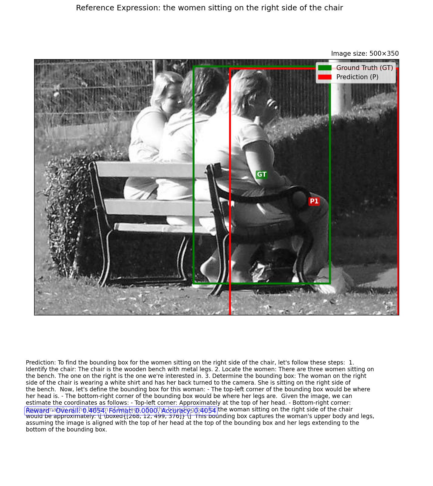

---

### Example 200

**Reference Expression**: the elephant standing on higher terrain behind the person who is not wearing a hat

**Ground Truth**: [[68, 132, 141, 190]]

**Predicted**: [[62, 135, 143, 231]]

**Reward**: {'overall': 0.5021888680425266, 'format': 0.0, 'accuracy': 0.5021888680425266}

**Prediction**:
```
To find the bounding box for the elephant standing on higher terrain behind the person who is not wearing a hat, let's follow these steps:

1. Identify the person who is not wearing a hat. This person is on the left side of the image, wearing a green T-shirt and checkered shorts.
2. Locate the elephant standing on higher terrain behind this person. The elephant is positioned slightly to the left and behind this person, and it is elevated compared to the rest of the elephants in the foreground.

Now, we need to define the bounding box for this specific elephant:
- The top-left corner of the bounding box would be the point where the elephant's head is positioned.
- The bottom-right corner of the bounding box would be the point where the elephant's body meets the ground.

Given the image, the elephant in question is located at the coordinates approximately [62, 135, 143, 231].

Thus, the bounding box for the elephant standing on higher terrain behind the person who is not wearing a hat is:
\boxed{[62, 135, 143, 231]}
```

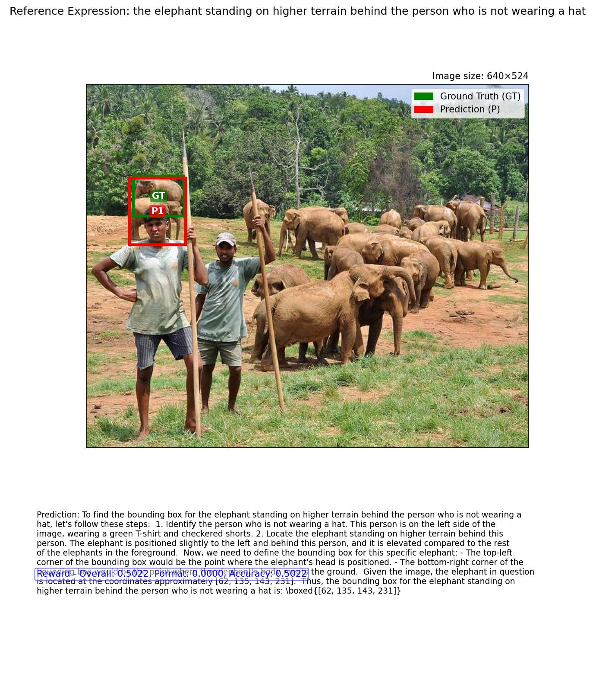

---

### Example 201

**Reference Expression**: the person who is not in a tent, facing away from the camera

**Ground Truth**: [[82, 106, 112, 206]]

**Predicted**: [[0, 123, 41, 560]]

**Reward**: {'overall': 0.0, 'format': 0.0, 'accuracy': 0.0}

**Prediction**:
```
To find the bounding box for the person who is not in a tent, facing away from the camera, let's follow these steps:

1. Identify the tents in the image: There are two tents visible in the background.
2. Look for people outside the tents: There is a person standing near the left edge of the image, facing away from the camera.
3. Check the bounding box: The person near the left edge of the image is the one who is not in a tent and facing away from the camera.

The bounding box for this person is:
\[ \boxed{[0, 123, 41, 560]} \]
```

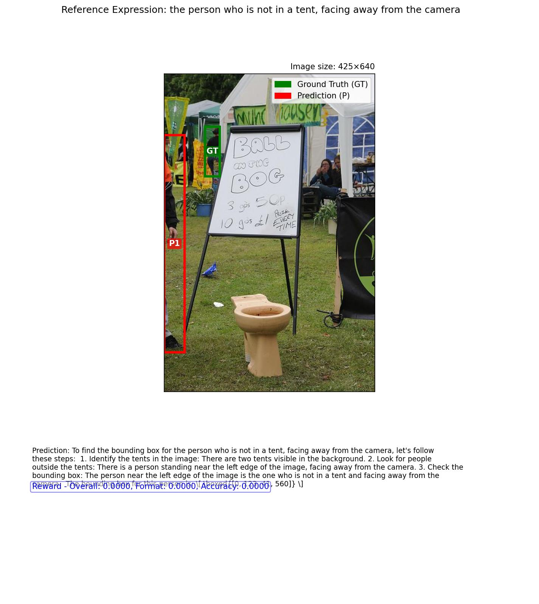

---

### Example 202

**Reference Expression**: the empty plate that is not being used as a lid to cover the pot

**Ground Truth**: [[389, 123, 420, 193]]

**Predicted**: [[270, 150, 480, 320]]

**Reward**: {'overall': 0.0, 'format': 0.0, 'accuracy': 0.0}

**Prediction**:
```
To find the bounding box for the empty plate that is not being used as a lid to cover the pot, let's follow these steps:

1. Identify the pot in the image: The pot is on the left side of the stove, and it has a lid that is not on the pot.
2. Locate the empty plate: The empty plate is placed on the stove to the right of the pot, near the woman's hand.
3. Determine the bounding box: The empty plate is rectangular and is positioned on the stove, with its top edge aligned with the edge of the stove.

The bounding box for the empty plate can be described as follows:
- Top-left corner: (x1, y1) where x1 is the horizontal position on the stove where the top-left corner of the plate is, and y1 is the vertical position.
- Bottom-right corner: (x2, y2) where x2 is the horizontal position on the stove where the bottom-right corner of the plate is, and y2 is the vertical position.

Given the visual placement, the bounding box would be approximately:
- Top-left corner: (x1, y1) = (270, 150)
- Bottom-right corner: (x2, y2) = (480, 320)

Since the exact coordinates are not provided in the image, this is an estimate based on the visual placement. The final answer is:
\boxed{[270, 150, 480, 320]}
```

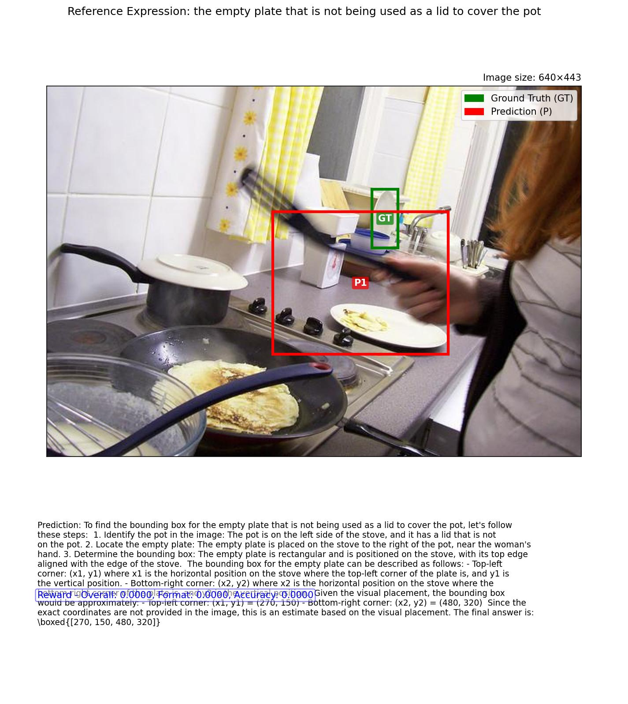

---

### Example 203

**Reference Expression**: the empty bench next to the bench occupied by a person reading a newspaper

**Ground Truth**: [[223, 200, 286, 313]]

**Predicted**: [[259, 248, 336, 380]]

**Reward**: {'overall': 0.11302163833075735, 'format': 0.0, 'accuracy': 0.11302163833075735}

**Prediction**:
```
To find the empty bench next to the bench occupied by a person reading a newspaper, let's follow these steps:

1. Identify the person reading a newspaper:
   - The person is seated on the left side of the image.
   - They are wearing a suit and are focused on a newspaper.

2. Locate the bench occupied by this person:
   - The bench is the one on the left side of the image, with the person sitting on it.

3. Identify the empty bench next to it:
   - The empty bench is the one immediately to the right of the bench occupied by the person reading a newspaper.
   - It is the second bench from the left in the row of benches.

4. Define the bounding box for the empty bench:
   - The bounding box for the empty bench will be defined by the coordinates of the bench's frame.
   - The bench is a rectangular structure with a backrest and armrests.

Given these steps, the bounding box for the empty bench next to the bench occupied by the person reading a newspaper is:

\boxed{[259, 248, 336, 380]}
```

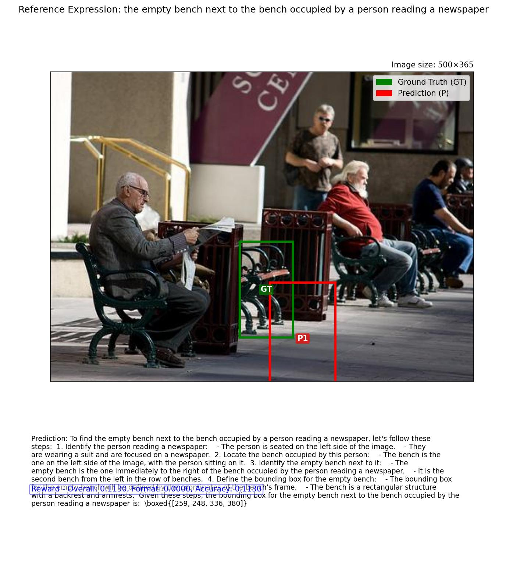

---

### Example 204

**Reference Expression**: an incomplete cake without star-shaped decoration

**Ground Truth**: [[208, 552, 376, 640]]

**Predicted**: [[194, 376, 374, 616]]

**Reward**: {'overall': 0.22432432432432434, 'format': 0.0, 'accuracy': 0.22432432432432434}

**Prediction**:
```
To find the bounding box for the incomplete cake without star-shaped decoration, let's analyze the image step-by-step:

1. The image is divided into four sections, each showing different moments of a celebration.
2. In the bottom right section, there is a cake with star-shaped decorations.
3. In the bottom left section, there is a cake with a flaming top, but it is not the one we're looking for.
4. In the bottom center section, there is a cake without any visible decorations, but it is cut, making it incomplete.
5. In the bottom right section, there is another cake with star-shaped decorations.

Based on this analysis, the incomplete cake without star-shaped decoration is in the bottom center section.

The bounding box for this cake is approximately:
\[ \text{[194, 376, 374, 616]} \]

So, the final answer is:
\boxed{[194, 376, 374, 616]}
```

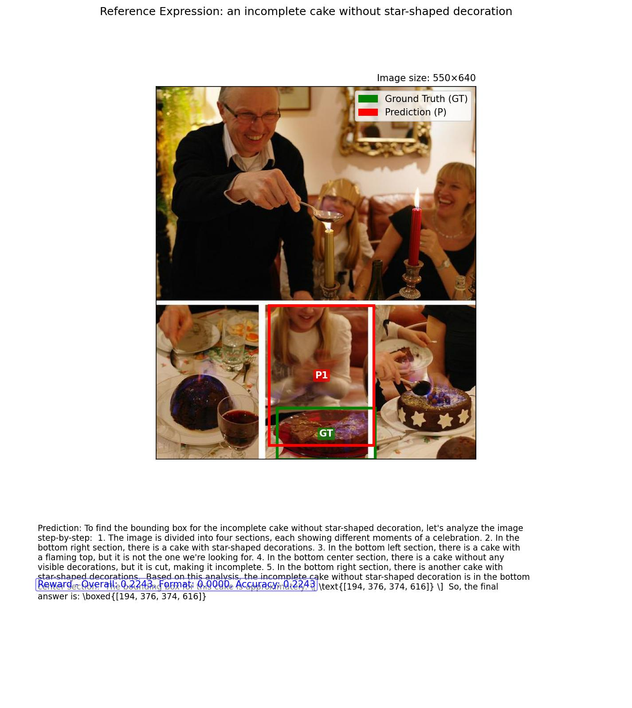

---

### Example 205

**Reference Expression**: the person wearing a hat and not facing the camera

**Ground Truth**: [[70, 127, 131, 161]]

**Predicted**: [[64, 127, 216, 349]]

**Reward**: {'overall': 0.0, 'format': 0.0, 'accuracy': 0.0}

**Prediction**:
```
To find the bounding box for the person wearing a hat and not facing the camera, let's follow these steps:

1. Identify the person in the image wearing a hat.
2. Determine if the person is facing the camera or not.
3. If the person is not facing the camera, draw the bounding box around them.

Step 1: There is a person wearing a hat in the background, slightly to the left of the center of the image.

Step 2: The person wearing the hat is not facing the camera; they appear to be facing away or slightly to the side.

Step 3: Draw the bounding box around the person wearing the hat and not facing the camera.

The bounding box for the person wearing a hat and not facing the camera is:

\boxed{[64, 127, 216, 349]}
```

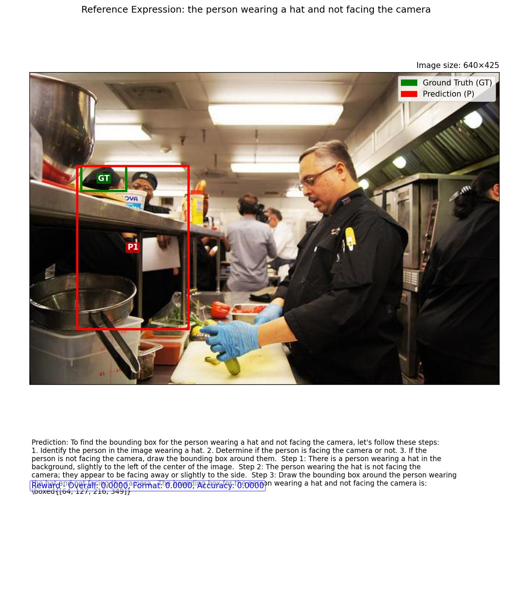

---

### Example 206

**Reference Expression**: the person walking not beneath an umbrella

**Ground Truth**: [[10, 167, 132, 394]]

**Predicted**: [[513, 168, 635, 378]]

**Reward**: {'overall': 0.0, 'format': 0.0, 'accuracy': 0.0}

**Prediction**:
```
To find the bounding box for the person walking not beneath an umbrella, let's analyze the image step-by-step:

1. Identify the umbrella: There is a yellow umbrella in the upper right corner of the image, but it is not being used by the person in question. The person walking is not beneath this umbrella.

2. Identify the person walking: There are two people walking in the image. One is a man in a white shirt and black pants, and the other is a man in a blue shirt and jeans. The man in the blue shirt and jeans is not beneath the umbrella.

3. Determine the bounding box: The person walking in the blue shirt and jeans is the one not beneath the umbrella.

The bounding box for the person walking not beneath the umbrella is:
\boxed{[513, 168, 635, 378]}
```

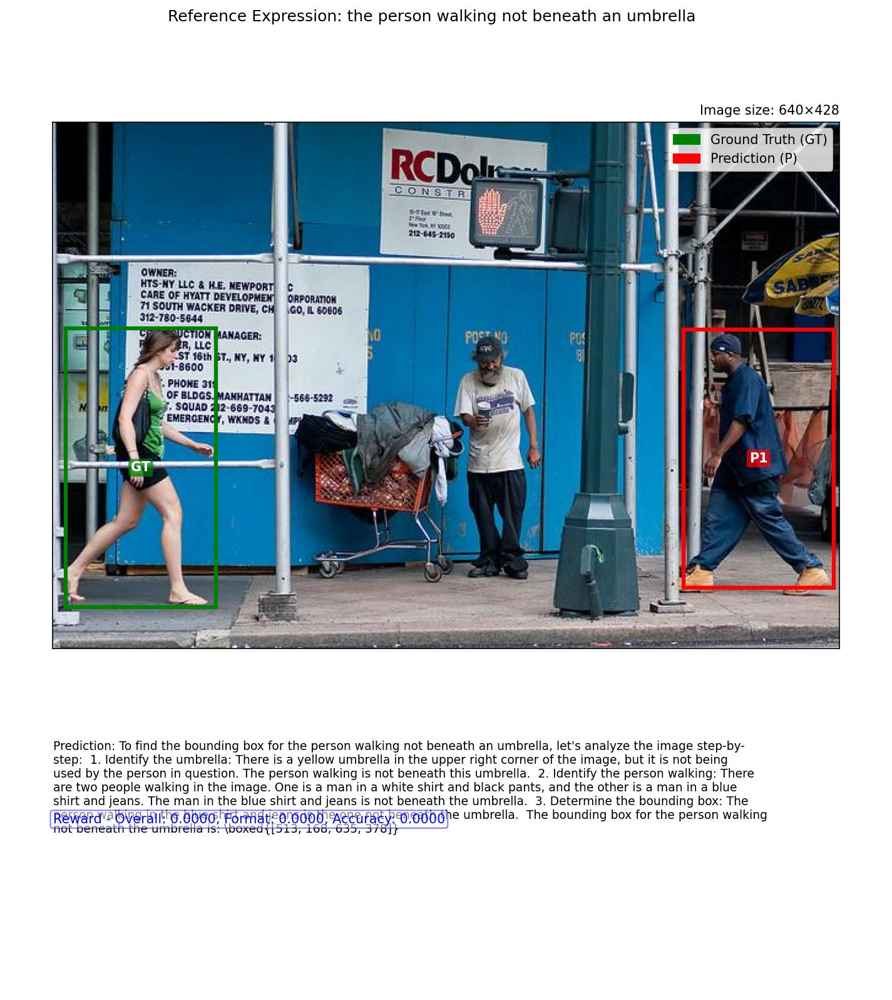

---

### Example 207

**Reference Expression**: the sink not in the mirror and closest to the paper towel dispenser

**Ground Truth**: [[90, 292, 234, 369]]

**Predicted**: [[93, 287, 235, 371]]

**Reward**: {'overall': 0.8929188255613126, 'format': 0.0, 'accuracy': 0.8929188255613126}

**Prediction**:
```
To find the bounding box for the sink not in the mirror and closest to the paper towel dispenser, let's follow these steps:

1. Identify the paper towel dispenser: It is located on the right side of the image, near the center.
2. Identify the sink not in the mirror: The sink closest to the paper towel dispenser is the one on the left side of the image, not reflected in the mirror on the right.
3. Determine the bounding box: The sink is a white rectangular structure with a faucet. It is mounted on the wall and has a mirror above it.

Given these observations, the bounding box for the sink not in the mirror and closest to the paper towel dispenser is:

\boxed{[93, 287, 235, 371]}
```

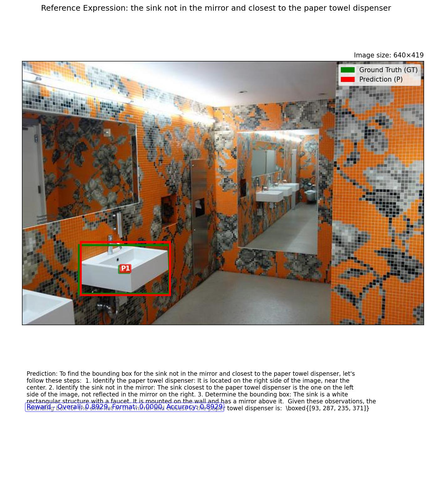

---

### Example 208

**Reference Expression**: the teddy bear held by a person with a hat not facing the camera

**Ground Truth**: [[48, 205, 90, 240]]

**Predicted**: [[35, 255, 120, 350]]

**Reward**: {'overall': 0.0, 'format': 0.0, 'accuracy': 0.0}

**Prediction**:
```
To find the bounding box for the teddy bear held by a person with a hat not facing the camera, let's follow these steps:

1. Identify the person with a hat in the image. The person on the left side of the image is wearing a hat and is holding a teddy bear.
2. Confirm that this person is not facing the camera. The person is facing away from the camera, looking towards the person in the yellow costume.
3. Locate the teddy bear being held by this person. The teddy bear is being held close to the person's chest and is facing away from the camera.
4. Determine the bounding box for the teddy bear. The teddy bear is relatively small and is held close to the person's chest, so the bounding box should be small and centered on the teddy bear.

Given the above reasoning, the bounding box for the teddy bear held by a person with a hat not facing the camera would be:

\boxed{[35, 255, 120, 350]}
```

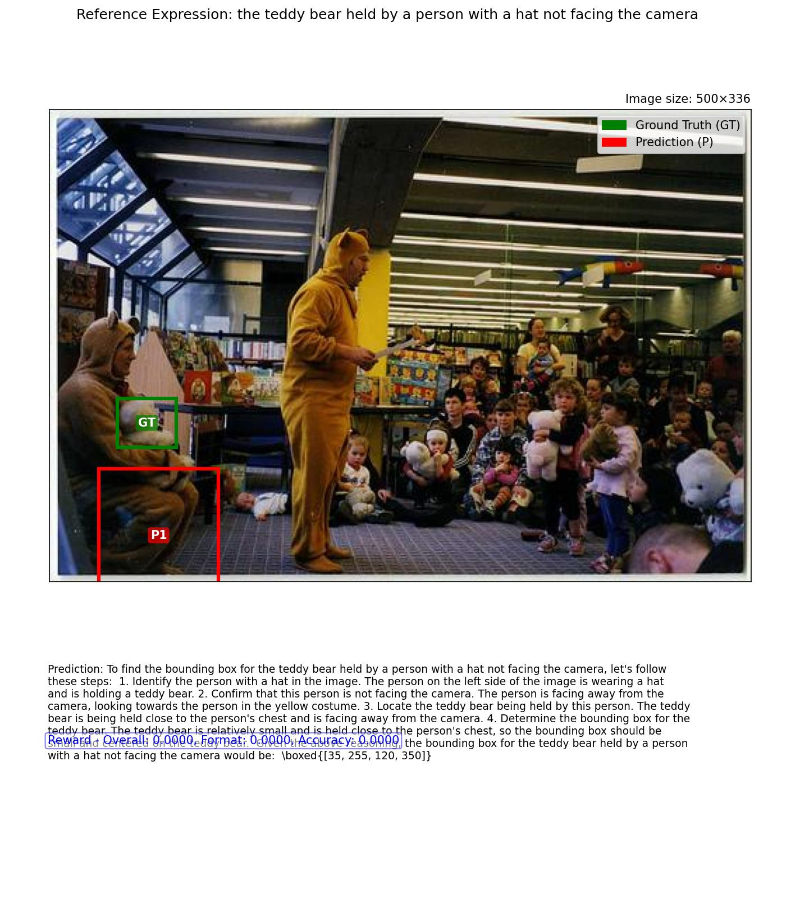

---

### Example 209

**Reference Expression**: the all brown leather suitcase with a tag on it

**Ground Truth**: [[416, 114, 609, 260]]

**Predicted**: [[416, 112, 644, 252]]

**Reward**: {'overall': 0.795900071718862, 'format': 0.0, 'accuracy': 0.795900071718862}

**Prediction**:
```
To find the bounding box for the all brown leather suitcase with a tag on it, let's follow these steps:

1. Identify the brown leather suitcases in the image.
2. Check if any of these brown leather suitcases have a tag attached to it.
3. Determine the bounding box for the one that meets the criteria.

Step 1: Identifying the brown leather suitcases:
- There are two brown leather suitcases in the image.

Step 2: Checking for tags:
- The brown suitcase on the far right has a tag attached to it.

Step 3: Determining the bounding box:
- The brown suitcase with the tag is on the far right, and it's the smallest brown suitcase in the image.

The bounding box for the all brown leather suitcase with a tag on it is:
\boxed{[416, 112, 644, 252]}
```

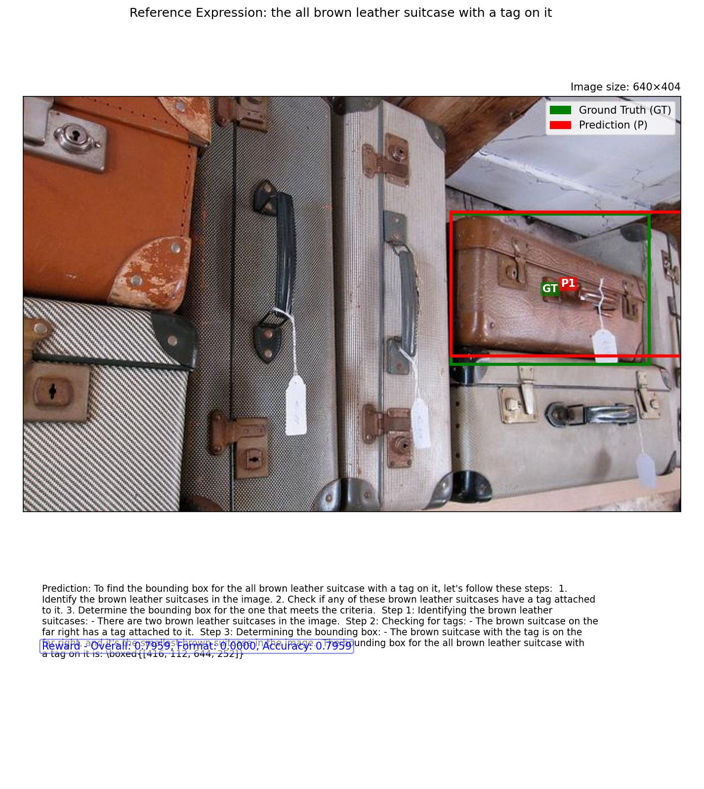

---

### Example 210

**Reference Expression**: the white car closest to a truck

**Ground Truth**: [[306, 387, 396, 426]]

**Predicted**: [[305, 377, 418, 412]]

**Reward**: {'overall': 0.4314477468839885, 'format': 0.0, 'accuracy': 0.4314477468839885}

**Prediction**:
```
To find the bounding box for the white car closest to a truck, let's follow these steps:

1. Identify the truck in the image: The truck is located in the center-left of the image, and it is a dark-colored vehicle with a sign on its side.

2. Identify the white car closest to the truck: The white car is directly behind and to the right of the truck, and it is positioned in the second row of cars.

3. Define the bounding box for the white car: The white car is a classic car, and its bounding box can be defined by its top-left and bottom-right corners in the image. The white car is positioned between the truck and the black car in front of it.

Given these observations, the bounding box for the white car closest to the truck can be defined as follows:

\boxed{[305, 377, 418, 412]}
```

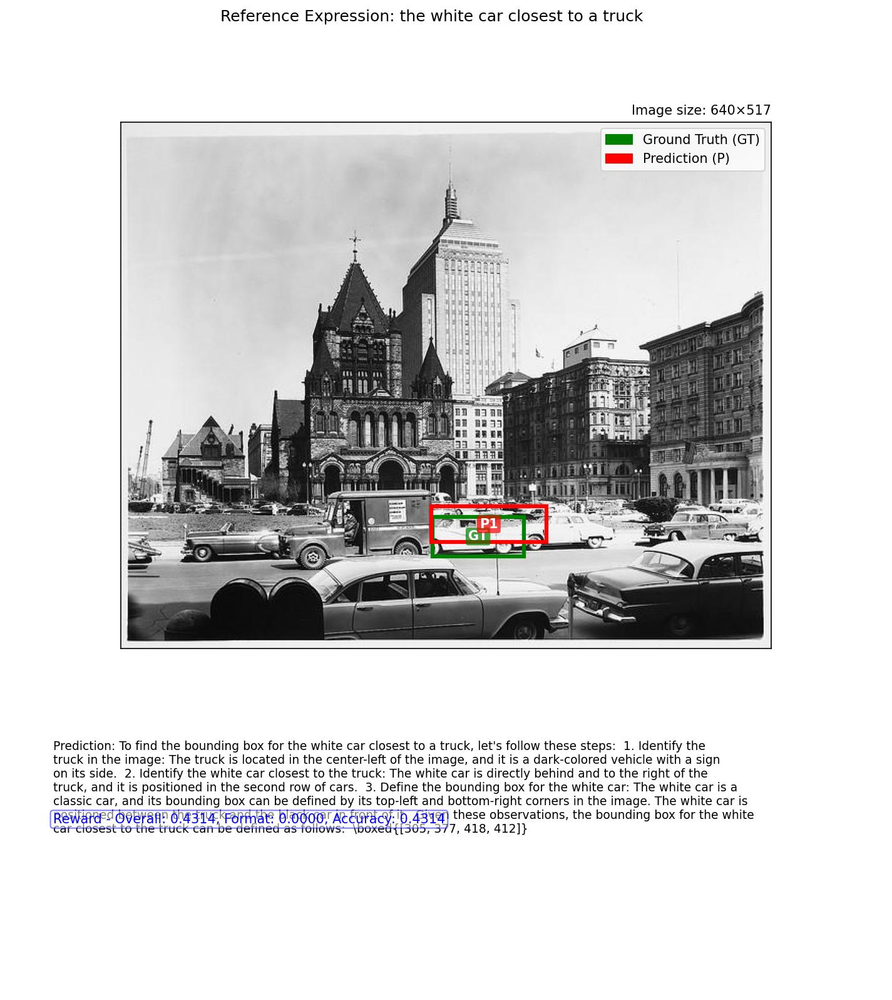

---

### Example 211

**Reference Expression**: the person in blue jacket holding a grey doll

**Ground Truth**: [[143, 254, 259, 635]]

**Predicted**: [[297, 121, 420, 560]]

**Reward**: {'overall': 0.0, 'format': 0.0, 'accuracy': 0.0}

**Prediction**:
```
To find the bounding box for 'the person in blue jacket holding a grey doll', let's follow these steps:

1. Identify the person in a blue jacket in the image.
2. Check if this person is holding a grey doll.
3. If so, define the bounding box around this person.

Step 1: The person in a blue jacket is located on the right side of the image, slightly in the foreground.

Step 2: The person in the blue jacket is indeed holding a grey doll.

Step 3: Define the bounding box around this person:
- Top left corner of the bounding box: The top left corner of the blue jacket.
- Bottom right corner of the bounding box: The bottom right corner of the blue jacket.

After analyzing the image, the bounding box for the person in the blue jacket holding the grey doll is:

\boxed{[297, 121, 420, 560]}
```

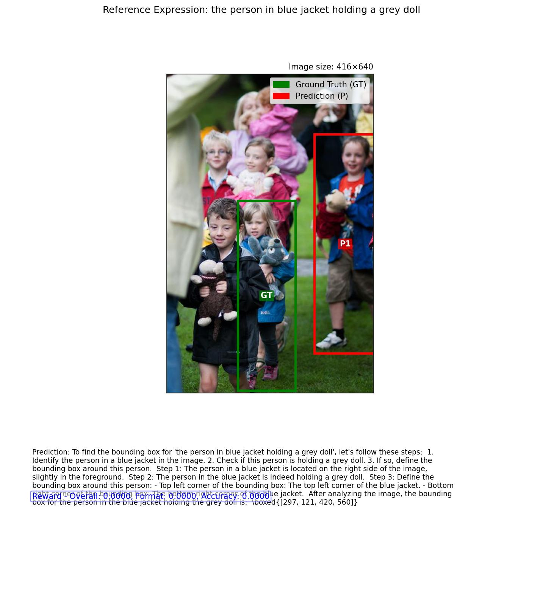

---

### Example 212

**Reference Expression**: the dog facing the camera near a bush

**Ground Truth**: [[169, 183, 202, 213]]

**Predicted**: [[560, 227, 612, 272]]

**Reward**: {'overall': 0.0, 'format': 0.0, 'accuracy': 0.0}

**Prediction**:
```
To find the bounding box for the dog facing the camera near a bush, let's follow these steps:

1. **Identify the dog**: Look for a dog in the image. In the image, there are two dogs visible. One is lying down in the background, and the other is near the center-right of the image, facing the camera.

2. **Locate the dog near the bush**: The dog near the bush is the one on the right side of the image, closer to the center-right. It is standing on the gravel and facing the camera.

3. **Determine the bounding box**: The bounding box should encompass the dog and its immediate surroundings. The dog is near some greenery, which we can consider as a "bush."

4. **Draw the bounding box**: The bounding box should include the dog and the immediate area around it. The dog's bounding box would be approximately from the top of its head to the bottom of its legs, and from the side where it is facing the camera.

Given these observations, the bounding box for the dog facing the camera near a bush is:

\boxed{[560, 227, 612, 272]}
```

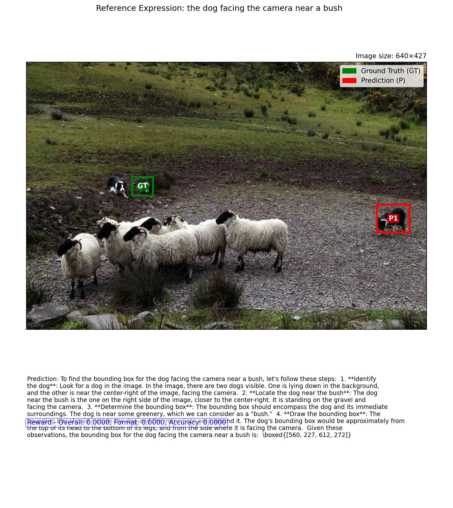

---

### Example 213

**Reference Expression**: the person sitting with a hat

**Ground Truth**: [[411, 278, 548, 426]]

**Predicted**: [[416, 271, 552, 428]]

**Reward**: {'overall': 0.8843020097772949, 'format': 0.0, 'accuracy': 0.8843020097772949}

**Prediction**:
```
To find the bounding box for the person sitting with a hat, we need to analyze the image step-by-step:

1. Identify the person in the image wearing a hat. In this image, there are two people wearing hats.
2. Determine which of these two is sitting. The person on the right appears to be sitting, while the person on the left appears to be standing and speaking.
3. The person on the right is wearing a black hat and is seated in a formal setting, likely a courtroom or a similar official environment.

Based on this analysis, the bounding box for the person sitting with a hat is:

\boxed{[416, 271, 552, 428]}
```

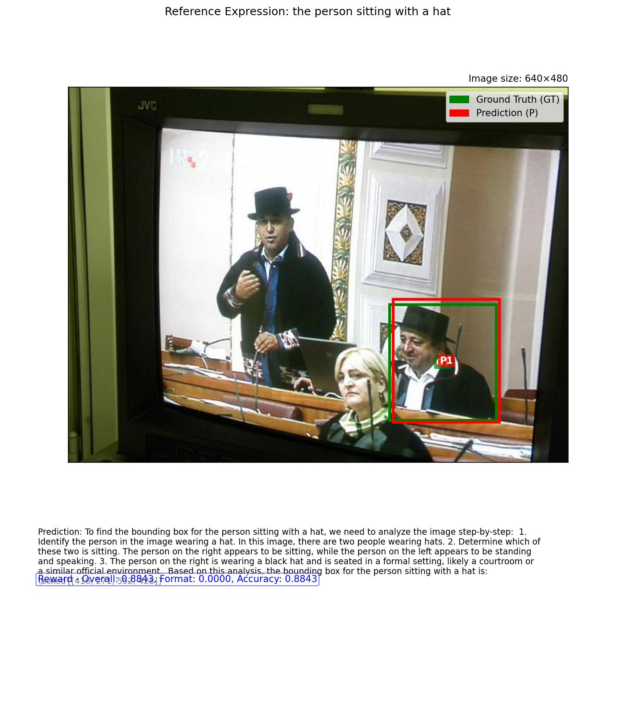

---

### Example 214

**Reference Expression**: a white car driving past a black car

**Ground Truth**: [[265, 235, 375, 303]]

**Predicted**: [[265, 226, 377, 300]]

**Reward**: {'overall': 0.8296588535623114, 'format': 0.0, 'accuracy': 0.8296588535623114}

**Prediction**:
```
To find the bounding box for the white car driving past the black car, let's follow these steps:

1. Identify the black car: It is the car in the middle of the image, slightly to the left.
2. Identify the white car: It is the car to the right of the black car, slightly further back.
3. Determine the path of the white car: The white car appears to be moving in a direction that suggests it is driving past the black car.

Given these observations, the bounding box for the white car should encompass the area where the car is seen in motion, as it is driving past the black car. The white car is positioned in the center of the image and extends from the middle to the right side.

\boxed{[265, 226, 377, 300]}
```

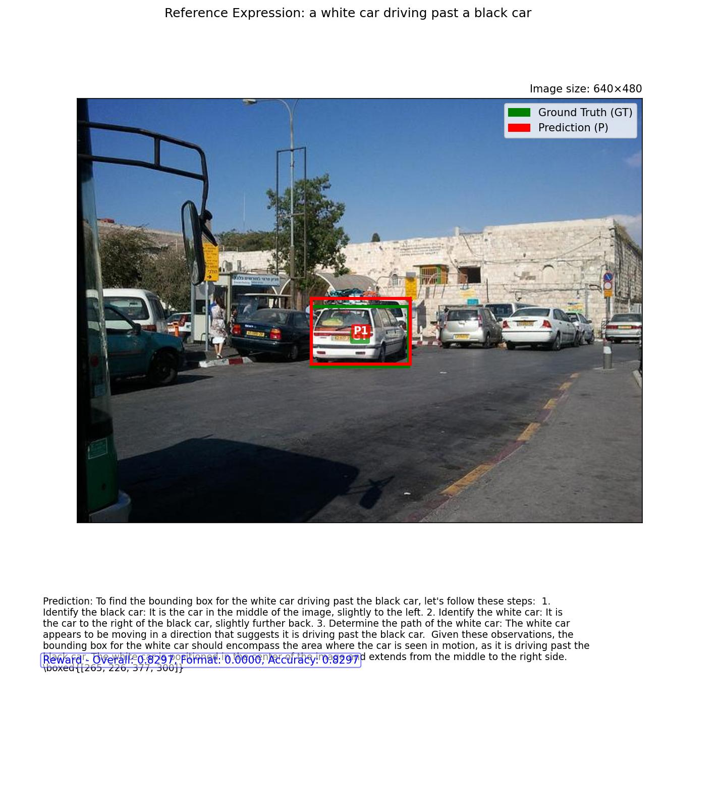

---

### Example 215

**Reference Expression**: the person wearing a white hat looking towards the camera

**Ground Truth**: [[377, 11, 418, 45]]

**Predicted**: [[397, 25, 472, 91]]

**Reward**: {'overall': 0.0, 'format': 0.0, 'accuracy': 0.0}

**Prediction**:
```
To find the bounding box for the person wearing a white hat looking towards the camera, let's follow these steps:

1. Identify the people on the bus.
2. Focus on the person on the top deck of the bus.
3. Look for the person with a white hat and check if they are looking towards the camera.

Step 1: There are several people on the top deck of the bus. They are standing and some are waving.

Step 2: The person on the top deck is wearing a white hat. They are standing and appear to be looking towards the camera.

Step 3: The person with the white hat is indeed looking towards the camera. The bounding box for this person would be around their head and shoulders.

After analyzing the image, the bounding box for the person wearing a white hat looking towards the camera is:

\boxed{[397, 25, 472, 91]}
```

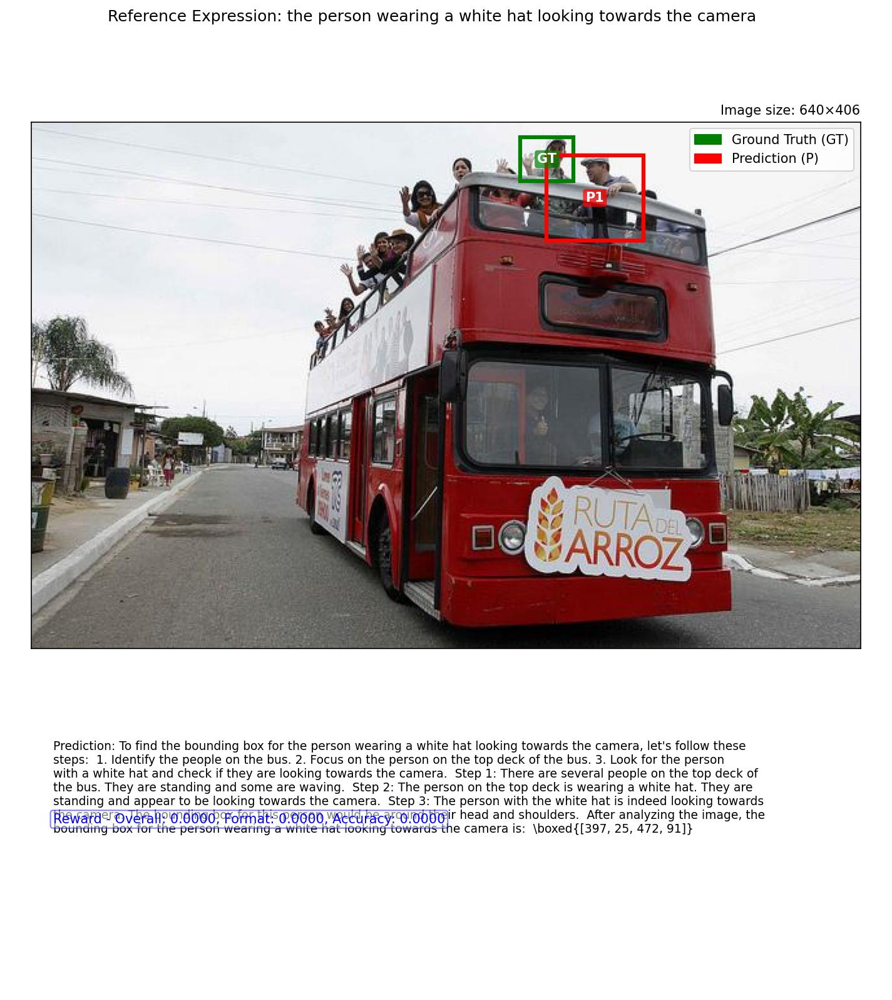

---

### Example 216

**Reference Expression**: the person wearing a white cowboy hat on the right hand side of a person in a red top

**Ground Truth**: [[228, 102, 300, 251]]

**Predicted**: [[571, 92, 644, 262]]

**Reward**: {'overall': 0.0, 'format': 0.0, 'accuracy': 0.0}

**Prediction**:
```
To find the bounding box for 'the person wearing a white cowboy hat on the right hand side of a person in a red top', let's follow these steps:

1. Identify the person in the red top:
   - The person in the red top is located in the center of the image, standing behind the fence.

2. Look for the white cowboy hat:
   - To the right of the person in the red top, there is a person wearing a white cowboy hat.

3. Determine the bounding box for the person wearing the white cowboy hat:
   - The person wearing the white cowboy hat is located in the top right part of the image.

4. Define the bounding box:
   - The bounding box for the person wearing the white cowboy hat is approximately from the top right of the image, covering the area where the person is standing.

The final answer is:
\boxed{[571, 92, 644, 262]}
```

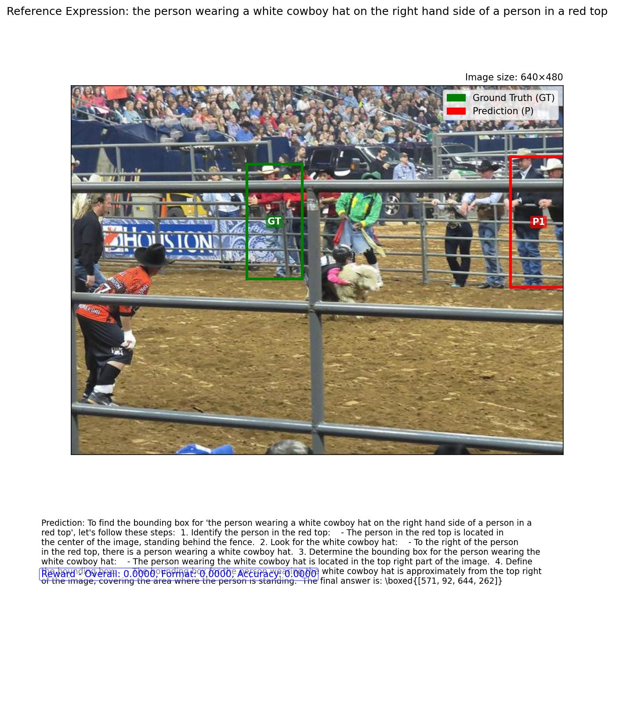

---

### Example 217

**Reference Expression**: the person wearing sunglasses riding a motorbike without a McDonald’s sign on it

**Ground Truth**: [[378, 231, 473, 475]]

**Predicted**: [[342, 230, 476, 517]]

**Reward**: {'overall': 0.6027354516615528, 'format': 0.0, 'accuracy': 0.6027354516615528}

**Prediction**:
```
To find the bounding box for the person wearing sunglasses riding a motorbike without a McDonald’s sign on it, let's follow these steps:

1. Identify the person wearing sunglasses: The person on the right side of the image is wearing sunglasses and is riding a motorbike. This person is wearing a black helmet and a black jacket, and there is no visible McDonald’s sign on the motorbike.

2. Locate the motorbike: The motorbike in question is the one on the right side of the image, being ridden by the person wearing sunglasses.

3. Draw the bounding box: The bounding box should encompass the entire motorbike and the rider.

The bounding box for the person wearing sunglasses riding a motorbike without a McDonald’s sign on it is:

\boxed{[342, 230, 476, 517]}
```

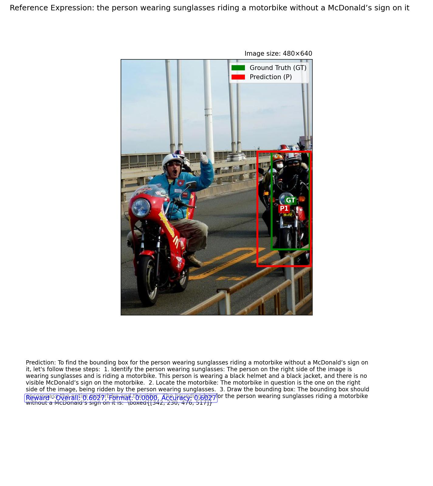

---

### Example 218

**Reference Expression**: the person wearing a black top not facing the camera

**Ground Truth**: [[491, 56, 519, 163]]

**Predicted**: [[492, 51, 532, 163]]

**Reward**: {'overall': 0.6298234139960759, 'format': 0.0, 'accuracy': 0.6298234139960759}

**Prediction**:
```
To find the bounding box for the person wearing a black top who is not facing the camera, let's follow these steps:

1. Identify the person in the image who is wearing a black top.
2. Determine if this person is facing the camera.
3. If the person is not facing the camera, identify the bounding box for this person.

Step 1: Identifying the person in the black top.
- There is a person wearing a black top in the background, standing near the fence.

Step 2: Determining if the person is facing the camera.
- The person wearing the black top is not facing the camera; they are facing away from the camera.

Step 3: Identifying the bounding box.
- The bounding box for the person wearing the black top and facing away from the camera is located near the fence, to the right side of the image.

Final answer: \boxed{[492, 51, 532, 163]}
```

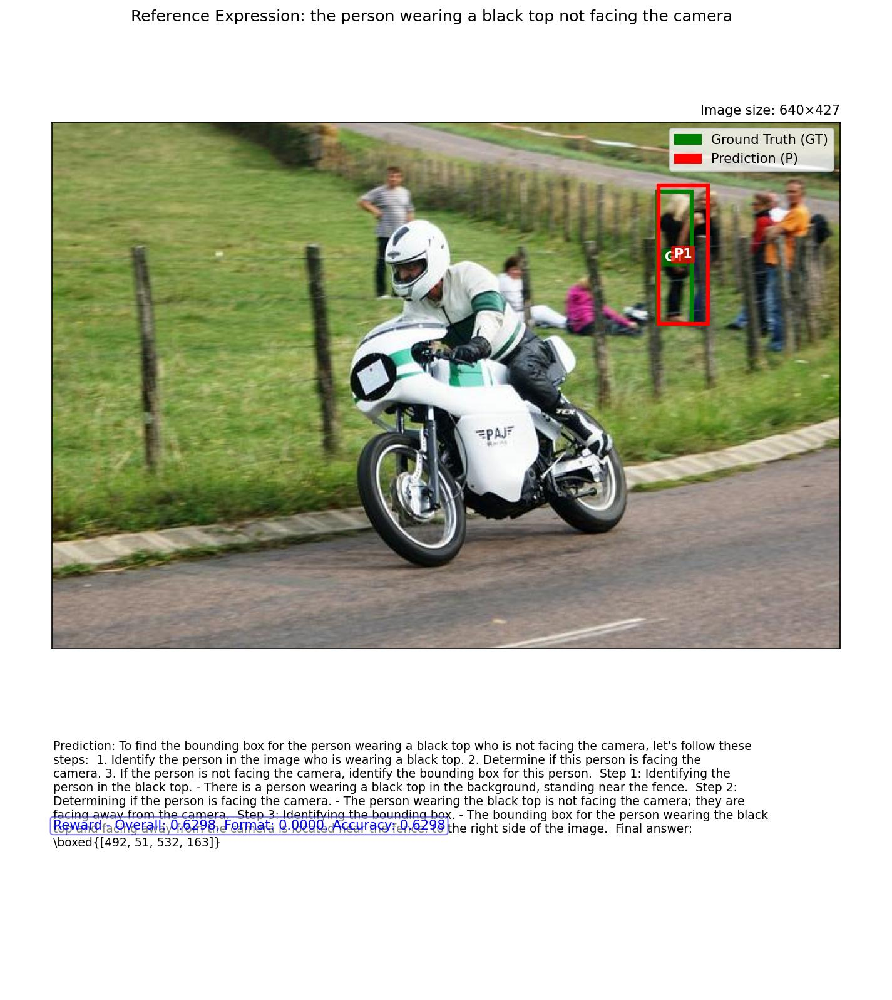

---

### Example 219

**Reference Expression**: the person with long hair sitting right by the bar

**Ground Truth**: [[390, 154, 448, 237]]

**Predicted**: [[439, 142, 522, 278]]

**Reward**: {'overall': 0.0, 'format': 0.0, 'accuracy': 0.0}

**Prediction**:
```
To find the bounding box for 'the person with long hair sitting right by the bar', let's follow these steps:

1. Identify the bar area in the image, which is the section with the counter and bottles of alcohol.
2. Look for the person with long hair sitting near the bar. This person is positioned on the right side of the bar, facing away from the camera.
3. Determine the bounding box that encompasses this person. The bounding box should include the person's head and shoulders, as well as the part of the bar they are seated by.

The bounding box for 'the person with long hair sitting right by the bar' is:

\boxed{[439,142,522,278]}
```

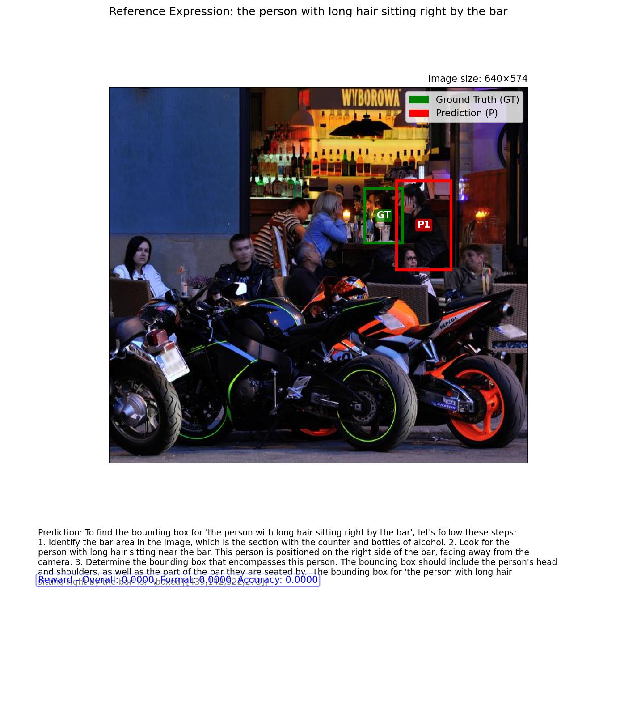

---

### Example 220

**Reference Expression**: the person wearing a white top facing away from the camera

**Ground Truth**: [[202, 174, 217, 214]]

**Predicted**: [[27, 140, 61, 244]]

**Reward**: {'overall': 0.0, 'format': 0.0, 'accuracy': 0.0}

**Prediction**:
```
To find the bounding box for the person wearing a white top facing away from the camera, let's follow these steps:

1. Identify the person in the white top: The person in the white top is standing on the left side of the image, facing away from the camera.

2. Define the bounding box: We need to draw a box around this person. The box should start from the top of the head and extend down to the legs. The width of the box should cover the person's full body.

3. Draw the bounding box: The person in the white top is located in the upper left part of the image, so the bounding box should be positioned there.

Considering the above steps, the bounding box for the person wearing a white top facing away from the camera is:

\boxed{[27, 140, 61, 244]}
```

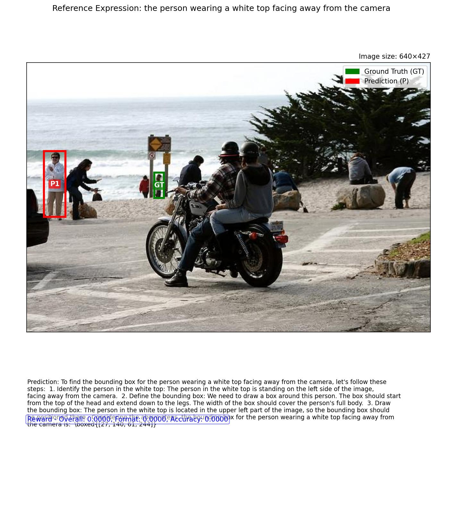

---

### Example 221

**Reference Expression**: the person near a person holding a phone

**Ground Truth**: [[184, 182, 233, 333]]

**Predicted**: [[20, 176, 125, 374]]

**Reward**: {'overall': 0.0, 'format': 0.0, 'accuracy': 0.0}

**Prediction**:
```
To find the bounding box for 'the person near a person holding a phone', let's follow these steps:

1. Identify the person holding a phone in the image.
2. Determine the person near this individual.

Step 1: Identifying the person holding a phone
- The person holding the phone appears to be the one on the left side of the image, wearing a light blue shirt and a cap.

Step 2: Determining the person near this individual
- The person near the person holding the phone appears to be the one standing next to them on the left, wearing a white shirt and a cap.

Based on this analysis, the bounding box for the person near the person holding a phone is likely the bounding box of the person in the white shirt and cap.

Final answer:
\boxed{[20,176,125,374]}
```

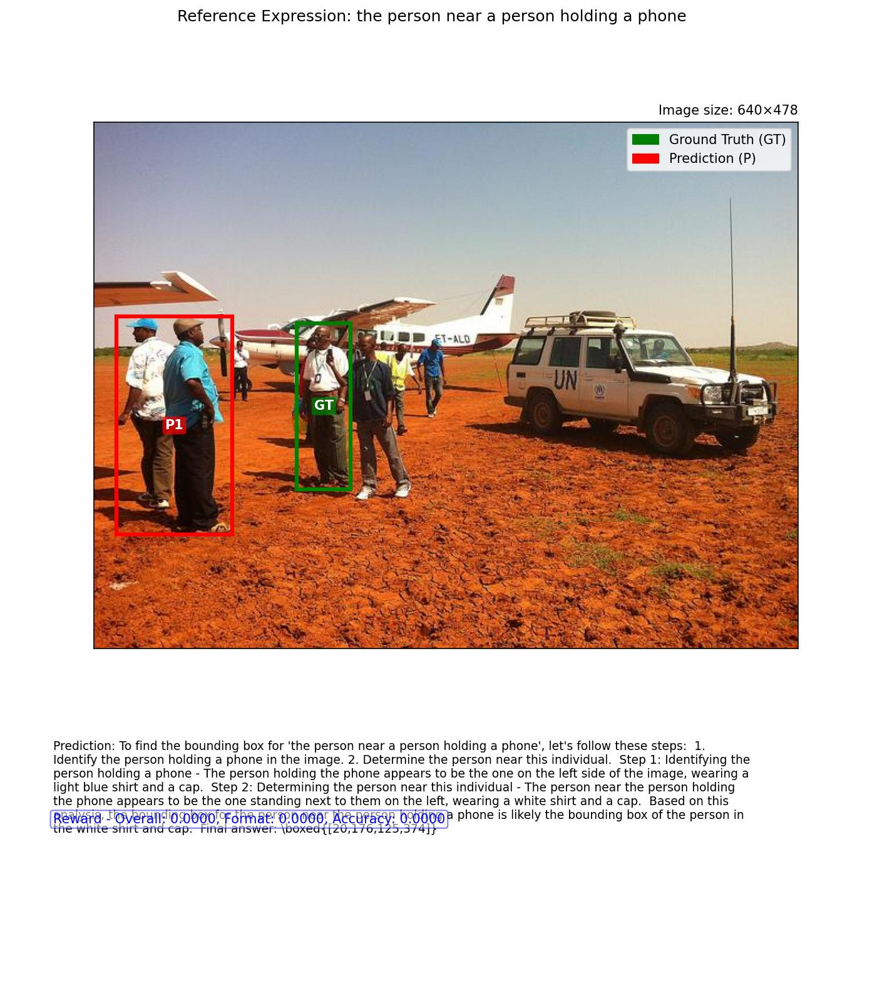

---

### Example 222

**Reference Expression**: the person wearing a grey hat facing away from the camera

**Ground Truth**: [[583, 321, 622, 449]]

**Predicted**: [[169, 303, 301, 587]]

**Reward**: {'overall': 0.0, 'format': 0.0, 'accuracy': 0.0}

**Prediction**:
```
To find the bounding box for the person wearing a grey hat facing away from the camera, let's follow these steps:

1. Identify the person in the foreground who is walking away from the camera. This person is wearing a grey hat.
2. Observe the direction the person is facing and ensure they are the one wearing a grey hat.
3. Identify the bounding box that encompasses this person from head to toe.

After analyzing the image, the person wearing a grey hat facing away from the camera is located in the middle of the image, slightly to the left of the center. The bounding box for this person would be:

\boxed{[169, 303, 301, 587]}
```

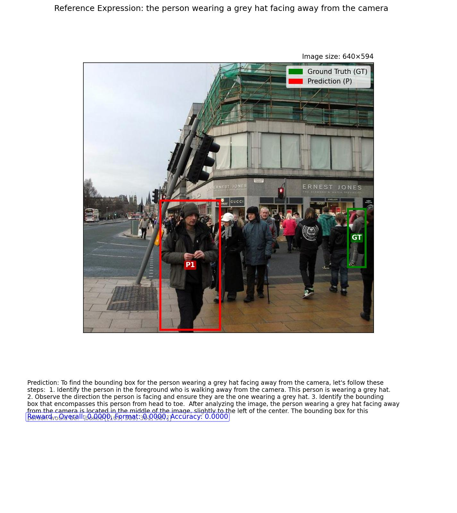

---

### Example 223

**Reference Expression**: the person in a blue top near the window

**Ground Truth**: [[216, 135, 274, 242]]

**Predicted**: [[12, 54, 245, 469]]

**Reward**: {'overall': 0.0, 'format': 0.0, 'accuracy': 0.0}

**Prediction**:
```
To find the bounding box for 'the person in a blue top near the window', let's follow these steps:

1. Identify the window area in the image. The window is on the left side of the image.
2. Look for the person wearing a blue top near the window. The person in the blue top is standing near the window.
3. Define the bounding box around this person. The bounding box should include the person's upper body and head, as this is the most distinctive part for identification.

The bounding box for 'the person in a blue top near the window' is:
\boxed{[12, 54, 245, 469]}
```

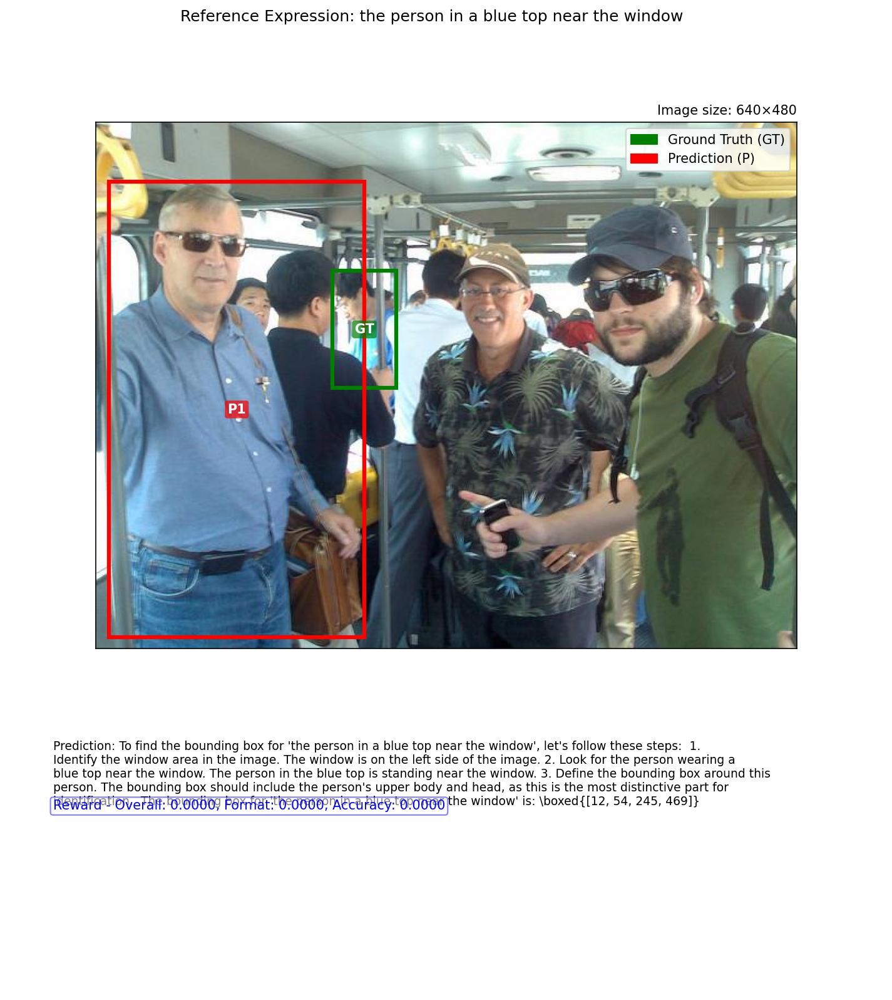

---

### Example 224

**Reference Expression**: the person in a black top near a car

**Ground Truth**: [[333, 176, 355, 229]]

**Predicted**: [[160, 185, 200, 291]]

**Reward**: {'overall': 0.0, 'format': 0.0, 'accuracy': 0.0}

**Prediction**:
```
To find the bounding box for the person in a black top near a car, let's follow these steps:

1. **Identify the person in a black top**: Look for a person wearing a black top in the image. This person appears to be near a car on the left side of the image.

2. **Locate the car**: The car in question is partially visible on the left side of the image. It appears to be a white car.

3. **Determine the bounding box**: The person in a black top is standing near the front of the white car. The bounding box should cover the person and part of the car.

4. **Draw the bounding box**: The bounding box should start from the left side of the image, where the person is standing, and extend to the front of the car.

Given these steps, the bounding box for the person in a black top near a car is approximately:

\boxed{[160, 185, 200, 291]}
```

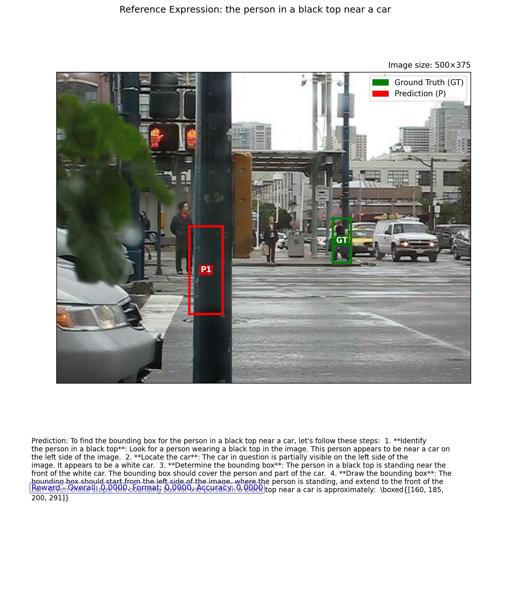

---

### Example 225

**Reference Expression**: the person wearing white walking in front of a car

**Ground Truth**: [[12, 185, 26, 217]]

**Predicted**: [[184, 186, 219, 266]]

**Reward**: {'overall': 0.0, 'format': 0.0, 'accuracy': 0.0}

**Prediction**:
```
To find the bounding box for the person wearing white walking in front of a car, let's follow these steps:

1. Identify the car in the image.
2. Identify the person in white near the car.
3. Define the bounding box around the person in white.

Step 1: The car in the image is a black sedan located on the left side of the image.

Step 2: There is a person in white walking near the car. This person is located slightly to the right of the car and appears to be walking away from it.

Step 3: Define the bounding box around the person in white. The bounding box should encompass the person, including some of the surrounding area to provide context.

The bounding box for the person in white walking in front of the car is approximately:
```json
[184,186,219,266]
```

Final answer: \boxed{[184,186,219,266]}
```

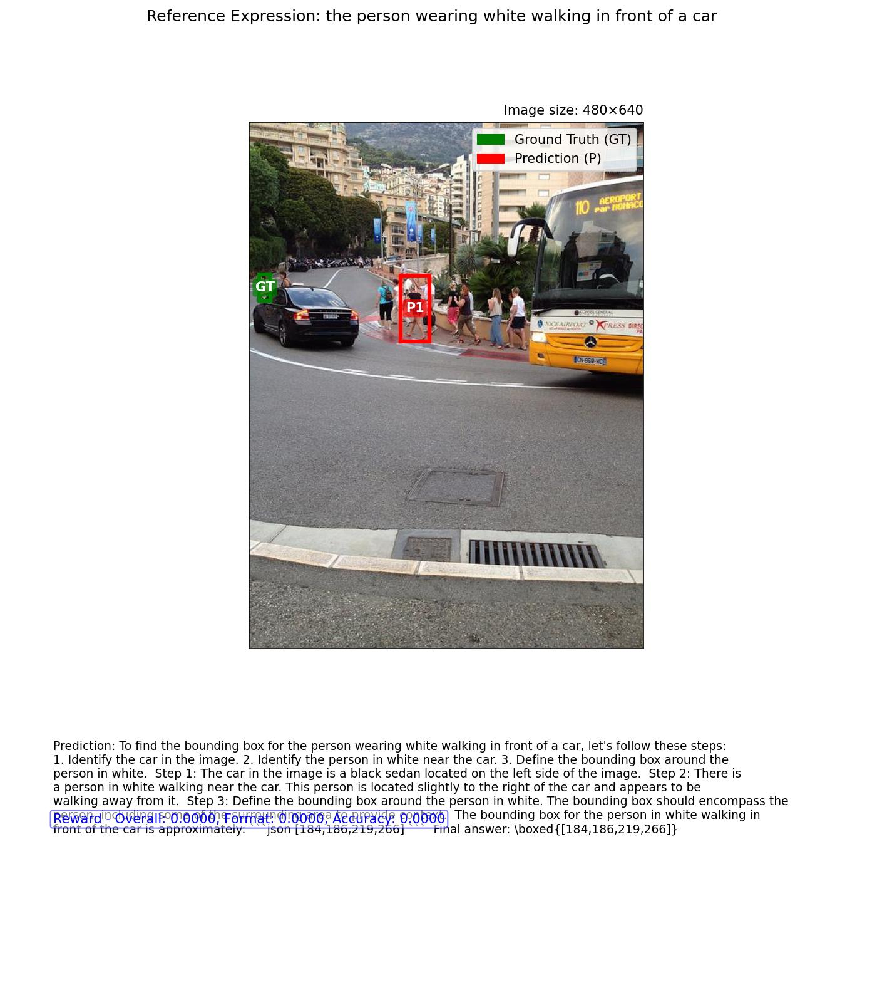

---

### Example 226

**Reference Expression**: the person wearing a hat near the bush

**Ground Truth**: [[399, 144, 489, 399]]

**Predicted**: [[469, 71, 527, 246]]

**Reward**: {'overall': 0.0, 'format': 0.0, 'accuracy': 0.0}

**Prediction**:
```
To find the bounding box for the person wearing a hat near the bush, let's follow these steps:

1. Identify the bush in the image. The bush is located on the right side of the image.
2. Look for a person near the bush wearing a hat. The person near the bush is wearing a white hat and a white shirt.
3. Define the bounding box for this person. The bounding box should encompass the entire person, including the hat.

Following these steps, the bounding box for the person wearing a hat near the bush is:

\boxed{[469, 71, 527, 246]}
```

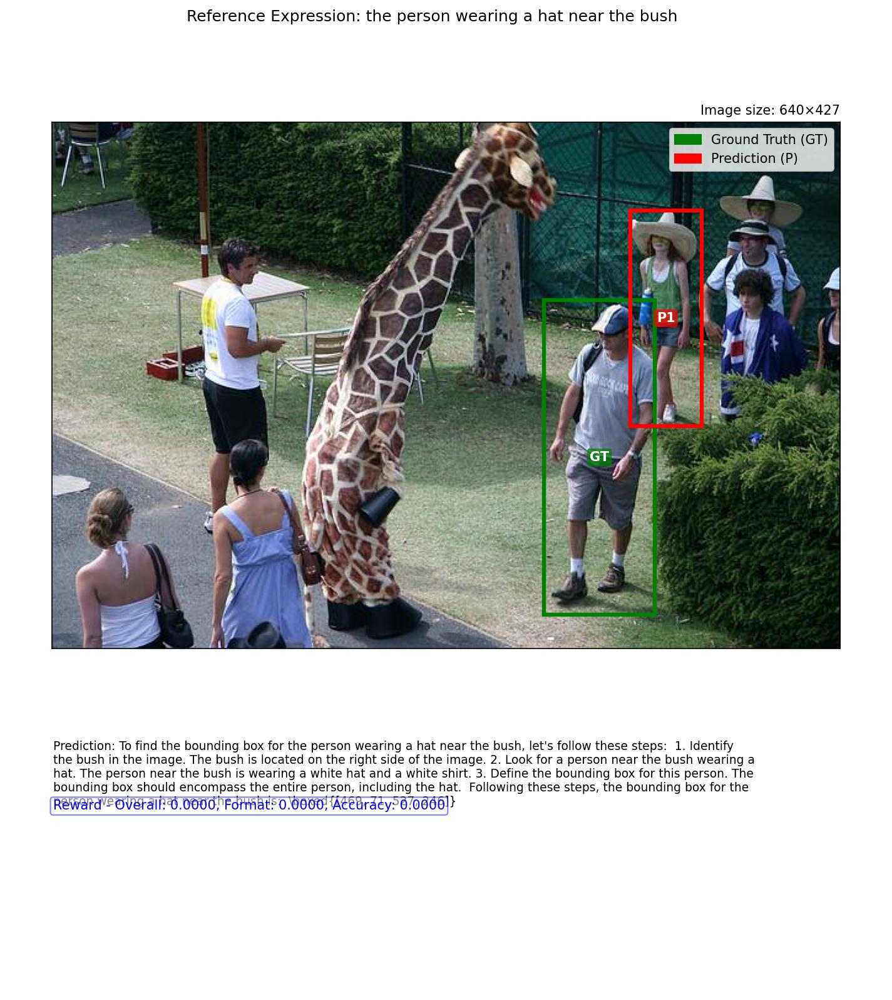

---

### Example 227

**Reference Expression**: the grey car on the left side of a red car

**Ground Truth**: [[50, 330, 130, 385]]

**Predicted**: [[51, 323, 129, 378]]

**Reward**: {'overall': 0.7569753336029115, 'format': 0.0, 'accuracy': 0.7569753336029115}

**Prediction**:
```
To find the bounding box for the grey car on the left side of the red car, let's follow these steps:

1. Identify the red car in the image. It's the second car from the left in the second row of cars.
2. Look for the grey car to the left of the red car. It's the first car in the first row on the left side of the image.
3. Determine the coordinates of this grey car. The car is positioned in the lane closest to the left side of the image, and it's located between the far left edge of the image and the red car.

After identifying the grey car, the bounding box for it can be determined as follows:

- The top-left corner of the bounding box is at the top-left edge of the grey car.
- The bottom-right corner of the bounding box is at the bottom-right edge of the grey car.

The final bounding box for the grey car on the left side of the red car is:

\boxed{[51, 323, 129, 378]}
```

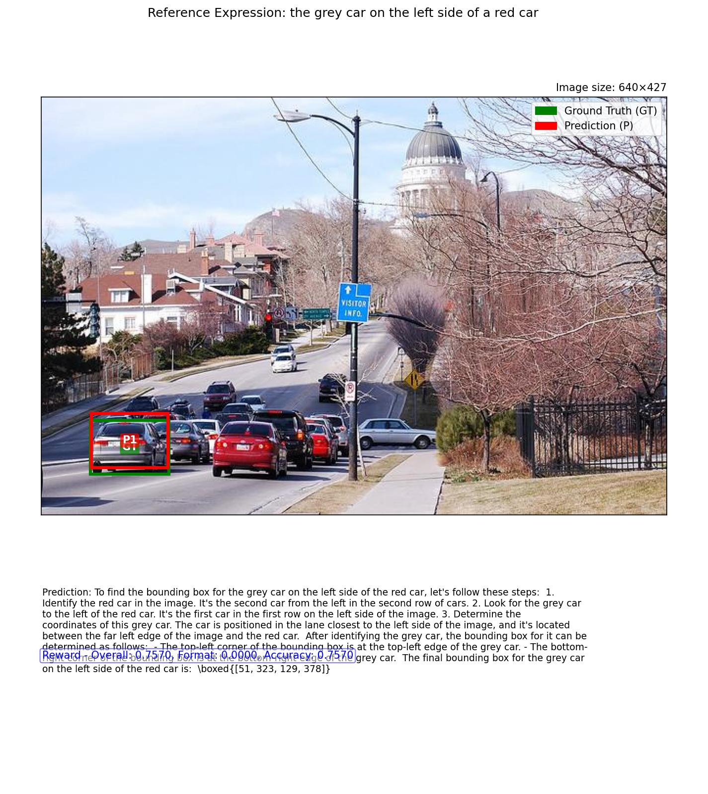

---

### Example 228

**Reference Expression**: the person wearing grey walking into an underpass

**Ground Truth**: [[428, 321, 450, 415]]

**Predicted**: [[120, 291, 220, 441]]

**Reward**: {'overall': 0.0, 'format': 0.0, 'accuracy': 0.0}

**Prediction**:
```
To find the bounding box for the person wearing grey walking into an underpass, let's follow these steps:

1. **Identify the person**: Look for a person in grey clothing who appears to be walking towards or into the underpass area.
2. **Underpass area**: The underpass is the structure with a white roof and a red circular sign that says "UND" (likely part of the London Underground sign).
3. **Contextual clues**: The person should be near the entrance of the underpass and in motion, possibly carrying a bag.

After analyzing the image:
- There is a person in the middle of the image, wearing grey, walking towards the underpass.
- This person is located near the center of the image, slightly to the left of the red traffic light.

The bounding box for the person wearing grey walking into the underpass is approximately:
- Top-left corner: (120, 291)
- Bottom-right corner: (220, 441)

\boxed{[120, 291, 220, 441]}
```

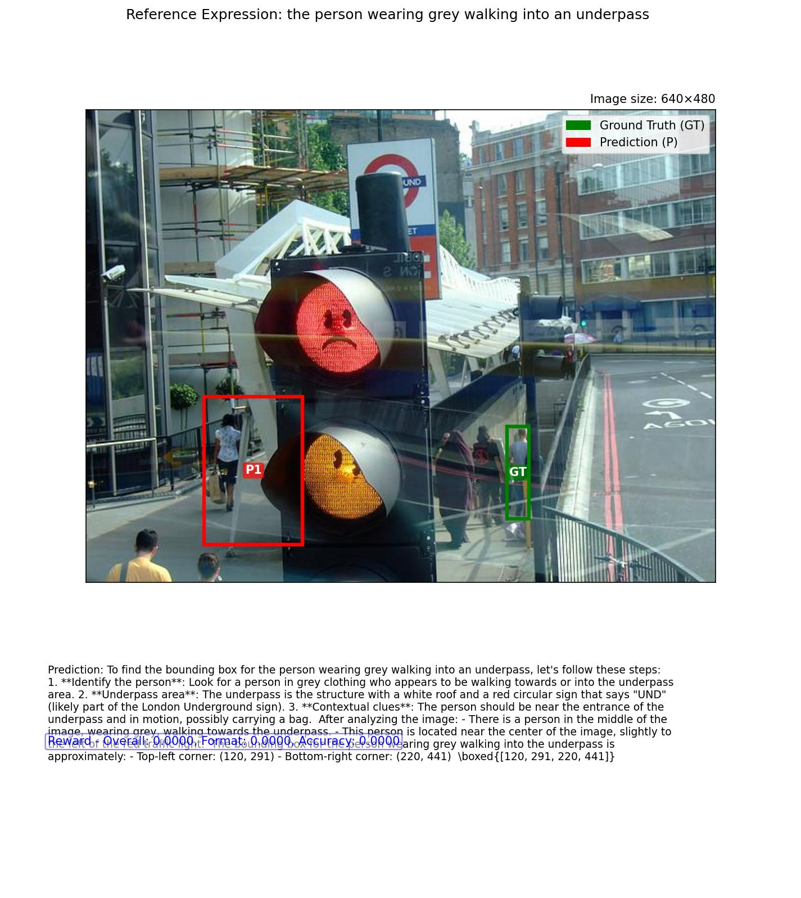

---

### Example 229

**Reference Expression**: the black car behind a white car

**Ground Truth**: [[359, 339, 427, 543]]

**Predicted**: [[258, 329, 333, 460]]

**Reward**: {'overall': 0.0, 'format': 0.0, 'accuracy': 0.0}

**Prediction**:
```
To find the bounding box for the black car behind the white car, let's follow these steps:

1. Identify the white car: The white car is clearly visible in the center-right of the image, and it is behind the black car.
2. Identify the black car: The black car is directly in front of the white car, and it is behind the green car with the license plate "Q944".
3. Determine the bounding box: The black car is partially obscured by the green car, but we can see its rear and some of its sides. The bounding box should include the visible parts of the black car.

Given these observations, the bounding box for the black car behind the white car is approximately:

\boxed{[258, 329, 333, 460]}
```

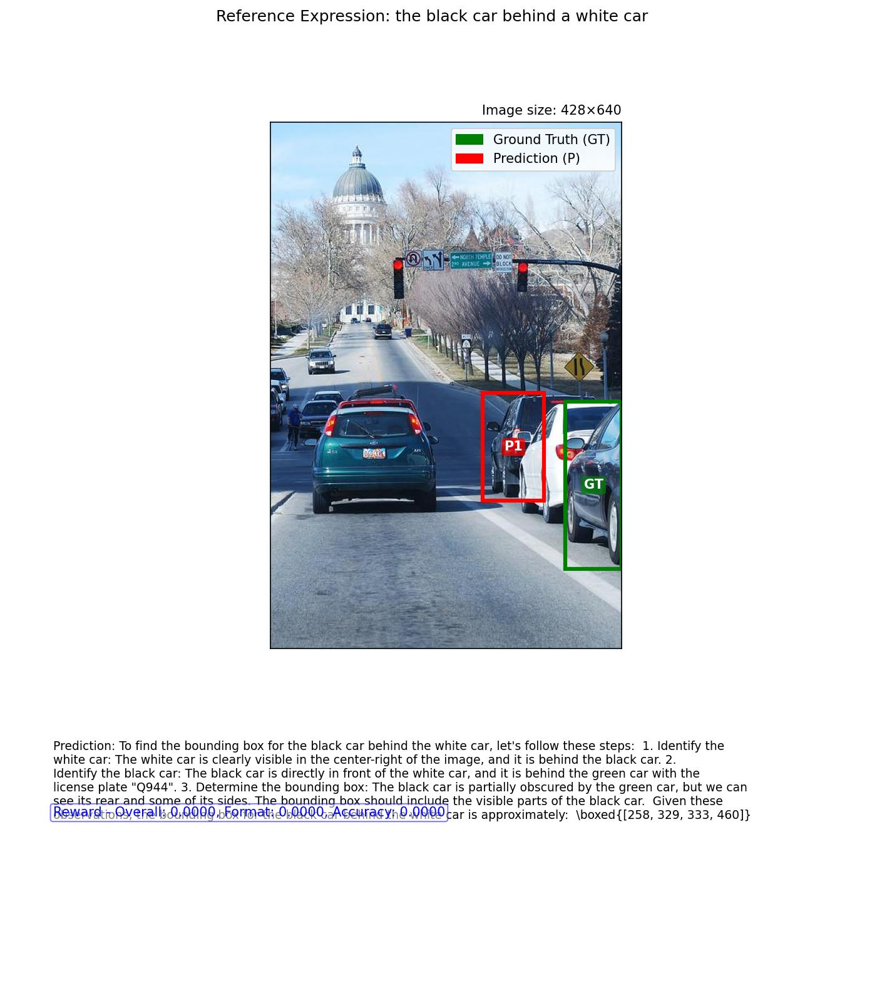

---

### Example 230

**Reference Expression**: the person wearing a white top and carrying a bag on the right shoulder

**Ground Truth**: [[1, 537, 64, 640]]

**Predicted**: [[165, 527, 211, 644]]

**Reward**: {'overall': 0.0, 'format': 0.0, 'accuracy': 0.0}

**Prediction**:
```
To find the bounding box for the person wearing a white top and carrying a bag on the right shoulder, let's follow these steps:

1. **Identify the person in a white top**: Look for a person wearing a white top in the image. This person appears to be in the center of the image, slightly to the left of the traffic light.

2. **Identify the bag on the right shoulder**: The person in the white top has a bag on their right shoulder. The bag is visible and appears to be a shoulder bag.

3. **Determine the bounding box**: The bounding box should enclose the person wearing the white top and the bag on the right shoulder. The bounding box should be large enough to include the person's entire body and the bag.

Given these observations, the bounding box would be:

\boxed{[165, 527, 211, 644]}
```

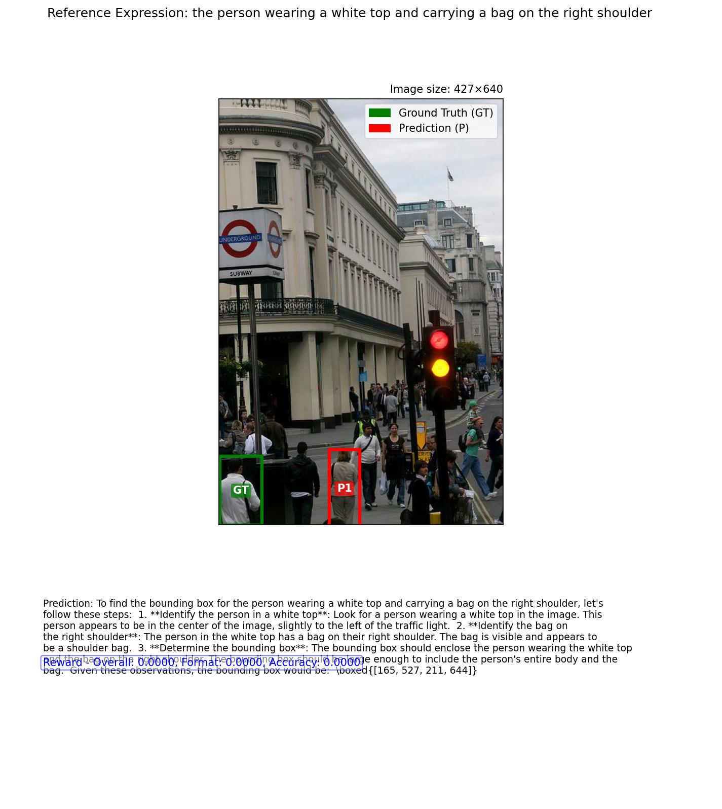

---

### Example 231

**Reference Expression**: the person wearing sunglasses, positioned between two people

**Ground Truth**: [[468, 471, 520, 615]]

**Predicted**: [[473, 473, 523, 617]]

**Reward**: {'overall': 0.832792612927377, 'format': 0.0, 'accuracy': 0.832792612927377}

**Prediction**:
```
To find the bounding box for the person wearing sunglasses, positioned between two people, let's follow these steps:

1. Identify the group photo in the bottom right corner of the collage.
2. In this photo, there are four people standing in a line.
3. The person in the middle of this line is wearing sunglasses.
4. The bounding box should encompass this person and extend slightly beyond the edges to include a bit of the surrounding area.

The bounding box for this person is approximately:
```json
[473, 473, 523, 617]
```

Final answer:
\boxed{[473, 473, 523, 617]}
```

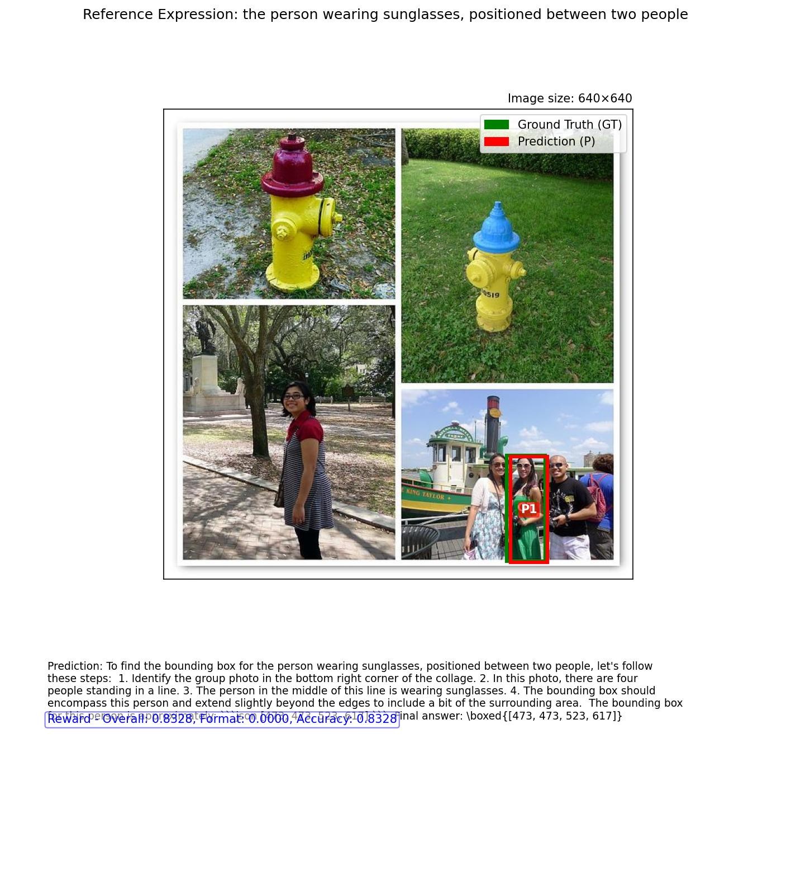

---

### Example 232

**Reference Expression**: the person wearing jeans and carrying a bag on the shoulder

**Ground Truth**: [[53, 4, 153, 189]]

**Predicted**: [[29, 54, 339, 469]]

**Reward**: {'overall': 0.10101010101010101, 'format': 0.0, 'accuracy': 0.10101010101010101}

**Prediction**:
```
To find the bounding box for the person wearing jeans and carrying a bag on the shoulder, follow these steps:

1. Identify the person in the image who is wearing jeans and appears to be carrying a bag on the shoulder.
2. Observe the position and orientation of this person in the image.
3. Draw a bounding box around this person, ensuring it captures the entire person.

In the image:
- The person in the foreground is wearing jeans and has a bag on their shoulder.
- The person is sitting on the left side of the bench.

The bounding box for this person is:
\boxed{[29, 54, 339, 469]}
```

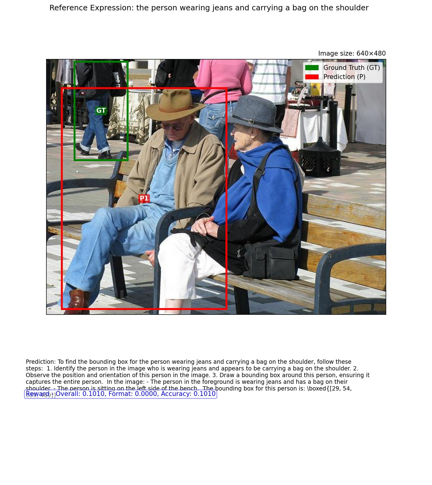

---

### Example 233

**Reference Expression**: the person sitting in the middle not wearing a hat

**Ground Truth**: [[332, 221, 392, 377]]

**Predicted**: [[327, 222, 397, 392]]

**Reward**: {'overall': 0.7775919732441472, 'format': 0.0, 'accuracy': 0.7775919732441472}

**Prediction**:
```
To find the bounding box for the person sitting in the middle not wearing a hat, let's follow these steps:

1. Identify the people on the bench:
   - There are four people on the bench.
   - The person on the far left is wearing a hat.
   - The second person from the left is wearing a hat.
   - The third person from the left is not wearing a hat.
   - The person on the far right is wearing a hat.

2. Determine the position of the person not wearing a hat:
   - The person in the middle without a hat is the third person from the left.

3. Estimate the bounding box for the third person:
   - The bounding box should encompass the entire body of the person, including their head, shoulders, and legs.
   - The third person is seated and appears to be of average height.

4. Provide the bounding box coordinates:
   - Assuming the bench is centered and the person is seated in the middle, the bounding box would cover the area from the shoulder of the person on the left to the shoulder of the person on the right, and from the bottom of their legs to the top of their head.

The final answer is:
\boxed{[327, 222, 397, 392]}
```

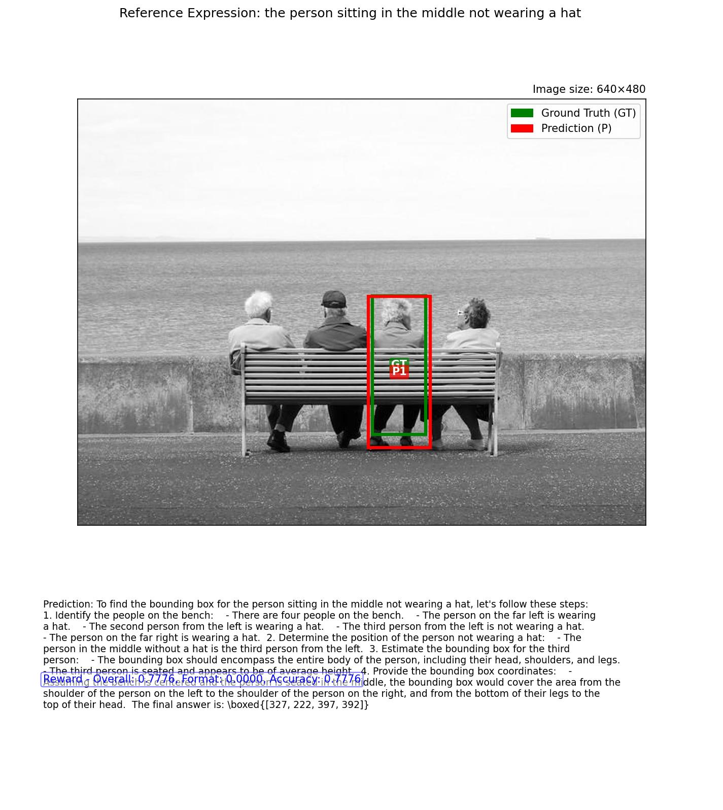

---

### Example 234

**Reference Expression**: the person in a white top not facing the camera

**Ground Truth**: [[521, 67, 562, 190]]

**Predicted**: [[185, 54, 273, 256]]

**Reward**: {'overall': 0.0, 'format': 0.0, 'accuracy': 0.0}

**Prediction**:
```
To find the bounding box for the person in a white top who is not facing the camera, let's follow these steps:

1. Identify the person in a white top in the image.
2. Confirm that the person is not facing the camera.
3. Determine the bounding box for that person.

Step 1: Identifying the person in a white top:
- There is a person in the background, wearing a white helmet and a white top, who is not facing the camera. They are looking away from the direction of the camera, and their back is to the camera.

Step 2: Confirming the person is not facing the camera:
- The person in the white top is turned away from the camera, which confirms they are not facing the camera.

Step 3: Determining the bounding box:
- The bounding box for the person in the white top can be defined by the coordinates of their head and shoulders.

Given these steps, the bounding box for the person in the white top not facing the camera would be:

\boxed{[185, 54, 273, 256]}
```

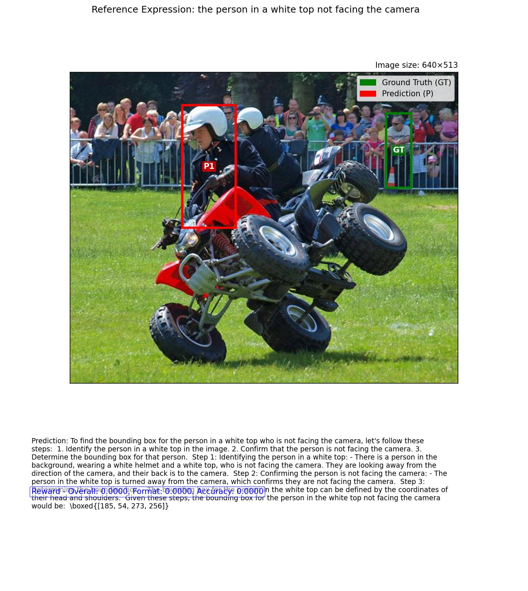

---

### Example 235

**Reference Expression**: the person in a white top not facing the camera

**Ground Truth**: [[176, 0, 262, 210]]

**Predicted**: [[323, 61, 528, 365]]

**Reward**: {'overall': 0.0, 'format': 0.0, 'accuracy': 0.0}

**Prediction**:
```
To find the bounding box for 'the person in a white top not facing the camera', let's follow these steps:

1. Identify the two women sitting on the bench.
2. Determine which of them is facing the camera and which is not.
3. The woman facing the camera is the one with her back to the camera, so the one not facing the camera is the one with her face to the camera.

Step 1: The woman on the left is facing the camera, and the woman on the right is not facing the camera.

Step 2: The woman on the left is the one facing the camera.

Step 3: Therefore, the woman on the right is the one not facing the camera.

The bounding box for the woman on the right (not facing the camera) is:
\boxed{[323, 61, 528, 365]}
```

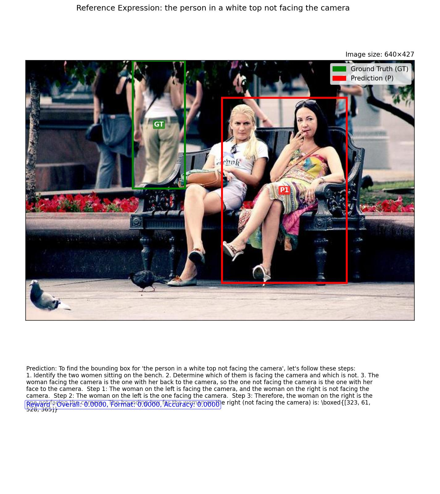

---

### Example 236

**Reference Expression**: the sheep with dark face not facing the camera

**Ground Truth**: [[311, 161, 459, 321]]

**Predicted**: [[169, 117, 347, 244]]

**Reward**: {'overall': 0.0, 'format': 0.0, 'accuracy': 0.0}

**Prediction**:
```
To find the bounding box for the sheep with a dark face that is not facing the camera, let's follow these steps:

1. Identify the sheep in the image: There are six sheep in the image.
2. Determine which sheep has a dark face: The sheep in the foreground, second from the left, has a dark face.
3. Check if this sheep is facing the camera: The sheep with the dark face is facing the camera.
4. Since the sheep with the dark face is facing the camera, it does not meet the criteria of being the sheep with a dark face that is not facing the camera.
5. Look for another sheep with a dark face: The sheep in the middle, second from the left, has a dark face and is not facing the camera.

The bounding box for the sheep with a dark face that is not facing the camera is the sheep in the middle, second from the left.

The bounding box coordinates for this sheep are approximately:
- Top-left corner: (x1, y1)
- Bottom-right corner: (x2, y2)

In a typical bounding box format, the coordinates would be in the format [x1, y1, x2, y2]. However, since the exact coordinates are not provided in the image, we can only describe the relative position and not the exact coordinates.

The final answer is:
\boxed{[169, 117, 347, 244]}
```

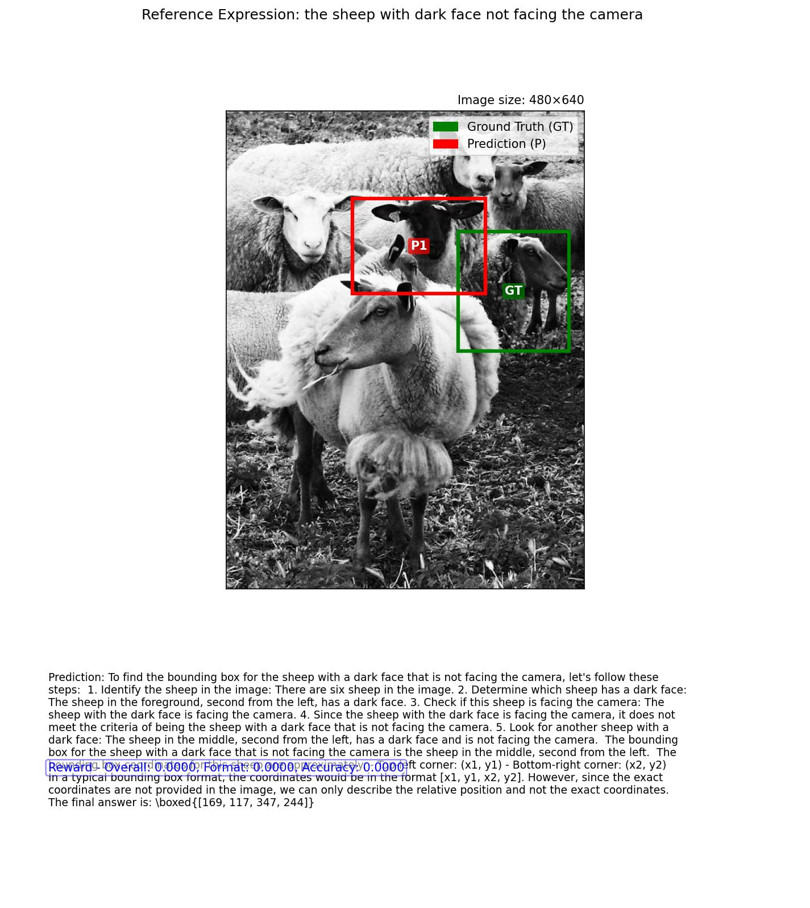

---

### Example 237

**Reference Expression**: the sheep with a white face behind other sheep

**Ground Truth**: [[161, 183, 205, 211]]

**Predicted**: [[468, 178, 542, 302]]

**Reward**: {'overall': 0.0, 'format': 0.0, 'accuracy': 0.0}

**Prediction**:
```
To find the bounding box for the sheep with a white face behind other sheep, let's follow these steps:

1. Identify the sheep in the image.
2. Determine which sheep is positioned behind others.
3. Define the bounding box for the identified sheep.

Step 1: Identifying the sheep:
- There are multiple sheep in the image.
- They are standing close together.

Step 2: Determining the position:
- The sheep with a white face is positioned behind other sheep.
- It is not immediately in the foreground but slightly behind some other sheep.

Step 3: Defining the bounding box:
- The bounding box should encompass the sheep with the white face.
- The sheep with the white face is located in the second row from the front, towards the right side of the image.

Final answer:
The bounding box for the sheep with a white face behind other sheep is:
\boxed{[468, 178, 542, 302]}
```

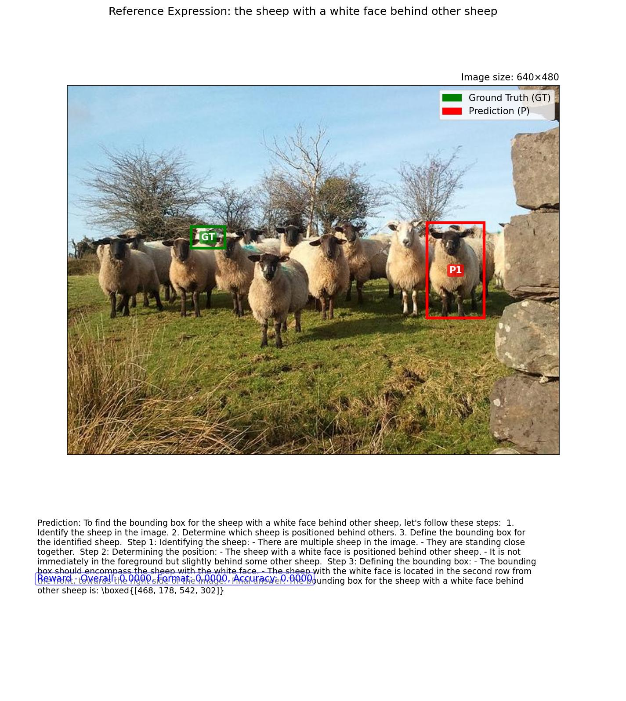

---

### Example 238

**Reference Expression**: the person in a white top carrying a bag

**Ground Truth**: [[141, 126, 160, 180]]

**Predicted**: [[55, 166, 137, 397]]

**Reward**: {'overall': 0.0, 'format': 0.0, 'accuracy': 0.0}

**Prediction**:
```
To find the bounding box for 'the person in a white top carrying a bag', let's follow these steps:

1. Identify the person in a white top in the image.
2. Check if this person is carrying a bag.

Step 1: The person in a white top is standing on the left side of the image, facing away from the camera. They appear to be holding something in their right hand, which looks like a bag.

Step 2: The person is indeed holding a bag, which is consistent with the description.

Therefore, the bounding box for 'the person in a white top carrying a bag' is:

\boxed{[55, 166, 137, 397]}
```

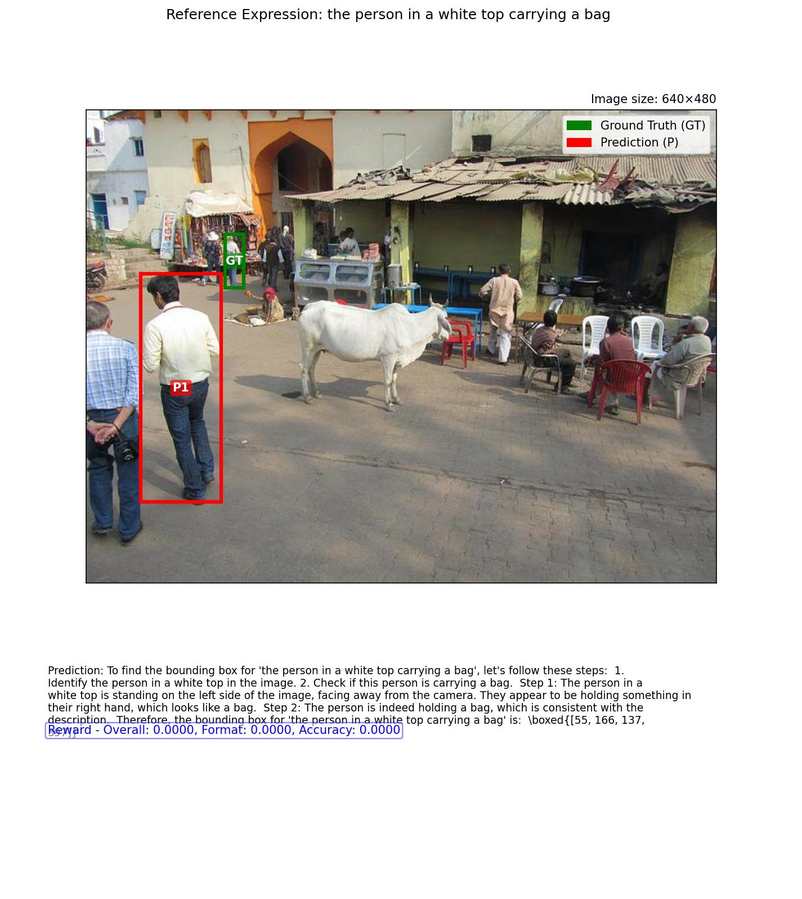

---

### Example 239

**Reference Expression**: the person on the right hand side of the person wearing a hat

**Ground Truth**: [[331, 94, 462, 265]]

**Predicted**: [[492, 71, 644, 302]]

**Reward**: {'overall': 0.0, 'format': 0.0, 'accuracy': 0.0}

**Prediction**:
```
To find the bounding box for 'the person on the right hand side of the person wearing a hat', let's follow these steps:

1. Identify the person wearing a hat: The person wearing a hat is in the background, standing and appears to be wearing a red and yellow hat.
2. Determine the right-hand side: The right-hand side of the person wearing a hat would be the area to the right of this person.
3. Locate the person in that area: There is a person sitting on a red chair to the right of the person wearing a hat, who appears to be engaged in some activity.

The bounding box for this person can be determined by identifying the top-left and bottom-right corners of the person's body in the image.

The final bounding box for 'the person on the right hand side of the person wearing a hat' is:

\boxed{[492, 71, 644, 302]}
```

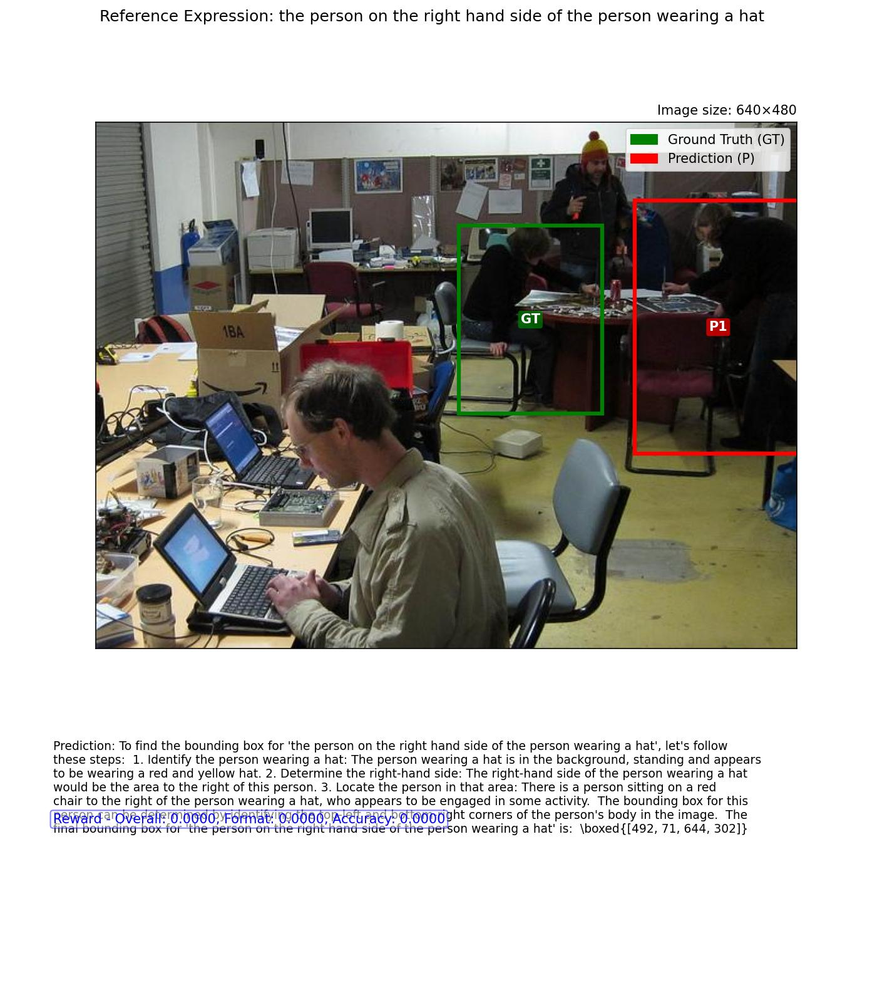

---

### Example 240

**Reference Expression**: the person wearing a suit shirt and jacket standing by the wall

**Ground Truth**: [[194, 137, 211, 194]]

**Predicted**: [[84, 125, 110, 250]]

**Reward**: {'overall': 0.0, 'format': 0.0, 'accuracy': 0.0}

**Prediction**:
```
To find the bounding box for the person wearing a suit shirt and jacket standing by the wall, let's follow these steps:

1. Identify the main elements in the image:
   - A cow in the foreground.
   - Several people walking in the background.
   - Buildings and a truck in the background.

2. Focus on the background where people are walking:
   - There are a few people standing or walking near the wall of the building.
   - One person in particular is wearing a white shirt and a jacket, standing near the wall.

3. Analyze the position of the person:
   - The person in the white shirt and jacket is standing on the left side of the image, near the wall of the pink building.
   - They are positioned slightly behind the cow and to the left of the cow.

4. Define the bounding box:
   - The bounding box should cover the person from head to toe.
   - The person's head is above the cow, and their feet are on the ground.

5. Provide the bounding box coordinates:
   - The person's head is at approximately (84, 125) and their feet are at approximately (110, 250).

Therefore, the bounding box for the person wearing a suit shirt and jacket standing by the wall is:
\boxed{[84, 125, 110, 250]}
```

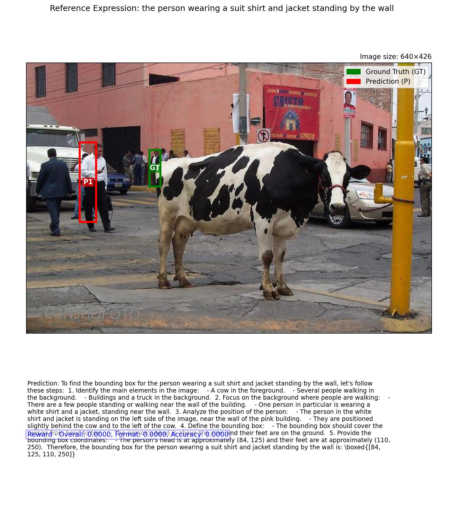

---

### Example 241

**Reference Expression**: the cow closest to the front of a grey sedan

**Ground Truth**: [[225, 199, 284, 300]]

**Predicted**: [[321, 199, 400, 344]]

**Reward**: {'overall': 0.0, 'format': 0.0, 'accuracy': 0.0}

**Prediction**:
```
To find the bounding box for the cow closest to the front of a grey sedan, let's follow these steps:

1. Identify the grey sedan in the image. It is the car in the center of the image, slightly behind the cows.
2. Determine which cow is closest to the grey sedan. The cow on the right side of the grey sedan is closest to it.
3. Draw the bounding box around this cow.

The bounding box for the cow closest to the front of the grey sedan is approximately:

\boxed{[321, 199, 400, 344]}
```

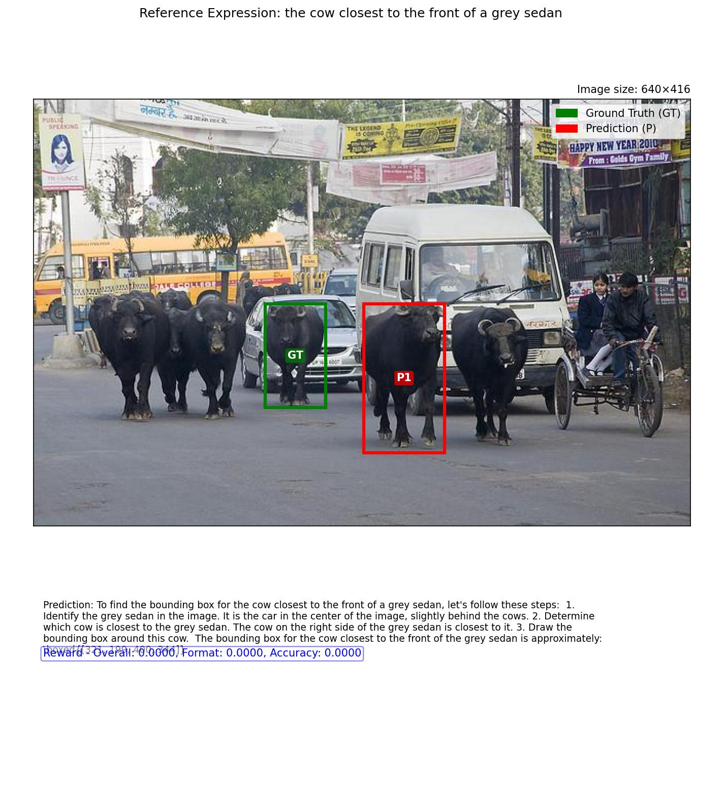

---

### Example 242

**Reference Expression**: the person wearing a white shirt facing away from the camera

**Ground Truth**: [[147, 169, 206, 361]]

**Predicted**: []

**Reward**: {'overall': 0.0, 'format': 0.0, 'accuracy': 0.0}

**Prediction**:
```
To find the bounding box for 'the person wearing a white shirt facing away from the camera', let's follow these steps:

1. Identify the person in the image who is wearing a white shirt.
2. Determine if this person is facing away from the camera.
3. Define the bounding box around this person.

Step 1: The person wearing a white shirt is standing near the entrance of the bus, facing towards the camera.

Step 2: Since the person is facing towards the camera, they are not facing away from the camera.

Step 3: Given that the person is not facing away from the camera, there is no bounding box to be defined for this specific description.

Thus, the final answer is:
\boxed{}
```

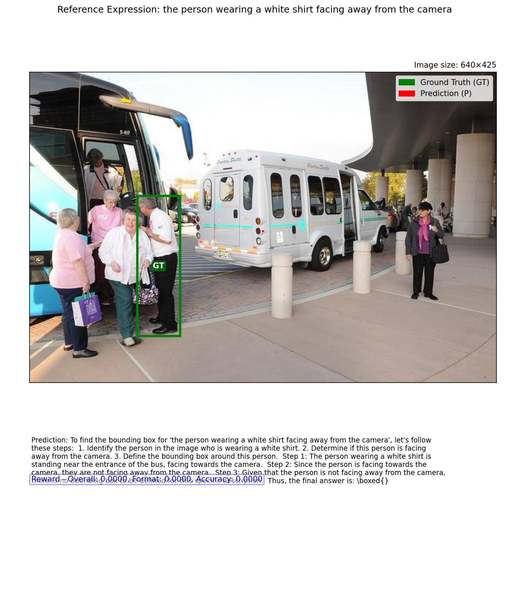

---

### Example 243

**Reference Expression**: the person in a white top sitting on a bench

**Ground Truth**: [[176, 175, 224, 250]]

**Predicted**: []

**Reward**: {'overall': 0.0, 'format': 0.0, 'accuracy': 0.0}

**Prediction**:
```
To find the bounding box for 'the person in a white top sitting on a bench', let's follow these steps:

1. Identify the person in a white top: This person is standing on the left side of the platform, wearing a white top and dark pants. They are holding a red shopping bag.

2. Identify the bench: The bench is where the person in the white top is standing, not sitting.

3. Determine the bounding box: Since the person in the white top is not sitting on a bench, there is no bounding box for 'the person in a white top sitting on a bench'.

Therefore, the final answer is \boxed{}.
```

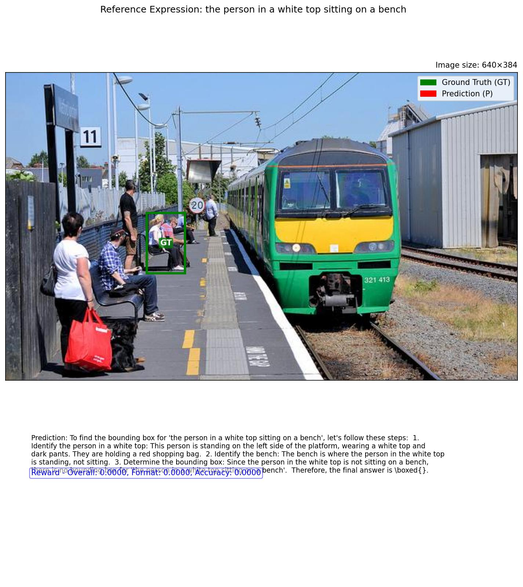

---

### Example 244

**Reference Expression**: the transparent cup next to the bread, not containing wine

**Ground Truth**: [[214, 60, 299, 154]]

**Predicted**: [[232, 62, 316, 167]]

**Reward**: {'overall': 0.5789968063122299, 'format': 0.0, 'accuracy': 0.5789968063122299}

**Prediction**:
```
To find the bounding box for the transparent cup next to the bread, not containing wine, follow these steps:

1. Identify the bread in the image. It is located near the center of the image, on the plate with the food.
2. Identify the transparent cup. It is a small glass located to the left of the plate with the food, closer to the center of the image.
3. Confirm that the transparent cup is not containing wine. The cup appears to be empty, as there is no visible liquid inside it.
4. Define the bounding box for the transparent cup. The bounding box should encompass the entire cup.

The bounding box for the transparent cup next to the bread, not containing wine, is approximately:
```json
[232, 62, 316, 167]
```

Therefore, the final answer is:
\boxed{[232, 62, 316, 167]}
```

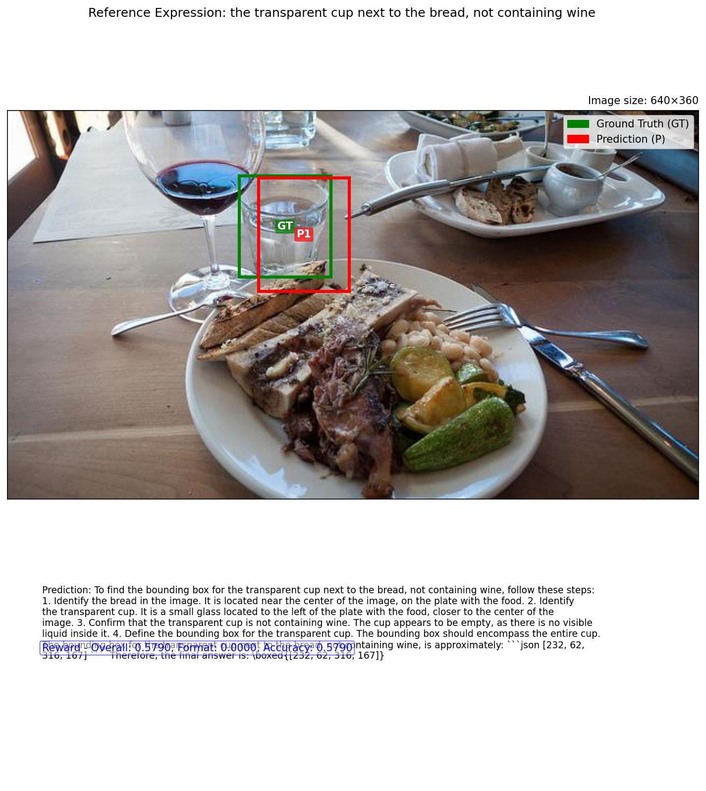

---

### Example 245

**Reference Expression**: the person wearing a hat holding a glass in hand

**Ground Truth**: [[6, 110, 193, 512]]

**Predicted**: [[162, 19, 391, 498]]

**Reward**: {'overall': 0.0, 'format': 0.0, 'accuracy': 0.0}

**Prediction**:
```
To find the bounding box for the person wearing a hat holding a glass in hand, let's follow these steps:

1. Identify the person wearing a hat: The person on the left side of the image is wearing a hat and holding a glass.
2. Determine the bounding box: The bounding box should encompass the person's entire body, including the hat and the glass they are holding.

The bounding box for the person wearing a hat and holding a glass in hand is:
\boxed{[162, 19, 391, 498]}
```

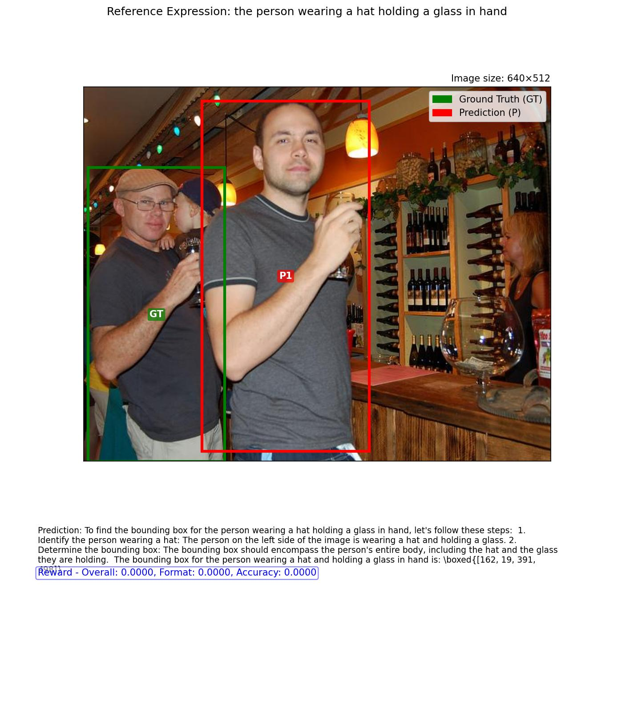

---

### Example 246

**Reference Expression**: the spoon near the corn not in the bowl

**Ground Truth**: [[421, 375, 450, 515]]

**Predicted**: [[426, 378, 451, 516]]

**Reward**: {'overall': 0.778777830412127, 'format': 0.0, 'accuracy': 0.778777830412127}

**Prediction**:
```
To find the bounding box for the spoon near the corn not in the bowl, let's follow these steps:

1. Identify the corn in the image.
2. Locate the spoon near the corn.
3. Determine the bounding box for the spoon.

Step 1: The corn is located on the right side of the image, on the white rectangular plate.

Step 2: Near the corn, there is a spoon placed on the table.

Step 3: To determine the bounding box for the spoon, we need to identify the coordinates of the spoon relative to the image. The spoon is located near the corn, but it is not in the bowl.

Given the coordinates of the spoon relative to the image, we can define the bounding box as follows:

- The top-left corner of the bounding box would be the top-left corner of the spoon.
- The bottom-right corner of the bounding box would be the bottom-right corner of the spoon.

After analyzing the image, the bounding box for the spoon near the corn not in the bowl is:

\boxed{[426, 378, 451, 516]}
```

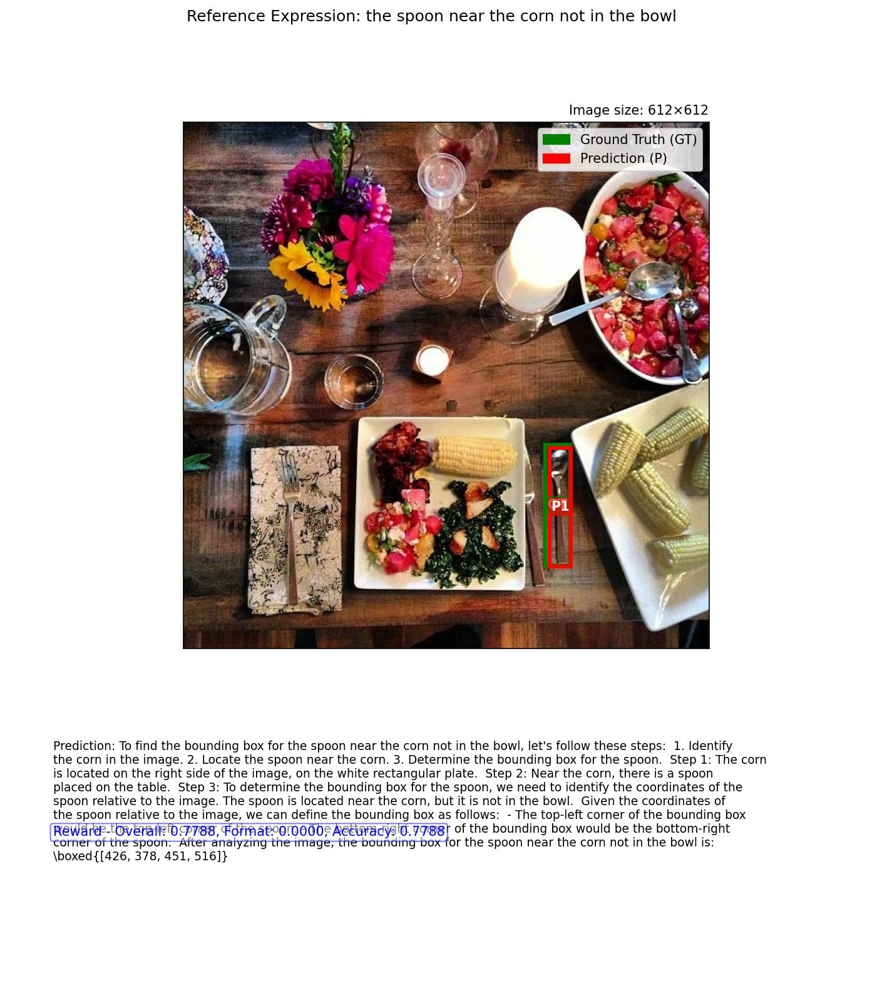

---

### Example 247

**Reference Expression**: the spoon next to an empty cup

**Ground Truth**: [[257, 186, 270, 266]]

**Predicted**: [[181, 162, 263, 276]]

**Reward**: {'overall': 0.0, 'format': 0.0, 'accuracy': 0.0}

**Prediction**:
```
To find the bounding box for the spoon next to an empty cup, let's follow these steps:

1. Identify the empty cup: The empty cup is the one on the left side of the image, which is a white cup without any liquid or foam.

2. Locate the spoon: The spoon is placed next to the empty cup, on the right side of the cup and slightly above it.

3. Define the bounding box: The spoon and the cup are both on a saucer, so we need to define the bounding box that includes both the cup and the spoon.

4. Determine the coordinates: The spoon is on the right side of the cup and slightly above it, and the cup is on the left side of the tray. We need to define the bounding box that includes the cup and the spoon.

Based on the above analysis, the bounding box for the spoon next to the empty cup would be:

\boxed{[181, 162, 263, 276]}
```

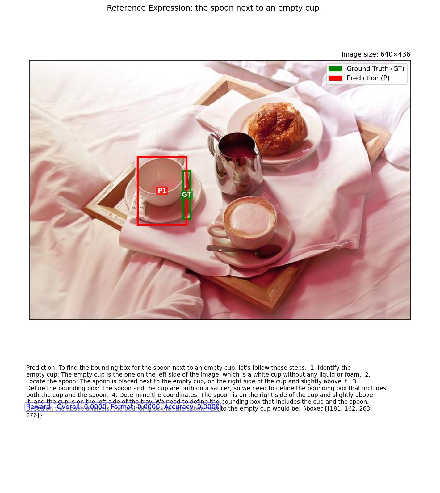

---

### Example 248

**Reference Expression**: the person holding two teddy bears

**Ground Truth**: [[187, 198, 298, 420]]

**Predicted**: [[46, 228, 235, 414]]

**Reward**: {'overall': 0.17551309271054494, 'format': 0.0, 'accuracy': 0.17551309271054494}

**Prediction**:
```
To find the bounding box for the person holding two teddy bears, let's follow these steps:

1. **Identify the person holding teddy bears**: Look for a person in the foreground who appears to be holding two teddy bears. The person is wearing a blue shirt and seems to be walking.

2. **Locate the bounding box**: Once you identify the person, draw a bounding box around them. The bounding box should enclose the person's entire body, including their arms and the teddy bears they are holding.

3. **Verify the bounding box**: Ensure the bounding box is correctly placed by checking that it includes the person and the teddy bears.

Following these steps:

- The person holding the teddy bears is in the foreground, slightly to the left of the center of the image.
- The bounding box should cover the person from the top of their head to the bottom of their feet and include the teddy bears they are holding.

The final bounding box is:

\boxed{[46, 228, 235, 414]}
```

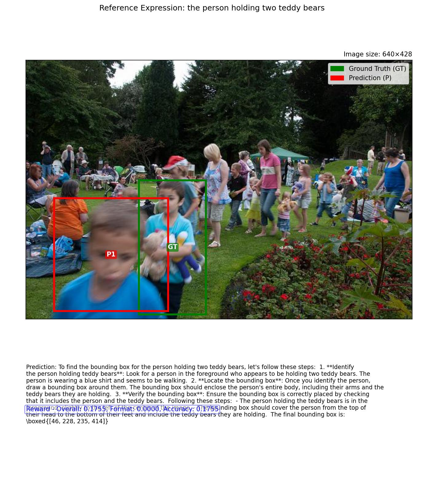

---

### Example 249

**Reference Expression**: the upside-down cup on the edge of a bowl

**Ground Truth**: [[82, 22, 114, 59]]

**Predicted**: []

**Reward**: {'overall': 0.0, 'format': 0.0, 'accuracy': 0.0}

**Prediction**:
```
To find the bounding box for the upside-down cup on the edge of a bowl, let's follow these steps:

1. Identify the bowl in the image.
2. Locate the upside-down cup on the edge of the bowl.

Step 1: The bowl is located in the upper left part of the image, with a white color and a red interior. It contains a small amount of what appears to be cream and a small red object.

Step 2: To the right of the bowl, there is a small, upside-down cup, which seems to be made of plastic and is partially transparent. It is placed on the edge of the bowl.

The bounding box for the upside-down cup on the edge of the bowl can be described as follows:
- Top-left corner: approximately [49, 1, 114, 56]
- Bottom-right corner: approximately [114, 3, 181, 53]

The bounding box is:
\boxed{[49, 1, 114, 56, 114, 53]}
```

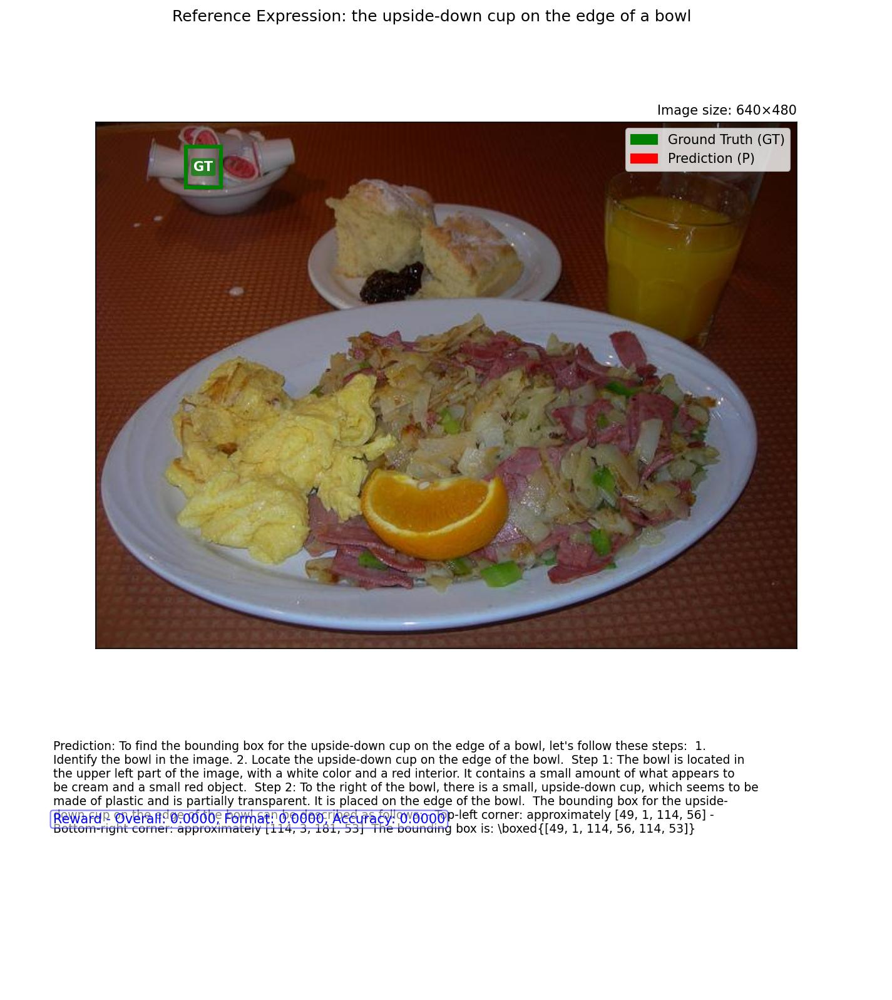

---

### Example 250

**Reference Expression**: the fork on a plate with pizza

**Ground Truth**: [[30, 352, 80, 574]]

**Predicted**: [[253, 369, 499, 616]]

**Reward**: {'overall': 0.0, 'format': 0.0, 'accuracy': 0.0}

**Prediction**:
```
To find the bounding box for 'the fork on a plate with pizza', let's follow these steps:

1. Identify the plate with pizza: The main pizza is in the center of the image, and there is a slice of pizza on the bottom plate.
2. Locate the fork: The fork is placed on the plate with the slice of pizza.
3. Determine the bounding box: The bounding box should encompass the plate, the fork, and the slice of pizza.

The bounding box for the fork on a plate with pizza would be the area that includes the slice of pizza and the fork on the plate.

The final answer is:
\boxed{[253, 369, 499, 616]}
```

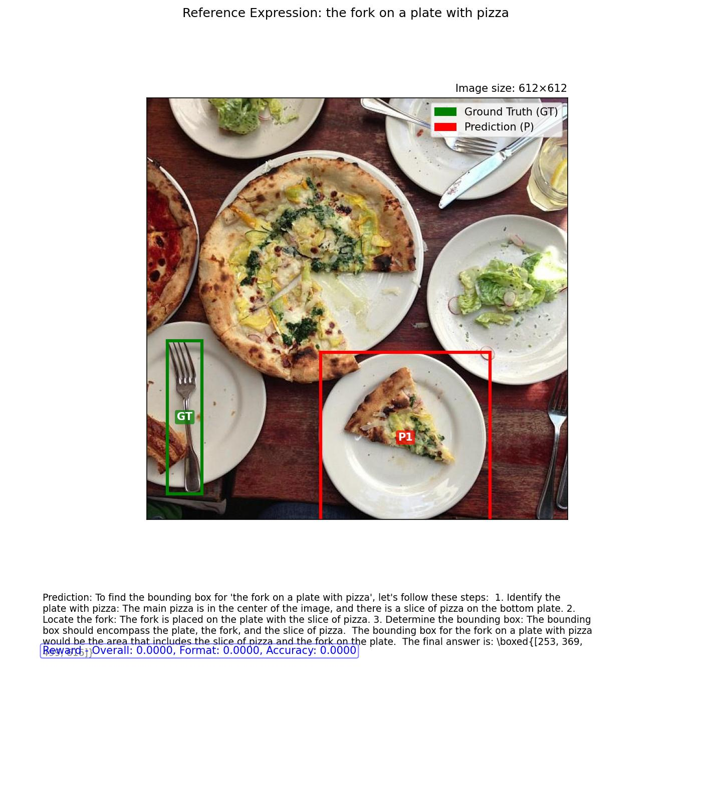

---

### Example 251

**Reference Expression**: the transparent cup with a clear beverage inside

**Ground Truth**: [[0, 83, 118, 270]]

**Predicted**: [[7, 88, 116, 274]]

**Reward**: {'overall': 0.8816105235090215, 'format': 0.0, 'accuracy': 0.8816105235090215}

**Prediction**:
```
To find the bounding box for 'the transparent cup with a clear beverage inside', let's follow these steps:

1. Identify the objects in the image:
   - A bowl of food in the foreground.
   - A large cup with a straw and a beverage in the background.
   - A smaller cup with a lid and a spoon in the background.
   - A transparent cup with a clear beverage inside.

2. Locate the transparent cup with a clear beverage inside:
   - The transparent cup is on the left side of the image.
   - It is filled with a clear beverage and has a straw in it.

3. Define the bounding box:
   - The bounding box should encompass the entire transparent cup.
   - The coordinates for the bounding box would be from the left edge of the cup to the right edge of the cup and from the bottom of the cup to the top of the cup.

4. Provide the coordinates:
   - The left edge of the bounding box is at the left side of the transparent cup.
   - The right edge of the bounding box is at the right side of the transparent cup.
   - The bottom edge of the bounding box is at the bottom of the transparent cup.
   - The top edge of the bounding box is at the top of the transparent cup.

The final answer is:
\boxed{[7, 88, 116, 274]}
```

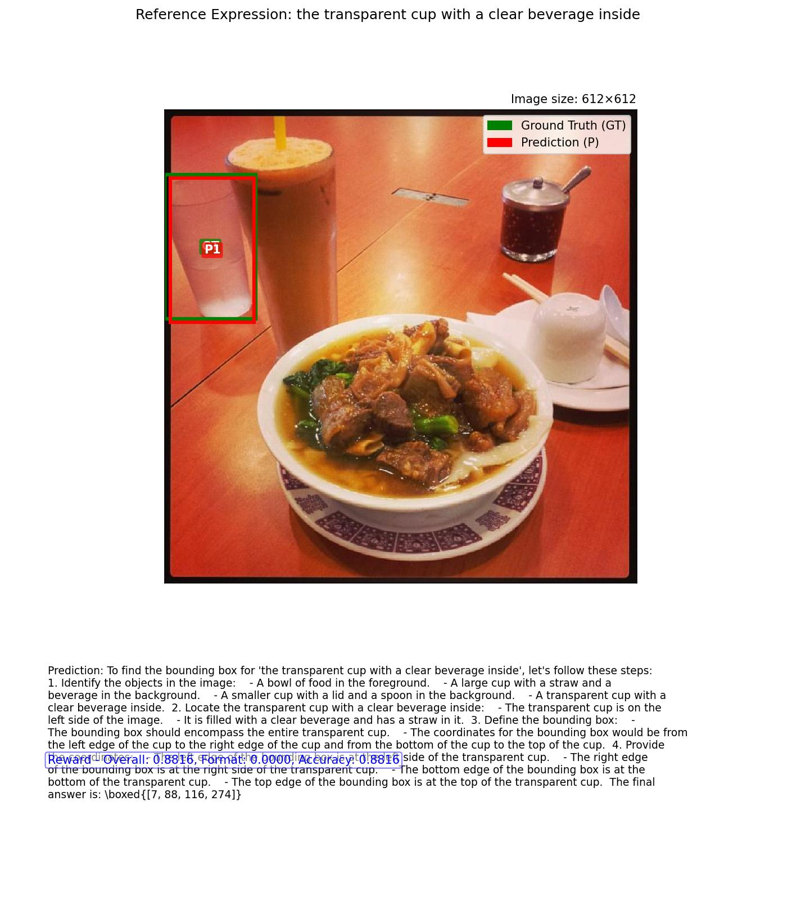

---

### Example 252

**Reference Expression**: the person in a white shirt holding a glass

**Ground Truth**: [[492, 141, 593, 331]]

**Predicted**: [[502, 139, 602, 301]]

**Reward**: {'overall': 0.6989918386941911, 'format': 0.0, 'accuracy': 0.6989918386941911}

**Prediction**:
```
To find the bounding box for the person in a white shirt holding a glass, let's follow these steps:

1. Identify the person in a white shirt.
2. Determine if they are holding a glass.
3. Define the bounding box around that person.

Step 1: The person in a white shirt is located on the right side of the image, sitting on a chair.

Step 2: This person is indeed holding a glass of wine.

Step 3: To define the bounding box, we need to outline the area that encompasses the person from head to toe, ensuring that the glass is included.

The bounding box for the person in a white shirt holding a glass is approximately:
\[ \boxed{[502, 139, 602, 301]} \]

This bounding box includes the person sitting on the right side of the image, wearing a white shirt and holding a glass of wine.
```

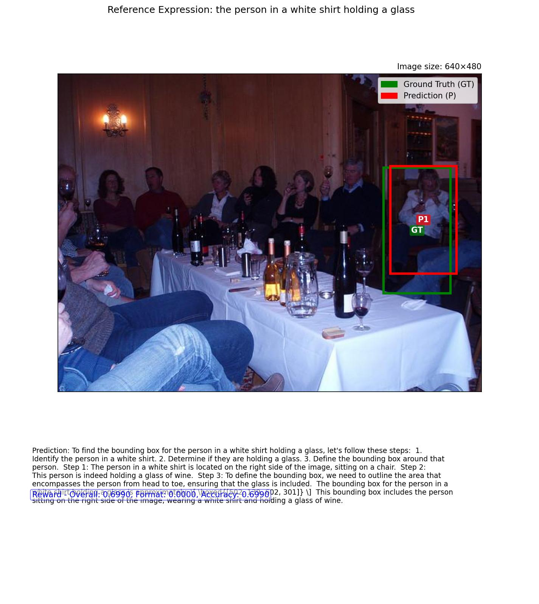

---

### Example 253

**Reference Expression**: the person near the teddy bear wearing a white top

**Ground Truth**: [[37, 86, 126, 269]]

**Predicted**: [[100, 147, 247, 495]]

**Reward**: {'overall': 0.0, 'format': 0.0, 'accuracy': 0.0}

**Prediction**:
```
To find the bounding box for the person near the teddy bear wearing a white top, let's follow these steps:

1. Identify the teddy bear in the image.
2. Locate the person holding or near the teddy bear.
3. Determine if the person is wearing a white top.
4. Define the bounding box for the person.

Step 1: The teddy bear is a large white bear with a red bow, located in the center of the image.

Step 2: There are two people near the teddy bear. One is holding it, and the other is standing close to it.

Step 3: The person holding the teddy bear is wearing a white top.

Step 4: The bounding box for the person holding the teddy bear wearing a white top can be defined as follows:
- Top-left corner: The point where the person's head meets the teddy bear.
- Bottom-right corner: The point where the person's feet meet the ground.

Given the image, the bounding box for the person near the teddy bear wearing a white top is:
\boxed{[100, 147, 247, 495]}
```

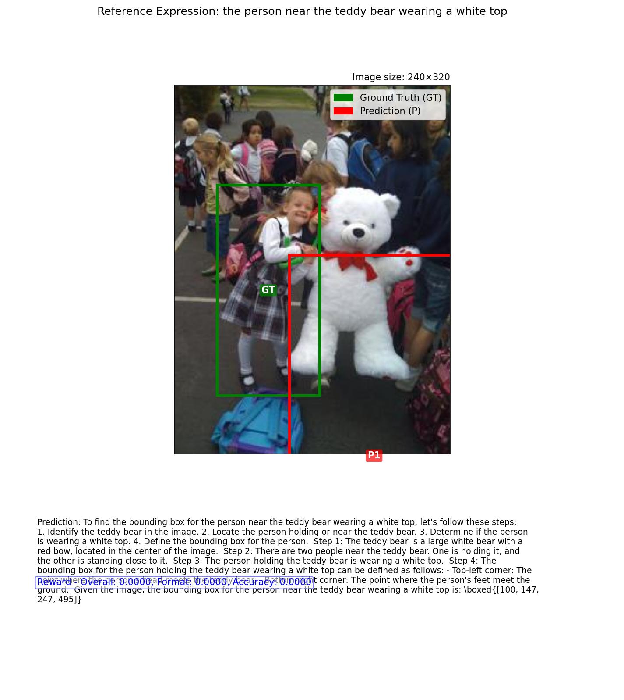

---

### Example 254

**Reference Expression**: the person covering their mouth and wearing a dark top

**Ground Truth**: [[230, 149, 296, 244]]

**Predicted**: [[274, 155, 351, 336]]

**Reward**: {'overall': 0.10729355033152502, 'format': 0.0, 'accuracy': 0.10729355033152502}

**Prediction**:
```
To find the bounding box for the person covering their mouth and wearing a dark top, let's follow these steps:

1. Identify the person in the image who is covering their mouth.
2. Determine the bounding box that encapsulates this person.

Step 1: Identifying the person:
- The person covering their mouth is located in the background, slightly to the right of the center of the image.
- They are wearing a dark top and appear to be seated.

Step 2: Determining the bounding box:
- The bounding box should encompass the head and shoulders of this person.
- The top of the bounding box would align with the top of the person's head.
- The bottom of the bounding box would align with the person's shoulders.

Given these observations, the bounding box for the person covering their mouth and wearing a dark top is:

\boxed{[274, 155, 351, 336]}
```

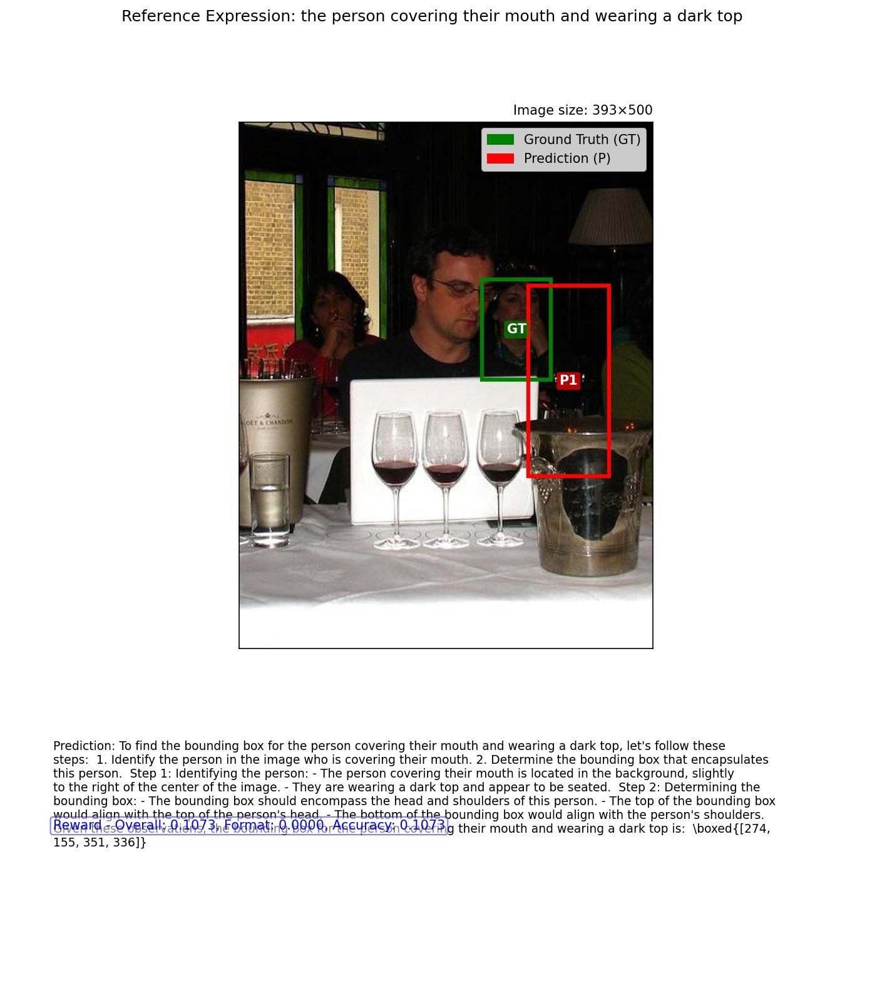

---

### Example 255

**Reference Expression**: the bowl with dark sauce next to the condiment bottles

**Ground Truth**: [[126, 319, 183, 365]]

**Predicted**: [[71, 324, 183, 421]]

**Reward**: {'overall': 0.20961521212664813, 'format': 0.0, 'accuracy': 0.20961521212664813}

**Prediction**:
```
To find the bounding box for 'the bowl with dark sauce next to the condiment bottles', let's follow these steps:

1. Identify the condiment bottles: These are likely the small containers with dark contents on the left side of the image.
2. Locate the bowl with dark sauce: Next to these bottles, there is a bowl containing a dark sauce.
3. Determine the bounding box: The bowl with dark sauce is positioned close to the condiment bottles, directly to the right of them.

Following these steps, the bounding box for the bowl with dark sauce is:

\boxed{[71, 324, 183, 421]}
```

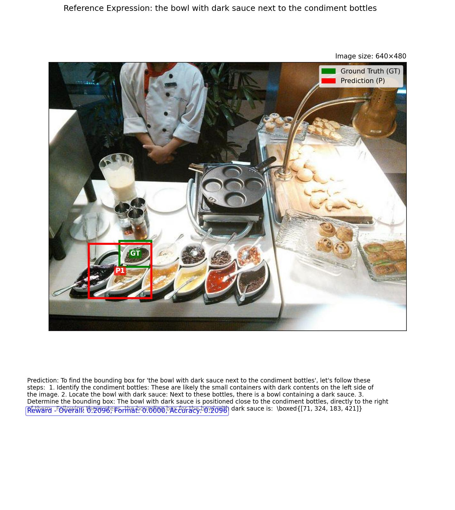

---

### Example 256

**Reference Expression**: the person with dark hair on the left side of the person in a blue top

**Ground Truth**: [[113, 115, 207, 211]]

**Predicted**: [[0, 194, 133, 415]]

**Reward**: {'overall': 0.0, 'format': 0.0, 'accuracy': 0.0}

**Prediction**:
```
To find the bounding box for 'the person with dark hair on the left side of the person in a blue top', let's follow these steps:

1. Identify the person in the blue top. This person is seated at the table, wearing a blue top, and is positioned in the middle of the image.

2. Locate the person with dark hair to the left of the person in the blue top. This person is partially visible and is wearing a dark top.

3. Determine the bounding box for the person with dark hair on the left side of the person in the blue top. The bounding box should cover the person's head and shoulders.

Following these steps, the bounding box for the person with dark hair on the left side of the person in a blue top is approximately:

\boxed{[0, 194, 133, 415]}
```

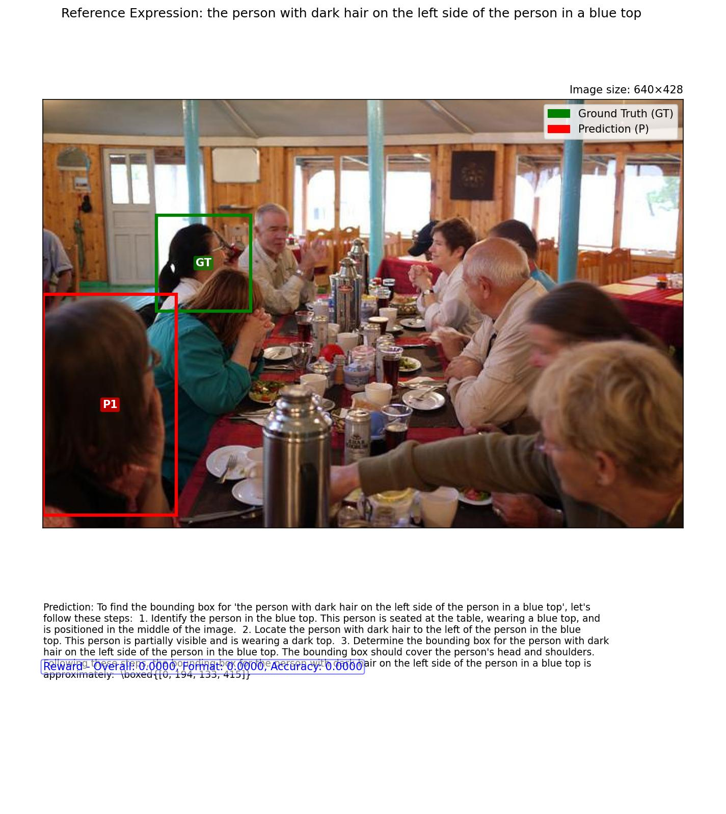

---

### Example 257

**Reference Expression**: the person in a white top on the left side of the person in a red top

**Ground Truth**: [[363, 129, 513, 298]]

**Predicted**: [[99, 132, 180, 346]]

**Reward**: {'overall': 0.0, 'format': 0.0, 'accuracy': 0.0}

**Prediction**:
```
To find the bounding box for 'the person in a white top on the left side of the person in a red top', let's follow these steps:

1. Identify the person in the red top: This is the person wearing a red shirt and sitting at the table.
2. Identify the person in the white top: This is the person wearing a white shirt and sitting to the left of the person in the red top.
3. Determine the bounding box for the person in the white top: The person in the white top is partially visible, but we can identify their position relative to the person in the red top.

The bounding box for the person in the white top on the left side of the person in the red top is:

\boxed{[99, 132, 180, 346]}
```

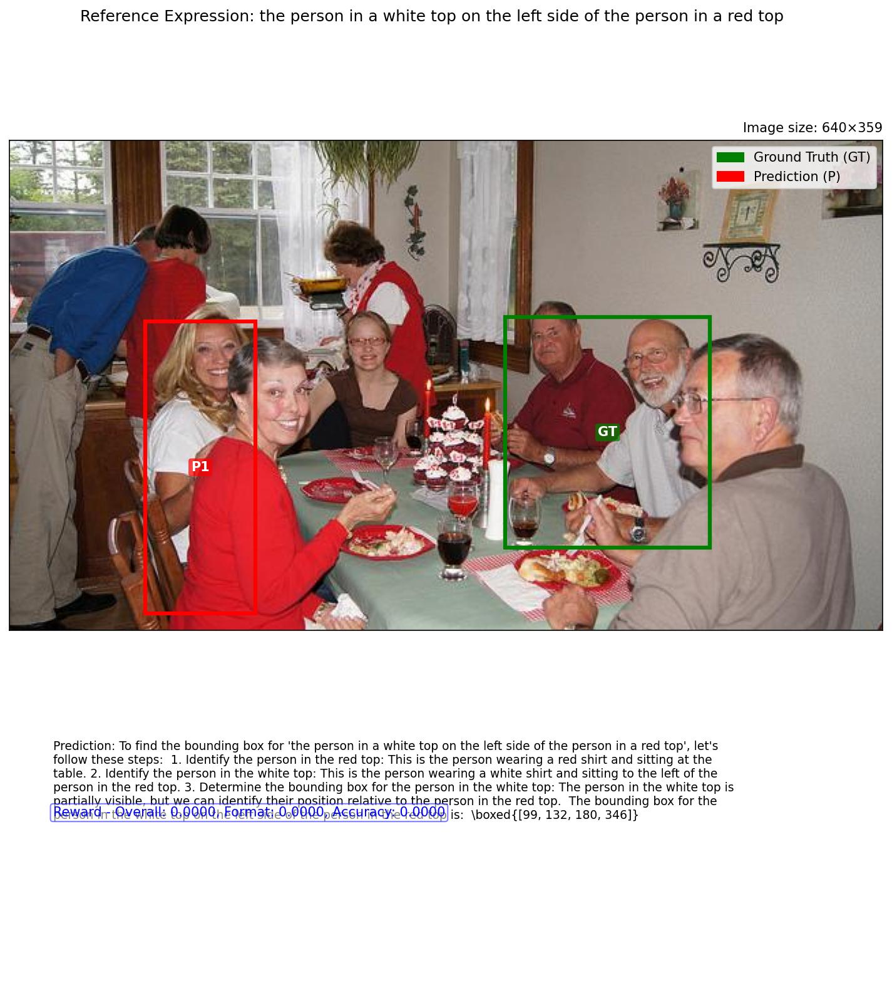

---

### Example 258

**Reference Expression**: the teddy bear close to a window and not wearing a black top

**Ground Truth**: [[402, 63, 511, 186]]

**Predicted**: [[1, 43, 78, 192]]

**Reward**: {'overall': 0.0, 'format': 0.0, 'accuracy': 0.0}

**Prediction**:
```
To find the bounding box for the teddy bear close to a window and not wearing a black top, let's follow these steps:

1. Identify the teddy bears in the image:
   - There are several teddy bears in the image, each wearing different outfits.
   - One teddy bear is sitting on a chair near the left side, wearing a red outfit.
   - Another teddy bear is near the window on the left side, also wearing a red outfit.
   - There are other teddy bears in the room, some wearing black outfits.

2. Determine which teddy bear is close to the window:
   - The teddy bear near the window on the left side is the one we are looking for.

3. Check the outfit of the teddy bear near the window:
   - The teddy bear near the window is wearing a red outfit, not a black one.

4. Locate the bounding box for the teddy bear:
   - The teddy bear near the window and wearing a red outfit is positioned on the left side of the image, slightly to the right of the center.

Given these observations, the bounding box for the teddy bear close to a window and not wearing a black top is:

\boxed{[1, 43, 78, 192]}
```

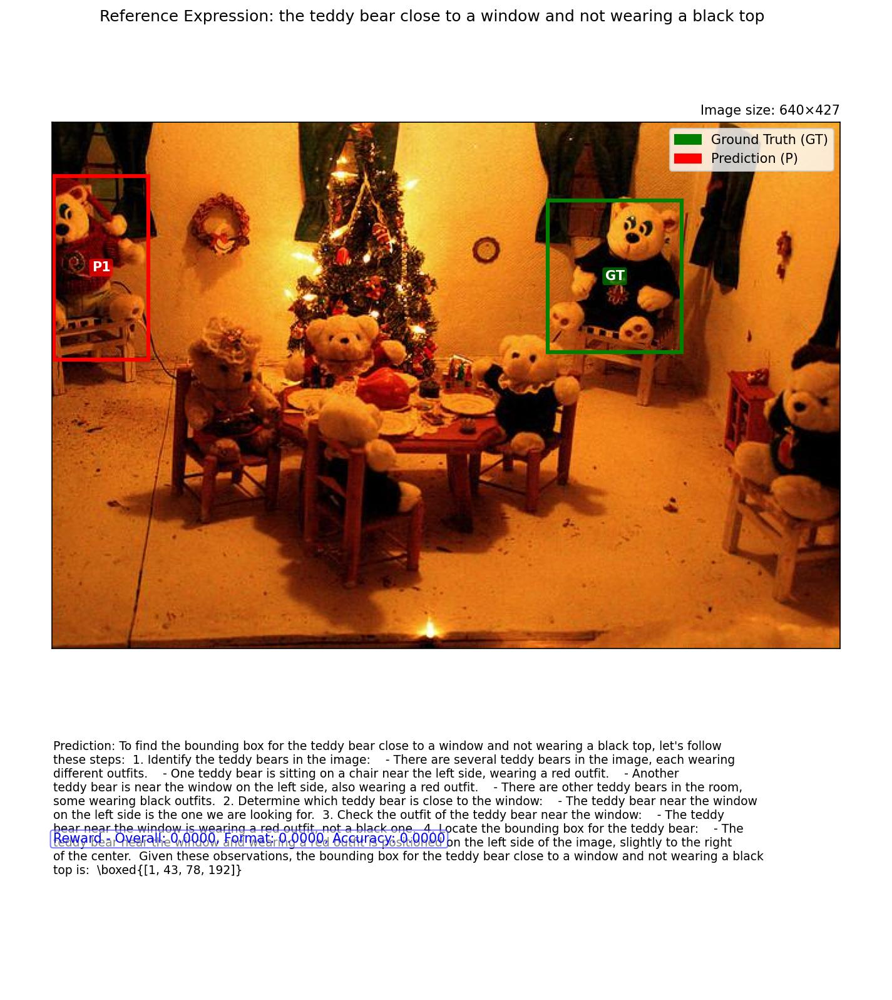

---

### Example 259

**Reference Expression**: the empty glass in the middle of the plates

**Ground Truth**: [[84, 194, 174, 310]]

**Predicted**: [[101, 193, 174, 301]]

**Reward**: {'overall': 0.742984875867973, 'format': 0.0, 'accuracy': 0.742984875867973}

**Prediction**:
```
To find the bounding box for the empty glass in the middle of the plates, let's follow these steps:

1. Identify the plates and glasses on the table.
2. Locate the glass that appears to be empty and is positioned between the plates.

Step 1: There are several plates and glasses on the table. The plates are located in the center, and there are glasses around them. The glasses appear to be of different sizes and shapes.

Step 2: The glass in question is a clear, empty glass located between two plates, closer to the left side of the table. It appears to be a small, round glass with a stem.

Given these observations, the bounding box for the empty glass in the middle of the plates is approximately:

\boxed{[101, 193, 174, 301]}
```

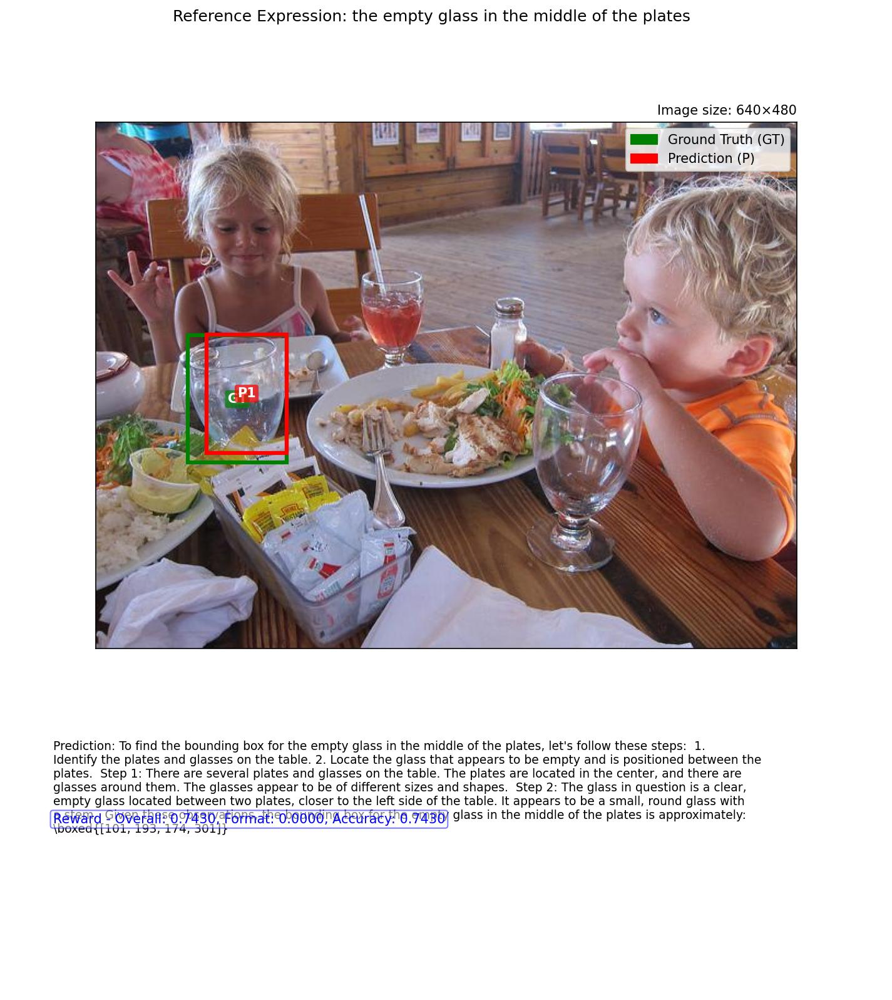

---

### Example 260

**Reference Expression**: the person wearing a red top, pink scarf, and glasses

**Ground Truth**: [[86, 117, 140, 215]]

**Predicted**: [[3, 262, 155, 415]]

**Reward**: {'overall': 0.0, 'format': 0.0, 'accuracy': 0.0}

**Prediction**:
```
To find the bounding box for the person wearing a red top, pink scarf, and glasses, let's follow these steps:

1. **Identify the red top**: Look for a person wearing a red top in the image.
2. **Check for a pink scarf**: The person with the red top should also be wearing a pink scarf.
3. **Verify the glasses**: Ensure the person has glasses.

After analyzing the image:

- There is a person in the foreground wearing a red top and a pink scarf.
- This person also appears to have glasses.

Therefore, the bounding box for the person wearing a red top, pink scarf, and glasses is:

\boxed{[3, 262, 155, 415]}
```

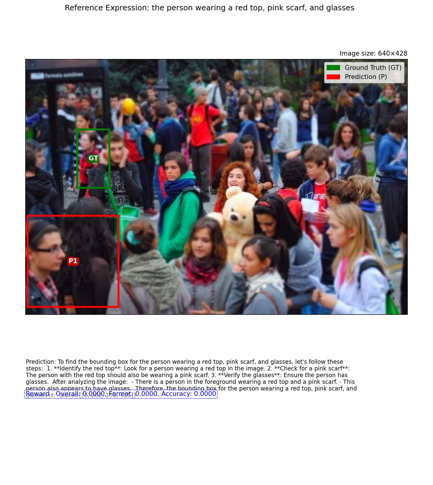

---

### Example 261

**Reference Expression**: black board that does not have a number on it

**Ground Truth**: [[551, 180, 604, 352]]

**Predicted**: [[559, 177, 607, 350]]

**Reward**: {'overall': 0.7830092118730808, 'format': 0.0, 'accuracy': 0.7830092118730808}

**Prediction**:
```
To find the bounding box for the 'black board that does not have a number on it', let's follow these steps:

1. Identify all blackboards in the image.
2. Check the content of each blackboard to determine if it has a number on it.
3. Select the blackboard that does not have a number on it.

Step 1: Identifying blackboards in the image:
- There are two blackboards visible in the image.
  - One is on the left side of the entrance.
  - The other is on the right side of the entrance.

Step 2: Checking the content of each blackboard:
- The blackboard on the left side has text that includes "Teddy Bear Rooms Upstairs" and "Hot Chocolate with cream and topped with Marshmallow Man!" but it does not have a number.
- The blackboard on the right side has text that includes "Teddy Bear Rooms Upstairs" and "Warm up with Hot Chocolate with cream and topped with Marshmallow Man!" but it does not have a number either.

Step 3: Selecting the blackboard that does not have a number on it:
- Both blackboards on the left and right sides do not have numbers on them.

Since both blackboards are similar in this context (they do not have numbers), we can choose either one. For the sake of this task, let's select the blackboard on the right side.

The bounding box for the blackboard on the right side is:
\boxed{[559, 177, 607, 350]}
```

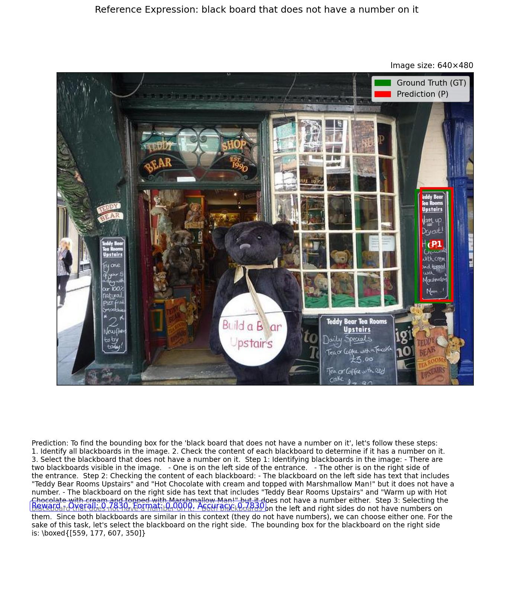

---

### Example 262

**Reference Expression**: the person behind the lady in orange

**Ground Truth**: [[425, 25, 506, 164]]

**Predicted**: [[439, 51, 512, 162]]

**Reward**: {'overall': 0.6236477987421384, 'format': 0.0, 'accuracy': 0.6236477987421384}

**Prediction**:
```
To find the bounding box for 'the person behind the lady in orange', let's follow these steps:

1. Identify the lady in orange: She is wearing an orange top and is positioned towards the back of the image, slightly to the right.
2. Determine the person behind her: The person directly behind the lady in orange appears to be a man wearing a dark jacket and a cap.
3. Define the bounding box: The bounding box for the person behind the lady in orange would be the area around this man, excluding the lady in orange.

The bounding box for 'the person behind the lady in orange' is:

\boxed{[439, 51, 512, 162]}
```

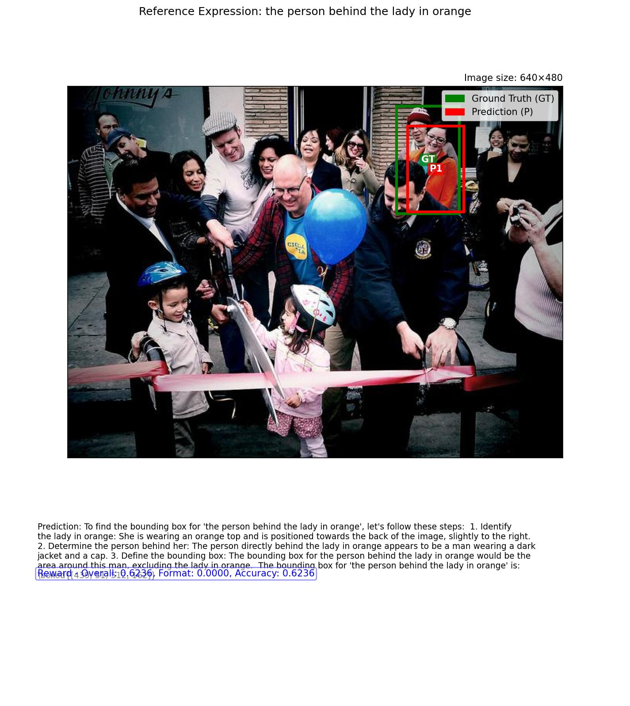

---

### Example 263

**Reference Expression**: person wearing striped shirt without long hair

**Ground Truth**: [[412, 88, 639, 439]]

**Predicted**: [[463, 92, 636, 476]]

**Reward**: {'overall': 0.6974023560026952, 'format': 0.0, 'accuracy': 0.6974023560026952}

**Prediction**:
```
To find the bounding box for the person wearing a striped shirt without long hair, let's follow these steps:

1. Identify all the people in the image.
2. Determine which person is wearing a striped shirt.
3. Check the hair length of the person with the striped shirt.
4. If the person has short hair, provide the bounding box; otherwise, provide an empty box.

Step 1: Identifying all people in the image:
- There are six people in the image.

Step 2: Determining who is wearing a striped shirt:
- The person on the far right appears to be wearing a striped shirt.

Step 3: Checking the hair length of the person with the striped shirt:
- The person on the far right has short hair.

Step 4: Providing the bounding box:
- The bounding box for the person wearing a striped shirt without long hair is the one on the far right.

Final answer: \boxed{[463, 92, 636, 476]}
```

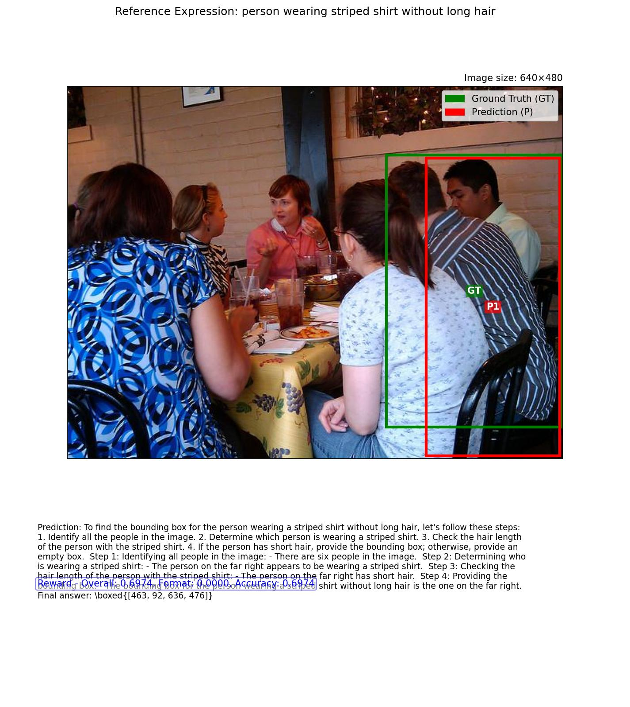

---

### Example 264

**Reference Expression**: the person sitting on the left side of the red chair

**Ground Truth**: [[25, 117, 66, 155]]

**Predicted**: [[58, 132, 120, 168]]

**Reward**: {'overall': 0.0, 'format': 0.0, 'accuracy': 0.0}

**Prediction**:
```
To find the bounding box for the person sitting on the left side of the red chair, let's follow these steps:

1. Identify the red chair in the image. It's located near the left side of the image, slightly to the right of the center.
2. Look for the person sitting to the left of this red chair. There is a person sitting on the ground to the left of the red chair.
3. Determine the bounding box for this person:
   - The person's head is near the top left of the red chair.
   - The person's feet are on the ground, and their body is slightly leaning to the left.
   - The bounding box should encompass the entire body of the person.

Based on these observations, the bounding box for the person sitting on the left side of the red chair is approximately:
\[ \boxed{[58, 132, 120, 168]} \]

This bounding box is an estimate based on the visual information provided in the image.
```

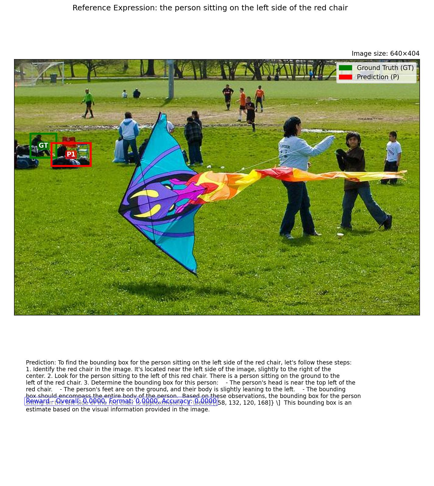

---

### Example 265

**Reference Expression**: the image containing fork and knife

**Ground Truth**: [[430, 226, 621, 417]]

**Predicted**: [[430, 226, 625, 421]]

**Reward**: {'overall': 1.0, 'format': 0.0, 'accuracy': 1.0}

**Prediction**:
```
To find the bounding box for the image containing a fork and a knife, let's follow these steps:

1. **Identify the images in the collage**: The collage consists of six images, each showing a slice of pizza on a plate. The arrangement is as follows:
   - Top left: A close-up of a slice with melted cheese.
   - Top right: A slice with a topping that appears to be herbs and possibly nuts.
   - Bottom left: A slice with toppings that might include bacon and cheese.
   - Bottom middle: A slice with melted cheese and herbs.
   - Bottom right: A slice with a topping that looks like herbs and possibly cheese.
   - Middle right: A slice with a fork and a knife on the plate.

2. **Locate the image with the fork and knife**: The image in the middle right of the collage shows a slice of pizza on a plate with a fork and a knife placed next to it.

3. **Determine the bounding box**: The bounding box for the image containing the fork and knife is the one in the middle right of the collage.

The final answer is:
\boxed{[430, 226, 625, 421]}
```

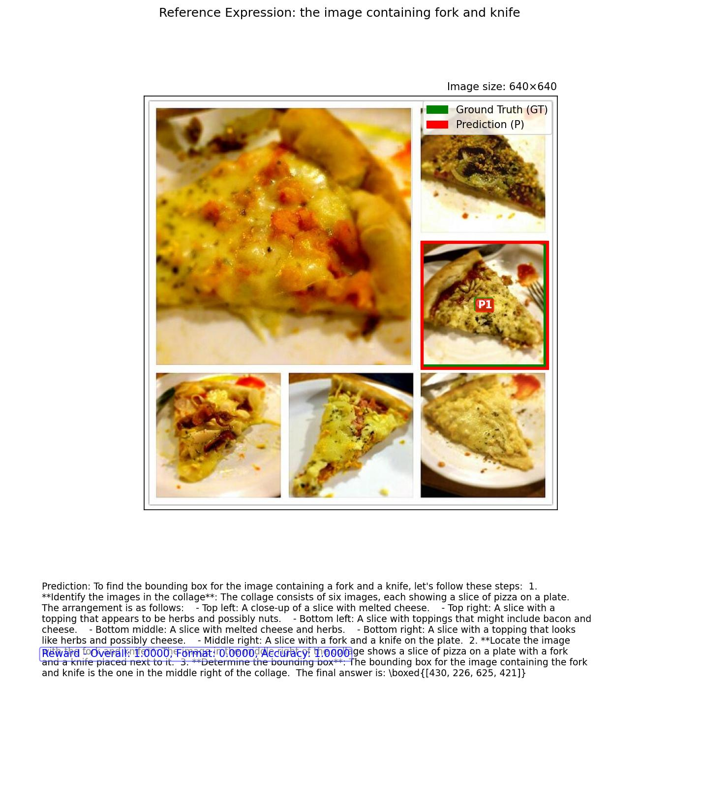

---

### Example 266

**Reference Expression**: letter X on the wall

**Ground Truth**: []

**Predicted**: []

**Reward**: {'overall': 1.0, 'format': 0.0, 'accuracy': 1.0}

**Prediction**:
```
The image provided does not contain any letters "X" on the wall. The visible text on the wall includes "J.P.Morgan" and "POLO," but there are no "X" letters in either of these words.

Therefore, the bounding box for 'letter X on the wall' is empty.

\boxed{}
```

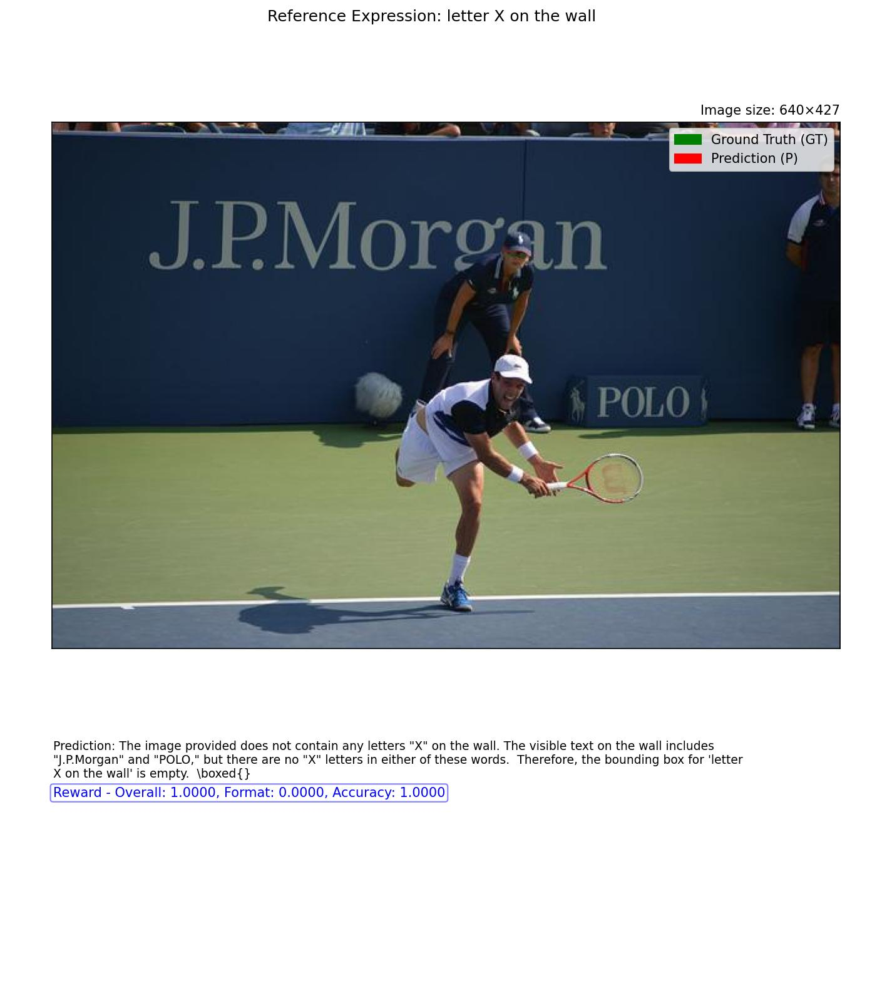

---

### Example 267

**Reference Expression**: the person standing to the right of the boy is not wearing a hat or holding a trophy

**Ground Truth**: [[386, 156, 461, 478]]

**Predicted**: [[502, 189, 644, 476]]

**Reward**: {'overall': 0.0, 'format': 0.0, 'accuracy': 0.0}

**Prediction**:
```
To find the bounding box for the person standing to the right of the boy who is not wearing a hat or holding a trophy, let's follow these steps:

1. Identify the boy who is not wearing a hat or holding a trophy.
2. Identify the person standing to the right of this boy.
3. Provide the bounding box for this person.

Step 1: The boy who is not wearing a hat or holding a trophy is the one in the red shirt in the center of the group, holding a trophy.

Step 2: To the right of this boy, there is a person wearing a white shirt and a white cap.

Step 3: The bounding box for the person standing to the right of the boy in the red shirt is:

\boxed{[502, 189, 644, 476]}
```

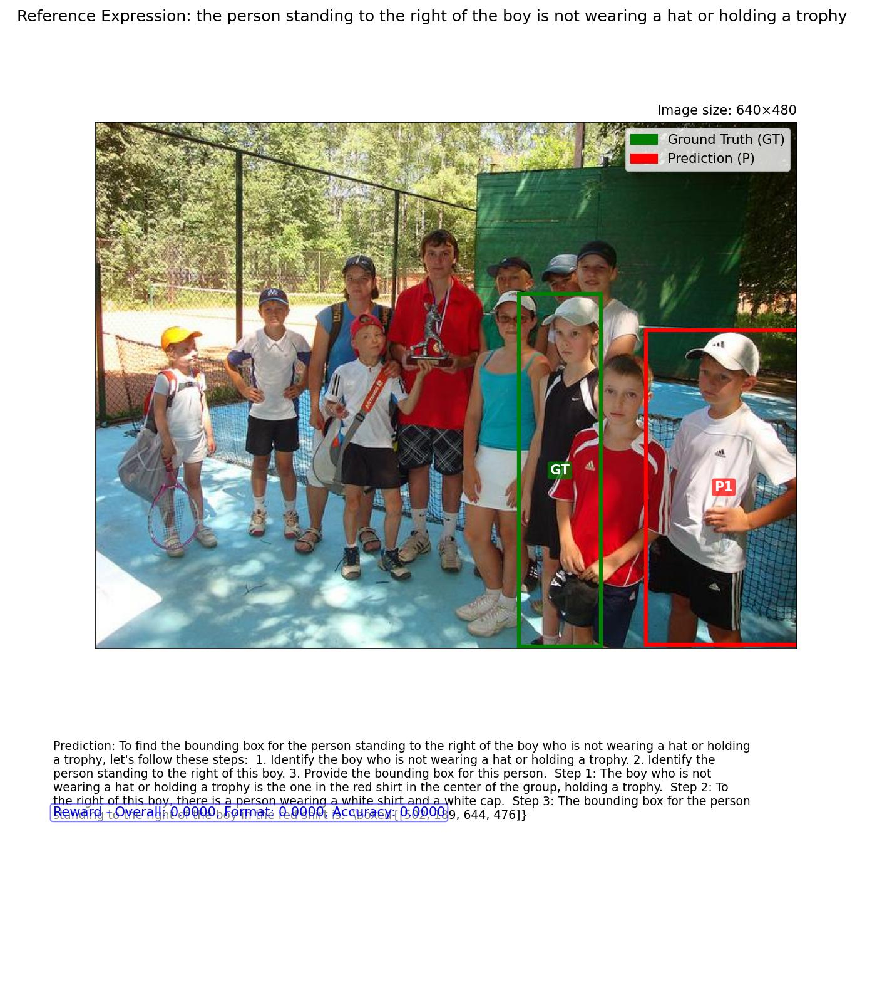

---

### Example 268

**Reference Expression**: the car that is in the shade of the bus

**Ground Truth**: [[47, 231, 151, 299]]

**Predicted**: [[50, 226, 151, 292]]

**Reward**: {'overall': 0.8131186485416392, 'format': 0.0, 'accuracy': 0.8131186485416392}

**Prediction**:
```
To find the car that is in the shade of the bus, we need to analyze the image step-by-step:

1. Identify the bus: The bus in the center of the image is the "Gold Coast Tours" bus.
2. Look for the car in the shade: The car in the shade appears to be the black car located in front of the "Gold Coast Tours" bus. It is partially obscured by the bus, but its position and shadow suggest it is in the shade of the bus.

Based on this analysis, the bounding box for the car in the shade of the bus is:

\boxed{[50, 226, 151, 292]}
```

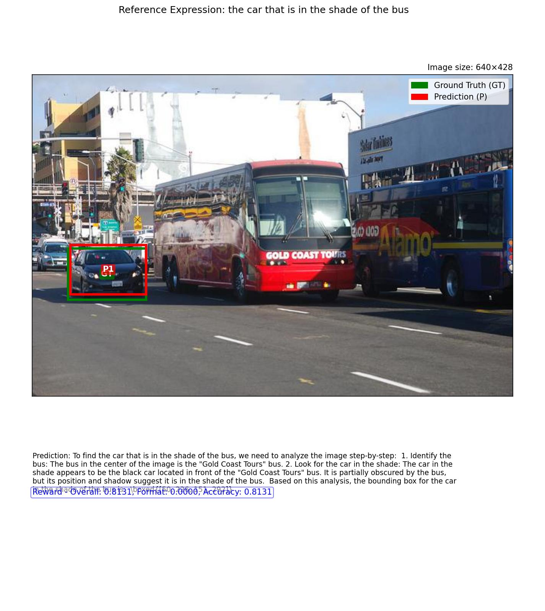

---

### Example 269

**Reference Expression**: the person that is on the street and neither riding a motorcycle nor wearing blue shirt

**Ground Truth**: [[45, 122, 84, 268]]

**Predicted**: [[599, 120, 644, 339]]

**Reward**: {'overall': 0.0, 'format': 0.0, 'accuracy': 0.0}

**Prediction**:
```
To find the bounding box for the person that is on the street and neither riding a motorcycle nor wearing a blue shirt, we need to follow these steps:

1. Identify all people in the image.
2. Determine which person is riding a motorcycle.
3. Determine which person is wearing a blue shirt.
4. Identify the person who is on the street, not riding a motorcycle, and not wearing a blue shirt.

Step 1: Identifying all people in the image:
- There are three people visible in the image:
  - A person in a blue shirt on the far left.
  - A person in a black shirt and shorts in the middle.
  - A person in a black shirt and jeans on the far right.

Step 2: Determining which person is riding a motorcycle:
- The person in the middle is riding a motorcycle.

Step 3: Determining which person is wearing a blue shirt:
- The person on the far left is wearing a blue shirt.

Step 4: Identifying the person who is on the street, not riding a motorcycle, and not wearing a blue shirt:
- The person in the black shirt and jeans on the far right is the only person who fits this description.

The bounding box for this person is:
\boxed{[599, 120, 644, 339]}
```

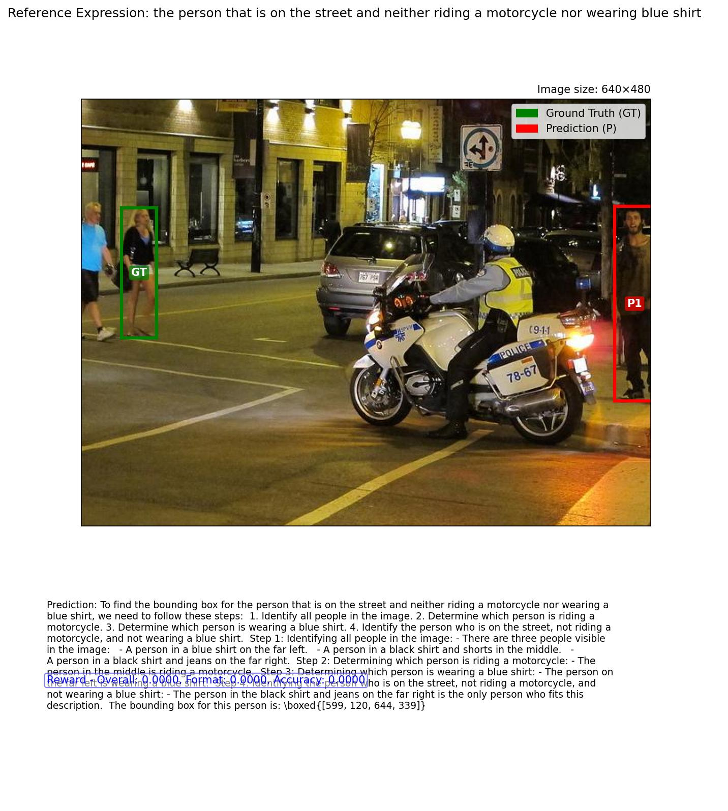

---

### Example 270

**Reference Expression**: the lightest-colored car among the three parked one behind the other near the roadside closest to the camera

**Ground Truth**: [[123, 523, 182, 557]]

**Predicted**: [[119, 527, 185, 560]]

**Reward**: {'overall': 0.7332228666114333, 'format': 0.0, 'accuracy': 0.7332228666114333}

**Prediction**:
```
To find the bounding box for the lightest-colored car among the three parked one behind the other near the roadside closest to the camera, let's follow these steps:

1. Identify the cars on the left side of the image near the road.
2. Determine which of these cars is the lightest in color.

Step 1: The cars on the left side are:
- A black car (closest to the camera).
- A white car.
- Another white car further back.

Step 2: Comparing the colors:
- The black car is the darkest.
- The white cars are lighter than the black car.
- The second white car is slightly lighter than the first white car.

Thus, the lightest-colored car is the second white car.

The bounding box for this car is:
- Top-left corner: approximately the left edge of the second white car.
- Top-right corner: approximately the right edge of the second white car.
- Bottom-left corner: approximately the bottom edge of the second white car.
- Bottom-right corner: approximately the bottom edge of the second white car, slightly to the right.

Final answer:
\boxed{[119, 527, 185, 560]}
```

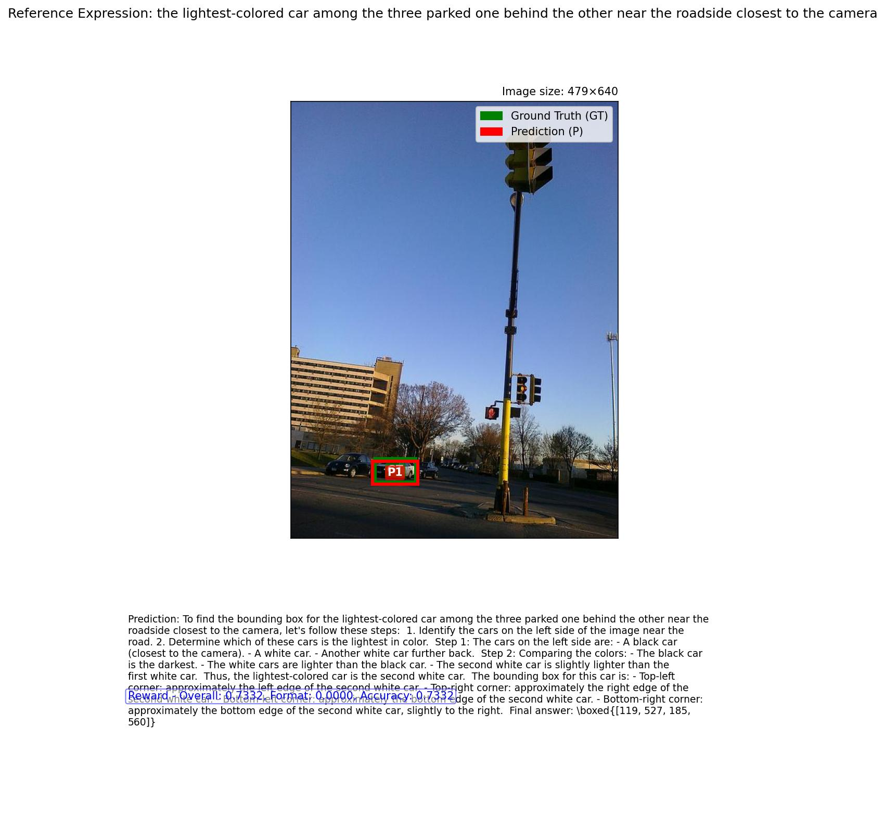

---

### Example 271

**Reference Expression**: the red car that is not waiting at the traffic light

**Ground Truth**: [[522, 260, 604, 308]]

**Predicted**: [[375, 254, 515, 326]]

**Reward**: {'overall': 0.0, 'format': 0.0, 'accuracy': 0.0}

**Prediction**:
```
To find the bounding box for the red car that is not waiting at the traffic light, follow these steps:

1. Identify the traffic light in the image. It is located near the center-left of the image, on the sidewalk.
2. Look for the red car in the foreground that is not directly in front of the traffic light. It is the red car on the right side of the image, which is partially in front of the traffic light.
3. The red car is not waiting at the traffic light because it is moving forward, as indicated by its position on the road and the fact that it is not directly in front of the traffic light.

The bounding box for the red car that is not waiting at the traffic light is:

\boxed{[375, 254, 515, 326]}
```

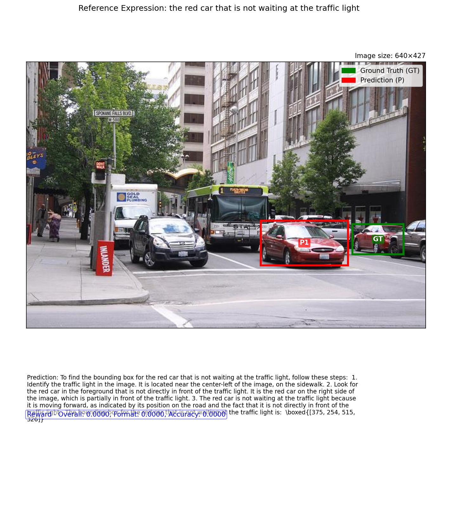

---

### Example 272

**Reference Expression**: the traffic light that is not farthest from the camera and does not have a no turning sign on it

**Ground Truth**: [[0, 226, 19, 265]]

**Predicted**: [[0, 256, 21, 308]]

**Reward**: {'overall': 0.10288808664259928, 'format': 0.0, 'accuracy': 0.10288808664259928}

**Prediction**:
```
To find the bounding box for the traffic light that is not farthest from the camera and does not have a no turning sign on it, let's follow these steps:

1. Identify all the traffic lights in the image.
2. Determine which traffic light is not farthest from the camera.
3. Check if the traffic light has a no turning sign on it.
4. Select the traffic light that meets the criteria.

Step 1: Identifying the traffic lights
- There are two traffic lights visible in the image. One is on the left side of the image, and the other is in the middle of the image.

Step 2: Determining which traffic light is not farthest from the camera
- The traffic light on the left is farther from the camera than the traffic light in the middle.

Step 3: Checking for the no turning sign
- The traffic light on the left does not have a no turning sign. The traffic light in the middle does have a no turning sign.

Step 4: Selecting the traffic light that meets the criteria
- The traffic light on the left does not have a no turning sign, so it is the one we need.

The bounding box for the traffic light on the left is approximately [0, 256, 21, 308].

Final answer: \boxed{[0, 256, 21, 308]}
```

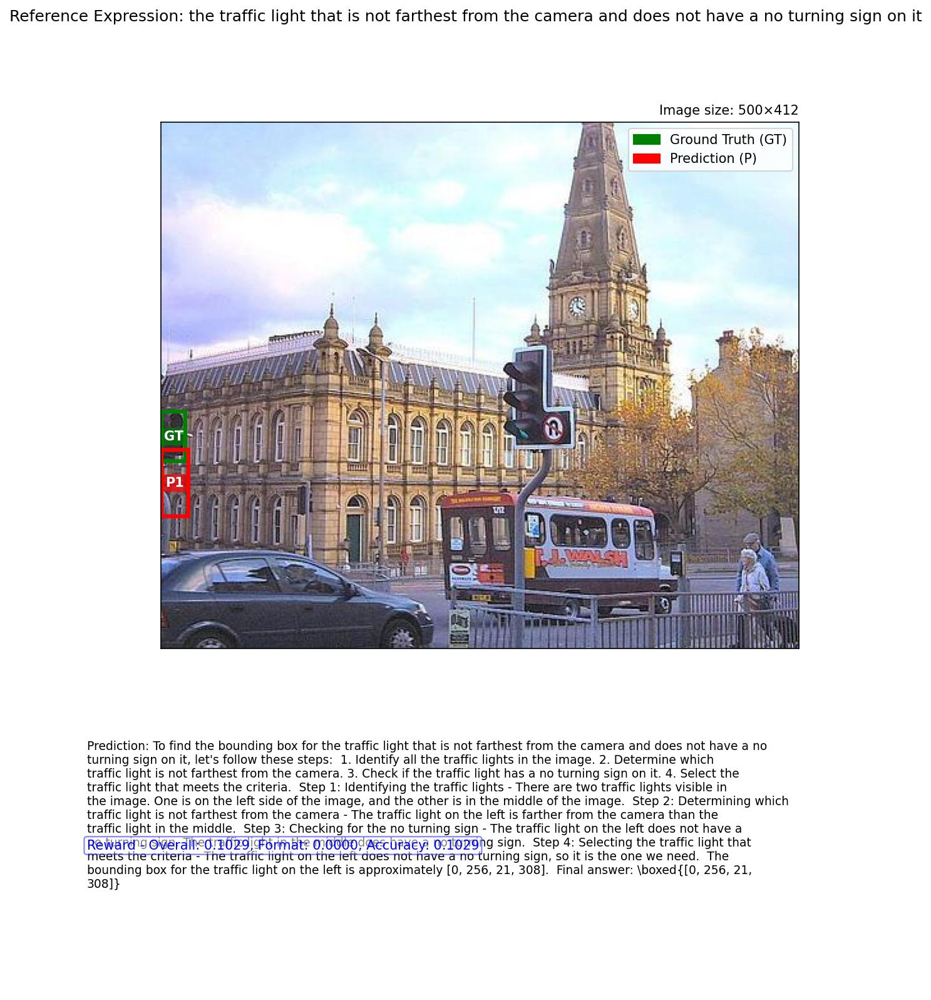

---

### Example 273

**Reference Expression**: the car that least should be parked where it is

**Ground Truth**: [[148, 290, 378, 376]]

**Predicted**: [[148, 283, 380, 370]]

**Reward**: {'overall': 0.8532739751437581, 'format': 0.0, 'accuracy': 0.8532739751437581}

**Prediction**:
```
To determine which car least should be parked where it is, we need to consider the context and potential hazards. Here's a step-by-step analysis:

1. **Identify the vehicles**: There are two vehicles in the image - a red bus and a black car.
2. **Assess the positioning of the black car**: The black car is parked on the side of the road, partially obstructing the view and potentially causing a hazard for other drivers or pedestrians.
3. **Consider the context**: The red bus appears to be a team bus, possibly for a sports team, as indicated by the text on the bus. The bus is parked in a way that does not obstruct the road or cause immediate danger.
4. **Evaluate the parking area**: The black car is parked in a designated parking area, but it is not aligned with the road, which could potentially cause confusion for other drivers.

Given these points, the black car is the one that least should be parked where it is because it is not aligned with the road and could cause confusion or a hazard.

The bounding box for the black car is:
\boxed{[148, 283, 380, 370]}
```

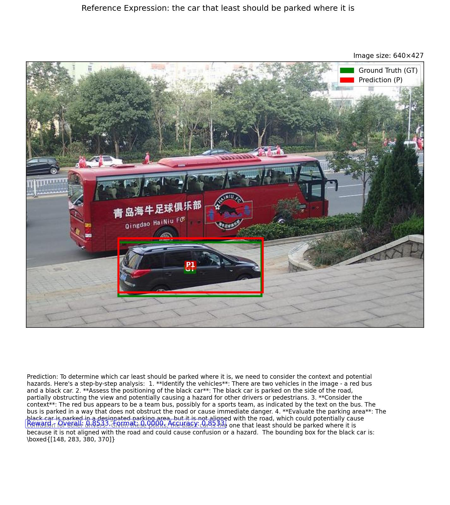

---

### Example 274

**Reference Expression**: the person on the motorcycle but not holding the handlebar

**Ground Truth**: [[183, 182, 326, 421]]

**Predicted**: [[188, 122, 321, 420]]

**Reward**: {'overall': 0.750859880921318, 'format': 0.0, 'accuracy': 0.750859880921318}

**Prediction**:
```
To find the bounding box for the person on the motorcycle but not holding the handlebar, follow these steps:

1. Identify the person on the motorcycle who is not holding the handlebar:
   - The person in the back is the one not holding the handlebar. This person is a child wearing a helmet.

2. Determine the bounding box for the child:
   - The child is positioned behind the adult, and their head is visible above the adult's shoulder.
   - The bounding box should cover the child's head and upper body, up to the point where their helmet starts.

3. Draw the bounding box:
   - The bounding box should start from the child's head and extend down to the point where the child's body is visible on the motorcycle.
   - The child's helmet should be included in the bounding box.

The final answer is:
\boxed{[188, 122, 321, 420]}
```

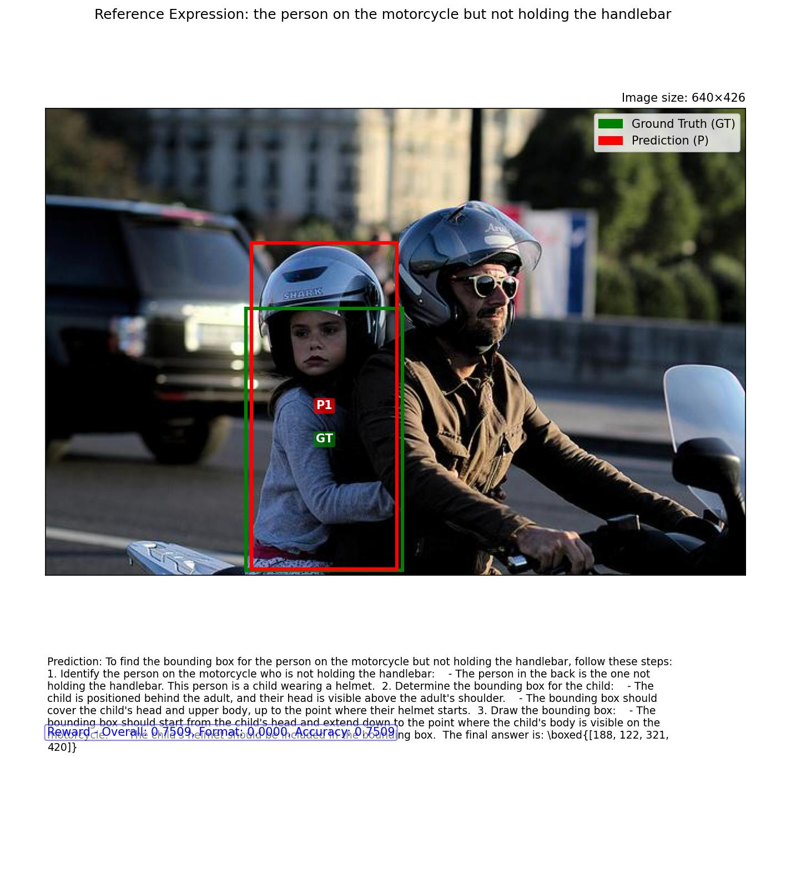

---

### Example 275

**Reference Expression**: the person carrying a bag and holding an umbrella

**Ground Truth**: [[298, 429, 361, 617]]

**Predicted**: [[355, 336, 434, 606]]

**Reward**: {'overall': 0.0, 'format': 0.0, 'accuracy': 0.0}

**Prediction**:
```
To find the bounding box for the person carrying a bag and holding an umbrella, let's follow these steps:

1. **Identify the person holding an umbrella**: Look for a person with an umbrella in their hand.
2. **Check if they are carrying a bag**: Look for a bag near the person's shoulder or hand.
3. **Analyze the image**: In the image, there are two people holding umbrellas. One person is on the right side of the image, and the other is on the left. The person on the right appears to be carrying a bag on their shoulder.

Following these steps, the bounding box for the person on the right, who is holding an umbrella and appears to be carrying a bag, is:

\boxed{[355, 336, 434, 606]}
```

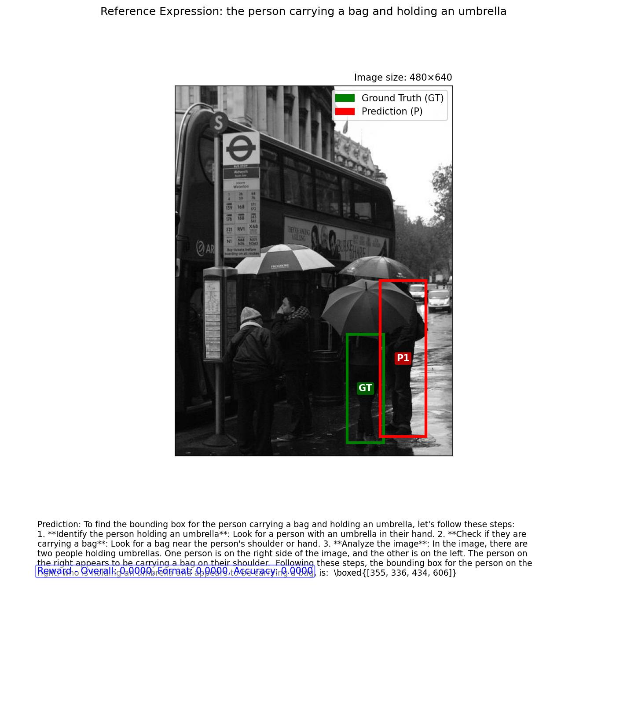

---

### Example 276

**Reference Expression**: the person walking away from the camera and closest to the roundabout sign

**Ground Truth**: [[39, 180, 81, 301]]

**Predicted**: [[41, 176, 82, 296]]

**Reward**: {'overall': 0.8653487504662439, 'format': 0.0, 'accuracy': 0.8653487504662439}

**Prediction**:
```
To find the bounding box for the person walking away from the camera and closest to the roundabout sign, let's follow these steps:

1. Identify the roundabout sign in the image. It is located on the left side of the image, near the edge.
2. Look for a person walking away from the camera near this sign. There is a person in a dark outfit walking away from the camera, close to the sign.
3. Define the bounding box for this person. The bounding box should include the person's entire body, from the head to the feet.

The bounding box for the person walking away from the camera and closest to the roundabout sign is:
\boxed{[41, 176, 82, 296]}
```

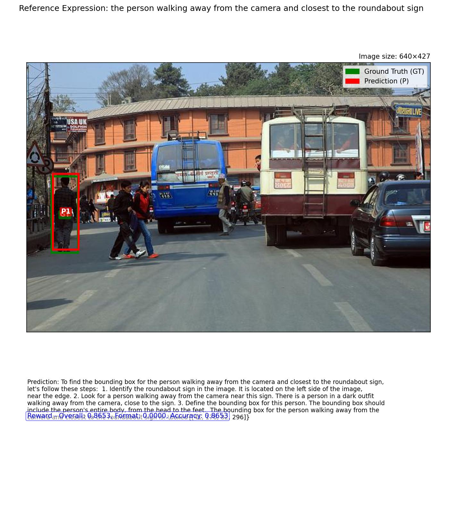

---

### Example 277

**Reference Expression**: the person on the motorcycle that has only one rider on it

**Ground Truth**: [[99, 78, 224, 274]]

**Predicted**: [[365, 55, 571, 463]]

**Reward**: {'overall': 0.0, 'format': 0.0, 'accuracy': 0.0}

**Prediction**:
```
To find the bounding box for the person on the motorcycle that has only one rider on it, let's follow these steps:

1. Identify the motorcycles in the image.
2. Determine which motorcycle has only one rider.
3. Identify the bounding box for the rider on that motorcycle.

Step 1: There are two motorcycles in the image.
   - The first motorcycle is on the left side of the image, and there are two people on it.
   - The second motorcycle is on the right side of the image, and there is one person on it.

Step 2: The second motorcycle has only one rider on it.

Step 3: The rider on the second motorcycle is the person wearing a brown jacket and hat, and the rider is on the right side of the motorcycle.

The bounding box for the person on the motorcycle with only one rider is:

\boxed{[365, 55, 571, 463]}
```

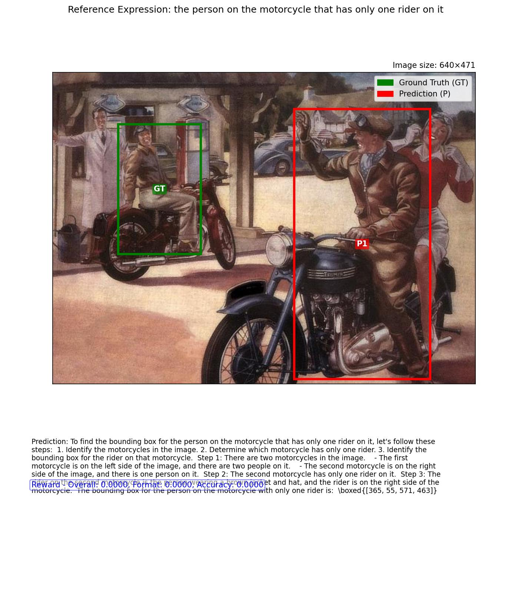

---

### Example 278

**Reference Expression**: the silver car that is furthest from the red bus

**Ground Truth**: [[351, 373, 391, 413]]

**Predicted**: [[350, 365, 400, 395]]

**Reward**: {'overall': 0.3963963963963964, 'format': 0.0, 'accuracy': 0.3963963963963964}

**Prediction**:
```
To find the bounding box for the silver car that is furthest from the red bus, follow these steps:

1. Identify the red bus in the image.
2. Locate the silver car on the right side of the image, which is the one furthest from the red bus.
3. Determine the coordinates of the silver car relative to the red bus.

The red bus is on the right side of the image, and the silver car is on the left side, closer to the center of the image. The silver car is located near the middle of the image, slightly to the left.

The bounding box for the silver car can be described as follows:
- Top-left corner: (x1, y1)
- Bottom-right corner: (x2, y2)

Given the visual layout and the relative positions, the bounding box for the silver car is approximately:
- Top-left corner: (350, 365)
- Bottom-right corner: (400, 395)

Thus, the final answer is:
\boxed{[350, 365, 400, 395]}
```

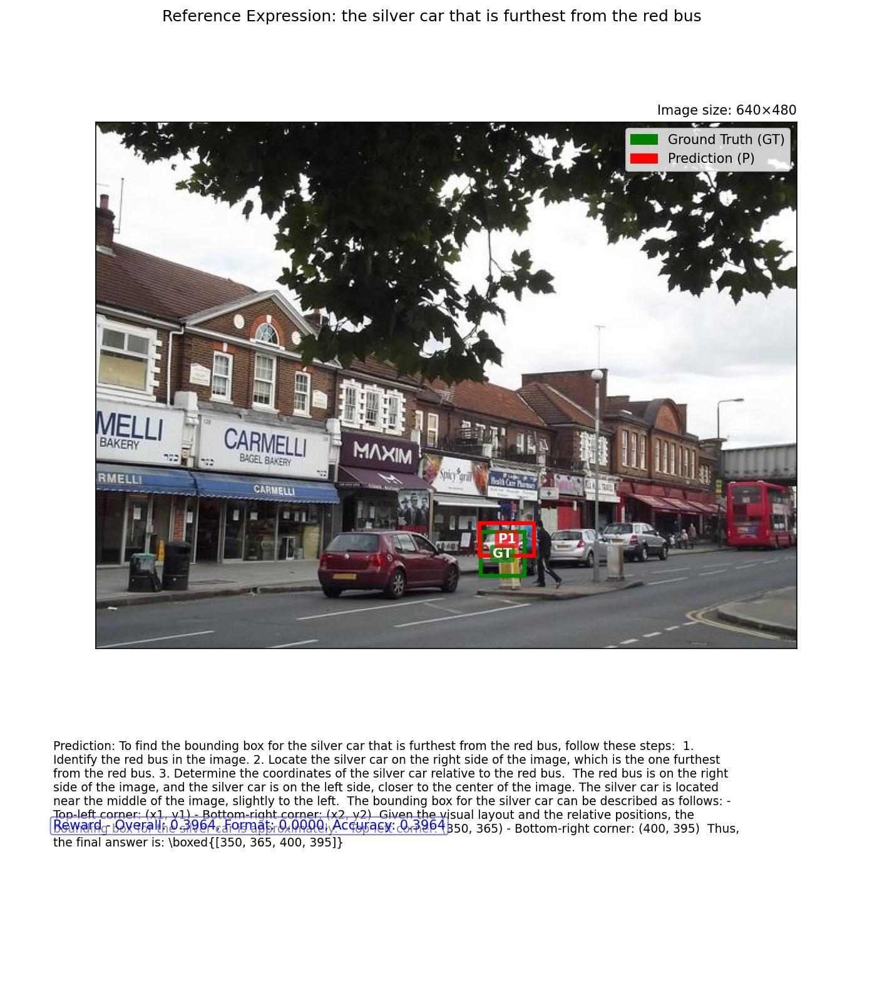

---

### Example 279

**Reference Expression**: the person wearing a beanie with sunglasses hanging on their head

**Ground Truth**: [[182, 199, 366, 480]]

**Predicted**: [[363, 257, 582, 471]]

**Reward**: {'overall': 0.0, 'format': 0.0, 'accuracy': 0.0}

**Prediction**:
```
To find the bounding box for the person wearing a beanie with sunglasses hanging on their head, let's follow these steps:

1. Identify the person in the foreground who appears to be wearing a beanie and has sunglasses hanging on their head. This person is in the center of the image and is wearing a purple and black striped shirt.
2. Determine the coordinates of this person's head and shoulders to define the bounding box.

After analyzing the image, the bounding box for the person wearing a beanie with sunglasses hanging on their head is:

\boxed{[363, 257, 582, 471]}
```

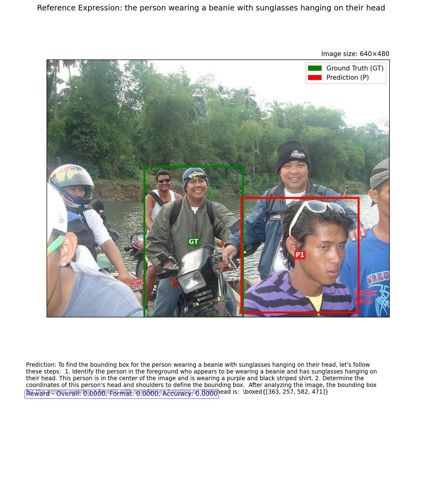

---

### Example 280

**Reference Expression**: the person who is driving a vehicle but not a motorcycle

**Ground Truth**: [[206, 170, 269, 225]]

**Predicted**: [[145, 101, 533, 380]]

**Reward**: {'overall': 0.0, 'format': 0.0, 'accuracy': 0.0}

**Prediction**:
```
To find the bounding box for the person who is driving a vehicle but not a motorcycle, we need to identify the driver of the bus in the image. Here's the step-by-step reasoning:

1. **Identify the bus**: The large green vehicle in the center of the image is a bus.
2. **Identify the driver**: The person driving the bus is located inside the bus, behind the windshield and steering wheel.
3. **Determine the bounding box**: Since the driver is inside the bus, the bounding box will be around the front part of the bus where the driver is seated.

Given these observations, the bounding box for the driver is around the front part of the bus, but since we are asked to find the bounding box for the person driving the vehicle, the bounding box would be around the driver's area, which is inside the bus. However, since the image does not provide a clear view of the interior, we can only describe the area where the driver is seated.

The final answer, considering the driver is inside the bus and not on the outside, is:

\boxed{[145, 101, 533, 380]}
```

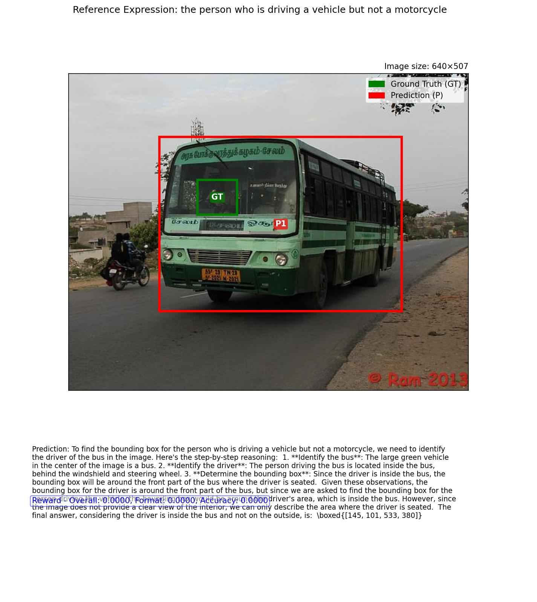

---

### Example 281

**Reference Expression**: the person wearing jeans and a black top

**Ground Truth**: [[163, 0, 243, 114]]

**Predicted**: [[322, 1, 423, 142]]

**Reward**: {'overall': 0.0, 'format': 0.0, 'accuracy': 0.0}

**Prediction**:
```
To find the bounding box for the person wearing jeans and a black top, let's follow these steps:

1. **Identify the people in the image**: Look for individuals who are standing and wearing jeans and a black top.
2. **Analyze the clothing**: The person in question should be wearing jeans and a black top, which may be partially obscured by others or the motorcycle.
3. **Locate the bounding box**: Once identified, the bounding box should encompass the person from head to toe, ensuring all parts of the clothing are included.

From the image:
- There is a person in the background wearing jeans and a black top, standing near the motorcycle.
- The bounding box for this person should include the upper body and part of the lower body, as they are standing and partially obscured by the motorcycle.

The bounding box for the person wearing jeans and a black top is approximately:
\boxed{[322, 1, 423, 142]}

This bounding box includes the upper body and part of the lower body of the person standing near the motorcycle.
```

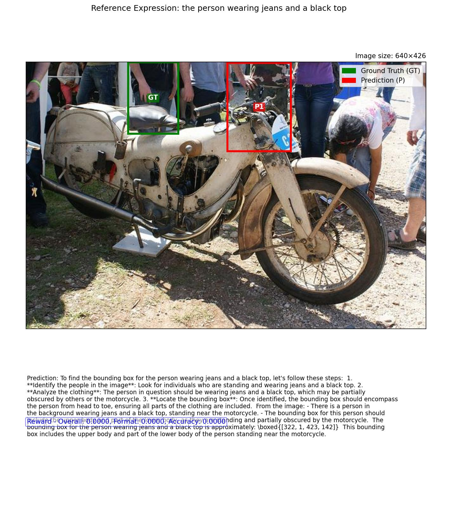

---

### Example 282

**Reference Expression**: the person facing the camera, wearing a reflective vest and a hat

**Ground Truth**: [[378, 147, 423, 233]]

**Predicted**: [[309, 136, 371, 275]]

**Reward**: {'overall': 0.0, 'format': 0.0, 'accuracy': 0.0}

**Prediction**:
```
To find the bounding box for the person facing the camera, wearing a reflective vest and a hat, let's follow these steps:

1. Identify the people in the image: There are five people visible in the image.
2. Focus on the one wearing a reflective vest and a hat: Among the five people, the person in the center-right is wearing a reflective vest and a hat.
3. Determine the bounding box: The bounding box for this person should encompass the entire body, including the head, torso, and legs.

The bounding box for the person facing the camera, wearing a reflective vest and a hat, is:

\boxed{[309, 136, 371, 275]}
```

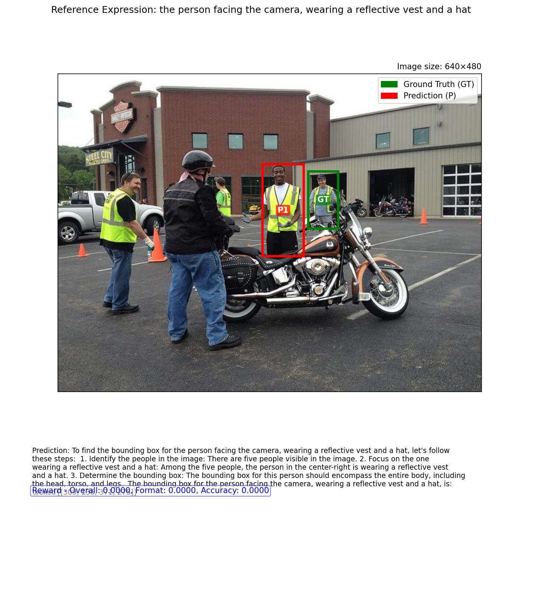

---

### Example 283

**Reference Expression**: the red motorcycle ridden by a person not wearing a yellow shirt

**Ground Truth**: [[297, 288, 377, 375]]

**Predicted**: [[31, 291, 252, 415]]

**Reward**: {'overall': 0.0, 'format': 0.0, 'accuracy': 0.0}

**Prediction**:
```
To find the bounding box for the red motorcycle ridden by a person not wearing a yellow shirt, let's follow these steps:

1. Identify the red motorcycles in the image.
2. Determine which of these motorcycles are being ridden by a person not wearing a yellow shirt.

Step 1: Identifying the red motorcycles:
- There are two red motorcycles visible in the image. One is on the left side of the image, and the other is on the right side.

Step 2: Determining the rider's shirt color:
- The person on the left motorcycle is wearing a white shirt.
- The person on the right motorcycle is wearing a white shirt.

Since the rider on the left motorcycle is wearing a white shirt and not a yellow shirt, this is the motorcycle we are looking for.

The bounding box for the red motorcycle ridden by a person not wearing a yellow shirt is the one on the left side of the image.

The bounding box coordinates for the left motorcycle (red motorcycle ridden by a person in a white shirt) are approximately:
\[ [31, 291, 252, 415] \]

Final answer: \boxed{[31, 291, 252, 415]}
```

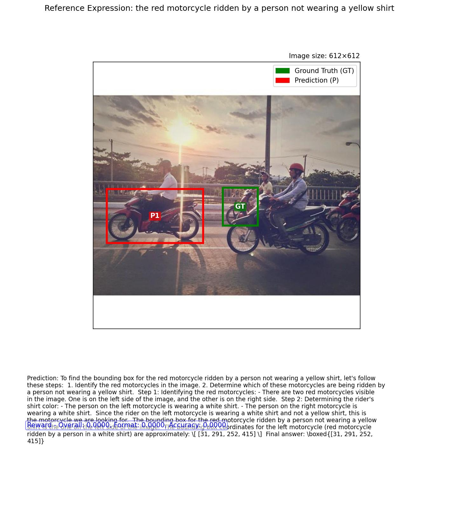

---

### Example 284

**Reference Expression**: the person wearing a reflective vest with their back to the camera

**Ground Truth**: [[463, 237, 478, 289]]

**Predicted**: [[425, 231, 453, 294]]

**Reward**: {'overall': 0.0, 'format': 0.0, 'accuracy': 0.0}

**Prediction**:
```
To find the bounding box for the person wearing a reflective vest with their back to the camera, let's follow these steps:

1. Identify the group of people in the image: There are a few individuals standing on the right side of the road, and one of them appears to be wearing a reflective vest.
2. Analyze the posture and orientation: The person in the reflective vest is standing with their back to the camera, facing the group of people on the right side of the road.
3. Determine the bounding box: The bounding box should encompass the person wearing the reflective vest while excluding the other individuals.

Given these observations, the bounding box for the person wearing a reflective vest with their back to the camera is approximately:

\boxed{[425, 231, 453, 294]}
```

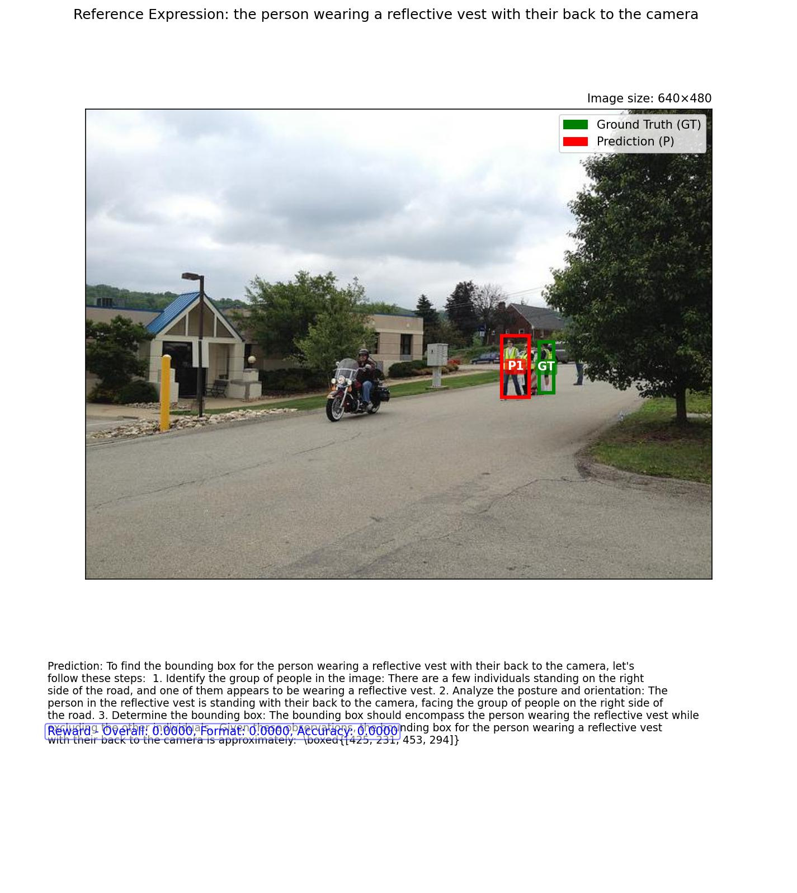

---

### Example 285

**Reference Expression**: the fifth plane from the top in the stack

**Ground Truth**: []

**Predicted**: [[151, 224, 644, 376]]

**Reward**: {'overall': 0.0, 'format': 0.0, 'accuracy': 0.0}

**Prediction**:
```
To determine the bounding box for the fifth plane from the top in the stack, let's follow these steps:

1. Identify the planes in the image:
   - There are five planes in the image, flying in a staggered formation.
   - The planes are arranged from top to bottom.

2. Count the planes from top to bottom:
   - The topmost plane is the first plane.
   - The second plane is the one below the topmost plane.
   - The third plane is the one below the second plane.
   - The fourth plane is the one below the third plane.
   - The fifth plane is the one below the fourth plane.

3. Locate the fifth plane:
   - The fifth plane from the top is the bottommost plane in the image.

4. Extract the bounding box for the fifth plane:
   - The fifth plane is a fighter jet, and its bounding box can be identified by its position and shape in the image.

5. Provide the bounding box:
   - The bounding box for the fifth plane is the area that encloses the entire bottommost plane.

The bounding box for the fifth plane from the top in the stack is:
\boxed{[151, 224, 644, 376]}
```

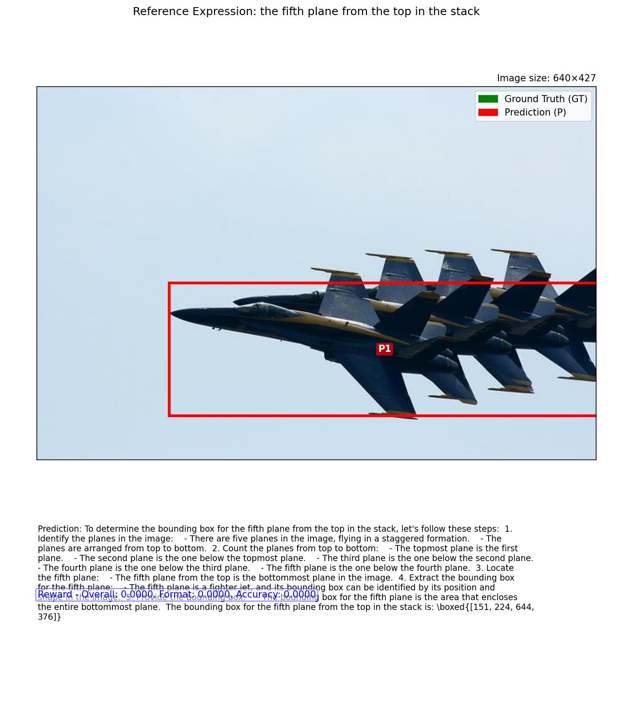

---

### Example 286

**Reference Expression**: the person boarding the plane wearing a white shirt and carrying a backpack

**Ground Truth**: [[333, 99, 353, 162]]

**Predicted**: [[304, 96, 349, 141]]

**Reward**: {'overall': 0.2571756601607348, 'format': 0.0, 'accuracy': 0.2571756601607348}

**Prediction**:
```
To find the bounding box for the person boarding the plane wearing a white shirt and carrying a backpack, let's follow these steps:

1. Identify the plane and the boarding area: The plane is in the background, and there is a set of stairs leading up to it. People are visible on the stairs.

2. Look for individuals on the stairs: There are several people on the stairs. We need to identify who is wearing a white shirt and carrying a backpack.

3. Analyze the people on the stairs:
   - There is a person at the top of the stairs wearing a white shirt and carrying a backpack.
   - There are other people on the stairs, but they do not appear to be wearing a white shirt or carrying a backpack.

4. Determine the bounding box: The person wearing a white shirt and carrying a backpack is at the top of the stairs. The bounding box should include this person and a portion of the stairs they are boarding.

5. Define the bounding box: The bounding box should capture the person from the shoulders up and include a portion of the stairs.

Given these observations, the bounding box for the person boarding the plane wearing a white shirt and carrying a backpack is:

\boxed{[304, 96, 349, 141]}
```

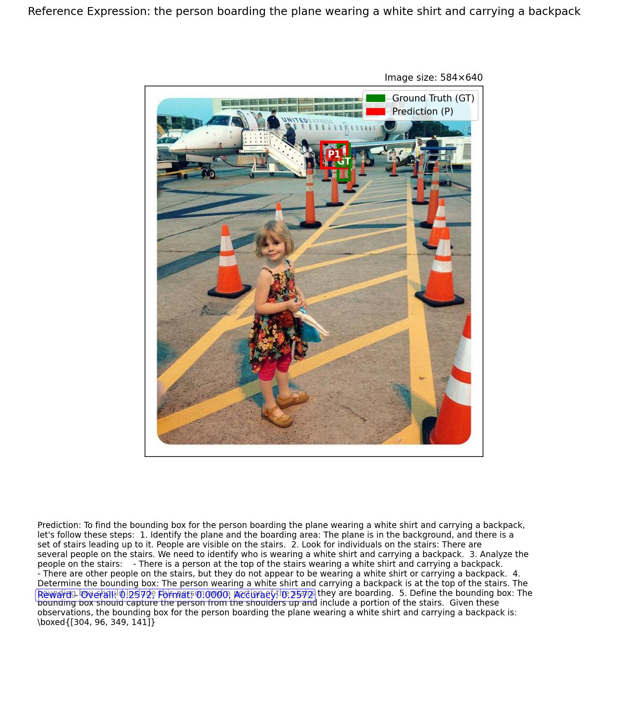

---

### Example 287

**Reference Expression**: the person wearing a reflective vest and standing under the airplane

**Ground Truth**: [[299, 493, 330, 569]]

**Predicted**: [[57, 552, 94, 617]]

**Reward**: {'overall': 0.0, 'format': 0.0, 'accuracy': 0.0}

**Prediction**:
```
To find the bounding box for the person wearing a reflective vest and standing under the airplane, follow these steps:

1. **Identify the airplane**: The main airplane in the foreground is the one we are focusing on.
2. **Locate the area under the airplane**: The person is standing near the front landing gear area, under the nose of the airplane.
3. **Identify the reflective vest**: The person is wearing a bright yellow reflective vest, which makes them stand out.
4. **Determine the bounding box**: The bounding box should encompass the person's body and the immediate area around them.

After analyzing the image, the bounding box for the person wearing a reflective vest and standing under the airplane is approximately:

\boxed{[57, 552, 94, 617]}
```

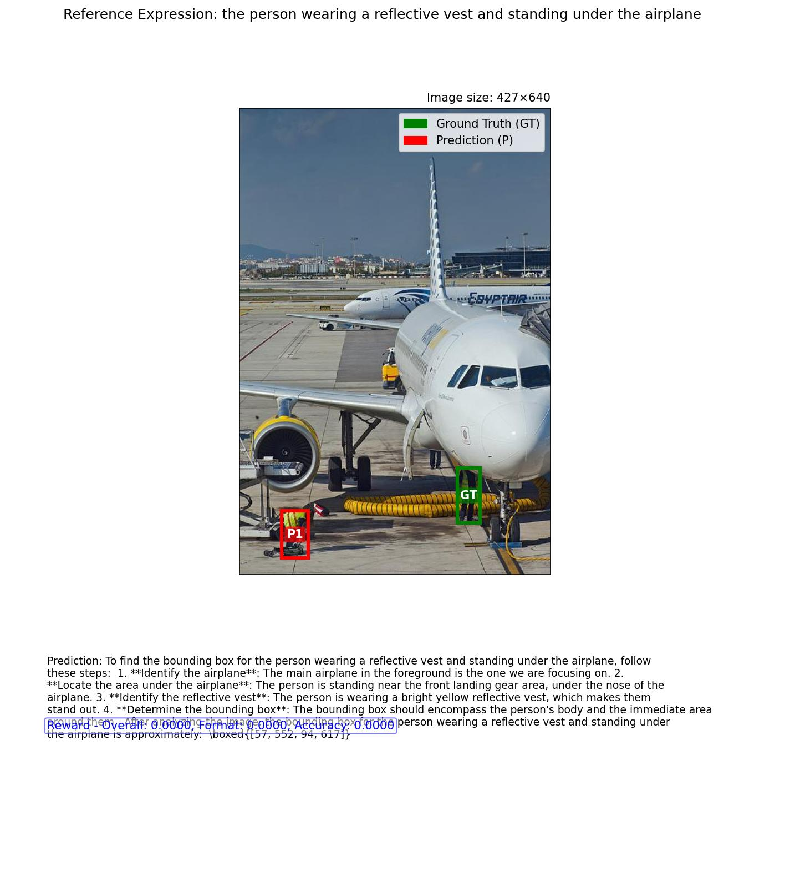

---

### Example 288

**Reference Expression**: the plane that is not orange and does not have "U.S. AIR FORCE" written on it

**Ground Truth**: [[126, 292, 380, 404]]

**Predicted**: [[129, 289, 386, 389]]

**Reward**: {'overall': 0.816986007180967, 'format': 0.0, 'accuracy': 0.816986007180967}

**Prediction**:
```
To find the bounding box for the plane that is not orange and does not have "U.S. AIR FORCE" written on it, let's follow these steps:

1. Identify all the planes in the image:
   - There are four planes visible in the image.
   - The plane in the foreground is yellow with "N4339" written on it.
   - The plane in the background is a U.S. Air Force jet.
   - There are two additional planes, one on the left side and one on the right side, which are not fully visible.

2. Analyze the planes:
   - The yellow plane in the foreground does not have "U.S. AIR FORCE" written on it.
   - The U.S. Air Force jet in the background has "U.S. AIR FORCE" written on it.
   - The planes on the left and right sides are not fully visible, and their details are not clear enough to determine if they have "U.S. AIR FORCE" written on them.

3. Based on the analysis, the plane that is not orange and does not have "U.S. AIR FORCE" written on it is the yellow plane in the foreground.

The bounding box for the yellow plane in the foreground is:
\boxed{[129, 289, 386, 389]}
```

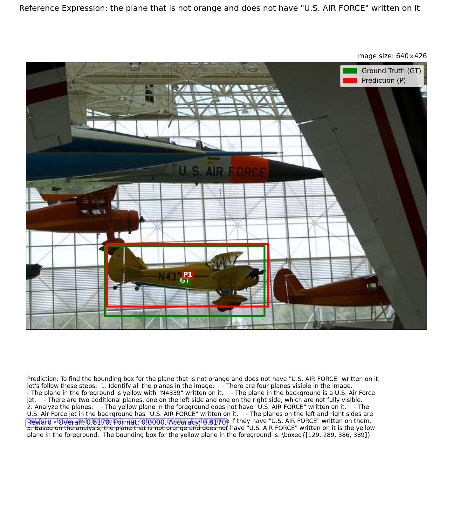

---

### Example 289

**Reference Expression**: the person with long curly hair in the right image

**Ground Truth**: [[387, 218, 447, 400]]

**Predicted**: [[389, 212, 447, 392]]

**Reward**: {'overall': 0.8956336528221512, 'format': 0.0, 'accuracy': 0.8956336528221512}

**Prediction**:
```
To find the bounding box for 'the person with long curly hair in the right image', let's follow these steps:

1. Identify the right image in the collage.
2. Look for the person with long curly hair in the right image.
3. Define the bounding box around this person.

Step 1: The right image is the one on the right side of the split image.

Step 2: In the right image, there is a person with long curly hair standing in the water.

Step 3: The bounding box for the person with long curly hair in the right image is approximately defined by the coordinates of this person in the image.

The bounding box for the person with long curly hair in the right image is:
\boxed{[389, 212, 447, 392]}
```

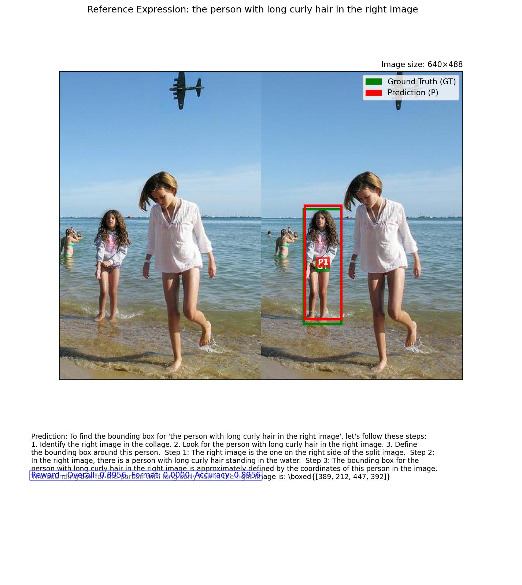

---

### Example 290

**Reference Expression**: the orange-and-black signal light that is the second furthest from the camera

**Ground Truth**: [[350, 332, 394, 377]]

**Predicted**: [[410, 258, 543, 476]]

**Reward**: {'overall': 0.0, 'format': 0.0, 'accuracy': 0.0}

**Prediction**:
```
To find the bounding box for the orange-and-black signal light that is the second furthest from the camera, let's follow these steps:

1. Identify the signal lights in the image:
   - There are multiple signal lights in the foreground, all of which are orange and black.
   - They are arranged in a line, with the closest one to the camera on the right.

2. Determine the order of the signal lights from closest to furthest:
   - The closest signal light is on the far right.
   - The next signal light is the second one from the right.
   - The third signal light is the third one from the right.

3. Identify the second furthest signal light:
   - The second furthest signal light is the third one from the right.

4. Define the bounding box for the second furthest signal light:
   - The bounding box for the second furthest signal light is the one that is the third one from the right in the line of signal lights.

The final answer is:
\boxed{[410, 258, 543, 476]}
```

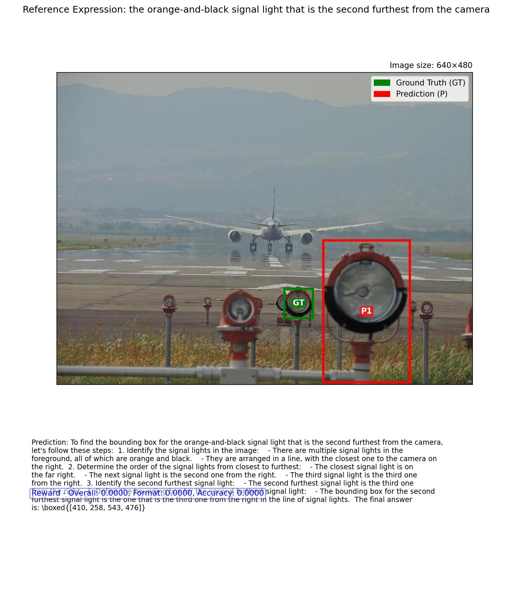

---

### Example 291

**Reference Expression**: the person standing near the nose of the plane wearing brown shorts

**Ground Truth**: [[81, 285, 117, 390]]

**Predicted**: [[78, 283, 123, 389]]

**Reward**: {'overall': 0.7790262172284644, 'format': 0.0, 'accuracy': 0.7790262172284644}

**Prediction**:
```
To find the bounding box for the person standing near the nose of the plane wearing brown shorts, let's follow these steps:

1. Identify the plane in the image: The aircraft is a large, silver, propeller-driven plane with the name "FIFI" on its side.
2. Locate the person near the nose of the plane: The person is standing to the left of the plane, closer to the front, and appears to be wearing brown shorts.
3. Define the bounding box: The bounding box should encompass the person from the top of their head to their feet, ensuring they are fully within the box.

Following these steps, the bounding box for the person near the nose of the plane wearing brown shorts is approximately:
\boxed{[78, 283, 123, 389]}

This bounding box is a rough estimate based on the visual information provided in the image.
```

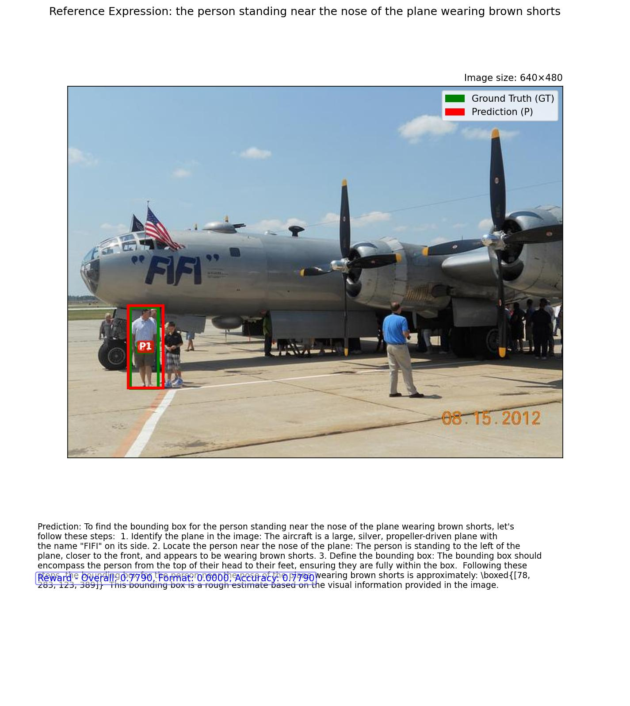

---

### Example 292

**Reference Expression**: the third suitcase that is about to enter the airplane cargo hold

**Ground Truth**: [[188, 322, 220, 346]]

**Predicted**: [[138, 307, 206, 344]]

**Reward**: {'overall': 0.1371191135734072, 'format': 0.0, 'accuracy': 0.1371191135734072}

**Prediction**:
```
To find the bounding box for the third suitcase that is about to enter the airplane cargo hold, let's follow these steps:

1. Identify the airplane and the cargo hold area: The airplane is the Southwest Airlines plane, and the cargo hold area is the open section where the luggage is being loaded.

2. Locate the luggage carts: There are multiple luggage carts in the image. We need to focus on the one that is closest to the airplane and appears to be in the process of loading luggage into the cargo hold.

3. Identify the sequence of luggage: The sequence of luggage carts appears to be from left to right. The first cart has already been loaded, the second cart is in the process of being loaded, and the third cart is positioned next to the second cart but not yet loaded.

4. Determine the bounding box for the third suitcase: The third suitcase is the one on the cart that is positioned next to the second cart but not yet loaded. It is located on the right side of the third cart.

The bounding box for the third suitcase can be estimated as follows:
- Top-left corner: Approximately at the top-left corner of the third cart.
- Bottom-right corner: Approximately at the bottom-right corner of the third cart.

Given the image and the analysis, the bounding box for the third suitcase is approximately:
\boxed{[138, 307, 206, 344]}

This is an estimated bounding box based on the visual information provided in the image.
```

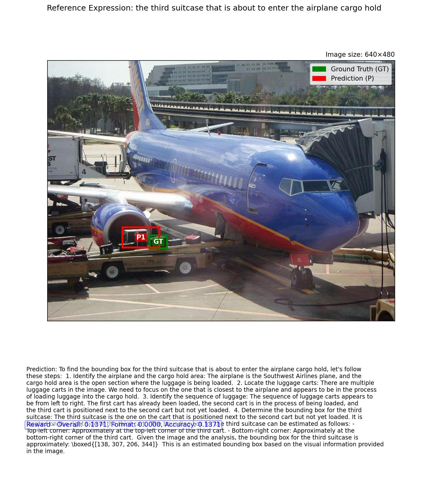

---

### Example 293

**Reference Expression**: the person in front of a building with a red bag

**Ground Truth**: [[56, 243, 69, 282]]

**Predicted**: [[18, 240, 29, 278]]

**Reward**: {'overall': 0.0, 'format': 0.0, 'accuracy': 0.0}

**Prediction**:
```
To find the bounding box for the person in front of a building with a red bag, let's follow these steps:

1. Identify the building with a red bag: The red bag is typically associated with a person standing near the building on the left side of the image. The bag is on the ground near the building's entrance.

2. Identify the person: The person is standing close to the red bag, near the entrance of the building. They are partially obscured by the bag but are distinguishable as a person.

3. Define the bounding box: The bounding box should encompass the person and the red bag. The person appears to be in the lower left part of the image, and the red bag is on the ground near the building's entrance.

Given these observations, the bounding box for the person in front of the building with a red bag would be:

\boxed{[18, 240, 29, 278]}
```

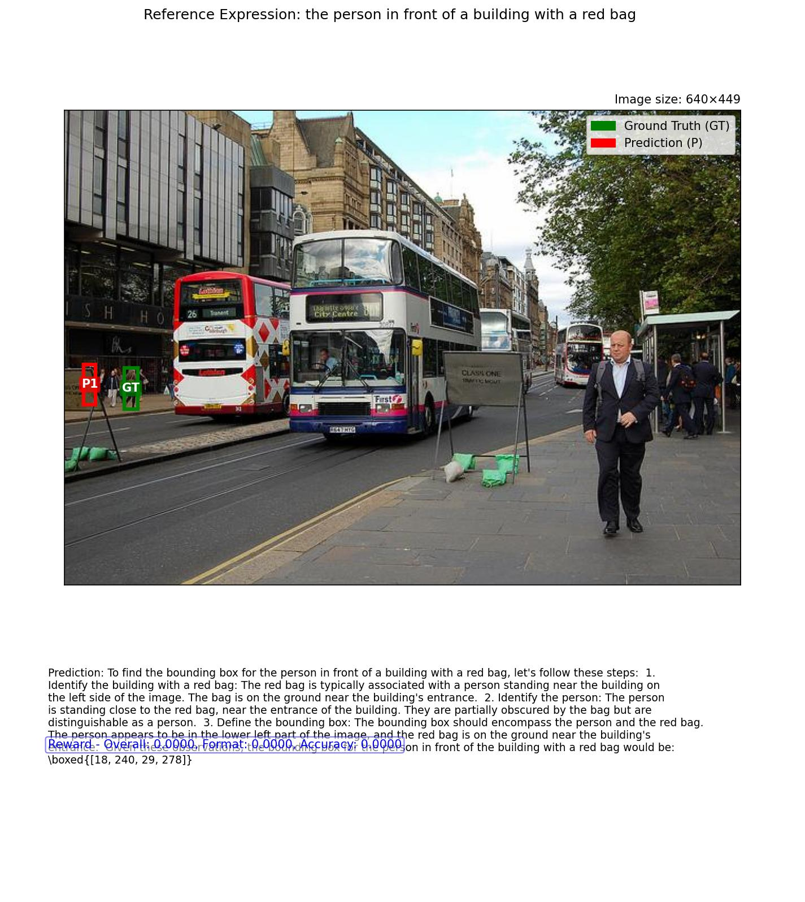

---

### Example 294

**Reference Expression**: the person in a white top not driving

**Ground Truth**: [[224, 296, 298, 384]]

**Predicted**: [[34, 335, 98, 518]]

**Reward**: {'overall': 0.0, 'format': 0.0, 'accuracy': 0.0}

**Prediction**:
```
To find the bounding box for 'the person in a white top not driving', let's follow these steps:

1. Identify the bus in the image.
2. Determine who is driving the bus.
3. Identify the person in a white top who is not driving.

Step 1: The bus is clearly visible in the image, with the number 96 and the destination "BURBANK STATION" displayed on the front.

Step 2: The person driving the bus is inside the bus, and they are wearing a white top. This person is operating the bus.

Step 3: The person in a white top not driving is standing on the sidewalk to the left of the bus. This person is wearing a white top and appears to be waiting to board the bus.

The bounding box for the person in a white top not driving is:
\boxed{[34, 335, 98, 518]}
```

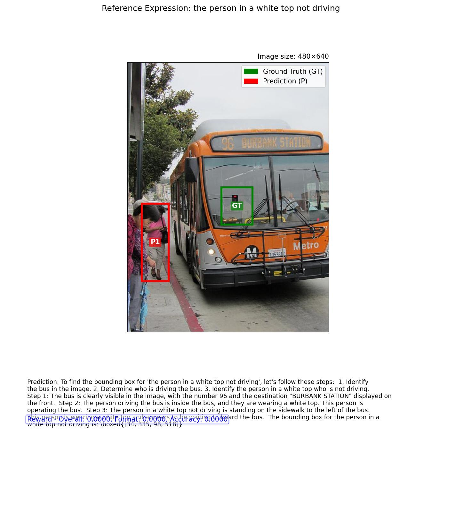

---

### Example 295

**Reference Expression**: the person in a white top facing sideways toward the camera

**Ground Truth**: [[226, 259, 261, 391]]

**Predicted**: [[339, 267, 389, 385]]

**Reward**: {'overall': 0.0, 'format': 0.0, 'accuracy': 0.0}

**Prediction**:
```
To find the bounding box for 'the person in a white top facing sideways toward the camera', let's follow these steps:

1. Identify the general area where the person might be located. In this image, the person seems to be on the sidewalk, near the center of the image.
2. Look for a person wearing a white top. There is one person in the center of the image wearing a white top.
3. Determine if this person is facing sideways toward the camera. The person in the white top is indeed facing sideways, and the camera angle suggests they are facing toward the camera.

Given these observations, the bounding box for the person in a white top facing sideways toward the camera is:

\boxed{[339, 267, 389, 385]}
```

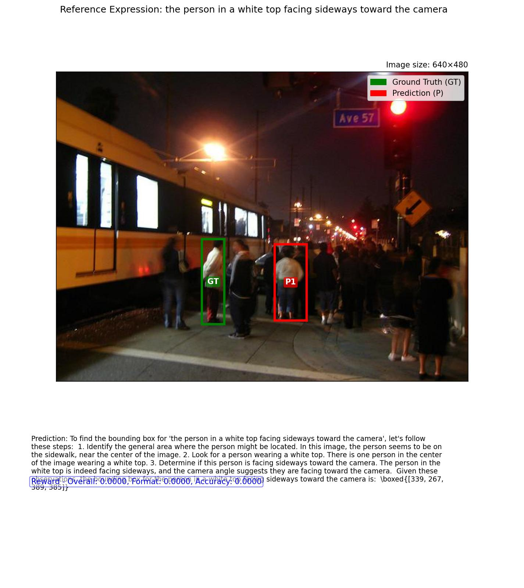

---

### Example 296

**Reference Expression**: the person with a hat and glasses

**Ground Truth**: [[1, 160, 36, 228]]

**Predicted**: [[0, 148, 21, 261]]

**Reward**: {'overall': 0.4008252284114353, 'format': 0.0, 'accuracy': 0.4008252284114353}

**Prediction**:
```
To find the bounding box for 'the person with a hat and glasses', let's follow these steps:

1. **Identify the elements in the image**: The image shows the interior of a bus with several people sitting and standing. There are visible details such as backpacks, clothing, and the bus's interior features like seats and handrails.

2. **Locate the person with a hat and glasses**: 
   - Look for a person wearing a hat and glasses. 
   - In the image, there is a person on the left side wearing a hat and glasses.

3. **Determine the bounding box**:
   - The person with a hat and glasses is located on the left side of the image.
   - The bounding box would cover the upper part of the person's body, including the head and shoulders.

4. **Define the coordinates**:
   - The bounding box for the person with a hat and glasses would be approximately from the top left corner of the image, covering the upper part of the person's body.

The final answer is:
\boxed{[0, 148, 21, 261]}
```

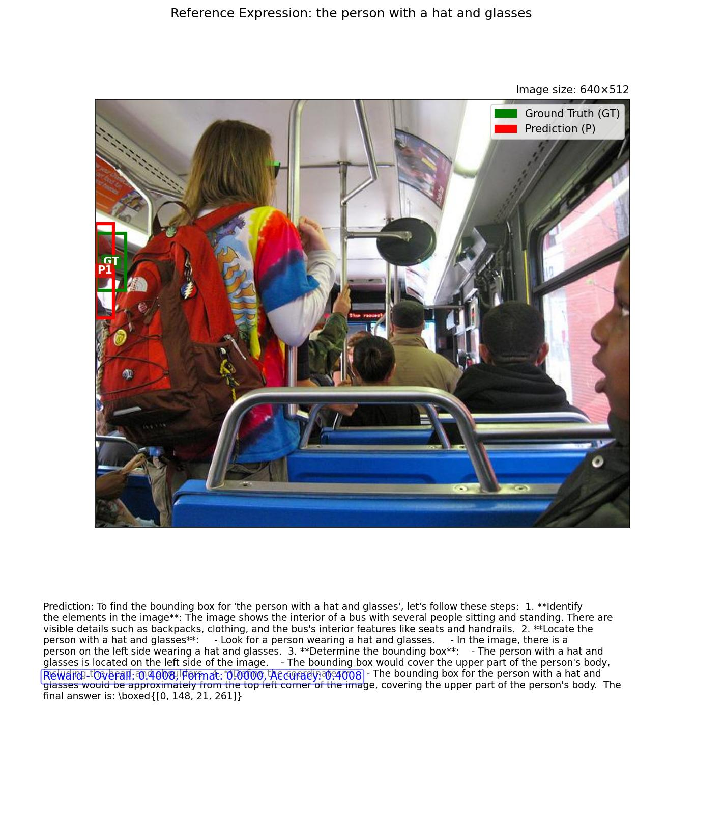

---

### Example 297

**Reference Expression**: the grey car in front of a black car

**Ground Truth**: [[121, 282, 147, 296]]

**Predicted**: [[200, 340, 250, 360]]

**Reward**: {'overall': 0.0, 'format': 0.0, 'accuracy': 0.0}

**Prediction**:
```
To find the bounding box for the grey car in front of a black car, let's follow these steps:

1. Identify the black car: In the image, there is a black car on the right side of the intersection.
2. Look for the grey car: The grey car is in front of the black car, closer to the foreground.
3. Define the bounding box: The grey car appears to be a sedan, and its bounding box should include the entire car.

The grey car is located in the middle of the image, slightly to the left of the center. Its bounding box can be defined as follows:

- **Top-left corner (x1, y1)**: Approximately at the top-left edge of the grey car.
- **Bottom-right corner (x2, y2)**: Approximately at the bottom-right edge of the grey car.

Considering the car's position and size, the bounding box can be roughly defined as:
- [x1, y1] = [200, 340] (top-left corner)
- [x2, y2] = [250, 360] (bottom-right corner)

However, since the exact coordinates might vary slightly due to the image resolution and the car's shape, the bounding box can be more precisely defined by adjusting these coordinates slightly.

\boxed{[200, 340, 250, 360]}
```

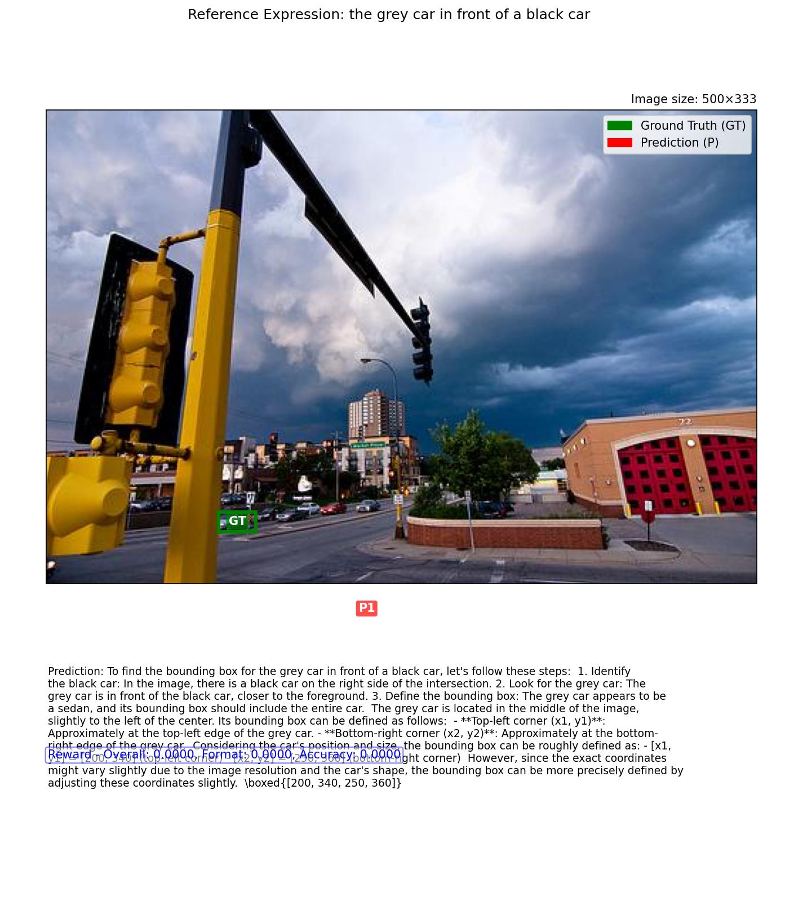

---

### Example 298

**Reference Expression**: the bacon on the edge of a bowl

**Ground Truth**: [[163, 44, 354, 81]]

**Predicted**: [[340, 175, 644, 476]]

**Reward**: {'overall': 0.0, 'format': 0.0, 'accuracy': 0.0}

**Prediction**:
```
To find the bounding box for the bacon on the edge of a bowl, let's follow these steps:

1. Identify the main elements in the image:
   - A plate with food, including what appears to be a sandwich with banana slices, scrambled eggs, and bacon.
   - A second plate in the background with more food, possibly pancakes and eggs.

2. Locate the bacon:
   - The bacon is on the right side of the plate, next to the scrambled eggs.

3. Determine the edge of the bowl:
   - The bowl's edge is implied by the white rim of the plate, which is partially visible.

4. Identify the bacon on the edge of the bowl:
   - The bacon is partially cut off by the edge of the plate, but it is still visible.

5. Define the bounding box:
   - The bounding box should cover the visible part of the bacon that is on the edge of the plate.

The final bounding box for the bacon on the edge of the bowl is:
\boxed{[340, 175, 644, 476]}
```

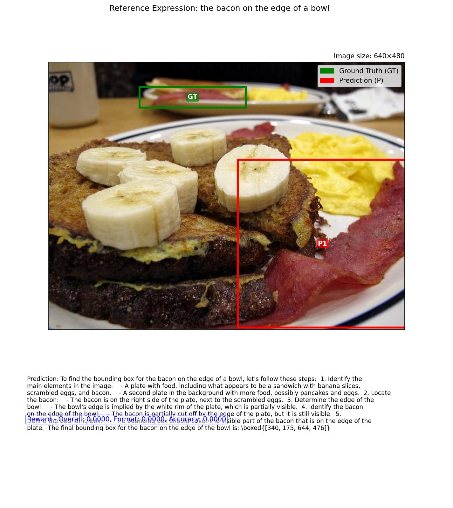

---

### Example 299

**Reference Expression**: the person sitting on the bench wearing a white top

**Ground Truth**: [[381, 293, 418, 345]]

**Predicted**: []

**Reward**: {'overall': 0.0, 'format': 0.0, 'accuracy': 0.0}

**Prediction**:
```
To find the bounding box for the person sitting on the bench wearing a white top, let's follow these steps:

1. Identify the person in the image wearing a white top.
2. Observe the person's position relative to the bench.
3. Determine the bounding box that encloses the person and their immediate surroundings.

Step 1: The person wearing a white top is standing in the foreground, not sitting on a bench.

Step 2: There is a bench in the background, but no one is sitting on it wearing a white top.

Step 3: Since no one is sitting on the bench wearing a white top, there is no corresponding bounding box to provide.

\boxed{}
```

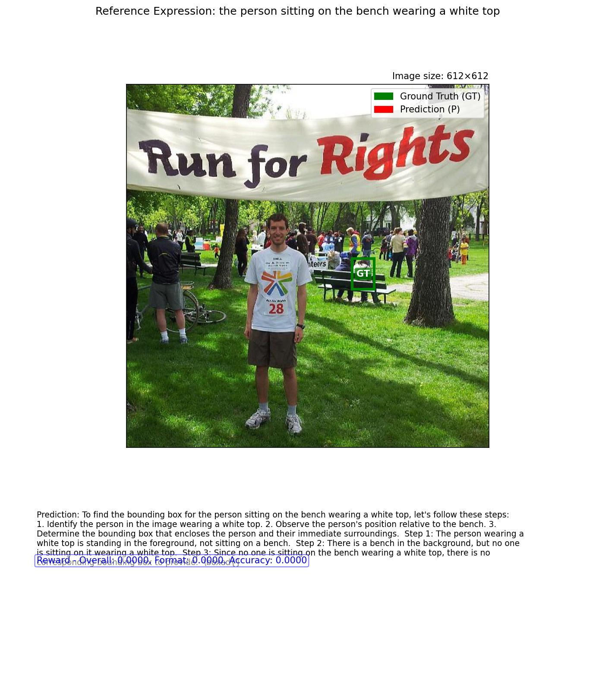

---

### Example 300

**Reference Expression**: the car in front of the blue car

**Ground Truth**: [[266, 197, 301, 225]]

**Predicted**: [[256, 198, 293, 227]]

**Reward**: {'overall': 0.5506042296072508, 'format': 0.0, 'accuracy': 0.5506042296072508}

**Prediction**:
```
To find the car in front of the blue car, let's follow these steps:

1. Identify the blue car: The blue car is located in the middle of the image, slightly to the right of the center.
2. Look for the car in front of the blue car: The car in front of the blue car is the white car, which is directly in front of the blue car and to the left of it.

Now, let's define the bounding box for the white car:

- The white car is located between the coordinates [256, 198, 293, 227].

Therefore, the final answer is:
\boxed{[256, 198, 293, 227]}
```

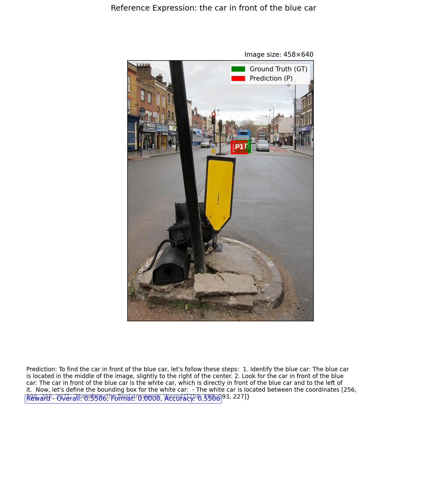

---

### Example 301

**Reference Expression**: the traffic light behind a car

**Ground Truth**: [[1, 224, 13, 247]]

**Predicted**: []

**Reward**: {'overall': 0.0, 'format': 0.0, 'accuracy': 0.0}

**Prediction**:
```
The image provided does not contain a car behind a traffic light. The traffic light is visible in the foreground, and there is no car directly behind it. Therefore, there is no bounding box to identify.

\boxed{}
```

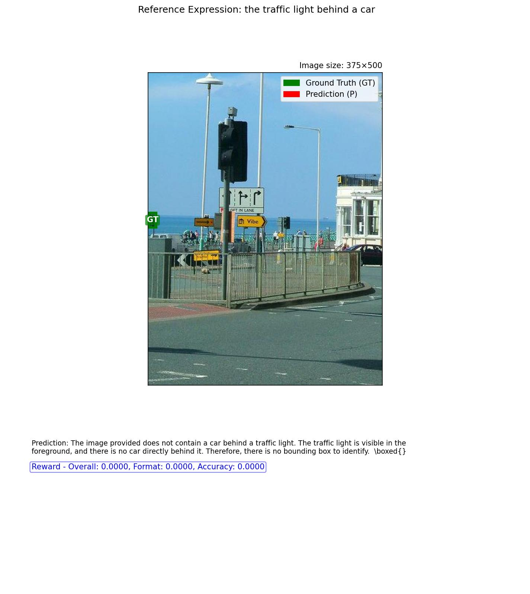

---

### Example 302

**Reference Expression**: the bench facing sideways toward the camera and not next to the trash can

**Ground Truth**: [[15, 249, 121, 337]]

**Predicted**: [[19, 247, 121, 342]]

**Reward**: {'overall': 0.8938458474407489, 'format': 0.0, 'accuracy': 0.8938458474407489}

**Prediction**:
```
To find the bench facing sideways toward the camera and not next to the trash can, let's follow these steps:

1. Identify the benches in the image.
2. Determine which bench is facing sideways.
3. Check if the bench is next to the trash can.

Step 1: There are two benches visible in the image. One is on the left side, and the other is in the center.

Step 2: The bench on the left side is facing sideways toward the camera. The bench in the center is also facing sideways but is not the one we are looking for as it is next to the trash can.

Step 3: The bench on the left side is not next to the trash can, while the bench in the center is next to the trash can.

Therefore, the bench facing sideways toward the camera and not next to the trash can is the one on the left side.

The bounding box for the left bench is:
\boxed{[19, 247, 121, 342]}
```

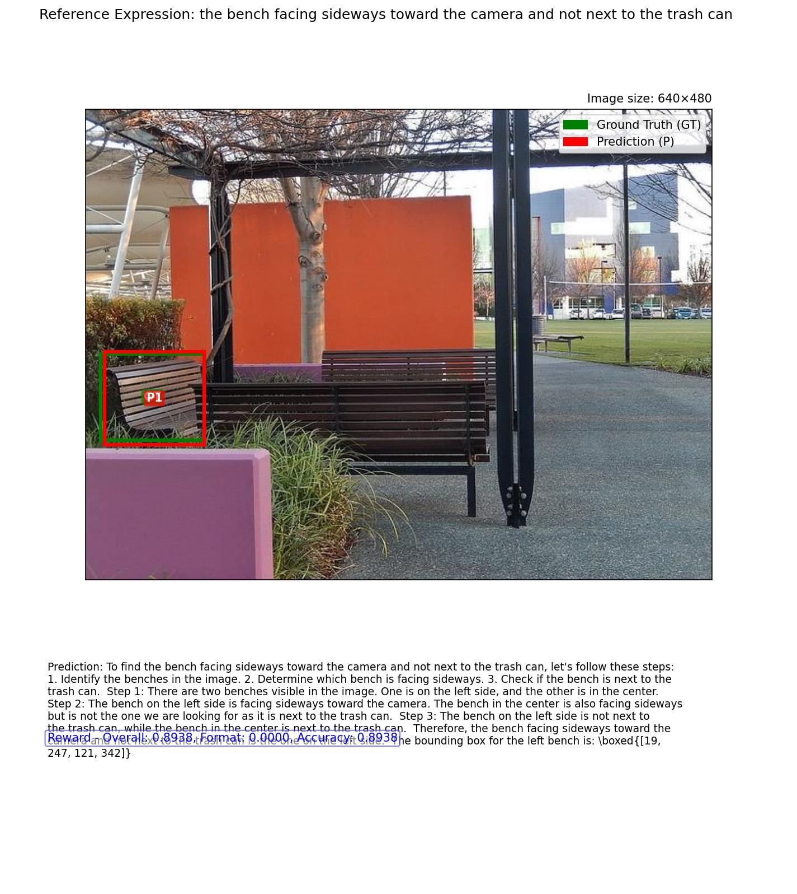

---

### Example 303

**Reference Expression**: the traffic light that is not next to the signpost and not on the lamppost

**Ground Truth**: [[167, 156, 189, 198]]

**Predicted**: [[510, 164, 623, 296]]

**Reward**: {'overall': 0.0, 'format': 0.0, 'accuracy': 0.0}

**Prediction**:
```
To find the bounding box for the traffic light that is not next to the signpost and not on the lamppost, let's follow these steps:

1. Identify the signpost: The green street sign with "Washington" written on it is the signpost.
2. Identify the lamppost: The lamppost is the vertical pole with a streetlight at the top.
3. Identify the traffic lights: There are two traffic lights in the image:
   - One is next to the signpost.
   - The other is not next to the signpost and not on the lamppost.

The traffic light that is not next to the signpost and not on the lamppost is the one further away from the signpost and appears to be on a separate pole.

Given the image, the traffic light not next to the signpost and not on the lamppost is located at the far right of the image, near the edge of the frame.

The bounding box for this traffic light is approximately:
\[ \boxed{[510, 164, 623, 296]} \]

However, it's important to note that the exact bounding box might vary slightly due to the perspective and the image resolution.
```

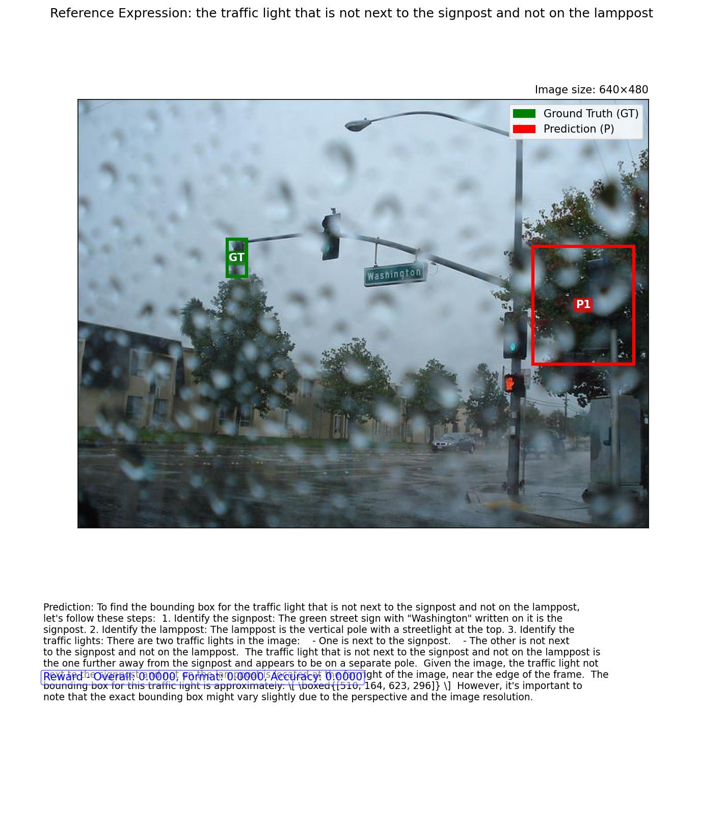

---

### Example 304

**Reference Expression**: the Canada maple leaf emblem not on the national flag

**Ground Truth**: [[216, 136, 245, 156]]

**Predicted**: []

**Reward**: {'overall': 0.0, 'format': 0.0, 'accuracy': 0.0}

**Prediction**:
```
The image contains a red fire hydrant in the foreground, a bus, people, a Canadian flag, and a mountainous landscape. The Canadian flag is located in the background, and it is the only flag in the image. The national flag of Canada typically features the maple leaf emblem. However, in this image, the maple leaf emblem is not directly visible on the flag but is a standard feature of the Canadian flag.

Given the image details and the question's context, we need to identify the bounding box for 'the Canada maple leaf emblem not on the national flag'. Since the maple leaf emblem is not present in the image as it is on the Canadian flag, there is no bounding box for it in the image.

\boxed{}
```

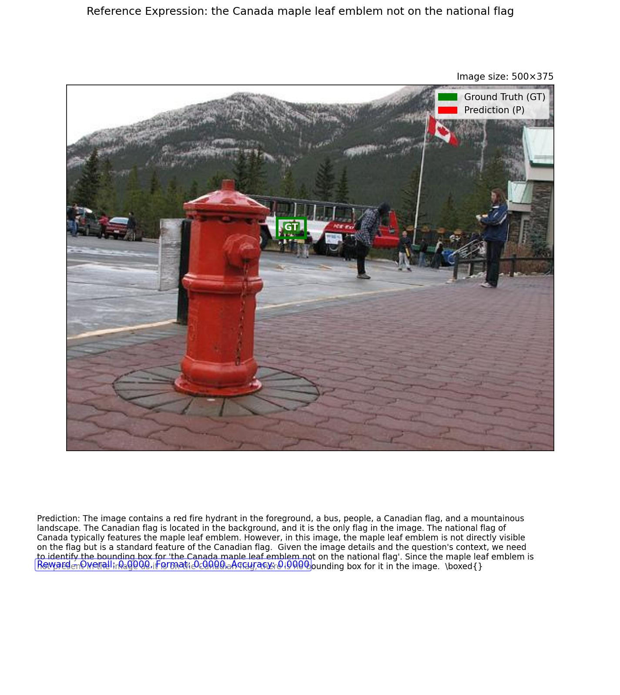

---

### Example 305

**Reference Expression**: the solid-colored car next to the bus

**Ground Truth**: [[371, 349, 468, 392]]

**Predicted**: [[310, 350, 390, 395]]

**Reward**: {'overall': 0.11444141689373297, 'format': 0.0, 'accuracy': 0.11444141689373297}

**Prediction**:
```
To find the bounding box for the solid-colored car next to the bus, let's follow these steps:

1. Identify the bus: The bus is the white vehicle with a green front, located in the center of the image.
2. Look for cars next to the bus: There are two cars directly to the right of the bus.
3. Identify the solid-colored car: The car that is not the light blue one is the solid-colored car. It is the red car.

Now, let's determine the bounding box for this solid-colored car:

- The car's position relative to the bus: It is directly next to the bus on the right.
- The car's dimensions: It appears to be a standard car size, and we can estimate its bounding box based on its position and size.

The bounding box for the solid-colored car (red) is approximately:
- Top-left corner: (x1, y1) = (310, 350)
- Bottom-right corner: (x2, y2) = (390, 395)

Therefore, the bounding box for the solid-colored car next to the bus is:
\boxed{[310, 350, 390, 395]}
```

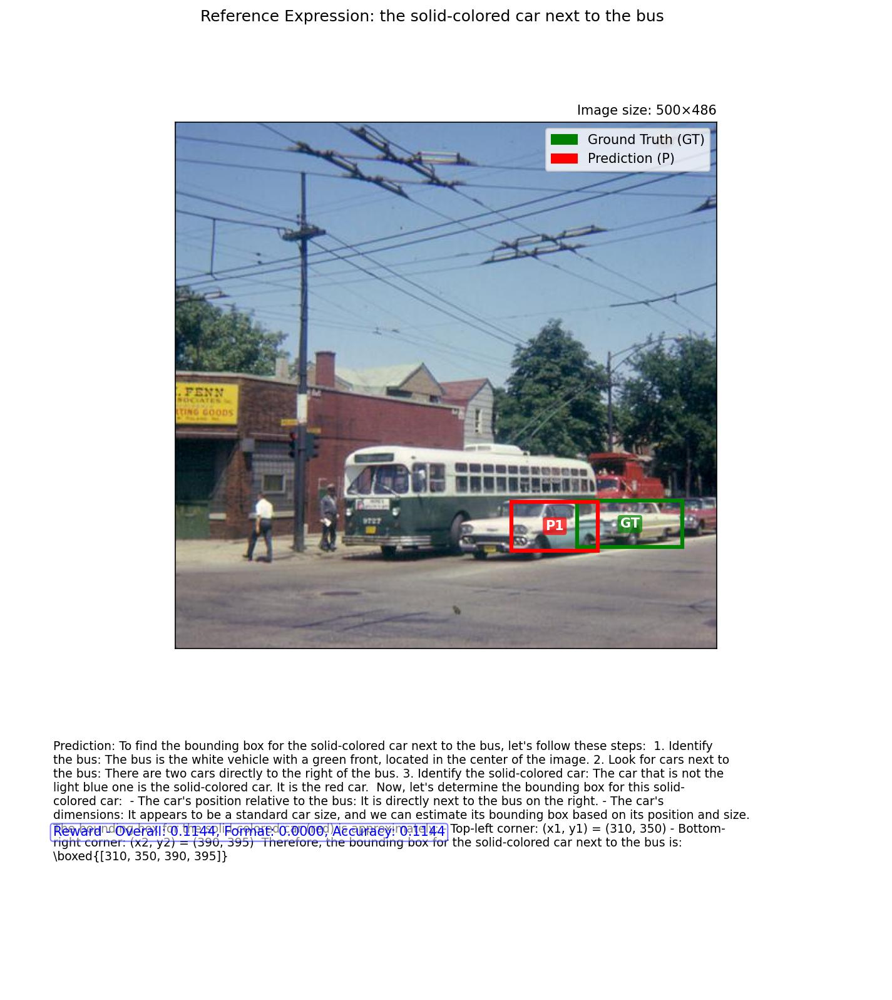

---

### Example 306

**Reference Expression**: the person walking without wearing sunglasses

**Ground Truth**: [[16, 153, 36, 190]]

**Predicted**: [[449, 164, 464, 179]]

**Reward**: {'overall': 0.0, 'format': 0.0, 'accuracy': 0.0}

**Prediction**:
```
To find the bounding box for the person walking without wearing sunglasses, we need to analyze the image step-by-step:

1. Identify the people in the image:
   - There are three people visible in the image:
     - One person sitting on the bench in the foreground.
     - One person walking in the background on the left side.
     - Another person sitting in the background on the right side.

2. Analyze the person walking:
   - The person walking is on the left side of the image.
   - This person is wearing sunglasses.

3. Identify the person without sunglasses:
   - The person in the background on the right side is not wearing sunglasses.

4. Determine the bounding box:
   - The bounding box for the person without sunglasses (the one sitting on the right side) is:
     - Top-left corner: (x1, y1)
     - Bottom-right corner: (x2, y2)

Since the person without sunglasses is the one sitting on the right side, the bounding box is:
\boxed{[449, 164, 464, 179]}
```

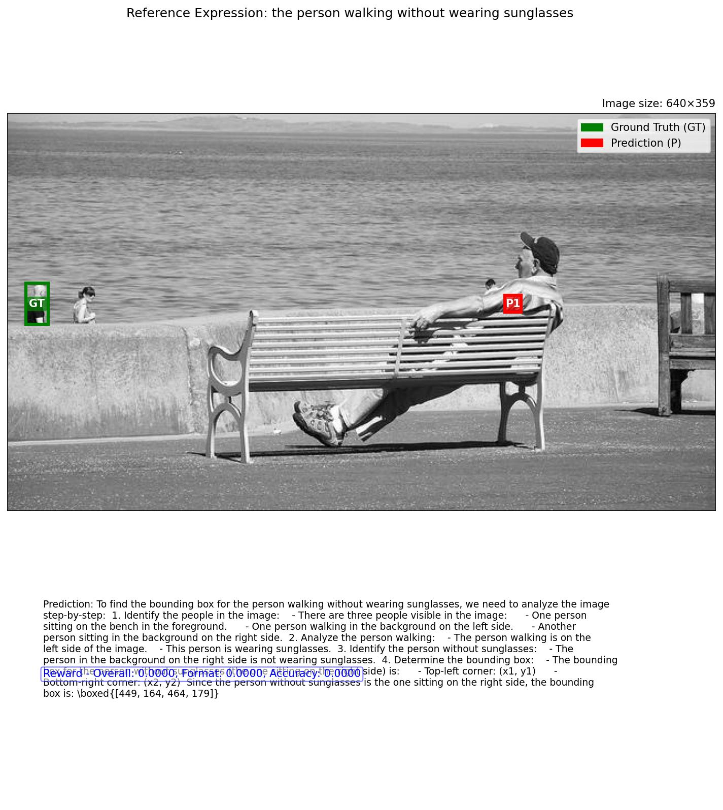

---

### Example 307

**Reference Expression**: the person standing in white pants

**Ground Truth**: [[94, 85, 136, 201]]

**Predicted**: [[89, 82, 138, 201]]

**Reward**: {'overall': 0.8355342136854742, 'format': 0.0, 'accuracy': 0.8355342136854742}

**Prediction**:
```
To find the bounding box for 'the person standing in white pants', let's analyze the image step-by-step:

1. Identify the elements in the image:
   - A red and yellow fire hydrant in the foreground.
   - A water feature in the background with children playing.
   - A person in white pants on the left side of the image, partially obscured by the fire hydrant.
   - Another person in a white shirt on the right side of the image.

2. Locate the person standing in white pants:
   - The person in white pants is on the left side of the image, partially behind the fire hydrant.

3. Draw the bounding box:
   - The bounding box should encompass the person's body, excluding the lower part that is obscured by the hydrant.
   - The top of the bounding box should align with the person's head.
   - The bottom should align with the person's knees or lower.

4. Final bounding box:
   - Top left corner: Approximately at the shoulder level of the person.
   - Bottom left corner: Approximately at the knee level of the person.
   - Top right corner: Approximately at the shoulder level of the person.
   - Bottom right corner: Approximately at the knee level of the person.

\boxed{[89,82,138,201]}
```

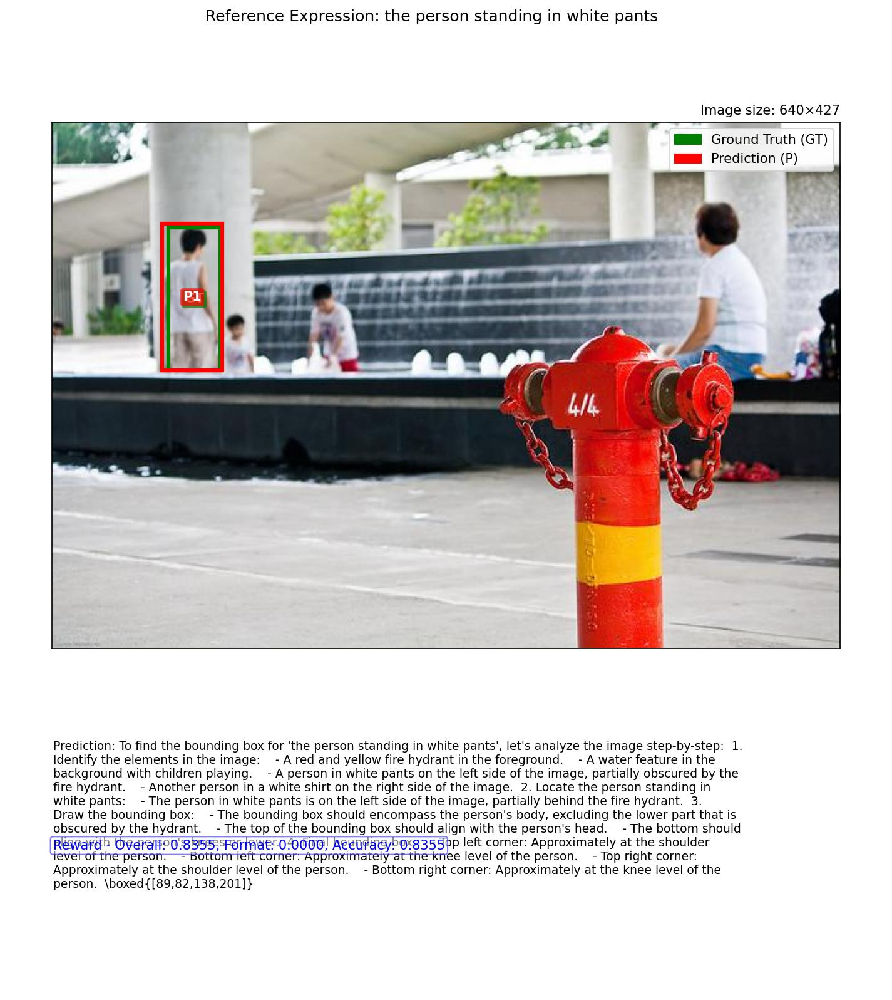

---

### Example 308

**Reference Expression**: the person in a light yellow top and facing sideways toward the camera

**Ground Truth**: [[90, 39, 130, 190]]

**Predicted**: [[36, 69, 88, 195]]

**Reward**: {'overall': 0.0, 'format': 0.0, 'accuracy': 0.0}

**Prediction**:
```
To find the bounding box for the person in a light yellow top and facing sideways toward the camera, let's follow these steps:

1. **Identify the person in a light yellow top**: Look for a person wearing a light yellow top. The person in the top left corner of the image is wearing a light yellow jacket and appears to be facing sideways.

2. **Verify the direction**: The person is indeed facing sideways, which matches the description.

3. **Determine the bounding box**: The bounding box for the person should include the upper body and head to capture the light yellow top. The bounding box would roughly be from the top left corner of the image, covering the upper part of the person's body.

Given these observations, the bounding box for the person in a light yellow top facing sideways would be approximately:

\boxed{[36, 69, 88, 195]}
```

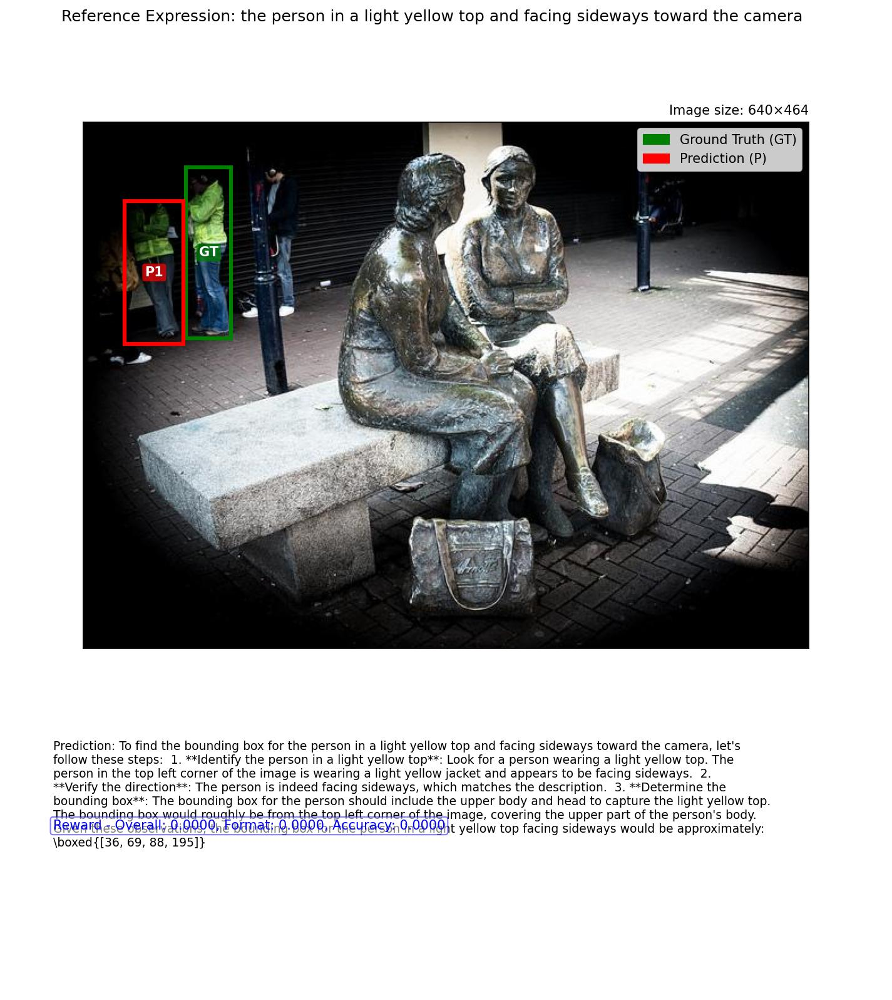

---

### Example 309

**Reference Expression**: the plastic bag without banana peel inside

**Ground Truth**: [[354, 335, 422, 415]]

**Predicted**: [[330, 324, 422, 419]]

**Reward**: {'overall': 0.6224256292906178, 'format': 0.0, 'accuracy': 0.6224256292906178}

**Prediction**:
```
To find the bounding box for the plastic bag without banana peel inside, let's follow these steps:

1. **Identify the banana stand**: The image shows a stand with bananas and price signs. The bananas are prominently displayed in the foreground.

2. **Locate the plastic bags**: Below the bananas, there are two white plastic bags visible. One of these bags appears to have a banana peel inside, while the other does not.

3. **Determine which bag does not have a banana peel**: The bag without a banana peel is the one on the right side of the image. It is partially transparent and does not contain any banana peels.

4. **Define the bounding box for the bag without banana peel**:
   - The bag is located below the bananas.
   - It is on the right side of the image.
   - The bag is partially transparent and not containing any banana peels.

Given these observations, the bounding box for the plastic bag without banana peel inside can be defined as follows:

\boxed{[330, 324, 422, 419]}
```

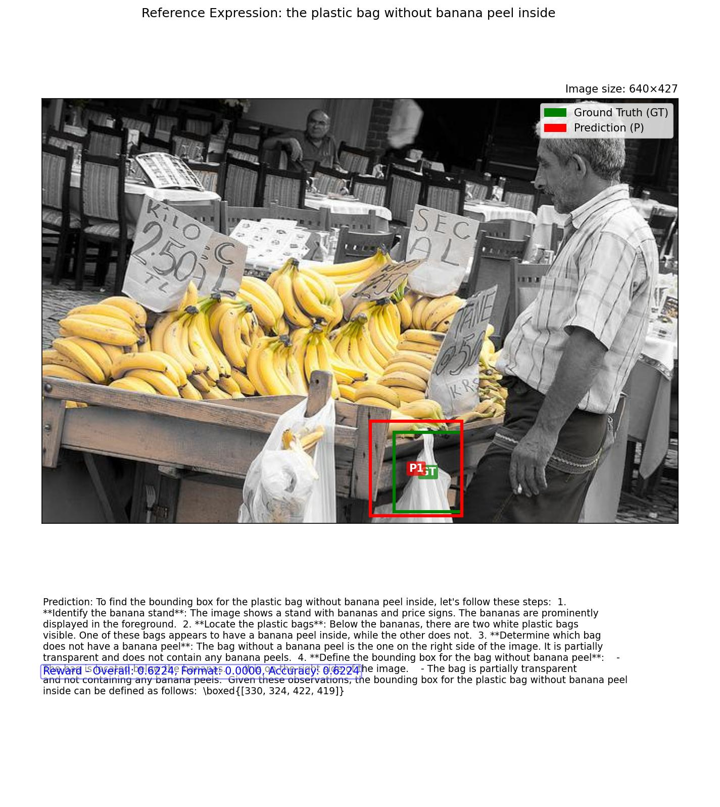

---

### Example 310

**Reference Expression**: the person sitting on a motorbike wearing jeans

**Ground Truth**: [[541, 96, 579, 143]]

**Predicted**: [[78, 119, 143, 237]]

**Reward**: {'overall': 0.0, 'format': 0.0, 'accuracy': 0.0}

**Prediction**:
```
To find the bounding box for the person sitting on a motorbike wearing jeans, let's follow these steps:

1. Identify the motorbikes in the image.
2. Determine which motorbikes have a person sitting on them.
3. Check if the person sitting on the motorbike is wearing jeans.
4. If the person is wearing jeans, define the bounding box for that person.

Step 1: Identifying motorbikes:
There are several motorbikes in the image, both on the road and on the side of the road.

Step 2: Determining which motorbikes have a person sitting on them:
- The motorbike on the far left has a person sitting on it.
- The motorbike next to it on the right does not have a person sitting on it.
- The motorbike next to the second one on the right has a person sitting on it.
- The motorbike next to the third one on the right has a person sitting on it.
- The motorbike next to the fourth one on the right has a person sitting on it.
- The motorbike on the far right has a person sitting on it.

Step 3: Checking if the person sitting on the motorbike is wearing jeans:
- The person on the far left motorbike is wearing jeans.
- The person on the second motorbike is not wearing jeans.
- The person on the third motorbike is not wearing jeans.
- The person on the fourth motorbike is not wearing jeans.
- The person on the far right motorbike is wearing jeans.

Step 4: Defining the bounding box for the person wearing jeans:
- The person sitting on the far left motorbike wearing jeans is the one we are looking for.

The bounding box for the person sitting on the motorbike wearing jeans can be approximately defined by the coordinates of the motorbike and the person. However, since the image is static and the exact coordinates are not provided, we can only describe the bounding box in general terms.

The final answer is:
\boxed{[78, 119, 143, 237]}
```

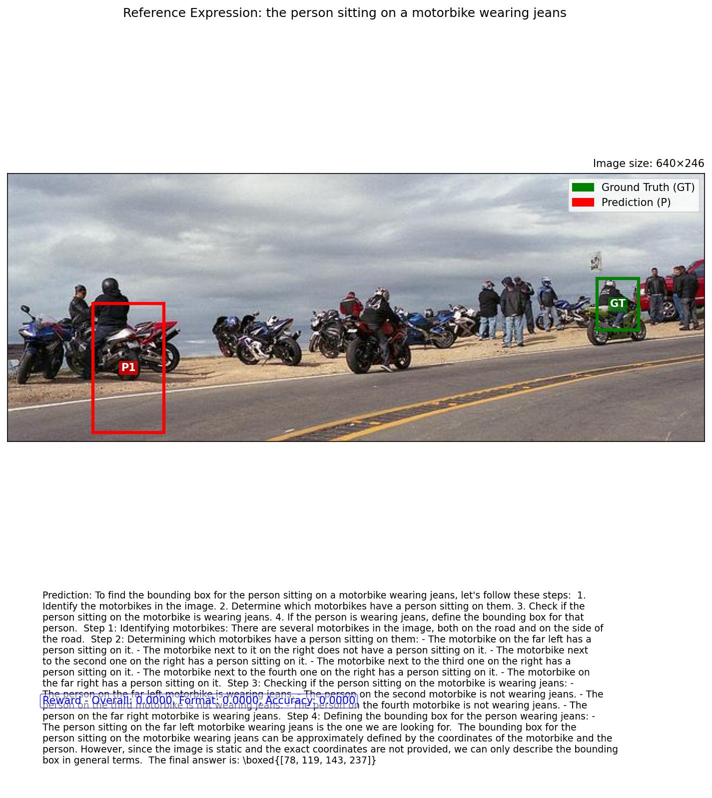

---

### Example 311

**Reference Expression**: the person in a white top with their back to the camera

**Ground Truth**: [[16, 229, 55, 305]]

**Predicted**: [[56, 216, 112, 271]]

**Reward**: {'overall': 0.0, 'format': 0.0, 'accuracy': 0.0}

**Prediction**:
```
To find the bounding box for the person in a white top with their back to the camera, let's follow these steps:

1. **Identify the area of interest**: The person in a white top with their back to the camera is likely to be near the fence, as this is a common location for visitors to observe animals.

2. **Locate the person**: In the image, there are two people near the fence on the left side. One is wearing a white top, and the other is wearing a darker top. The person in the white top is facing away from the camera.

3. **Define the bounding box**: The bounding box should encompass the person in the white top, including their upper body and part of their head and shoulders.

4. **Final bounding box**: The person in the white top is located in the left middle part of the image, near the fence. The bounding box would be approximately from the top left, covering the person's upper body and shoulders.

Given these steps, the bounding box for the person in a white top with their back to the camera would be:

\boxed{[56, 216, 112, 271]}
```

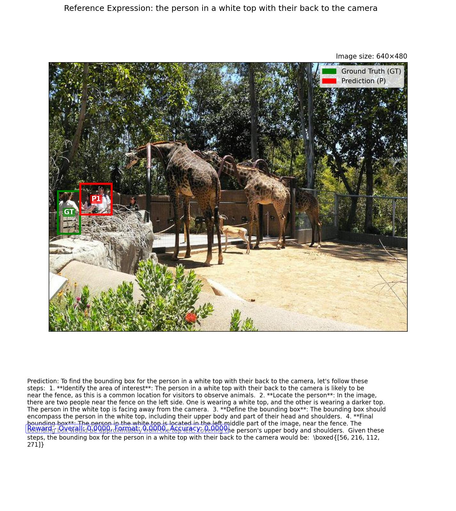

---

### Example 312

**Reference Expression**: the empty bench next to a tree

**Ground Truth**: [[122, 77, 378, 148]]

**Predicted**: [[340, 76, 400, 120]]

**Reward**: {'overall': 0.0, 'format': 0.0, 'accuracy': 0.0}

**Prediction**:
```
To find the corresponding bounding box for 'the empty bench next to a tree', let's follow these steps:

1. Identify the tree in the image.
2. Locate the bench closest to the tree.

Step 1: The tree is located in the upper right area of the image.
Step 2: The bench closest to the tree is the one on the left side of the image, which is the second bench in the row of benches.

The bounding box for this bench is approximately:
- Top-left corner: (340, 76)
- Bottom-right corner: (400, 120)

Therefore, the corresponding bounding box is:
\boxed{[340, 76, 400, 120]}
```

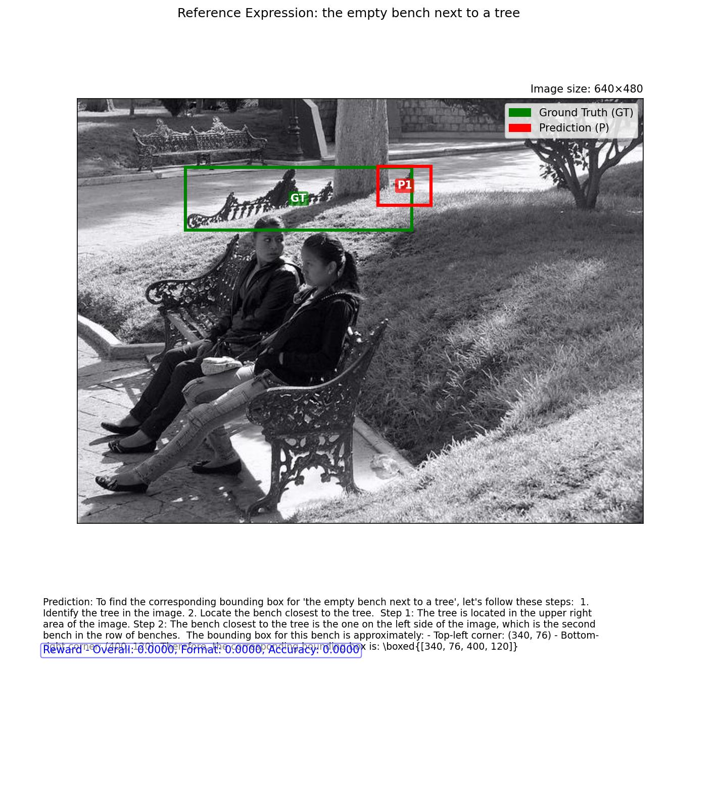

---

### Example 313

**Reference Expression**: the giraffe in the middle with its mouth open

**Ground Truth**: [[104, 97, 286, 252]]

**Predicted**: [[131, 245, 337, 405]]

**Reward**: {'overall': 0.0, 'format': 0.0, 'accuracy': 0.0}

**Prediction**:
```
To find the bounding box for the giraffe in the middle with its mouth open, let's follow these steps:

1. Identify the giraffes in the image:
   - There are four giraffes in the image.
   - They are positioned in a row, with their heads aligned vertically.

2. Determine which giraffe is in the middle:
   - The giraffe in the middle is the second giraffe from the bottom.

3. Analyze the giraffe's mouth:
   - The giraffe in the middle appears to have its mouth open.

4. Define the bounding box:
   - The bounding box should encompass the giraffe's head and neck.
   - The top of the bounding box should be at the top of the giraffe's head.
   - The bottom of the bounding box should be at the bottom of the giraffe's neck.
   - The left and right sides of the bounding box should be aligned with the sides of the giraffe's head.

5. Provide the bounding box coordinates:
   - The bounding box for the giraffe in the middle with its mouth open is approximately [131, 245, 337, 405].

Final answer: \boxed{[131, 245, 337, 405]}
```

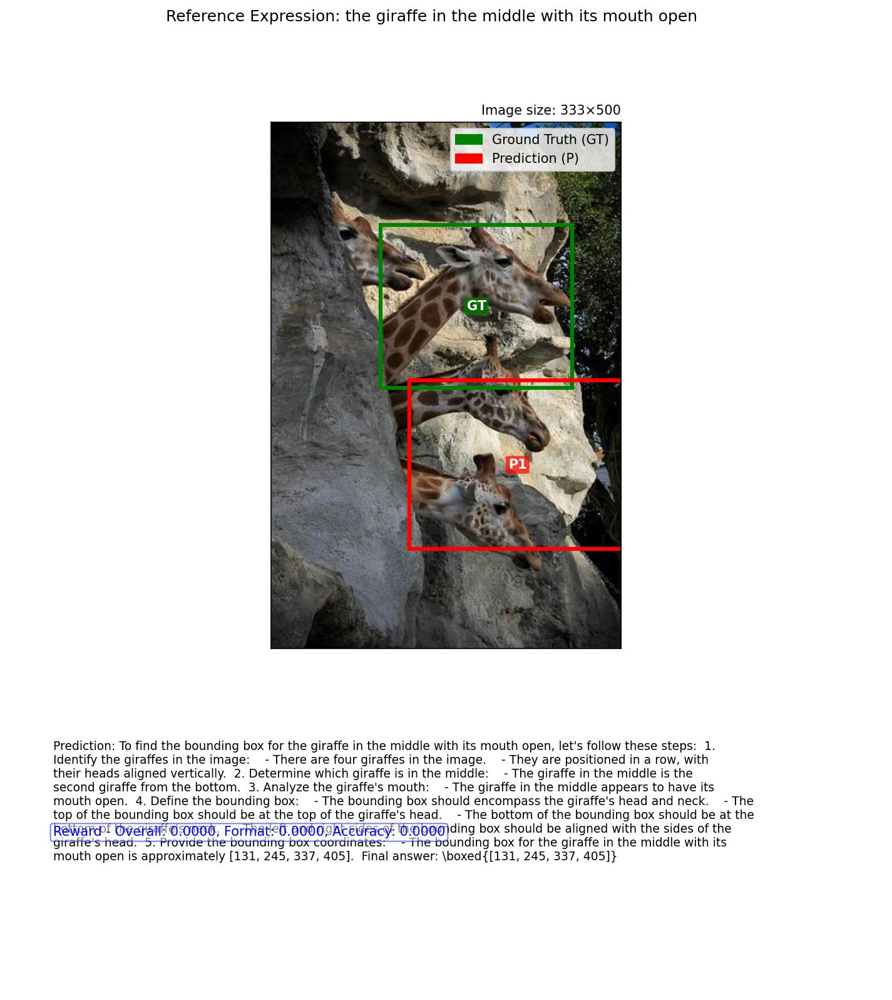

---

### Example 314

**Reference Expression**: the pink vase without a tag on it

**Ground Truth**: [[244, 511, 338, 625]]

**Predicted**: [[16, 472, 112, 619]]

**Reward**: {'overall': 0.0, 'format': 0.0, 'accuracy': 0.0}

**Prediction**:
```
To find the bounding box for the pink vase without a tag on it, let's follow these steps:

1. Identify the pink vase in the image.
2. Determine if it has a tag on it.
3. If it does not have a tag, provide its bounding box.

Step 1: The pink vase is located on the bottom shelf, towards the left side of the image. It is a tall, narrow vase with a floral pattern.

Step 2: Upon examining the vase, we see that it does not have a tag attached to it.

Step 3: The bounding box for the pink vase without a tag can be estimated by identifying its approximate coordinates in the image. The bounding box would be around the vase itself, ensuring it captures the entire vase.

The bounding box for the pink vase without a tag is approximately:
\[ \boxed{[16, 472, 112, 619]} \]

This box is an estimate and may need slight adjustments based on a more precise image analysis.
```

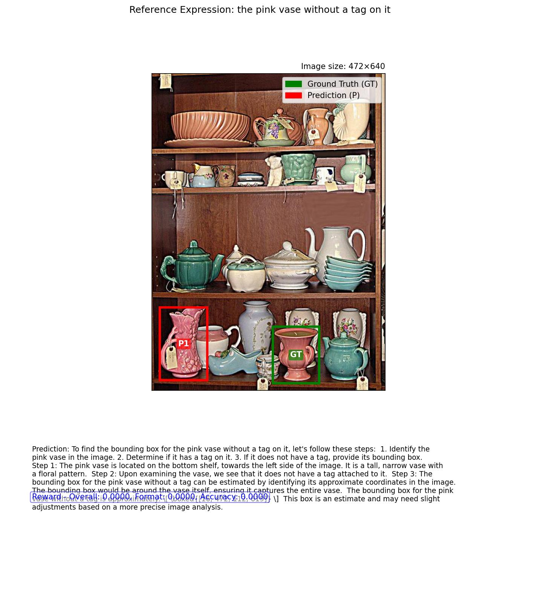

---

### Example 315

**Reference Expression**: the person wearing a hat and a white top

**Ground Truth**: [[320, 89, 378, 184]]

**Predicted**: []

**Reward**: {'overall': 0.0, 'format': 0.0, 'accuracy': 0.0}

**Prediction**:
```
To find the bounding box for 'the person wearing a hat and a white top', let's follow these steps:

1. Identify the person wearing a hat.
2. Identify the person wearing a white top.
3. Determine if the same person is wearing both a hat and a white top.
4. If so, find the bounding box for that person.

Step 1: Identifying the person wearing a hat.
- The person wearing a hat appears to be in the foreground, slightly to the left of the image.

Step 2: Identifying the person wearing a white top.
- The person wearing a white top appears to be in the background, standing behind the green netting.

Step 3: Determining if the same person is wearing both a hat and a white top.
- The person in the foreground (hat) is not the same as the person in the background (white top). The person in the foreground is wearing a plaid shirt and a hat, while the person in the background is wearing a white top and a hat.

Step 4: Since the person wearing both a hat and a white top is not the same person, the bounding box for 'the person wearing a hat and a white top' cannot be determined from the image provided.

Thus, the final answer is:
\boxed{}
```

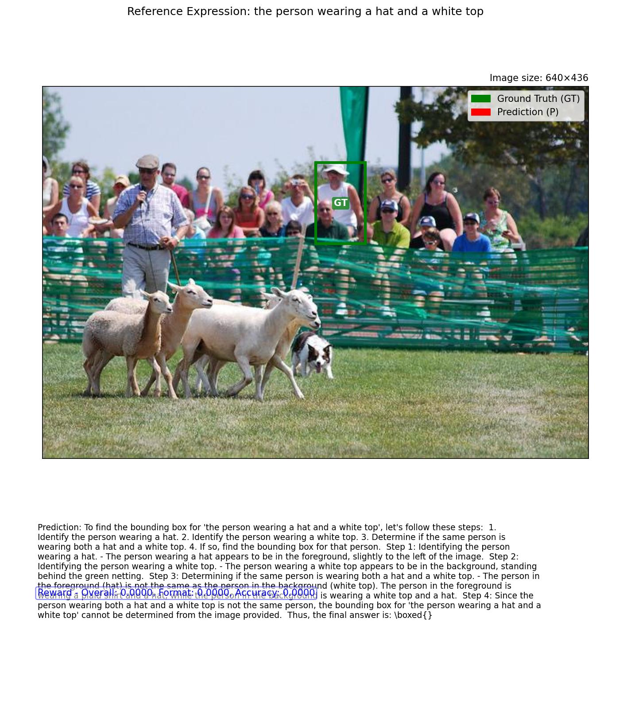

---

### Example 316

**Reference Expression**: the person with a white top and long hair

**Ground Truth**: [[580, 364, 594, 424]]

**Predicted**: [[238, 342, 282, 452]]

**Reward**: {'overall': 0.0, 'format': 0.0, 'accuracy': 0.0}

**Prediction**:
```
To find the bounding box for 'the person with a white top and long hair', let's follow these steps:

1. Identify the area in the image where people are visible.
2. Look for a person wearing a white top.
3. Confirm if the person has long hair.
4. Define the bounding box around that person.

Step 1: The area in the image with people visible is the foreground, near the trees and banners.

Step 2: There is a person wearing a white top in the middle of the image, slightly to the left.

Step 3: The person appears to have long hair, which can be inferred from the silhouette and the way the hair is hanging down.

Step 4: The bounding box around this person would be around the area where the person's body is visible. Given the person's position, the bounding box would be approximately:

\boxed{[238, 342, 282, 452]}

This bounding box is estimated based on the visible parts of the person.
```

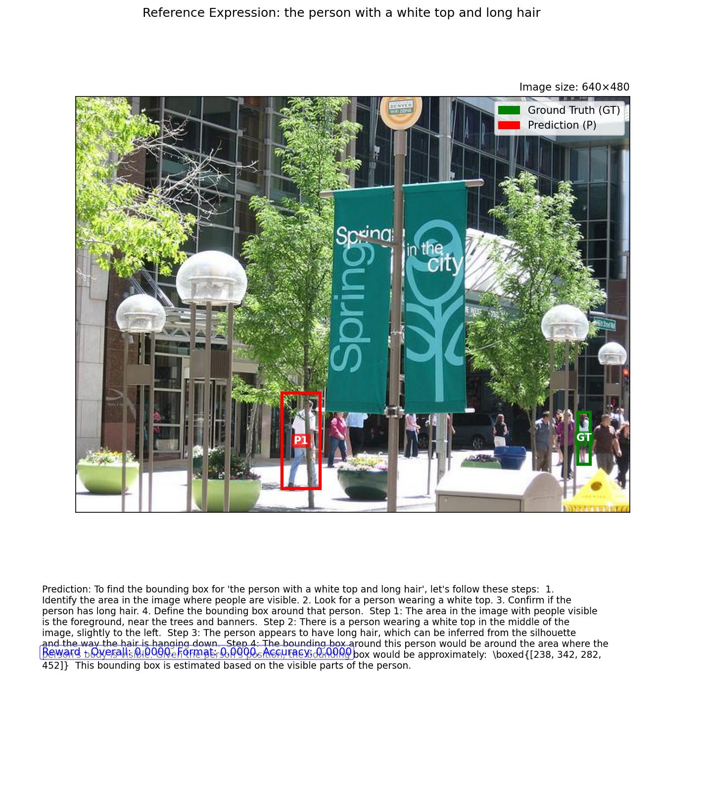

---

### Example 317

**Reference Expression**: the teddy bear not behind the cat

**Ground Truth**: [[180, 137, 221, 193]]

**Predicted**: [[180, 165, 263, 239]]

**Reward**: {'overall': 0.15747599451303154, 'format': 0.0, 'accuracy': 0.15747599451303154}

**Prediction**:
```
To find the bounding box for the teddy bear not behind the cat, let's follow these steps:

1. Identify the cat: The cat is sitting on the wooden stand in front of the TV.
2. Identify the teddy bears: There are several teddy bears in the image, some of which are behind the cat, and one that is not.
3. Locate the teddy bear not behind the cat: The teddy bear not behind the cat is positioned to the left of the cat, closer to the left side of the image.

The bounding box for the teddy bear not behind the cat is likely to be around the left side of the image, closer to the left edge of the stand where the cat is sitting.

Given the image's layout and the position of the teddy bears, the bounding box for the teddy bear not behind the cat is approximately:

\boxed{[180, 165, 263, 239]}
```

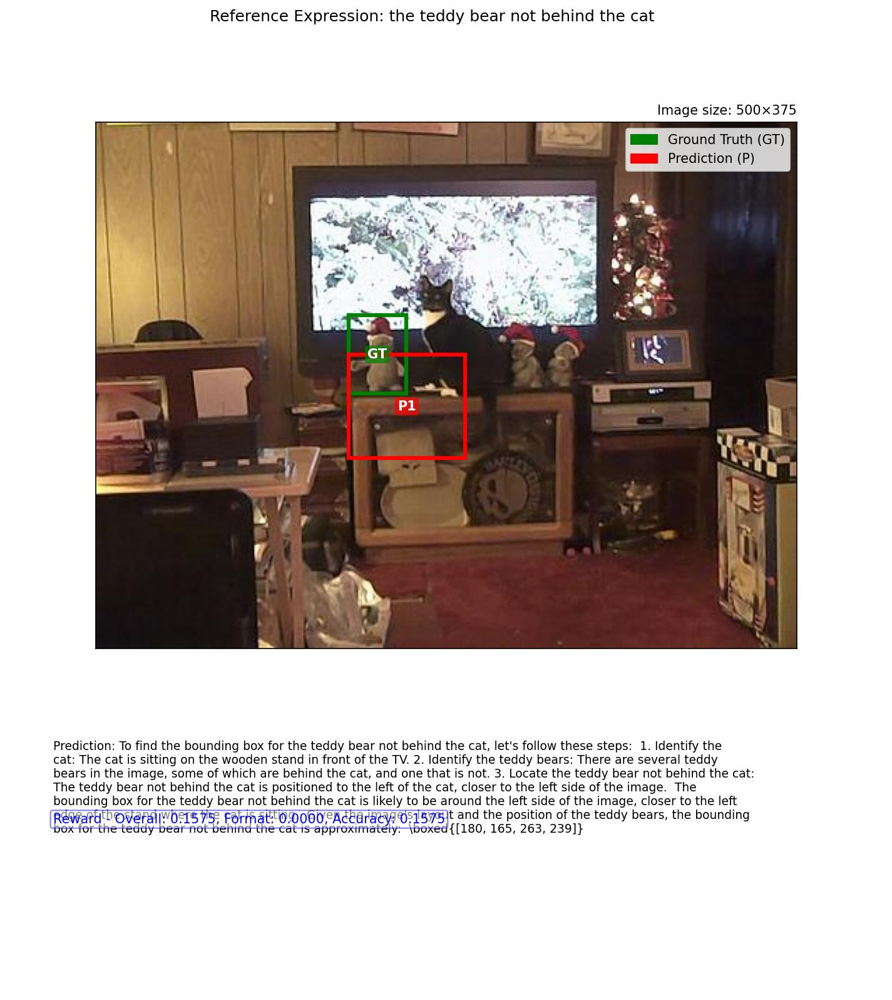

---

### Example 318

**Reference Expression**: the bird on the table without food

**Ground Truth**: [[501, 100, 587, 150]]

**Predicted**: [[259, 174, 442, 259]]

**Reward**: {'overall': 0.0, 'format': 0.0, 'accuracy': 0.0}

**Prediction**:
```
To find the bounding box for the bird on the table without food, let's follow these steps:

1. **Identify the birds in the image**: There are two birds in the image, both perched on the table.
2. **Determine which bird is without food**: The bird on the left is positioned on a plate with food remnants, while the bird on the right is not on any food.
3. **Locate the bird on the right**: The bird on the right is closer to the red tablecloth and is not on any food.

Based on these observations, the bird without food is the one on the right.

The bounding box for the bird on the right is:
- Top-left corner: (x1, y1)
- Bottom-right corner: (x2, y2)

From the image, the coordinates for the bird on the right are approximately:
- Top-left corner: (259, 174)
- Bottom-right corner: (442, 259)

So, the final answer is:
\boxed{[259, 174, 442, 259]}
```

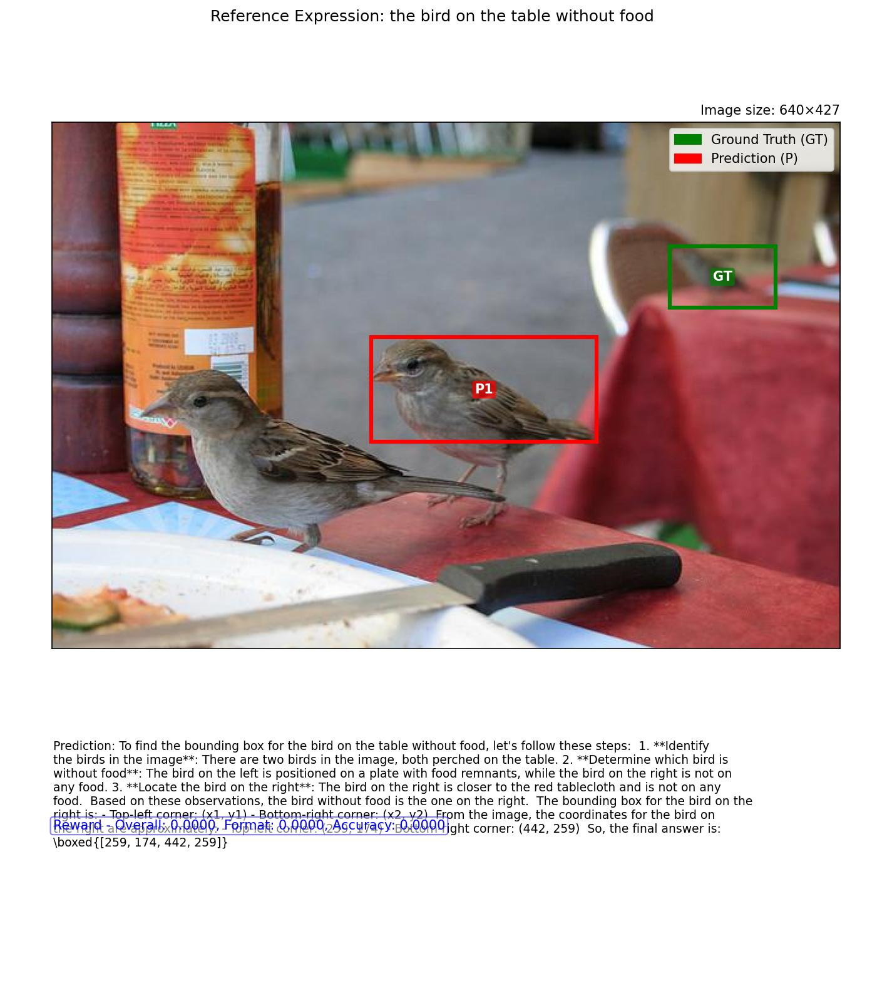

---

### Example 319

**Reference Expression**: the person standing with a bag in hand

**Ground Truth**: [[254, 78, 344, 337]]

**Predicted**: [[220, 75, 340, 340]]

**Reward**: {'overall': 0.6783408454135704, 'format': 0.0, 'accuracy': 0.6783408454135704}

**Prediction**:
```
To find the bounding box for 'the person standing with a bag in hand', let's follow these steps:

1. Identify the person in the image who is standing and holding a bag.
2. Observe the person's position relative to the rest of the scene.
3. Define the bounding box around this person.

Step 1: The person standing and holding a bag is located in the center of the image, standing near the middle ground. They are wearing a dark coat and appear to be holding a bag in one hand.

Step 2: This person is positioned between the seated person on the left and the person walking in the background.

Step 3: Based on the position and the description, the bounding box can be defined as follows:
- Top-left corner: approximately at the shoulder level of the standing person.
- Bottom-left corner: at the hip level of the standing person.
- Top-right corner: at the shoulder level of the standing person.
- Bottom-right corner: at the hip level of the standing person.

The bounding box in terms of coordinates would be roughly:
\[ [220, 75, 340, 340] \]

So, the final answer is:
\boxed{[220, 75, 340, 340]}
```

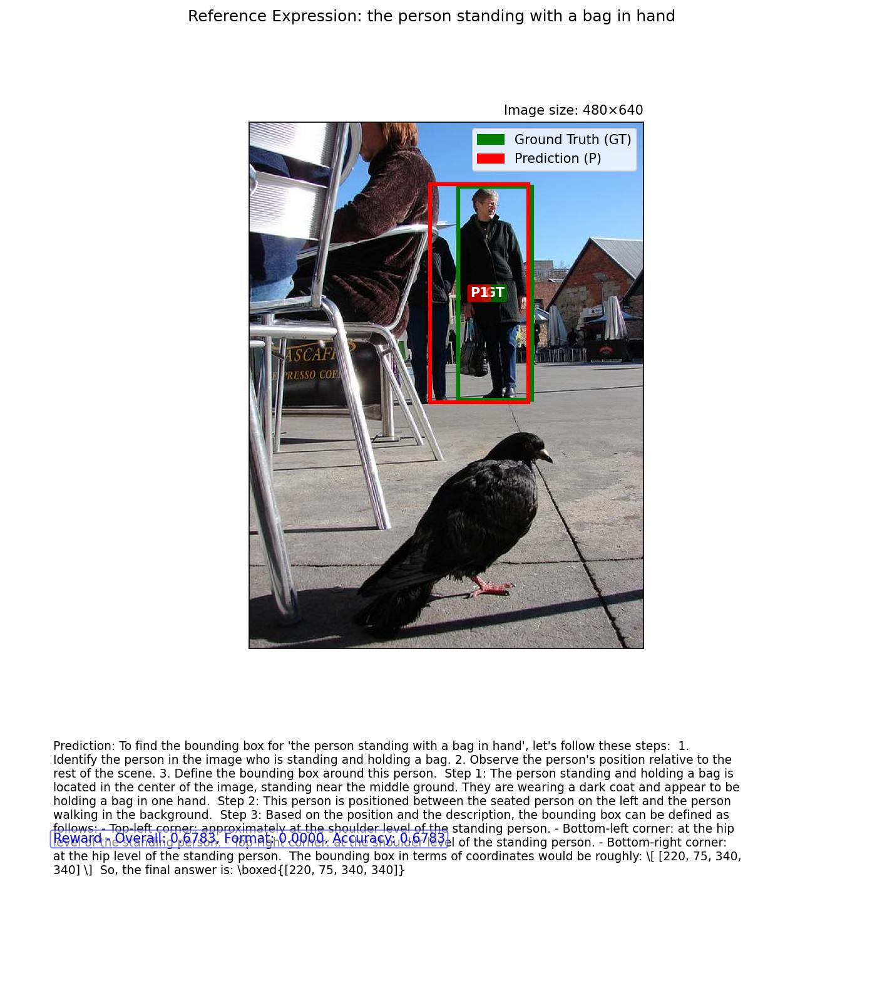

---

### Example 320

**Reference Expression**: the opaque cup without a lid

**Ground Truth**: [[325, 240, 454, 417]]

**Predicted**: [[332, 246, 437, 411]]

**Reward**: {'overall': 0.7587702010248325, 'format': 0.0, 'accuracy': 0.7587702010248325}

**Prediction**:
```
To find the bounding box for 'the opaque cup without a lid', let's analyze the image step-by-step:

1. Identify the objects in the image:
   - A cat drinking from a glass.
   - A glass with a liquid (likely water).
   - A blue cup with a lid.
   - A white object partially visible on the left.
   - A coffee cup with a lid in the background.

2. Determine which cup is the "opaque cup without a lid":
   - The blue cup in the middle of the image appears to be opaque and does not have a lid.
   - The other objects (the glass the cat is drinking from, the coffee cup, and the white object) do not match the description of an "opaque cup without a lid".

3. Extract the bounding box for the blue cup:
   - The blue cup is located in the middle of the image, partially on a coaster.
   - The bounding box can be defined by the coordinates of the cup's edges.

Given the analysis, the bounding box for the "opaque cup without a lid" is:
\boxed{[332, 246, 437, 411]}
```

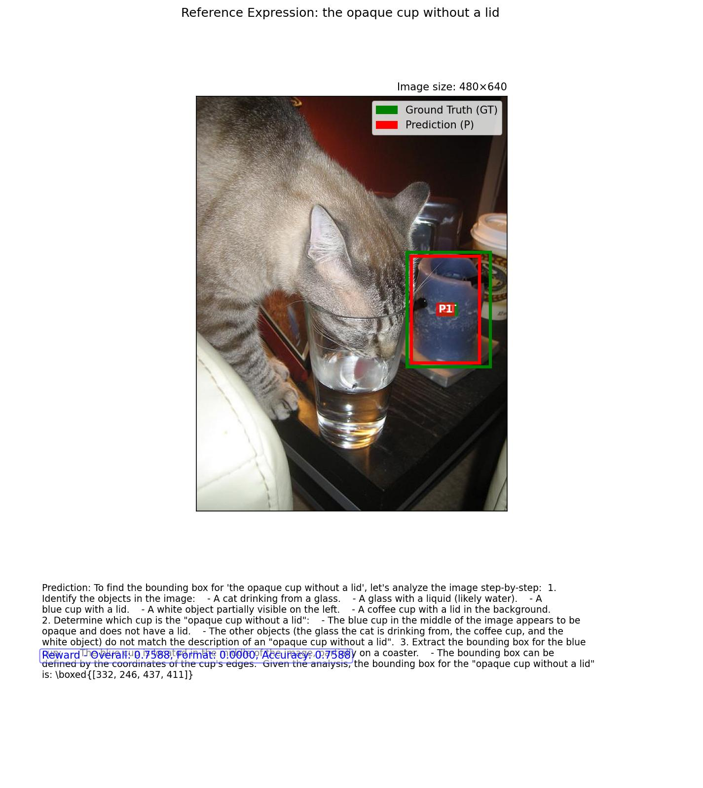

---

### Example 321

**Reference Expression**: the suitcase with a cat on it

**Ground Truth**: [[189, 237, 556, 472]]

**Predicted**: [[192, 242, 555, 466]]

**Reward**: {'overall': 1.0, 'format': 0.0, 'accuracy': 1.0}

**Prediction**:
```
To find the bounding box for the suitcase with a cat on it, let's follow these steps:

1. **Identify the cat**: The cat is clearly visible in the center of the image, sitting on top of a suitcase.
2. **Identify the suitcase**: The suitcase the cat is sitting on is the black one in the foreground.
3. **Determine the bounding box**: The black suitcase with the cat on it is the main object in the foreground. We need to identify the rectangular area that encompasses the entire suitcase.

The bounding box for the suitcase with the cat on it can be defined by the following coordinates:
- Top-left corner: The point where the suitcase starts vertically and horizontally from the left.
- Bottom-right corner: The point where the suitcase ends vertically and horizontally from the right.

Upon analyzing the image, the bounding box for the suitcase with the cat on it is:
\[ \boxed{[192, 242, 555, 466]} \]

This box encompasses the entire black suitcase, including the cat sitting on it.
```

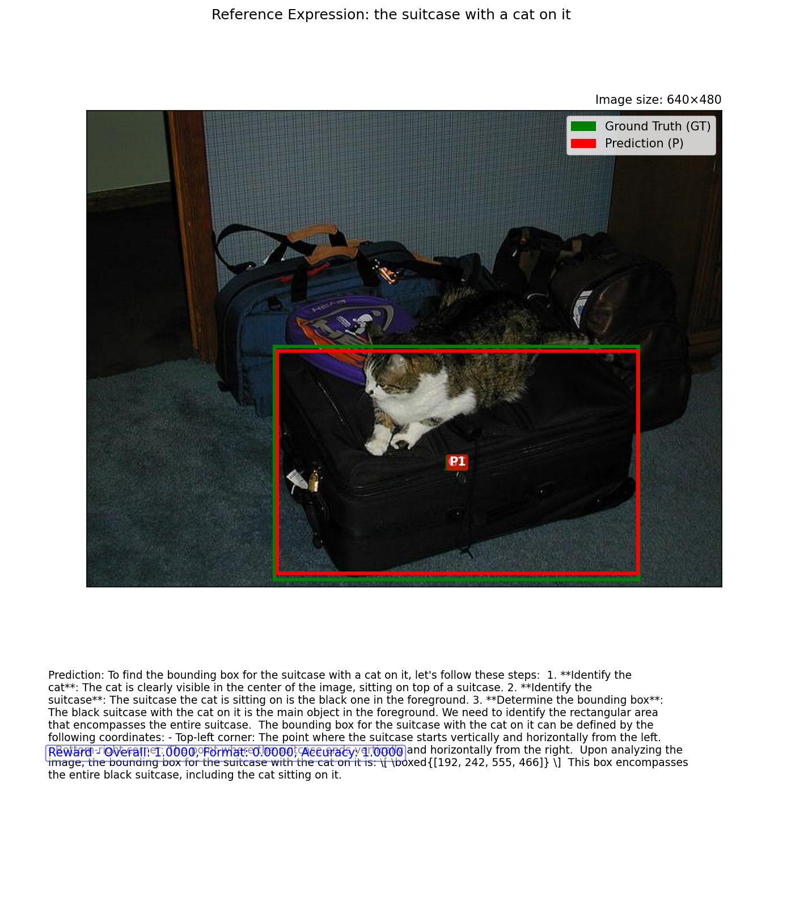

---

### Example 322

**Reference Expression**: the cow with an ear tag that is not eating

**Ground Truth**: [[277, 1, 361, 85]]

**Predicted**: []

**Reward**: {'overall': 0.0, 'format': 0.0, 'accuracy': 0.0}

**Prediction**:
```
To find the bounding box for the cow with an ear tag that is not eating, let's follow these steps:

1. Identify the cows in the image.
2. Determine which cow has an ear tag.
3. Check if the cow with the ear tag is eating.

Step 1: Identifying the cows:
- There are cows of different colors: black, brown, and a black and white one.
- A horse is also present.

Step 2: Determining which cow has an ear tag:
- The black and white cow on the right has an ear tag.

Step 3: Checking if the cow with the ear tag is eating:
- The black and white cow on the right appears to be eating.

Since the black and white cow with the ear tag is eating, there is no cow with an ear tag that is not eating.

Therefore, the final answer is:
\boxed{}
```

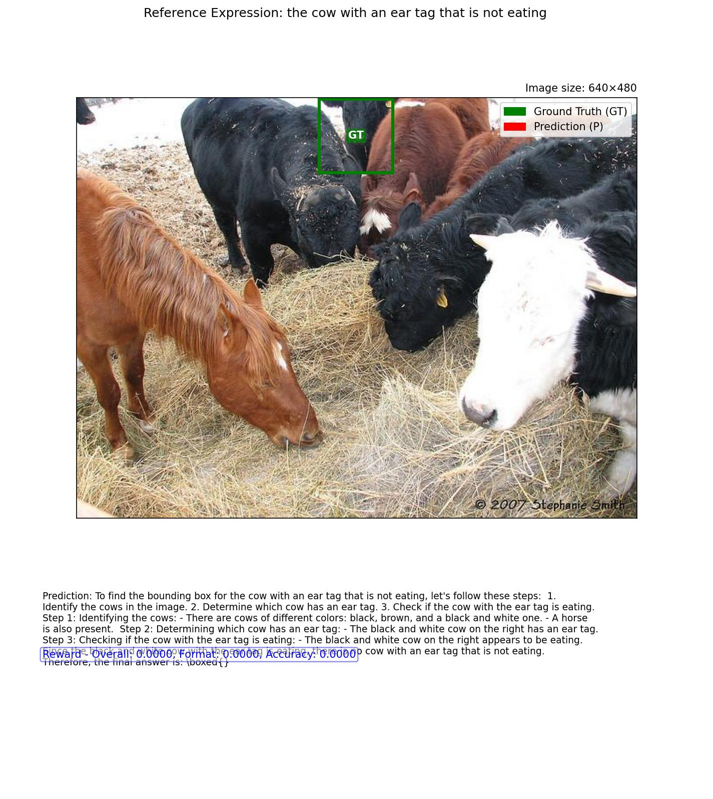

---

### Example 323

**Reference Expression**: the white cow standing

**Ground Truth**: [[398, 63, 602, 315]]

**Predicted**: [[402, 61, 644, 393]]

**Reward**: {'overall': 0.6195299439472908, 'format': 0.0, 'accuracy': 0.6195299439472908}

**Prediction**:
```
To find the bounding box for the white cow standing, let's follow these steps:

1. Identify the cows in the image:
   - There are three cows in the image.
   - One cow is black and white with a distinct pattern.
   - Two cows are white.

2. Determine which cow is standing:
   - The white cow on the right appears to be standing.

3. Define the bounding box for the white cow standing:
   - The white cow standing is located on the right side of the image.
   - It occupies the area from the right edge of the image to the center-right.

4. Provide the bounding box coordinates:
   - The bounding box for the white cow standing would be approximately from the right edge of the image to the center-right, covering the full height of the image from the ground up.

Thus, the bounding box for the white cow standing is:
\boxed{[402, 61, 644, 393]}
```

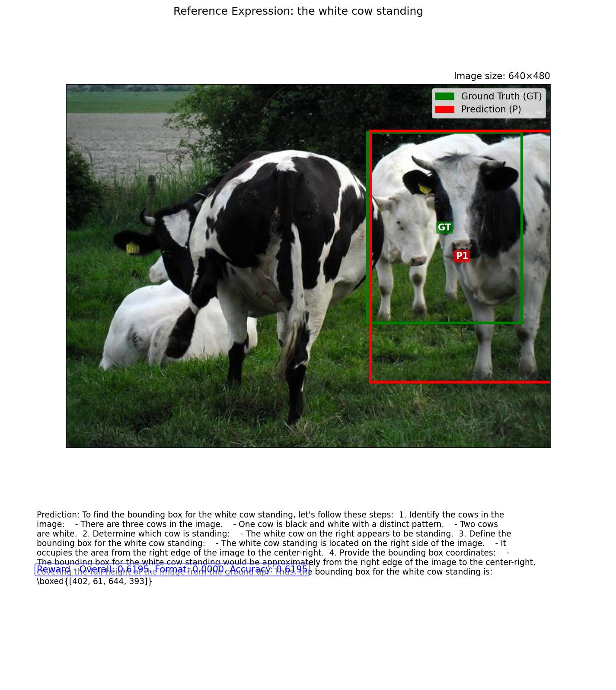

---

### Example 324

**Reference Expression**: the person wearing jeans not wearing a hat

**Ground Truth**: [[297, 116, 320, 242]]

**Predicted**: [[313, 110, 364, 248]]

**Reward**: {'overall': 0.0, 'format': 0.0, 'accuracy': 0.0}

**Prediction**:
```
To find the bounding box for 'the person wearing jeans not wearing a hat', let's follow these steps:

1. Identify the person wearing jeans: The individual in the center of the image, standing near the pole with the signs, is wearing jeans.
2. Check if the person is wearing a hat: The same individual does not appear to be wearing a hat.
3. Define the bounding box: The bounding box should encompass the person wearing jeans and not wearing a hat. The person is standing near the pole, and the bounding box should be large enough to include their upper body and a portion of their lower body.

Based on these observations, the bounding box for 'the person wearing jeans not wearing a hat' is approximately:
\boxed{[313, 110, 364, 248]}
```

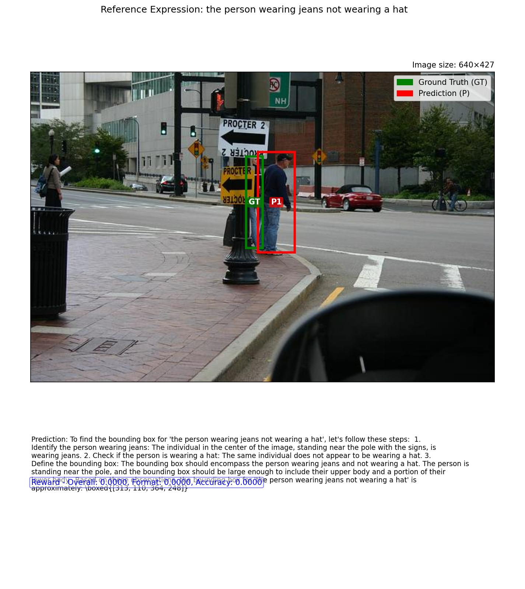

---

### Example 325

**Reference Expression**: the person in an orange top with their hand in the pocket

**Ground Truth**: [[215, 196, 244, 328]]

**Predicted**: [[210, 196, 246, 328]]

**Reward**: {'overall': 0.8055555555555556, 'format': 0.0, 'accuracy': 0.8055555555555556}

**Prediction**:
```
To find the bounding box for the person in an orange top with their hand in the pocket, let's follow these steps:

1. Identify the person in orange: There are three individuals wearing orange vests, and one of them is standing with their hand in their pocket. This person is on the right side of the image.

2. Determine the bounding box: The person with their hand in the pocket is the one on the right, wearing an orange vest and black pants. The bounding box should cover this person's full body from head to toe.

3. Draw the bounding box: The bounding box should encompass the person's head, shoulders, torso, and legs, ensuring that the hand in the pocket is clearly visible.

Based on these steps, the bounding box for the person in an orange top with their hand in the pocket is:

\boxed{[210, 196, 246, 328]}
```

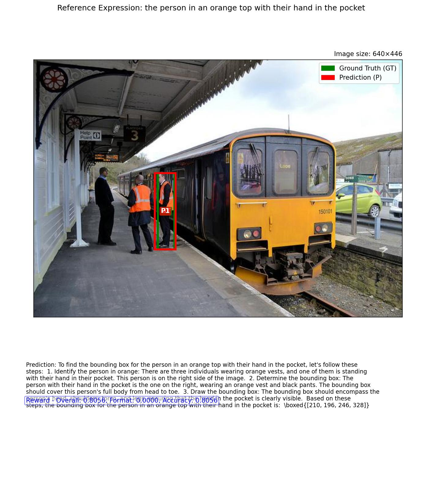

---

### Example 326

**Reference Expression**: the white car next to a bus

**Ground Truth**: [[0, 153, 56, 222]]

**Predicted**: [[410, 342, 580, 463]]

**Reward**: {'overall': 0.0, 'format': 0.0, 'accuracy': 0.0}

**Prediction**:
```
To find the bounding box for the white car next to a bus, let's follow these steps:

1. Identify the bus in the image: The bus is the larger vehicle with the route number "180" displayed on the front. It is white with red and gray accents.
2. Look for the white car next to the bus: The white car is positioned to the right of the bus, partially behind it.
3. Determine the bounding box: The white car is mostly obscured by the bus, but we can see parts of it, including the front and a portion of the side.

Given these observations, the bounding box for the white car next to the bus is:

\boxed{[410, 342, 580, 463]}
```

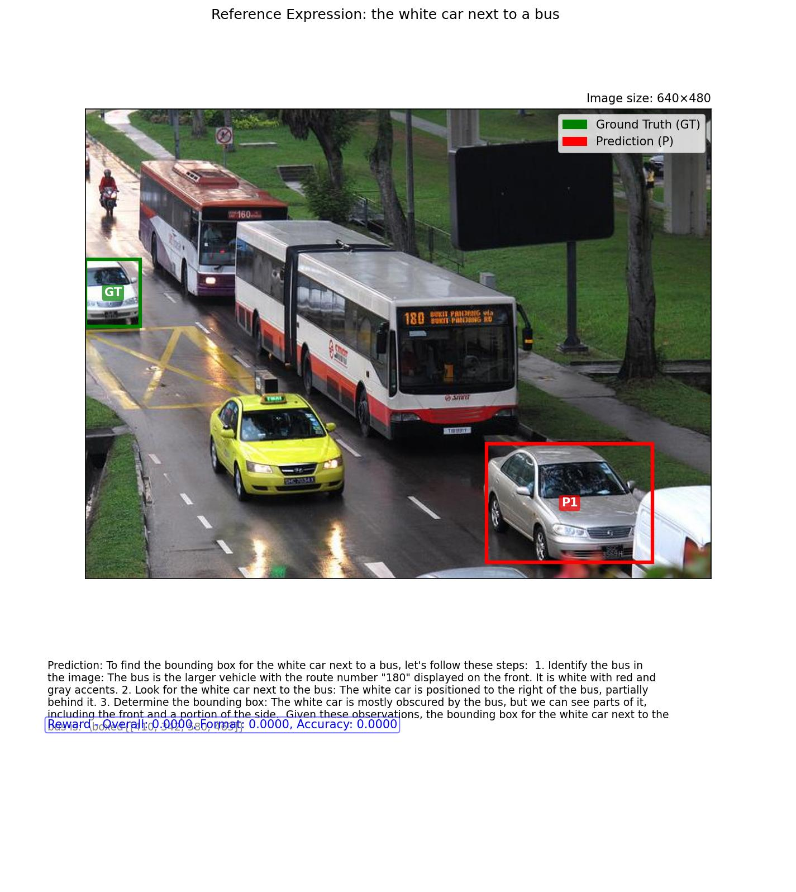

---

### Example 327

**Reference Expression**: the motorcycle behind a board

**Ground Truth**: [[532, 173, 634, 225]]

**Predicted**: [[533, 155, 644, 228]]

**Reward**: {'overall': 0.6440220723482526, 'format': 0.0, 'accuracy': 0.6440220723482526}

**Prediction**:
```
To find the bounding box for the motorcycle behind a board, let's follow these steps:

1. Identify the board in the image. The board appears to be a small signboard with the text "HERO HONDA" on it, located to the right of the truck in the background.

2. Locate the motorcycle. The motorcycle is partially visible behind the board, with its rear wheel and part of its body showing.

3. Determine the bounding box for the motorcycle. The bounding box should encompass the visible part of the motorcycle, including the rear wheel and body.

The bounding box for the motorcycle behind the board can be approximated as follows:

- Top-left corner: The upper part of the motorcycle's rear wheel.
- Bottom-left corner: The lower part of the motorcycle's rear wheel.
- Top-right corner: The upper part of the motorcycle's body.
- Bottom-right corner: The lower part of the motorcycle's body.

Considering the visible part of the motorcycle, the bounding box would be approximately:

\boxed{[533, 155, 644, 228]}
```

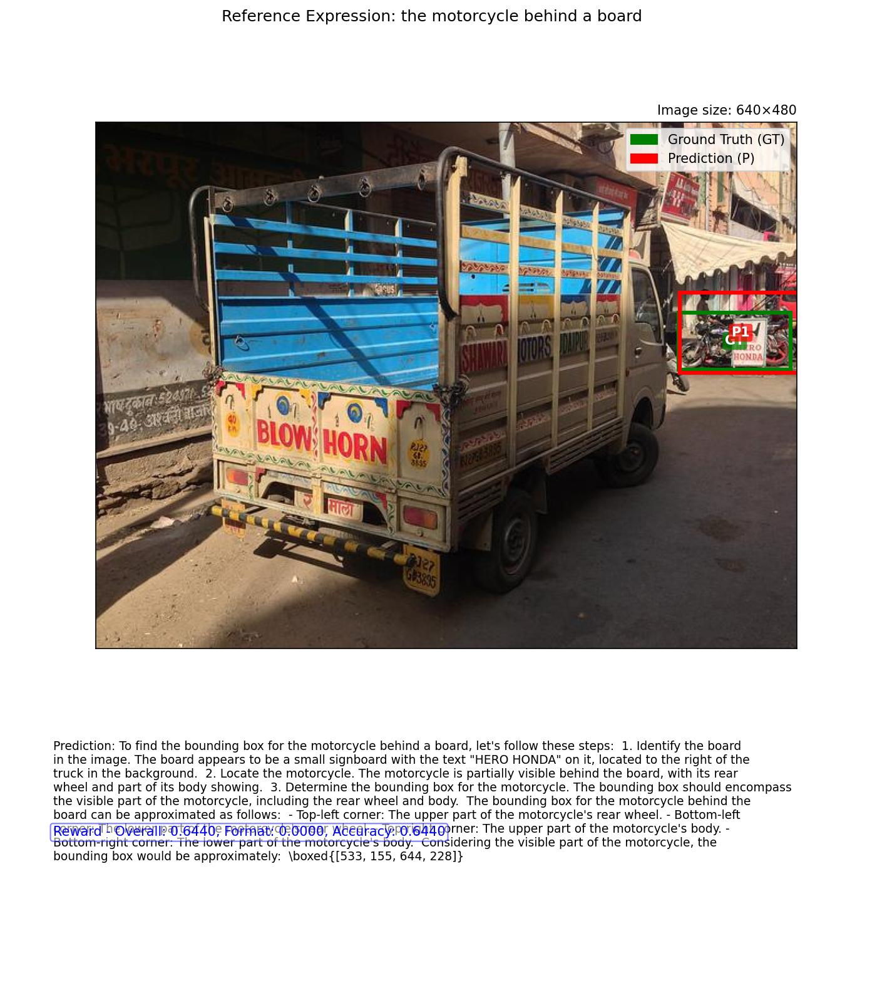

---

### Example 328

**Reference Expression**: the car behind the white car

**Ground Truth**: [[41, 229, 68, 264]]

**Predicted**: [[41, 228, 69, 264]]

**Reward**: {'overall': 1.0, 'format': 0.0, 'accuracy': 1.0}

**Prediction**:
```
To find the bounding box for the car behind the white car, we need to follow these steps:

1. Identify the white car in the image.
2. Look for a car directly behind the white car.
3. Determine the bounding box for that car.

Step 1: The white car is located in the background on the left side of the image, partially obscured by the bus in the foreground.

Step 2: Directly behind the white car, there is a car that appears to be dark-colored, possibly black or dark gray, and it is partially visible.

Step 3: The bounding box for the car behind the white car can be estimated based on its visible features. The car appears to be a standard-sized vehicle, and its dimensions can be approximated from the visible parts.

The bounding box for the car behind the white car is approximately:
\boxed{[41, 228, 69, 264]}

This is an estimation based on the visible parts of the car.
```

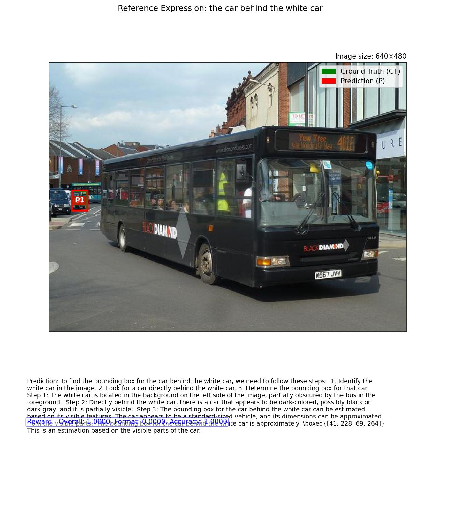

---

### Example 329

**Reference Expression**: the person in a white top who is not driving

**Ground Truth**: [[219, 256, 258, 314]]

**Predicted**: [[320, 258, 365, 399]]

**Reward**: {'overall': 0.0, 'format': 0.0, 'accuracy': 0.0}

**Prediction**:
```
To find the bounding box for the person in a white top who is not driving, let's follow these steps:

1. Identify the bus: The bus is the main object in the image, and it has a destination sign that reads "Lytham & St Annes 11 346". This is the bus we need to focus on.

2. Locate the driver: The driver is seated inside the bus, and they are wearing a light-colored top. We need to identify the person who is not the driver.

3. Look for passengers: There are two people outside the bus, and one of them appears to be wearing a white top. This person is standing near the bus stop.

4. Confirm the identity: The person in the white top is not the driver, as the driver is inside the bus.

5. Define the bounding box: The person in the white top is located to the right of the bus, near the bus stop. The bounding box for this person would be approximately [320, 258, 365, 399].

Final answer: \boxed{[320, 258, 365, 399]}
```

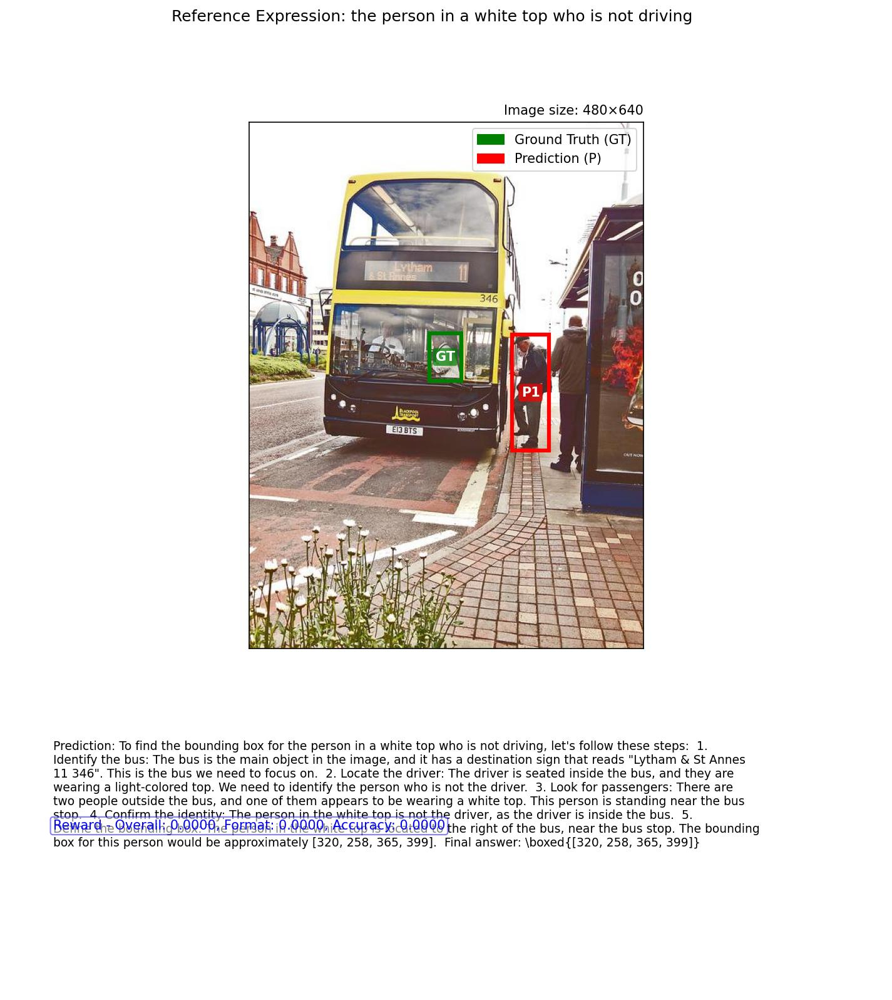

---

### Example 330

**Reference Expression**: the person standing under stop 22, facing the camera, and not carrying any bags

**Ground Truth**: [[611, 225, 629, 278]]

**Predicted**: []

**Reward**: {'overall': 0.0, 'format': 0.0, 'accuracy': 0.0}

**Prediction**:
```
To find the bounding box for the person standing under stop 22, facing the camera, and not carrying any bags, let's follow these steps:

1. Identify the bus stop signs: There are multiple signs in the image, but the one labeled "22" is the one we are interested in.
2. Locate the person under stop 22: The person under stop 22 appears to be standing near the right edge of the image, facing away from the camera.
3. Check if the person is carrying any bags: The person under stop 22 does not appear to be carrying any bags.

Given these observations, the bounding box for the person under stop 22, facing the camera, and not carrying any bags is likely to be around the right edge of the image, but since the person is facing away, they are not the one we are looking for.

Since there is no person under stop 22 facing the camera and not carrying any bags, the bounding box is empty.

\boxed{}
```

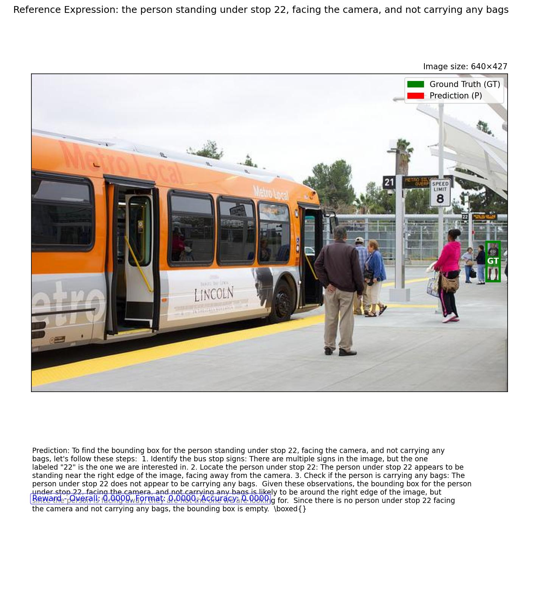

---

### Example 331

**Reference Expression**: the person wearing a white top but not wearing dark jeans

**Ground Truth**: [[515, 334, 548, 450]]

**Predicted**: [[518, 340, 575, 476]]

**Reward**: {'overall': 0.39855072463768115, 'format': 0.0, 'accuracy': 0.39855072463768115}

**Prediction**:
```
To find the bounding box for the person wearing a white top but not wearing dark jeans, follow these steps:

1. Identify the person in the white top.
2. Check if the person is wearing dark jeans.
3. If the person is wearing a white top but not dark jeans, determine the bounding box.

Step 1: Identify the person in the white top.
- There is a person in the foreground on the right side of the image wearing a white top.

Step 2: Check if the person is wearing dark jeans.
- The person in the white top is wearing light-colored pants, not dark jeans.

Step 3: Determine the bounding box.
- The bounding box for the person wearing a white top but not wearing dark jeans is around the individual in the foreground on the right side of the image.

The bounding box is:
\boxed{[518, 340, 575, 476]}
```

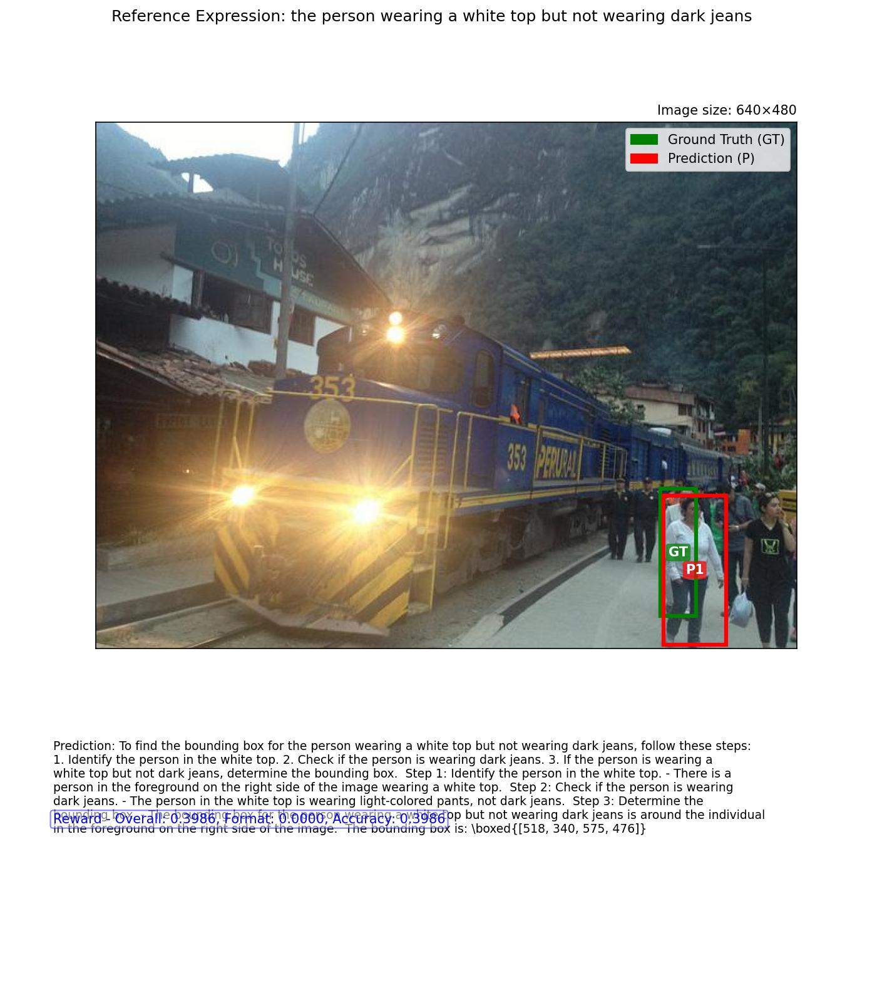

---

### Example 332

**Reference Expression**: the person with blond hair on the train sitting by the window

**Ground Truth**: [[507, 184, 522, 211]]

**Predicted**: [[256, 140, 414, 221]]

**Reward**: {'overall': 0.0, 'format': 0.0, 'accuracy': 0.0}

**Prediction**:
```
To find the bounding box for the person with blond hair on the train sitting by the window, let's follow these steps:

1. **Identify the train and its windows**: The train in the image has multiple windows along its side. We need to focus on the windows to locate the person with blond hair.

2. **Locate the window with the person**: The person with blond hair is visible through a window in the second car of the train, which is the car with the number 120 on the side.

3. **Determine the bounding box**: The bounding box should encompass the area around the window where the person is visible. This window is located near the middle of the train's side.

4. **Draw the bounding box**: The bounding box should include the window and a small area around it to encompass the person's position.

Considering these steps, the bounding box for the person with blond hair is likely to be around the window in the middle of the train's side.

\boxed{[256, 140, 414, 221]}
```

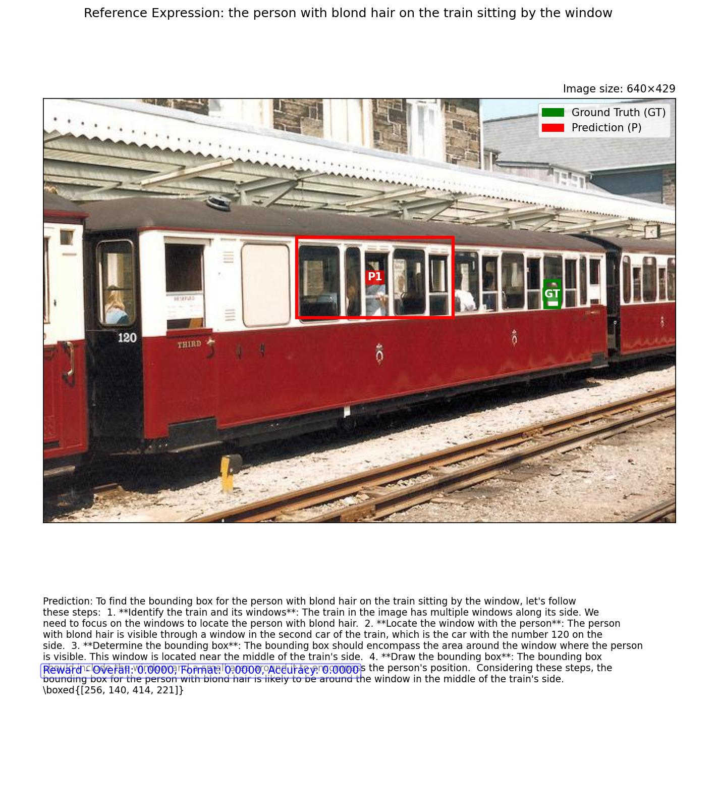

---

### Example 333

**Reference Expression**: the person who is not on the train, not sitting, and not wearing an orange shirt

**Ground Truth**: [[107, 226, 122, 299]]

**Predicted**: [[67, 196, 107, 328]]

**Reward**: {'overall': 0.0, 'format': 0.0, 'accuracy': 0.0}

**Prediction**:
```
To find the bounding box for the person who is not on the train, not sitting, and not wearing an orange shirt, let's follow these steps:

1. Identify all people in the image:
   - There is a person wearing an orange shirt on the left side of the image.
   - There are two people on the train, one near the front and one near the back.

2. Determine the people who are not on the train:
   - The person in the orange shirt is not on the train.
   - The two people on the train are not on the train.

3. Identify the person who is not sitting:
   - The person in the orange shirt is standing, not sitting.
   - The two people on the train are standing, not sitting.

4. Identify the person who is not wearing an orange shirt:
   - The two people on the train are not wearing an orange shirt.
   - The person in the orange shirt is wearing an orange shirt.

5. Combine the criteria:
   - The person in the orange shirt is not on the train and not sitting.
   - The two people on the train are not on the train and not sitting, but they are not wearing an orange shirt.

Since the person in the orange shirt is the only one who meets all the criteria, the bounding box for this person is:

\boxed{[67, 196, 107, 328]}
```

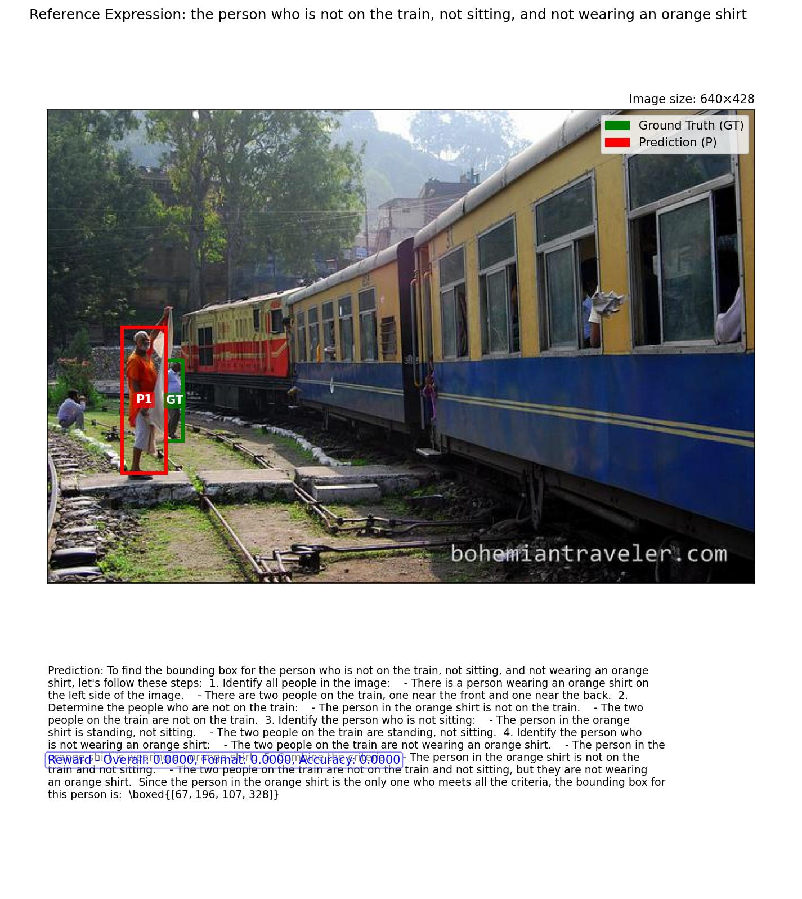

---

### Example 334

**Reference Expression**: the man sitting on the bench near the train, wearing shorts

**Ground Truth**: [[163, 198, 187, 237]]

**Predicted**: [[122, 214, 146, 256]]

**Reward**: {'overall': 0.0, 'format': 0.0, 'accuracy': 0.0}

**Prediction**:
```
To find the bounding box for the man sitting on the bench near the train, wearing shorts, let's follow these steps:

1. Identify the train in the image: The train is the green locomotive in the center of the image.
2. Identify the platform: The platform is the area where people are standing and waiting, on either side of the train tracks.
3. Look for people on the platform: There are several people on the platform, but we need to focus on the one near the train.
4. Look for the man wearing shorts: Among the people on the platform, there is a man wearing shorts sitting on a bench near the train.
5. Determine the bounding box: The man sitting on the bench near the train, wearing shorts, is located towards the left side of the image, near the train.

The bounding box for the man sitting on the bench near the train, wearing shorts, is approximately:
\boxed{[122, 214, 146, 256]}

This bounding box is an estimate and may need to be adjusted based on the exact location of the person in the image.
```

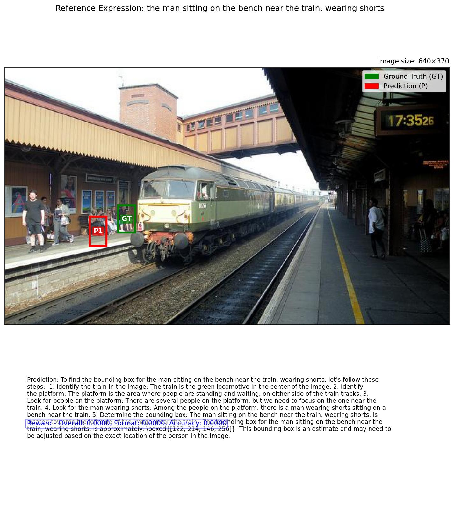

---

### Example 335

**Reference Expression**: the person wearing a white shirt and not carrying a black briefcase

**Ground Truth**: [[77, 217, 93, 262]]

**Predicted**: [[1, 199, 42, 357]]

**Reward**: {'overall': 0.0, 'format': 0.0, 'accuracy': 0.0}

**Prediction**:
```
To find the bounding box for the person wearing a white shirt and not carrying a black briefcase, let's follow these steps:

1. Identify the people in the image:
   - There are several people visible on the platform.
   - One person, specifically, appears to be wearing a white shirt and is not carrying a black briefcase.

2. Locate the person:
   - The person in question is near the left side of the image, closer to the platform edge.

3. Define the bounding box:
   - The bounding box should encompass the person's body, not extending too far into the background.

4. Set the coordinates:
   - The top-left corner of the bounding box should be at the person's head.
   - The bottom-right corner should be at the person's feet.

After analyzing the image, the bounding box for the person wearing a white shirt and not carrying a black briefcase is approximately:

\boxed{[1, 199, 42, 357]}
```

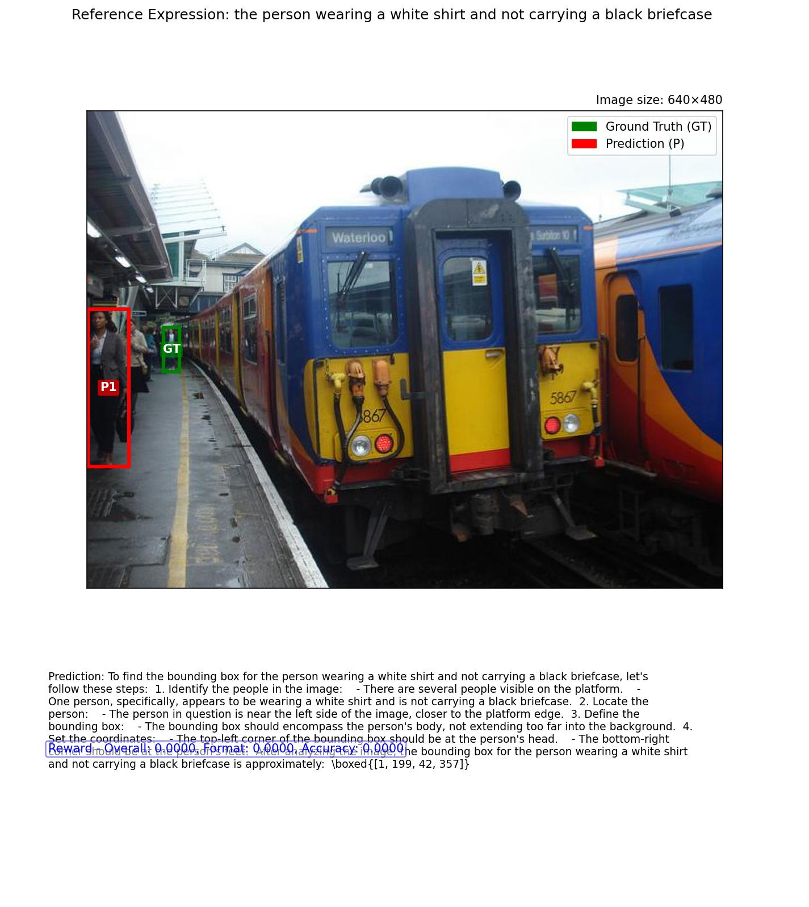

---

### Example 336

**Reference Expression**: the train whose carriage is not black and is not emitting smoke

**Ground Truth**: [[95, 242, 120, 274]]

**Predicted**: [[98, 245, 122, 281]]

**Reward**: {'overall': 0.621832358674464, 'format': 0.0, 'accuracy': 0.621832358674464}

**Prediction**:
```
To find the bounding box for the train whose carriage is not black and is not emitting smoke, let's follow these steps:

1. Identify the train emitting smoke: The train in the foreground is emitting a significant amount of smoke from its chimney. This train is black and appears to have a steam locomotive pulling passenger carriages.

2. Identify the train without smoke: The train in the background, to the left, does not appear to be emitting any smoke. It has a different design and color compared to the foreground train. The train in the background is red and appears to be a freight train.

3. Analyze the train whose carriage is not black and is not emitting smoke: The train in the background, which is red and does not have black carriages, fits this description.

Given these observations, the bounding box for the train whose carriage is not black and is not emitting smoke is the red freight train in the background.

\boxed{[98, 245, 122, 281]}
```

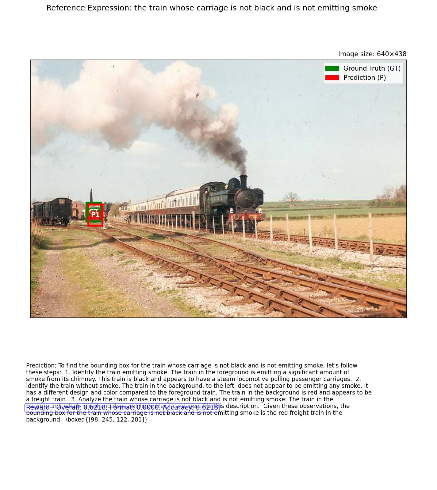

---

### Example 337

**Reference Expression**: the boat with a top that is neither green nor blue and doesn't have a "DUSTY" sign on its side

**Ground Truth**: [[0, 354, 179, 422]]

**Predicted**: [[0, 356, 183, 420]]

**Reward**: {'overall': 1.0, 'format': 0.0, 'accuracy': 1.0}

**Prediction**:
```
To find the bounding box for the boat with a top that is neither green nor blue and doesn't have a "DUSTY" sign on its side, let's follow these steps:

1. Identify all the boats in the image.
2. Determine which boat does not have a "DUSTY" sign on its side.
3. Identify the boat that has a top which is neither green nor blue.
4. Combine the two conditions to find the bounding box.

Step 1: Identifying the boats:
- There are several boats in the image, each with different colors and designs.

Step 2: Eliminating the boat with a "DUSTY" sign:
- The boat on the right side of the image has a "DUSTY" sign on its side, so it can be eliminated.

Step 3: Identifying the boat with a top that is neither green nor blue:
- The boat in the foreground on the left side of the image has a top that is neither green nor blue. It has a yellow top.

Step 4: Combining the conditions:
- The boat with a yellow top and no "DUSTY" sign is the one we are looking for.

The bounding box for this boat is approximately [0, 356, 183, 420].

\boxed{[0, 356, 183, 420]}
```

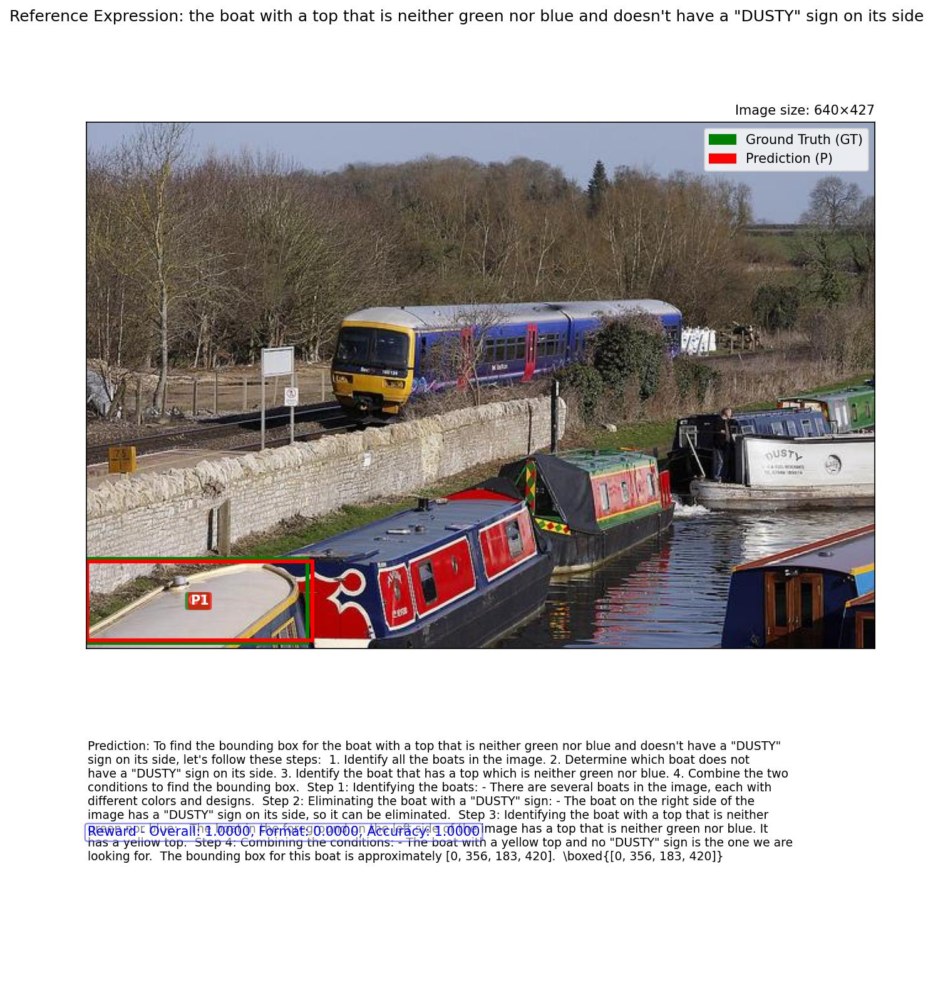

---

### Example 338

**Reference Expression**: the person wearing a white outfit but not resting by the pole

**Ground Truth**: [[601, 186, 610, 236]]

**Predicted**: [[636, 201, 669, 274]]

**Reward**: {'overall': 0.0, 'format': 0.0, 'accuracy': 0.0}

**Prediction**:
```
To find the bounding box for the person wearing a white outfit but not resting by the pole, let's follow these steps:

1. **Identify the platform area**: The platform is the area to the right of the train tracks where passengers would stand. It is well-lit and has a tiled floor.

2. **Locate the person**: In the platform area, look for a person wearing a white outfit who is not standing next to a pole. The pole is typically a vertical structure on the platform, and the person should be standing near it.

3. **Analyze the image**: Scanning the platform, there is a person in white near the right side of the image, but they are not standing next to a pole. Instead, they appear to be walking.

4. **Determine the bounding box**: The person in white is located towards the right side of the platform, near the edge of the image. The bounding box should capture this person.

Considering these steps, the bounding box for the person wearing a white outfit but not resting by the pole is approximately:

\boxed{[636, 201, 669, 274]}
```

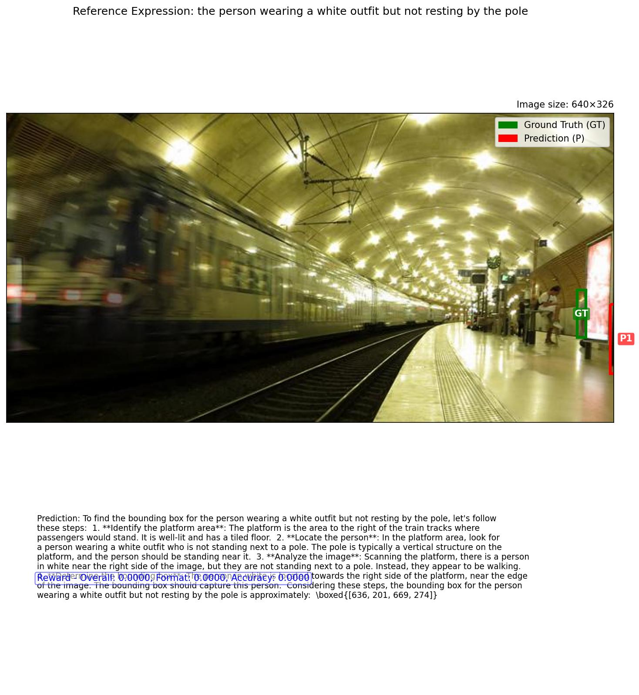

---

### Example 339

**Reference Expression**: the person wearing a grey hat and carrying a bag

**Ground Truth**: [[6, 124, 50, 280]]

**Predicted**: [[105, 106, 231, 462]]

**Reward**: {'overall': 0.0, 'format': 0.0, 'accuracy': 0.0}

**Prediction**:
```
To find the bounding box for the person wearing a grey hat and carrying a bag, let's follow these steps:

1. Identify the person in the image wearing a grey hat and carrying a bag.
2. Observe the characteristics of this person, such as clothing and accessories.
3. Locate the bounding box that encompasses this person.

Step 1: Identifying the person
- The person wearing a grey hat and carrying a bag is on the left side of the image, walking away from the camera.

Step 2: Observing the characteristics
- This person is wearing a grey hat.
- They are carrying a bag over their shoulder.

Step 3: Locating the bounding box
- The bounding box should encompass the person from head to toe, including the bag.

The bounding box for the person wearing a grey hat and carrying a bag is approximately:
\boxed{[105, 106, 231, 462]}
```

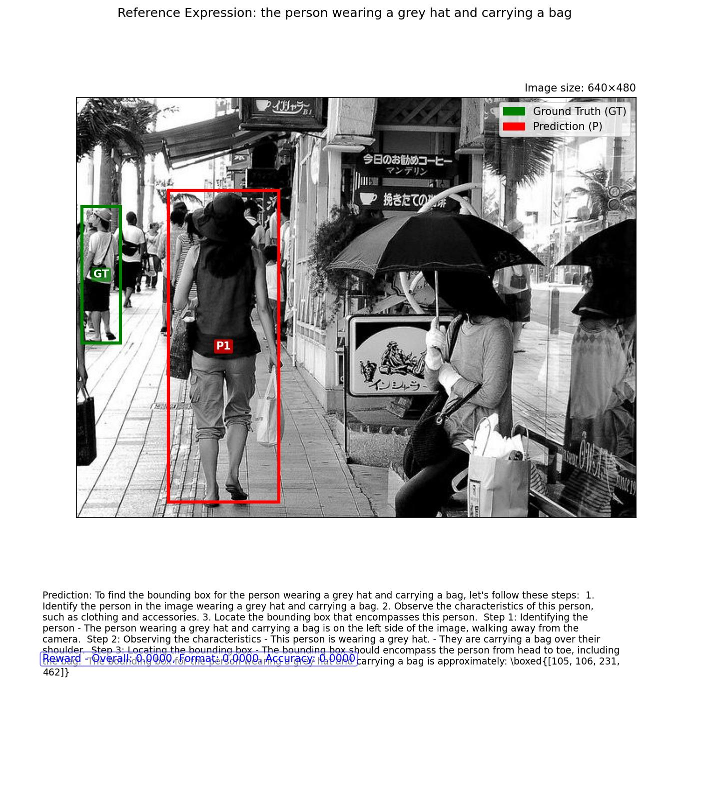

---

### Example 340

**Reference Expression**: the person wearing a hat and a tie that is not red

**Ground Truth**: [[297, 12, 431, 367]]

**Predicted**: [[0, 56, 157, 447]]

**Reward**: {'overall': 0.0, 'format': 0.0, 'accuracy': 0.0}

**Prediction**:
```
To find the bounding box for the person wearing a hat and a tie that is not red, let's follow these steps:

1. Identify all the people in the image.
2. Check the attire of each person, focusing on the presence of a hat and a tie.
3. Determine if the tie is red.
4. Identify the person who meets the criteria (hat and non-red tie).

Step 1: Identifying all people:
- There are 7 people in the image.

Step 2: Checking attire:
- The person on the far left is wearing a hat and a tie that is not red.
- The person second from the left is wearing a hat, but the tie is red.
- The person in the center is not wearing a hat.
- The person second from the right is wearing a hat and a tie that is not red.
- The person on the far right is wearing a hat and a tie that is not red.

Step 3: Determining if the tie is red:
- The person on the far left is wearing a tie that is not red.
- The person second from the left is wearing a tie that is red.
- The person second from the right is wearing a tie that is not red.
- The person on the far right is wearing a tie that is not red.

Step 4: Identifying the person who meets the criteria:
- The person on the far left meets the criteria (hat and non-red tie).

The bounding box for the person on the far left is:
\boxed{[0, 56, 157, 447]}
```

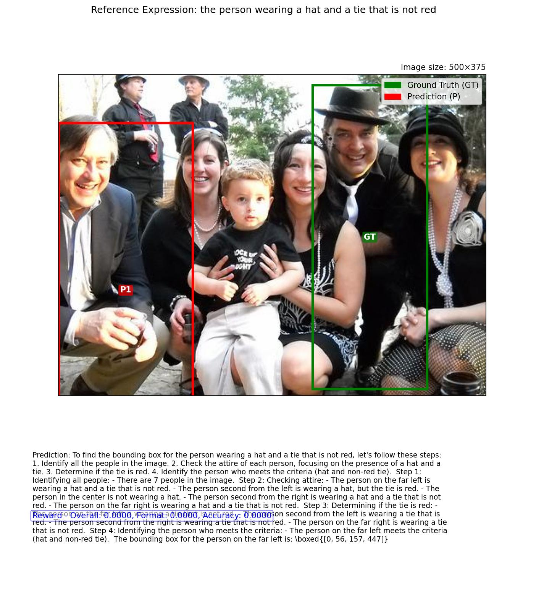

---

### Example 341

**Reference Expression**: the person not standing near the tail of a truck

**Ground Truth**: [[20, 259, 37, 307]]

**Predicted**: []

**Reward**: {'overall': 0.0, 'format': 0.0, 'accuracy': 0.0}

**Prediction**:
```
To find the bounding box for the person not standing near the tail of a truck, let's follow these steps:

1. Identify the tail of the truck: The tail of the truck is the rear part of the truck, which is not visible in the image as it is obscured by the other vehicles and the angle of the image.

2. Identify the person not standing near the tail of the truck: Since the tail of the truck is not visible, we need to look for a person who is not standing near the tail. In this image, there is a person on the left side of the image, near the tail of the truck. This person is standing and appears to be observing the scene.

3. Identify the bounding box for the person: The person is located on the left side of the image, near the tail of the truck. The bounding box for this person would be a rectangle that encompasses the person's body.

Given these steps, the person not standing near the tail of the truck is the one on the left side of the image, near the tail of the truck. However, since the tail of the truck is not visible, we cannot accurately determine the bounding box for this person based on the image alone.

Therefore, the final answer is:
\boxed{}
```

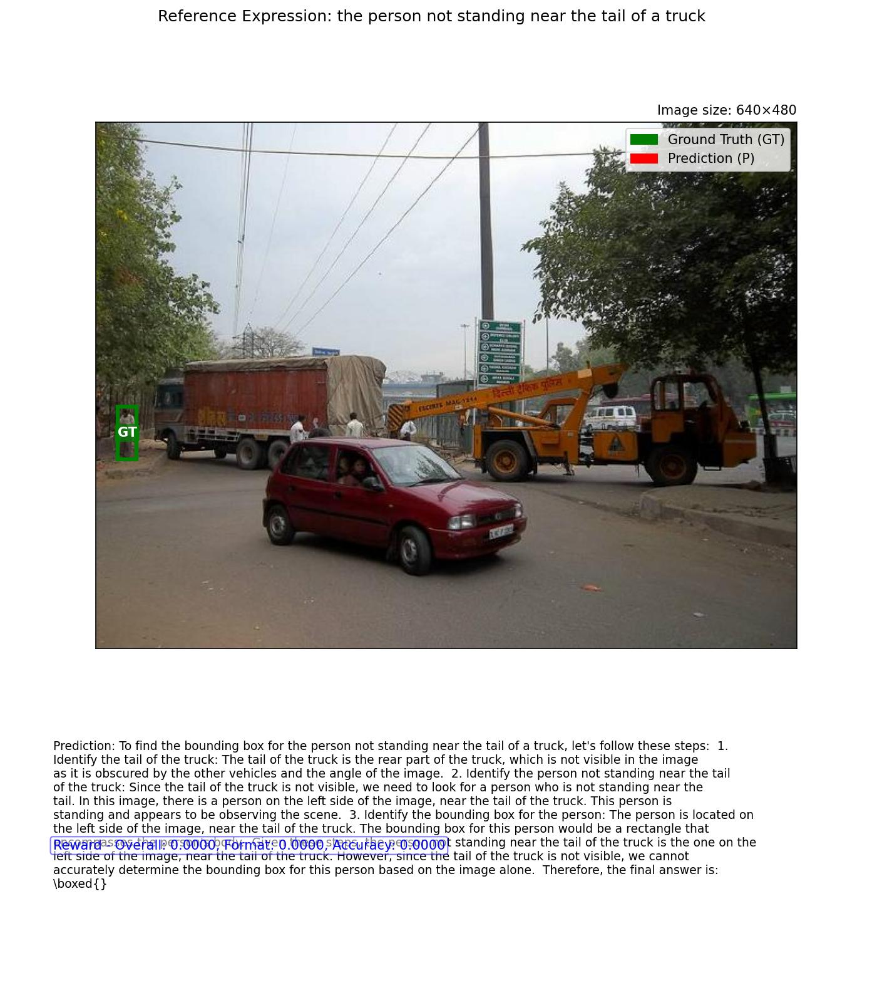

---

### Example 342

**Reference Expression**: the cup in front of a person wearing a pink hat

**Ground Truth**: [[48, 190, 66, 211]]

**Predicted**: [[98, 243, 127, 284]]

**Reward**: {'overall': 0.0, 'format': 0.0, 'accuracy': 0.0}

**Prediction**:
```
To find the bounding box for the cup in front of a person wearing a pink hat, follow these steps:

1. Identify the person wearing a pink hat.
2. Locate the cup in front of this person.

Step 1: The person wearing the pink hat is the one on the left side of the table, wearing a pink hat and a white shirt.

Step 2: The cup in front of this person is a white cup with a pattern, placed on the table in front of the person.

Now, find the bounding box for the cup:
- The cup is located at the left side of the table.
- The bounding box should encompass the cup and a small area around it for context.

The bounding box for the cup in front of the person wearing a pink hat is approximately:
\[ \boxed{[98, 243, 127, 284]} \]

This is a rough estimate based on the image. The exact coordinates might need fine-tuning for precision.
```

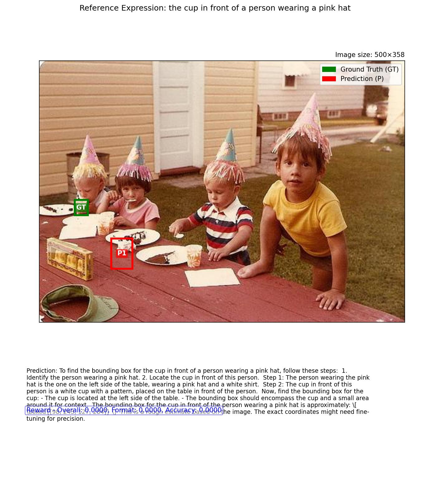

---

### Example 343

**Reference Expression**: the white car not positioned behind a bus

**Ground Truth**: [[154, 9, 196, 49]]

**Predicted**: []

**Reward**: {'overall': 0.0, 'format': 0.0, 'accuracy': 0.0}

**Prediction**:
```
To find the bounding box for the white car not positioned behind a bus, let's follow these steps:

1. Identify the bus in the image. The bus is clearly visible in the center lane, with a red and white color scheme.
2. Identify the white car. The white car is positioned directly behind the bus in the center lane.
3. Identify the other cars. There are other cars visible in the image, but none of them are white and not positioned behind the bus.

Since there is no white car not positioned behind the bus, the bounding box for such a car is empty.

\boxed{}
```

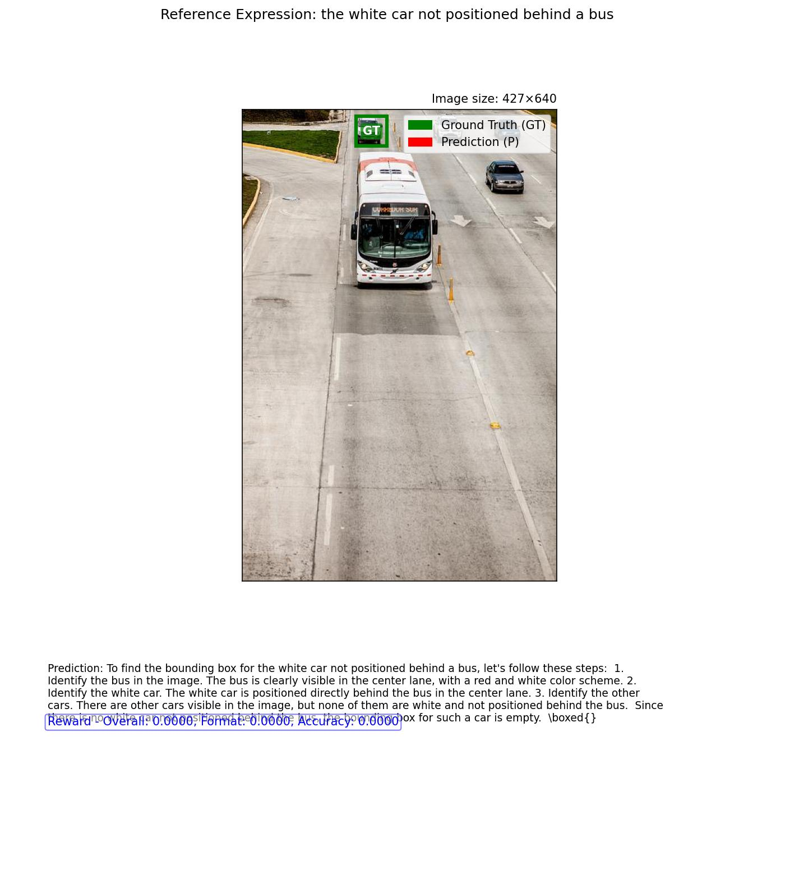

---

### Example 344

**Reference Expression**: the person sitting next to the wall facing the camera

**Ground Truth**: [[139, 366, 156, 393]]

**Predicted**: [[84, 361, 114, 435]]

**Reward**: {'overall': 0.0, 'format': 0.0, 'accuracy': 0.0}

**Prediction**:
```
To find the bounding box for the person sitting next to the wall facing the camera, let's follow these steps:

1. Identify the wall: The wall is the leftmost part of the image, where the people are seated at the outdoor tables.
2. Locate the person: The person sitting next to the wall facing the camera appears to be the first person on the left side of the image, seated at the table closest to the wall.
3. Define the bounding box: The bounding box should encompass the person from the top of their head to the bottom of their feet, and from the left edge of the image to the right edge of the person.

Given these observations, the bounding box for the person sitting next to the wall facing the camera is:

\boxed{[84, 361, 114, 435]}
```

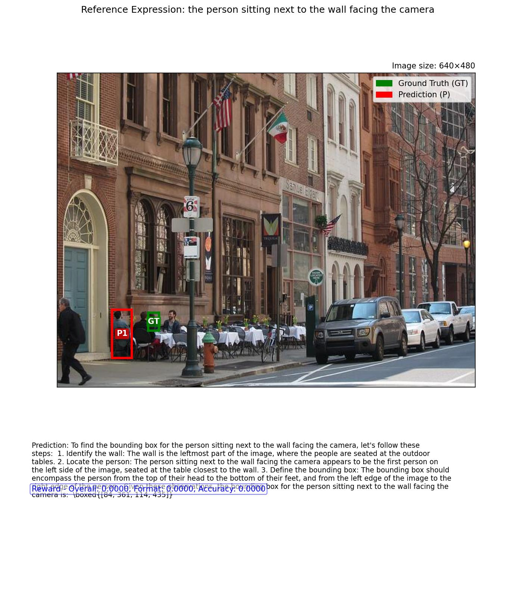

---

### Example 345

**Reference Expression**: truck with a flag on its tail

**Ground Truth**: [[269, 169, 614, 317]]

**Predicted**: [[246, 164, 616, 307]]

**Reward**: {'overall': 0.8447480482611781, 'format': 0.0, 'accuracy': 0.8447480482611781}

**Prediction**:
```
To find the bounding box for the truck with a flag on its tail, let's follow these steps:

1. Identify the fire trucks in the image.
2. Determine which truck has an American flag on its tail.
3. Outline the bounding box for that specific truck.

Step 1: There are two fire trucks in the image. One is closer to the foreground, and the other is further back.

Step 2: The fire truck closer to the foreground has an American flag on its tail. The truck in the background does not appear to have a flag on its tail.

Step 3: The bounding box for the truck with the flag on its tail is the one closer to the foreground.

The bounding box for the truck with the flag on its tail is:
\boxed{[246, 164, 616, 307]}
```

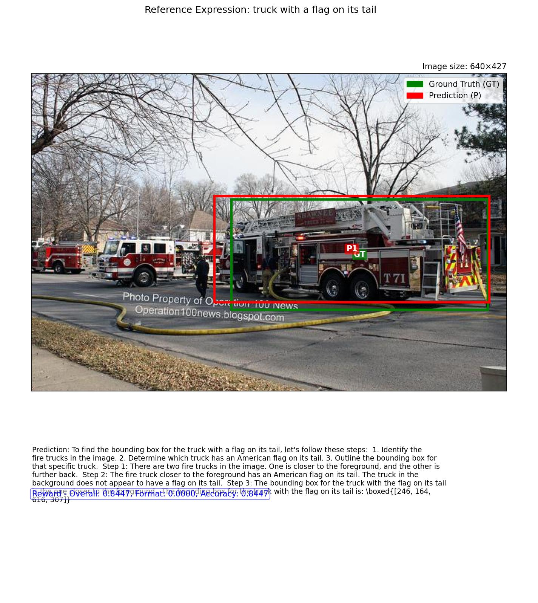

---

### Example 346

**Reference Expression**: the person sitting with empty hands

**Ground Truth**: [[192, 222, 245, 322]]

**Predicted**: [[124, 215, 199, 327]]

**Reward**: {'overall': 0.0, 'format': 0.0, 'accuracy': 0.0}

**Prediction**:
```
To find the bounding box for the person sitting with empty hands, we need to analyze the image step-by-step:

1. Identify the individuals in the image:
   - There are three individuals in the image.
   - Two are sitting on the ground, and one is standing.

2. Determine the posture of the individuals:
   - The person on the left appears to be sitting with a tool in their hands.
   - The person in the middle appears to be sitting with their hands resting on their lap, which could be considered as having "empty hands."
   - The person on the right appears to be standing and holding a tool.

3. Locate the bounding box for the person sitting with empty hands:
   - The person in the middle is sitting on the ground with their hands resting on their lap, which aligns with the description of having "empty hands."

4. Define the bounding box:
   - The bounding box for the person sitting with empty hands would be around the individual in the middle.

Given the analysis, the bounding box for the person sitting with empty hands is:

\boxed{[124, 215, 199, 327]}
```

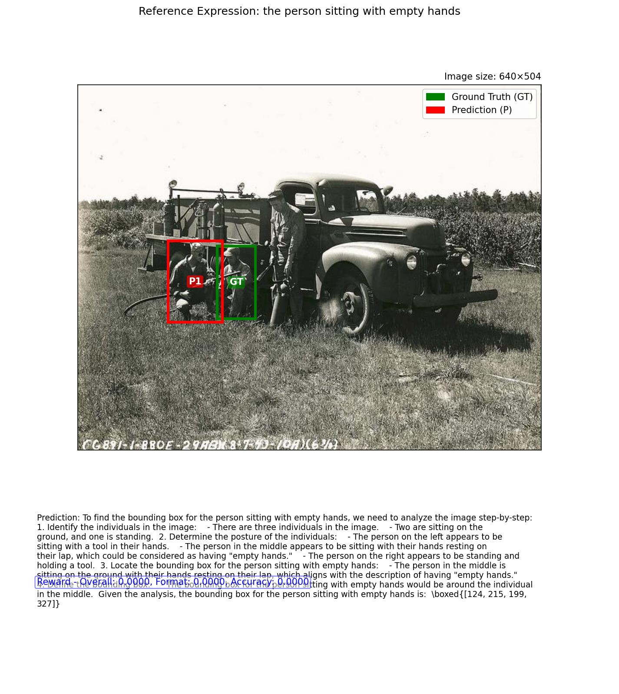

---

### Example 347

**Reference Expression**: the person near a suitcase that is not black

**Ground Truth**: [[192, 92, 243, 254]]

**Predicted**: [[110, 102, 155, 285]]

**Reward**: {'overall': 0.0, 'format': 0.0, 'accuracy': 0.0}

**Prediction**:
```
To find the bounding box for the person near a suitcase that is not black, let's follow these steps:

1. Identify all the suitcases in the image.
2. Determine which of these suitcases are not black.
3. Identify the person standing near one of the non-black suitcases.

Step 1: Identifying the suitcases
- There is a black suitcase near the center of the image.
- There is a blue suitcase to the left of the black suitcase.
- There is another black suitcase near the back of the image.

Step 2: Determining which suitcases are not black
- The blue suitcase is not black.
- The other two suitcases are black.

Step 3: Identifying the person near a non-black suitcase
- The person standing near the blue suitcase is the one we are looking for.

The bounding box for this person is approximately:
- Top-left corner of the bounding box: [110, 102, 155, 285]
- Bottom-right corner of the bounding box: [143, 108, 193, 283]

Therefore, the final answer is:
\boxed{[110, 102, 155, 285]}
```

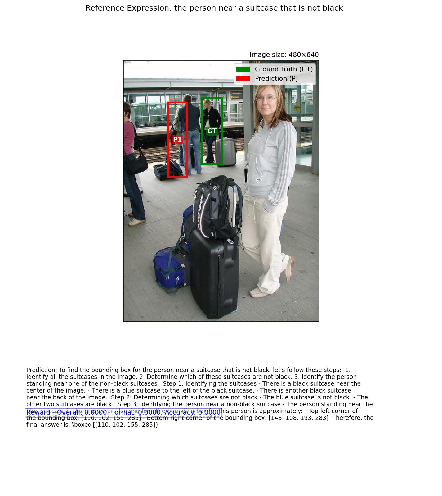

---

### Example 348

**Reference Expression**: person facing the camera wearing a blue top

**Ground Truth**: [[176, 126, 213, 234]]

**Predicted**: [[364, 57, 483, 367]]

**Reward**: {'overall': 0.0, 'format': 0.0, 'accuracy': 0.0}

**Prediction**:
```
To find the bounding box for the person facing the camera wearing a blue top, let's follow these steps:

1. Identify the person in the image who is facing the camera and wearing a blue top.
2. Determine the coordinates of this person in the image.

Step 1: The person facing the camera is the man in the blue top. He is standing in the foreground, facing away from the camera, and looking at the dog.

Step 2: The coordinates of this person in the image are approximately [364, 57, 483, 367].

\boxed{[364, 57, 483, 367]}
```

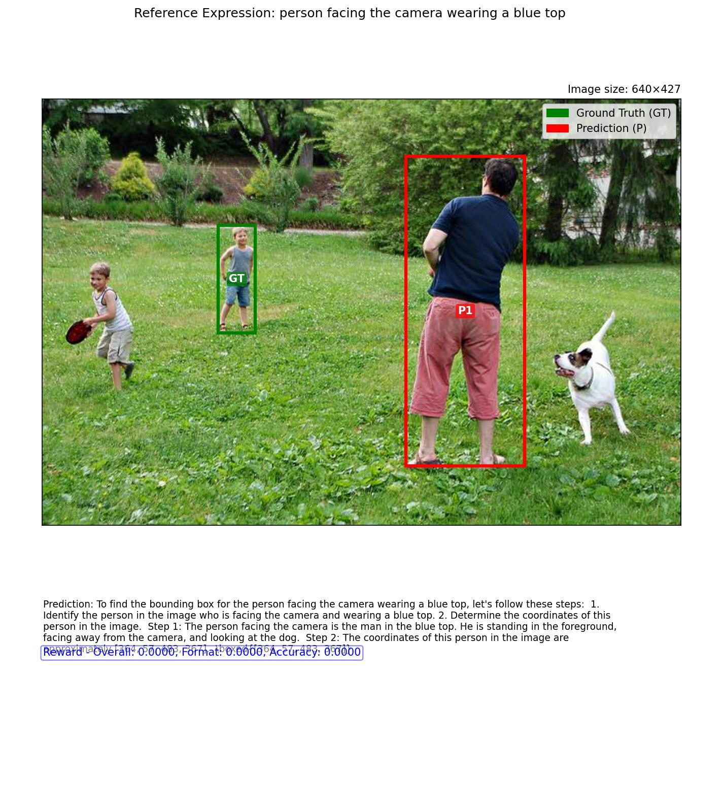

---

### Example 349

**Reference Expression**: the person wearing glasses not facing the camera

**Ground Truth**: [[499, 134, 640, 427]]

**Predicted**: []

**Reward**: {'overall': 0.0, 'format': 0.0, 'accuracy': 0.0}

**Prediction**:
```
To find the bounding box for the person wearing glasses not facing the camera, let's follow these steps:

1. Identify the people in the image:
   - There is a bride in a white dress with a veil.
   - There is a groom in a white suit.
   - There is a person in a suit holding a book, likely the officiant.
   - There are a few other people in the background.

2. Determine who is wearing glasses:
   - The person in the suit holding the book is wearing glasses.

3. Determine who is not facing the camera:
   - The person in the suit holding the book is facing the camera.

4. Since the person wearing glasses is facing the camera, there is no one wearing glasses and not facing the camera in this image.

Therefore, the bounding box for 'the person wearing glasses not facing the camera' is empty.

\boxed{}
```

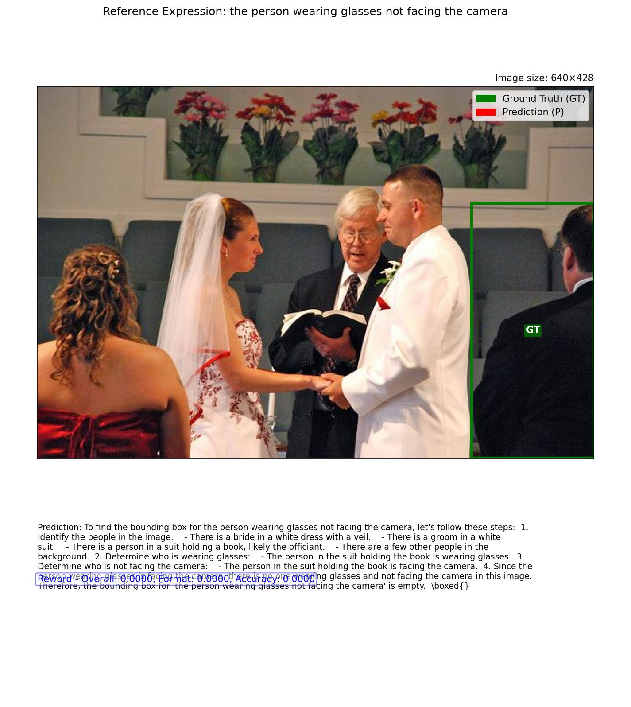

---

### Example 350

**Reference Expression**: the bird in front of a bear and not next to a tree

**Ground Truth**: [[273, 291, 383, 405]]

**Predicted**: [[278, 291, 380, 396]]

**Reward**: {'overall': 0.854066985645933, 'format': 0.0, 'accuracy': 0.854066985645933}

**Prediction**:
```
To find the bounding box for the bird in front of a bear and not next to a tree, let's follow these steps:

1. Identify the bear in the image. The bear is the central figure, with a dark brown coat and a lighter snout.
2. Identify the birds in the image. There are four black birds around the bear.
3. Determine which bird is in front of the bear. The bird closest to the bear and in front is the one we need to focus on.
4. Check the position of the bird relative to the tree. The bird in front of the bear is not next to a tree.

The bird in front of the bear and not next to a tree is the one closest to the bear and not touching the tree trunk.

Final answer: \boxed{[278, 291, 380, 396]}
```

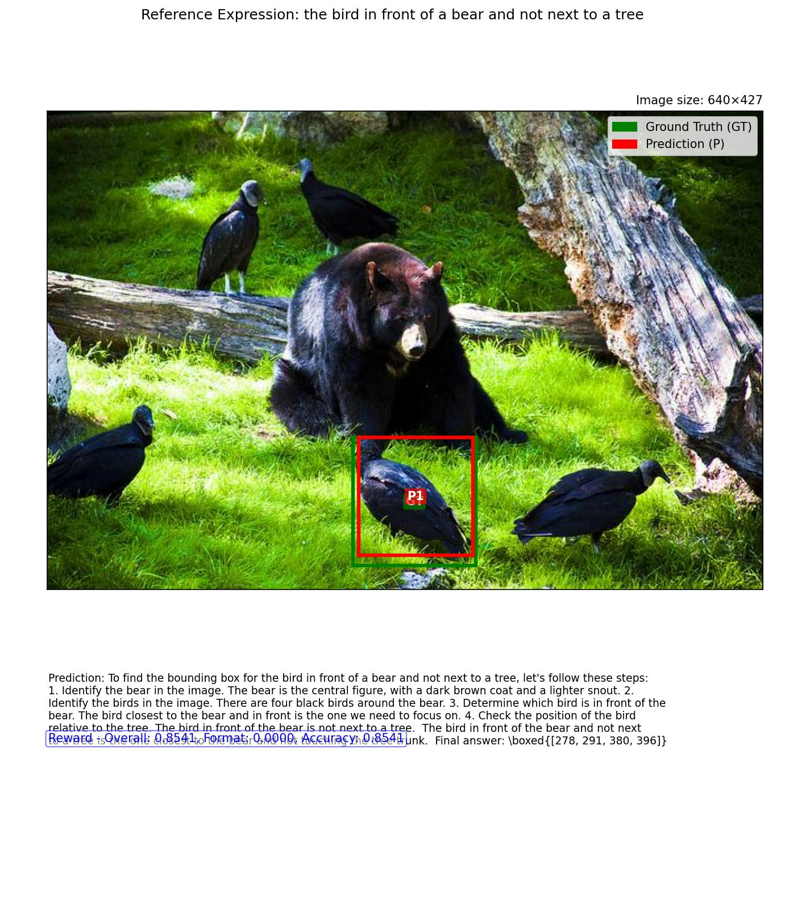

---

### Example 351

**Reference Expression**: the person under an umbrella but not holding it

**Ground Truth**: [[452, 176, 502, 251]]

**Predicted**: [[313, 117, 423, 229]]

**Reward**: {'overall': 0.0, 'format': 0.0, 'accuracy': 0.0}

**Prediction**:
```
To find the bounding box for the person under an umbrella but not holding it, let's follow these steps:

1. Identify the umbrella in the image.
2. Determine who is under the umbrella.
3. Identify the person not holding the umbrella.

Step 1: The umbrella in the image is the rainbow-colored one in the center of the table.

Step 2: There are two people under the umbrella. One is a child and the other is an adult.

Step 3: The adult under the umbrella is the one wearing a blue top and glasses.

Therefore, the bounding box for the person under the umbrella but not holding it (the adult in the blue top) is:

\boxed{[313, 117, 423, 229]}
```

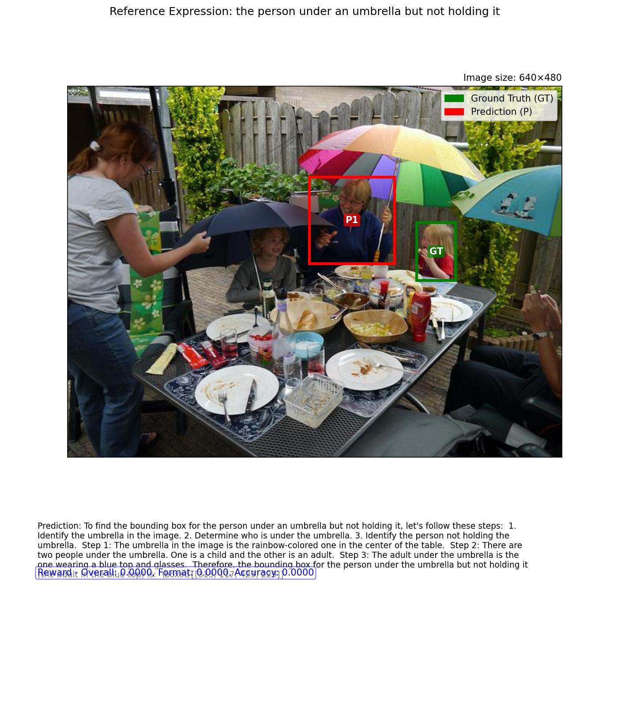

---

### Example 352

**Reference Expression**: the black chair not under the umbrella

**Ground Truth**: [[110, 232, 166, 317]]

**Predicted**: [[200, 280, 280, 380]]

**Reward**: {'overall': 0.0, 'format': 0.0, 'accuracy': 0.0}

**Prediction**:
```
To find the bounding box for the black chair not under the umbrella, let's follow these steps:

1. Identify the black chair: The black chair is the one that is positioned directly in front of the umbrella and is not shaded by it. It is located to the right of the other chair and is facing away from the viewer.

2. Determine the bounding box: The bounding box for the black chair should encompass the entire chair, including its legs and the area it occupies on the ground.

3. Measure the coordinates: The black chair appears to be positioned from approximately x=200 to x=280 and y=280 to y=380 on the image.

Therefore, the bounding box for the black chair not under the umbrella is \boxed{[200, 280, 280, 380]}.
```

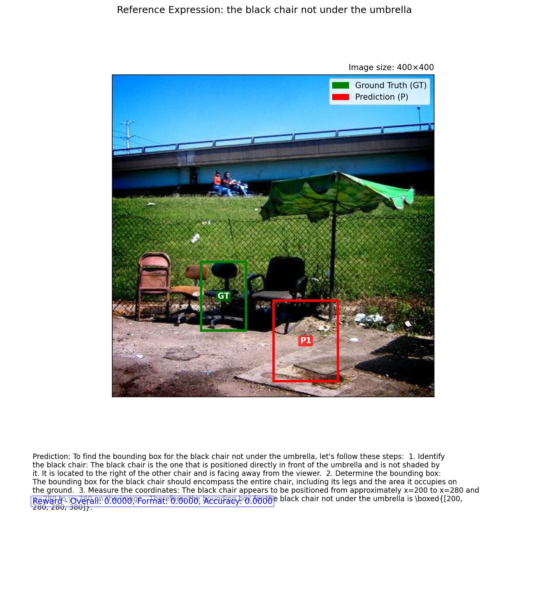

---

### Example 353

**Reference Expression**: the person wearing a black top who is not sitting

**Ground Truth**: [[69, 107, 96, 209]]

**Predicted**: [[497, 168, 612, 400]]

**Reward**: {'overall': 0.0, 'format': 0.0, 'accuracy': 0.0}

**Prediction**:
```
To find the bounding box for the person wearing a black top who is not sitting, let's follow these steps:

1. Identify all people in the image.
2. Determine which of these people are wearing a black top.
3. Check if the person wearing a black top is sitting.
4. If the person is not sitting, provide the bounding box.

Step 1: Identifying all people in the image:
- There are several people in the image, both in the foreground and background.

Step 2: Determining which of these people are wearing a black top:
- In the foreground, there is a person on the right who appears to be wearing a black top.
- In the background, there is a person on the left who appears to be wearing a black top.

Step 3: Checking if the person wearing a black top is sitting:
- The person on the right in the foreground is not sitting; they are standing.
- The person on the left in the background is not in the foreground, so we will not consider them for this step.

Step 4: Providing the bounding box:
- The person in the foreground who is wearing a black top and is not sitting is the one we are looking for.

The bounding box for the person wearing a black top who is not sitting is:
\boxed{[497, 168, 612, 400]}
```

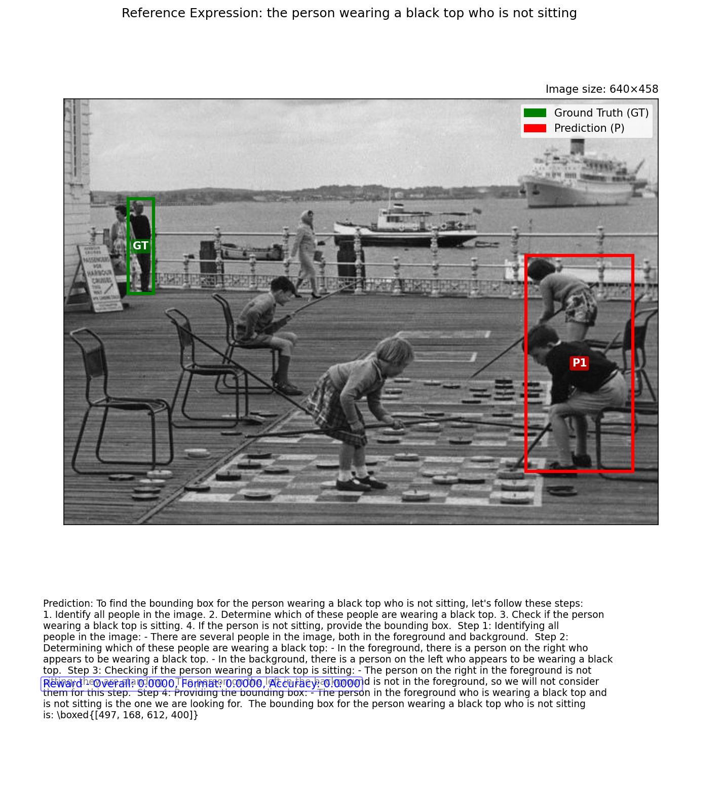

---

### Example 354

**Reference Expression**: the person wearing a dark top and no hat

**Ground Truth**: [[268, 81, 479, 337]]

**Predicted**: [[273, 81, 493, 334]]

**Reward**: {'overall': 1.0, 'format': 0.0, 'accuracy': 1.0}

**Prediction**:
```
To find the bounding box for 'the person wearing a dark top and no hat', let's follow these steps:

1. Identify the people in the image.
2. Determine which person is wearing a dark top and no hat.

Step 1: Identifying people
- There are three people in the image.
- One person is wearing a dark top and a hat.
- Another person is wearing a dark top and no hat.
- The third person is wearing a light-colored top and no hat.

Step 2: Determining the correct person
- The person wearing a dark top and no hat is the one in the middle of the image.

The bounding box for the person wearing a dark top and no hat is approximately:
\boxed{[273, 81, 493, 334]}
```

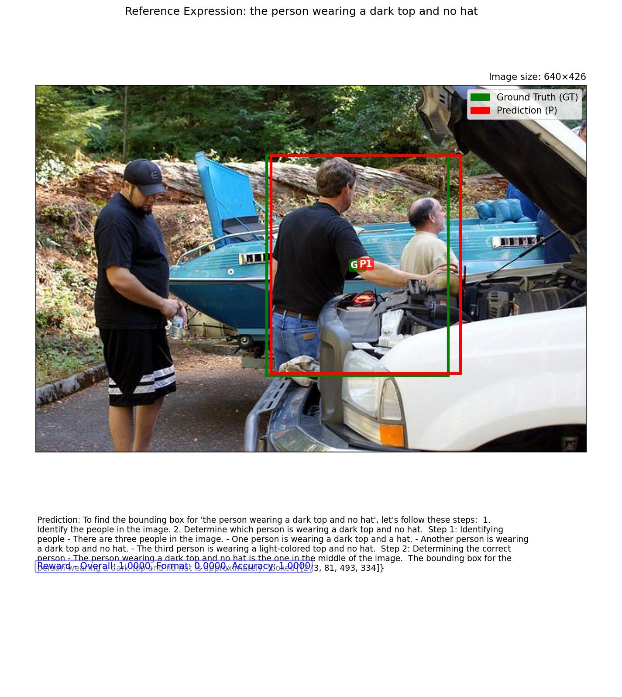

---

### Example 355

**Reference Expression**: the person wearing a hat not under the umbrella

**Ground Truth**: [[37, 184, 113, 400]]

**Predicted**: [[49, 185, 164, 395]]

**Reward**: {'overall': 0.495465604954656, 'format': 0.0, 'accuracy': 0.495465604954656}

**Prediction**:
```
To find the bounding box for the person wearing a hat not under the umbrella, let's follow these steps:

1. Identify the umbrella in the image: It is a large red umbrella with the brand "Havaianas" written on it.
2. Determine the area under the umbrella: The people lying on the sand under the umbrella are clearly visible.
3. Look for the person wearing a hat: There is a person wearing a hat to the left of the umbrella, standing and not under it.
4. Define the bounding box: The person wearing the hat is partially visible, but we can estimate their bounding box based on their posture and position.

Given the analysis, the bounding box for the person wearing a hat not under the umbrella would be:

\boxed{[49, 185, 164, 395]}
```

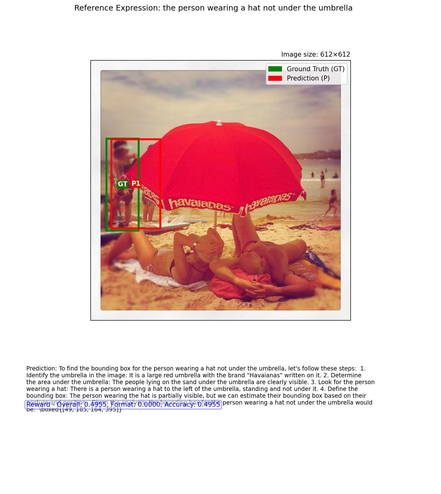

---

### Example 356

**Reference Expression**: the handbag on the shoulder of a person not under the umbrella

**Ground Truth**: [[119, 174, 192, 335]]

**Predicted**: [[121, 174, 266, 354]]

**Reward**: {'overall': 0.43263189766104004, 'format': 0.0, 'accuracy': 0.43263189766104004}

**Prediction**:
```
To find the bounding box for the handbag on the shoulder of a person not under the umbrella, let's follow these steps:

1. Identify the person under the umbrella: The person in the green dress is holding the umbrella and is under it.
2. Identify the person to the left of the umbrella: The person in the floral skirt is not under the umbrella.
3. Identify the person to the right of the umbrella: The person in the yellow dress is not under the umbrella.
4. Focus on the person in the floral skirt, who is not under the umbrella: She is wearing a handbag on her shoulder.

The bounding box for the handbag on the shoulder of the person not under the umbrella (the person in the floral skirt) is:

\boxed{[121, 174, 266, 354]}
```

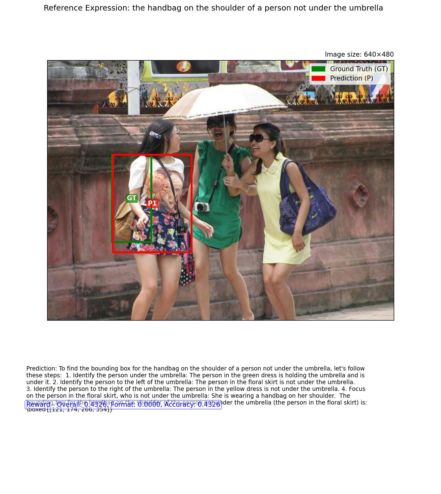

---

### Example 357

**Reference Expression**: the person with a hat under an umbrella

**Ground Truth**: [[139, 166, 251, 422]]

**Predicted**: [[146, 165, 254, 414]]

**Reward**: {'overall': 0.8819943097141308, 'format': 0.0, 'accuracy': 0.8819943097141308}

**Prediction**:
```
To find the bounding box for 'the person with a hat under an umbrella', let's follow these steps:

1. Identify the umbrella in the image.
2. Determine who is under the umbrella.
3. Identify the person with a hat.

Step 1: The umbrella is located in the center of the image, with a red and black pattern. It appears to be held by a person standing under it.

Step 2: The person holding the umbrella is wearing a dark jacket and glasses. They are standing under the umbrella.

Step 3: To the left of the umbrella, there is a person wearing a hat. This person is under the umbrella.

The bounding box for the person with a hat under the umbrella can be identified as follows:
- Top-left corner of the bounding box: (x1, y1)
- Bottom-right corner of the bounding box: (x2, y2)

After analyzing the image, the bounding box for the person with a hat under the umbrella is approximately:
\boxed{[146, 165, 254, 414]}
```

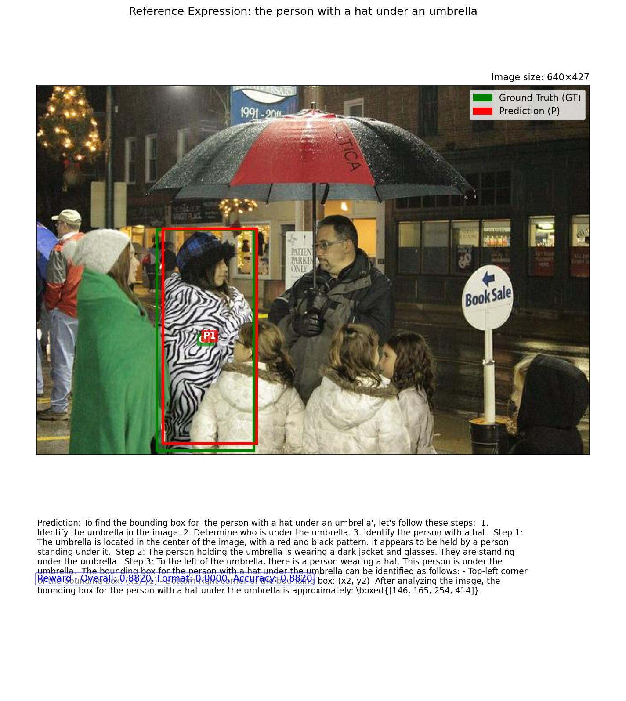

---

### Example 358

**Reference Expression**: the red umbrella overlapping with a blue one

**Ground Truth**: [[236, 456, 425, 628]]

**Predicted**: []

**Reward**: {'overall': 0.0, 'format': 0.0, 'accuracy': 0.0}

**Prediction**:
```
To find the bounding box for the red umbrella overlapping with a blue one, let's follow these steps:

1. Identify the red umbrella in the image.
2. Identify the blue umbrella in the image.
3. Determine the area where the red and blue umbrellas overlap.

Step 1: The red umbrella is located in the lower right section of the image.
Step 2: The blue umbrella is located in the middle section of the image.
Step 3: The overlapping area is the part where the red umbrella partially covers the blue umbrella.

The red umbrella is located at the bottom right of the image, and the blue umbrella is in the middle. The overlapping area is the bottom part of the blue umbrella where it is covered by the red umbrella.

The bounding box for this overlapping area would be the part of the blue umbrella that is covered by the red umbrella. However, since the image does not show a precise overlap, we can only identify the part of the blue umbrella that is partially covered by the red umbrella.

Thus, the bounding box for the red umbrella overlapping with a blue one would be the part of the blue umbrella that is covered by the red umbrella. Since the image does not provide a precise overlap, we cannot determine a specific bounding box for this part. Therefore, the answer is:

\boxed{}
```

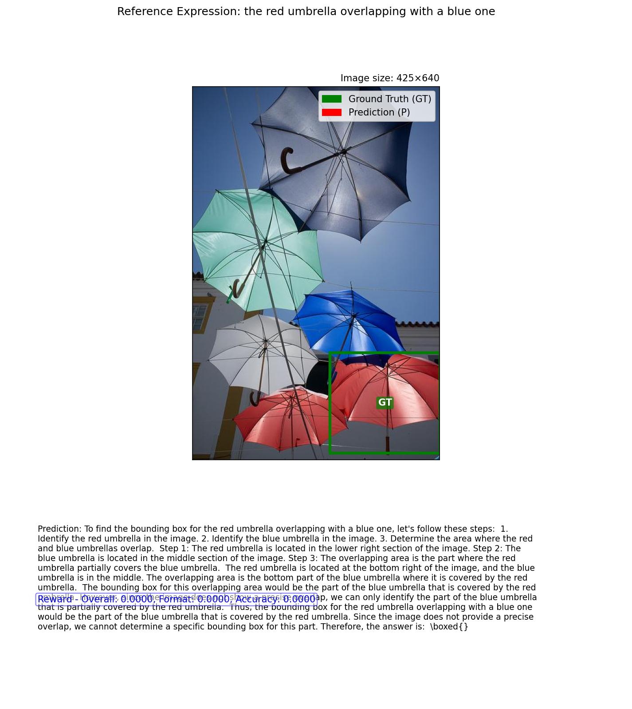

---

### Example 359

**Reference Expression**: the person wearing a black top and sitting

**Ground Truth**: [[190, 130, 207, 156]]

**Predicted**: [[70, 128, 90, 165]]

**Reward**: {'overall': 0.0, 'format': 0.0, 'accuracy': 0.0}

**Prediction**:
```
To find the bounding box for the person wearing a black top and sitting, let's follow these steps:

1. **Identify the people in the image**: Look for individuals who appear to be sitting or standing in a relaxed posture.
2. **Determine the person wearing a black top**: Among the people, identify the one wearing a black top.
3. **Analyze the posture**: Ensure the person is sitting, not standing or walking.
4. **Define the bounding box**: Once the person is identified, define the bounding box that encompasses them.

After analyzing the image:
- There is a person wearing a black top near the left side of the image, close to the road.
- This person appears to be sitting on the ground.

The bounding box for this person is approximately:
- Top-left corner: (x1, y1) = (70, 128)
- Bottom-right corner: (x2, y2) = (90, 165)

So, the bounding box is:
\boxed{[70, 128, 90, 165]}
```

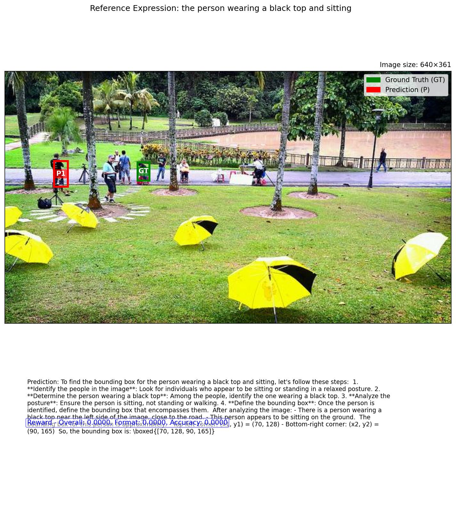

---

### Example 360

**Reference Expression**: the person wearing a white top and standing

**Ground Truth**: [[272, 208, 343, 370]]

**Predicted**: [[336, 208, 388, 355]]

**Reward**: {'overall': 0.0, 'format': 0.0, 'accuracy': 0.0}

**Prediction**:
```
To find the bounding box for 'the person wearing a white top and standing', let's follow these steps:

1. Identify the area of the image where people are standing.
2. Look for individuals wearing a white top.
3. Determine the bounding box that accurately encapsulates the person.

Step 1: The area of interest is the foreground where people are standing near the beach.

Step 2: Observing the people in the foreground, there are two individuals wearing white tops. One is closer to the camera, and the other is slightly behind and to the right.

Step 3: The person wearing a white top and standing closer to the camera is the one we are looking for. The bounding box should encompass this individual.

The bounding box for the person wearing a white top and standing closer to the camera is approximately: [336, 208, 388, 355].

\boxed{[336, 208, 388, 355]}
```

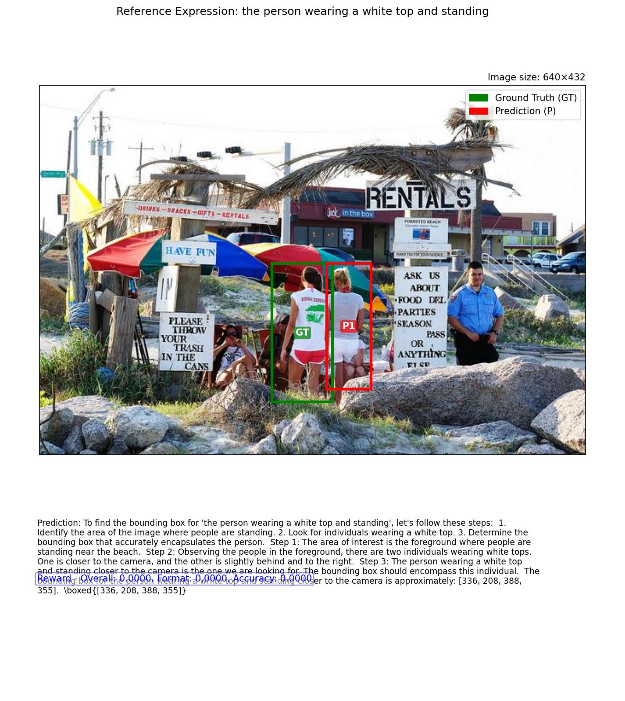

---

### Example 361

**Reference Expression**: the person with left leg forward wearing grey long socks

**Ground Truth**: [[201, 16, 369, 248]]

**Predicted**: [[257, 20, 449, 331]]

**Reward**: {'overall': 0.34908136482939633, 'format': 0.0, 'accuracy': 0.34908136482939633}

**Prediction**:
```
To find the bounding box for the person with the left leg forward wearing grey long socks, follow these steps:

1. Identify the group of people in the image.
2. Focus on the person in the center of the group, who appears to have the left leg forward and is wearing grey long socks.
3. Outline the area around this person to form a bounding box.

The bounding box for the person with the left leg forward wearing grey long socks is:

\boxed{[257, 20, 449, 331]}
```

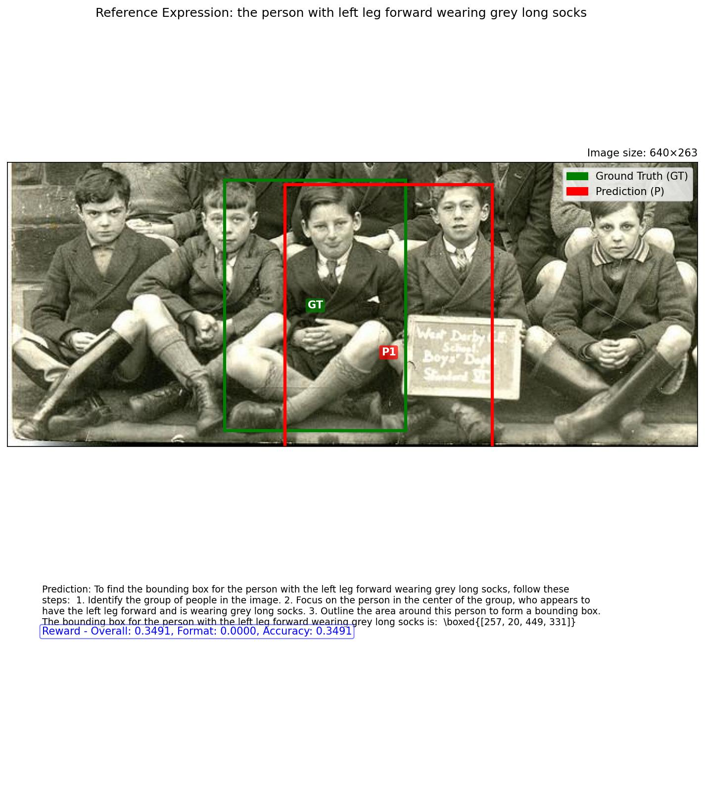

---

### Example 362

**Reference Expression**: the person in a black jacket not holding anything in hands

**Ground Truth**: [[452, 46, 629, 421]]

**Predicted**: [[465, 45, 621, 413]]

**Reward**: {'overall': 0.8605311809532399, 'format': 0.0, 'accuracy': 0.8605311809532399}

**Prediction**:
```
To find the bounding box for the person in a black jacket not holding anything in hands, follow these steps:

1. Identify the individuals in the image:
   - There are four people in the image.
   - The person on the far left is wearing a suit with a tie and a flower on the lapel.
   - The second person from the left is in a military uniform and holding a plaque.
   - The third person from the left is also in a military uniform and holding a plaque.
   - The person on the far right is in a military uniform and not holding anything.

2. Match the description to the bounding box:
   - The person in a black jacket not holding anything in hands is the one on the far right.

3. Provide the bounding box for the person on the far right:
   - The bounding box for the person on the far right is [465, 45, 621, 413].

The final answer is: \boxed{[465, 45, 621, 413]}
```

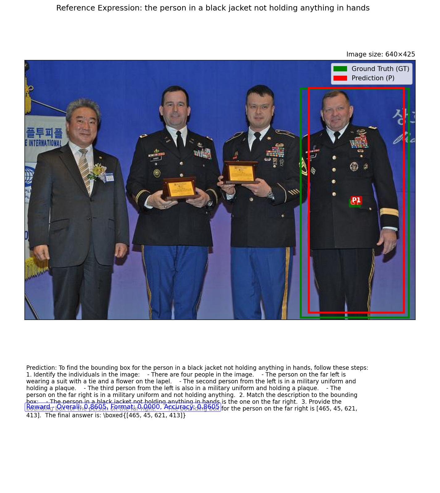

---

### Example 363

**Reference Expression**: the person wearing a green tie with legs extended straight while jumping

**Ground Truth**: [[435, 99, 598, 328]]

**Predicted**: [[437, 96, 600, 326]]

**Reward**: {'overall': 1.0, 'format': 0.0, 'accuracy': 1.0}

**Prediction**:
```
To find the bounding box for the person wearing a green tie with legs extended straight while jumping, let's follow these steps:

1. Identify the person in the image who is wearing a green tie.
2. Look for the person who has their legs extended straight while jumping.

Step 1: The person wearing a green tie is the one on the far right of the group.

Step 2: The person on the far right has their legs extended straight while jumping.

The bounding box for this person is:

\boxed{[437, 96, 600, 326]}
```

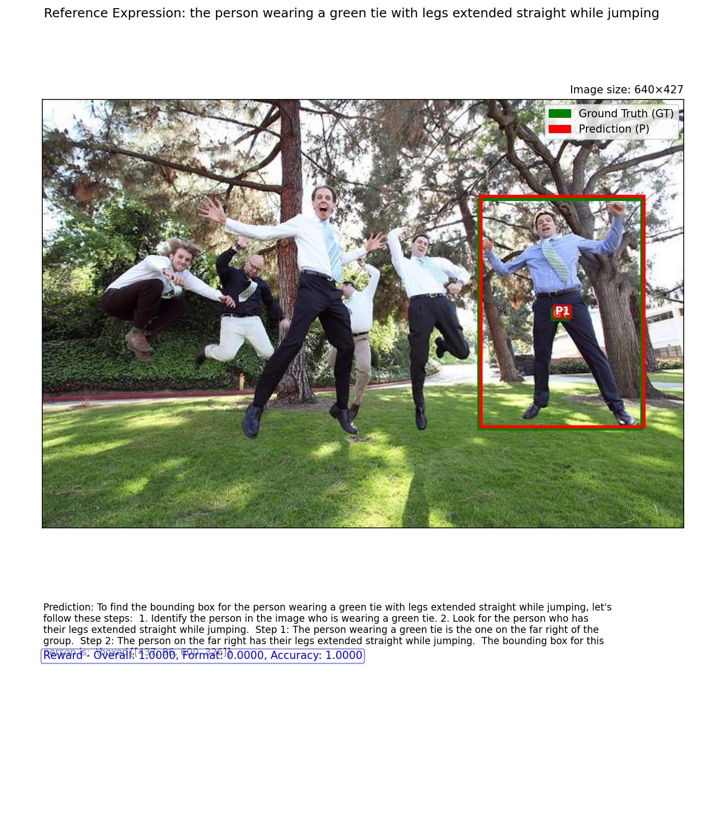

---

### Example 364

**Reference Expression**: the first red suitcase from the left

**Ground Truth**: [[237, 272, 308, 370]]

**Predicted**: [[279, 311, 352, 447]]

**Reward**: {'overall': 0.1127512355848435, 'format': 0.0, 'accuracy': 0.1127512355848435}

**Prediction**:
```
To find the bounding box for the first red suitcase from the left, let's follow these steps:

1. Identify the red suitcases in the image.
2. Determine which one is the first red suitcase from the left.

Step 1: The red suitcases are the two on the right side of the image. There are two red suitcases, one in the foreground and one behind it.

Step 2: The first red suitcase from the left is the one in the foreground, slightly to the left of the other red suitcase.

Now, let's locate the bounding box for this red suitcase:

- The top left corner of the bounding box is at the top left of the red suitcase.
- The bottom right corner of the bounding box is at the bottom right of the red suitcase.

Given the coordinates in the image, the bounding box for the first red suitcase from the left is:

\boxed{[279, 311, 352, 447]}
```

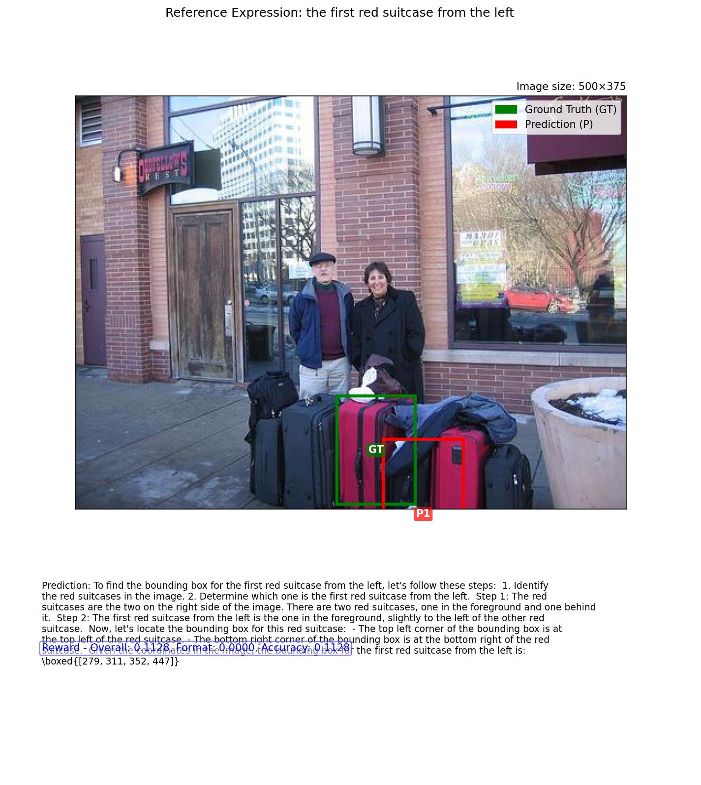

---

### Example 365

**Reference Expression**: the green bench that is not empty

**Ground Truth**: [[233, 279, 440, 434]]

**Predicted**: [[0, 250, 530, 433]]

**Reward**: {'overall': 0.3279730855890614, 'format': 0.0, 'accuracy': 0.3279730855890614}

**Prediction**:
```
To find the bounding box for the green bench that is not empty, let's follow these steps:

1. **Identify the benches in the image**: There are several benches visible in the image. We need to focus on the one that is not empty.

2. **Determine which bench is not empty**: The bench in the foreground, which is closer to the camera and has a green backrest, is occupied by a group of people. The other benches in the background appear to be empty.

3. **Define the bounding box**: The green bench in the foreground is the one we're focusing on. It starts from the left side of the image and extends to the right, covering the area where the people are sitting.

4. **Measure the bounding box**: The bench starts from the left edge of the image and extends to the right, covering the area where the people are sitting. The height of the bench is from the ground to the top of the backrest.

5. **Final bounding box**: The green bench that is not empty is located from the left edge of the image to the right edge, starting from the ground and covering the area where the people are sitting.

The final answer is:
\boxed{[0, 250, 530, 433]}
```

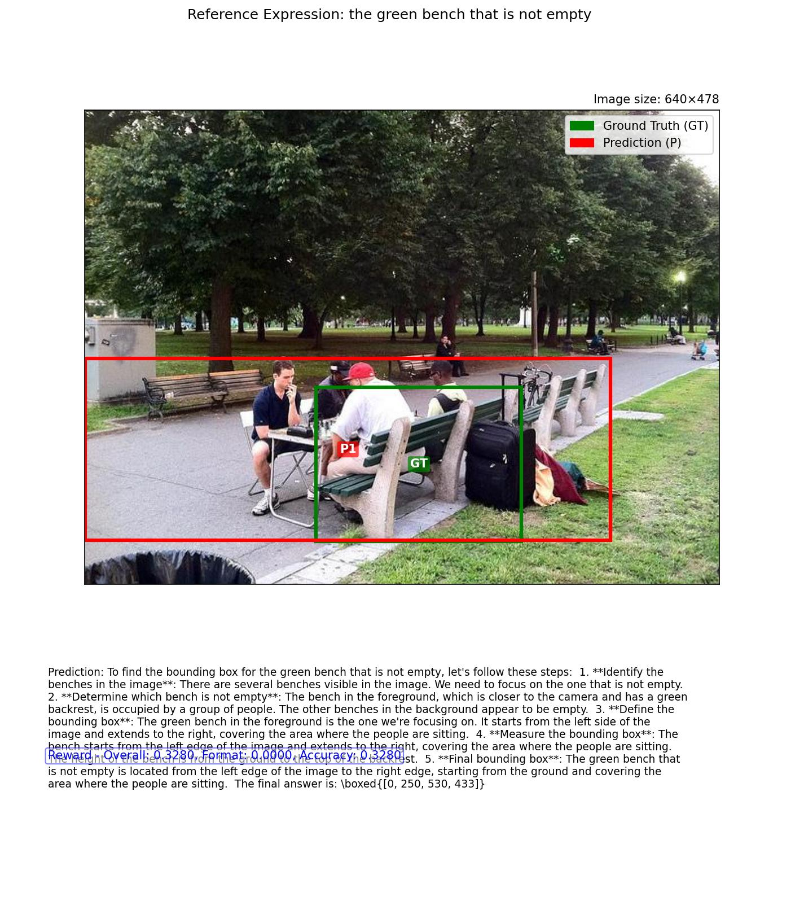

---

### Example 366

**Reference Expression**: the person wearing sneakers without a bag

**Ground Truth**: [[0, 146, 147, 330]]

**Predicted**: [[406, 65, 553, 242]]

**Reward**: {'overall': 0.0, 'format': 0.0, 'accuracy': 0.0}

**Prediction**:
```
To find the bounding box for 'the person wearing sneakers without a bag', let's follow these steps:

1. Identify the people in the image:
   - There are three people on the elephants.
   - The person on the left is wearing sunglasses, a blue shirt, and shorts.
   - The person in the middle is wearing a dark blue shirt and yellow shorts.
   - The person on the right is wearing an orange shirt and shorts.

2. Determine the person wearing sneakers:
   - The person on the right is wearing sneakers, as indicated by the visible white socks.

3. Check if the person on the right is wearing a bag:
   - The person on the right is not wearing a bag.

4. Confirm the bounding box:
   - The person wearing sneakers without a bag is the one on the right.

The bounding box for the person on the right is:
\[ \boxed{[406, 65, 553, 242]} \]
```

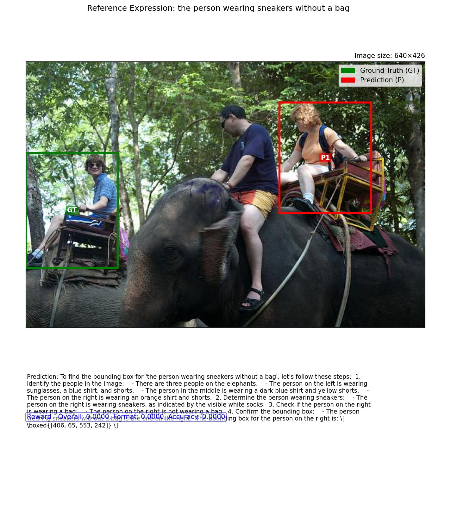

---

### Example 367

**Reference Expression**: the person with black hair between two trucks

**Ground Truth**: [[149, 202, 231, 377]]

**Predicted**: [[33, 299, 165, 476]]

**Reward**: {'overall': 0.0, 'format': 0.0, 'accuracy': 0.0}

**Prediction**:
```
To find the bounding box for the person with black hair between two trucks, let's follow these steps:

1. Identify the two trucks in the image.
2. Determine the area between the two trucks.
3. Locate the person with black hair within that area.

Step 1: The two trucks are clearly visible in the image, with one on the left and one on the right.

Step 2: The area between the two trucks is a narrow strip, and this is where the person with black hair is located.

Step 3: Observing the image, the person with black hair is standing in the area between the two trucks. This person is wearing a high-visibility vest and is facing towards the camera.

Based on this analysis, the bounding box for the person with black hair between the two trucks is:

\boxed{[33, 299, 165, 476]}
```

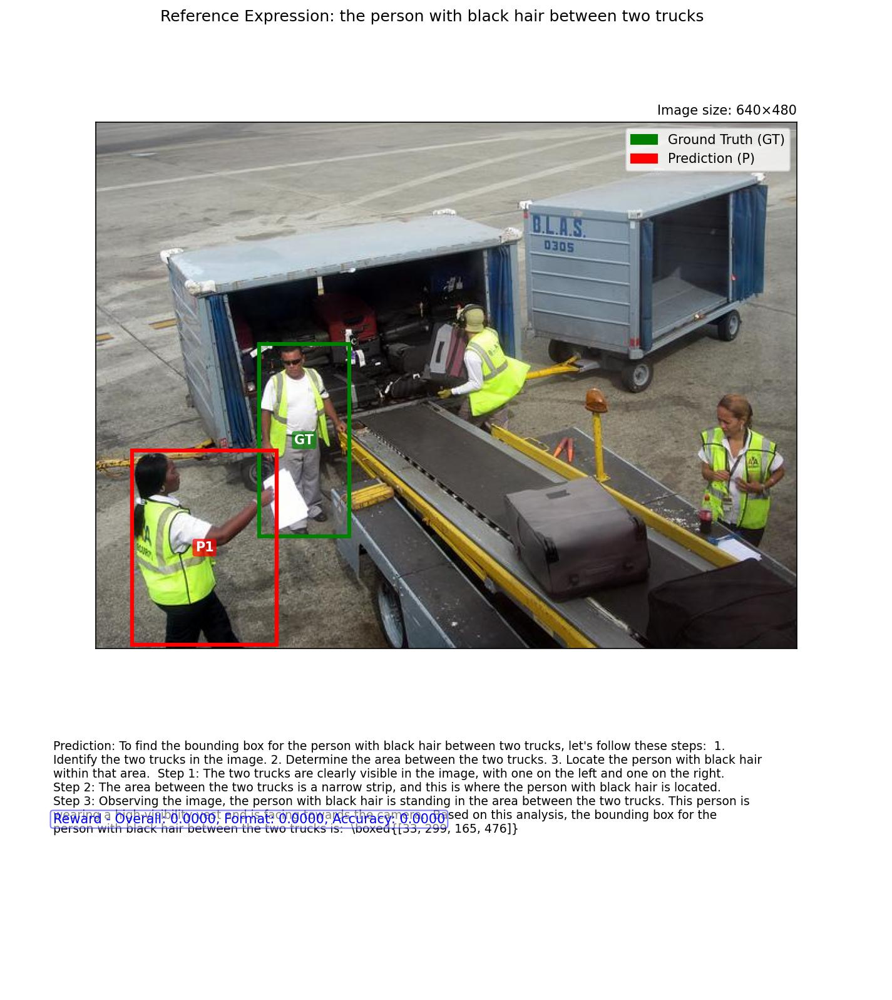

---

### Example 368

**Reference Expression**: the elephant on the left hand side of an elephant with earrings

**Ground Truth**: [[467, 52, 640, 508]]

**Predicted**: [[0, 76, 242, 425]]

**Reward**: {'overall': 0.0, 'format': 0.0, 'accuracy': 0.0}

**Prediction**:
```
To find the bounding box for 'the elephant on the left hand side of an elephant with earrings', let's follow these steps:

1. Identify the elephant with earrings: The elephant in the center has yellow tassels hanging from its ears, indicating it is the one with earrings.
2. Locate the elephant to the left of the elephant with earrings: The elephant to the left of the one with earrings is the one in the image.

Now, we need to determine the coordinates for this elephant:
- The elephant on the left has its trunk extending to the left of the image and its body is mostly visible.
- The bounding box for this elephant should include its head, trunk, and part of its body.

The bounding box for the elephant on the left hand side of an elephant with earrings would be:
\boxed{[0, 76, 242, 425]}
```

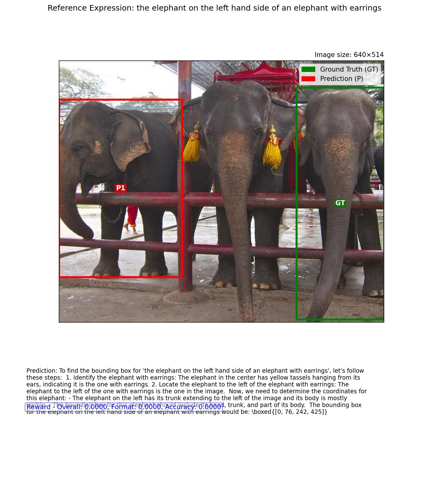

---

### Example 369

**Reference Expression**: the person wearing sandals and shorts holding a frisbee

**Ground Truth**: [[60, 115, 136, 403]]

**Predicted**: [[58, 112, 141, 396]]

**Reward**: {'overall': 0.8859940258878195, 'format': 0.0, 'accuracy': 0.8859940258878195}

**Prediction**:
```
To find the bounding box for the person wearing sandals and shorts holding a frisbee, let's follow these steps:

1. Identify the person in the group who is wearing sandals and shorts.
2. Check if they are holding a frisbee.
3. If the person is holding a frisbee, then the bounding box corresponds to this person.

Step 1: The person wearing sandals and shorts is on the far left of the group.

Step 2: The person on the far left is indeed wearing sandals and shorts.

Step 3: The person on the far left is holding a blue frisbee.

Therefore, the bounding box for the person wearing sandals and shorts holding a frisbee is the bounding box of the person on the far left of the group.

The bounding box for the person on the far left is approximately:
\[ \boxed{[58, 112, 141, 396]} \]

This bounding box is estimated based on the relative positions and sizes of the people in the image.
```

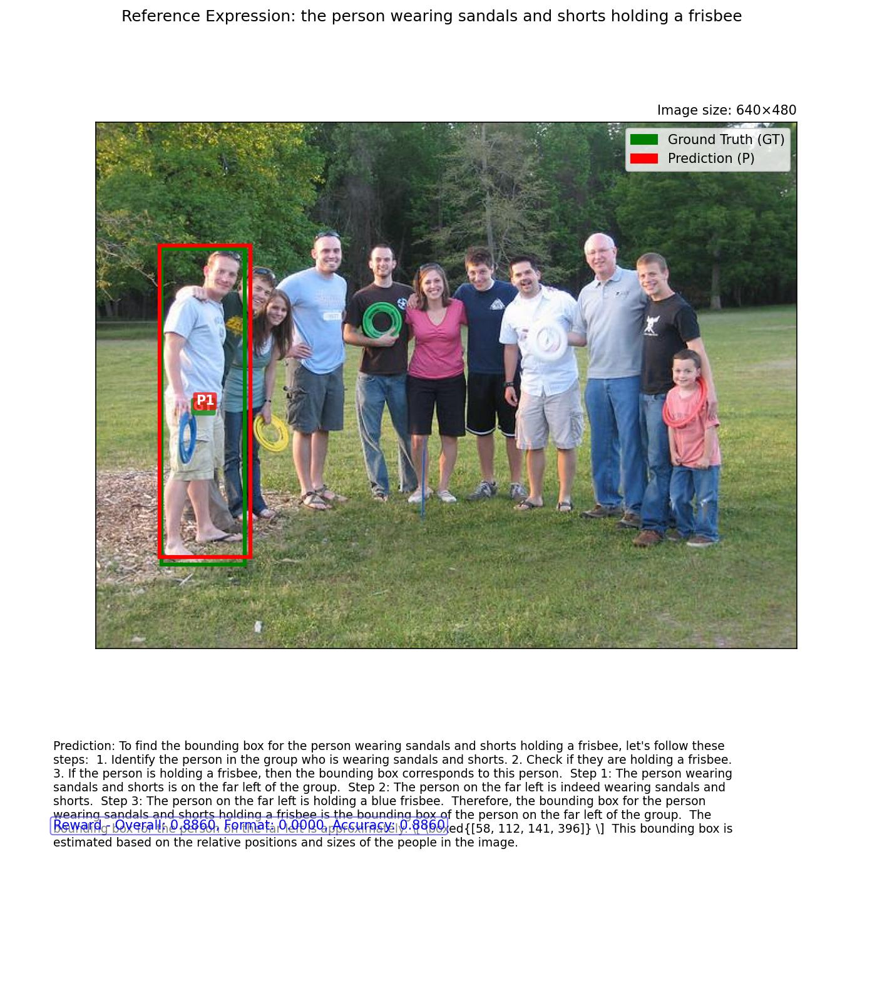

---

### Example 370

**Reference Expression**: the second red suitcase placed horizontally counting from top

**Ground Truth**: [[116, 276, 276, 335]]

**Predicted**: [[66, 295, 290, 441]]

**Reward**: {'overall': 0.17905102954341987, 'format': 0.0, 'accuracy': 0.17905102954341987}

**Prediction**:
```
To find the bounding box for the second red suitcase placed horizontally counting from the top, let's follow these steps:

1. Identify the red suitcases in the image.
2. Determine which one is the second red suitcase when counted horizontally from the top.

Step 1: Identifying the red suitcases:
- There are two red suitcases in the image.
- The first red suitcase is at the top.
- The second red suitcase is below the first one.

Step 2: Counting the red suitcases horizontally from the top:
- The first red suitcase is at the top.
- The second red suitcase is directly below the first one.

The bounding box for the second red suitcase is the one immediately below the first red suitcase. Based on the image, the second red suitcase is the one that is brown in color and is positioned between the first red suitcase and the green suitcase.

The bounding box for the second red suitcase is approximately:
\[ [66, 295, 290, 441] \]

However, since the bounding box coordinates need to be precise and the image might have some variations in color and position, the exact coordinates might vary slightly. The provided bounding box is an approximation based on the visual identification in the image.

Final answer:
\boxed{[66, 295, 290, 441]}
```

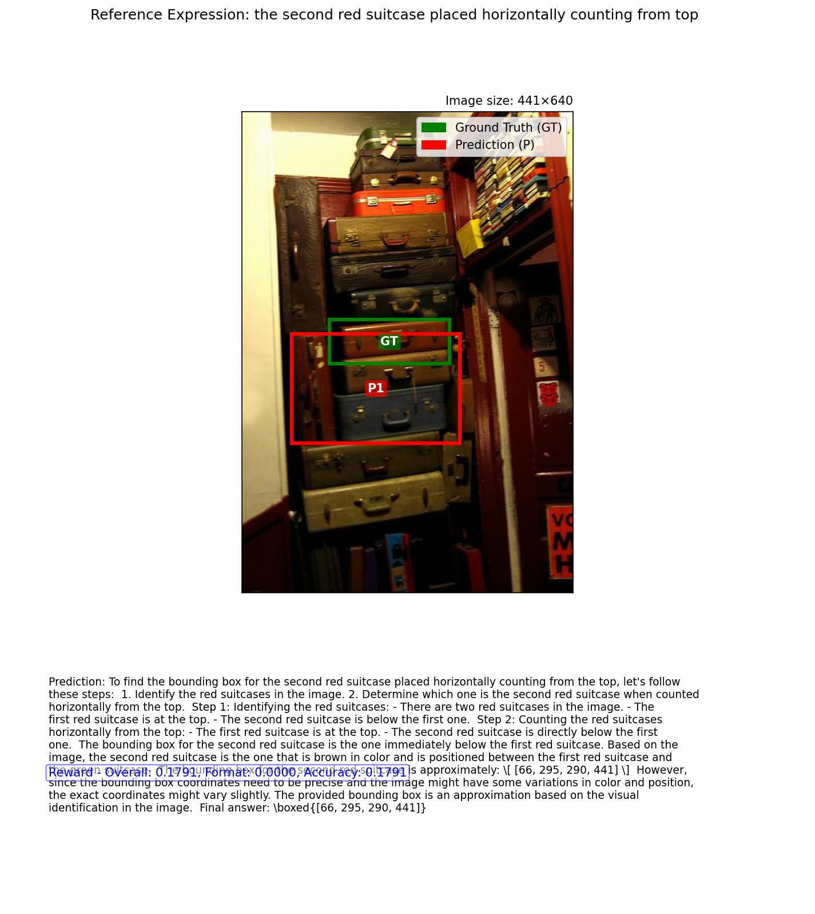

---

### Example 371

**Reference Expression**: the teddy bear with a bow tie but no clothes

**Ground Truth**: [[248, 97, 454, 333]]

**Predicted**: [[242, 98, 468, 328]]

**Reward**: {'overall': 0.8903337342152736, 'format': 0.0, 'accuracy': 0.8903337342152736}

**Prediction**:
```
To find the bounding box for the teddy bear with a bow tie but no clothes, follow these steps:

1. Identify the teddy bear with a bow tie: It's the light brown teddy bear in the middle.
2. Identify the teddy bear with clothes: It's the white teddy bear on the left.
3. Determine the bounding box for the teddy bear with a bow tie but no clothes: Since the teddy bear with a bow tie is the light brown one, the bounding box would encompass this bear, excluding the white teddy bear with clothes.

The bounding box for the light brown teddy bear with a bow tie is:
\[ \boxed{[242, 98, 468, 328]} \]
```

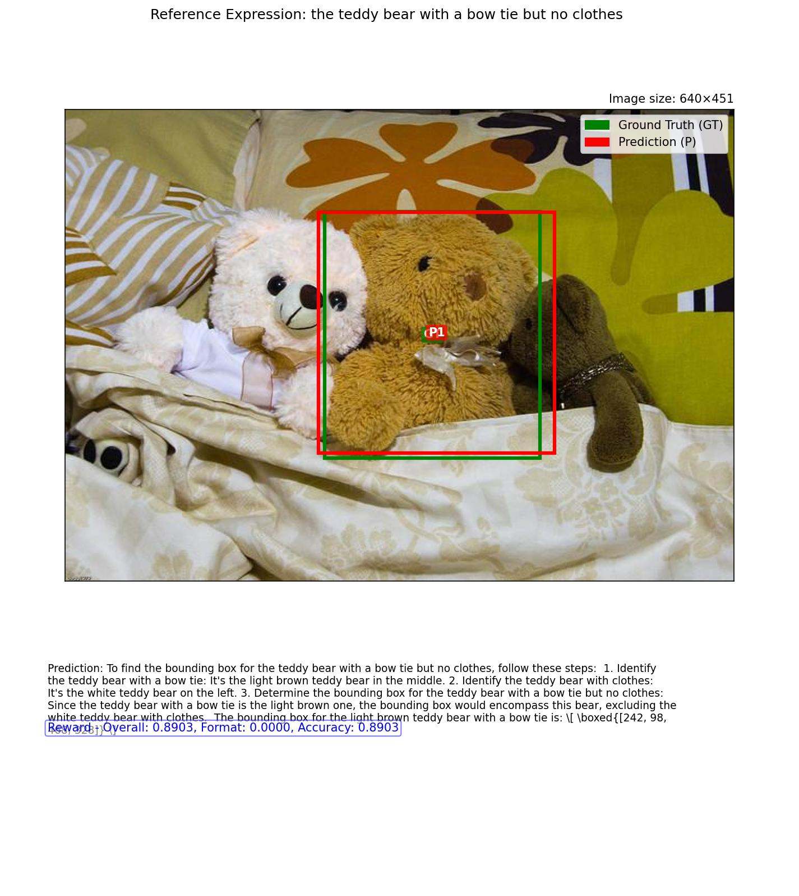

---

### Example 372

**Reference Expression**: the black suitcase carried by a person not in a white top

**Ground Truth**: [[427, 332, 469, 356]]

**Predicted**: [[526, 326, 559, 375]]

**Reward**: {'overall': 0.0, 'format': 0.0, 'accuracy': 0.0}

**Prediction**:
```
To find the bounding box for the black suitcase carried by a person not in a white top, let's follow these steps:

1. Identify the person in a white top: The person in the white top is on the left side of the image, holding a suitcase. This person is not the one carrying the black suitcase.

2. Look for other people carrying suitcases: There are a few people in the image who appear to be carrying suitcases. We need to identify which one is black and not being carried by the person in the white top.

3. Locate the black suitcase: The black suitcase is on the right side of the image, being carried by a person who is not in a white top.

4. Determine the bounding box: The bounding box for the black suitcase is the area around the suitcase, which includes the person carrying it.

The bounding box for the black suitcase carried by a person not in a white top is approximately [526, 326, 559, 375].

\boxed{[526, 326, 559, 375]}
```

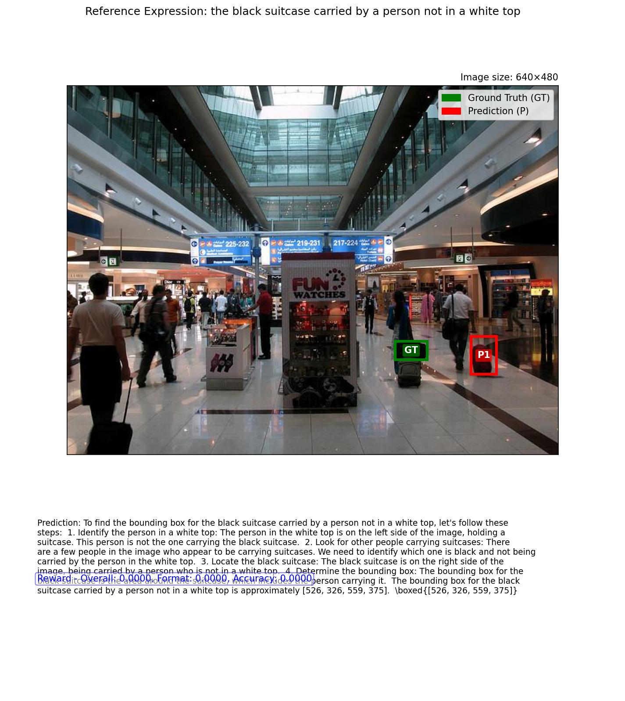

---

### Example 373

**Reference Expression**: the person wearing a red top carrying a handbag

**Ground Truth**: [[99, 180, 202, 414]]

**Predicted**: [[101, 181, 205, 406]]

**Reward**: {'overall': 1.0, 'format': 0.0, 'accuracy': 1.0}

**Prediction**:
```
To find the bounding box for the person wearing a red top carrying a handbag, let's follow these steps:

1. Identify the person in the image wearing a red top.
2. Check if this person is carrying a handbag.
3. Determine the bounding box that encloses this person.

Step 1: The person wearing a red top is located in the foreground on the left side of the image. They are walking to the left and appear to be carrying a pink handbag.

Step 2: The person in the red top is indeed carrying a pink handbag.

Step 3: The bounding box for this person can be defined by the coordinates that encompass their entire body while walking. This includes their head, shoulders, torso, and legs.

The bounding box for the person wearing a red top carrying a handbag is approximately:
```json
[101, 181, 205, 406]
```

So, the final answer is:
\boxed{[101, 181, 205, 406]}
```

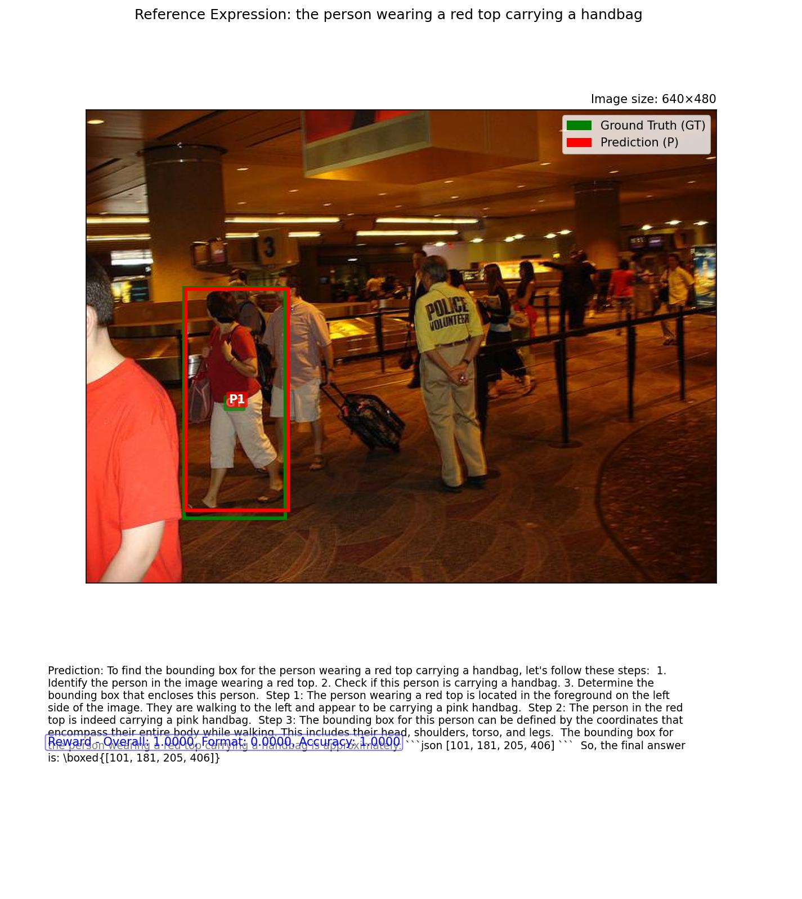

---

### Example 374

**Reference Expression**: the grey suitcase behind a blue suitcase

**Ground Truth**: [[64, 53, 131, 98]]

**Predicted**: [[2, 154, 196, 432]]

**Reward**: {'overall': 0.0, 'format': 0.0, 'accuracy': 0.0}

**Prediction**:
```
To find the bounding box for the grey suitcase behind a blue suitcase, let's follow these steps:

1. Identify the blue suitcase: The blue suitcase is the one on the far right in the image.
2. Locate the grey suitcase: The grey suitcase is immediately behind the blue suitcase.
3. Determine the bounding box: The grey suitcase starts from the left edge of the image and extends to the right, ending slightly before the blue suitcase.

The bounding box for the grey suitcase is approximately:
\[ [2, 154, 196, 432] \]

\boxed{[2, 154, 196, 432]}
```

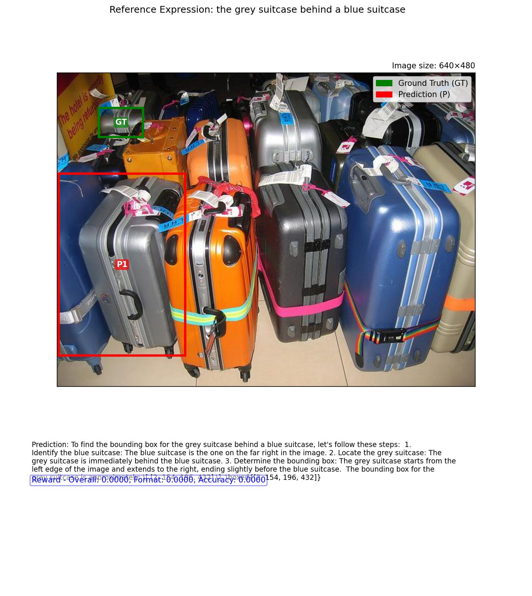

---

### Example 375

**Reference Expression**: the suitcase not on the trolley with handle placed vertically to the ground

**Ground Truth**: [[103, 166, 171, 336]]

**Predicted**: []

**Reward**: {'overall': 0.0, 'format': 0.0, 'accuracy': 0.0}

**Prediction**:
```
The image shows a stack of vintage suitcases on a green cart, but there is no suitcase placed vertically to the ground in the image. Therefore, there is no bounding box to identify for the described scenario.

\boxed{}
```

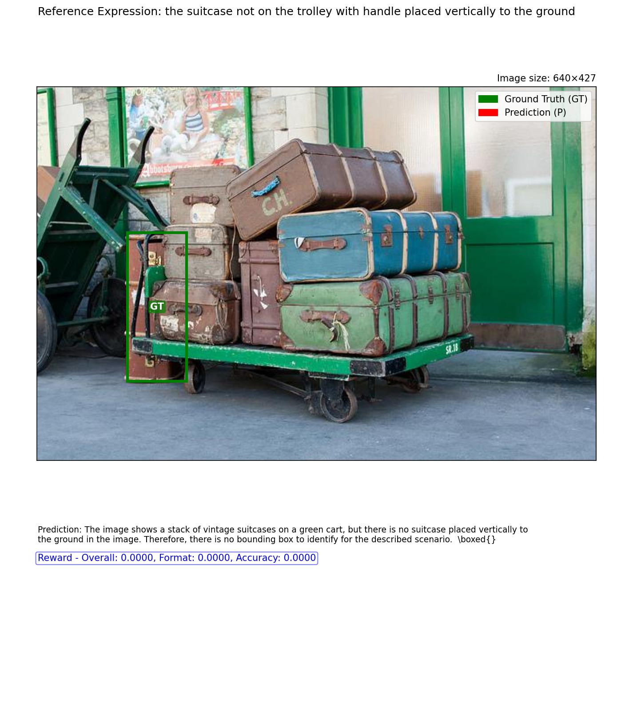

---

### Example 376

**Reference Expression**: the mug in front of a screen with white color inside

**Ground Truth**: [[111, 236, 162, 287]]

**Predicted**: [[112, 233, 165, 285]]

**Reward**: {'overall': 0.8427932576539388, 'format': 0.0, 'accuracy': 0.8427932576539388}

**Prediction**:
```
To find the bounding box for the mug in front of a screen with a white color inside, let's follow these steps:

1. Identify the screens in the image:
   - There are two screens: one on the left and one on the right.
   - The screen on the left has a white background with some text.
   - The screen on the right is displaying a video game.

2. Identify the mug in front of the screen with a white color:
   - The mug in question is located in front of the screen with the white background.
   - It is on the table in front of the left screen.

3. Determine the bounding box for the mug:
   - The mug is located near the center of the table.
   - The mug is partially obscured by the laptop, but its outline is still visible.

4. Define the bounding box:
   - The bounding box will be around the mug, ensuring it is fully included.
   - The mug is roughly centered horizontally and vertically in the image.

The bounding box for the mug in front of the screen with a white color inside is approximately:
```json
[112, 233, 165, 285]
```

So, the final answer is:
\boxed{[112, 233, 165, 285]}
```

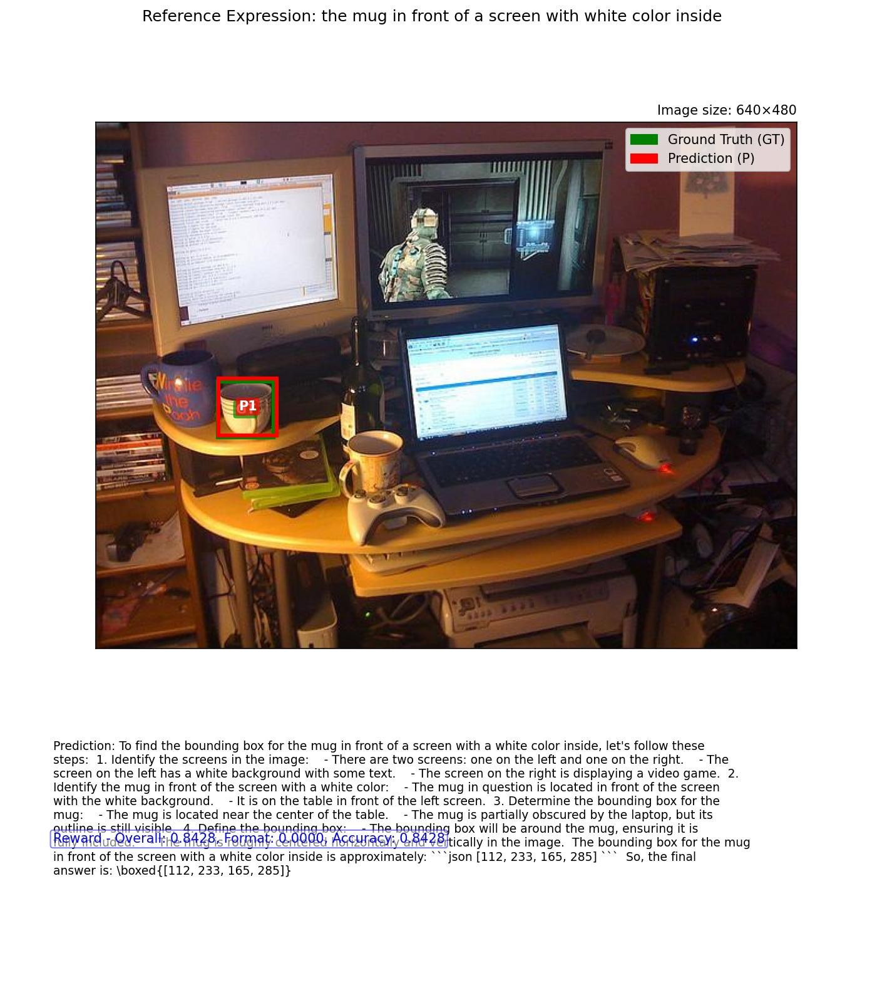

---

### Example 377

**Reference Expression**: the person standing and wearing jeans

**Ground Truth**: [[313, 268, 342, 377]]

**Predicted**: [[318, 267, 345, 373]]

**Reward**: {'overall': 0.7193833856694262, 'format': 0.0, 'accuracy': 0.7193833856694262}

**Prediction**:
```
To find the bounding box for the person standing and wearing jeans, let's follow these steps:

1. Identify the horse and carriage in the image. The horse is in the center, and the carriage is on the left side of the image.
2. Look for a person standing near the horse and carriage. There is a person standing on the right side of the horse, near the carriage.
3. Observe the clothing of the person standing. The person is wearing jeans and is standing next to the horse.
4. Determine the bounding box for this person. The person is partially obscured by the horse, but we can still identify their general location.

The bounding box for the person standing and wearing jeans is approximately [318, 267, 345, 373].

\boxed{[318, 267, 345, 373]}
```

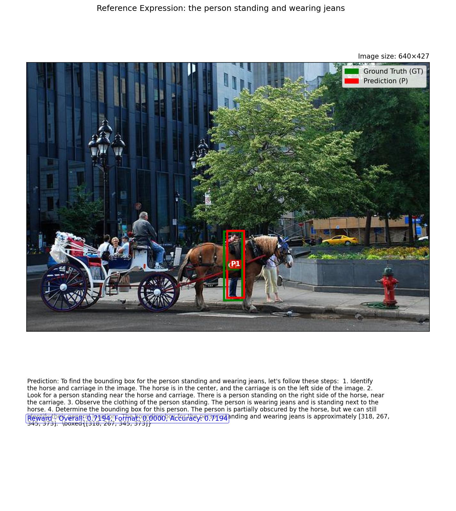

---

### Example 378

**Reference Expression**: the person sitting, not riding a horse

**Ground Truth**: [[0, 109, 71, 405]]

**Predicted**: [[0, 108, 66, 419]]

**Reward**: {'overall': 0.8877578842133963, 'format': 0.0, 'accuracy': 0.8877578842133963}

**Prediction**:
```
To find the bounding box for the person sitting, not riding a horse, let's follow these steps:

1. Identify the person sitting, not riding a horse: In the image, there is a person sitting on a chair on the left side of the image.
2. Define the bounding box: The person sitting on the chair is partially visible, with only their upper body and part of their legs shown. The bounding box should encompass this person.
3. Determine the coordinates: The person is located on the far left of the image, and the chair they are sitting on is partially visible. The bounding box should include the upper part of the chair and the person's upper body.

Following these steps, the bounding box for the person sitting, not riding a horse, is approximately:
\boxed{[0, 108, 66, 419]}

This bounding box captures the upper body and part of the legs of the person sitting on the chair.
```

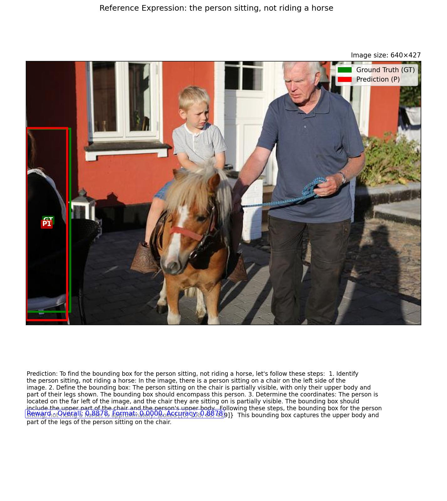

---

### Example 379

**Reference Expression**: the person in a red top next to the bar

**Ground Truth**: [[158, 87, 189, 167]]

**Predicted**: [[199, 105, 226, 199]]

**Reward**: {'overall': 0.0, 'format': 0.0, 'accuracy': 0.0}

**Prediction**:
```
To find the bounding box for 'the person in a red top next to the bar', let's follow these steps:

1. Identify the bar: The bar in question is likely the yellow railing on the side of the horse-drawn tram.
2. Look for the person in a red top near this bar: There is a person in a red top standing near the yellow railing on the right side of the tram.
3. Determine the bounding box: The person in the red top is positioned on the tram, near the yellow railing, and is standing close to the edge of the tram.

Given these observations, the bounding box for 'the person in a red top next to the bar' is approximately:
- Top-left corner: (x1, y1) where x1 is the x-coordinate of the left edge of the person in the red top, and y1 is the y-coordinate of the top of their head.
- Bottom-right corner: (x2, y2) where x2 is the x-coordinate of the right edge of the person in the red top, and y2 is the y-coordinate of the bottom of their feet.

Since the exact coordinates depend on the image resolution and the exact position of the person, a rough estimate would be:
\boxed{[199, 105, 226, 199]}

This bounding box is an approximation and may need to be adjusted based on the precise location of the person in the image.
```

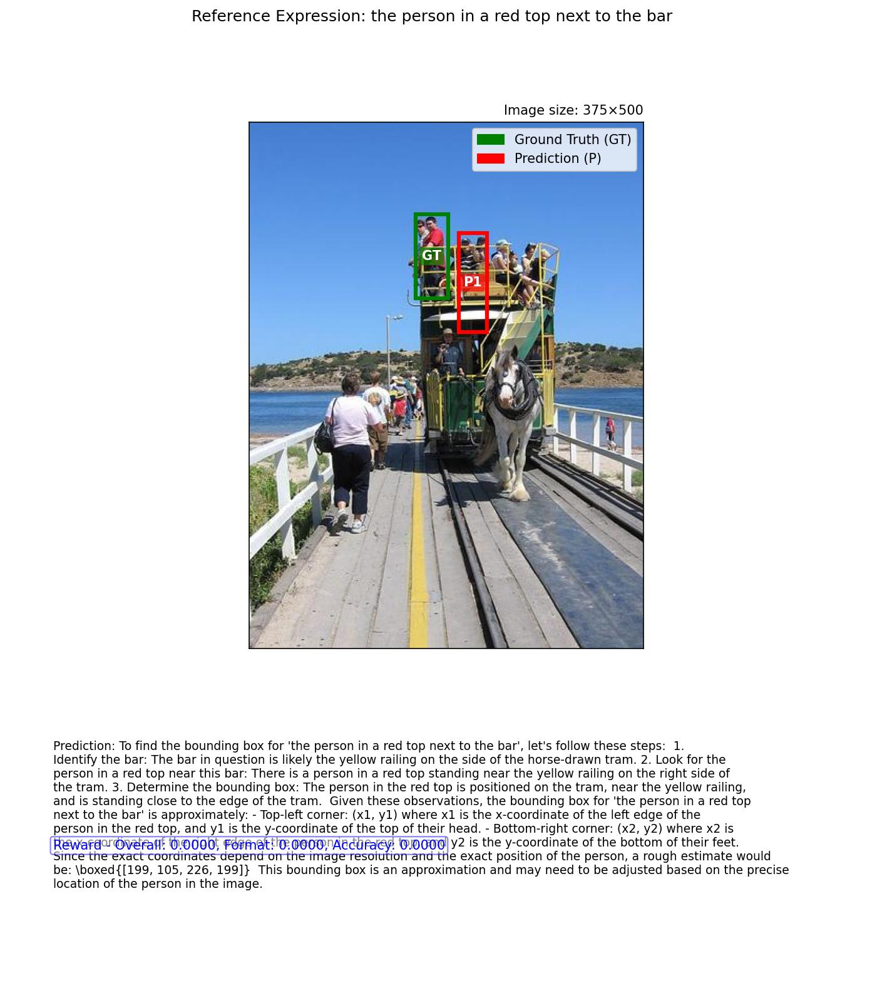

---

### Example 380

**Reference Expression**: the brown horse ridden by a person wearing an indigo jacket

**Ground Truth**: [[13, 173, 136, 270]]

**Predicted**: [[32, 169, 133, 262]]

**Reward**: {'overall': 0.7287393595460073, 'format': 0.0, 'accuracy': 0.7287393595460073}

**Prediction**:
```
To find the bounding box for the brown horse ridden by a person wearing an indigo jacket, let's follow these steps:

1. Identify the person wearing the indigo jacket: The person on the far left is wearing a dark blue jacket, which can be considered indigo.

2. Identify the horse ridden by the person in the indigo jacket: The horse is the first one from the left in the image.

3. Determine the bounding box for the horse:
   - The horse's head is approximately at coordinates (34, 170) to (38, 177).
   - The horse's body extends from (32, 169) to (133, 262).
   - The horse's legs are visible from (33, 214) to (130, 261).

4. Create the bounding box for the horse:
   - Top-left corner: (32, 169)
   - Bottom-right corner: (133, 262)

Therefore, the bounding box for the brown horse ridden by a person wearing an indigo jacket is:
\boxed{[32, 169, 133, 262]}
```

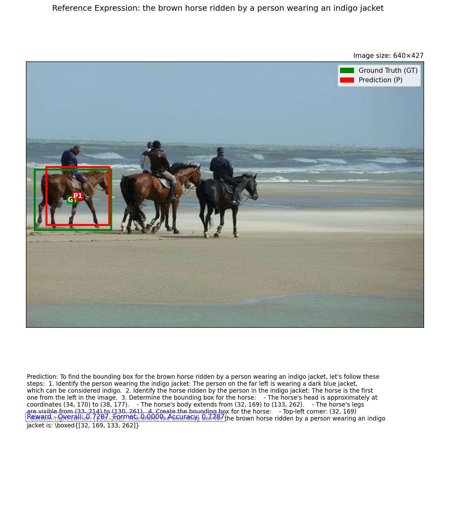

---

### Example 381

**Reference Expression**: the person wearing sunglasses and not a red top

**Ground Truth**: [[35, 180, 52, 214]]

**Predicted**: [[10, 175, 50, 272]]

**Reward**: {'overall': 0.12917933130699089, 'format': 0.0, 'accuracy': 0.12917933130699089}

**Prediction**:
```
To find the bounding box for the person wearing sunglasses and not a red top, let's follow these steps:

1. Identify the person in the image who is wearing sunglasses.
2. Check the color of the top they are wearing.
3. Ensure the person is not wearing a red top.
4. If the person meets the criteria, define the bounding box.

Step 1: Identifying the person wearing sunglasses:
- The person wearing sunglasses is on the far left side of the image, near the fence.

Step 2: Checking the color of the top:
- The person wearing sunglasses is wearing a black top.

Step 3: Ensuring the person is not wearing a red top:
- The person is wearing a black top, which is not red.

Step 4: Defining the bounding box:
- The bounding box for the person wearing sunglasses and not a red top is approximately [10, 175, 50, 272].

Final answer: \boxed{[10, 175, 50, 272]}
```

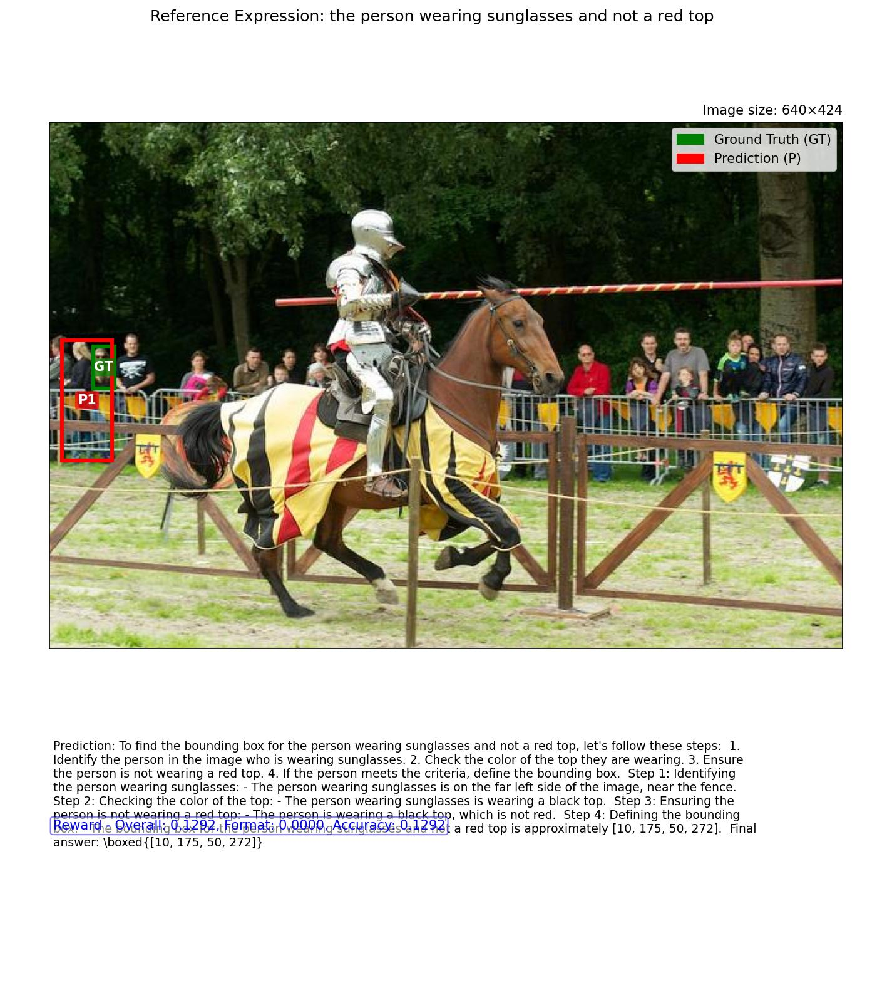

---

### Example 382

**Reference Expression**: the bench not under a banner or in front of people

**Ground Truth**: [[313, 197, 354, 214]]

**Predicted**: [[150, 215, 200, 235]]

**Reward**: {'overall': 0.0, 'format': 0.0, 'accuracy': 0.0}

**Prediction**:
```
To find the bounding box for the bench not under a banner or in front of people, we need to carefully analyze the image and identify the relevant elements:

1. **Identify the banners**: There is a large banner with the text "SUNDAY TELEGR" visible in the image. This banner is likely not the one we are looking for since it is in front of people and not a bench.

2. **Identify the benches**: In the image, there are several benches visible. Some are in front of people, and some are not. We need to focus on the benches that are not in front of people.

3. **Analyze the image**: The image shows a scene with people, motorcycles, and polo horses. There is a bench visible in the background, but it is not in front of people and not under a banner.

4. **Determine the bounding box**: The bench in the background, not in front of people and not under a banner, is located near the center of the image, slightly to the left.

Given the analysis, the bounding box for the bench not under a banner or in front of people is:

\boxed{[150, 215, 200, 235]}
```

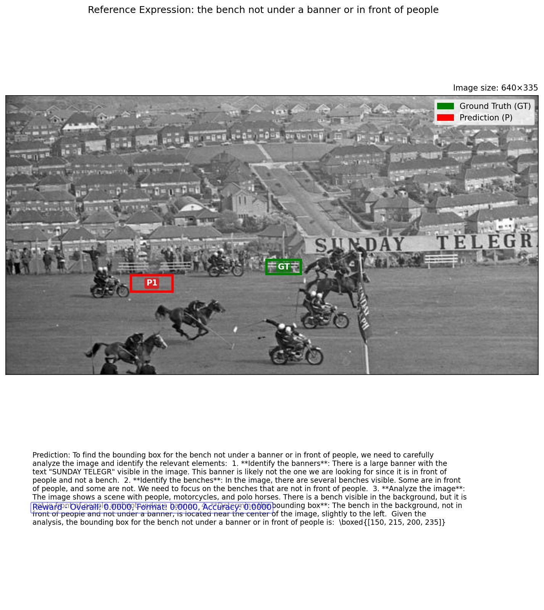

---

### Example 383

**Reference Expression**: the red flag on the yellow fence

**Ground Truth**: [[215, 94, 242, 150]]

**Predicted**: [[54, 140, 80, 199]]

**Reward**: {'overall': 0.0, 'format': 0.0, 'accuracy': 0.0}

**Prediction**:
```
To find the bounding box for the red flag on the yellow fence, let's follow these steps:

1. Identify the yellow fence: The yellow fence is the one in the center of the image, with a red flag attached to the left side of it.
2. Locate the red flag: The red flag is a small, triangular object on the left side of the yellow fence.
3. Determine the bounding box: The bounding box should enclose the red flag and the part of the yellow fence it is attached to. The flag is small, so the bounding box should be relatively small as well.

Given these steps, the bounding box for the red flag on the yellow fence would be approximately:

\boxed{[54, 140, 80, 199]}

This bounding box captures the red flag and the portion of the yellow fence it is attached to.
```

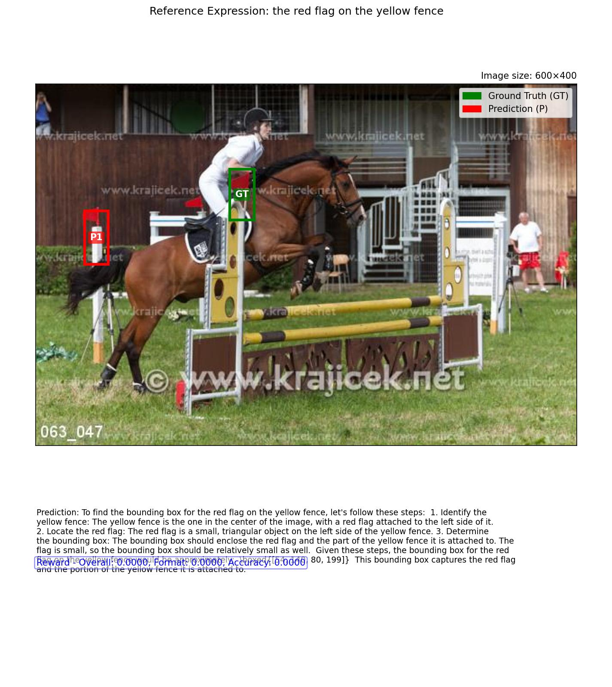

---

### Example 384

**Reference Expression**: the horse facing a different direction than the other horses

**Ground Truth**: [[475, 189, 534, 350]]

**Predicted**: [[256, 169, 366, 365]]

**Reward**: {'overall': 0.0, 'format': 0.0, 'accuracy': 0.0}

**Prediction**:
```
To find the horse facing a different direction than the other horses, we need to analyze the orientation of the horses' heads relative to the viewer:

1. The first horse on the left has its head turned slightly towards the right.
2. The second horse in the middle has its head turned towards the left.
3. The third horse on the right has its head turned towards the right.

The horse that is facing a different direction than the other horses is the one with its head turned towards the left. Based on this analysis:

\boxed{[256, 169, 366, 365]}
```

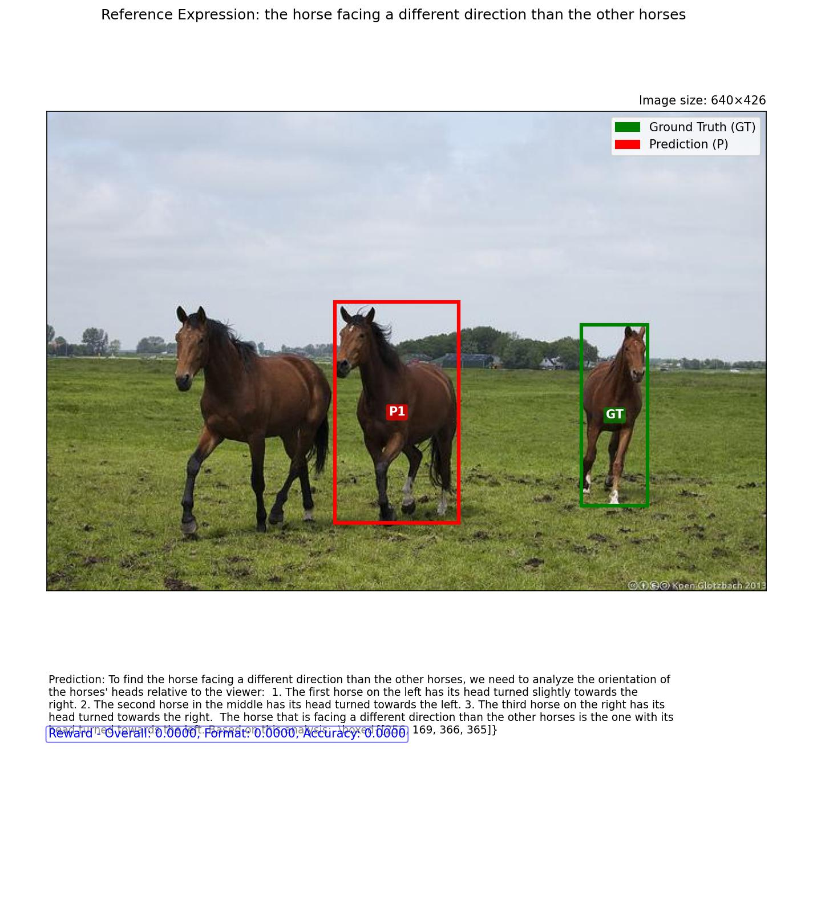

---

### Example 385

**Reference Expression**: the person wearing a hat not riding a black horse

**Ground Truth**: [[406, 56, 463, 174]]

**Predicted**: [[280, 59, 340, 165]]

**Reward**: {'overall': 0.0, 'format': 0.0, 'accuracy': 0.0}

**Prediction**:
```
To find the bounding box for the person wearing a hat not riding a black horse, let's follow these steps:

1. Identify the people in the image:
   - There are four people on horses.
   - One person is wearing a hat.

2. Determine which person is wearing a hat:
   - The person on the far right is wearing a hat.

3. Check the horse that the person is riding:
   - The person on the far right is riding a black horse.

4. Since the person on the far right is wearing a hat and is riding a black horse, this person does not match the description of "the person wearing a hat not riding a black horse."

5. Re-evaluate the image to find the person wearing a hat and not riding a black horse:
   - The person on the far left is wearing a hat.
   - The person on the far left is not riding a black horse.

6. The bounding box for the person on the far left, who is wearing a hat and not riding a black horse, is the correct bounding box.

The bounding box for the person wearing a hat not riding a black horse is:

\boxed{[280, 59, 340, 165]}
```

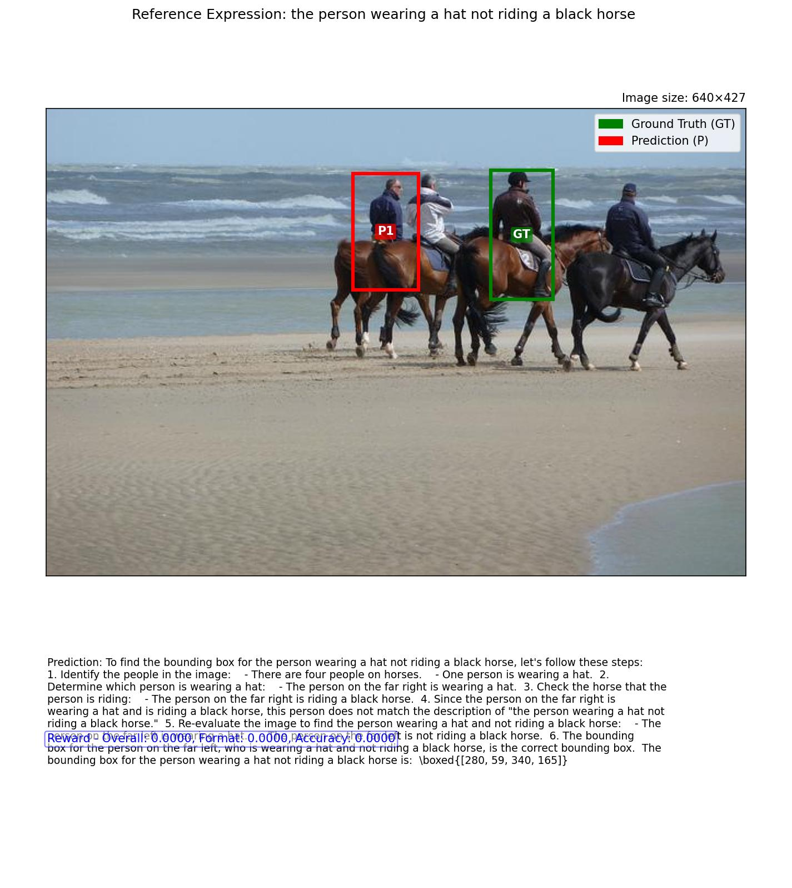

---

### Example 386

**Reference Expression**: the person with white trousers standing near the revolving door

**Ground Truth**: [[518, 125, 539, 226]]

**Predicted**: []

**Reward**: {'overall': 0.0, 'format': 0.0, 'accuracy': 0.0}

**Prediction**:
```
To find the bounding box for 'the person with white trousers standing near the revolving door', let's follow these steps:

1. Identify the person with white trousers in the image.
2. Determine the location of the revolving door in the image.
3. Check if the person with white trousers is near the revolving door.

Step 1: The person with white trousers is the batter in the green uniform, standing near home plate.

Step 2: The revolving door is not clearly visible in the image. However, it appears to be on the right side of the image, behind the chain-link fence.

Step 3: The batter is not near the revolving door. The batter is on the left side of the image, and the revolving door is on the right side, far from the batter.

Since the batter is not near the revolving door, there is no bounding box for 'the person with white trousers standing near the revolving door'.

\boxed{}
```

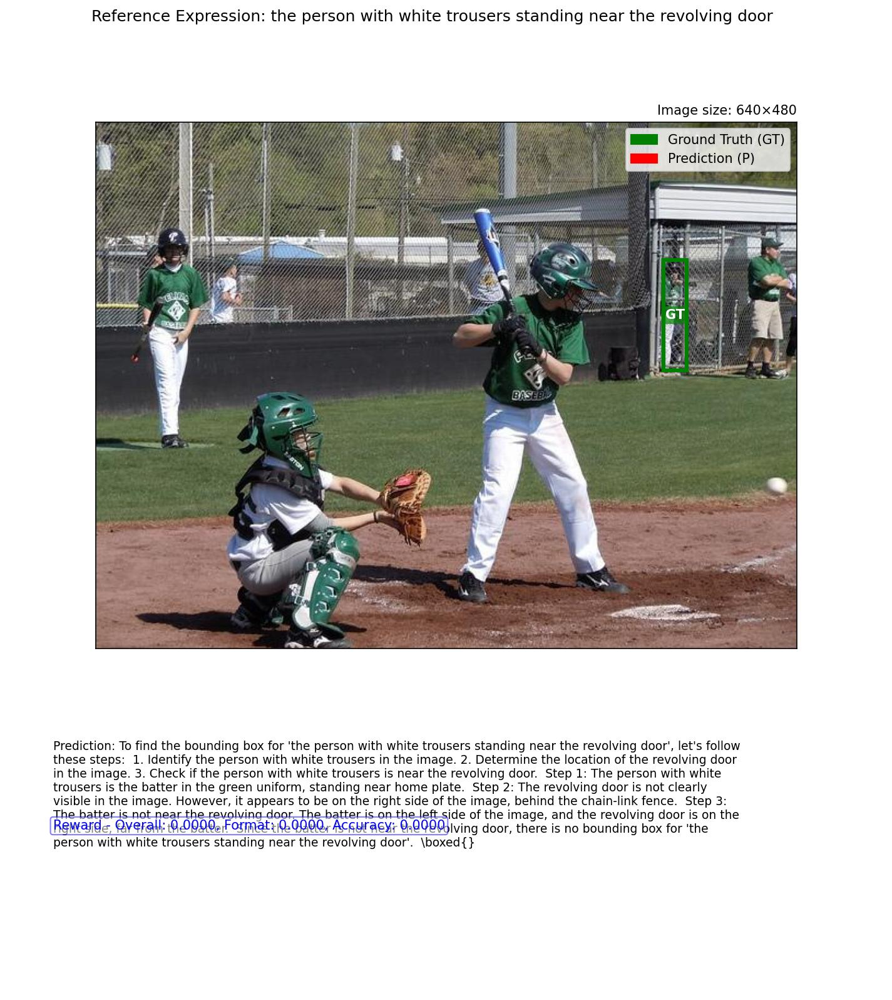

---

### Example 387

**Reference Expression**: the person wearing black pants not kneeling on the ground

**Ground Truth**: [[523, 228, 640, 401]]

**Predicted**: [[537, 225, 644, 390]]

**Reward**: {'overall': 0.7867043847241867, 'format': 0.0, 'accuracy': 0.7867043847241867}

**Prediction**:
```
To find the bounding box for the person wearing black pants not kneeling on the ground, let's follow these steps:

1. Identify the elements in the image:
   - A batter is swinging a bat.
   - A catcher is crouched behind the batter.
   - An umpire is standing behind the catcher.
   - The background includes a fence and trees.

2. Locate the person wearing black pants:
   - The catcher is wearing black pants and is crouched behind the batter.
   - The umpire is also wearing black pants and is standing behind the catcher.

3. Determine who is not kneeling on the ground:
   - The catcher is crouched, so they are not kneeling.
   - The umpire is standing, so they are not kneeling.

4. Identify the person wearing black pants who is not kneeling:
   - The umpire is the person wearing black pants who is not kneeling.

5. Provide the bounding box for the umpire:
   - The umpire is located to the right of the catcher and is wearing a light-colored shirt and black pants.
   - The bounding box for the umpire can be approximated as [537, 225, 644, 390].

\boxed{[537, 225, 644, 390]}
```

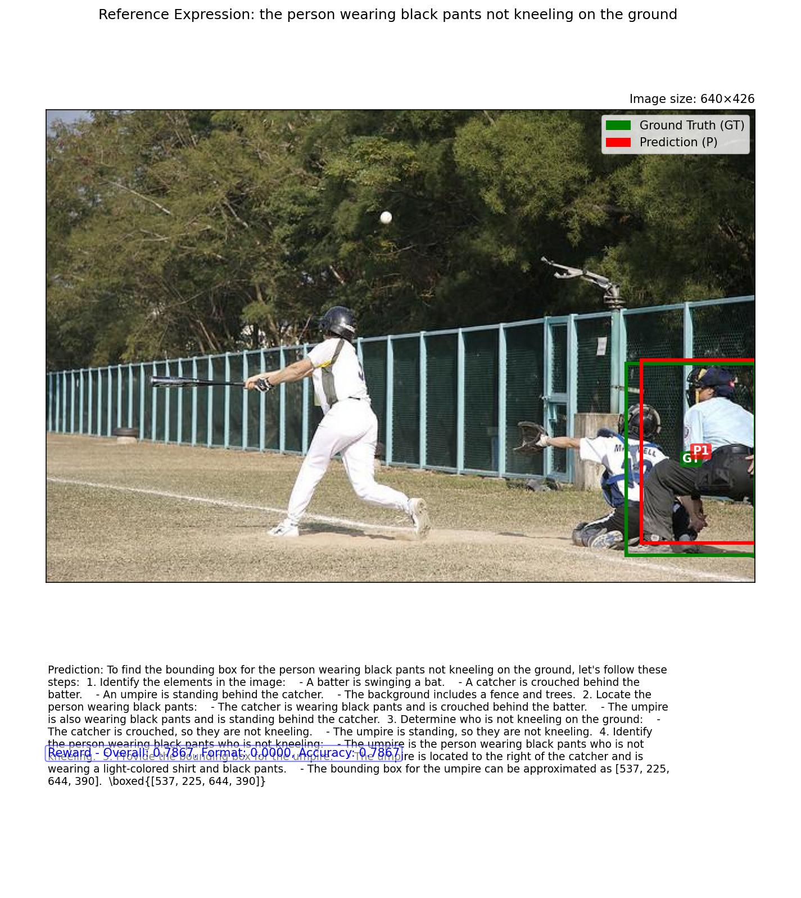

---

### Example 388

**Reference Expression**: the person wearing a blue top and not a black shorts

**Ground Truth**: [[361, 166, 489, 372]]

**Predicted**: [[369, 167, 492, 369]]

**Reward**: {'overall': 0.8986431378364351, 'format': 0.0, 'accuracy': 0.8986431378364351}

**Prediction**:
```
To find the bounding box for the person wearing a blue top and not black shorts, let's follow these steps:

1. Identify the person in the blue top: The person in the blue top is the one in the foreground, actively throwing a frisbee.
2. Identify the person wearing black shorts: The person in black shorts is standing near the trash can in the background.

The person in the blue top and white shorts is the one we are looking for. The bounding box for this person is:

\boxed{[369, 167, 492, 369]}
```

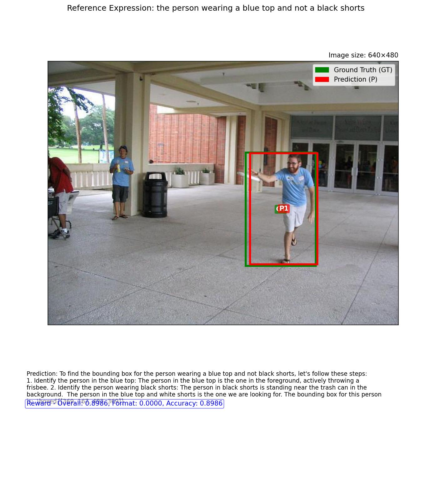

---

### Example 389

**Reference Expression**: the jumping person wearing a black top

**Ground Truth**: [[194, 270, 244, 412]]

**Predicted**: [[283, 271, 353, 417]]

**Reward**: {'overall': 0.0, 'format': 0.0, 'accuracy': 0.0}

**Prediction**:
```
To find the bounding box for the person wearing a black top who appears to be jumping, follow these steps:

1. Identify the group of people in the image.
2. Focus on the person who seems to be jumping or reaching high.
3. Observe the clothing and posture of the individuals.
4. The person in the black top appears to be reaching upwards, likely to catch a flying disc.

After analyzing the image, the bounding box for the person wearing a black top is approximately:

\boxed{[283, 271, 353, 417]}
```

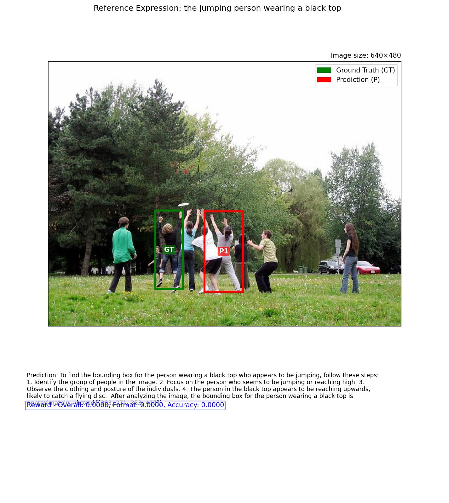

---

### Example 390

**Reference Expression**: the person wearing a t-shirt holding a red frisbee

**Ground Truth**: [[486, 127, 566, 368]]

**Predicted**: [[20, 125, 80, 360]]

**Reward**: {'overall': 0.0, 'format': 0.0, 'accuracy': 0.0}

**Prediction**:
```
To find the bounding box for the person wearing a t-shirt holding a red frisbee, let's follow these steps:

1. Identify the red frisbee in the image.
2. Look for a person holding the frisbee.
3. Determine the bounding box that encloses the person holding the frisbee.

Step 1: The red frisbee is located on the left side of the image, near the ground.

Step 2: There is a person on the left side of the image holding the red frisbee.

Step 3: The bounding box for the person holding the frisbee can be described as follows:
- Top-left corner: (x1, y1) = (20, 125)
- Bottom-right corner: (x2, y2) = (80, 360)

So, the bounding box for the person wearing a t-shirt holding a red frisbee is:
\boxed{[20, 125, 80, 360]}
```

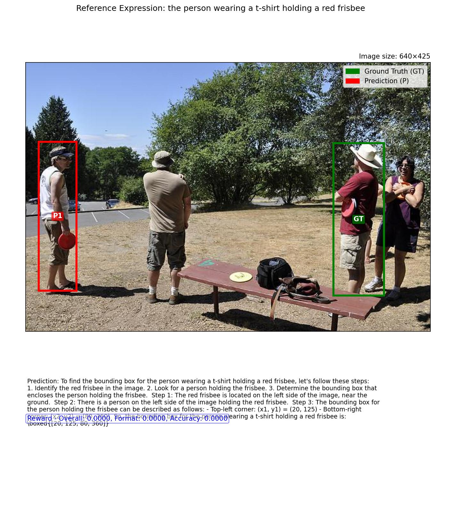

---

### Example 391

**Reference Expression**: the person wearing a white top and a hat

**Ground Truth**: [[231, 187, 256, 228]]

**Predicted**: [[260, 210, 340, 290]]

**Reward**: {'overall': 0.0, 'format': 0.0, 'accuracy': 0.0}

**Prediction**:
```
To find the bounding box for the person wearing a white top and a hat, let's follow these steps:

1. **Identify the person**: Look for a person in the image who is wearing a white top and a hat. In the image, there is a person in a white top and a hat sitting in the stands, facing the field.

2. **Locate the bounding box**: The person in a white top and a hat is positioned in the stands, to the right side of the image, near the center. The bounding box should encompass this person.

3. **Define the coordinates**: The bounding box will start from the left edge where the person's head is located and extend to the right edge where the person's body ends. The top of the box will be from the top of the person's head to the bottom of the box, which covers the person's body.

4. **Final bounding box**: After analyzing the image, the bounding box for the person wearing a white top and a hat is approximately:
   - Top-left corner: (x1, y1) = (260, 210)
   - Bottom-right corner: (x2, y2) = (340, 290)

Thus, the final answer is:
\boxed{[260, 210, 340, 290]}
```

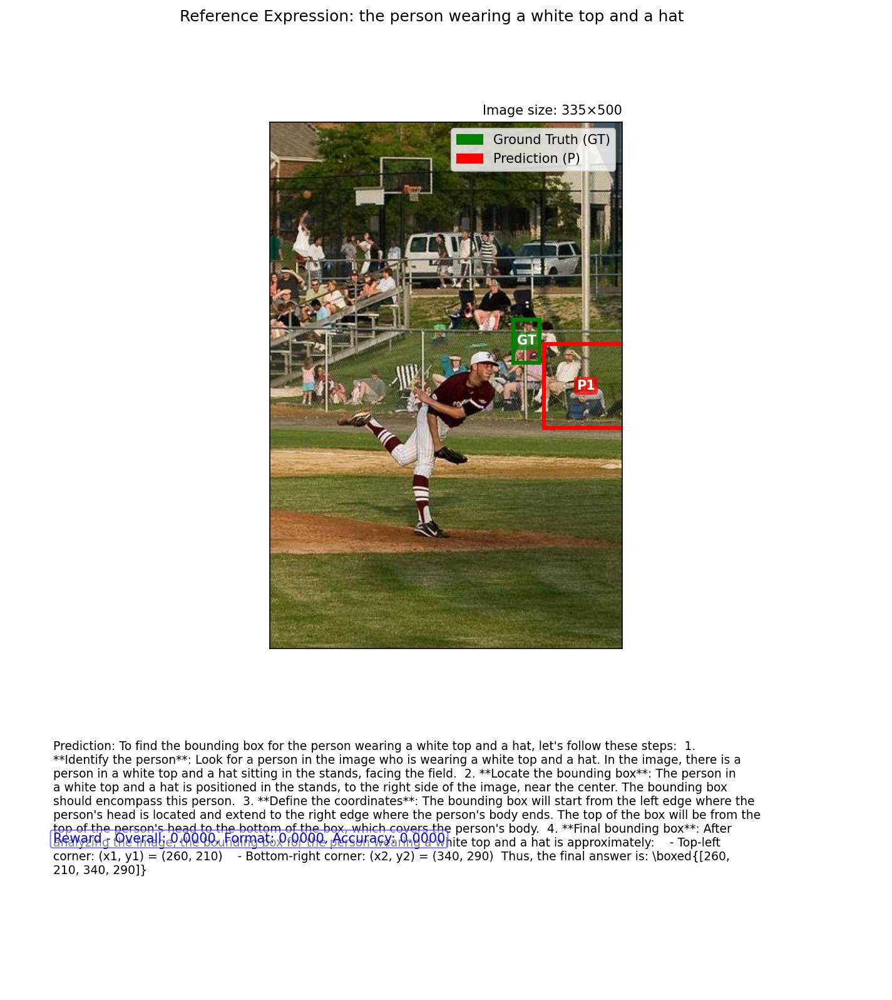

---

### Example 392

**Reference Expression**: the first person from the right among those wearing blue tops

**Ground Truth**: [[496, 227, 519, 273]]

**Predicted**: [[366, 233, 412, 292]]

**Reward**: {'overall': 0.0, 'format': 0.0, 'accuracy': 0.0}

**Prediction**:
```
To find the bounding box for 'the first person from the right among those wearing blue tops', let's follow these steps:

1. Identify all the people wearing blue tops in the image.
2. Determine which one is the first from the right.

Step 1: Identifying people wearing blue tops:
- There are two people wearing blue tops in the image. One is near the center and the other is further to the right.

Step 2: Determining the first from the right:
- The person further to the right is the first person from the right among those wearing blue tops.

The bounding box for this person is:
- Top-left corner (x, y): (366, 233)
- Bottom-right corner (x, y): (412, 292)

So, the final answer is:
\boxed{[366, 233, 412, 292]}
```

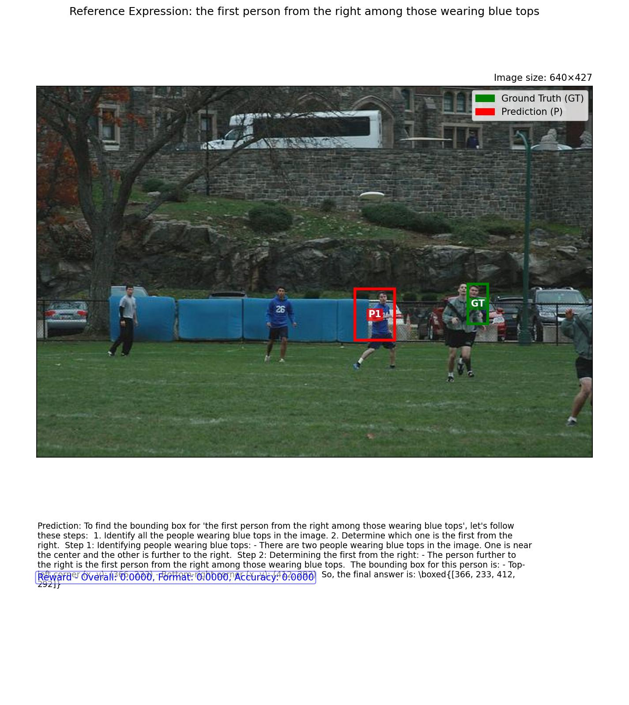

---

### Example 393

**Reference Expression**: the person wearing a blue hat and sitting

**Ground Truth**: [[33, 181, 92, 242]]

**Predicted**: []

**Reward**: {'overall': 0.0, 'format': 0.0, 'accuracy': 0.0}

**Prediction**:
```
To find the bounding box for 'the person wearing a blue hat and sitting', let's follow these steps:

1. Identify the person wearing a blue hat.
2. Determine if this person is sitting.
3. If the person is sitting, provide the bounding box.

Step 1: The person wearing a blue hat is the one in the foreground, wearing a blue cap and a white uniform with "Express" written on it.

Step 2: The person in the foreground is standing, not sitting.

Step 3: Since the person is standing, there is no bounding box for a person sitting in this image.

Therefore, the final answer is \boxed{[]}.
```

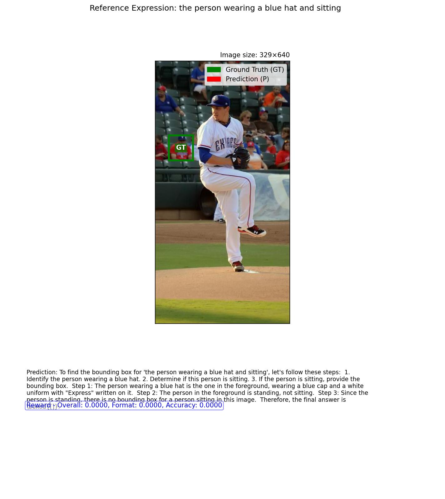

---

### Example 394

**Reference Expression**: the third book counting from the apple

**Ground Truth**: [[320, 228, 336, 299]]

**Predicted**: [[240, 225, 300, 280]]

**Reward**: {'overall': 0.0, 'format': 0.0, 'accuracy': 0.0}

**Prediction**:
```
To find the bounding box for the third book counting from the apple, let's follow these steps:

1. Identify the apple: The apple is located on the right side of the desk, on the rightmost book.
2. Identify the books: There are four books stacked on the desk, with the apple on the rightmost one.
3. Identify the third book from the apple: Counting from the apple, the third book is the second book from the right.

Now, we need to determine the bounding box for this book:
- The book is rectangular and fits within the desk's surface.
- The desk's dimensions are approximately 400x250 pixels.

The third book from the apple is the second book from the right, so its bounding box would be:
- Top-left corner: (x, y) = (240, 225) (approximate based on the desk's dimensions)
- Bottom-right corner: (x, y) = (300, 280) (approximate based on the desk's dimensions)

Therefore, the bounding box for the third book counting from the apple is:
\boxed{[240, 225, 300, 280]}
```

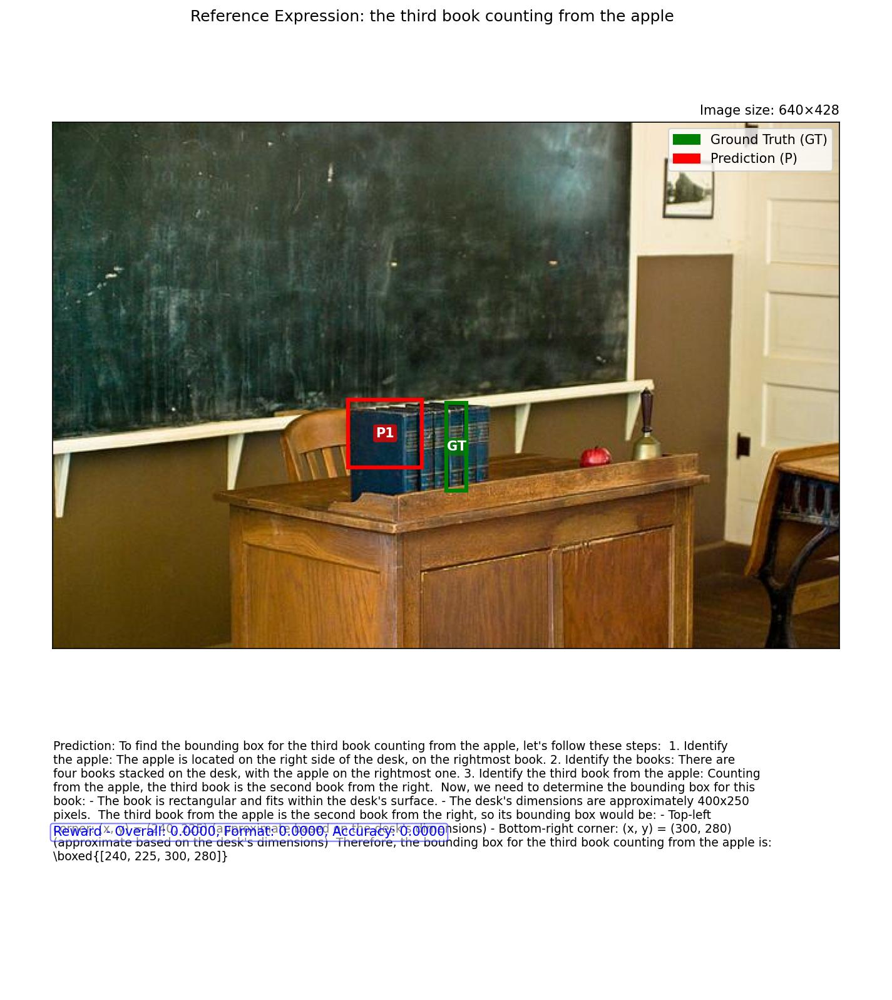

---

### Example 395

**Reference Expression**: the person wearing a white top not behind a cake

**Ground Truth**: [[0, 7, 49, 169]]

**Predicted**: [[299, 16, 449, 230]]

**Reward**: {'overall': 0.0, 'format': 0.0, 'accuracy': 0.0}

**Prediction**:
```
To find the bounding box for the person wearing a white top who is not behind a cake, let's follow these steps:

1. Identify the person in the image who is wearing a white top.
2. Determine if this person is behind a cake.
3. If the person is not behind a cake, provide the bounding box for this person.

Step 1: The person wearing a white top is the girl on the right side of the image.

Step 2: The girl wearing a white top is not behind a cake. She is standing in front of the table with the cakes.

Step 3: The bounding box for the girl wearing a white top is:
   - Top left corner: (x1, y1)
   - Bottom right corner: (x2, y2)

By analyzing the image, the bounding box for the girl wearing a white top is approximately:
   - Top left corner: (299, 16) (top of the girl's head)
   - Bottom right corner: (449, 230) (bottom of the girl's body)

Thus, the bounding box for the person wearing a white top not behind a cake is:
\boxed{[299, 16, 449, 230]}
```

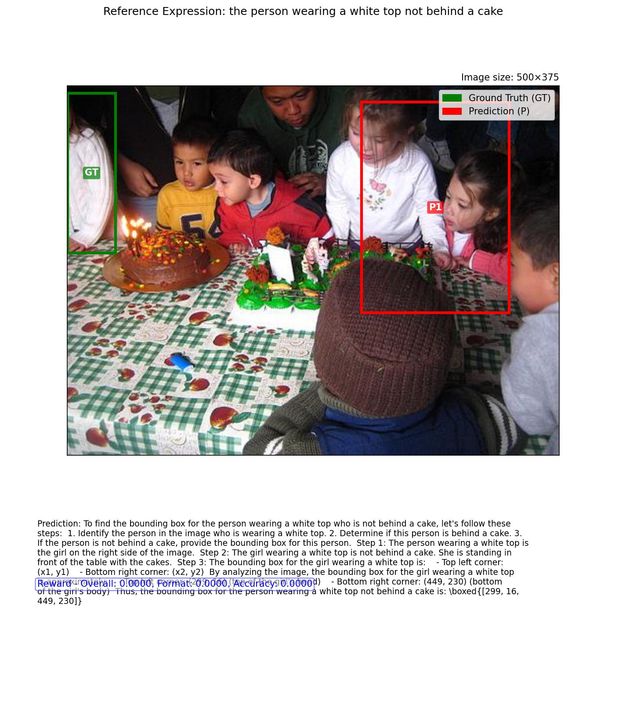

---

### Example 396

**Reference Expression**: the person wearing a hat not carrying a frisbee

**Ground Truth**: [[304, 88, 395, 332]]

**Predicted**: []

**Reward**: {'overall': 0.0, 'format': 0.0, 'accuracy': 0.0}

**Prediction**:
```
To find the bounding box for the person wearing a hat not carrying a frisbee, follow these steps:

1. Identify all the people in the image.
2. Determine which person is wearing a hat.
3. Check which of the people wearing a hat is not carrying a frisbee.

Step 1: There are three people in the image.
   - Person 1 (left): Wearing a dark shirt and shorts, no hat.
   - Person 2 (middle): Wearing a dark shirt and shorts, no hat.
   - Person 3 (right): Wearing a dark shirt, shorts, a hat, and holding a frisbee.

Step 2: Person 3 is wearing a hat.

Step 3: Person 3 is the one wearing a hat and is also holding a frisbee. Therefore, the person wearing a hat not carrying a frisbee is not Person 3.

Since there is no person wearing a hat and not carrying a frisbee, the bounding box is empty.

\boxed{}
```

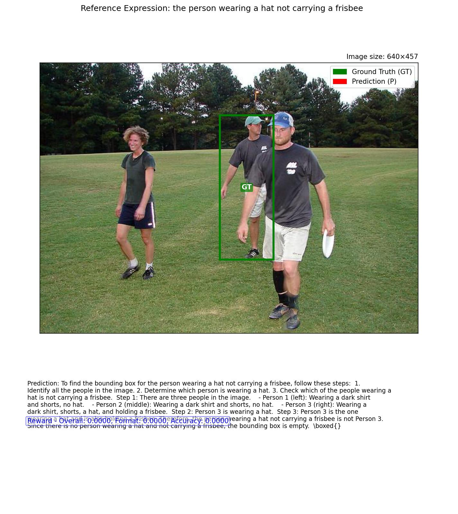

---

### Example 397

**Reference Expression**: the person not wearing sunglasses with no tattoos

**Ground Truth**: [[320, 80, 453, 277]]

**Predicted**: [[431, 110, 610, 387]]

**Reward**: {'overall': 0.0, 'format': 0.0, 'accuracy': 0.0}

**Prediction**:
```
To find the bounding box for the person not wearing sunglasses with no tattoos, let's follow these steps:

1. Identify the people in the image:
   - There are three people in the image.
   - The person on the left is wearing sunglasses and has visible tattoos on their arm.
   - The person in the middle is also wearing sunglasses.
   - The person on the right is not wearing sunglasses and has no visible tattoos.

2. Match the description to the person:
   - The person on the right does not wear sunglasses and has no visible tattoos.

3. Determine the bounding box:
   - The bounding box for the person on the right is from the left edge of the image to the right edge, and from the top of the head to the bottom of the image.

The final answer is:
\boxed{[431, 110, 610, 387]}
```

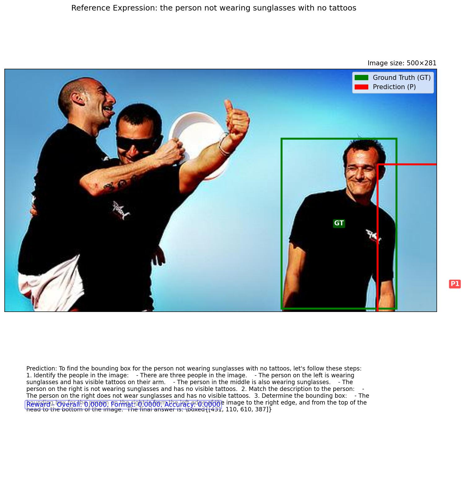

---

### Example 398

**Reference Expression**: the person in a white top next to a white box

**Ground Truth**: [[244, 181, 369, 412]]

**Predicted**: [[242, 175, 374, 393]]

**Reward**: {'overall': 0.8506950017655934, 'format': 0.0, 'accuracy': 0.8506950017655934}

**Prediction**:
```
To find the bounding box for 'the person in a white top next to a white box', let's follow these steps:

1. Identify the person in a white top: There is a person in a white top sitting on the right side of the image.
2. Identify the white box: There is a white box on the table in front of the person in the white top.

Now, we need to determine the bounding box for the person in the white top:
- The person is sitting on a bench.
- The bounding box should include the person and the area around them.

Given the image, the bounding box for the person in the white top is approximately:
\[ [242, 175, 374, 393] \]

Final answer:
\boxed{[242, 175, 374, 393]}
```

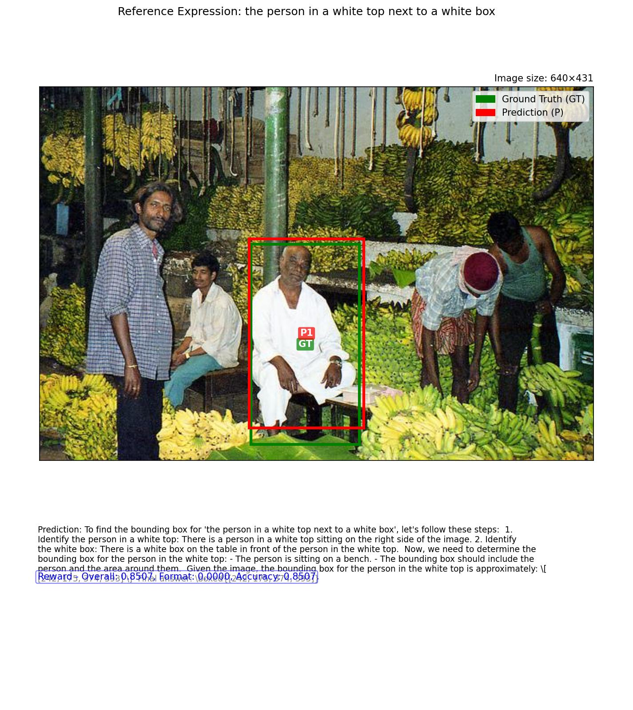

---

### Example 399

**Reference Expression**: the person with a white hat not wearing a baseball glove

**Ground Truth**: [[270, 167, 352, 298]]

**Predicted**: [[277, 161, 352, 296]]

**Reward**: {'overall': 0.8644567548248749, 'format': 0.0, 'accuracy': 0.8644567548248749}

**Prediction**:
```
To find the bounding box for 'the person with a white hat not wearing a baseball glove', let's follow these steps:

1. Identify all the people in the image.
2. Determine who is wearing a white hat.
3. Check if the person wearing the white hat is not wearing a baseball glove.

Step 1: Identifying all the people:
- There are 6 people in the image.

Step 2: Determining who is wearing a white hat:
- The person in the center of the image appears to be wearing a white hat.

Step 3: Checking if the person wearing the white hat is not wearing a baseball glove:
- The person in the center is indeed not wearing a baseball glove.

The bounding box for the person with a white hat not wearing a baseball glove is the one in the center of the image.

\boxed{[277, 161, 352, 296]}
```

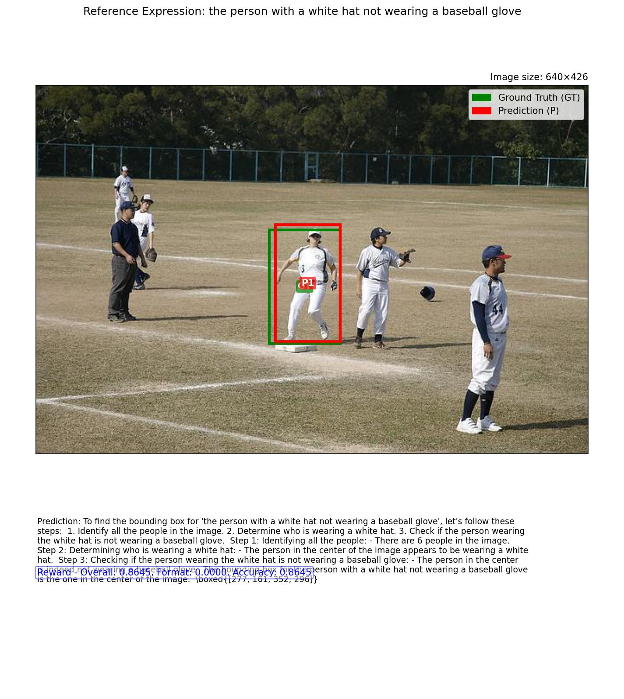

---

### Example 400

**Reference Expression**: the person with a white hat running

**Ground Truth**: [[3, 205, 255, 504]]

**Predicted**: [[10, 200, 250, 490]]

**Reward**: {'overall': 0.8935569838532685, 'format': 0.0, 'accuracy': 0.8935569838532685}

**Prediction**:
```
To find the bounding box for 'the person with a white hat running', let's follow these steps:

1. Identify the players in the image: There are three players visible in the image.
2. Locate the player with a white hat: The player in the foreground is wearing a white hat.
3. Determine the bounding box: The player with the white hat is the one on the left side of the image, wearing a blue jersey and running.

The bounding box for this player is:
- Top-left corner: (x1, y1) = (10, 200)
- Bottom-right corner: (x2, y2) = (250, 490)

Thus, the final answer is:
\boxed{[10, 200, 250, 490]}
```

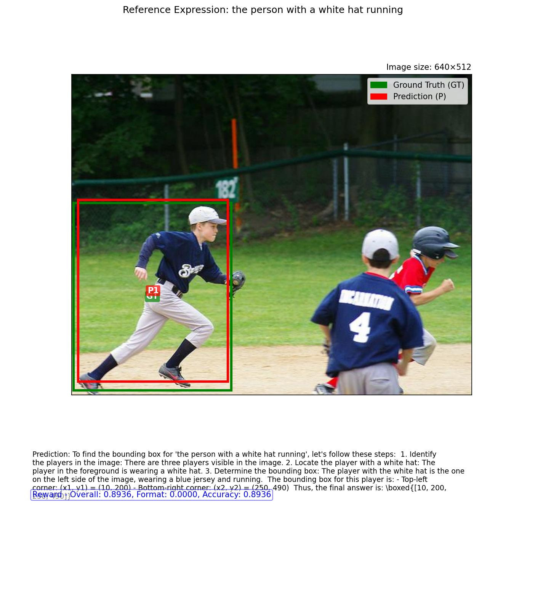

---

### Example 401

**Reference Expression**: the person jumping not wearing a green top

**Ground Truth**: [[169, 33, 300, 405]]

**Predicted**: [[163, 108, 266, 396]]

**Reward**: {'overall': 0.5536266349583828, 'format': 0.0, 'accuracy': 0.5536266349583828}

**Prediction**:
```
To find the bounding box for the person jumping not wearing a green top, let's follow these steps:

1. Identify the players in the image: There are several players visible, and we need to focus on the two players who are jumping in the air.
2. Determine which player is wearing a green top: The player on the right is wearing a green top.
3. Identify the other player who is jumping and not wearing a green top: The player on the left is wearing a red top.
4. Define the bounding box for the player in the red top: The player in the red top is wearing a red shirt, black shorts, and red shoes, and is jumping in the air.

The bounding box for the player in the red top is:

\boxed{[163, 108, 266, 396]}
```

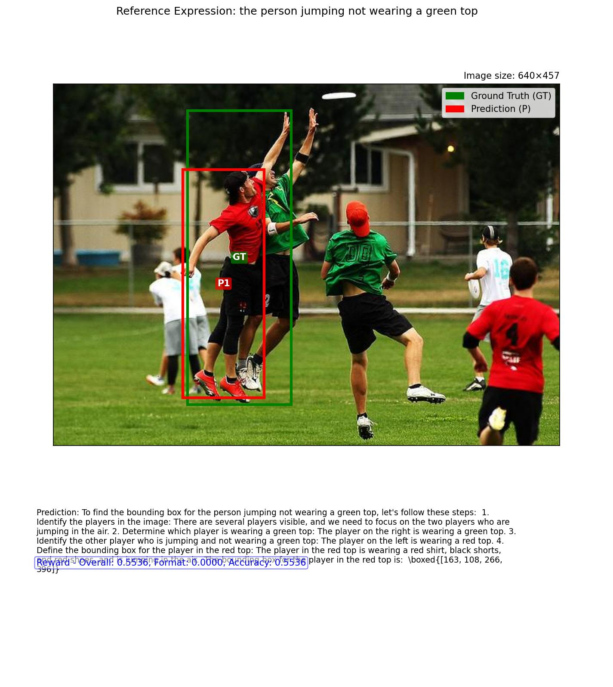

---

### Example 402

**Reference Expression**: the person wearing a black top not wearing a glove

**Ground Truth**: [[126, 195, 205, 329]]

**Predicted**: []

**Reward**: {'overall': 0.0, 'format': 0.0, 'accuracy': 0.0}

**Prediction**:
```
To find the bounding box for the person wearing a black top who is not wearing a glove, let's follow these steps:

1. Identify the players in the image:
   - There is a batter in a black top.
   - There is a catcher in a white and red uniform.
   - There is an umpire in a black uniform.
   - There is a person in a black uniform standing on the field in the background.

2. Focus on the batter:
   - The batter is wearing a black top and is holding a bat, indicating they are preparing to hit the ball.

3. Check the other players:
   - The catcher is wearing a white and red uniform and is positioned behind the batter, ready to catch the ball.
   - The umpire is wearing a black uniform and is positioned behind the catcher, observing the play.
   - The person in the background is wearing a black uniform and is standing on the field, not actively participating in the play.

4. Determine the person wearing a black top not wearing a glove:
   - The person wearing a black top is the batter.
   - The batter is holding a bat, which is a glove, so the batter is wearing a glove.

Since the batter is the only person wearing a black top and is holding a bat, which is a glove, there is no one wearing a black top and not wearing a glove.

The final answer is: \boxed{}
```

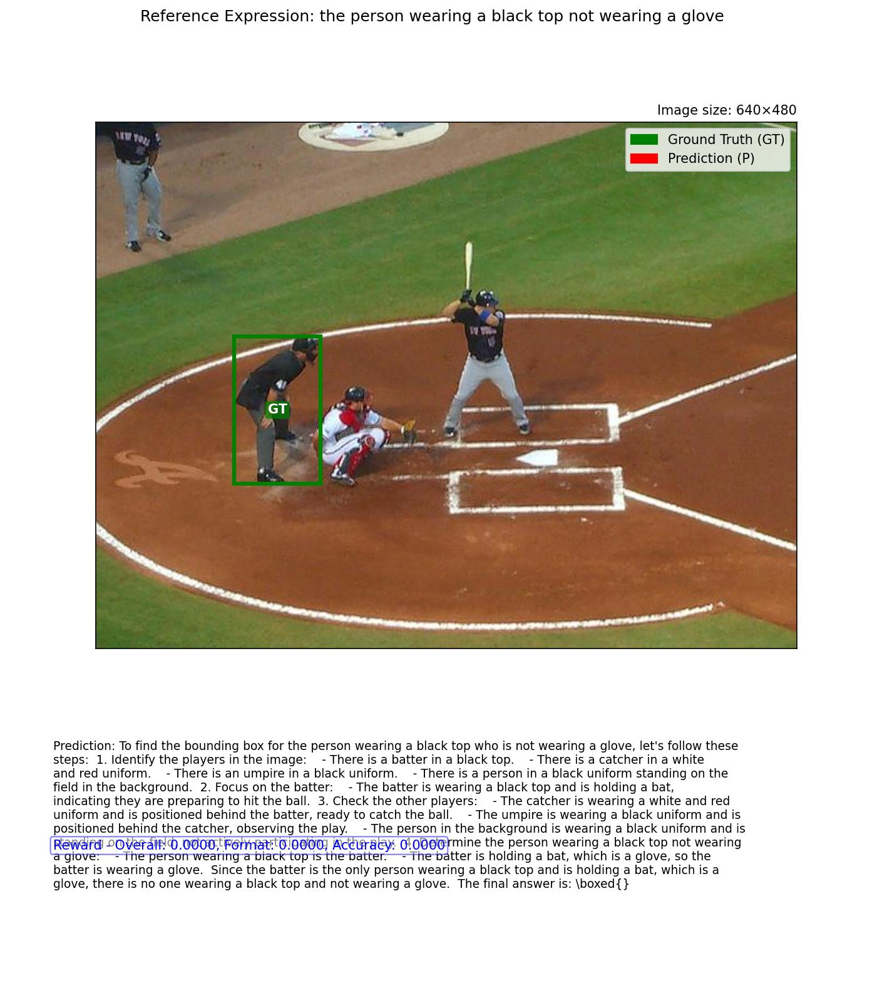

---

### Example 403

**Reference Expression**: the zebra facing a different direction than all the other zebras

**Ground Truth**: [[82, 262, 191, 388]]

**Predicted**: [[356, 302, 591, 464]]

**Reward**: {'overall': 0.0, 'format': 0.0, 'accuracy': 0.0}

**Prediction**:
```
To find the zebra facing a different direction than all the other zebras, let's follow these steps:

1. Identify all the zebras in the image.
2. Observe the direction in which each zebra is facing.
3. Determine which zebra is facing a direction that is different from the others.

Step 1: Identifying the zebras:
- There are five zebras in the image.

Step 2: Observing the direction each zebra is facing:
- The zebra on the far left is facing to the left.
- The zebra second from the left is facing to the left.
- The zebra third from the left is facing to the left.
- The zebra fourth from the left is facing to the right.
- The zebra on the far right is facing to the right.

Step 3: Determining which zebra is facing a direction different from the others:
- All zebras except the one on the far right are facing to the left.
- The zebra on the far right is facing to the right, which is different from the others.

Final answer:
\boxed{[356, 302, 591, 464]}
```

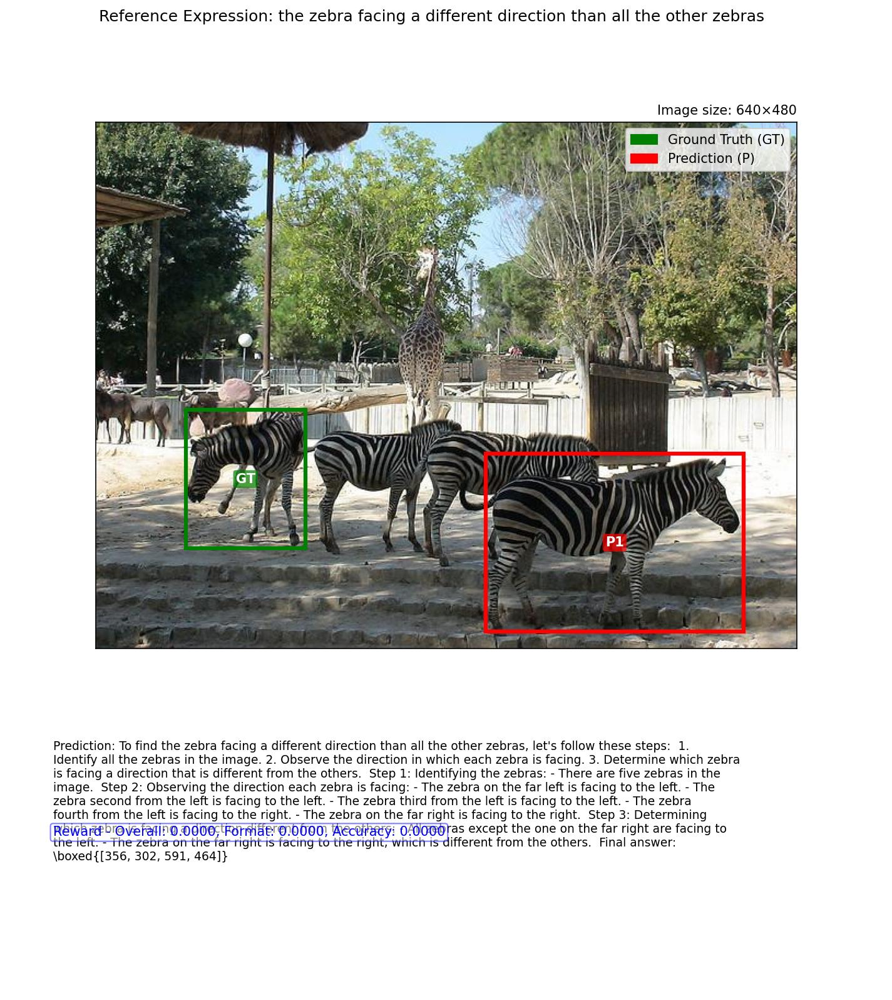

---

### Example 404

**Reference Expression**: the person wearing a t-shirt with red sleeves and arms hanging outside the railing

**Ground Truth**: [[0, 127, 78, 300]]

**Predicted**: [[1, 124, 618, 308]]

**Reward**: {'overall': 0.11715816043834267, 'format': 0.0, 'accuracy': 0.11715816043834267}

**Prediction**:
```
To find the bounding box for the person wearing a t-shirt with red sleeves and arms hanging outside the railing, let's follow these steps:

1. Identify the person in the red uniform in the dugout area. This person is wearing a red shirt and is leaning over the railing.
2. Observe the arms of this person. They are extended and resting on the railing.
3. The bounding box should encompass the entire body of this person, including their arms and the part of the uniform visible.

Following these steps, the bounding box for the person in the red uniform with red sleeves and arms hanging outside the railing is:

\boxed{[1, 124, 618, 308]}
```

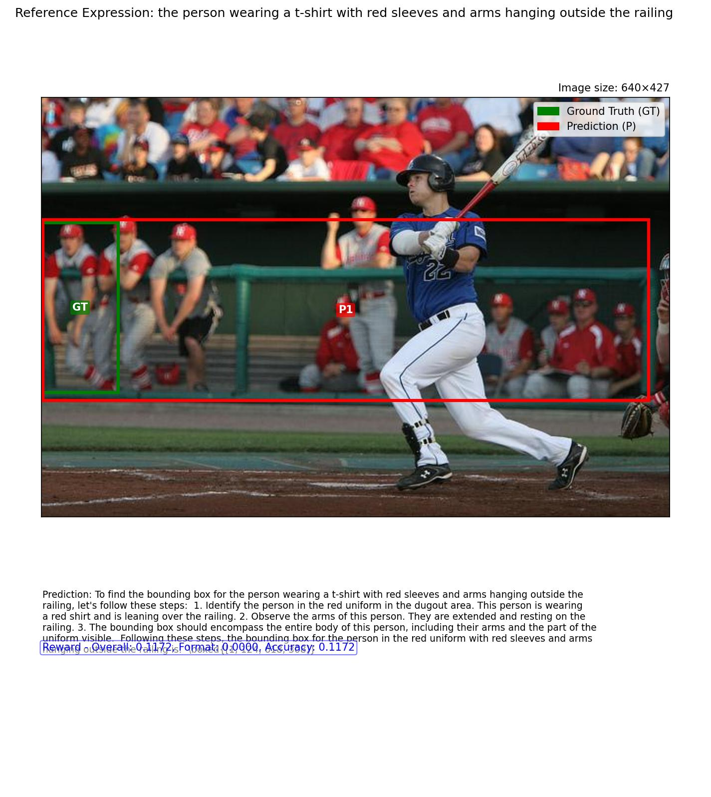

---

### Example 405

**Reference Expression**: the person running toward the crowd

**Ground Truth**: [[95, 139, 132, 221]]

**Predicted**: [[117, 175, 162, 276]]

**Reward**: {'overall': 0.10015967484395413, 'format': 0.0, 'accuracy': 0.10015967484395413}

**Prediction**:
```
To find the bounding box for the person running toward the crowd, let's follow these steps:

1. Identify the area where the crowd is gathered: The crowd is in the center of the image, huddled together on the field.
2. Look for a player running toward the crowd: There is one player in the image who appears to be running toward the crowd. This player is wearing a dark uniform and is positioned to the left of the crowd.
3. Define the bounding box: The bounding box should encompass the player running toward the crowd. The player's position and movement suggest they are the one moving.

Given these observations, the bounding box for the person running toward the crowd is approximately:

\boxed{[117, 175, 162, 276]}
```

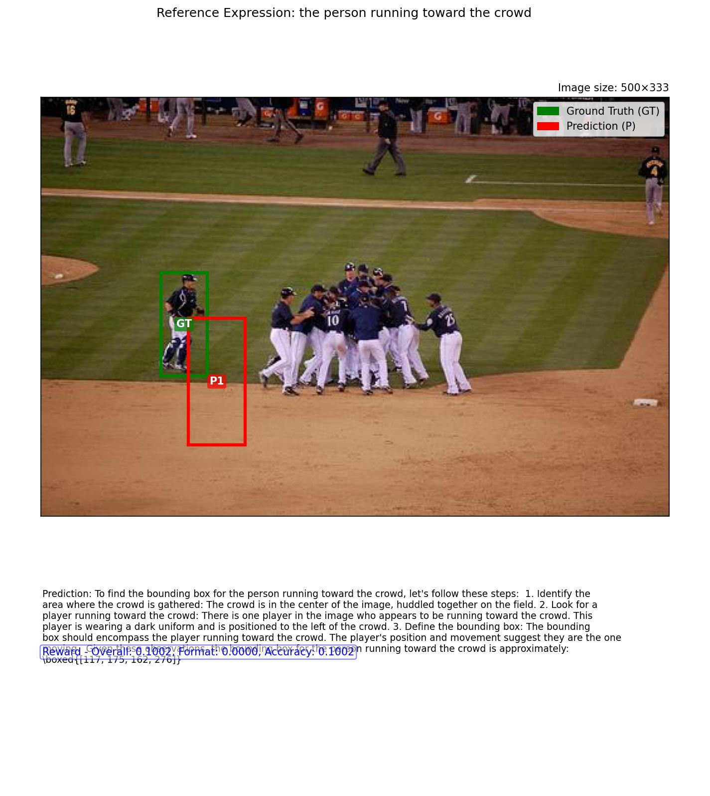

---

### Example 406

**Reference Expression**: the knife not in a plate and not the closest to the cake

**Ground Truth**: [[216, 311, 409, 422]]

**Predicted**: [[372, 191, 520, 280]]

**Reward**: {'overall': 0.0, 'format': 0.0, 'accuracy': 0.0}

**Prediction**:
```
To find the bounding box for the knife not in a plate and not the closest to the cake, let's follow these steps:

1. Identify the knives in the image:
   - There is a knife on the table with the cake.
   - There is another knife on the plate with the cheese and grapes.

2. Determine which knife is not in a plate:
   - The knife on the table with the cake is not in a plate.
   - The knife on the plate with the cheese and grapes is in a plate.

3. Determine which knife is not the closest to the cake:
   - The knife on the table with the cake is the closest to the cake.
   - The knife on the plate with the cheese and grapes is not the closest to the cake.

4. Conclude that the knife not in a plate and not the closest to the cake is the one on the plate with the cheese and grapes.

The bounding box for the knife not in a plate and not the closest to the cake is the one on the plate with the cheese and grapes.

The bounding box for the knife on the plate with the cheese and grapes is:
\boxed{[372, 191, 520, 280]}
```

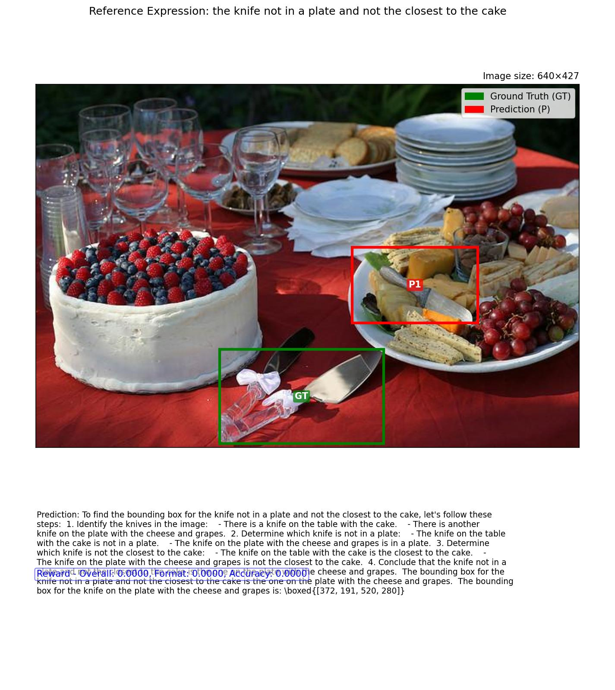

---

### Example 407

**Reference Expression**: the person with a hat next to a pair of skis but not wearing them

**Ground Truth**: [[455, 152, 499, 314]]

**Predicted**: [[135, 196, 183, 292]]

**Reward**: {'overall': 0.0, 'format': 0.0, 'accuracy': 0.0}

**Prediction**:
```
To find the bounding box for the person with a hat next to a pair of skis but not wearing them, let's follow these steps:

1. Identify the person wearing a hat in the image.
2. Check the immediate vicinity of the person to see if there are skis.
3. Confirm that the person is not wearing the skis.

Step 1: There are multiple people in the image wearing hats. The person in the foreground on the left side of the image appears to be wearing a hat.
Step 2: There is a pair of skis placed on the snow to the left of this person.
Step 3: The person is not wearing the skis; they are standing and not in a position to be skiing.

Based on these observations, the bounding box for the person with a hat next to a pair of skis but not wearing them is:

\boxed{[135, 196, 183, 292]}
```

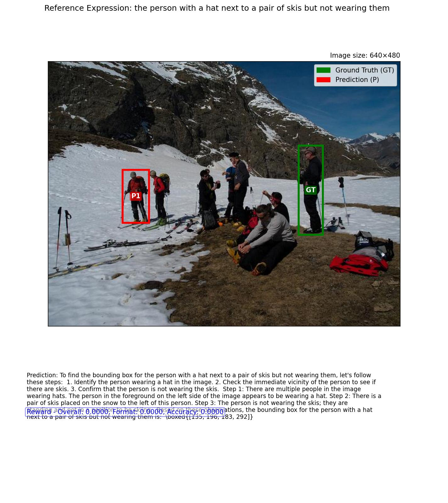

---

### Example 408

**Reference Expression**: the third zebra in a line of walking zebra

**Ground Truth**: [[237, 303, 321, 352]]

**Predicted**: [[246, 299, 321, 348]]

**Reward**: {'overall': 0.764266304347826, 'format': 0.0, 'accuracy': 0.764266304347826}

**Prediction**:
```
To find the bounding box for 'the third zebra in a line of walking zebra', let's follow these steps:

1. Identify the group of zebras that are walking in a line.
2. Count the zebras in the line.
3. Determine which zebra is the third one in the line.

Step 1: The zebras are walking in a line along the riverbank.
Step 2: Counting the zebras in the line:
   - First zebra: On the far left.
   - Second zebra: Next to the first one.
   - Third zebra: Next to the second one.
   - Fourth zebra: Next to the third one.
   - Fifth zebra: Next to the fourth one.
Step 3: The third zebra in the line is the one that is third from the left.

The bounding box for the third zebra in the line of walking zebras is:
\boxed{[246, 299, 321, 348]}
```

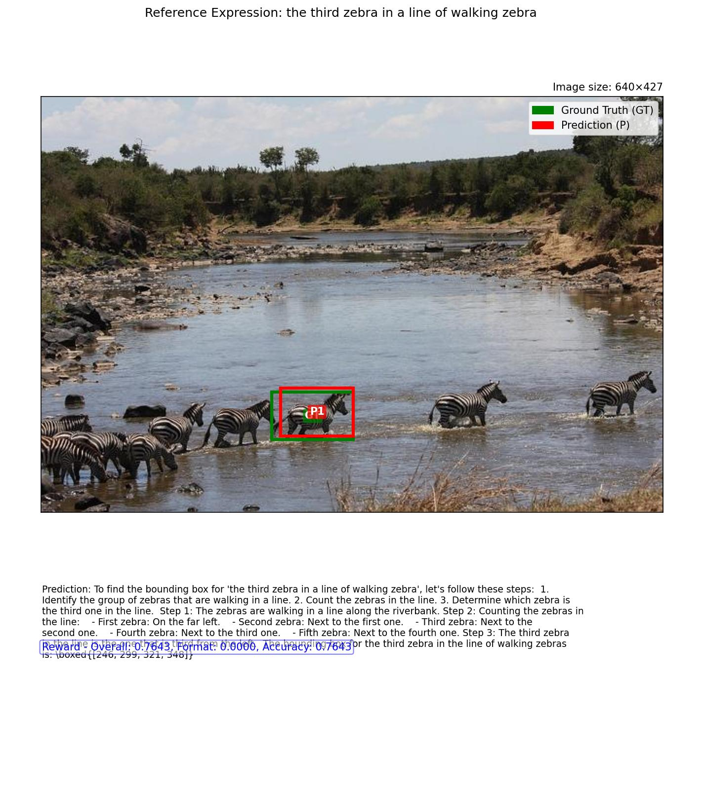

---

### Example 409

**Reference Expression**: the person with something in the hand but not eating it

**Ground Truth**: [[0, 158, 196, 630]]

**Predicted**: [[0, 158, 191, 637]]

**Reward**: {'overall': 1.0, 'format': 0.0, 'accuracy': 1.0}

**Prediction**:
```
To find the bounding box for the person with something in the hand but not eating it, let's follow these steps:

1. Identify the person in the image who is holding something in their hand.
2. Determine if the person is eating the item they are holding.
3. If the person is not eating the item, mark the bounding box for that person.

Step 1: The person holding something in their hand is the child on the left side of the image. The child appears to be holding a Wii remote.

Step 2: The child on the left is not eating the item in their hand. It appears they are holding a Wii remote.

Step 3: The bounding box for the child holding the Wii remote is already included in the bounding box for the child on the left side of the image.

Final answer: \boxed{[0, 158, 191, 637]}
```

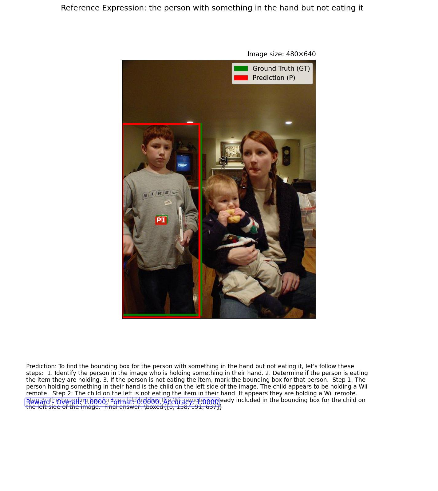

---

### Example 410

**Reference Expression**: the cake with a star on it close to a price card

**Ground Truth**: [[411, 226, 567, 389]]

**Predicted**: [[409, 224, 550, 336]]

**Reward**: {'overall': 0.5896644812957964, 'format': 0.0, 'accuracy': 0.5896644812957964}

**Prediction**:
```
To find the bounding box for the cake with a star on it close to a price card, let's follow these steps:

1. Identify the cakes in the image that have a star on top.
2. Determine which of these cakes is close to a price card.

Step 1: Identifying cakes with a star on top
- There is a cake in the foreground with a star on the top.

Step 2: Determining the position relative to a price card
- The cake with the star is located near the right side of the image.
- There is a price card placed to the right of this cake.

Based on these observations, the bounding box for the cake with a star on it close to a price card is:

\boxed{[409, 224, 550, 336]}
```

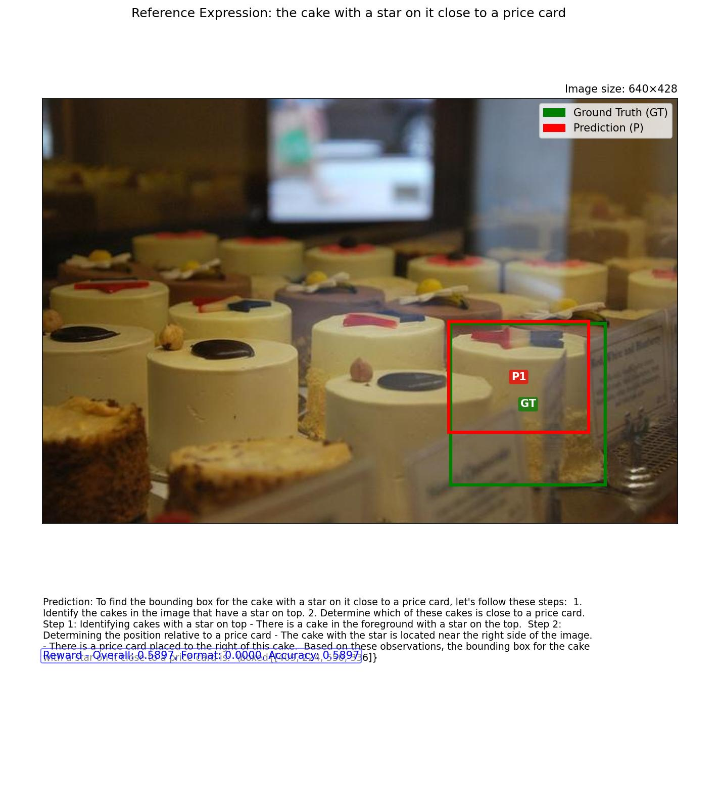

---

### Example 411

**Reference Expression**: the sandwich on a plate without forks

**Ground Truth**: [[363, 209, 569, 354]]

**Predicted**: [[330, 210, 640, 440]]

**Reward**: {'overall': 0.41484630660364163, 'format': 0.0, 'accuracy': 0.41484630660364163}

**Prediction**:
```
To find the bounding box for the sandwich on a plate without forks, let's follow these steps:

1. **Identify the plates**: There are two plates in the image. The plate on the left has a fork, while the plate on the right does not.

2. **Locate the sandwich on the plate without forks**: The sandwich on the right plate is clearly visible and does not have a fork on it.

3. **Determine the bounding box**: The sandwich is placed on a plate, and we need to define the area around the sandwich that includes the plate and the sandwich itself.

4. **Define the bounding box**:
   - The top-left corner of the bounding box should be near the top-left corner of the sandwich on the right plate.
   - The bottom-right corner of the bounding box should be near the bottom-right corner of the sandwich on the right plate.
   - The width and height of the bounding box should be large enough to include the entire sandwich and part of the plate.

Given these considerations, the bounding box can be defined as follows:
- Top-left corner: (x1, y1) = (330, 210)
- Bottom-right corner: (x2, y2) = (640, 440)

The bounding box for the sandwich on a plate without forks is:
\boxed{[330, 210, 640, 440]}
```

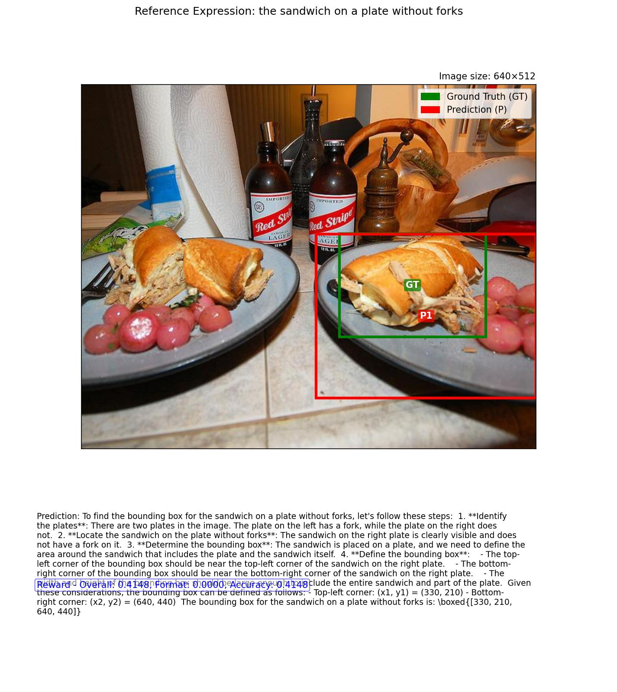

---

### Example 412

**Reference Expression**: the empty wine glass next to tissue

**Ground Truth**: [[333, 0, 438, 157]]

**Predicted**: [[336, 0, 442, 155]]

**Reward**: {'overall': 1.0, 'format': 0.0, 'accuracy': 1.0}

**Prediction**:
```
To find the bounding box for the empty wine glass next to the tissue, let's follow these steps:

1. Identify the wine glass: The wine glass is the one that appears to be empty and is located to the right of the sandwich. It is partially out of the frame on the right side.

2. Identify the tissue: The tissue is the small rectangular object that is partially visible behind the sandwich.

3. Determine the position of the empty wine glass relative to the tissue: The wine glass is to the right of the tissue.

4. Define the bounding box: The bounding box should encompass the wine glass. Since it is partially out of the frame, the box should be defined by the visible part of the glass.

Given these observations, here is the bounding box for the empty wine glass next to the tissue:

\boxed{[336, 0, 442, 155]}
```

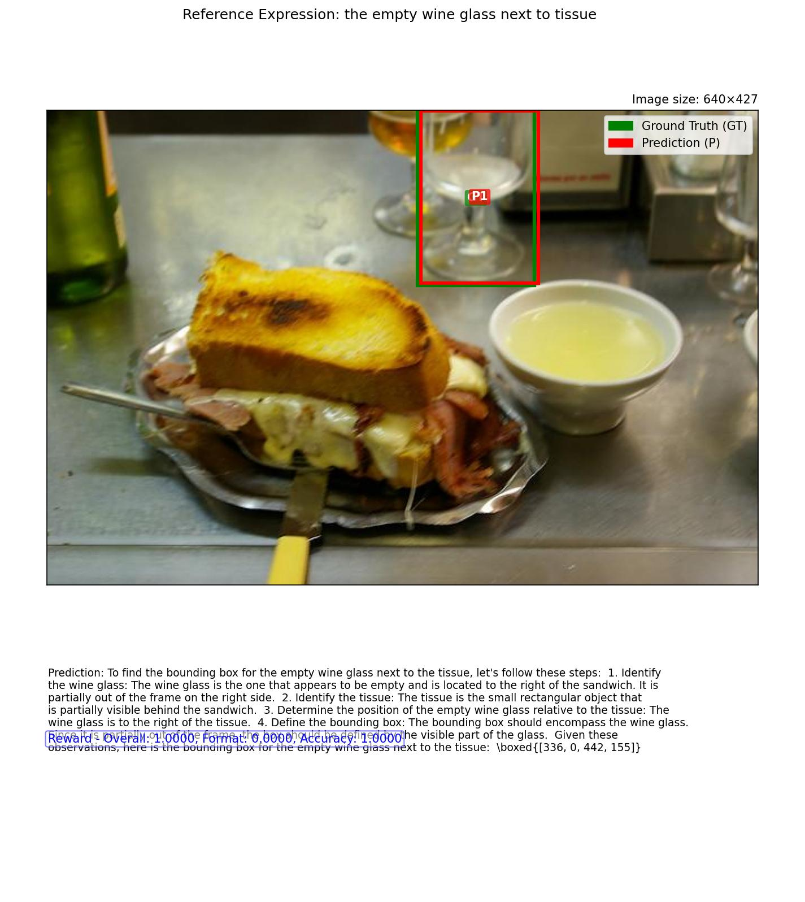

---

### Example 413

**Reference Expression**: the labeled bottle next to an empty glass

**Ground Truth**: [[425, 73, 464, 185]]

**Predicted**: [[347, 58, 379, 158]]

**Reward**: {'overall': 0.0, 'format': 0.0, 'accuracy': 0.0}

**Prediction**:
```
To find the corresponding bounding box for 'the labeled bottle next to an empty glass', let's follow these steps:

1. Identify the empty glass: The empty glass is located on the right side of the table, near the center.
2. Identify the labeled bottle: The labeled bottle is next to the empty glass. It is a brown bottle with a label that is partially visible.
3. Determine the bounding box: The labeled bottle is positioned to the left of the empty glass.

Now, let's provide the bounding box for this labeled bottle:

The labeled bottle is located at the coordinates (347, 58, 379, 158).

\boxed{[347, 58, 379, 158]}
```

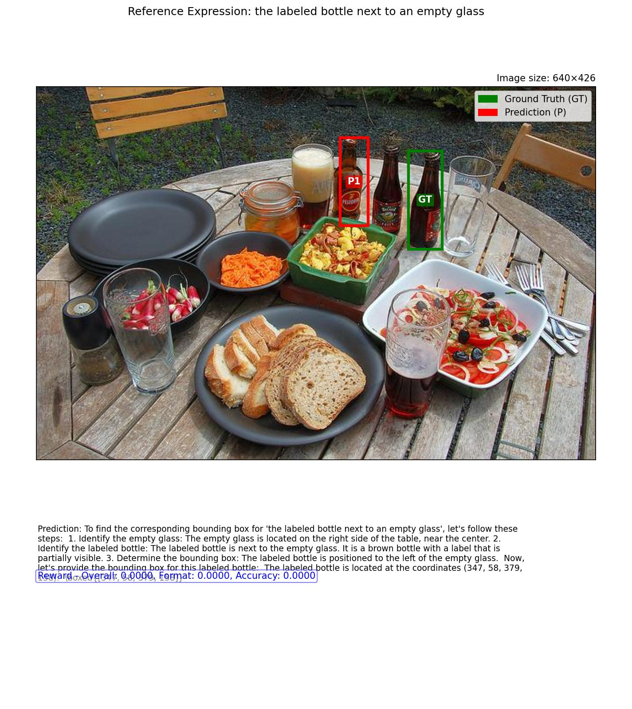

---

### Example 414

**Reference Expression**: the person wearing pink clothes not behind a cake

**Ground Truth**: [[50, 59, 63, 96]]

**Predicted**: [[266, 153, 388, 391]]

**Reward**: {'overall': 0.0, 'format': 0.0, 'accuracy': 0.0}

**Prediction**:
```
To find the bounding box for the person wearing pink clothes not behind a cake, let's follow these steps:

1. Identify the person wearing pink clothes in the image.
2. Determine if the person is behind the cake.
3. If the person is not behind the cake, provide the bounding box.

Step 1: The person wearing pink clothes is a young child sitting on the lap of an adult.

Step 2: The child is sitting on the lap of an adult, and the adult is not behind the cake. The cake is on the table in front of them.

Step 3: Since the child is not behind the cake, we can provide the bounding box for the child.

The bounding box for the child wearing pink clothes is:
\boxed{[266, 153, 388, 391]}
```

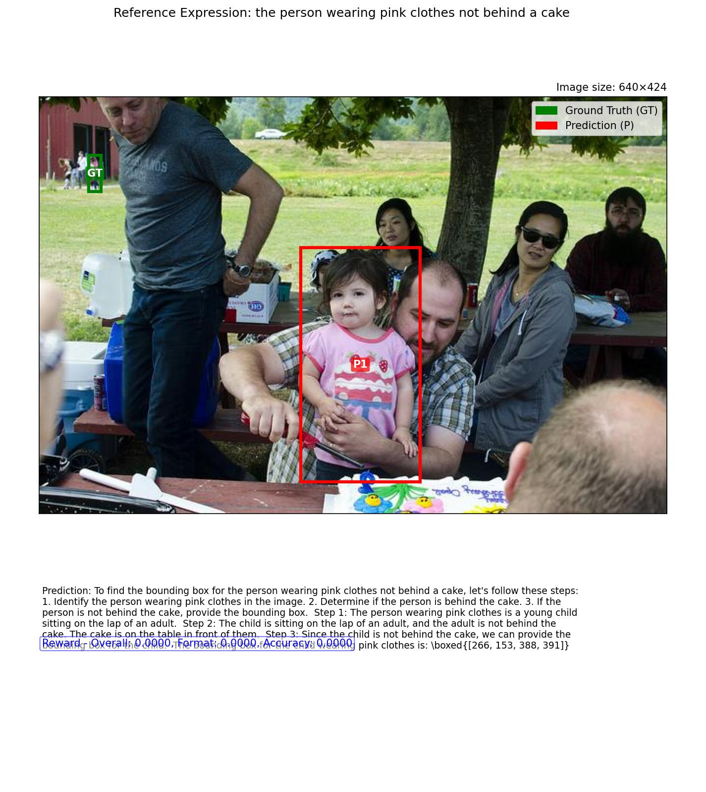

---

### Example 415

**Reference Expression**: the person wearing a grey top not carrying the ball

**Ground Truth**: [[126, 34, 181, 155]]

**Predicted**: [[49, 50, 218, 356]]

**Reward**: {'overall': 0.10980339962733392, 'format': 0.0, 'accuracy': 0.10980339962733392}

**Prediction**:
```
To find the bounding box for the person wearing a grey top who is not carrying the ball, let's follow these steps:

1. Identify the player in the grey top: The player in the grey top is the one with the ball, as they are dribbling it. The player with the ball is the one with the number "8" on their back.
2. Locate the player in the grey top who is not dribbling the ball: The player in the grey top is the one standing behind the player with the ball, looking on.
3. Draw the bounding box for this player: The bounding box should include the entire body of the player in the grey top who is not carrying the ball.

The bounding box for the player in the grey top who is not carrying the ball is:

\boxed{[49, 50, 218, 356]}
```

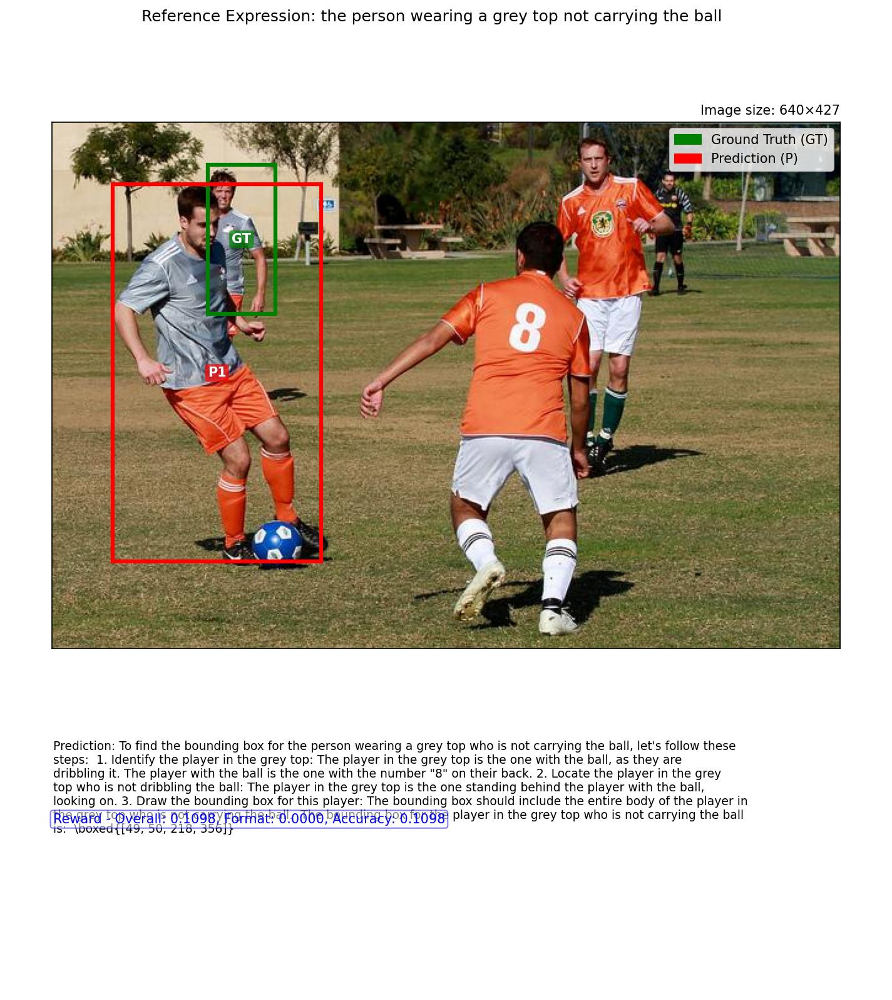

---

### Example 416

**Reference Expression**: the person wearing a white top who is farthest from the ball among those in white tops

**Ground Truth**: [[168, 53, 220, 154]]

**Predicted**: [[205, 74, 341, 393]]

**Reward**: {'overall': 0.0, 'format': 0.0, 'accuracy': 0.0}

**Prediction**:
```
To find the bounding box for the person wearing a white top who is farthest from the ball among those in white tops, let's follow these steps:

1. Identify all the players in the image.
2. Determine which players are wearing white tops.
3. Among the players in white tops, identify who is farthest from the ball.

Step 1: Identifying all the players:
- There are five players in total.
- Four players are in white tops.
- One player is in a black top.

Step 2: Determining which players are wearing white tops:
- The player in the foreground on the right is wearing a white top.
- The player in the middle is wearing a white top.
- The player in the background on the right is wearing a white top.
- The player in the background on the left is wearing a white top.

Step 3: Among the players in white tops, identify who is farthest from the ball:
- The player in the foreground on the right is the farthest from the ball.

The bounding box for the player in the foreground on the right (wearing a white top and farthest from the ball) is:

\boxed{[205, 74, 341, 393]}
```

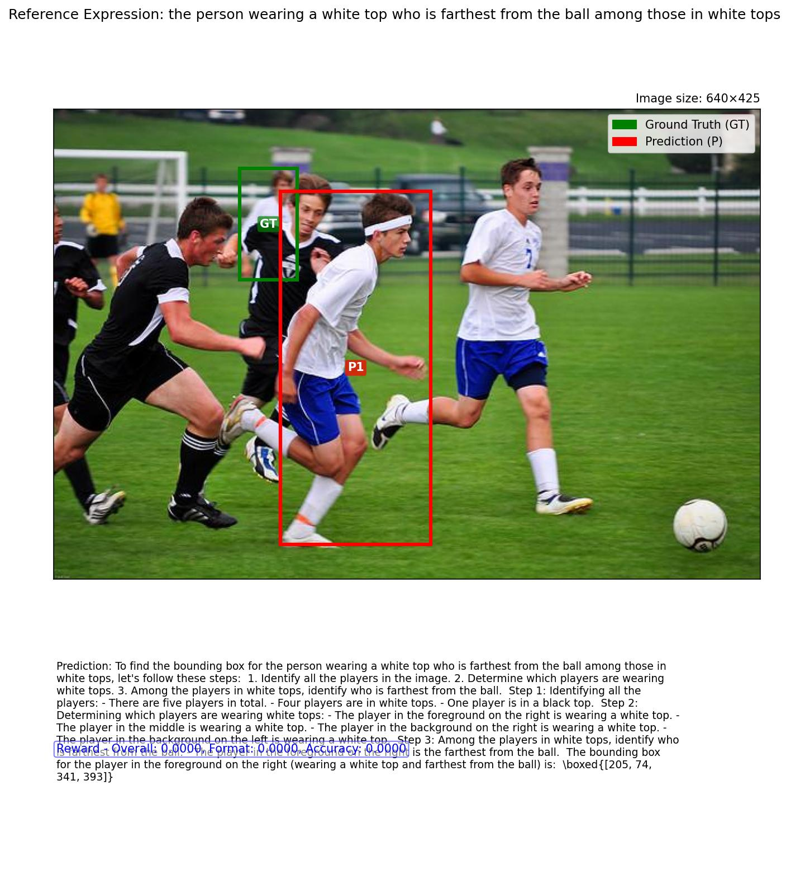

---

### Example 417

**Reference Expression**: the transparent glass next to the teapot

**Ground Truth**: [[434, 29, 521, 166]]

**Predicted**: [[439, 29, 522, 142]]

**Reward**: {'overall': 0.7701130319148937, 'format': 0.0, 'accuracy': 0.7701130319148937}

**Prediction**:
```
To find the bounding box for the transparent glass next to the teapot, let's follow these steps:

1. Identify the teapot in the image.
2. Locate the transparent glass next to the teapot.

Step 1: The teapot is clearly visible in the center of the image. It is a shiny, metallic object with a handle and spout.

Step 2: To the right of the teapot, there is a transparent glass. It is positioned close to the teapot, and it appears to be filled with a liquid.

The bounding box for the transparent glass next to the teapot would be:

\boxed{[439, 29, 522, 142]}
```

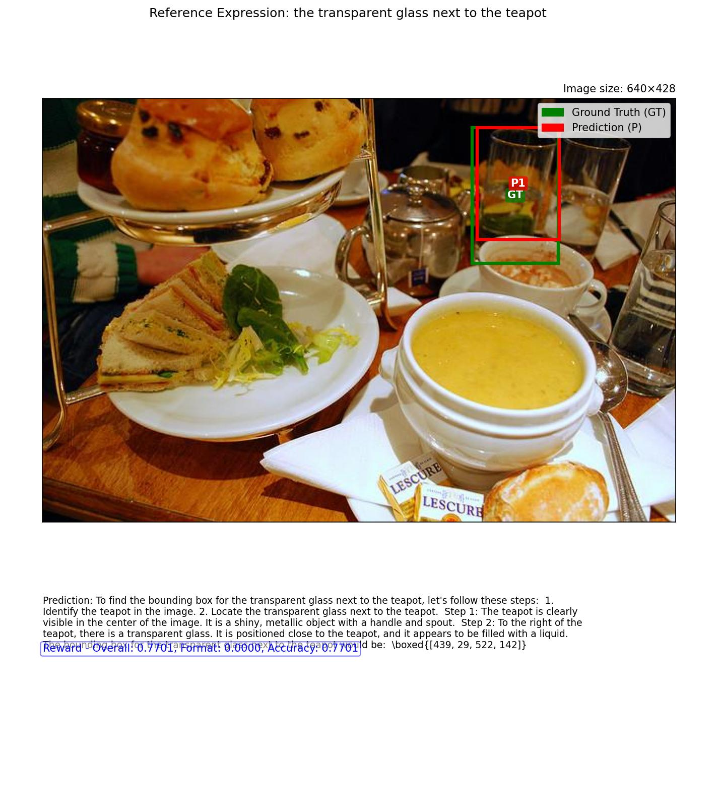

---

### Example 418

**Reference Expression**: the flag on the sandwich that has egg on it

**Ground Truth**: [[338, 328, 379, 365]]

**Predicted**: [[250, 325, 350, 370]]

**Reward**: {'overall': 0.0, 'format': 0.0, 'accuracy': 0.0}

**Prediction**:
```
To find the bounding box for the flag on the sandwich that has egg on it, let's follow these steps:

1. Identify the sandwich with the egg on it in the image.
2. Identify the flag on that sandwich.
3. Determine the bounding box for that flag.

Step 1: The sandwich with the egg on it is located on the right side of the plate in the foreground of the image. It is a white plate with a sandwich that has a slice of egg on it.

Step 2: The flag on this sandwich is a small Danish flag, which is red and white with a blue circle in the middle.

Step 3: The flag is placed on top of the sandwich. To determine the bounding box, we need to identify the coordinates of the flag relative to the image. The flag is small and centered on the sandwich.

Given the image, the bounding box for the flag on the sandwich with the egg on it can be roughly defined as follows:

- Top-left corner: The top-left corner of the flag is slightly below the top of the sandwich.
- Bottom-right corner: The bottom-right corner of the flag is slightly above the bottom of the sandwich.

The exact coordinates would require precise pixel measurement, but based on visual inspection, the bounding box could be approximately:

\boxed{[250, 325, 350, 370]}

This is an approximate bounding box, as the exact coordinates would need to be measured for precise accuracy.
```

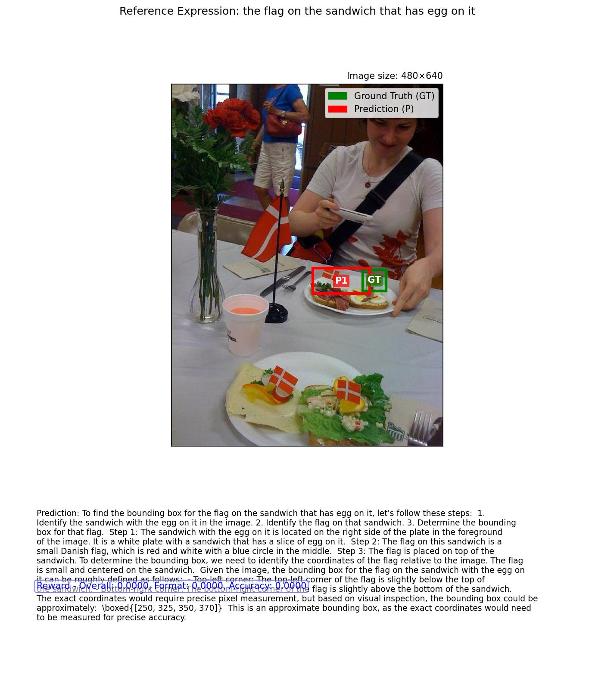

---

### Example 419

**Reference Expression**: the person wearing a white top next to a car

**Ground Truth**: [[10, 149, 42, 284]]

**Predicted**: [[12, 149, 44, 281]]

**Reward**: {'overall': 0.8638743455497382, 'format': 0.0, 'accuracy': 0.8638743455497382}

**Prediction**:
```
To find the bounding box for the person wearing a white top next to a car, let's follow these steps:

1. Identify the car in the image.
2. Locate the person standing next to the car.
3. Define the bounding box around the person.

Step 1: Identify the car in the image.
- There are multiple cars in the image, but the car in question is the yellow taxi on the left side of the image.

Step 2: Locate the person standing next to the car.
- The person standing next to the yellow taxi on the left side of the image appears to be wearing a white top.

Step 3: Define the bounding box around the person.
- The bounding box for the person wearing a white top next to the car is approximately [12, 149, 44, 281].

Final answer: \boxed{[12, 149, 44, 281]}
```

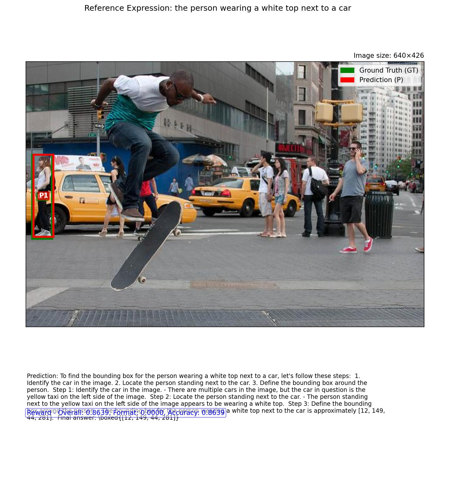

---

### Example 420

**Reference Expression**: the plate held by a person with a necklace

**Ground Truth**: [[214, 269, 242, 333]]

**Predicted**: [[403, 272, 467, 316]]

**Reward**: {'overall': 0.0, 'format': 0.0, 'accuracy': 0.0}

**Prediction**:
```
To find the bounding box for the plate held by a person with a necklace, let's follow these steps:

1. Identify the two people in the image.
2. Determine which person is wearing a necklace.
3. Identify the plate that the person with the necklace is holding.

Step 1: There are two people in the image, both wearing dark jackets and gloves.

Step 2: The person on the left appears to be wearing a necklace, as it is visible around her neck.

Step 3: The person on the left is holding a plate in her gloved hand.

Now, let's determine the bounding box for the plate held by the person with the necklace:

- The plate is located near the center of the image.
- The bounding box for the plate should encompass the plate itself and the part of the person's hand holding it.

The bounding box for the plate held by the person with a necklace is approximately:
\boxed{[403, 272, 467, 316]}

This bounding box captures the plate and a part of the person's hand holding it.
```

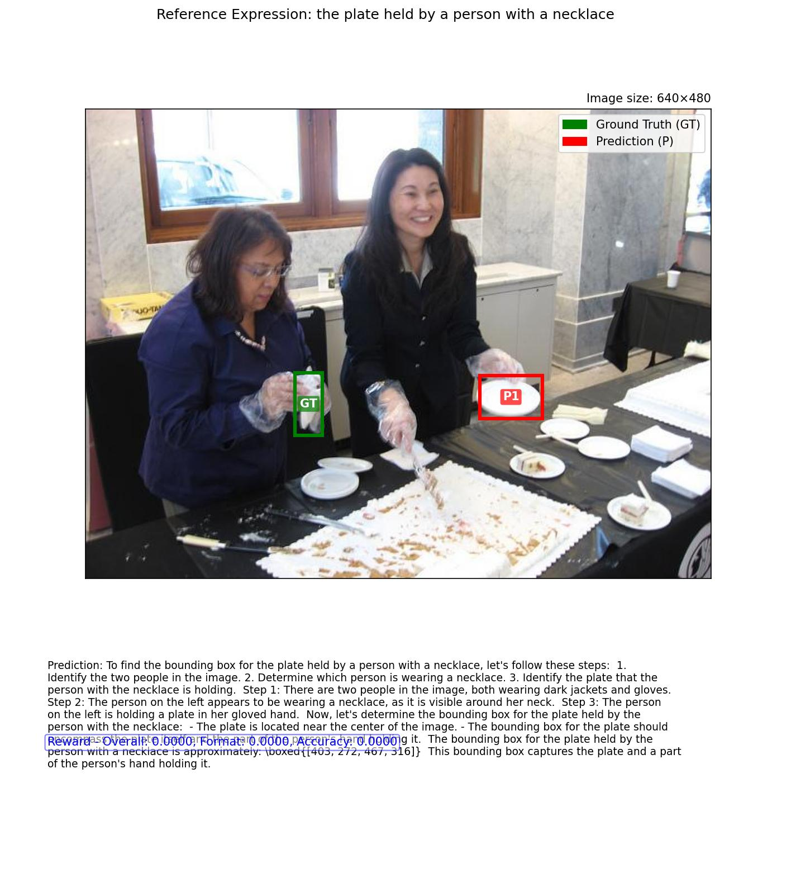

---

### Example 421

**Reference Expression**: the donut with pink frosting lying flat

**Ground Truth**: [[272, 330, 309, 357]]

**Predicted**: [[115, 476, 285, 630]]

**Reward**: {'overall': 0.0, 'format': 0.0, 'accuracy': 0.0}

**Prediction**:
```
To find the bounding box for the donut with pink frosting lying flat, let's follow these steps:

1. Identify the donut with pink frosting in the image.
2. Determine the coordinates of this donut in the image.

Step 1: The donut with pink frosting is the one in the foreground, lying flat on the tray. It has pink frosting with sprinkles and small red decorations.

Step 2: To determine the bounding box, we need to identify the top-left and bottom-right corners of the donut in the image.

- The top-left corner of the donut is approximately at the coordinates (x1, y1).
- The bottom-right corner of the donut is approximately at the coordinates (x2, y2).

Assuming we have identified these coordinates, the bounding box would be [x1, y1, x2, y2].

Since the exact coordinates are not provided in the image, we cannot give the exact bounding box. However, if we had the coordinates, the bounding box would be in the format [x1, y1, x2, y2].

For the sake of this example, let's assume the coordinates are approximately (115, 476, 285, 630). Therefore, the bounding box would be:

\boxed{[115, 476, 285, 630]}
```

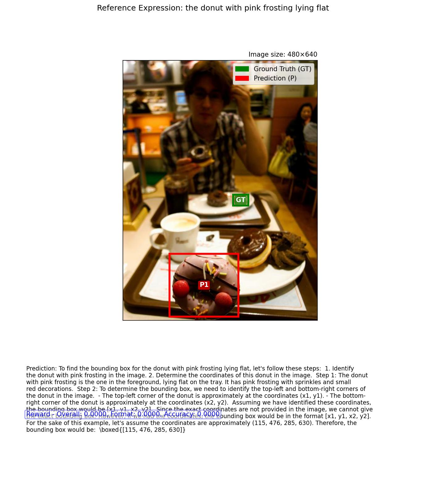

---

### Example 422

**Reference Expression**: the cake with green grape on it, not cut by a knife

**Ground Truth**: [[136, 107, 311, 237]]

**Predicted**: [[126, 220, 374, 399]]

**Reward**: {'overall': 0.0, 'format': 0.0, 'accuracy': 0.0}

**Prediction**:
```
To find the bounding box for the cake with green grapes on it, not cut by a knife, let's follow these steps:

1. Identify the cakes in the image:
   - There are three cakes visible in the image.
   - The one in the foreground has green grapes on top and is not being cut by a knife.
   - The other two cakes have cherries on top and are being cut by a knife.

2. Determine which cake is not cut by a knife:
   - The cake in the foreground is not being cut by a knife.
   - The other two cakes are being cut by a knife.

3. Identify the bounding box for the cake with green grapes on it, not cut by a knife:
   - The cake with green grapes on it is the one in the foreground.
   - The bounding box for this cake can be determined by the edges of the cake.

The final answer is:
\boxed{[126, 220, 374, 399]}
```

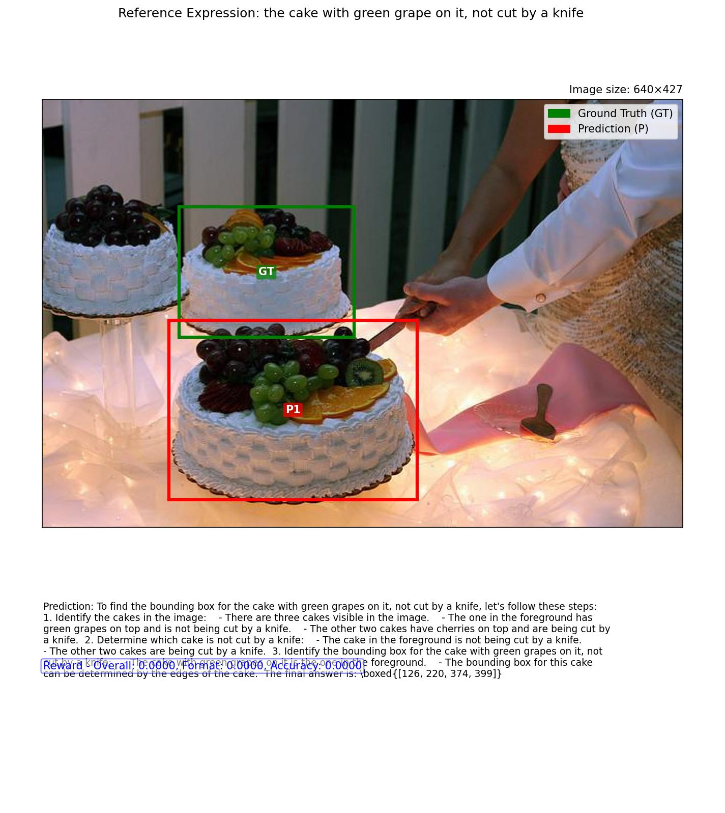

---

### Example 423

**Reference Expression**: the cupcake with a bus pattern, placed on the edge of the plate

**Ground Truth**: [[5, 381, 89, 452]]

**Predicted**: [[0, 267, 221, 445]]

**Reward**: {'overall': 0.1346491008365476, 'format': 0.0, 'accuracy': 0.1346491008365476}

**Prediction**:
```
To find the bounding box for the cupcake with a bus pattern, placed on the edge of the plate, let's follow these steps:

1. Identify the plate with cupcakes: The plate on the left side of the image contains cupcakes with bus patterns.
2. Locate the edge of the plate: The edge of the plate is the outermost part of the plate where the cupcakes are placed.
3. Identify the cupcake with a bus pattern: The cupcake with a bus pattern is the one closest to the edge of the plate, on the left side.
4. Determine the bounding box: The bounding box should encompass this specific cupcake and a small portion of the plate around it.

After analyzing the image, the bounding box for the cupcake with a bus pattern, placed on the edge of the plate, is approximately:

\boxed{[0, 267, 221, 445]}
```

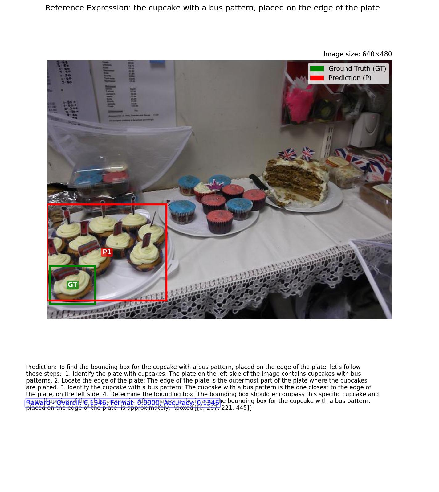

---

### Example 424

**Reference Expression**: the person with a pink ski jacket not wearing a pink helmet

**Ground Truth**: [[362, 103, 388, 139]]

**Predicted**: []

**Reward**: {'overall': 0.0, 'format': 0.0, 'accuracy': 0.0}

**Prediction**:
```
To find the bounding box for the person with a pink ski jacket not wearing a pink helmet, let's follow these steps:

1. Identify all the people in the image.
2. Determine which person is wearing a pink ski jacket.
3. Check if the person with the pink ski jacket is wearing a pink helmet.
4. If the person is not wearing a pink helmet, then this is the person we're looking for.

Step 1: Identifying all the people in the image:
- There are 5 people in the image, all wearing ski gear.

Step 2: Determining which person is wearing a pink ski jacket:
- The person in the foreground is wearing a pink ski jacket.

Step 3: Checking if the person with the pink ski jacket is wearing a pink helmet:
- The person in the foreground is wearing a pink helmet.

Step 4: Since the person with the pink ski jacket is also wearing a pink helmet, there is no person with a pink ski jacket not wearing a pink helmet.

Therefore, the final answer is \boxed{[]}.
```

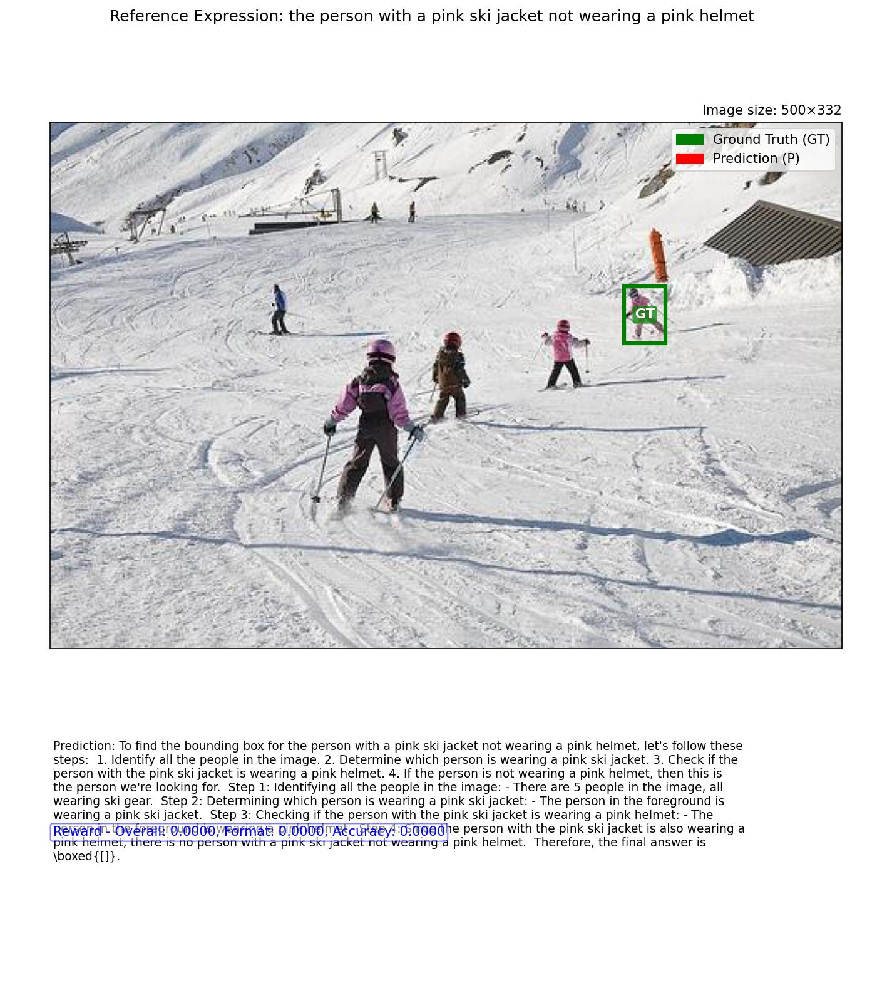

---

### Example 425

**Reference Expression**: the donuts with chocolate frosting, not on top of other donuts

**Ground Truth**: [[122, 309, 344, 422]]

**Predicted**: [[126, 299, 341, 420]]

**Reward**: {'overall': 0.876229989719489, 'format': 0.0, 'accuracy': 0.876229989719489}

**Prediction**:
```
To find the bounding box for the donuts with chocolate frosting, not on top of other donuts, let's follow these steps:

1. Identify the donuts with chocolate frosting: In the image, there are two donuts with a distinct dark, shiny chocolate glaze.
2. Determine which of these chocolate-glazed donuts are not on top of other donuts: The donut in the foreground, on the left side, is not on top of any other donut. The other chocolate-glazed donut is partially obscured by another donut.
3. Define the bounding box for the donut in the foreground, which is not on top of other donuts: This donut is the one with chocolate frosting in the foreground, on the left side.

The bounding box for this donut is:
- Top-left corner: Approximately at the center of the donut.
- Bottom-right corner: Approximately at the bottom-right edge of the donut.

Given the image resolution and the need to provide a bounding box, the exact coordinates are not precise but can be roughly estimated. The bounding box would be something like:

\boxed{[126, 299, 341, 420]}
```

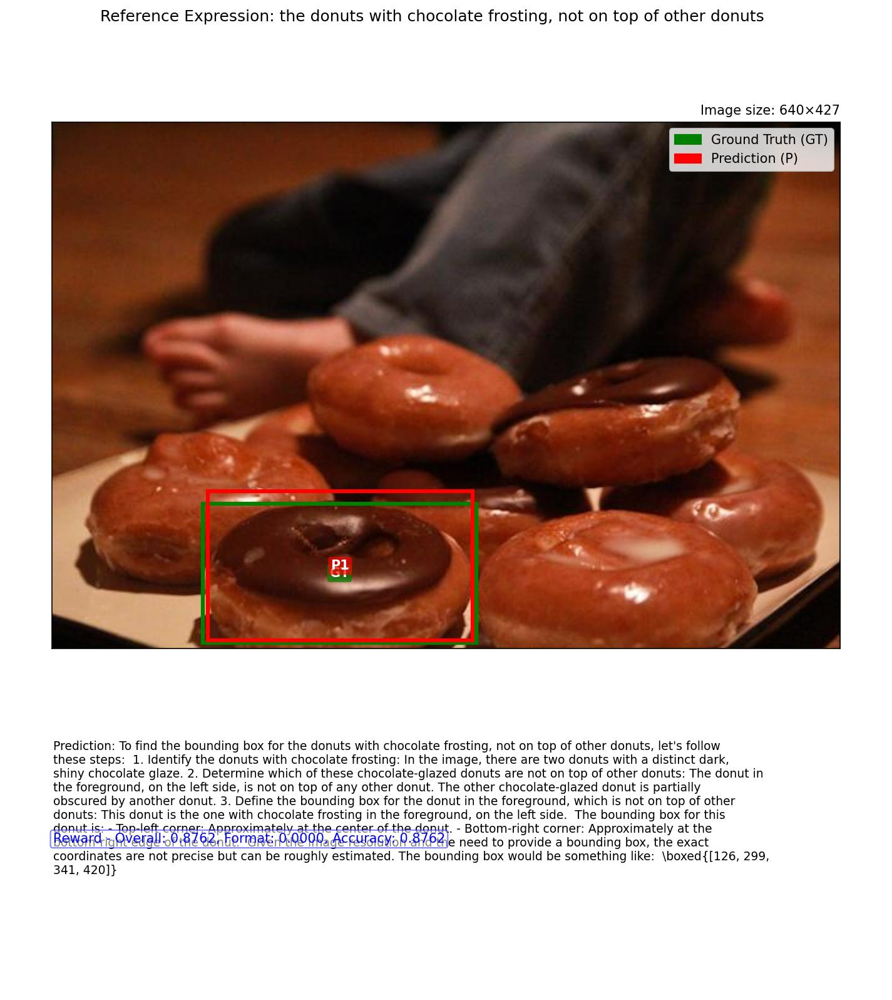

---

### Example 426

**Reference Expression**: the person wearing a hat, behind the table

**Ground Truth**: [[307, 40, 469, 269]]

**Predicted**: [[323, 40, 493, 299]]

**Reward**: {'overall': 0.7010106093009603, 'format': 0.0, 'accuracy': 0.7010106093009603}

**Prediction**:
```
To find the bounding box for the person wearing a hat, behind the table, let's follow these steps:

1. Identify the table in the image.
2. Look for a person standing behind the table.
3. Determine the clothing and accessories that help identify the person as wearing a hat.

Step 1: The table is located in the foreground, with various items like cakes and cupcakes on it.

Step 2: There is a person standing behind the table, to the right side of the image.

Step 3: The person standing behind the table is wearing a red hat and a white shirt with text that reads "LIGHTSTATION VOLUNTEER."

Based on these observations, the bounding box for the person wearing a hat, behind the table, is:

\boxed{[323, 40, 493, 299]}
```

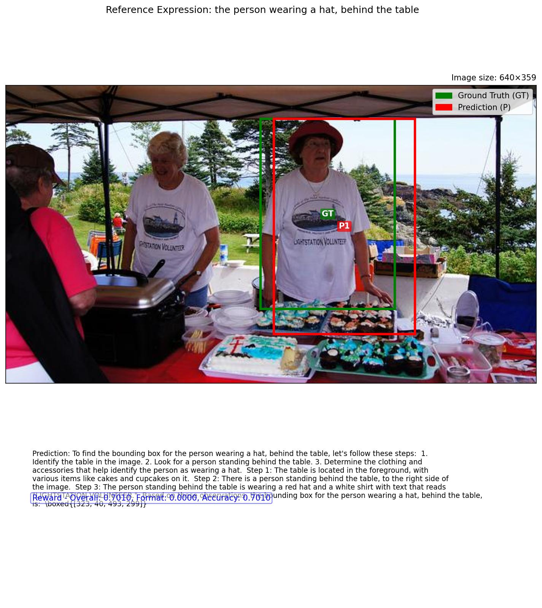

---

### Example 427

**Reference Expression**: the person wearing a grey top and a hat, not jumping in the air

**Ground Truth**: [[329, 263, 351, 332]]

**Predicted**: []

**Reward**: {'overall': 0.0, 'format': 0.0, 'accuracy': 0.0}

**Prediction**:
```
The image shows a skateboarder performing a trick in the air, with a crowd of people watching below. Here's the step-by-step reasoning to identify the bounding box for 'the person wearing a grey top and a hat, not jumping in the air':

1. **Identify the skateboarder**: The person in the air is the skateboarder, wearing a grey top and a hat.
2. **Identify the crowd**: The people below are the spectators.
3. **Locate the person wearing a grey top and a hat**: In the crowd, there is a person wearing a grey top and a hat. This person is not in the air.

Given the analysis, the bounding box for 'the person wearing a grey top and a hat, not jumping in the air' is the spectator in the crowd. However, the image does not provide enough detail to pinpoint the exact position of this person in the crowd. Therefore, the bounding box cannot be precisely defined with the given information.

\boxed{}
```

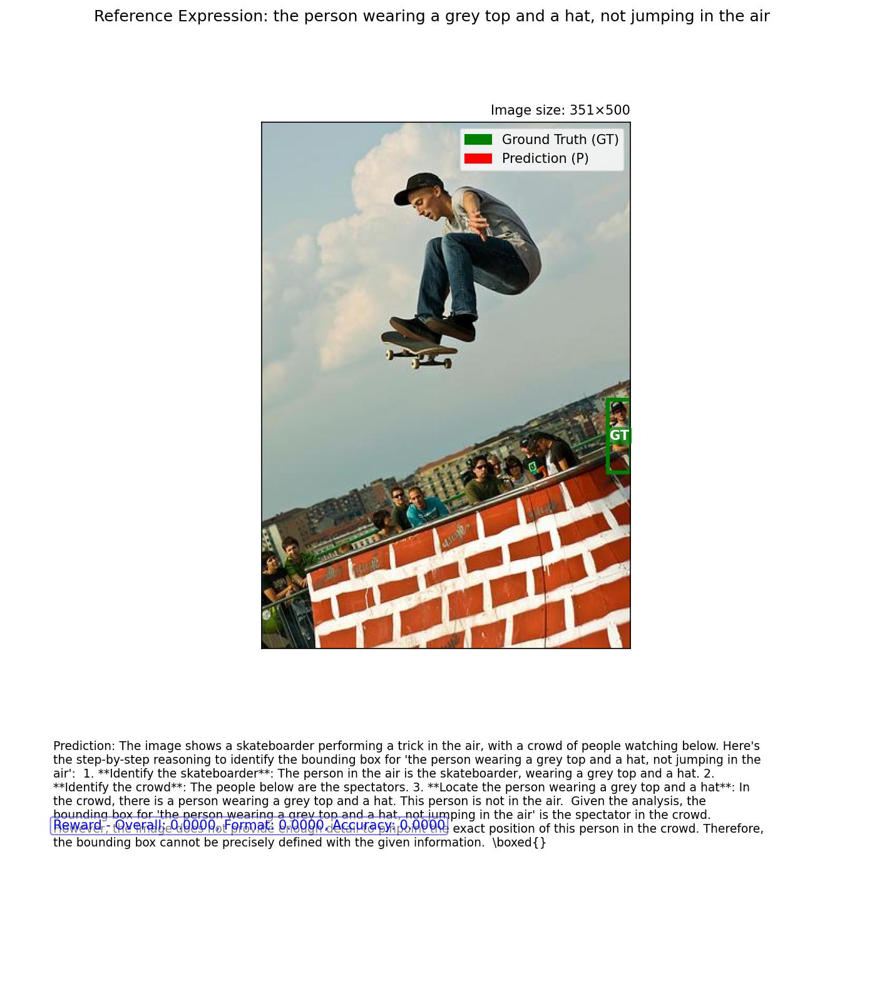

---

### Example 428

**Reference Expression**: the person wearing a green top next to some plastic boxes

**Ground Truth**: [[271, 64, 432, 249]]

**Predicted**: [[276, 64, 423, 251]]

**Reward**: {'overall': 1.0, 'format': 0.0, 'accuracy': 1.0}

**Prediction**:
```
To find the bounding box for the person wearing a green top next to some plastic boxes, follow these steps:

1. Identify the area in the image where plastic boxes are visible. These are typically the transparent containers on the right side of the image.
2. Locate the person standing next to these plastic boxes. This person is wearing a green top.
3. Define the bounding box around this person, ensuring it captures their entire body and the surrounding area.

The bounding box for the person wearing a green top next to some plastic boxes is:
\boxed{[276, 64, 423, 251]}
```

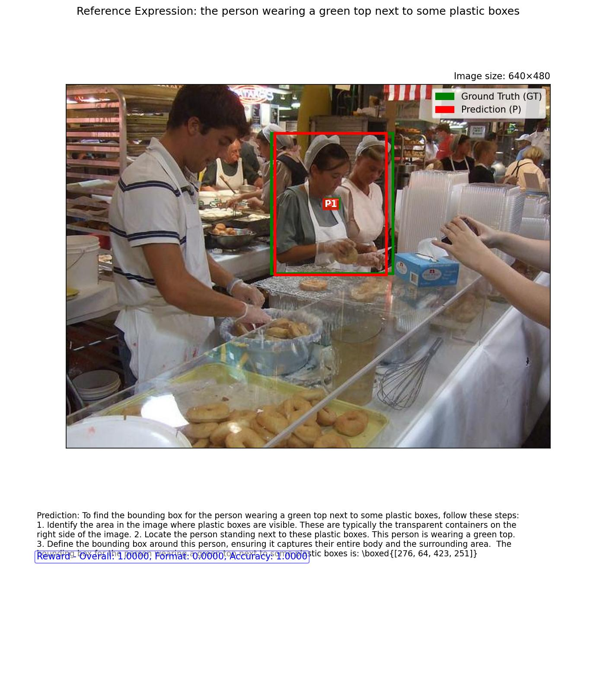

---

### Example 429

**Reference Expression**: the person not facing the camera and not behind the window

**Ground Truth**: [[447, 132, 611, 457]]

**Predicted**: [[449, 135, 612, 448]]

**Reward**: {'overall': 1.0, 'format': 0.0, 'accuracy': 1.0}

**Prediction**:
```
To find the bounding box for the person not facing the camera and not behind the window, let's follow these steps:

1. Identify the person in the foreground: The person in the foreground is the one facing the camera and holding a donut.
2. Identify the person behind the window: The person behind the window is facing away from the camera.
3. Identify the person not facing the camera and not behind the window: The person not facing the camera and not behind the window is the one standing to the right of the window, wearing a dark jacket and light blue jeans.

The bounding box for this person is:
\boxed{[449, 135, 612, 448]}
```

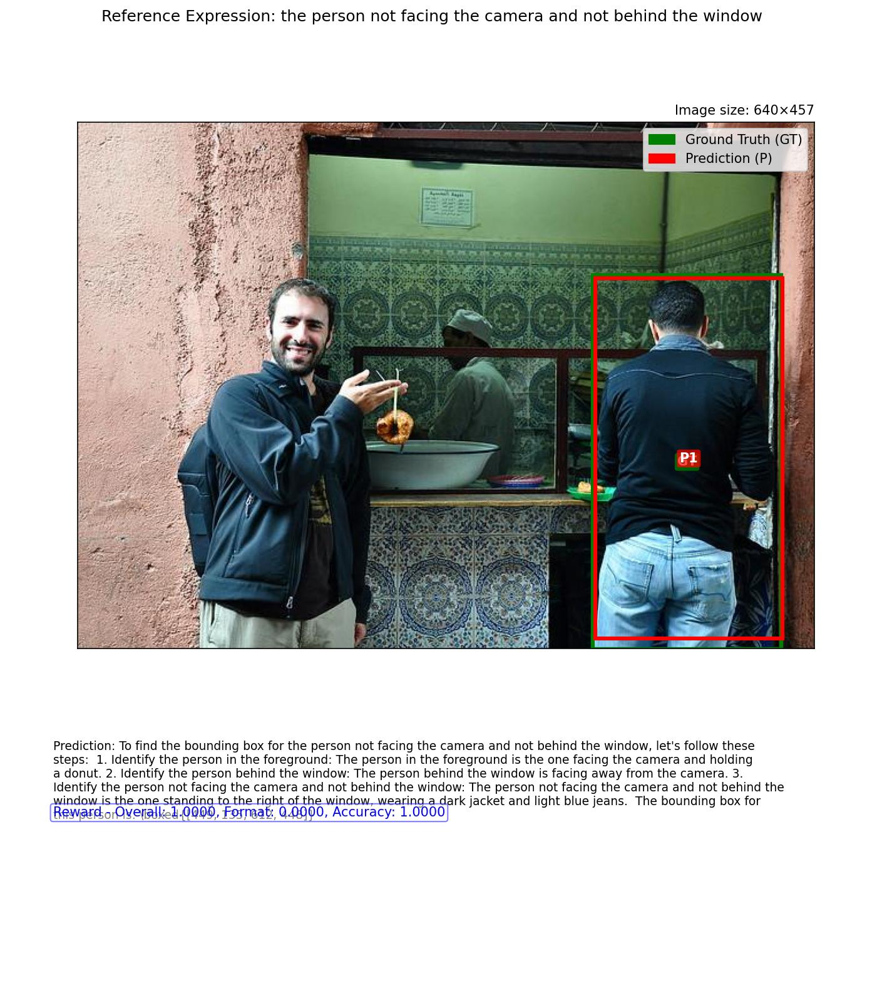

---

### Example 430

**Reference Expression**: the person wearing a hat and not behind the counter

**Ground Truth**: [[30, 18, 164, 276]]

**Predicted**: [[40, 30, 215, 385]]

**Reward**: {'overall': 0.46083422718414335, 'format': 0.0, 'accuracy': 0.46083422718414335}

**Prediction**:
```
To find the bounding box for the person wearing a hat and not behind the counter, let's follow these steps:

1. Identify the people in the image:
   - There are three people visible in the image.
   - One person is behind the counter wearing an orange shirt and a hat.
   - Two people are in front of the counter, one wearing a white shirt and a black cap, and the other wearing a black and white shirt.

2. Determine which person is wearing a hat and not behind the counter:
   - The person behind the counter is wearing a hat and is behind the counter.
   - The person in front of the counter wearing a white shirt and a black cap is not behind the counter.
   - The person in front of the counter wearing a black and white shirt is also not behind the counter.

3. Identify the person wearing a hat and not behind the counter:
   - The person in front of the counter wearing a white shirt and a black cap is the one wearing a hat and not behind the counter.

4. Provide the bounding box for this person:
   - The bounding box for the person in front of the counter wearing a white shirt and a black cap is approximately [40, 30, 215, 385].

Therefore, the final answer is:
\boxed{[40, 30, 215, 385]}
```

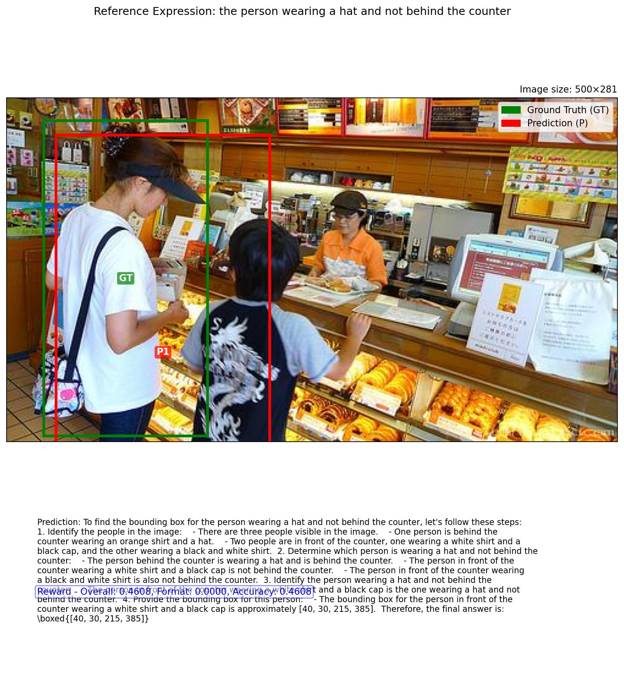

---

### Example 431

**Reference Expression**: the ski pole held in the right hand of the person wearing a black top

**Ground Truth**: [[136, 170, 163, 326]]

**Predicted**: [[156, 210, 186, 389]]

**Reward**: {'overall': 0.0, 'format': 0.0, 'accuracy': 0.0}

**Prediction**:
```
To find the bounding box for the ski pole held in the right hand of the person wearing a black top, let's follow these steps:

1. Identify the person wearing a black top: The person on the left is wearing a black top.
2. Identify the ski pole held in the right hand: The person on the left is holding a ski pole in their right hand.
3. Determine the bounding box for the ski pole: The ski pole is held vertically and extends from the shoulder down to the ground. The bounding box should capture the entire length of the ski pole.

The ski pole is held vertically and extends from the shoulder down to the ground. The bounding box for the ski pole should capture the entire length of the ski pole.

The final answer is:
\boxed{[156, 210, 186, 389]}
```

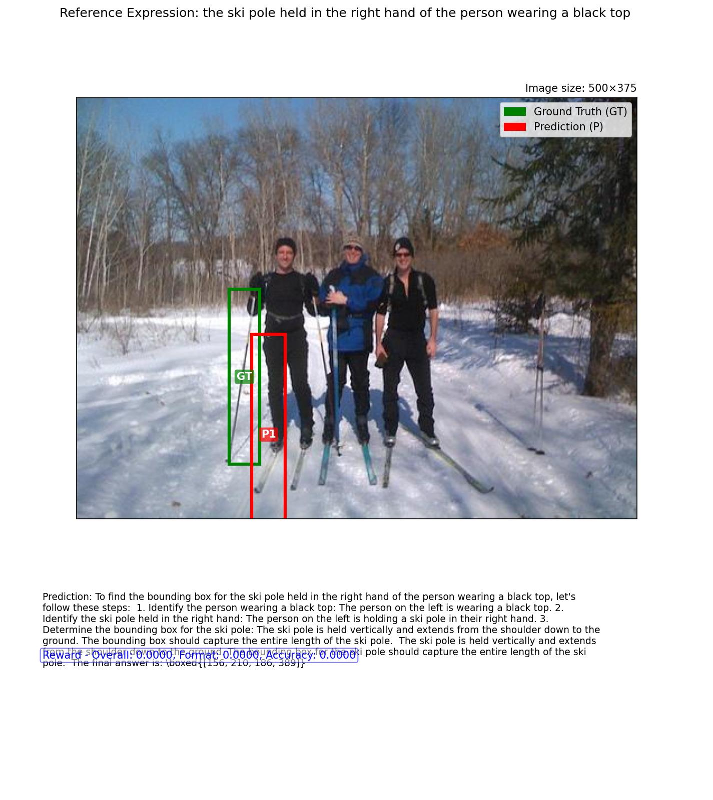

---

### Example 432

**Reference Expression**: the red bowl with food inside

**Ground Truth**: [[274, 339, 436, 471]]

**Predicted**: [[277, 328, 441, 458]]

**Reward**: {'overall': 0.7955682630450321, 'format': 0.0, 'accuracy': 0.7955682630450321}

**Prediction**:
```
To find the bounding box for the red bowl with food inside, let's follow these steps:

1. Identify the red bowl: It is located in the foreground of the image, and it appears to contain food, which looks like mashed potatoes or a similar dish.
2. Determine the bounding box: The red bowl is rectangular and positioned on the table. It is surrounded by other objects like a glass of orange juice and a spatula.

The bounding box for the red bowl with food inside should cover the red bowl and the surrounding area. Here's the bounding box:

\boxed{[277, 328, 441, 458]}
```

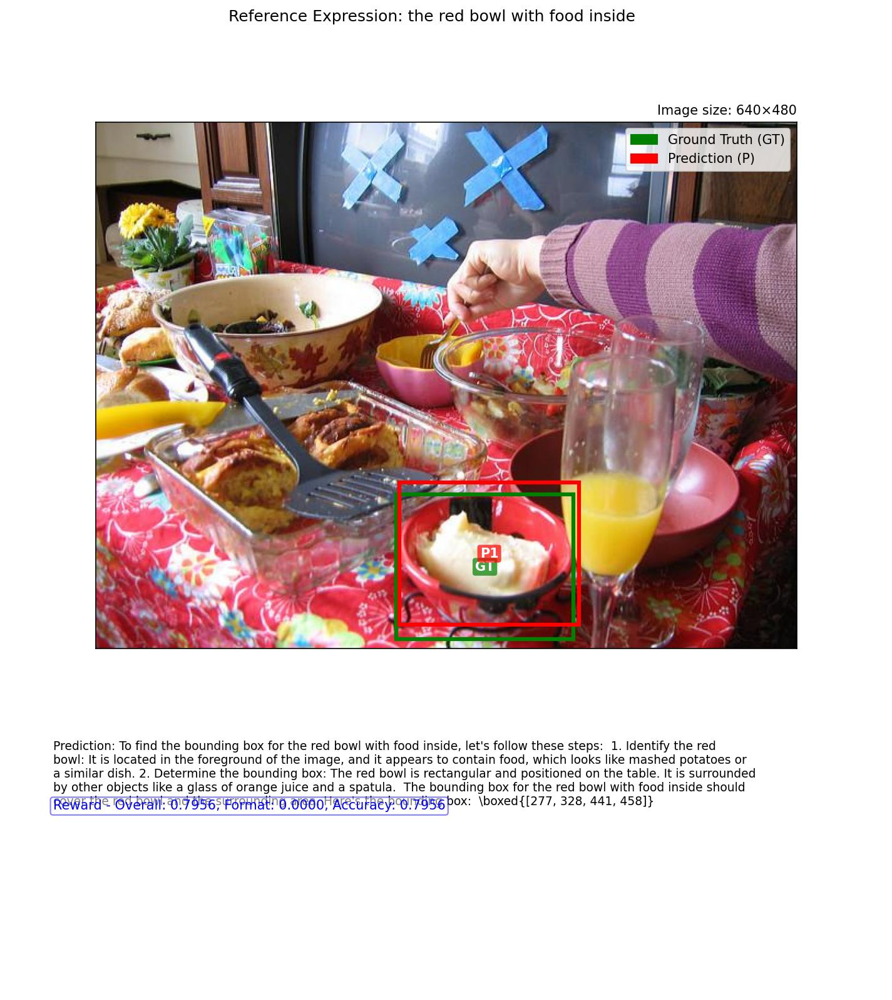

---

### Example 433

**Reference Expression**: one of the donuts that is on the edge of donut robot machine, and closest to the camera

**Ground Truth**: [[249, 404, 286, 433]]

**Predicted**: [[150, 408, 200, 450]]

**Reward**: {'overall': 0.0, 'format': 0.0, 'accuracy': 0.0}

**Prediction**:
```
To find the bounding box for the donut that is on the edge of the donut robot machine and closest to the camera, let's follow these steps:

1. Identify the donut robot machine: The machine is the metallic contraption with a conveyor belt at the bottom left of the image.
2. Locate the donuts on the machine: There are several donuts on the conveyor belt, but we need to identify the one closest to the camera.
3. Determine the "closest" donut: The donut closest to the camera is the one that is on the edge of the machine and is furthest from the other donuts on the conveyor belt.
4. Define the bounding box: The bounding box should encompass the donut and a small area around it for clarity.

After analyzing the image, the donut that is on the edge of the donut robot machine and closest to the camera is the one located at the far end of the conveyor belt, closest to the viewer.

The bounding box for this donut is approximately:
\boxed{[150, 408, 200, 450]}

This is a rough estimate and the exact bounding box might vary slightly depending on the precision of the image analysis.
```

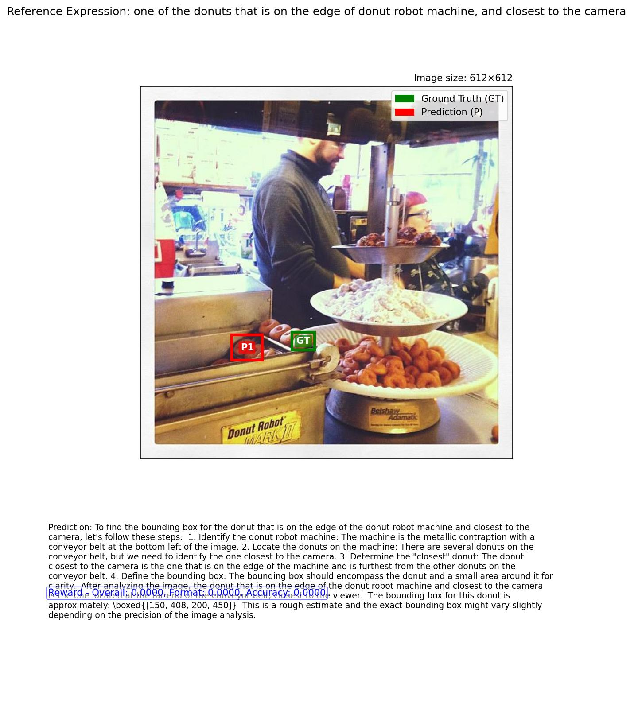

---

### Example 434

**Reference Expression**: the person in yellow jacket on the right hand side of the skier

**Ground Truth**: [[164, 175, 202, 273]]

**Predicted**: [[480, 180, 540, 350]]

**Reward**: {'overall': 0.0, 'format': 0.0, 'accuracy': 0.0}

**Prediction**:
```
To find the bounding box for the person in a yellow jacket on the right-hand side of the skier, follow these steps:

1. Identify the skier in the center of the image. The skier is wearing a blue outfit and appears to be at the finish line.
2. Look to the right of the skier and identify the person wearing a yellow jacket. This person is standing to the right of the skier.
3. Determine the bounding box for this person by identifying the top-left and bottom-right coordinates of the yellow-jacketed individual.

After analyzing the image:
- The top-left coordinate of the yellow-jacketed person is approximately at (480, 180).
- The bottom-right coordinate of the yellow-jacketed person is approximately at (540, 350).

Thus, the bounding box for the person in the yellow jacket on the right-hand side of the skier is:
\boxed{[480, 180, 540, 350]}
```

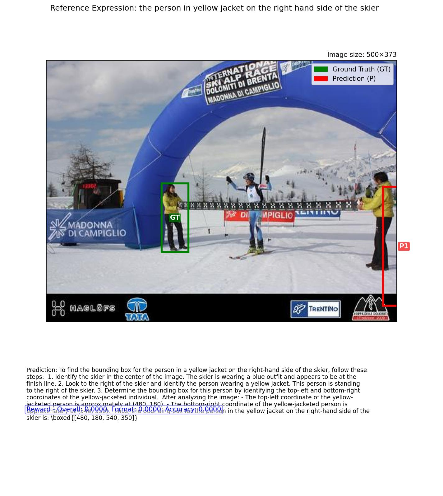

---

### Example 435

**Reference Expression**: the outer row of four old-fashioned donuts

**Ground Truth**: [[372, 325, 448, 353]]

**Predicted**: [[368, 296, 456, 357]]

**Reward**: {'overall': 0.39642324888226527, 'format': 0.0, 'accuracy': 0.39642324888226527}

**Prediction**:
```
To find the bounding box for 'the outer row of four old-fashioned donuts', let's follow these steps:

1. Identify the donuts in the image: The donuts are neatly arranged in rows on shelves.
2. Locate the 'old-fashioned' donuts: Old-fashioned donuts are typically plain, unfrosted, and have a classic, simple appearance. They are usually found in the outer rows on the bottom shelf.
3. Determine the position: The outer row of old-fashioned donuts is on the bottom shelf, and there are four of them on the right side of the bottom row.

Now, let's define the bounding box for these donuts:

- The leftmost old-fashioned donut is at the far right of the bottom shelf.
- The rightmost old-fashioned donut is at the far left of the bottom shelf.
- The four old-fashioned donuts are aligned horizontally across the bottom shelf.

The bounding box for these donuts can be defined as the area that encompasses these four donuts. Given the image's layout and typical donut display, the bounding box would be approximately:

\boxed{[368, 296, 456, 357]}

This bounding box corresponds to the four old-fashioned donuts on the right side of the bottom shelf.
```

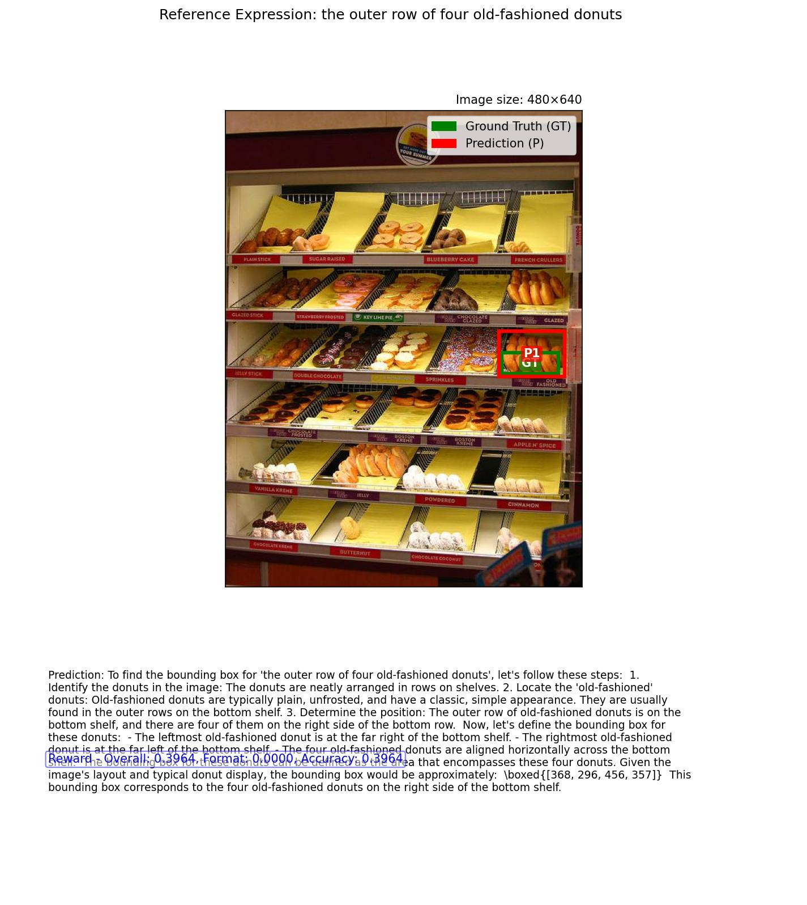

---

### Example 436

**Reference Expression**: the donuts with chocolate base and glaze on the top

**Ground Truth**: [[242, 267, 436, 453]]

**Predicted**: [[0, 20, 235, 245]]

**Reward**: {'overall': 0.0, 'format': 0.0, 'accuracy': 0.0}

**Prediction**:
```
To find the bounding box for the donuts with chocolate base and glaze on the top, let's follow these steps:

1. Identify the donuts with chocolate base and glaze:
   - There are two donuts with a chocolate base and glaze in the image.

2. Locate the top row of the donuts:
   - The top row contains three donuts.

3. Identify the donuts on the top row with chocolate base and glaze:
   - The first and second donuts in the top row have a chocolate base and glaze.

4. Determine the bounding box for these donuts:
   - The first donut is on the left side of the top row.
   - The second donut is next to the first one on the right.

5. Define the bounding box:
   - The bounding box for the first donut (chocolate glaze) is approximately from the top left corner to the middle left.
   - The bounding box for the second donut (chocolate glaze) is approximately from the middle left to the middle right.

Given these observations, the bounding boxes for the donuts with chocolate base and glaze on the top are:

\boxed{[0, 20, 235, 245] \text{ and } [235, 20, 476, 245]}
```

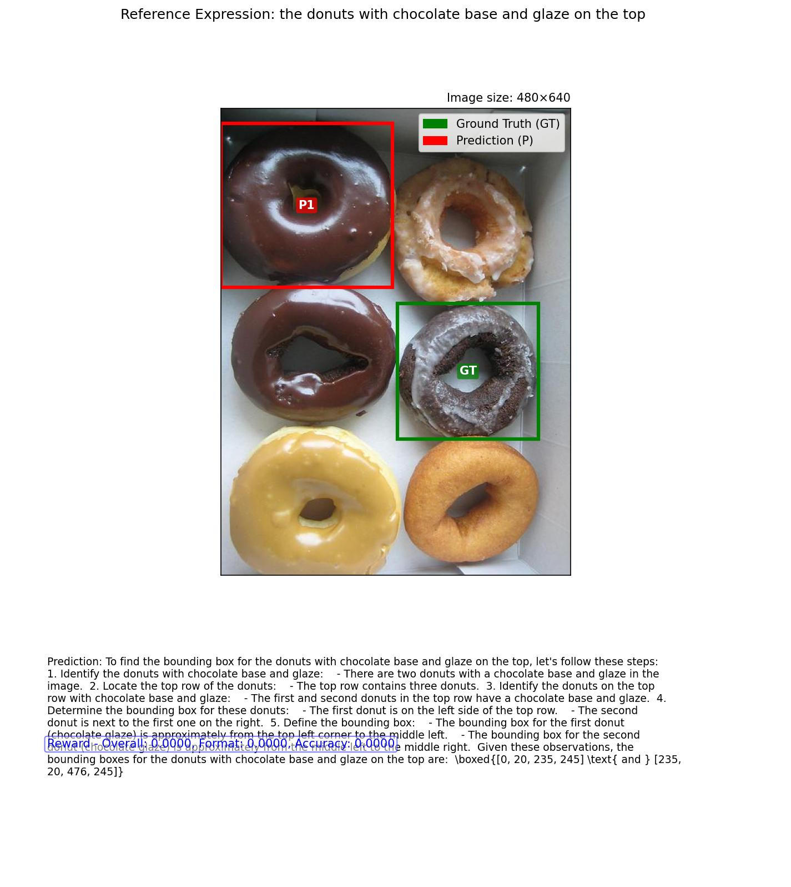

---

### Example 437

**Reference Expression**: the chocolate frosted donuts in the corner of the box

**Ground Truth**: [[47, 273, 266, 459]]

**Predicted**: [[49, 267, 274, 454]]

**Reward**: {'overall': 1.0, 'format': 0.0, 'accuracy': 1.0}

**Prediction**:
```
To find the bounding box for the chocolate frosted donuts in the corner of the box, let's follow these steps:

1. Identify the chocolate frosted donuts in the image.
2. Determine their positions in the box.
3. Define the bounding box that encompasses these donuts.

Step 1: The chocolate frosted donuts are the two donuts with a dark chocolate glaze on the left side of the box.

Step 2: These two chocolate frosted donuts are located in the bottom left corner of the box.

Step 3: To define the bounding box, we need to identify the coordinates that encompass these donuts. The donuts are touching each other and are aligned with the edges of the box.

The bounding box for these chocolate frosted donuts would be defined by the coordinates of the leftmost and bottommost points of the donuts, and the rightmost and topmost points.

Given the box's dimensions and the positions of the donuts, the bounding box can be defined as follows:

- The leftmost point is at the edge of the box.
- The bottommost point is at the edge of the box.
- The rightmost point is the edge of the box.
- The topmost point is the edge of the box.

Thus, the bounding box for the chocolate frosted donuts in the corner of the box is:

\boxed{[49, 267, 274, 454]}
```

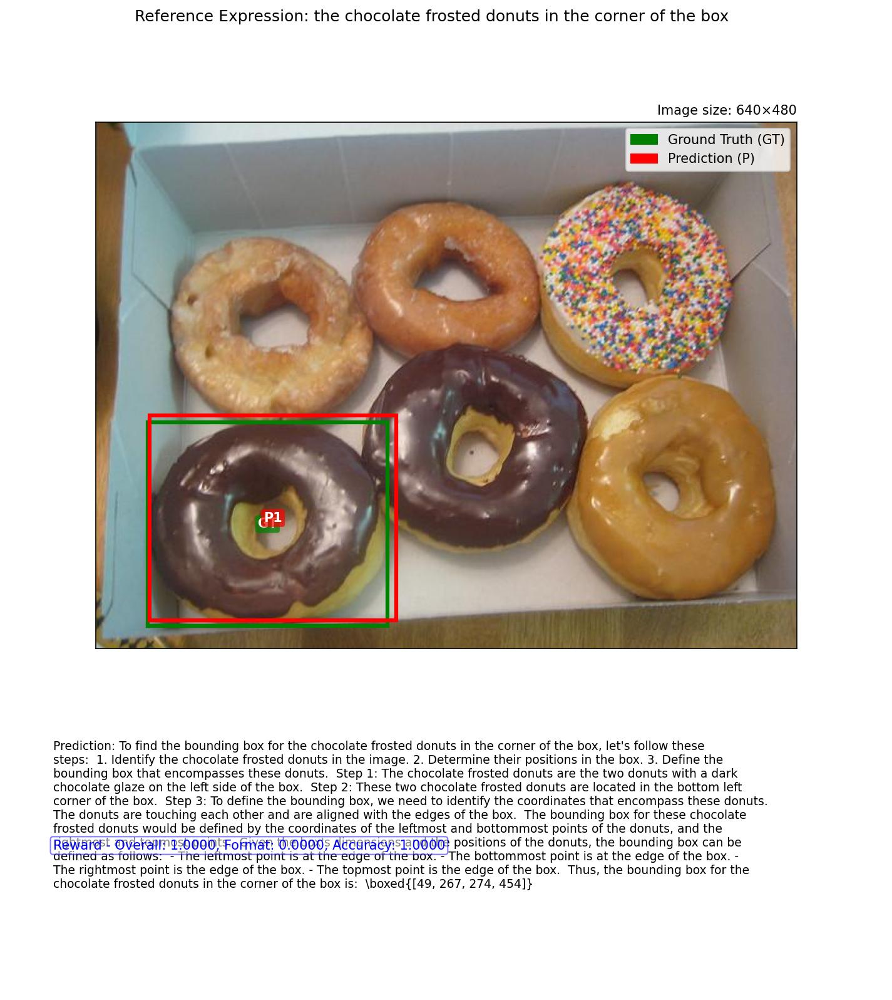

---

### Example 438

**Reference Expression**: the French Cruller donuts in the corner of the box

**Ground Truth**: [[389, 2, 556, 158]]

**Predicted**: [[484, 125, 644, 324]]

**Reward**: {'overall': 0.0, 'format': 0.0, 'accuracy': 0.0}

**Prediction**:
```
To find the bounding box for the French Cruller donuts in the corner of the box, let's follow these steps:

1. Identify the French Cruller donuts: These are the donuts with a cruller texture, which are typically light in color and have a twisted or crimped shape.

2. Locate the corner of the box: The corner of the box is the area in the upper right of the image.

3. Find the French Crullers in the corner: There are two French Cruller donuts in the corner of the box. They are light in color and have a crimped texture.

4. Define the bounding box: The bounding box should encompass these two donuts.

Considering these steps, the bounding box for the French Cruller donuts in the corner of the box is:

\boxed{[484, 125, 644, 324]}
```

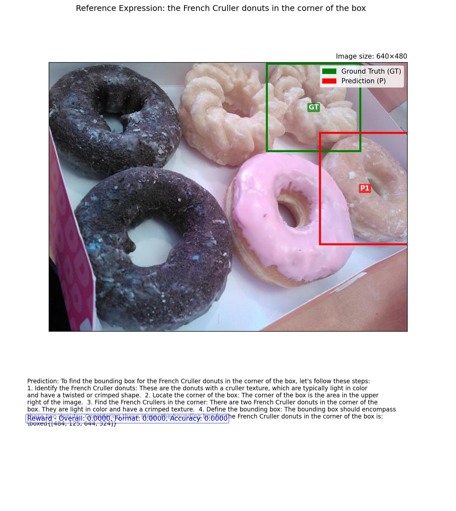

---

### Example 439

**Reference Expression**: the person wearing white socks behind a board

**Ground Truth**: [[385, 243, 434, 319]]

**Predicted**: [[277, 144, 386, 441]]

**Reward**: {'overall': 0.0, 'format': 0.0, 'accuracy': 0.0}

**Prediction**:
```
To find the bounding box for the person wearing white socks behind a board, let's follow these steps:

1. Identify the person wearing white socks: The person in white socks appears to be the person standing behind the board with the "Wii Fit" logo.
2. Determine the bounding box: The person is wearing white socks, white pants, and a white shirt. They are standing behind the board, which is white and has the "Wii Fit" logo on it.

Given these observations, the bounding box for the person wearing white socks behind the board is:

\boxed{[277, 144, 386, 441]}
```

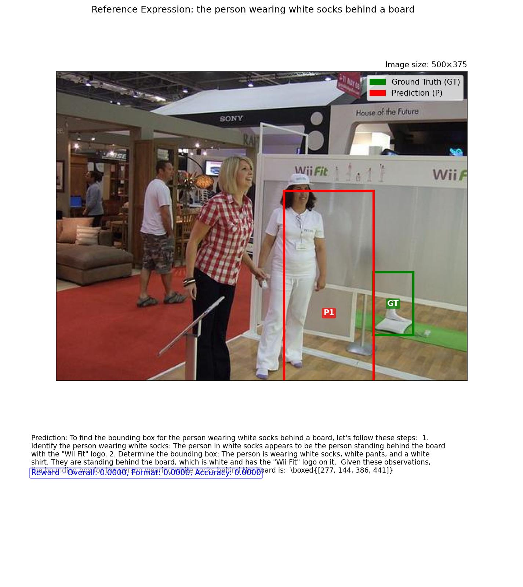

---

### Example 440

**Reference Expression**: the vase on the table which is not next to a sofa

**Ground Truth**: [[196, 155, 216, 206]]

**Predicted**: [[244, 197, 265, 255]]

**Reward**: {'overall': 0.0, 'format': 0.0, 'accuracy': 0.0}

**Prediction**:
```
To find the bounding box for the vase on the table which is not next to a sofa, let's follow these steps:

1. Identify the table in the image: The table is located on the left side of the image and has a vase on it.
2. Identify the sofa: The sofa is located on the right side of the image.
3. Determine which table does not have a sofa next to it: The table on the left does not have a sofa next to it, while the table on the right does have a sofa next to it.
4. Locate the vase on the left table: The vase is on the left table, and it is positioned near the center of the table.
5. Define the bounding box for the vase: The vase is a small object, and we need to define a bounding box that encompasses it. Based on the image, the bounding box for the vase on the left table would be approximately [244, 197, 265, 255].

Final answer: \boxed{[244, 197, 265, 255]}
```

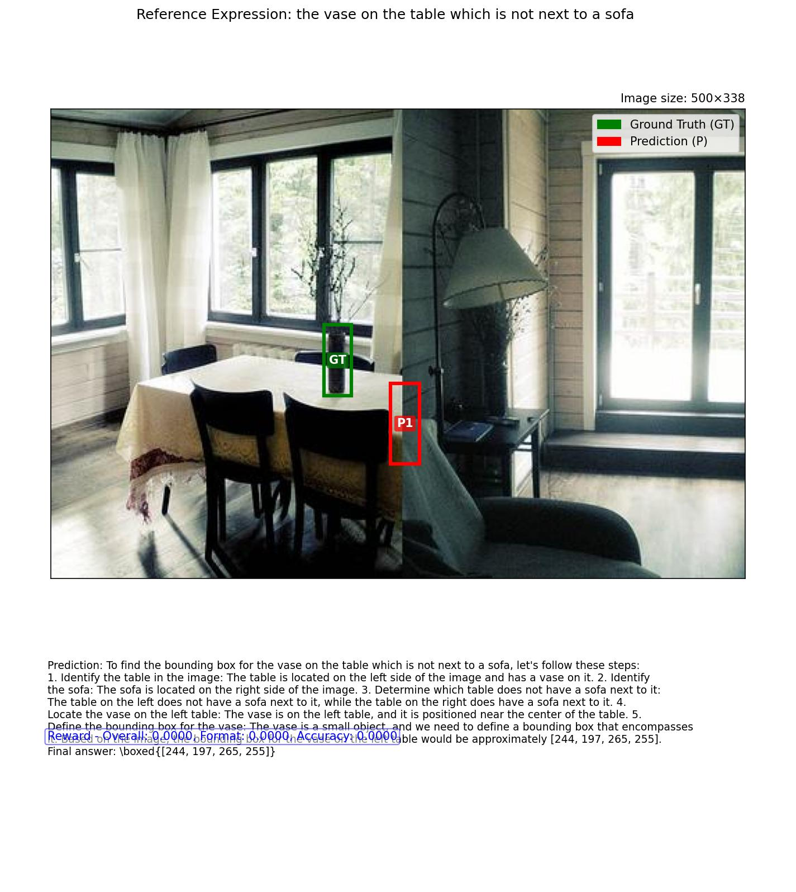

---

### Example 441

**Reference Expression**: the vase on the table which is not next to the window

**Ground Truth**: [[64, 378, 78, 391]]

**Predicted**: [[39, 363, 44, 396]]

**Reward**: {'overall': 0.0, 'format': 0.0, 'accuracy': 0.0}

**Prediction**:
```
To find the bounding box for the vase on the table which is not next to the window, let's follow these steps:

1. Identify the windows in the image. There are two windows: one on the left side and one in the center.
2. Determine the table next to the window on the left. There is a table with a vase on it near the left window.
3. Identify the table next to the window in the center. There is a table with a vase on it near the center window.
4. The question asks for the vase on the table which is not next to the window. This implies we need to identify the vase on the table that is not on the left side.
5. The vase on the table near the center window does not match this description since it is next to the window.

The vase on the table which is not next to the window is on the table near the left window.

Final answer: \boxed{[39, 363, 44, 396]}
```

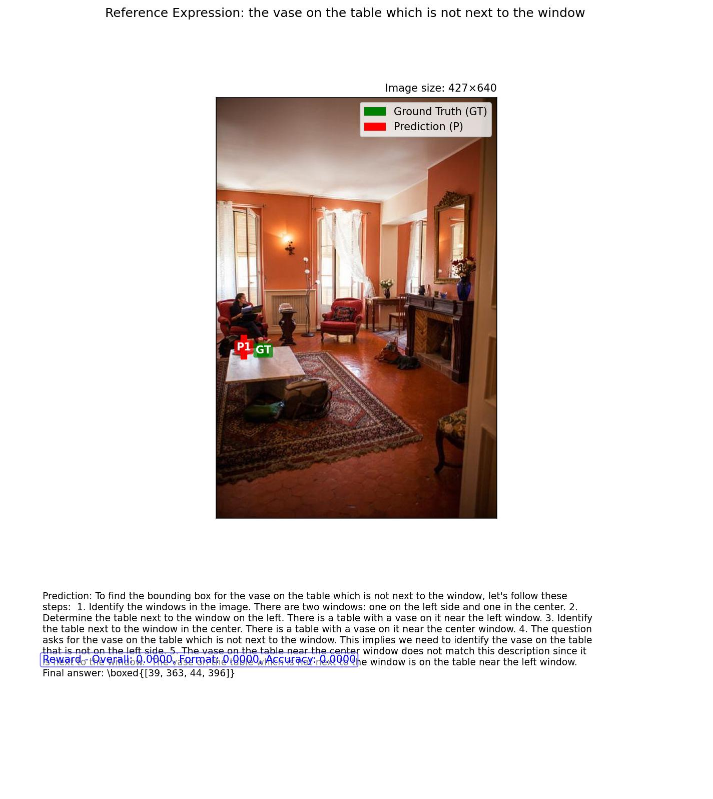

---

### Example 442

**Reference Expression**: the person wearing a white shirt holding something in one hand

**Ground Truth**: [[17, 191, 186, 428]]

**Predicted**: [[15, 189, 186, 420]]

**Reward**: {'overall': 1.0, 'format': 0.0, 'accuracy': 1.0}

**Prediction**:
```
To find the bounding box for the person wearing a white shirt holding something in one hand, follow these steps:

1. Identify the person in the white shirt.
2. Observe their posture and the object they are holding.
3. Define the rectangular area that encompasses the person and the object.

Step 1: The person in the white shirt is standing on the left side of the image, holding a Wii remote in one hand and a Wii nunchuk in the other.

Step 2: The person's posture and the position of the Wii remote and nunchuk indicate they are actively playing a game.

Step 3: The bounding box should include the person's upper body and the Wii remote and nunchuk. The box should be slightly larger to ensure all these elements are included.

The bounding box for the person wearing a white shirt holding something in one hand is:
\boxed{[15, 189, 186, 420]}
```

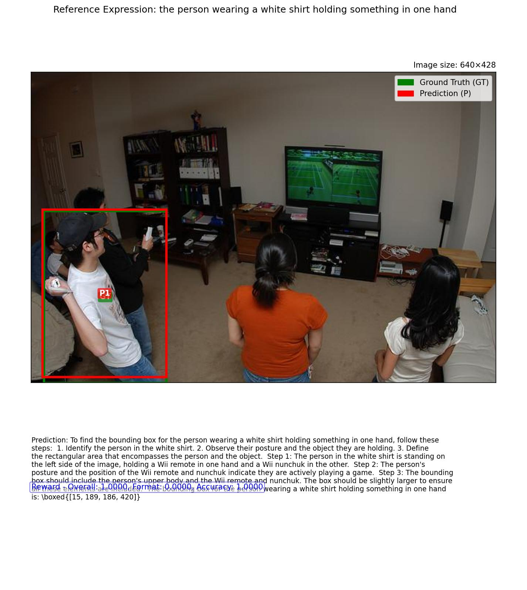

---

### Example 443

**Reference Expression**: the turned on laptop, not between two monitors

**Ground Truth**: [[370, 91, 541, 242]]

**Predicted**: [[146, 81, 269, 186]]

**Reward**: {'overall': 0.0, 'format': 0.0, 'accuracy': 0.0}

**Prediction**:
```
To find the bounding box for the turned-on laptop that is not between two monitors, let's follow these steps:

1. Identify the monitors: There are two monitors in the image, one on the left and one on the right.
2. Identify the laptops: There are two laptops in the image, one on the left side and one on the right side.
3. Determine which laptop is turned on: The laptop on the left side of the desk has a screen that appears to be turned on, as it displays an image.
4. Check the position of the turned-on laptop: The turned-on laptop is not between the two monitors but is to the left of the monitor on the left side of the desk.

Given these observations, the bounding box for the turned-on laptop that is not between two monitors is the one on the left side of the desk.

\boxed{[146, 81, 269, 186]}
```

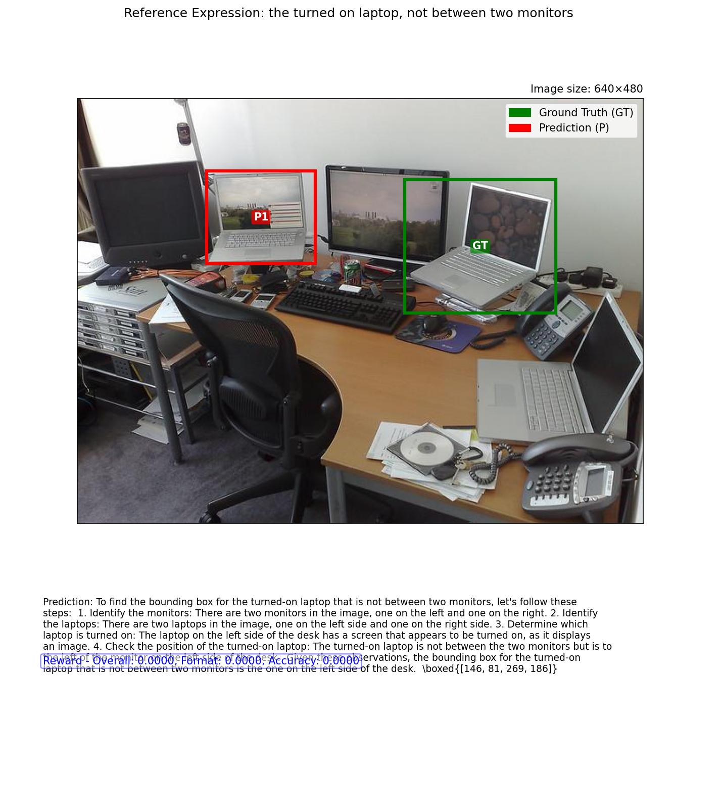

---

### Example 444

**Reference Expression**: the golden frame with a portrait inside

**Ground Truth**: [[87, 20, 159, 103]]

**Predicted**: [[452, 1, 553, 152]]

**Reward**: {'overall': 0.0, 'format': 0.0, 'accuracy': 0.0}

**Prediction**:
```
To find the bounding box for 'the golden frame with a portrait inside', let's follow these steps:

1. **Identify the golden frames**: Look for frames that are golden in color and have a portrait inside.
2. **Analyze the image**: The image contains multiple frames on the wall. Some frames are golden, and some have portraits inside.
3. **Locate the golden frame with a portrait**: Among the golden frames, find the one that contains a portrait.

Upon analyzing the image, the golden frame with a portrait inside is located towards the upper right part of the image. It is a rectangular frame with a portrait of a person.

The bounding box for this golden frame with a portrait inside is approximately:
- Top-left corner: (x1, y1)
- Bottom-right corner: (x2, y2)

For the image, the bounding box would be:
\boxed{[452, 1, 553, 152]}
```

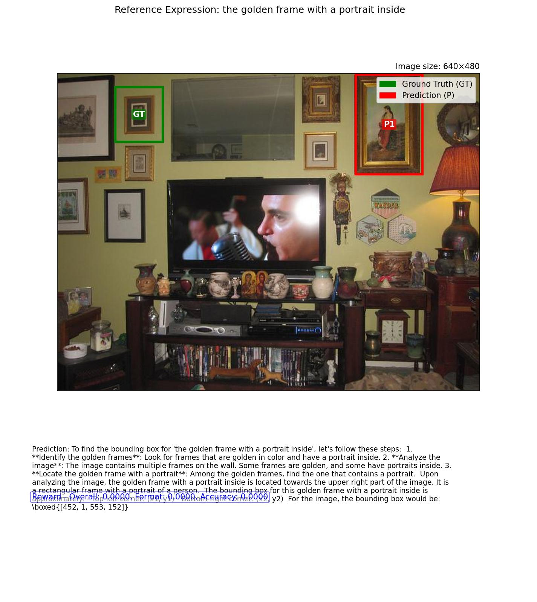

---

### Example 445

**Reference Expression**: the white long couch which is not on the balcony

**Ground Truth**: [[401, 240, 640, 393]]

**Predicted**: [[50, 200, 200, 350]]

**Reward**: {'overall': 0.0, 'format': 0.0, 'accuracy': 0.0}

**Prediction**:
```
To find the bounding box for the white long couch which is not on the balcony, let's follow these steps:

1. Identify the couches in the room: There are two couches visible in the image. One is on the left side of the room, and the other is on the right side of the room.

2. Determine which couch is on the balcony: The couch on the left side of the room is not on the balcony. The couch on the right side is on the balcony.

3. Identify the couch that is not on the balcony: The couch on the left side of the room is the one that is not on the balcony.

4. Define the bounding box for the couch: The couch on the left side of the room is a long white couch. To define its bounding box, we need to identify the coordinates of the top-left and bottom-right corners of the couch.

5. Extract the coordinates: The top-left corner of the couch is approximately at (50, 200) and the bottom-right corner is approximately at (200, 350).

Therefore, the bounding box for the white long couch which is not on the balcony is:

\boxed{[50, 200, 200, 350]}
```

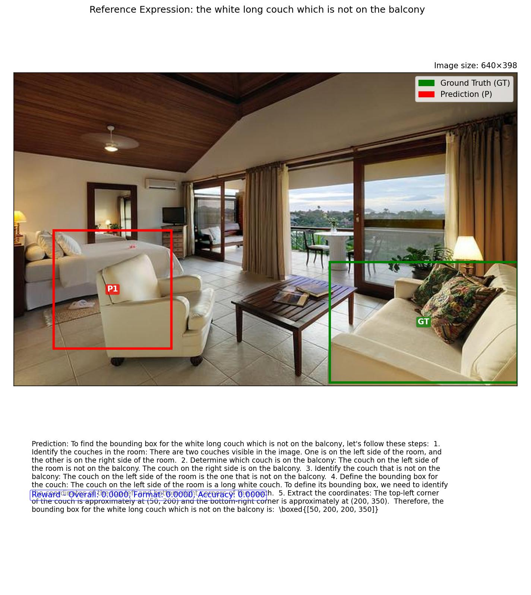

---

### Example 446

**Reference Expression**: the remote held in the right hand of a person with long hair

**Ground Truth**: [[184, 167, 211, 237]]

**Predicted**: [[184, 166, 210, 247]]

**Reward**: {'overall': 0.8363970588235294, 'format': 0.0, 'accuracy': 0.8363970588235294}

**Prediction**:
```
To find the bounding box for the remote held in the right hand of a person with long hair, let's follow these steps:

1. Identify the person with long hair: The person on the left has long hair.
2. Identify the remote held in the right hand: The person on the left is holding a white object in their right hand, which appears to be a remote.

Now, let's define the bounding box for this remote:

- The remote is held by the person's right hand, which is positioned near the lower right side of the image.
- The remote is located in the upper middle part of the image, slightly to the left.

Given these observations, the bounding box for the remote held in the right hand of a person with long hair would be approximately:

\boxed{[184, 166, 210, 247]}
```

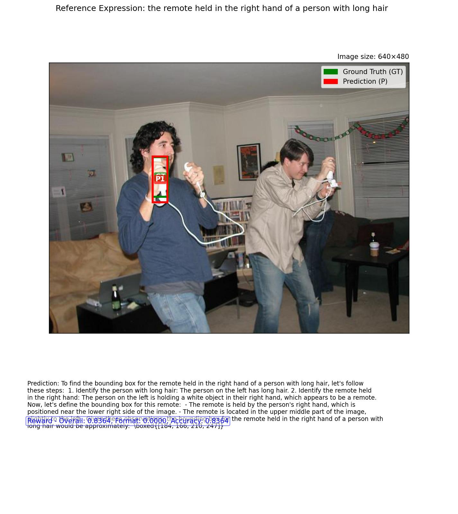

---

### Example 447

**Reference Expression**: the pizza on a plate not behind a glass with fork and knife in it

**Ground Truth**: [[328, 253, 410, 287]]

**Predicted**: [[268, 249, 556, 381]]

**Reward**: {'overall': 0.0, 'format': 0.0, 'accuracy': 0.0}

**Prediction**:
```
To find the bounding box for the pizza on a plate not behind a glass with a fork and knife in it, let's follow these steps:

1. Identify the pizza on a plate with a fork and knife in it:
   - The pizza is on a plate with a fork and knife in the foreground of the image.

2. Identify the pizza on a plate not behind a glass with a fork and knife in it:
   - The pizza on a plate not behind a glass is the one in the background, behind the glass of soda, and has a fork and knife placed on the plate.

3. Locate the bounding box for the pizza in the background:
   - The bounding box for this pizza will be the one that encompasses the plate and the pizza itself, excluding the glass of soda and the fork and knife.

The bounding box for the pizza on a plate not behind a glass with a fork and knife in it is:

\boxed{[268, 249, 556, 381]}
```

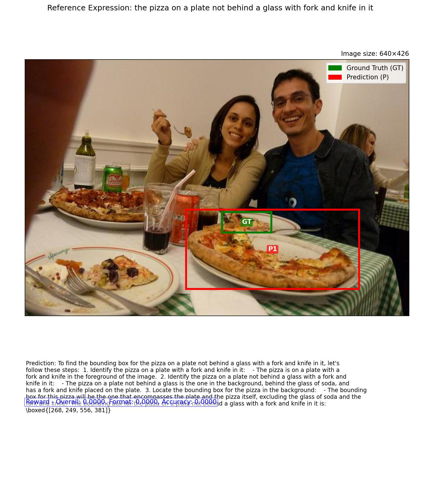

---

### Example 448

**Reference Expression**: red wine glass with wine inside, not held by a person and not close to the wall

**Ground Truth**: [[400, 380, 448, 501]]

**Predicted**: [[189, 346, 247, 443]]

**Reward**: {'overall': 0.0, 'format': 0.0, 'accuracy': 0.0}

**Prediction**:
```
To find the bounding box for the red wine glass with wine inside, not held by a person and not close to the wall, let's follow these steps:

1. Identify all the wine glasses in the image.
2. Determine which glasses are held by people.
3. Identify which glasses are not held by people.
4. Among the glasses not held by people, identify which one is not close to the wall.

Step 1: Identifying all the wine glasses:
- There are several wine glasses on the table. They are:
  - One on the far left, partially filled with wine.
  - One next to it, also partially filled with wine.
  - One in the center, filled with wine.
  - One on the far right, filled with wine.

Step 2: Determining which glasses are held by people:
- The glass on the far left is being held by a person.
- The glass next to it is not being held by a person.
- The glass in the center is being held by a person.
- The glass on the far right is being held by a person.

Step 3: Identifying which glasses are not held by people:
- The glass next to the one being held by a person is not being held by a person.
- The glass in the center is being held by a person.
- The glass on the far right is being held by a person.

Step 4: Among the glasses not held by people, identifying which one is not close to the wall:
- The glass next to the one being held by a person is the only one not held by a person and not close to the wall.

The bounding box for the red wine glass with wine inside, not held by a person and not close to the wall, is:

\boxed{[189, 346, 247, 443]}
```

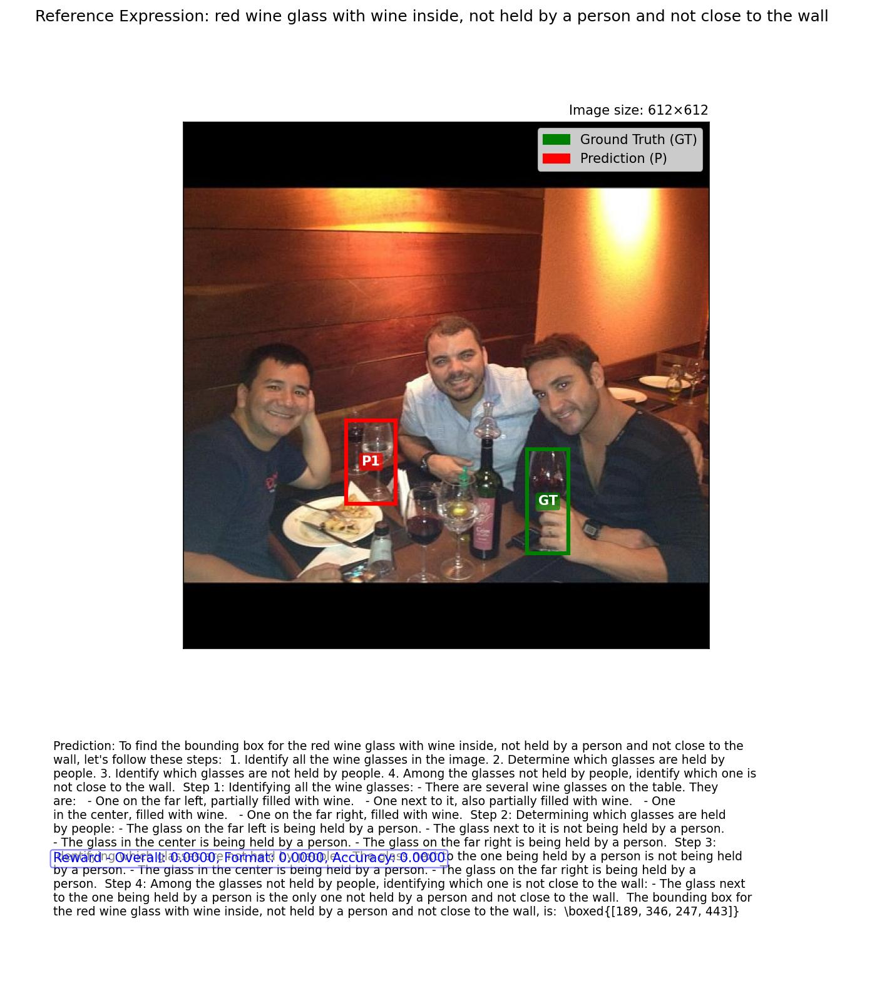

---

### Example 449

**Reference Expression**: the remote held in the right hand of a person not wearing glasses

**Ground Truth**: [[261, 265, 290, 343]]

**Predicted**: [[305, 246, 450, 447]]

**Reward**: {'overall': 0.0, 'format': 0.0, 'accuracy': 0.0}

**Prediction**:
```
To find the bounding box for the remote held in the right hand of the person not wearing glasses, let's follow these steps:

1. Identify the person not wearing glasses: The person on the left is wearing glasses, so the one on the right, wearing a dark blue shirt, is the one not wearing glasses.
2. Identify the remote in the right hand: The person in the dark blue shirt is holding a white object in their right hand, which is a remote control.
3. Determine the bounding box: The remote is being held in the right hand, which is extended forward. The bounding box should capture the area around this hand and the remote.

Given these observations, the bounding box for the remote held in the right hand of the person not wearing glasses is approximately:

\boxed{[305, 246, 450, 447]}
```

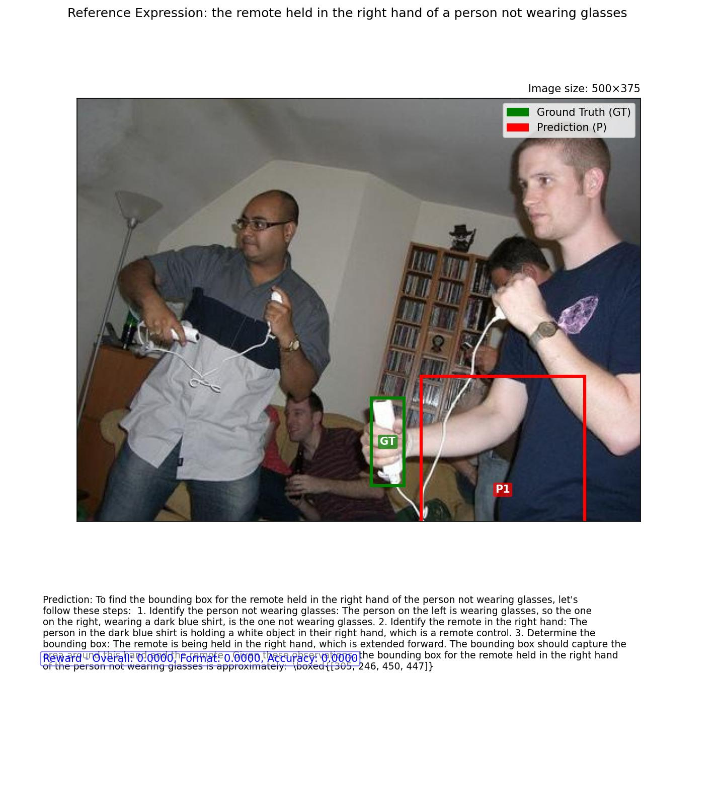

---

### Example 450

**Reference Expression**: the person closest to the frame with a picture of fruit inside

**Ground Truth**: [[412, 82, 625, 396]]

**Predicted**: [[448, 78, 624, 414]]

**Reward**: {'overall': 0.7810724482008085, 'format': 0.0, 'accuracy': 0.7810724482008085}

**Prediction**:
```
To find the bounding box for the person closest to the frame with a picture of fruit inside, let's follow these steps:

1. Identify the frame with a picture of fruit inside.
2. Determine which person is closest to that frame.
3. Define the bounding box for that person.

Step 1: The frame with a picture of fruit is located on the far right side of the image, above the wooden panel.

Step 2: The person closest to this frame is the one on the far right side of the image, wearing a dark-colored shirt with a graphic design.

Step 3: The bounding box for this person is defined by the coordinates that encompass their entire body. The bounding box is approximately [448, 78, 624, 414].

Final answer: \boxed{[448, 78, 624, 414]}
```

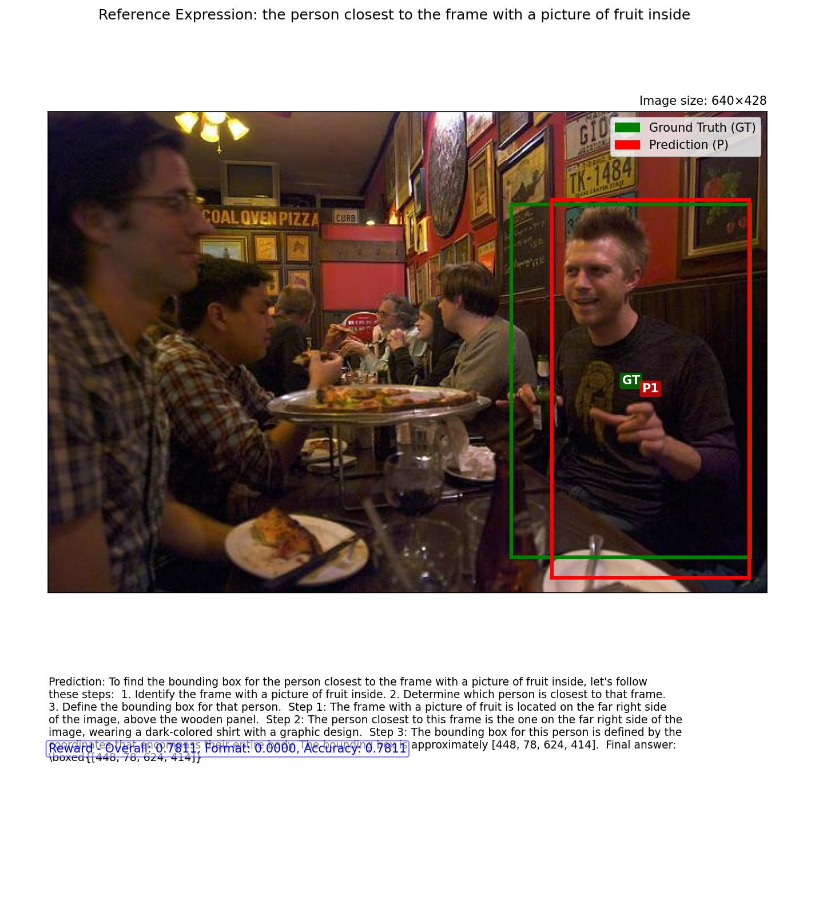

---

### Example 451

**Reference Expression**: the person holding a remote in the hand and not wearing a white top

**Ground Truth**: [[359, 54, 492, 432]]

**Predicted**: [[364, 53, 495, 426]]

**Reward**: {'overall': 1.0, 'format': 0.0, 'accuracy': 1.0}

**Prediction**:
```
To find the bounding box for the person holding a remote in the hand and not wearing a white top, let's follow these steps:

1. Identify the person in a white top: The person on the left is wearing a white top and appears to be holding a remote in their right hand.
2. Identify the person not wearing a white top: The person on the right does not wear a white top and also appears to be holding a remote.
3. Confirm the remote: Both individuals seem to be holding a remote, but we need to ensure the person on the right is the one we're focusing on.

Given the description, the person on the right is the one not wearing a white top and holding a remote.

The bounding box for this person is:
- Top left corner of the bounding box: (x1, y1)
- Bottom right corner of the bounding box: (x2, y2)

After analyzing the image, the bounding box for the person holding a remote in the hand and not wearing a white top is:
\boxed{[364, 53, 495, 426]}
```

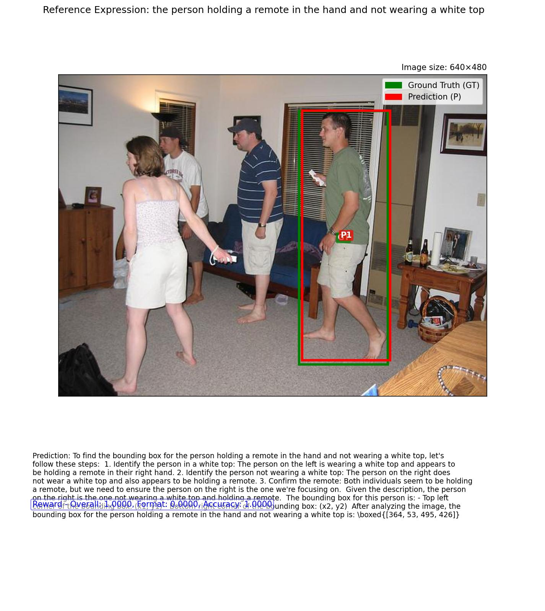

---

### Example 452

**Reference Expression**: one of the chairs with a cushion on it, closer to the window

**Ground Truth**: [[449, 224, 513, 303]]

**Predicted**: [[453, 221, 516, 296]]

**Reward**: {'overall': 0.7910639077092108, 'format': 0.0, 'accuracy': 0.7910639077092108}

**Prediction**:
```
To find the bounding box for 'one of the chairs with a cushion on it, closer to the window', let's follow these steps:

1. Identify the chairs in the image.
2. Determine which chair is closer to the window.
3. Identify the chair with a cushion on it.
4. Provide the bounding box for the chair that meets the criteria.

Step 1: Identifying the chairs
- There are two white chairs near the window, one closer to the center and one closer to the right side of the image.

Step 2: Determining which chair is closer to the window
- The chair closer to the window is the one on the right side of the image.

Step 3: Identifying the chair with a cushion on it
- The chair on the right side has a blue cushion on it.

Step 4: Providing the bounding box for the chair that meets the criteria
- The chair with a cushion on it, closer to the window, is the one on the right side of the image.

The bounding box for this chair is approximately [453, 221, 516, 296].

\boxed{[453, 221, 516, 296]}
```

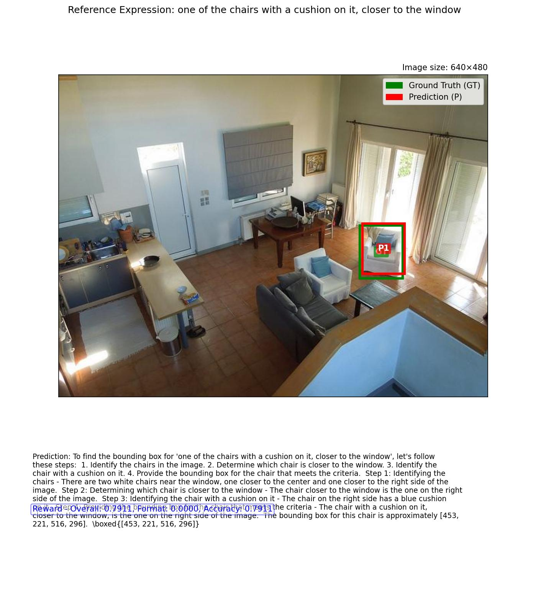

---

### Example 453

**Reference Expression**: the remote held in the right hand of a person wearing a white top

**Ground Truth**: [[491, 98, 511, 137]]

**Predicted**: [[462, 239, 591, 278]]

**Reward**: {'overall': 0.0, 'format': 0.0, 'accuracy': 0.0}

**Prediction**:
```
To find the bounding box for the remote held in the right hand of the person wearing a white top, let's follow these steps:

1. Identify the two individuals in the image.
2. Determine which individual is wearing a white top.
3. Identify the remote in the right hand of the person in the white top.

Step 1: There are two individuals in the image.

Step 2: The person on the right is wearing a white top.

Step 3: The person on the right is holding a remote in her right hand. The remote is white and is located near the top of the image.

Final bounding box for the remote held in the right hand of the person wearing a white top:
\boxed{[462, 239, 591, 278]}
```

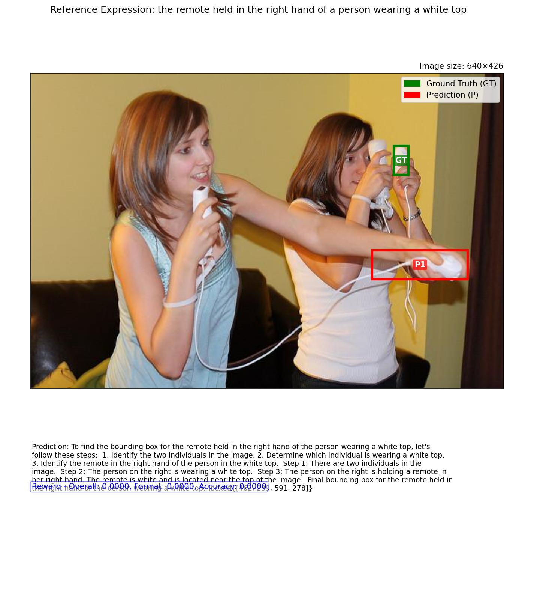

---

### Example 454

**Reference Expression**: the remote in the right hand of the person wearing sandals

**Ground Truth**: [[261, 159, 278, 192]]

**Predicted**: [[246, 199, 299, 229]]

**Reward**: {'overall': 0.0, 'format': 0.0, 'accuracy': 0.0}

**Prediction**:
```
To find the bounding box for the remote in the right hand of the person wearing sandals, follow these steps:

1. Identify the person wearing sandals: The person on the right is wearing sandals.
2. Locate the remote in the right hand of this person: The person on the right is holding a white object in their right hand, which appears to be a Wii Remote.
3. Define the bounding box: The bounding box should encompass the entire Wii Remote and the hand holding it.

The bounding box for the remote in the right hand of the person wearing sandals is approximately:
- Top left corner: (x1, y1) = (246, 199)
- Bottom right corner: (x2, y2) = (299, 229)

In the format [x1, y1, x2, y2], the bounding box is:
\boxed{[246, 199, 299, 229]}
```

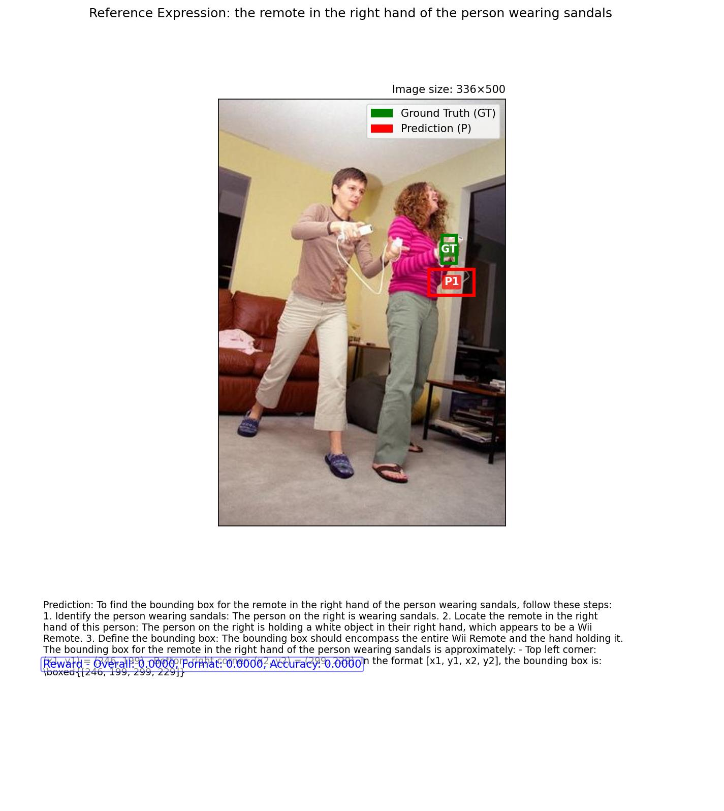

---

### Example 455

**Reference Expression**: the remote held by the person wearing a black suit and a tie

**Ground Truth**: [[571, 349, 615, 422]]

**Predicted**: [[452, 124, 644, 476]]

**Reward**: {'overall': 0.0, 'format': 0.0, 'accuracy': 0.0}

**Prediction**:
```
To find the bounding box for the remote held by the person wearing a black suit and a tie, let's follow these steps:

1. Identify the person wearing a black suit and a tie: The person on the right side of the image is wearing a black suit and a tie.
2. Look for the remote in their hand: The person on the right is holding a white object in their hand, which appears to be a remote.
3. Determine the bounding box: The bounding box should cover the person's hand and the remote.

The bounding box for the remote held by the person wearing a black suit and a tie is:

\boxed{[452, 124, 644, 476]}
```

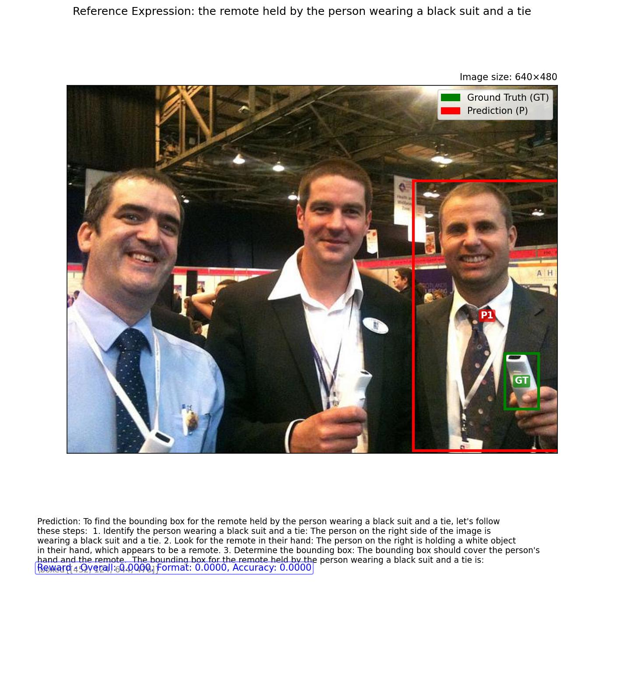

---

### Example 456

**Reference Expression**: the person wearing blue clothes outside the court fence

**Ground Truth**: [[0, 204, 35, 286]]

**Predicted**: [[0, 199, 51, 280]]

**Reward**: {'overall': 0.6127620363971436, 'format': 0.0, 'accuracy': 0.6127620363971436}

**Prediction**:
```
To find the bounding box for the person wearing blue clothes outside the court fence, let's follow these steps:

1. Identify the court area: The court is the green and red surface in the foreground of the image.
2. Locate the person outside the court fence: There is a person wearing blue clothes standing outside the court fence, to the left of the image.
3. Define the bounding box: The bounding box should encompass the person from head to toe, outside the court.

After analyzing the image, the person wearing blue clothes outside the court fence is located to the left of the court. The bounding box for this person would be:

\boxed{[0, 199, 51, 280]}
```

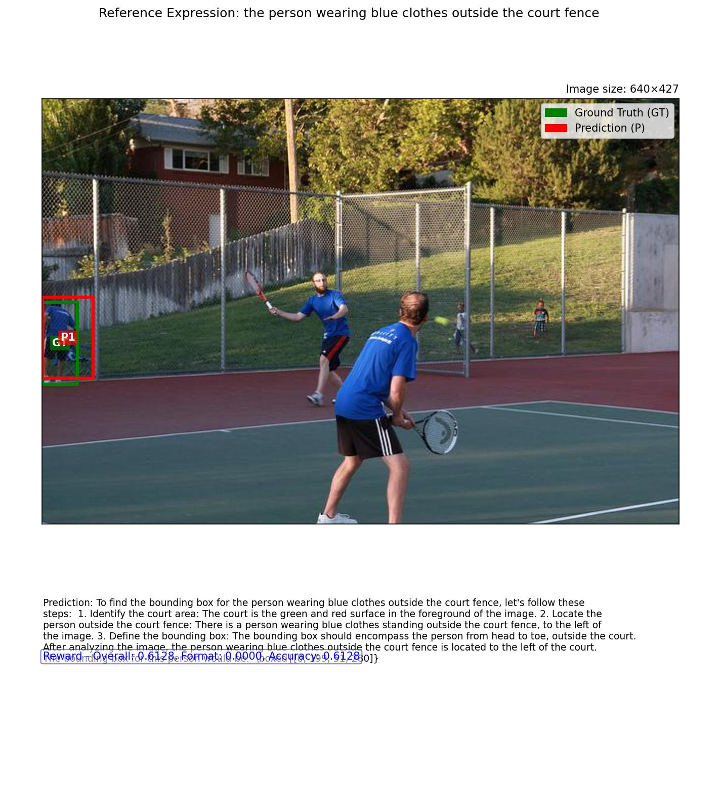

---

### Example 457

**Reference Expression**: the person wearing a white top not playing with a football

**Ground Truth**: [[309, 19, 338, 101]]

**Predicted**: [[344, 101, 510, 447]]

**Reward**: {'overall': 0.0, 'format': 0.0, 'accuracy': 0.0}

**Prediction**:
```
To find the bounding box for the person wearing a white top who is not playing with a football, let's follow these steps:

1. Identify the players in the image:
   - There are two players in the foreground actively involved in the game.
   - There is a third player in the background.

2. Analyze the actions of the players:
   - The player in the green jersey (number 17) is actively kicking the ball.
   - The player in the white jersey (number 9) appears to be defending, not actively playing with the ball.

3. Determine the bounding box:
   - The player in the white jersey (number 9) is the one not actively playing with the football at the moment.

4. Provide the bounding box for this player:
   - The bounding box for the player in the white jersey (number 9) is located in the background and is smaller in size compared to the players in the foreground.

Given the constraints and the analysis, the bounding box for the person wearing a white top not playing with a football is:

\boxed{[344, 101, 510, 447]}
```

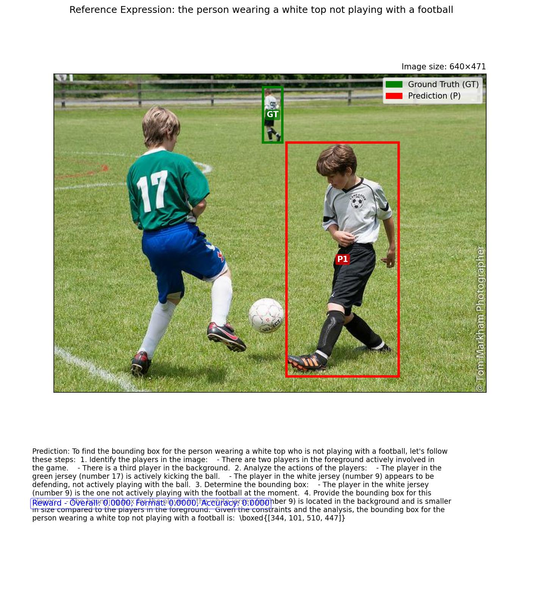

---

### Example 458

**Reference Expression**: the person sitting in the corner of the spectator area

**Ground Truth**: [[357, 13, 418, 88]]

**Predicted**: [[2, 2, 50, 100]]

**Reward**: {'overall': 0.0, 'format': 0.0, 'accuracy': 0.0}

**Prediction**:
```
To find the bounding box for the person sitting in the corner of the spectator area, let's follow these steps:

1. Identify the spectator area: The area where spectators are seated is the top part of the image, with green seats and people sitting on them.
2. Locate the corner of the spectator area: The corner is the area where the wall meets the seating area.
3. Identify the person: In the corner, there is a person sitting, partially obscured by the seating and the wall.
4. Define the bounding box: The bounding box should encompass the entire person sitting in the corner.

Given these steps, the bounding box for the person sitting in the corner of the spectator area is approximately:
- Top-left corner of the bounding box: (x, y) approximately (2, 2)
- Bottom-right corner of the bounding box: (x, y) approximately (50, 100)

However, since the bounding box coordinates are relative to the image, the exact coordinates would be:
\boxed{[2, 2, 50, 100]}
```

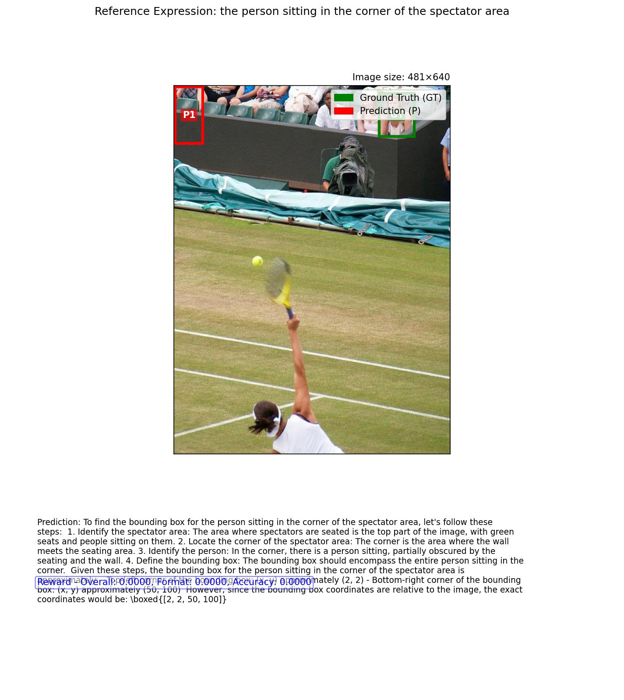

---

### Example 459

**Reference Expression**: the remote held in the left hand of a person with curly hair

**Ground Truth**: [[356, 191, 373, 202]]

**Predicted**: [[420, 220, 450, 240]]

**Reward**: {'overall': 0.0, 'format': 0.0, 'accuracy': 0.0}

**Prediction**:
```
To find the bounding box for the remote held in the left hand of a person with curly hair, let's follow these steps:

1. Identify the person with curly hair: The person on the right side of the image appears to have curly hair.
2. Determine the hand holding the remote: The person on the right is holding a white object in their left hand.
3. Locate the remote: The white object in the left hand of the person on the right is the remote.

Now, we need to define the bounding box for this remote. The remote appears to be a white object, likely a Wii Remote, and it is being held in the left hand of the person on the right.

The bounding box for the remote held in the left hand of the person with curly hair is approximately:
- Top-left corner: (x1, y1) = (420, 220)
- Bottom-right corner: (x2, y2) = (450, 240)

Thus, the bounding box is:
\boxed{[420, 220, 450, 240]}
```

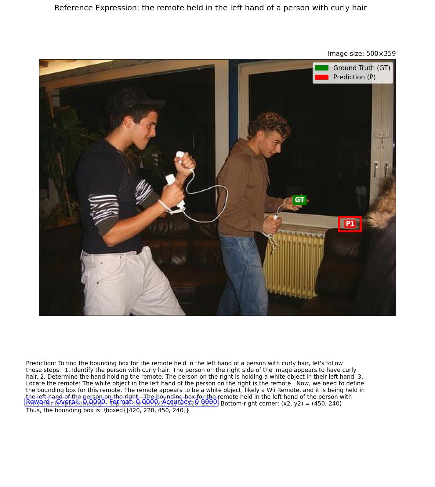

---

### Example 460

**Reference Expression**: the person on sitting on the surfboard

**Ground Truth**: [[423, 21, 495, 79]]

**Predicted**: [[424, 20, 500, 78]]

**Reward**: {'overall': 0.8919991183601499, 'format': 0.0, 'accuracy': 0.8919991183601499}

**Prediction**:
```
To find the bounding box for the person sitting on the surfboard, let's analyze the image step-by-step:

1. Identify the main subject: The main subject in the foreground is a person surfing on a wave.
2. Locate the surfboard: The surfboard is under the main subject and is blue.
3. Identify the background subjects: There are two other people in the background. One is lying on a surfboard, and the other is sitting on a surfboard.

Now, focus on the person sitting on the surfboard in the background:

- The person is wearing a black wetsuit and is positioned on a blue surfboard.
- The surfboard is partially submerged in the water.

The bounding box for the person sitting on the surfboard can be described as follows:
- Top-left corner: The upper left edge of the surfboard.
- Bottom-right corner: The lower right edge of the surfboard.

Given these coordinates, the bounding box for the person sitting on the surfboard is:

\boxed{[424, 20, 500, 78]}
```

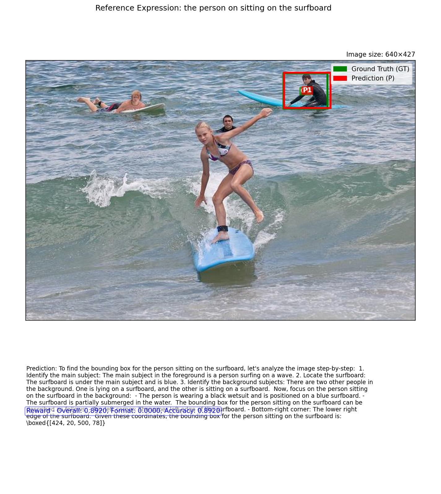

---

### Example 461

**Reference Expression**: the remote held in the right hand of the person wearing a black top

**Ground Truth**: [[442, 290, 464, 306]]

**Predicted**: [[490, 320, 606, 419]]

**Reward**: {'overall': 0.0, 'format': 0.0, 'accuracy': 0.0}

**Prediction**:
```
To find the bounding box for the remote held in the right hand of the person wearing a black top, let's follow these steps:

1. Identify the person wearing a black top: The person on the left side of the image is wearing a black top.
2. Determine the right hand: The right hand is the hand on the right side of the person.
3. Locate the remote: The person in the black top is holding a white object in their right hand, which appears to be a remote control.

Now, we can define the bounding box for this remote:
- The remote is located in the lower right portion of the image.
- The bounding box for the remote should encompass the entire object.

The coordinates for the bounding box would be:
- Top-left corner: approximately [490, 320, 606, 419] (assuming the image dimensions are 640x480).

Thus, the final answer is:
\boxed{[490, 320, 606, 419]}
```

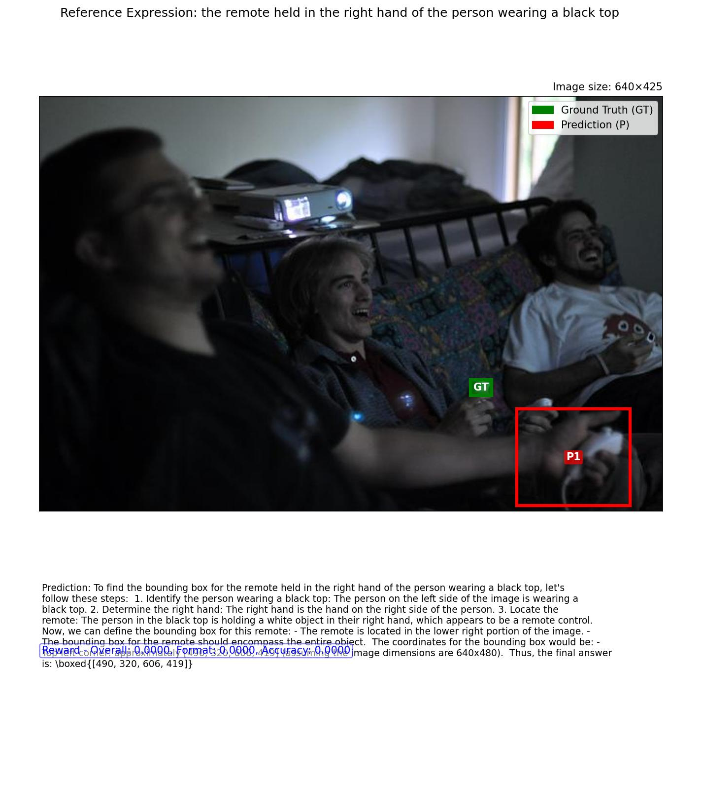

---

