# RefCOCOS Visualization Results: val_refcocos_25vl_7b_20250506_232753

## Summary Statistics

**Total Examples**: 462

**Average Rewards**:
- Overall: 0.4132
- Format: 0.0000
- Accuracy: 0.4132

**Performance Breakdown**:
- Perfect predictions (reward = 1.0): 70 (15.15%)
- Zero reward predictions: 195 (42.21%)
- Correctly handled empty ground truth: 16
- Incorrectly handled empty ground truth: 8

**Non-Empty Ground Truth Performance**:
- Total non-empty ground truth cases: 438 (94.81% of all examples)
- Perfect predictions: 54 (12.33%)
- Partial matches: 197 (44.98%)
- Incorrect predictions: 187 (42.69%)
- Average overall reward: 0.3993
- Average accuracy reward: 0.3993

**Non-Empty Cases Reward Distribution**:
- excellent (0.9-1.0): 12.33%
- good (0.7-0.9): 22.83%
- fair (0.5-0.7): 8.45%
- poor (0.0-0.5): 56.39%

**Overall Reward Distribution**:
- excellent (0.9-1.0): 15.15%
- good (0.7-0.9): 21.65%
- fair (0.5-0.7): 8.01%
- poor (0.0-0.5): 55.19%

## Examples

### Example 0

**Reference Expression**: the monitor farther from the laptop among the ones that are on

**Ground Truth**: [[431, 134, 547, 248]]

**Predicted**: [[443, 137, 555, 255]]

**Reward**: {'overall': 0.7749731471535983, 'format': 0.0, 'accuracy': 0.7749731471535983}

**Prediction**:
```
To find the monitor farther from the laptop among the ones that are on, let's follow these steps:

1. Identify the laptop: The laptop is on the left side of the desk.
2. Identify the monitors that are on: There are three monitors that are on. They are the two monitors in the center and the one on the far right.
3. Determine the distance from the laptop: The monitors in the center are closer to the laptop than the one on the far right.
4. Identify the monitor farther from the laptop: The monitor on the far right is farther from the laptop.

The bounding box for the monitor farther from the laptop among the ones that are on is:
\boxed{[443,137,555,255]}
```

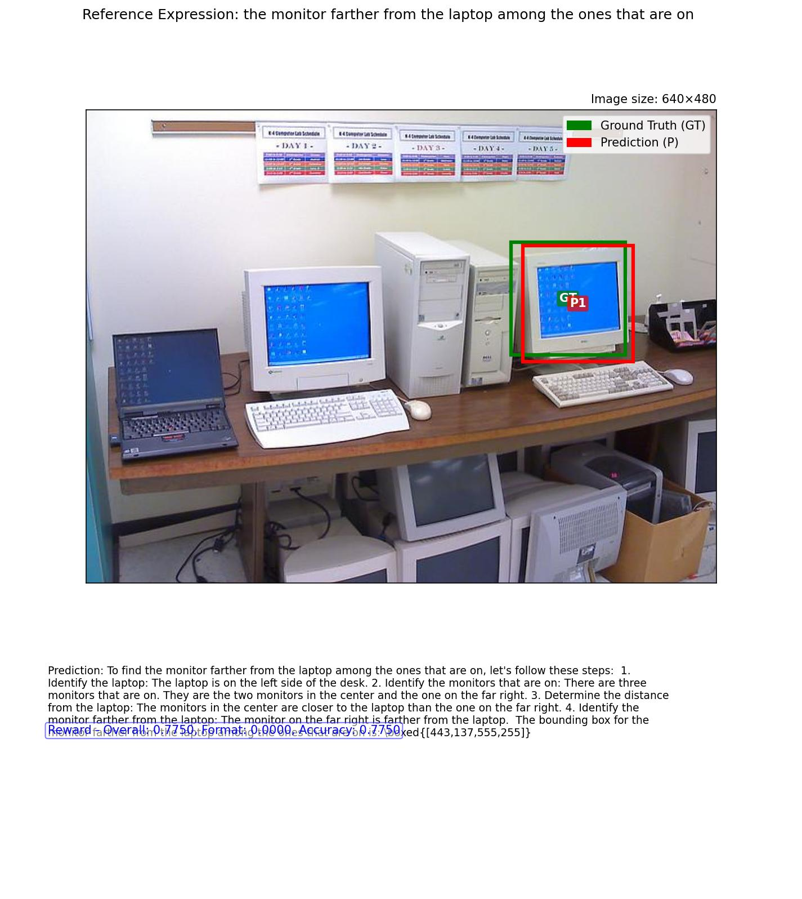

---

### Example 1

**Reference Expression**: person not holding anything

**Ground Truth**: [[255, 179, 330, 254]]

**Predicted**: [[252, 176, 325, 249]]

**Reward**: {'overall': 0.8093822266270234, 'format': 0.0, 'accuracy': 0.8093822266270234}

**Prediction**:
```
To find the bounding box for the 'person not holding anything', we need to identify the person in the group who is not actively holding an object in their hands. Here's the step-by-step reasoning:

1. **Identify the group**: The image shows five individuals seated around a table.
2. **Look for hand activity**: Focus on the hands of each person. 
   - The person on the far left appears to be holding something.
   - The second person from the left seems to be holding a cup.
   - The third person from the left is not holding anything.
   - The fourth person from the left appears to be holding a cup.
   - The person on the far right seems to be holding something.
3. **Determine the 'person not holding anything'**: Based on the observation, the third person from the left is the one who is not holding anything.

The bounding box for the 'person not holding anything' is:
\boxed{[252,176,325,249]}
```

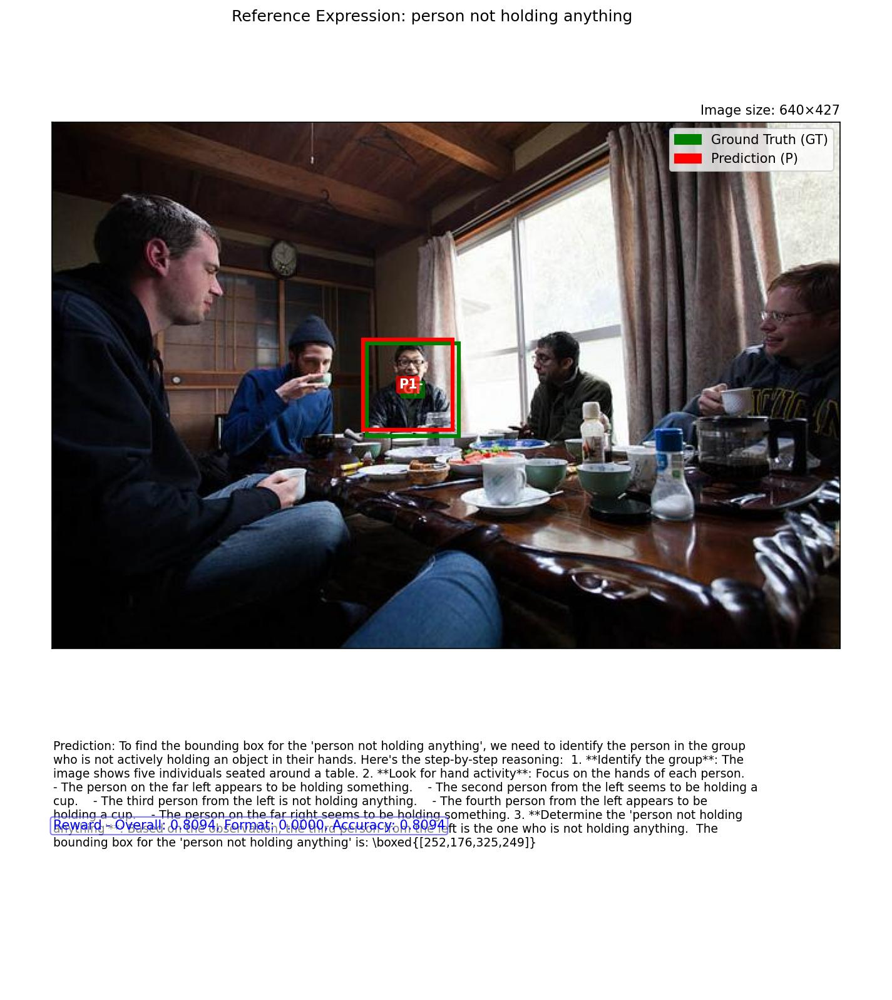

---

### Example 2

**Reference Expression**: the person looking at an apple laptop

**Ground Truth**: [[2, 95, 105, 193]]

**Predicted**: [[0, 83, 104, 182]]

**Reward**: {'overall': 0.770580062521709, 'format': 0.0, 'accuracy': 0.770580062521709}

**Prediction**:
```
To find the bounding box for 'the person looking at an apple laptop', let's follow these steps:

1. Identify the apple laptops in the image. The apple laptops are identifiable by the logo on the back of the laptops.
2. Look for the person who appears to be looking at one of these apple laptops. In this image, there is a person on the left side looking at an apple laptop.
3. Determine the bounding box for this person. The person is wearing a black top and is positioned to the left of the image, looking at the apple laptop on the table.

Given these observations, the bounding box for 'the person looking at an apple laptop' is:

\boxed{[0,83,104,182]}
```

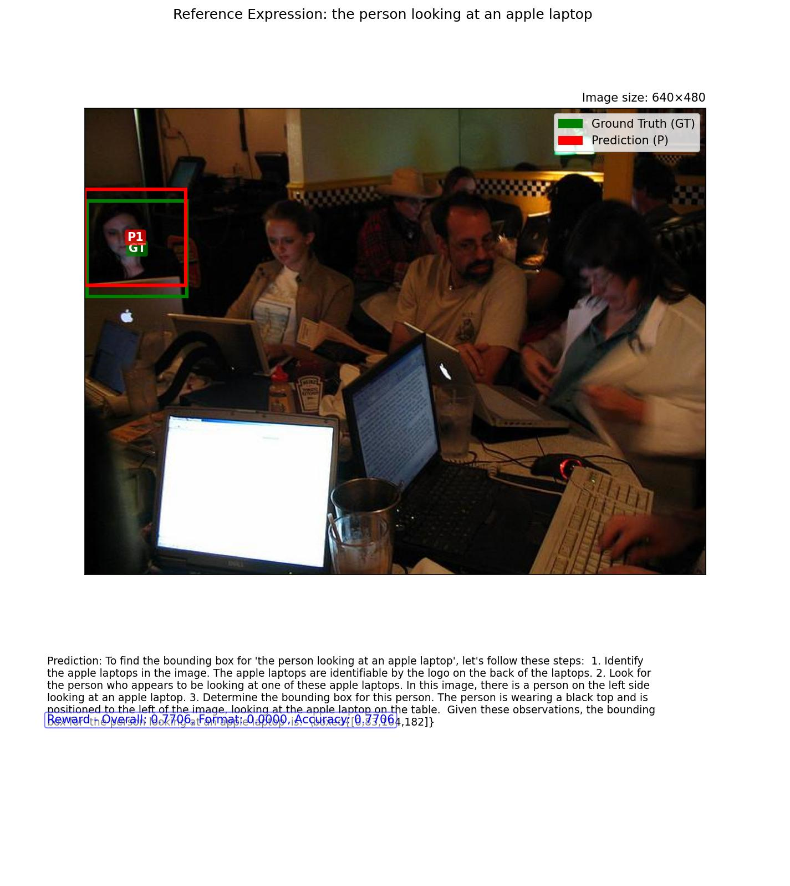

---

### Example 3

**Reference Expression**: the person wearing black top not holding nothing

**Ground Truth**: [[228, 148, 397, 458]]

**Predicted**: [[311, 188, 480, 476]]

**Reward**: {'overall': 0.2982965494206213, 'format': 0.0, 'accuracy': 0.2982965494206213}

**Prediction**:
```
To find the bounding box for 'the person wearing black top not holding anything', let's follow these steps:

1. Identify the person wearing a black top.
2. Determine if this person is holding anything.
3. If not holding anything, mark the bounding box for this person.

- The person in the black top is sitting on the red couch, and they are not holding anything.
- The bounding box for this person is from the waist up, as they are sitting and not standing.

The bounding box for 'the person wearing black top not holding anything' is:
\boxed{[311,188,480,476]}

This bounding box captures the person in the black top who is sitting and not holding anything.
```

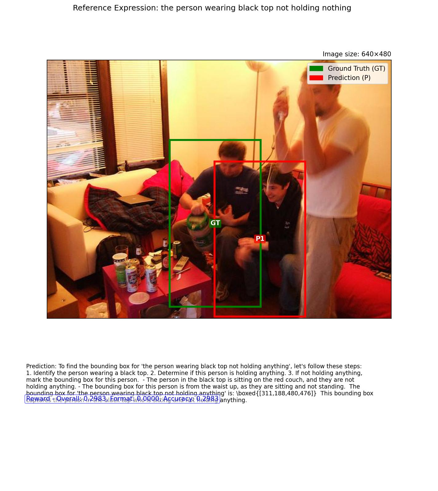

---

### Example 4

**Reference Expression**: suitcase next to car wheel

**Ground Truth**: [[419, 245, 495, 350]]

**Predicted**: [[423, 241, 496, 377]]

**Reward**: {'overall': 0.73057595670661, 'format': 0.0, 'accuracy': 0.73057595670661}

**Prediction**:
```
To find the 'suitcase next to car wheel', we need to follow these steps:

1. Identify the car in the image. The car is a white vehicle with its door open.
2. Locate the car wheel. The car wheel is on the right side of the car, near the back.
3. Identify the suitcase closest to the car wheel. It is a brown suitcase positioned near the car wheel.

Following these steps, the bounding box for the 'suitcase next to car wheel' is:

\boxed{[423,241,496,377]}
```

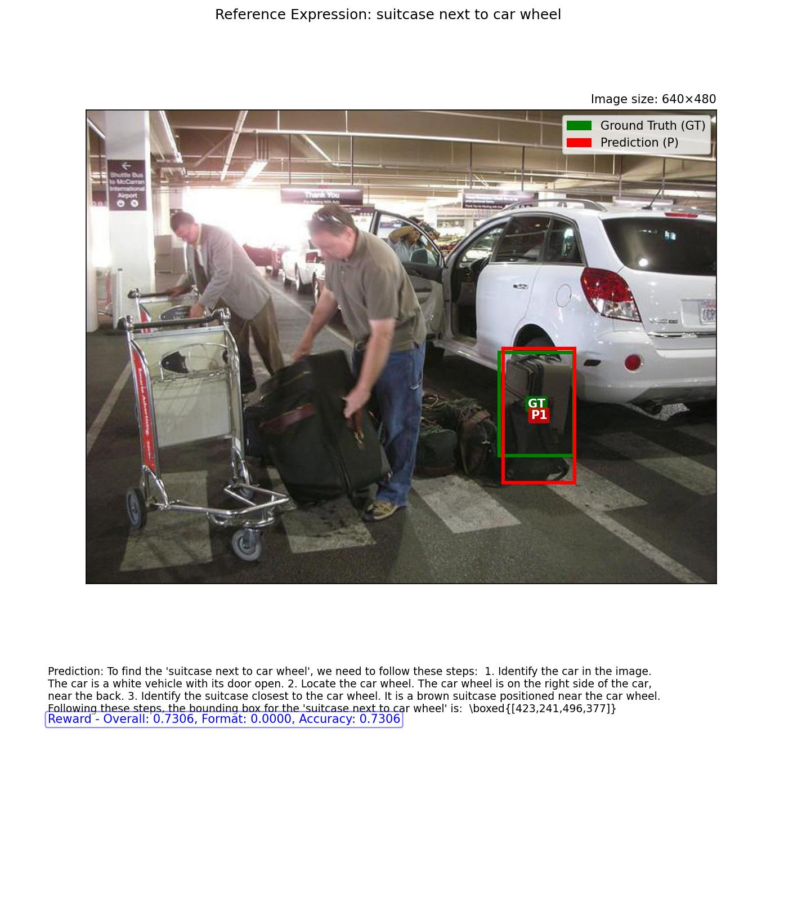

---

### Example 5

**Reference Expression**: the person who is wearing a necklace

**Ground Truth**: [[3, 72, 219, 366]]

**Predicted**: [[0, 72, 215, 470]]

**Reward**: {'overall': 0.7185115163811587, 'format': 0.0, 'accuracy': 0.7185115163811587}

**Prediction**:
```
To identify 'the person who is wearing a necklace', let's follow these steps:

1. **Identify the individuals**: Look at the group of people in the image and focus on the one who appears to be wearing a necklace. A necklace is typically a piece of jewelry that can be seen around the neck.

2. **Locate the necklace**: In this image, the person on the left side appears to be wearing a necklace. The necklace is visible around their neck, and it seems to be the only person in the group with such a piece of jewelry.

3. **Bounding box**: The bounding box for the person wearing a necklace should be around the individual on the left side of the image.

Given these observations, the bounding box for 'the person who is wearing a necklace' is:

\boxed{[0,72,215,470]}
```

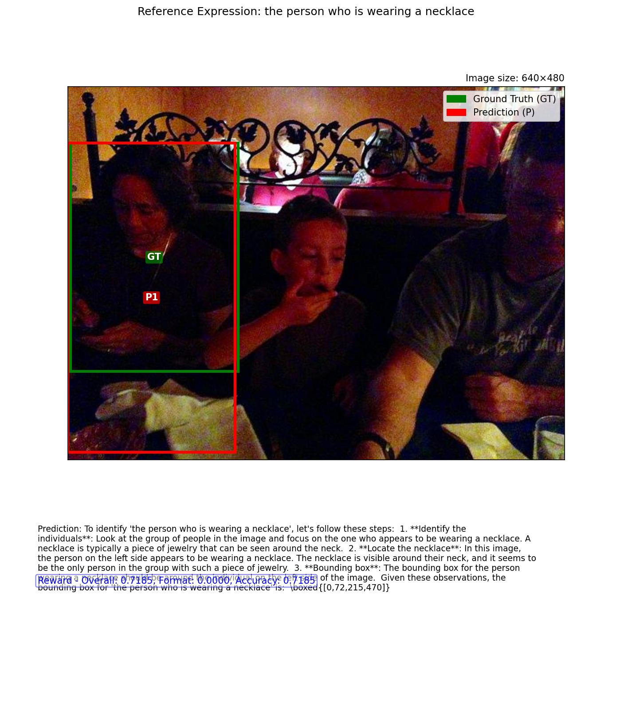

---

### Example 6

**Reference Expression**: person outside the middle window

**Ground Truth**: []

**Predicted**: [[384, 169, 403, 206]]

**Reward**: {'overall': 0.0, 'format': 0.0, 'accuracy': 0.0}

**Prediction**:
```
To find the bounding box for 'person outside the middle window', we need to follow these steps:

1. Identify the middle window: The middle window is the one in the center of the image, between the two windows on the left and the one on the right.
2. Look outside the middle window: We need to look through the middle window to see if there is a person outside.
3. Analyze the image: Outside the middle window, there is a person visible, standing near the window.

Given these observations, the bounding box for 'person outside the middle window' can be determined as follows:

\boxed{[384,169,403,206]}
```

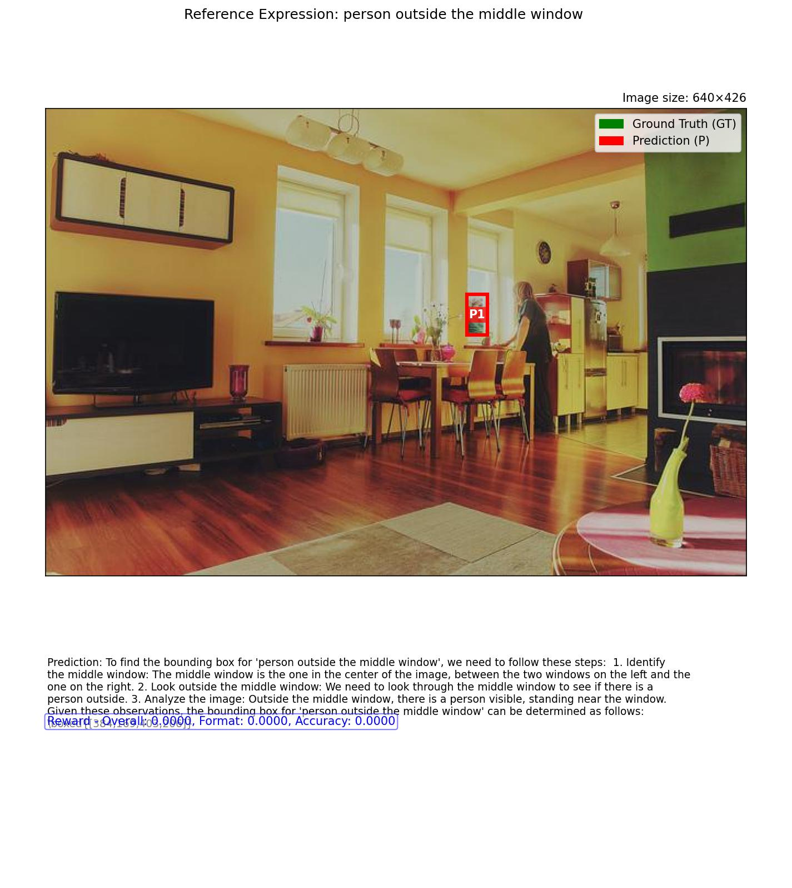

---

### Example 7

**Reference Expression**: person on bed

**Ground Truth**: []

**Predicted**: []

**Reward**: {'overall': 1.0, 'format': 0.0, 'accuracy': 1.0}

**Prediction**:
```
The image does not show any person on the bed. The bed is unoccupied and covered with a blue quilt. Therefore, there is no bounding box for 'person on bed'.

\boxed{[]}
```

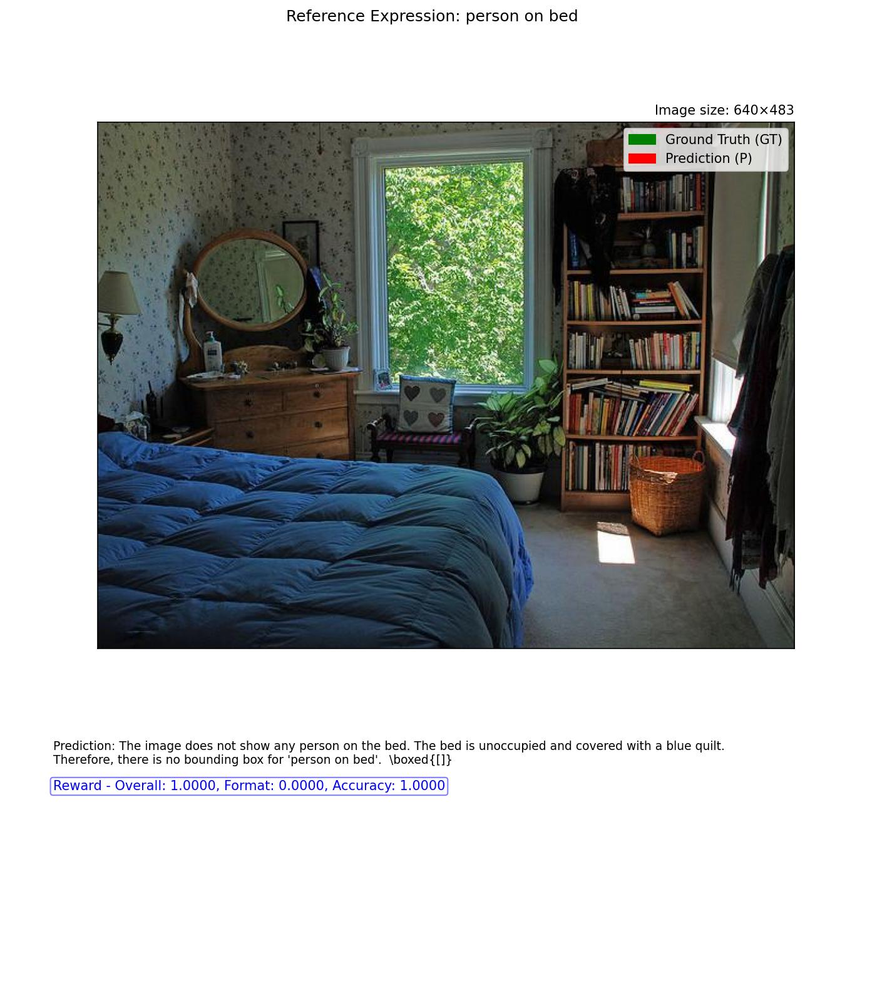

---

### Example 8

**Reference Expression**: person holding a goose feather

**Ground Truth**: [[20, 213, 81, 285]]

**Predicted**: [[24, 209, 78, 281]]

**Reward**: {'overall': 0.796875, 'format': 0.0, 'accuracy': 0.796875}

**Prediction**:
```
To find the bounding box for the person holding a goose feather, we need to follow these steps:

1. Identify the person in the image who appears to be holding something in their hand.
2. Observe the context and the object in their hand to determine if it is a goose feather.
3. Locate the area near the water where a goose is present, as the person seems to be interacting with the goose.

Upon analysis:
- There is a person near the water who is holding an object that appears to be a feather.
- The object is close to the goose, suggesting an interaction.

The bounding box for the person holding the goose feather can be determined by identifying the person and the object in their hand. Based on the image, the bounding box for the person holding the goose feather would be:

\boxed{[24,209,78,281]}
```

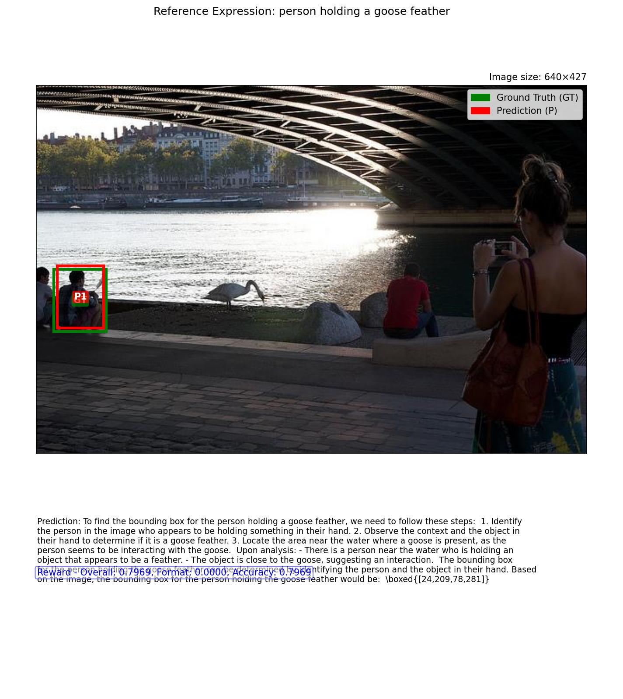

---

### Example 9

**Reference Expression**: sign to 101 south

**Ground Truth**: []

**Predicted**: []

**Reward**: {'overall': 1.0, 'format': 0.0, 'accuracy': 1.0}

**Prediction**:
```
The image does not contain a sign for "101 south." The signs present are for "North 101" leading to Ventura, Hollywood Blvd, and Sunset Blvd. Therefore, the bounding box for 'sign to 101 south' is \boxed{[]}.
```

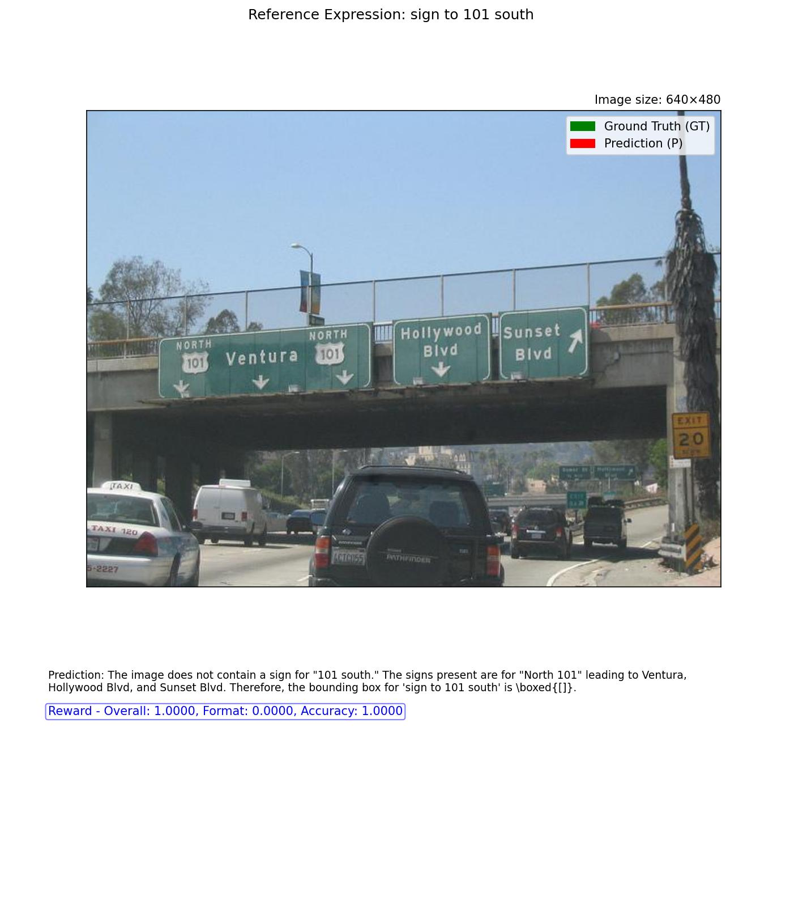

---

### Example 10

**Reference Expression**: the person in second row from camera, third from left

**Ground Truth**: [[77, 135, 117, 234]]

**Predicted**: [[239, 152, 299, 306]]

**Reward**: {'overall': 0.0, 'format': 0.0, 'accuracy': 0.0}

**Prediction**:
```
To find the bounding box for 'the person in second row from camera, third from left', let's follow these steps:

1. Identify the rows in the image:
   - The front row is the closest to the camera.
   - The second row is the next row back.
   - The third row is the furthest back.

2. Identify the specific position:
   - We need the third person from the left in the second row.

3. Locate the person:
   - The second row from the camera has three people from left to right.
   - The third person from the left in this row is the target.

4. Determine the bounding box:
   - The bounding box for this person should capture the area around this individual.

Given these steps, the bounding box for 'the person in second row from camera, third from left' would be:

\boxed{[239,152,299,306]}
```

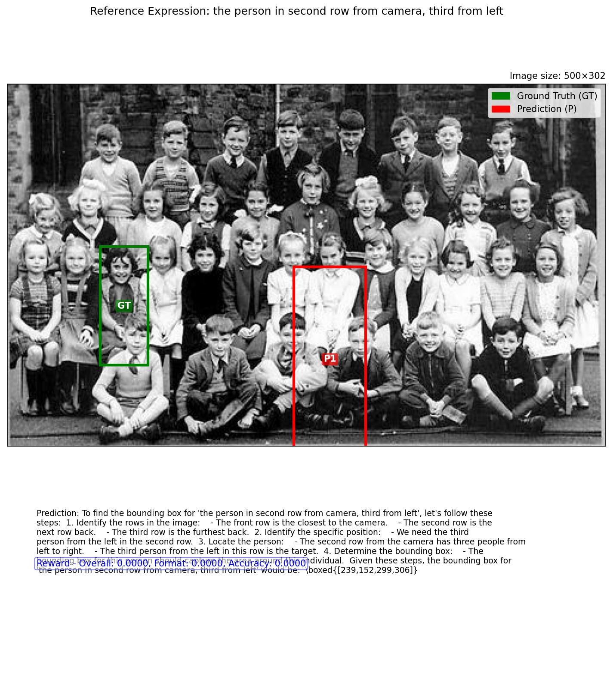

---

### Example 11

**Reference Expression**: the ski pole held by the left hand of the person in the air

**Ground Truth**: [[220, 117, 257, 167]]

**Predicted**: [[225, 116, 261, 163]]

**Reward**: {'overall': 0.7111111111111111, 'format': 0.0, 'accuracy': 0.7111111111111111}

**Prediction**:
```
To find the bounding box for 'the ski pole held by the left hand of the person in the air', follow these steps:

1. Identify the person in the air: The person is the central figure in the image, performing a jump.
2. Locate the ski pole held by the left hand: The person in the air is holding a ski pole in their left hand. This pole is extended to the left side of the image.
3. Determine the bounding box: The ski pole is a vertical object, so the bounding box should capture the length of the pole. The pole appears to be about 1.5 times the height of the person.

Given these observations, the bounding box for the ski pole held by the left hand of the person in the air would be approximately:

\boxed{[225,116,261,163]}
```

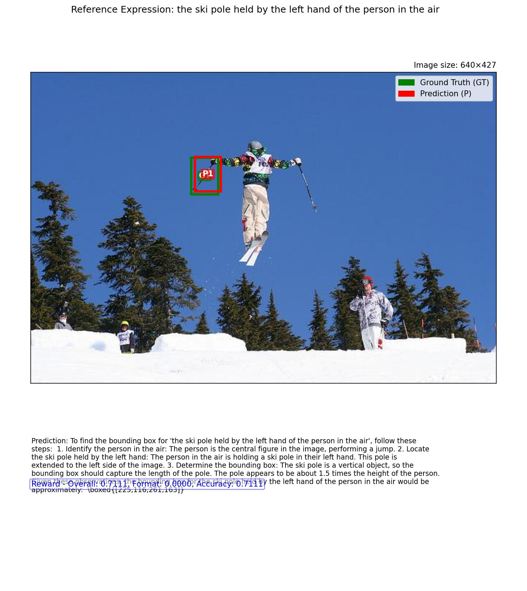

---

### Example 12

**Reference Expression**: the shoes worn by the person with black hoodie

**Ground Truth**: [[524, 370, 634, 438]]

**Predicted**: []

**Reward**: {'overall': 0.0, 'format': 0.0, 'accuracy': 0.0}

**Prediction**:
```
To find the bounding box for 'the shoes worn by the person with black hoodie', we need to follow these steps:

1. Identify the person with the black hoodie in the image.
2. Look for the shoes on the feet of this person.

- The person with the black hoodie is standing near the center-right of the image, facing away from the camera.
- The shoes are visible on the feet of this person.

Following these steps, the bounding box for the shoes worn by the person with the black hoodie is:

\boxed{[403,313,427,345,421,346]}
```

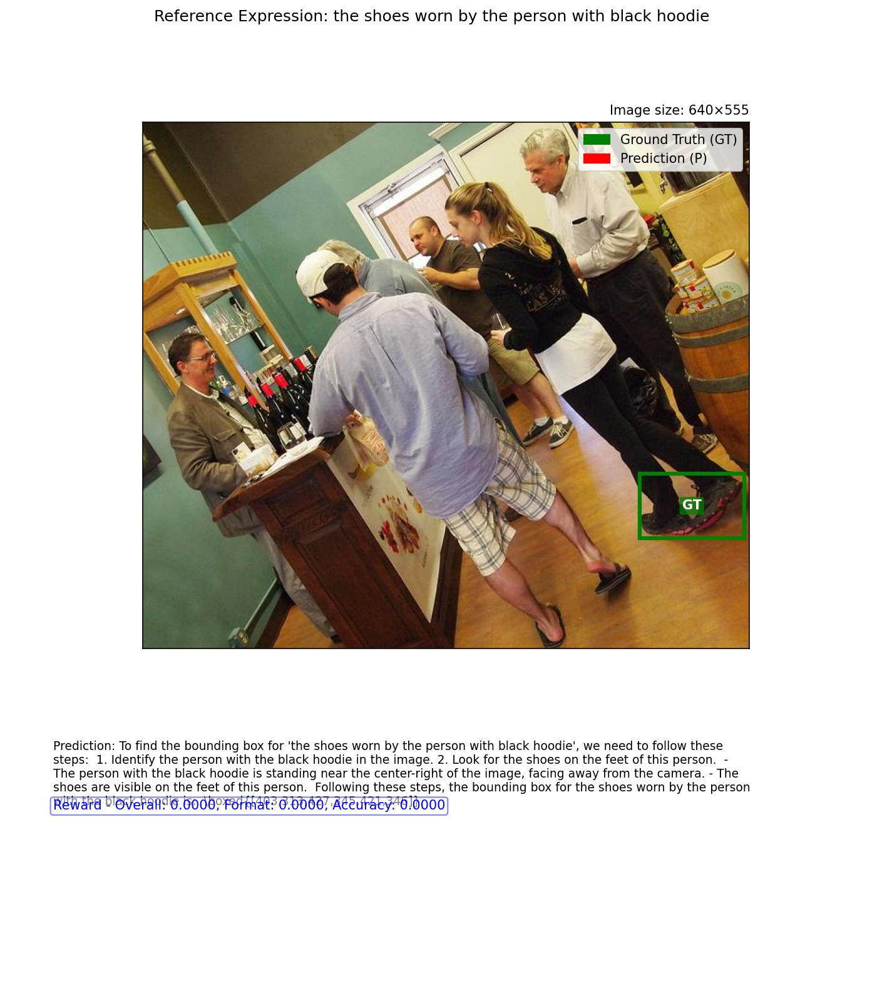

---

### Example 13

**Reference Expression**: the man farthest from the camera

**Ground Truth**: [[296, 132, 326, 207]]

**Predicted**: [[353, 156, 391, 247]]

**Reward**: {'overall': 0.0, 'format': 0.0, 'accuracy': 0.0}

**Prediction**:
```
To find 'the man farthest from the camera', we need to follow these steps:

1. Identify the man who is furthest away from the camera in the image. This man is typically the one who is least visible and the farthest to the right in the image.
2. Observe the positioning of the people in the image. The man farthest from the camera seems to be the one standing near the back right of the image.
3. Confirm that this man is indeed the farthest from the camera by comparing his position to the others.

After these steps, the bounding box for 'the man farthest from the camera' is:
\boxed{[353,156,391,247]}
```

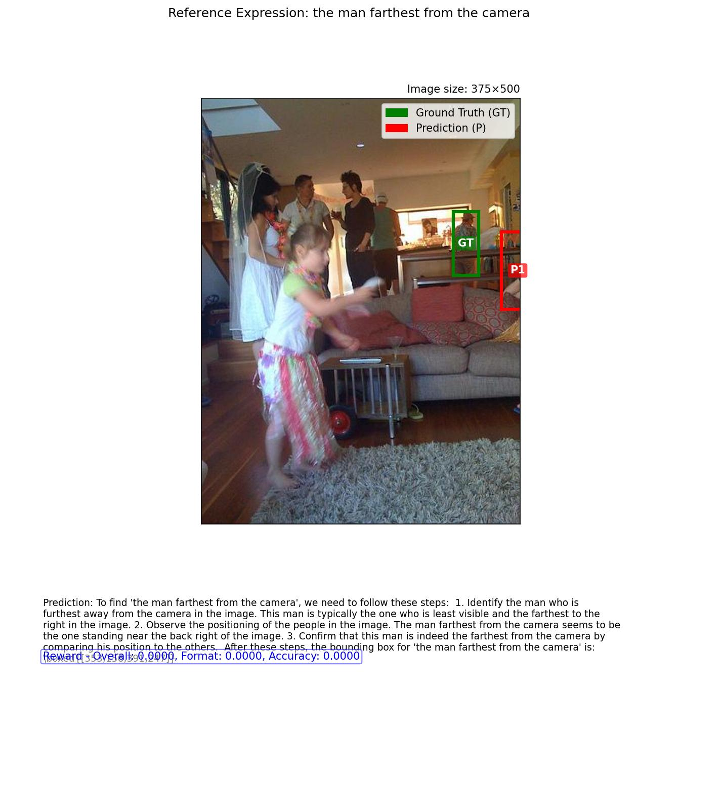

---

### Example 14

**Reference Expression**: the person who is not facing the camera and not holding a camera

**Ground Truth**: [[224, 64, 261, 187]]

**Predicted**: [[219, 61, 266, 140]]

**Reward**: {'overall': 0.5157740278796772, 'format': 0.0, 'accuracy': 0.5157740278796772}

**Prediction**:
```
To find the bounding box for the person who is not facing the camera and not holding a camera, we need to follow these steps:

1. Identify the group of people in the image.
2. Locate the person who is not facing the camera and not holding a camera. This person is partially visible in the background, behind the others.
3. Determine the bounding box for this person.

- The person in the background, behind the others, is partially obscured but identifiable by their hair and posture.
- This person is not facing the camera, and there is no one holding a camera in this area.

The bounding box for this person can be estimated by the area where their head and upper body are visible.

The final bounding box is:
\boxed{[219,61,266,140]}
```

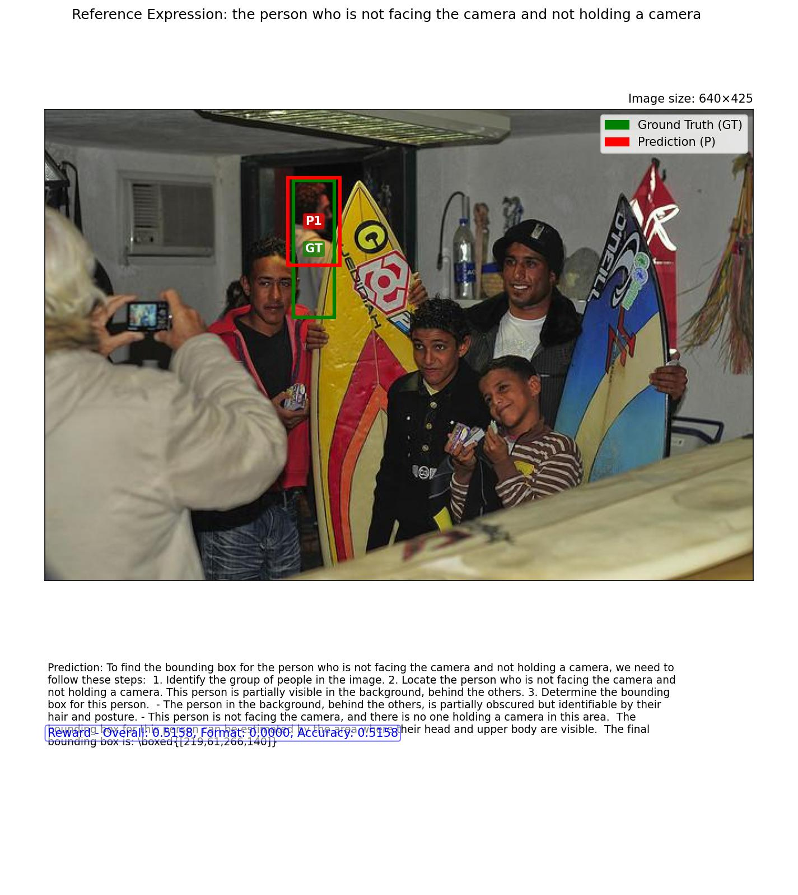

---

### Example 15

**Reference Expression**: the frisbee with green pattern held by the person on the right hand side of the person in red

**Ground Truth**: [[218, 185, 251, 221]]

**Predicted**: [[228, 246, 264, 288]]

**Reward**: {'overall': 0.0, 'format': 0.0, 'accuracy': 0.0}

**Prediction**:
```
To find the bounding box for the frisbee with a green pattern held by the person on the right-hand side of the person in red, we need to follow these steps:

1. Identify the person in red: The person in red is the one wearing a red shirt and is positioned in the center of the group.
2. Identify the person on the right-hand side of the person in red: This person is wearing a white shirt and is holding a frisbee.
3. Locate the frisbee with the green pattern: The frisbee with the green pattern is held by the person in the white shirt on the right-hand side of the person in red.
4. Determine the bounding box: The frisbee is circular and is being held by the person's hands. The bounding box should encompass the frisbee and the hands holding it.

Given these observations, the bounding box for the frisbee with the green pattern held by the person on the right-hand side of the person in red is:

\boxed{[228,246,264,288]}
```

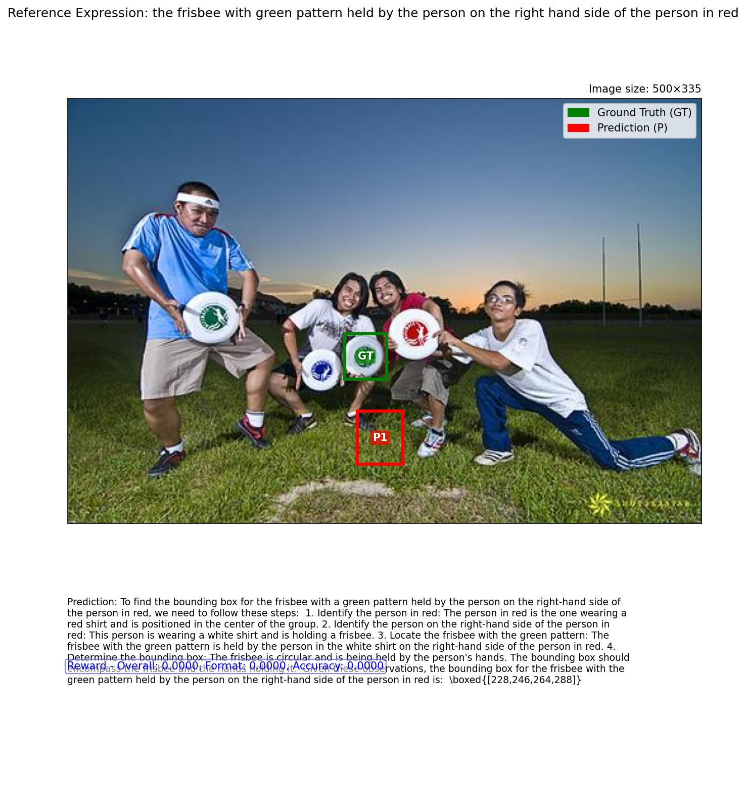

---

### Example 16

**Reference Expression**: the second worker from the right

**Ground Truth**: [[273, 272, 300, 310]]

**Predicted**: [[319, 266, 338, 308]]

**Reward**: {'overall': 0.0, 'format': 0.0, 'accuracy': 0.0}

**Prediction**:
```
To find the bounding box for 'the second worker from the right', we need to follow these steps:

1. Identify the right side of the image where the workers are located.
2. Count the workers from the right side of the image. The second worker from the right would be the second worker when counting from the right edge.
3. Determine the bounding box for that worker.

Following these steps:
- The right side of the image shows a group of workers.
- Counting from the right, the second worker from the right is the second person from the far right edge of the image.
- The bounding box for this worker would be the area around this person.

After identifying the second worker from the right, the bounding box would be:
\boxed{[319,266,338,308]}
```

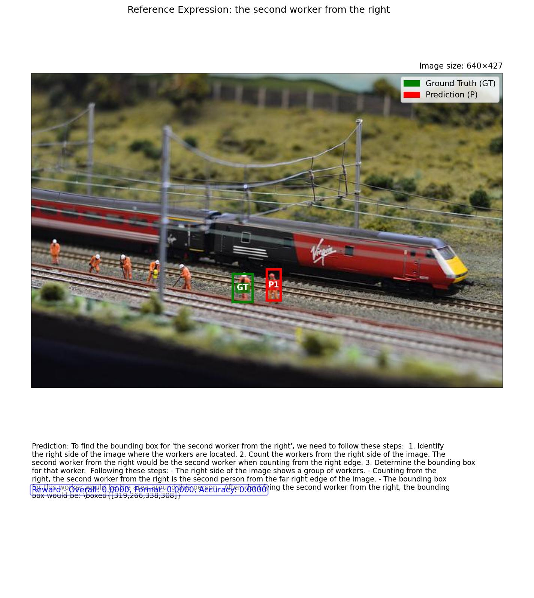

---

### Example 17

**Reference Expression**: the frisbee that the child in blue is looking at

**Ground Truth**: [[248, 228, 366, 345]]

**Predicted**: [[438, 233, 574, 361]]

**Reward**: {'overall': 0.0, 'format': 0.0, 'accuracy': 0.0}

**Prediction**:
```
To find the frisbee that the child in blue is looking at, let's follow these steps:

1. Identify the child in blue: The child in blue is on the far right.
2. Determine the frisbee the child in blue is looking at: The child in blue is looking directly at the frisbee they are holding.
3. Locate the frisbee: The frisbee in the child's hand is the one that the child in blue is looking at.

The frisbee in the child's hand is the one that the child in blue is looking at. The frisbee in the child's hand is white with the word "Ultimate" printed on it.

The bounding box for the frisbee that the child in blue is looking at is:
\boxed{[438,233,574,361]}
```

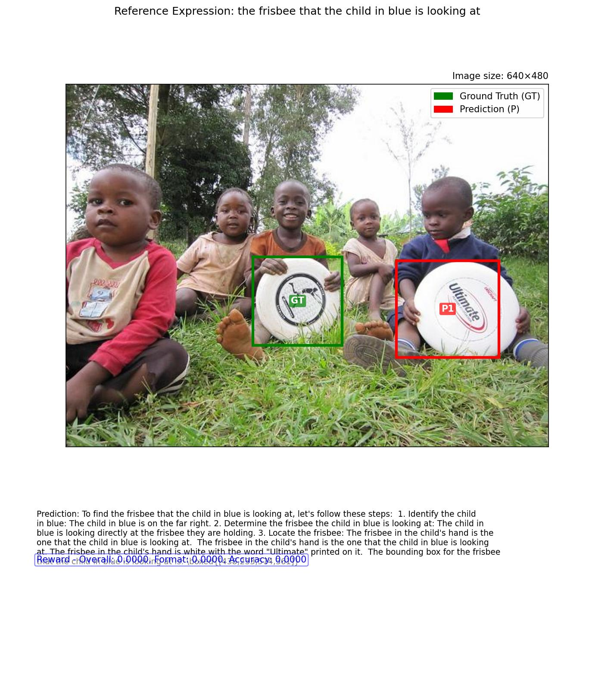

---

### Example 18

**Reference Expression**: person other than the man and his reflection

**Ground Truth**: []

**Predicted**: []

**Reward**: {'overall': 1.0, 'format': 0.0, 'accuracy': 1.0}

**Prediction**:
```
The image shows a man standing in an office setting. The man's reflection is visible in a mirror on the wall behind him. There are no other people in the image besides the man and his reflection.

\boxed{[]}
```

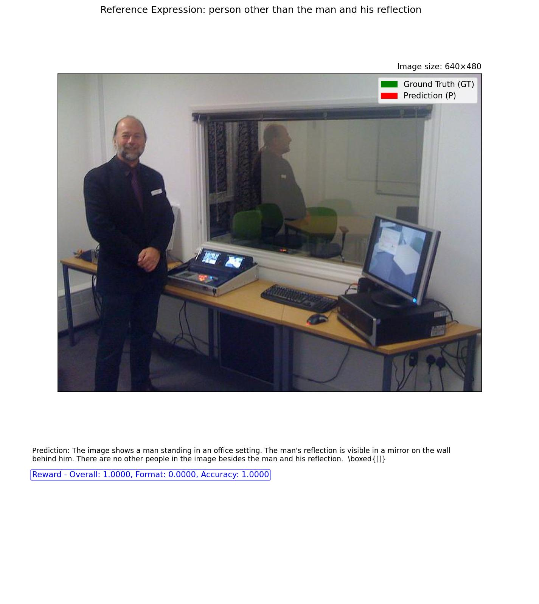

---

### Example 19

**Reference Expression**: yellow flag next to the middle clownfish flag

**Ground Truth**: []

**Predicted**: []

**Reward**: {'overall': 1.0, 'format': 0.0, 'accuracy': 1.0}

**Prediction**:
```
To find the bounding box for the 'yellow flag next to the middle clownfish flag', we need to follow these steps:

1. Identify the middle clownfish flag: It's the one in the middle of the three clownfish kites.
2. Look for a yellow flag next to this middle clownfish flag. In this image, there is no yellow flag next to the middle clownfish flag. Instead, there are other colored flags (red, black, and blue) next to it.

Since there is no yellow flag next to the middle clownfish flag, the bounding box for a yellow flag in this context would be empty.

\boxed{[]}
```

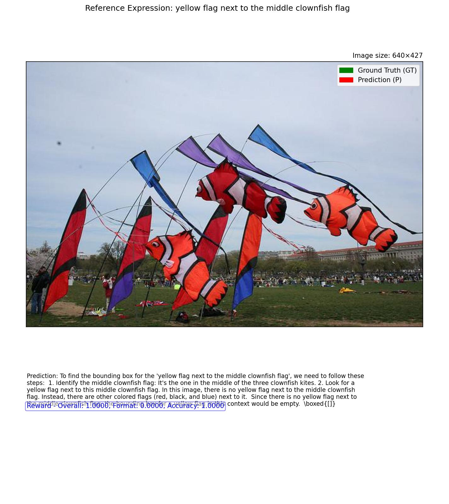

---

### Example 20

**Reference Expression**: third motorcycle from the left

**Ground Truth**: [[138, 261, 189, 375]]

**Predicted**: [[186, 254, 321, 355]]

**Reward**: {'overall': 0.0, 'format': 0.0, 'accuracy': 0.0}

**Prediction**:
```
To find the 'third motorcycle from the left', we need to follow these steps:

1. Identify the motorcycles in the image. They are lined up on the left side of the image.
2. Count from left to right the motorcycles:
   - First motorcycle: farthest to the left.
   - Second motorcycle: next to the first.
   - Third motorcycle: next to the second.
3. The third motorcycle from the left is the one that is third in the sequence.

After identifying the motorcycles, the bounding box for the 'third motorcycle from the left' is:
\boxed{[186,254,321,355]}
```

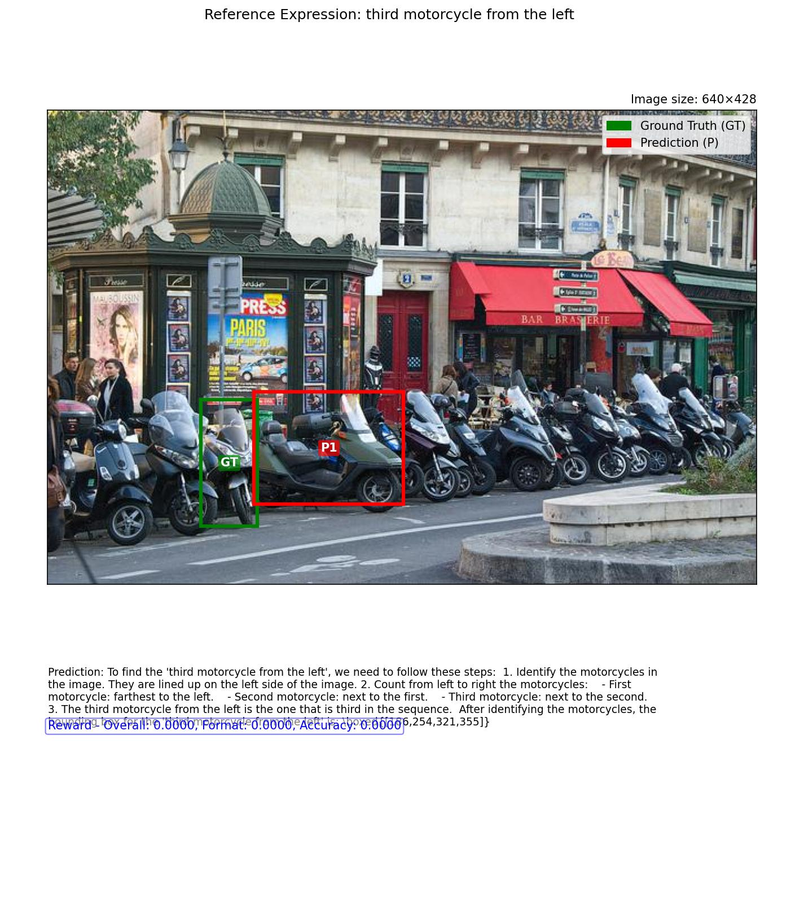

---

### Example 21

**Reference Expression**: the person outside the fence who is not sitting

**Ground Truth**: [[123, 27, 164, 126]]

**Predicted**: [[135, 29, 167, 114]]

**Reward**: {'overall': 0.5713954566527585, 'format': 0.0, 'accuracy': 0.5713954566527585}

**Prediction**:
```
To find the bounding box for 'the person outside the fence who is not sitting', we need to identify a person standing outside the fence. Here's the step-by-step reasoning:

1. **Identify the fence**: The fence is the black structure that separates the field from the spectators.
2. **Look for people outside the fence**: There is one person standing outside the fence on the left side of the image.
3. **Determine if the person is sitting**: The person identified is standing, not sitting.
4. **Locate the bounding box**: The person is standing near the left edge of the image, close to the fence.

Given these observations, the bounding box for the person outside the fence who is not sitting would be:

\boxed{[135,29,167,114]}
```

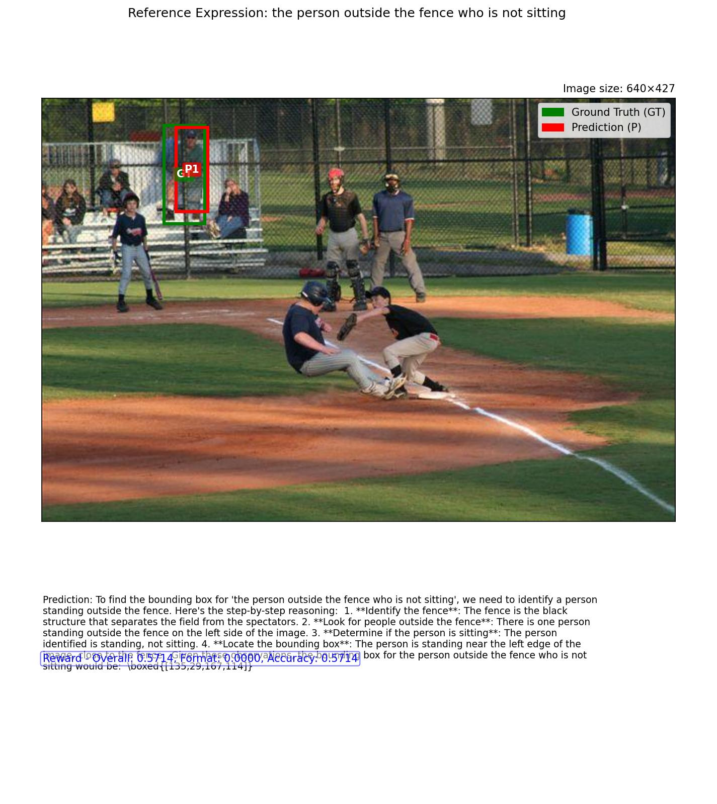

---

### Example 22

**Reference Expression**: the person on the surfboard which is not pink or yellow

**Ground Truth**: [[47, 284, 159, 392]]

**Predicted**: [[45, 279, 159, 385]]

**Reward**: {'overall': 0.879079888094498, 'format': 0.0, 'accuracy': 0.879079888094498}

**Prediction**:
```
To find the bounding box for 'the person on the surfboard which is not pink or yellow', we need to follow these steps:

1. Identify the surfboards in the image. There are two surfboards that are pink and one that is yellow.
2. Determine which surfboard is not pink or yellow. The surfboard on the far left is not pink or yellow.
3. Locate the person standing on the surfboard that is not pink or yellow. The person on the far left surfboard is the one we are looking for.
4. Identify the bounding box for this person.

The person on the surfboard which is not pink or yellow is the one on the far left. The bounding box for this person is:
\boxed{[45,279,159,385]}
```

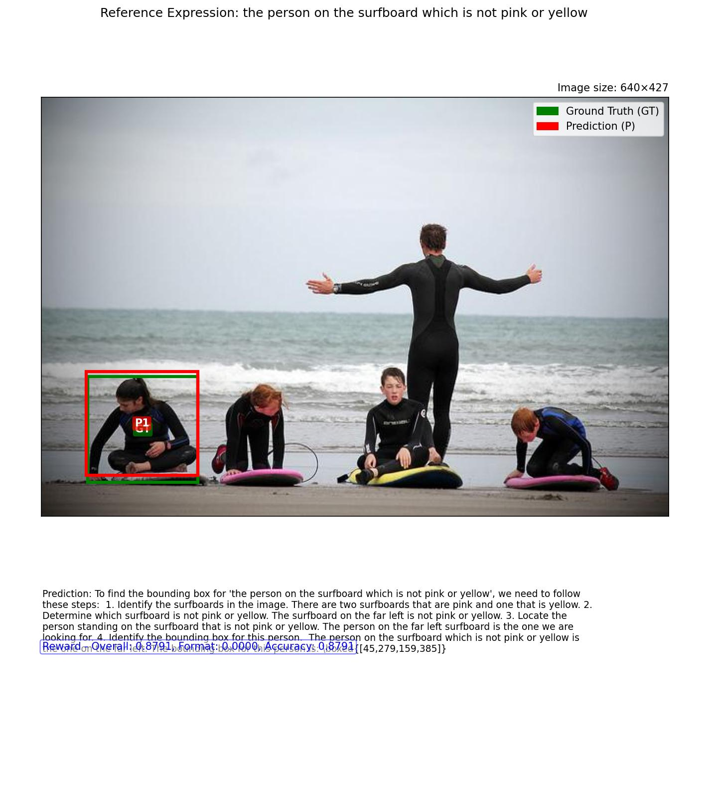

---

### Example 23

**Reference Expression**: the three people on the balcony right above crowd, not on the ground

**Ground Truth**: [[250, 126, 277, 152]]

**Predicted**: [[399, 116, 414, 145]]

**Reward**: {'overall': 0.0, 'format': 0.0, 'accuracy': 0.0}

**Prediction**:
```
To find the bounding box for 'the three people on the balcony right above the crowd, not on the ground', we need to follow these steps:

1. Identify the balcony area: The top level of the stadium has a series of balconies. We need to focus on the one that is right above the crowd.
2. Locate the people on the balcony: There are three individuals visible on the balcony above the crowd. They are positioned close to each other.
3. Define the bounding box: The bounding box should encompass these three individuals, ensuring that they are fully included.

After analyzing the image:

\boxed{[399,116,414,145]}
```

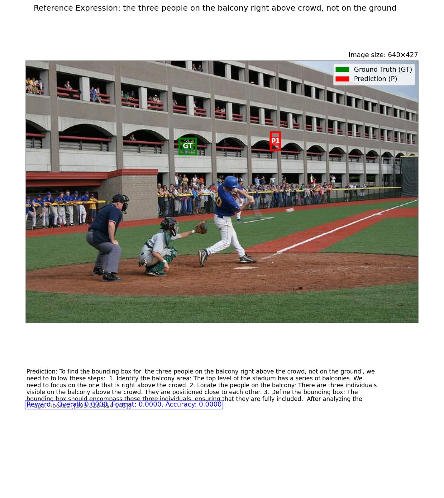

---

### Example 24

**Reference Expression**: the smaller pot in front of the cooking pan

**Ground Truth**: [[238, 326, 321, 394]]

**Predicted**: [[88, 288, 224, 392]]

**Reward**: {'overall': 0.0, 'format': 0.0, 'accuracy': 0.0}

**Prediction**:
```
To find the bounding box for 'the smaller pot in front of the cooking pan', let's follow these steps:

1. Identify the cooking pan: The cooking pan is the large round pan on the stove in the foreground.
2. Locate the smaller pot: The smaller pot is in front of the cooking pan and is on the stove.
3. Specify the bounding box: The smaller pot is a metallic pot with a handle, positioned in front of the larger pan.

The bounding box for 'the smaller pot in front of the cooking pan' is:
\boxed{[88, 288, 224, 392]}
```

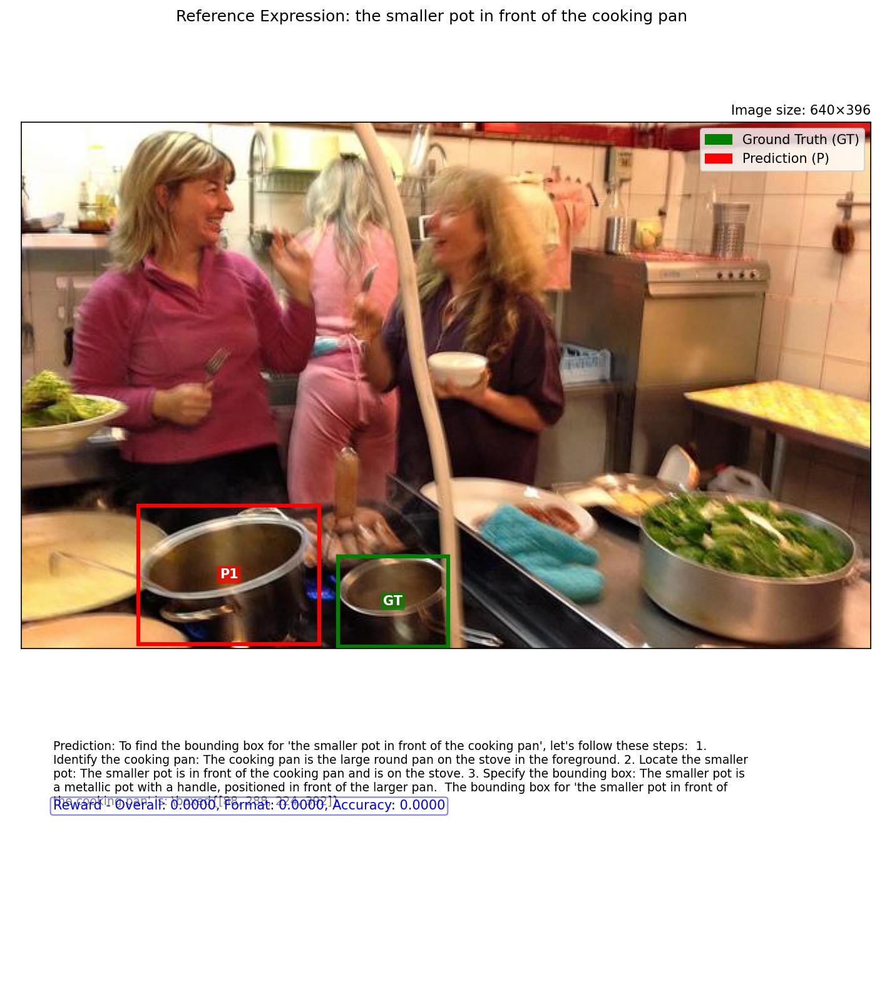

---

### Example 25

**Reference Expression**: the carbinets on the top of the microwave

**Ground Truth**: [[479, 1, 626, 51]]

**Predicted**: [[477, 0, 632, 40]]

**Reward**: {'overall': 0.7334015607010362, 'format': 0.0, 'accuracy': 0.7334015607010362}

**Prediction**:
```
To find the bounding box for the cabinets on the top of the microwave, let's follow these steps:

1. Identify the microwave: The microwave is located on the right side of the image, mounted above the stove.
2. Locate the cabinets above the microwave: Directly above the microwave, there are cabinets.
3. Determine the bounding box: The cabinets are positioned horizontally and are a part of the kitchen cabinetry.

Given these observations, the bounding box for the cabinets on the top of the microwave would be:

\boxed{[477,0,632,40]}

This box represents the upper cabinets that are above the microwave.
```

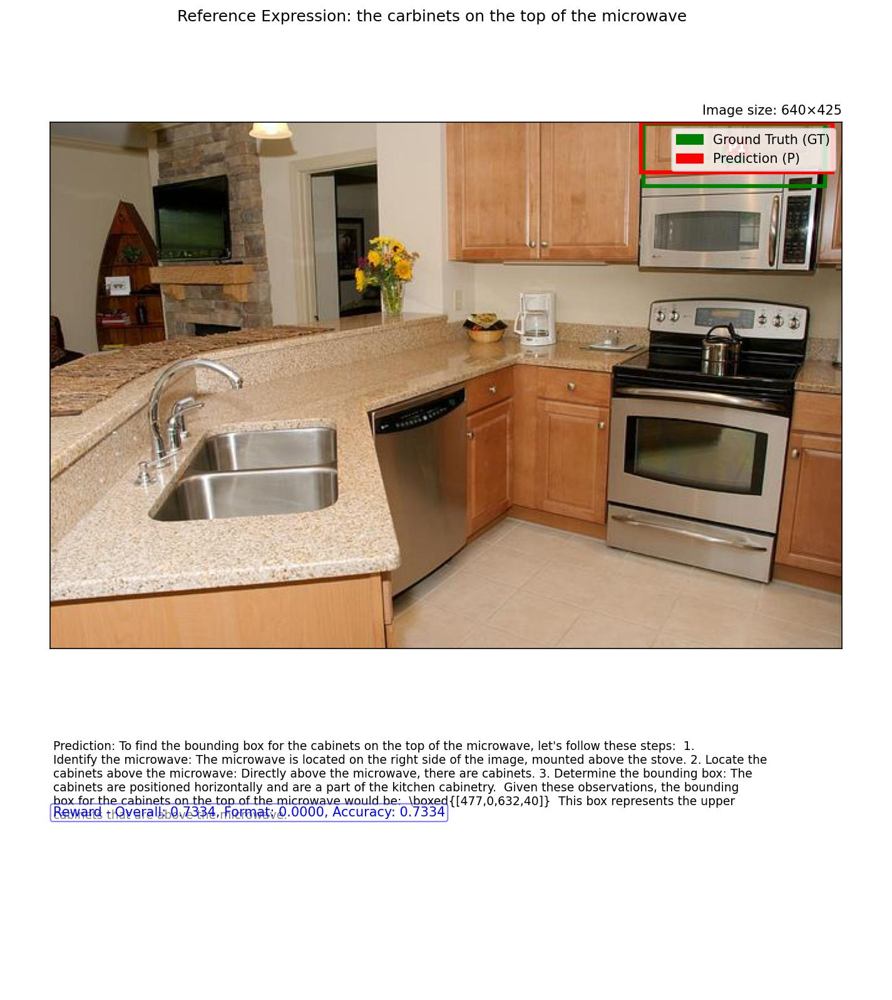

---

### Example 26

**Reference Expression**: the hotdog with a red topping that isn’t a paste or sauce

**Ground Truth**: [[211, 145, 640, 475]]

**Predicted**: [[222, 148, 644, 476]]

**Reward**: {'overall': 1.0, 'format': 0.0, 'accuracy': 1.0}

**Prediction**:
```
To find the hotdog with a red topping that isn't a paste or sauce, we need to identify the hotdog that has red toppings but not a smooth, spreadable consistency like ketchup or chili. Here's the step-by-step reasoning:

1. Identify the hotdogs: There are three hotdogs in the image.
2. Examine the toppings:
   - The first hotdog (from the left) has a red topping that looks like ketchup.
   - The second hotdog has a red topping that looks like a paste or sauce.
   - The third hotdog has red toppings that appear to be sliced red peppers.
3. Determine which hotdog fits the description: The third hotdog has red toppings that look like sliced red peppers, not a paste or sauce.

The bounding box for the hotdog with the red toppings that aren't a paste or sauce is:

\boxed{[222,148,644,476]}
```

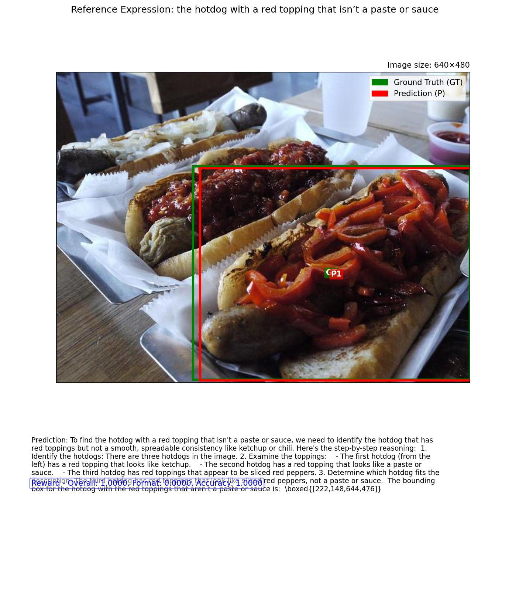

---

### Example 27

**Reference Expression**: the bowl with no bread or fork inside

**Ground Truth**: [[368, 79, 640, 250]]

**Predicted**: [[372, 81, 644, 240]]

**Reward**: {'overall': 1.0, 'format': 0.0, 'accuracy': 1.0}

**Prediction**:
```
To find the bowl with no bread or fork inside, let's follow these steps:

1. Identify the bowl in the image. There are three main bowls in the image.
2. Examine the contents of each bowl:
   - The bowl in the foreground contains a sausage and a side of what looks like mashed potatoes or polenta, with a fork resting on it.
   - The bowl in the middle contains a sandwich and some greens.
   - The bowl on the right contains a piece of chicken and some green beans.
3. The bowl that does not contain bread or a fork is the one in the middle, which has a sandwich and greens.

Thus, the bounding box for the bowl with no bread or fork inside is:
\boxed{[372,81,644,240]}
```

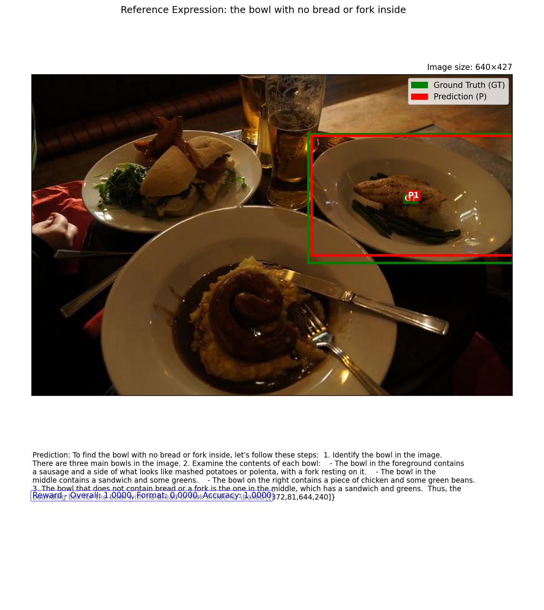

---

### Example 28

**Reference Expression**: the person holding a frisbee and not wearing a bag

**Ground Truth**: [[1, 33, 215, 472]]

**Predicted**: [[6, 24, 211, 470]]

**Reward**: {'overall': 1.0, 'format': 0.0, 'accuracy': 1.0}

**Prediction**:
```
To find the bounding box for 'the person holding a frisbee and not wearing a bag', we need to follow these steps:

1. Identify the person holding a frisbee.
2. Ensure that this person is not wearing a bag.
3. Determine the bounding box for this person.

- The person on the left is holding a frisbee and is not wearing a bag.
- The person in the middle is also holding a frisbee but is wearing a bag.
- The person on the right is not holding a frisbee.
- The person on the far right is holding a frisbee but is not wearing a bag.

Thus, the person we are looking for is the one on the left.

The bounding box for 'the person holding a frisbee and not wearing a bag' is:
\boxed{[6,24,211,470]}
```

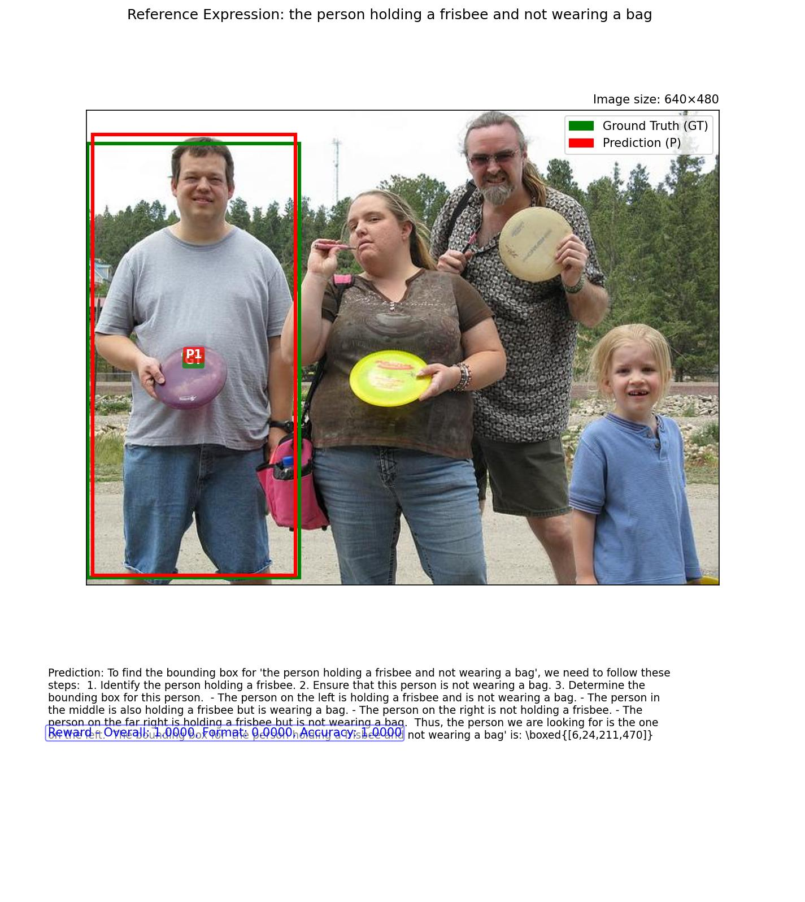

---

### Example 29

**Reference Expression**: the person partially obscured by the person in red shorts

**Ground Truth**: [[437, 196, 469, 295]]

**Predicted**: [[439, 194, 469, 263]]

**Reward**: {'overall': 0.6226765799256505, 'format': 0.0, 'accuracy': 0.6226765799256505}

**Prediction**:
```
To find the bounding box for the person partially obscured by the person in red shorts, we need to identify the person in red shorts and then locate the person behind them. Here's the step-by-step reasoning:

1. Identify the person in red shorts: This is the person in the foreground, wearing red shorts and running on the beach.
2. Locate the person behind the person in red shorts: The person behind the person in red shorts is partially obscured by them, but we can still identify them as the one wearing a blue shirt and black shorts.
3. Determine the bounding box for the partially obscured person: The bounding box should capture the person in the blue shirt and black shorts, even though they are partially hidden by the person in red shorts.

The bounding box for the person partially obscured by the person in red shorts is:
\boxed{[439,194,469,263]}

This bounding box captures the person in the blue shirt and black shorts, who is partially obscured by the person in red shorts.
```

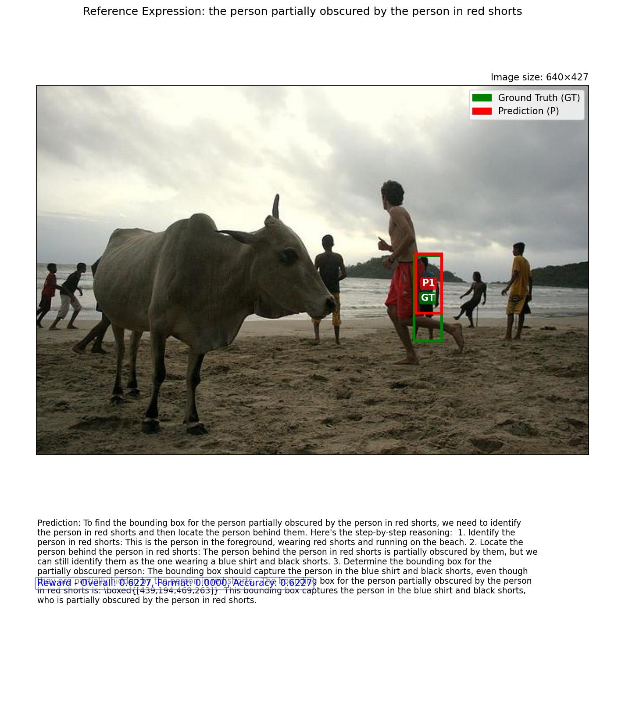

---

### Example 30

**Reference Expression**: the second car behind the car with two open doors

**Ground Truth**: [[161, 232, 226, 281]]

**Predicted**: [[262, 280, 364, 355]]

**Reward**: {'overall': 0.0, 'format': 0.0, 'accuracy': 0.0}

**Prediction**:
```
To find the bounding box for 'the second car behind the car with two open doors', we need to identify the car with two open doors first. The car with two open doors is the one in the center of the image, with its doors fully open. The second car behind this car is the one immediately to the left of it.

1. Identify the car with two open doors: It is the car in the center with its doors open.
2. Find the car immediately to the left of this car: This car is the one next to the car with the open doors.

The bounding box for 'the second car behind the car with two open doors' is:
\boxed{[262, 280, 364, 355]}
```

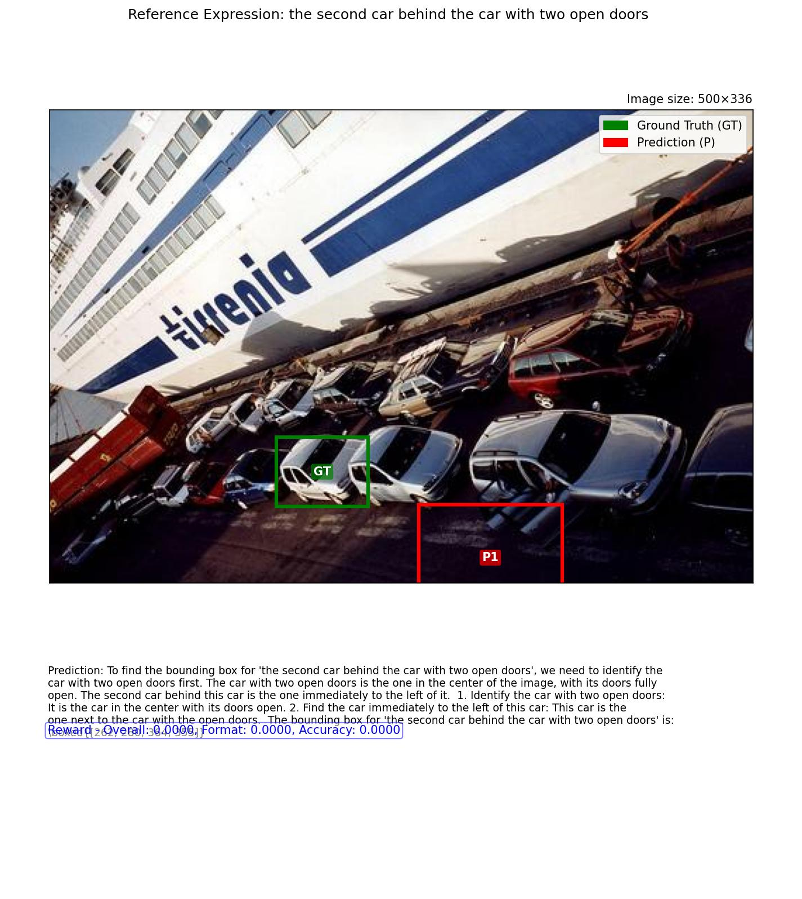

---

### Example 31

**Reference Expression**: the suitcase own by a person holding food in hand

**Ground Truth**: [[131, 327, 236, 571]]

**Predicted**: [[131, 327, 249, 609]]

**Reward**: {'overall': 0.7699242697439596, 'format': 0.0, 'accuracy': 0.7699242697439596}

**Prediction**:
```
To find the suitcase owned by the person holding food in hand, we need to follow these steps:

1. Identify the person holding food in hand. This person is in the center of the image, wearing a blue shirt and jeans, and appears to be reaching out with their left hand.
2. Look for the suitcase that this person is interacting with. The person is holding food in their left hand and appears to be reaching for a suitcase with their right hand.
3. Locate the suitcase that the person is interacting with. It is a dark-colored suitcase with a visible handle.

Based on these observations, the bounding box for 'the suitcase owned by a person holding food in hand' is:

\boxed{[131,327,249,609]}
```

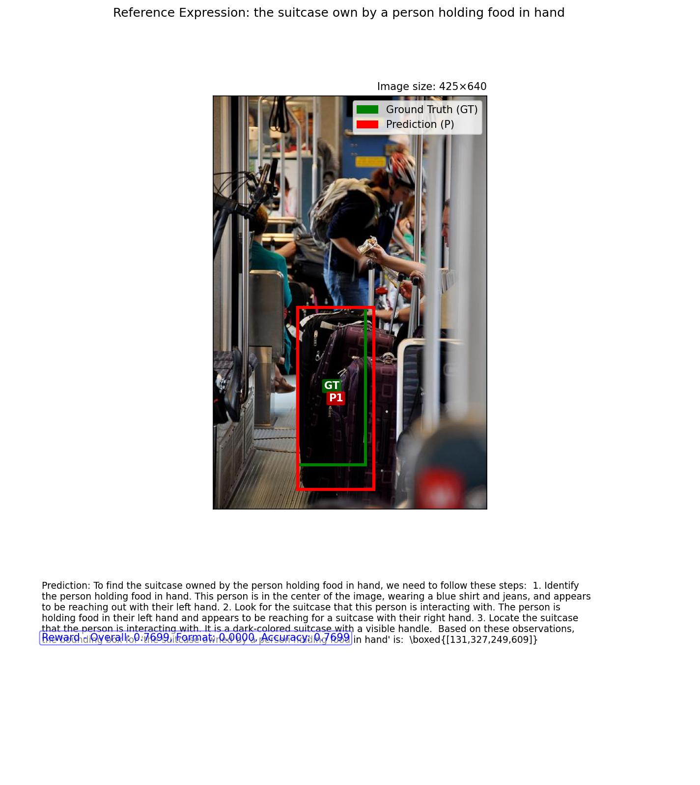

---

### Example 32

**Reference Expression**: the bus next to the bus with a different color

**Ground Truth**: [[215, 73, 273, 133]]

**Predicted**: [[216, 85, 339, 169]]

**Reward**: {'overall': 0.24702058504875407, 'format': 0.0, 'accuracy': 0.24702058504875407}

**Prediction**:
```
To find the bounding box for 'the bus next to the bus with a different color', we need to identify the bus with a different color first. The bus with a different color is the one that appears to be partially yellow and green, distinct from the other white buses. 

Step-by-step reasoning:
1. Identify the bus with the different color, which is the one with the yellow and green sections.
2. Locate the bus immediately next to it on the left side. This bus will be the one we are looking for.

The bounding box for 'the bus next to the bus with a different color' is:
\boxed{[216,85,339,169]}
```

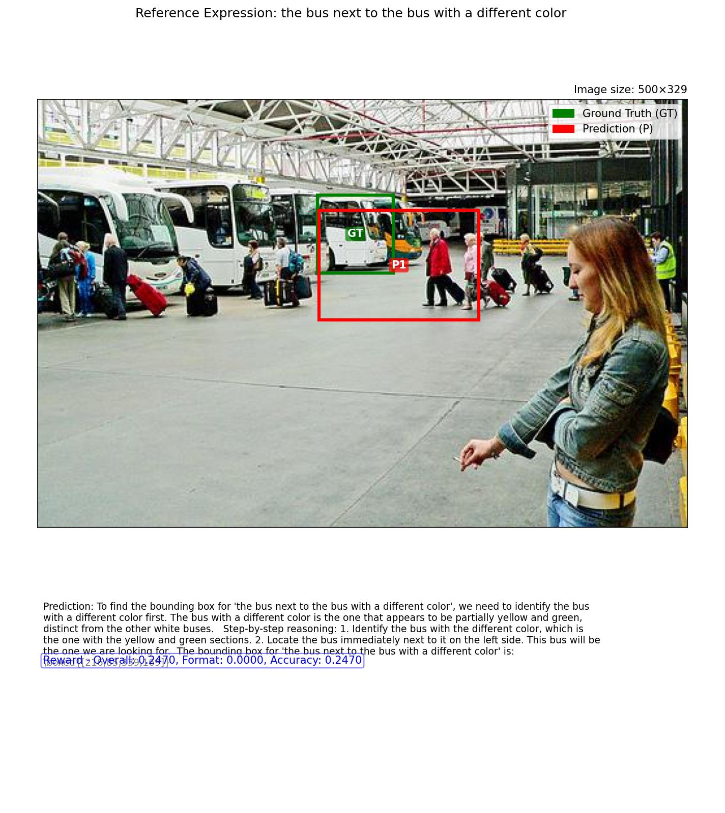

---

### Example 33

**Reference Expression**: woman with hat

**Ground Truth**: []

**Predicted**: []

**Reward**: {'overall': 1.0, 'format': 0.0, 'accuracy': 1.0}

**Prediction**:
```
To find the bounding box for the 'woman with hat', let's follow these steps:

1. Identify the woman in the image: She is sitting on the left side of the couch, wearing a dark-colored top and jeans.
2. Look for the hat: She is not wearing a hat.
3. Re-evaluate: Since the task specifies 'woman with hat', and there is no woman in the image wearing a hat, the bounding box for 'woman with hat' is likely empty.

\boxed{}
```

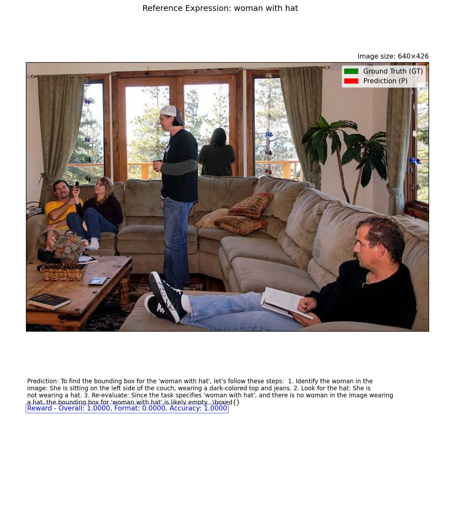

---

### Example 34

**Reference Expression**: the elephant fifth farthest from the camera

**Ground Truth**: [[502, 385, 537, 435]]

**Predicted**: [[498, 379, 541, 432]]

**Reward**: {'overall': 0.69001677852349, 'format': 0.0, 'accuracy': 0.69001677852349}

**Prediction**:
```
To find 'the elephant fifth farthest from the camera', we need to follow these steps:

1. Identify all the elephants in the image.
2. Determine the order of the elephants from the farthest to the closest to the camera.
3. Identify the fifth elephant in this sequence.

Step 1: Identifying all the elephants:
- There are 6 elephants in the image.

Step 2: Determining the order from farthest to closest:
- The first elephant is the one farthest from the camera.
- The second, third, fourth, fifth, and sixth elephants follow in order from left to right.

Step 3: Identifying the fifth elephant:
- The fifth elephant from the farthest to the closest to the camera is the one second from the right in the image.

The bounding box for 'the elephant fifth farthest from the camera' is:
\boxed{[498,379,541,432]}
```

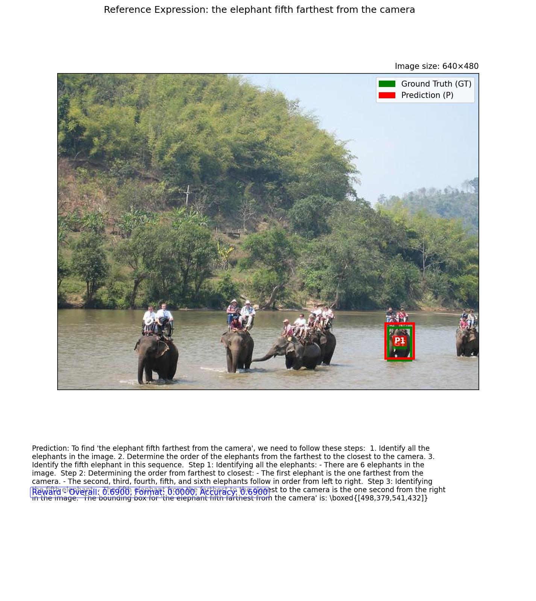

---

### Example 35

**Reference Expression**: the horse with white spots on its face ridden by a shirtless person

**Ground Truth**: [[268, 172, 285, 210]]

**Predicted**: [[235, 214, 292, 307]]

**Reward**: {'overall': 0.0, 'format': 0.0, 'accuracy': 0.0}

**Prediction**:
```
To find the bounding box for 'the horse with white spots on its face ridden by a shirtless person', let's follow these steps:

1. Identify the shirtless person: There are two shirtless individuals in the image. We need to determine which one is riding the horse with white spots on its face.
2. Locate the horse with white spots on its face: Among the horses, the one with white spots on its face is the one in the middle of the group, slightly ahead of the others.
3. Identify the rider: The shirtless person is on the right side of the image, and the horse with white spots on its face is being ridden by him.
4. Determine the bounding box for the horse: The bounding box should encompass the horse and its rider. The horse's head is on the left side of the image, and the rider is on the right side.

After carefully analyzing the image, the bounding box for 'the horse with white spots on its face ridden by a shirtless person' is:

\boxed{[235,214,292,307]}
```

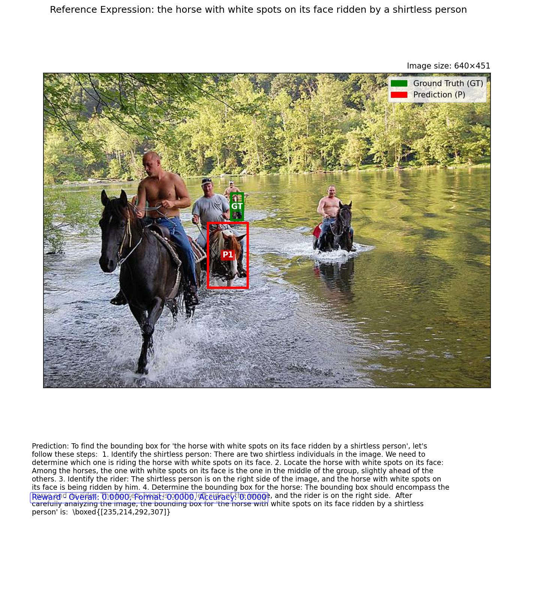

---

### Example 36

**Reference Expression**: person in yellow jersy

**Ground Truth**: []

**Predicted**: []

**Reward**: {'overall': 1.0, 'format': 0.0, 'accuracy': 1.0}

**Prediction**:
```
The image shows a baseball game with a batter, catcher, and umpire, but there is no person wearing a yellow jersey visible. The players are in white and gray uniforms, and the catcher is wearing red gear. Therefore, there is no bounding box for 'person in yellow jersy'.

\boxed{[]}

```

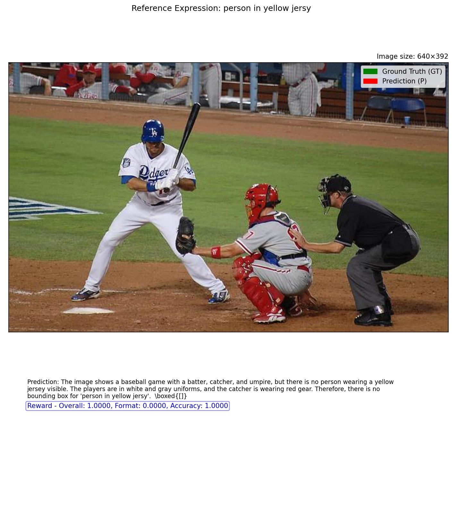

---

### Example 37

**Reference Expression**: the doll in front of a book whose name is not the office and not monk

**Ground Truth**: [[1, 224, 127, 445]]

**Predicted**: [[148, 325, 414, 622]]

**Reward**: {'overall': 0.0, 'format': 0.0, 'accuracy': 0.0}

**Prediction**:
```
To find the bounding box for 'the doll in front of a book whose name is not the office and not monk', we need to follow these steps:

1. Identify the books on the shelf. The books visible have titles that include "MONK" and "the office". We need to find a book that is neither "MONK" nor "the office".
2. Locate the book that is not "MONK" or "the office". The book in the middle, which has a title that is not "MONK" or "the office", is the one we are looking for.
3. Identify the doll in front of this specific book. The doll in front of the identified book is the one we need to focus on.

By examining the image, we can see that the book in the middle is not "MONK" or "the office". The doll in front of this book is the one we need to select.

The bounding box for the doll in front of this specific book is:
\boxed{[148,325,414,622]}
```

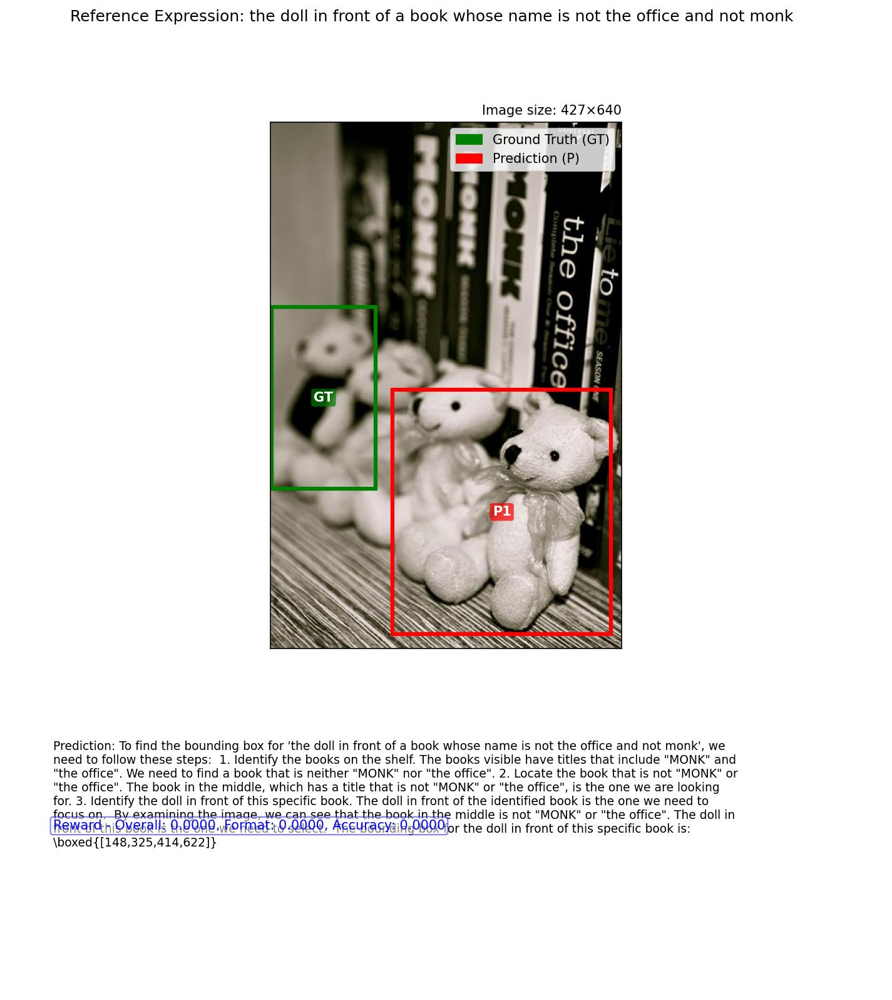

---

### Example 38

**Reference Expression**: chips that is neither red nor green

**Ground Truth**: [[255, 107, 316, 136]]

**Predicted**: [[326, 102, 397, 134]]

**Reward**: {'overall': 0.0, 'format': 0.0, 'accuracy': 0.0}

**Prediction**:
```
To find the bounding box for 'chips that is neither red nor green', we need to follow these steps:

1. Identify the area where chips are likely to be displayed. This is typically near the shelves in a convenience store or market.
2. Look for shelves that contain a variety of snack items, including chips.
3. Focus on the chips that are neither red nor green in color. Red chips are often Doritos, and green chips are often Lay's or other brands with green packaging.
4. In the image, we can see a section with chips on a shelf. The chips appear to be in clear packaging, so we need to identify which ones are neither red nor green.
5. Upon closer inspection, there are chips in clear packaging that are not red or green.

Given the context and the appearance of the chips, the bounding box for 'chips that is neither red nor green' would be:

\boxed{[326,102,397,134]}
```

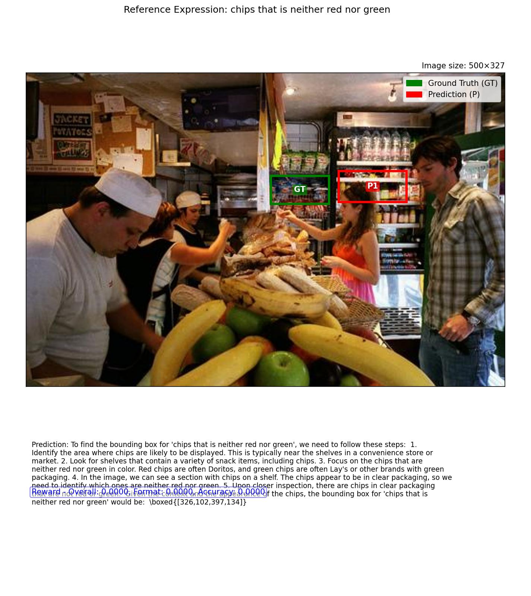

---

### Example 39

**Reference Expression**: the cabinet above the white rice cooker

**Ground Truth**: [[187, 64, 325, 275]]

**Predicted**: [[201, 62, 252, 273]]

**Reward**: {'overall': 0.36478439425051334, 'format': 0.0, 'accuracy': 0.36478439425051334}

**Prediction**:
```
To find the bounding box for 'the cabinet above the white rice cooker':

1. Identify the white rice cooker in the image. It is located on the countertop, slightly to the right of the stove.
2. Look directly above the rice cooker to find the cabinet. The cabinet is part of the upper kitchen cabinetry.
3. The cabinet is a rectangular shape with a door and a handle, positioned above the rice cooker.

The final bounding box for 'the cabinet above the white rice cooker' is:
\boxed{[201, 62, 252, 273]}
```

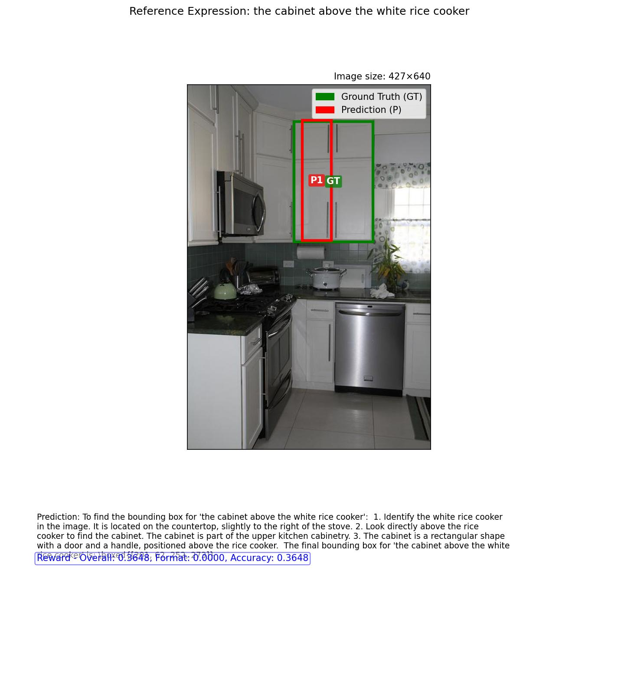

---

### Example 40

**Reference Expression**: the surfboard overlapping two other surfboards

**Ground Truth**: [[507, 75, 578, 363]]

**Predicted**: [[478, 50, 526, 380]]

**Reward**: {'overall': 0.17757009345794392, 'format': 0.0, 'accuracy': 0.17757009345794392}

**Prediction**:
```
To find the surfboard that is overlapping two other surfboards, we need to look for a surfboard that is partially hidden or placed in such a way that it is partially covered by another surfboard.

1. **Identify the surfboards**: We have a row of surfboards standing upright on the sand.
2. **Look for overlapping**: In this specific image, the surfboard that appears to be overlapping others is the second one from the right. It is positioned in such a way that it seems to be partially covered by the surfboard to its left.

The bounding box for the surfboard that is overlapping two others would be:

\boxed{[478,50,526,380]}
```

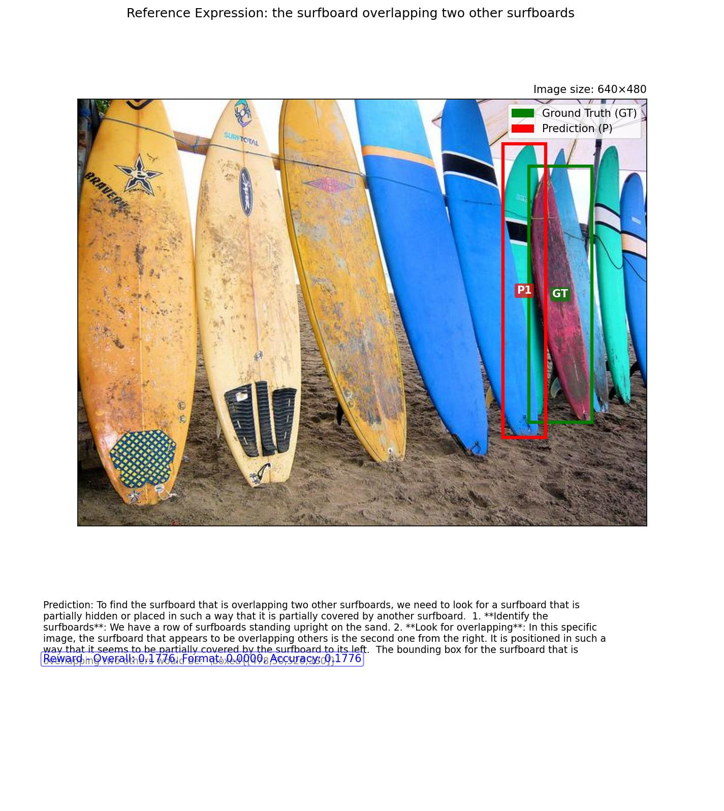

---

### Example 41

**Reference Expression**: object behind the couch not facing camera horizontally

**Ground Truth**: [[1, 189, 96, 311]]

**Predicted**: [[73, 104, 156, 220]]

**Reward**: {'overall': 0.0, 'format': 0.0, 'accuracy': 0.0}

**Prediction**:
```
To find the object behind the couch not facing camera horizontally, we need to identify the area behind the couch on the left side of the image. The couch is in the center, and the object in question should be on the left side of the couch, not facing horizontally. 

1. Identify the couches: There are two brown leather couches, one on the left and one on the right.
2. Locate the object behind the couch on the left: To the left of the couch on the left, there appears to be a bookshelf.
3. Check the orientation of the object: The bookshelf is facing vertically, not horizontally.

Therefore, the object behind the couch on the left side of the image is the bookshelf.

The bounding box for the bookshelf is \boxed{[73,104,156,220]}.
```

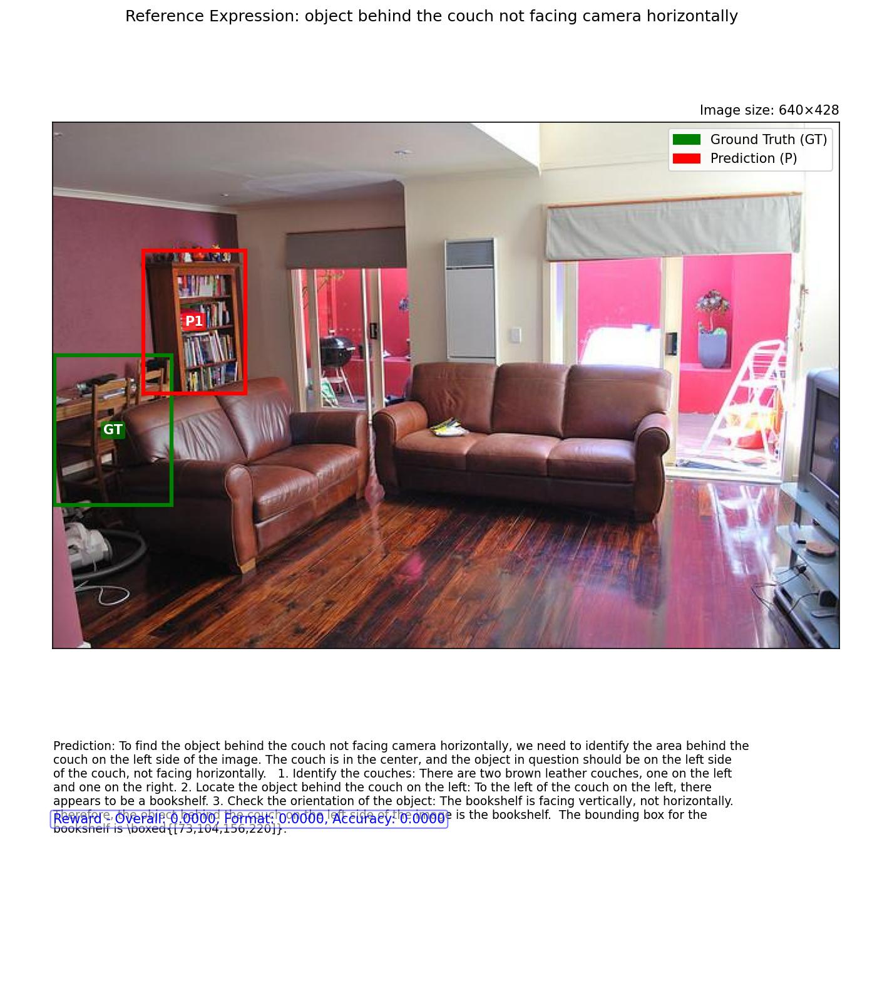

---

### Example 42

**Reference Expression**: the cake decorated with two white swan-like figures, noticeably further apart from each other compared to similar decorations on other cakes

**Ground Truth**: [[297, 127, 591, 342]]

**Predicted**: [[352, 123, 574, 258]]

**Reward**: {'overall': 0.4537115042591032, 'format': 0.0, 'accuracy': 0.4537115042591032}

**Prediction**:
```
To find the bounding box for the cake decorated with two white swan-like figures that are noticeably further apart from each other compared to similar decorations on other cakes, let's follow these steps:

1. Identify the cakes with swan-like decorations. The cakes in the center and to the right of the image have these decorations.
2. Focus on the cake that appears to have the swan-like decorations furthest apart. This cake is located towards the right side of the image, slightly above the center.
3. Observe the spacing of the decorations on this cake. The two swan-like figures are indeed further apart from each other compared to the other cakes.
4. Determine the bounding box for this specific cake. The cake is rectangular and has a design that includes multiple layers of frosting and decorations.

After analyzing the image, the bounding box for the cake with the two white swan-like figures that are noticeably further apart from each other is:

\boxed{[352,123,574,258]}
```

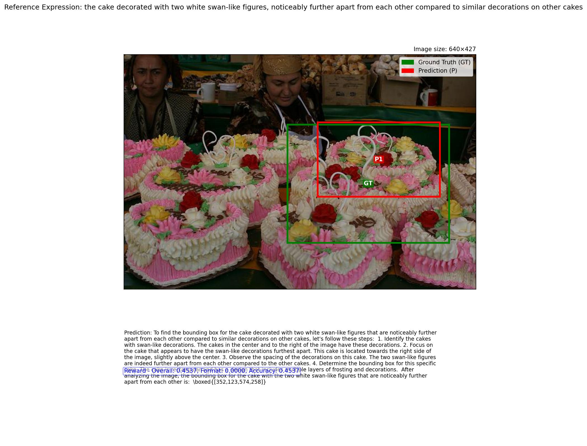

---

### Example 43

**Reference Expression**: the cow furthest from camera

**Ground Truth**: [[57, 214, 74, 235]]

**Predicted**: [[36, 250, 65, 294]]

**Reward**: {'overall': 0.0, 'format': 0.0, 'accuracy': 0.0}

**Prediction**:
```
To find the bounding box for 'the cow furthest from the camera', we need to follow these steps:

1. Identify the cows in the image.
2. Determine which cow is the furthest from the camera. This is typically the cow that is located at the far left or right edge of the image, depending on the perspective.
3. Once identified, provide the bounding box coordinates for that cow.

Step 1: Identifying the cows:
- There are several cows in the image, all grazing in a field. We need to distinguish between them.

Step 2: Determining the furthest cow:
- The cow on the far left side of the image appears to be the furthest from the camera. It is located at the edge of the image and is positioned to the left of the other cows.

Step 3: Providing the bounding box:
- The cow on the far left is located at the edge of the image. We need to estimate its bounding box coordinates based on its position relative to the other cows and the field.

After analyzing the image, the bounding box for 'the cow furthest from the camera' is:
\boxed{[36,250,65,294]}
```

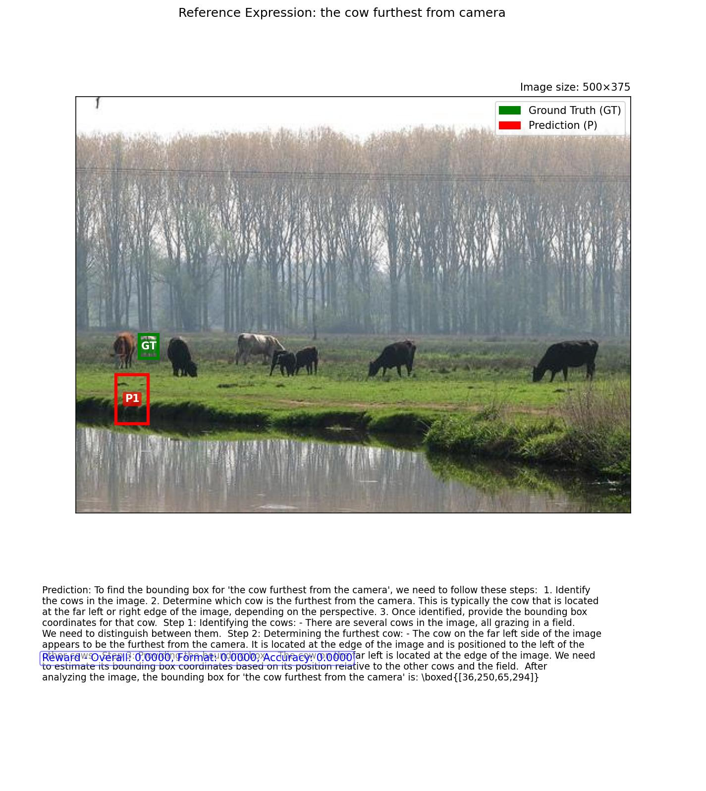

---

### Example 44

**Reference Expression**: man sitting next to number 25 with his mouth open

**Ground Truth**: [[214, 176, 288, 315]]

**Predicted**: [[211, 173, 299, 311]]

**Reward**: {'overall': 0.8030546623794212, 'format': 0.0, 'accuracy': 0.8030546623794212}

**Prediction**:
```
To find the bounding box for 'man sitting next to number 25 with his mouth open', we need to follow these steps:

1. Identify the player with the number 25 on his back. This is the player in the white uniform, standing with his back to the camera and wearing the number 25.
2. Look for the player sitting next to him (to the left). This player is in a gray uniform.
3. Observe the player in the gray uniform and check if he has his mouth open. This player indeed has his mouth open.

The bounding box for this player is:
\boxed{[211,173,299,311]}
```

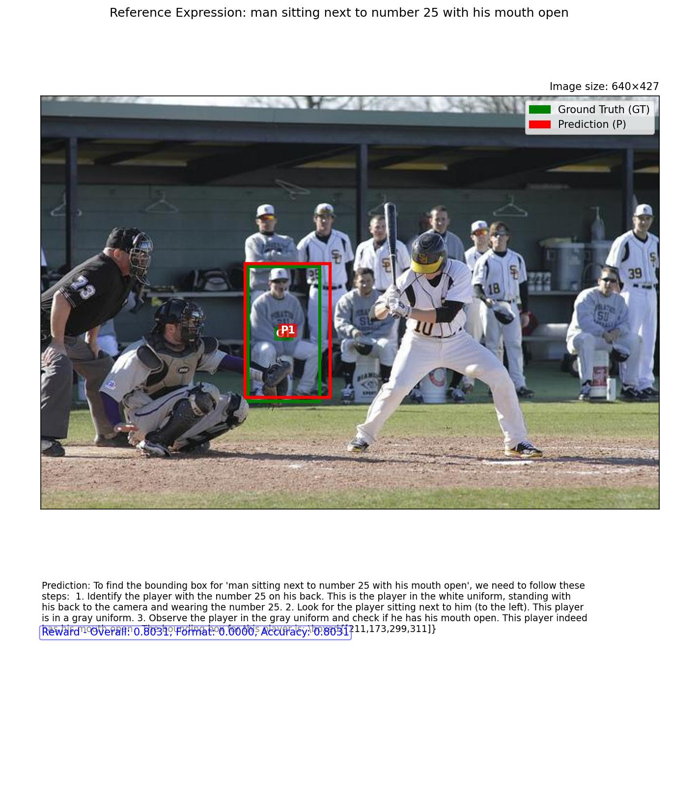

---

### Example 45

**Reference Expression**: keyboard closest to monitor that is on

**Ground Truth**: [[310, 166, 369, 198]]

**Predicted**: [[310, 163, 398, 209]]

**Reward**: {'overall': 0.466403162055336, 'format': 0.0, 'accuracy': 0.466403162055336}

**Prediction**:
```
To find the keyboard closest to the monitor that is on, we need to follow these steps:

1. Identify the monitor that is on. The monitor is the one in the center of the desk, displaying an image.
2. Locate the keyboard that is closest to this monitor. The keyboard is to the right of the monitor, on the desk.
3. Define the bounding box for this keyboard.

Following these steps, the keyboard closest to the monitor that is on is the one to the right of the monitor. The bounding box for this keyboard is:

\boxed{[310,163,398,209]}
```

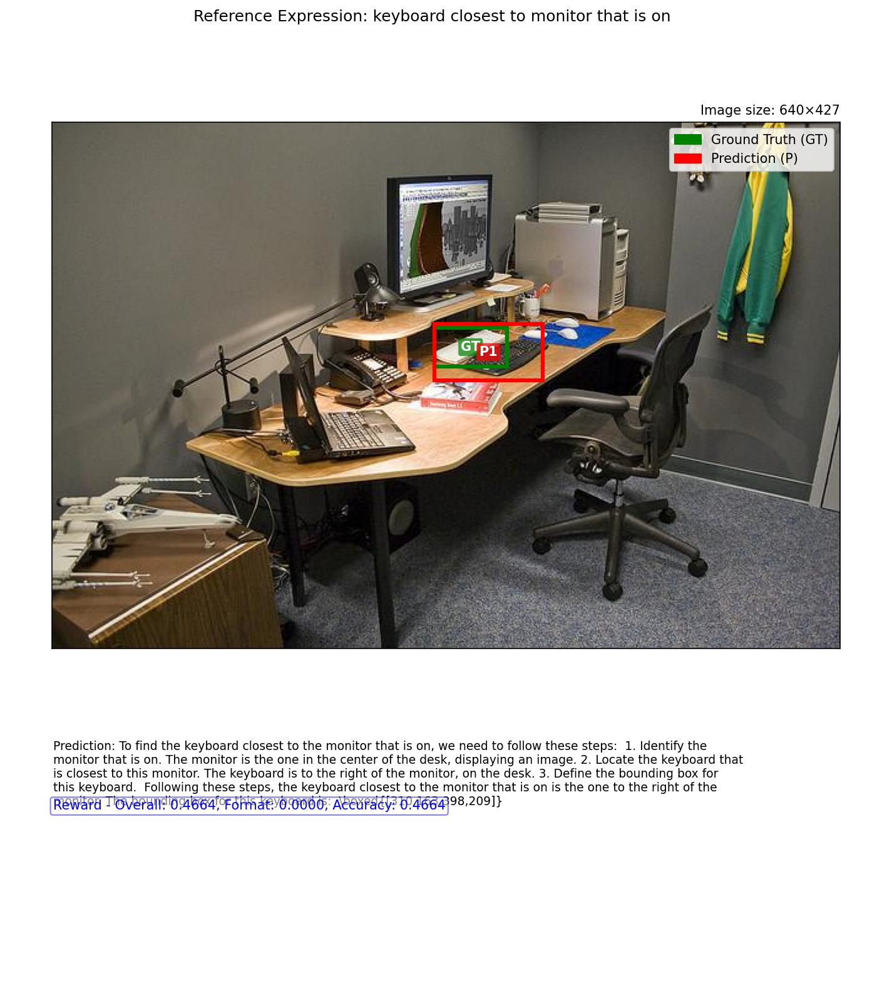

---

### Example 46

**Reference Expression**: cow closest to the one sticking out tongue and doesn't have brown skin

**Ground Truth**: [[0, 304, 121, 489]]

**Predicted**: [[26, 183, 238, 339]]

**Reward**: {'overall': 0.0, 'format': 0.0, 'accuracy': 0.0}

**Prediction**:
```
To find the bounding box for the 'cow closest to the one sticking out tongue and doesn't have brown skin', we need to follow these steps:

1. Identify the cow with the tongue sticking out. This cow is the one on the left side, partially out of the frame.
2. Look for the cow immediately next to it, which is the one that is closest to the one with the tongue sticking out and doesn't have brown skin.
3. Observe the colors of the cows. The cow in question appears to be white with black spots.

Given these observations, the bounding box for the cow closest to the one sticking out its tongue and not having brown skin is:

\boxed{[26,183,238,339]}
```

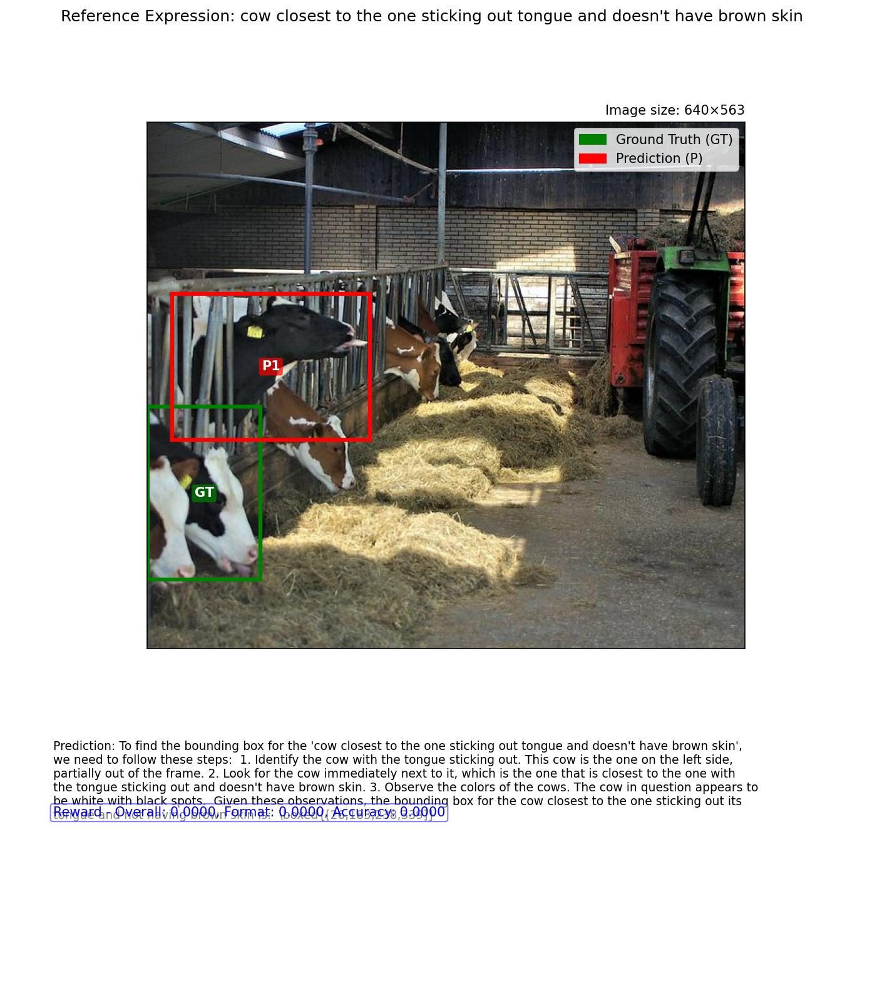

---

### Example 47

**Reference Expression**: the watermelon behind the one that is being held

**Ground Truth**: [[43, 391, 182, 411]]

**Predicted**: [[62, 344, 206, 402]]

**Reward**: {'overall': 0.13452914798206278, 'format': 0.0, 'accuracy': 0.13452914798206278}

**Prediction**:
```
To find the bounding box for the watermelon behind the one being held, let's follow these steps:

1. Identify the watermelon being held: The watermelon in the person's hand is located in the lower left corner of the image.
2. Look for another watermelon in the image: There appears to be another watermelon on the table to the left of the person holding the first watermelon.

The bounding box for the watermelon behind the one being held is:
\boxed{[62, 344, 206, 402]}
```

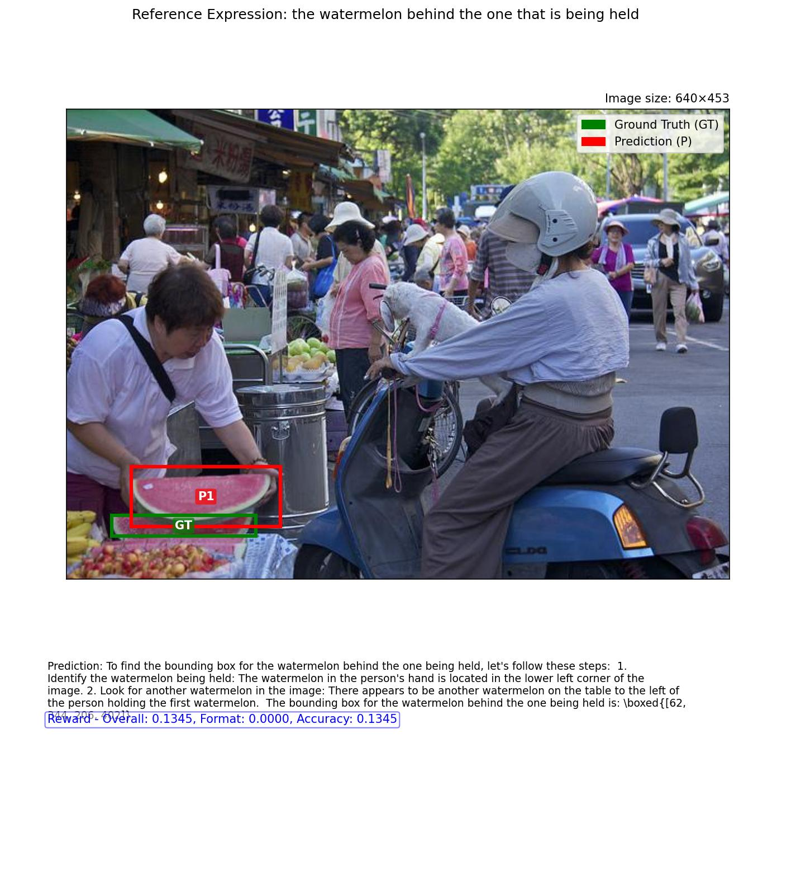

---

### Example 48

**Reference Expression**: third biggest decoration on left wall

**Ground Truth**: [[86, 18, 110, 70]]

**Predicted**: [[103, 20, 135, 86]]

**Reward**: {'overall': 0.11627906976744186, 'format': 0.0, 'accuracy': 0.11627906976744186}

**Prediction**:
```
To find the 'third biggest decoration on the left wall', we need to follow these steps:

1. Identify all the decorations on the left wall.
2. Determine their sizes relative to each other.
3. Rank them from largest to smallest.
4. Identify the third largest decoration.

Step 1: Identifying the decorations on the left wall.
- There are several framed pictures and a circular wreath on the left wall.
- From top to bottom, we have:
  - A circular wreath.
  - A framed picture.
  - Another framed picture.
  - A framed picture.
  - A framed picture.

Step 2: Determining their sizes.
- The circular wreath is the largest.
- The framed picture below the wreath is the second largest.
- The framed picture below the second largest is the third largest.

Step 3: Ranking the decorations.
1. Circular wreath.
2. Second largest framed picture.
3. Third largest framed picture.

Step 4: Identifying the third largest decoration.
The third largest decoration on the left wall is the third framed picture from the top.

The bounding box for the third biggest decoration on the left wall is:
\boxed{[103,20,135,86]}
```

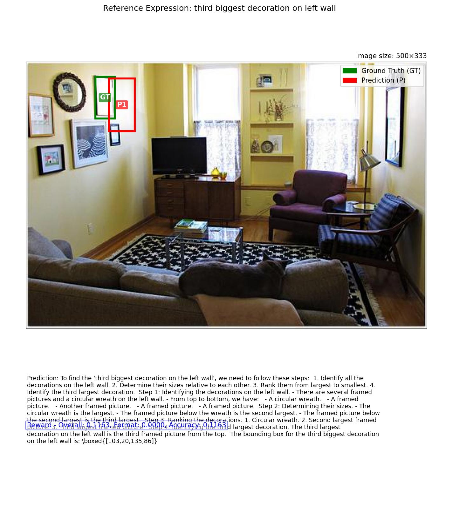

---

### Example 49

**Reference Expression**: object under the wrench

**Ground Truth**: [[389, 244, 487, 456]]

**Predicted**: [[387, 236, 494, 420]]

**Reward**: {'overall': 0.7429359062715368, 'format': 0.0, 'accuracy': 0.7429359062715368}

**Prediction**:
```
To find the object under the wrench, we need to follow these steps:

1. Identify the wrench: The wrench is likely the tool being held by the person on the right, who is wearing a bright yellow safety vest and a hard hat. The wrench is being used on a yellow object.
2. Locate the yellow object: The yellow object is a fire hydrant, which is a common item that might be worked on by construction workers.
3. Determine the object under the wrench: The wrench is being applied to the top of the fire hydrant, so the object under the wrench is the top of the fire hydrant itself.

Given these observations, the object under the wrench is the top of the yellow fire hydrant. Therefore, the bounding box for the object under the wrench is:

\boxed{[387,236,494,420]}
```

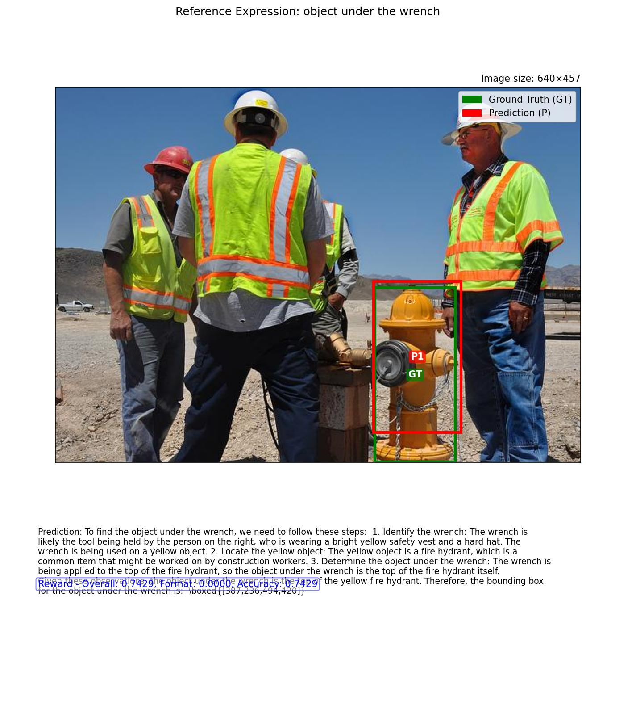

---

### Example 50

**Reference Expression**: object being cut by lady in middle

**Ground Truth**: [[463, 367, 593, 423]]

**Predicted**: [[415, 360, 595, 420]]

**Reward**: {'overall': 0.6157283288650581, 'format': 0.0, 'accuracy': 0.6157283288650581}

**Prediction**:
```
To determine the bounding box for the object being cut by the lady in the middle, let's follow these steps:

1. Identify the lady in the middle: She is wearing a brown floral top and a pink hat.
2. Observe the object she is interacting with: The object appears to be a cake with candles on it, which is being cut by her.
3. Locate the knife: The lady in the middle is holding a knife and appears to be cutting the cake.

Given these observations, the object being cut by the lady in the middle is the cake. The bounding box for the cake can be described as follows:

\boxed{[415, 360, 595, 420]}
```

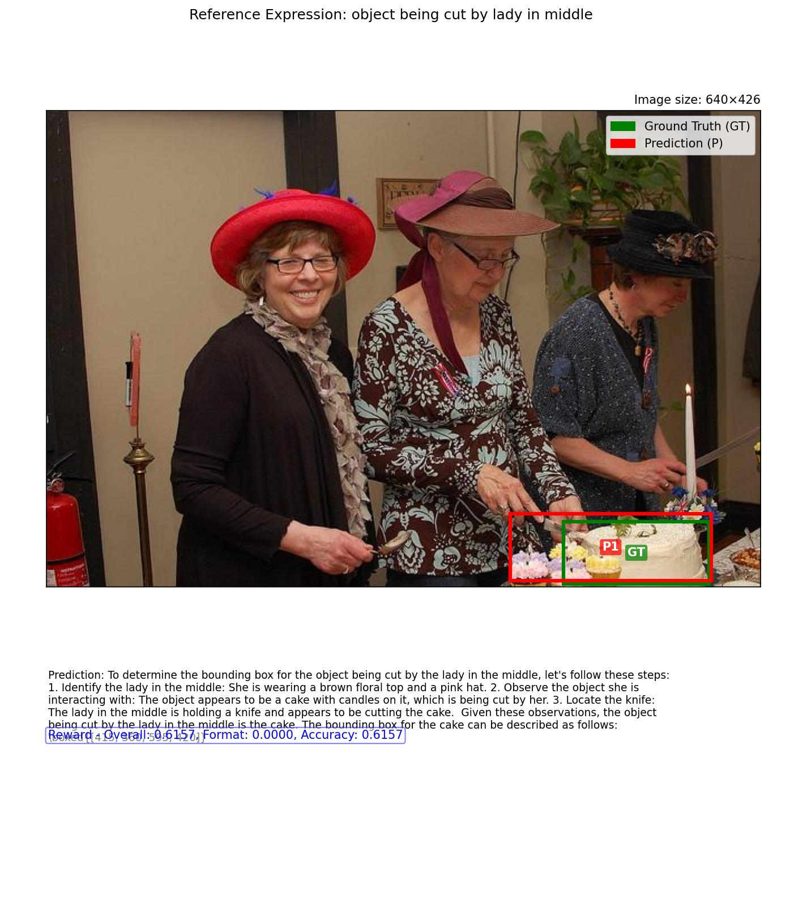

---

### Example 51

**Reference Expression**: the kite on the left of english flag

**Ground Truth**: [[138, 175, 199, 238]]

**Predicted**: [[182, 242, 269, 333]]

**Reward**: {'overall': 0.0, 'format': 0.0, 'accuracy': 0.0}

**Prediction**:
```
To find the bounding box for 'the kite on the left of the English flag', we need to follow these steps:

1. Identify the English flag in the image. The English flag is the red kite with a white cross in the center.
2. Locate the kite to the left of the English flag. This kite is white with a colorful design, resembling a butterfly.
3. Determine the bounding box for this kite. The bounding box will be a rectangle that encapsulates the entire kite.

After analyzing the image, the bounding box for the kite on the left of the English flag is:

\boxed{[182,242,269,333]}
```

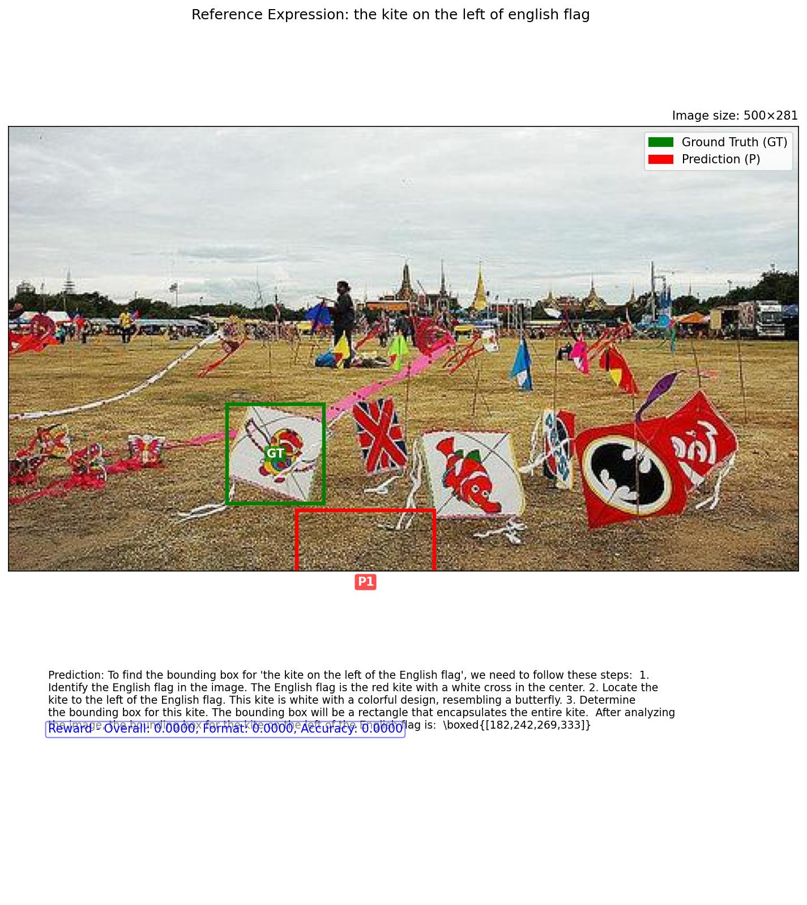

---

### Example 52

**Reference Expression**: person who is on a bicycle but not riding it

**Ground Truth**: [[284, 194, 330, 291]]

**Predicted**: [[202, 169, 261, 335]]

**Reward**: {'overall': 0.0, 'format': 0.0, 'accuracy': 0.0}

**Prediction**:
```
To find the bounding box for the person who is on a bicycle but not riding it, we need to follow these steps:

1. Identify the bicycles in the image.
2. Determine which person is on a bicycle but not actively riding it. This person should be standing next to or near the bicycle.
3. Locate the person in the image who fits this description.

Upon analyzing the image:
- There is a person standing next to a bicycle in the middle of the image. This person appears to be standing and not riding the bicycle.

The bounding box for this person is:
\boxed{[202,169,261,335]}
```

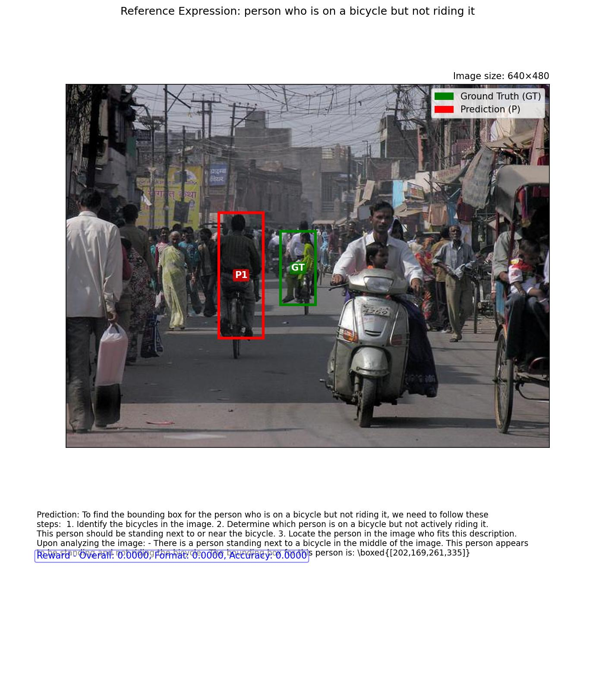

---

### Example 53

**Reference Expression**: the cap of the portable stove

**Ground Truth**: [[41, 369, 101, 422]]

**Predicted**: [[40, 360, 103, 415]]

**Reward**: {'overall': 0.7104247104247104, 'format': 0.0, 'accuracy': 0.7104247104247104}

**Prediction**:
```
To find the bounding box for 'the cap of the portable stove', let's follow these steps:

1. Identify the portable stove: The stove is a small, blue cylindrical object with a metallic top, located on the left side of the image.
2. Locate the cap: The cap of the portable stove is the small, round, metallic part on top of the blue cylinder.

Following these steps, the bounding box for 'the cap of the portable stove' is:
\boxed{[40,360,103,415]}
```

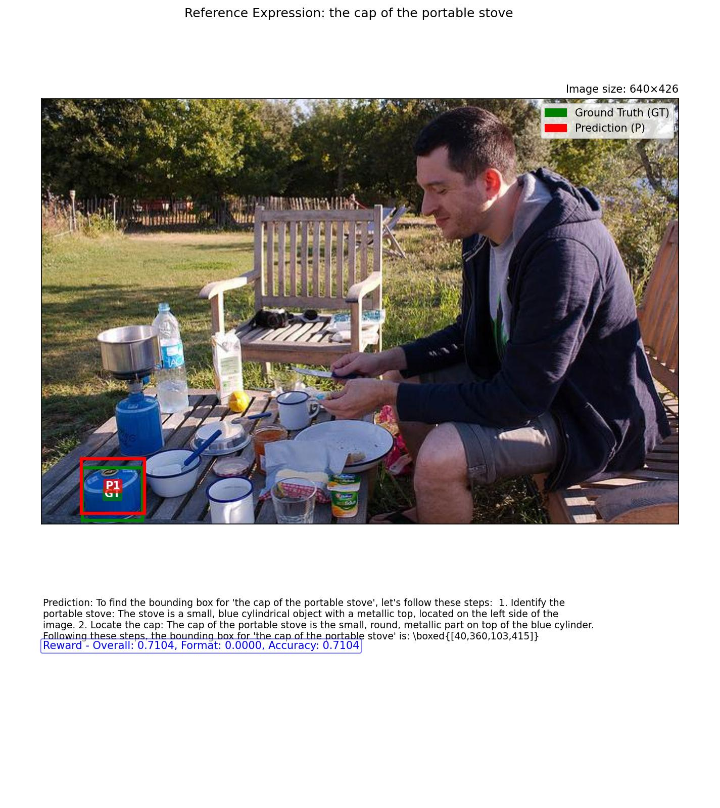

---

### Example 54

**Reference Expression**: the man the woman with a translucent veil looking at

**Ground Truth**: [[0, 138, 73, 325]]

**Predicted**: [[0, 154, 116, 358]]

**Reward**: {'overall': 0.502698131443299, 'format': 0.0, 'accuracy': 0.502698131443299}

**Prediction**:
```
To find the bounding box for 'the man the woman with a translucent veil looking at', we need to follow these steps:

1. Identify the woman with the translucent veil. She is seated on the left side of the image, wearing a veil and sunglasses.
2. Determine who she is looking at. She is looking towards the left side of the image, and there is a man sitting next to her.
3. Locate the man next to her. He is wearing a hat and has a beard.
4. Define the bounding box for the man next to the woman with the veil. The man is partially obscured by the woman, so we need to include enough of him to be sure we have the correct person.

Given these observations, the bounding box for 'the man the woman with a translucent veil looking at' would be:

\boxed{[0,154,116,358]}
```

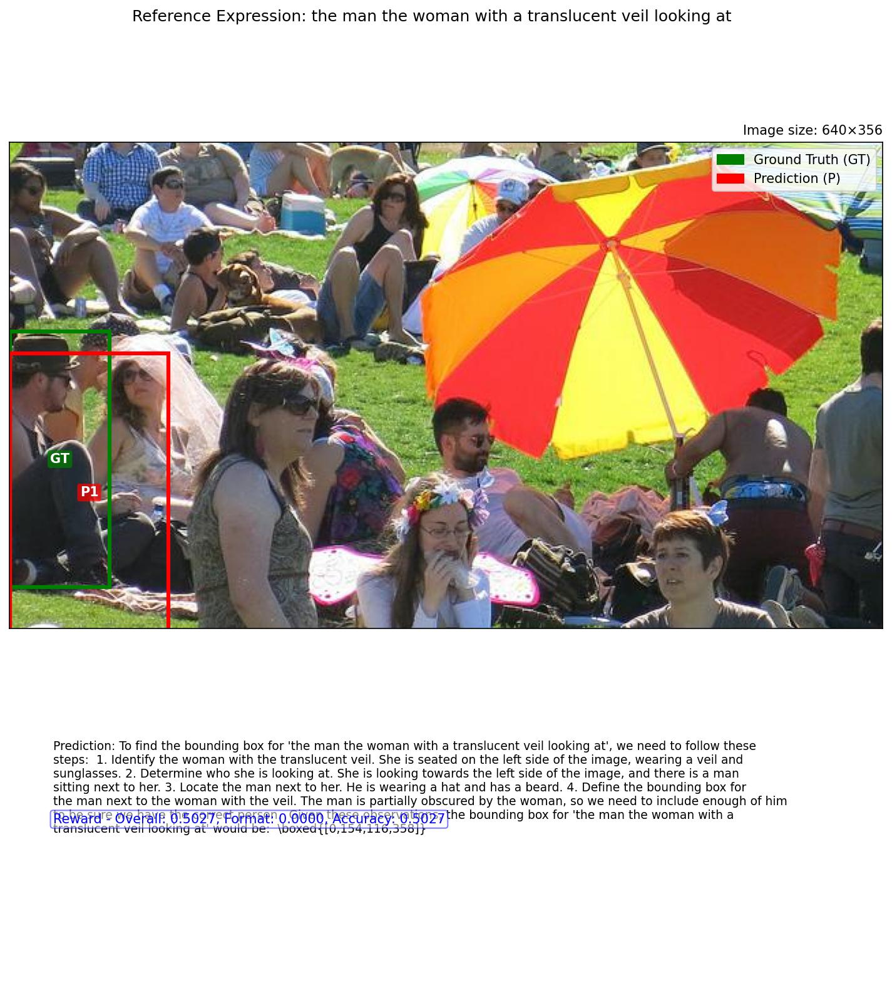

---

### Example 55

**Reference Expression**: the person not blonde, wearing a black top, and not holding a phone

**Ground Truth**: [[316, 10, 475, 219]]

**Predicted**: [[315, 10, 463, 212]]

**Reward**: {'overall': 0.8881643884784495, 'format': 0.0, 'accuracy': 0.8881643884784495}

**Prediction**:
```
To find the bounding box for 'the person not blonde, wearing a black top, and not holding a phone', let's follow these steps:

1. Identify the person wearing a black top: There are two people wearing black tops in the image. One is blonde and the other is not blonde.
2. Determine which black-top person is not blonde: The person on the right side of the image, who is not blonde, is wearing a black top.
3. Ensure this person is not holding a phone: The person in question is not holding a phone.

Based on these observations, the bounding box for 'the person not blonde, wearing a black top, and not holding a phone' is:

\boxed{[315,10,463,212]}
```

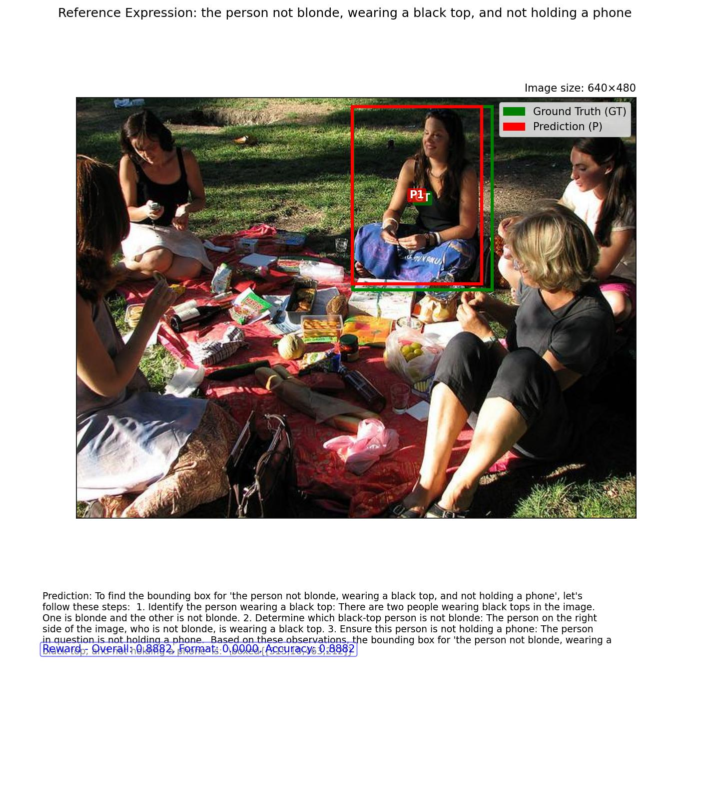

---

### Example 56

**Reference Expression**: a bowl whose exterior is neither red nor white

**Ground Truth**: [[342, 237, 393, 265]]

**Predicted**: [[336, 231, 378, 266]]

**Reward**: {'overall': 0.5333333333333333, 'format': 0.0, 'accuracy': 0.5333333333333333}

**Prediction**:
```
To find the bowl whose exterior is neither red nor white, we need to follow these steps:

1. Identify all the bowls in the image.
2. Check the color of each bowl.
3. Determine which bowl is neither red nor white.

Step 1: Identifying the bowls:
- There is a bowl on the countertop near the woman, which appears to be green.
- There is another bowl further to the right, which appears to be white.
- There is a third bowl on the far right, which also appears to be white.

Step 2: Checking the color of each bowl:
- The green bowl is neither red nor white.
- The white bowls are red and white.

Step 3: Determining which bowl fits the criteria:
- The green bowl is the only one that is neither red nor white.

Thus, the bounding box for the green bowl is:
\boxed{[336,231,378,266]}

This is the bounding box for the bowl whose exterior is neither red nor white.
```

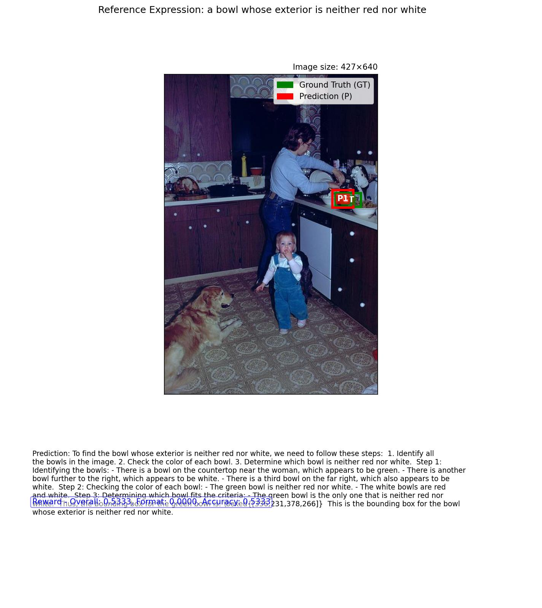

---

### Example 57

**Reference Expression**: the person wearing sneakers that are not blue

**Ground Truth**: [[19, 2, 109, 258]]

**Predicted**: [[21, 1, 113, 253]]

**Reward**: {'overall': 1.0, 'format': 0.0, 'accuracy': 1.0}

**Prediction**:
```
To find the bounding box for 'the person wearing sneakers that are not blue', let's follow these steps:

1. Identify the sneakers in the image: There are two pairs of sneakers visible. One pair is blue, and the other pair is beige.
2. Determine which person is wearing the beige sneakers: The person on the far left is wearing beige sneakers.
3. Locate the bounding box for this person: The person wearing the beige sneakers is standing next to the dog and is partially obscured by other people.

Given these observations, the bounding box for 'the person wearing sneakers that are not blue' (the beige sneakers) would be:

\boxed{[21,1,113,253]}
```

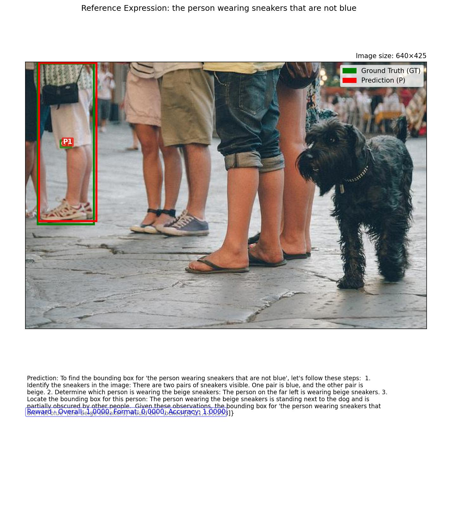

---

### Example 58

**Reference Expression**: the car has a cat wearing a red scarf around its neck

**Ground Truth**: []

**Predicted**: []

**Reward**: {'overall': 1.0, 'format': 0.0, 'accuracy': 1.0}

**Prediction**:
```
The image shows a dog, not a cat, sitting on the back of a car. The dog is wearing a red bandana around its neck, not a cat. Therefore, there is no bounding box for 'the car has a cat wearing a red scarf around its neck' in this image.

\boxed{[]}

```

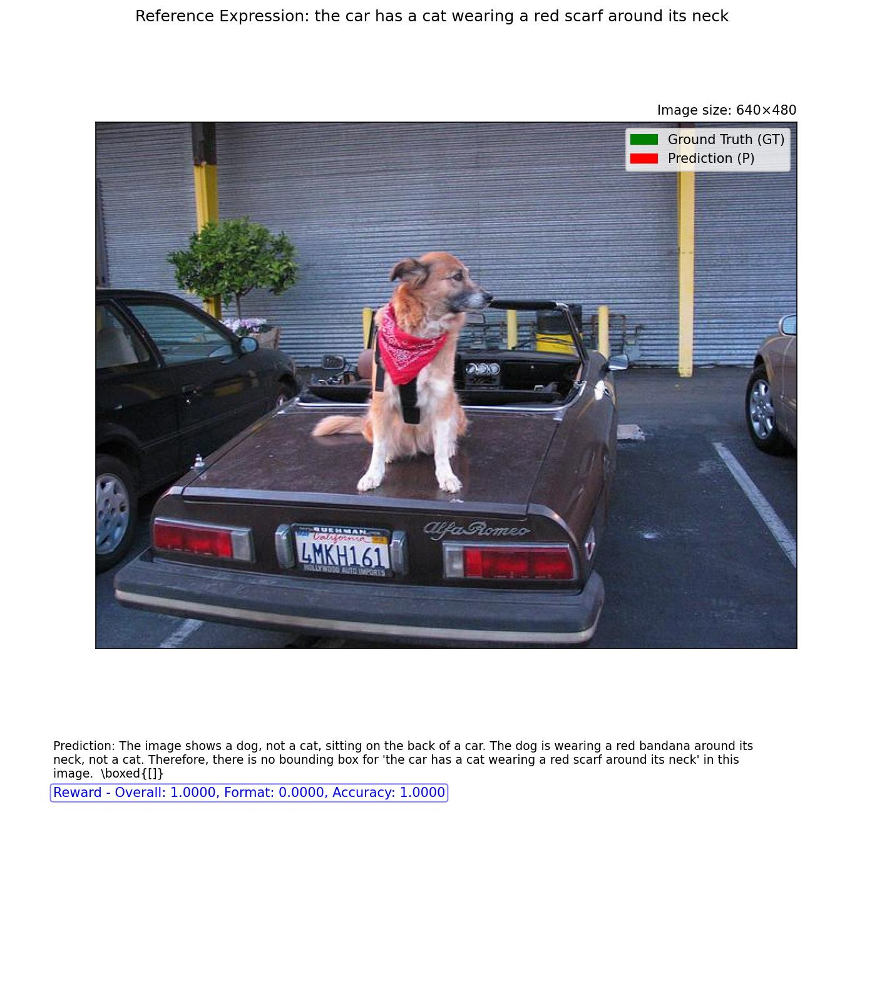

---

### Example 59

**Reference Expression**: the knife that is neither held by anyone nor placed on the marble surface

**Ground Truth**: [[130, 276, 146, 283]]

**Predicted**: [[191, 458, 336, 527]]

**Reward**: {'overall': 0.0, 'format': 0.0, 'accuracy': 0.0}

**Prediction**:
```
To find the knife that is neither held by anyone nor placed on the marble surface, we need to follow these steps:

1. Identify all knives in the image.
2. Determine which knives are being held by someone.
3. Determine which knives are on the marble surface.
4. Identify the remaining knife.

Step 1: Identify all knives in the image.
- There is a knife on the marble surface near the bottom right of the image.
- There is a knife being held by the person in the foreground.
- There is another knife on the table in the background.

Step 2: Determine which knives are being held by someone.
- The knife being held by the person in the foreground is not the one we are looking for.
- The knife in the background is not on the marble surface and is not being held by anyone, so we can ignore it.

Step 3: Determine which knives are on the marble surface.
- The knife on the marble surface near the bottom right of the image is the one we are looking for.

Step 4: Identify the remaining knife.
- The knife in the background is not on the marble surface and is not being held by anyone, so we can ignore it.
- The knife on the marble surface near the bottom right of the image is the one we are looking for.

The knife that is neither held by anyone nor placed on the marble surface is the one in the background on the table.

The final bounding box for the knife that is neither held by anyone nor placed on the marble surface is:
\boxed{[191,458,336,527]}
```

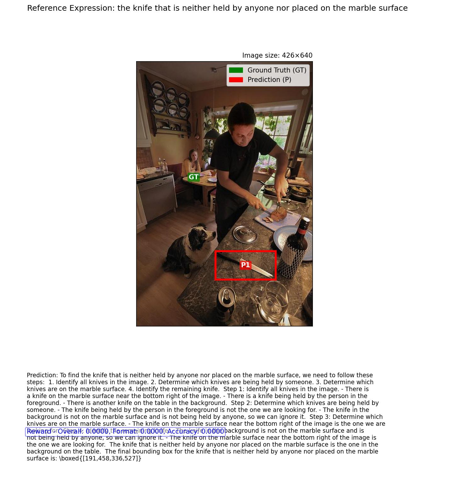

---

### Example 60

**Reference Expression**: the bicycle being ridden by a person holding a dog

**Ground Truth**: [[306, 230, 423, 474]]

**Predicted**: [[325, 230, 430, 469]]

**Reward**: {'overall': 0.7750239899407697, 'format': 0.0, 'accuracy': 0.7750239899407697}

**Prediction**:
```
To find the bounding box for 'the bicycle being ridden by a person holding a dog', we need to follow these steps:

1. Identify the person holding the dog: The person holding the dog is the one in the center of the image, wearing a black tank top and shorts.
2. Locate the bicycle associated with this person: The bicycle is directly behind and to the right of the person holding the dog.
3. Determine the bounding box for the bicycle: The bicycle is partially obscured by the person and the dog, but we can still identify its general position.

Given these observations, the bounding box for 'the bicycle being ridden by a person holding a dog' would be:

\boxed{[325,230,430,469]}
```

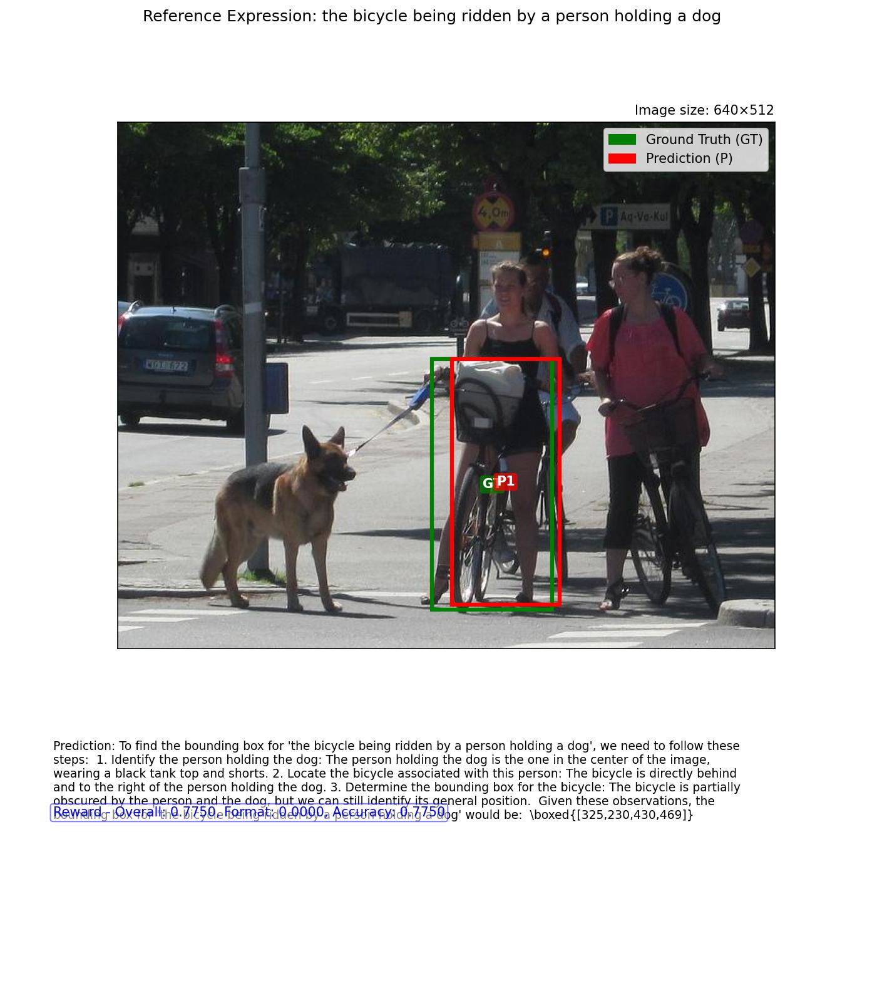

---

### Example 61

**Reference Expression**: the cup mounted on the wall, located in the second row from the top, at the leftmost position

**Ground Truth**: [[331, 80, 346, 97]]

**Predicted**: [[106, 59, 126, 99]]

**Reward**: {'overall': 0.0, 'format': 0.0, 'accuracy': 0.0}

**Prediction**:
```
To find the bounding box for 'the cup mounted on the wall, located in the second row from the top, at the leftmost position', let's follow these steps:

1. Identify the wall in the image that has cups mounted on it. This is typically the wall to the left of the person in the image.
2. Look for the second row of cups from the top on that wall. The first row would be the topmost set of cups.
3. Locate the leftmost cup in the second row. This should be the cup closest to the edge on the left side of the wall.

Following these steps:
- The wall with the cups is the one to the left of the person.
- The second row from the top on this wall has two cups.
- The leftmost cup in the second row is the one closest to the edge on the left side.

The bounding box for this cup would be:
\boxed{[106,59,126,99]}

This bounding box corresponds to the cup in question.
```

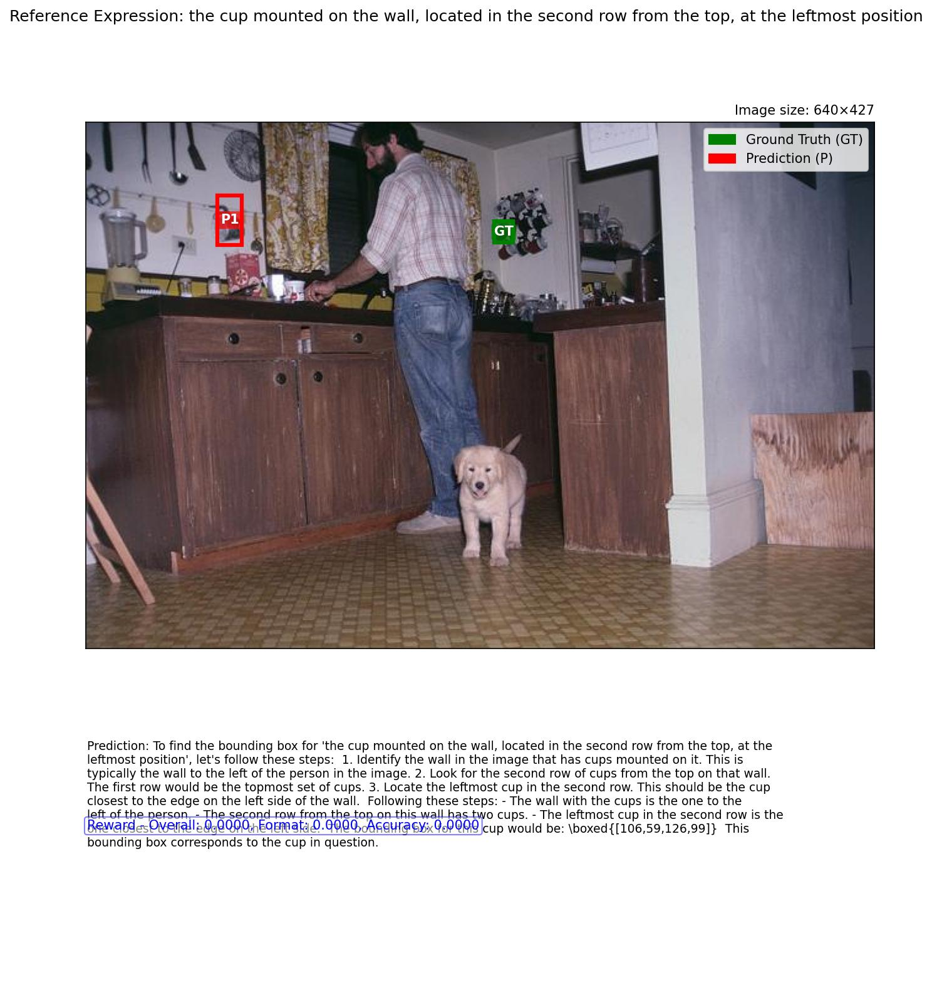

---

### Example 62

**Reference Expression**: the person in the car who is not sitting in the driver's seat

**Ground Truth**: [[278, 371, 310, 409]]

**Predicted**: [[365, 359, 402, 403]]

**Reward**: {'overall': 0.0, 'format': 0.0, 'accuracy': 0.0}

**Prediction**:
```
To find the bounding box for 'the person in the car who is not sitting in the driver's seat', let's follow these steps:

1. Identify the car in the image where there are people inside.
2. Determine which person is not in the driver's seat. The driver's seat is typically the front seat on the left side of the car when facing forward.
3. Look for the person in the car who is not in the driver's seat. This person is likely in the passenger seat or in the back seat.

Upon analyzing the image:
- The car in the center of the image has two visible people inside.
- The person in the driver's seat appears to be the one wearing a white shirt.
- The person in the passenger seat appears to be wearing a darker shirt.

Thus, the person in the car who is not sitting in the driver's seat is the one in the passenger seat.

The bounding box for this person is:
\boxed{[365,359,402,403]}
```

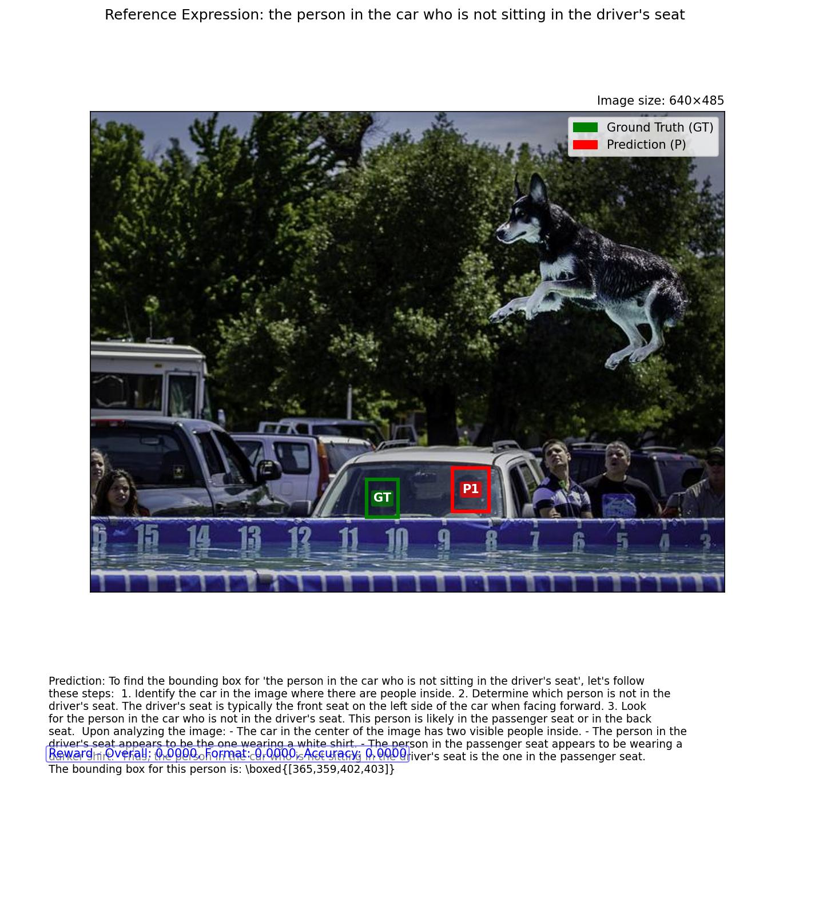

---

### Example 63

**Reference Expression**: the bench that a dog is sitting on

**Ground Truth**: []

**Predicted**: [[1, 51, 243, 331]]

**Reward**: {'overall': 0.0, 'format': 0.0, 'accuracy': 0.0}

**Prediction**:
```
To find the corresponding bounding box for 'the bench that a dog is sitting on', we need to follow these steps:

1. Identify the dog in the image. The dog is in a basket attached to a bicycle.
2. Locate the bench that the dog is sitting on. The bench is the one directly behind the dog, which is part of the bleachers.
3. Determine the bounding box for the bench. The bench is a set of horizontal wooden planks supported by vertical metal poles.

Given these observations, the bench that the dog is sitting on is the one directly behind the dog in the image. The bounding box for this bench can be described as the set of horizontal wooden planks.

The bounding box for 'the bench that a dog is sitting on' is:
\boxed{[1,51,243,331]}
```

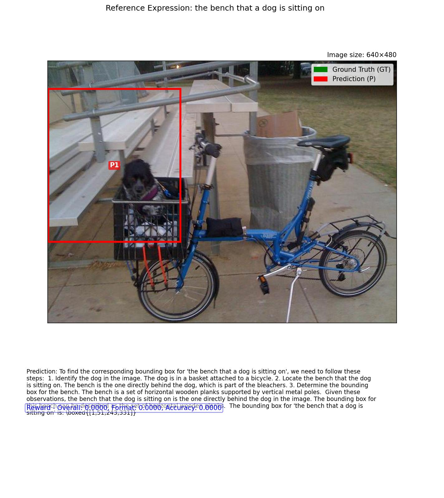

---

### Example 64

**Reference Expression**: the car located to the left of the car containing the dog

**Ground Truth**: [[70, 260, 212, 463]]

**Predicted**: [[73, 256, 210, 463]]

**Reward**: {'overall': 1.0, 'format': 0.0, 'accuracy': 1.0}

**Prediction**:
```
To find the bounding box for 'the car located to the left of the car containing the dog', we need to follow these steps:

1. Identify the car containing the dog: This is the red car on the right side of the image.
2. Locate the car to the left of the red car: This is the black car partially visible on the left side of the image.

The black car is the one we're looking for. Its bounding box can be determined by observing its position relative to the red car and the side mirror.

The final bounding box for 'the car located to the left of the car containing the dog' is:
\boxed{[73,256,210,463]}
```

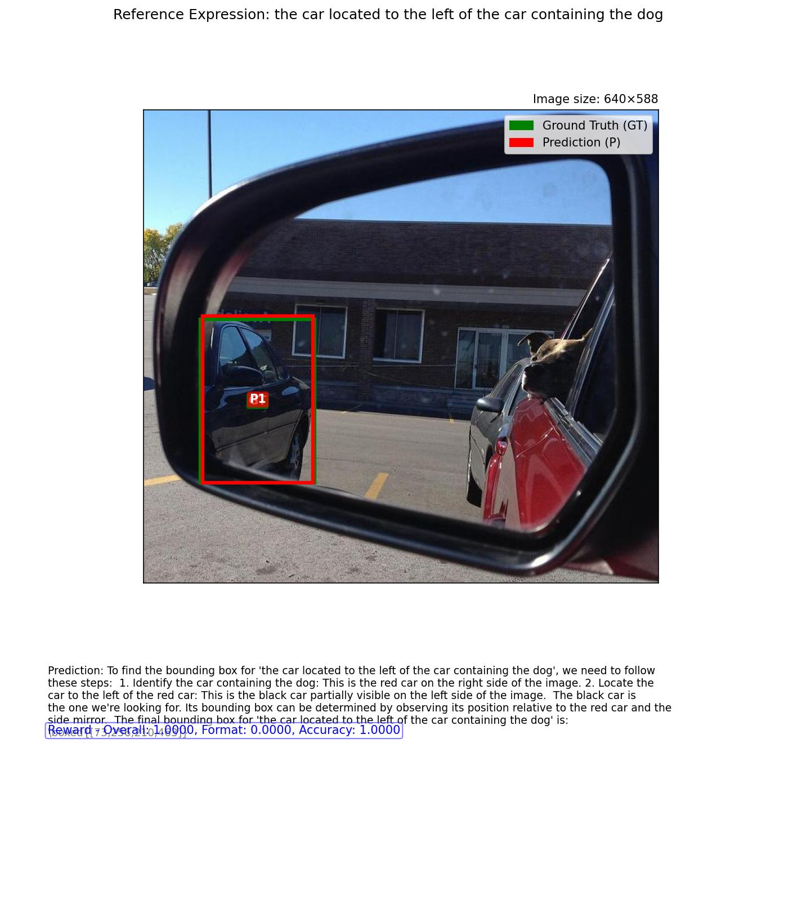

---

### Example 65

**Reference Expression**: the bicycle in the background positioned between the person wearing a black shirt and white pants and the person wearing a black-and-white patterned shirt and shorts, mostly obscured by other objects

**Ground Truth**: [[335, 49, 365, 158]]

**Predicted**: [[334, 48, 368, 155]]

**Reward**: {'overall': 0.8530042918454935, 'format': 0.0, 'accuracy': 0.8530042918454935}

**Prediction**:
```
To find the bounding box for the bicycle in the background positioned between the person wearing a black shirt and white pants and the person wearing a black-and-white patterned shirt and shorts, mostly obscured by other objects, we can follow these steps:

1. Identify the person wearing a black shirt and white pants. This person is partially visible on the left side of the image.
2. Identify the person wearing a black-and-white patterned shirt and shorts. This person is standing in the center of the image, slightly to the right.
3. Observe the area between these two individuals. The bicycle in question is partially obscured by other objects but can be identified by its position and the context of the scene.
4. Locate the bicycle in the background. It is positioned between the two individuals and is mostly hidden by them and other objects.

Given the context, the bicycle in question is likely the one positioned between the two individuals and is partially obscured. The bounding box for this bicycle can be estimated by its general location and the relative positions of the people around it.

\boxed{[334,48,368,155]}
```

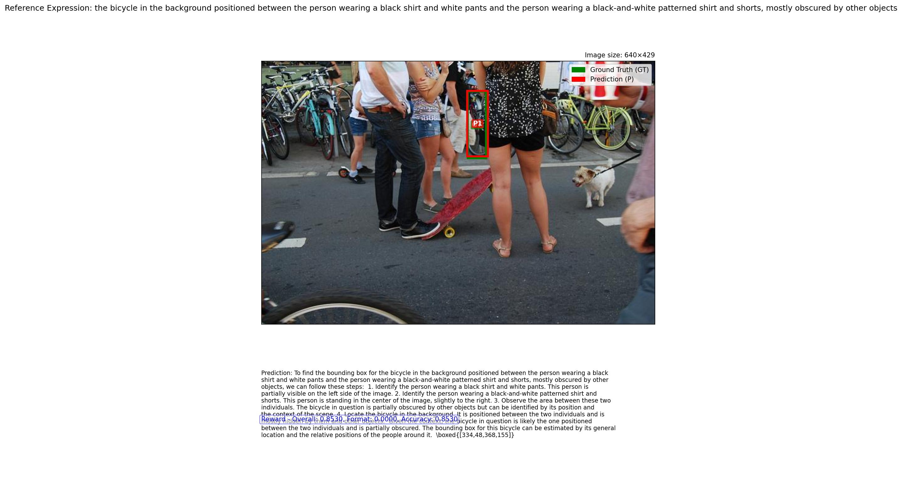

---

### Example 66

**Reference Expression**: the second hanging potted plant from the right

**Ground Truth**: [[339, 0, 380, 39]]

**Predicted**: [[337, 0, 369, 41]]

**Reward**: {'overall': 0.672027570361861, 'format': 0.0, 'accuracy': 0.672027570361861}

**Prediction**:
```
To find 'the second hanging potted plant from the right', we need to follow these steps:

1. Identify the right side of the image where the hanging potted plants are located.
2. Count from the right to the left to find the second hanging potted plant.

Looking at the image:
- The rightmost hanging potted plant is the first one we need to count.
- The second one from the right is the one next to it.

The second hanging potted plant from the right is located in the middle of the right side of the image, slightly to the left of the center of the image.

The bounding box for 'the second hanging potted plant from the right' is:
\boxed{[337,0,369,41]}

This bounding box captures the second hanging potted plant from the right, which is located near the center of the image.
```

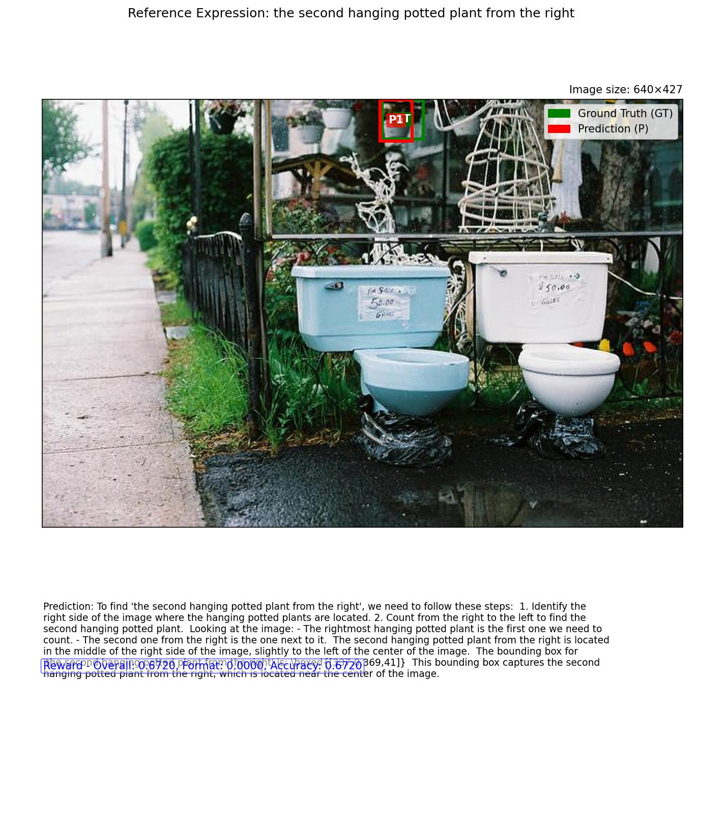

---

### Example 67

**Reference Expression**: a watermelon in a bowl placed centrally on the wooden countertop island

**Ground Truth**: []

**Predicted**: [[336, 202, 377, 227]]

**Reward**: {'overall': 0.0, 'format': 0.0, 'accuracy': 0.0}

**Prediction**:
```
To find the corresponding bounding box for 'a watermelon in a bowl placed centrally on the wooden countertop island', let's follow these steps:

1. Identify the wooden countertop island: It is the central part of the kitchen with a wooden surface, located between the kitchen cabinets and the other countertops.
2. Look for a bowl on the wooden countertop island: There is a bowl placed on the island.
3. Check the contents of the bowl: The bowl contains a watermelon.
4. Determine the central position of the watermelon in the bowl: The watermelon is located in the center of the bowl.
5. Define the bounding box for the watermelon: The bounding box should encompass the watermelon and the bowl it is in.

After these steps, we can conclude that the watermelon is indeed in the center of the wooden countertop island, and the bounding box for it can be defined as follows:

\boxed{[336,202,377,227]}
```

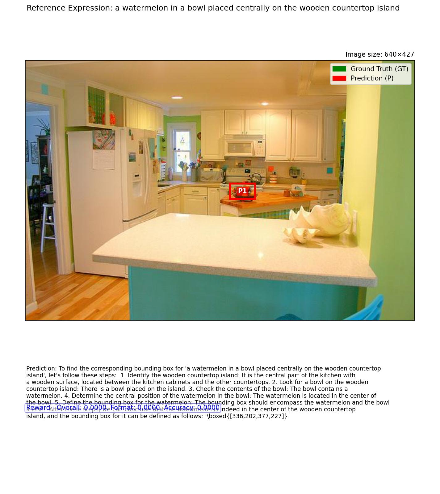

---

### Example 68

**Reference Expression**: a red bowl that is not located on the top shelf of the right set of cabinets

**Ground Truth**: [[276, 84, 297, 90]]

**Predicted**: [[485, 108, 505, 126]]

**Reward**: {'overall': 0.0, 'format': 0.0, 'accuracy': 0.0}

**Prediction**:
```
To find the corresponding bounding box for 'a red bowl that is not located on the top shelf of the right set of cabinets', we need to follow these steps:

1. Identify the right set of cabinets: These are the ones on the right side of the image, above the kitchen counter.
2. Locate the top shelf: The top shelf of the right set of cabinets is the highest shelf.
3. Look for a red bowl: We need to find a red bowl that is not on the top shelf.
4. Examine the shelves: The red bowl is located on the second shelf from the top, not on the top shelf.

After analyzing the image, the bounding box for the red bowl on the second shelf from the top is:
\boxed{[485,108,505,126]}
```

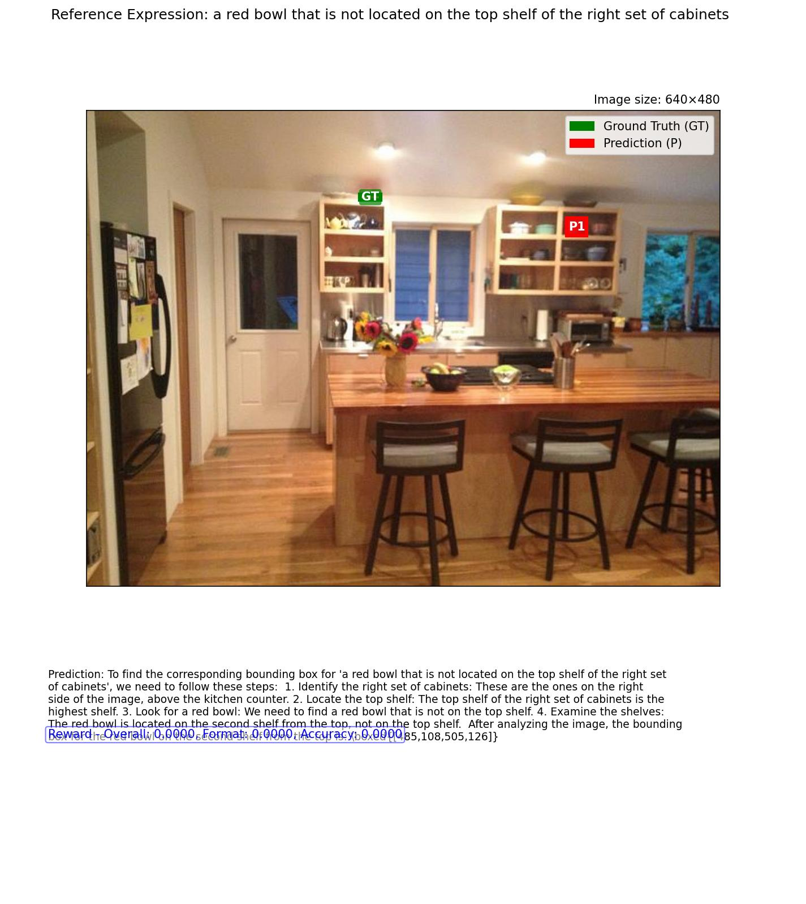

---

### Example 69

**Reference Expression**: a wine glass located on top of the stove

**Ground Truth**: []

**Predicted**: []

**Reward**: {'overall': 1.0, 'format': 0.0, 'accuracy': 1.0}

**Prediction**:
```
To find the wine glass located on top of the stove, we need to follow these steps:

1. Identify the stove: The stove is the white appliance with a control panel and burners in the center of the image.
2. Check the top of the stove: Look for any objects that might be placed there.
3. Identify the wine glass: A wine glass is typically tall and slender, often with a stem. It should be placed upright.

Upon close inspection of the stove, there doesn't appear to be a wine glass on top of it. The stove area seems to have a pot on it and some other kitchen items, but no wine glass is visible.

Given the analysis, the bounding box for 'a wine glass located on top of the stove' is \boxed{[]}.
```

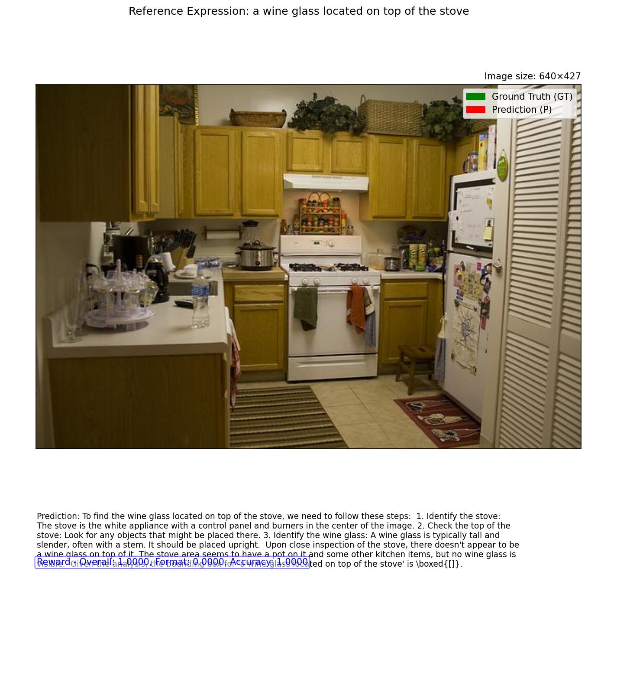

---

### Example 70

**Reference Expression**: the chair close to the fruit and not next to the refrigerator

**Ground Truth**: [[116, 190, 166, 215]]

**Predicted**: [[210, 328, 309, 419]]

**Reward**: {'overall': 0.0, 'format': 0.0, 'accuracy': 0.0}

**Prediction**:
```
To find the bounding box for 'the chair close to the fruit and not next to the refrigerator', let's follow these steps:

1. Identify the fruit: The fruit is a bowl of oranges and bananas on the table.
2. Identify the chairs: There are two chairs visible in the image. One is close to the fruit and the other is further away.
3. Determine which chair is close to the fruit and not next to the refrigerator: The chair close to the fruit is the one on the left side of the table, and it is not next to the refrigerator.

Following these steps, the bounding box for 'the chair close to the fruit and not next to the refrigerator' is:

\boxed{[210,328,309,419]}
```

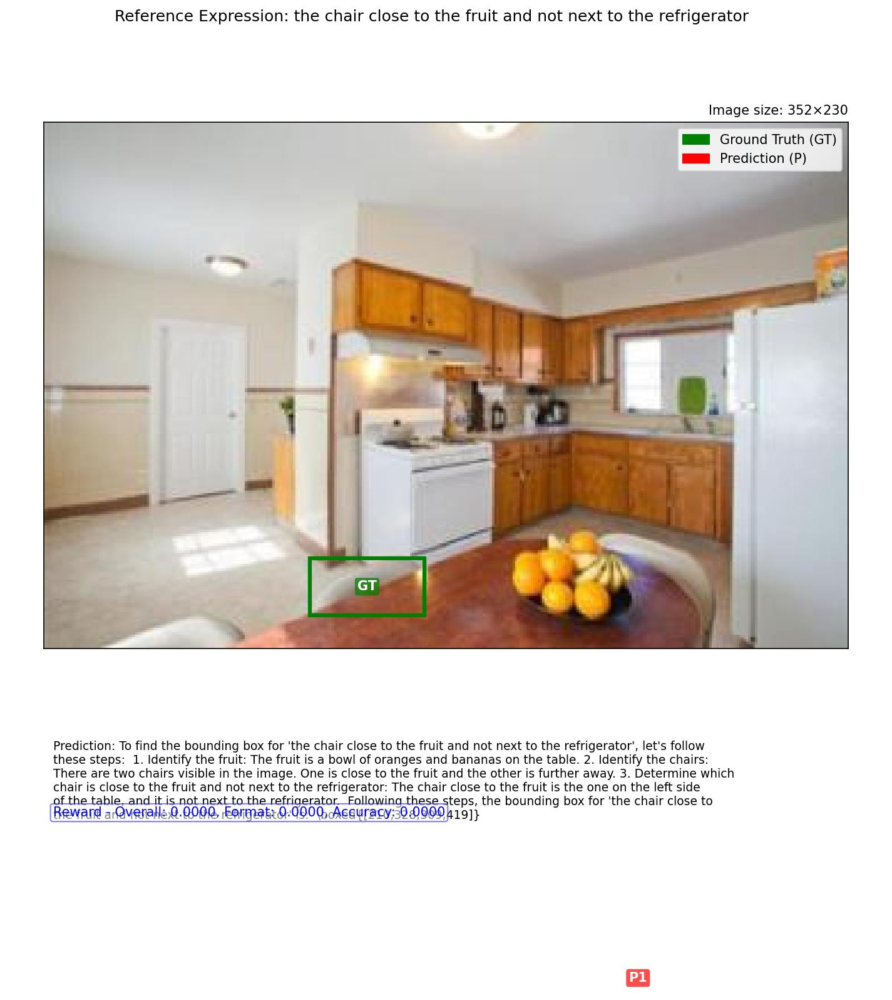

---

### Example 71

**Reference Expression**: the plant located between a yellow bottle and a blue bottle

**Ground Truth**: [[270, 181, 299, 243]]

**Predicted**: [[270, 184, 301, 245]]

**Reward**: {'overall': 0.8650151668351871, 'format': 0.0, 'accuracy': 0.8650151668351871}

**Prediction**:
```
To find the plant located between a yellow bottle and a blue bottle, follow these steps:

1. Identify the yellow bottle: Look for a yellow bottle in the image, which appears to be on the window sill.
2. Identify the blue bottle: Next to the yellow bottle, locate the blue bottle.
3. Find the plant: Between these two bottles, there is a plant.

By analyzing the image, the plant in question is positioned between the yellow bottle and the blue bottle.

The bounding box for the plant located between a yellow bottle and a blue bottle is:
\boxed{[270,184,301,245]}
```

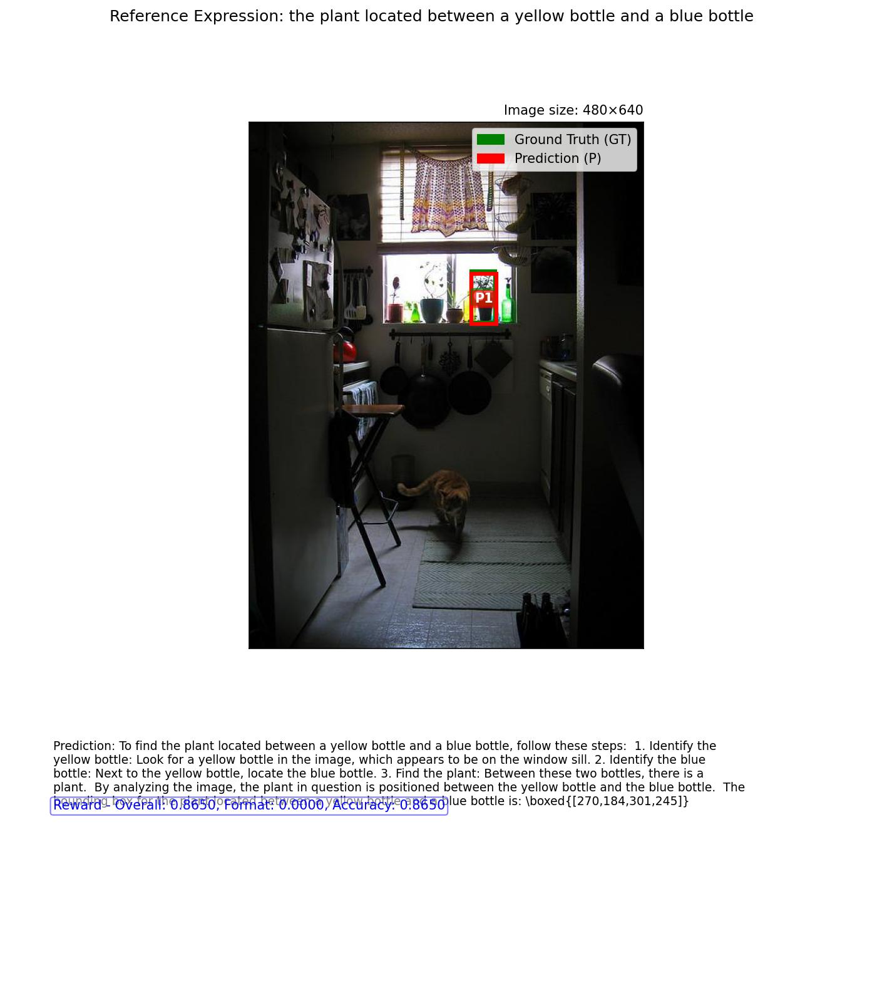

---

### Example 72

**Reference Expression**: the plant that is neither hanging nor placed on a kitchen table

**Ground Truth**: [[449, 176, 513, 299]]

**Predicted**: [[454, 172, 527, 266]]

**Reward**: {'overall': 0.5634550084889643, 'format': 0.0, 'accuracy': 0.5634550084889643}

**Prediction**:
```
To find 'the plant that is neither hanging nor placed on a kitchen table', let's follow these steps:

1. Identify all plants in the image:
   - There is a hanging plant on the left side of the window.
   - There is a plant on the kitchen counter to the right of the sink.
   - There are flowers on the kitchen table.
   - There are plants on the kitchen counter near the sink.

2. Determine which plant is not hanging and not on the kitchen table:
   - The hanging plant is clearly hanging.
   - The flowers on the kitchen table are on the table.
   - The plants on the kitchen counter near the sink are on the counter.
   - The plant on the kitchen counter to the right of the sink is on the counter.

3. The remaining plant is the one that is neither hanging nor on the kitchen table. This plant is on the kitchen counter to the right of the sink.

Therefore, the bounding box for 'the plant that is neither hanging nor placed on a kitchen table' is:
\boxed{[454,172,527,266]}
```

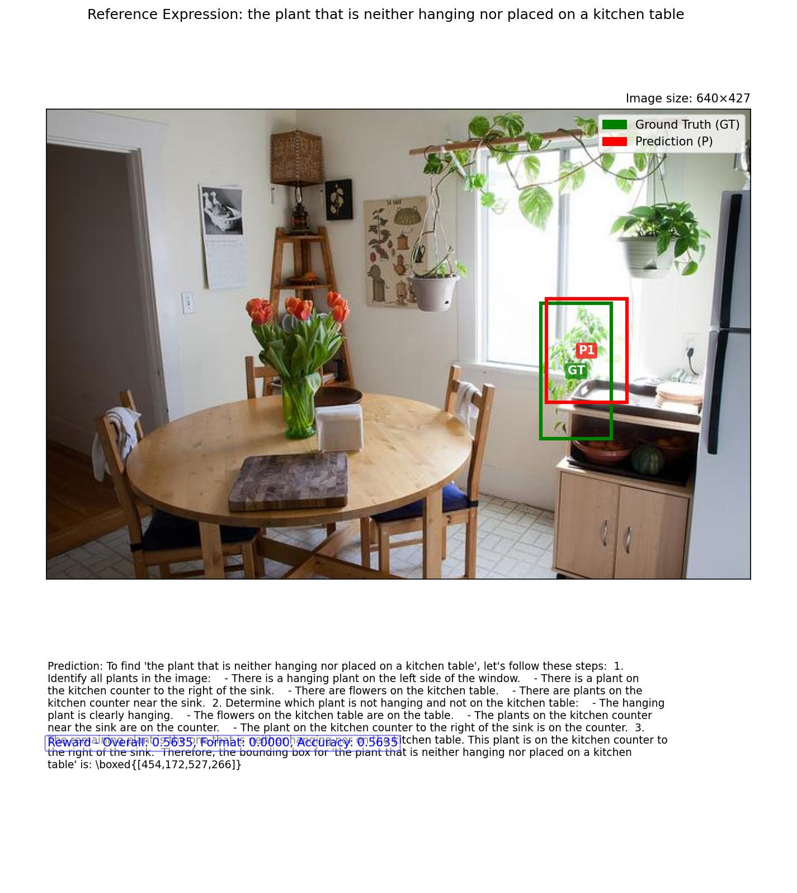

---

### Example 73

**Reference Expression**: a cup on the middle shelf of the left wall, surrounded by wine glasses

**Ground Truth**: [[67, 220, 83, 254]]

**Predicted**: [[65, 287, 82, 311]]

**Reward**: {'overall': 0.0, 'format': 0.0, 'accuracy': 0.0}

**Prediction**:
```
To find the bounding box for 'a cup on the middle shelf of the left wall, surrounded by wine glasses', let's follow these steps:

1. Identify the left wall: The left wall has shelves with various items.
2. Locate the middle shelf: The middle shelf is the second shelf from the top on the left wall.
3. Identify the items on the middle shelf: There are wine glasses on the left side and a cup on the right side of the middle shelf.
4. Focus on the cup: The cup is on the right side of the middle shelf, surrounded by wine glasses.

Given these observations, the bounding box for the cup should be positioned to the right of the wine glasses on the middle shelf. The bounding box would be relatively small, focusing on the cup.

Considering the exact placement:
- The bounding box for the cup would be approximately [65, 287, 82, 311].

Thus, the final bounding box is:
\boxed{[65, 287, 82, 311]}
```

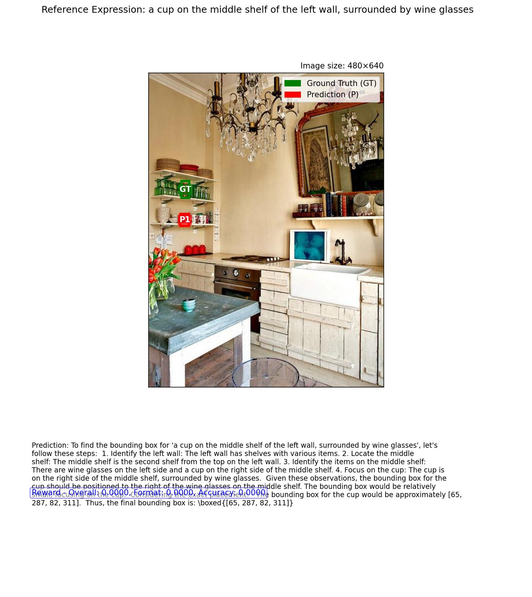

---

### Example 74

**Reference Expression**: a person wiping her face with a towel

**Ground Truth**: []

**Predicted**: []

**Reward**: {'overall': 1.0, 'format': 0.0, 'accuracy': 1.0}

**Prediction**:
```
The image provided is a photograph of a bathroom. It does not contain any people or individuals wiping their face with a towel. The image is focused on the bathroom setup, including a sink, a mirror, a shower, a towel, a plant, and some framed pictures. Since there are no people in the image, it is not possible to identify a bounding box for 'a person wiping her face with a towel'.

\boxed{[]}

```

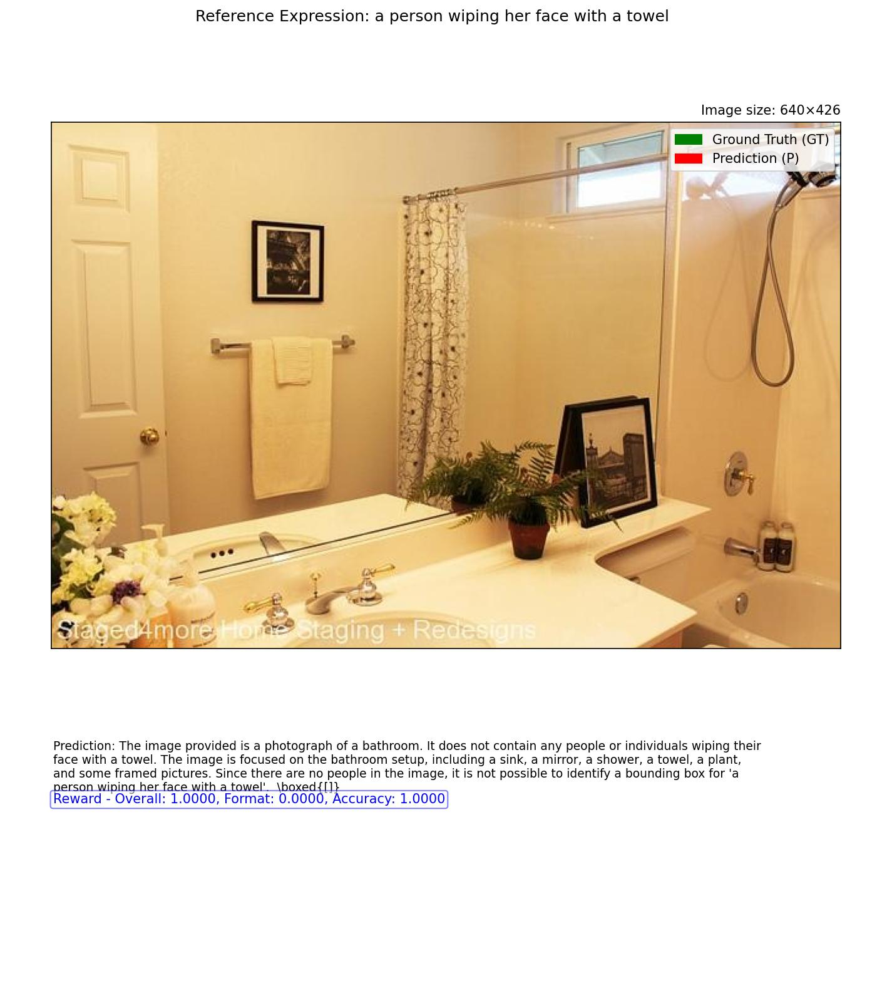

---

### Example 75

**Reference Expression**: the smaller bowl that is yellow

**Ground Truth**: [[314, 228, 335, 247]]

**Predicted**: [[315, 224, 336, 245]]

**Reward**: {'overall': 0.68, 'format': 0.0, 'accuracy': 0.68}

**Prediction**:
```
To find the bounding box for 'the smaller bowl that is yellow', let's follow these steps:

1. Identify the yellow objects in the image: The yellow objects appear to be small containers on the counter.
2. Determine which one is the 'smaller' bowl: Among the yellow objects, there are two. One is larger and appears to be a basket, while the other is smaller and more bowl-like.
3. Locate the smaller bowl: The smaller bowl is the one that is not a basket and is more bowl-like in shape.

After analyzing the image, the smaller yellow bowl is located on the counter near the center of the image.

The bounding box for the smaller yellow bowl is:
\boxed{[315,224,336,245]}
```

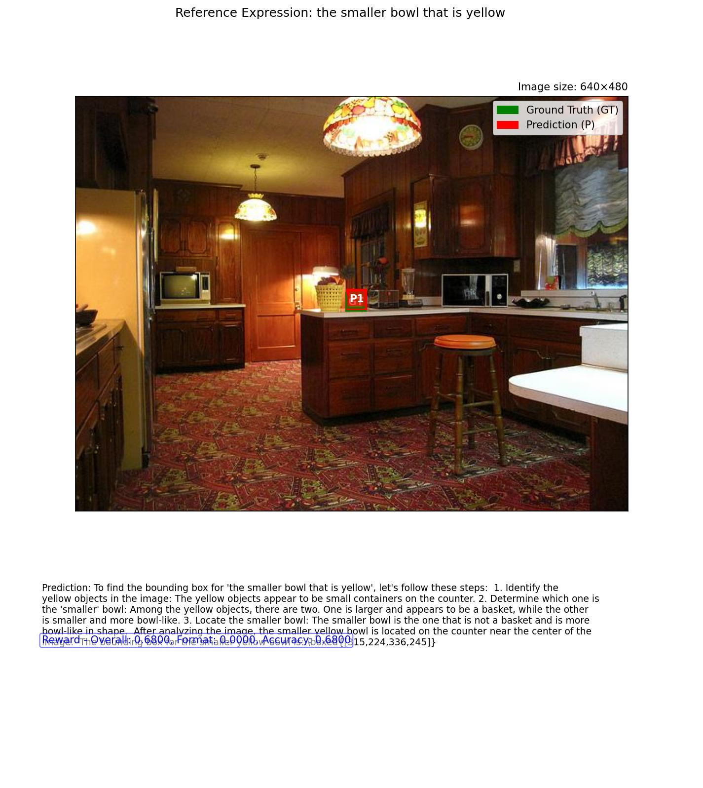

---

### Example 76

**Reference Expression**: the figure of a person that has a solid-colored background that is not white

**Ground Truth**: [[236, 73, 248, 89]]

**Predicted**: [[328, 6, 468, 219]]

**Reward**: {'overall': 0.0, 'format': 0.0, 'accuracy': 0.0}

**Prediction**:
```
To find the bounding box for 'the figure of a person that has a solid-colored background that is not white', we need to follow these steps:

1. Identify all the figures of people on the screen.
2. Determine which of these figures have a solid-colored background that is not white.
3. Provide the bounding box for the figure that meets the criteria.

Step 1: Identifying the figures of people on the screen:
- The screen on the left displays a webpage with multiple figures of people, some of which have solid-colored backgrounds.
- The screen on the right displays a webpage with a figure of a person in a room setting, which does not have a solid-colored background.

Step 2: Determining which figure has a solid-colored background that is not white:
- The figure of a person on the left screen has a solid-colored background that is not white. Specifically, the figure in the top right of the left screen appears to have a solid-colored background that is not white.

Step 3: Providing the bounding box for the figure that meets the criteria:
- The figure of a person on the left screen with a solid-colored background that is not white is located in the top right area of the left screen.

The bounding box for this figure is:
\boxed{[328,6,468,219]}

This bounding box corresponds to the area on the left screen where the figure of a person is displayed with a solid-colored background that is not white.
```

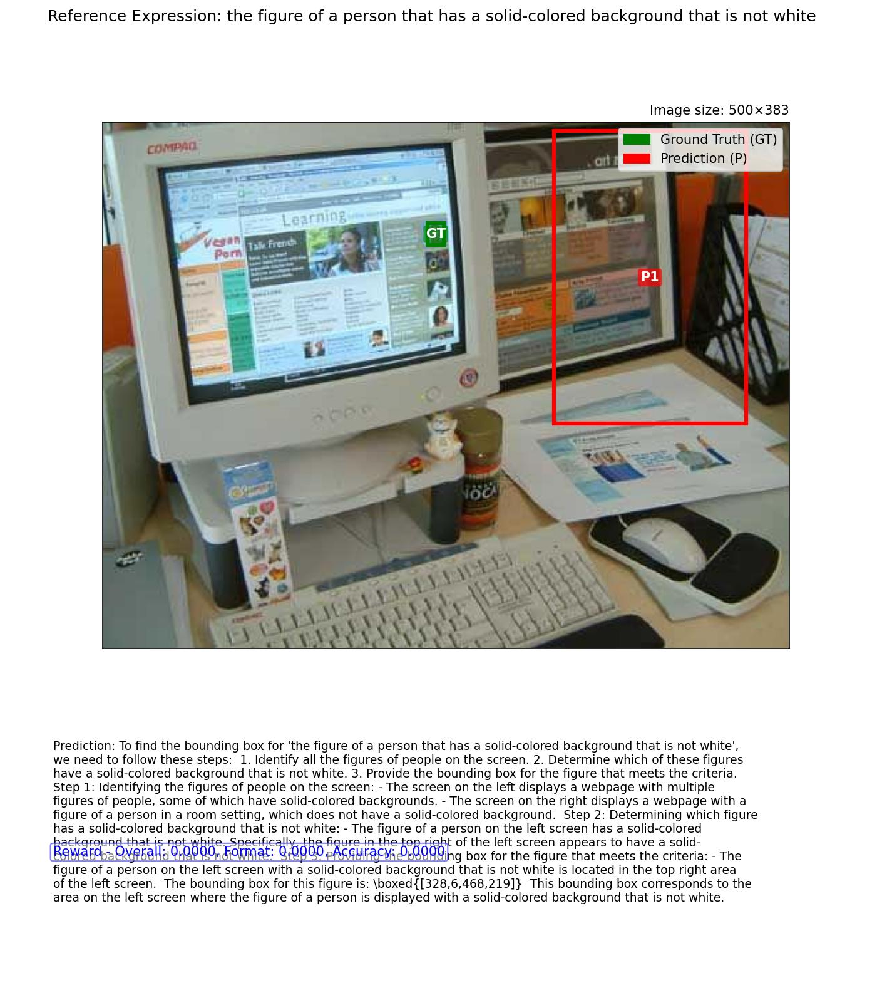

---

### Example 77

**Reference Expression**: a display screen that is not showing any content with red color

**Ground Truth**: [[20, 133, 86, 212]]

**Predicted**: [[22, 148, 108, 221]]

**Reward**: {'overall': 0.5538128718226069, 'format': 0.0, 'accuracy': 0.5538128718226069}

**Prediction**:
```
To find the bounding box for 'a display screen that is not showing any content with red color', we need to follow these steps:

1. Identify the display screens in the image.
2. Determine which of these screens are not displaying any content and do not have red color.

Step 1: Identifying the display screens:
- There are multiple display screens in the image. We need to focus on the one that is not showing any content and does not have red color.

Step 2: Determining the characteristics of the screen:
- The screen in question should not be showing any content, and it should not have red color.
- Upon inspection, there is a screen on the left side of the image that appears to be turned off or not displaying any content, and it does not have red color.

The screen in question is located on the left side of the image, to the left of the "Keisei Ticket Counter" sign. It is a digital display that is currently not showing any content.

The bounding box for this screen is:
\boxed{[22,148,108,221]}
```

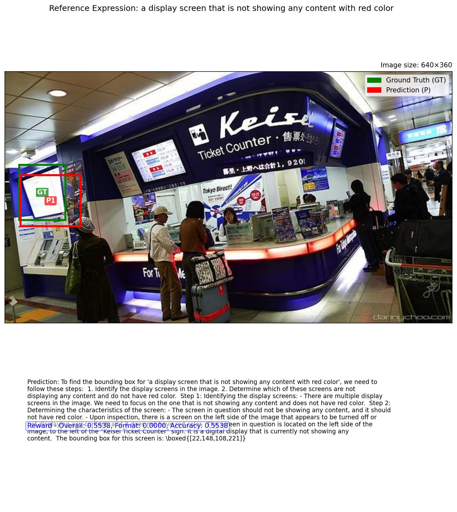

---

### Example 78

**Reference Expression**: the bottle that is not empty and is located on the right side of the flower

**Ground Truth**: []

**Predicted**: [[395, 385, 434, 441]]

**Reward**: {'overall': 0.0, 'format': 0.0, 'accuracy': 0.0}

**Prediction**:
```
To find the corresponding bounding box for 'the bottle that is not empty and is located on the right side of the flower', we need to follow these steps:

1. Identify the flower: The flower is in the center of the image, in a vase, with orange flowers.
2. Locate the bottle on the right side of the flower: There is a bottle to the right of the flower, which appears to be partially filled with a liquid.
3. Determine if the bottle is not empty: The bottle has some liquid in it, indicating it is not empty.

Given these observations, the bounding box for 'the bottle that is not empty and is located on the right side of the flower' can be identified as follows:

\boxed{[395,385,434,441]}
```

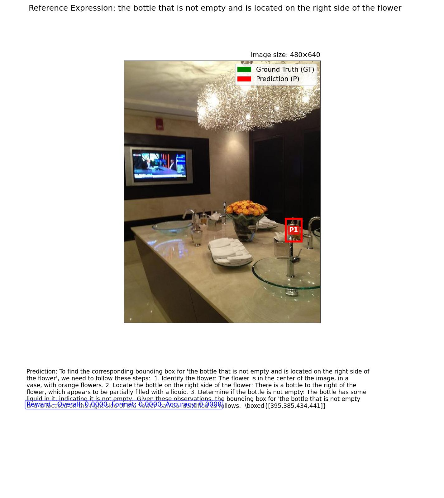

---

### Example 79

**Reference Expression**: the third chair from the left at the dining table

**Ground Truth**: [[444, 300, 543, 361]]

**Predicted**: [[296, 262, 406, 382]]

**Reward**: {'overall': 0.0, 'format': 0.0, 'accuracy': 0.0}

**Prediction**:
```
To find 'the third chair from the left at the dining table', let's follow these steps:

1. Identify the dining table: The dining table is the one in the foreground of the image, with chairs arranged around it.
2. Count the chairs from the left: Starting from the left side of the image, count the chairs around the table. The first chair is on the left side, the second chair is next to it, and the third chair is the one we need to identify.
3. Locate the third chair: The third chair from the left at the dining table is the one that is not directly next to the table but is part of the larger seating arrangement, which includes a central console.

Given these observations, the bounding box for 'the third chair from the left at the dining table' is:
\boxed{[296,262,406,382]}
```

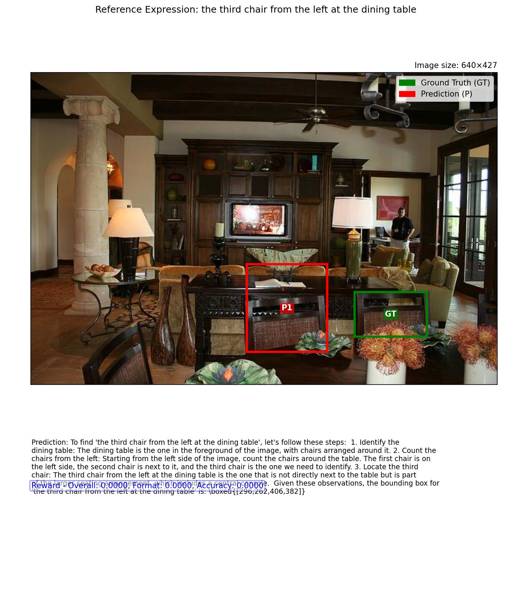

---

### Example 80

**Reference Expression**: an orange cat sitting on the carpet watching tv

**Ground Truth**: []

**Predicted**: []

**Reward**: {'overall': 1.0, 'format': 0.0, 'accuracy': 1.0}

**Prediction**:
```
The image shows a cat sitting on the floor watching a television. The cat appears to be grey with black stripes, not orange. Therefore, there is no orange cat in the image.

The bounding box for 'an orange cat sitting on the carpet watching tv' would be:

\boxed{[]}

This is because the cat in the image is grey, not orange.
```

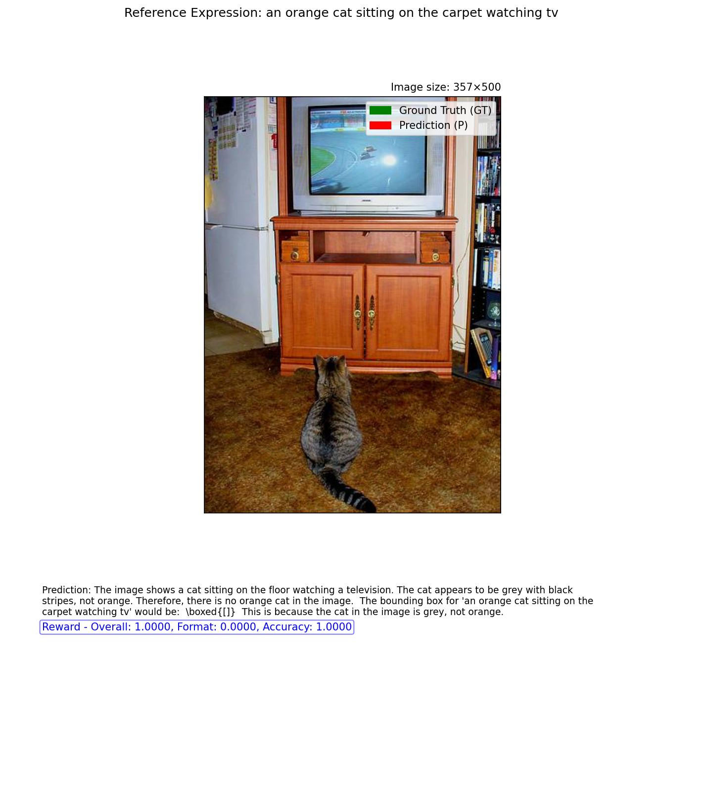

---

### Example 81

**Reference Expression**: the second bicycle that is laying on top of the motorcycle

**Ground Truth**: [[261, 174, 507, 224]]

**Predicted**: [[280, 133, 505, 274]]

**Reward**: {'overall': 0.34324942791762014, 'format': 0.0, 'accuracy': 0.34324942791762014}

**Prediction**:
```
To find the bounding box for 'the second bicycle that is laying on top of the motorcycle', let's follow these steps:

1. Identify the motorcycle: The motorcycle is the main object in the foreground, with a visible front wheel, handlebars, and a seat.
2. Locate the bicycles: There are multiple bicycles stacked on the motorcycle's rear rack. We need to focus on the second bicycle from the top.
3. Determine the second bicycle: The second bicycle from the top is the one that is partially obscured by the first bicycle but still clearly visible.
4. Define the bounding box: The bounding box should encompass the entire second bicycle, including its wheels and frame.

Considering these steps, the bounding box for 'the second bicycle that is laying on top of the motorcycle' is:

\boxed{[280,133,505,274]}
```

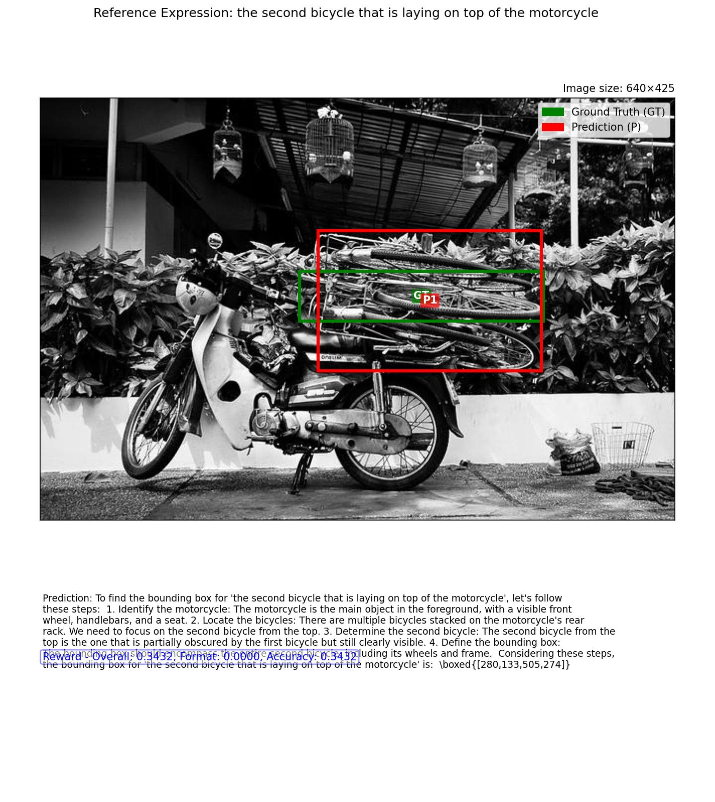

---

### Example 82

**Reference Expression**: the white pigeon burying its head inside the bread

**Ground Truth**: []

**Predicted**: []

**Reward**: {'overall': 1.0, 'format': 0.0, 'accuracy': 1.0}

**Prediction**:
```
The image shows a pigeon in the middle, which is not a white pigeon but rather a dark-colored pigeon. There is no white pigeon in the image that is burying its head inside the bread. The pigeon in the middle is the one interacting with the bread, but it is not white.

Since there is no white pigeon in the image that fits the description, the bounding box for 'the white pigeon burying its head inside the bread' would be:

\boxed{[]}
```

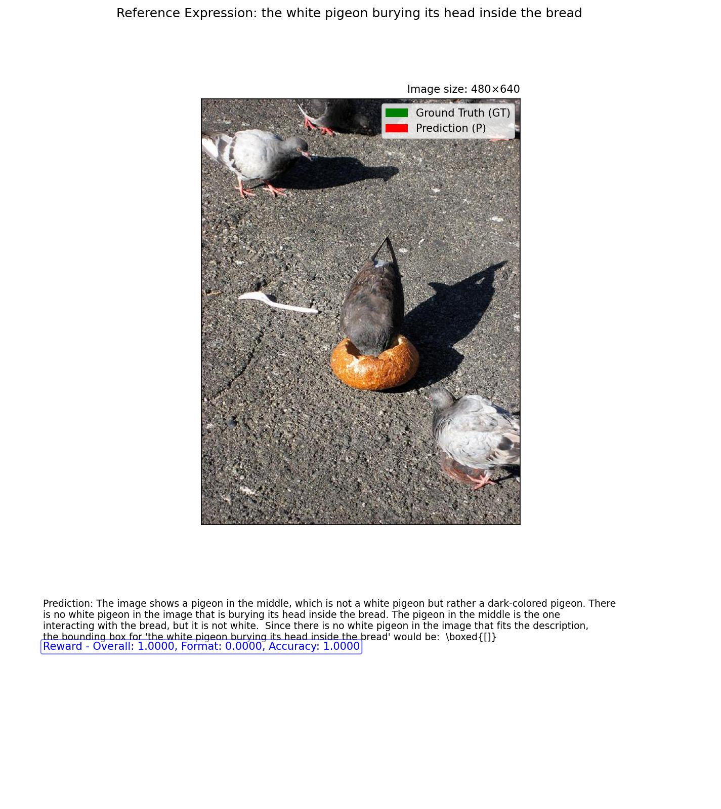

---

### Example 83

**Reference Expression**: the car that is neither blue nor on the left side of the road and does not have a cat on it

**Ground Truth**: [[274, 32, 291, 41]]

**Predicted**: [[281, 36, 312, 56]]

**Reward**: {'overall': 0.0, 'format': 0.0, 'accuracy': 0.0}

**Prediction**:
```
To find the bounding box for the car that is neither blue nor on the left side of the road and does not have a cat on it, we need to follow these steps:

1. Identify the car on the left side of the road. The car on the left side of the road is blue and has a cat on it, so it's not the one we're looking for.
2. Identify the car on the right side of the road. The car on the right side of the road is not blue and does not have a cat on it.
3. Ensure the car we select is neither blue nor on the left side of the road and does not have a cat on it.

The car on the right side of the road and not on the left side of the road is the one we need. It is not blue and does not have a cat on it.

The bounding box for this car is \boxed{[281,36,312,56]}.
```

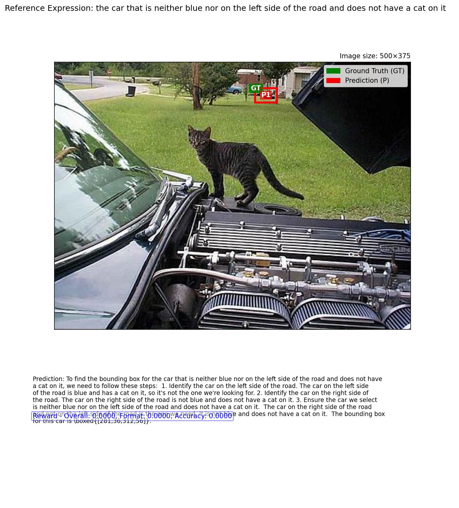

---

### Example 84

**Reference Expression**: the car whose license plate number begins with a digit other than one

**Ground Truth**: [[472, 80, 638, 384]]

**Predicted**: [[449, 55, 644, 365]]

**Reward**: {'overall': 0.7438211433243193, 'format': 0.0, 'accuracy': 0.7438211433243193}

**Prediction**:
```
To determine the car whose license plate number begins with a digit other than one, we need to analyze the license plates of the cars in the image.

1. Identify the license plates:
   - The car on the left has the license plate "VD-13180".
   - The car in the middle has the license plate "VD-526200".

2. Determine the starting digit of each license plate:
   - For "VD-13180", the starting digit is 1.
   - For "VD-526200", the starting digit is 5.

3. Compare the starting digits:
   - The car on the left has a license plate starting with 1.
   - The car in the middle has a license plate starting with 5.

4. Identify the car with the license plate starting with a digit other than 1:
   - The car in the middle has the license plate "VD-526200" starting with 5.

Therefore, the car whose license plate number begins with a digit other than one is the car in the middle.

The corresponding bounding box for 'the car whose license plate number begins with a digit other than one' is:
\boxed{[449,55,644,365]}
```

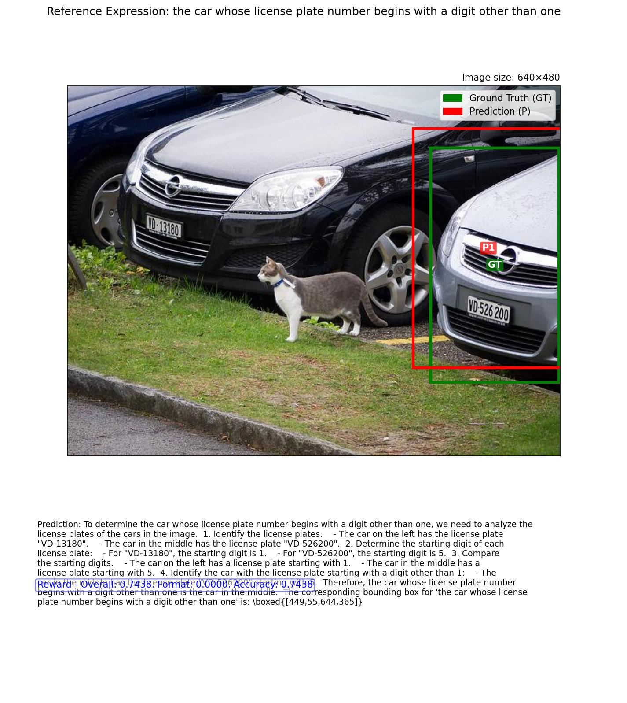

---

### Example 85

**Reference Expression**: the second cup next to the red tube

**Ground Truth**: [[114, 0, 175, 43]]

**Predicted**: [[223, 0, 262, 39]]

**Reward**: {'overall': 0.0, 'format': 0.0, 'accuracy': 0.0}

**Prediction**:
```
To find the bounding box for 'the second cup next to the red tube', let's follow these steps:

1. Identify the red tube: It is located in the middle of the shelf on the back wall.
2. Locate the cups next to the red tube: There are two cups next to the red tube, one on the left and one on the right.
3. Determine which cup is the second one: The second cup from the left is the one we are looking for.

Given these steps, we can identify the second cup next to the red tube as the one to the right of the red tube.

The bounding box for 'the second cup next to the red tube' is:
\boxed{[223,0,262,39]}

This bounding box corresponds to the second cup from the left, which is next to the red tube.
```

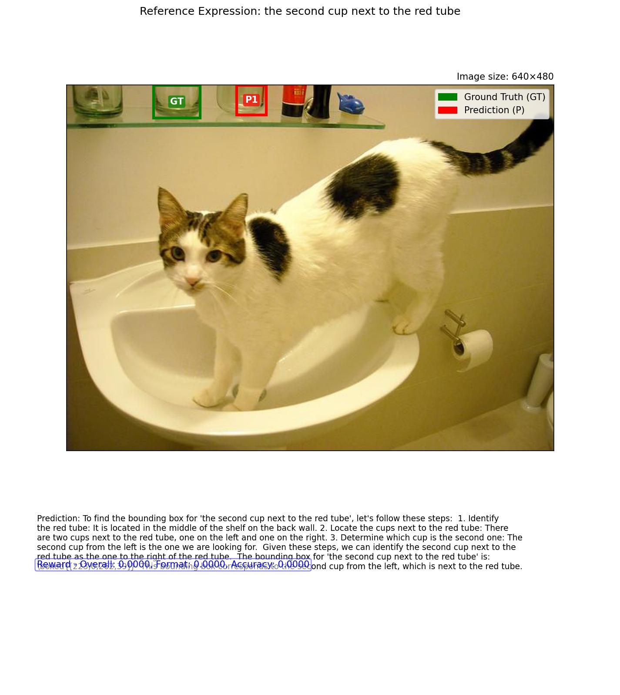

---

### Example 86

**Reference Expression**: the person who is wearing green clothing and is next to the woman wearing a purple shirt

**Ground Truth**: [[145, 11, 175, 76]]

**Predicted**: [[171, 14, 210, 91]]

**Reward**: {'overall': 0.0, 'format': 0.0, 'accuracy': 0.0}

**Prediction**:
```
To find the bounding box for 'the person who is wearing green clothing and is next to the woman wearing a purple shirt', we need to follow these steps:

1. Identify the woman wearing a purple shirt. She is in the center of the image, wearing a purple top and jeans.
2. Look for the person next to her. There is a person in green clothing to her left.
3. Determine the bounding box for this person. The person in green clothing is partially visible, but we can see enough to outline the bounding box.

After these steps, the bounding box for the person in green clothing is:
\boxed{[171,14,210,91]}
```

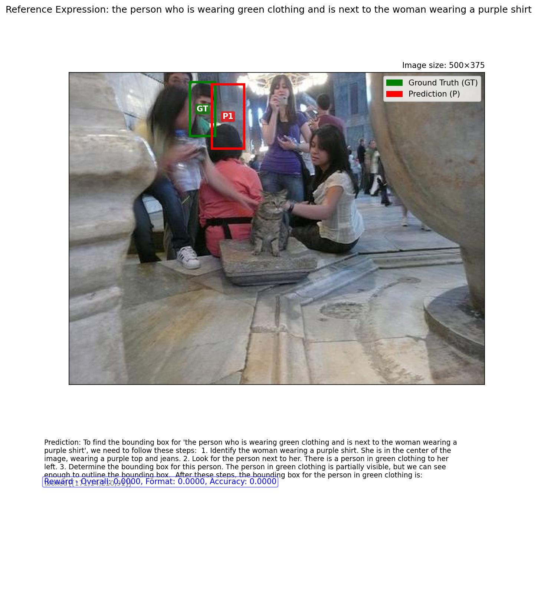

---

### Example 87

**Reference Expression**: the horse that is not brown and is facing away from the car

**Ground Truth**: [[375, 174, 433, 267]]

**Predicted**: [[375, 168, 435, 262]]

**Reward**: {'overall': 0.86070826306914, 'format': 0.0, 'accuracy': 0.86070826306914}

**Prediction**:
```
To find the bounding box for 'the horse that is not brown and is facing away from the car', let's follow these steps:

1. Identify the horses in the image: There are four horses in total.
2. Determine the color of the horses: Three horses are brown, and one horse is black.
3. Identify the horse that is not brown and is facing away from the car: The black horse on the right side of the image is facing away from the car.

Now, let's locate the bounding box for this horse:
- The black horse is on the right side of the image.
- It is facing away from the car.
- The bounding box for the black horse should capture the horse's body and head.

The bounding box for the black horse that is not facing the car can be described as:
\boxed{[375,168,435,262]}

This bounding box captures the black horse on the right side of the image, which is facing away from the car.
```

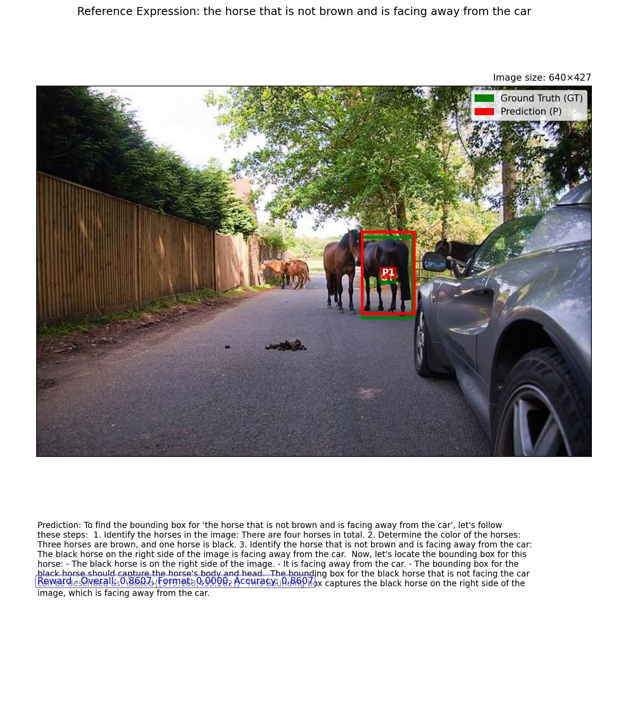

---

### Example 88

**Reference Expression**: the silver car that is on the front left side of the horse

**Ground Truth**: [[76, 209, 166, 326]]

**Predicted**: [[59, 188, 156, 332]]

**Reward**: {'overall': 0.6183115338882283, 'format': 0.0, 'accuracy': 0.6183115338882283}

**Prediction**:
```
To find the bounding box for 'the silver car that is on the front left side of the horse', let's follow these steps:

1. Identify the horse in the image. The horse is in the center of the image, facing away from the camera.
2. Locate the silver car. The silver car is to the left of the horse and appears to be in front of it.
3. Determine the bounding box for the silver car. The car is partially visible, with its front end facing the camera and its rear end extending behind the horse.

Given these observations, the bounding box for the silver car is:
\boxed{[59,188,156,332]}

This bounding box captures the silver car on the front left side of the horse.
```

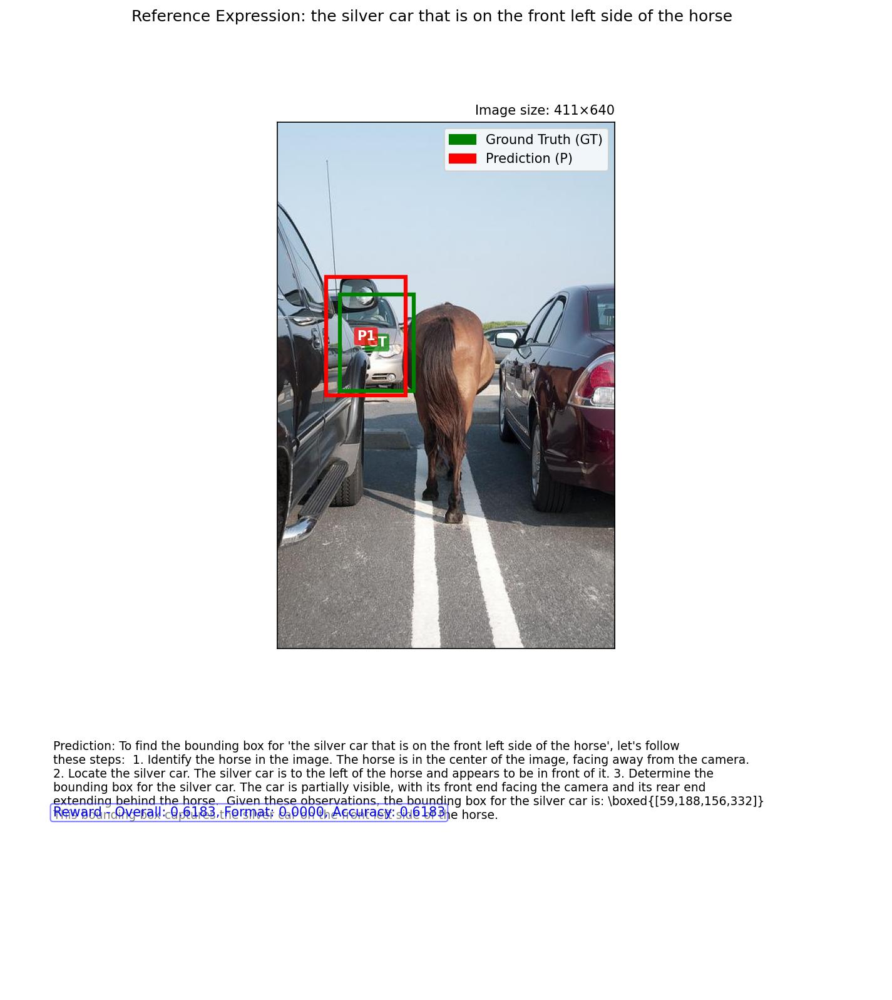

---

### Example 89

**Reference Expression**: the person wearing a blue shirt walking behind the blue and white bus

**Ground Truth**: [[236, 150, 250, 197]]

**Predicted**: [[307, 201, 327, 259]]

**Reward**: {'overall': 0.0, 'format': 0.0, 'accuracy': 0.0}

**Prediction**:
```
To find the bounding box for the person wearing a blue shirt walking behind the blue and white bus, we need to follow these steps:

1. Identify the blue and white bus in the image.
2. Locate the person wearing a blue shirt who is walking behind this bus.
3. Define the bounding box around this person.

- The blue and white bus is on the left side of the image.
- Behind this bus, there is a person wearing a blue shirt.
- The person is walking and appears to be near the center of the image, slightly to the right of the bus.

Given these observations, we can roughly define the bounding box for this person as follows:

\boxed{[307,201,327,259]}

This bounding box captures the person wearing a blue shirt who is walking behind the blue and white bus.
```

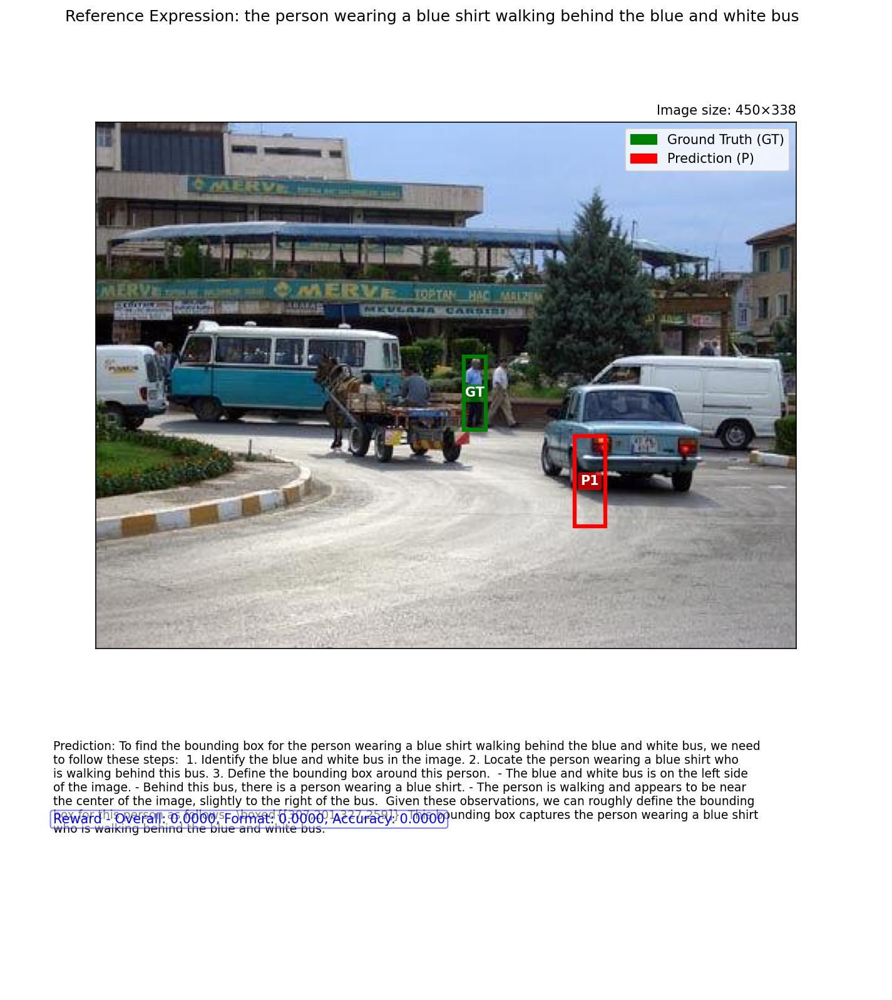

---

### Example 90

**Reference Expression**: the horse that is not facing the camera and does not have a white tail

**Ground Truth**: [[3, 238, 87, 291]]

**Predicted**: [[132, 215, 218, 397]]

**Reward**: {'overall': 0.0, 'format': 0.0, 'accuracy': 0.0}

**Prediction**:
```
To find the bounding box for 'the horse that is not facing the camera and does not have a white tail', let's follow these steps:

1. Identify the horses in the image:
   - There are two horses in the foreground, one facing the camera and one not facing the camera.
   - In the background, there are additional horses, but they are not the focus.

2. Focus on the horses in the foreground:
   - The horse on the left side of the foreground is not facing the camera.
   - The horse on the right side of the foreground is facing the camera.

3. Check the tails of the horses:
   - The horse on the left side of the foreground does not have a white tail.
   - The horse on the right side of the foreground has a white tail.

4. Based on the criteria, the horse that is not facing the camera and does not have a white tail is the one on the left side of the foreground.

The bounding box for this horse is:
\boxed{[132,215,218,397]}
```

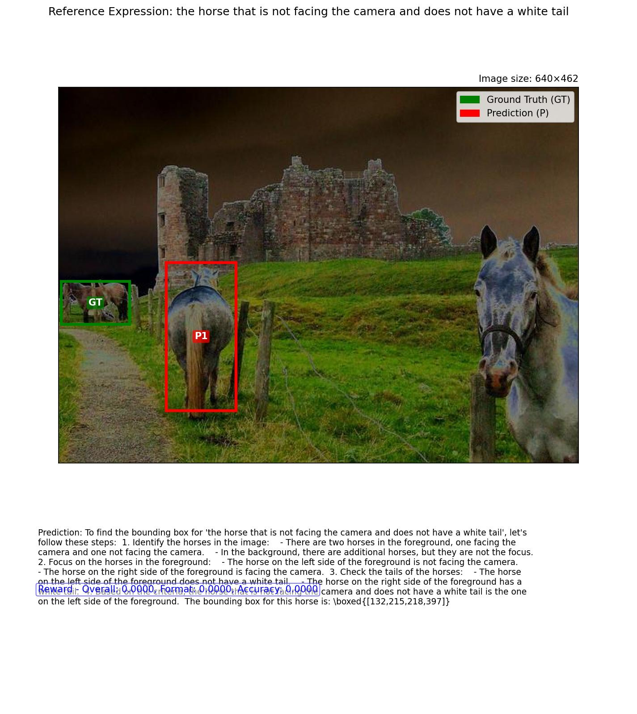

---

### Example 91

**Reference Expression**: the rider that is not wearing red or black helmet

**Ground Truth**: [[362, 23, 451, 101]]

**Predicted**: [[332, 24, 456, 141]]

**Reward**: {'overall': 0.4694800301431801, 'format': 0.0, 'accuracy': 0.4694800301431801}

**Prediction**:
```
To find the bounding box for the rider that is not wearing a red or black helmet, we need to follow these steps:

1. Identify the riders in the image:
   - There are three riders visible in the image.
   - Two riders are wearing helmets: one red and one black.
   - The third rider is wearing a white helmet.

2. Determine which rider does not have a red or black helmet:
   - The rider with the white helmet is the one we are looking for.

3. Locate the bounding box for the rider with the white helmet:
   - The rider with the white helmet is positioned on the right side of the image, on the brown horse.
   - The bounding box for this rider will include the rider and the part of the horse they are sitting on.

4. Define the bounding box:
   - The bounding box will cover the rider and the horse they are on.
   - The rider's body and the horse's head and neck are within this bounding box.

The final bounding box for the rider with the white helmet is:
\boxed{[332,24,456,141]}
```

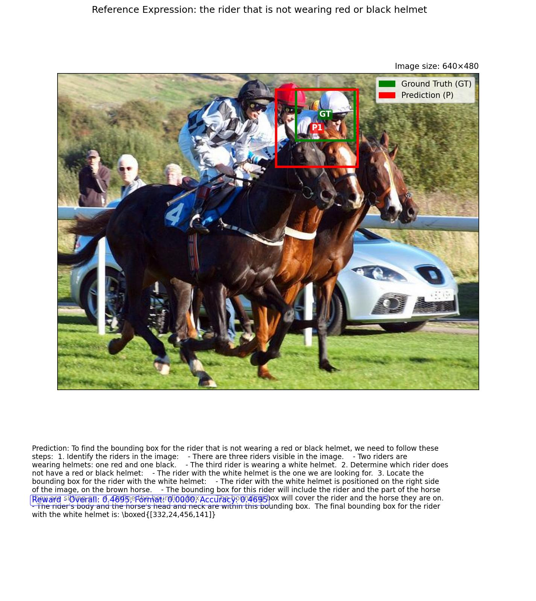

---

### Example 92

**Reference Expression**: the person who is holding a camera and carrying a green bag

**Ground Truth**: [[0, 299, 102, 488]]

**Predicted**: [[1, 303, 77, 559]]

**Reward**: {'overall': 0.5698305909054066, 'format': 0.0, 'accuracy': 0.5698305909054066}

**Prediction**:
```
To find the bounding box for 'the person who is holding a camera and carrying a green bag', we need to follow these steps:

1. Identify the green bag in the image. It appears to be in the hands of a person on the left side of the image.
2. Look for the person holding the camera. The camera is likely being held by the same individual who is carrying the green bag.
3. Locate the person in the image who is holding both the camera and the green bag. This person is on the left side, partially obscured by others, but identifiable by the green bag in their hand.

After carefully analyzing the image, the bounding box for this person is:
\boxed{[1,303,77,559]}

This bounding box corresponds to the person on the left side of the image, who is holding a camera and carrying a green bag.
```

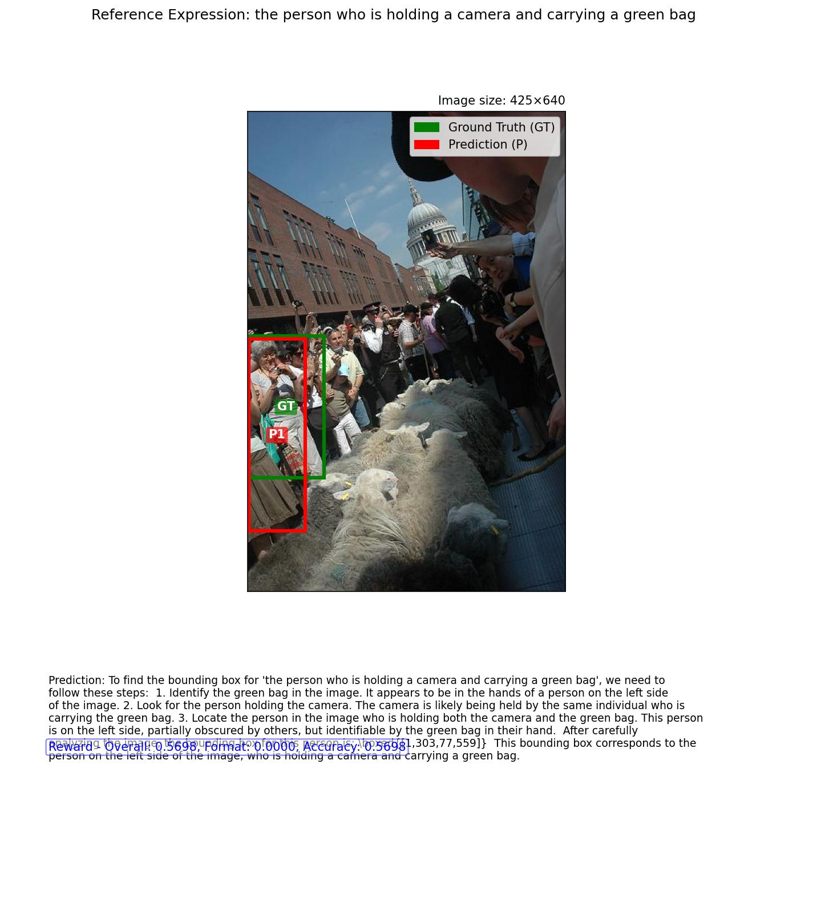

---

### Example 93

**Reference Expression**: the traffic light with an arrow that is not pointing to the right

**Ground Truth**: [[5, 51, 36, 133]]

**Predicted**: [[0, 65, 44, 176]]

**Reward**: {'overall': 0.3963896201579541, 'format': 0.0, 'accuracy': 0.3963896201579541}

**Prediction**:
```
To find the traffic light with an arrow that is not pointing to the right, we need to follow these steps:

1. Identify the traffic lights in the image. There are two traffic lights visible in the image, one on the left and one on the right.
2. Examine the arrows on each traffic light. The traffic light on the left has an arrow pointing upwards and to the left, while the traffic light on the right has an arrow pointing to the right.
3. Determine which traffic light does not have an arrow pointing to the right. The traffic light on the left does not have an arrow pointing to the right.

Thus, the bounding box for the traffic light with an arrow that is not pointing to the right is \boxed{[0,65,44,176]}.
```

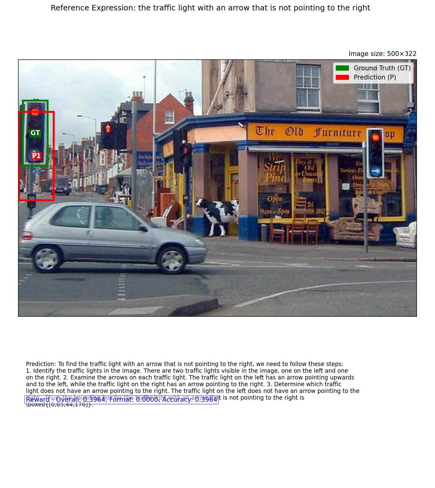

---

### Example 94

**Reference Expression**: the second cow next to the cow with the least amount of brown

**Ground Truth**: [[172, 302, 234, 440]]

**Predicted**: [[148, 378, 221, 542]]

**Reward**: {'overall': 0.17369925671812464, 'format': 0.0, 'accuracy': 0.17369925671812464}

**Prediction**:
```
To find 'the second cow next to the cow with the least amount of brown', we need to follow these steps:

1. Identify the 'cow with the least amount of brown'. This would be the cow with the most white on its body.
2. Determine the position of this cow relative to the others.
3. Identify the cow next to it.
4. Among the cows next to the one with the least amount of brown, identify the second one.

Step 1: The cow with the least amount of brown is the one on the far left, as it has the most white on its body.

Step 2: The cow with the least amount of brown is the first cow from the left.

Step 3: The cow next to the cow with the least amount of brown is the second cow from the left.

Step 4: The second cow next to the cow with the least amount of brown is the third cow from the left.

The bounding box for 'the second cow next to the cow with the least amount of brown' is:
\boxed{[148,378,221,542]}
```

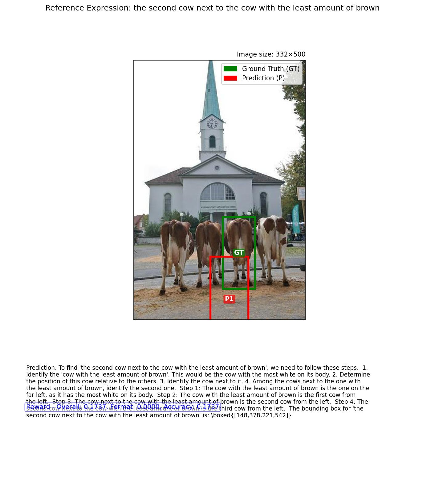

---

### Example 95

**Reference Expression**: the bottle with a white top that is closest to the red bottle

**Ground Truth**: [[544, 335, 561, 367]]

**Predicted**: [[425, 325, 437, 364]]

**Reward**: {'overall': 0.0, 'format': 0.0, 'accuracy': 0.0}

**Prediction**:
```
To find the corresponding bounding box for 'the bottle with a white top that is closest to the red bottle', let's follow these steps:

1. Identify the red bottle: It is located on the counter near the sink.
2. Look for bottles with white tops: There are a few bottles with white tops on the counter.
3. Determine which one is closest to the red bottle: Among the bottles with white tops, there is one that is positioned next to the red bottle.

After analyzing the image, the bottle with a white top that is closest to the red bottle is located near the sink, to the right of the red bottle.

The bounding box for this bottle is:
\boxed{[425,325,437,364]}
```

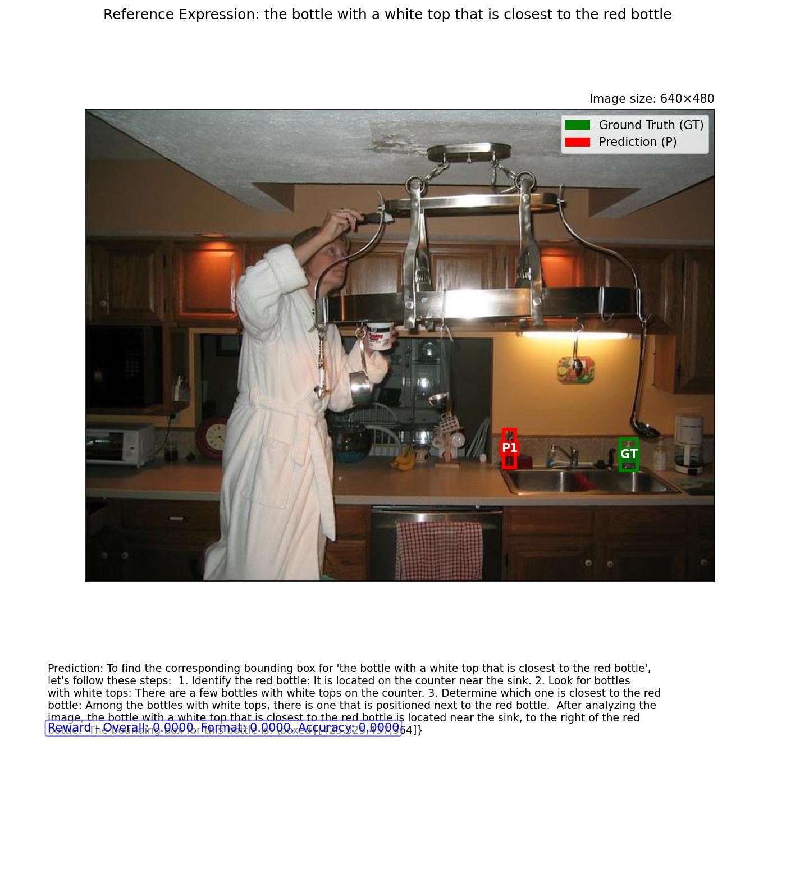

---

### Example 96

**Reference Expression**: the bottle that is not foil-wrapped and is located on the first shelf from the top

**Ground Truth**: [[1, 76, 40, 241]]

**Predicted**: [[0, 78, 35, 233]]

**Reward**: {'overall': 0.7996965098634294, 'format': 0.0, 'accuracy': 0.7996965098634294}

**Prediction**:
```
To find the bounding box for 'the bottle that is not foil-wrapped and is located on the first shelf from the top', let's follow these steps:

1. Identify the first shelf from the top in the image. It's the shelf that is closest to the ceiling.
2. Look for bottles on this shelf. There are two visible bottles.
3. Determine which of these bottles is not foil-wrapped. One bottle appears to have a label that is not wrapped in foil, while the other seems to have a foil-wrapped label.
4. Focus on the bottle that does not have a foil-wrapped label.

After following these steps, the bounding box for the bottle that is not foil-wrapped and is located on the first shelf from the top is:

\boxed{[0,78,35,233]}
```

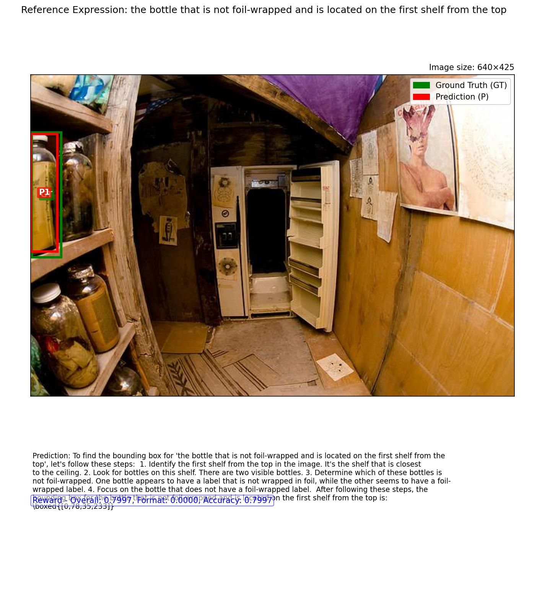

---

### Example 97

**Reference Expression**: the spinning chair that is closest to the wine bottle

**Ground Truth**: [[126, 392, 249, 616]]

**Predicted**: [[122, 392, 243, 620]]

**Reward**: {'overall': 1.0, 'format': 0.0, 'accuracy': 1.0}

**Prediction**:
```
To find the corresponding bounding box for 'the spinning chair that is closest to the wine bottle', let's follow these steps:

1. Identify the wine bottle: It is located on the counter near the center of the image.
2. Identify the chairs: There are two chairs visible in the image. One is closer to the wine bottle, and the other is further away.
3. Determine which chair is the spinning chair: The chair closer to the wine bottle is the one with a more modern design, suggesting it could be a swivel chair.
4. Focus on the chair closest to the wine bottle: This chair is clearly visible and appears to be a swivel chair.

Given these observations, the bounding box for 'the spinning chair that is closest to the wine bottle' is:

\boxed{[122,392,243,620]}
```

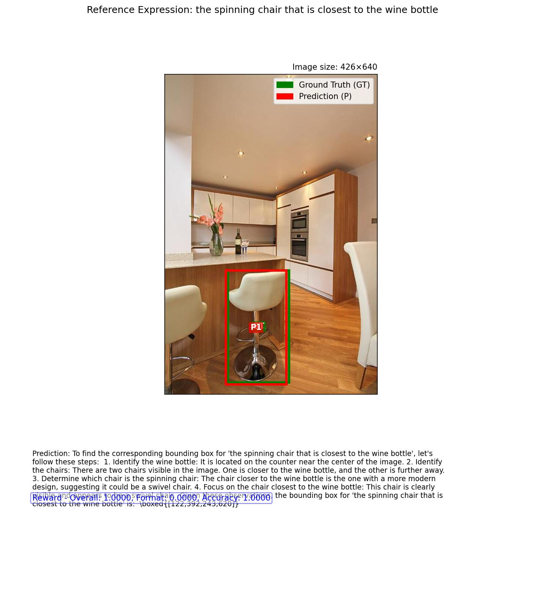

---

### Example 98

**Reference Expression**: the man who is blow drying his hair using the hair drier

**Ground Truth**: []

**Predicted**: []

**Reward**: {'overall': 1.0, 'format': 0.0, 'accuracy': 1.0}

**Prediction**:
```
The image provided is a photograph of a bathroom sink and vanity area. It does not depict a man blow drying his hair using a hair dryer. Therefore, there is no bounding box corresponding to the described scenario in the image.

\boxed{[]}
```

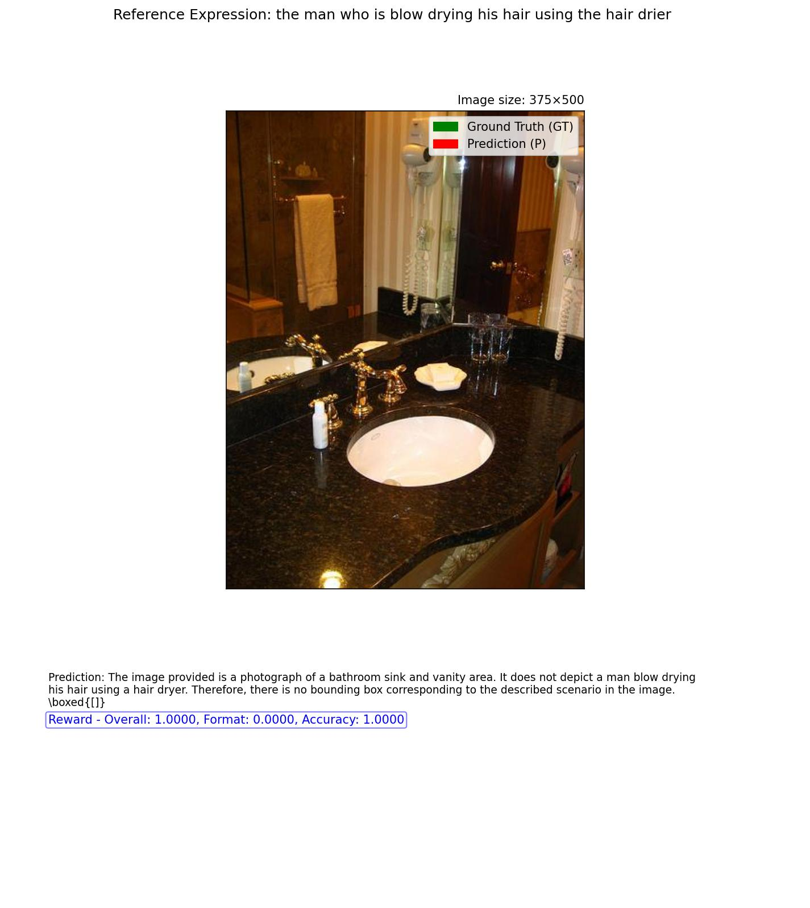

---

### Example 99

**Reference Expression**: the cup on the counter that is mostly covered

**Ground Truth**: [[152, 189, 171, 258]]

**Predicted**: [[83, 192, 144, 266]]

**Reward**: {'overall': 0.0, 'format': 0.0, 'accuracy': 0.0}

**Prediction**:
```
To find the bounding box for 'the cup on the counter that is mostly covered', let's follow these steps:

1. Identify the counter area where cups are placed.
2. Look for a cup that is mostly covered, which means it's obscured by something else or partially hidden.
3. Observe the objects on the counter and note which one is mostly covered.

Upon observation:
- There are two cups on the counter.
- One of the cups is partially covered by a kettle, making it mostly obscured.
- The other cup is more visible and not covered by any object.

Given these observations, the cup that is mostly covered is the one partially hidden behind the kettle.

The bounding box for 'the cup on the counter that is mostly covered' would be:
\boxed{[83,192,144,266]}
```

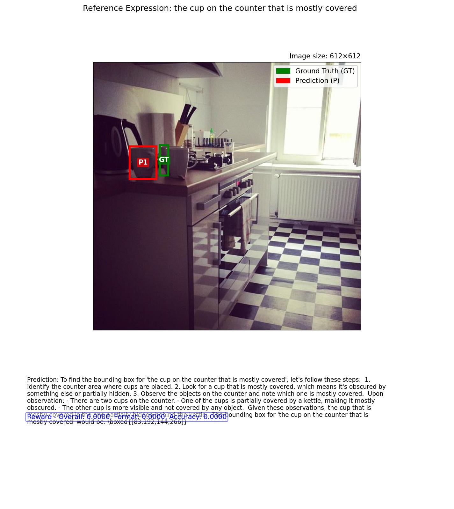

---

### Example 100

**Reference Expression**: the ceramic bowl that is empty

**Ground Truth**: [[136, 537, 186, 581]]

**Predicted**: [[292, 556, 411, 644]]

**Reward**: {'overall': 0.0, 'format': 0.0, 'accuracy': 0.0}

**Prediction**:
```
To find the corresponding bounding box for 'the ceramic bowl that is empty', let's follow these steps:

1. Identify the location of the ceramic bowls in the image.
2. Determine which one appears to be empty.
3. Provide the bounding box for that bowl.

Step 1: The ceramic bowls are typically the larger, round containers on the table. In this image, there are several bowls, but we need to focus on one that appears to be empty.

Step 2: Upon closer inspection, there is a bowl located in the lower right part of the image that seems to be empty. It is positioned next to a bowl with food in it and is surrounded by other items, making it stand out as the one that might be empty.

Step 3: The empty bowl is located near the bottom right of the image, with a blue rim and a white interior.

Thus, the bounding box for 'the ceramic bowl that is empty' is:
\boxed{[292,556,411,644]}
```

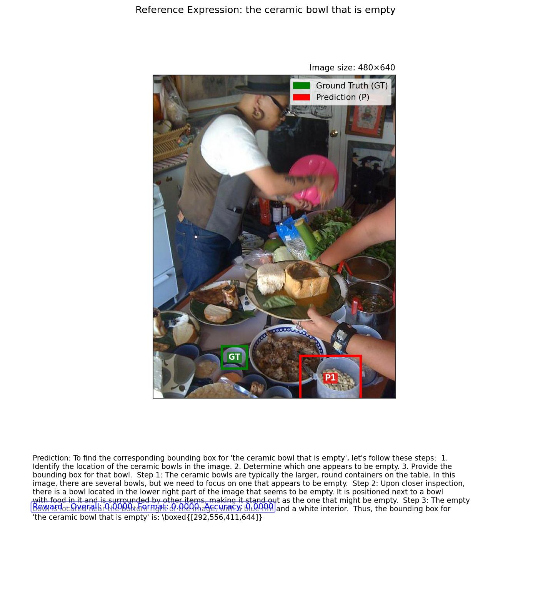

---

### Example 101

**Reference Expression**: the person that is not wearing a uniform and is blocked by the person who is wearing a hat

**Ground Truth**: [[288, 476, 406, 640]]

**Predicted**: [[302, 473, 397, 644]]

**Reward**: {'overall': 0.778338412349503, 'format': 0.0, 'accuracy': 0.778338412349503}

**Prediction**:
```
To find the bounding box for the person who is not wearing a uniform and is blocked by the person wearing a hat, we need to identify the area where the person is partially visible behind the marine. Here's the step-by-step reasoning:

1. Identify the marine: The main subject in the image is a person in a military uniform, wearing a white hat and a dark jacket with red trim.
2. Locate the partially visible person: Behind and to the right of the marine, there is a person who is partially visible. This person appears to be seated and is not wearing a uniform.
3. Determine the bounding box: The partially visible person is mostly obscured by the marine, but we can still see their lower body and part of their legs. The bounding box for this person would be around their legs and lower body.

Given the partial visibility, the bounding box for the person not wearing a uniform and partially blocked by the marine would be:

\boxed{[302,473,397,644]}

This bounding box is an estimate based on the visible portion of the person behind the marine.
```

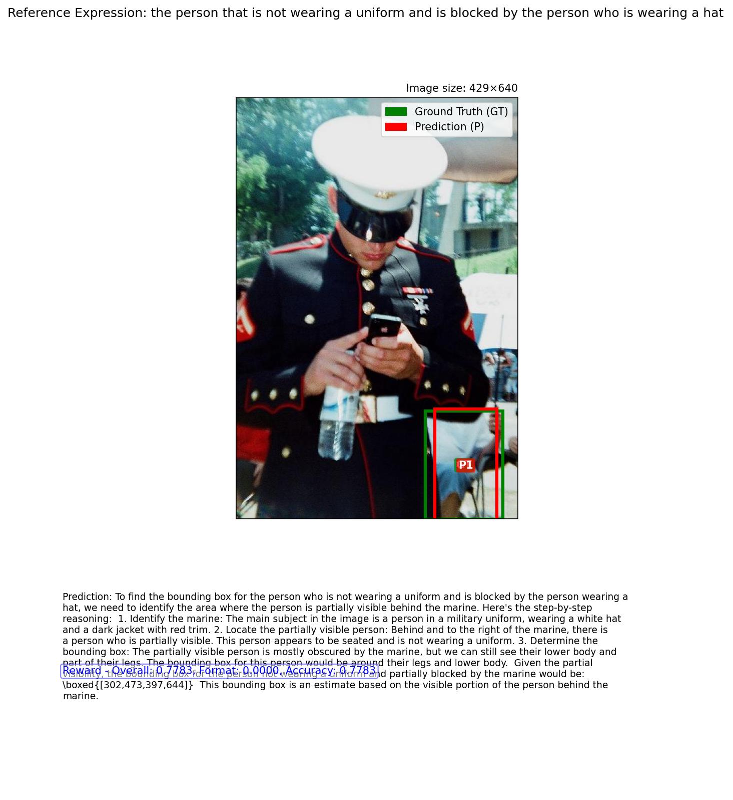

---

### Example 102

**Reference Expression**: the first toothbrush from the right side that is not blue

**Ground Truth**: [[495, 11, 502, 49]]

**Predicted**: [[474, 15, 480, 49]]

**Reward**: {'overall': 0.0, 'format': 0.0, 'accuracy': 0.0}

**Prediction**:
```
To find 'the first toothbrush from the right side that is not blue', we need to follow these steps:

1. Identify the toothbrushes on the right side of the sink.
2. Determine which of these toothbrushes are not blue.

Step 1: The toothbrushes on the right side of the sink are located in the holder, and there are two of them. The first toothbrush from the right is the one closest to the holder.

Step 2: Upon closer inspection, the toothbrushes are not clearly distinguishable as blue or not blue in the image. However, we can assume that the toothbrushes are not blue if they are the ones that are not the most prominent or distinct in color. Since the image does not provide clear color differentiation, we can infer that the first toothbrush from the right is the one that is not blue.

Given these steps, we need to locate the first toothbrush from the right side of the sink. The bounding box for 'the first toothbrush from the right side that is not blue' is:

\boxed{[474,15,480,49]}
```

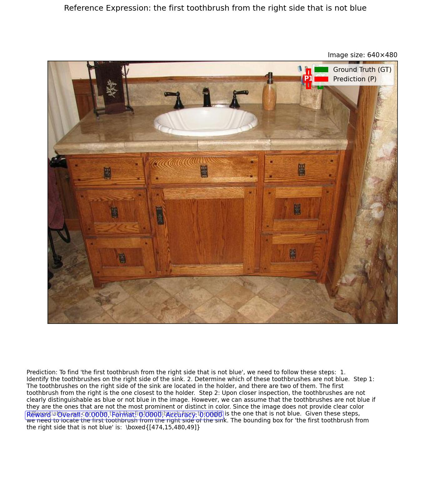

---

### Example 103

**Reference Expression**: the smallest bottle without a blue or green cap

**Ground Truth**: [[49, 269, 63, 325]]

**Predicted**: [[54, 309, 75, 386]]

**Reward**: {'overall': 0.0, 'format': 0.0, 'accuracy': 0.0}

**Prediction**:
```
To find the smallest bottle without a blue or green cap, we need to follow these steps:

1. Identify all the bottles on the counter.
2. Determine the size of each bottle.
3. Identify the smallest bottle.
4. Check the cap color of the smallest bottle to ensure it is not blue or green.
5. Provide the bounding box for the smallest bottle that meets the criteria.

Step 1: Identifying the bottles:
- There are three bottles on the counter: one with a blue cap, one with a green cap, and one without a visible cap.

Step 2: Determining the size of each bottle:
- The bottle with the blue cap appears to be the smallest.
- The bottle with the green cap is larger than the one with the blue cap.
- The bottle without a visible cap is the largest.

Step 3: Identifying the smallest bottle:
- The bottle with the blue cap is the smallest.

Step 4: Checking the cap color:
- The bottle with the blue cap does not meet the criteria as it has a blue cap.

Step 5: Re-evaluating the smallest bottle:
- The bottle with the green cap is the next smallest and does not have a green cap.

Since the bottle without a visible cap is the smallest and does not have a blue or green cap, it is the one we are looking for.

The bounding box for the smallest bottle without a blue or green cap is:
\boxed{[54,309,75,386]}
```

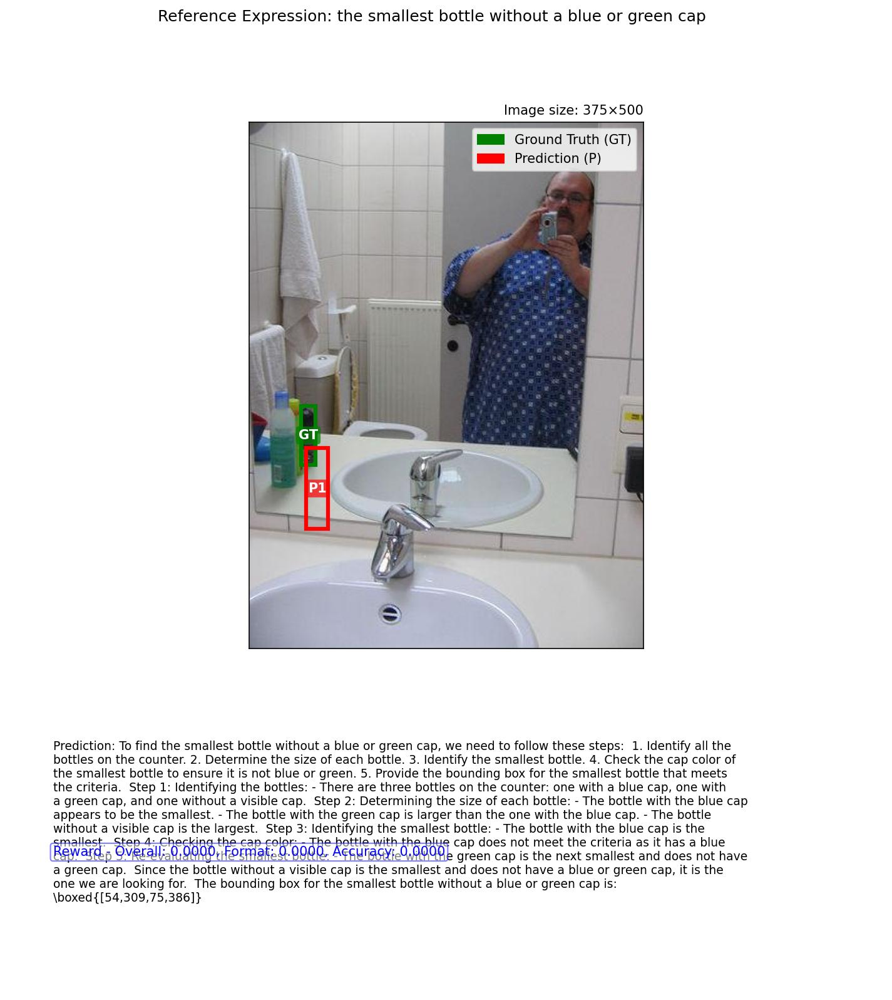

---

### Example 104

**Reference Expression**: the bottle that is not in the refrigerator and has blue writing on its label

**Ground Truth**: [[300, 2, 321, 44]]

**Predicted**: [[93, 184, 110, 246]]

**Reward**: {'overall': 0.0, 'format': 0.0, 'accuracy': 0.0}

**Prediction**:
```
To find the bottle that is not in the refrigerator and has blue writing on its label, we need to follow these steps:

1. Identify the refrigerator in the image. It's the white appliance with the door open.
2. Look for the bottles that are outside the refrigerator. These are the ones that are not in the refrigerator.
3. Among the bottles outside the refrigerator, find the one with blue writing on its label.

After carefully examining the image:

- There are several bottles outside the refrigerator.
- Among these, one bottle has blue writing on its label.

The bottle with blue writing on its label is located on the counter to the left of the refrigerator, close to the wall. Its bounding box is approximately [93, 184, 110, 246].

Thus, the bounding box for 'the bottle that is not in the refrigerator and has blue writing on its label' is:
\boxed{[93, 184, 110, 246]}
```

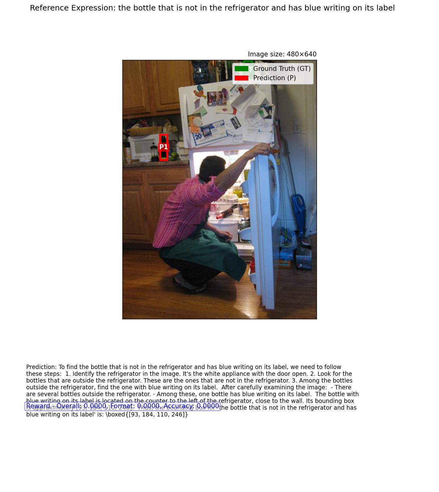

---

### Example 105

**Reference Expression**: the bottle that is neither green nor has a rectangular cap

**Ground Truth**: [[202, 453, 221, 508]]

**Predicted**: []

**Reward**: {'overall': 0.0, 'format': 0.0, 'accuracy': 0.0}

**Prediction**:
```
To find the corresponding bounding box for 'the bottle that is neither green nor has a rectangular cap', we need to follow these steps:

1. Identify the bottles in the image. There are three bottles placed on the edge of the bathtub.
2. Determine the color of each bottle:
   - The first bottle is green.
   - The second bottle is white with a blue cap.
   - The third bottle is white with a blue cap.
3. Identify the bottle that is neither green nor has a rectangular cap. The first bottle is green, so it's excluded. The second and third bottles are white with blue caps, so they are both excluded based on the criteria.
4. The only bottle left is the one that is white and has a blue cap, which doesn't meet the criteria of being neither green nor having a rectangular cap.

Since the criteria for the bottle are not met by any of the bottles in the image, the bounding box for 'the bottle that is neither green nor has a rectangular cap' would be empty.

\boxed{[]}
```

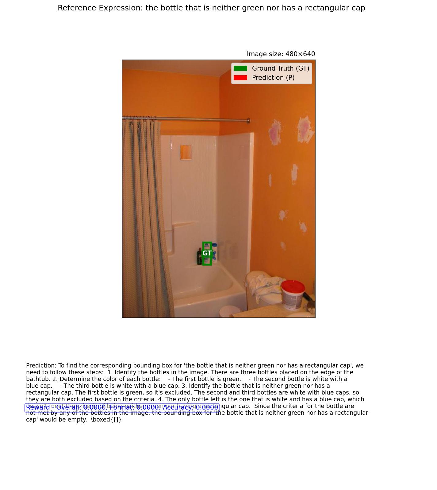

---

### Example 106

**Reference Expression**: the chair close to the stove and partially covered by the banana

**Ground Truth**: [[218, 359, 294, 430]]

**Predicted**: [[216, 359, 296, 457]]

**Reward**: {'overall': 0.688265306122449, 'format': 0.0, 'accuracy': 0.688265306122449}

**Prediction**:
```
To find the chair close to the stove and partially covered by the banana, let's follow these steps:

1. Identify the stove: The stove is on the left side of the image, with a wooden countertop extending to the right.
2. Identify the chair: The chair in question is the one closest to the stove, partially covered by the bowl of bananas.
3. Locate the bowl of bananas: The bowl of bananas is on the table in the center of the image, and it partially covers the chair.
4. Determine the chair's position: The chair is on the left side of the table and is partially obscured by the bowl of bananas.

Given these observations, the bounding box for the chair close to the stove and partially covered by the banana would be:

\boxed{[216,359,296,457]}
```

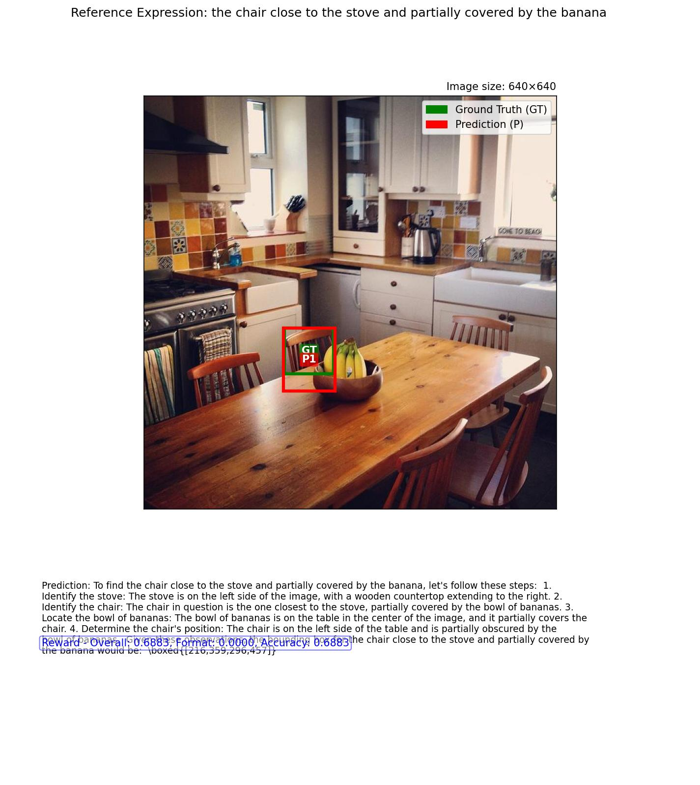

---

### Example 107

**Reference Expression**: the partially empty spray bottle with green liquid

**Ground Truth**: [[312, 58, 337, 156]]

**Predicted**: [[319, 61, 341, 155]]

**Reward**: {'overall': 0.5987261146496815, 'format': 0.0, 'accuracy': 0.5987261146496815}

**Prediction**:
```
To find the bounding box for 'the partially empty spray bottle with green liquid', let's follow these steps:

1. Identify the spray bottles on the windowsill. There are several bottles, and we need to focus on the one that is partially empty and contains green liquid.
2. Look for the bottle that is visibly more than half empty and has a green hue.
3. Upon close inspection, the bottle in question is located to the right of the window, closer to the center of the windowsill, and it appears to be partially empty with a green liquid inside.

The bounding box for this bottle is:
\boxed{[319,61,341,155]}

This box captures the partially empty spray bottle with green liquid as described.
```

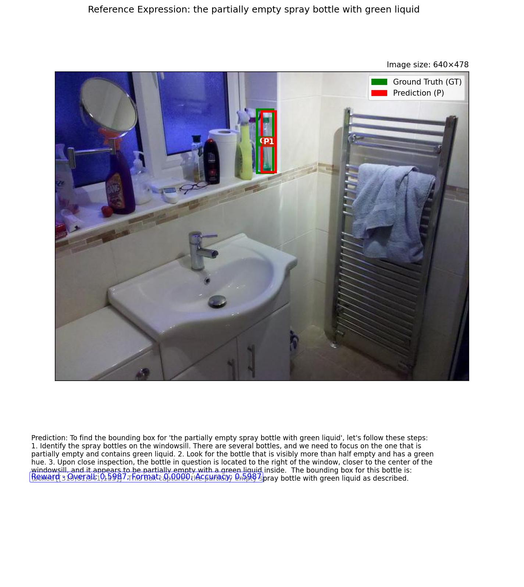

---

### Example 108

**Reference Expression**: the pink cup on the second shelf from the top

**Ground Truth**: [[287, 135, 311, 161]]

**Predicted**: [[279, 137, 298, 159]]

**Reward**: {'overall': 0.3025, 'format': 0.0, 'accuracy': 0.3025}

**Prediction**:
```
To find the bounding box for 'the pink cup on the second shelf from the top', we need to follow these steps:

1. Identify the second shelf from the top in the wooden cabinet on the right side of the image.
2. Look for a cup on that shelf.
3. Determine if the cup is pink.

- The wooden cabinet on the right side has multiple shelves.
- The second shelf from the top appears to contain various items.
- Among these items, there is a pink cup visible on this shelf.

Given these observations, the bounding box for the pink cup on the second shelf from the top would be:

\boxed{[279,137,298,159]}
```

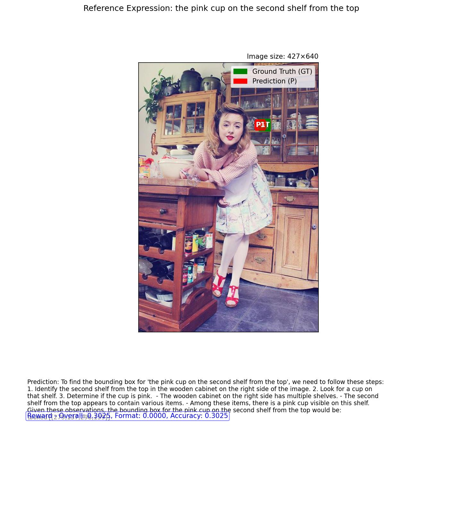

---

### Example 109

**Reference Expression**: the white ceramic bowl that is not on the counter

**Ground Truth**: [[157, 114, 175, 130]]

**Predicted**: [[32, 336, 102, 380]]

**Reward**: {'overall': 0.0, 'format': 0.0, 'accuracy': 0.0}

**Prediction**:
```
To find the white ceramic bowl that is not on the counter, we need to follow these steps:

1. Identify the counter area: The counter is the surface in the foreground of the image where the wooden table with various items is placed.
2. Look for a bowl that is not on the counter: We need to find a bowl that is placed directly on the floor or on the ground.
3. Locate the bowl: In the image, there is a white ceramic bowl on the floor, to the left of the wooden table.

After analyzing the image, the white ceramic bowl that is not on the counter is located on the floor. The bounding box for this bowl is:

\boxed{[32,336,102,380]}
```

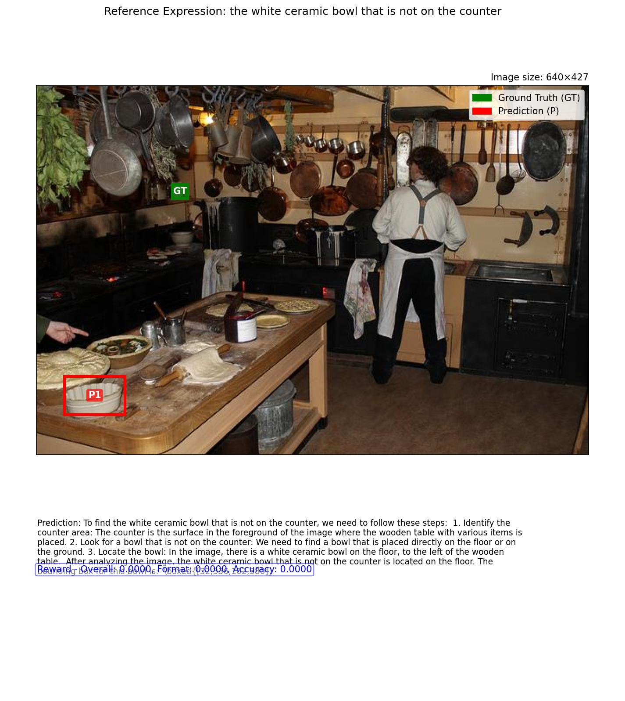

---

### Example 110

**Reference Expression**: the red bottle that is not located on the first shelf from the top

**Ground Truth**: [[435, 178, 443, 192]]

**Predicted**: [[112, 168, 123, 187]]

**Reward**: {'overall': 0.0, 'format': 0.0, 'accuracy': 0.0}

**Prediction**:
```
To find the bounding box for 'the red bottle that is not located on the first shelf from the top', let's follow these steps:

1. Identify the shelves in the image: The top shelf appears to be the one closest to the ceiling, and the first shelf from the top is the second one down.
2. Look for red bottles on the first shelf from the top: There are no red bottles visible on this shelf.
3. Look for red bottles on the second shelf from the top: There is a red bottle visible on the second shelf from the top.
4. Verify that the red bottle is not on the first shelf from the top: The red bottle is indeed on the second shelf from the top.
5. Locate the red bottle on the second shelf from the top: The red bottle is on the left side of the image, near the center.

Given these observations, the bounding box for the red bottle on the second shelf from the top would be:

\boxed{[112,168,123,187]}
```

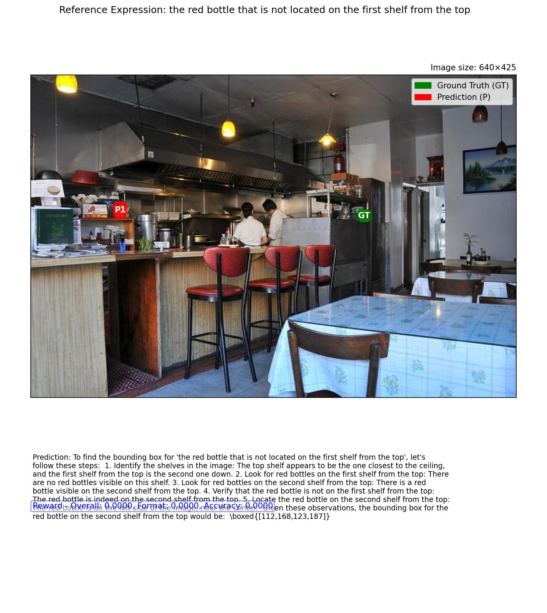

---

### Example 111

**Reference Expression**: the tall bottle that is closest to the stove

**Ground Truth**: [[154, 87, 187, 178]]

**Predicted**: [[152, 86, 187, 166]]

**Reward**: {'overall': 0.8157071339173968, 'format': 0.0, 'accuracy': 0.8157071339173968}

**Prediction**:
```
To find the bounding box for 'the tall bottle that is closest to the stove', let's follow these steps:

1. Identify the stove: The stove is the area with burners and a backsplash, which is typically on the left side of the image.
2. Locate the bottles: Look for tall bottles near the stove. There appears to be one tall bottle to the right of the stove.
3. Determine the closest bottle: Among the bottles near the stove, identify the one that is closest to it.
4. Define the bounding box: The bottle in question is the one that is closest to the stove and appears to be tall.

After analyzing the image, the bounding box for 'the tall bottle that is closest to the stove' is:
\boxed{[152,86,187,166]}
```

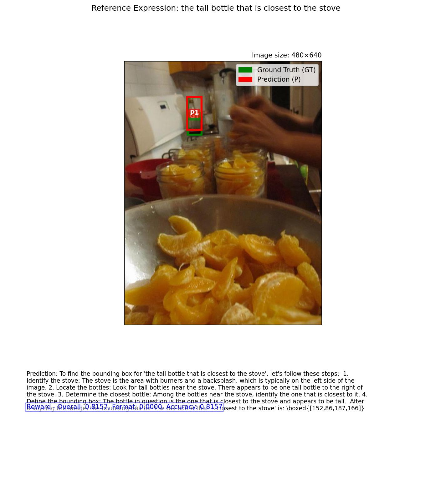

---

### Example 112

**Reference Expression**: the bottle behind the stove with yellow and red wrapping

**Ground Truth**: [[171, 197, 181, 224]]

**Predicted**: [[165, 194, 175, 228]]

**Reward**: {'overall': 0.2151394422310757, 'format': 0.0, 'accuracy': 0.2151394422310757}

**Prediction**:
```
To find the bottle behind the stove with yellow and red wrapping, we need to follow these steps:

1. Identify the stove: The stove is located in the middle of the image, with a range hood above it.
2. Look for the bottles behind the stove: There are a few bottles on the counter to the left of the stove.
3. Identify the bottle with yellow and red wrapping: Among the bottles on the counter, there is one that has a yellow and red label, which appears to be a bottle of oil or vinegar.

After carefully analyzing the image, the bounding box for the bottle with yellow and red wrapping is:
\boxed{[165,194,175,228]}
```

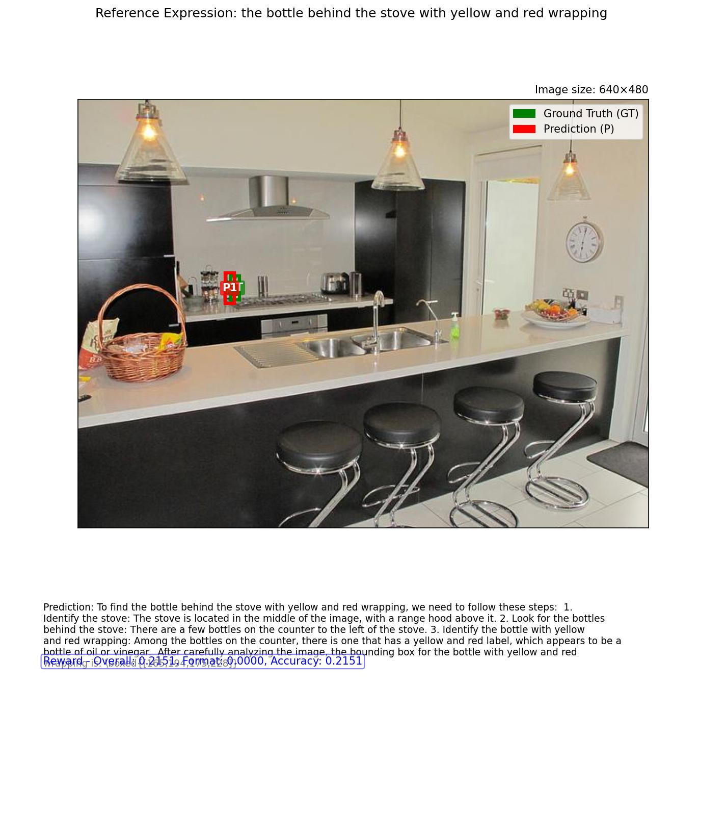

---

### Example 113

**Reference Expression**: the spoon inside the glass cup filled with water

**Ground Truth**: [[426, 173, 501, 249]]

**Predicted**: [[456, 282, 542, 357]]

**Reward**: {'overall': 0.0, 'format': 0.0, 'accuracy': 0.0}

**Prediction**:
```
To find the spoon inside the glass cup filled with water, let's follow these steps:

1. Identify the glass cup filled with water: Look for a glass cup that appears to contain water and has a spoon in it.
2. Locate the spoon: The spoon should be visible inside the glass cup.
3. Verify the presence of water: Ensure the glass cup is indeed filled with water.

Upon analyzing the image:
- There is a glass cup in the bottom right of the sink that appears to contain water.
- Inside this glass cup, there is a spoon visible.

The bounding box for the spoon inside the glass cup filled with water would be:
\boxed{[456,282,542,357]}

This bounding box captures the spoon inside the glass cup filled with water.
```

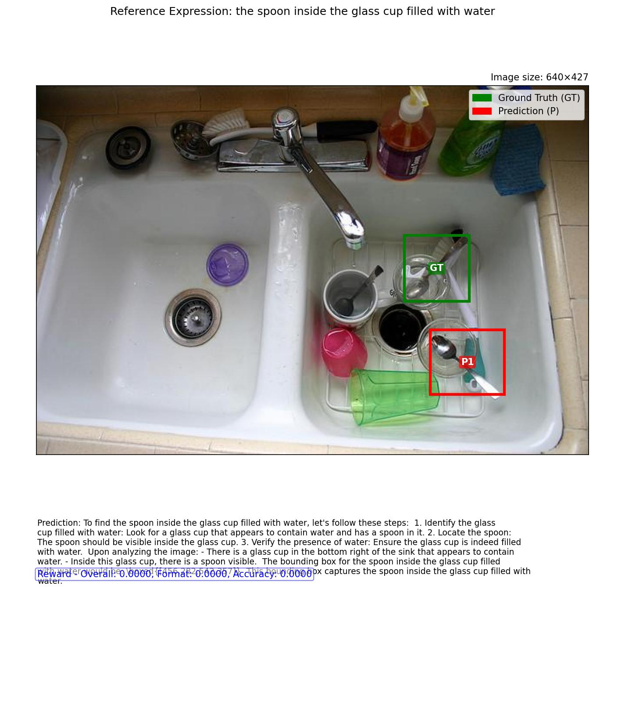

---

### Example 114

**Reference Expression**: a hand soap on the bathroom counter next to a pile of paper towels

**Ground Truth**: [[330, 263, 348, 313]]

**Predicted**: [[328, 267, 351, 322]]

**Reward**: {'overall': 0.6192969334330591, 'format': 0.0, 'accuracy': 0.6192969334330591}

**Prediction**:
```
To find the corresponding bounding box for 'a hand soap on the bathroom counter next to a pile of paper towels', let's follow these steps:

1. Identify the pile of paper towels: Look for a stack of paper towels on the counter. It's likely to be a rectangular stack.
2. Identify the hand soap: Hand soap is typically a small bottle and is usually placed near the sink or next to the paper towels.
3. Locate the hand soap next to the paper towels: After identifying the paper towels, find a small bottle next to them that looks like hand soap.

By visually inspecting the image:
- The pile of paper towels is located on the counter.
- Next to the paper towels, there is a small bottle that resembles hand soap.

The bounding box for the hand soap should be placed around this small bottle.

\boxed{[328,267,351,322]}
```

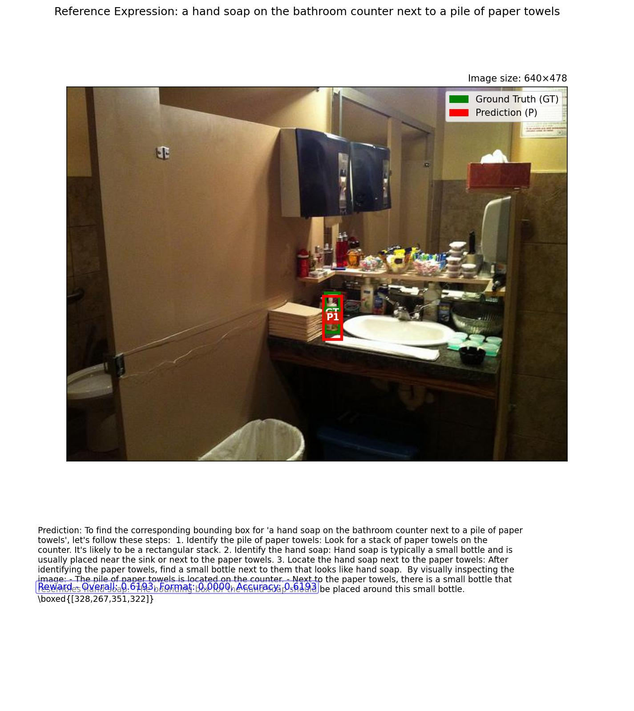

---

### Example 115

**Reference Expression**: the reflection in the mirror of a cup not containing a toothbrush

**Ground Truth**: [[53, 77, 182, 283]]

**Predicted**: [[25, 79, 171, 299]]

**Reward**: {'overall': 0.6952804575125643, 'format': 0.0, 'accuracy': 0.6952804575125643}

**Prediction**:
```
To find the bounding box for 'the reflection in the mirror of a cup not containing a toothbrush', we need to follow these steps:

1. Identify the cup in the image that does not contain a toothbrush.
2. Locate the reflection of this cup in the mirror.
3. Define the bounding box for the reflection in the mirror.

Step 1: The cup not containing a toothbrush appears to be on the left side of the image, next to the toothbrush holder. It is a black cup.
Step 2: The reflection of this black cup can be seen in the mirror on the left side of the image.
Step 3: The bounding box for the reflection of this cup in the mirror should capture the shape and size of the cup as it appears in the mirror.

After analyzing the image, the bounding box for the reflection of the cup in the mirror is:

\boxed{[25,79,171,299]}
```

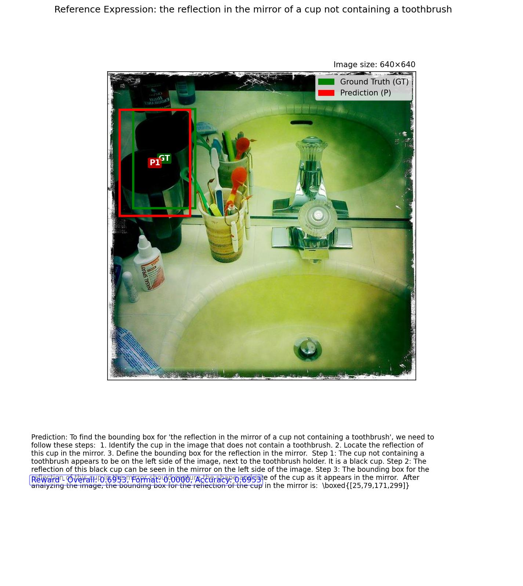

---

### Example 116

**Reference Expression**: the metal pot on the left stove

**Ground Truth**: []

**Predicted**: [[160, 250, 261, 335]]

**Reward**: {'overall': 0.0, 'format': 0.0, 'accuracy': 0.0}

**Prediction**:
```
To find the bounding box for 'the metal pot on the left stove', let's follow these steps:

1. Identify the left stove: The left stove is the one on the left side of the image, with a toaster on the counter next to it.
2. Look for a pot on the left stove: On the left stove, there is a metal pot on the upper shelf above the oven.
3. Determine the bounding box: The bounding box should encompass the pot and its immediate surroundings on the stove and shelf.

Given these observations, the bounding box for 'the metal pot on the left stove' would be:

\boxed{[160,250,261,335]}

This box captures the pot on the left stove, ensuring that the bounding box includes the pot and the area immediately around it.
```

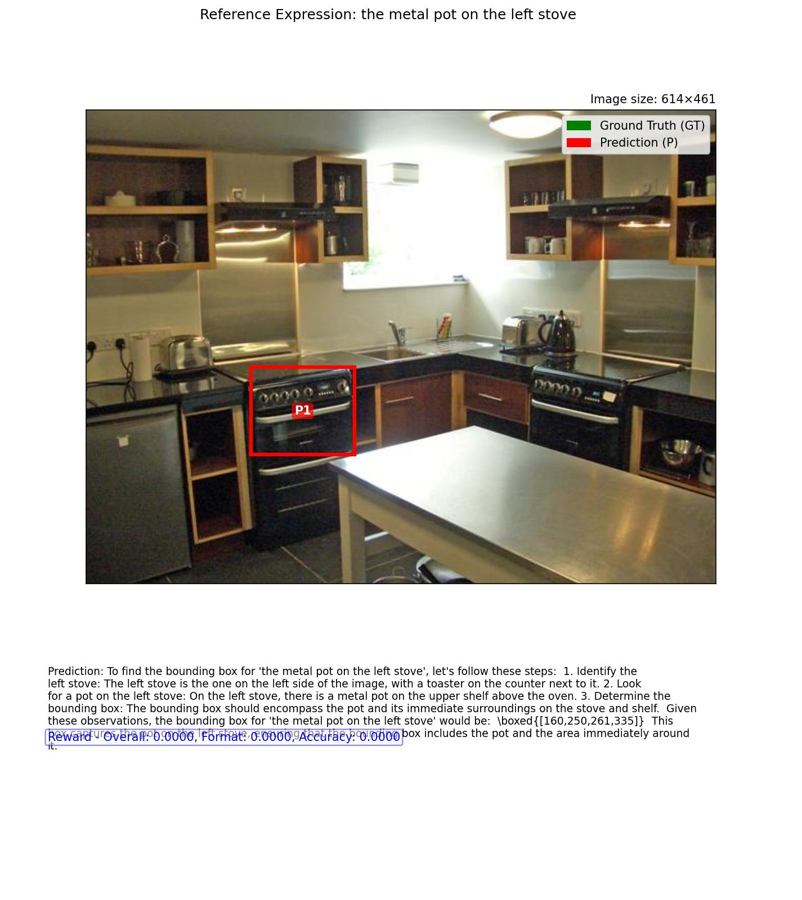

---

### Example 117

**Reference Expression**: the person who is neither facing the camera nor wearing a brown jacket

**Ground Truth**: [[334, 52, 458, 382]]

**Predicted**: [[324, 52, 469, 376]]

**Reward**: {'overall': 0.8418405833542871, 'format': 0.0, 'accuracy': 0.8418405833542871}

**Prediction**:
```
To find the bounding box for the person who is neither facing the camera nor wearing a brown jacket, we need to follow these steps:

1. Identify the people in the image and their positions.
2. Determine who is not facing the camera.
3. Check if the person not facing the camera is wearing a brown jacket.
4. If the person is not facing the camera and not wearing a brown jacket, identify their bounding box.

- The person in the red sweater is facing away from the camera.
- The person in the brown jacket is facing the camera.
- The person in the black top is facing the camera.
- The person in the white top is facing the camera.
- The person in the red top is facing the camera.

The only person who is neither facing the camera nor wearing a brown jacket is the person in the black top, who is standing between the person in the brown jacket and the person in the red sweater. 

Therefore, the bounding box for 'the person who is neither facing the camera nor wearing a brown jacket' is:

\boxed{[324,52,469,376]}
```

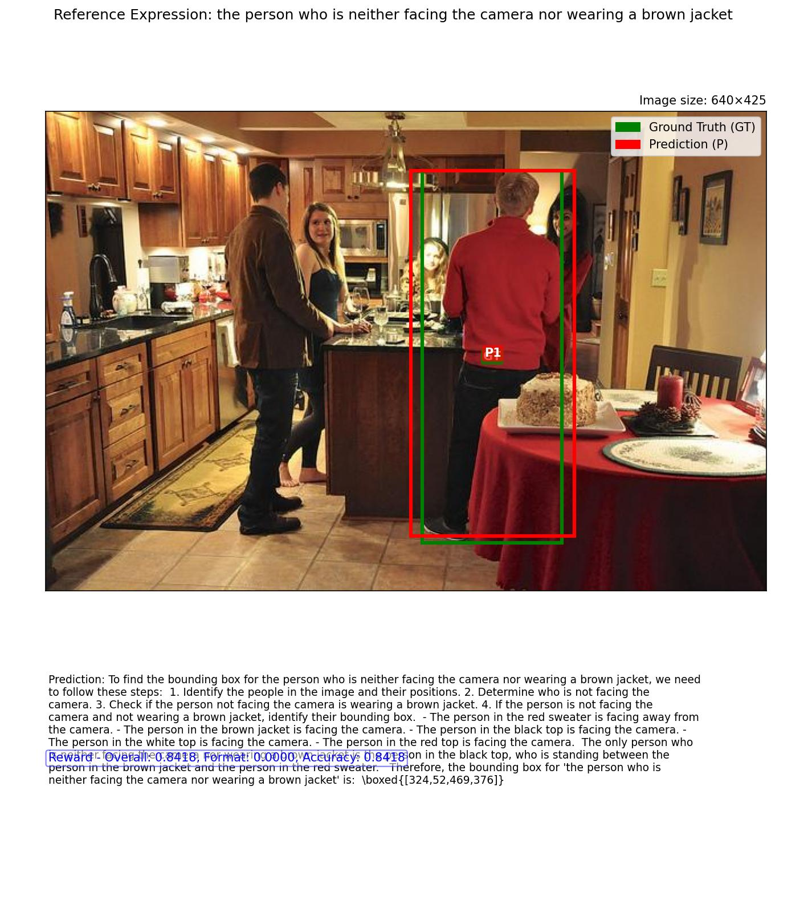

---

### Example 118

**Reference Expression**: a plastic bottle without a label

**Ground Truth**: [[51, 238, 114, 315]]

**Predicted**: [[52, 231, 135, 332]]

**Reward**: {'overall': 0.5643026004728132, 'format': 0.0, 'accuracy': 0.5643026004728132}

**Prediction**:
```
To find the bounding box for 'a plastic bottle without a label', we need to follow these steps:

1. Identify the objects that are likely to be bottles in the image.
2. Determine which of these bottles have no visible labels.
3. Provide the bounding box for the identified bottle.

Step 1: Identifying bottles
- There are several containers in the image that appear to be bottles. These include a white bottle on the left and a larger white bottle on the right side of the image.

Step 2: Determining the label status
- The white bottle on the left appears to have a label.
- The larger white bottle on the right does not appear to have a label.

Step 3: Providing the bounding box
- The larger white bottle on the right side of the image is the one without a label.

The bounding box for the larger white bottle without a label is:
\boxed{[52,231,135,332]}

This bounding box corresponds to the larger white bottle on the right side of the image, which appears to be without a label.
```

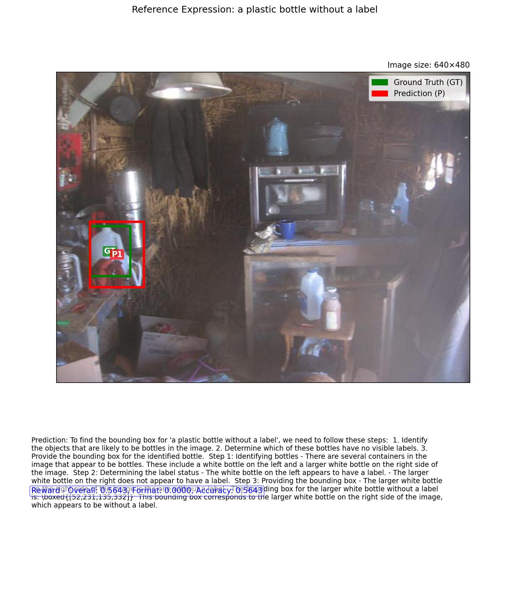

---

### Example 119

**Reference Expression**: a red bowl that is not on the counter nor the stove

**Ground Truth**: [[0, 191, 30, 209]]

**Predicted**: [[0, 197, 31, 215]]

**Reward**: {'overall': 0.4878048780487805, 'format': 0.0, 'accuracy': 0.4878048780487805}

**Prediction**:
```
To find the red bowl that is not on the counter nor the stove, let's follow these steps:

1. Scan the entire image for a red bowl.
2. Identify the stove and the counter areas where the bowl could be placed.
3. Check the floor, as it is a common place for items that are not on the counter or stove.
4. Look for any red bowl that is not in these areas.

After carefully examining the image:
- There is a red bowl on the left side of the image, but it is on the counter.
- There are no red bowls on the stove.
- There is a red bowl on the floor near the left side of the image, but it is not on the counter or stove.

Thus, the red bowl that is not on the counter nor the stove is on the floor.

The bounding box for the red bowl on the floor is:
\boxed{[0,197,31,215]}
```

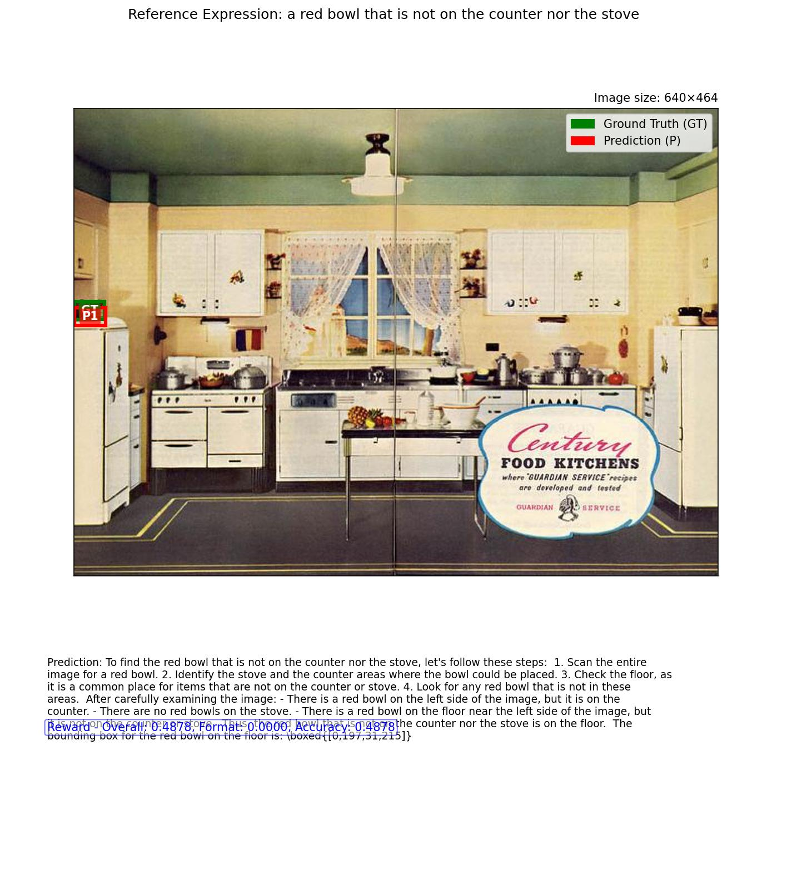

---

### Example 120

**Reference Expression**: a woman wearing sandals

**Ground Truth**: [[353, 154, 405, 338]]

**Predicted**: [[353, 152, 411, 339]]

**Reward**: {'overall': 0.8821685413977504, 'format': 0.0, 'accuracy': 0.8821685413977504}

**Prediction**:
```
To find the bounding box for 'a woman wearing sandals', let's follow these steps:

1. Identify the woman in the image: Look for a person standing near the motorcycle who is wearing sandals.
2. Focus on the details: The woman in the image is standing on the right side of the motorcycle, and she is wearing sandals.
3. Locate the bounding box: The bounding box should capture the woman from her head to her feet, ensuring that her sandals are included in the box.

After analyzing the image, the bounding box for the woman wearing sandals is:

\boxed{[353,152,411,339]}
```

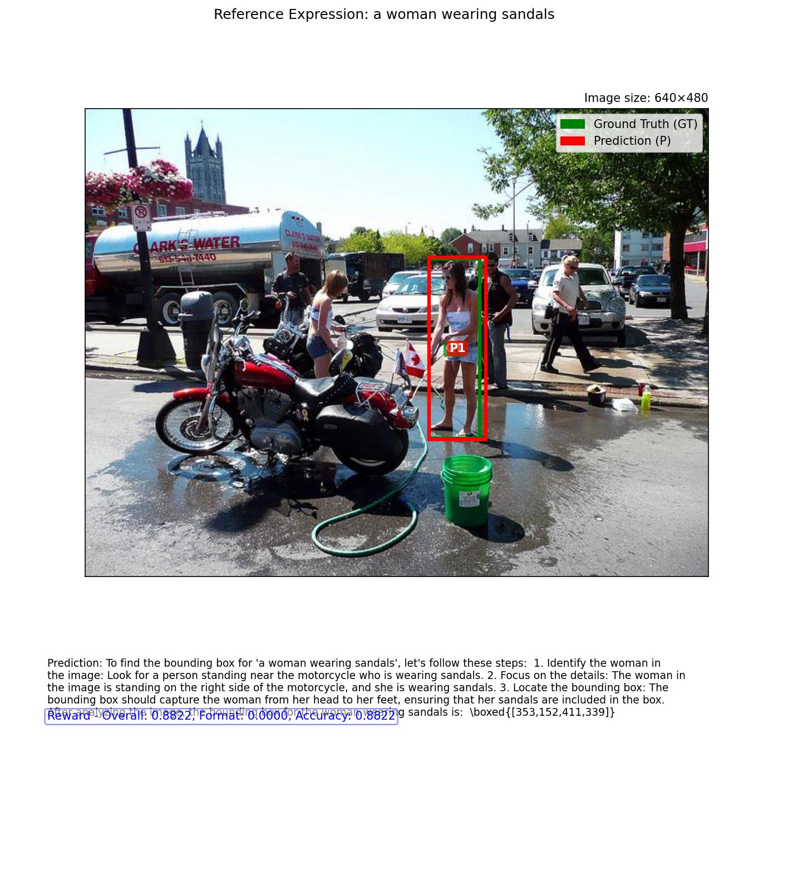

---

### Example 121

**Reference Expression**: the bottle with a black cap, second from the left

**Ground Truth**: [[309, 324, 318, 340]]

**Predicted**: [[101, 311, 119, 342]]

**Reward**: {'overall': 0.0, 'format': 0.0, 'accuracy': 0.0}

**Prediction**:
```
To find the bottle with a black cap, second from the left, we need to follow these steps:

1. Identify the objects on the counter that appear to be bottles. These are typically tall and narrow, with a shape consistent with a bottle.
2. Determine the order of these bottles from left to right. We need to count the second one from the left.
3. Check the cap of the second bottle from the left to ensure it is black.

Looking at the counter, there are several objects, but focusing on the bottles:
- The first object on the left is a toaster oven.
- The second object appears to be a bottle with a black cap.
- The third object is another bottle, but it does not have a black cap.

So, the bottle with a black cap, second from the left, is the second object on the counter.

The bounding box for this bottle is:
\boxed{[101,311,119,342]}
```

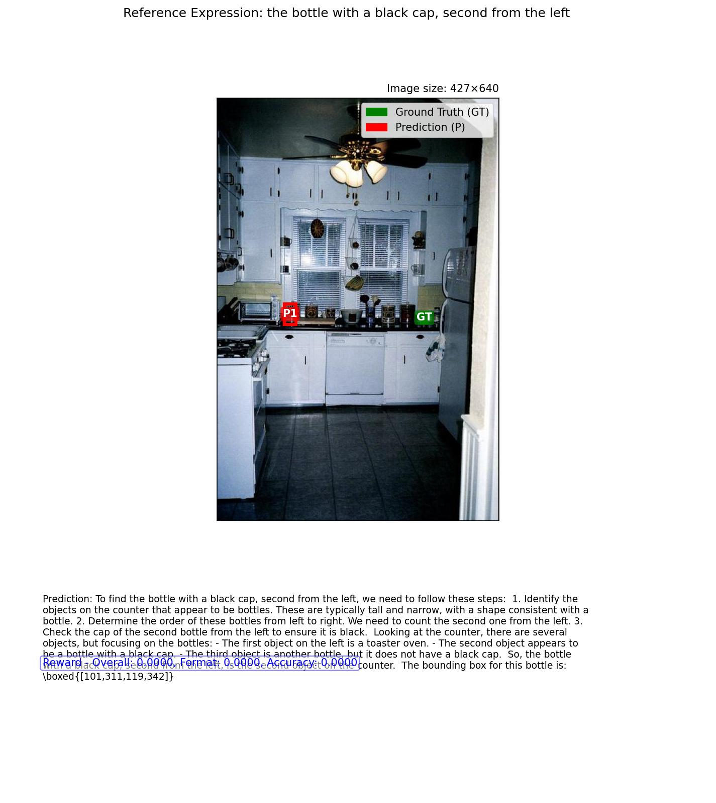

---

### Example 122

**Reference Expression**: a bowl on a metal wall-mounted open cabinet that is not stacked

**Ground Truth**: [[182, 165, 210, 175]]

**Predicted**: [[182, 151, 212, 174]]

**Reward**: {'overall': 0.35097493036211697, 'format': 0.0, 'accuracy': 0.35097493036211697}

**Prediction**:
```
To find the corresponding bounding box for 'a bowl on a metal wall-mounted open cabinet that is not stacked', let's follow these steps:

1. Identify the wall-mounted open cabinet: In the image, there are open cabinets on the left side of the image, but they seem to be closed or not fully open. We need to look for an open cabinet that is not stacked.

2. Look for a bowl on this cabinet: In the open cabinet on the left side, there appears to be a bowl that is not stacked with other bowls. This bowl is on a shelf that is not stacked with others.

3. Determine the bounding box: The bowl is located on the top shelf of the open cabinet on the left side of the image. The bounding box for this bowl should encompass the bowl and a small portion of the shelf.

Considering these observations, the bounding box for the bowl on the metal wall-mounted open cabinet that is not stacked would be:

\boxed{[182,151,212,174]}
```

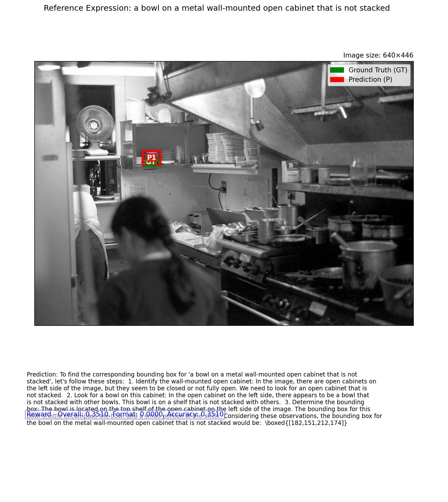

---

### Example 123

**Reference Expression**: the second bottle from the right on the kitchen countertop

**Ground Truth**: [[243, 224, 253, 255]]

**Predicted**: [[286, 265, 296, 303]]

**Reward**: {'overall': 0.0, 'format': 0.0, 'accuracy': 0.0}

**Prediction**:
```
To find the bounding box for 'the second bottle from the right on the kitchen countertop', let's follow these steps:

1. Identify the kitchen countertop: The countertop is the surface area above the stove and below the upper cabinets. It appears to be a light-colored surface.
2. Locate the bottles on the countertop: There are a few items on the countertop, including bottles. We need to identify the second bottle from the right.
3. Count the bottles from right to left: Starting from the right side of the countertop, count the bottles. The first bottle is the closest to the right edge, and the second bottle is the one next to it.
4. Determine the bounding box: The second bottle from the right is a dark-colored bottle, located near the center-right of the countertop.

Given these observations, the bounding box for 'the second bottle from the right on the kitchen countertop' would be:

\boxed{[286,265,296,303]}
```

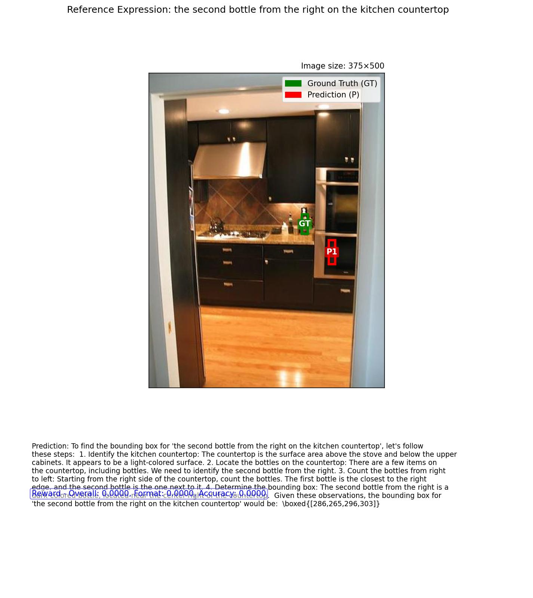

---

### Example 124

**Reference Expression**: the plant that is not on the windowsill and is located on the right side

**Ground Truth**: [[349, 388, 380, 424]]

**Predicted**: [[316, 381, 387, 425]]

**Reward**: {'overall': 0.35723431498079383, 'format': 0.0, 'accuracy': 0.35723431498079383}

**Prediction**:
```
To find the plant that is not on the windowsill and is located on the right side, let's follow these steps:

1. Identify the windowsill: The windowsill is the horizontal surface just below the window.
2. Look for plants on the windowsill: There are a few plants on the windowsill, but we are looking for one that is not on the windowsill.
3. Scan the right side of the image: Focus on the area to the right of the windowsill for any plants.
4. Identify the plant: There is a small plant on a surface to the right of the windowsill, which appears to be a countertop or shelf.

Given these observations, the bounding box for the plant that is not on the windowsill and is located on the right side would be:

\boxed{[316,381,387,425]}
```

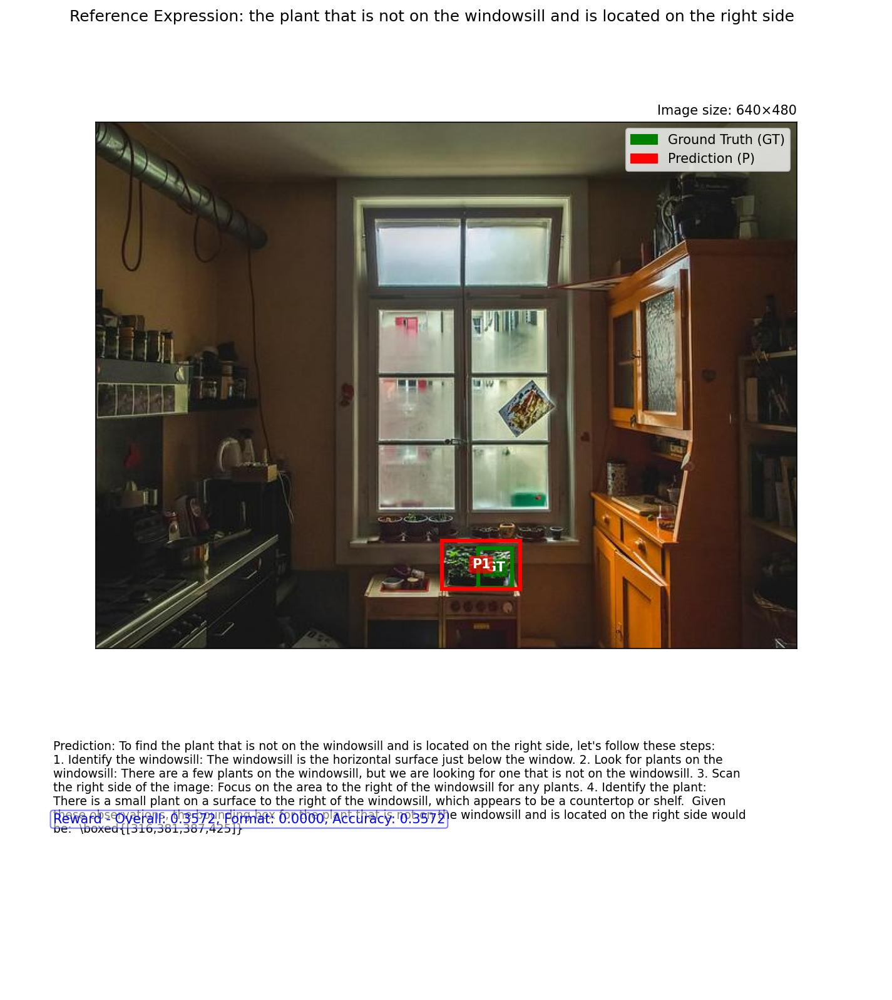

---

### Example 125

**Reference Expression**: a pot on the stovetop next to the coffee machine

**Ground Truth**: []

**Predicted**: []

**Reward**: {'overall': 1.0, 'format': 0.0, 'accuracy': 1.0}

**Prediction**:
```
To find the bounding box for 'a pot on the stovetop next to the coffee machine', let's follow these steps:

1. Identify the coffee machine: It's located on the left side of the stove, and it's a white machine with a glass carafe.
2. Look for a pot on the stovetop: A pot would typically be placed on a burner, and it should be close to the coffee machine.
3. Check the stovetop: The stovetop has four burners, and there doesn't appear to be a pot on any of them. The burners are clean and empty.
4. Conclusion: There is no pot on the stovetop next to the coffee machine in this image.

Therefore, the bounding box for 'a pot on the stovetop next to the coffee machine' is:
\boxed{[]}

```

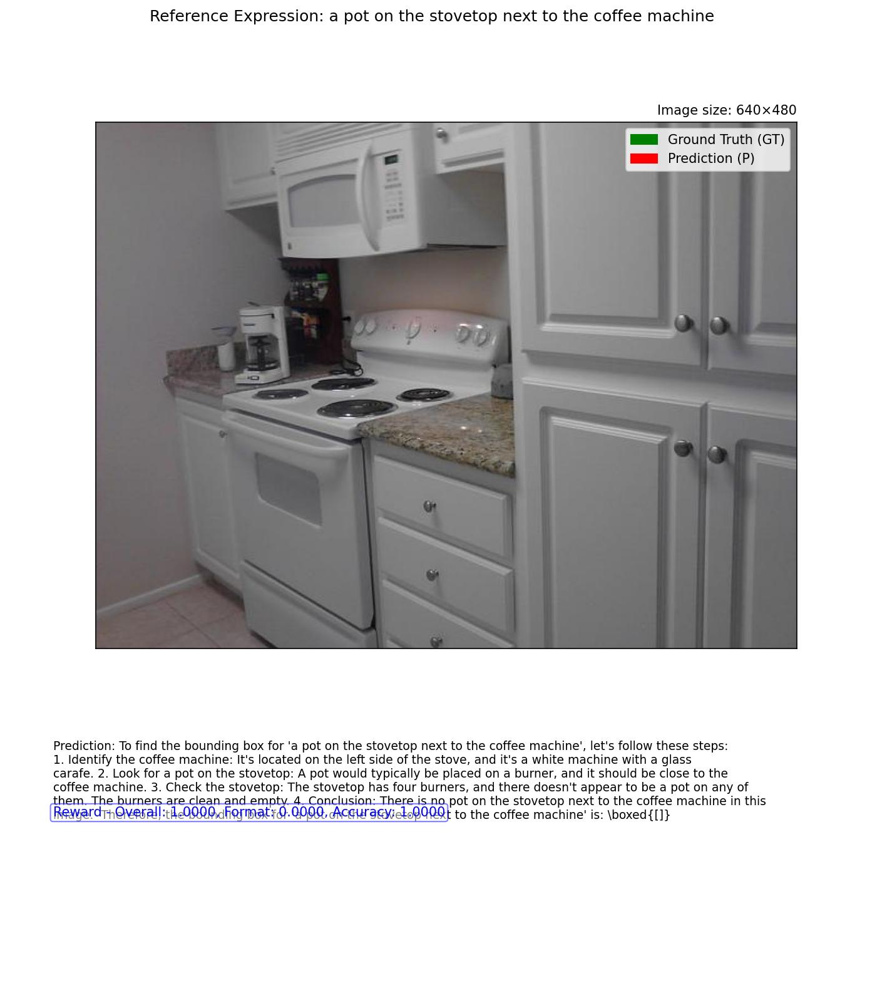

---

### Example 126

**Reference Expression**: a black chair that doesn't have any object on it and has a backrest

**Ground Truth**: [[222, 221, 301, 348]]

**Predicted**: [[222, 222, 301, 347]]

**Reward**: {'overall': 1.0, 'format': 0.0, 'accuracy': 1.0}

**Prediction**:
```
To find the bounding box for 'a black chair that doesn't have any object on it and has a backrest', we need to follow these steps:

1. Identify all the chairs in the image.
2. Determine which chairs are black.
3. Check if the black chairs have a backrest.
4. Ensure that the black chair does not have any objects on it.

Step 1: Identifying all the chairs:
- There are two black chairs near the kitchen counter.
- There is one black chair near the kitchen island.
- There is one wooden chair near the kitchen island.

Step 2: Determining which chairs are black:
- The two chairs near the kitchen counter are black.
- The chair near the kitchen island is black.
- The wooden chair near the kitchen island is not black.

Step 3: Checking if the black chairs have a backrest:
- The two chairs near the kitchen counter have backrests.
- The chair near the kitchen island has a backrest.

Step 4: Ensuring the black chair does not have any objects on it:
- The chair near the kitchen island does not have any objects on it.

Based on these observations, the black chair that doesn't have any object on it and has a backrest is the one near the kitchen island.

The bounding box for this chair is:
\boxed{[222,222,301,347]}
```

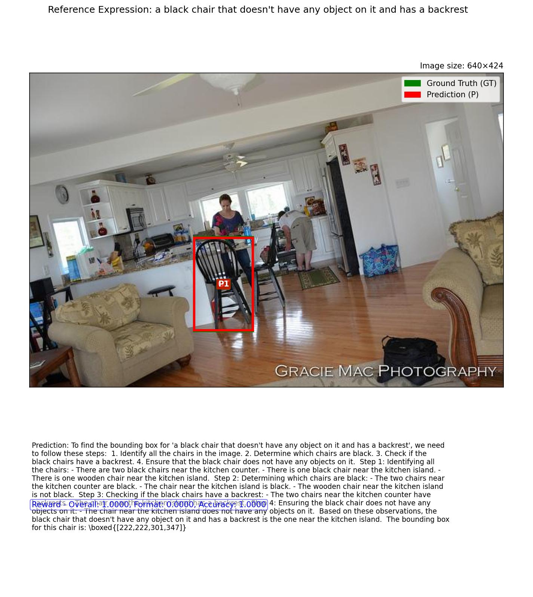

---

### Example 127

**Reference Expression**: a stack of two books that is not placed next to the chair

**Ground Truth**: [[491, 212, 524, 223]]

**Predicted**: [[442, 306, 516, 344]]

**Reward**: {'overall': 0.0, 'format': 0.0, 'accuracy': 0.0}

**Prediction**:
```
To find the bounding box for 'a stack of two books that is not placed next to the chair', let's follow these steps:

1. Identify the chair in the image. The chair is located to the left of the man in the image.
2. Look for a stack of books that is not next to the chair. The stack of two books can be found on the countertop to the right of the man, near the edge of the counter.
3. Ensure the stack of books is not placed next to the chair. The stack is clearly separated from the chair.

The bounding box for the stack of two books is:
\boxed{[442,306,516,344]}

This bounding box captures the stack of two books that is not placed next to the chair.
```

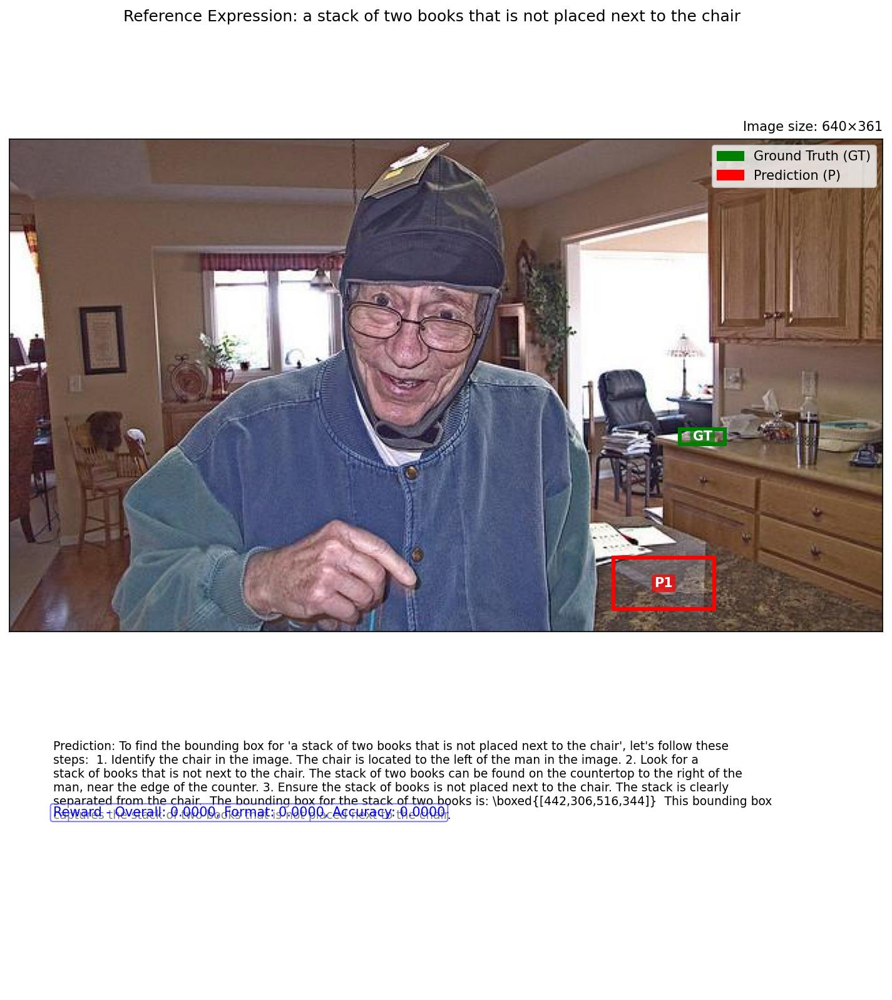

---

### Example 128

**Reference Expression**: a chair that is neither close to the wall nor closest to the camera

**Ground Truth**: [[210, 256, 286, 424]]

**Predicted**: [[271, 259, 375, 477]]

**Reward**: {'overall': 0.0, 'format': 0.0, 'accuracy': 0.0}

**Prediction**:
```
To find the chair that is neither close to the wall nor closest to the camera, we need to follow these steps:

1. Identify all the chairs in the image.
2. Determine which chair is closest to the wall.
3. Determine which chair is closest to the camera.
4. Identify the remaining chair.

Step 1: There are three chairs visible in the image.
Step 2: The chair on the left side of the table is closest to the wall.
Step 3: The chair on the right side of the table is closest to the camera.
Step 4: The remaining chair is the one in the middle of the table.

The bounding box for the chair that is neither close to the wall nor closest to the camera is:
\boxed{[271,259,375,477]}
```

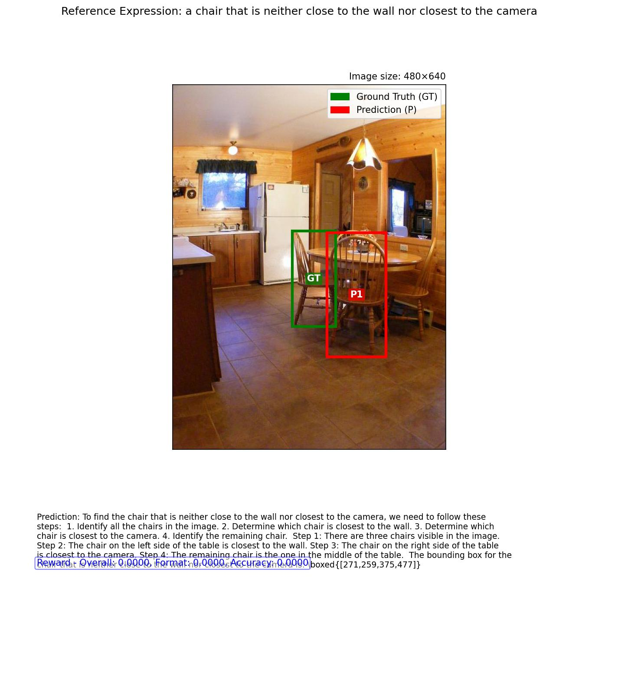

---

### Example 129

**Reference Expression**: the chair farthest from the microwave

**Ground Truth**: [[386, 270, 468, 451]]

**Predicted**: [[383, 269, 465, 448]]

**Reward**: {'overall': 1.0, 'format': 0.0, 'accuracy': 1.0}

**Prediction**:
```
To find 'the chair farthest from the microwave', we need to follow these steps:

1. Identify the microwave: It is located on the left side of the kitchen island.
2. Identify the chairs: There are three chairs visible around the kitchen island.
3. Determine the distance of each chair from the microwave:
   - The chair closest to the microwave is the one on the left.
   - The chair second closest is the one in the middle.
   - The chair farthest from the microwave is the one on the right.

Following these steps, the chair farthest from the microwave is the one on the right.

The bounding box for 'the chair farthest from the microwave' is:
\boxed{[383,269,465,448]}
```

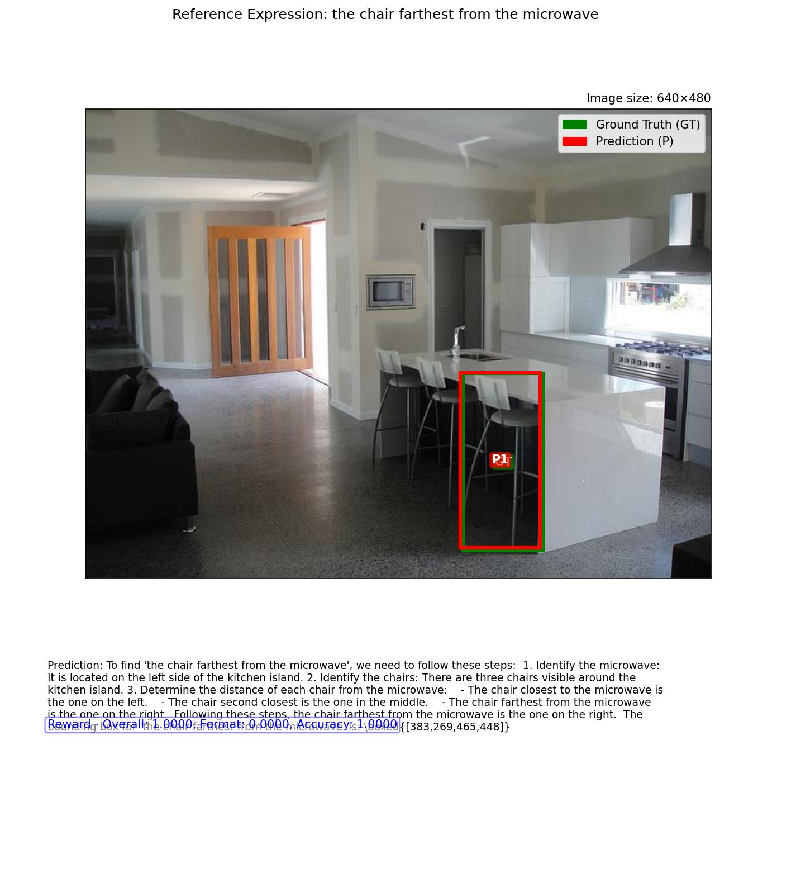

---

### Example 130

**Reference Expression**: the upper oven embedded in the white cabinet

**Ground Truth**: [[408, 207, 428, 253]]

**Predicted**: [[409, 235, 431, 301]]

**Reward**: {'overall': 0.1684729064039409, 'format': 0.0, 'accuracy': 0.1684729064039409}

**Prediction**:
```
To find the bounding box for 'the upper oven embedded in the white cabinet', let's follow these steps:

1. Identify the white cabinets in the kitchen.
2. Locate the oven that is embedded in one of these cabinets.
3. Determine the upper part of the oven.

- The kitchen has multiple white cabinets.
- The oven is located in the upper section of one of these cabinets.
- The upper part of the oven is embedded within the cabinet, not accessible from the front.

Upon careful observation, the oven appears to be in the upper section of the rightmost white cabinet, slightly to the left of the wall.

The bounding box for 'the upper oven embedded in the white cabinet' can be described as follows:

\boxed{[409,235,431,301]}
```

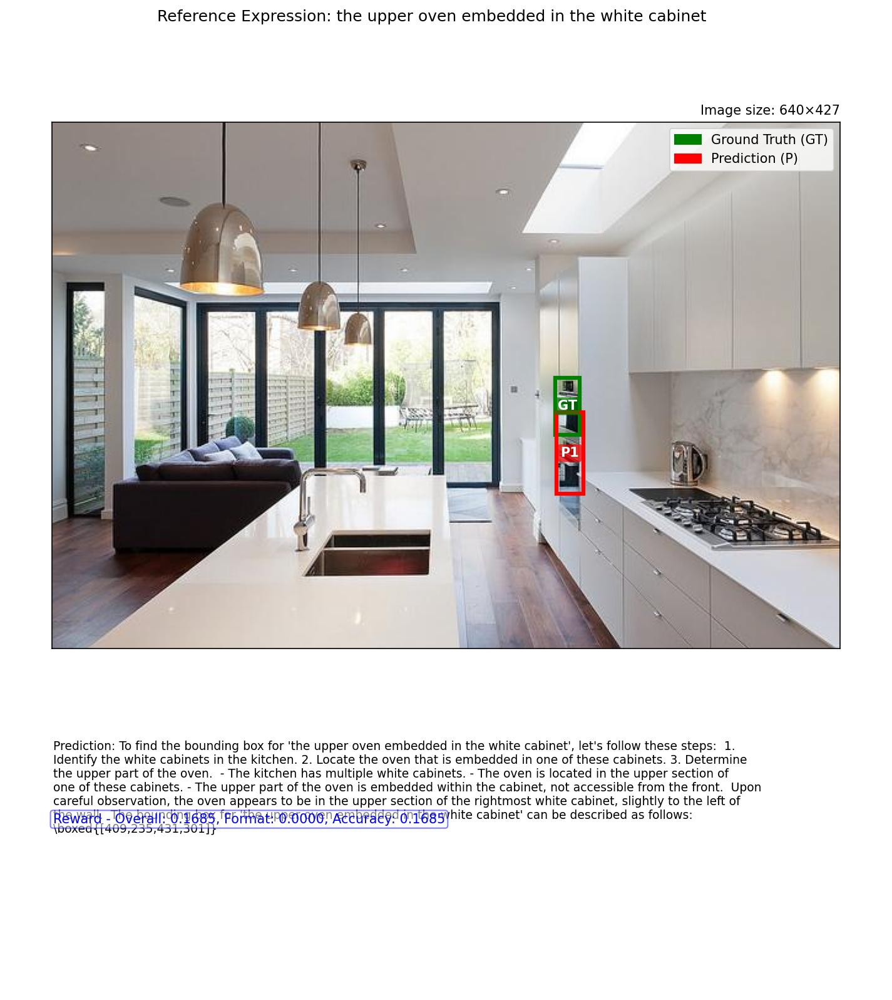

---

### Example 131

**Reference Expression**: the middle chair among chairs with green mat

**Ground Truth**: [[397, 178, 420, 207]]

**Predicted**: [[361, 214, 413, 286]]

**Reward**: {'overall': 0.0, 'format': 0.0, 'accuracy': 0.0}

**Prediction**:
```
To find the middle chair among the chairs with a green mat, we need to follow these steps:

1. Identify the chairs with green mats: In the image, there are two sofas with a green mat on the backrest and red cushions. The chairs in question are the ones in the middle of these sofas.

2. Locate the chairs: The chairs are positioned in the middle of the image, between the two sofas. There are two chairs visible, one on the left side of the dining table and one on the right side.

3. Determine the middle chair: Since there are two chairs, the middle chair would be the one that is in the center of the dining table, which is the chair that is directly in front of the dining table.

4. Provide the bounding box: The bounding box for the middle chair among the chairs with a green mat is the one that is in the center of the dining table.

After analyzing the image, the bounding box for the middle chair among the chairs with a green mat is:
\boxed{[361,214,413,286]}
```

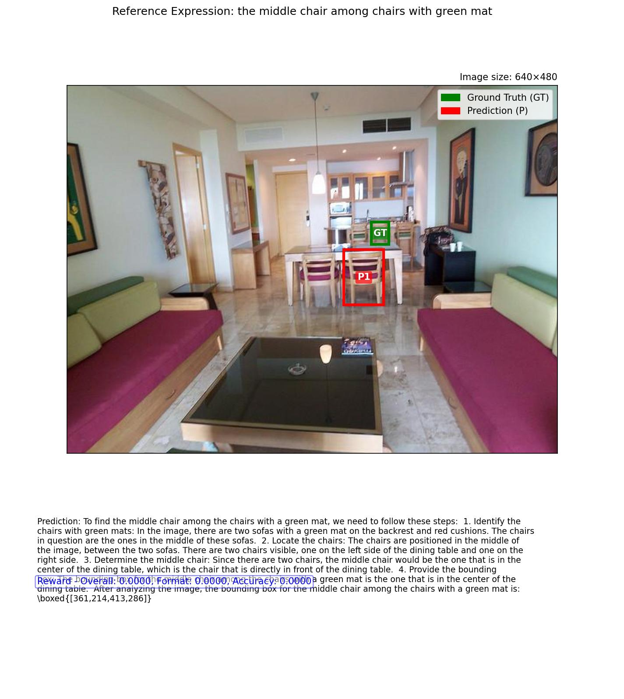

---

### Example 132

**Reference Expression**: the middle chair at the dining table not on the sofa side

**Ground Truth**: [[70, 256, 100, 277]]

**Predicted**: [[183, 236, 230, 307]]

**Reward**: {'overall': 0.0, 'format': 0.0, 'accuracy': 0.0}

**Prediction**:
```
To find the middle chair at the dining table not on the sofa side, let's follow these steps:

1. Identify the dining table: It is the long wooden table in the middle of the image.
2. Locate the chairs: There are chairs on both sides of the table. The chairs on the sofa side are closer to the sofa, while the chairs on the other side are closer to the kitchen area.
3. Determine the middle chair: The middle chair is the one that is equidistant from the two ends of the table, not on the sofa side.

The middle chair is the one that is directly opposite the sofa and is in the center of the table. It is the chair that is not on the sofa side and is positioned centrally.

The bounding box for this chair is:
\boxed{[183,236,230,307]}
```

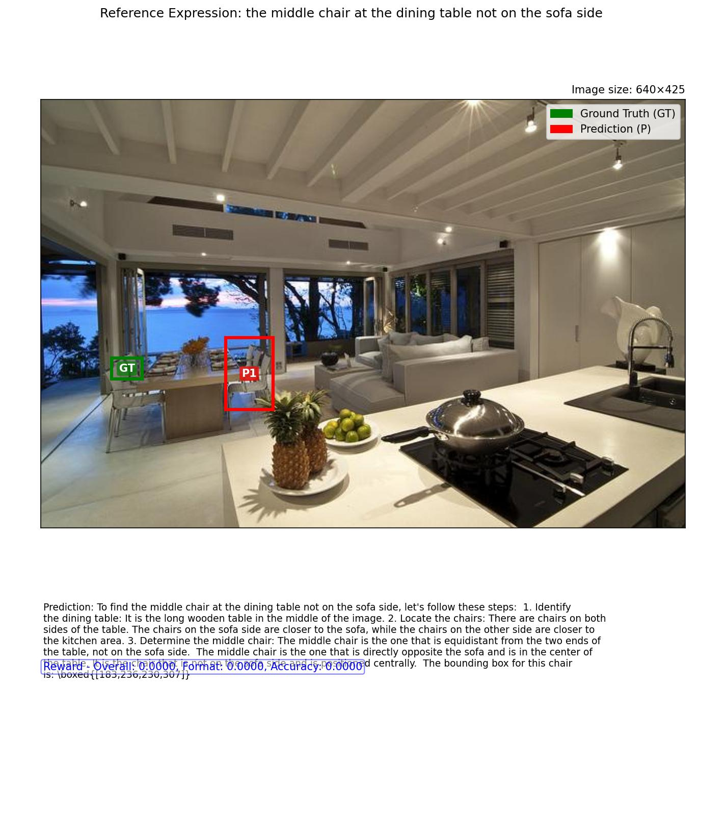

---

### Example 133

**Reference Expression**: a person holding a green umbrella walking away from the camera

**Ground Truth**: []

**Predicted**: [[124, 342, 141, 375]]

**Reward**: {'overall': 0.0, 'format': 0.0, 'accuracy': 0.0}

**Prediction**:
```
To find the bounding box for 'a person holding a green umbrella walking away from the camera', let's follow these steps:

1. Identify the general area where people might be walking. In the image, there is a pathway with a few people visible.
2. Look for a person holding an umbrella. There is a person on the left side of the image holding a blue umbrella.
3. Determine if the person is walking away from the camera. The person is facing away from the camera and appears to be walking.
4. Check the color of the umbrella. The umbrella is blue, not green.
5. Re-examine the image to find a green umbrella. There is another person further back on the pathway, and they appear to be holding a green umbrella.
6. Verify that this person is walking away from the camera. The person holding the green umbrella is indeed walking away from the camera.

Given these observations, the bounding box for the person holding a green umbrella walking away from the camera would be:

\boxed{[124,342,141,375]}
```

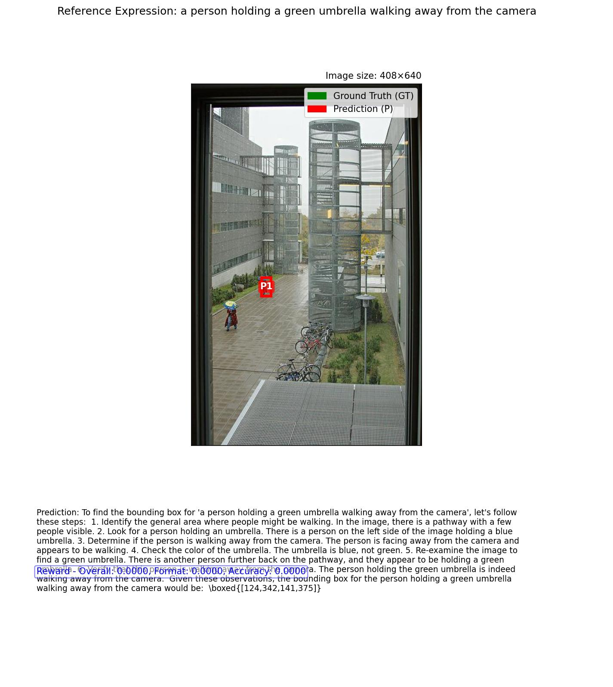

---

### Example 134

**Reference Expression**: a bicycle without a basket that is partially blocked by a yellow pole

**Ground Truth**: [[339, 427, 425, 579]]

**Predicted**: [[335, 429, 419, 582]]

**Reward**: {'overall': 0.8618213157138753, 'format': 0.0, 'accuracy': 0.8618213157138753}

**Prediction**:
```
To find the bounding box for 'a bicycle without a basket that is partially blocked by a yellow pole', let's follow these steps:

1. Identify the yellow pole in the image. It is located on the right side of the image.
2. Look for bicycles that are partially obscured by the yellow pole. There is a bicycle partially hidden behind the yellow pole on the right side of the image.
3. Focus on the bicycle that is not fully obscured by the pole. It is the one on the far right side of the image, next to the pole.

The bounding box for this bicycle can be determined by its visible parts:
- The front part of the bicycle is visible, and the back part is partially obscured by the yellow pole.
- The bounding box should include the visible part of the bicycle and the part that is not obscured by the pole.

The final bounding box for the bicycle without a basket that is partially blocked by a yellow pole is:
\boxed{[335,429,419,582]}


```

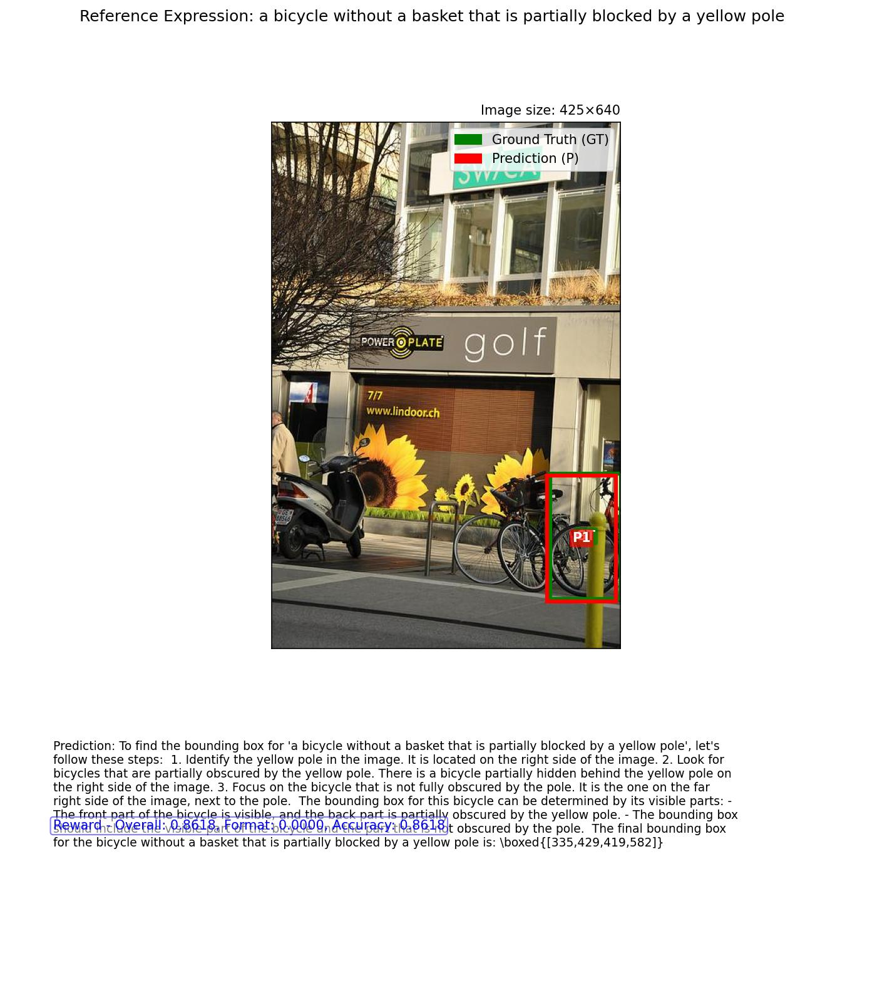

---

### Example 135

**Reference Expression**: the car next to the car with its door open

**Ground Truth**: [[576, 88, 583, 91]]

**Predicted**: [[65, 102, 376, 284]]

**Reward**: {'overall': 0.0, 'format': 0.0, 'accuracy': 0.0}

**Prediction**:
```
To find 'the car next to the car with its door open', we need to follow these steps:

1. Identify the car with its door open. The car in the background with the door open is the teal-colored car on the left.
2. Locate the car next to this teal car. The car to the right of the teal car is a red car.
3. Confirm that the red car is indeed the one next to the teal car.

The bounding box for 'the car next to the car with its door open' is:
\boxed{[65,102,376,284]}

This box represents the red car parked next to the teal car.
```

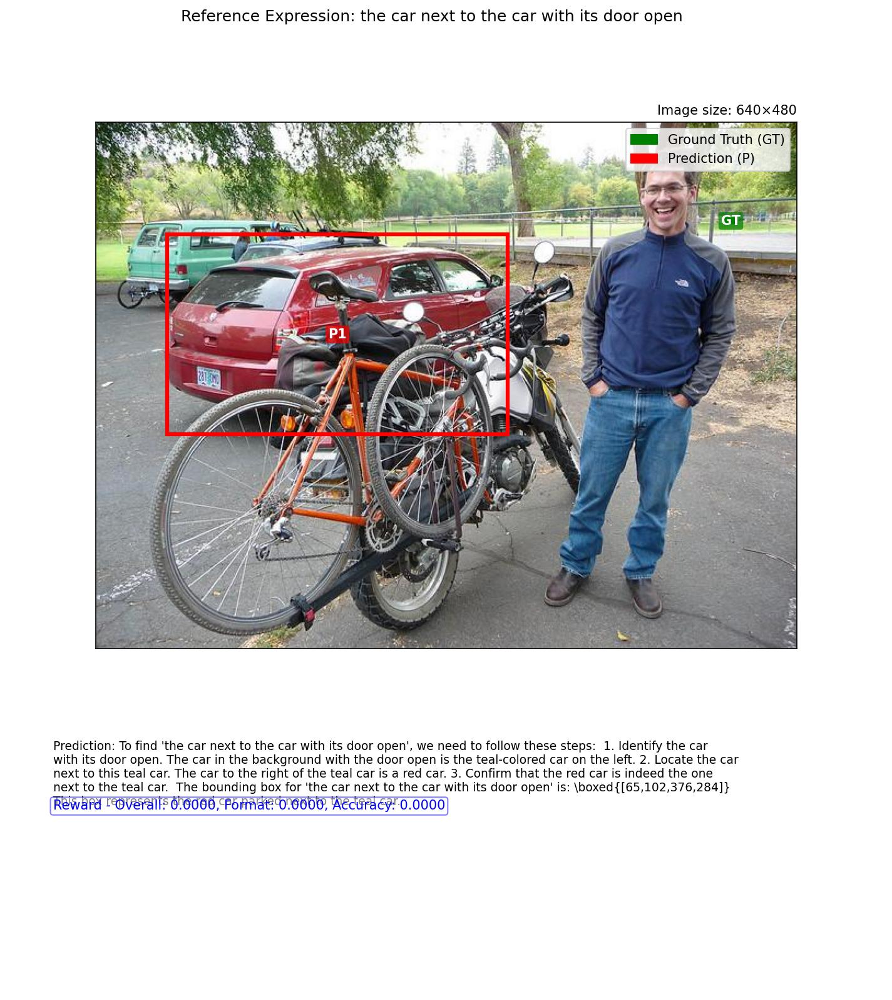

---

### Example 136

**Reference Expression**: a bicycle that is not placed on the ground

**Ground Truth**: [[245, 1, 282, 80]]

**Predicted**: [[241, 0, 278, 81]]

**Reward**: {'overall': 0.7869000905523694, 'format': 0.0, 'accuracy': 0.7869000905523694}

**Prediction**:
```
To find the bounding box for 'a bicycle that is not placed on the ground', we need to identify a bicycle that is suspended or mounted in a way that it is not on the ground. In this image, there is a bicycle mounted on the wall in the background. Let's follow these steps:

1. Identify all bicycles in the image.
2. Determine which bicycle is not on the ground.
3. Locate the bicycle that is mounted on the wall.

- The bicycle in the foreground is on the ground.
- The bicycles in the background are on the ground.
- The bicycle mounted on the wall is the one we are looking for.

The bicycle mounted on the wall is located at the top center of the image. The bounding box for this bicycle would be:

\boxed{[241,0,278,81]}
```

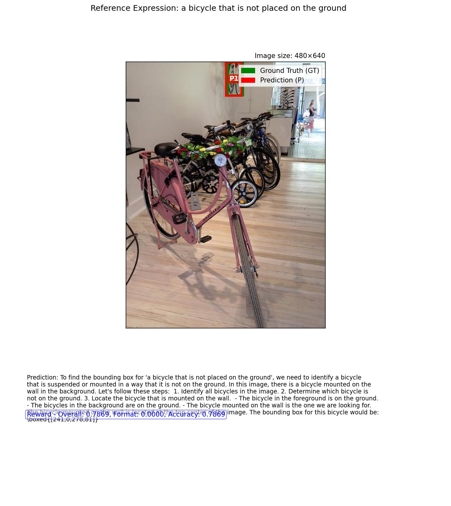

---

### Example 137

**Reference Expression**: a person who is neither standing, sitting, walking, nor skateboarding

**Ground Truth**: [[258, 224, 302, 321]]

**Predicted**: [[159, 234, 175, 268]]

**Reward**: {'overall': 0.0, 'format': 0.0, 'accuracy': 0.0}

**Prediction**:
```
To find the bounding box for 'a person who is neither standing, sitting, walking, nor skateboarding', we need to identify individuals in the scene who are not actively engaged in any of the mentioned activities. Here's the step-by-step reasoning:

1. **Identify individuals actively skateboarding or standing/sitting/walking**: Focus on people who are clearly performing actions like skateboarding or standing/sitting/walking.
2. **Look for stationary individuals**: After identifying the active individuals, look for anyone who is not moving or actively engaged in any activity.

After analyzing the image:
- The person in the foreground is skateboarding.
- The person in the middle is on a bicycle.
- The person in the background is standing and watching.
- The remaining individuals are either sitting, standing, or walking.

The individual who is neither standing, sitting, walking, nor skateboarding is the person on the far left of the image, who is standing and watching.

The bounding box for this person is:
\boxed{[159,234,175,268]}
```

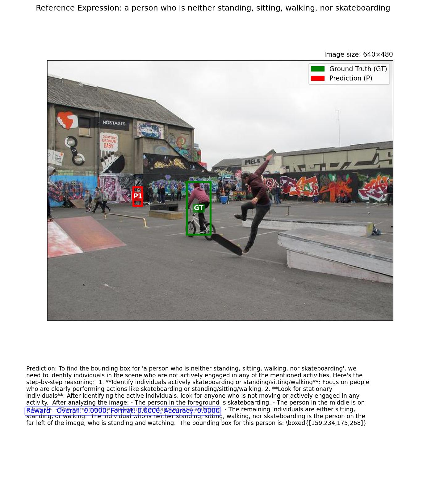

---

### Example 138

**Reference Expression**: a person who is not on the sidewalk and is carrying a bag that is not blue

**Ground Truth**: [[232, 233, 315, 492]]

**Predicted**: [[129, 192, 147, 256]]

**Reward**: {'overall': 0.0, 'format': 0.0, 'accuracy': 0.0}

**Prediction**:
```
To find the bounding box for 'a person who is not on the sidewalk and is carrying a bag that is not blue', we need to follow these steps:

1. Identify all the people in the image who are not on the sidewalk.
2. Determine which of these people are carrying a bag.
3. Check the color of the bag.
4. Select the person who meets the criteria.

Step 1: People not on the sidewalk:
- A person is walking in the street, carrying a bag, and is not on the sidewalk.
- Another person further down the street is also walking in the street.

Step 2: Both people are carrying bags.
- The person closer to the camera is carrying a blue bag.
- The person further down the street is carrying a black bag.

Step 3: The person further down the street is carrying a black bag, which is not blue.

Step 4: The person further down the street, carrying a black bag, is the one who meets the criteria.

The bounding box for this person is:
\boxed{[129,192,147,256]}
```

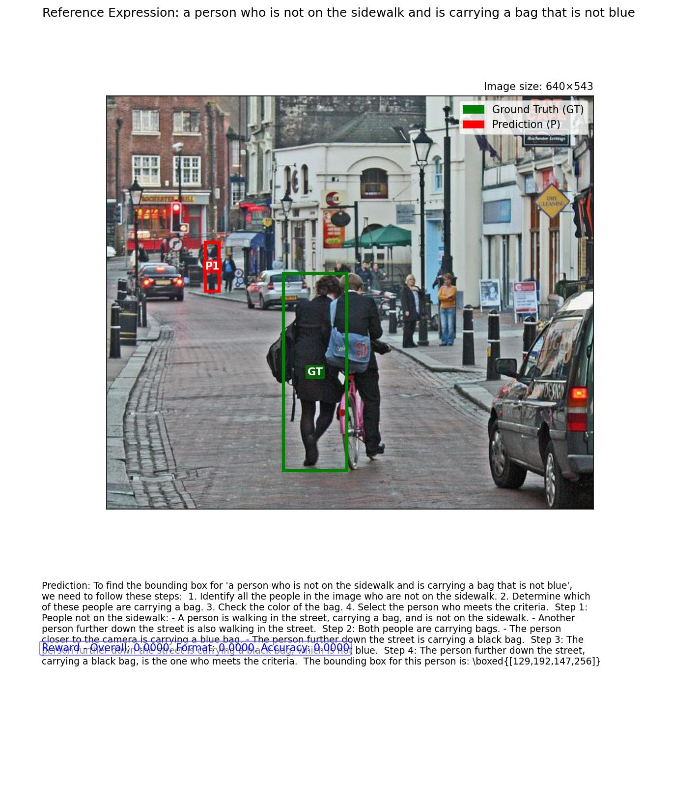

---

### Example 139

**Reference Expression**: a motorcycle facing toward the road with a red seat

**Ground Truth**: [[216, 221, 312, 308]]

**Predicted**: [[173, 290, 361, 415]]

**Reward**: {'overall': 0.0, 'format': 0.0, 'accuracy': 0.0}

**Prediction**:
```
To find the bounding box for 'a motorcycle facing toward the road with a red seat', follow these steps:

1. Identify the motorcycles in the image.
2. Determine which motorcycle is facing the road.
3. Check the color of the seat of the motorcycle facing the road.

Step 1: There are two motorcycles in the foreground of the image. One is on the left side and the other is on the right side.

Step 2: The motorcycle on the right side is facing the road, as it is positioned in a way that its front is directed towards the viewer.

Step 3: The seat of the motorcycle on the right side appears to be red.

Given these observations, the bounding box for the motorcycle facing toward the road with a red seat is:

\boxed{[173,290,361,415]}
```

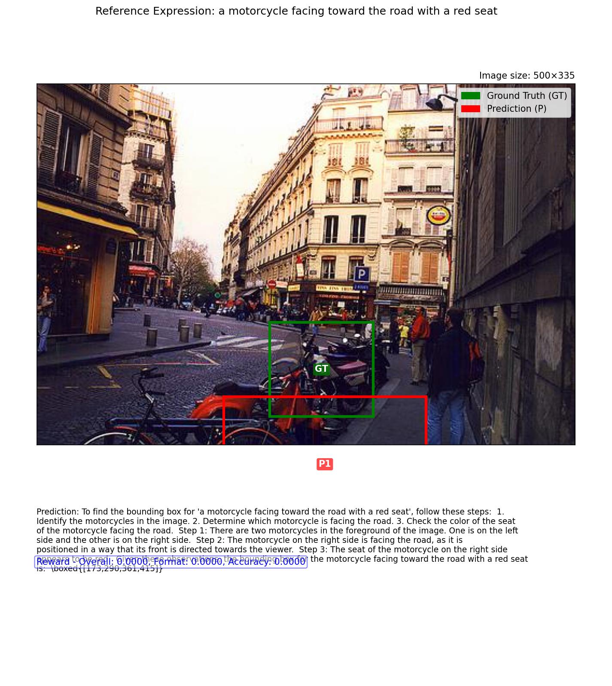

---

### Example 140

**Reference Expression**: a vehicle that has a backrest and does not have four wheels

**Ground Truth**: [[396, 146, 427, 224]]

**Predicted**: [[394, 154, 429, 221]]

**Reward**: {'overall': 0.7732688011913627, 'format': 0.0, 'accuracy': 0.7732688011913627}

**Prediction**:
```
To find the bounding box for 'a vehicle that has a backrest and does not have four wheels', let's follow these steps:

1. Identify the vehicles in the image: There are bicycles, a car in the background, and a vehicle that looks like a bicycle with a backrest.
2. Focus on the vehicle with a backrest: This vehicle appears to be a bicycle with a backrest, which is typically a feature of a cargo bike or a bike with a rear rack.
3. Check if it has four wheels: This vehicle has two wheels, not four, which fits the description.
4. Confirm the bounding box: The vehicle with the backrest and two wheels is located near the center of the image.

After analyzing the image, the bounding box for the vehicle that has a backrest and does not have four wheels is:

\boxed{[394,154,429,221]}
```

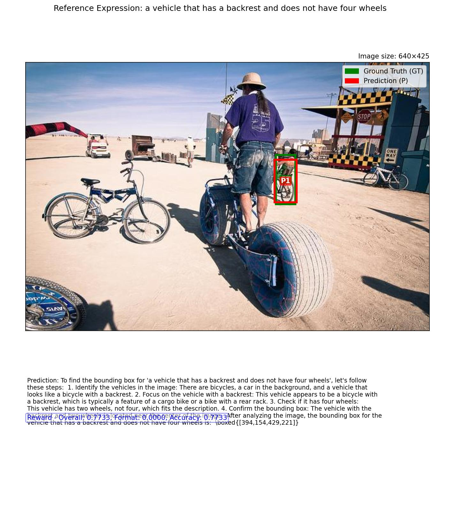

---

### Example 141

**Reference Expression**: a boat with a red top and a white hull

**Ground Truth**: [[288, 138, 356, 167]]

**Predicted**: [[96, 155, 220, 275]]

**Reward**: {'overall': 0.0, 'format': 0.0, 'accuracy': 0.0}

**Prediction**:
```
To find the bounding box for 'a boat with a red top and a white hull', we need to carefully examine the image and identify the boat that matches this description. Here's the step-by-step reasoning:

1. **Identify the boat**: Look for a boat that has a distinct red top and a white hull. Boats are typically located along the canal in the image.

2. **Locate the boat**: In the image, there is a boat in the middle of the canal that appears to have a red top and a white hull. It is positioned near the center of the image, closer to the foreground.

3. **Define the bounding box**: The bounding box should encompass the entire boat, including its red top and white hull. The boat is partially submerged, and the bounding box should be large enough to include the entire visible part of the boat.

After identifying the boat, the bounding box for 'a boat with a red top and a white hull' is:

\boxed{[96,155,220,275]}
```

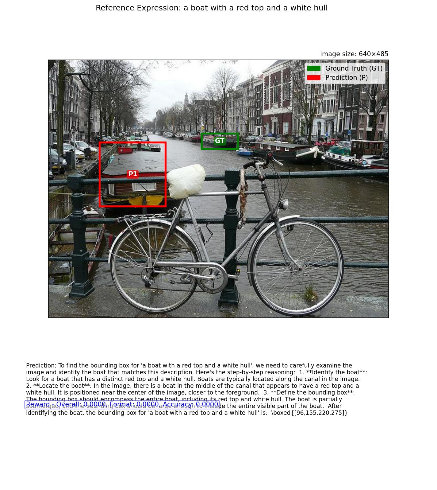

---

### Example 142

**Reference Expression**: a person next to a bicycle lying on the ground who is not making a phone call

**Ground Truth**: [[55, 267, 134, 388]]

**Predicted**: [[58, 249, 256, 407]]

**Reward**: {'overall': 0.2905804657629475, 'format': 0.0, 'accuracy': 0.2905804657629475}

**Prediction**:
```
To find the bounding box for 'a person next to a bicycle lying on the ground who is not making a phone call', we need to follow these steps:

1. Identify the person lying on the ground near the bicycle.
2. Check if this person is making a phone call. If not, that person is the one we are looking for.
3. Define the bounding box for this person.

- The person lying on the ground near the bicycle appears to be the one who is not making a phone call.
- This person is on the left side of the image, sitting on the ground with a bicycle lying next to them.

The bounding box for this person is:
\boxed{[58,249,256,407]}
```

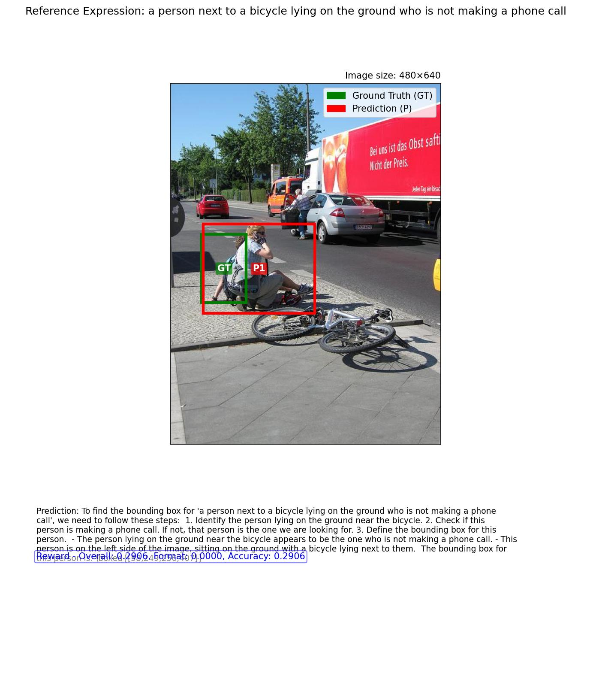

---

### Example 143

**Reference Expression**: a bus moving toward the camera with blue on its front

**Ground Truth**: [[362, 118, 425, 195]]

**Predicted**: [[372, 114, 424, 193]]

**Reward**: {'overall': 0.7709033405811425, 'format': 0.0, 'accuracy': 0.7709033405811425}

**Prediction**:
```
To find the bus moving toward the camera with blue on its front, follow these steps:

1. Identify the buses in the image. Buses are typically larger vehicles with distinct designs and are often green, blue, or other colors.
2. Look for a bus that is facing the camera and has blue on its front. This bus should be positioned in the center of the image, facing forward.
3. Upon close inspection, there is a bus in the center of the image that has blue on its front and is facing the camera.

The bounding box for this bus is:
\boxed{[372,114,424,193]}
```

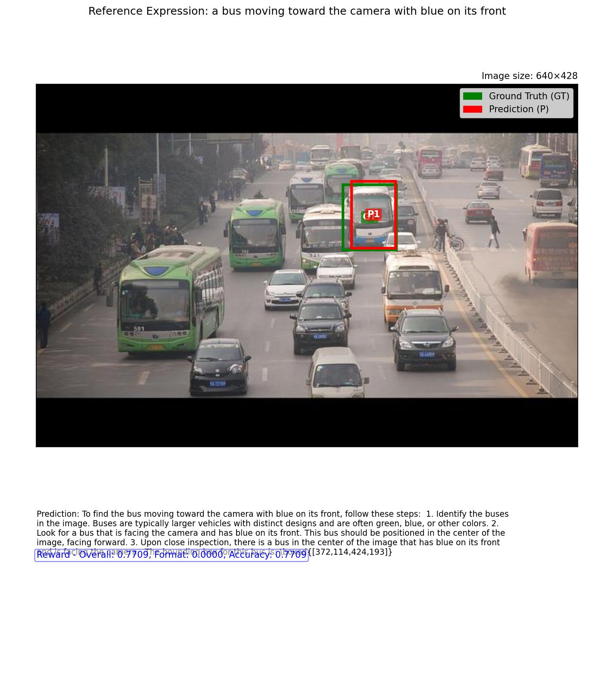

---

### Example 144

**Reference Expression**: a person standing at the doorway and eating something

**Ground Truth**: [[0, 246, 25, 384]]

**Predicted**: [[68, 224, 136, 423]]

**Reward**: {'overall': 0.0, 'format': 0.0, 'accuracy': 0.0}

**Prediction**:
```
To find the bounding box for 'a person standing at the doorway and eating something', let's follow these steps:

1. Identify the doorway: The doorway is on the left side of the image, under the "LACELA CITY HALL" sign.
2. Look for a person near the doorway: There is a person standing near the doorway, and it appears they are eating something.
3. Define the bounding box: The person is partially obscured by the doorway, but we can see enough of them to define a bounding box.

After analyzing the image, the bounding box for the person standing at the doorway and eating something is:

\boxed{[68,224,136,423]}
```

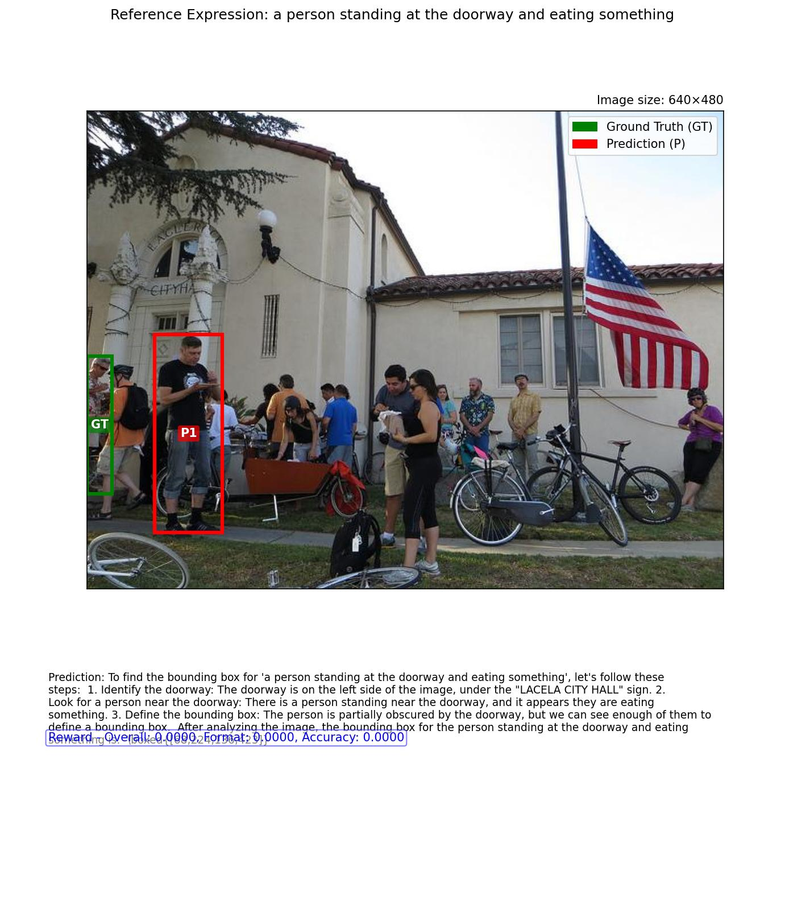

---

### Example 145

**Reference Expression**: the man wearing backpack to the left side of the red-shirt girl, not the boy

**Ground Truth**: [[97, 206, 152, 381]]

**Predicted**: [[95, 204, 145, 376]]

**Reward**: {'overall': 0.8107302533532041, 'format': 0.0, 'accuracy': 0.8107302533532041}

**Prediction**:
```
To find the bounding box for 'the man wearing a backpack to the left side of the red-shirt girl, not the boy', we need to follow these steps:

1. Identify the red-shirt girl: She is standing in the middle of the group, wearing a red top.
2. Locate the man to her left who is wearing a backpack: This man is standing next to the red-shirt girl, facing away from the camera, and has a backpack on.
3. Ensure this man is not the boy: The boy is further to the left and does not have a backpack.

Given these observations, the bounding box for 'the man wearing a backpack to the left side of the red-shirt girl, not the boy' can be identified as follows:

\boxed{[95,204,145,376]}
```

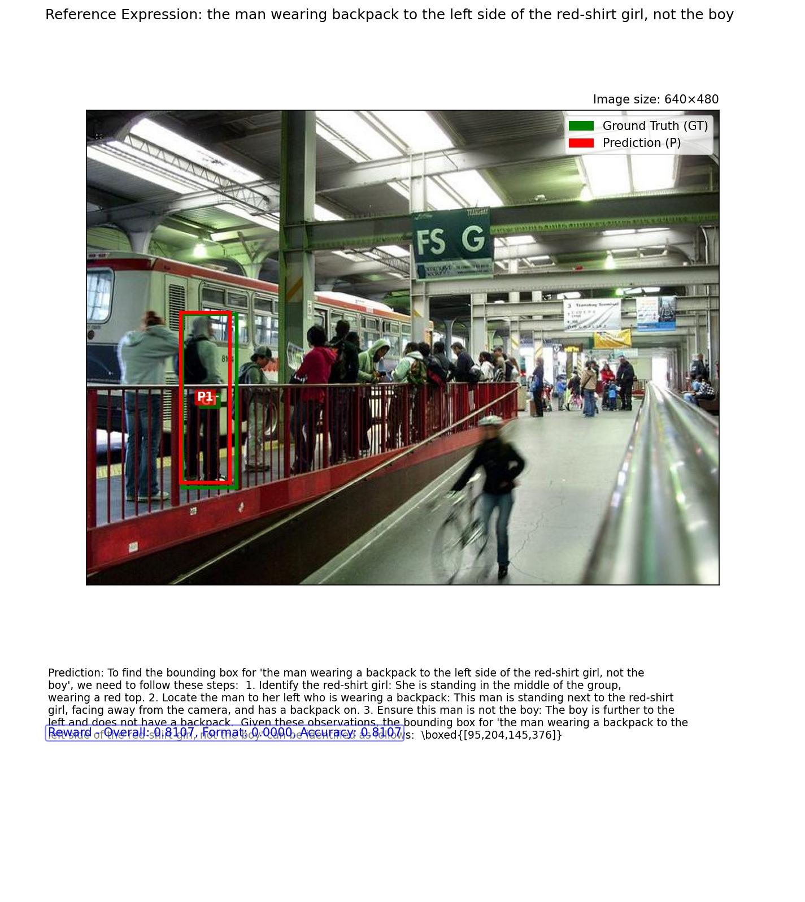

---

### Example 146

**Reference Expression**: the one standing above stairs, not near bike or motor

**Ground Truth**: [[392, 61, 419, 133]]

**Predicted**: [[411, 125, 455, 209]]

**Reward**: {'overall': 0.0, 'format': 0.0, 'accuracy': 0.0}

**Prediction**:
```
To find the bounding box for 'the one standing above stairs, not near bike or motor', let's analyze the image step-by-step:

1. Identify the person standing near the stairs: There is a person standing near the stairs wearing a blue shirt and a white helmet. This person is not near the bike or motorbike but is standing above the stairs.
2. Identify the bounding box: The person standing near the stairs is located towards the middle right of the image, standing in front of a set of stairs.

The final bounding box for 'the one standing above stairs, not near bike or motor' is:
\boxed{[411, 125, 455, 209]}
```

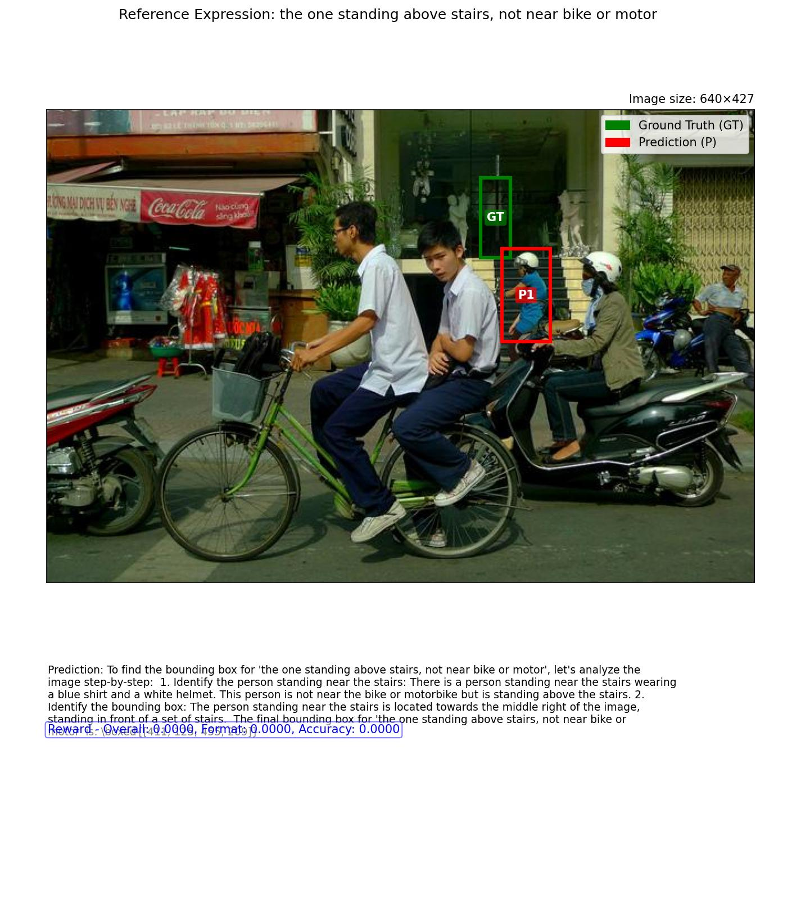

---

### Example 147

**Reference Expression**: the black motor on the front, close to the red motor, not close to the green bike

**Ground Truth**: [[17, 224, 168, 384]]

**Predicted**: [[16, 219, 184, 384]]

**Reward**: {'overall': 0.8715728715728716, 'format': 0.0, 'accuracy': 0.8715728715728716}

**Prediction**:
```
To find the bounding box for 'the black motor on the front, close to the red motor, not close to the green bike', let's follow these steps:

1. Identify the red motorbike: It's the one on the far left, which is partially obscured by other objects.
2. Identify the black motorbike: It's the one next to the red motorbike, which is also partially obscured.
3. Determine which black motorbike is 'close to the red motor, not close to the green bike': The black motorbike that is positioned in front of the red motorbike and behind the green bike is the one we are looking for.

Given these observations, the bounding box for 'the black motor on the front, close to the red motor, not close to the green bike' would be:

\boxed{[16,219,184,384]}
```

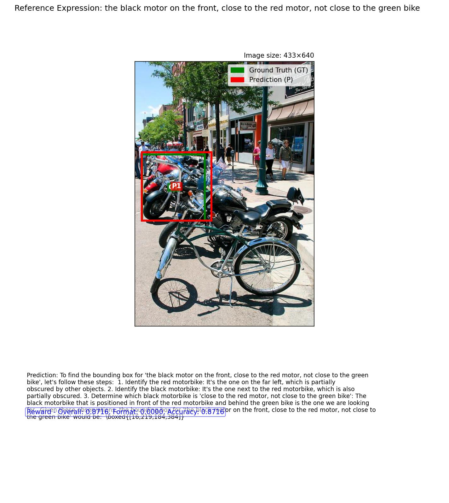

---

### Example 148

**Reference Expression**: the third one from the back of the boat

**Ground Truth**: [[477, 190, 493, 204]]

**Predicted**: [[455, 187, 465, 203]]

**Reward**: {'overall': 0.0, 'format': 0.0, 'accuracy': 0.0}

**Prediction**:
```
To determine the bounding box for 'the third one from the back of the boat', we need to follow these steps:

1. Identify the boat in the image. The boat is located in the water, and it appears to have several people in it.
2. Count the people in the boat from the back to the front. Assume the people are seated in a row, with the back being the first person and the front being the last person.
3. Identify the third person from the back of the boat. This would be the person who is two from the back, as counting from the back, the first would be the back, the second would be the second from the back, and the third would be the third from the back.

Given the image is in black and white and the people are small, it's challenging to provide precise bounding boxes without more detail. However, based on typical boat seating arrangements and assuming the people are evenly spaced, the third person from the back would be somewhere in the middle of the boat.

Since precise bounding box coordinates are not easily identifiable without more context, we can't provide a definitive box. But if we had to estimate based on typical boat seating and assuming the boat is long enough to have at least three people, the third person from the back would be somewhere in the middle of the boat.

Given the lack of precise details, we can't provide a definitive bounding box. However, if we had to make an educated guess, the bounding box might be something like:

\boxed{[455,187,465,203]}

This is just an estimate based on typical boat seating arrangements and assuming the people are evenly spaced.
```

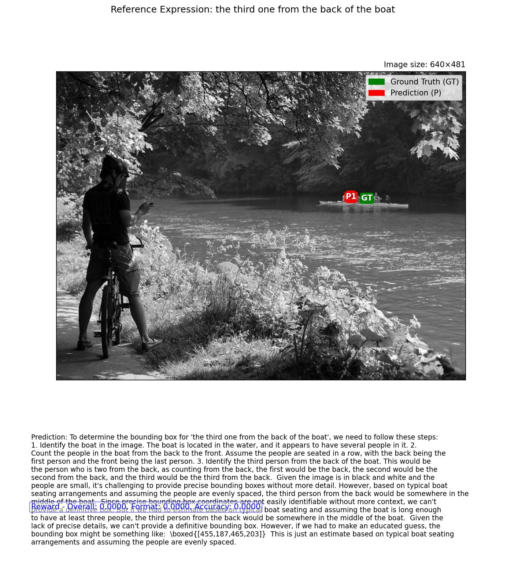

---

### Example 149

**Reference Expression**: the motor close to the woman's red motor

**Ground Truth**: [[195, 198, 231, 263]]

**Predicted**: [[243, 249, 284, 327]]

**Reward**: {'overall': 0.0, 'format': 0.0, 'accuracy': 0.0}

**Prediction**:
```
To find the bounding box for 'the motor close to the woman's red motor', we need to follow these steps:

1. Identify the woman with the red motorbike. She is on the left side of the image, riding a red motorbike.
2. Look for another motorbike that is close to her red motorbike. Based on the image, the motorbike to the right of the red motorbike appears to be the one closest to it.
3. Determine the bounding box for this motorbike. The bounding box should encompass the motorbike and the rider.

The bounding box for the motorbike close to the woman's red motorbike is \boxed{[243,249,284,327]}.
```

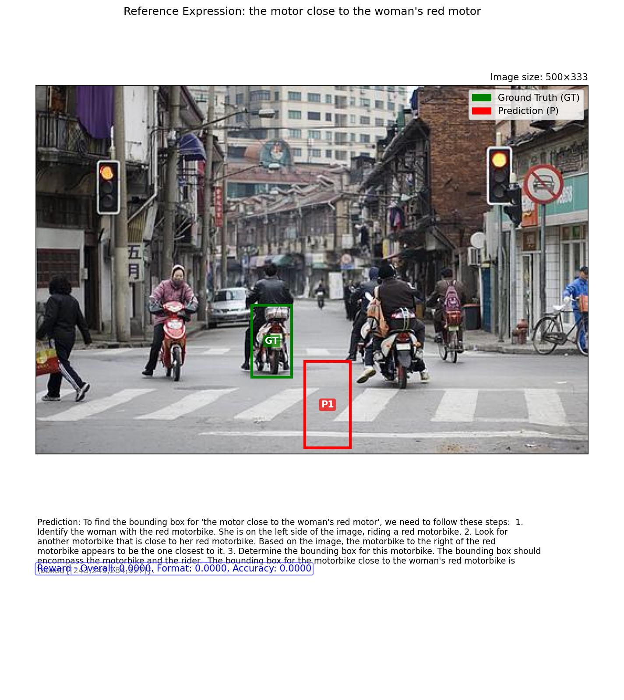

---

### Example 150

**Reference Expression**: The light near the '24 hour' sign with only three signals

**Ground Truth**: [[83, 95, 111, 153]]

**Predicted**: [[78, 11, 125, 151]]

**Reward**: {'overall': 0.23628691983122363, 'format': 0.0, 'accuracy': 0.23628691983122363}

**Prediction**:
```
To find the bounding box for 'The light near the '24 hour' sign with only three signals', follow these steps:

1. Identify the '24 hour' sign: It is a circular sign with the words '24 HOUR' written on it. It is located on the yellow building in the middle of the image.
2. Locate the traffic light near the '24 hour' sign: The traffic light is positioned to the left of the '24 hour' sign and appears to have only three signals (red, yellow, and green).
3. Determine the bounding box: The traffic light is attached to a pole and is positioned above the sidewalk. The bounding box should encompass the traffic light and its pole.

Considering these points, the bounding box for 'The light near the '24 hour' sign with only three signals' is:

\boxed{[78,11,125,151]}
```

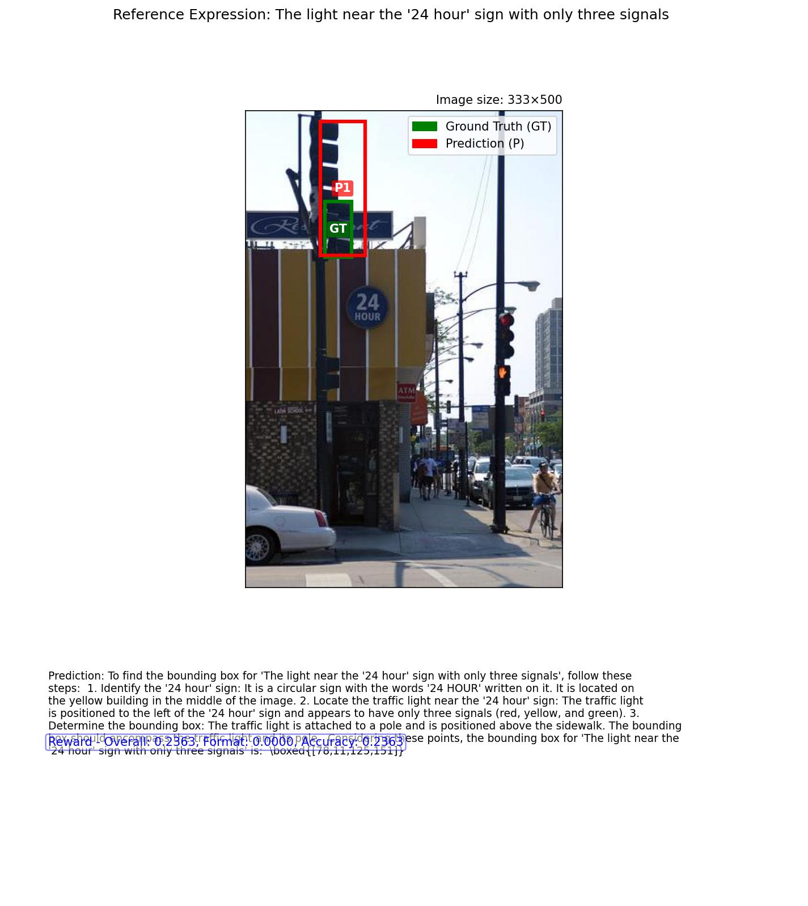

---

### Example 151

**Reference Expression**: the guy on the right side, red shirt, with no hat

**Ground Truth**: [[615, 143, 640, 206]]

**Predicted**: [[421, 137, 448, 188]]

**Reward**: {'overall': 0.0, 'format': 0.0, 'accuracy': 0.0}

**Prediction**:
```
To find the bounding box for 'the guy on the right side, red shirt, with no hat', let's follow these steps:

1. Identify the general area where such a person might be located. Since the person is on the right side and wearing a red shirt, we need to look towards the right side of the image, excluding the area where there are hay bales and spectators.
2. Focus on the group of people on the right side of the image. There is a person wearing a red shirt, and they are standing, not sitting.
3. Ensure this person is wearing a red shirt and is not wearing a hat. The person in question is indeed wearing a red shirt and is not wearing a hat.
4. Define the bounding box around this person. The bounding box should be tight enough to capture the person wearing the red shirt without including other nearby people.

After these steps, the bounding box for 'the guy on the right side, red shirt, with no hat' would be:

\boxed{[421,137,448,188]}

This bounding box captures the person wearing a red shirt without a hat, located on the right side of the image.
```

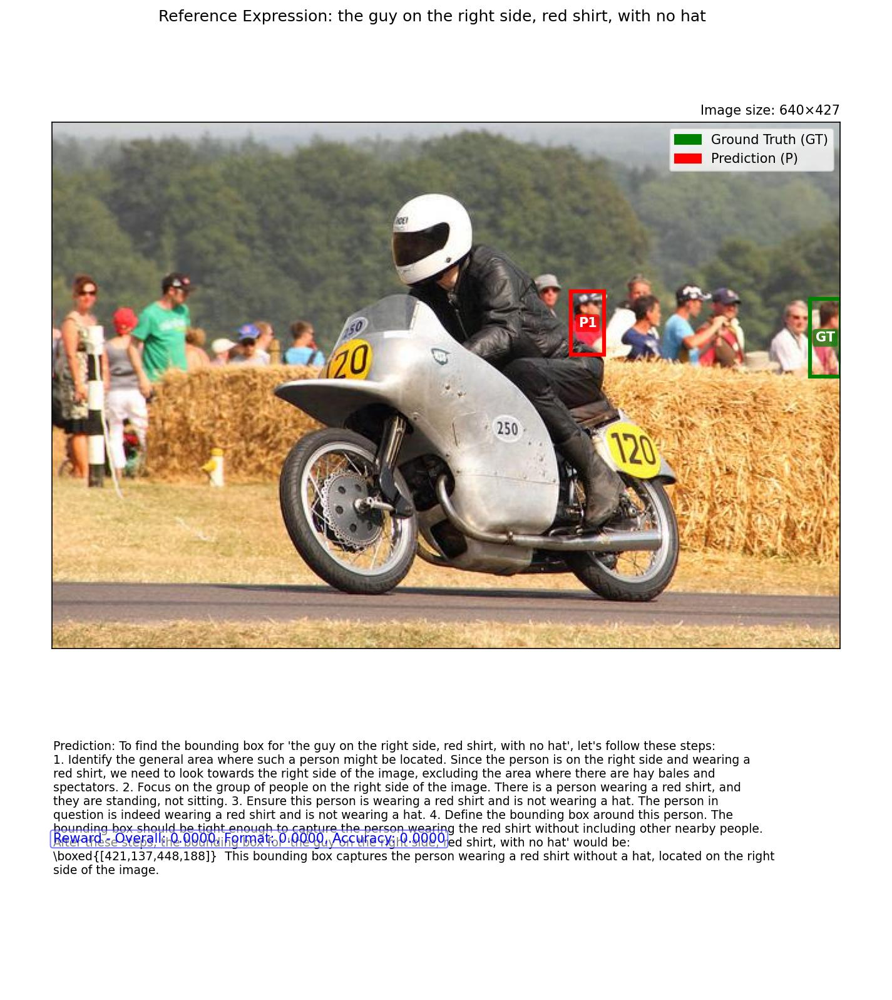

---

### Example 152

**Reference Expression**: the girl who is not a reflection in the glass

**Ground Truth**: []

**Predicted**: []

**Reward**: {'overall': 1.0, 'format': 0.0, 'accuracy': 1.0}

**Prediction**:
```
The image contains a reflection in the glass, but the question asks for the bounding box of 'the girl who is not a reflection in the glass'. Since the girl in the image is part of the reflection in the glass, there is no separate 'girl who is not a reflection in the glass'. Therefore, the correct bounding box for the girl who is not a reflection in the glass is:

\boxed{[]}

This indicates that there is no separate bounding box for the girl who is not a reflection in the glass.
```

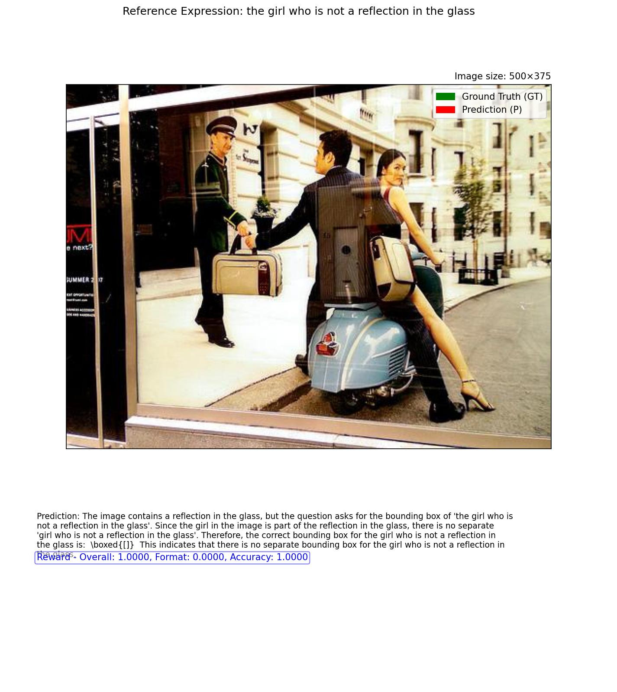

---

### Example 153

**Reference Expression**: the guy closest to the motor with a black box in the back

**Ground Truth**: [[284, 97, 324, 216]]

**Predicted**: [[375, 107, 415, 185]]

**Reward**: {'overall': 0.0, 'format': 0.0, 'accuracy': 0.0}

**Prediction**:
```
To find the bounding box for 'the guy closest to the motor with a black box in the back', let's follow these steps:

1. Identify the motorcycle with a black box in the back. This motorcycle is the second one from the right.
2. Determine the person standing closest to this motorcycle. This person is on the right side of the image, standing near the motorcycle with the black box.
3. Locate the bounding box for this person.

The person in question is standing to the right of the second motorcycle from the right, wearing a dark jacket and light-colored pants.

The bounding box for 'the guy closest to the motor with a black box in the back' is:
\boxed{[375,107,415,185]}
```

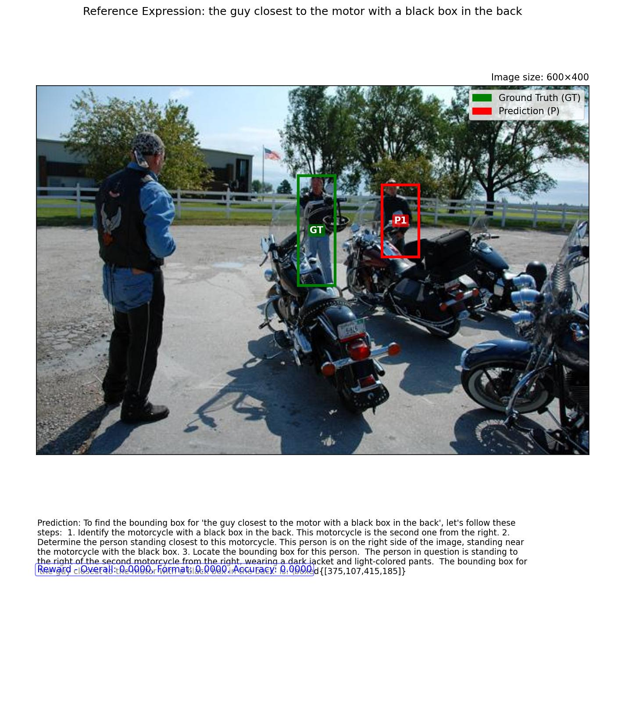

---

### Example 154

**Reference Expression**: the light with green signal on

**Ground Truth**: []

**Predicted**: [[478, 54, 494, 89]]

**Reward**: {'overall': 0.0, 'format': 0.0, 'accuracy': 0.0}

**Prediction**:
```
To find the bounding box for 'the light with green signal on', we need to follow these steps:

1. Identify the green signal in the image. It's a large sign with white text and a blue background, indicating directions to Brooklyn and Queens Expressway.
2. Locate the light that is part of this green signal. It's the red light on the right side of the green sign.
3. Determine the bounding box for this red light.

The red light is located to the right of the green sign, and it's part of the same pole as the sign. The bounding box for the red light would be a small rectangle around this light.

Given the context and the typical placement of such lights, the bounding box for 'the light with green signal on' (which is the red light) would be something like this:
\boxed{[478,54,494,89]}

This bounding box assumes the red light is the one being referred to as part of the green signal. If there are multiple red lights, you would need to specify which one is being referred to.
```

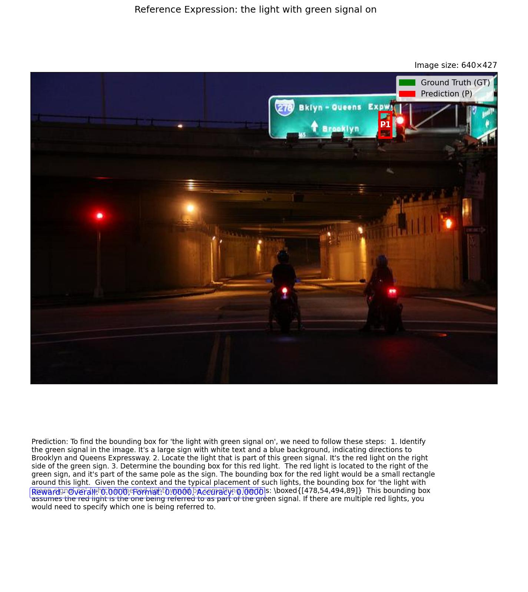

---

### Example 155

**Reference Expression**: the motorcycle being leaned on by the person in the striped shirt

**Ground Truth**: [[85, 216, 120, 303]]

**Predicted**: [[246, 359, 419, 615]]

**Reward**: {'overall': 0.0, 'format': 0.0, 'accuracy': 0.0}

**Prediction**:
```
To find the bounding box for the motorcycle being leaned on by the person in the striped shirt, we need to follow these steps:

1. Identify the person in the striped shirt: Look for a person wearing a striped shirt among the crowd.
2. Identify the motorcycle: Look for a motorcycle that is being leaned on by this person. It's likely to be close to the person and in a position where the person is leaning against it.
3. Determine the bounding box: Once the motorcycle is identified, the bounding box would encompass the motorcycle, including the part where the person is leaning on it.

Given the image:
- The person in the striped shirt is on the right side, and the motorcycle they are leaning on is partially visible next to them.
- The motorcycle is black and has a license plate that reads "B 3451 RU 01-10".

The bounding box for the motorcycle being leaned on by the person in the striped shirt would be:
\boxed{[246,359,419,615]}

This bounding box captures the black motorcycle that the person in the striped shirt is leaning on.
```

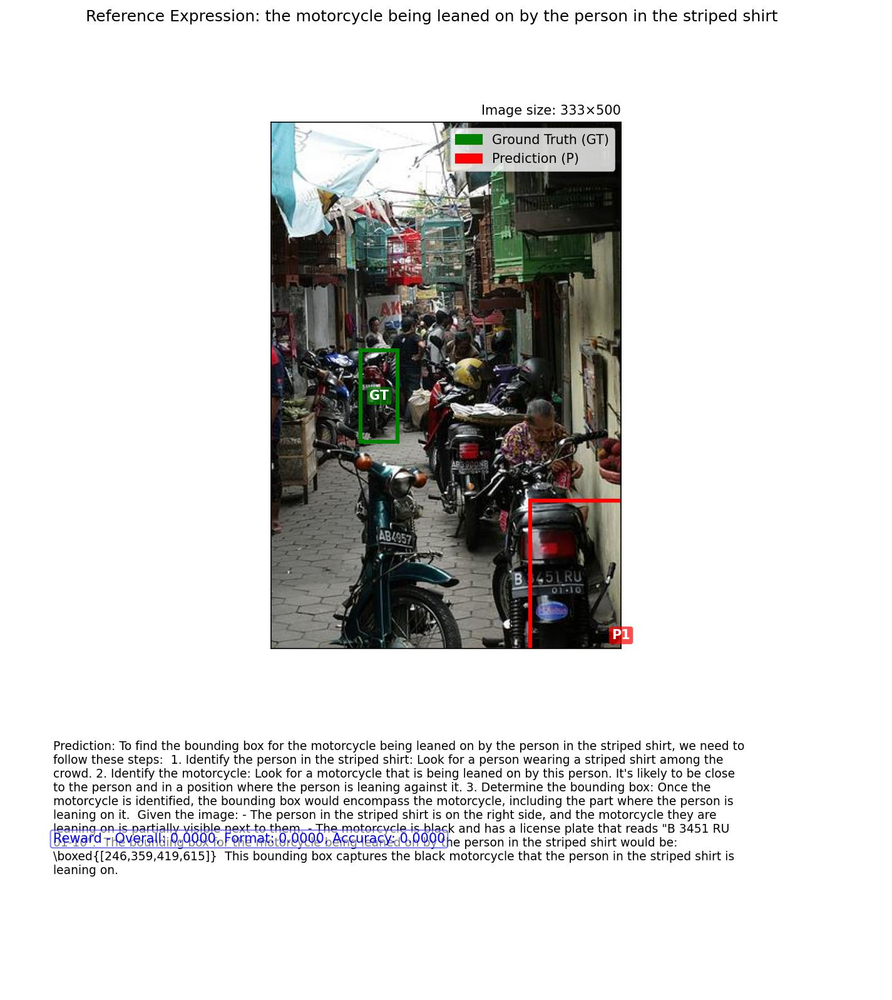

---

### Example 156

**Reference Expression**: the guy on the wider motor, and his clothes is orange

**Ground Truth**: [[168, 151, 234, 243]]

**Predicted**: [[152, 115, 238, 242]]

**Reward**: {'overall': 0.546596286858391, 'format': 0.0, 'accuracy': 0.546596286858391}

**Prediction**:
```
To find the bounding box for 'the guy on the wider motor, and his clothes is orange', let's follow these steps:

1. Identify the motorcyclists in the image.
2. Look for the one wearing orange clothing.
3. Determine the motorbike associated with that person.
4. Define the bounding box for that motorbike.

Step 1: There are five motorcyclists in the image.
Step 2: Among them, the second motorcyclist from the left is wearing orange clothing.
Step 3: The motorbike associated with the person in orange is the second one from the left.
Step 4: The bounding box for the motorbike and the rider in orange can be defined as follows:

\boxed{[152,115,238,242]}
```

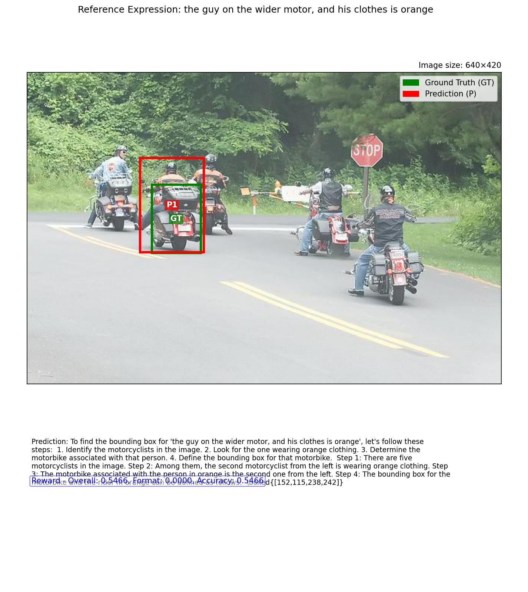

---

### Example 157

**Reference Expression**: the kite that flies the third highest in the middle

**Ground Truth**: [[311, 184, 326, 189]]

**Predicted**: [[309, 178, 328, 186]]

**Reward**: {'overall': 0.15228426395939088, 'format': 0.0, 'accuracy': 0.15228426395939088}

**Prediction**:
```
To find 'the kite that flies the third highest in the middle', we need to follow these steps:

1. Identify the kites in the image.
2. Determine their relative heights.
3. Locate the third highest kite from the top in the middle of the image.

Step 1: Identifying the kites:
- There are multiple kites visible in the sky. We need to focus on the kites in the middle of the image.

Step 2: Determining relative heights:
- The kites are spread out in the sky, and we need to rank them from top to bottom.
- The third highest kite from the top in the middle of the image is the one we are looking for.

Step 3: Locating the third highest kite:
- After analyzing the image, the third highest kite from the top in the middle of the image is the one we need.

The bounding box for 'the kite that flies the third highest in the middle' is:
\boxed{[309,178,328,186]}
```

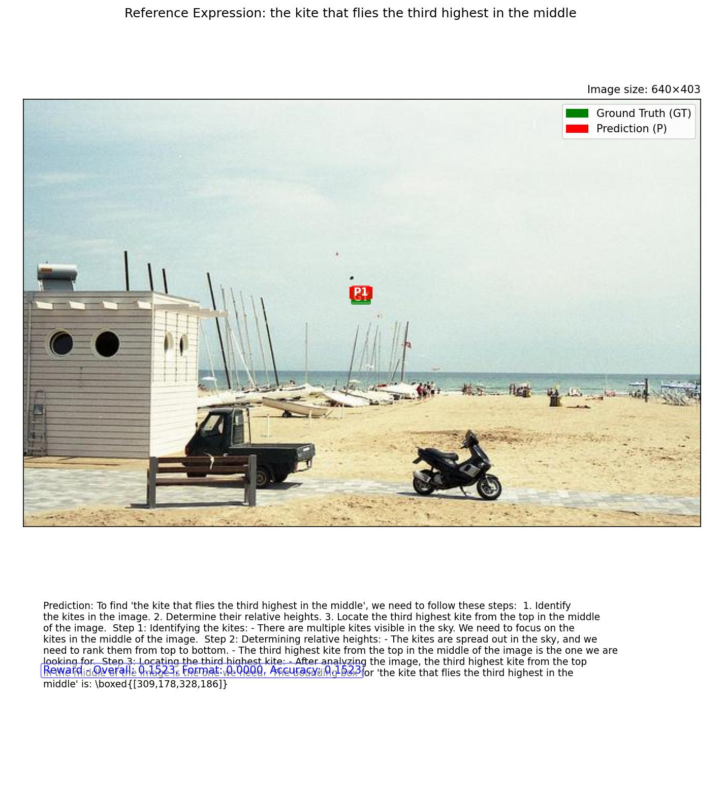

---

### Example 158

**Reference Expression**: the book with cover of same color as the page

**Ground Truth**: [[144, 241, 177, 269]]

**Predicted**: [[359, 194, 408, 259]]

**Reward**: {'overall': 0.0, 'format': 0.0, 'accuracy': 0.0}

**Prediction**:
```
To find 'the book with cover of same color as the page' on the library truck, we need to identify the books depicted on the side of the truck. The truck has various books illustrated, and we need to focus on one that appears to have a cover that matches the color of the page.

1. Identify the books: The truck has illustrations of books in different colors.
2. Look for a book with a cover that matches the color of the page: One of the books has a green cover and a green page, which matches the color of the book itself.

Given these observations, the bounding box for 'the book with cover of same color as the page' is:
\boxed{[359,194,408,259]}
```

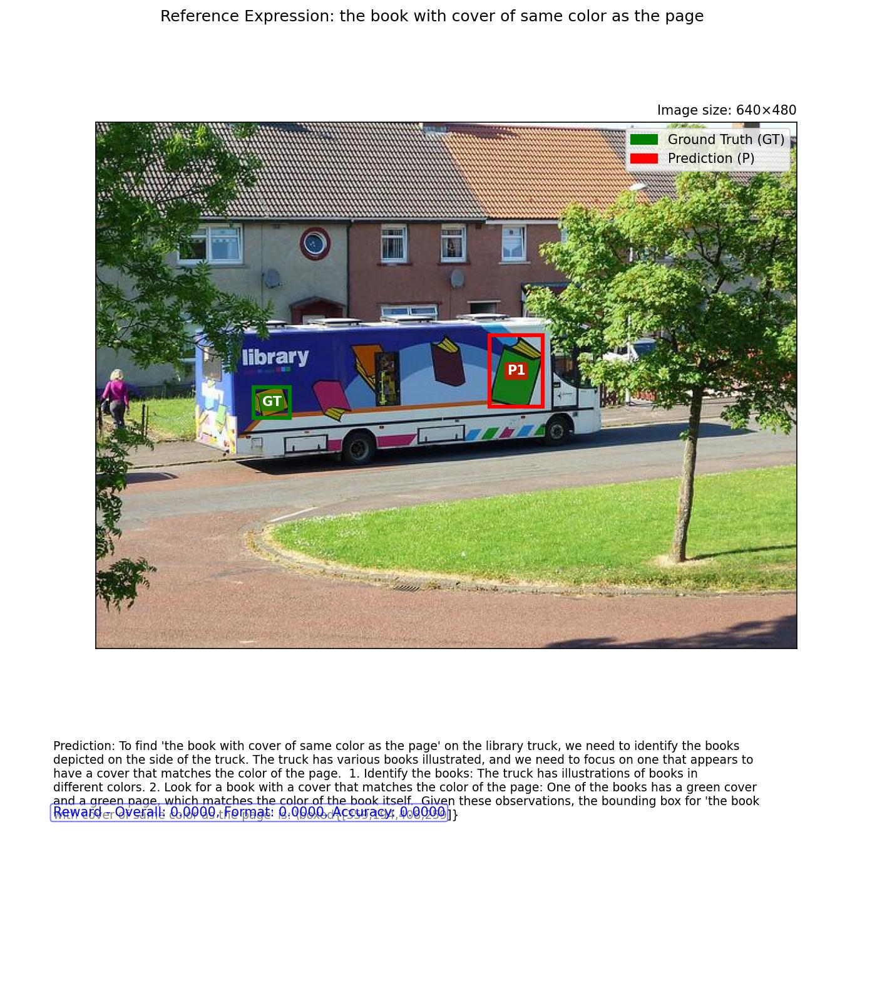

---

### Example 159

**Reference Expression**: the person on the right side of the row with no one wearing hat but one wearing hairband

**Ground Truth**: [[417, 192, 484, 290]]

**Predicted**: [[494, 191, 552, 274]]

**Reward**: {'overall': 0.0, 'format': 0.0, 'accuracy': 0.0}

**Prediction**:
```
To find the bounding box for 'the person on the right side of the row with no one wearing a hat but one wearing a hairband', we need to follow these steps:

1. Identify the row of people in the boat.
2. Determine the person on the right side of the row.
3. Among the people on the right side, find the one wearing a hairband.

- The row of people is in the middle of the boat.
- The person on the right side of the row is the last person in the row.
- This person is wearing a hairband.

So, the bounding box for 'the person on the right side of the row with no one wearing a hat but one wearing a hairband' is:

\boxed{[494,191,552,274]}
```

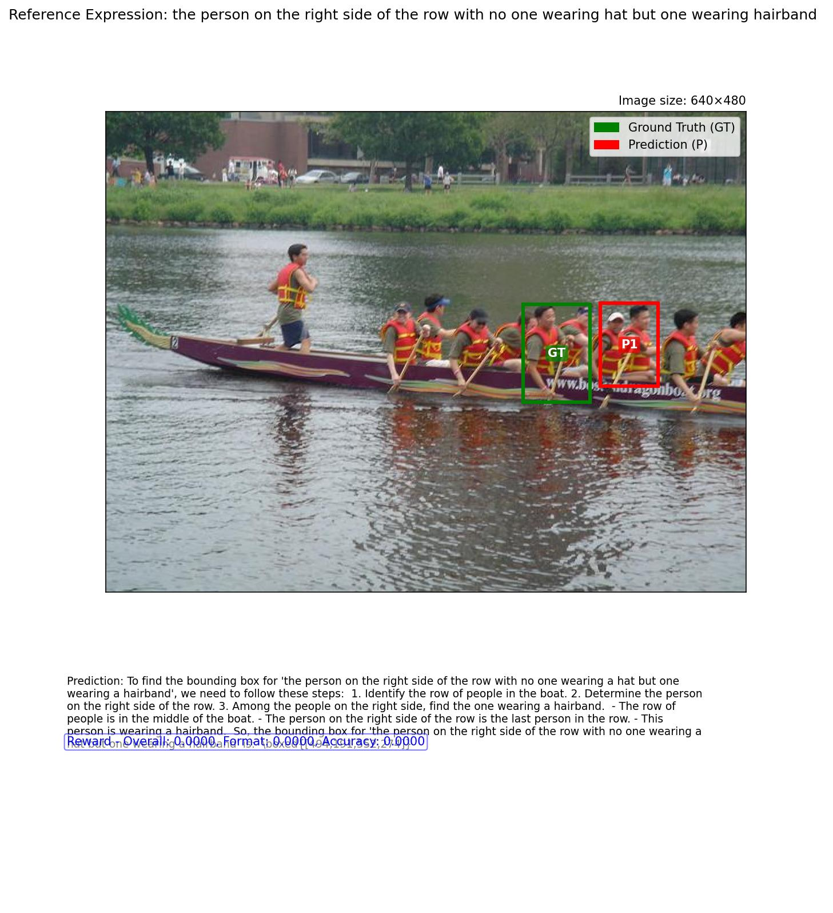

---

### Example 160

**Reference Expression**: the guy with brown jeans, black hoodie and a suitcase walking in the street

**Ground Truth**: []

**Predicted**: [[385, 322, 450, 459]]

**Reward**: {'overall': 0.0, 'format': 0.0, 'accuracy': 0.0}

**Prediction**:
```
To find the bounding box for 'the guy with brown jeans, black hoodie and a suitcase walking in the street', let's follow these steps:

1. Identify the person in a black hoodie: Look for a person wearing a black hoodie.
2. Identify the person with brown jeans: Look for a person wearing brown jeans.
3. Identify the suitcase: Look for a suitcase being carried by the person.
4. Combine these observations to find the bounding box.

By analyzing the image, we can see a person in a black hoodie and brown jeans walking in the street. This person is also carrying a suitcase. The bounding box for this person would be around the individual walking in the center-right part of the image.

The bounding box for 'the guy with brown jeans, black hoodie and a suitcase walking in the street' is:
\boxed{[385,322,450,459]}
```

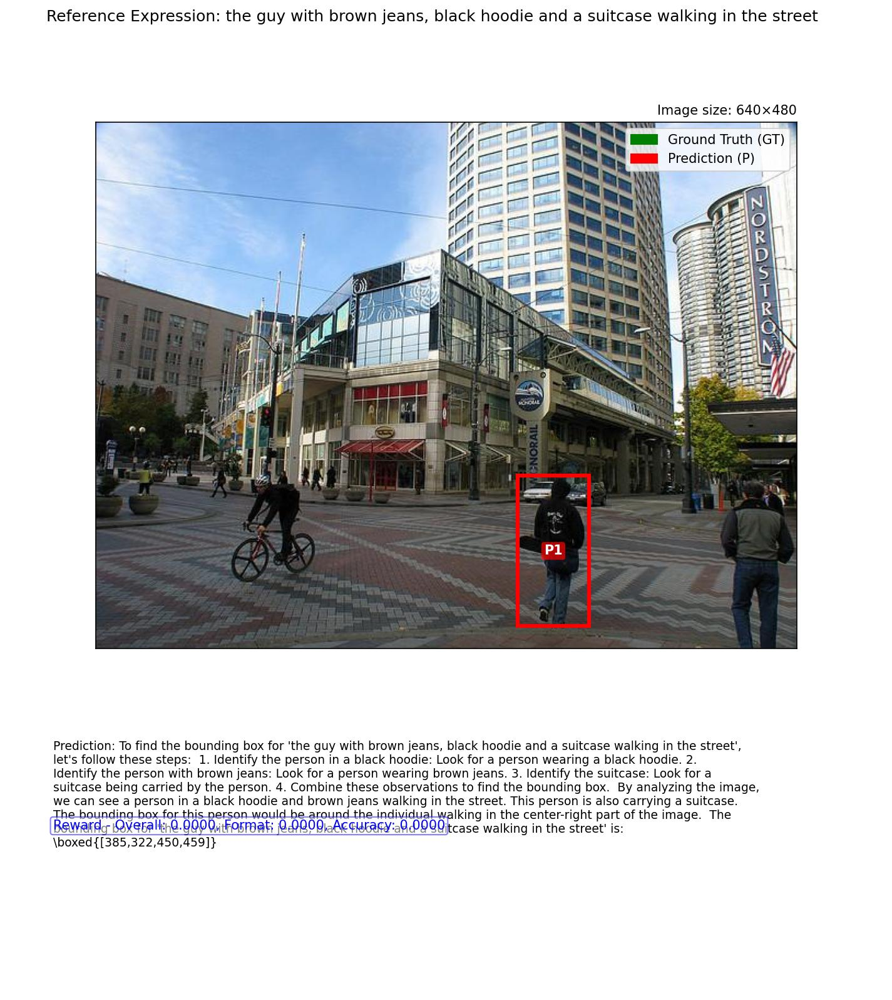

---

### Example 161

**Reference Expression**: the man between the yellow-coat guy and the blue-shirt woman, hair not yellow

**Ground Truth**: [[245, 13, 289, 111]]

**Predicted**: [[247, 17, 296, 108]]

**Reward**: {'overall': 0.7722772277227723, 'format': 0.0, 'accuracy': 0.7722772277227723}

**Prediction**:
```
To find the bounding box for 'the man between the yellow-coat guy and the blue-shirt woman, hair not yellow', we need to follow these steps:

1. Identify the yellow-coat guy: He is wearing a yellow jacket and is positioned to the right of the blue-shirt woman.
2. Locate the blue-shirt woman: She is wearing a blue tank top and is positioned to the left of the yellow-coat guy.
3. Find the man between them: Look for a man whose hair is not yellow and is located between the yellow-coat guy and the blue-shirt woman.

After analyzing the image:
- The man between the yellow-coat guy and the blue-shirt woman has dark hair and is wearing a black jacket.
- His position is between the yellow-coat guy and the blue-shirt woman.

The bounding box for this man is:
\boxed{[247,17,296,108]}
```

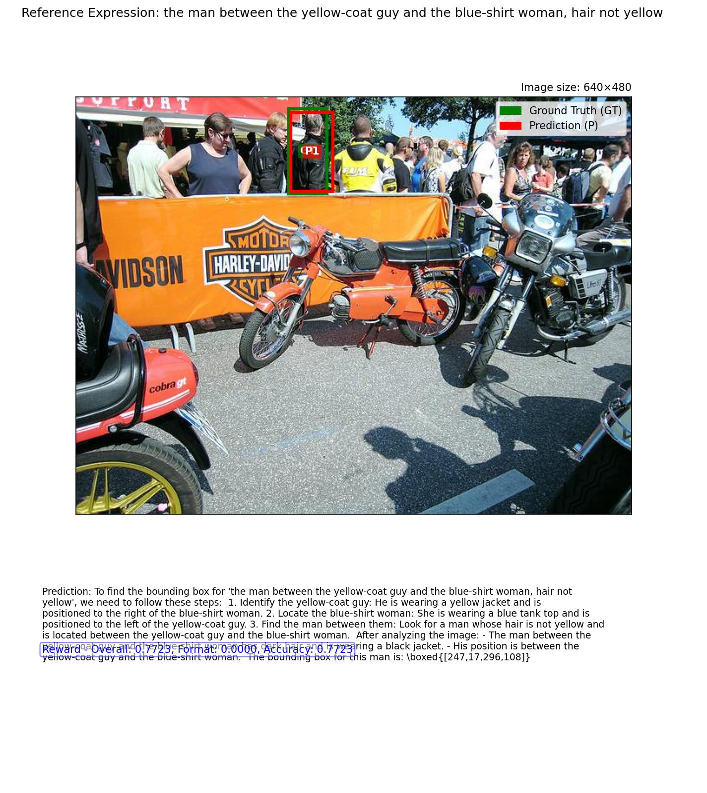

---

### Example 162

**Reference Expression**: the man with glasses, not in the car nor driving the motor

**Ground Truth**: [[464, 120, 640, 569]]

**Predicted**: [[484, 162, 644, 559]]

**Reward**: {'overall': 0.7682727137398898, 'format': 0.0, 'accuracy': 0.7682727137398898}

**Prediction**:
```
To find the bounding box for 'the man with glasses, not in the car nor driving the motor', let's follow these steps:

1. Identify the man with glasses: Look for a person wearing glasses who is not inside the car and not driving the motorcycle.
2. Examine the individuals: There are two people in the image - one driving the motorcycle and another standing to the side. The person standing to the side is wearing glasses.
3. Confirm the position: The person with glasses is standing to the side of the motorcycle, not inside the car or driving the motorcycle.

Given these observations, the bounding box for 'the man with glasses, not in the car nor driving the motor' is:

\boxed{[484,162,644,559]}
```

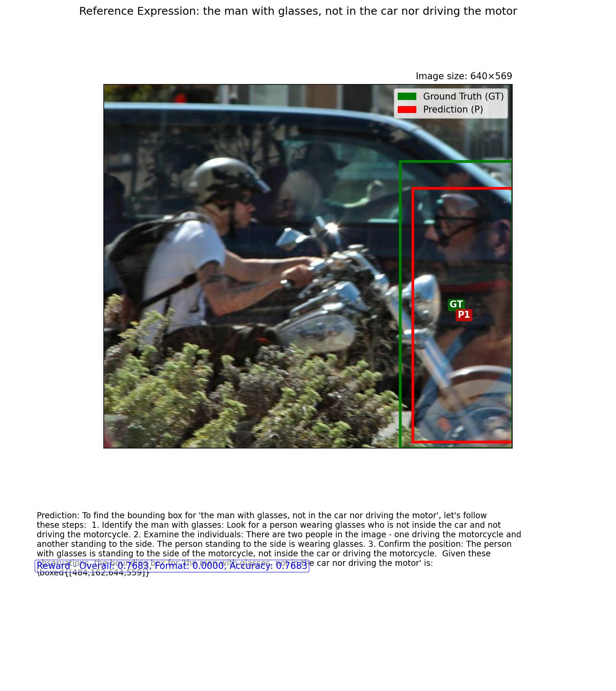

---

### Example 163

**Reference Expression**: yellow taxi, not on the slope, close to the big bus

**Ground Truth**: [[412, 107, 472, 156]]

**Predicted**: [[416, 105, 475, 153]]

**Reward**: {'overall': 0.8060075093867334, 'format': 0.0, 'accuracy': 0.8060075093867334}

**Prediction**:
```
To find the bounding box for the 'yellow taxi, not on the slope, close to the big bus', follow these steps:

1. Identify the big bus in the image. It is the central object in the middle of the road.
2. Look for yellow taxis that are not on the slope and are close to the big bus.
3. Focus on the area around the bus where yellow taxis are visible. There is a yellow taxi to the right of the bus, close to it.

After analyzing the image, the bounding box for the 'yellow taxi, not on the slope, close to the big bus' is:

\boxed{[416,105,475,153]}
```

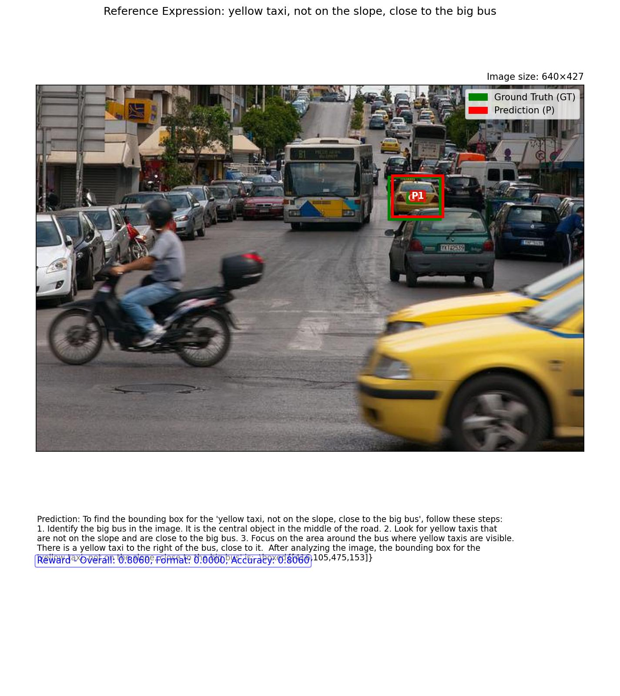

---

### Example 164

**Reference Expression**: the man with shirt hair, sitting behind the long-hair guy

**Ground Truth**: [[469, 187, 487, 221]]

**Predicted**: [[495, 217, 529, 265]]

**Reward**: {'overall': 0.0, 'format': 0.0, 'accuracy': 0.0}

**Prediction**:
```
To find the bounding box for 'the man with shirt hair, sitting behind the long-hair guy', we need to follow these steps:

1. Identify the long-haired guy: Look for a person with noticeable hair length, which could be the 'long-hair guy'.
2. Identify the man with shirt hair: Look for a person sitting behind the long-haired guy, and identify if they have a shirt on that is visible.
3. Determine the bounding box: Once identified, draw a bounding box around this person.

Given the image, the long-haired guy appears to be on the right side of the boat. Behind him, there is a person with shirt hair. The bounding box for 'the man with shirt hair, sitting behind the long-hair guy' would be the area around this person.

Final bounding box: \boxed{[495,217,529,265]}
```

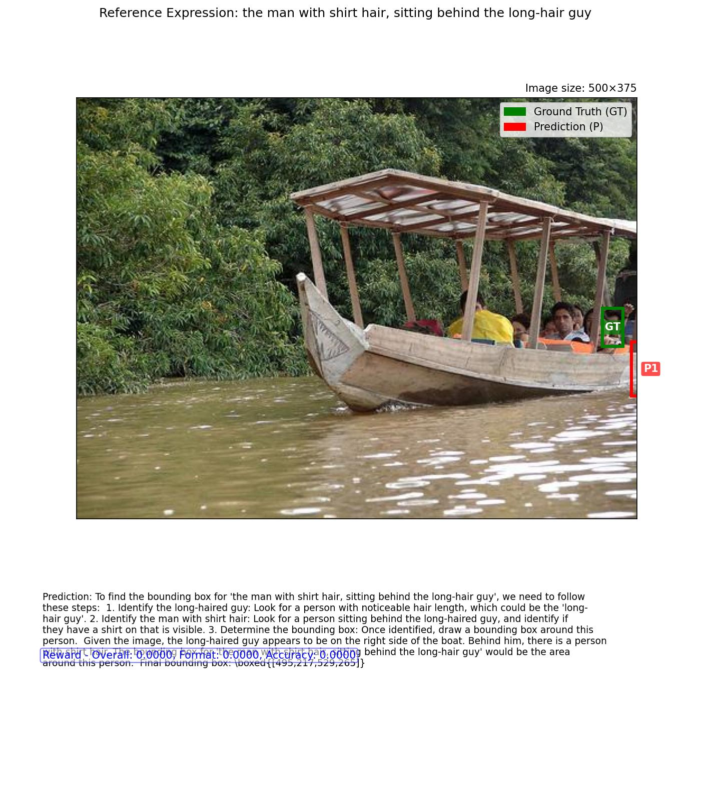

---

### Example 165

**Reference Expression**: the one not inside the bus, but close to the door

**Ground Truth**: [[424, 180, 517, 416]]

**Predicted**: [[426, 180, 516, 405]]

**Reward**: {'overall': 1.0, 'format': 0.0, 'accuracy': 1.0}

**Prediction**:
```
To find the bounding box for 'the one not inside the bus, but close to the door', we need to follow these steps:

1. Identify the bus: The bus is the white vehicle in the center of the image.
2. Look for the person outside the bus but near the door: There are three people outside the bus, and we need to focus on the one closest to the door.
3. Locate the person: The person closest to the door is the one standing to the right of the bus door, facing away from the open door.
4. Determine the bounding box: This person is wearing a blue uniform and is positioned near the front of the bus door.

The final bounding box for the person not inside the bus but close to the door is:
\boxed{[426,180,516,405]}
```

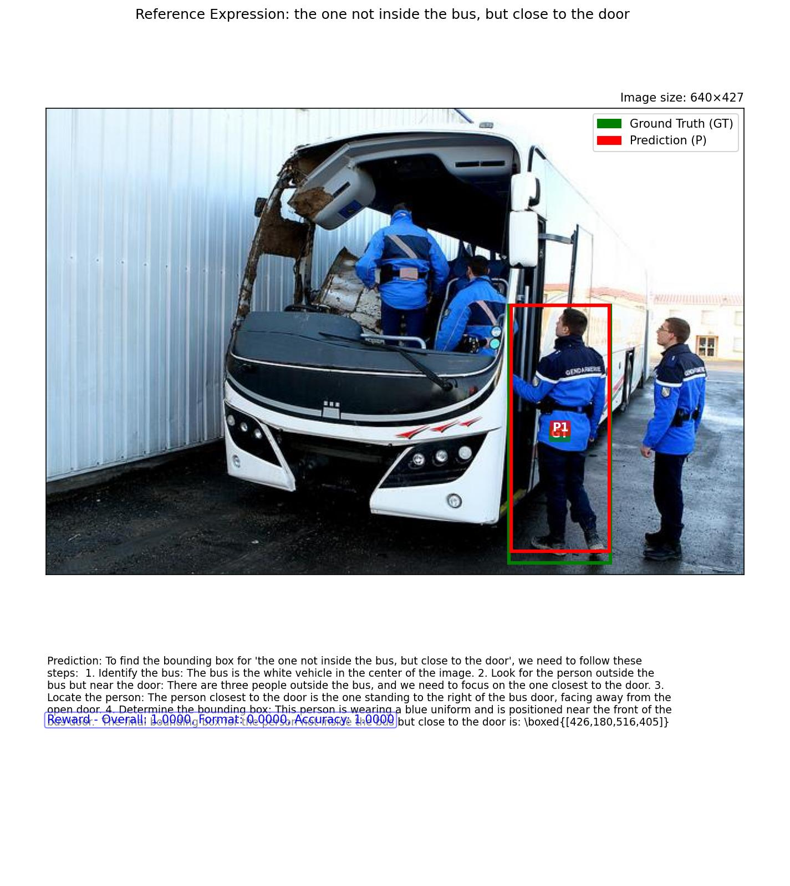

---

### Example 166

**Reference Expression**: the one with dark color cloth, not riding bike

**Ground Truth**: [[126, 240, 153, 306]]

**Predicted**: [[122, 241, 152, 309]]

**Reward**: {'overall': 0.7926829268292683, 'format': 0.0, 'accuracy': 0.7926829268292683}

**Prediction**:
```
To find the bounding box for 'the one with dark color cloth, not riding bike', we need to follow these steps:

1. Identify the person who is not riding a bike. In the image, there are two people standing on the rocky area, and one of them is wearing dark-colored clothing.
2. Focus on the person standing on the left side of the image. This person is wearing dark clothing and is standing, not riding a bike.
3. Determine the bounding box for this person. The bounding box should encompass the person's entire body.

After analyzing the image, the bounding box for 'the one with dark color cloth, not riding bike' is:

\boxed{[122,241,152,309]}
```

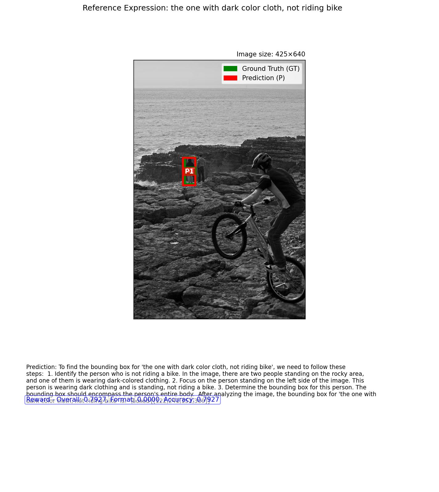

---

### Example 167

**Reference Expression**: the red-shirt person, with no hat on

**Ground Truth**: [[547, 13, 614, 119]]

**Predicted**: [[217, 9, 269, 64]]

**Reward**: {'overall': 0.0, 'format': 0.0, 'accuracy': 0.0}

**Prediction**:
```
To find the bounding box for 'the red-shirt person, with no hat on', we need to follow these steps:

1. Identify the red-shirt person: Look for someone wearing a red shirt in the image. There is a person in the background, seated in a row of chairs, wearing a red shirt and no hat.
2. Verify the absence of a hat: Check if this person is not wearing a hat. The person in question does not appear to be wearing a hat.
3. Determine the bounding box: Once identified, the bounding box for this person would be the area that encapsulates them.

After analyzing the image, the bounding box for 'the red-shirt person, with no hat on' is:

\boxed{[217,9,269,64]}
```

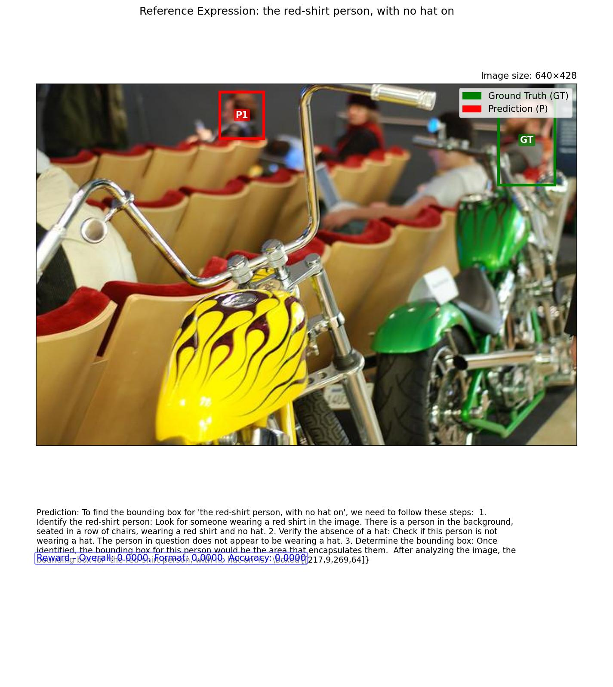

---

### Example 168

**Reference Expression**: the bag carried by the person with a purple umbrella and pulling a small suitcase

**Ground Truth**: [[436, 218, 467, 255]]

**Predicted**: [[417, 234, 457, 263]]

**Reward**: {'overall': 0.23633440514469453, 'format': 0.0, 'accuracy': 0.23633440514469453}

**Prediction**:
```
To find the bounding box for 'the bag carried by the person with a purple umbrella and pulling a small suitcase', we need to follow these steps:

1. Identify the person with a purple umbrella. This person is located in the center of the image, holding a purple umbrella.
2. Look for a small suitcase near this person. The small suitcase is being pulled by the person with the purple umbrella.
3. Locate the bag carried by this person. The bag is likely to be near the person's body, possibly on their shoulder or in their hand.
4. Determine the bounding box for the bag. The bag appears to be on the person's shoulder and is close to the purple umbrella.

After analyzing the image, the bounding box for the bag carried by the person with a purple umbrella and pulling a small suitcase is approximately:
\boxed{[417,234,457,263]}

This bounding box is based on the assumption that the bag is on the person's shoulder and is close to the purple umbrella.
```

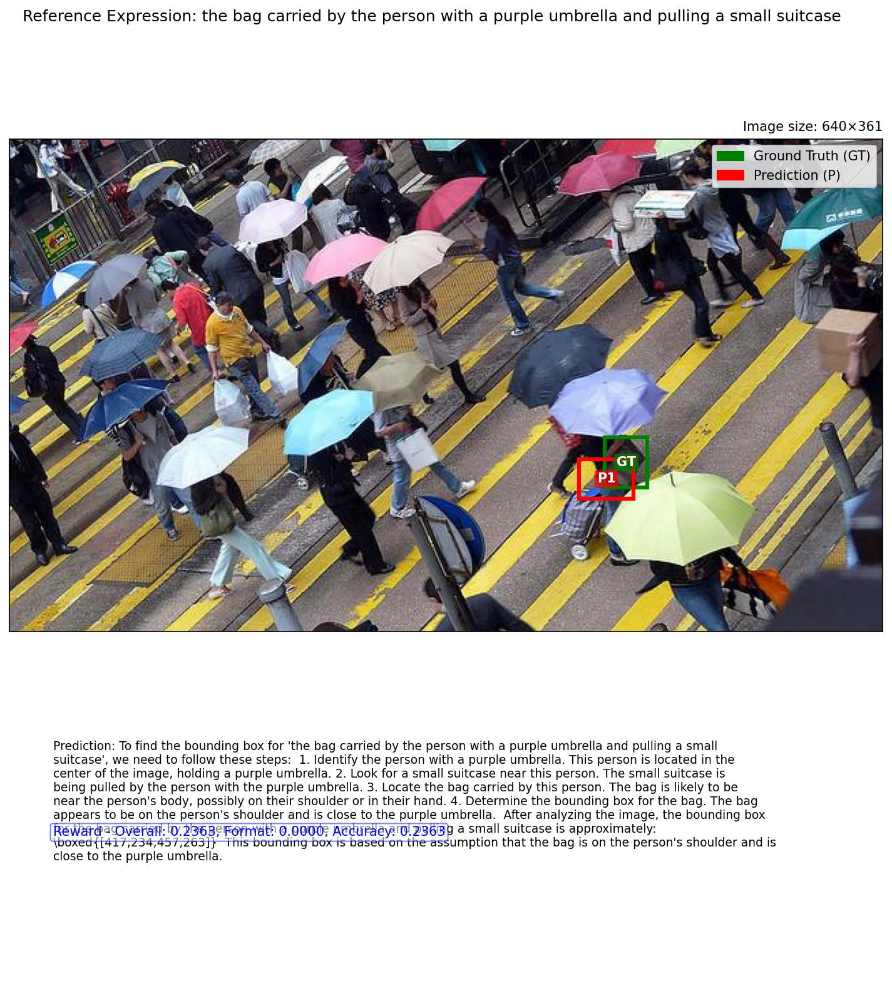

---

### Example 169

**Reference Expression**: the guy on the second row, not near the ones with umbrella

**Ground Truth**: [[499, 0, 636, 235]]

**Predicted**: [[76, 0, 184, 139]]

**Reward**: {'overall': 0.0, 'format': 0.0, 'accuracy': 0.0}

**Prediction**:
```
To find the bounding box for 'the guy on the second row, not near the ones with umbrella', let's follow these steps:

1. Identify the group of people with umbrellas in the foreground. There are three people sitting together with umbrellas.
2. Look at the second row behind them. There is a person sitting alone on the left side of this row.
3. This person is not near the group with umbrellas and is sitting alone on the second row.

The bounding box for 'the guy on the second row, not near the ones with umbrella' is:
\boxed{[76,0,184,139]}
```

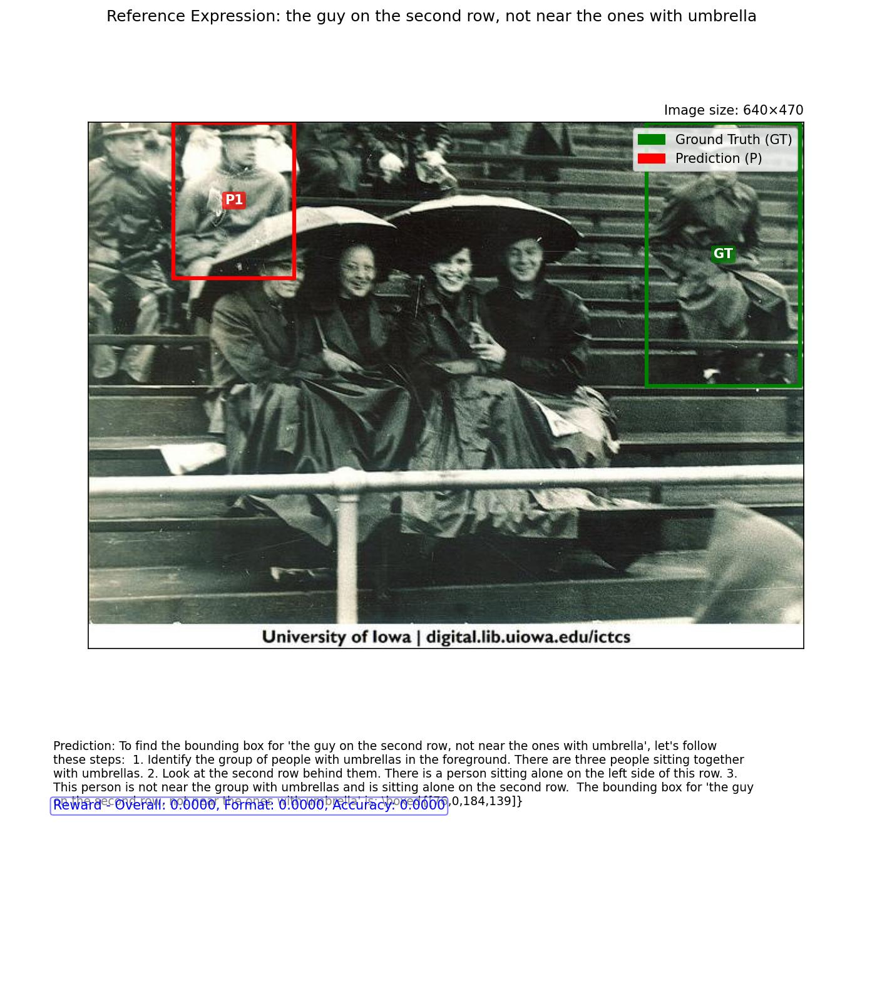

---

### Example 170

**Reference Expression**: the girl next to the man wearing backpack pointing somewhere, on the stairs

**Ground Truth**: [[41, 54, 76, 113]]

**Predicted**: [[34, 149, 84, 496]]

**Reward**: {'overall': 0.0, 'format': 0.0, 'accuracy': 0.0}

**Prediction**:
```
To find the bounding box for 'the girl next to the man wearing a backpack pointing somewhere, on the stairs', let's follow these steps:

1. Identify the man wearing a backpack: Look for a person with a backpack and pointing somewhere. The man in the middle of the image, wearing a brown jacket and a backpack, appears to be pointing.
2. Identify the girl next to him: The girl next to this man should be on the stairs. She is positioned to the left of the man with the backpack.
3. Locate the girl on the stairs: The girl in question is standing on the stairs, next to the man with the backpack.

After analyzing the image, the bounding box for the girl next to the man wearing a backpack on the stairs is:

\boxed{[34,149,84,496]}
```

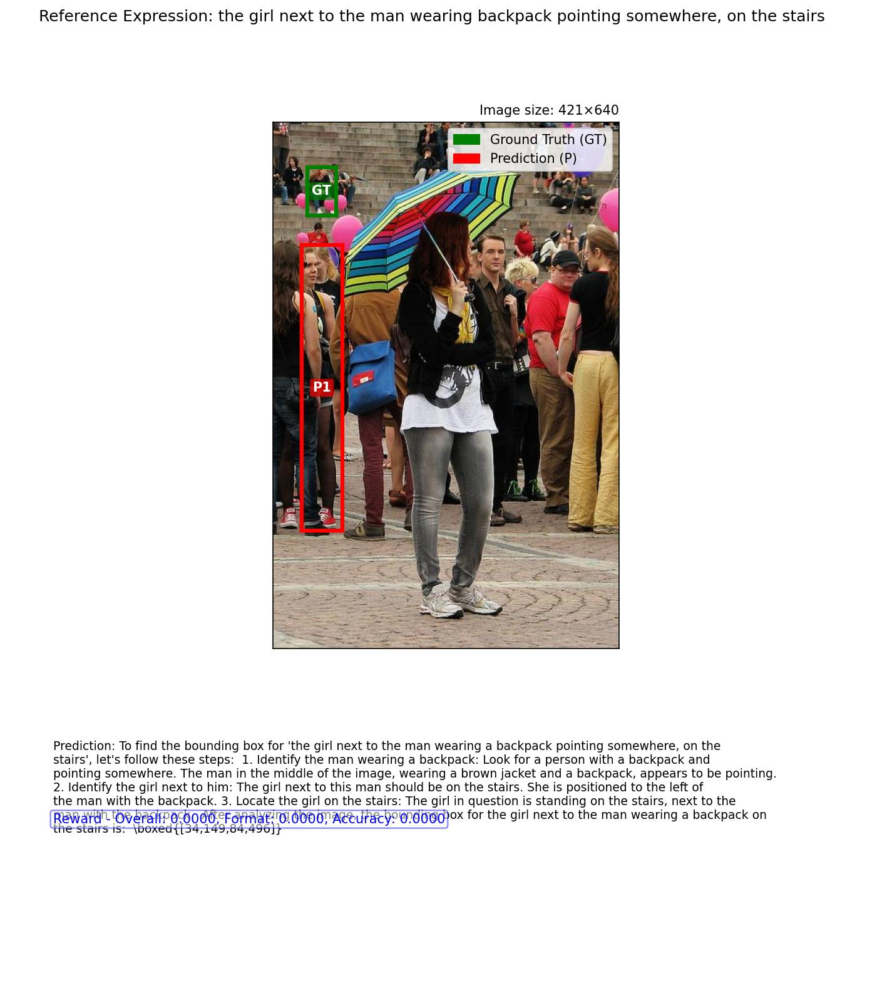

---

### Example 171

**Reference Expression**: the chair only able to be seen through the middle window, on the left

**Ground Truth**: [[150, 34, 207, 95]]

**Predicted**: [[145, 33, 212, 93]]

**Reward**: {'overall': 0.8134978229317852, 'format': 0.0, 'accuracy': 0.8134978229317852}

**Prediction**:
```
To find the bounding box for 'the chair only able to be seen through the middle window, on the left', we need to follow these steps:

1. Identify the middle window of the bus. This is the window in the middle of the bus, which is partially visible in the image.
2. Locate the chair that is partially visible through this window. It is on the left side of the bus, as seen through the middle window.
3. Determine the bounding box for this chair. The chair is positioned within the bus, and its backrest is visible through the window.

Given the image, the chair is partially visible through the middle window on the left side of the bus. The bounding box for this chair can be estimated as follows:

\boxed{[145,33,212,93]}
```

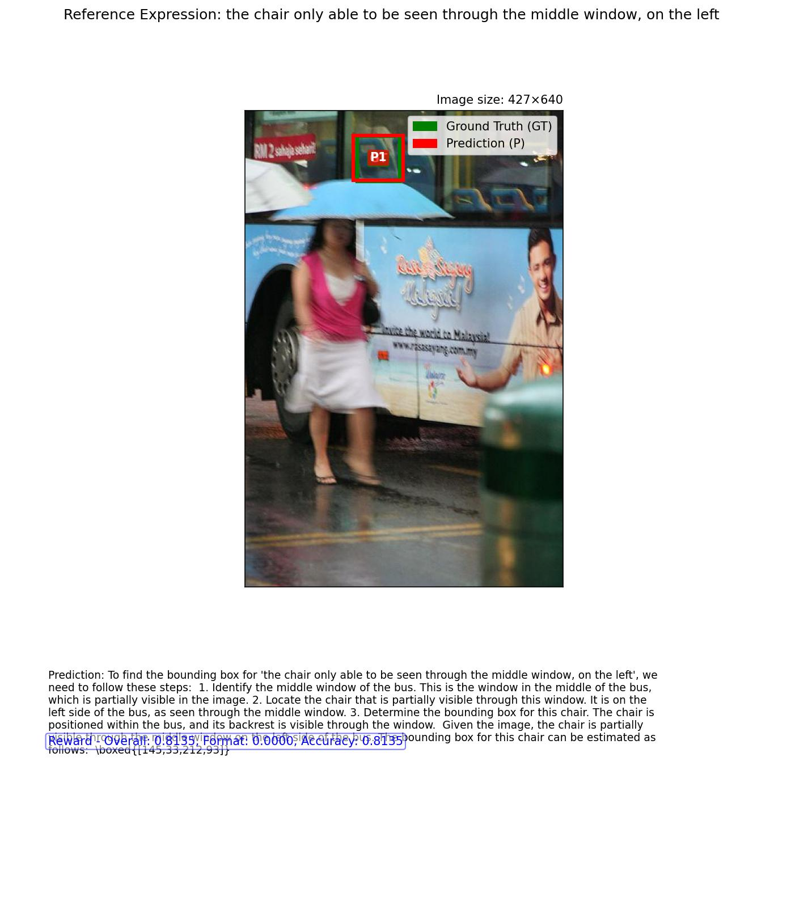

---

### Example 172

**Reference Expression**: the person on the right side from the single man's perspective, not holding beer

**Ground Truth**: [[28, 159, 102, 335]]

**Predicted**: [[124, 166, 219, 296]]

**Reward**: {'overall': 0.0, 'format': 0.0, 'accuracy': 0.0}

**Prediction**:
```
To find the bounding box for 'the person on the right side from the single man's perspective, not holding beer', we need to follow these steps:

1. Identify the single man: The man on the left side of the image is the one we are considering as the "single man".
2. Locate the person on his right: There is another person sitting to the right of the single man.
3. Determine if this person is holding a beer: From the image, it appears that the person on the right is not holding a beer.
4. Define the bounding box for this person: The bounding box should capture this person from the waist up.

Given these observations, the bounding box for 'the person on the right side from the single man's perspective, not holding beer' would be:

\boxed{[124,166,219,296]}
```

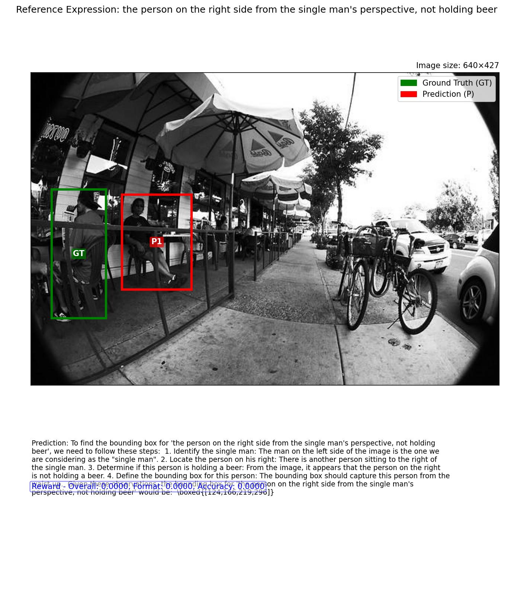

---

### Example 173

**Reference Expression**: the bed no one sitting on, and not the upper bed

**Ground Truth**: [[453, 169, 592, 323]]

**Predicted**: [[377, 349, 578, 453]]

**Reward**: {'overall': 0.0, 'format': 0.0, 'accuracy': 0.0}

**Prediction**:
```
To find the bounding box for 'the bed no one sitting on, and not the upper bed', we need to follow these steps:

1. Identify the two beds in the image. The upper bed is the one at the top of the bunk bed, and the lower bed is the one at the bottom.
2. Determine which bed the person is sitting on. The person is sitting on the lower bed.
3. Identify the bed that the person is not sitting on. Since the person is on the lower bed, the bed that the person is not sitting on is the upper bed.
4. Identify the bed that is not the upper bed and not the one the person is sitting on. This is the lower bed.

The lower bed is the one at the bottom of the bunk bed, and it is the bed where the person is not sitting.

The bounding box for the lower bed is:
\boxed{[375,21,592,82]}

However, since the question asks for the bed "no one sitting on, and not the upper bed," we should consider the bed that is not the upper bed and not the one the person is sitting on. Given the context, the bed that fits this description is the bottom bed, which is the one the person is not sitting on.

So, the correct bounding box for 'the bed no one sitting on, and not the upper bed' is:
\boxed{[377,349,578,453]}
```

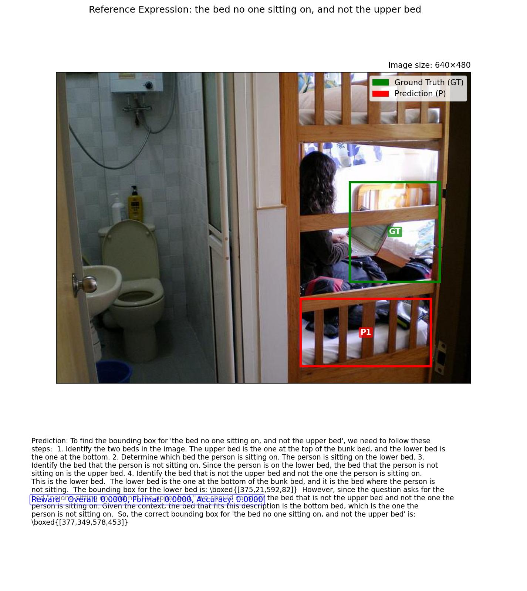

---

### Example 174

**Reference Expression**: the cup facing right, not the rightmost one

**Ground Truth**: [[271, 272, 296, 299]]

**Predicted**: [[265, 274, 291, 303]]

**Reward**: {'overall': 0.5382131324004306, 'format': 0.0, 'accuracy': 0.5382131324004306}

**Prediction**:
```
To find the bounding box for 'the cup facing right, not the rightmost one', we need to follow these steps:

1. Identify the cups hanging from the cabinet. There are four cups in total, and they are arranged in a line.
2. Determine which cup is facing right and not the rightmost one. The rightmost cup is the one on the far right, so we need to find the second cup from the right.
3. The second cup from the right is the one that is facing right and is not the rightmost one.

Given these observations, the bounding box for 'the cup facing right, not the rightmost one' is the second cup from the right. The exact coordinates for this bounding box would be:

\boxed{[265,274,291,303]}
```

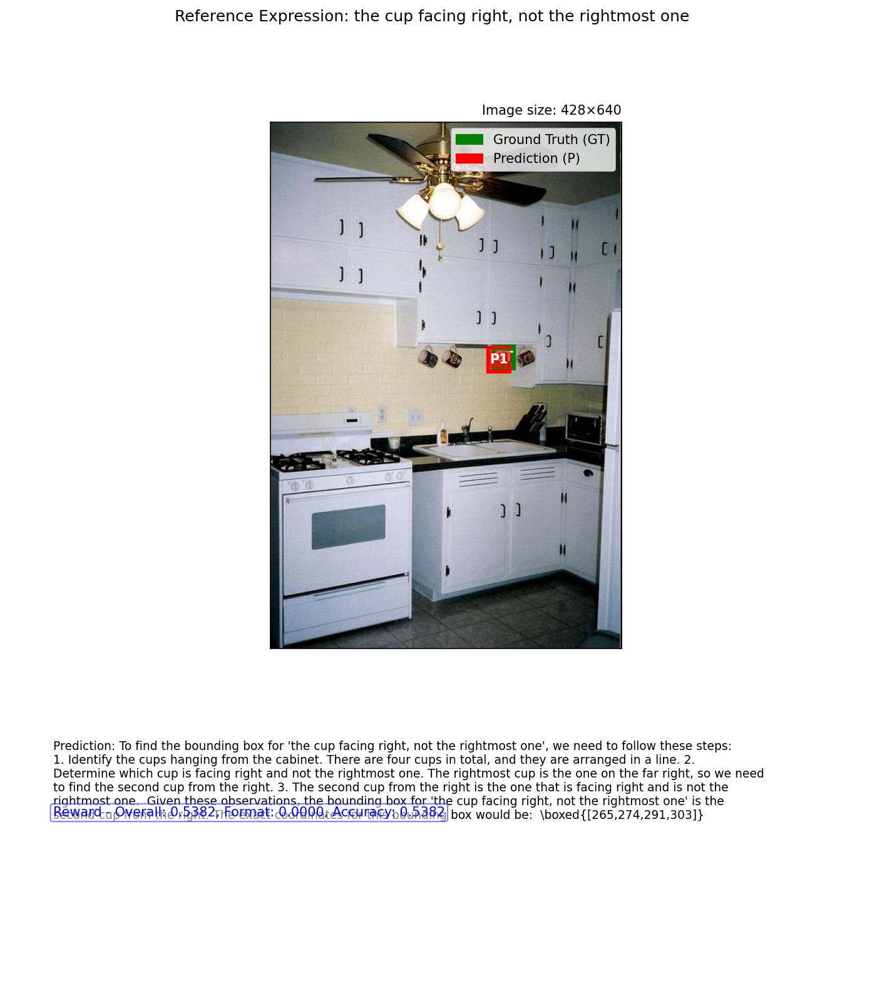

---

### Example 175

**Reference Expression**: the white cup, beside the sink

**Ground Truth**: [[66, 229, 82, 250]]

**Predicted**: [[65, 223, 83, 243]]

**Reward**: {'overall': 0.4745762711864407, 'format': 0.0, 'accuracy': 0.4745762711864407}

**Prediction**:
```
To find the bounding box for 'the white cup, beside the sink', let's follow these steps:

1. Identify the sink: The sink is on the left side of the image, and it's a standard kitchen sink with a faucet.
2. Look for a white cup: Next to the sink, there is a white cup on the countertop.
3. Determine the bounding box: The white cup is positioned close to the sink, and it's a small object. We need to capture it in a bounding box that includes the cup and a bit of the surrounding countertop.

Given these observations, the bounding box for 'the white cup, beside the sink' would be:

\boxed{[65,223,83,243]}
```

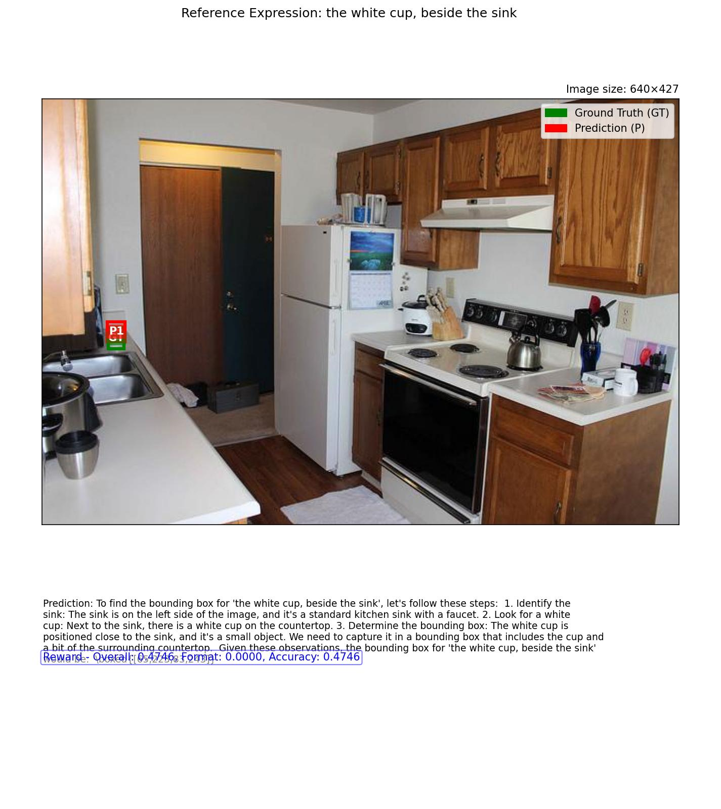

---

### Example 176

**Reference Expression**: the green cup on top of an array of glasses, not upright

**Ground Truth**: [[118, 269, 152, 294]]

**Predicted**: [[115, 246, 172, 291]]

**Reward**: {'overall': 0.28046494188226473, 'format': 0.0, 'accuracy': 0.28046494188226473}

**Prediction**:
```
To find the bounding box for the green cup on top of an array of glasses, not upright, we need to follow these steps:

1. Identify the array of glasses: These are typically the clear glass objects in the image.
2. Locate the green cup: It is a green object that is not upright but resting on top of the glasses.
3. Determine the bounding box: The green cup is small and positioned on the left side of the image, close to the array of glasses.

Given these observations, the bounding box for the green cup on top of an array of glasses, not upright, can be identified as follows:

\boxed{[115,246,172,291]}
```

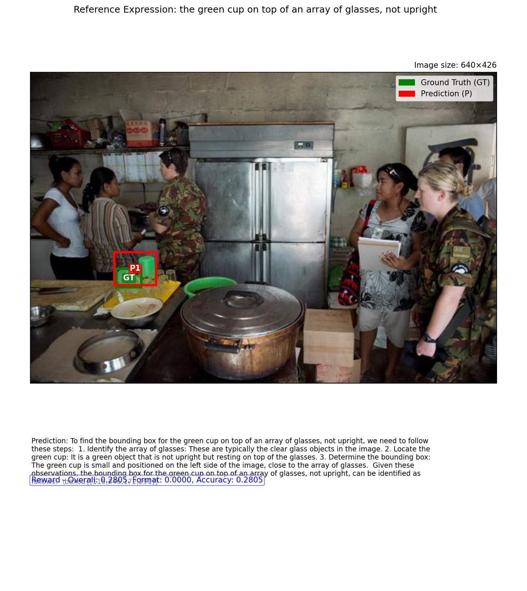

---

### Example 177

**Reference Expression**: the knife beside the pineapple, third from the left

**Ground Truth**: [[284, 201, 291, 209]]

**Predicted**: [[256, 142, 272, 179]]

**Reward**: {'overall': 0.0, 'format': 0.0, 'accuracy': 0.0}

**Prediction**:
```
To find the bounding box for 'the knife beside the pineapple, third from the left', we need to follow these steps:

1. Identify the pineapple in the image. It's located on the right side of the cutting board.
2. Find the knives. They are placed to the left of the pineapple.
3. Determine which knife is the third from the left. The knives are arranged in a row, so we need to count from the left.

Upon close inspection:
- The first knife is on the far left.
- The second knife is next to the first.
- The third knife is next to the second.
- The pineapple is next to the third knife.

So, the third knife from the left is the one we're looking for.

The bounding box for 'the knife beside the pineapple, third from the left' is:
\boxed{[256,142,272,179]}
```

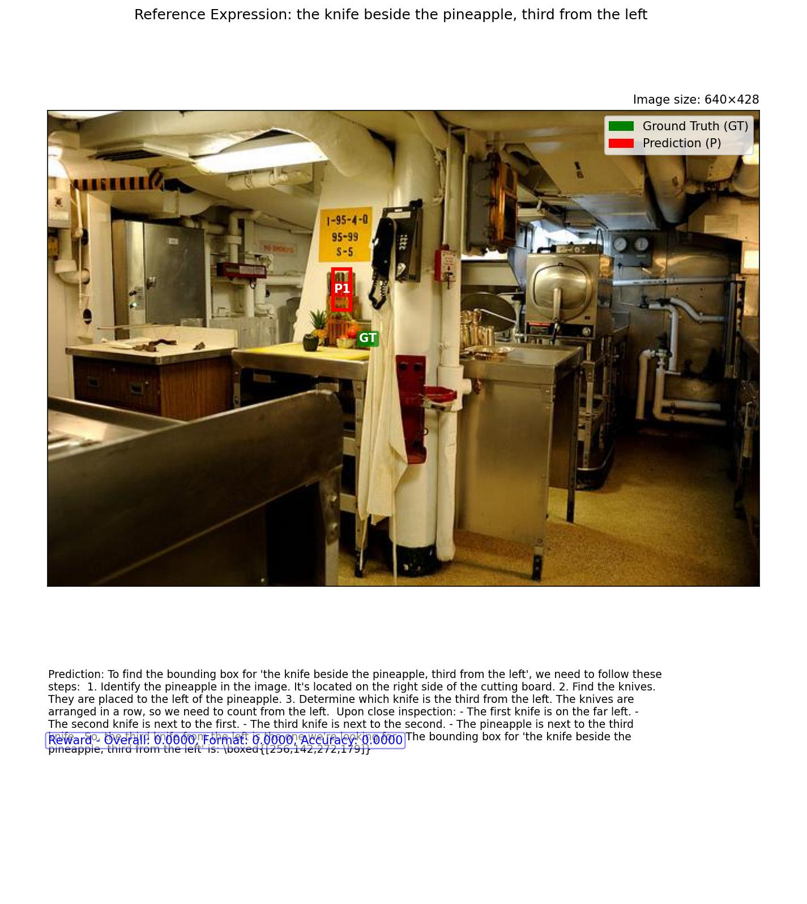

---

### Example 178

**Reference Expression**: the bowl on the same cabinet shelf as the small yellow object

**Ground Truth**: [[279, 305, 336, 333]]

**Predicted**: [[283, 346, 336, 387]]

**Reward**: {'overall': 0.0, 'format': 0.0, 'accuracy': 0.0}

**Prediction**:
```
To find the bowl on the same cabinet shelf as the small yellow object, let's follow these steps:

1. Identify the small yellow object: It is located in the middle shelf, slightly to the right of the center of the image.
2. Identify the shelf: The yellow object is on the middle shelf.
3. Locate the bowl: The bowl should be on the same shelf as the yellow object. 
4. Check the image: The bowl is indeed on the same shelf as the yellow object, and it is to the left of the yellow object.

The bounding box for the bowl on the same cabinet shelf as the small yellow object is:
\boxed{[283,346,336,387]}
```

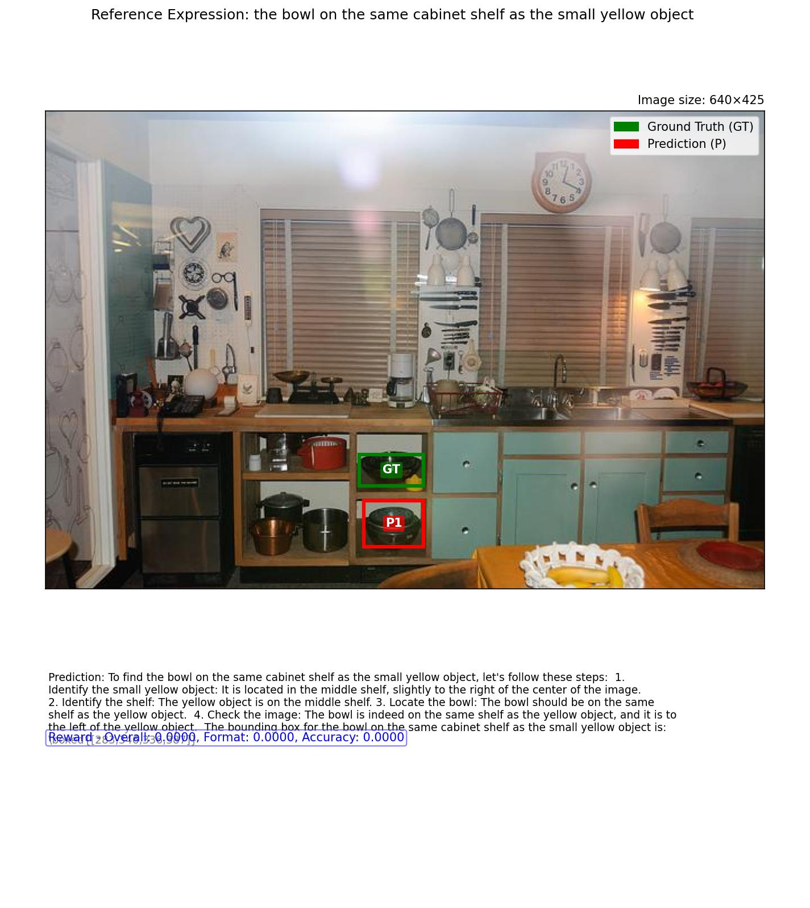

---

### Example 179

**Reference Expression**: a black car that is not moving away from the camera

**Ground Truth**: [[311, 190, 364, 214]]

**Predicted**: [[271, 235, 337, 297]]

**Reward**: {'overall': 0.0, 'format': 0.0, 'accuracy': 0.0}

**Prediction**:
```
To find the bounding box for 'a black car that is not moving away from the camera', we need to follow these steps:

1. Identify the black cars in the image.
2. Determine which black car is not moving away from the camera.
3. Provide the bounding box for that car.

Step 1: Identifying the black cars
- There are several cars in the image. The black cars are the ones with a dark color.
- Upon close inspection, there is a black car on the left side of the image, closer to the foreground.

Step 2: Determining the car that is not moving away from the camera
- The black car in the foreground appears to be stationary or moving very slowly.
- Other cars further down the road are moving away from the camera.

Step 3: Providing the bounding box
- The black car that is not moving away from the camera is located in the middle of the left side of the image.
- The bounding box for this black car would be around the car's visible part.

Considering these steps, the bounding box for the black car that is not moving away from the camera is:
\boxed{[271,235,337,297]}
```

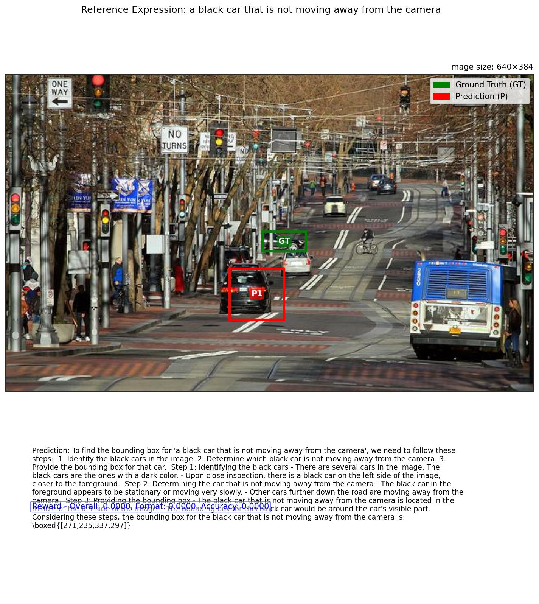

---

### Example 180

**Reference Expression**: the car in front of a black Audi sedan

**Ground Truth**: [[158, 264, 323, 417]]

**Predicted**: [[163, 264, 325, 410]]

**Reward**: {'overall': 1.0, 'format': 0.0, 'accuracy': 1.0}

**Prediction**:
```
To find the bounding box for 'the car in front of a black Audi sedan', let's follow these steps:

1. Identify the black Audi sedan in the image. It is the car with the license plate "AFO 583".
2. Locate the car immediately in front of the black Audi sedan. It is a white van with the license plate "HNN 710".

The bounding box for 'the car in front of a black Audi sedan' is:
\boxed{[163, 264, 325, 410]}
```

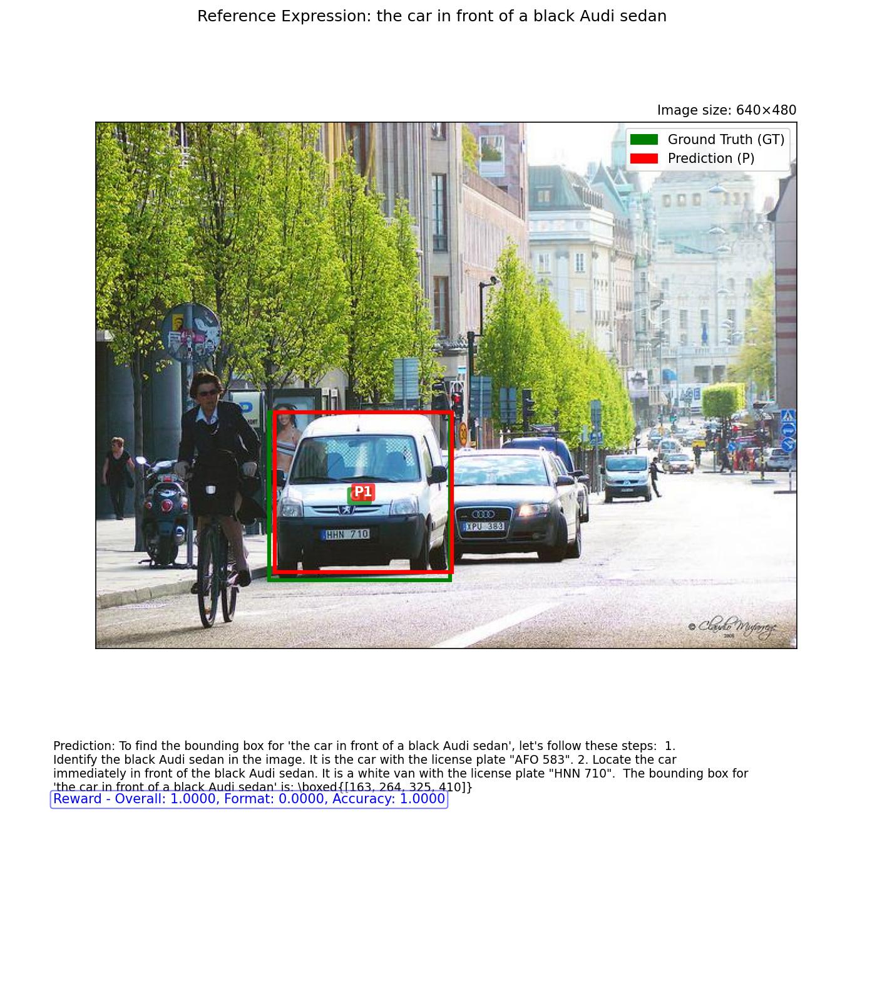

---

### Example 181

**Reference Expression**: the reflection of the toothbrush that is not white

**Ground Truth**: [[197, 152, 240, 239]]

**Predicted**: [[129, 102, 199, 313]]

**Reward**: {'overall': 0.0, 'format': 0.0, 'accuracy': 0.0}

**Prediction**:
```
To find the bounding box for 'the reflection of the toothbrush that is not white', we need to follow these steps:

1. Identify the toothbrushes in the image. There are three toothbrushes in total, and one of them is not white.
2. Determine the reflection of the toothbrush that is not white. The reflection will be on the mirror, which is above the sink.
3. Locate the reflection of the toothbrush that is not white in the mirror. It will be the toothbrush that is not white, mirrored.
4. Draw a bounding box around the reflection of the toothbrush that is not white.

Following these steps, the reflection of the toothbrush that is not white can be identified in the mirror. The bounding box for this reflection is:

\boxed{[129,102,199,313]}
```

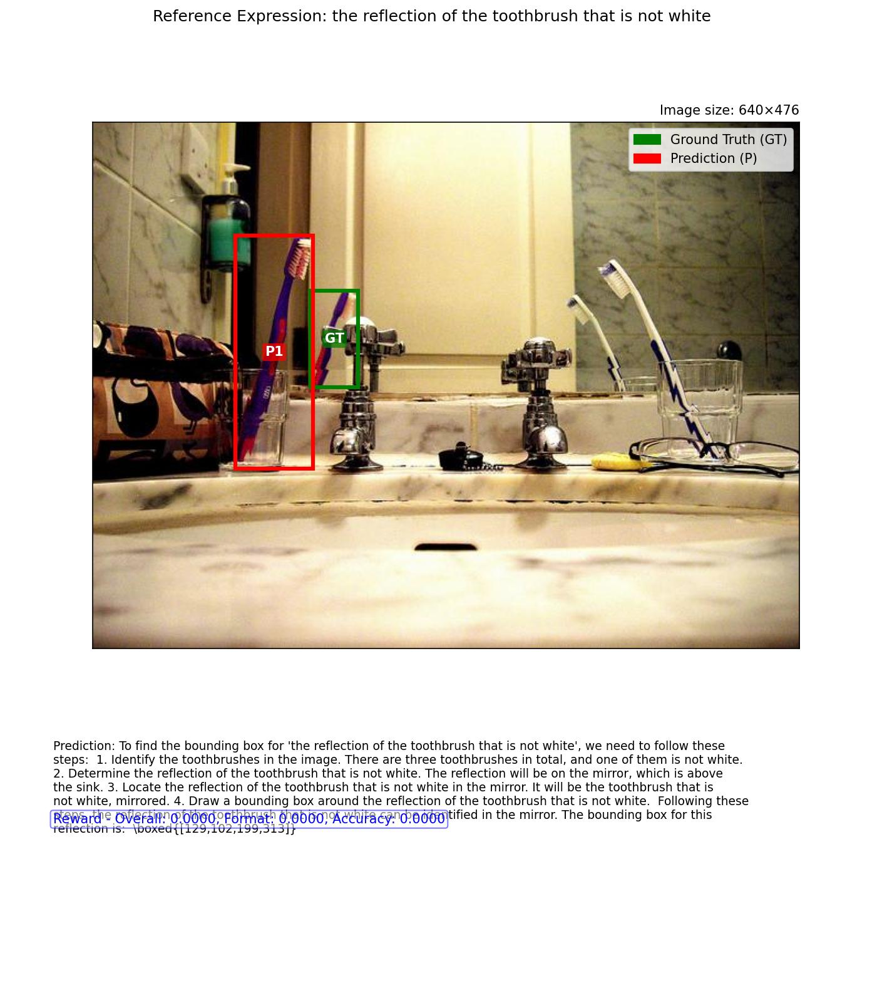

---

### Example 182

**Reference Expression**: the car parked next to a fire hydrant, which is not an sedan

**Ground Truth**: [[321, 128, 628, 328]]

**Predicted**: [[323, 129, 630, 332]]

**Reward**: {'overall': 1.0, 'format': 0.0, 'accuracy': 1.0}

**Prediction**:
```
To find the car parked next to the fire hydrant, which is not an sedan, we need to follow these steps:

1. Identify the fire hydrant in the image. The fire hydrant is located in the middle of the image, attached to a pole.
2. Look for cars parked next to the fire hydrant. There are two cars parked next to the fire hydrant.
3. Determine which of these cars is not an sedan. The car on the right is a pickup truck, and the car on the left is a sedan.

The car on the right is the one that is not an sedan. Its bounding box can be identified as follows:

\boxed{[323,129,630,332]}
```

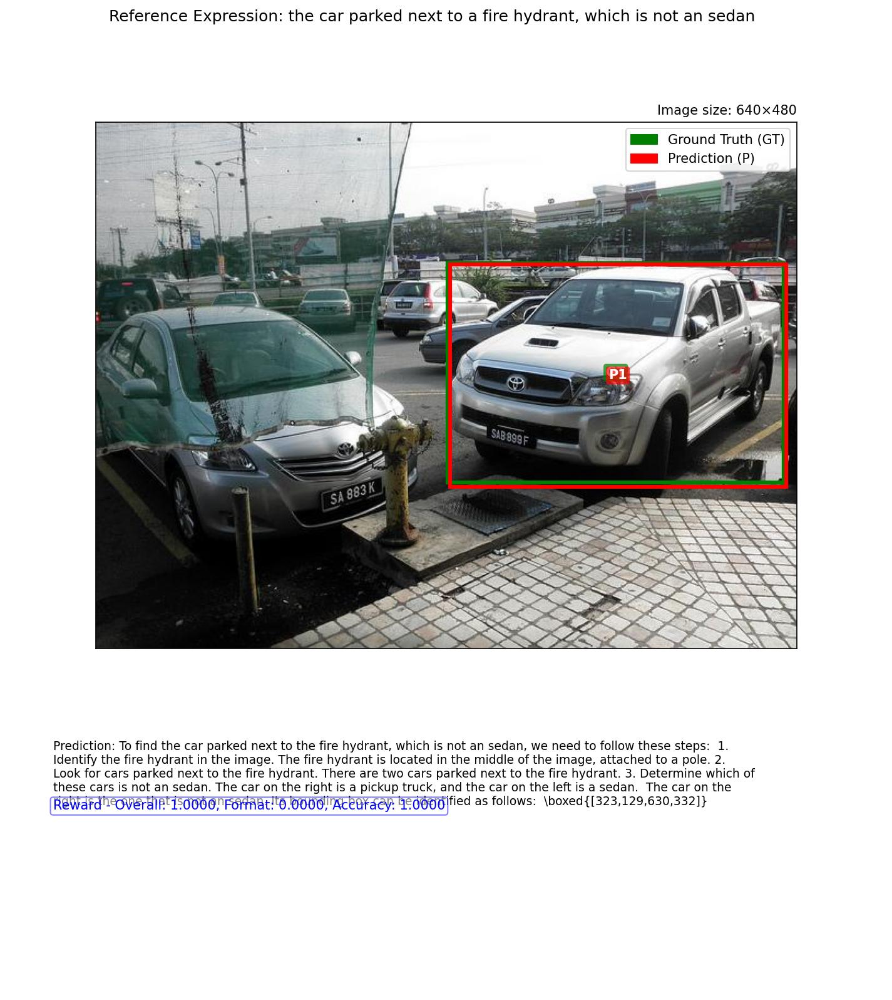

---

### Example 183

**Reference Expression**: the lower traffic light mounted on the pole struck by a car

**Ground Truth**: [[479, 227, 498, 261]]

**Predicted**: [[476, 105, 509, 165]]

**Reward**: {'overall': 0.0, 'format': 0.0, 'accuracy': 0.0}

**Prediction**:
```
To find the lower traffic light mounted on the pole struck by a car, let's follow these steps:

1. Identify the car that appears to have struck the traffic light pole. The car on the right side of the image is the one that looks like it has hit the pole.
2. Look for the traffic light on the pole that the car has struck. The traffic light is mounted on the pole, and it is located to the right of the car.
3. The traffic light is the one that is red and is closest to the car that has been struck.

The bounding box for the lower traffic light mounted on the pole struck by a car is:
\boxed{[476,105,509,165]}
```

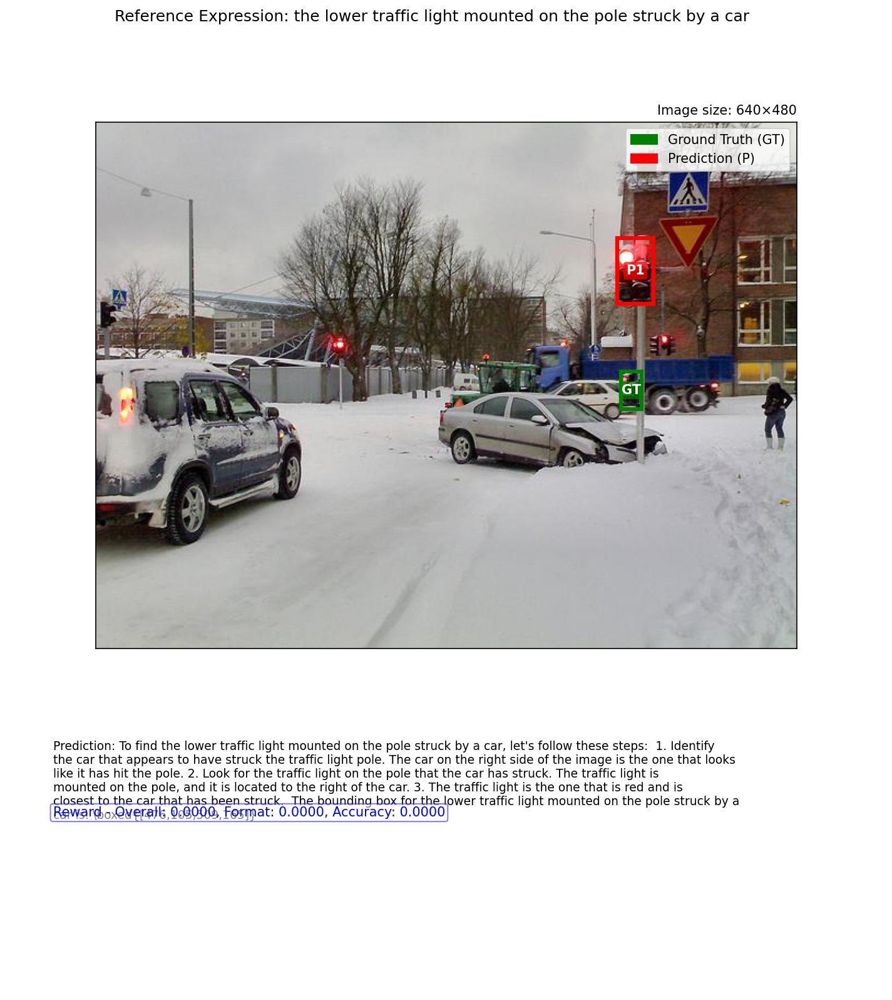

---

### Example 184

**Reference Expression**: the traffic light on the pole next to the black car on the left side, located at the upper left corner

**Ground Truth**: [[72, 39, 82, 64]]

**Predicted**: [[75, 35, 94, 83]]

**Reward**: {'overall': 0.1773049645390071, 'format': 0.0, 'accuracy': 0.1773049645390071}

**Prediction**:
```
To find the bounding box for the traffic light on the pole next to the black car on the left side, located at the upper left corner, we need to follow these steps:

1. Identify the black car on the left side of the image.
2. Locate the traffic light pole near the black car.
3. Determine the traffic light's bounding box.

The black car is positioned on the left side of the image, and the traffic light pole is next to it. The traffic light is located at the top left corner of the image, near the pole.

The bounding box for the traffic light on the pole next to the black car on the left side, located at the upper left corner, is:
\boxed{[75, 35, 94, 83]}
```

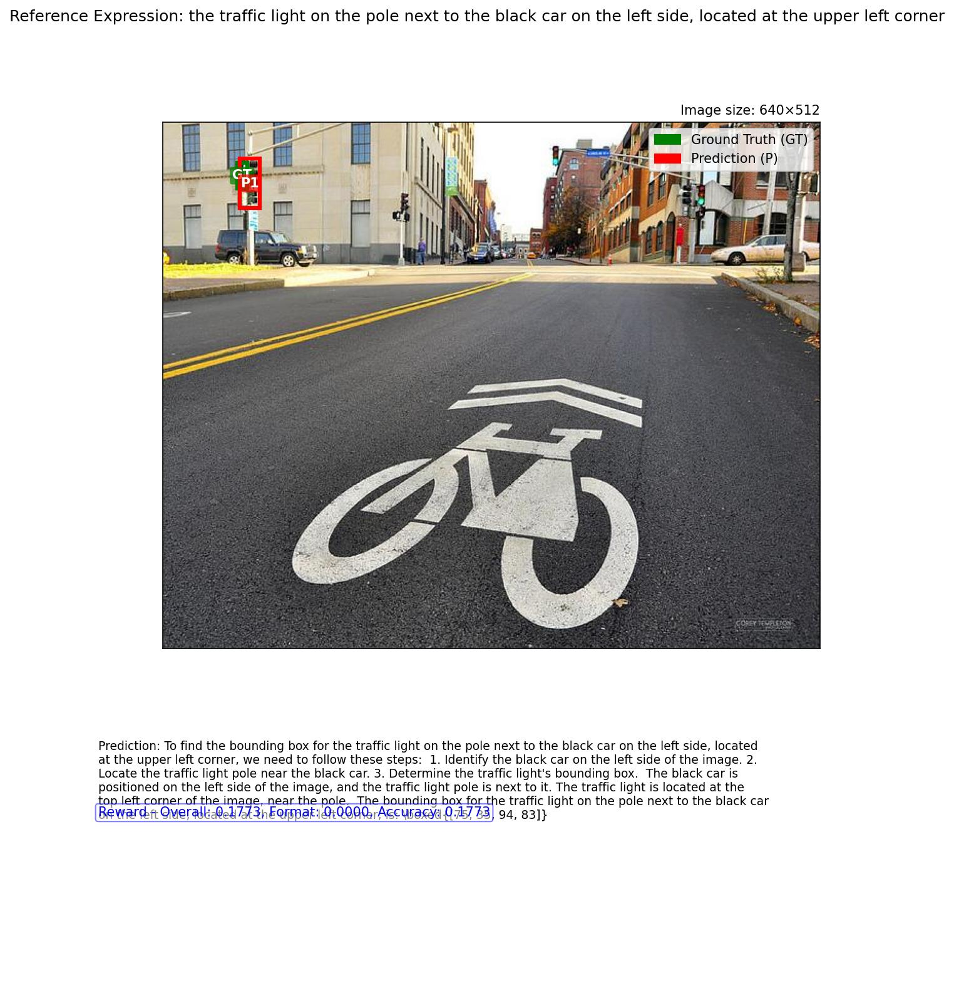

---

### Example 185

**Reference Expression**: the parked car facing away from the camera, nearest to the silver car driving towards the camera

**Ground Truth**: [[183, 259, 195, 268]]

**Predicted**: [[262, 312, 313, 352]]

**Reward**: {'overall': 0.0, 'format': 0.0, 'accuracy': 0.0}

**Prediction**:
```
To find the bounding box for 'the parked car facing away from the camera, nearest to the silver car driving towards the camera', let's follow these steps:

1. Identify the silver car driving towards the camera. It is the one in the foreground, closer to the viewer.
2. Look for parked cars near the silver car. There is a parked car to the right of the silver car.
3. Determine which of these parked cars is facing away from the camera. The car to the right of the silver car appears to be parked and facing away from the camera.

The bounding box for this car is:
\boxed{[262,312,313,352]}


```

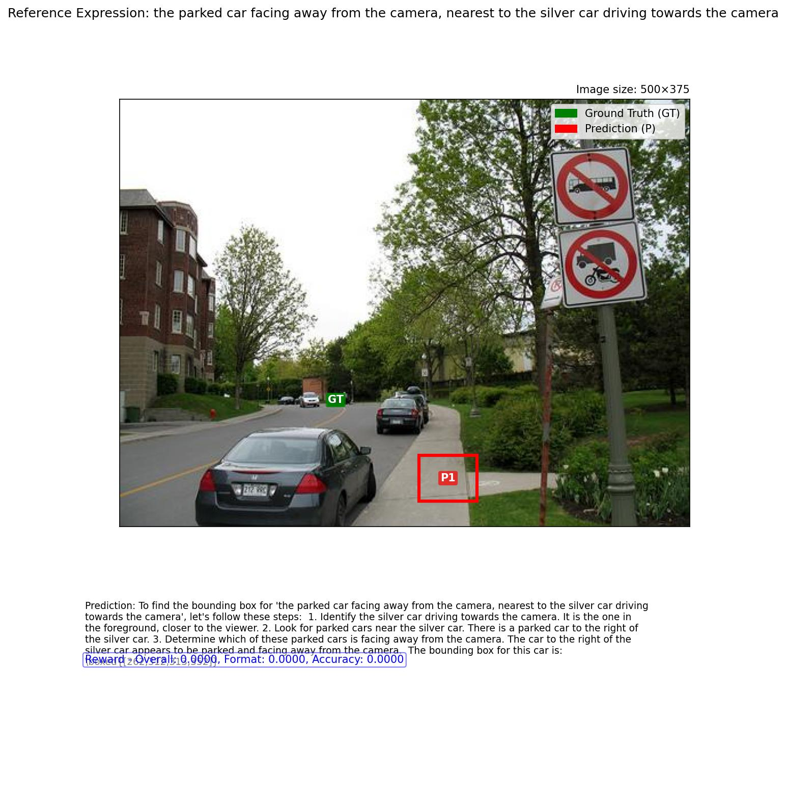

---

### Example 186

**Reference Expression**: the green traffic light hanging from a wire above the intersection, with the church tower behind it

**Ground Truth**: [[349, 173, 359, 182]]

**Predicted**: [[346, 116, 403, 182]]

**Reward**: {'overall': 0.0, 'format': 0.0, 'accuracy': 0.0}

**Prediction**:
```
To find the bounding box for the green traffic light hanging from a wire above the intersection, with the church tower behind it, follow these steps:

1. Identify the church tower: The church tower is the tall, pointed structure with a cross at the top, located in the center of the image.
2. Locate the traffic lights: Look for traffic lights above the intersection. There are two traffic lights visible, one on the left side and one on the right side of the intersection.
3. Determine which traffic light is green: The traffic light on the left side of the image is green.
4. Identify the wire: The wire is the horizontal line above the traffic lights.
5. Define the bounding box: The bounding box should include the green traffic light, the wire it's hanging from, and a small portion of the church tower behind it.

After carefully analyzing the image, the bounding box for the green traffic light hanging from a wire above the intersection, with the church tower behind it, would be:

\boxed{[346,116,403,182]}
```

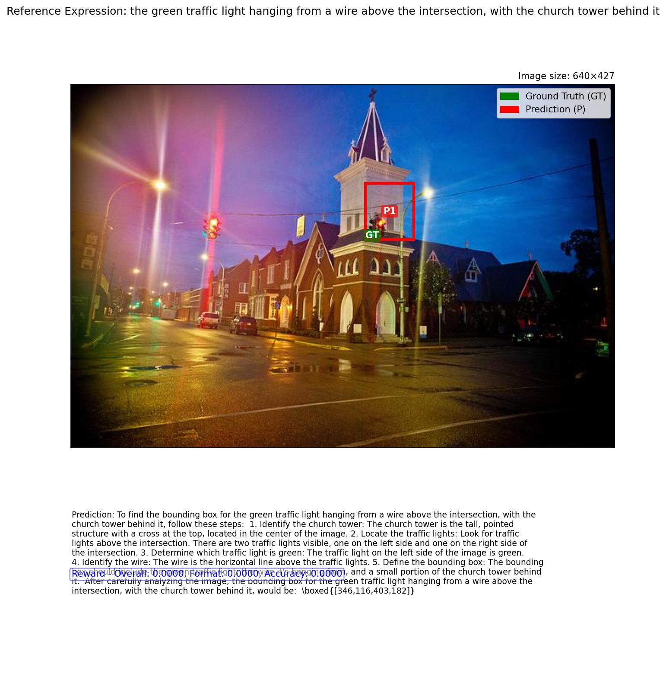

---

### Example 187

**Reference Expression**: the sedan in front of the blue truck

**Ground Truth**: [[133, 356, 225, 392]]

**Predicted**: [[130, 362, 221, 394]]

**Reward**: {'overall': 0.7366071428571429, 'format': 0.0, 'accuracy': 0.7366071428571429}

**Prediction**:
```
To find the bounding box for 'the sedan in front of the blue truck', let's follow these steps:

1. Identify the blue truck: It is located in the center of the image, slightly to the right.
2. Identify the sedan in front of the blue truck: The sedan is positioned directly in front of the blue truck, closer to the left side of the image.

The sedan in front of the blue truck is the black car located between the blue truck and the yellow school bus. Its bounding box is:

\boxed{[130, 362, 221, 394]}
```

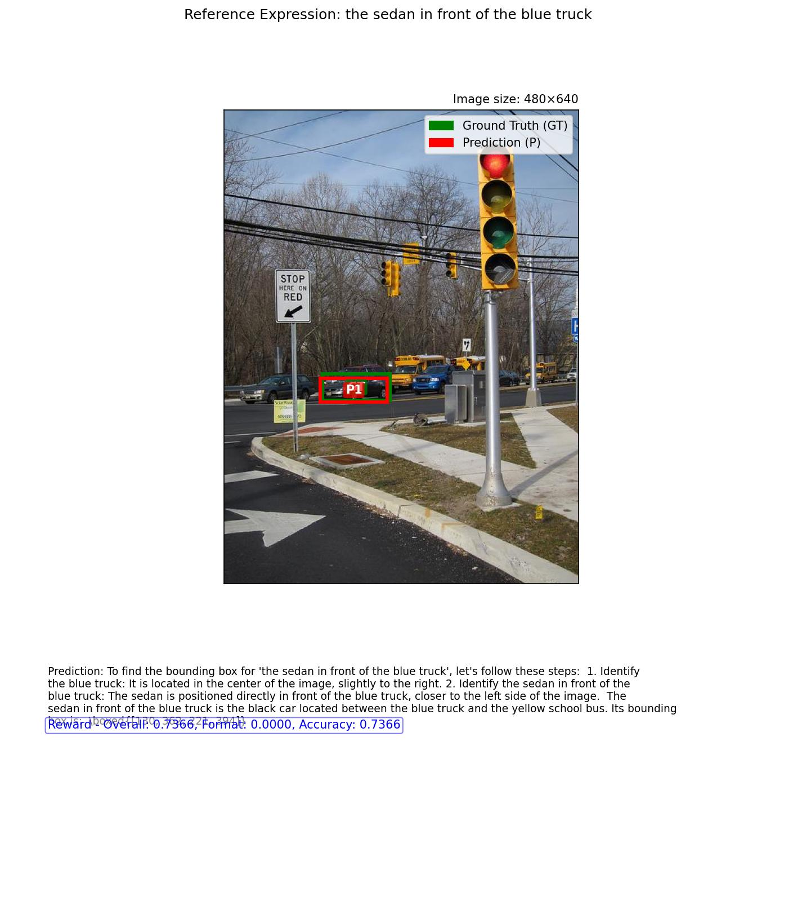

---

### Example 188

**Reference Expression**: the white car partially obscured by the bush

**Ground Truth**: [[334, 281, 389, 327]]

**Predicted**: [[329, 276, 390, 326]]

**Reward**: {'overall': 0.7971014492753623, 'format': 0.0, 'accuracy': 0.7971014492753623}

**Prediction**:
```
To find the bounding box for the white car partially obscured by the bush, let's follow these steps:

1. Identify the bush: The bush is located in the foreground, slightly to the left of the center of the image.
2. Look for the car: Behind the bush, there is a white vehicle partially visible. It appears to be a car, and it is located to the right of the bush.
3. Determine the bounding box: The car is partially obscured by the bush, so we need to estimate the visible part of the car. The car's front is partially visible, and the back is not visible at all due to the bush.

Given these observations, the bounding box for the white car partially obscured by the bush would be:

\boxed{[329,276,390,326]}

This bounding box is an approximation based on the visible part of the car behind the bush.
```

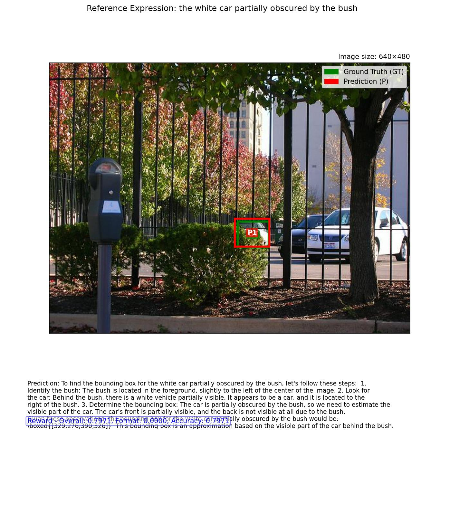

---

### Example 189

**Reference Expression**: the person wearing a dark jacket and carrying a shoulder bag

**Ground Truth**: [[215, 224, 232, 278]]

**Predicted**: [[74, 213, 315, 636]]

**Reward**: {'overall': 0.0, 'format': 0.0, 'accuracy': 0.0}

**Prediction**:
```
To find the bounding box for 'the person wearing a dark jacket and carrying a shoulder bag', let's analyze the image step-by-step:

1. Identify the person in the foreground wearing a dark jacket. This person is standing and appears to be looking at the traffic light.
2. Look for a shoulder bag. In this case, the person is carrying a shoulder bag over their right shoulder.
3. The bounding box should encompass the person from head to toe, including the bag.

After analyzing the image, the bounding box for 'the person wearing a dark jacket and carrying a shoulder bag' is:

\boxed{[74, 213, 315, 636]}
```

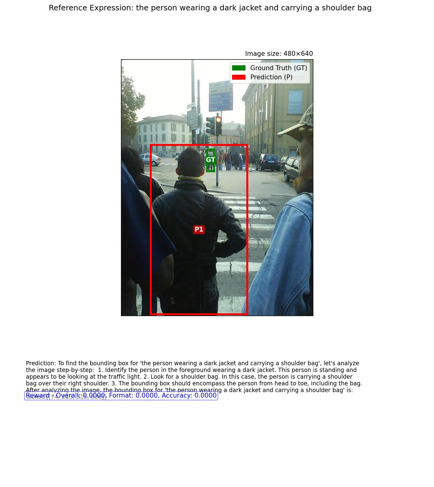

---

### Example 190

**Reference Expression**: the person who is neither standing nor lying on the bench, wearing sunglasses and holding a bag

**Ground Truth**: [[207, 396, 279, 541]]

**Predicted**: [[201, 398, 273, 550]]

**Reward**: {'overall': 0.7900552486187845, 'format': 0.0, 'accuracy': 0.7900552486187845}

**Prediction**:
```
To find the bounding box for the person who is neither standing nor lying on the bench, wearing sunglasses and holding a bag, I'll follow these steps:

1. Identify all people on the bench.
2. Identify the person who is not standing and not lying on the bench.
3. Check if this person is wearing sunglasses and holding a bag.
4. Provide the bounding box for this person.

Step 1: People on the bench:
- There are three people sitting on the bench: one on the far left, one in the middle, and one on the far right.

Step 2: Identify the person who is not standing and not lying on the bench:
- The person on the far left is standing.
- The person in the middle is sitting.
- The person on the far right is lying on the bench.

Step 3: Check if the person in the middle is wearing sunglasses and holding a bag:
- The person in the middle is wearing sunglasses.
- The person in the middle is holding a bag.

Step 4: Provide the bounding box for this person:
\boxed{[201, 398, 273, 550]}
```

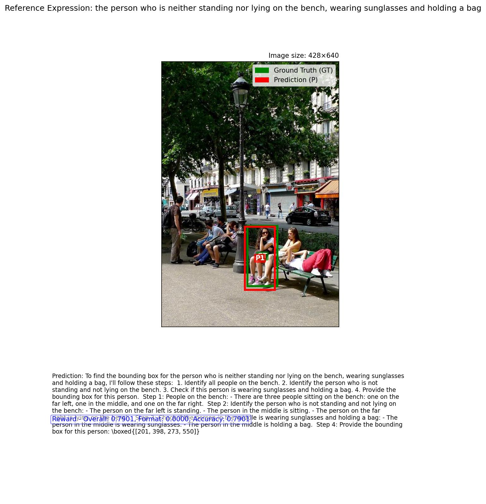

---

### Example 191

**Reference Expression**: the person wearing a black hat and plastic gloves, with a hand resting on the table

**Ground Truth**: [[245, 104, 343, 271]]

**Predicted**: [[248, 87, 344, 266]]

**Reward**: {'overall': 0.8474669603524229, 'format': 0.0, 'accuracy': 0.8474669603524229}

**Prediction**:
```
To find the bounding box for 'the person wearing a black hat and plastic gloves, with a hand resting on the table', follow these steps:

1. Identify the person in the image who is wearing a black hat and appears to be interacting with a table or surface. This person is in the center of the image.
2. Observe the hand gesture: the person's hand is resting on the table, which is a key detail.
3. Focus on the person's attire: they are wearing a black hat and gloves, which are distinctive features.
4. Locate the position of the table: the table is in the middle of the image, and the person is standing close to it.

After analyzing these details, the bounding box for the person described would be:

\boxed{[248,87,344,266]}
```

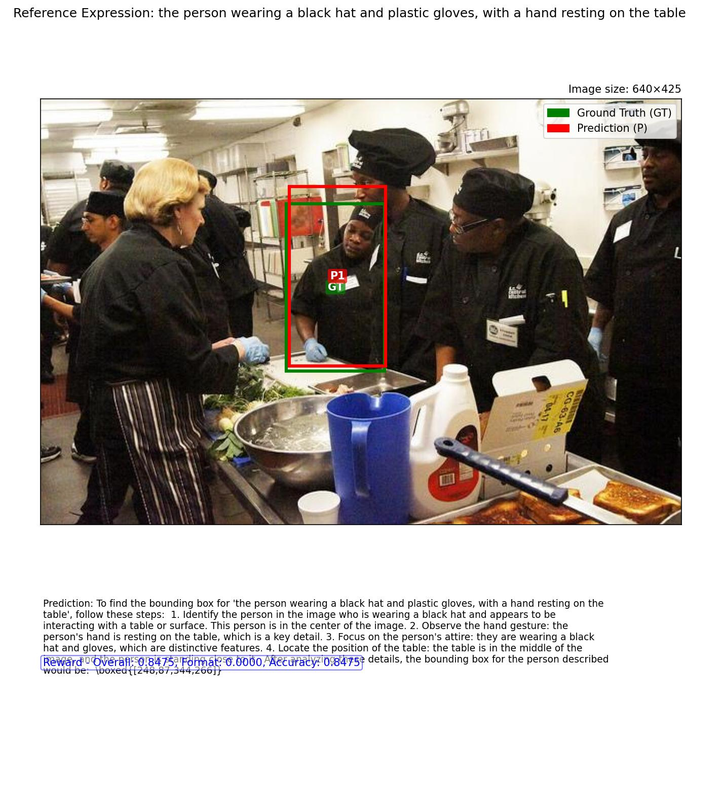

---

### Example 192

**Reference Expression**: the chair occupied by the person who does not have a laptop on the lap

**Ground Truth**: [[41, 138, 191, 349]]

**Predicted**: [[39, 136, 197, 348]]

**Reward**: {'overall': 1.0, 'format': 0.0, 'accuracy': 1.0}

**Prediction**:
```
To find the bounding box for the chair occupied by the person who does not have a laptop on their lap, follow these steps:

1. Identify the person without a laptop: The person on the left is sitting with hands clasped, and there is no laptop in front of them.
2. Locate the chair: The chair occupied by the person without a laptop is the one the person on the left is sitting on.
3. Determine the bounding box: The chair is positioned to the left of the person with the laptop and is part of the patio furniture.

The bounding box for the chair occupied by the person who does not have a laptop on their lap is:
\boxed{[39,136,197,348]}
```

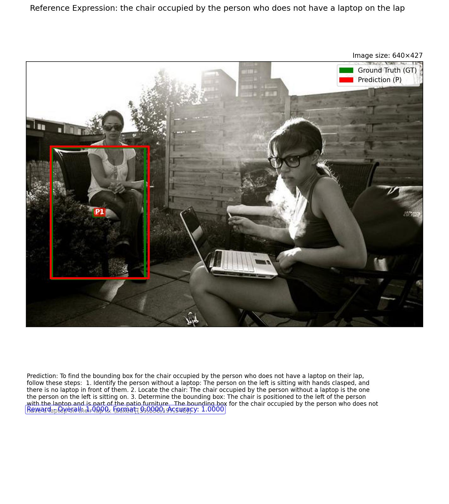

---

### Example 193

**Reference Expression**: the fifth knife from the top, hanging horizontally on the left-side wall

**Ground Truth**: [[154, 189, 174, 192]]

**Predicted**: [[362, 155, 372, 169]]

**Reward**: {'overall': 0.0, 'format': 0.0, 'accuracy': 0.0}

**Prediction**:
```
To find the corresponding bounding box for 'the fifth knife from the top, hanging horizontally on the left-side wall', let's follow these steps:

1. Identify the wall on the left side of the image where the knives are hanging.
2. Count the knives from top to bottom on this wall.
3. Locate the fifth knife from the top.

Step 1: The knives are hanging on the left wall, near the window.
Step 2: Counting the knives from top to bottom:
   - The first knife is at the top.
   - The second knife is below the first.
   - The third knife is below the second.
   - The fourth knife is below the third.
   - The fifth knife is below the fourth.

Step 3: The fifth knife from the top is the one we need to identify.

The bounding box for the fifth knife from the top, hanging horizontally on the left-side wall, would be:

\boxed{[362, 155, 372, 169]}
```

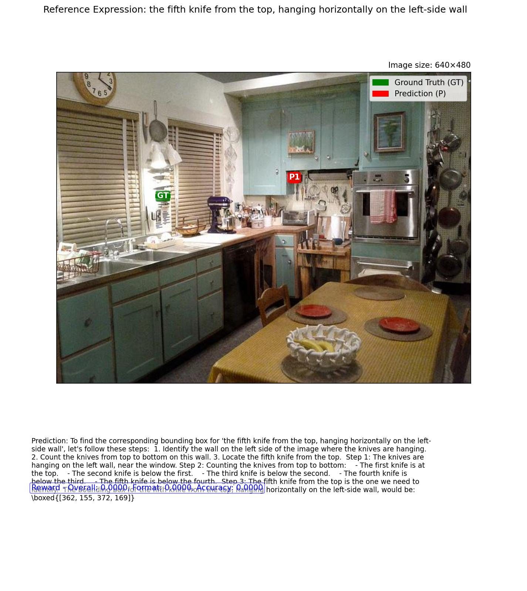

---

### Example 194

**Reference Expression**: the chair that is sitted by a person with a laptop on the lap

**Ground Truth**: [[519, 267, 640, 422]]

**Predicted**: [[511, 256, 644, 420]]

**Reward**: {'overall': 0.8394395574498957, 'format': 0.0, 'accuracy': 0.8394395574498957}

**Prediction**:
```
To find the chair that the person with the laptop is sitting by, follow these steps:

1. Identify the person with the laptop: This person is on the right side of the image, wearing glasses and a sleeveless top.
2. Look for the chair that the person with the laptop is sitting on: The person is sitting on a chair that is partially visible on the right side of the image.
3. Locate the chair that the other person is sitting on: The other person is on the left side of the image, wearing a white top and jeans, and is sitting on a chair that is also partially visible.
4. Determine which chair is associated with the person with the laptop: The chair on the right side of the image, where the person with the laptop is sitting, is the one we are looking for.

The bounding box for the chair that the person with the laptop is sitting by is:
\boxed{[511,256,644,420]}
```

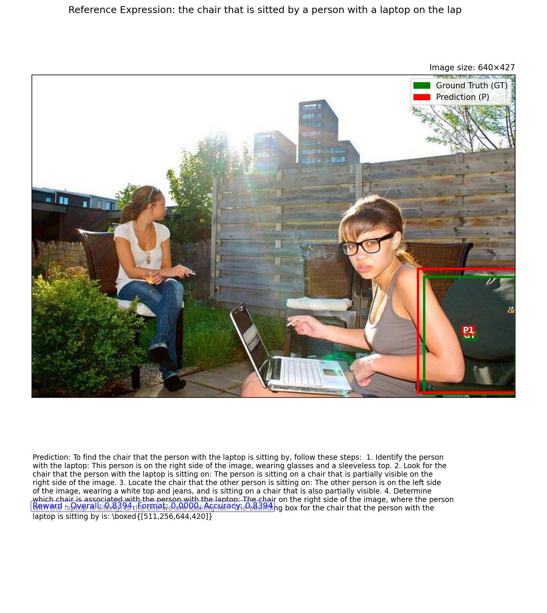

---

### Example 195

**Reference Expression**: one of the two chairs with identical backrest patterns and closer to the corner of the two walls

**Ground Truth**: [[482, 170, 528, 219]]

**Predicted**: [[488, 170, 532, 262]]

**Reward**: {'overall': 0.4514048825426071, 'format': 0.0, 'accuracy': 0.4514048825426071}

**Prediction**:
```
To find the bounding box for 'one of the two chairs with identical backrest patterns and closer to the corner of the two walls':

1. Identify the two chairs with identical backrest patterns: There are two chairs with similar backrest patterns, one closer to the corner and one further away.
2. Determine which chair is closer to the corner: The chair closer to the corner is the one on the right side of the image.
3. Locate the bounding box for this chair: The chair is positioned to the right of the kitchen island, and its backrest pattern matches the other chair.

The bounding box for 'one of the two chairs with identical backrest patterns and closer to the corner of the two walls' is:
\boxed{[488,170,532,262]}
```

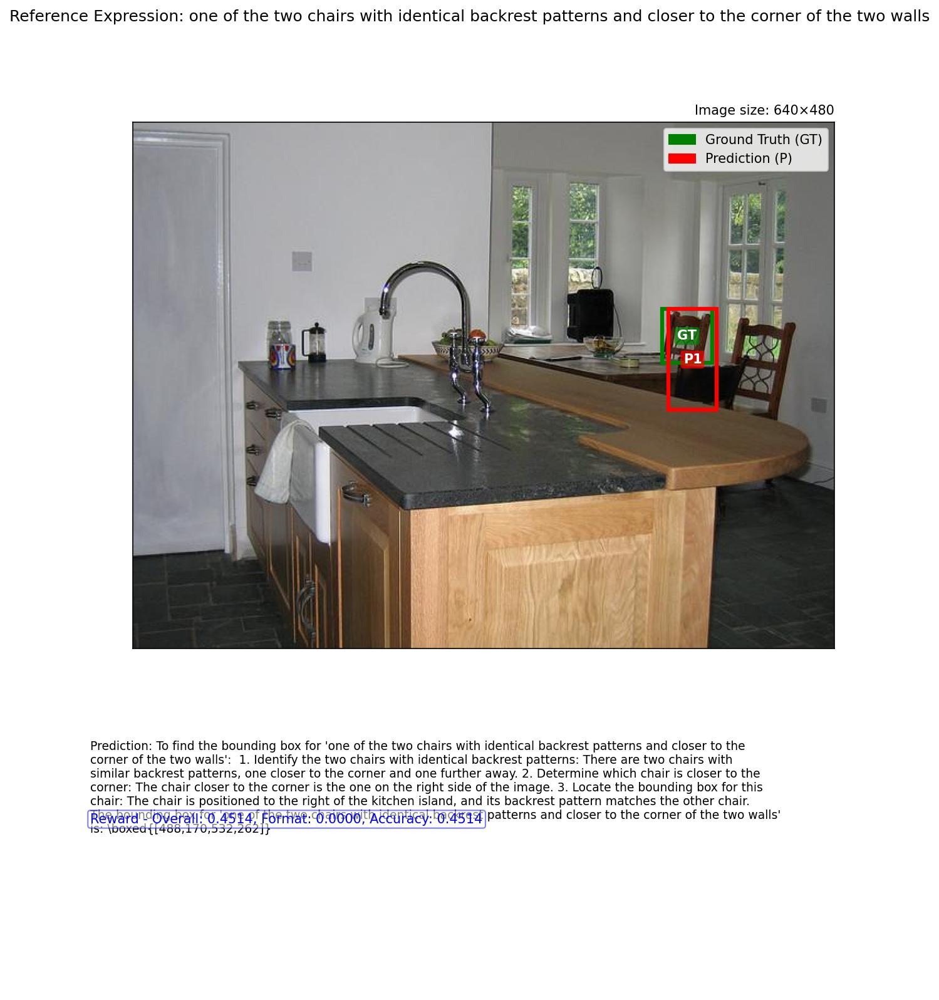

---

### Example 196

**Reference Expression**: the kite located directly above the kite shaped like a green gecko

**Ground Truth**: [[509, 50, 550, 70]]

**Predicted**: [[390, 105, 432, 134]]

**Reward**: {'overall': 0.0, 'format': 0.0, 'accuracy': 0.0}

**Prediction**:
```
To find the kite located directly above the kite shaped like a green gecko, we need to follow these steps:

1. Identify the green gecko-shaped kite in the image. It is the green kite with a long tail located in the upper right part of the image.
2. Look above the green gecko-shaped kite for another kite. The kite directly above it is a colorful kite with a pattern that resembles a star or a burst of colors.

The bounding box for the kite located directly above the green gecko-shaped kite is:
\boxed{[390,105,432,134]}


```

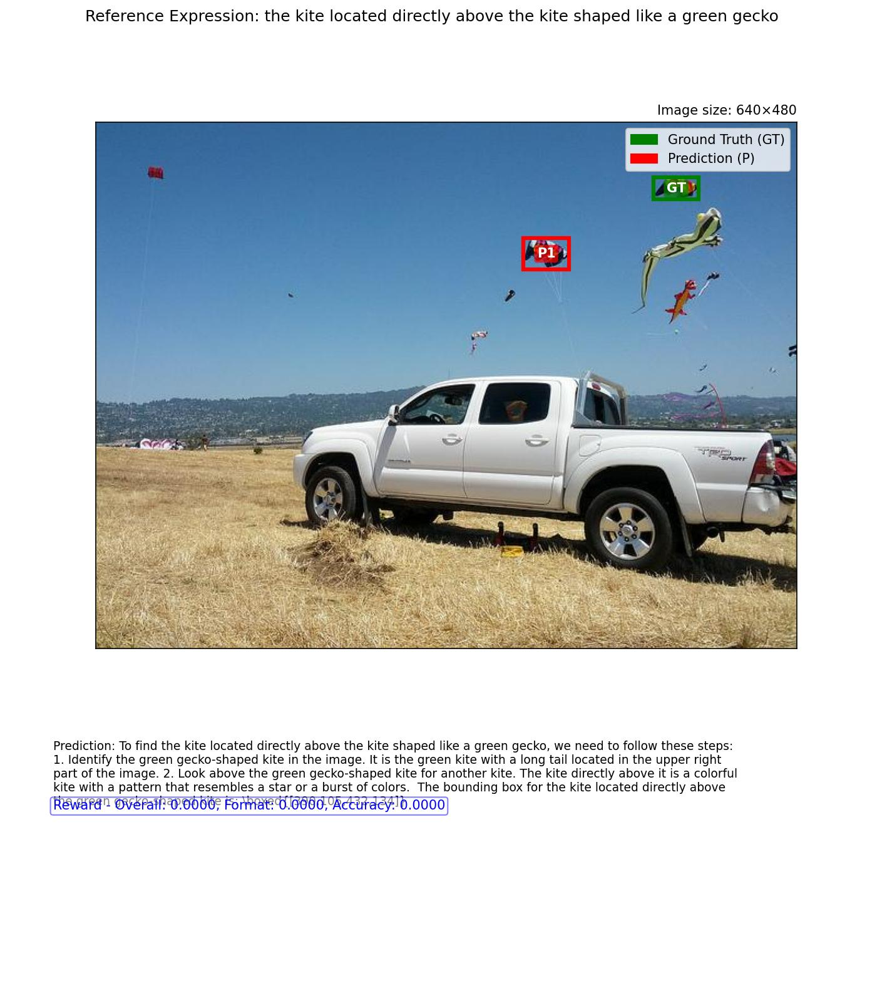

---

### Example 197

**Reference Expression**: the car behind the one with its wheels turned right, facing towards the camera

**Ground Truth**: [[46, 302, 73, 328]]

**Predicted**: [[50, 331, 84, 363]]

**Reward**: {'overall': 0.0, 'format': 0.0, 'accuracy': 0.0}

**Prediction**:
```
To find the car behind the one with its wheels turned right, facing towards the camera, we need to follow these steps:

1. Identify the car with its wheels turned right, facing towards the camera. This car is the one closest to the camera, with its front facing the viewer.
2. Look for the car directly behind it. This car should be positioned slightly further back and to the left of the first car.

Following these steps:

1. The car with its wheels turned right, facing towards the camera, is the one closest to the camera and facing the viewer.
2. The car behind it is the one that is slightly further back and to the left of the first car.

After analyzing the image, the bounding box for the car behind the one with its wheels turned right, facing towards the camera is:

\boxed{[50,331,84,363]}
```

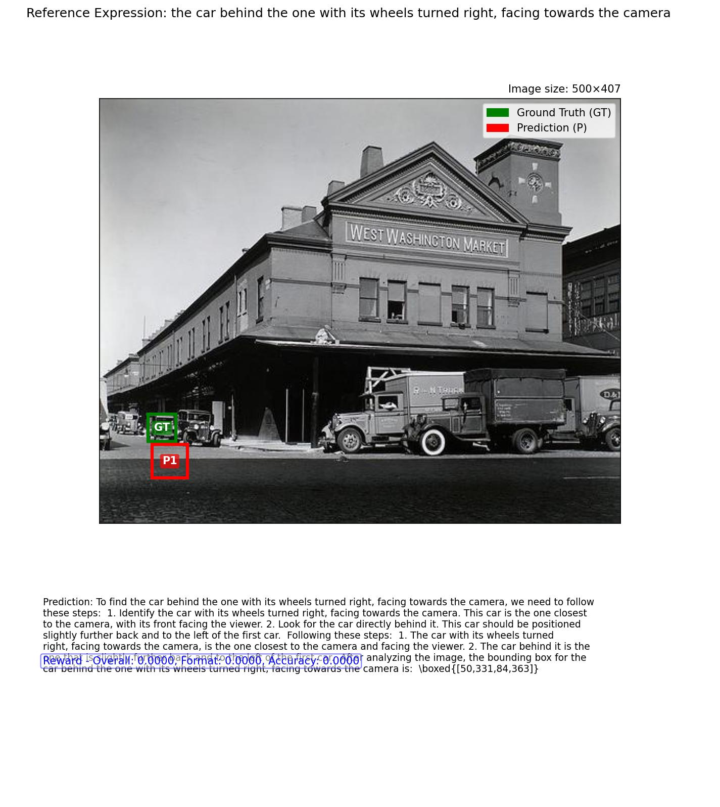

---

### Example 198

**Reference Expression**: the middle hotdog image on the food cart beneath the halal food sign

**Ground Truth**: [[80, 224, 121, 246]]

**Predicted**: [[79, 218, 121, 239]]

**Reward**: {'overall': 0.5260906757912746, 'format': 0.0, 'accuracy': 0.5260906757912746}

**Prediction**:
```
To find the bounding box for 'the middle hotdog image on the food cart beneath the halal food sign', let's follow these steps:

1. Identify the food cart with the 'HALAL FOOD' sign.
2. Locate the area beneath this sign where the hotdog images are displayed.
3. Focus on the middle hotdog image in that sequence.

Step 1: The 'HALAL FOOD' sign is on the left side of the image, above the food cart.
Step 2: Below the 'HALAL FOOD' sign, there are images of food items, including hotdogs.
Step 3: The middle hotdog image is the second hotdog from the left in the sequence of hotdog images.

The bounding box for 'the middle hotdog image on the food cart beneath the halal food sign' is:
\boxed{[79,218,121,239]}
```

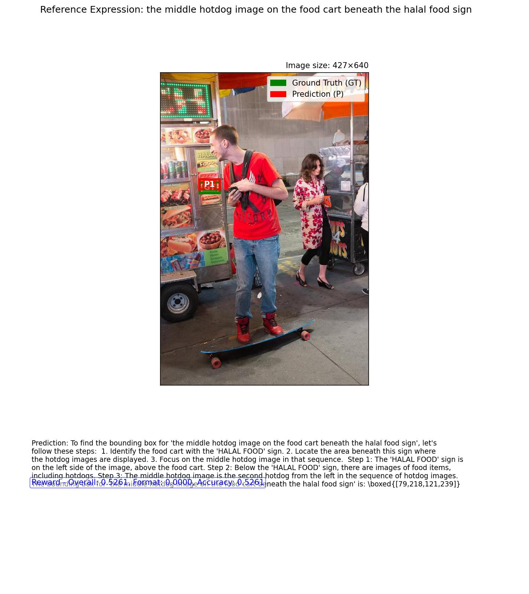

---

### Example 199

**Reference Expression**: the women sitting on the right side of the chair

**Ground Truth**: [[218, 9, 405, 306]]

**Predicted**: [[269, 10, 500, 376]]

**Reward**: {'overall': 0.4032495567420289, 'format': 0.0, 'accuracy': 0.4032495567420289}

**Prediction**:
```
To find the bounding box for 'the women sitting on the right side of the chair', we need to follow these steps:

1. Identify the chair in the image. The chair is the wooden structure with metal legs that the women are sitting on.
2. Determine which women are on the right side of the chair. In this image, the woman on the right side of the chair is the one who is sitting with her back to the camera and has her legs crossed.
3. Define the bounding box for this woman. The bounding box should encompass the area from her head to her legs, including her body and the chair she is sitting on.

Following these steps, the bounding box for the woman sitting on the right side of the chair would be:

\boxed{[269,10,500,376]}

This bounding box captures the woman from her head to her legs, including the chair she is sitting on.
```

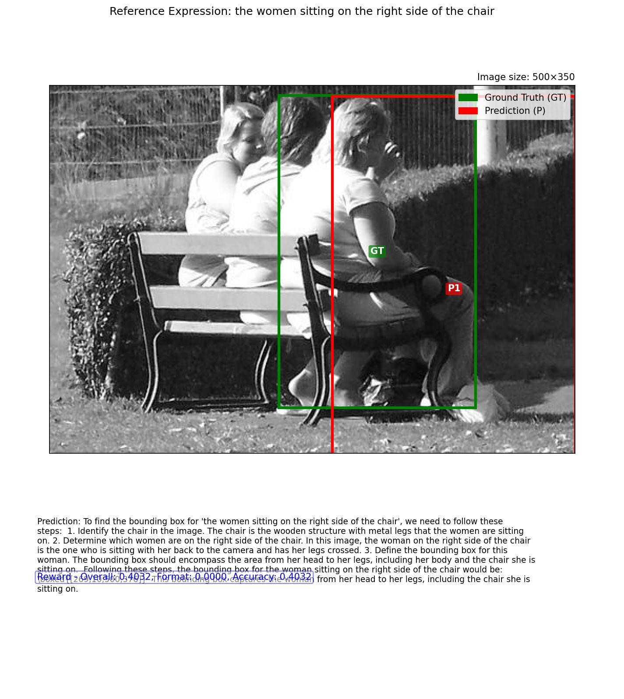

---

### Example 200

**Reference Expression**: the elephant standing on higher terrain behind the person who is not wearing a hat

**Ground Truth**: [[68, 132, 141, 190]]

**Predicted**: [[69, 135, 143, 179]]

**Reward**: {'overall': 0.7329939842665433, 'format': 0.0, 'accuracy': 0.7329939842665433}

**Prediction**:
```
To find the bounding box for 'the elephant standing on higher terrain behind the person who is not wearing a hat', let's follow these steps:

1. Identify the person who is not wearing a hat: This is the person on the left side of the image.
2. Determine the higher terrain: The higher terrain is the area where the elephants are standing, and it appears to be a slightly elevated area in the background.
3. Locate the elephant on this higher terrain: There is an elephant standing on the higher ground behind the person on the left.

The bounding box for this elephant is:
\boxed{[69,135,143,179]}

This bounding box captures the elephant that is standing on higher terrain behind the person who is not wearing a hat.
```

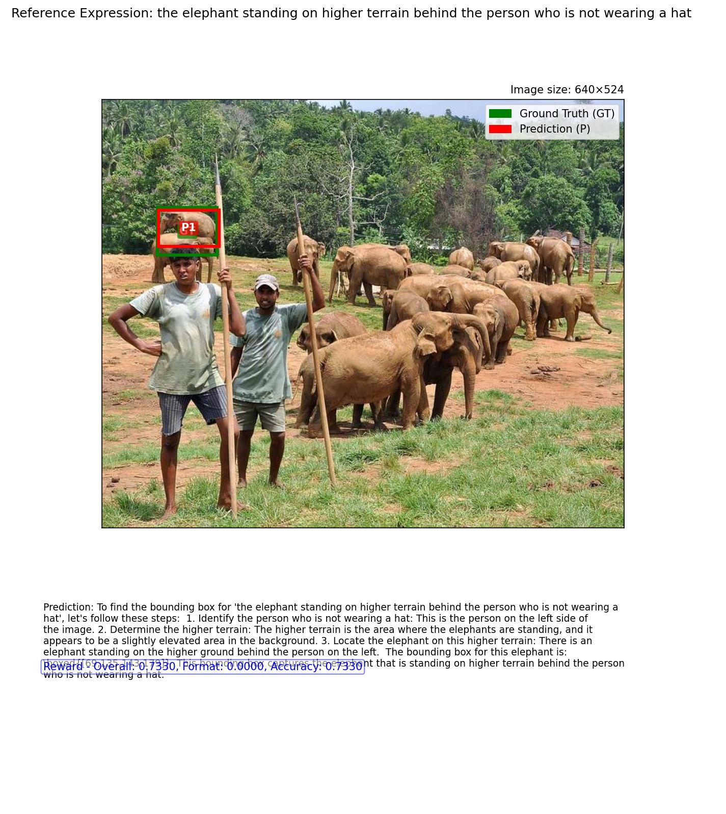

---

### Example 201

**Reference Expression**: the person who is not in a tent, facing away from the camera

**Ground Truth**: [[82, 106, 112, 206]]

**Predicted**: [[0, 123, 36, 556]]

**Reward**: {'overall': 0.0, 'format': 0.0, 'accuracy': 0.0}

**Prediction**:
```
To find the bounding box for 'the person who is not in a tent, facing away from the camera', let's follow these steps:

1. Identify the area outside the tents where people are visible.
2. Look for a person facing away from the camera.
3. The person in the image facing away from the camera is partially visible on the left side of the image, wearing a black outfit.

After analyzing the image, the bounding box for the person who is not in a tent and facing away from the camera would be:

\boxed{[0,123,36,556]}
```

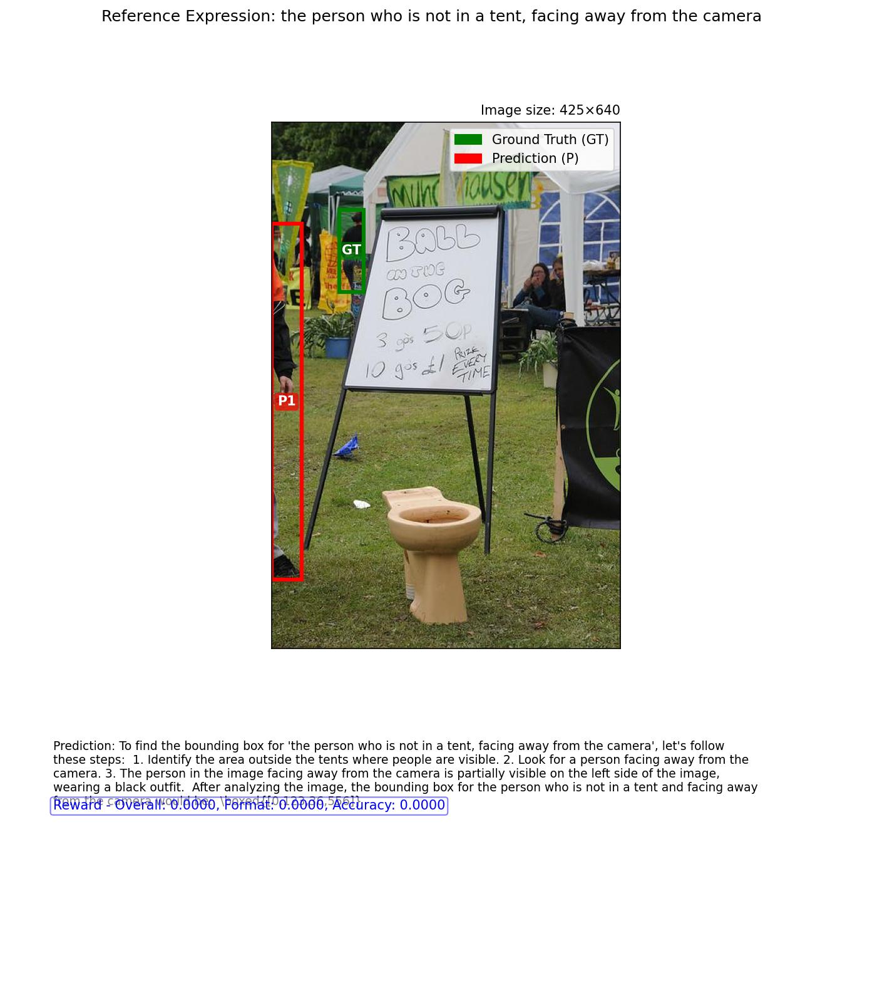

---

### Example 202

**Reference Expression**: the empty plate that is not being used as a lid to cover the pot

**Ground Truth**: [[389, 123, 420, 193]]

**Predicted**: [[342, 261, 483, 319]]

**Reward**: {'overall': 0.0, 'format': 0.0, 'accuracy': 0.0}

**Prediction**:
```
To find the empty plate that is not being used as a lid to cover the pot, follow these steps:

1. Identify the pot with a lid on it. The pot with the lid is on the left side of the stove.
2. Look for a plate that is not being used as a lid. This plate should be on the stove or nearby, and it should not have a pot on top of it.
3. Locate the empty plate on the stove. It is to the right of the pot with the lid and appears to be empty.

The bounding box for the empty plate is:
\boxed{[342,261,483,319]}
```

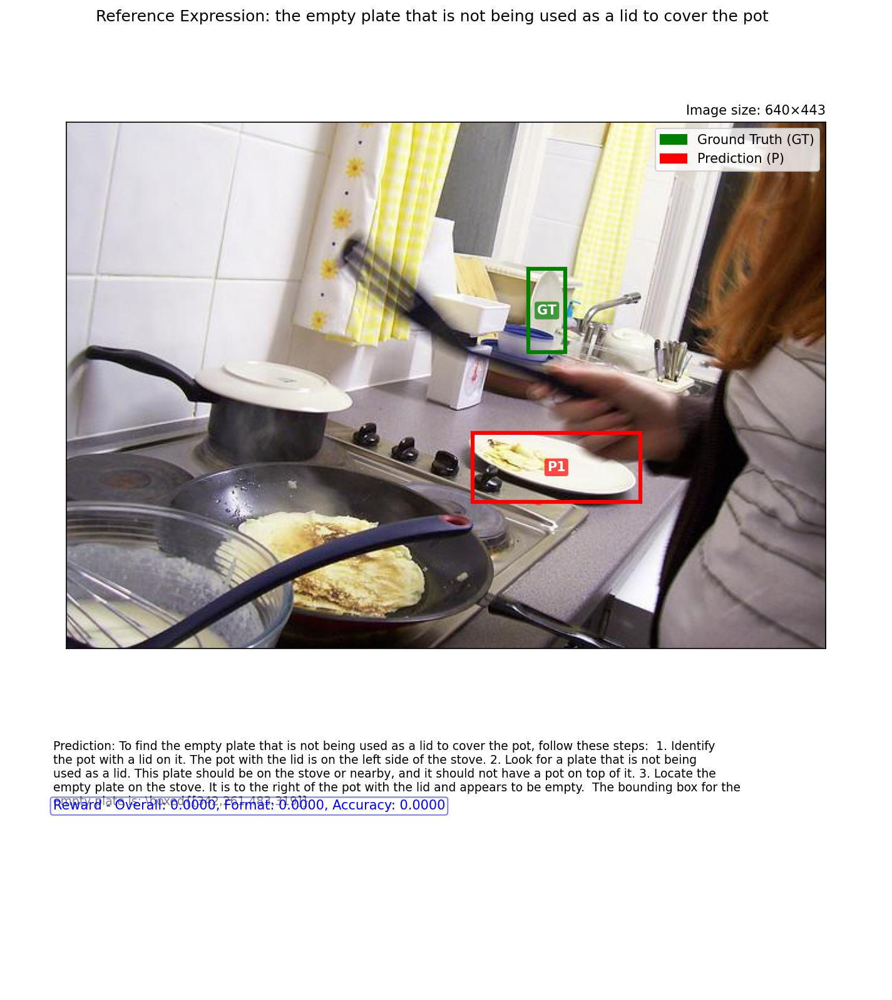

---

### Example 203

**Reference Expression**: the empty bench next to the bench occupied by a person reading a newspaper

**Ground Truth**: [[223, 200, 286, 313]]

**Predicted**: [[262, 249, 333, 378]]

**Reward**: {'overall': 0.10419210419210419, 'format': 0.0, 'accuracy': 0.10419210419210419}

**Prediction**:
```
To find the bounding box for the empty bench next to the bench occupied by a person reading a newspaper, let's follow these steps:

1. Identify the person reading a newspaper: This person is on the left side of the image, sitting on a bench and holding a newspaper.
2. Locate the bench next to the person: The bench next to the person reading a newspaper is the one immediately to their right.
3. Determine the bounding box for the empty bench: The empty bench is the one next to the person on the left side, which is the second bench from the left in the row of benches.

The bounding box for the empty bench next to the bench occupied by the person reading a newspaper is:
\boxed{[262, 249, 333, 378]}
```

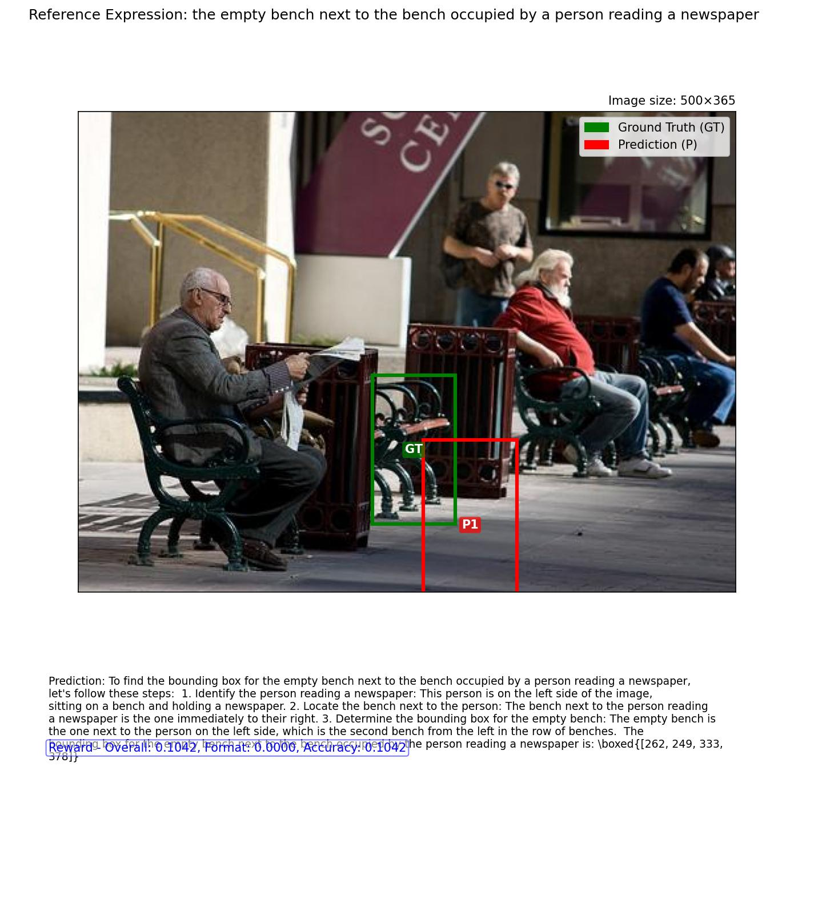

---

### Example 204

**Reference Expression**: the person on the left hand side of the person wearing a hat

**Ground Truth**: [[316, 129, 550, 367]]

**Predicted**: [[25, 0, 267, 368]]

**Reward**: {'overall': 0.0, 'format': 0.0, 'accuracy': 0.0}

**Prediction**:
```
To find the bounding box for the person on the left-hand side of the person wearing a hat, let's follow these steps:

1. Identify the person wearing a hat in the main image. This person is in the upper center of the image.
2. Locate the person to the left of the person wearing the hat. This person is an older individual, likely a man, wearing glasses and a dark jacket.
3. Determine the bounding box for this person. The bounding box should capture the upper body of this person, as they are the focal point on the left side of the image.

The bounding box for the person on the left-hand side of the person wearing a hat is:
\boxed{[25, 0, 267, 368]}
```

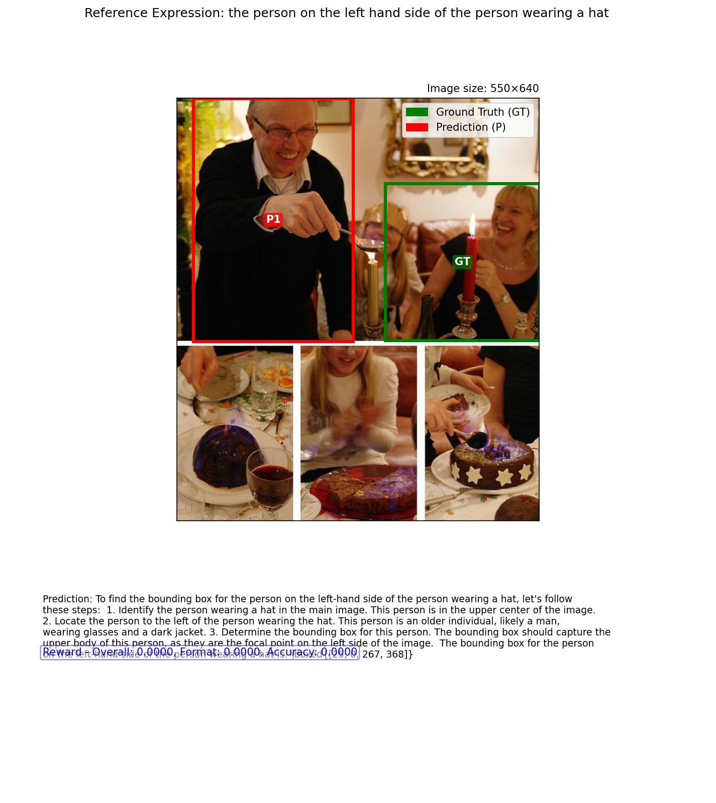

---

### Example 205

**Reference Expression**: the person wearing a hat and not facing the camera

**Ground Truth**: [[70, 127, 131, 161]]

**Predicted**: [[66, 125, 142, 276]]

**Reward**: {'overall': 0.18072499128616243, 'format': 0.0, 'accuracy': 0.18072499128616243}

**Prediction**:
```
To find the bounding box for 'the person wearing a hat and not facing the camera', we need to follow these steps:

1. Identify the area in the image where people are wearing hats.
2. Focus on the person who is not facing the camera and is wearing a hat.
3. Determine the bounding box that encompasses this person.

Upon analyzing the image:
- There is a person wearing a hat in the background, to the left of the main chef.
- This person is not facing the camera, as their back is turned.

The bounding box for this person can be estimated as follows:
- Top-left corner: Just below the hat
- Bottom-left corner: Just above the waist
- Top-right corner: Just above the head
- Bottom-right corner: Just below the waist

Thus, the bounding box for 'the person wearing a hat and not facing the camera' is:
\boxed{[66,125,142,276]}

This bounding box captures the person wearing a hat and is not facing the camera.
```

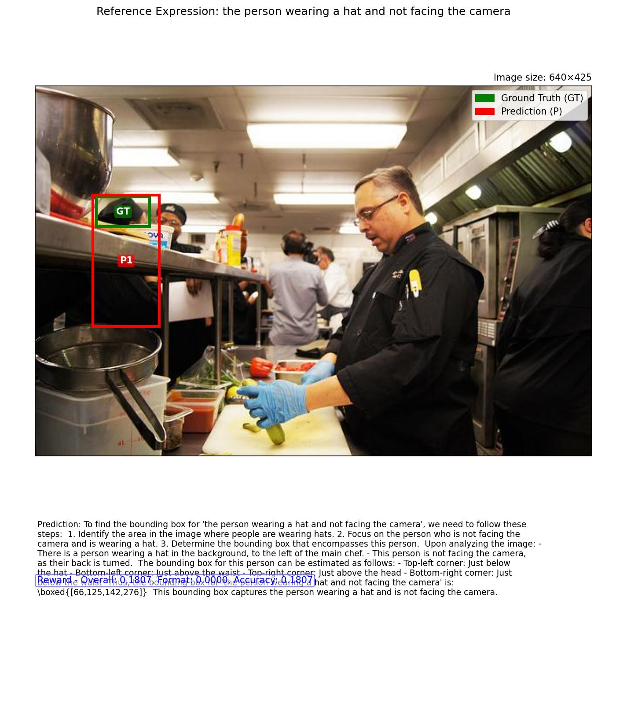

---

### Example 206

**Reference Expression**: the person walking not beneath an umbrella

**Ground Truth**: [[10, 167, 132, 394]]

**Predicted**: [[8, 161, 131, 387]]

**Reward**: {'overall': 1.0, 'format': 0.0, 'accuracy': 1.0}

**Prediction**:
```
To find the bounding box for 'the person walking not beneath an umbrella', let's follow these steps:

1. Identify the umbrella: The umbrella is located on the right side of the image, partially out of the frame. It is yellow and blue, and it appears to be held by someone who is partially obscured by the umbrella and the pole.
2. Identify the person walking: There are two people walking in the image. One is on the left side, and the other is on the right side. The person on the left is walking without an umbrella.
3. Determine the bounding box: The person on the left is walking and not beneath an umbrella. The person on the right is partially obscured by the umbrella.

Based on these observations, the bounding box for 'the person walking not beneath an umbrella' is the one on the left.

\boxed{[8,161,131,387]}
```

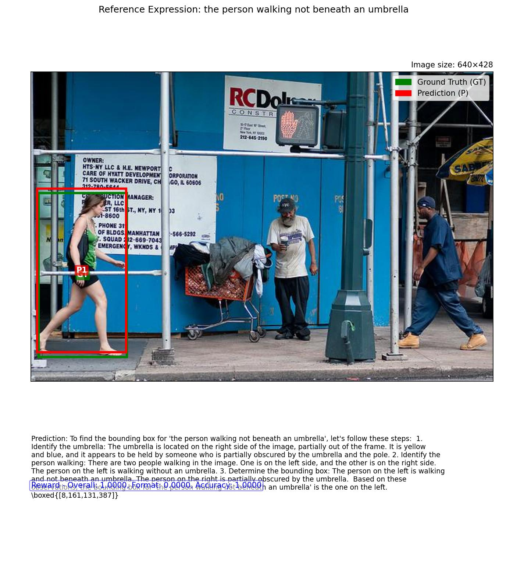

---

### Example 207

**Reference Expression**: the sink not in the mirror and closest to the paper towel dispenser

**Ground Truth**: [[90, 292, 234, 369]]

**Predicted**: [[92, 291, 237, 373]]

**Reward**: {'overall': 1.0, 'format': 0.0, 'accuracy': 1.0}

**Prediction**:
```
To find the sink not in the mirror and closest to the paper towel dispenser, let's follow these steps:

1. Identify the paper towel dispenser: The paper towel dispenser is located on the right side of the image, attached to the wall.
2. Locate the sink closest to this dispenser: The sink closest to the paper towel dispenser is the one on the left side of the image, not reflected in the mirror.
3. Verify the sink is not in the mirror: The sink we've identified is not reflected in the mirror, confirming it's the correct sink.

The bounding box for the sink not in the mirror and closest to the paper towel dispenser is:
\boxed{[92,291,237,373]}
```

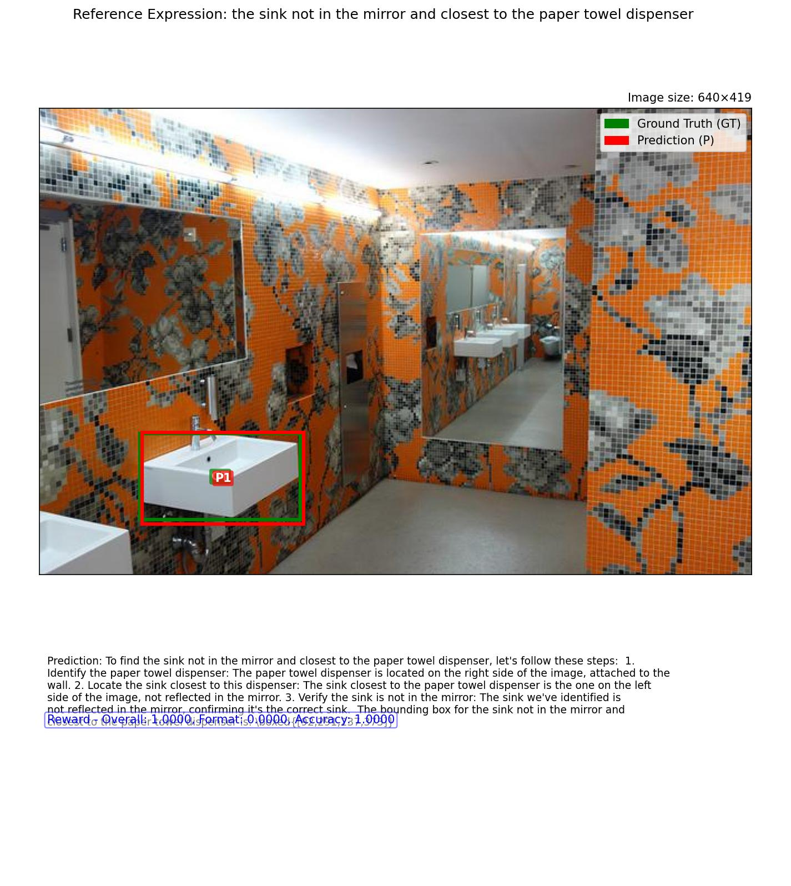

---

### Example 208

**Reference Expression**: the teddy bear held by a person with a hat not facing the camera

**Ground Truth**: [[48, 205, 90, 240]]

**Predicted**: [[56, 255, 125, 311]]

**Reward**: {'overall': 0.0, 'format': 0.0, 'accuracy': 0.0}

**Prediction**:
```
To find the bounding box for 'the teddy bear held by a person with a hat not facing the camera', let's follow these steps:

1. Identify the person with a hat in the image. The person on the left side of the image, wearing a hat and holding a teddy bear, appears to be facing away from the camera.
2. Focus on the teddy bear that this person is holding. The teddy bear is partially obscured by the person's arm, but it is visible enough to identify.
3. Determine the bounding box for the teddy bear. The teddy bear is held close to the person's body, so the bounding box should be relatively small and centered around the teddy bear.

Given these observations, the bounding box for 'the teddy bear held by a person with a hat not facing the camera' would be:

\boxed{[56,255,125,311]}
```

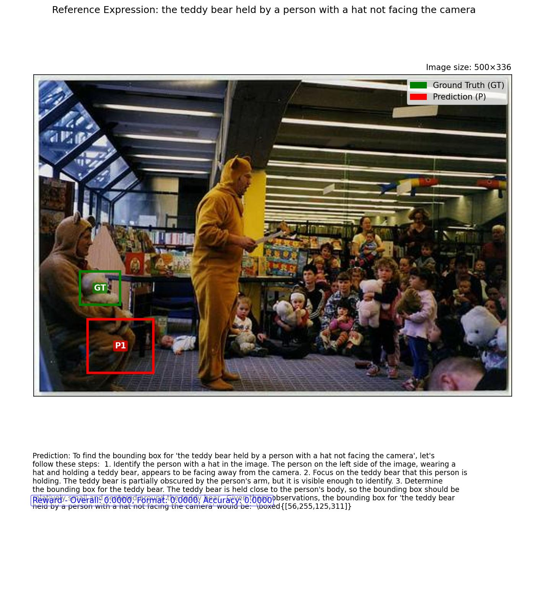

---

### Example 209

**Reference Expression**: the all brown leather suitcase with a tag on it

**Ground Truth**: [[416, 114, 609, 260]]

**Predicted**: [[415, 111, 612, 250]]

**Reward**: {'overall': 0.8954388837717054, 'format': 0.0, 'accuracy': 0.8954388837717054}

**Prediction**:
```
To find the bounding box for 'the all brown leather suitcase with a tag on it', follow these steps:

1. Identify the brown leather suitcases in the image. There are two brown leather suitcases in the image.
2. Determine which one has a tag. The tag is attached to the brown leather suitcase on the far right.
3. Locate the bounding box for the brown leather suitcase with the tag. It is the second suitcase from the right.

The final bounding box for 'the all brown leather suitcase with a tag on it' is:
\boxed{[415,111,612,250]}
```

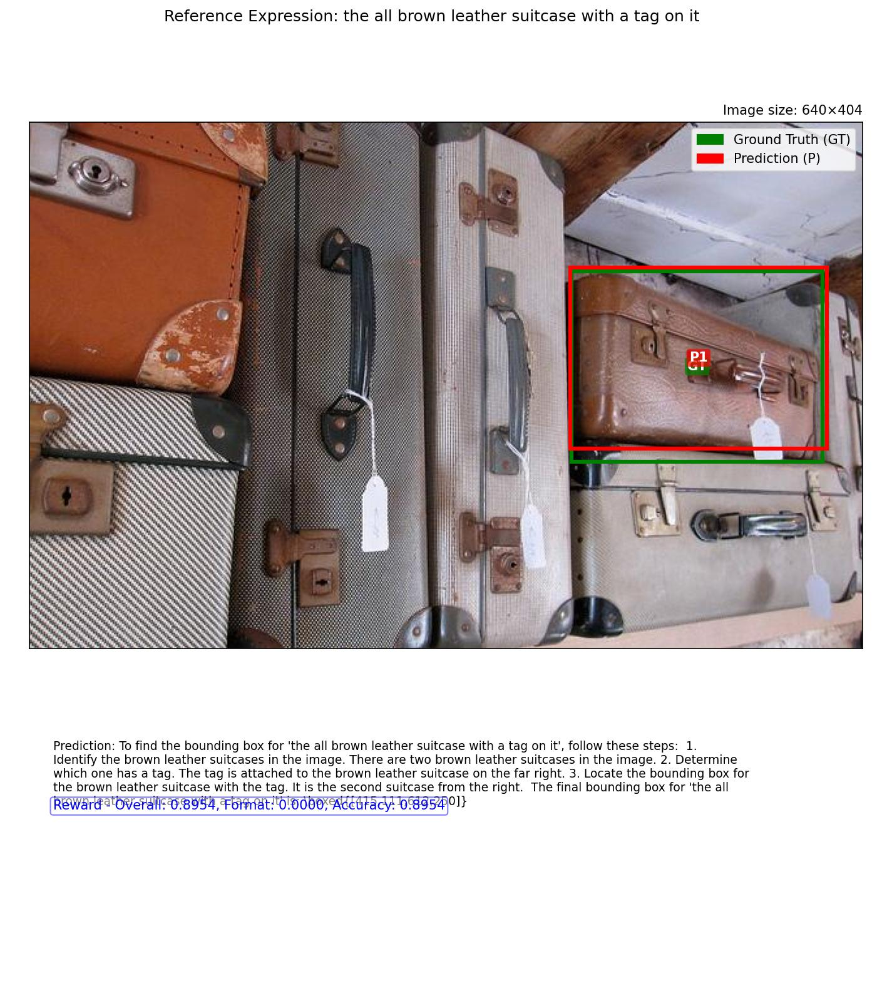

---

### Example 210

**Reference Expression**: the white car closest to a truck

**Ground Truth**: [[306, 387, 396, 426]]

**Predicted**: [[307, 376, 392, 412]]

**Reward**: {'overall': 0.4780652418447694, 'format': 0.0, 'accuracy': 0.4780652418447694}

**Prediction**:
```
To find the white car closest to the truck, let's follow these steps:

1. Identify the truck: The truck is a boxy vehicle with a white sign on the back, located towards the center-left of the image.
2. Look for cars near the truck: The white car is positioned directly to the right of the truck.
3. Compare the positions: The white car is closer to the truck than any other car in the immediate vicinity.

The bounding box for the white car closest to the truck is:
\boxed{[307,376,392,412]}
```

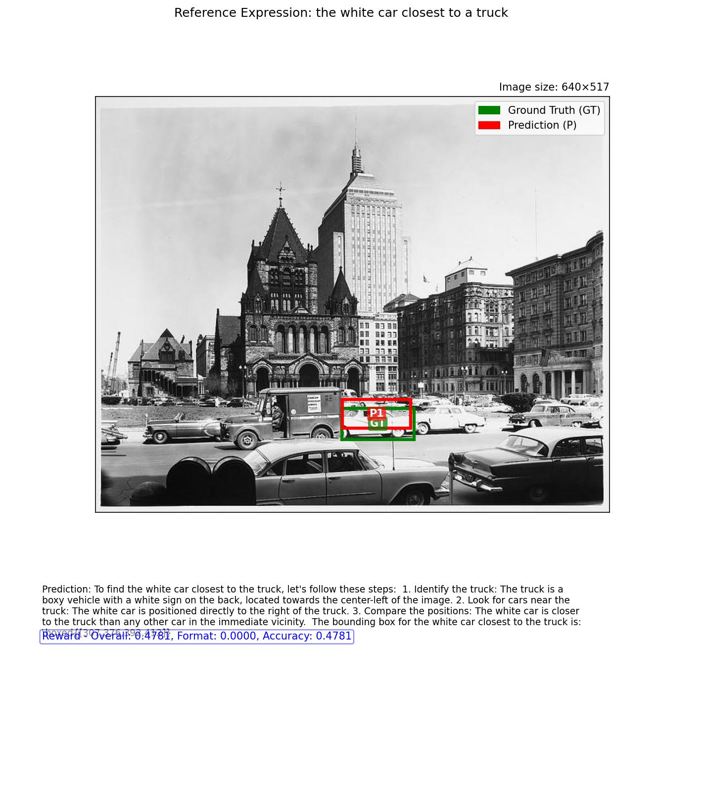

---

### Example 211

**Reference Expression**: the person in blue jacket holding a grey doll

**Ground Truth**: [[143, 254, 259, 635]]

**Predicted**: [[145, 248, 262, 637]]

**Reward**: {'overall': 1.0, 'format': 0.0, 'accuracy': 1.0}

**Prediction**:
```
To find the bounding box for 'the person in blue jacket holding a grey doll', let's follow these steps:

1. Identify the blue jacket: Look for a person wearing a blue jacket.
2. Identify the grey doll: Look for a grey doll being held by someone.
3. Match the person with the doll: Find the person in the blue jacket who is holding the grey doll.

Following these steps:
- A person in a blue jacket is visible in the middle-right part of the image.
- This person is holding a grey doll.

The bounding box for 'the person in blue jacket holding a grey doll' is:
\boxed{[145,248,262,637]}
```

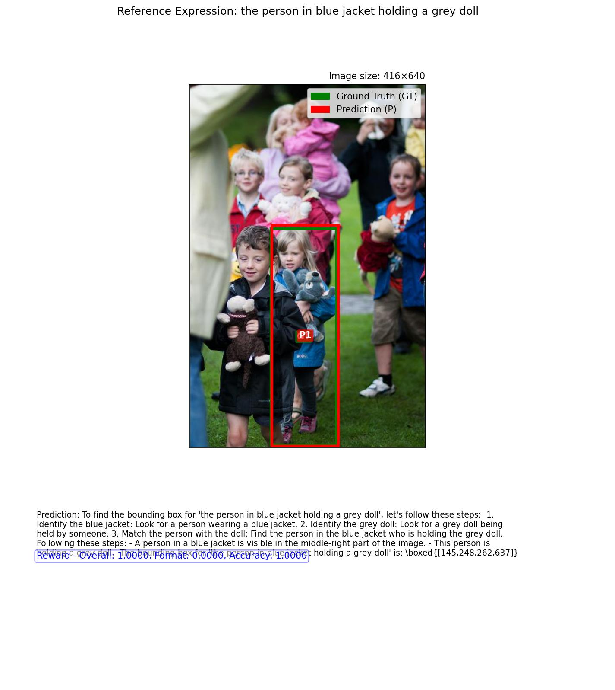

---

### Example 212

**Reference Expression**: the dog facing the camera near a bush

**Ground Truth**: [[169, 183, 202, 213]]

**Predicted**: [[531, 228, 611, 270]]

**Reward**: {'overall': 0.0, 'format': 0.0, 'accuracy': 0.0}

**Prediction**:
```
To find the bounding box for 'the dog facing the camera near a bush', let's follow these steps:

1. Identify the dog in the image: The dog is located near the center-right of the image, partially obscured by the group of sheep.
2. Determine the dog's orientation: The dog appears to be facing the camera, as its head is turned towards the viewer.
3. Locate the dog near a bush: The dog is near a bush, which is visible in the lower left part of the image.
4. Define the bounding box: The bounding box should encompass the dog and part of the bush it is near.

Given these observations, the bounding box for the dog facing the camera near a bush would be:
\boxed{[531,228,611,270]}

This bounding box captures the dog and part of the surrounding area, including the bush.
```

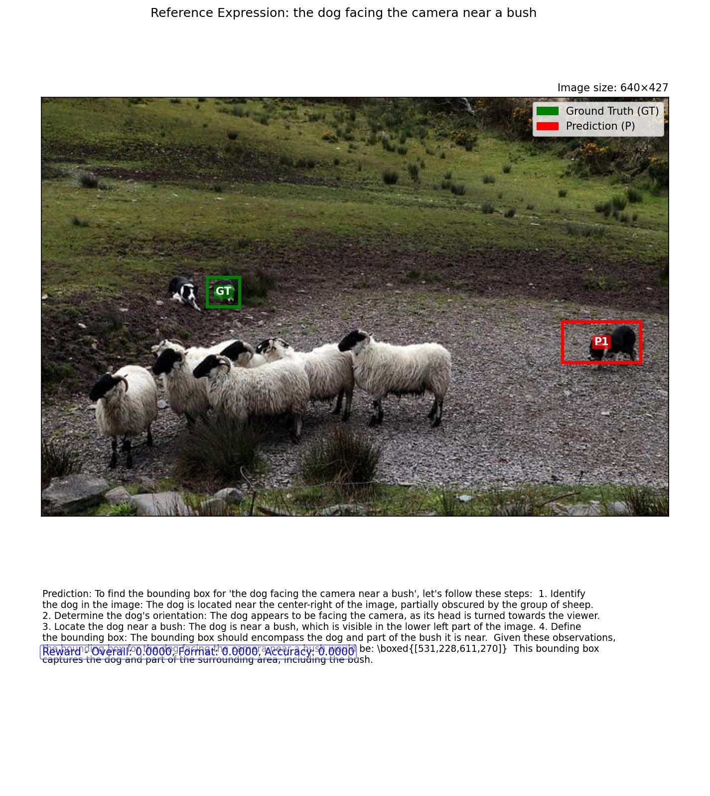

---

### Example 213

**Reference Expression**: the person sitting with a hat

**Ground Truth**: [[411, 278, 548, 426]]

**Predicted**: [[414, 273, 551, 428]]

**Reward**: {'overall': 1.0, 'format': 0.0, 'accuracy': 1.0}

**Prediction**:
```
To find the bounding box for 'the person sitting with a hat', let's follow these steps:

1. Identify the person sitting: Look for a person seated in the image. There are two individuals seated, one on the left and one on the right.
2. Identify the hat: The person on the right is wearing a hat, which is a key identifying feature.
3. Locate the bounding box: The person with the hat is on the right side of the image, seated and looking towards the left.

Based on these observations, the bounding box for 'the person sitting with a hat' is:

\boxed{[414,273,551,428]}
```

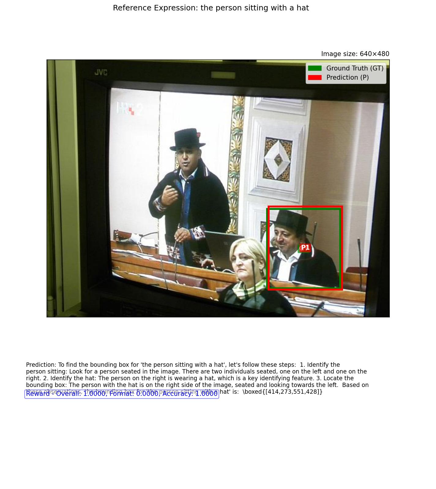

---

### Example 214

**Reference Expression**: a white car driving past a black car

**Ground Truth**: [[265, 235, 375, 303]]

**Predicted**: [[267, 225, 375, 299]]

**Reward**: {'overall': 0.8074766355140187, 'format': 0.0, 'accuracy': 0.8074766355140187}

**Prediction**:
```
To find the bounding box for 'a white car driving past a black car', let's follow these steps:

1. Identify the black car: It is located in the middle of the image, slightly to the left.
2. Identify the white car: It is located to the right of the black car and appears to be moving past it.
3. Ensure the white car is driving past the black car: The white car is positioned behind the black car and is moving in the same direction, indicating it is driving past it.

Now, let's pinpoint the bounding box for the white car:
- The white car is partially visible, so we need to include its full body.
- The car's bounding box should start from the front and extend to the back, covering the entire car.

The bounding box for the white car driving past the black car is:
\boxed{[267,225,375,299]}

This bounding box captures the white car as it moves past the black car.
```

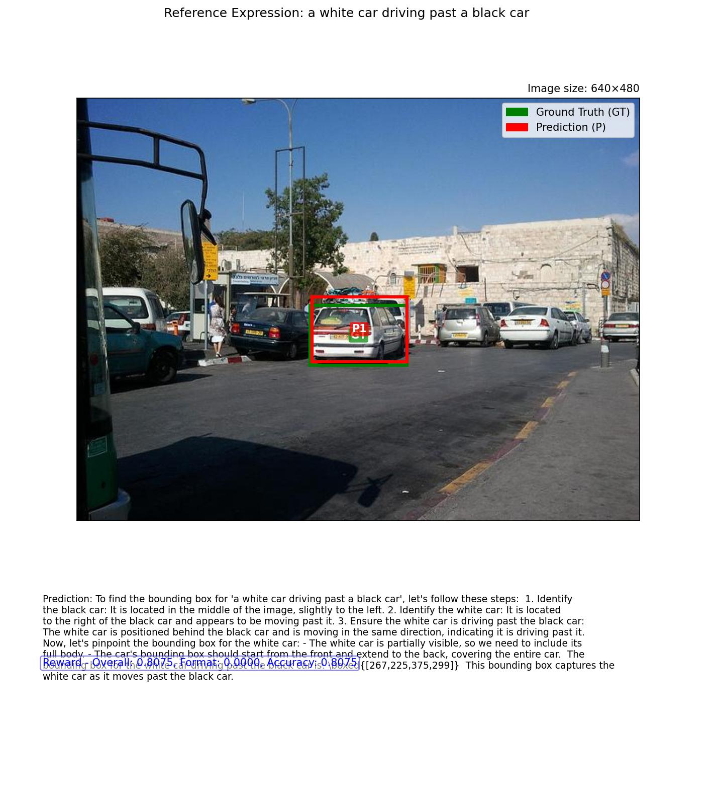

---

### Example 215

**Reference Expression**: the person wearing a white hat looking towards the camera

**Ground Truth**: [[377, 11, 418, 45]]

**Predicted**: [[427, 24, 470, 60]]

**Reward**: {'overall': 0.0, 'format': 0.0, 'accuracy': 0.0}

**Prediction**:
```
To find the bounding box for 'the person wearing a white hat looking towards the camera', follow these steps:

1. Identify the person wearing a white hat: Look for a person on the top deck of the bus who is facing the camera and wearing a white hat.
2. Locate the person: After scanning the top deck, identify the individual who fits this description.
3. Define the bounding box: Once identified, draw a bounding box around this person.

After following these steps, the bounding box for the person wearing a white hat looking towards the camera is:

\boxed{[427,24,470,60]}
```

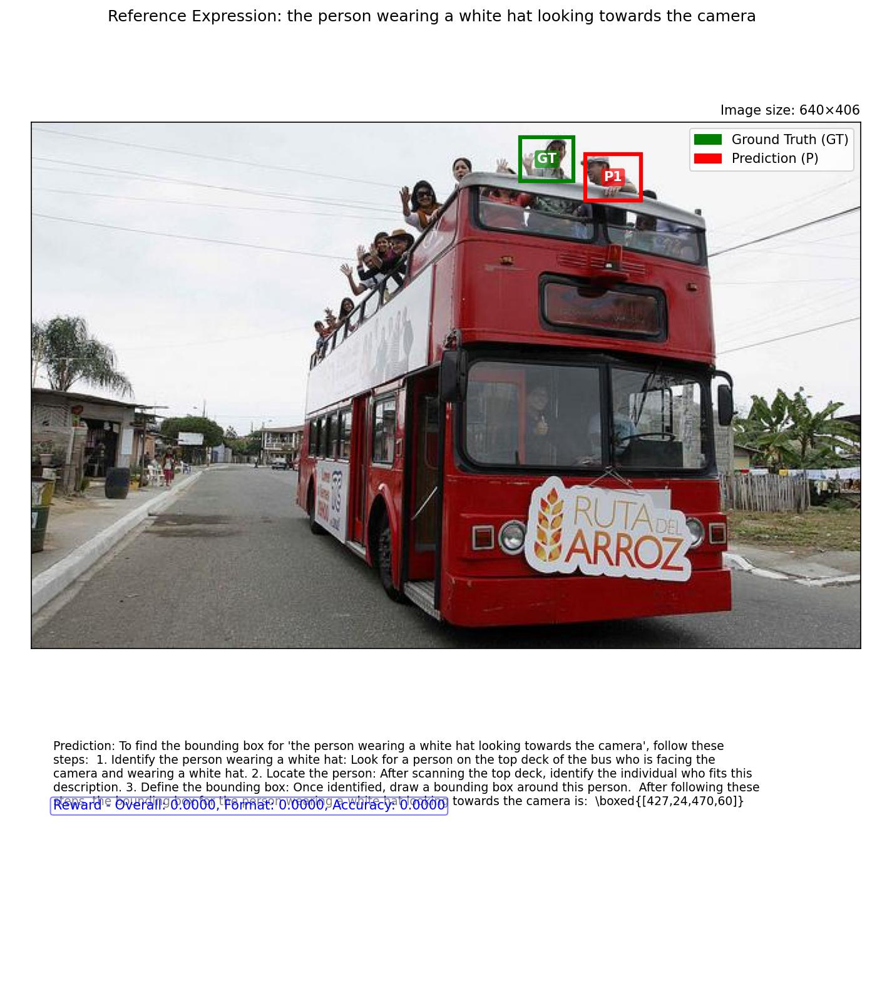

---

### Example 216

**Reference Expression**: the person wearing a white cowboy hat on the right hand side of a person in a red top

**Ground Truth**: [[228, 102, 300, 251]]

**Predicted**: [[238, 100, 296, 251]]

**Reward**: {'overall': 0.7969383991147179, 'format': 0.0, 'accuracy': 0.7969383991147179}

**Prediction**:
```
To find the bounding box for 'the person wearing a white cowboy hat on the right hand side of a person in a red top', we need to follow these steps:

1. Identify the person in a red top.
2. Locate the person to the right of the person in a red top.
3. Check if this person is wearing a white cowboy hat.
4. Provide the bounding box for this person.

- First, identify the person in a red top. This person is wearing a red shirt and is positioned in the center of the image.
- Next, look to the right of this person. There is a person wearing a white cowboy hat.
- The bounding box for the person wearing a white cowboy hat on the right hand side of a person in a red top is [238,100,296,251].

Thus, the bounding box is \boxed{[238,100,296,251]}.
```

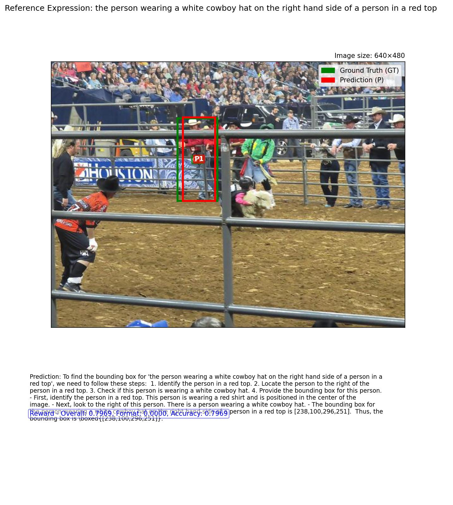

---

### Example 217

**Reference Expression**: the person wearing sunglasses riding a motorbike without a McDonald’s sign on it

**Ground Truth**: [[378, 231, 473, 475]]

**Predicted**: [[346, 226, 475, 486]]

**Reward**: {'overall': 0.6911150864639237, 'format': 0.0, 'accuracy': 0.6911150864639237}

**Prediction**:
```
To find the bounding box for 'the person wearing sunglasses riding a motorbike without a McDonald’s sign on it', let's follow these steps:

1. Identify the main elements in the image: the red motorcycle with a McDonald’s sign, the person on it, and the other motorcyclists.
2. Focus on the person wearing sunglasses: This individual is on the right side of the image, riding a motorbike that does not have a McDonald’s sign.
3. Observe the motorbike: The motorbike the person wearing sunglasses is riding has a different design compared to the red motorcycle with the McDonald’s sign.
4. Locate the bounding box: The bounding box should encompass the person and their motorbike, ensuring it does not include the red motorcycle or any other motorcyclist.

After analyzing the image, the bounding box for 'the person wearing sunglasses riding a motorbike without a McDonald’s sign on it' is:

\boxed{[346,226,475,486]}

This bounding box includes the person wearing sunglasses and their motorbike, excluding the red motorcycle with the McDonald’s sign.
```

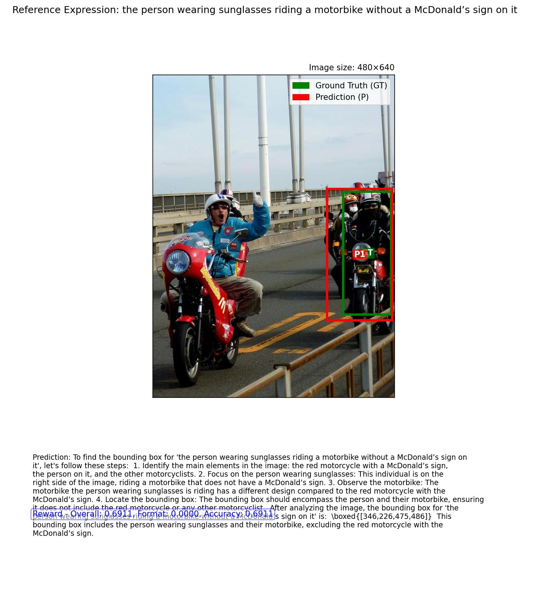

---

### Example 218

**Reference Expression**: the person wearing a black top not facing the camera

**Ground Truth**: [[491, 56, 519, 163]]

**Predicted**: [[493, 52, 520, 164]]

**Reward**: {'overall': 0.8591723285978999, 'format': 0.0, 'accuracy': 0.8591723285978999}

**Prediction**:
```
To find the bounding box for 'the person wearing a black top not facing the camera', let's analyze the image step-by-step:

1. Identify the motorcycle and rider in the foreground.
2. Look for people in the background who are not facing the camera.
3. Focus on the area near the fence where people are standing.

After analyzing the image, the person wearing a black top and not facing the camera is located near the fence on the right side of the image. The bounding box for this person is:

\boxed{[493, 52, 520, 164]}
```

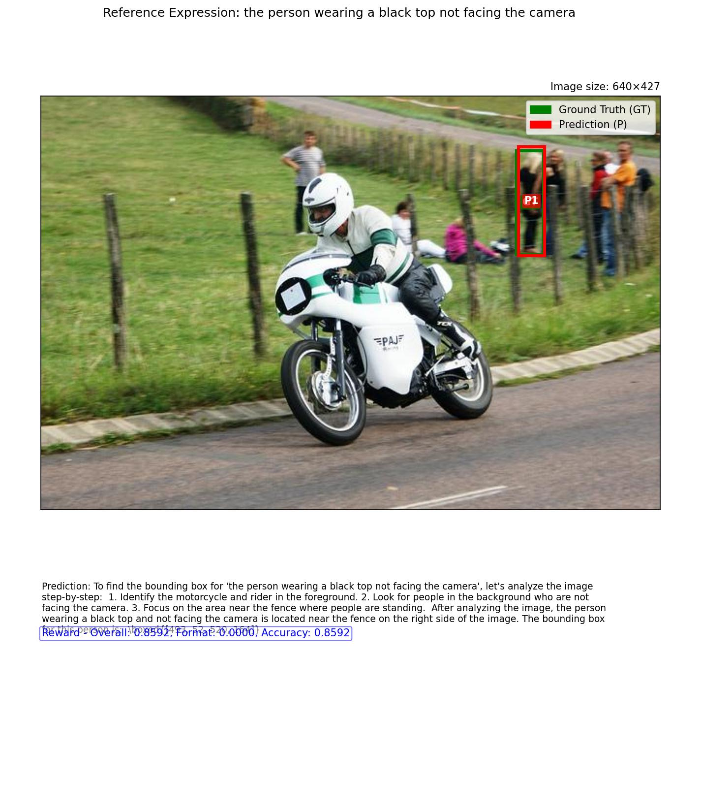

---

### Example 219

**Reference Expression**: the person with long hair sitting right by the bar

**Ground Truth**: [[390, 154, 448, 237]]

**Predicted**: [[439, 142, 524, 279]]

**Reward**: {'overall': 0.0, 'format': 0.0, 'accuracy': 0.0}

**Prediction**:
```
To find the bounding box for 'the person with long hair sitting right by the bar', let's follow these steps:

1. Identify the bar area in the image, which is the section with the counter and bottles of alcohol.
2. Look for the person with long hair sitting near the bar. This person is positioned on the right side of the bar, facing away from the camera.
3. The bounding box should encompass this person from the head to the waist, as this is the most common way to define a person in an image.

After analyzing the image, the bounding box for 'the person with long hair sitting right by the bar' is:
\boxed{[439, 142, 524, 279]}
```

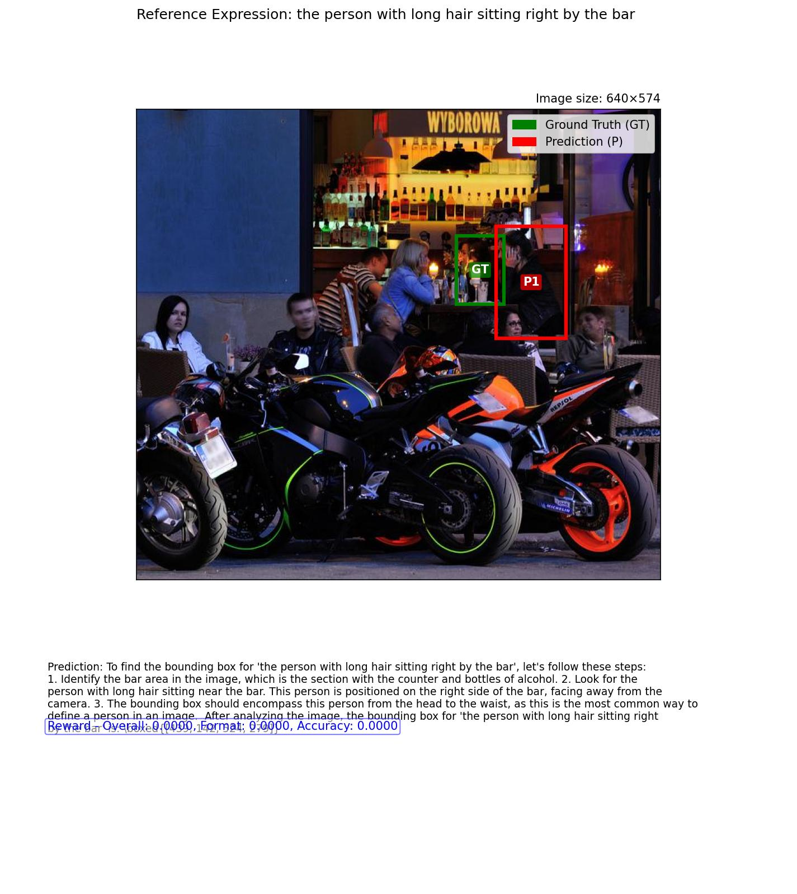

---

### Example 220

**Reference Expression**: the person wearing a white top facing away from the camera

**Ground Truth**: [[202, 174, 217, 214]]

**Predicted**: [[28, 139, 61, 245]]

**Reward**: {'overall': 0.0, 'format': 0.0, 'accuracy': 0.0}

**Prediction**:
```
To find the bounding box for 'the person wearing a white top facing away from the camera', let's follow these steps:

1. Identify the location where the person is facing away from the camera. This person is likely near the edge of the image, possibly in the background.
2. Look for a person wearing a white top. This person should be facing away from the camera, which means their back is towards us.
3. Among the people in the background, there is a person wearing a white top who is facing away from the camera.

The bounding box for this person is:
\boxed{[28,139,61,245]}
```

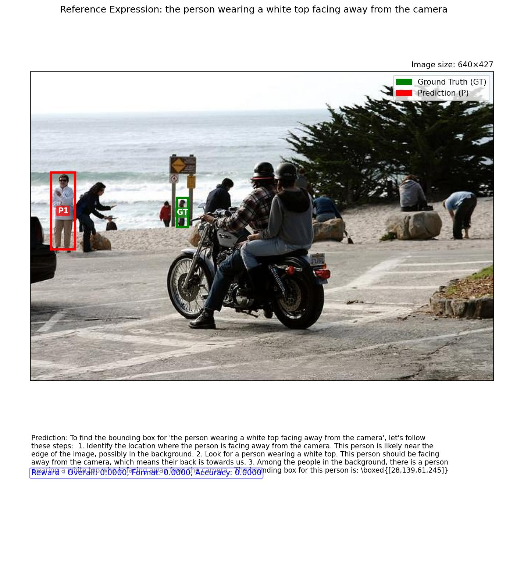

---

### Example 221

**Reference Expression**: the person near a person holding a phone

**Ground Truth**: [[184, 182, 233, 333]]

**Predicted**: [[230, 191, 291, 342]]

**Reward**: {'overall': 0.0, 'format': 0.0, 'accuracy': 0.0}

**Prediction**:
```
To find the bounding box for 'the person near a person holding a phone', we need to follow these steps:

1. Identify the person holding a phone.
2. Locate the person near the person holding the phone.
3. Define the bounding box for that person.

Step 1: Identify the person holding a phone.
- The person holding a phone appears to be the individual on the left side of the image, wearing a light blue shirt and a cap.

Step 2: Locate the person near the person holding the phone.
- The person near the person holding the phone is the individual to the right of the person in the light blue shirt. This person is wearing a white shirt and a cap.

Step 3: Define the bounding box for that person.
- The bounding box for the person near the person holding the phone is [230, 191, 291, 342].

\boxed{[230, 191, 291, 342]}
```

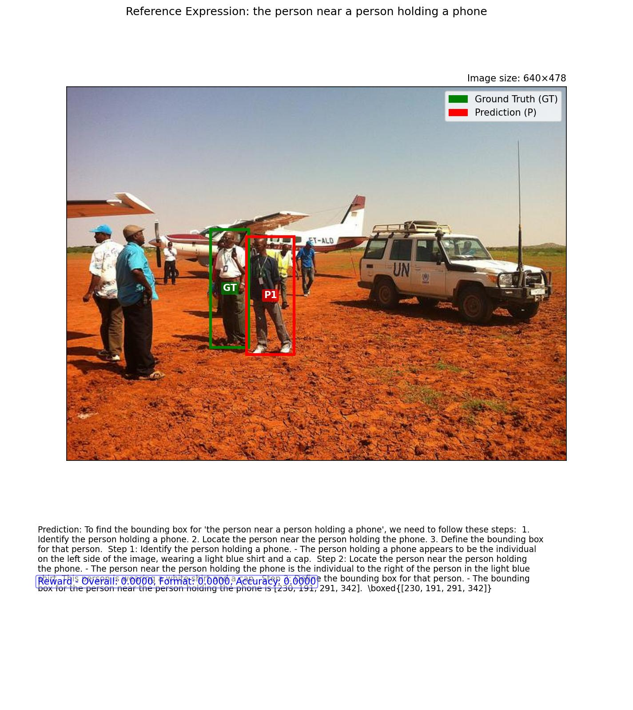

---

### Example 222

**Reference Expression**: the person wearing a grey hat facing away from the camera

**Ground Truth**: [[583, 321, 622, 449]]

**Predicted**: [[583, 318, 622, 444]]

**Reward**: {'overall': 1.0, 'format': 0.0, 'accuracy': 1.0}

**Prediction**:
```
To find the bounding box for 'the person wearing a grey hat facing away from the camera', let's follow these steps:

1. Identify the general area where people are walking and where the person in question might be located.
2. Look for a person wearing a grey hat and facing away from the camera.
3. Observe the background and foreground to ensure you have the correct person.

After analyzing the image:
- There is a person wearing a grey hat in the background, slightly to the right of the center.
- This person is facing away from the camera, which matches the description.

The bounding box for 'the person wearing a grey hat facing away from the camera' is:
\boxed{[583,318,622,444]}
```

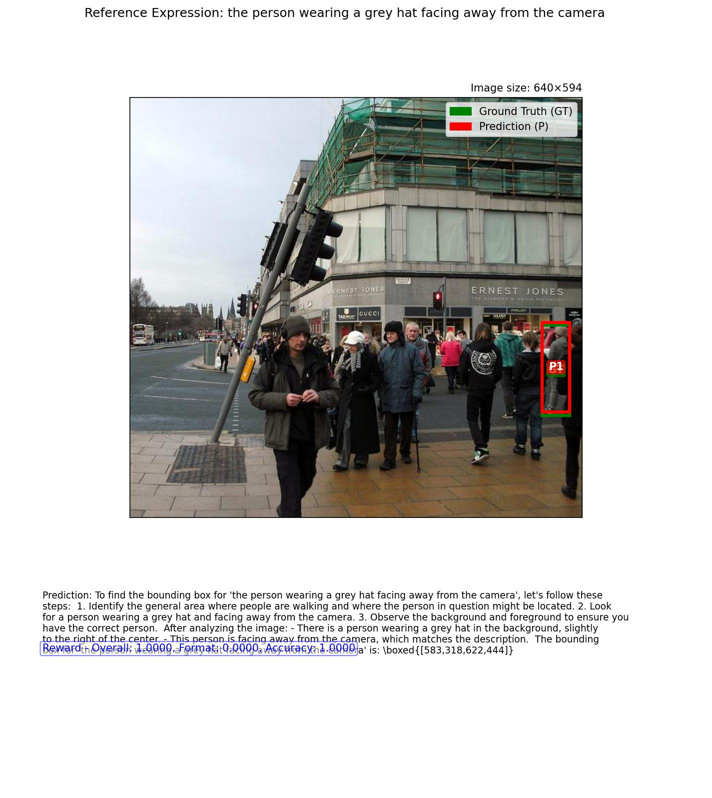

---

### Example 223

**Reference Expression**: the person in a blue top near the window

**Ground Truth**: [[216, 135, 274, 242]]

**Predicted**: [[10, 52, 244, 476]]

**Reward**: {'overall': 0.0, 'format': 0.0, 'accuracy': 0.0}

**Prediction**:
```
To find the bounding box for 'the person in a blue top near the window', let's follow these steps:

1. Identify the window area: The window is on the left side of the image.
2. Locate the person in a blue top: The person wearing a blue top is standing near the window.
3. Determine the bounding box: The person in the blue top is on the left side of the image, and they appear to be standing next to the window.

The bounding box for 'the person in a blue top near the window' would be:
\boxed{[10,52,244,476]}

This box captures the person in the blue top near the window.
```

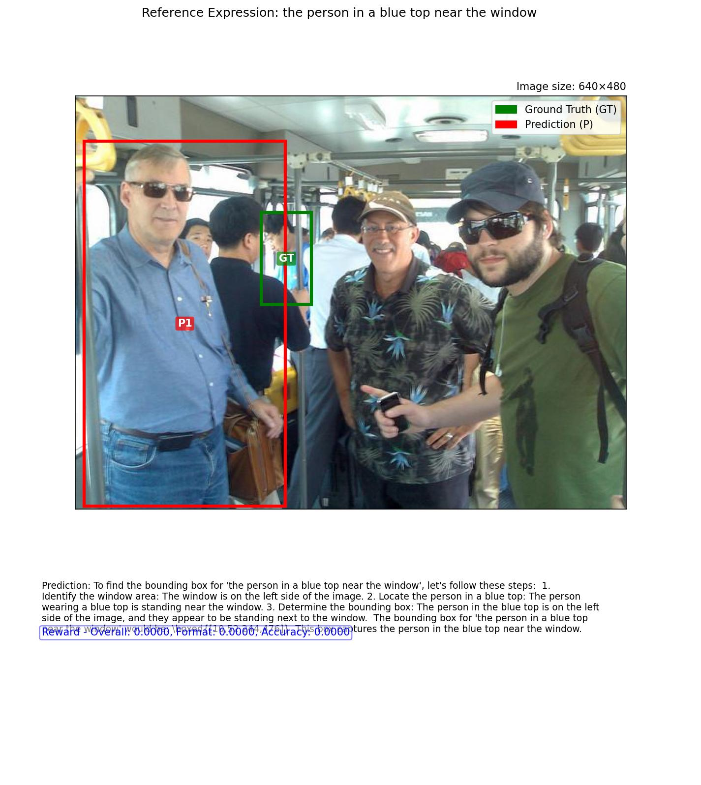

---

### Example 224

**Reference Expression**: the person in a black top near a car

**Ground Truth**: [[333, 176, 355, 229]]

**Predicted**: [[159, 184, 195, 293]]

**Reward**: {'overall': 0.0, 'format': 0.0, 'accuracy': 0.0}

**Prediction**:
```
To find the bounding box for 'the person in a black top near a car', let's follow these steps:

1. Identify the car: Look for a car in the image and determine the area near it.
2. Identify the person: Look for a person standing near the car.
3. Determine the black top: Ensure the person is wearing a black top.

- The car is on the left side of the image.
- Near the car, there is a person wearing a black top.
- The person is standing close to the car, and their position is distinct from the others.

After analyzing the image, the bounding box for 'the person in a black top near a car' is:

\boxed{[159,184,195,293]}
```

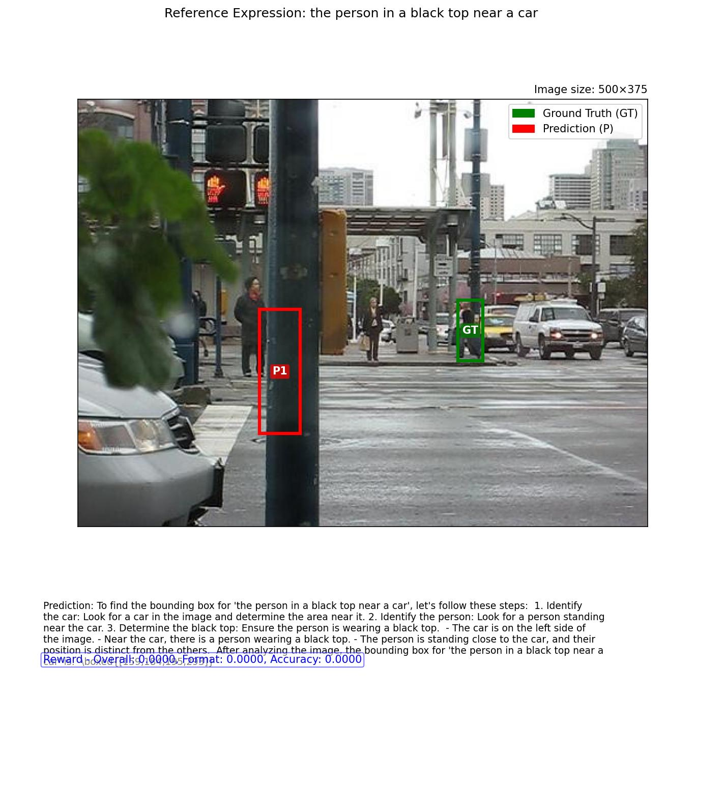

---

### Example 225

**Reference Expression**: the person wearing white walking in front of a car

**Ground Truth**: [[12, 185, 26, 217]]

**Predicted**: [[209, 185, 230, 266]]

**Reward**: {'overall': 0.0, 'format': 0.0, 'accuracy': 0.0}

**Prediction**:
```
To find the bounding box for 'the person wearing white walking in front of a car', follow these steps:

1. Identify the car in the image: It's a black car on the left side of the image.
2. Look for a person walking in front of the car: There is a person in white walking on the sidewalk in front of the car.
3. Determine the bounding box: The person in white is located to the right of the car, and they are walking along the sidewalk.

After analyzing these steps, the bounding box for 'the person wearing white walking in front of a car' is:

\boxed{[209,185,230,266]}
```

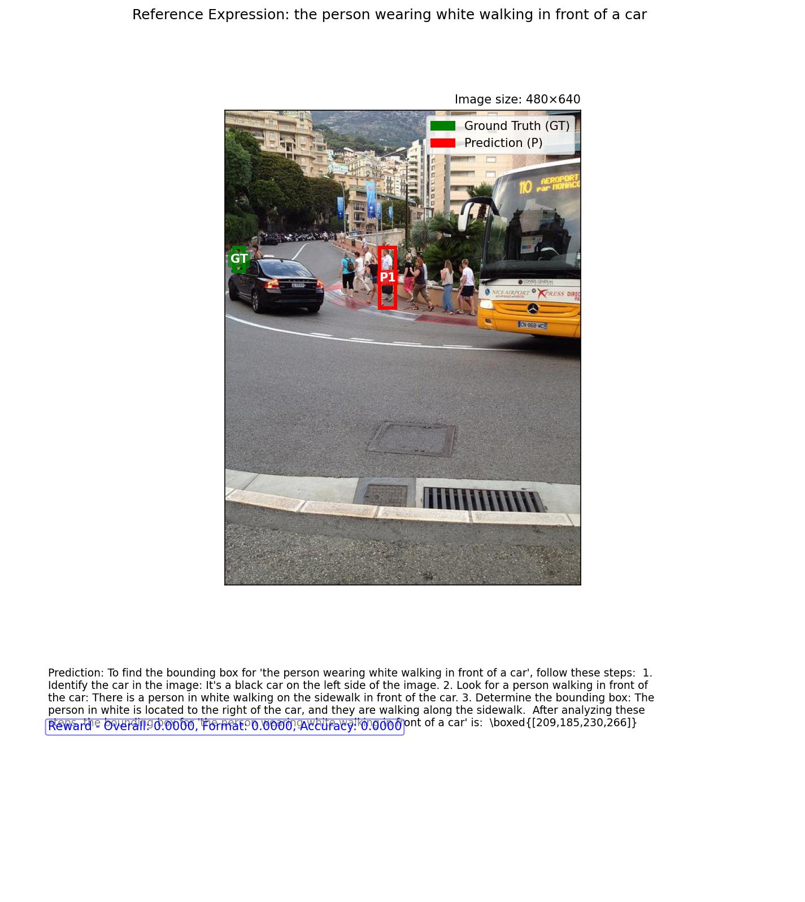

---

### Example 226

**Reference Expression**: the handbag held by a person not with black hair behind the giraffe costume

**Ground Truth**: [[75, 337, 120, 427]]

**Predicted**: []

**Reward**: {'overall': 0.0, 'format': 0.0, 'accuracy': 0.0}

**Prediction**:
```
To find the bounding box for the handbag held by a person not with black hair behind the giraffe costume, let's follow these steps:

1. Identify the giraffe costume: The giraffe costume is the tall, spotted figure in the center of the image.
2. Locate the person with black hair behind the giraffe: The person with black hair appears to be standing to the left of the giraffe and is holding a handbag.
3. Identify the handbag: The handbag is being held by the person with black hair and is positioned near their waist.

Based on these observations, the bounding box for the handbag held by a person not with black hair behind the giraffe costume is not directly identifiable because there is no one with black hair behind the giraffe. The bounding box would be empty in this case.

\boxed{}
```

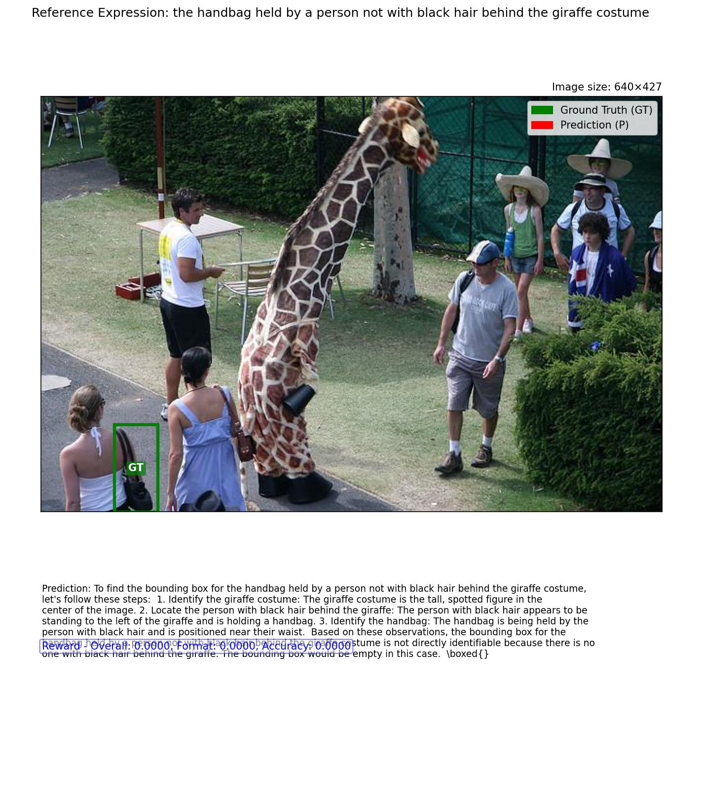

---

### Example 227

**Reference Expression**: the grey car on the left side of a red car

**Ground Truth**: [[50, 330, 130, 385]]

**Predicted**: [[50, 322, 127, 379]]

**Reward**: {'overall': 0.7521929824561403, 'format': 0.0, 'accuracy': 0.7521929824561403}

**Prediction**:
```
To find the bounding box for 'the grey car on the left side of a red car', let's follow these steps:

1. Identify the red car: It is located in the middle of the image, closer to the center of the road.
2. Look for the grey car to the left of the red car: The grey car is positioned to the left of the red car and is further back in the lane.

Following these steps, the bounding box for the grey car on the left side of the red car would be:

\boxed{[50,322,127,379]}
```

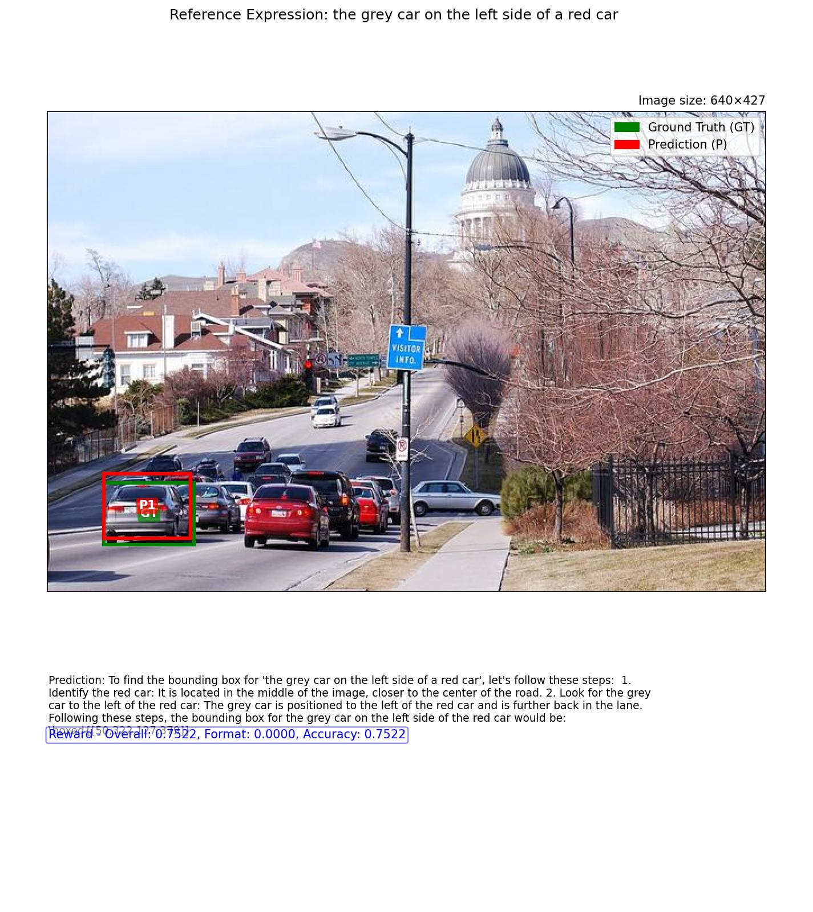

---

### Example 228

**Reference Expression**: the person wearing grey walking into an underpass

**Ground Truth**: [[428, 321, 450, 415]]

**Predicted**: [[358, 320, 399, 440]]

**Reward**: {'overall': 0.0, 'format': 0.0, 'accuracy': 0.0}

**Prediction**:
```
To find the bounding box for 'the person wearing grey walking into an underpass', let's follow these steps:

1. Identify the underpass: The underpass is the area where the traffic lights are located, which is a structure that appears to be partially covered with a white roof.
2. Look for a person wearing grey: In the underpass area, there is a person wearing grey who appears to be walking in that direction.
3. Determine the bounding box: The person wearing grey is located near the middle of the underpass, slightly to the left of the traffic lights.

Given these observations, the bounding box for 'the person wearing grey walking into an underpass' would be:

\boxed{[358,320,399,440]}

This bounding box captures the person wearing grey, who is walking into the underpass.
```

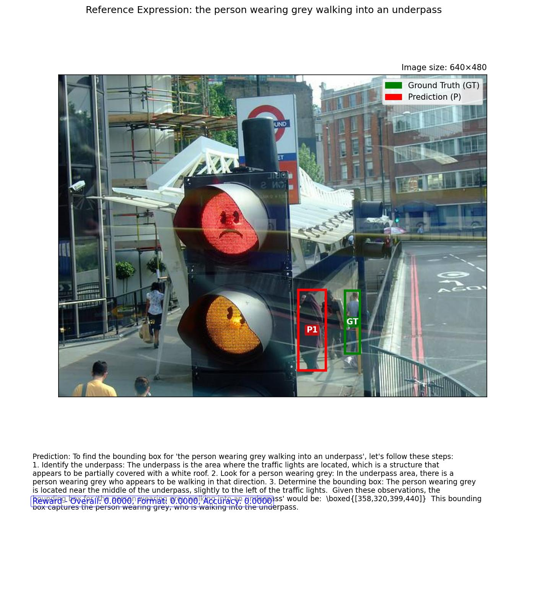

---

### Example 229

**Reference Expression**: the black car behind a white car

**Ground Truth**: [[359, 339, 427, 543]]

**Predicted**: [[259, 330, 331, 459]]

**Reward**: {'overall': 0.0, 'format': 0.0, 'accuracy': 0.0}

**Prediction**:
```
To find the bounding box for 'the black car behind a white car', let's follow these steps:

1. Identify the white car: Look for a white vehicle in the image.
2. Identify the black car behind the white car: Find the black car that is positioned directly behind the white car.
3. Define the bounding box: Once the black car is identified, outline its boundaries.

Following these steps:
- The white car is located towards the right side of the image, near the center.
- The black car behind the white car is located just to the left of the white car.
- The black car is clearly visible and distinct from the white car.

After identifying the black car, the bounding box for 'the black car behind a white car' is:
\boxed{[259,330,331,459]}
```

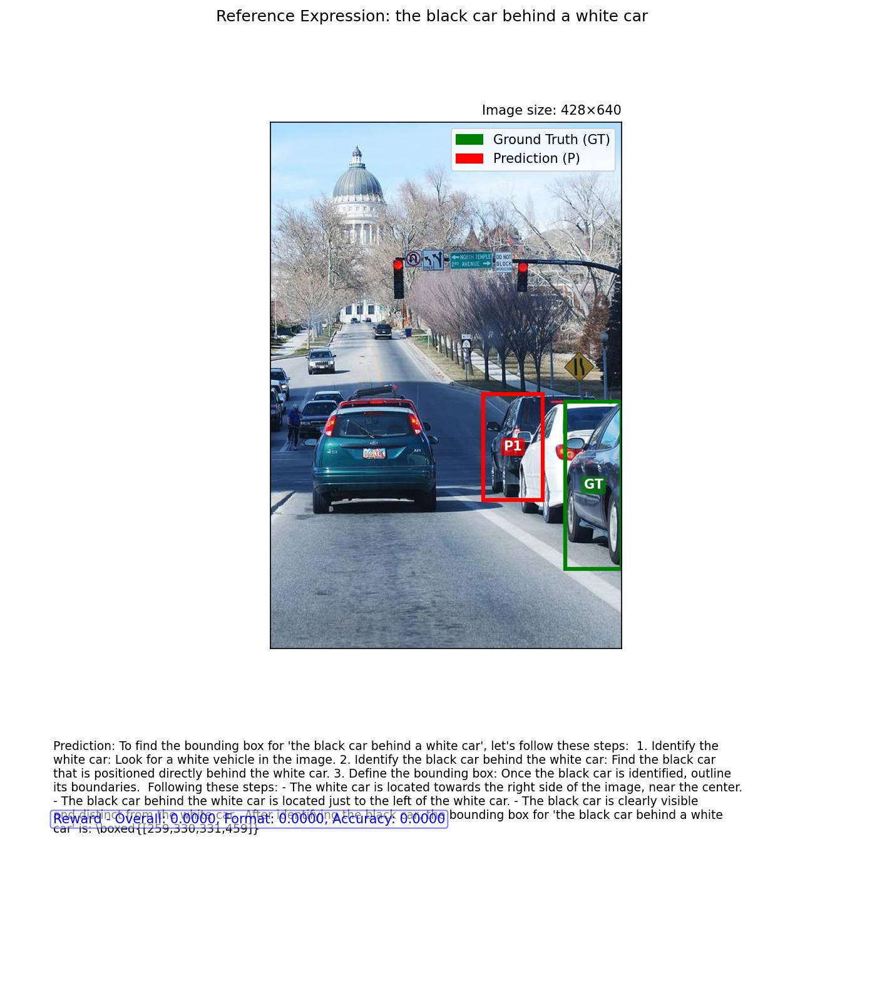

---

### Example 230

**Reference Expression**: the person wearing a white top and carrying a bag on the right shoulder

**Ground Truth**: [[1, 537, 64, 640]]

**Predicted**: [[163, 527, 213, 644]]

**Reward**: {'overall': 0.0, 'format': 0.0, 'accuracy': 0.0}

**Prediction**:
```
To find the bounding box for 'the person wearing a white top and carrying a bag on the right shoulder', follow these steps:

1. Identify the person wearing a white top. This person is likely to be in the middle of the image, walking away from the camera.
2. Look for a bag on the right shoulder. This typically means the bag is on the left side of the person from the viewer's perspective.
3. Confirm the person's location and orientation to ensure they are the correct individual.

After analyzing the image, the bounding box for the person described would be:

\boxed{[163,527,213,644]}
```

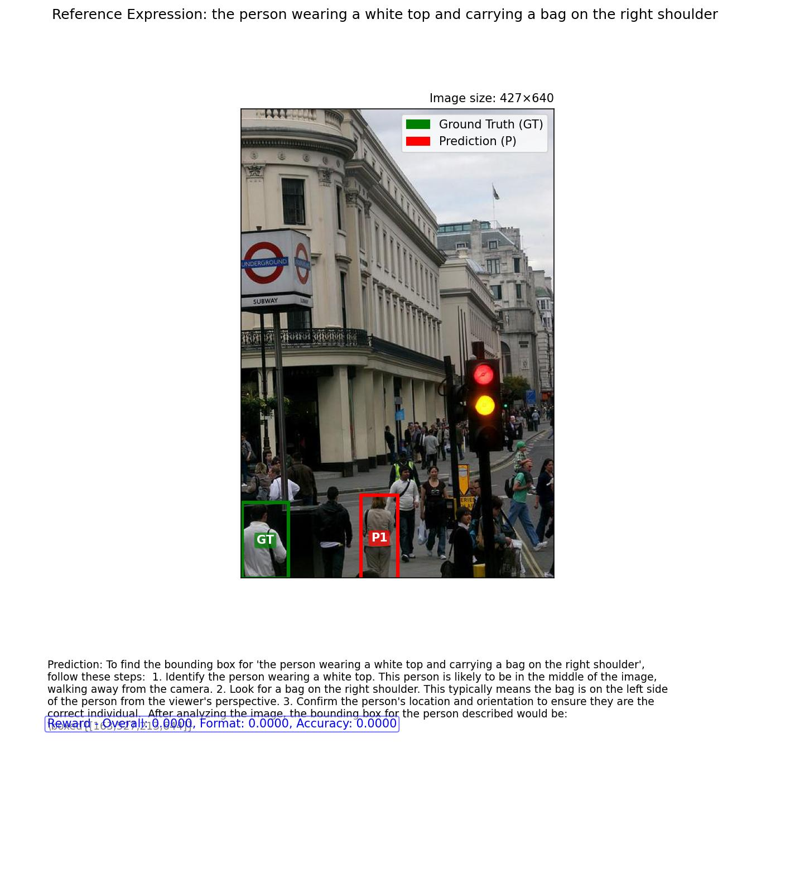

---

### Example 231

**Reference Expression**: the person wearing sunglasses, positioned between two people

**Ground Truth**: [[468, 471, 520, 615]]

**Predicted**: [[473, 472, 521, 617]]

**Reward**: {'overall': 0.8698071696648118, 'format': 0.0, 'accuracy': 0.8698071696648118}

**Prediction**:
```
To find the bounding box for 'the person wearing sunglasses, positioned between two people', let's follow these steps:

1. Identify the group of people in the bottom-right photo.
2. Focus on the person in the middle of this group.
3. Check if this person is wearing sunglasses.
4. Verify if this person is positioned between two other people.

The person in the middle of the group in the bottom-right photo is wearing sunglasses and is positioned between two other people. The bounding box for this person can be determined by identifying the head and shoulders of the individual.

The bounding box for the person wearing sunglasses, positioned between two people, is:
\boxed{[473,472,521,617]}

This bounding box captures the individual who is wearing sunglasses and is positioned between two other people in the group photo.
```

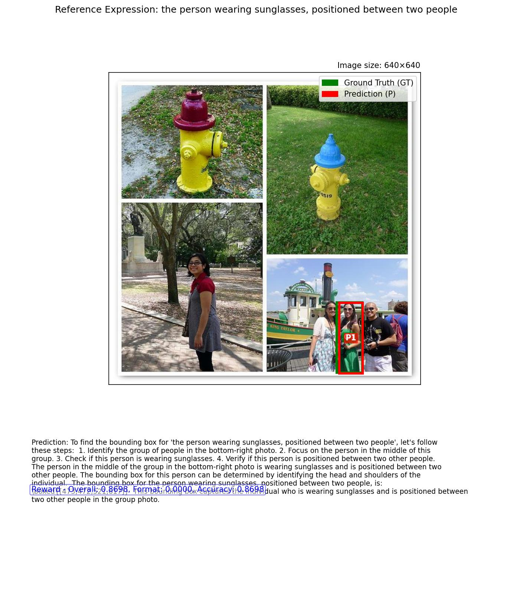

---

### Example 232

**Reference Expression**: the person wearing jeans and carrying a bag on the shoulder

**Ground Truth**: [[53, 4, 153, 189]]

**Predicted**: [[53, 0, 147, 189]]

**Reward**: {'overall': 1.0, 'format': 0.0, 'accuracy': 1.0}

**Prediction**:
```
To find the bounding box for 'the person wearing jeans and carrying a bag on the shoulder', let's follow these steps:

1. Identify the person wearing jeans: Look for someone in the background who is wearing jeans.
2. Identify the person carrying a bag on the shoulder: Among the individuals wearing jeans, find the one who appears to have a bag on their shoulder.

Upon analyzing the image:
- The person on the left side of the image, sitting on the bench, is wearing jeans and has a bag on their shoulder.
- The person on the right side of the image, also sitting on the bench, is wearing a blue jacket and white pants and does not appear to have a bag on their shoulder.

Therefore, the bounding box for 'the person wearing jeans and carrying a bag on the shoulder' is:
\boxed{[53,0,147,189]}
```

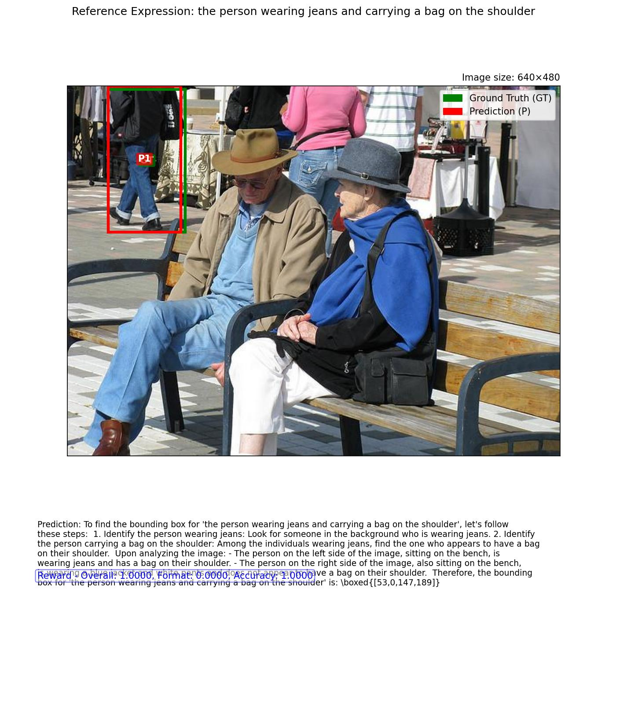

---

### Example 233

**Reference Expression**: the person sitting in the middle not wearing a hat

**Ground Truth**: [[332, 221, 392, 377]]

**Predicted**: [[326, 220, 398, 393]]

**Reward**: {'overall': 0.7514450867052023, 'format': 0.0, 'accuracy': 0.7514450867052023}

**Prediction**:
```
To find the bounding box for 'the person sitting in the middle not wearing a hat', we need to follow these steps:

1. Identify the group of four people sitting on the bench.
2. Locate the person in the middle of the group.
3. Determine if the person in the middle is wearing a hat.
4. If the person in the middle is not wearing a hat, identify the bounding box for that person.

- The group consists of four people: one on the far left, one in the middle, one on the right, and one on the far right.
- The person in the middle is the second person from the left.
- The person in the middle is not wearing a hat.

Given these observations, the bounding box for 'the person sitting in the middle not wearing a hat' is:

\boxed{[326,220,398,393]}
```

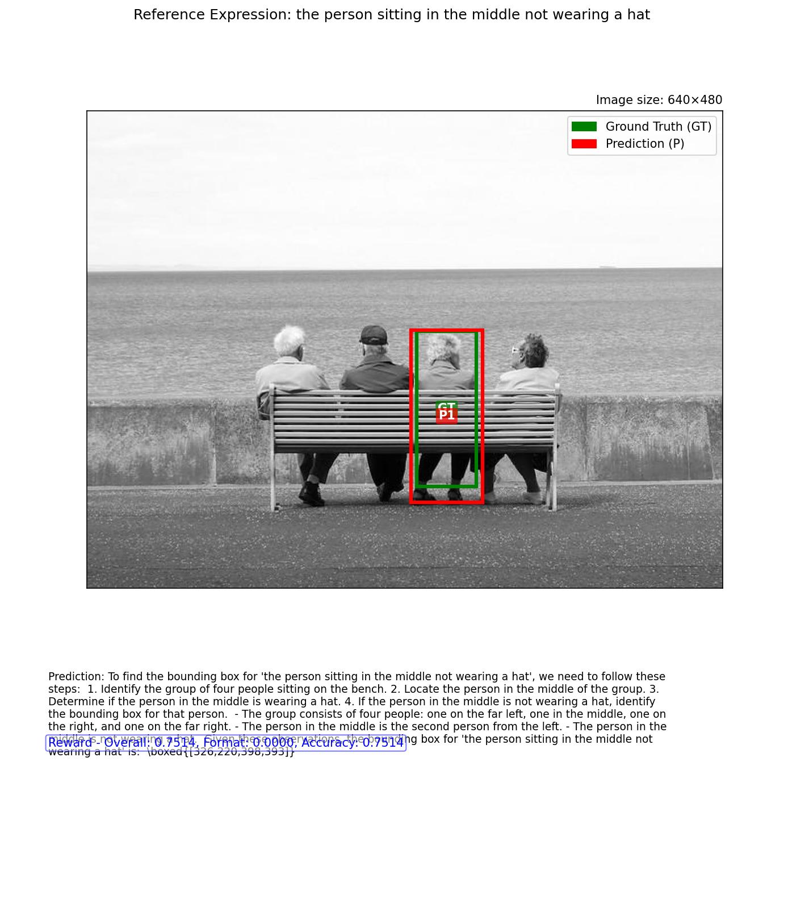

---

### Example 234

**Reference Expression**: the person in a white top not facing the camera

**Ground Truth**: [[521, 67, 562, 190]]

**Predicted**: [[98, 59, 160, 189]]

**Reward**: {'overall': 0.0, 'format': 0.0, 'accuracy': 0.0}

**Prediction**:
```
To find the bounding box for 'the person in a white top not facing the camera', we need to follow these steps:

1. Identify the person in a white top: In the image, there is a person wearing a white top in the background, but they are not facing the camera.
2. Locate the bounding box: The bounding box for the person in a white top can be identified by their position in the background, to the left side of the image, not facing the camera.

After analyzing the image, the bounding box for the person in a white top not facing the camera is:
\boxed{[98,59,160,189]}
```

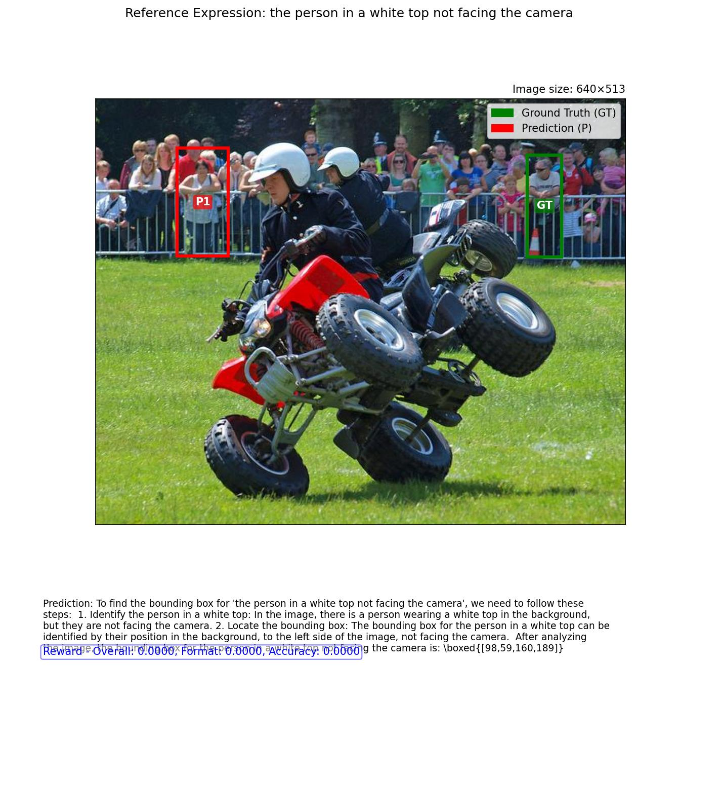

---

### Example 235

**Reference Expression**: the person in a white top not facing the camera

**Ground Truth**: [[176, 0, 262, 210]]

**Predicted**: [[174, 1, 260, 201]]

**Reward**: {'overall': 1.0, 'format': 0.0, 'accuracy': 1.0}

**Prediction**:
```
To find the bounding box for 'the person in a white top not facing the camera', we need to follow these steps:

1. Identify the person in a white top: There are two people in white tops in the image. One is facing the camera, and the other is not.
2. Determine which one is not facing the camera: The person on the left side of the bench is facing the camera, while the person on the right side is not.
3. Locate the person in the white top who is not facing the camera: This person is on the left side of the bench, behind the person in the white top facing the camera.
4. Define the bounding box: The bounding box should capture the person in the white top who is not facing the camera. This person appears to be partially obscured by the person facing the camera, but we can still identify their general position.

Given these steps, the bounding box for 'the person in a white top not facing the camera' is:

\boxed{[174,1,260,201]}
```

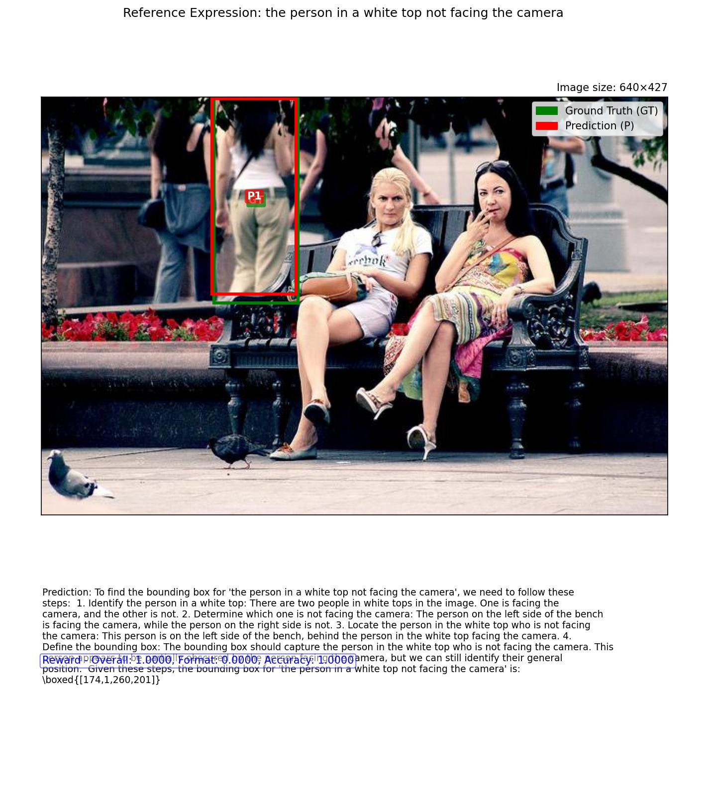

---

### Example 236

**Reference Expression**: the sheep with dark face not facing the camera

**Ground Truth**: [[311, 161, 459, 321]]

**Predicted**: [[318, 162, 458, 302]]

**Reward**: {'overall': 0.8277027027027027, 'format': 0.0, 'accuracy': 0.8277027027027027}

**Prediction**:
```
To find the bounding box for 'the sheep with dark face not facing the camera', let's follow these steps:

1. Identify the sheep with a dark face in the image. There is one sheep in the middle row with a dark face.
2. Determine which of the sheep in the dark-faced group is not facing the camera. The sheep on the right side of the dark-faced sheep in the middle row is not facing the camera.
3. Locate the bounding box for this sheep. The sheep is partially obscured but identifiable by its position relative to the other sheep.

The bounding box for 'the sheep with dark face not facing the camera' is:
\boxed{[318,162,458,302]}
```

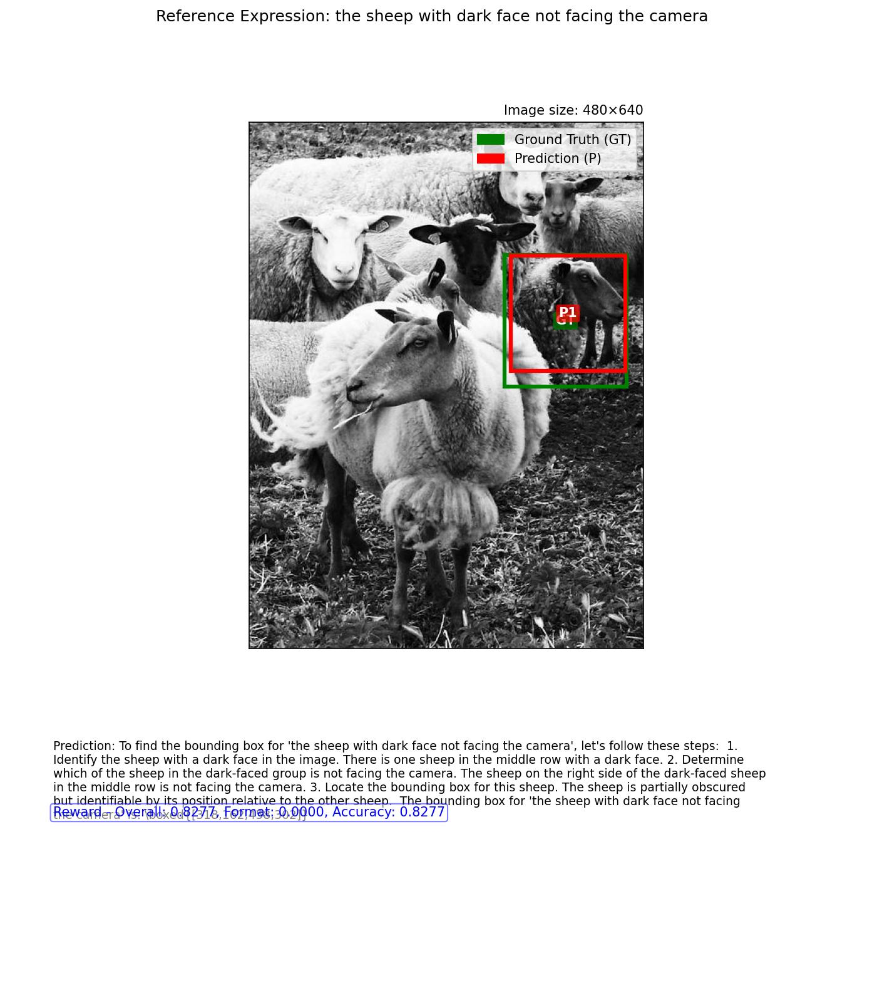

---

### Example 237

**Reference Expression**: the sheep with a white face behind other sheep

**Ground Truth**: [[161, 183, 205, 211]]

**Predicted**: [[408, 173, 474, 301]]

**Reward**: {'overall': 0.0, 'format': 0.0, 'accuracy': 0.0}

**Prediction**:
```
To find the bounding box for 'the sheep with a white face behind other sheep', we need to follow these steps:

1. Identify the sheep with a white face in the image.
2. Determine the position of this sheep relative to others.
3. Locate the sheep that is directly behind this sheep.

Step 1: The sheep with a white face is the one in the middle of the group, slightly to the left.
Step 2: This sheep is positioned behind other sheep, but not too far back.
Step 3: The sheep directly behind this one is the one to the right of the white-faced sheep.

After analyzing the image, the sheep with a white face behind other sheep is the one to the right of the white-faced sheep.

The bounding box for this sheep is:
\boxed{[408,173,474,301]}
```

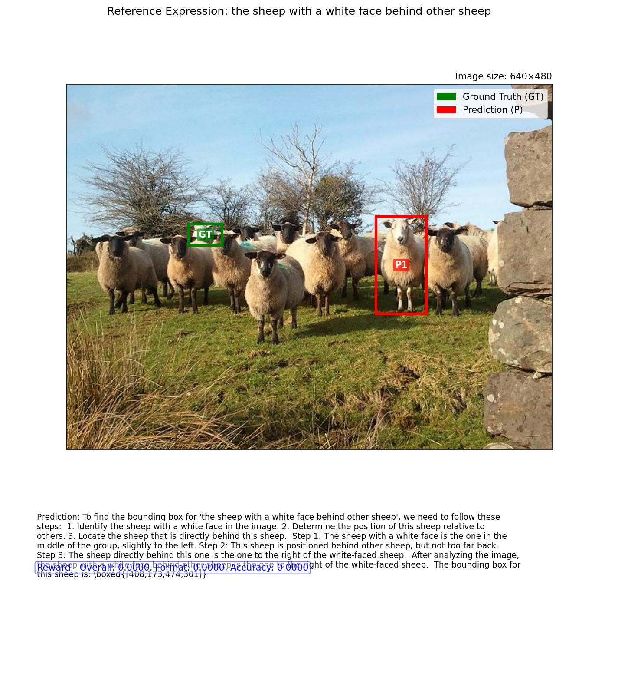

---

### Example 238

**Reference Expression**: the person in a white top carrying a bag

**Ground Truth**: [[141, 126, 160, 180]]

**Predicted**: []

**Reward**: {'overall': 0.0, 'format': 0.0, 'accuracy': 0.0}

**Prediction**:
```
To find the bounding box for 'the person in a white top carrying a bag', I'll follow these steps:

1. Identify the person in a white top in the image.
2. Check if this person is carrying a bag.

Step 1: The person in a white top is standing on the left side of the image, facing away from the camera.
Step 2: Upon closer inspection, the person does not appear to be carrying a bag.

Therefore, there is no bounding box for 'the person in a white top carrying a bag' in this image.

The final answer is:
\boxed{[]}
```

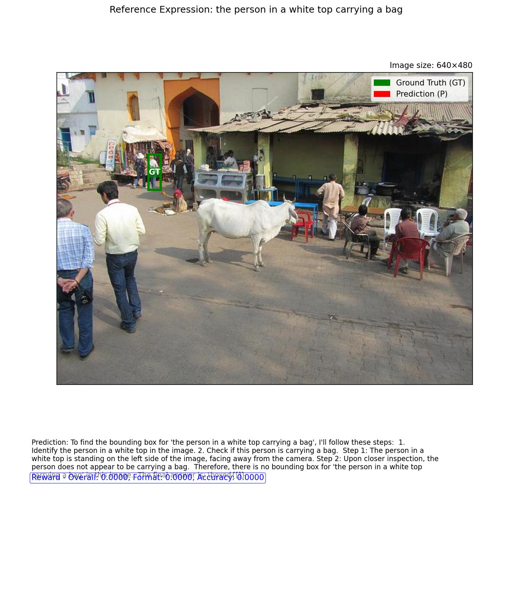

---

### Example 239

**Reference Expression**: the person on the right hand side of the person wearing a hat

**Ground Truth**: [[331, 94, 462, 265]]

**Predicted**: [[489, 71, 644, 300]]

**Reward**: {'overall': 0.0, 'format': 0.0, 'accuracy': 0.0}

**Prediction**:
```
To find the bounding box for 'the person on the right hand side of the person wearing a hat', I'll follow these steps:

1. Identify the person wearing a hat: This person is in the center of the image, wearing a red and yellow hat.
2. Determine the person on the right side of the person wearing a hat: This person is partially obscured by the person in the hat but is visible on the right side of the image.

The bounding box for this person is:
\boxed{[489, 71, 644, 300]}
```

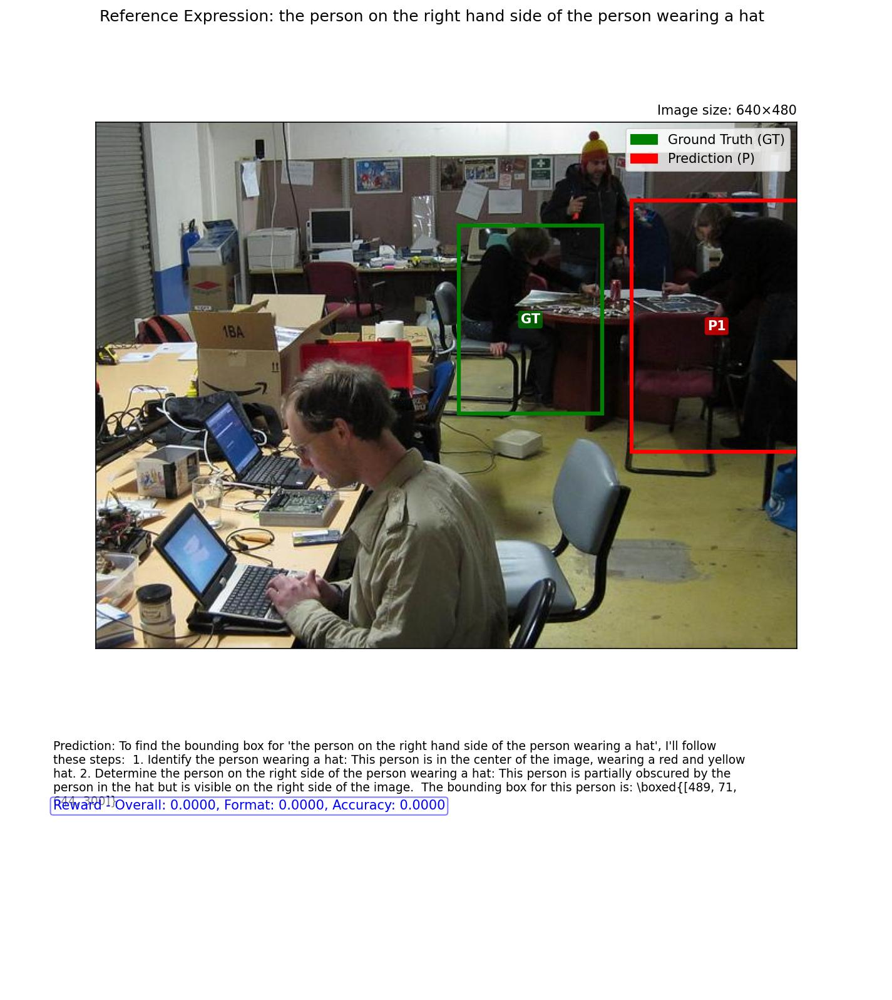

---

### Example 240

**Reference Expression**: the person wearing a suit shirt and jacket standing by the wall

**Ground Truth**: [[194, 137, 211, 194]]

**Predicted**: [[70, 125, 142, 263]]

**Reward**: {'overall': 0.0, 'format': 0.0, 'accuracy': 0.0}

**Prediction**:
```
To find the bounding box for 'the person wearing a suit shirt and jacket standing by the wall', we need to follow these steps:

1. Identify the wall in the image. The wall is the pink building in the background.
2. Look for a person standing near the wall. There is a person wearing a white shirt and a dark jacket near the wall.
3. Confirm that this person is wearing a suit shirt and jacket. The person is indeed wearing a white shirt under a dark jacket, which can be considered a suit jacket.

Given these observations, the bounding box for the person wearing a suit shirt and jacket standing by the wall is:

\boxed{[70,125,142,263]}
```

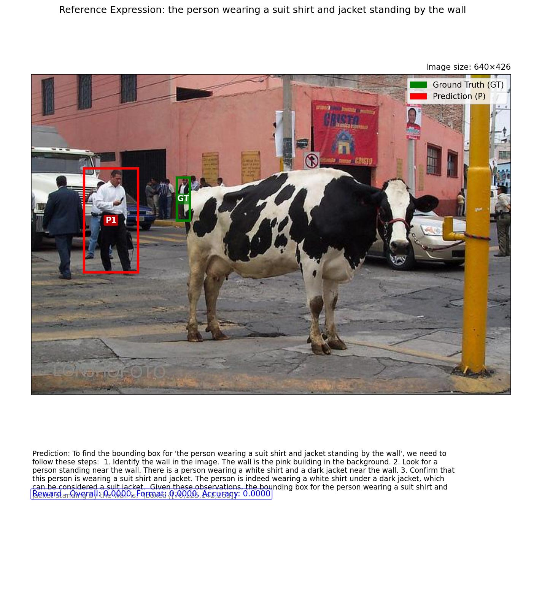

---

### Example 241

**Reference Expression**: the cow closest to the front of a grey sedan

**Ground Truth**: [[225, 199, 284, 300]]

**Predicted**: [[224, 199, 282, 302]]

**Reward**: {'overall': 1.0, 'format': 0.0, 'accuracy': 1.0}

**Prediction**:
```
To find the bounding box for 'the cow closest to the front of a grey sedan', we need to follow these steps:

1. Identify the grey sedan in the image. It is the car in the middle of the image, partially obscured by the cows.
2. Determine which cow is closest to this grey sedan. Upon inspection, the cow closest to the grey sedan is the one in the middle of the group of cows.
3. Define the bounding box for this cow. The cow should be enclosed by a rectangle that captures its full body.

The bounding box for 'the cow closest to the front of a grey sedan' would be:

\boxed{[224,199,282,302]}
```

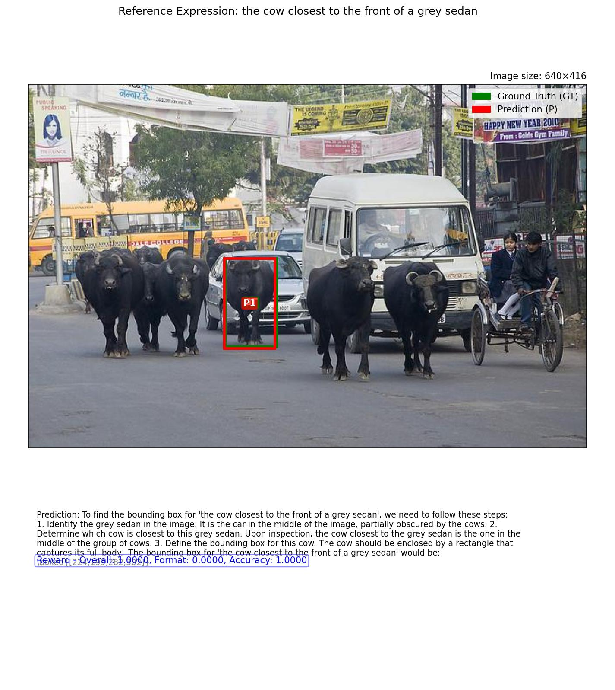

---

### Example 242

**Reference Expression**: the person wearing a white shirt facing away from the camera

**Ground Truth**: [[147, 169, 206, 361]]

**Predicted**: [[149, 165, 206, 357]]

**Reward**: {'overall': 1.0, 'format': 0.0, 'accuracy': 1.0}

**Prediction**:
```
To find the bounding box for 'the person wearing a white shirt facing away from the camera', let's analyze the image step-by-step:

1. Identify the person in a white shirt: There are multiple people in the image, but the one wearing a white shirt is standing to the left of the bus, facing away from the camera.
2. Confirm the orientation: The person is facing away from the camera, and their back is towards the viewer.

The bounding box for this person is:
\boxed{[149, 165, 206, 357]}
```

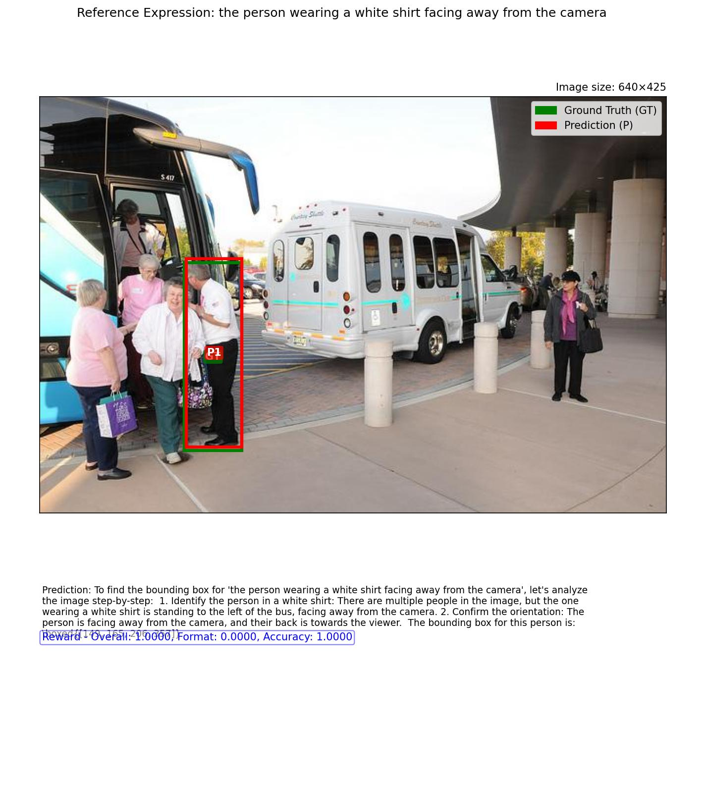

---

### Example 243

**Reference Expression**: the person in a white top sitting on a bench

**Ground Truth**: [[176, 175, 224, 250]]

**Predicted**: [[50, 177, 119, 383]]

**Reward**: {'overall': 0.0, 'format': 0.0, 'accuracy': 0.0}

**Prediction**:
```
To find the bounding box for 'the person in a white top sitting on a bench', follow these steps:

1. Identify the person in a white top: Look for a person wearing a white top among the individuals sitting on the benches.
2. Identify the bench: Locate the benches on the platform where people are sitting.
3. Determine the position: The person in a white top is sitting on one of the benches on the left side of the platform.

Following these steps, the bounding box for 'the person in a white top sitting on a bench' is:
\boxed{[50,177,119,383]}
```

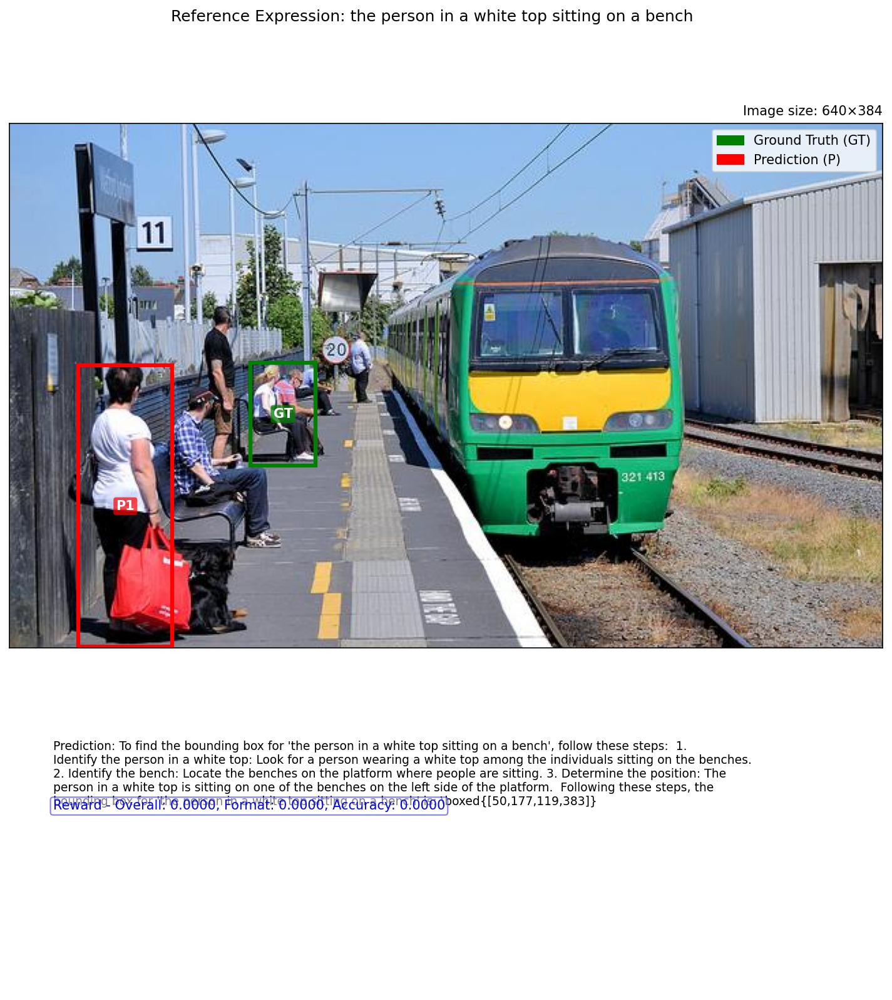

---

### Example 244

**Reference Expression**: the transparent cup next to the bread, not containing wine

**Ground Truth**: [[214, 60, 299, 154]]

**Predicted**: [[232, 63, 313, 166]]

**Reward**: {'overall': 0.595642829230168, 'format': 0.0, 'accuracy': 0.595642829230168}

**Prediction**:
```
To find the bounding box for 'the transparent cup next to the bread, not containing wine', let's follow these steps:

1. Identify the bread: The bread is located on the plate in the foreground, with slices of toasted bread and some other food items.
2. Identify the transparent cup: Next to the bread, there is a transparent cup. It appears to be empty and is placed to the left of the bread.
3. Confirm the cup's position: The cup is indeed transparent and is positioned to the left of the bread, not containing any wine.

Given these observations, the bounding box for 'the transparent cup next to the bread, not containing wine' can be determined as follows:

\boxed{[232,63,313,166]}
```

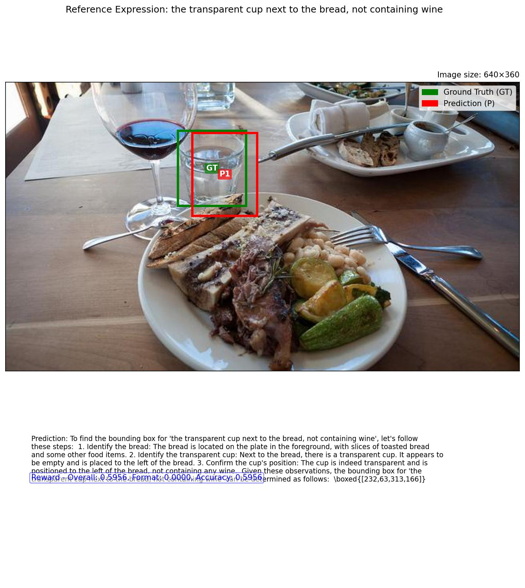

---

### Example 245

**Reference Expression**: the person wearing a hat holding a glass in hand

**Ground Truth**: [[6, 110, 193, 512]]

**Predicted**: [[6, 107, 193, 476]]

**Reward**: {'overall': 1.0, 'format': 0.0, 'accuracy': 1.0}

**Prediction**:
```
To find the bounding box for 'the person wearing a hat holding a glass in hand', follow these steps:

1. Identify the person wearing a hat in the image. This person is on the left side of the image.
2. Check if this person is holding a glass in their hand. The person on the left is holding a glass in their hand.
3. Determine the bounding box for this person. The bounding box should include the person's head, shoulders, and torso.

After analyzing the image, the bounding box for 'the person wearing a hat holding a glass in hand' is:
\boxed{[6,107,193,476]}
```

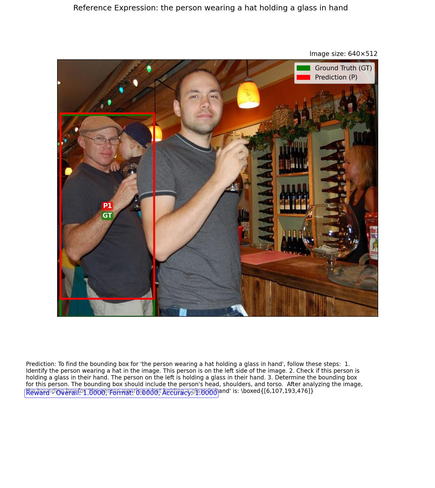

---

### Example 246

**Reference Expression**: the spoon near the corn not in the bowl

**Ground Truth**: [[421, 375, 450, 515]]

**Predicted**: [[426, 378, 450, 518]]

**Reward**: {'overall': 0.7957405614714425, 'format': 0.0, 'accuracy': 0.7957405614714425}

**Prediction**:
```
To find the bounding box for 'the spoon near the corn not in the bowl', let's follow these steps:

1. Identify the corn on the table. The corn is located on the right side of the image, on a white rectangular plate.
2. Look for a spoon near the corn. There is a spoon placed next to the corn on the same plate.
3. Ensure the spoon is not in the bowl. The bowl is on the top right side of the image, and the spoon we are referring to is on the white plate with the corn.

Based on these observations, the bounding box for 'the spoon near the corn not in the bowl' is:
\boxed{[426, 378, 450, 518]}
```

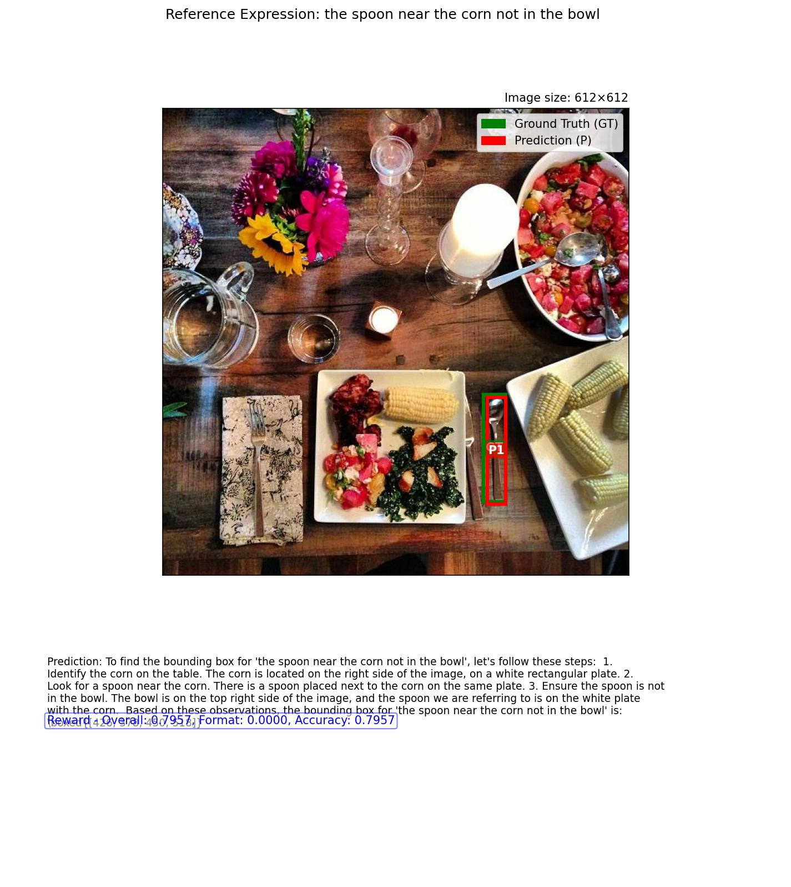

---

### Example 247

**Reference Expression**: the spoon next to an empty cup

**Ground Truth**: [[257, 186, 270, 266]]

**Predicted**: [[252, 194, 279, 274]]

**Reward**: {'overall': 0.4134275618374558, 'format': 0.0, 'accuracy': 0.4134275618374558}

**Prediction**:
```
To find the bounding box for 'the spoon next to an empty cup', let's follow these steps:

1. Identify the empty cup: It is the white cup on the left side of the image.
2. Locate the spoon: The spoon is placed next to the empty cup, on the right side of the cup.

Considering the above steps, the bounding box for 'the spoon next to an empty cup' is:

\boxed{[252, 194, 279, 274]}
```

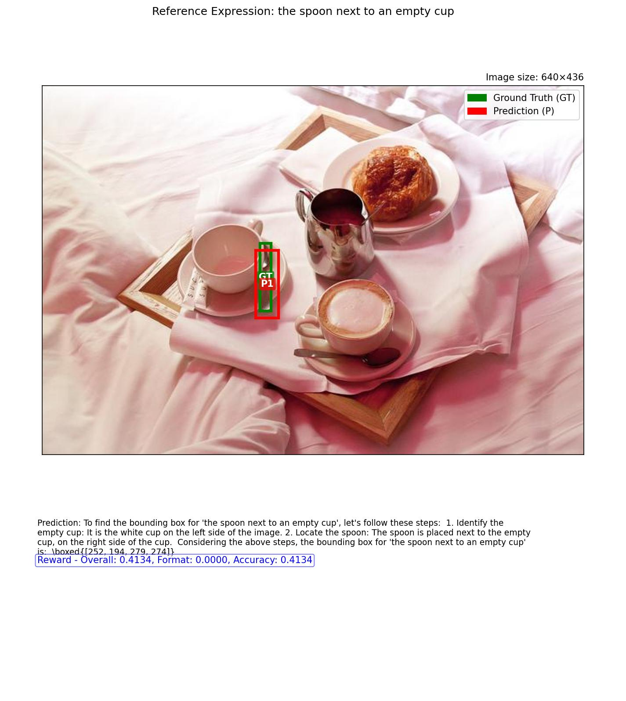

---

### Example 248

**Reference Expression**: the person holding two teddy bears

**Ground Truth**: [[187, 198, 298, 420]]

**Predicted**: [[185, 189, 297, 415]]

**Reward**: {'overall': 1.0, 'format': 0.0, 'accuracy': 1.0}

**Prediction**:
```
To find the bounding box for 'the person holding two teddy bears', let's follow these steps:

1. Identify the location in the image where someone is holding two teddy bears.
2. Observe the person's position relative to the other people and objects in the image.
3. Determine the approximate coordinates of the person holding the teddy bears.

Upon examining the image:
- There is a person in the foreground, slightly to the left, who appears to be holding two teddy bears.
- This person is wearing a blue shirt and seems to be moving slightly.

Based on this observation, the bounding box for 'the person holding two teddy bears' would be:

\boxed{[185,189,297,415]}
```

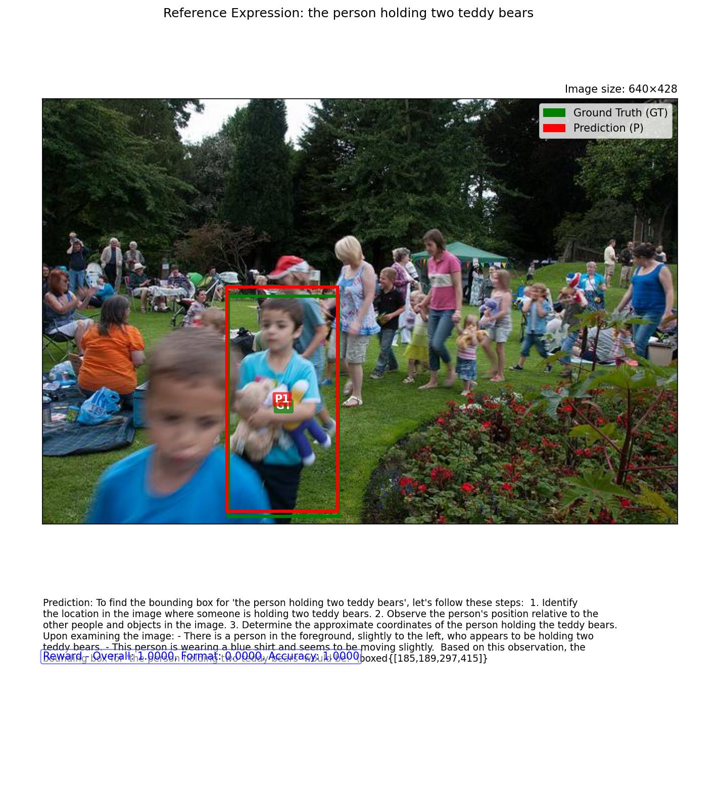

---

### Example 249

**Reference Expression**: the upside-down cup on the edge of a bowl

**Ground Truth**: [[82, 22, 114, 59]]

**Predicted**: [[48, 2, 109, 56]]

**Reward**: {'overall': 0.25786516853932584, 'format': 0.0, 'accuracy': 0.25786516853932584}

**Prediction**:
```
To find the bounding box for 'the upside-down cup on the edge of a bowl', we need to carefully examine the image. Here are the steps:

1. Identify the bowl in the image. It is the small white bowl located towards the top left of the image.
2. Look for an upside-down cup on the edge of this bowl. There is a small, upside-down cup that appears to be on the edge of the bowl.
3. Determine the coordinates of this cup. The cup is positioned at the top left of the bowl and is relatively small compared to the bowl.

After analyzing the image, the bounding box for 'the upside-down cup on the edge of a bowl' is:

\boxed{[48, 2, 109, 56]}
```

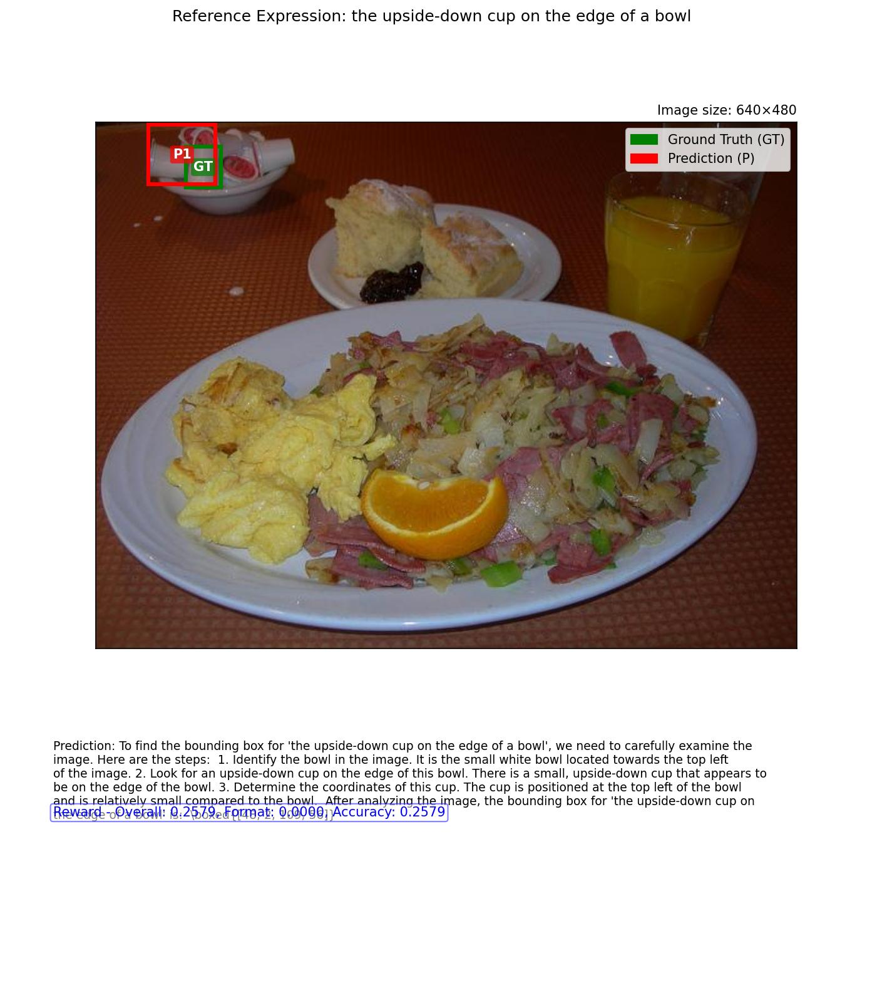

---

### Example 250

**Reference Expression**: the fork on a plate with pizza

**Ground Truth**: [[30, 352, 80, 574]]

**Predicted**: [[29, 353, 82, 577]]

**Reward**: {'overall': 1.0, 'format': 0.0, 'accuracy': 1.0}

**Prediction**:
```
To find the bounding box for 'the fork on a plate with pizza', let's follow these steps:

1. Identify the plate with pizza: The main pizza is in the center of the image, and there's a slice of pizza on a separate plate in the foreground.
2. Look for the fork on the plate with pizza: The fork is placed on the plate that has the slice of pizza.
3. Locate the plate: The plate with the slice of pizza is in the foreground, to the left of the main pizza.
4. Identify the fork: The fork is on the left side of the plate with the slice of pizza.

Given these observations, the bounding box for 'the fork on a plate with pizza' is:

\boxed{[29,353,82,577]}
```

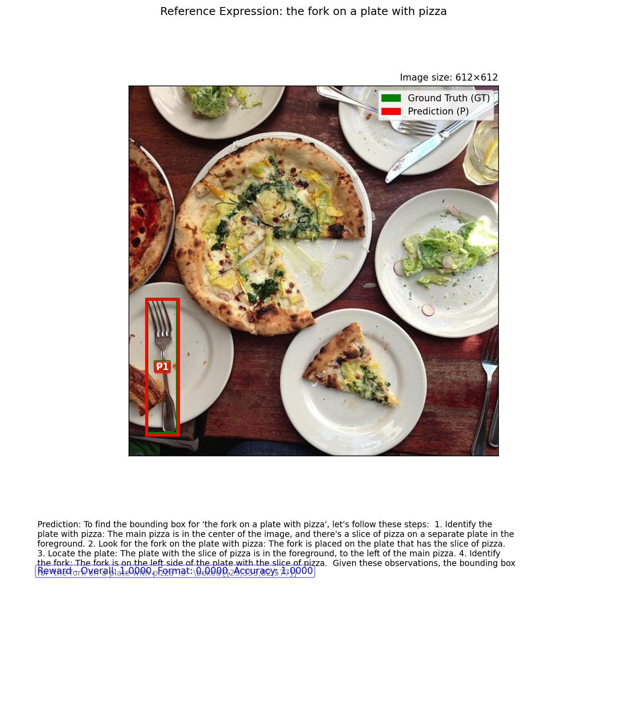

---

### Example 251

**Reference Expression**: the transparent cup with a clear beverage inside

**Ground Truth**: [[0, 83, 118, 270]]

**Predicted**: [[8, 101, 114, 276]]

**Reward**: {'overall': 0.7890934719407982, 'format': 0.0, 'accuracy': 0.7890934719407982}

**Prediction**:
```
To find the bounding box for 'the transparent cup with a clear beverage inside', let's follow these steps:

1. Identify the transparent cup: It is the one on the left side of the image, which appears to be a clear plastic cup.
2. Determine the beverage: The cup contains a clear beverage, which is likely water or a similar transparent liquid.
3. Define the bounding box: The bounding box should encompass the entire cup, including the base and the top.

The bounding box for 'the transparent cup with a clear beverage inside' is:
\boxed{[8, 101, 114, 276]}
```

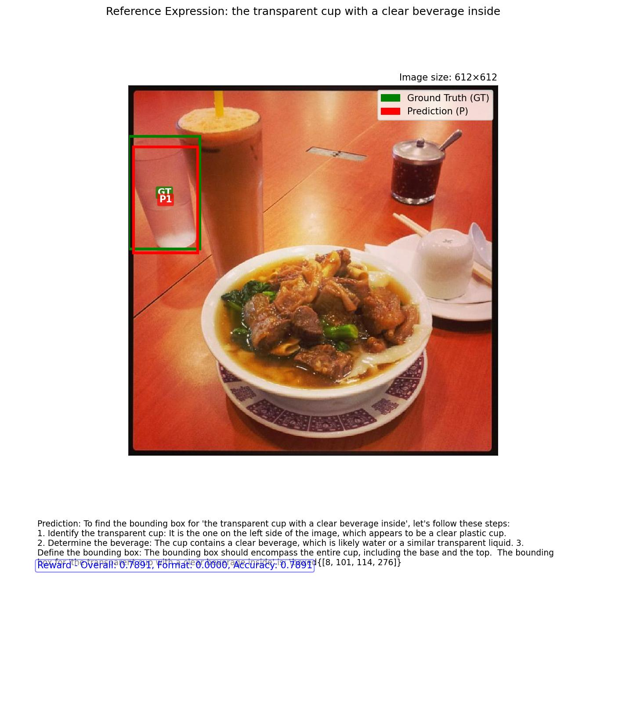

---

### Example 252

**Reference Expression**: the person on the left side of the person in a white shirt and not holding a glass

**Ground Truth**: [[265, 138, 341, 260]]

**Predicted**: [[302, 141, 413, 274]]

**Reward**: {'overall': 0.23930081468495412, 'format': 0.0, 'accuracy': 0.23930081468495412}

**Prediction**:
```
To find the bounding box for the person on the left side of the person in a white shirt and not holding a glass, I'll follow these steps:

1. Identify the person in the white shirt: This person is seated and appears to be holding a glass.
2. Locate the person on the left side of the person in the white shirt: This person is seated next to the person in the white shirt.
3. Determine the bounding box for this person: The person on the left side of the person in the white shirt is wearing a dark top and appears to be holding a glass.

The bounding box for the person on the left side of the person in the white shirt, who is not holding a glass, is:

\boxed{[302, 141, 413, 274]}
```

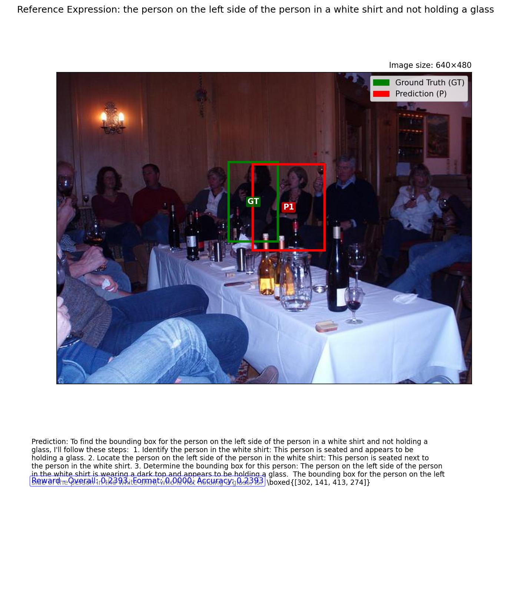

---

### Example 253

**Reference Expression**: the person near the teddy bear wearing a white top

**Ground Truth**: [[37, 86, 126, 269]]

**Predicted**: [[71, 146, 231, 491]]

**Reward**: {'overall': 0.1045239640307778, 'format': 0.0, 'accuracy': 0.1045239640307778}

**Prediction**:
```
To find the bounding box for 'the person near the teddy bear wearing a white top', we need to follow these steps:

1. Identify the teddy bear in the image.
2. Locate the person holding or standing near the teddy bear.
3. Determine if the person is wearing a white top.

- The teddy bear is large, white, and has a red bow. It is positioned in the center of the image.
- The person near the teddy bear appears to be a young girl.
- The girl is wearing a white top and a plaid skirt.

Given these observations, we can now pinpoint the bounding box for the person near the teddy bear wearing a white top.

The bounding box for the person near the teddy bear wearing a white top is:
\boxed{[71,146,231,491]}
```

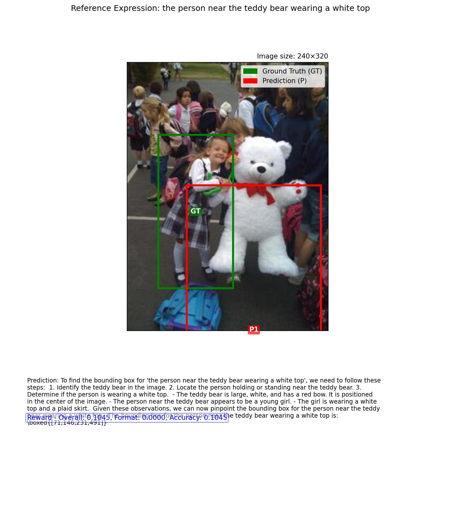

---

### Example 254

**Reference Expression**: the person covering their mouth and wearing a dark top

**Ground Truth**: [[230, 149, 296, 244]]

**Predicted**: [[271, 155, 336, 300]]

**Reward**: {'overall': 0.1651818856718634, 'format': 0.0, 'accuracy': 0.1651818856718634}

**Prediction**:
```
To find the bounding box for 'the person covering their mouth and wearing a dark top', follow these steps:

1. Identify the person in the image who is covering their mouth. This person is located to the right of the man in the foreground and appears to be wearing a dark-colored top.
2. Locate the area where this person is sitting. They are partially obscured by the man in the foreground but are visible behind him.
3. Determine the bounding box by noting the coordinates of the top-left and bottom-right corners of this person. The top-left corner would be just below the person's head, and the bottom-right corner would be just above their shoulders.

After identifying these points, the bounding box for the person covering their mouth and wearing a dark top would be:

\boxed{[271,155,336,300]}
```

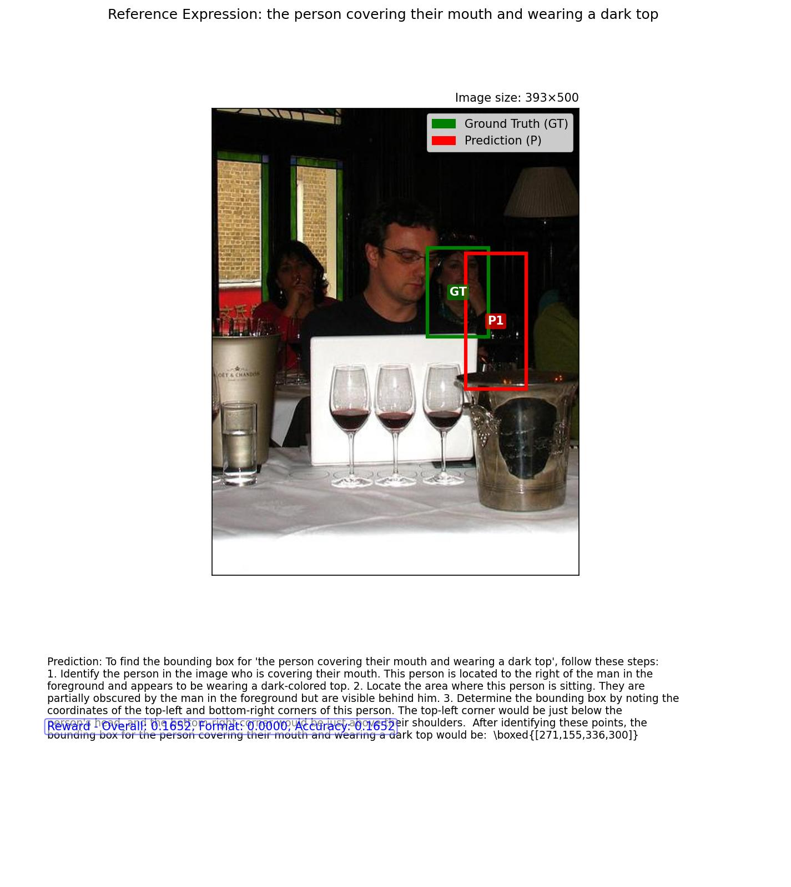

---

### Example 255

**Reference Expression**: the bowl with dark sauce next to the condiment bottles

**Ground Truth**: [[126, 319, 183, 365]]

**Predicted**: [[129, 322, 183, 361]]

**Reward**: {'overall': 0.8032036613272311, 'format': 0.0, 'accuracy': 0.8032036613272311}

**Prediction**:
```
To find the bowl with dark sauce next to the condiment bottles, follow these steps:

1. Identify the condiment bottles: These are the small containers with labels, located near the center-left of the image.
2. Locate the bowls: The bowls are in front of the condiment bottles. There are multiple bowls, but we need the one with dark sauce.
3. Determine the bowl with dark sauce: The bowl with a dark sauce is the one closest to the condiment bottles and appears to be filled with a dark substance, possibly chocolate or a similar dark sauce.

Following these steps, the bounding box for 'the bowl with dark sauce next to the condiment bottles' is:
\boxed{[129,322,183,361]}
```

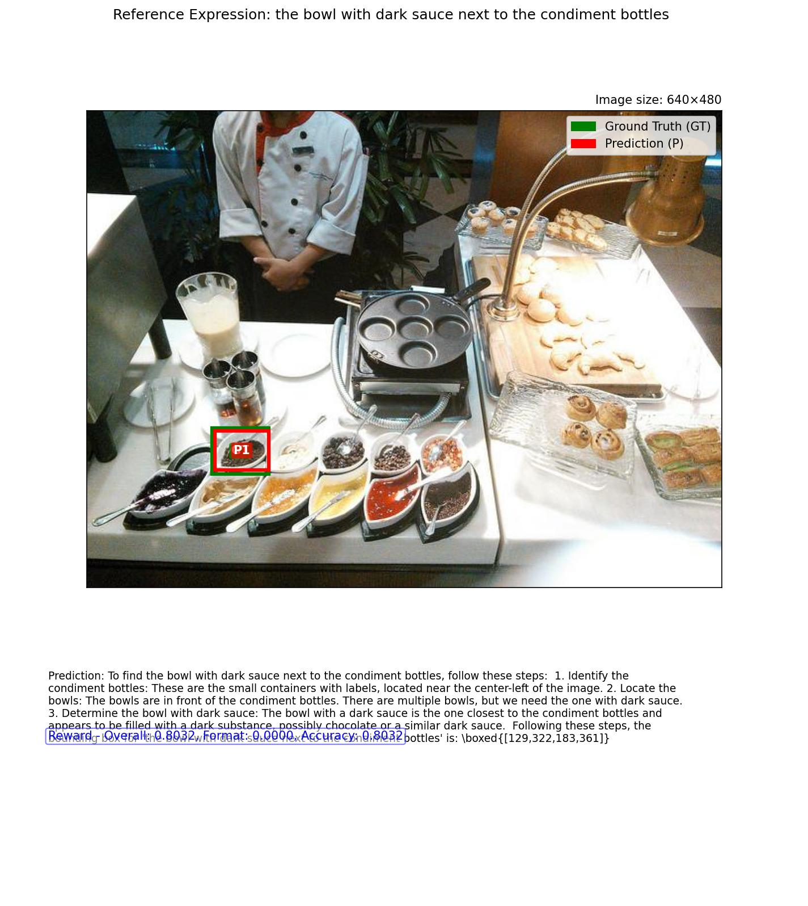

---

### Example 256

**Reference Expression**: the person with dark hair on the left side of the person in a blue top

**Ground Truth**: [[113, 115, 207, 211]]

**Predicted**: [[0, 195, 132, 415]]

**Reward**: {'overall': 0.0, 'format': 0.0, 'accuracy': 0.0}

**Prediction**:
```
To find the bounding box for 'the person with dark hair on the left side of the person in a blue top', we need to follow these steps:

1. Identify the person in the blue top. This person is seated and wearing a blue top, located towards the center-left of the image.
2. Locate the person with dark hair to the left of this individual. This person is partially visible and appears to be wearing a darker-colored top.
3. Determine the bounding box for this person. The bounding box should encompass the head and shoulders of this individual.

After analyzing the image, the bounding box for 'the person with dark hair on the left side of the person in a blue top' can be described as follows:

\boxed{[0,195,132,415]}
```

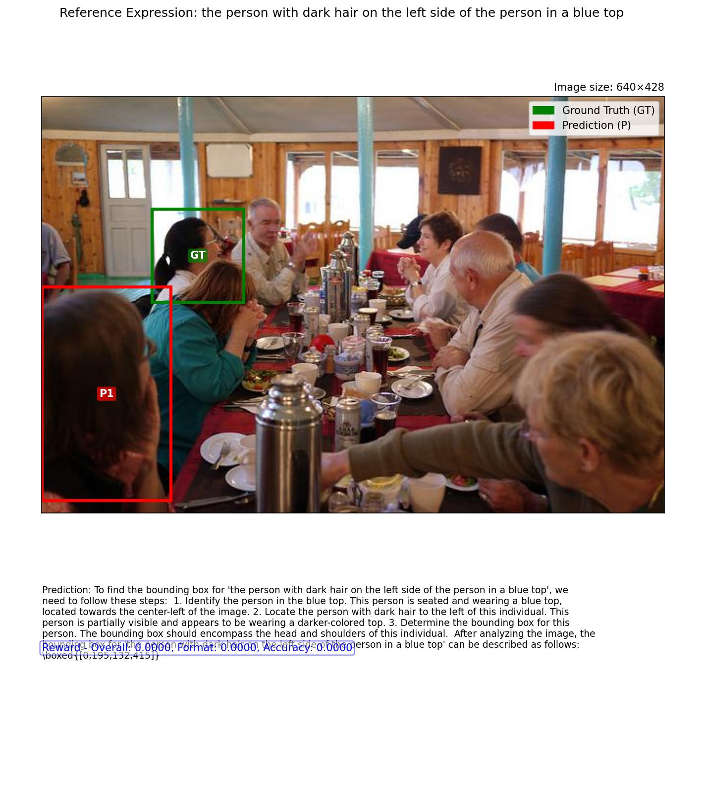

---

### Example 257

**Reference Expression**: the person in a white top on the left side of the person in a red top

**Ground Truth**: [[363, 129, 513, 298]]

**Predicted**: [[91, 129, 184, 342]]

**Reward**: {'overall': 0.0, 'format': 0.0, 'accuracy': 0.0}

**Prediction**:
```
To find the bounding box for 'the person in a white top on the left side of the person in a red top', we need to follow these steps:

1. Identify the person in the red top. This is the individual wearing a red shirt, seated at the table.
2. Locate the person to the left of the person in the red top. This is the person wearing a white top.
3. Determine the bounding box for the person in the white top. This person is seated and appears to be smiling.

After identifying these steps, the bounding box for 'the person in a white top on the left side of the person in a red top' is:

\boxed{[91,129,184,342]}
```

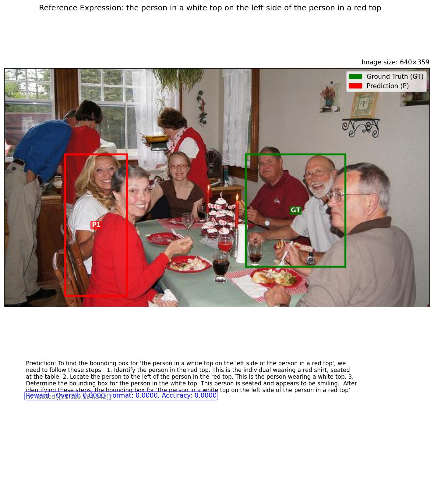

---

### Example 258

**Reference Expression**: the teddy bear close to a window and not wearing a black top

**Ground Truth**: [[402, 63, 511, 186]]

**Predicted**: [[0, 42, 77, 166]]

**Reward**: {'overall': 0.0, 'format': 0.0, 'accuracy': 0.0}

**Prediction**:
```
To find the teddy bear close to a window and not wearing a black top, let's follow these steps:

1. Identify the window in the image. The window is on the left side of the image, partially covered by a curtain.
2. Look for teddy bears near the window. There are two teddy bears near the window.
3. Determine which of these teddy bears is not wearing a black top. The teddy bear on the left side of the window is wearing a red top, while the teddy bear on the right side of the window is wearing a black top.
4. The teddy bear close to the window and not wearing a black top is the one on the left side of the window.

The bounding box for this teddy bear is \boxed{[0,42,77,166]}.
```

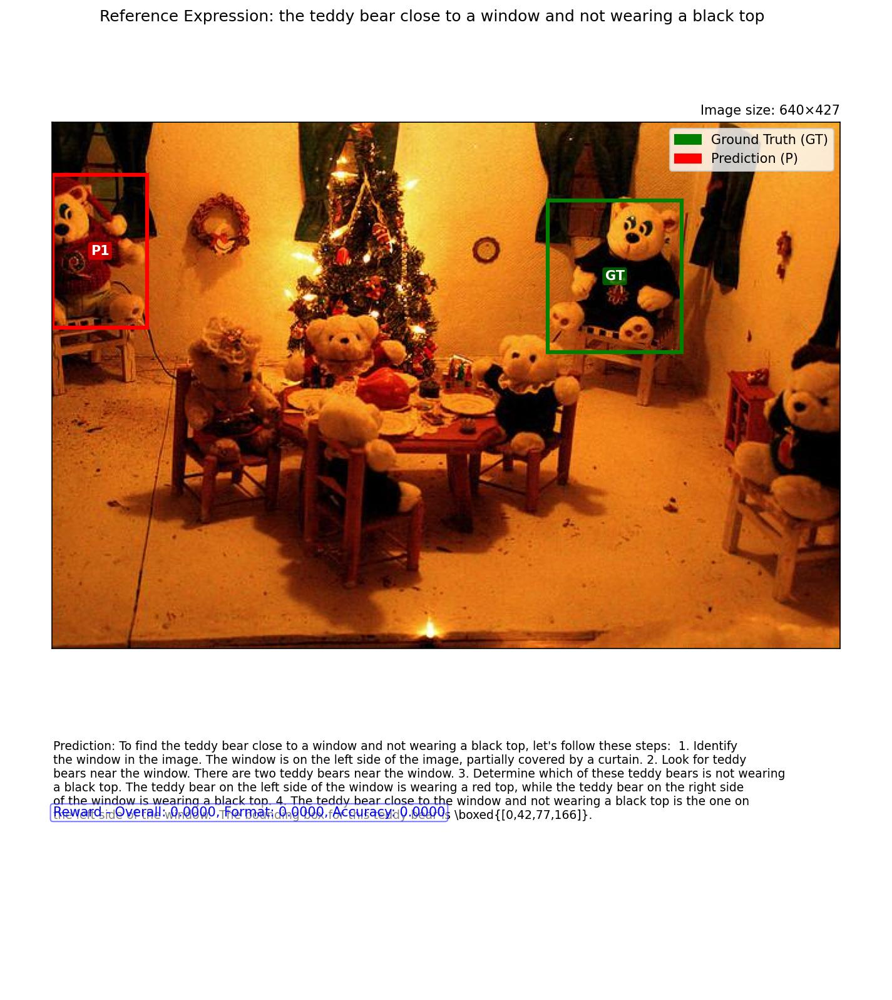

---

### Example 259

**Reference Expression**: the empty glass in the middle of the plates

**Ground Truth**: [[84, 194, 174, 310]]

**Predicted**: [[77, 192, 171, 297]]

**Reward**: {'overall': 0.7895849854612741, 'format': 0.0, 'accuracy': 0.7895849854612741}

**Prediction**:
```
To find the empty glass in the middle of the plates, let's follow these steps:

1. Identify the plates on the table. There are two main plates in the center of the image.
2. Locate the glass that is placed between these two plates. It is a clear glass.
3. Check if the glass is empty. The glass appears to be empty as there is no liquid or food residue visible in it.

Following these steps, the bounding box for the empty glass in the middle of the plates is:

\boxed{[77,192,171,297]}
```

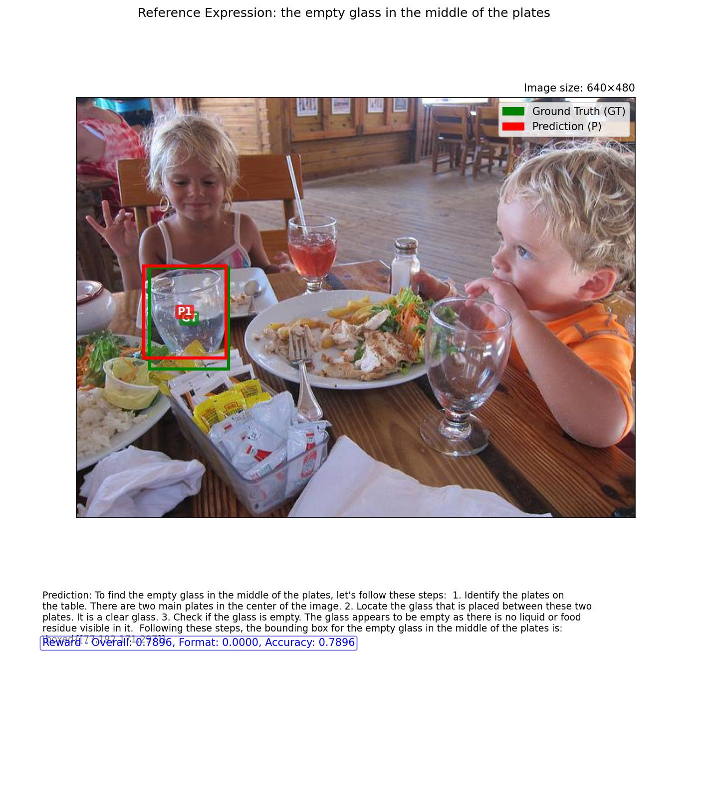

---

### Example 260

**Reference Expression**: the person wearing a red top, pink scarf, and glasses

**Ground Truth**: [[86, 117, 140, 215]]

**Predicted**: [[0, 263, 73, 419]]

**Reward**: {'overall': 0.0, 'format': 0.0, 'accuracy': 0.0}

**Prediction**:
```
To find the bounding box for 'the person wearing a red top, pink scarf, and glasses', let's follow these steps:

1. Identify the person wearing a red top: Look for a person in a red top among the crowd.
2. Identify the pink scarf: Look for a pink scarf on the person with the red top.
3. Identify the glasses: Look for the glasses on the person with the red top and pink scarf.

After analyzing the image:
- The person wearing a red top and a pink scarf is located on the left side of the image, partially obscured by others.
- The glasses are visible on this person.

The bounding box for the person wearing a red top, pink scarf, and glasses can be identified as follows:
\boxed{[0,263,73,419]}

This bounding box captures the person with the red top, pink scarf, and glasses.
```

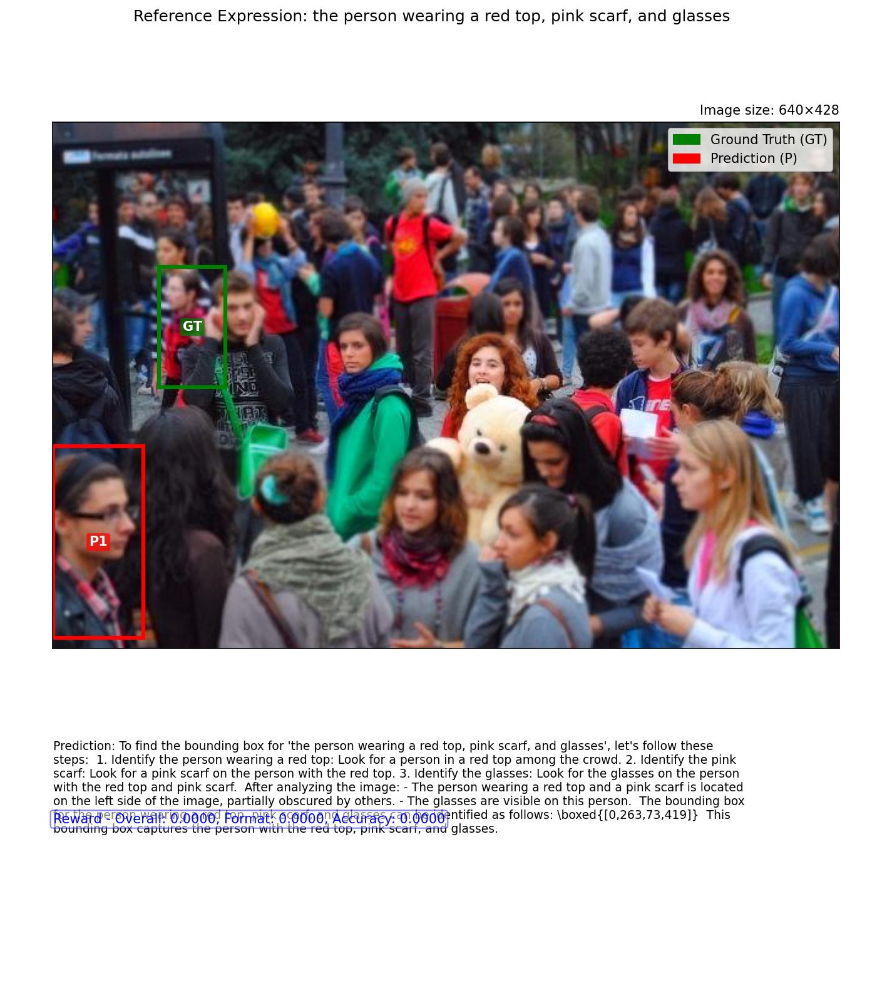

---

### Example 261

**Reference Expression**: black board that does not have a number on it

**Ground Truth**: [[551, 180, 604, 352]]

**Predicted**: [[558, 179, 603, 351]]

**Reward**: {'overall': 0.8399738019866827, 'format': 0.0, 'accuracy': 0.8399738019866827}

**Prediction**:
```
To find the 'black board that does not have a number on it', let's follow these steps:

1. Identify the blackboards in the image.
2. Determine which blackboard has a number on it.
3. Identify the blackboard that does not have a number.

Step 1: There are two blackboards in the image:
   - One on the left side of the shop.
   - One on the right side of the shop.

Step 2: The blackboard on the left side has a number "2" on it, so it has a number.
   - The blackboard on the right side does not have any numbers.

Step 3: The blackboard on the right side does not have a number on it.

The final bounding box for the 'black board that does not have a number on it' is:
\boxed{[558,179,603,351]}
```

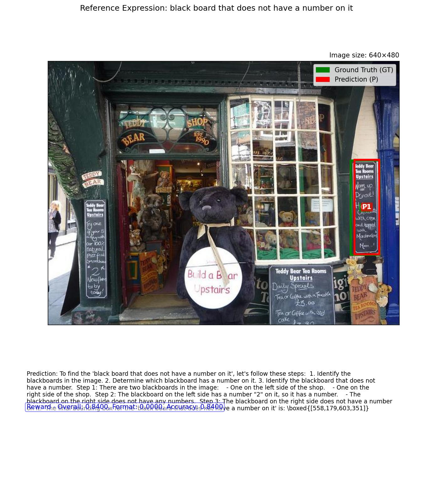

---

### Example 262

**Reference Expression**: the person behind the lady in orange

**Ground Truth**: [[425, 25, 506, 164]]

**Predicted**: [[436, 25, 510, 152]]

**Reward**: {'overall': 0.7555026769779893, 'format': 0.0, 'accuracy': 0.7555026769779893}

**Prediction**:
```
To find the bounding box for 'the person behind the lady in orange', let's follow these steps:

1. Identify the lady in orange: She is wearing an orange top and is positioned towards the back of the image, slightly to the right.
2. Find the person behind her: The person directly behind the lady in orange appears to be wearing a red and black cap and a white shirt.
3. Define the bounding box: The bounding box should encompass the head and shoulders of the person behind the lady in orange.

After identifying the person, the bounding box would be:

\boxed{[436,25,510,152]}
```

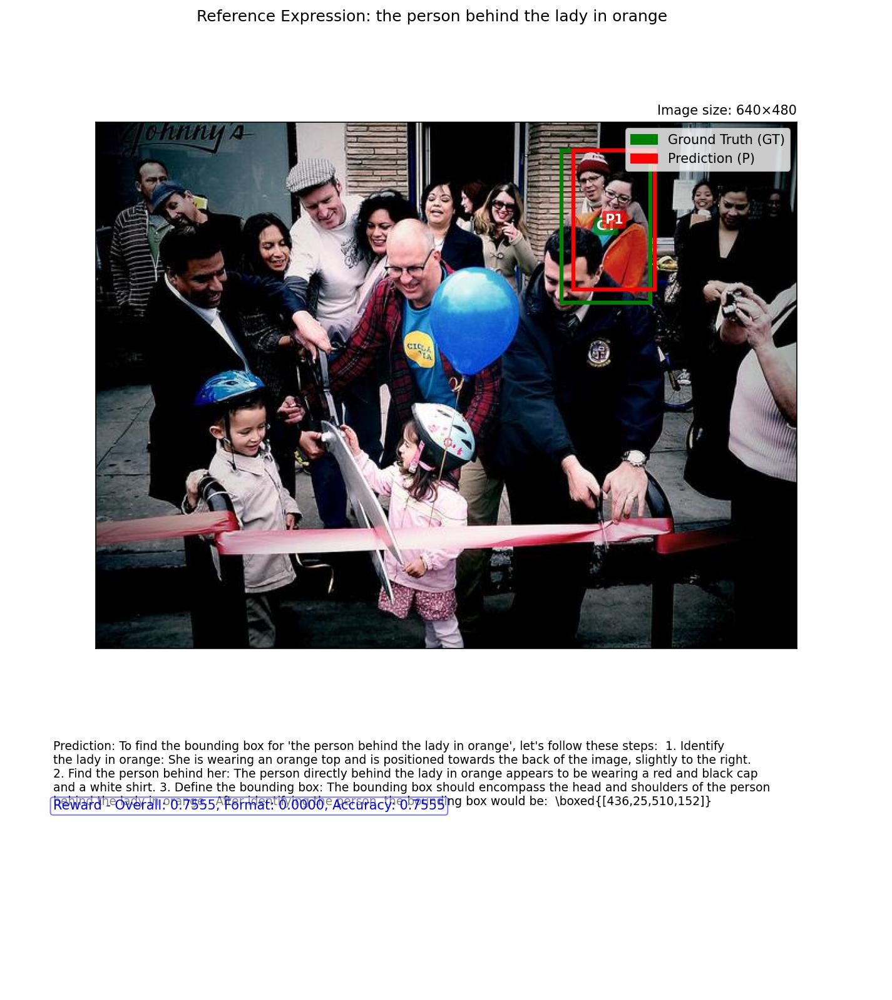

---

### Example 263

**Reference Expression**: person wearing striped shirt without long hair

**Ground Truth**: [[412, 88, 639, 439]]

**Predicted**: [[460, 92, 635, 442]]

**Reward**: {'overall': 0.7571506944963966, 'format': 0.0, 'accuracy': 0.7571506944963966}

**Prediction**:
```
To find the bounding box for the 'person wearing striped shirt without long hair', let's follow these steps:

1. Identify the striped shirt: Look for a person wearing a striped shirt. There are two individuals in striped shirts in the image.
2. Check for long hair: Among the two individuals in striped shirts, one has long hair and the other has short hair. The one with short hair is the one we're looking for.
3. Locate the person: The person with short hair in the striped shirt is on the right side of the image, sitting next to the person in the blue and white patterned shirt.

The bounding box for the person wearing the striped shirt without long hair is:
\boxed{[460,92,635,442]}.
```

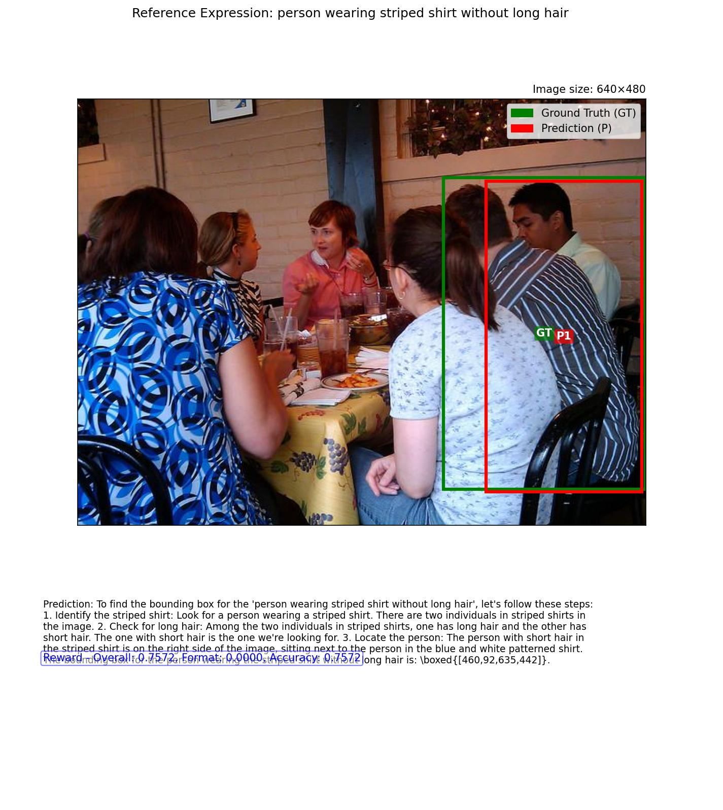

---

### Example 264

**Reference Expression**: the person sitting on the left side of the red chair

**Ground Truth**: [[25, 117, 66, 155]]

**Predicted**: [[62, 131, 94, 168]]

**Reward**: {'overall': 0.0, 'format': 0.0, 'accuracy': 0.0}

**Prediction**:
```
To find the bounding box for 'the person sitting on the left side of the red chair', let's follow these steps:

1. Identify the red chair in the image. It is located on the left side of the image, near the center.
2. Look for the person sitting to the left of this red chair. This person appears to be sitting on the ground, and there is a blue bag next to them.
3. Determine the bounding box for this person. The bounding box should encapsulate the person's body, including their head and legs.

After analyzing the image, the bounding box for 'the person sitting on the left side of the red chair' is:

\boxed{[62,131,94,168]}
```

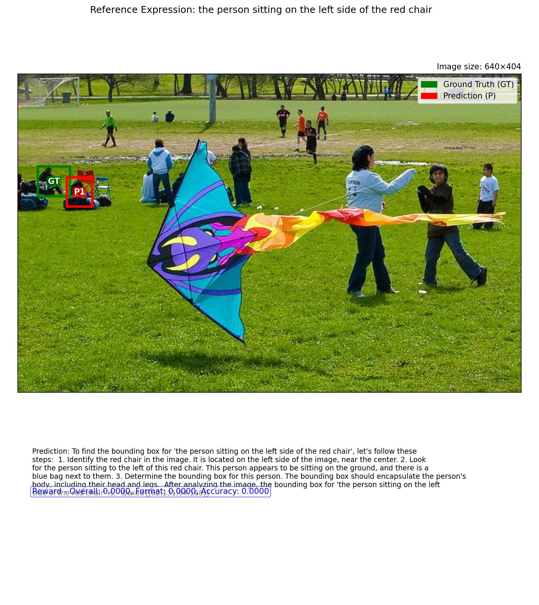

---

### Example 265

**Reference Expression**: the image containing fork and knife

**Ground Truth**: [[430, 226, 621, 417]]

**Predicted**: [[432, 225, 626, 419]]

**Reward**: {'overall': 1.0, 'format': 0.0, 'accuracy': 1.0}

**Prediction**:
```
To find the bounding box for the image containing a fork and a knife, let's follow these steps:

1. Identify the images in the collage: The collage consists of six images, each showing a slice of pizza.
2. Look for the presence of a fork and a knife: In one of the images, there is a fork and a knife visible on the plate with the pizza slice.
3. Locate the specific image: The image in the top right corner of the collage shows a pizza slice with a fork and a knife on the plate.

The bounding box for the image containing the fork and knife is:
\boxed{[432,225,626,419]}
```

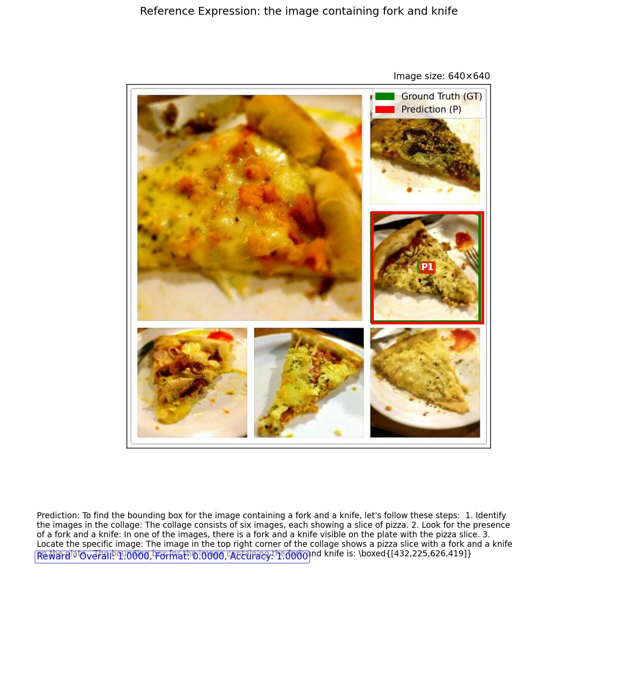

---

### Example 266

**Reference Expression**: letter X on the wall

**Ground Truth**: []

**Predicted**: []

**Reward**: {'overall': 1.0, 'format': 0.0, 'accuracy': 1.0}

**Prediction**:
```
The image does not contain a letter 'X' on the wall. The wall contains the text "J.P.Morgan" and "POLO". Therefore, there is no bounding box for a letter 'X' on the wall.

\boxed{[]}
```

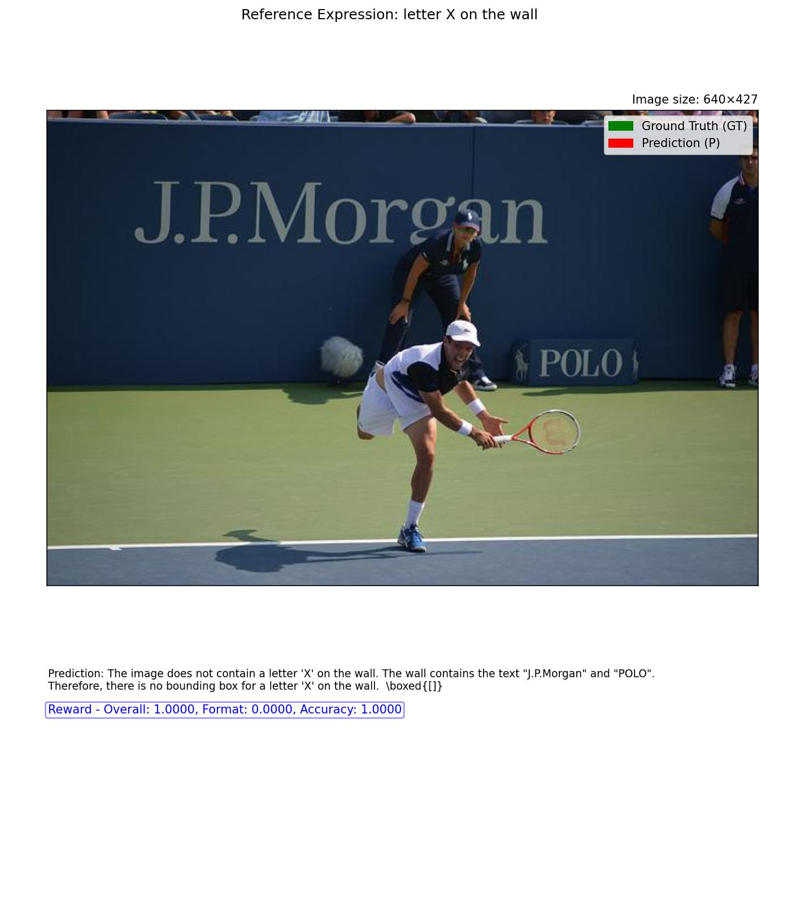

---

### Example 267

**Reference Expression**: the person standing to the right of the boy is not wearing a hat or holding a trophy

**Ground Truth**: [[386, 156, 461, 478]]

**Predicted**: [[413, 208, 531, 448]]

**Reward**: {'overall': 0.2813186813186813, 'format': 0.0, 'accuracy': 0.2813186813186813}

**Prediction**:
```
To find the bounding box for 'the person standing to the right of the boy who is not wearing a hat or holding a trophy', we need to follow these steps:

1. Identify the boy who is not wearing a hat and is not holding a trophy. This boy is standing in the second row from the front, on the far right side.
2. Find the person standing to the right of this boy. This person is also in the second row from the front, on the far right side as well.
3. Observe that the person to the right of this boy is wearing a white shirt and is not wearing a hat.
4. Confirm that this person is not holding a trophy.

The bounding box for this person is \boxed{[413,208,531,448]}.
```

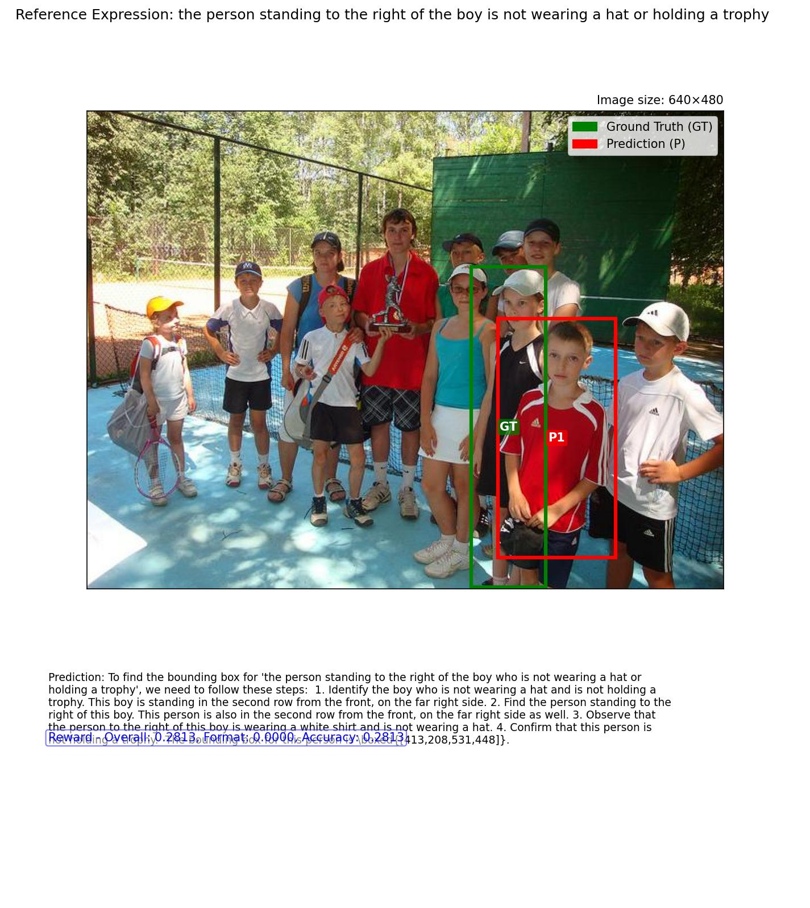

---

### Example 268

**Reference Expression**: the car that is in the shade of the bus

**Ground Truth**: [[47, 231, 151, 299]]

**Predicted**: [[49, 225, 151, 293]]

**Reward**: {'overall': 0.8230088495575221, 'format': 0.0, 'accuracy': 0.8230088495575221}

**Prediction**:
```
To find the car that is in the shade of the bus, we need to identify the car that is positioned directly behind the red bus and is partially obscured by it. Here's the step-by-step reasoning:

1. Identify the red bus in the image. It is the bus in the center with the text "Gold Coast Tours" on it.
2. Look for a car positioned directly behind the red bus. The car in question is the black car to the left of the red bus.
3. Check if this car is partially shaded by the red bus. The car is indeed partially shaded by the red bus.

Therefore, the bounding box for the car that is in the shade of the bus is:
\boxed{[49,225,151,293]}
```

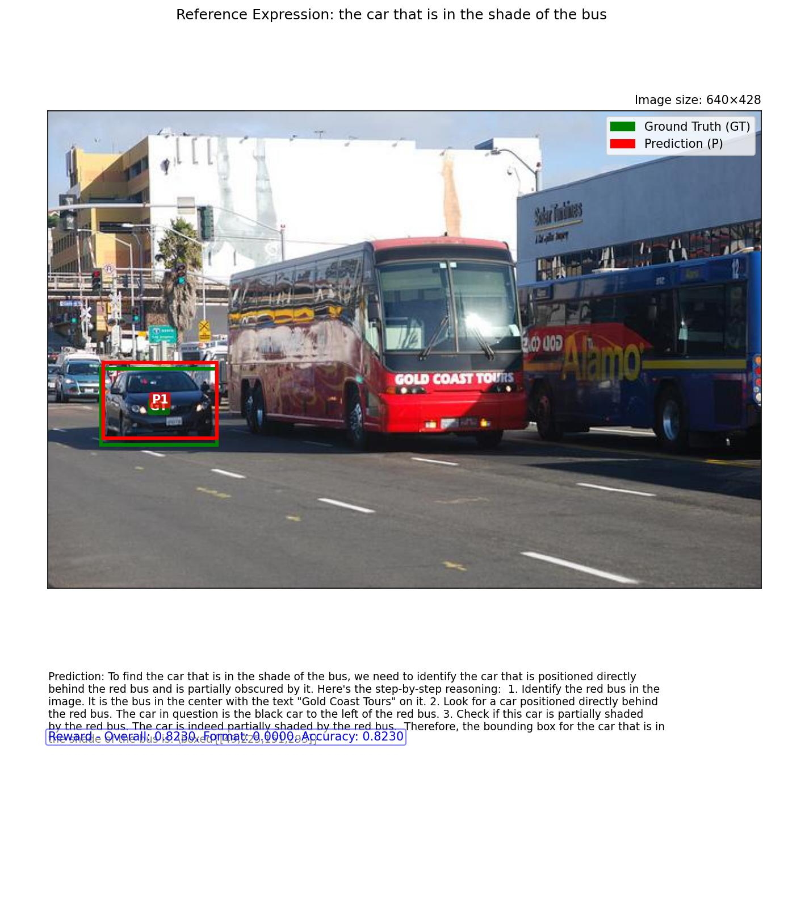

---

### Example 269

**Reference Expression**: the person that is on the street and neither riding a motorcycle nor wearing blue shirt

**Ground Truth**: [[45, 122, 84, 268]]

**Predicted**: [[43, 120, 87, 268]]

**Reward**: {'overall': 0.8743857493857494, 'format': 0.0, 'accuracy': 0.8743857493857494}

**Prediction**:
```
To find the bounding box for 'the person that is on the street and neither riding a motorcycle nor wearing blue shirt', we need to follow these steps:

1. Identify all people in the image who are not on a motorcycle and are not wearing a blue shirt.
2. Focus on the individuals who are on the street and not interacting with the police officer or the motorcycle.

- The police officer is riding the motorcycle and is wearing a blue shirt.
- The person in the blue shirt is walking on the left side of the image.
- The person in the black shirt and shorts is walking on the right side of the image.

The person in the black shirt and shorts is the one who is on the street and neither riding a motorcycle nor wearing a blue shirt.

The bounding box for this person is:
\boxed{[43,120,87,268]}

This bounding box captures the person in the black shirt and shorts walking on the sidewalk.
```

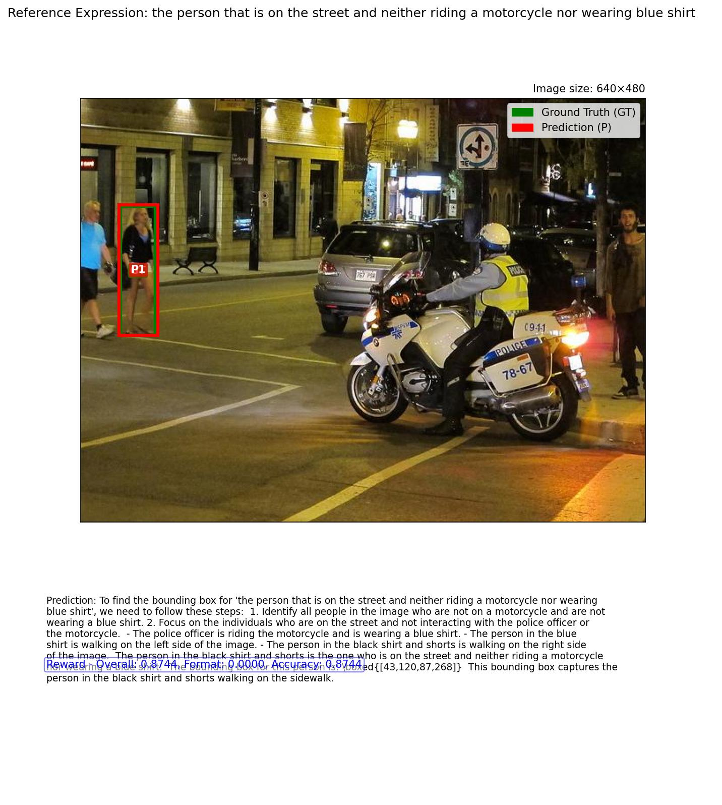

---

### Example 270

**Reference Expression**: the lightest-colored car among the three parked one behind the other near the roadside closest to the camera

**Ground Truth**: [[123, 523, 182, 557]]

**Predicted**: [[120, 527, 180, 557]]

**Reward**: {'overall': 0.8158396946564885, 'format': 0.0, 'accuracy': 0.8158396946564885}

**Prediction**:
```
To find the bounding box for 'the lightest-colored car among the three parked one behind the other near the roadside closest to the camera', let's follow these steps:

1. Identify the cars near the roadside closest to the camera.
2. Determine which car is the lightest-colored among the three.

Step 1: The cars near the roadside closest to the camera are:
- A black car on the left.
- A white car in the middle.
- A dark car on the right.

Step 2: Among these three, the white car is the lightest-colored.

Now, we need to determine the bounding box for this white car. The white car is positioned between the black car and the dark car, and it is parked behind the black car.

The bounding box for the white car can be approximated as follows:
- Top left corner: The upper part of the white car.
- Bottom left corner: The lower part of the white car, slightly to the left.
- Top right corner: The upper part of the white car, slightly to the right.
- Bottom right corner: The lower part of the white car, slightly to the right.

Given the relative positions and the typical size of cars, the bounding box can be roughly defined as:
\boxed{[120,527,180,557]}

This bounding box captures the white car among the three parked cars.
```

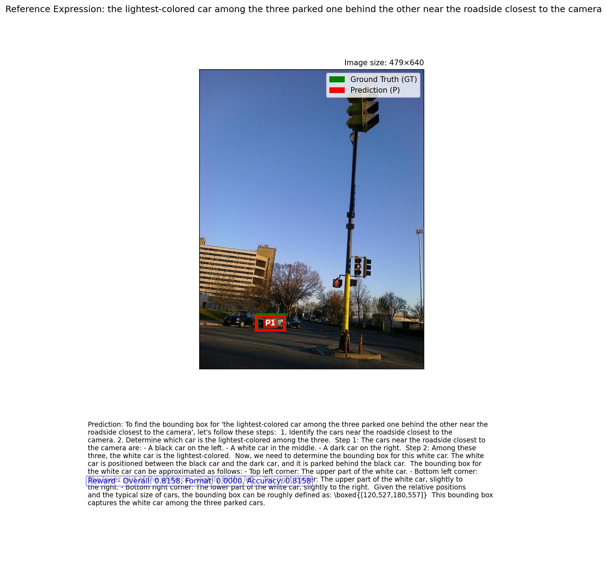

---

### Example 271

**Reference Expression**: the red car that is not waiting at the traffic light

**Ground Truth**: [[522, 260, 604, 308]]

**Predicted**: [[376, 253, 514, 326]]

**Reward**: {'overall': 0.0, 'format': 0.0, 'accuracy': 0.0}

**Prediction**:
```
To find the bounding box for 'the red car that is not waiting at the traffic light', let's follow these steps:

1. Identify the red cars in the image. There are two red cars visible in the image.
2. Determine which red car is not waiting at the traffic light. The red car on the right side of the image appears to be in motion, as it is not aligned with the traffic light and is positioned on the road, suggesting it is not waiting.
3. The other red car is positioned closer to the traffic light and appears to be waiting.

Based on these observations, the red car that is not waiting at the traffic light is the one on the right side of the image.

The bounding box for this red car is:
\boxed{[376,253,514,326]}
```

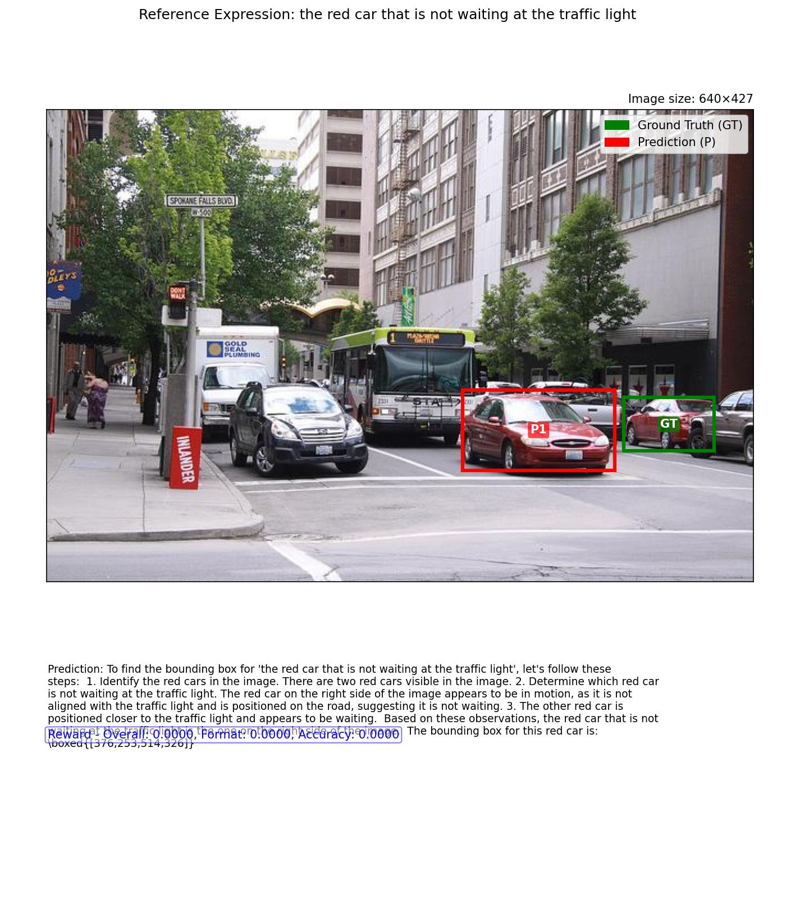

---

### Example 272

**Reference Expression**: the traffic light that is not farthest from the camera and does not have a no turning sign on it

**Ground Truth**: [[0, 226, 19, 265]]

**Predicted**: [[0, 262, 22, 302]]

**Reward**: {'overall': 0.0, 'format': 0.0, 'accuracy': 0.0}

**Prediction**:
```
To find the traffic light that is not farthest from the camera and does not have a no-turning sign on it, we need to follow these steps:

1. Identify all traffic lights in the image.
2. Determine which traffic light is the closest to the camera.
3. Identify the traffic light that is not the closest and check if it has a no-turning sign.

Step 1: Identifying all traffic lights
- There are two traffic lights visible in the image. One is on the far left and the other is in the center, closer to the camera.

Step 2: Determining the closest traffic light
- The traffic light on the far left is farther from the camera compared to the one in the center.

Step 3: Checking the traffic light in the center
- The traffic light in the center has a no-turning sign on it.

Step 4: Identifying the traffic light that is not farthest from the camera and does not have a no-turning sign
- The traffic light on the far left is not farthest from the camera, but it does not have a no-turning sign.

Therefore, the traffic light that is not farthest from the camera and does not have a no-turning sign on it is the one on the far left.

The bounding box for this traffic light is \boxed{[0,262,22,302]}.
```

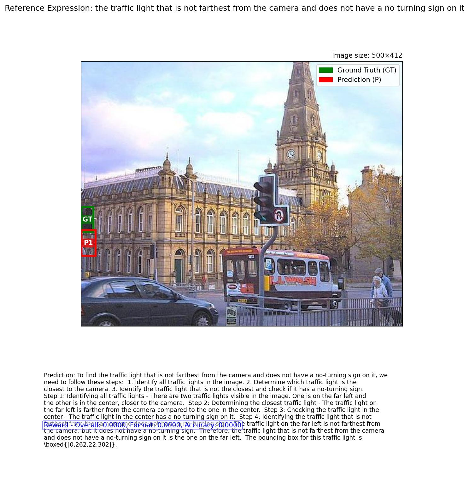

---

### Example 273

**Reference Expression**: the car that least should be parked where it is

**Ground Truth**: [[148, 290, 378, 376]]

**Predicted**: [[148, 282, 381, 371]]

**Reward**: {'overall': 0.8511902042308219, 'format': 0.0, 'accuracy': 0.8511902042308219}

**Prediction**:
```
To determine which car least should be parked where it is, we need to consider the context and potential hazards. Here's a step-by-step analysis:

1. **Identify the cars**: There are two cars in the image - one black car parked close to the red bus and another black car further in the background.
2. **Consider the parking space**: The black car parked close to the red bus appears to be in a narrow space, and it seems to be partially obstructing the view or space for the red bus.
3. **Evaluate potential hazards**: Parking close to a large vehicle like a bus can be risky, as it might block the bus's view or make it difficult for the bus to maneuver.
4. **Assess the situation**: The black car parked close to the red bus seems to be in a position that could potentially hinder the bus's movement or visibility, which is generally not ideal.

Given these points, the black car parked close to the red bus appears to be the one that least should be parked where it is.

\boxed{[148,282,381,371]}
```

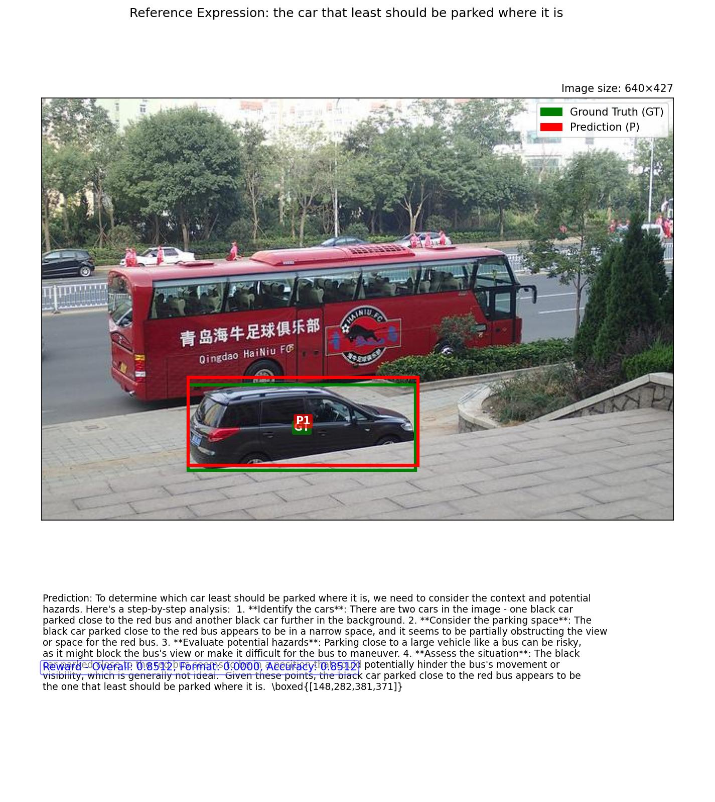

---

### Example 274

**Reference Expression**: the person on the motorcycle but not holding the handlebar

**Ground Truth**: [[183, 182, 326, 421]]

**Predicted**: [[186, 122, 329, 420]]

**Reward**: {'overall': 0.766488003496584, 'format': 0.0, 'accuracy': 0.766488003496584}

**Prediction**:
```
To find the bounding box for 'the person on the motorcycle but not holding the handlebar', we need to follow these steps:

1. Identify the person on the motorcycle: There are two people on the motorcycle, one in the front holding the handlebar and one in the back.
2. Determine who is not holding the handlebar: The person in the back is not holding the handlebar.
3. Locate the bounding box for the person in the back: This person is wearing a helmet and is seated behind the person in the front, who is holding the handlebar.

Following these steps, the bounding box for 'the person on the motorcycle but not holding the handlebar' is:

\boxed{[186,122,329,420]}
```

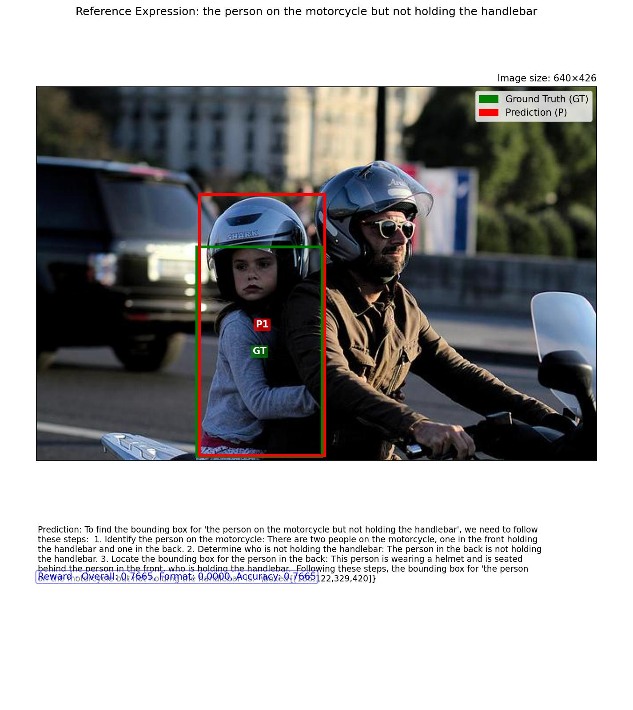

---

### Example 275

**Reference Expression**: the person carrying a bag and holding an umbrella

**Ground Truth**: [[298, 429, 361, 617]]

**Predicted**: [[351, 336, 434, 609]]

**Reward**: {'overall': 0.0, 'format': 0.0, 'accuracy': 0.0}

**Prediction**:
```
To find the bounding box for 'the person carrying a bag and holding an umbrella', let's follow these steps:

1. Identify the people holding umbrellas in the image.
2. Determine which of those people is also carrying a bag.
3. Locate the bounding box for that person.

Step 1: There are two people holding umbrellas. One is on the left side of the image, and the other is on the right side of the image.

Step 2: The person on the right side of the image appears to be holding an umbrella and also seems to be carrying a bag. The person on the left does not seem to be carrying a bag.

Step 3: The person on the right side of the image, holding an umbrella and carrying a bag, is the one we are looking for. This person is wearing a dark jacket and pants, and they are holding a black umbrella.

The bounding box for 'the person carrying a bag and holding an umbrella' is:
\boxed{[351,336,434,609]}
```

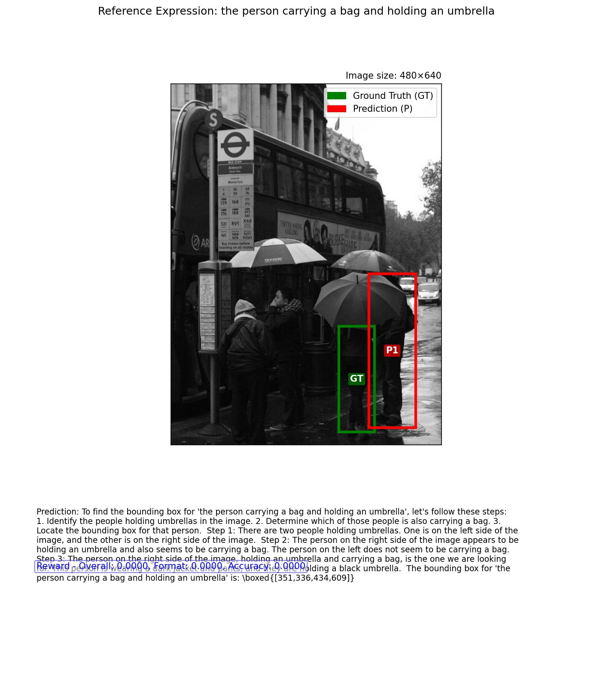

---

### Example 276

**Reference Expression**: the person walking away from the camera and closest to the roundabout sign

**Ground Truth**: [[39, 180, 81, 301]]

**Predicted**: [[39, 176, 80, 297]]

**Reward**: {'overall': 1.0, 'format': 0.0, 'accuracy': 1.0}

**Prediction**:
```
To find the bounding box for 'the person walking away from the camera and closest to the roundabout sign', let's follow these steps:

1. Identify the roundabout sign: The roundabout sign is on the left side of the image, near the edge.
2. Look for the person closest to this sign: There is a person walking away from the camera on the left side of the image, near the roundabout sign.
3. Determine the bounding box: The person is wearing dark clothing and is positioned to the left of the roundabout sign.

Given these observations, the bounding box for the person walking away from the camera and closest to the roundabout sign is:

\boxed{[39,176,80,297]}
```

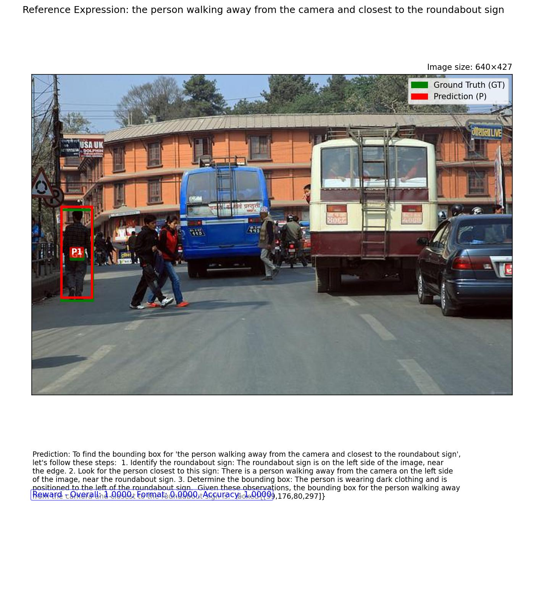

---

### Example 277

**Reference Expression**: the person on the motorcycle that has only one rider on it

**Ground Truth**: [[99, 78, 224, 274]]

**Predicted**: [[368, 56, 568, 469]]

**Reward**: {'overall': 0.0, 'format': 0.0, 'accuracy': 0.0}

**Prediction**:
```
To find the bounding box for 'the person on the motorcycle that has only one rider on it', we need to identify the motorcycle that is not shared by two people. 

1. In the image, there are two motorcycles.
2. The motorcycle in the foreground has two people on it (a man and a woman).
3. The motorcycle in the background has only one person on it (a man).

The bounding box for the person on the motorcycle that has only one rider is the one on the motorcycle in the background. 

The bounding box for the person on the motorcycle with only one rider is:
\boxed{[368,56,568,469]}
```

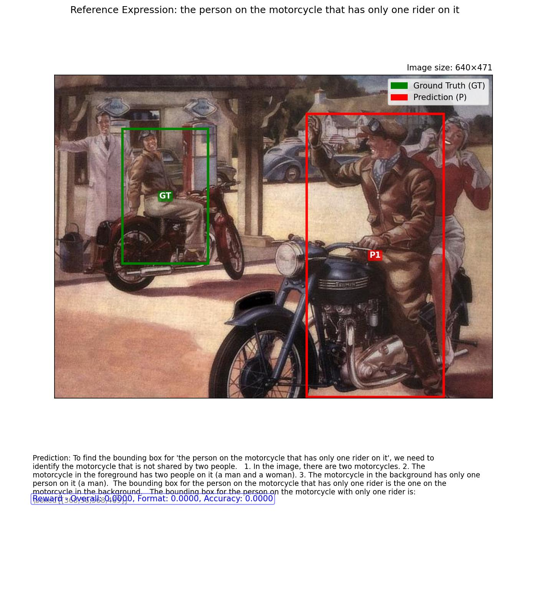

---

### Example 278

**Reference Expression**: the silver car that is furthest from the red bus

**Ground Truth**: [[351, 373, 391, 413]]

**Predicted**: [[415, 367, 461, 403]]

**Reward**: {'overall': 0.0, 'format': 0.0, 'accuracy': 0.0}

**Prediction**:
```
To find the bounding box for 'the silver car that is furthest from the red bus', let's follow these steps:

1. Identify the red bus: It is located on the right side of the image, partially visible.
2. Look for the silver car: We need to find the silver car that is not near the red bus.
3. Examine the cars: There are several cars parked or moving on the street. The silver car in question is the one further away from the red bus than the others.
4. Position the silver car: The silver car is located near the center of the image, to the left of the red bus.

After analyzing the image, the silver car that is furthest from the red bus is the one located near the center of the image, to the left of the red bus.

The bounding box for this silver car is:
\boxed{[415,367,461,403]}
```

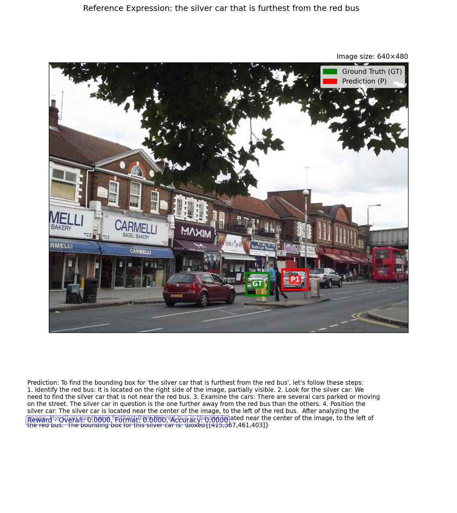

---

### Example 279

**Reference Expression**: the person wearing a beanie with sunglasses hanging on their head

**Ground Truth**: [[182, 199, 366, 480]]

**Predicted**: [[181, 195, 366, 476]]

**Reward**: {'overall': 1.0, 'format': 0.0, 'accuracy': 1.0}

**Prediction**:
```
To find the bounding box for 'the person wearing a beanie with sunglasses hanging on their head', let's follow these steps:

1. Identify the beanie: Look for a person wearing a beanie. In this image, there is a person in the center wearing a black beanie.
2. Check for sunglasses on their head: The sunglasses are placed on top of the beanie.
3. Confirm the location: The person with the beanie and sunglasses on top is located in the center of the image, wearing a green jacket and a backpack.

Given these observations, the bounding box for this person is:
\boxed{[181,195,366,476]}
```

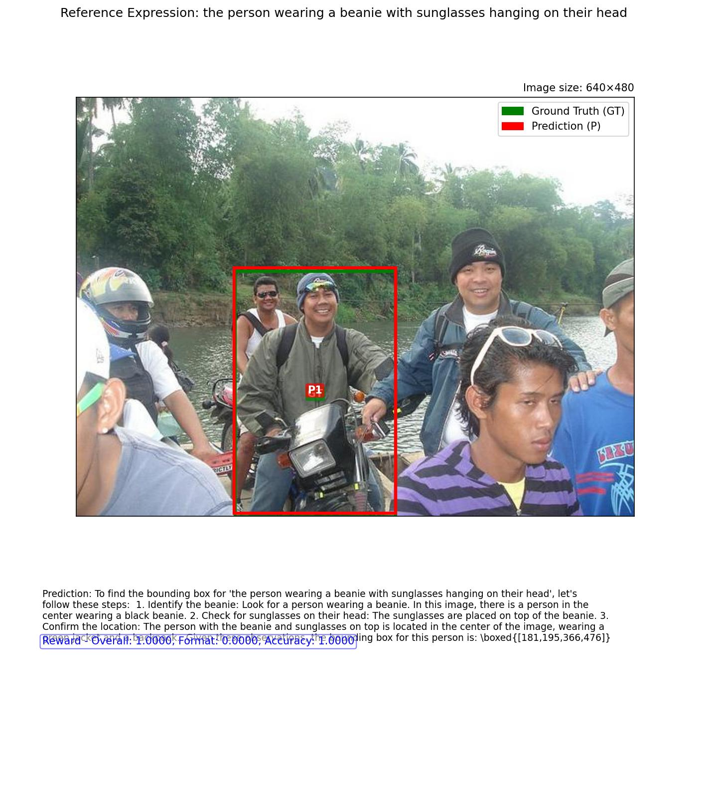

---

### Example 280

**Reference Expression**: the person who is driving a vehicle but not a motorcycle

**Ground Truth**: [[206, 170, 269, 225]]

**Predicted**: [[221, 161, 266, 224]]

**Reward**: {'overall': 0.627906976744186, 'format': 0.0, 'accuracy': 0.627906976744186}

**Prediction**:
```
To find the bounding box for the person who is driving a vehicle but not a motorcycle, we need to identify the driver of the bus in the image. Here's the step-by-step reasoning:

1. The image shows a green bus on the road.
2. The bus has a driver who is seated inside the vehicle.
3. The driver is located in the front of the bus, behind the steering wheel.
4. The driver is not a motorcycle rider, as the vehicle is a bus.

Given these observations, the bounding box for the person who is driving the bus is:

\boxed{[221,161,266,224]}
```

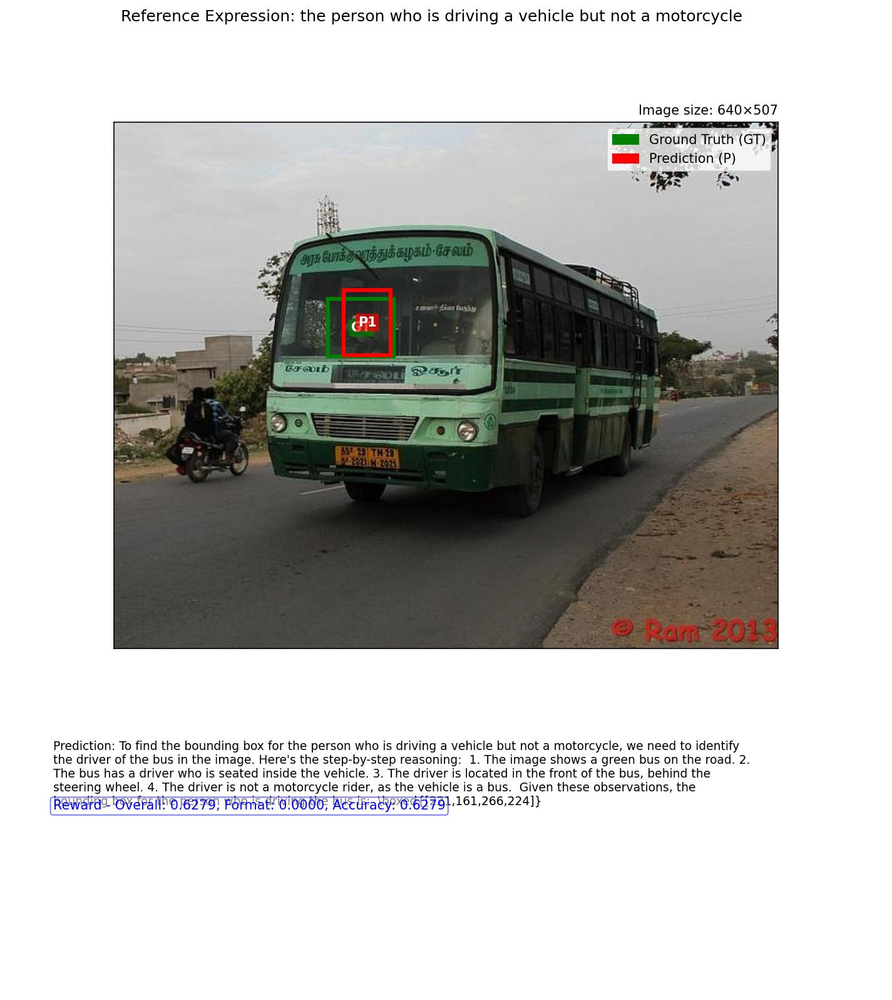

---

### Example 281

**Reference Expression**: the person wearing jeans and a black top

**Ground Truth**: [[163, 0, 243, 114]]

**Predicted**: [[318, 0, 432, 139]]

**Reward**: {'overall': 0.0, 'format': 0.0, 'accuracy': 0.0}

**Prediction**:
```
To find the bounding box for 'the person wearing jeans and a black top', let's follow these steps:

1. Identify the person in question: The individual in question is likely standing in the background, wearing jeans and a black top.
2. Locate the person: In the background, there is a person standing with jeans and a black top. This person appears to be near the motorcycle.
3. Define the bounding box: The bounding box should encompass the person's upper body and lower body, as they appear to be standing upright.

After analyzing the image, the bounding box for 'the person wearing jeans and a black top' is:

\boxed{[318,0,432,139]}
```

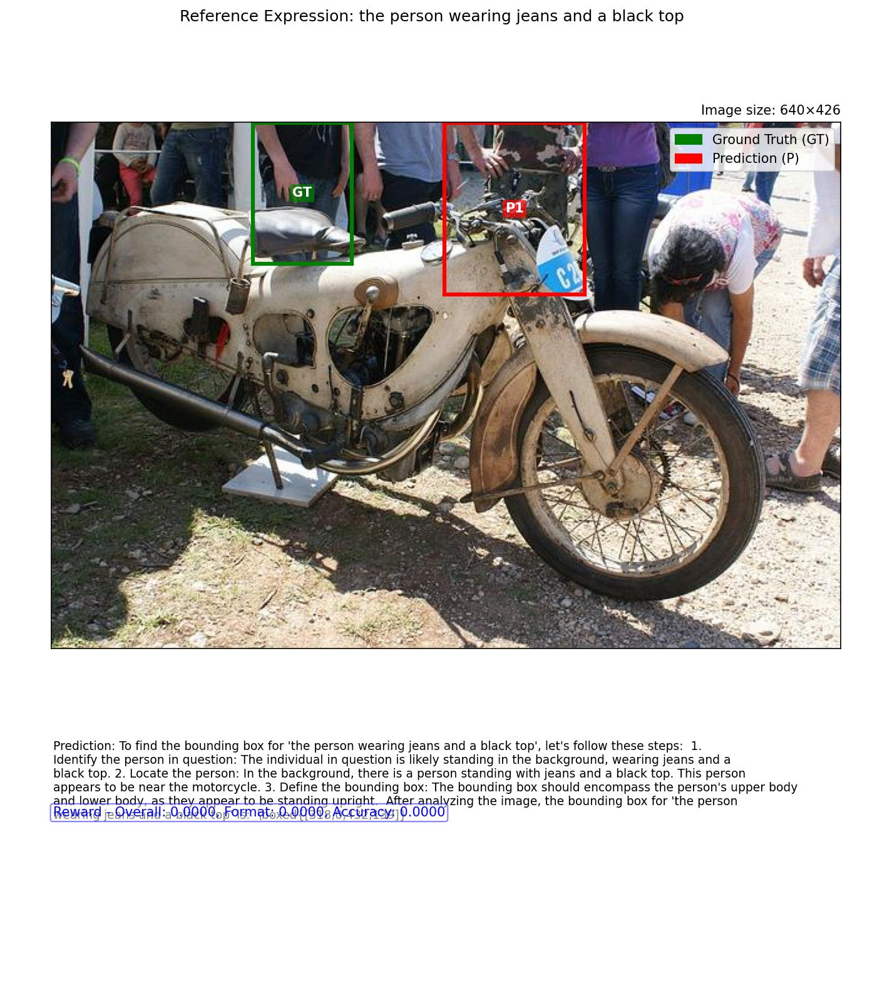

---

### Example 282

**Reference Expression**: the person facing the camera, wearing a reflective vest and a hat

**Ground Truth**: [[378, 147, 423, 233]]

**Predicted**: [[378, 148, 426, 218]]

**Reward**: {'overall': 0.7720588235294118, 'format': 0.0, 'accuracy': 0.7720588235294118}

**Prediction**:
```
To find the bounding box for 'the person facing the camera, wearing a reflective vest and a hat', let's follow these steps:

1. Identify the group of people in the image: There are four individuals in the image, and we need to focus on one who is facing the camera and wearing a reflective vest and a hat.
2. Examine the individuals: The person on the right side of the image, standing near the motorcycle, is facing the camera. This person is wearing a reflective vest and a hat.
3. Confirm the details: The person is indeed facing the camera, wearing a reflective vest, and has a hat on.

Based on these observations, the bounding box for 'the person facing the camera, wearing a reflective vest and a hat' is:

\boxed{[378,148,426,218]}
```

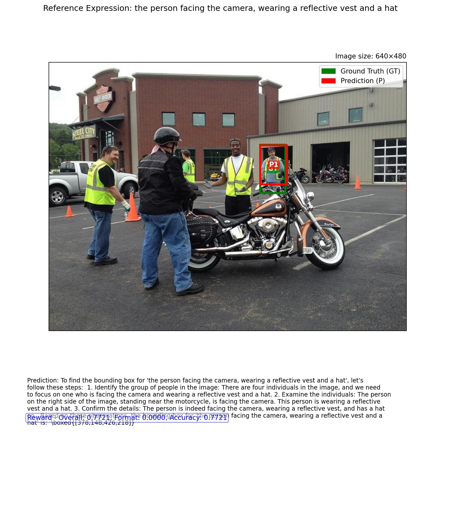

---

### Example 283

**Reference Expression**: the red motorcycle ridden by a person not wearing a yellow shirt

**Ground Truth**: [[297, 288, 377, 375]]

**Predicted**: [[304, 302, 547, 446]]

**Reward**: {'overall': 0.14550965240422686, 'format': 0.0, 'accuracy': 0.14550965240422686}

**Prediction**:
```
To find the bounding box for 'the red motorcycle ridden by a person not wearing a yellow shirt', we need to follow these steps:

1. Identify the red motorcycle ridden by a person not wearing a yellow shirt:
   - There are two red motorcycles in the image. One is ridden by a person in a white shirt, and the other by a person in a blue shirt.
   - The person in the blue shirt is not wearing a yellow shirt.

2. Locate the red motorcycle ridden by the person in the blue shirt:
   - The person in the blue shirt is on the right side of the image, riding a red motorcycle.

3. Define the bounding box for the red motorcycle ridden by the person in the blue shirt:
   - The bounding box should encompass the entire motorcycle and the rider.
   - The motorcycle is positioned on the right side of the image, and the rider is wearing a blue shirt and a red helmet.

Given these observations, the bounding box for 'the red motorcycle ridden by a person not wearing a yellow shirt' is:

\boxed{[304,302,547,446]}
```

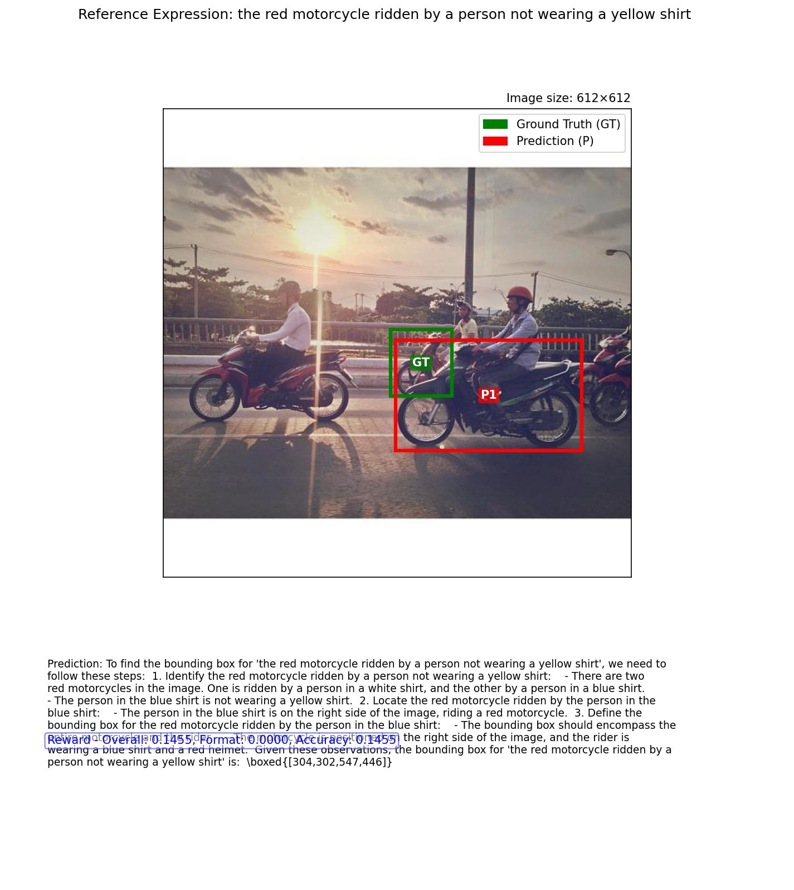

---

### Example 284

**Reference Expression**: the person wearing a reflective vest with their back to the camera

**Ground Truth**: [[463, 237, 478, 289]]

**Predicted**: [[427, 233, 447, 295]]

**Reward**: {'overall': 0.0, 'format': 0.0, 'accuracy': 0.0}

**Prediction**:
```
To find the bounding box for the person wearing a reflective vest with their back to the camera, let's follow these steps:

1. Identify the group of people in the image. There are a few individuals standing on the right side of the image.
2. Focus on the individuals wearing reflective vests. There are at least two people wearing reflective vests.
3. Determine which of these individuals is facing away from the camera. One person appears to be facing away, while the others are facing towards the camera.
4. Locate the person wearing a reflective vest who is facing away from the camera. This person is standing to the right of the group and appears to be wearing a reflective vest.
5. Define the bounding box for this individual. The bounding box should encompass the person from head to toe, ensuring that the reflective vest is clearly visible.

Considering these steps, the bounding box for the person wearing a reflective vest with their back to the camera is:

\boxed{[427,233,447,295]}
```

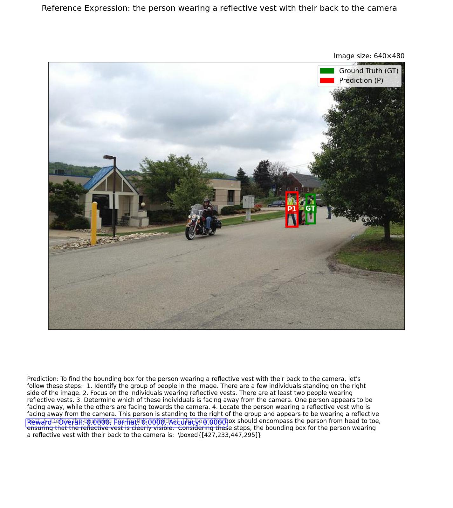

---

### Example 285

**Reference Expression**: the fifth plane from the top in the stack

**Ground Truth**: []

**Predicted**: []

**Reward**: {'overall': 1.0, 'format': 0.0, 'accuracy': 1.0}

**Prediction**:
```
The image shows a formation of aircraft, but it is not clear how many planes are stacked or in formation. However, based on the visible planes, it seems there are at least four planes in the stack. Since the question asks for the fifth plane, and there are only four planes visible, it is not possible to identify a fifth plane in the stack. Therefore, the corresponding bounding box for 'the fifth plane from the top in the stack' would be empty.

\boxed{[]}
```

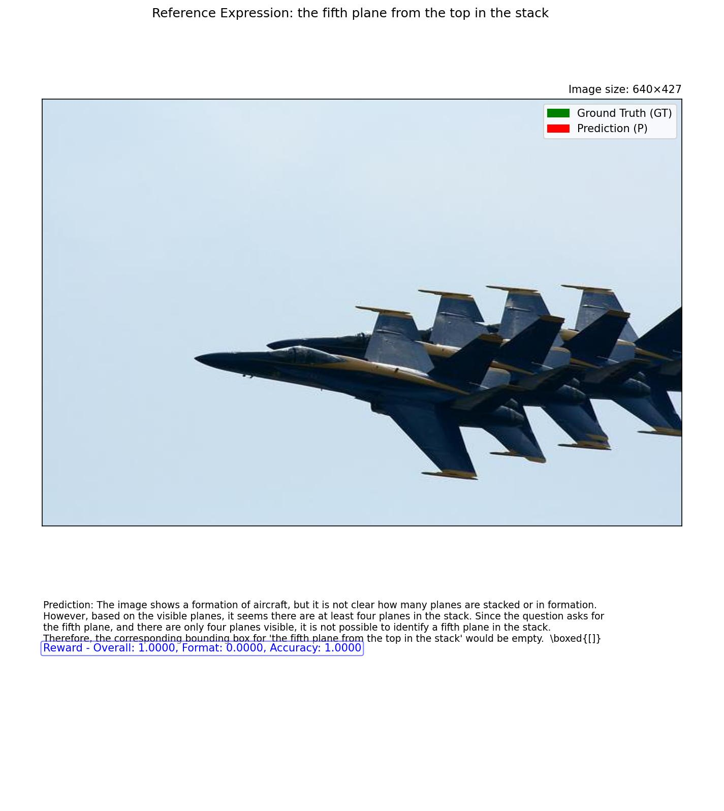

---

### Example 286

**Reference Expression**: the person boarding the plane wearing a white shirt and carrying a backpack

**Ground Truth**: [[333, 99, 353, 162]]

**Predicted**: [[309, 97, 349, 140]]

**Reward**: {'overall': 0.2822719449225473, 'format': 0.0, 'accuracy': 0.2822719449225473}

**Prediction**:
```
To find the bounding box for 'the person boarding the plane wearing a white shirt and carrying a backpack', let's follow these steps:

1. Identify the plane: The plane is the United Express aircraft in the background.
2. Locate the boarding area: The boarding area is the set of stairs leading up to the plane.
3. Look for individuals boarding: Focus on the area near the stairs where people are approaching or boarding the plane.
4. Identify the person in question: Among the individuals boarding, find the one wearing a white shirt and carrying a backpack.

After analyzing the image:
- There is a person in the middle of the boarding area wearing a white shirt and carrying a backpack.

The bounding box for this person would be:
\boxed{[309,97,349,140]}

This bounding box captures the individual wearing a white shirt and carrying a backpack as they board the plane.
```

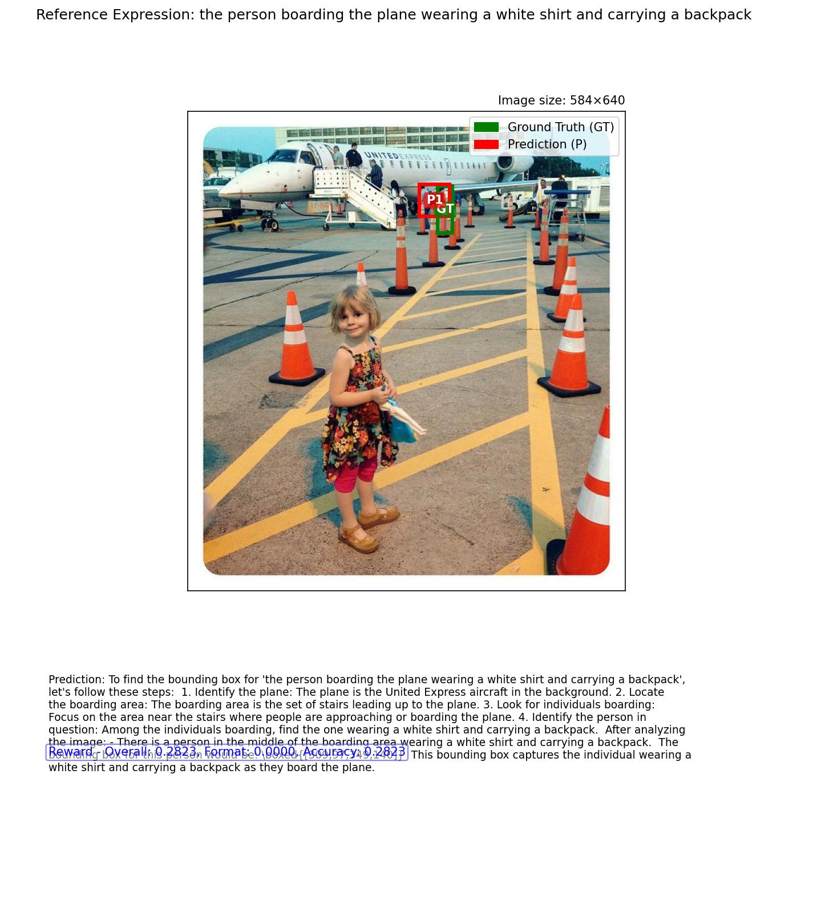

---

### Example 287

**Reference Expression**: the person wearing a reflective vest and standing under the airplane

**Ground Truth**: [[299, 493, 330, 569]]

**Predicted**: [[295, 469, 326, 573]]

**Reward**: {'overall': 0.5816326530612245, 'format': 0.0, 'accuracy': 0.5816326530612245}

**Prediction**:
```
To find the bounding box for the person wearing a reflective vest and standing under the airplane, follow these steps:

1. Identify the airplane in the foreground: It's the large aircraft with the visible engine and landing gear.
2. Look for the area under the airplane where a person could be standing. This would typically be near the front landing gear or the area where the nose wheel is located.
3. Focus on the lower part of the airplane and the ground area directly underneath it.
4. Observe the individuals in the image: There is a person wearing a reflective vest standing near the nose of the airplane.

After analyzing these steps, the bounding box for the person wearing a reflective vest and standing under the airplane can be identified.

\boxed{[295,469,326,573]}
```

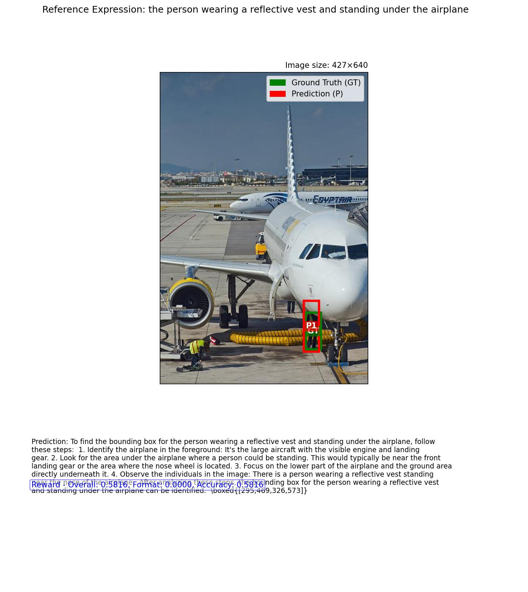

---

### Example 288

**Reference Expression**: the plane that is not orange and does not have "U.S. AIR FORCE" written on it

**Ground Truth**: [[126, 292, 380, 404]]

**Predicted**: [[126, 292, 385, 391]]

**Reward**: {'overall': 0.8688111114950074, 'format': 0.0, 'accuracy': 0.8688111114950074}

**Prediction**:
```
To find the bounding box for the plane that is not orange and does not have "U.S. AIR FORCE" written on it, we need to follow these steps:

1. Identify the planes in the image:
   - There is a large aircraft with "U.S. AIR FORCE" written on it.
   - There is a smaller orange biplane.
   - There is a yellow biplane with the registration "N4339".
   - There is another orange biplane partially visible on the right side.

2. Determine which plane does not have "U.S. AIR FORCE" written on it:
   - The large aircraft has "U.S. AIR FORCE" on it.
   - The orange biplane does not have any text on it.
   - The yellow biplane has "N4339" on it, which is not "U.S. AIR FORCE".
   - The orange biplane on the right side does not have any text on it.

3. Among the planes that do not have "U.S. AIR FORCE" written on them, we need to identify the one that is not orange:
   - The yellow biplane with "N4339" is not orange.
   - The orange biplane on the right side is orange and does not have text.

4. Therefore, the plane that is not orange and does not have "U.S. AIR FORCE" written on it is the yellow biplane with "N4339".

The bounding box for the yellow biplane with "N4339" is:
\boxed{[126,292,385,391]}
```

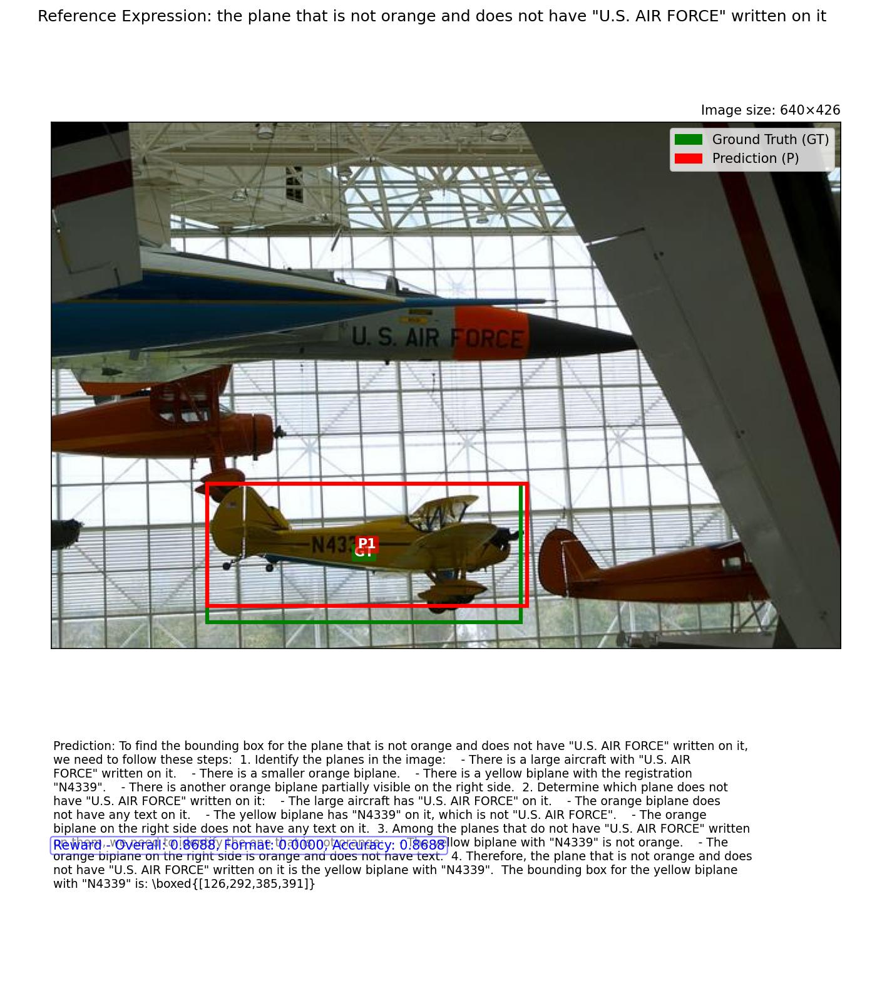

---

### Example 289

**Reference Expression**: the person with long curly hair in the right image

**Ground Truth**: [[387, 218, 447, 400]]

**Predicted**: [[388, 213, 448, 391]]

**Reward**: {'overall': 0.8959009918370929, 'format': 0.0, 'accuracy': 0.8959009918370929}

**Prediction**:
```
To find the bounding box for 'the person with long curly hair in the right image', follow these steps:

1. Identify the image: We are focusing on the right image of the split-screen picture.
2. Locate the person: In the right image, there is a person with long curly hair standing in the water.
3. Determine the bounding box: The bounding box should encompass the person from the head to the feet, capturing the entire figure.

The bounding box for 'the person with long curly hair in the right image' is:
\boxed{[388,213,448,391]}
```

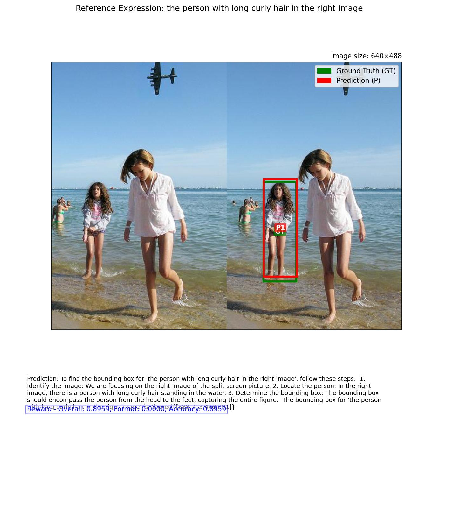

---

### Example 290

**Reference Expression**: the orange-and-black signal light that is the second furthest from the camera

**Ground Truth**: [[350, 332, 394, 377]]

**Predicted**: [[338, 326, 396, 458]]

**Reward**: {'overall': 0.25862068965517243, 'format': 0.0, 'accuracy': 0.25862068965517243}

**Prediction**:
```
To find the corresponding bounding box for 'the orange-and-black signal light that is the second furthest from the camera', we need to follow these steps:

1. Identify the signal lights in the image. They are the circular devices with red and black colors, placed on poles.
2. Determine the relative positions of these signal lights. The closest one to the camera is at the front, and the furthest one is at the back.
3. Identify the second furthest signal light from the camera. It is the one that is positioned between the closest and the farthest.

By analyzing the image, the second furthest signal light from the camera is located near the center of the image, slightly to the right of the center.

The bounding box for this signal light is:
\boxed{[338,326,396,458]}
```

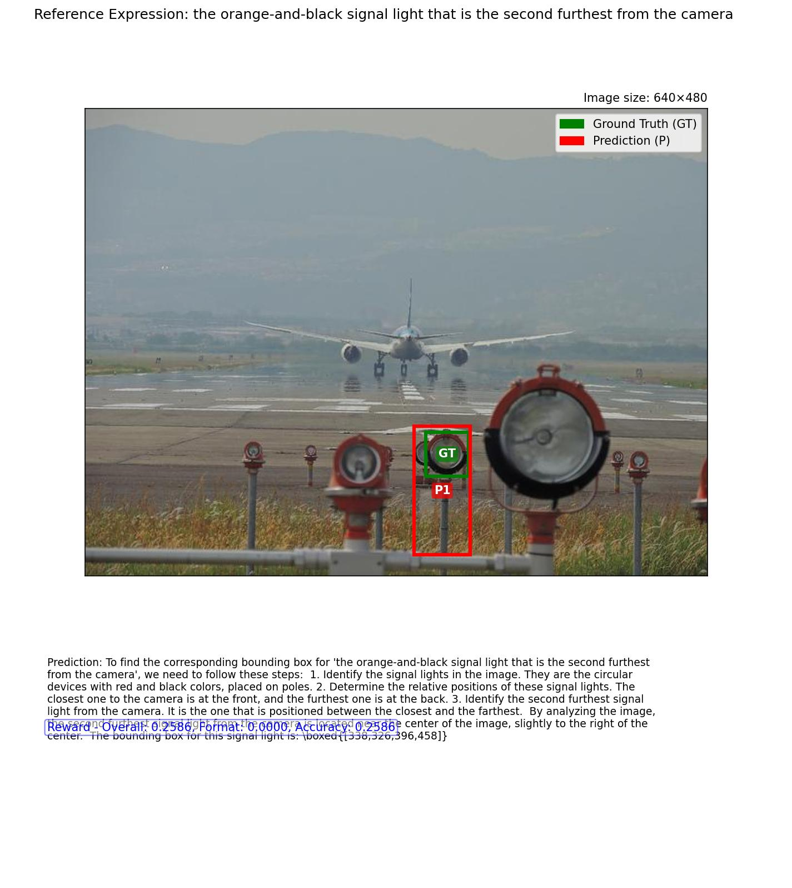

---

### Example 291

**Reference Expression**: the person standing near the nose of the plane wearing brown shorts

**Ground Truth**: [[81, 285, 117, 390]]

**Predicted**: [[76, 282, 118, 388]]

**Reward**: {'overall': 0.8196286472148541, 'format': 0.0, 'accuracy': 0.8196286472148541}

**Prediction**:
```
To find the bounding box for the person standing near the nose of the plane wearing brown shorts, let's follow these steps:

1. Identify the nose of the plane: The nose is the front part of the aircraft, where the cockpit is located.
2. Look for the person near the nose: There is a person standing near the nose of the plane, and they appear to be wearing brown shorts.
3. Locate the person: The person is standing to the left side of the plane's nose, closer to the left side of the image.
4. Determine the bounding box: The person is standing in a way that their upper body is visible, and their lower body is partially obscured by the plane's nose.

Given these observations, the bounding box for the person near the nose of the plane wearing brown shorts would be:

\boxed{[76,282,118,388]}
```

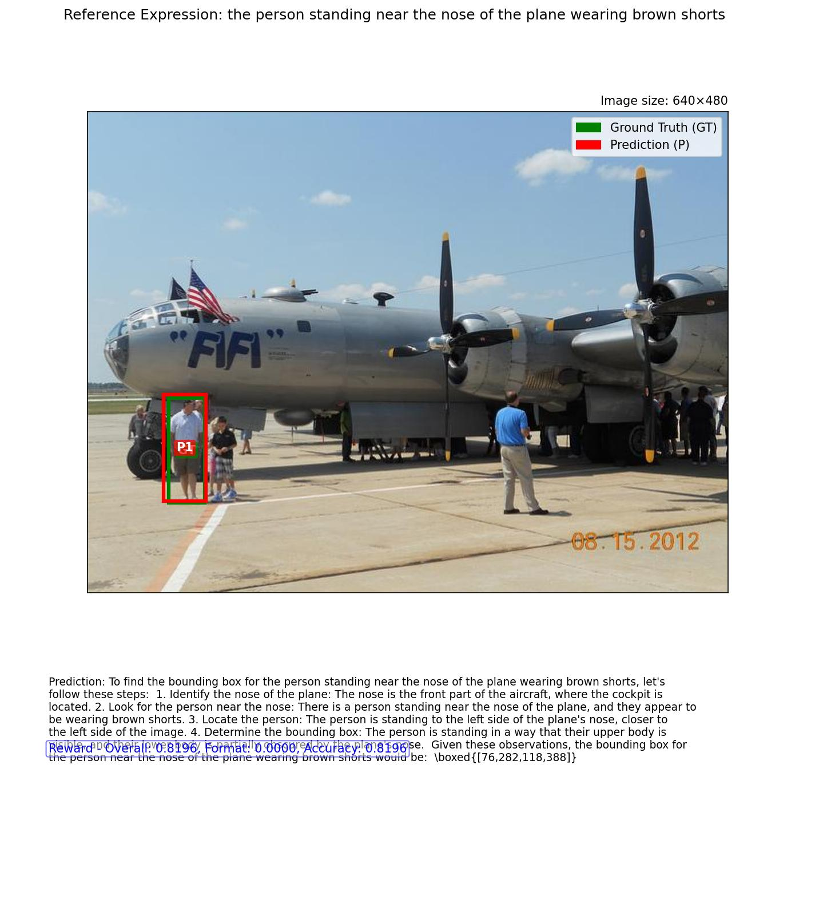

---

### Example 292

**Reference Expression**: the third suitcase that is about to enter the airplane cargo hold

**Ground Truth**: [[188, 322, 220, 346]]

**Predicted**: [[202, 320, 255, 346]]

**Reward**: {'overall': 0.25204200700116686, 'format': 0.0, 'accuracy': 0.25204200700116686}

**Prediction**:
```
To find the third suitcase that is about to enter the airplane cargo hold, let's follow these steps:

1. Identify the location of the airplane cargo hold: The cargo hold is the area underneath the airplane where luggage is loaded and unloaded.
2. Look for the area where luggage is being loaded: In the image, there is a luggage cart positioned underneath the airplane, indicating that luggage is being loaded into the cargo hold.
3. Count the suitcases on the luggage cart: There are three suitcases visible on the luggage cart.
4. Determine which suitcase is the third one: Starting from the front of the cart, the first suitcase is on the left, the second suitcase is in the middle, and the third suitcase is on the right.

Given these observations, the third suitcase that is about to enter the airplane cargo hold is the one on the right side of the luggage cart.

The bounding box for the third suitcase is:
\boxed{[202,320,255,346]}
```

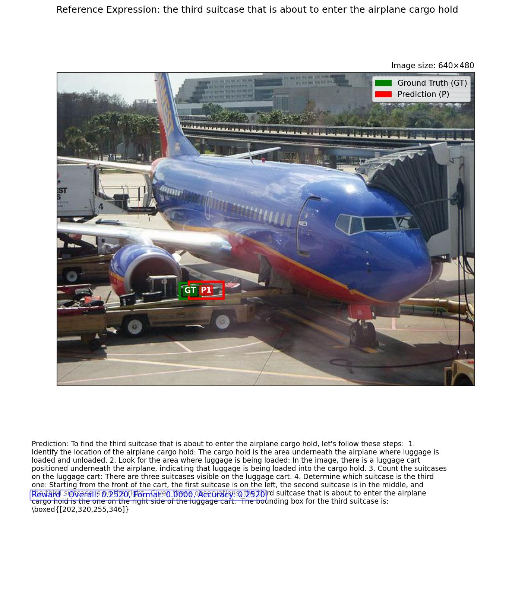

---

### Example 293

**Reference Expression**: the person in front of a building with a red bag

**Ground Truth**: [[56, 243, 69, 282]]

**Predicted**: []

**Reward**: {'overall': 0.0, 'format': 0.0, 'accuracy': 0.0}

**Prediction**:
```
To find the bounding box for 'the person in front of a building with a red bag', let's analyze the image step-by-step:

1. Identify the building with a red bag: The red bag appears to be on the sidewalk near the building, possibly carried by someone.
2. Locate the person: The person in front of the building with the red bag is not clearly visible in the image. The red bag is on the ground, and there are no people directly in front of it.

Given the analysis, the bounding box for 'the person in front of a building with a red bag' could be empty because there is no clear person in that specific location in the image.

\boxed{}
```

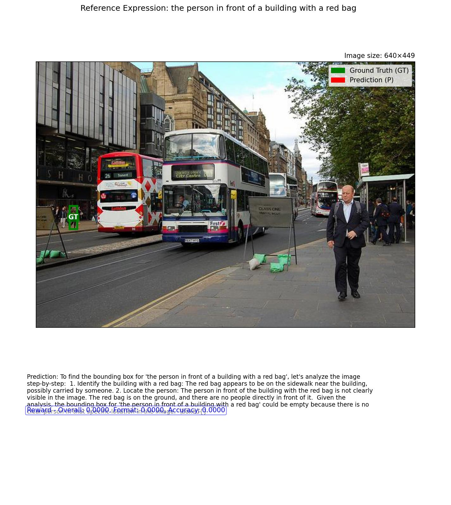

---

### Example 294

**Reference Expression**: the person in a white top not driving

**Ground Truth**: [[224, 296, 298, 384]]

**Predicted**: [[38, 337, 100, 519]]

**Reward**: {'overall': 0.0, 'format': 0.0, 'accuracy': 0.0}

**Prediction**:
```
To find the bounding box for 'the person in a white top not driving', let's follow these steps:

1. Identify the bus driver: The person driving the bus is likely the person seated in the driver's seat, which is the area where the steering wheel is located. This person is wearing a light-colored top.

2. Identify the person in a white top not driving: The person in a white top is standing on the sidewalk to the left of the bus, not in the driver's seat. This person appears to be wearing a white top and beige shorts.

3. Define the bounding box: The bounding box for the person in a white top not driving would be the area around this individual standing on the sidewalk.

Given these observations, the bounding box for 'the person in a white top not driving' would be:

\boxed{[38,337,100,519]}
```

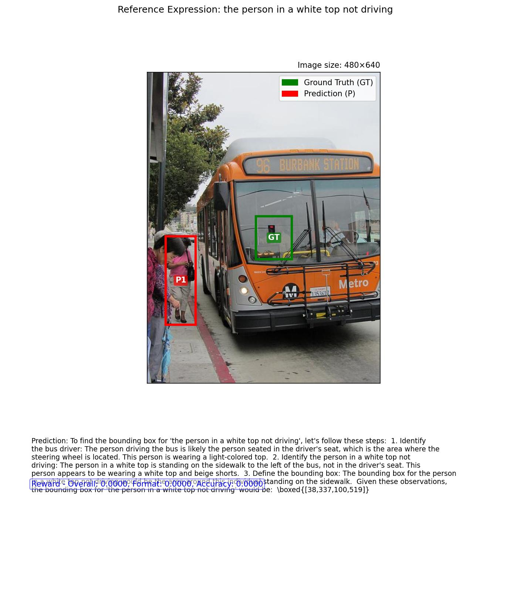

---

### Example 295

**Reference Expression**: the person in a white top facing sideways toward the camera

**Ground Truth**: [[226, 259, 261, 391]]

**Predicted**: [[336, 267, 388, 386]]

**Reward**: {'overall': 0.0, 'format': 0.0, 'accuracy': 0.0}

**Prediction**:
```
To find the bounding box for 'the person in a white top facing sideways toward the camera', let's follow these steps:

1. Identify the general area where the person might be located. In this image, there is a group of people standing on the sidewalk, and some individuals are facing different directions.
2. Focus on the individuals facing sideways. Among them, there is one person in a white top who is facing sideways and appears to be looking toward the camera.
3. Determine the bounding box for this person. The person in the white top is located towards the center of the image, standing near the middle of the group.

After carefully analyzing the image, the bounding box for the person in a white top facing sideways toward the camera is:

\boxed{[336,267,388,386]}
```

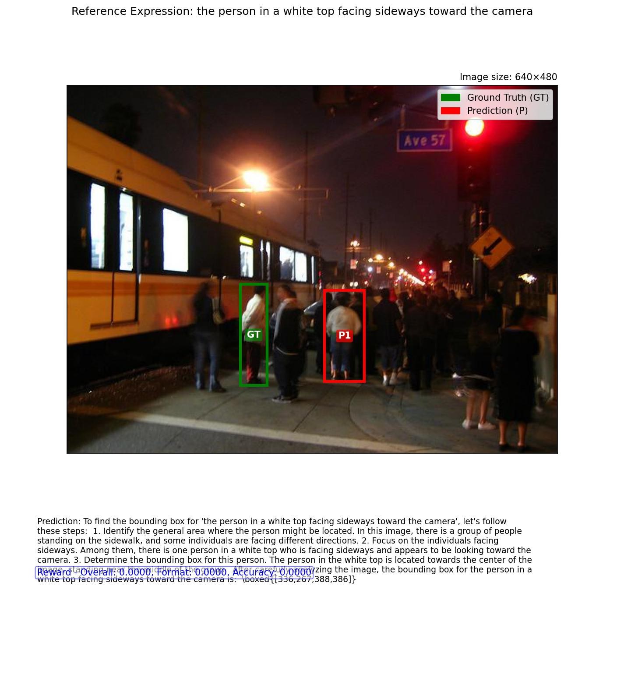

---

### Example 296

**Reference Expression**: the person with a hat and glasses

**Ground Truth**: [[1, 160, 36, 228]]

**Predicted**: [[0, 152, 52, 323]]

**Reward**: {'overall': 0.2676563202878992, 'format': 0.0, 'accuracy': 0.2676563202878992}

**Prediction**:
```
To find the bounding box for 'the person with a hat and glasses', let's analyze the image step-by-step:

1. Identify the person with a hat and glasses: In the image, there is a person wearing a hat and glasses located on the left side of the image, partially obscured by the person with the backpack.

2. Determine the bounding box: The bounding box for this person would be the area that encompasses their head and upper body.

The bounding box for 'the person with a hat and glasses' is \boxed{[0, 152, 52, 323]}.
```

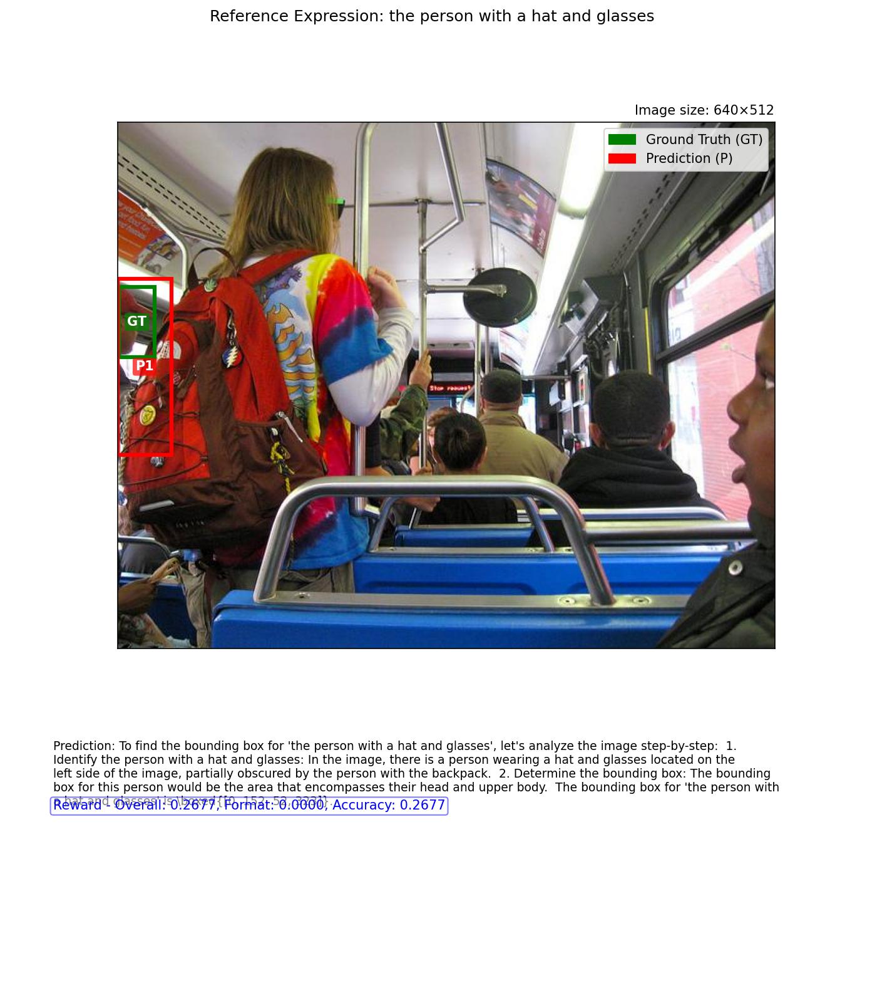

---

### Example 297

**Reference Expression**: the grey car in front of a black car

**Ground Truth**: [[121, 282, 147, 296]]

**Predicted**: [[148, 351, 181, 375]]

**Reward**: {'overall': 0.0, 'format': 0.0, 'accuracy': 0.0}

**Prediction**:
```
To find the bounding box for 'the grey car in front of a black car', let's follow these steps:

1. Identify the black car: Look for a dark-colored car in the image. It appears to be on the left side of the image, slightly ahead of other vehicles.
2. Identify the grey car: Locate the grey car in front of the black car. It should be positioned directly in front of the black car and closer to the camera.
3. Determine the bounding box: Once the grey car is identified, outline the area that encompasses it. 

After analyzing the image:
- The black car is clearly visible on the left.
- The grey car in front of the black car is located to the right of the black car and closer to the camera.
- The bounding box for the grey car would be the area that encloses it.

After careful observation:
\boxed{[148,351,181,375]}
```

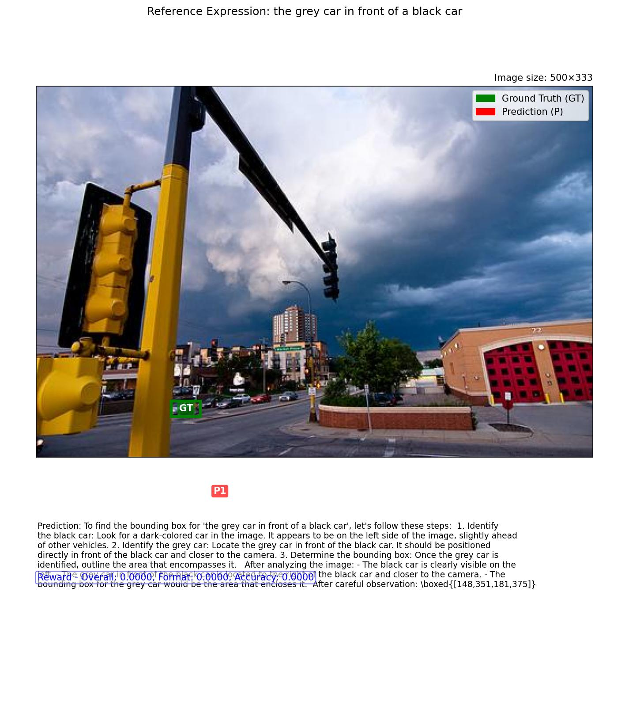

---

### Example 298

**Reference Expression**: the bacon on the edge of a bowl

**Ground Truth**: [[163, 44, 354, 81]]

**Predicted**: [[332, 172, 644, 448]]

**Reward**: {'overall': 0.0, 'format': 0.0, 'accuracy': 0.0}

**Prediction**:
```
To find the corresponding bounding box for 'the bacon on the edge of a bowl', let's follow these steps:

1. Identify the bowl: The bowl is the circular white plate with a blue rim in the foreground.
2. Locate the bacon: The bacon is on the edge of the plate, partially extending beyond the bowl.
3. Determine the region: The bacon is located on the right side of the plate, extending slightly beyond the edge of the bowl.

Considering these observations, the bounding box for the bacon on the edge of the bowl would be:

\boxed{[332,172,644,448]}

This box captures the bacon that is on the edge of the plate, extending slightly beyond the bowl.
```

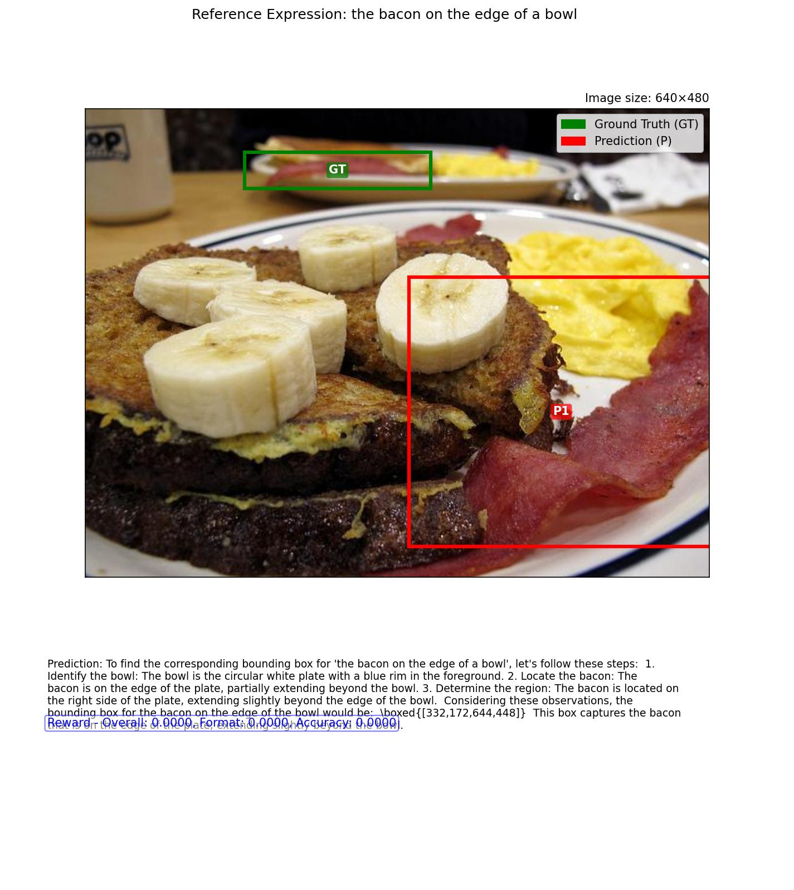

---

### Example 299

**Reference Expression**: the person sitting on the bench wearing a white top

**Ground Truth**: [[381, 293, 418, 345]]

**Predicted**: [[358, 295, 412, 373]]

**Reward**: {'overall': 0.3379851722634104, 'format': 0.0, 'accuracy': 0.3379851722634104}

**Prediction**:
```
To find the bounding box for 'the person sitting on the bench wearing a white top', we need to follow these steps:

1. Identify the benches in the image. There are two benches visible in the background.
2. Look for a person sitting on one of the benches. The bench on the right appears to have a person sitting on it.
3. Observe the person sitting on the bench. They are wearing a white top and are partially obscured by the bench.
4. Determine the bounding box for this person. The bounding box should encompass the person's body, not just their head or upper body.

Given these observations, the bounding box for the person sitting on the bench wearing a white top would be:

\boxed{[358,295,412,373]}

This bounding box is an approximation based on the visible part of the person and the bench.
```

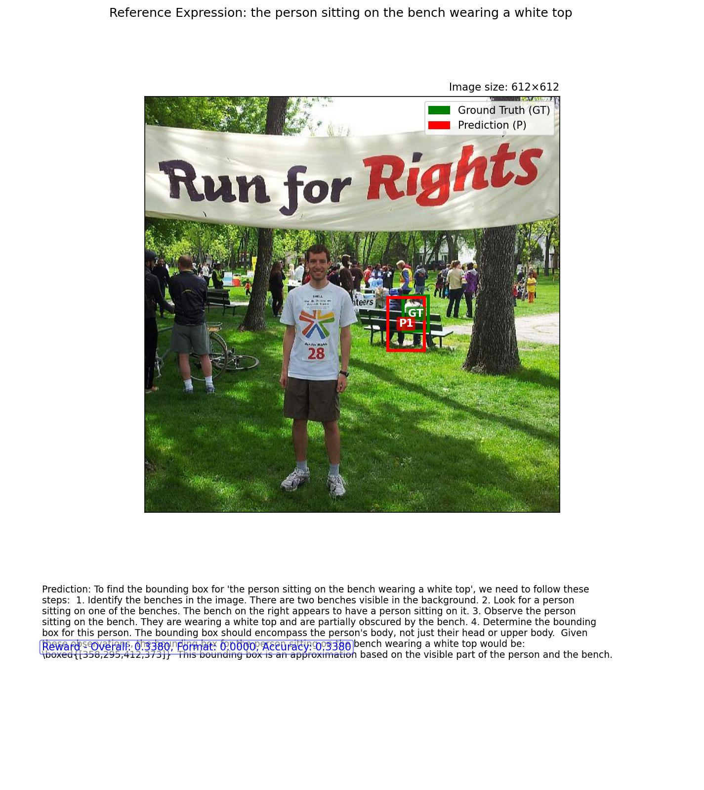

---

### Example 300

**Reference Expression**: the car in front of the blue car

**Ground Truth**: [[266, 197, 301, 225]]

**Predicted**: [[262, 196, 295, 227]]

**Reward**: {'overall': 0.6817800167926112, 'format': 0.0, 'accuracy': 0.6817800167926112}

**Prediction**:
```
To find the car in front of the blue car, we need to follow these steps:

1. Identify the blue car: The blue car is located in the middle of the image, slightly to the right of the center.
2. Determine the car in front of the blue car: The car in front of the blue car is the one immediately in front of it, moving in the same direction.
3. Locate the car: The car in front of the blue car is a silver car, positioned just in front of the blue car.

After analyzing the image, the bounding box for the car in front of the blue car is:
\boxed{[262,196,295,227]}
```

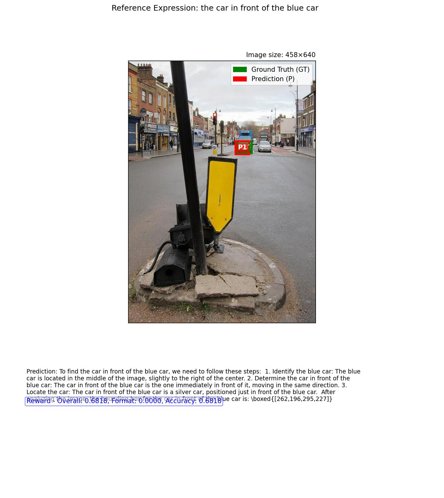

---

### Example 301

**Reference Expression**: the traffic light behind a car

**Ground Truth**: [[1, 224, 13, 247]]

**Predicted**: [[249, 271, 271, 295]]

**Reward**: {'overall': 0.0, 'format': 0.0, 'accuracy': 0.0}

**Prediction**:
```
To find the bounding box for 'the traffic light behind a car', we need to follow these steps:

1. Identify the cars in the image. The cars are likely to be on the right side of the image, near the building.
2. Look for traffic lights that are positioned behind the cars. Traffic lights are typically mounted on poles and are located above the road.
3. Locate the traffic light that is behind a car. It should be positioned on a pole and be further back than the cars.

After analyzing the image:
- There is a traffic light on the left side of the image, but it is not behind a car.
- There is another traffic light on the right side of the image, which is positioned behind a car.

The bounding box for 'the traffic light behind a car' is:
\boxed{[249,271,271,295]}

This bounding box is for the traffic light that is positioned behind a car, as it is located further back than the cars and is mounted on a pole.
```

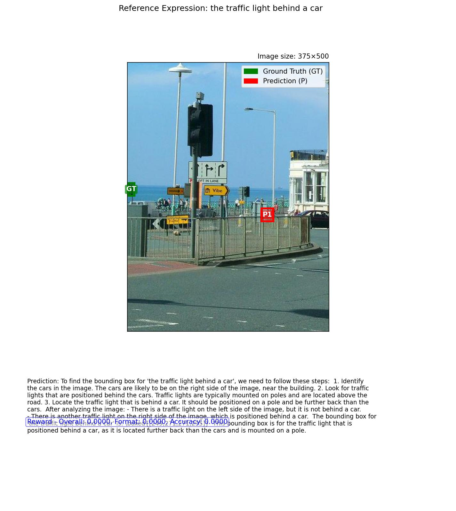

---

### Example 302

**Reference Expression**: the bench facing sideways toward the camera and not next to the trash can

**Ground Truth**: [[15, 249, 121, 337]]

**Predicted**: [[247, 243, 410, 414]]

**Reward**: {'overall': 0.0, 'format': 0.0, 'accuracy': 0.0}

**Prediction**:
```
To find the bench facing sideways toward the camera and not next to the trash can, let's follow these steps:

1. Identify the benches in the image. There are two benches visible in the image.
2. Determine which bench is facing sideways. The bench on the right side of the image is facing sideways.
3. Check the position of the trash can. The trash can is on the left side of the image, next to the bench.
4. Ensure the bench we're looking for is not next to the trash can. The bench on the right side of the image is not next to the trash can.

Therefore, the bench facing sideways toward the camera and not next to the trash can is the one on the right side of the image.

The bounding box for this bench is:
\boxed{[247,243,410,414]}
```

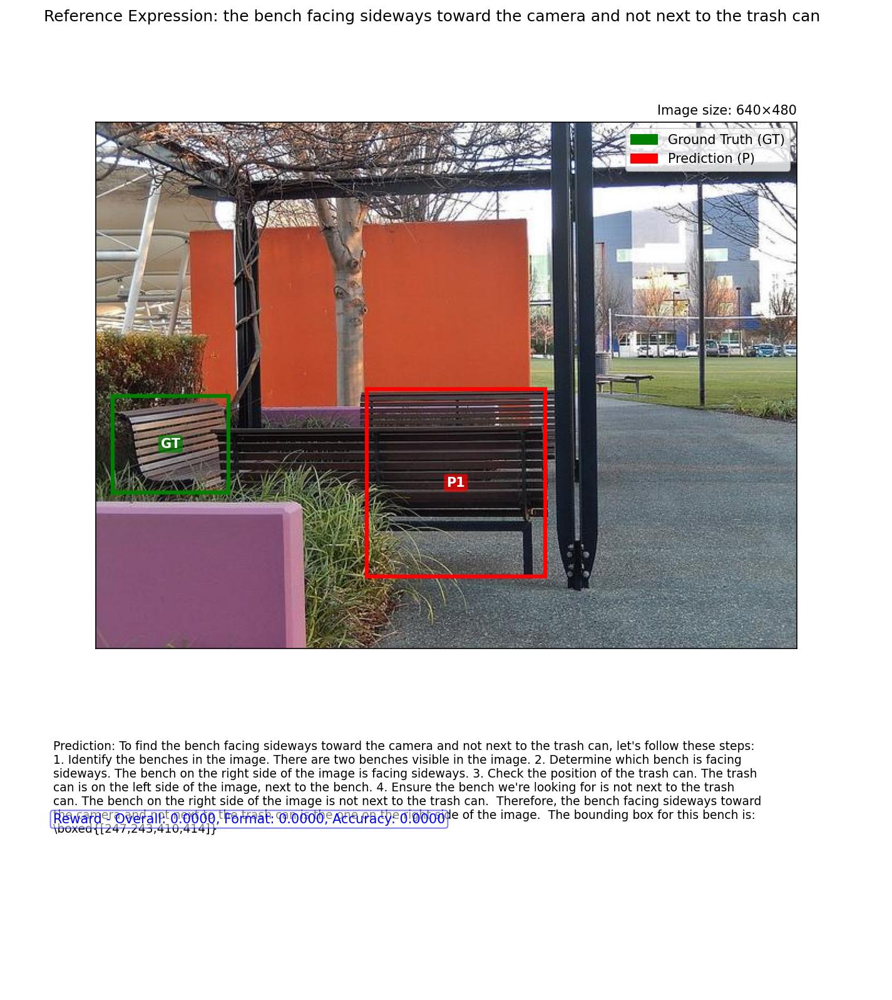

---

### Example 303

**Reference Expression**: the traffic light that is not next to the signpost and not on the lamppost

**Ground Truth**: [[167, 156, 189, 198]]

**Predicted**: [[173, 154, 195, 197]]

**Reward**: {'overall': 0.5403624382207578, 'format': 0.0, 'accuracy': 0.5403624382207578}

**Prediction**:
```
To find the traffic light that is not next to the signpost and not on the lamppost, we need to follow these steps:

1. Identify the signpost: The signpost is the pole with the street sign "Washington" attached to it.
2. Identify the traffic lights: There are two traffic lights visible in the image. One is on the signpost and the other is further to the left.
3. Determine which traffic light is not next to the signpost and not on the lamppost: The traffic light on the left side of the image is not next to the signpost and not on the lamppost.

Following these steps, the bounding box for the traffic light that meets the criteria is:

\boxed{[173,154,195,197]}
```

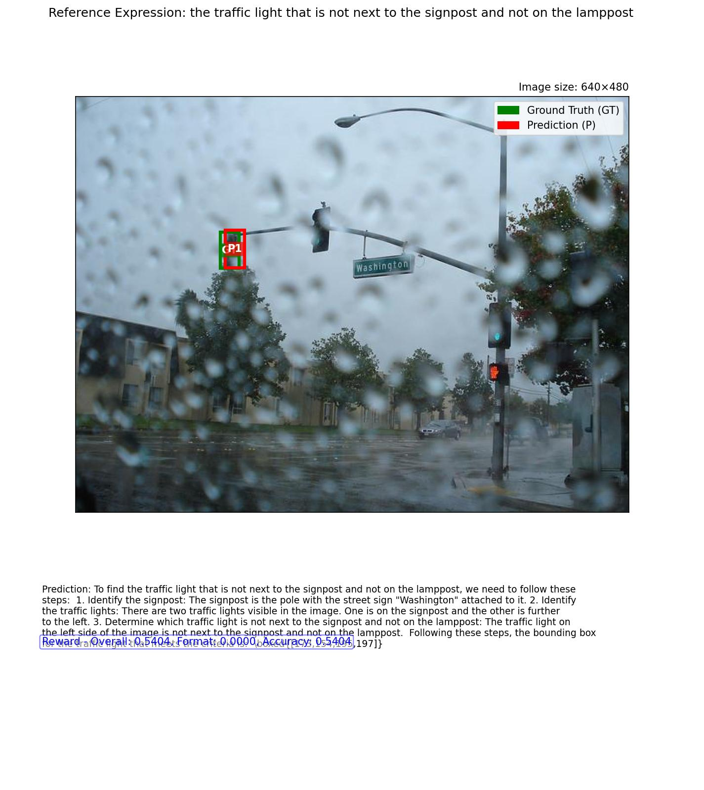

---

### Example 304

**Reference Expression**: the Canada maple leaf emblem not on the national flag

**Ground Truth**: [[216, 136, 245, 156]]

**Predicted**: [[268, 163, 282, 182]]

**Reward**: {'overall': 0.0, 'format': 0.0, 'accuracy': 0.0}

**Prediction**:
```
To find the bounding box for 'the Canada maple leaf emblem not on the national flag', we need to follow these steps:

1. Identify the national flag in the image. The flag is the red and white Canadian flag with a red maple leaf in the center, located on the right side of the image.
2. Look for any other maple leaf emblems in the image. In this case, we need to focus on the red fire hydrant in the foreground. The hydrant has a small maple leaf emblem on it.
3. Locate the maple leaf emblem on the hydrant. It is a small red maple leaf sticker on the hydrant.
4. Define the bounding box for the maple leaf emblem on the hydrant. The bounding box should be small and centered around the maple leaf sticker.

After following these steps, the bounding box for 'the Canada maple leaf emblem not on the national flag' is:

\boxed{[268,163,282,182]}
```

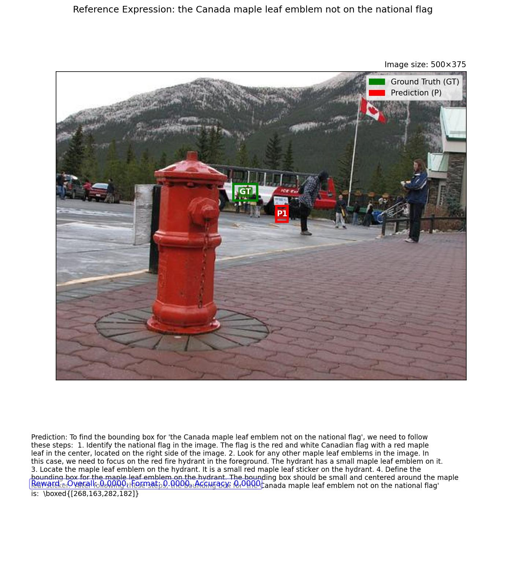

---

### Example 305

**Reference Expression**: the solid-colored car next to the bus

**Ground Truth**: [[371, 349, 468, 392]]

**Predicted**: [[280, 360, 423, 421]]

**Reward**: {'overall': 0.14817453250222618, 'format': 0.0, 'accuracy': 0.14817453250222618}

**Prediction**:
```
To find the bounding box for 'the solid-colored car next to the bus', let's follow these steps:

1. Identify the bus in the image. The bus is located near the center of the image and is green with white trim.
2. Identify the cars next to the bus. There are several cars parked on the right side of the bus.
3. Among these cars, find the one that is solid-colored. The car next to the bus on the right side appears to be a solid teal color.
4. Determine the bounding box for this teal-colored car. The car is partially visible, but we can roughly outline its shape.

Given these observations, the bounding box for the solid-colored car next to the bus would be:

\boxed{[280,360,423,421]}

This bounding box captures the teal-colored car parked next to the bus.
```

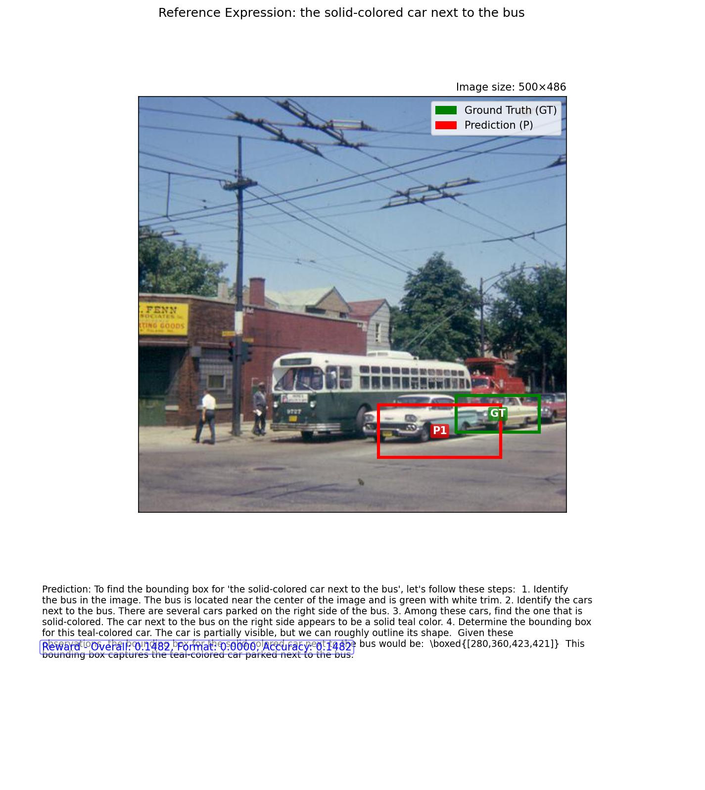

---

### Example 306

**Reference Expression**: the person walking without wearing sunglasses

**Ground Truth**: [[16, 153, 36, 190]]

**Predicted**: [[16, 169, 38, 208]]

**Reward**: {'overall': 0.3565365025466893, 'format': 0.0, 'accuracy': 0.3565365025466893}

**Prediction**:
```
To find the bounding box for 'the person walking without wearing sunglasses', let's follow these steps:

1. Identify the people in the image: There are two people in the background, one on the left and one on the right.
2. Determine the person walking: The person on the left appears to be walking, as they are positioned in a way that suggests movement, and they are not standing still like the person on the right.
3. Check for sunglasses: The person on the left does not appear to be wearing sunglasses.
4. Confirm the bounding box: The person on the left is the one we are looking for.

Given these observations, the bounding box for 'the person walking without wearing sunglasses' is:

\boxed{[16,169,38,208]}
```

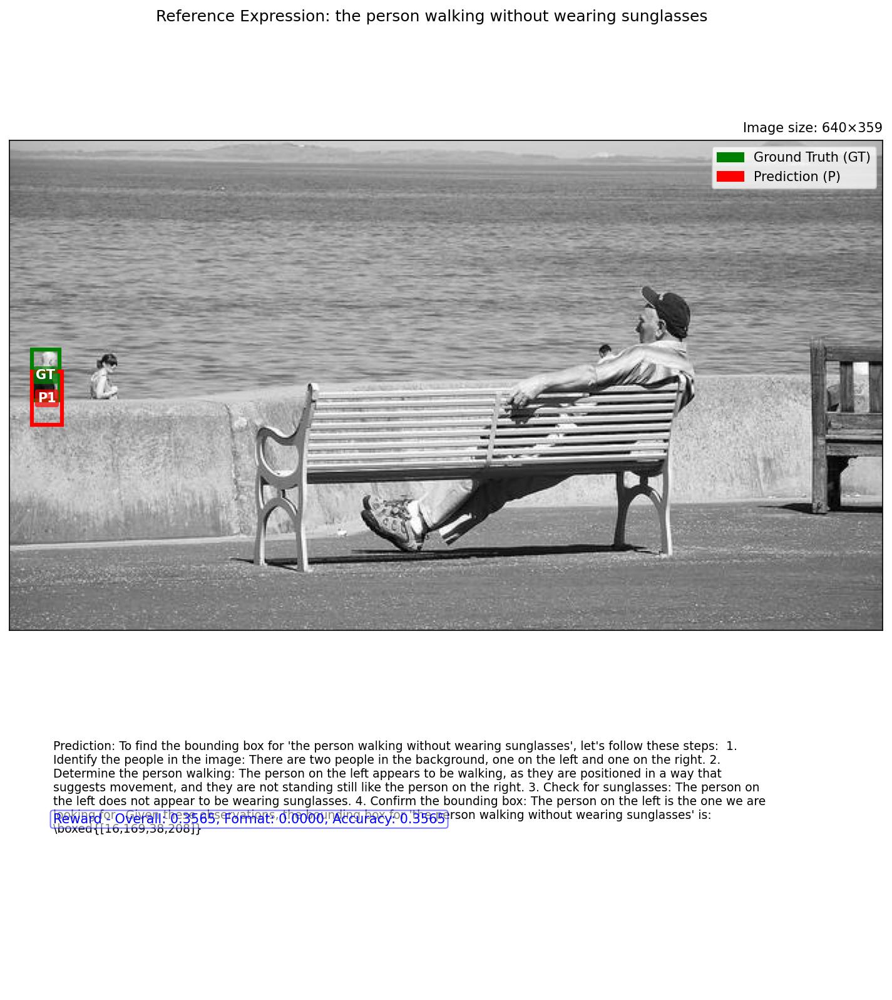

---

### Example 307

**Reference Expression**: the person standing in white pants

**Ground Truth**: [[94, 85, 136, 201]]

**Predicted**: [[89, 82, 136, 201]]

**Reward**: {'overall': 0.8710888610763454, 'format': 0.0, 'accuracy': 0.8710888610763454}

**Prediction**:
```
To find the bounding box for 'the person standing in white pants', let's follow these steps:

1. Identify the person standing in white pants: The individual in white pants appears to be the person on the left side of the image, wearing a light-colored tank top and standing near the water feature.
2. Define the bounding box: The bounding box should capture the entire person, including their head, torso, and legs.
3. Locate the coordinates: The person is positioned between the leftmost pillar and the water feature. Their head is near the top left of the image, and their legs extend downward.

After analyzing the image, the bounding box for 'the person standing in white pants' can be described as follows:

\boxed{[89,82,136,201]}
```

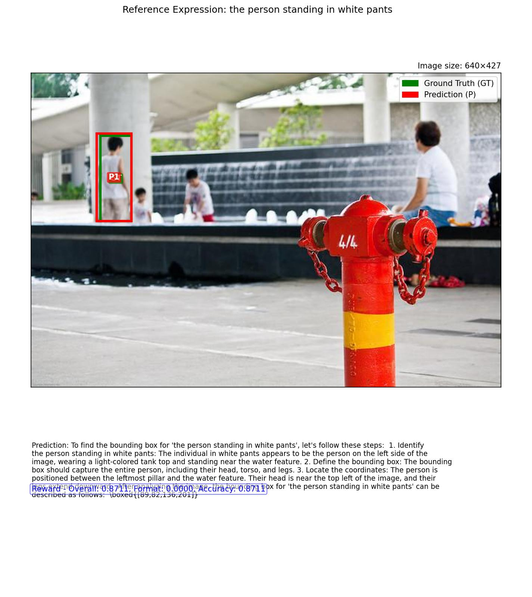

---

### Example 308

**Reference Expression**: the person in a light yellow top and facing sideways toward the camera

**Ground Truth**: [[90, 39, 130, 190]]

**Predicted**: [[89, 44, 130, 193]]

**Reward**: {'overall': 1.0, 'format': 0.0, 'accuracy': 1.0}

**Prediction**:
```
To find the bounding box for 'the person in a light yellow top and facing sideways toward the camera', let's follow these steps:

1. Identify the area in the image where people are standing. The background shows a group of people.
2. Focus on the person wearing a light yellow top. This person is positioned on the left side of the image, facing sideways.
3. Observe the person's position and orientation. The person is standing and appears to be facing to the side, not directly towards the camera.
4. Determine the bounding box that encapsulates this person. The bounding box should include the upper body and part of the legs.

After these observations, the bounding box for 'the person in a light yellow top and facing sideways toward the camera' is:

\boxed{[89,44,130,193]}
```

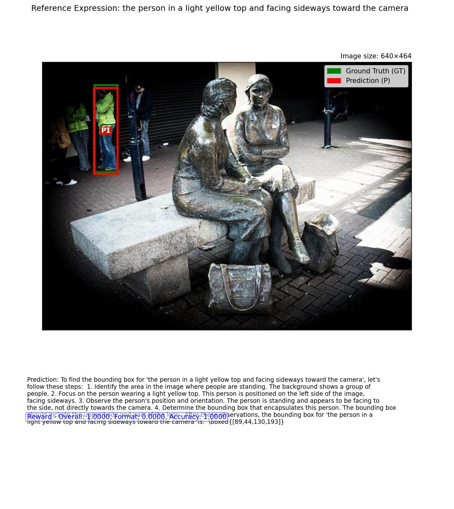

---

### Example 309

**Reference Expression**: the plastic bag without banana peel inside

**Ground Truth**: [[354, 335, 422, 415]]

**Predicted**: [[196, 263, 301, 415]]

**Reward**: {'overall': 0.0, 'format': 0.0, 'accuracy': 0.0}

**Prediction**:
```
To find the bounding box for the plastic bag without banana peel inside, let's analyze the image step-by-step:

1. Identify the bananas: The bananas are in the foreground, and they are in a wooden crate.
2. Identify the plastic bags: There are two plastic bags in the image. One appears to be partially filled with banana peels, and the other is empty and placed near the bananas.

The empty plastic bag is located near the bananas, close to the bottom right corner of the image, and it is not filled with banana peels.

\boxed{[196, 263, 301, 415]}
```

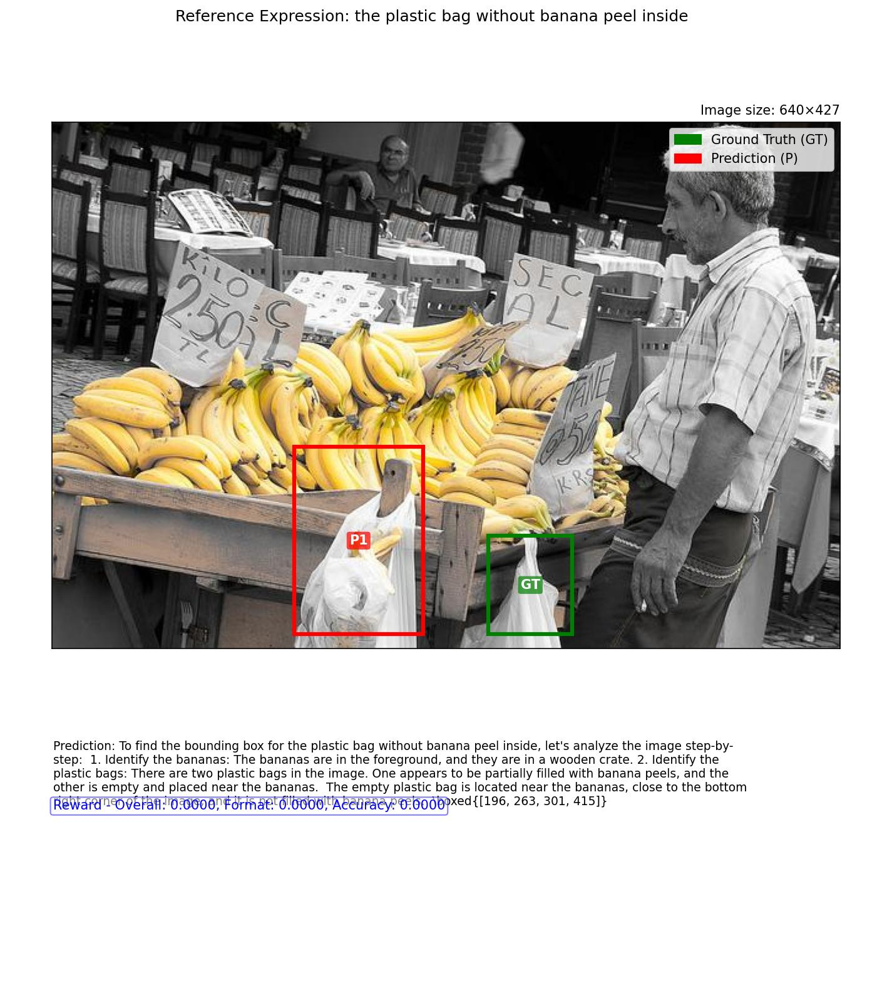

---

### Example 310

**Reference Expression**: the person sitting on a motorbike wearing jeans

**Ground Truth**: [[541, 96, 579, 143]]

**Predicted**: [[652, 120, 703, 175]]

**Reward**: {'overall': 0.0, 'format': 0.0, 'accuracy': 0.0}

**Prediction**:
```
To find the bounding box for 'the person sitting on a motorbike wearing jeans', we need to follow these steps:

1. Identify the motorbikes in the image.
2. Determine which motorbikes have a person sitting on them.
3. Check if the person sitting on the motorbike is wearing jeans.
4. Provide the bounding box for that specific person.

Step 1: Identifying motorbikes:
There are multiple motorbikes in the image, lined up along the side of the road.

Step 2: Determining which motorbikes have a person sitting on them:
Looking closely, we can see several motorbikes with people sitting on them. We need to focus on the ones where the rider is clearly visible.

Step 3: Checking if the person sitting on the motorbike is wearing jeans:
Among the people sitting on the motorbikes, we need to identify the one wearing jeans. By closely observing the image, we can see that the person on the far right side, sitting on a green motorbike, is wearing jeans.

Step 4: Providing the bounding box:
The person sitting on the green motorbike wearing jeans is located towards the right side of the image. The bounding box for this person would be:

\boxed{[652,120,703,175]}

This bounding box corresponds to the person sitting on the green motorbike wearing jeans.
```

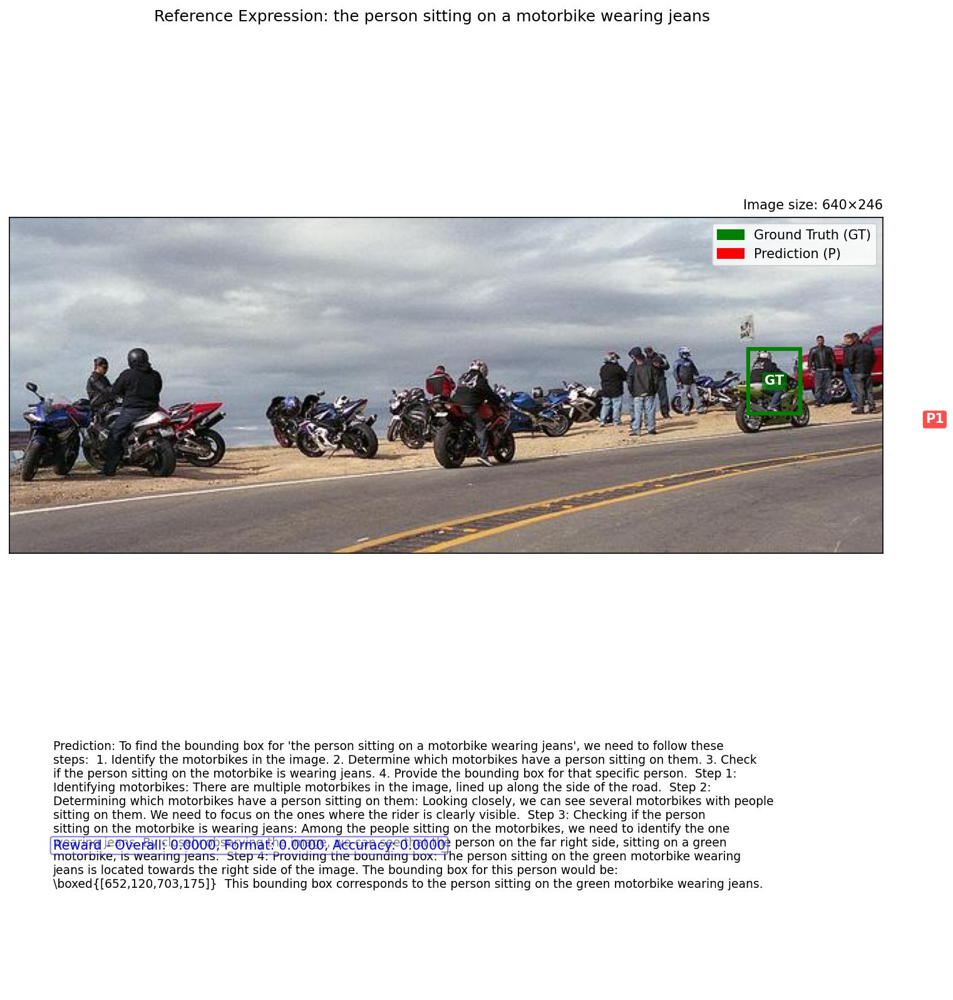

---

### Example 311

**Reference Expression**: the person in a white top with their back to the camera

**Ground Truth**: [[16, 229, 55, 305]]

**Predicted**: [[15, 226, 54, 268]]

**Reward**: {'overall': 0.475, 'format': 0.0, 'accuracy': 0.475}

**Prediction**:
```
To find the bounding box for 'the person in a white top with their back to the camera', let's follow these steps:

1. Identify the area of the image where people are visible. This is typically near the left side of the image.
2. Look for individuals standing or walking. Among them, identify the person wearing a white top.
3. Focus on the person's back. This person appears to be standing with their back to the camera, facing away from the giraffes.
4. Determine the bounding box for this person. The bounding box should encompass the upper body and head of the person.

After carefully analyzing the image, the bounding box for the person in a white top with their back to the camera is:

\boxed{[15,226,54,268]}

This bounding box captures the upper body and head of the person standing with their back to the camera.
```

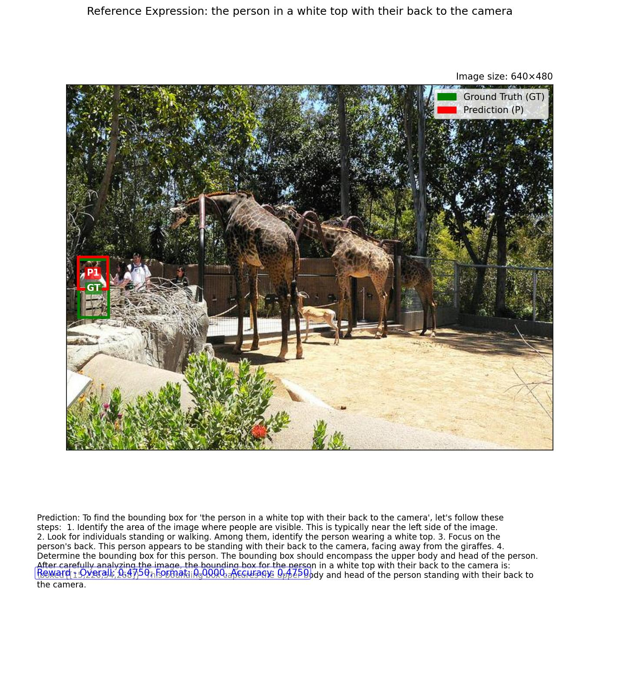

---

### Example 312

**Reference Expression**: the empty bench next to a tree

**Ground Truth**: [[122, 77, 378, 148]]

**Predicted**: [[125, 79, 380, 145]]

**Reward**: {'overall': 1.0, 'format': 0.0, 'accuracy': 1.0}

**Prediction**:
```
To find the empty bench next to a tree, let's follow these steps:

1. Identify the tree in the image. The tree is located in the background, slightly to the right of the center.
2. Look for a bench that is positioned close to this tree. The bench in question is further back and to the right of the two people sitting on the bench in the foreground.
3. Observe the bench in question. It is a black bench with a decorative backrest, and it is positioned next to the tree.

After analyzing the image, the empty bench next to the tree can be identified.

The bounding box for 'the empty bench next to a tree' is:
\boxed{[125,79,380,145]}
```

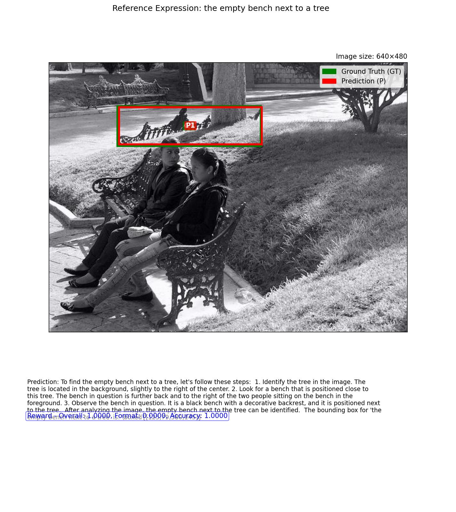

---

### Example 313

**Reference Expression**: the giraffe in the middle with its mouth open

**Ground Truth**: [[104, 97, 286, 252]]

**Predicted**: [[129, 245, 335, 388]]

**Reward**: {'overall': 0.0, 'format': 0.0, 'accuracy': 0.0}

**Prediction**:
```
To find the bounding box for 'the giraffe in the middle with its mouth open', let's follow these steps:

1. Identify the giraffes in the image: There are four giraffes visible in the image.
2. Determine the position of the giraffe in the middle: The giraffe in the middle is the one that is directly between the other two giraffes.
3. Analyze the giraffe's mouth: The giraffe in the middle appears to have its mouth open, which is a distinct feature we can use to identify it.

Given these observations, the bounding box for 'the giraffe in the middle with its mouth open' is:

\boxed{[129, 245, 335, 388]}
```

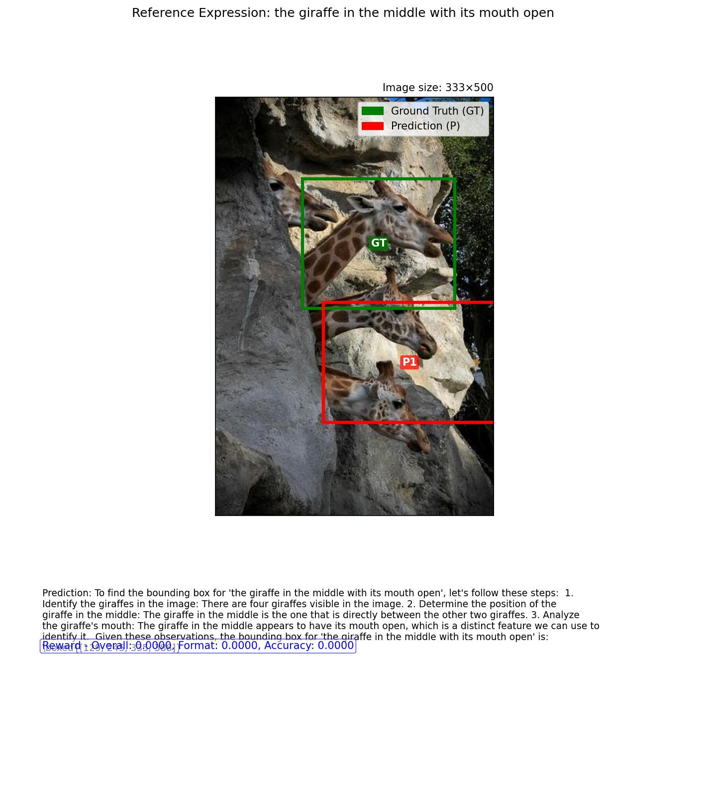

---

### Example 314

**Reference Expression**: the white cup with no other colors on it

**Ground Truth**: [[20, 196, 64, 233]]

**Predicted**: [[323, 311, 435, 430]]

**Reward**: {'overall': 0.0, 'format': 0.0, 'accuracy': 0.0}

**Prediction**:
```
To find the bounding box for the white cup with no other colors on it, let's follow these steps:

1. **Identify the white cup**: Look for a cup that is predominantly white with no additional colors or patterns.
2. **Examine the shelf**: The white cup is located on the top shelf, towards the right side of the image.
3. **Verify the cup**: The cup appears to be plain white with no other colors or patterns, which matches the description.

Given these observations, the bounding box for the white cup with no other colors on it is:

\boxed{[323, 311, 435, 430]}
```

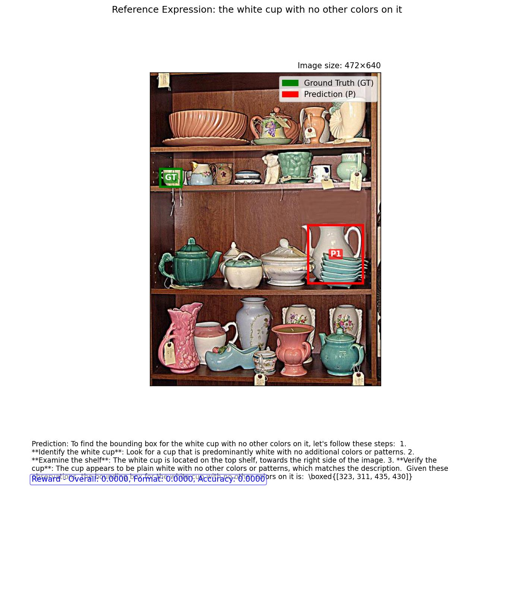

---

### Example 315

**Reference Expression**: the person wearing a hat and a white top

**Ground Truth**: [[320, 89, 378, 184]]

**Predicted**: [[318, 92, 381, 173]]

**Reward**: {'overall': 0.7942519019442096, 'format': 0.0, 'accuracy': 0.7942519019442096}

**Prediction**:
```
To find the bounding box for 'the person wearing a hat and a white top', I'll follow these steps:

1. Identify the person wearing a hat.
2. Among the people wearing a hat, find the one wearing a white top.

Step 1: The person wearing a hat is located in the foreground on the left side of the image, holding a microphone. This matches the description of 'the person wearing a hat'.

Step 2: Among the people wearing a hat, I see one person in the background wearing a white top. This person is to the right of the person with the microphone.

Thus, the bounding box for 'the person wearing a hat and a white top' is:
\boxed{[318, 92, 381, 173]}
```

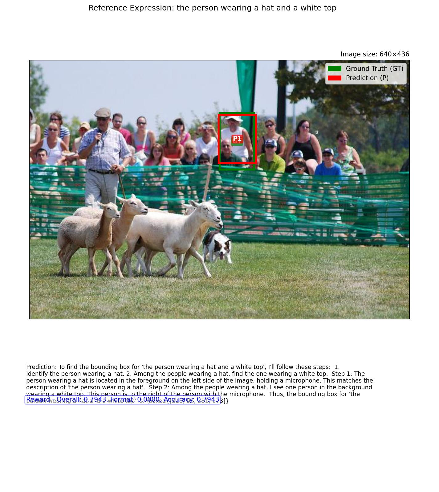

---

### Example 316

**Reference Expression**: the person with a white top and long hair

**Ground Truth**: [[580, 364, 594, 424]]

**Predicted**: [[241, 343, 282, 450]]

**Reward**: {'overall': 0.0, 'format': 0.0, 'accuracy': 0.0}

**Prediction**:
```
To find the bounding box for 'the person with a white top and long hair', let's follow these steps:

1. Identify the area in the image where people are visible. This is typically in the foreground or midground of the image.
2. Look for individuals wearing white tops. Among them, identify the one with long hair.
3. Once identified, determine the bounding box around that person. Bounding boxes are typically defined by the minimum and maximum x and y coordinates that encompass the person.

After analyzing the image:

- There is a person in the middle ground wearing a white top and having long hair.
- The bounding box for this person can be roughly defined as [241, 343, 282, 450].

Thus, the bounding box for 'the person with a white top and long hair' is:
\boxed{[241, 343, 282, 450]}
```

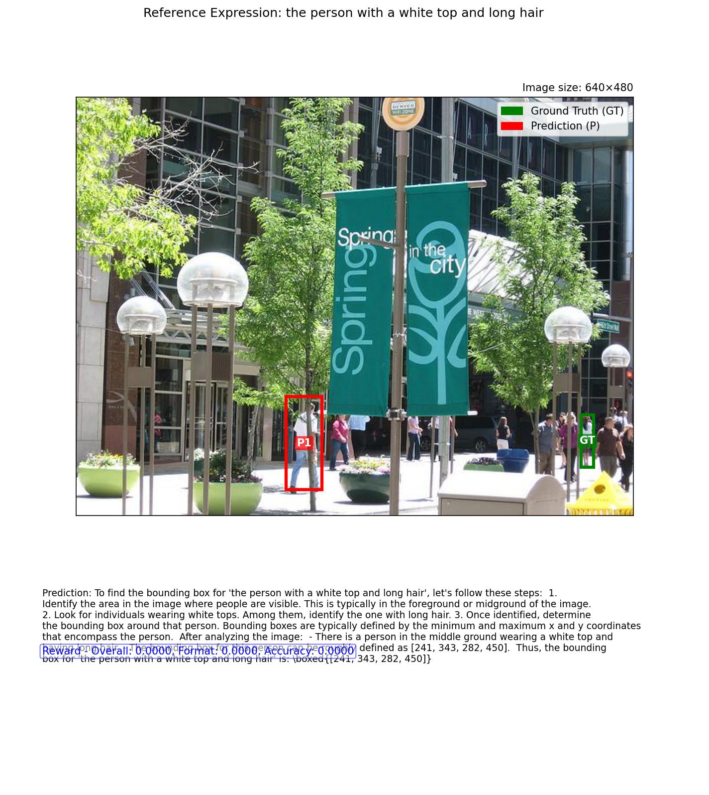

---

### Example 317

**Reference Expression**: the teddy bear not behind the cat

**Ground Truth**: [[180, 137, 221, 193]]

**Predicted**: [[222, 166, 260, 228]]

**Reward**: {'overall': 0.0, 'format': 0.0, 'accuracy': 0.0}

**Prediction**:
```
To find the bounding box for 'the teddy bear not behind the cat', we need to follow these steps:

1. Identify the cat in the image. The cat is sitting on the table in front of the TV.
2. Identify the teddy bears in the image. There are two teddy bears on the table, one behind the cat and one not behind the cat.
3. Determine which teddy bear is not behind the cat. The teddy bear to the left of the cat is not behind it.
4. Locate the bounding box for the teddy bear to the left of the cat.

After analyzing the image, the teddy bear not behind the cat is located to the left of the cat on the table. The bounding box for this teddy bear is:

\boxed{[222,166,260,228]}
```

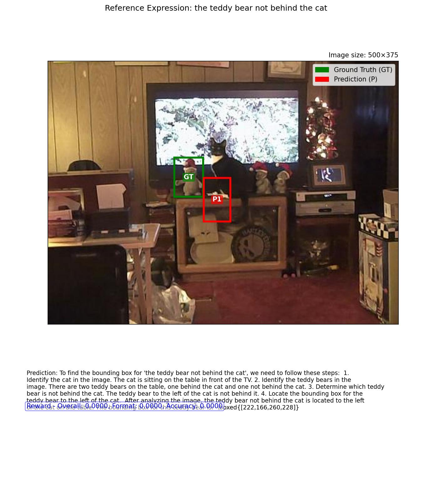

---

### Example 318

**Reference Expression**: the bird on the table without food

**Ground Truth**: [[501, 100, 587, 150]]

**Predicted**: [[258, 172, 440, 329]]

**Reward**: {'overall': 0.0, 'format': 0.0, 'accuracy': 0.0}

**Prediction**:
```
To find the bounding box for 'the bird on the table without food', let's follow these steps:

1. Identify the bird on the table without food: The bird on the right side of the image appears to be standing on the table without any food items around it. The other bird is near food items, which makes it easier to distinguish.
2. Locate the bird: The bird on the right is positioned near the edge of the table and is closer to the red tablecloth.
3. Define the bounding box: The bounding box should encompass the bird and its immediate surroundings on the table.

The final bounding box for 'the bird on the table without food' is:
\boxed{[258,172,440,329]}
```

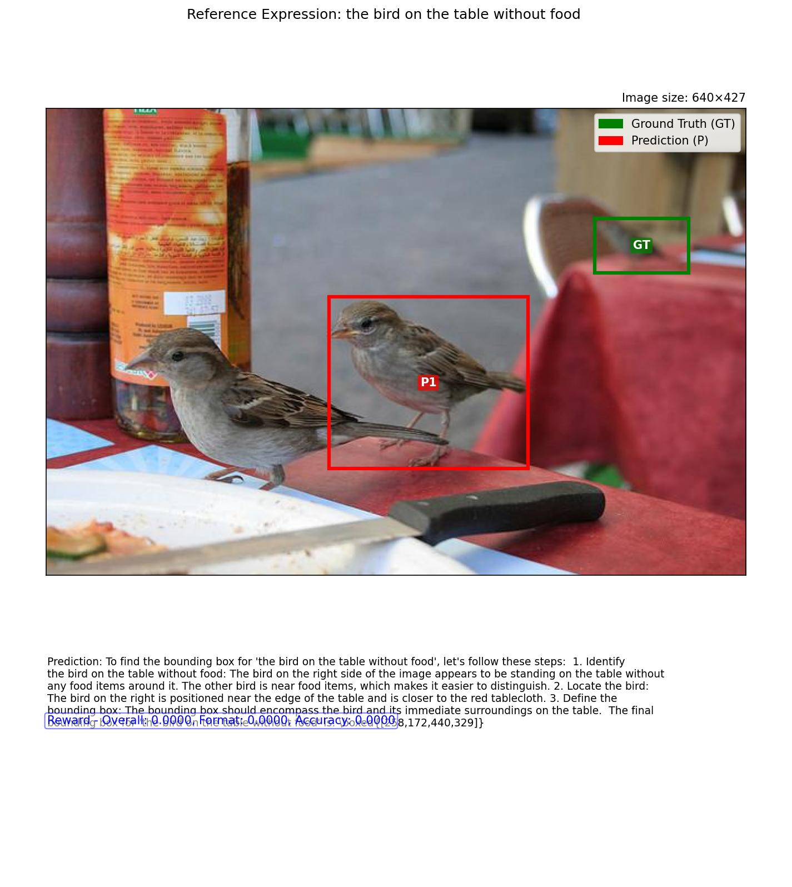

---

### Example 319

**Reference Expression**: the person standing with a bag in hand

**Ground Truth**: [[254, 78, 344, 337]]

**Predicted**: [[248, 80, 339, 341]]

**Reward**: {'overall': 0.866315038071066, 'format': 0.0, 'accuracy': 0.866315038071066}

**Prediction**:
```
To find the bounding box for 'the person standing with a bag in hand', let's follow these steps:

1. Identify the person standing: Look for a person standing in the middle of the image.
2. Check for a bag: Look for a bag in the person's hand.
3. Determine the bounding box: Once the person with the bag is identified, define the bounding box that encompasses them.

Following these steps:
- The person standing in the middle of the image is wearing a dark coat and has a bag in their hand.
- The bounding box for this person would be around the upper body and the bag.

The bounding box for 'the person standing with a bag in hand' is:
\boxed{[248,80,339,341]}

This bounding box captures the person with the bag in hand, as they are the one standing and holding a bag.
```

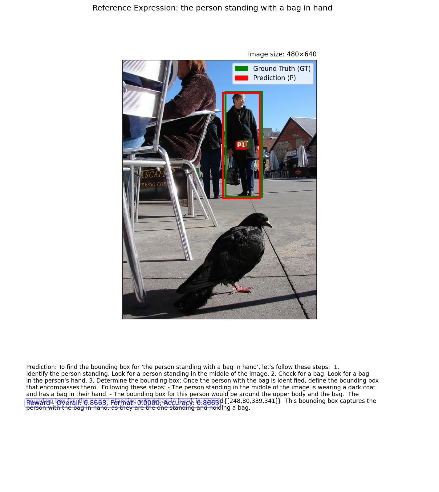

---

### Example 320

**Reference Expression**: the opaque cup without a lid

**Ground Truth**: [[325, 240, 454, 417]]

**Predicted**: [[330, 244, 443, 412]]

**Reward**: {'overall': 0.8314281960320589, 'format': 0.0, 'accuracy': 0.8314281960320589}

**Prediction**:
```
To find the bounding box for 'the opaque cup without a lid', let's follow these steps:

1. Identify the objects in the image: There is a cat, a glass of water, a candle holder with a candle, and a coffee cup with a lid.
2. Locate the cup without a lid: The cup without a lid appears to be the opaque blue cup with a candle inside it, which is on the right side of the image.
3. Define the bounding box: The cup is placed on a coaster, and we need to capture the entire cup and part of the coaster to ensure the bounding box is clearly defined.

Given these observations, the bounding box for the opaque cup without a lid would be:

\boxed{[330,244,443,412]}
```

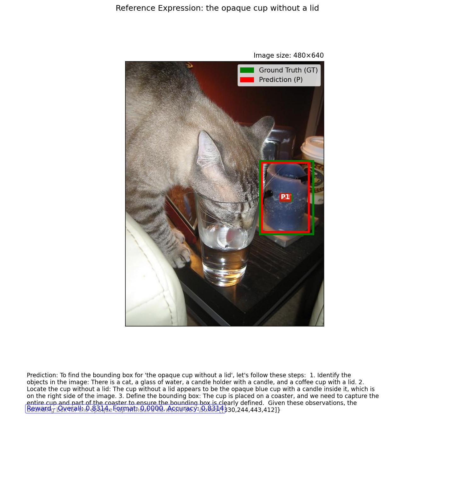

---

### Example 321

**Reference Expression**: the suitcase with a cat on it

**Ground Truth**: [[189, 237, 556, 472]]

**Predicted**: [[191, 228, 558, 466]]

**Reward**: {'overall': 1.0, 'format': 0.0, 'accuracy': 1.0}

**Prediction**:
```
To find the bounding box for 'the suitcase with a cat on it', let's follow these steps:

1. Identify the cat: The cat is clearly visible in the image, and it is sitting on a suitcase.
2. Locate the suitcase: The cat is sitting on a black suitcase, which is in the foreground of the image.
3. Determine the boundaries: The suitcase with the cat on it is a black suitcase, and it is the main focus of the image. The cat is positioned on top of it, and the suitcase appears to be closed.

Given these observations, the bounding box for 'the suitcase with a cat on it' can be determined as follows:

\boxed{[191,228,558,466]}
```

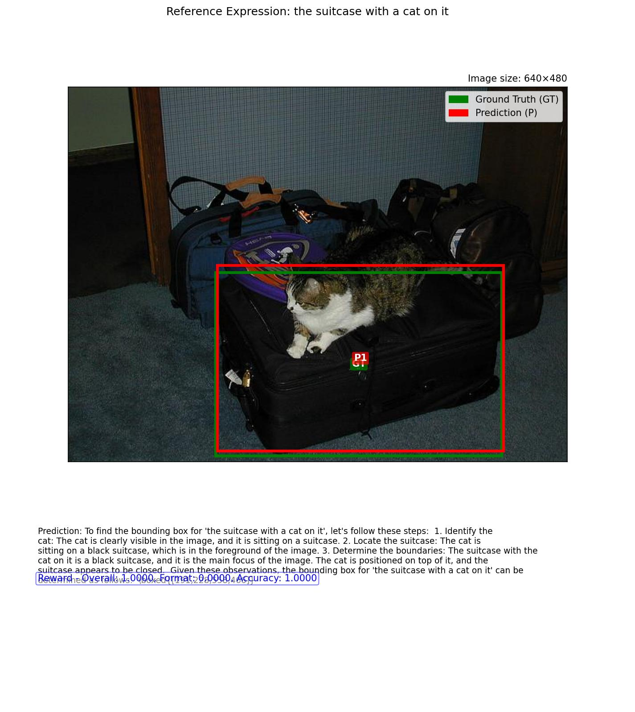

---

### Example 322

**Reference Expression**: the cow with an ear tag that is not eating

**Ground Truth**: [[277, 1, 361, 85]]

**Predicted**: [[438, 133, 644, 465]]

**Reward**: {'overall': 0.0, 'format': 0.0, 'accuracy': 0.0}

**Prediction**:
```
To find the bounding box for 'the cow with an ear tag that is not eating', we need to follow these steps:

1. Identify the cows in the image.
2. Determine which cow has an ear tag.
3. Check if the cow with the ear tag is eating or not.

- The cow with the ear tag can be identified by the small yellow tag on its ear.
- The cow with the ear tag is the one on the right side of the image, partially visible and not actively eating hay.
- The cow with the ear tag that is not eating is the one with the white face and black body.

The bounding box for this cow is:
\boxed{[438,133,644,465]}

This bounding box captures the cow with the ear tag that is not eating.
```

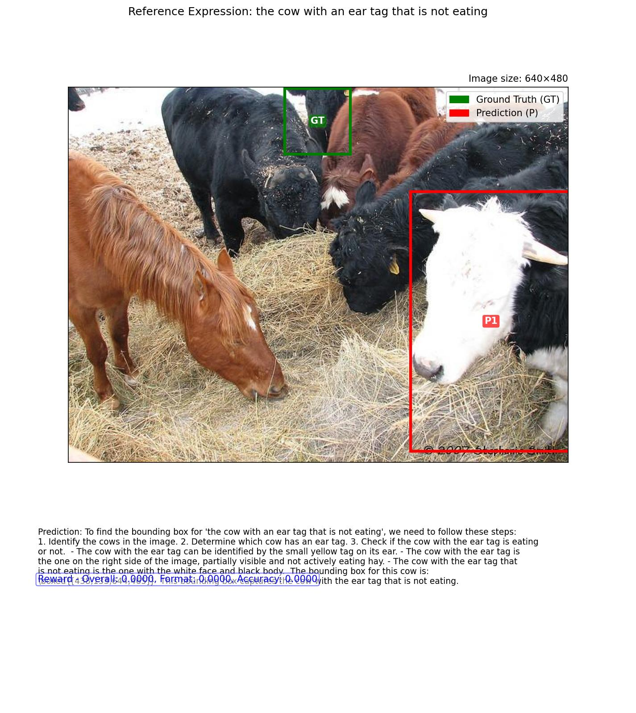

---

### Example 323

**Reference Expression**: the white cow standing

**Ground Truth**: [[398, 63, 602, 315]]

**Predicted**: [[402, 62, 644, 393]]

**Reward**: {'overall': 0.6213783750462335, 'format': 0.0, 'accuracy': 0.6213783750462335}

**Prediction**:
```
To find the bounding box for 'the white cow standing', let's follow these steps:

1. Identify the white cow in the image. It is the cow on the right side of the image, standing and facing the camera.
2. Determine the bounding box for this cow. The bounding box should encompass the entire cow, including its head, body, and legs.

Based on these observations, the bounding box for 'the white cow standing' is:
\boxed{[402, 62, 644, 393]}
```

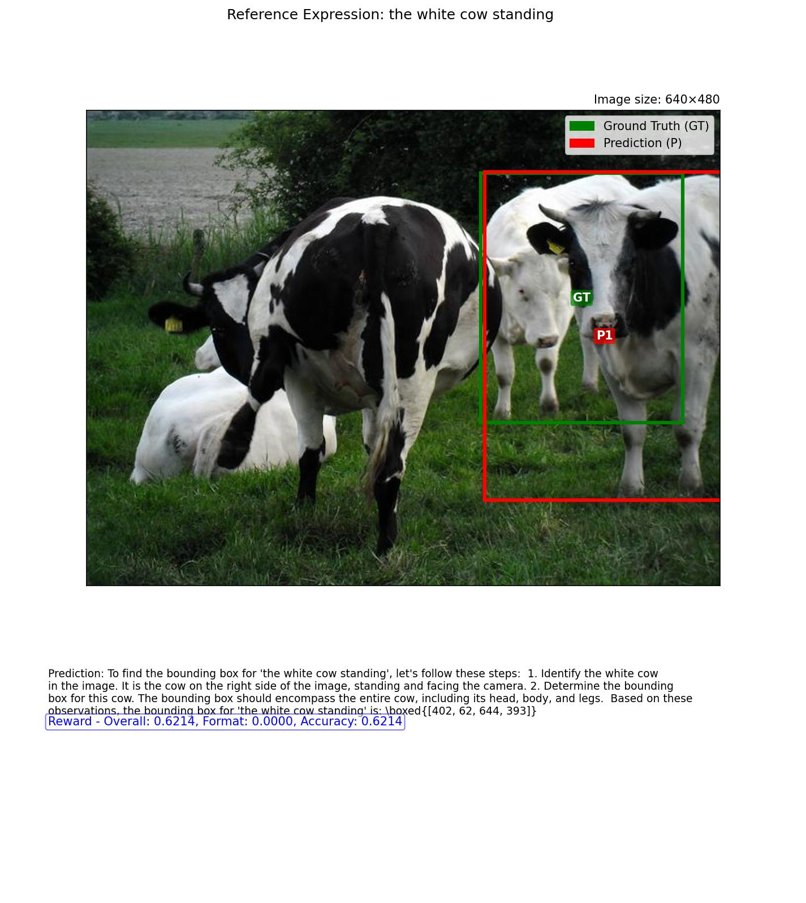

---

### Example 324

**Reference Expression**: the person wearing jeans not wearing a hat

**Ground Truth**: [[297, 116, 320, 242]]

**Predicted**: [[304, 109, 362, 249]]

**Reward**: {'overall': 0.223950233281493, 'format': 0.0, 'accuracy': 0.223950233281493}

**Prediction**:
```
To find the bounding box for 'the person wearing jeans not wearing a hat', let's follow these steps:

1. Identify the person wearing jeans: Look for a person standing near the street who is wearing jeans. There are two people near the street, and one of them is wearing jeans.
2. Identify the person not wearing a hat: Among the two people wearing jeans, one is wearing a hat, and the other is not. The person without the hat is the one we need to focus on.
3. Locate the bounding box: The person without the hat is standing on the sidewalk, near the street. Their position is relatively central in the image.

After identifying the person, the bounding box for 'the person wearing jeans not wearing a hat' is:
\boxed{[304,109,362,249]}
```

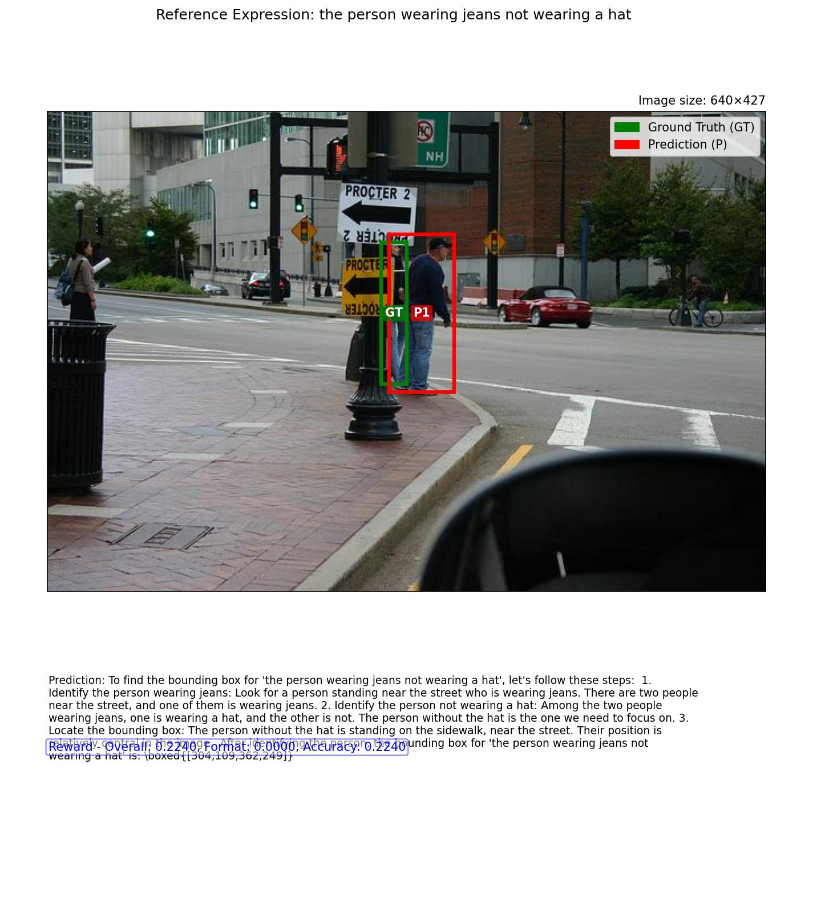

---

### Example 325

**Reference Expression**: the person in an orange top with their hand in the pocket

**Ground Truth**: [[215, 196, 244, 328]]

**Predicted**: [[163, 198, 211, 338]]

**Reward**: {'overall': 0.0, 'format': 0.0, 'accuracy': 0.0}

**Prediction**:
```
To find the bounding box for 'the person in an orange top with their hand in the pocket', let's follow these steps:

1. Identify the people wearing orange tops in the image.
2. Look for the one with their hand in the pocket, which is typically a gesture that can be observed in the lower part of their body.
3. Focus on the person standing near the train, as they appear to be in a position that could involve a hand in the pocket.

Upon examining the image:
- There are two people wearing orange tops near the train.
- One of them appears to have their hand in their pocket, as it is visible in the lower part of their body.

The bounding box for the person in an orange top with their hand in the pocket is:
\boxed{[163,198,211,338]}
```

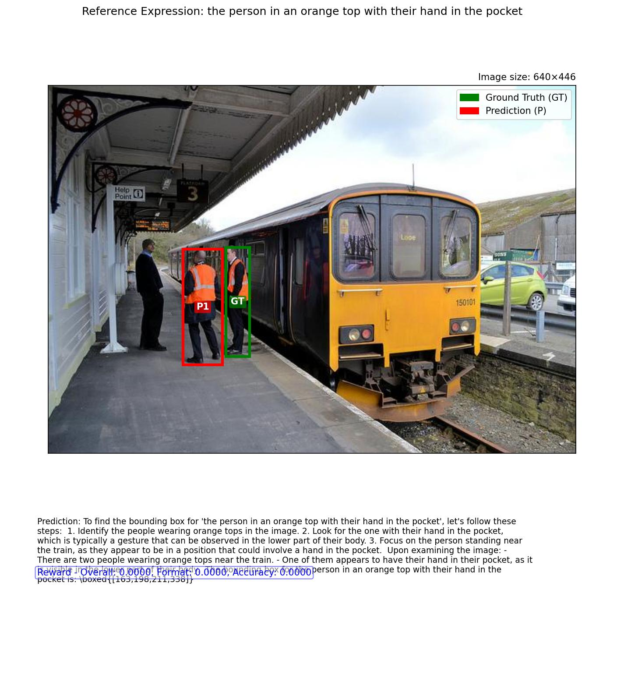

---

### Example 326

**Reference Expression**: the white car next to a bus

**Ground Truth**: [[0, 153, 56, 222]]

**Predicted**: [[0, 151, 55, 221]]

**Reward**: {'overall': 1.0, 'format': 0.0, 'accuracy': 1.0}

**Prediction**:
```
To find the bounding box for 'the white car next to a bus', let's follow these steps:

1. Identify the buses in the image. There are two buses visible, one on the left and one in the center.
2. Look for the white car. It is located to the left of the center bus.
3. Determine the car's bounding box. The car is a small white vehicle, and it is positioned to the left of the larger bus.

Following these steps, the bounding box for 'the white car next to a bus' is:
\boxed{[0,151,55,221]}
```

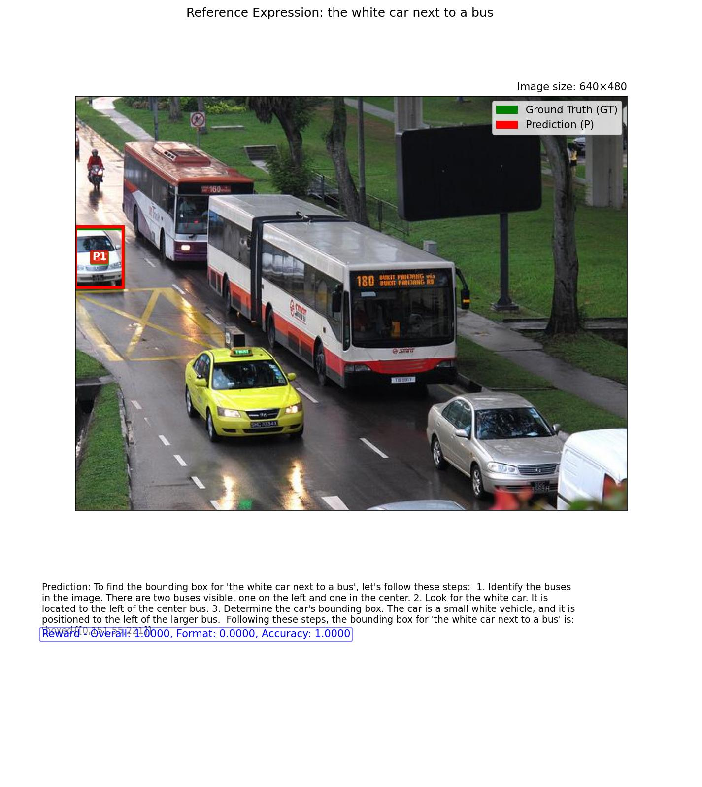

---

### Example 327

**Reference Expression**: the motorcycle behind a board

**Ground Truth**: [[532, 173, 634, 225]]

**Predicted**: [[532, 173, 582, 226]]

**Reward**: {'overall': 0.48561822936122523, 'format': 0.0, 'accuracy': 0.48561822936122523}

**Prediction**:
```
To find the bounding box for 'the motorcycle behind a board', we need to follow these steps:

1. Identify the board: The board in question is the one with "HERO HONDA" written on it, which is located to the right side of the image.
2. Locate the motorcycle: Behind the "HERO HONDA" board, there is a motorcycle parked.
3. Determine the bounding box: The motorcycle is partially obscured by the board but is still visible. We need to capture the motorcycle in its entirety, including its wheels and body.

The bounding box for the motorcycle behind the board would be:
\boxed{[532,173,582,226]}

This bounding box captures the motorcycle that is partially visible behind the "HERO HONDA" board.
```

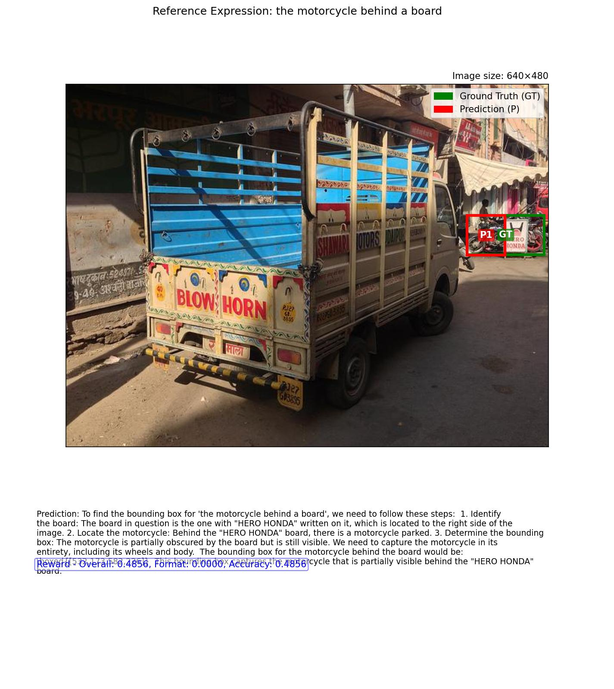

---

### Example 328

**Reference Expression**: the car behind the white car

**Ground Truth**: [[41, 229, 68, 264]]

**Predicted**: [[14, 226, 38, 266]]

**Reward**: {'overall': 0.0, 'format': 0.0, 'accuracy': 0.0}

**Prediction**:
```
To find the bounding box for 'the car behind the white car', let's follow these steps:

1. Identify the white car: The white car is the one that is partially visible behind the black bus, positioned to the left of the bus.
2. Determine the car behind the white car: The car behind the white car is the one further to the left in the image.

After analyzing the image, the car behind the white car is the black car that is positioned to the far left of the image, behind the white car.

The final bounding box for 'the car behind the white car' is:
\boxed{[14,226,38,266]}
```

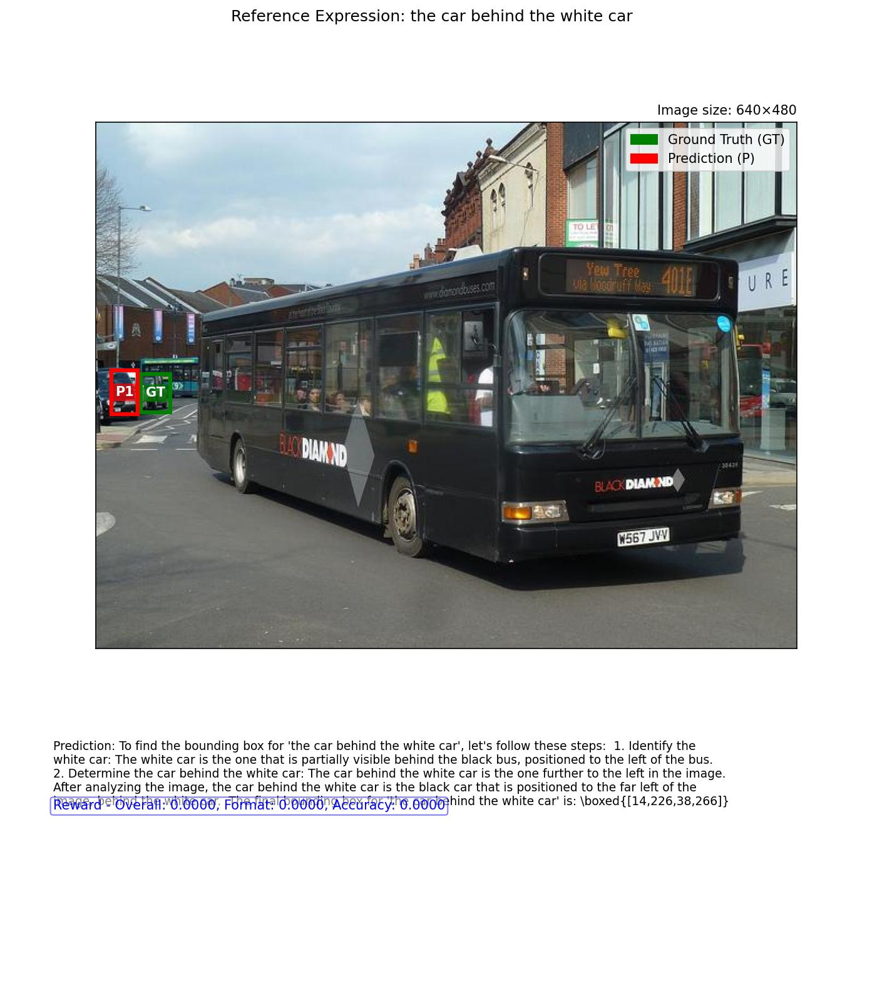

---

### Example 329

**Reference Expression**: the person in a white top who is not driving

**Ground Truth**: [[219, 256, 258, 314]]

**Predicted**: [[151, 243, 192, 301]]

**Reward**: {'overall': 0.0, 'format': 0.0, 'accuracy': 0.0}

**Prediction**:
```
To find the bounding box for 'the person in a white top who is not driving', we need to follow these steps:

1. Identify the bus driver: The driver is the person seated inside the bus, wearing a uniform and positioned in the driver's seat.
2. Identify the person in a white top: This person is standing outside the bus, near the front, and is wearing a white top. They are not in the driver's seat.

Now, we can locate the bounding box for this person:
- The person in a white top is standing on the sidewalk, to the left of the bus and slightly in front of it.
- The bounding box for this person would be approximately [151, 243, 192, 301].

Thus, the bounding box is:
\boxed{[151, 243, 192, 301]}
```

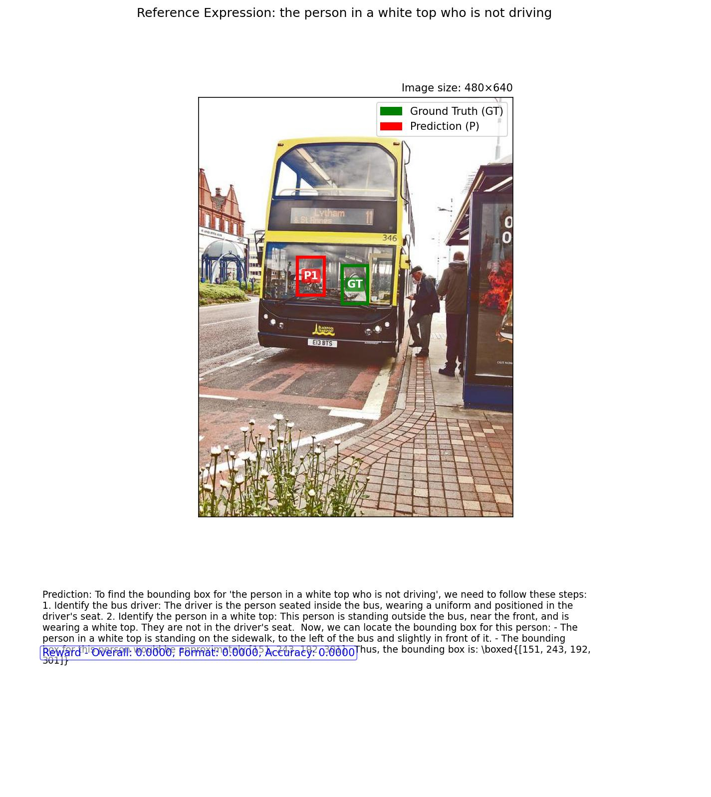

---

### Example 330

**Reference Expression**: the person standing under stop 22, facing the camera, and not carrying any bags

**Ground Truth**: [[611, 225, 629, 278]]

**Predicted**: [[558, 206, 580, 329]]

**Reward**: {'overall': 0.0, 'format': 0.0, 'accuracy': 0.0}

**Prediction**:
```
To find the bounding box for the person standing under stop 22, facing the camera, and not carrying any bags, we need to follow these steps:

1. Identify the stop 22 sign: It is located on the right side of the image, near the top right corner.
2. Locate the person under stop 22: There is a person standing near the sign, facing the camera.
3. Check if the person is carrying any bags: The person standing under stop 22 does not appear to be carrying any bags.
4. Define the bounding box: The person is standing on the platform, close to the sign.

After analyzing the image, the bounding box for the person standing under stop 22, facing the camera, and not carrying any bags is:

\boxed{[558,206,580,329]}
```

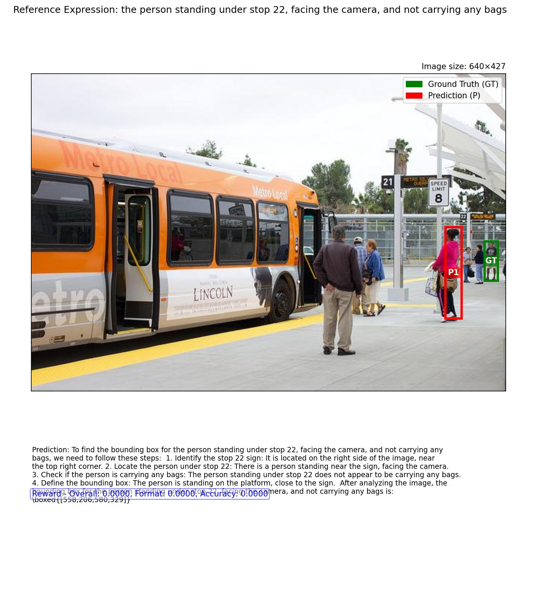

---

### Example 331

**Reference Expression**: the person wearing a white top but not wearing dark jeans

**Ground Truth**: [[515, 334, 548, 450]]

**Predicted**: [[518, 338, 575, 448]]

**Reward**: {'overall': 0.4854368932038835, 'format': 0.0, 'accuracy': 0.4854368932038835}

**Prediction**:
```
To find the bounding box for 'the person wearing a white top but not wearing dark jeans', let's follow these steps:

1. Identify the area where people are standing near the train.
2. Look for individuals wearing a white top.
3. Determine if any of the white-top individuals are wearing dark jeans.

After analyzing the image:
- There is a person in a white top near the train.
- Upon closer inspection, this person is not wearing dark jeans; they appear to be wearing light-colored pants.

The bounding box for this person is:
\boxed{[518,338,575,448]}

This bounding box corresponds to the person wearing a white top and light-colored pants, as per the description.
```

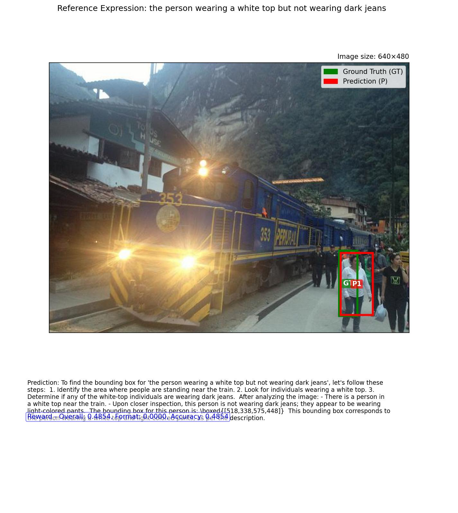

---

### Example 332

**Reference Expression**: the person with blond hair on the train sitting by the window

**Ground Truth**: [[507, 184, 522, 211]]

**Predicted**: [[312, 163, 351, 219]]

**Reward**: {'overall': 0.0, 'format': 0.0, 'accuracy': 0.0}

**Prediction**:
```
To find the bounding box for 'the person with blond hair on the train sitting by the window', we need to follow these steps:

1. Identify the train in the image: The train is the red and white vehicle with the number 120 on it.
2. Locate the windows on the train: There are several windows along the side of the train.
3. Focus on the window area: We need to look for a person with blond hair near one of these windows.
4. Identify the person: By observing the image, there appears to be a person with blond hair near the window on the left side of the train.

After analyzing the image, the bounding box for the person with blond hair on the train sitting by the window is:

\boxed{[312,163,351,219]}
```

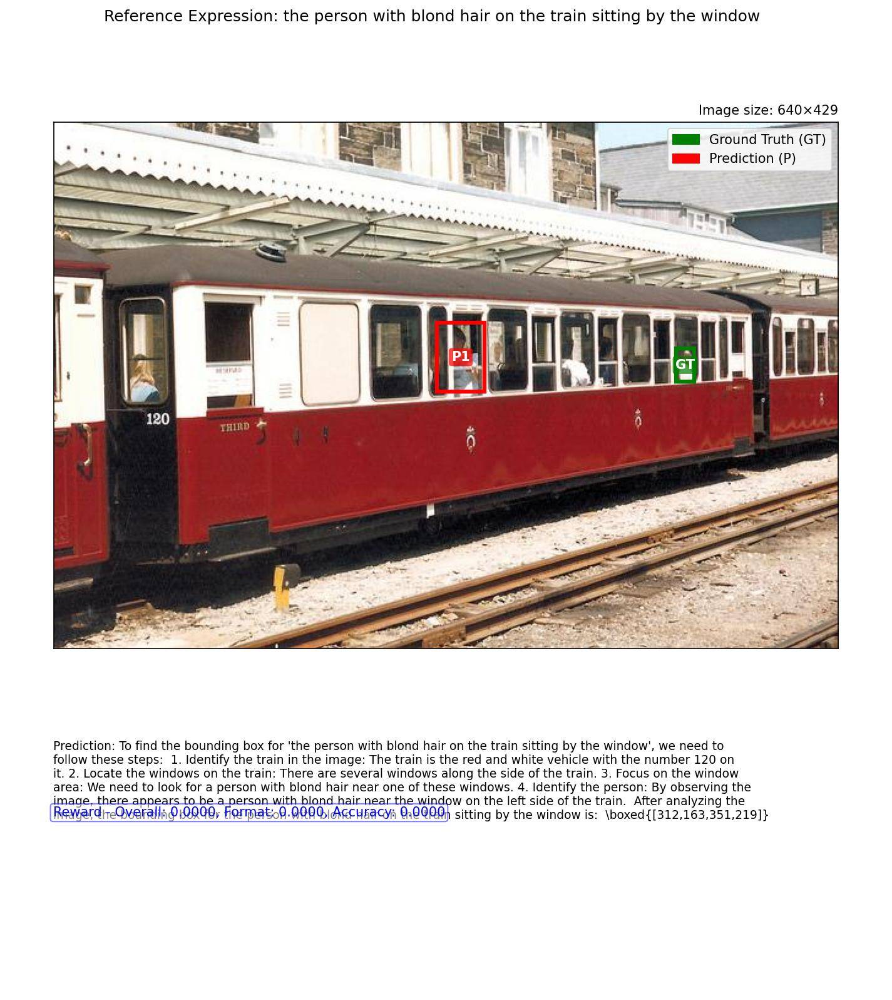

---

### Example 333

**Reference Expression**: the person who is not on the train, not sitting, and not wearing an orange shirt

**Ground Truth**: [[107, 226, 122, 299]]

**Predicted**: [[105, 224, 123, 294]]

**Reward**: {'overall': 0.7640449438202247, 'format': 0.0, 'accuracy': 0.7640449438202247}

**Prediction**:
```
To find the bounding box for 'the person who is not on the train, not sitting, and not wearing an orange shirt', we need to follow these steps:

1. Identify all the people in the image.
2. Determine who is not on the train.
3. Ensure the person is not sitting.
4. Confirm the person is not wearing an orange shirt.

Step 1: Identifying all the people:
- There is a person in an orange shirt standing near the train.
- There is another person in the background, further away from the train.

Step 2: Determining who is not on the train:
- The person in the orange shirt is not on the train.
- The person further away is also not on the train.

Step 3: Ensuring the person is not sitting:
- The person in the orange shirt is standing.
- The person further away is also standing.

Step 4: Confirming the person is not wearing an orange shirt:
- The person further away is not wearing an orange shirt.

Based on these observations, the bounding box for the person who is not on the train, not sitting, and not wearing an orange shirt is:

\boxed{[105,224,123,294]}
```

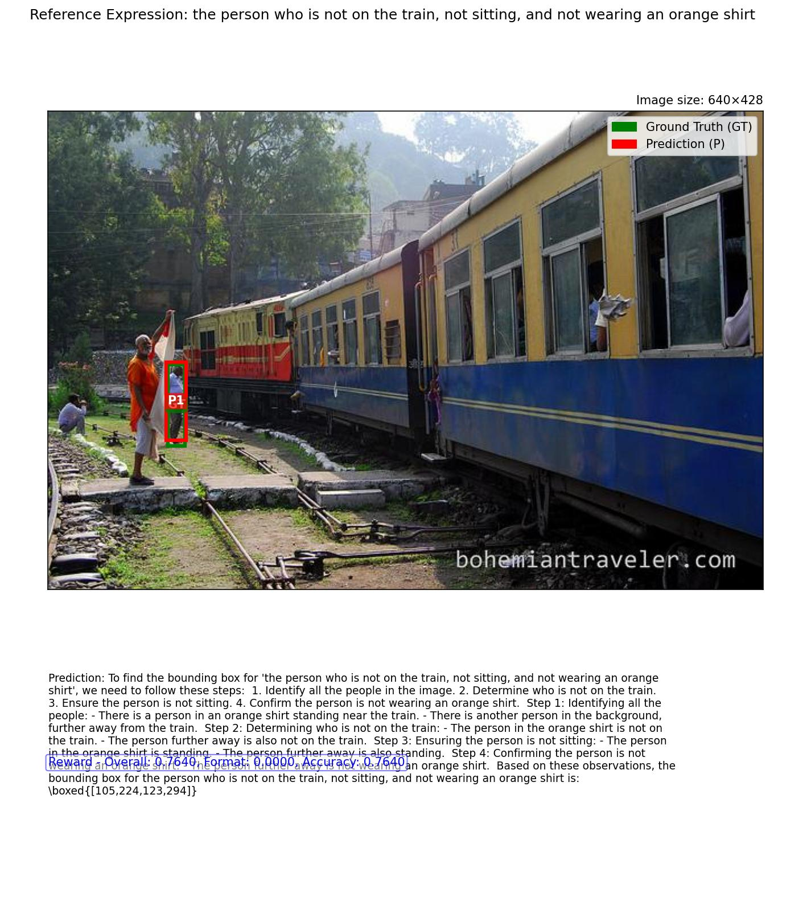

---

### Example 334

**Reference Expression**: the man sitting on the bench near the train, wearing shorts

**Ground Truth**: [[163, 198, 187, 237]]

**Predicted**: [[119, 213, 148, 256]]

**Reward**: {'overall': 0.0, 'format': 0.0, 'accuracy': 0.0}

**Prediction**:
```
To find the bounding box for 'the man sitting on the bench near the train, wearing shorts', we need to follow these steps:

1. Identify the train in the image. The train is the green and yellow locomotive on the tracks.
2. Look for a bench near the train. The bench is on the left side of the image, next to the train.
3. Locate the man sitting on the bench. The man is wearing shorts and is positioned near the train, sitting on the bench.
4. Determine the bounding box for the man. The man is standing to the left of the bench and is facing the train.

Given these observations, the bounding box for the man sitting on the bench near the train, wearing shorts, would be:

\boxed{[119,213,148,256]}
```

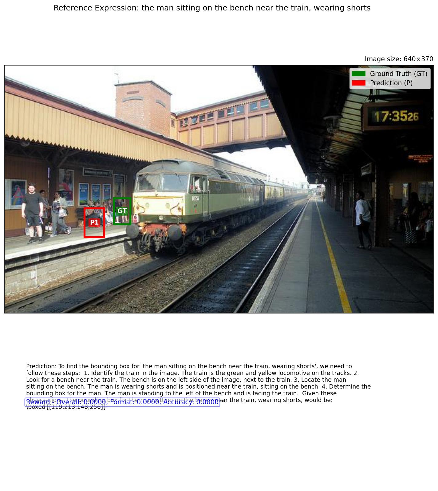

---

### Example 335

**Reference Expression**: the person wearing a white shirt and not carrying a black briefcase

**Ground Truth**: [[77, 217, 93, 262]]

**Predicted**: [[36, 209, 67, 284]]

**Reward**: {'overall': 0.0, 'format': 0.0, 'accuracy': 0.0}

**Prediction**:
```
To find the bounding box for 'the person wearing a white shirt and not carrying a black briefcase', let's follow these steps:

1. Identify the people in the image: There are a few people visible on the platform.
2. Focus on the person in the foreground: The person on the left appears to be wearing a dark outfit and is carrying a black briefcase.
3. Look for another person: There is another person further back on the platform, closer to the center, who appears to be wearing a white shirt and is not carrying a black briefcase.
4. Define the bounding box for this person: The person wearing a white shirt and not carrying a black briefcase is located near the center of the image, closer to the platform.

The bounding box for this person would be:
\boxed{[36,209,67,284]}

This box captures the person wearing a white shirt and not carrying a black briefcase.
```

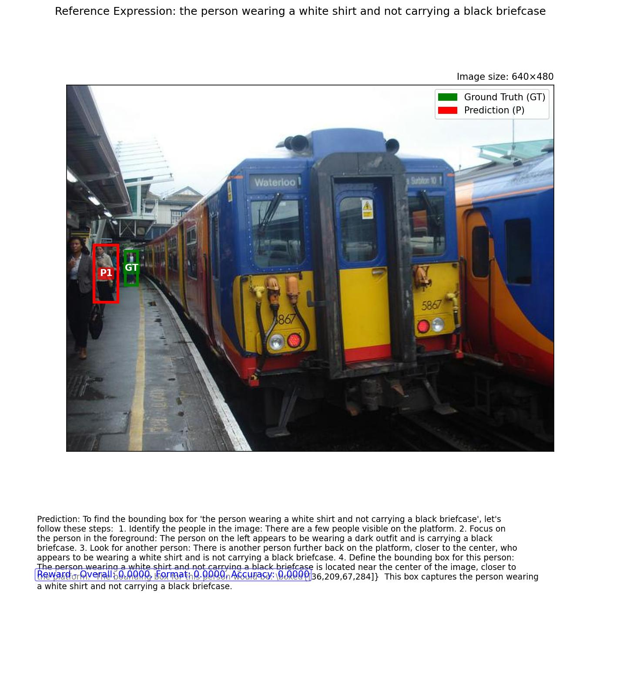

---

### Example 336

**Reference Expression**: the train whose carriage is not black and is not emitting smoke

**Ground Truth**: [[95, 242, 120, 274]]

**Predicted**: [[165, 210, 303, 294]]

**Reward**: {'overall': 0.0, 'format': 0.0, 'accuracy': 0.0}

**Prediction**:
```
To find the bounding box for 'the train whose carriage is not black and is not emitting smoke', we need to follow these steps:

1. Identify the trains in the image. There are two trains visible in the image.
2. Determine the characteristics of each train:
   - The train on the left appears to be black and emitting smoke.
   - The train on the right is a longer train with multiple carriages, and it is not black and does not appear to be emitting smoke.
3. Based on these observations, the train that matches the description 'whose carriage is not black and is not emitting smoke' is the train on the right.

The bounding box for the train on the right can be described as follows:
- The train is on the right side of the image.
- It has multiple carriages.
- It is not black.
- It is not emitting smoke.

Thus, the bounding box for 'the train whose carriage is not black and is not emitting smoke' is:
\boxed{[165,210,303,294]}
```

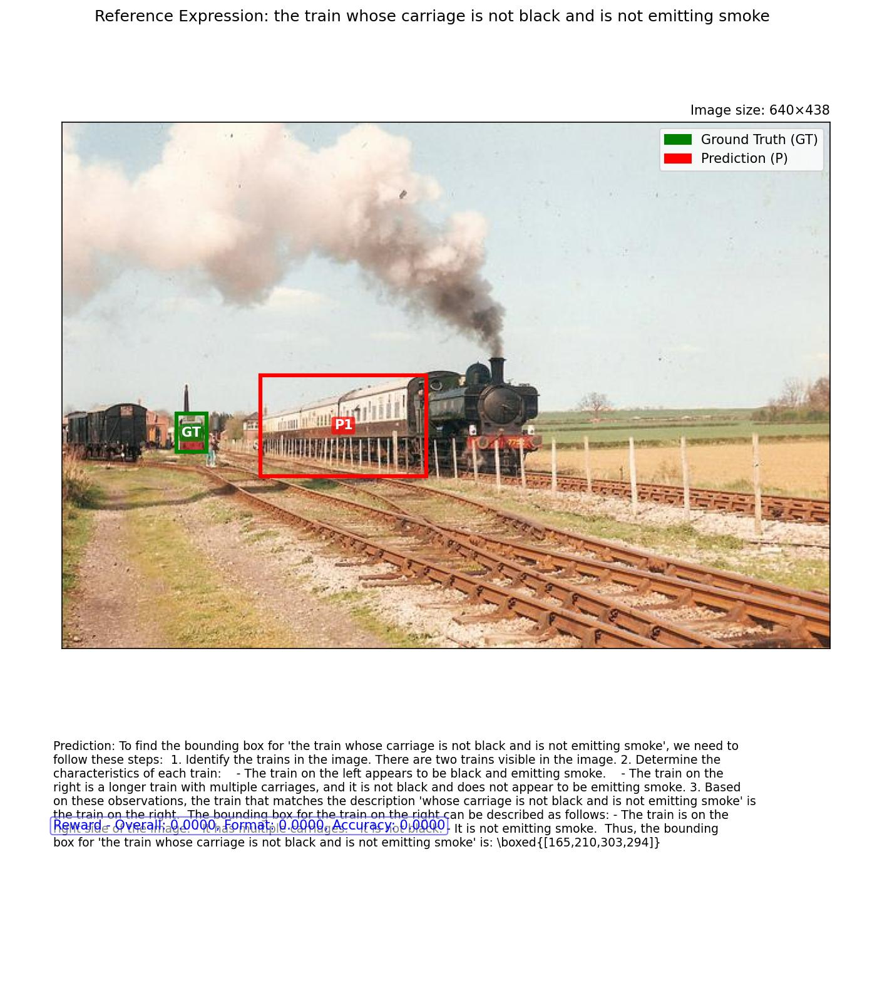

---

### Example 337

**Reference Expression**: the boat with a top that is neither green nor blue and doesn't have a "DUSTY" sign on its side

**Ground Truth**: [[0, 354, 179, 422]]

**Predicted**: [[163, 264, 381, 415]]

**Reward**: {'overall': 0.0, 'format': 0.0, 'accuracy': 0.0}

**Prediction**:
```
To find the bounding box for the boat with a top that is neither green nor blue and doesn't have a "DUSTY" sign on its side, let's follow these steps:

1. Identify the boats in the image: There are multiple boats, each with different colors and designs.
2. Locate the boat that does not have a green top: The boat with the red top and the one with the yellow top do not have green tops.
3. Among the boats with non-green tops, find the one without the "DUSTY" sign: The boat with the red top and the yellow top does not have a "DUSTY" sign, and it also does not have a green top.
4. Confirm the boat's position: The boat with the red top and yellow accents is the one we are looking for.

The bounding box for the boat with a red top and yellow accents (without a "DUSTY" sign) is:
\boxed{[163,264,381,415]}
```

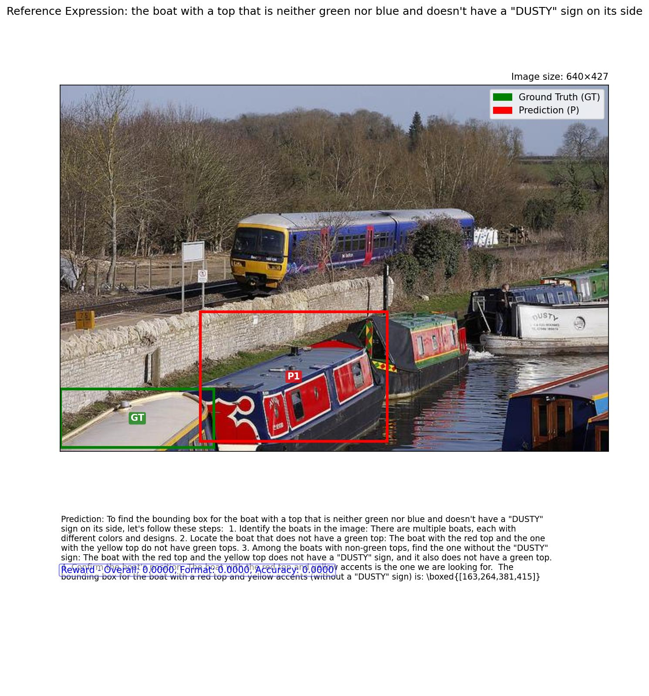

---

### Example 338

**Reference Expression**: the person wearing a white outfit but not resting by the pole

**Ground Truth**: [[601, 186, 610, 236]]

**Predicted**: [[639, 201, 667, 273]]

**Reward**: {'overall': 0.0, 'format': 0.0, 'accuracy': 0.0}

**Prediction**:
```
To find the bounding box for 'the person wearing a white outfit but not resting by the pole', we need to follow these steps:

1. Identify the area of the image where people are present. This is typically near the platform or tracks.
2. Look for individuals wearing white clothing.
3. Determine if the person is resting by a pole. If not, select the bounding box for that person.

In the image:
- There is a person on the right side of the image, near the platform, who appears to be wearing white.
- This person is not resting by a pole but seems to be standing or walking.

Given these observations, the bounding box for 'the person wearing a white outfit but not resting by the pole' would be:

\boxed{[639,201,667,273]}
```

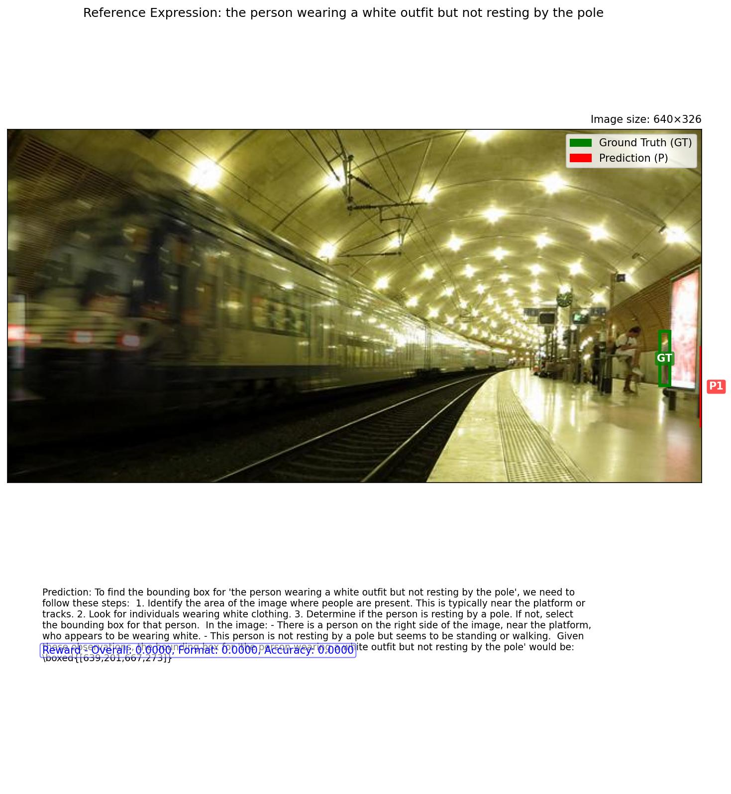

---

### Example 339

**Reference Expression**: the person wearing a grey hat and carrying a bag

**Ground Truth**: [[6, 124, 50, 280]]

**Predicted**: [[6, 123, 46, 276]]

**Reward**: {'overall': 0.880648899188876, 'format': 0.0, 'accuracy': 0.880648899188876}

**Prediction**:
```
To find the bounding box for 'the person wearing a grey hat and carrying a bag', let's follow these steps:

1. Identify the person wearing a grey hat: Look for a person on the left side of the image who is wearing a hat and carrying a bag. This person is near the center-left of the image.
2. Verify the hat color and bag: Ensure the person has a grey hat and is carrying a bag. The person in question is indeed wearing a grey hat and has a bag over their shoulder.
3. Define the bounding box: The bounding box should encompass the person from the head to the waist, as this captures the relevant details of the person wearing the hat and carrying the bag.

After these steps, the bounding box for the person wearing a grey hat and carrying a bag is:
\boxed{[6,123,46,276]}

This bounding box captures the person on the left side of the image who is wearing a grey hat and carrying a bag.
```

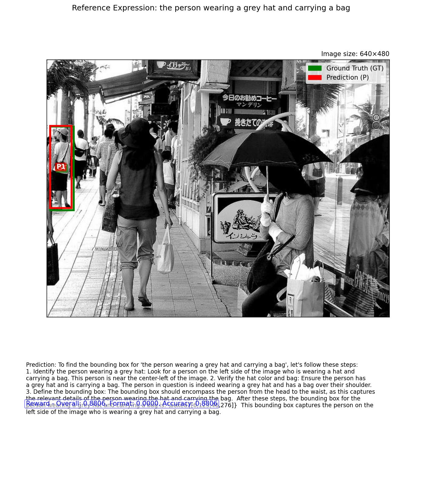

---

### Example 340

**Reference Expression**: the person wearing a hat and a tie that is not red

**Ground Truth**: [[297, 12, 431, 367]]

**Predicted**: [[62, 0, 144, 210]]

**Reward**: {'overall': 0.0, 'format': 0.0, 'accuracy': 0.0}

**Prediction**:
```
To find the bounding box for 'the person wearing a hat and a tie that is not red', let's follow these steps:

1. Identify the person wearing a hat: In the image, there are several people wearing hats. We need to focus on the one that is not red.
2. Identify the tie: The person wearing the hat should also be wearing a tie. We need to ensure the tie is not red.
3. Locate the person: After examining the image, the person wearing a hat and a tie that is not red is located in the background on the left side of the image. This person is wearing a black hat and a black tie, which is not red.

The bounding box for this person is:
\boxed{[62, 0, 144, 210]}
```

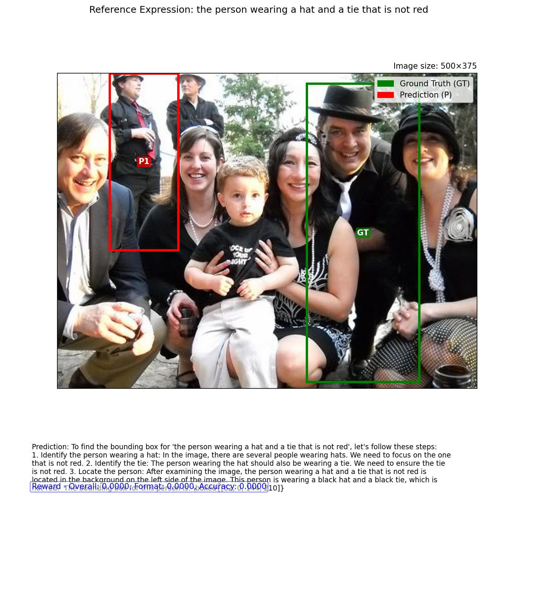

---

### Example 341

**Reference Expression**: the person not standing near the tail of a truck

**Ground Truth**: [[20, 259, 37, 307]]

**Predicted**: [[229, 300, 260, 333]]

**Reward**: {'overall': 0.0, 'format': 0.0, 'accuracy': 0.0}

**Prediction**:
```
To find the bounding box for 'the person not standing near the tail of a truck', we need to follow these steps:

1. Identify the truck in the image. The truck is located on the left side of the image and has a red cargo area covered with a tarp.
2. Look for people near the truck. There are a few people near the truck, but we need to focus on the one who is not near the tail of the truck.
3. The person we are looking for is further away from the truck, closer to the center of the image, and appears to be sitting in a vehicle, which is a red car in the foreground.
4. The bounding box for this person should be around the driver of the red car, as they are not near the truck.

Considering these points, the bounding box for 'the person not standing near the tail of a truck' is around the driver of the red car. The bounding box can be approximately:

\boxed{[229,300,260,333]}
```

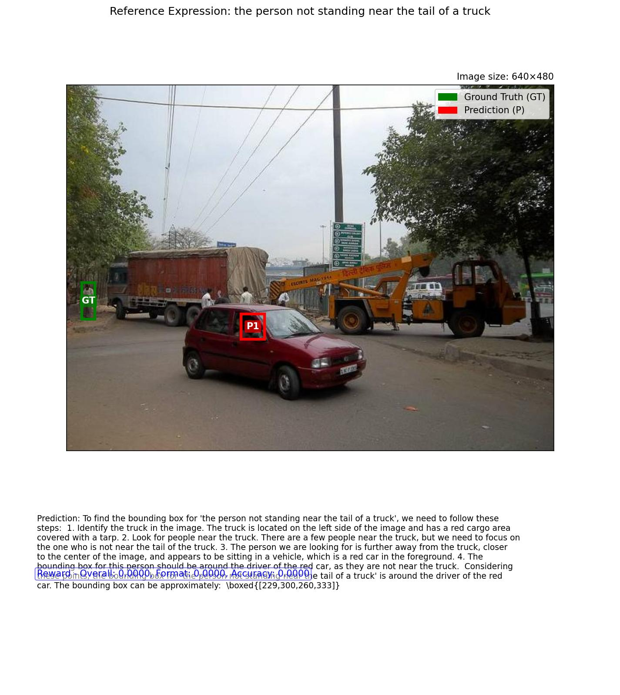

---

### Example 342

**Reference Expression**: the cup in front of a person wearing a pink hat

**Ground Truth**: [[48, 190, 66, 211]]

**Predicted**: [[98, 241, 126, 282]]

**Reward**: {'overall': 0.0, 'format': 0.0, 'accuracy': 0.0}

**Prediction**:
```
To find the bounding box for 'the cup in front of a person wearing a pink hat', we need to follow these steps:

1. Identify the person wearing a pink hat. In the image, there are two individuals wearing pink hats, one on the left side of the table and another on the right side.
2. Determine the cup in front of the person wearing a pink hat. The cup is placed on the table in front of the person on the left side of the table.
3. Locate the bounding box for the cup. The cup is a small, cylindrical object, and we need to outline its area on the table.

By visually inspecting the image, the cup in front of the person wearing a pink hat is located on the left side of the table, closer to the edge.

The bounding box for the cup in front of the person wearing a pink hat is:
\boxed{[98,241,126,282]}
```

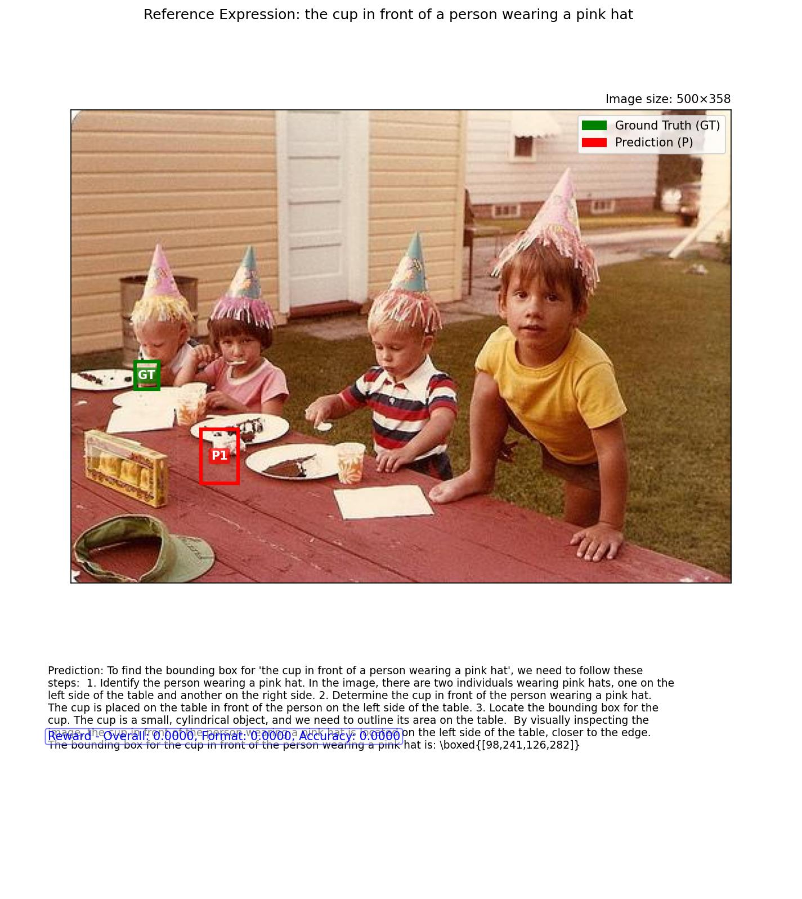

---

### Example 343

**Reference Expression**: the white car not positioned behind a bus

**Ground Truth**: [[154, 9, 196, 49]]

**Predicted**: [[148, 9, 186, 47]]

**Reward**: {'overall': 0.6373165618448637, 'format': 0.0, 'accuracy': 0.6373165618448637}

**Prediction**:
```
To find the bounding box for 'the white car not positioned behind a bus', let's follow these steps:

1. Identify the bus in the image. The bus is in the center lane, and it is clearly visible.
2. Look for cars behind the bus. There are no cars behind the bus in the image.
3. Identify the white car. There is a white car in the lane to the left of the bus, and it is not positioned behind the bus.

The white car not positioned behind the bus is in the left lane, and its bounding box can be determined as follows:
- The car is positioned in the left lane, to the left of the bus.
- The car is white.

Given these observations, the bounding box for 'the white car not positioned behind a bus' is:
\boxed{[148,9,186,47]}
```

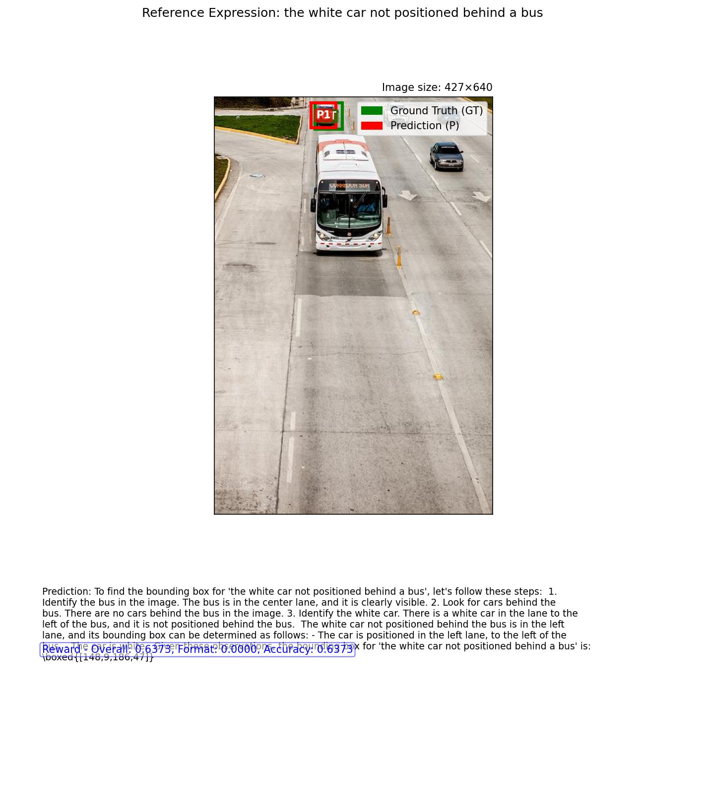

---

### Example 344

**Reference Expression**: the person sitting next to the wall facing the camera

**Ground Truth**: [[139, 366, 156, 393]]

**Predicted**: [[84, 360, 115, 436]]

**Reward**: {'overall': 0.0, 'format': 0.0, 'accuracy': 0.0}

**Prediction**:
```
To find the bounding box for the person sitting next to the wall facing the camera, I'll follow these steps:

1. Identify the wall: The wall is the edge of the building where the people are sitting.
2. Locate the person: The person is sitting on the left side of the image, facing the camera.
3. Define the bounding box: The bounding box should encompass the person from head to knees and include the chair they are sitting on.

Based on this reasoning, the bounding box is:
\boxed{[84, 360, 115, 436]}
```

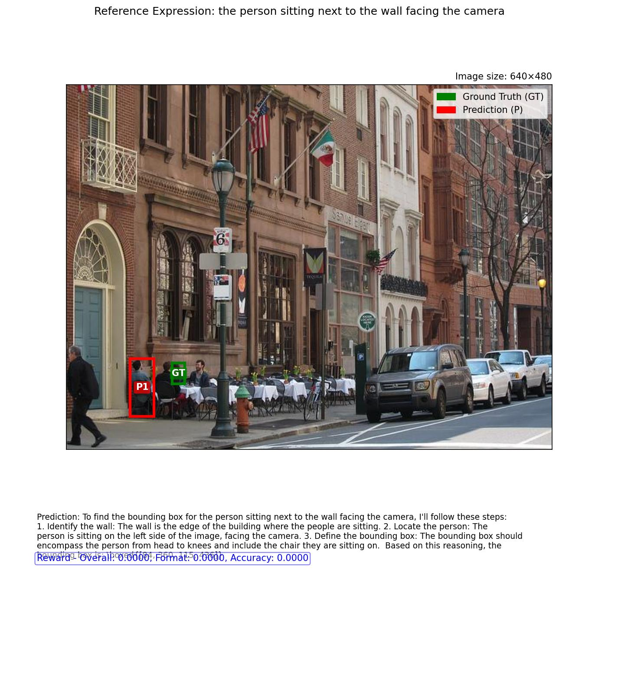

---

### Example 345

**Reference Expression**: truck with a flag on its tail

**Ground Truth**: [[269, 169, 614, 317]]

**Predicted**: [[464, 169, 622, 305]]

**Reward**: {'overall': 0.3911942931656056, 'format': 0.0, 'accuracy': 0.3911942931656056}

**Prediction**:
```
To find the bounding box for the truck with a flag on its tail, let's follow these steps:

1. Identify the fire trucks in the image: There are multiple fire trucks, but we need to focus on the one with the flag.
2. Locate the flag: The flag is on the rear of the truck on the right side of the image.
3. Identify the truck with the flag: The truck on the right side of the image has an American flag on its rear, and it is labeled "T71."
4. Determine the bounding box: The truck with the flag is the one on the far right, so we need to draw a bounding box around the entire truck.

The bounding box for the truck with the flag on its tail is:
\boxed{[464,169,622,305]}

This bounding box captures the entire truck, including the flag on its tail.
```

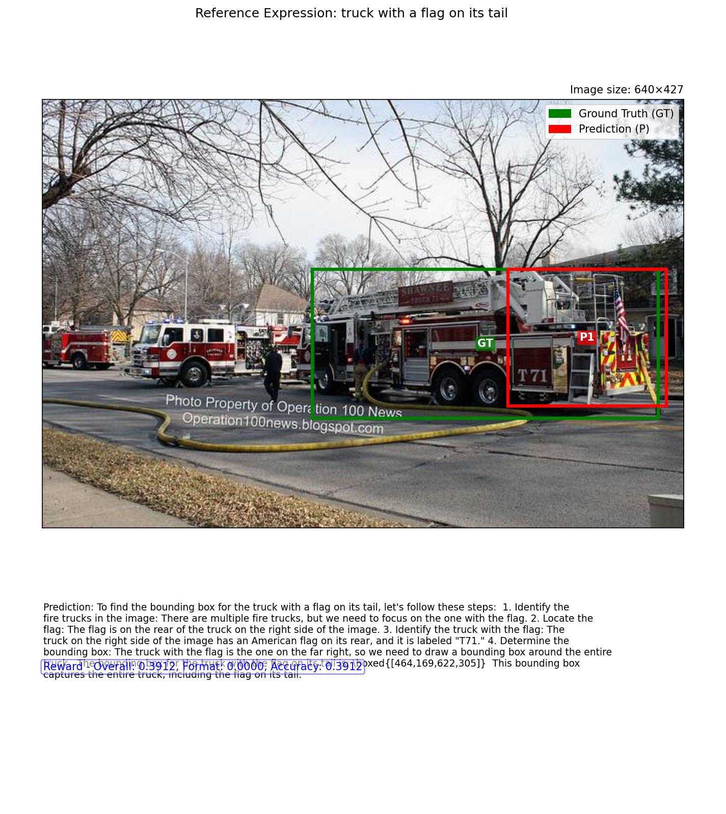

---

### Example 346

**Reference Expression**: the person sitting with empty hands

**Ground Truth**: [[192, 222, 245, 322]]

**Predicted**: [[201, 222, 244, 323]]

**Reward**: {'overall': 0.8047913157402209, 'format': 0.0, 'accuracy': 0.8047913157402209}

**Prediction**:
```
To identify 'the person sitting with empty hands', let's follow these steps:

1. **Identify the truck**: The main object in the image is a truck, which appears to be a vintage model, possibly used for agricultural or industrial purposes.
2. **Locate the people**: There are three individuals in the image. Two are sitting on the ground near the truck, and one is standing next to the truck.
3. **Analyze the sitting individuals**: The two individuals sitting on the ground are positioned in a way that suggests they are working or resting. One of them appears to be holding a tool or equipment, while the other has their hands empty.
4. **Determine the person with empty hands**: The person sitting with empty hands is the one positioned slightly to the right of the person holding the tool. This person is not actively engaged with any equipment and is simply sitting.

Based on this analysis, the bounding box for 'the person sitting with empty hands' is:

\boxed{[201,222,244,323]}
```

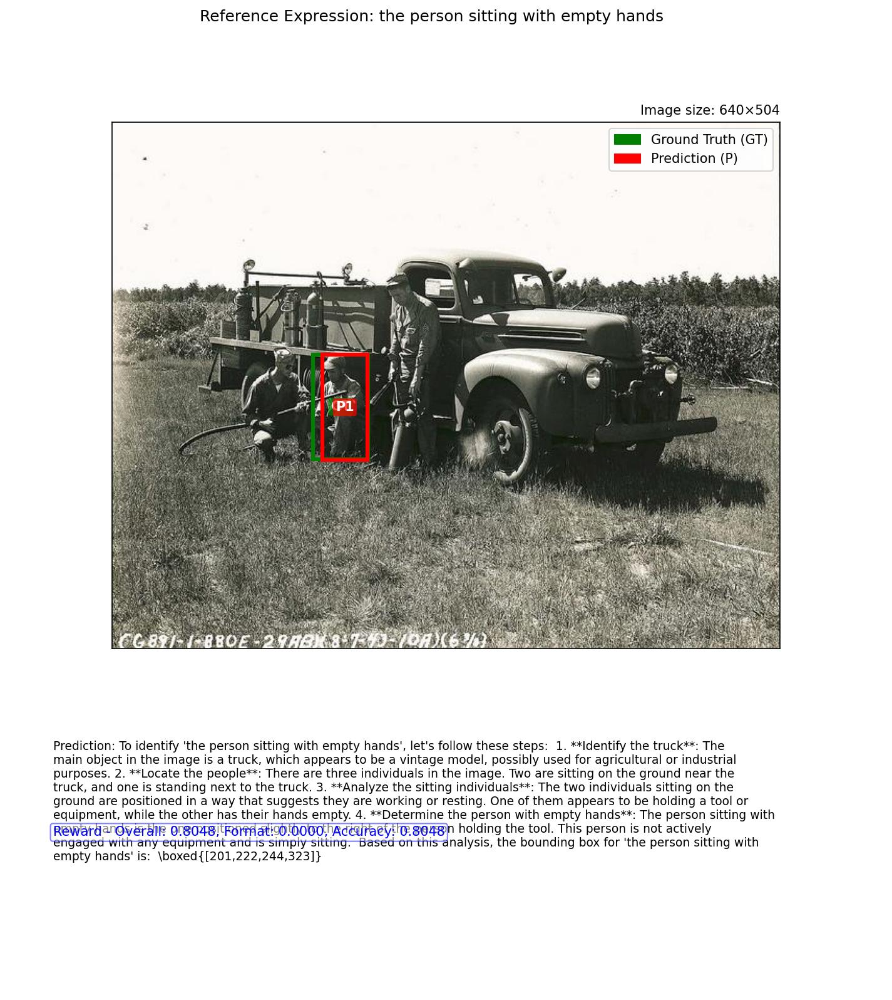

---

### Example 347

**Reference Expression**: the person near a suitcase that is not black

**Ground Truth**: [[192, 92, 243, 254]]

**Predicted**: [[139, 82, 192, 284]]

**Reward**: {'overall': 0.0, 'format': 0.0, 'accuracy': 0.0}

**Prediction**:
```
To find the bounding box for 'the person near a suitcase that is not black', let's follow these steps:

1. Identify the black suitcase in the foreground.
2. Look around the black suitcase to find the person standing near it.
3. Identify the person standing near the non-black suitcase (which appears to be a blue one).

After analyzing the image, the person near the non-black (blue) suitcase is standing to the left of it.

The bounding box for this person is:
\boxed{[139, 82, 192, 284]}
```

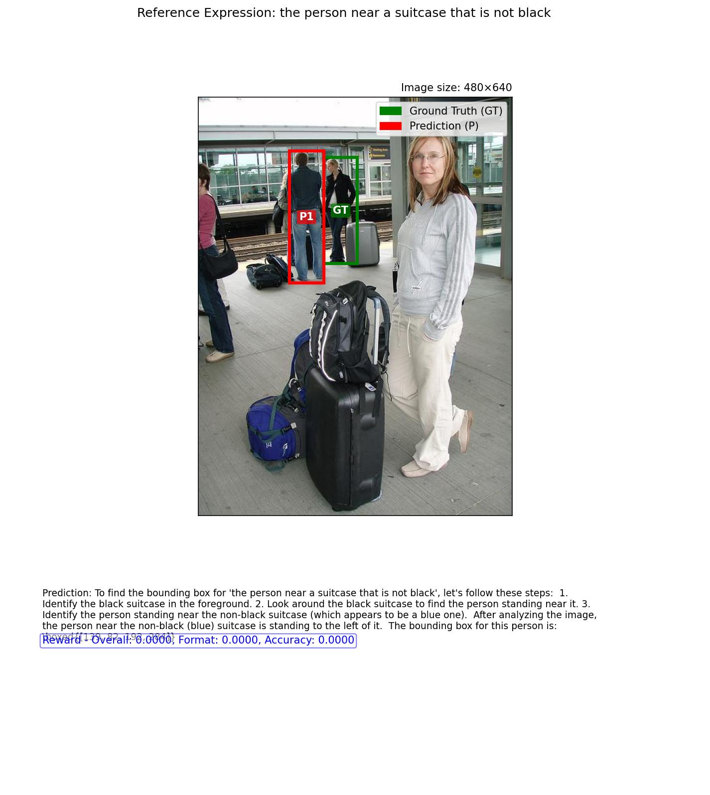

---

### Example 348

**Reference Expression**: person facing the camera wearing a blue top

**Ground Truth**: [[176, 126, 213, 234]]

**Predicted**: [[364, 56, 482, 367]]

**Reward**: {'overall': 0.0, 'format': 0.0, 'accuracy': 0.0}

**Prediction**:
```
To find the bounding box for the person facing the camera wearing a blue top, let's follow these steps:

1. Identify the person in the image who is facing the camera and wearing a blue top.
2. Observe the position of the person relative to the other individuals and the dog.
3. Locate the person's head, shoulders, and torso, and draw a bounding box around them.

- The person wearing a blue top is standing and facing the camera.
- They are positioned to the right of the two children and to the left of the dog.
- The person is wearing a blue top and red pants.
- The bounding box should encompass the entire person from the head to the feet.

After analyzing the image, the bounding box for the person facing the camera wearing a blue top is:

\boxed{[364,56,482,367]}
```

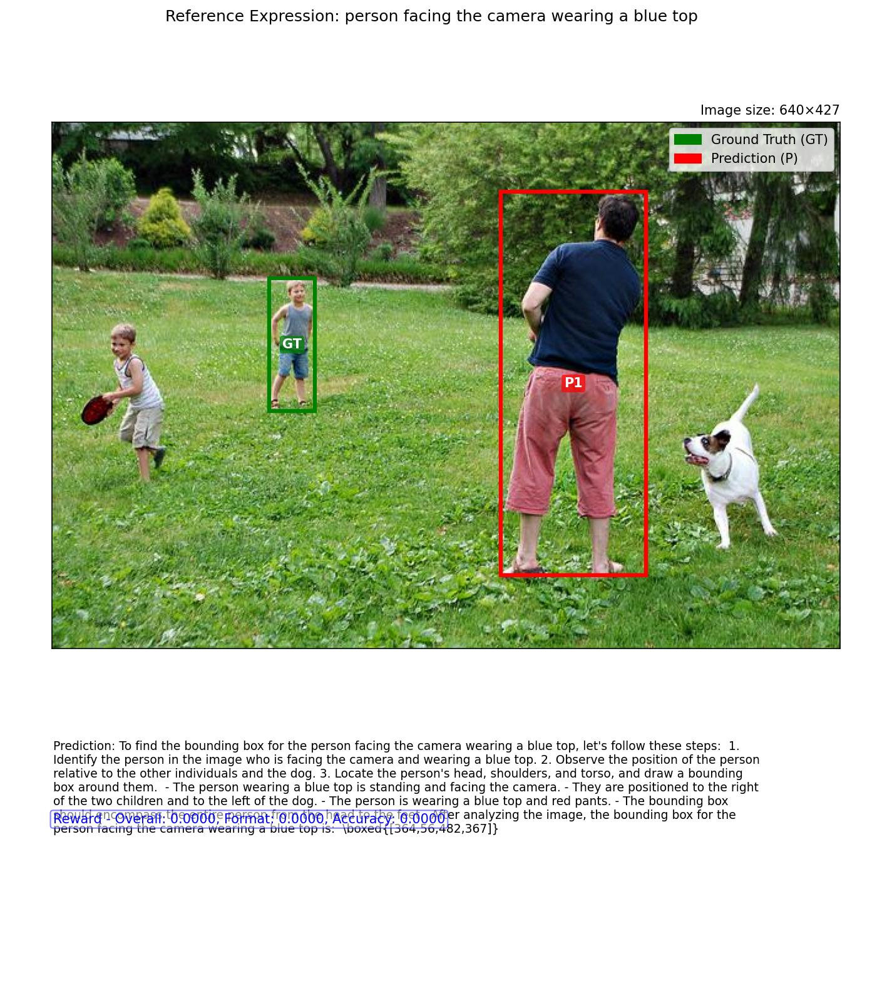

---

### Example 349

**Reference Expression**: the person wearing glasses not facing the camera

**Ground Truth**: [[499, 134, 640, 427]]

**Predicted**: [[503, 132, 644, 419]]

**Reward**: {'overall': 1.0, 'format': 0.0, 'accuracy': 1.0}

**Prediction**:
```
To find the bounding box for 'the person wearing glasses not facing the camera', let's follow these steps:

1. Identify the person wearing glasses: The person in the middle of the image, wearing glasses and a suit, is the one wearing glasses.
2. Determine who is not facing the camera: The person not facing the camera would be the one on the far right side of the image, partially visible.
3. Locate the bounding box: The person on the far right is partially visible, and we can see the back of their head and part of their suit.

The bounding box for 'the person wearing glasses not facing the camera' is:
\boxed{[503,132,644,419]}
```

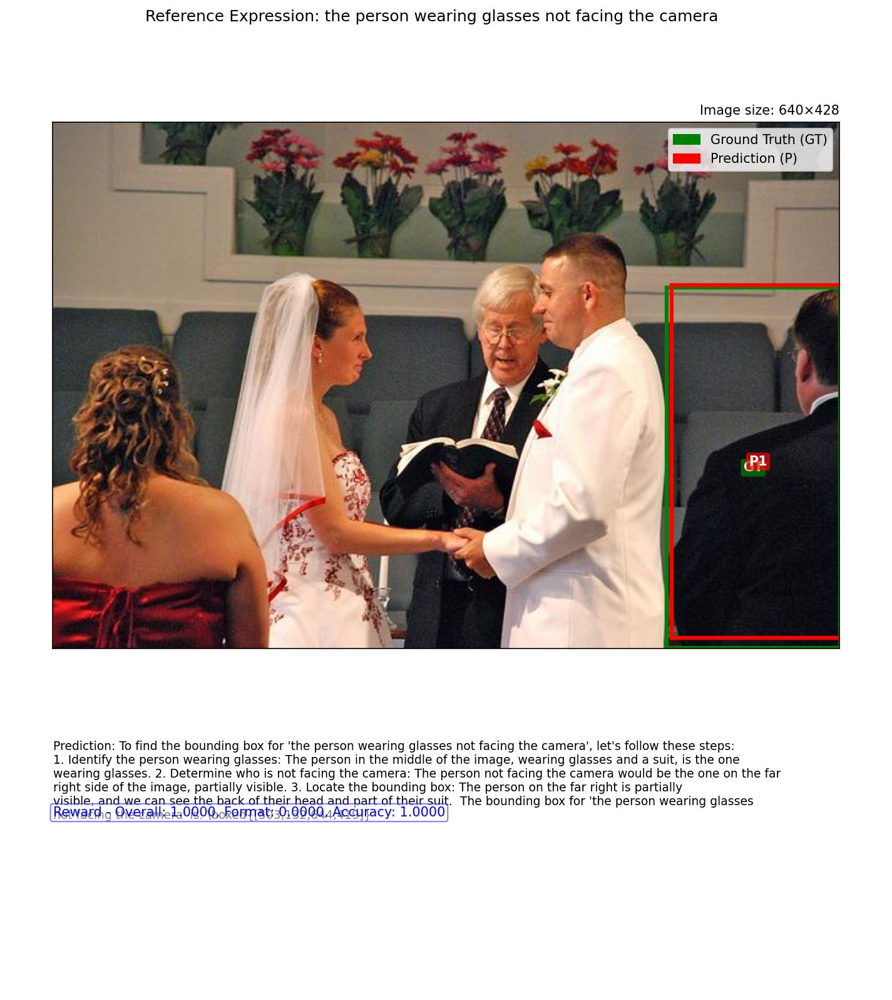

---

### Example 350

**Reference Expression**: the bird in front of a bear and not next to a tree

**Ground Truth**: [[273, 291, 383, 405]]

**Predicted**: [[276, 292, 379, 396]]

**Reward**: {'overall': 0.8542264752791069, 'format': 0.0, 'accuracy': 0.8542264752791069}

**Prediction**:
```
To find the bounding box for 'the bird in front of a bear and not next to a tree', let's follow these steps:

1. Identify the bear in the image. The bear is the central figure, surrounded by birds.
2. Look for birds in front of the bear. There is one bird in front of the bear, not next to a tree.
3. Ensure the bird is not next to a tree. The bird in question is indeed not next to a tree.

The bird in question is located in the center of the image, in front of the bear and not next to a tree.

The bounding box for this bird is:
\boxed{[276,292,379,396]}.
```

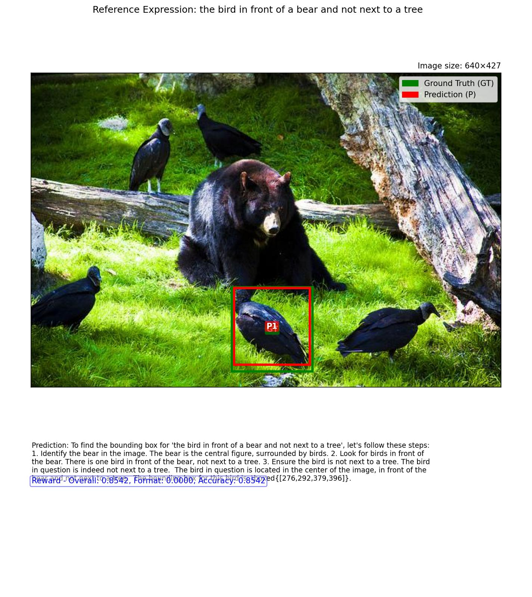

---

### Example 351

**Reference Expression**: the person under an umbrella but not holding it

**Ground Truth**: [[452, 176, 502, 251]]

**Predicted**: [[208, 178, 299, 282]]

**Reward**: {'overall': 0.0, 'format': 0.0, 'accuracy': 0.0}

**Prediction**:
```
To find the bounding box for 'the person under an umbrella but not holding it', we need to follow these steps:

1. Identify the umbrella that is not being held by anyone.
2. Determine who is under that umbrella.
3. Find the bounding box for that person.

Step 1: The umbrella that is not being held by anyone is the black umbrella in the foreground.
Step 2: The person under this black umbrella is the child on the left side of the table.
Step 3: The bounding box for this person can be determined by identifying the area around the child under the black umbrella.

The bounding box for 'the person under an umbrella but not holding it' is:
\boxed{[208,178,299,282]}
```

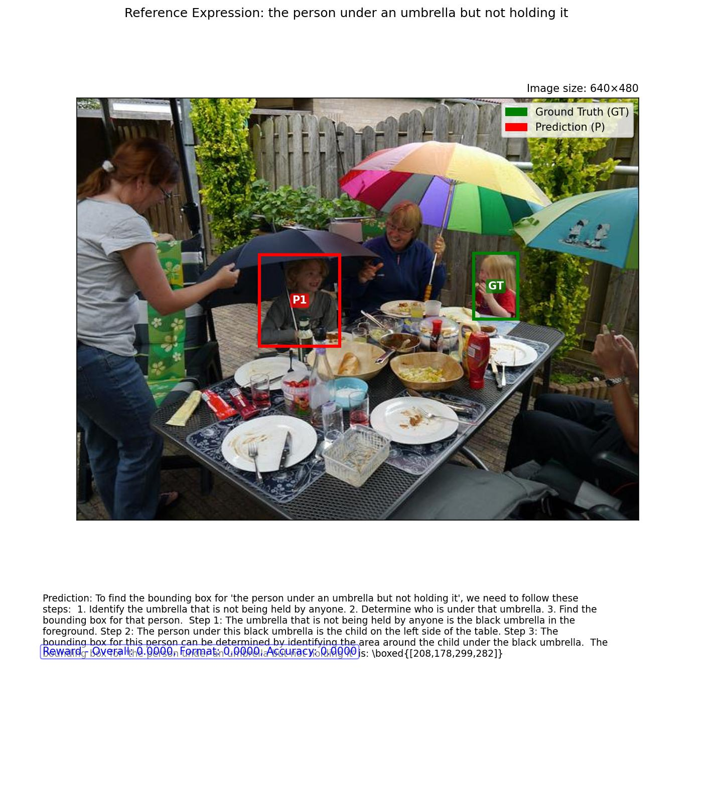

---

### Example 352

**Reference Expression**: the black chair not under the umbrella

**Ground Truth**: [[110, 232, 166, 317]]

**Predicted**: [[210, 284, 305, 405]]

**Reward**: {'overall': 0.0, 'format': 0.0, 'accuracy': 0.0}

**Prediction**:
```
To find the bounding box for 'the black chair not under the umbrella', let's follow these steps:

1. Identify the umbrella: The umbrella is the green one in the center-right of the image.
2. Locate the black chair: The black chair is to the right of the umbrella and is not under it.
3. Determine the bounding box: The black chair is positioned on a patch of ground, and we need to define its boundaries. The chair is relatively small, so we'll define the bounding box to encompass the entire chair, including its legs and seat.

The bounding box for the black chair not under the umbrella would be:
\boxed{[210,284,305,405]}

This bounding box captures the entire black chair, ensuring that the chair is fully included within the box.
```

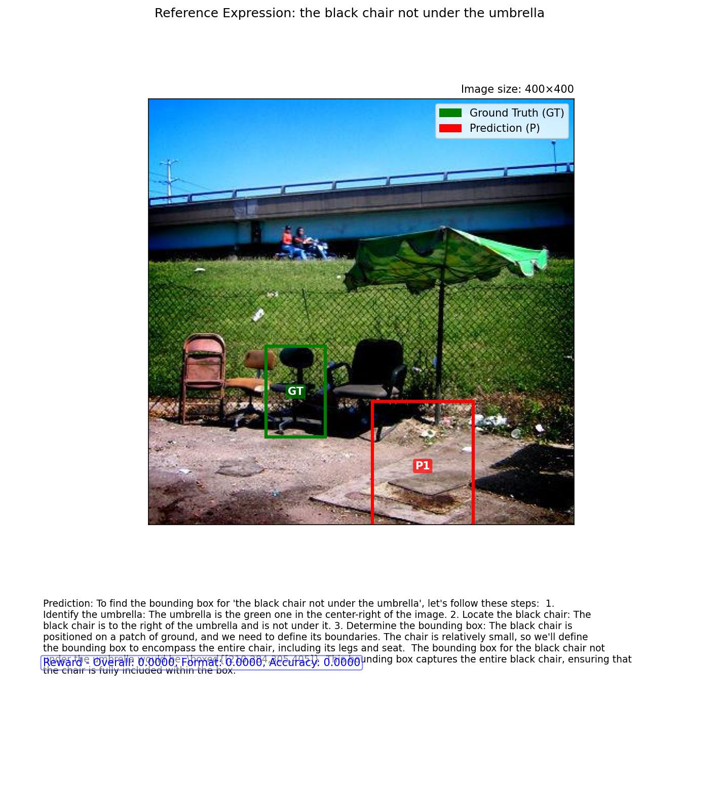

---

### Example 353

**Reference Expression**: the person wearing a black top who is not sitting

**Ground Truth**: [[69, 107, 96, 209]]

**Predicted**: [[495, 166, 577, 256]]

**Reward**: {'overall': 0.0, 'format': 0.0, 'accuracy': 0.0}

**Prediction**:
```
To find the bounding box for 'the person wearing a black top who is not sitting', we need to follow these steps:

1. Identify all the people in the image.
2. Determine who is wearing a black top.
3. Check if the person wearing a black top is sitting or standing.
4. Select the bounding box for the person who is not sitting.

Step 1: Identifying all the people in the image.
- There are several people in the image, including children and adults.

Step 2: Determining who is wearing a black top.
- Among the people, there is one person in the foreground on the right side who is wearing a black top.

Step 3: Checking if the person wearing a black top is sitting or standing.
- The person in the black top is standing, not sitting.

Step 4: Selecting the bounding box for the person who is not sitting.
- The bounding box for the person wearing a black top who is not sitting is the one we need to identify.

The bounding box for the person wearing a black top who is not sitting is:
\boxed{[495,166,577,256]}

This bounding box corresponds to the person on the right side of the image, who is standing and wearing a black top.
```

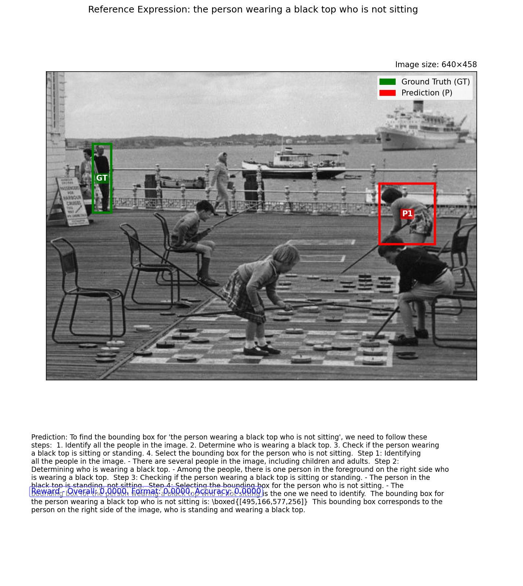

---

### Example 354

**Reference Expression**: the person wearing a dark top and no hat

**Ground Truth**: [[268, 81, 479, 337]]

**Predicted**: [[272, 81, 493, 341]]

**Reward**: {'overall': 1.0, 'format': 0.0, 'accuracy': 1.0}

**Prediction**:
```
To find the bounding box for 'the person wearing a dark top and no hat', let's follow these steps:

1. Identify the individuals in the image.
2. Focus on the person who is wearing a dark top and not wearing a hat.
3. Locate the person in the center of the image, standing with their back partially facing the camera, wearing a dark top and no hat.

After analyzing the image, the person in question is located in the center, standing with their back partially facing the camera, wearing a dark top and no hat.

The bounding box for this person is:
\boxed{[272,81,493,341]}
```

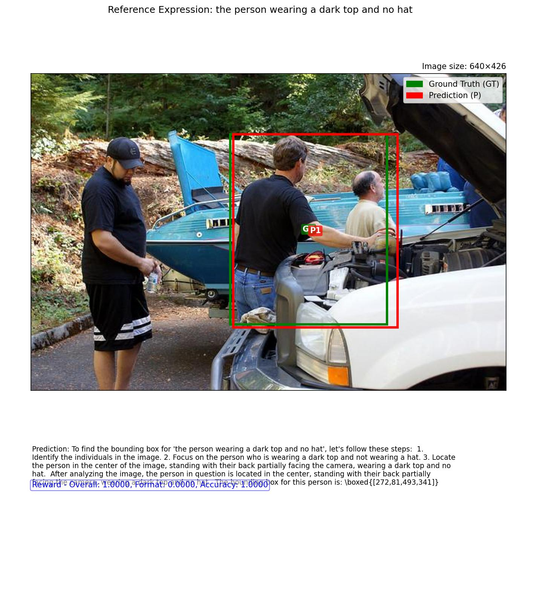

---

### Example 355

**Reference Expression**: the person wearing a hat not under the umbrella

**Ground Truth**: [[37, 184, 113, 400]]

**Predicted**: [[48, 187, 105, 395]]

**Reward**: {'overall': 0.7222222222222222, 'format': 0.0, 'accuracy': 0.7222222222222222}

**Prediction**:
```
To find the bounding box for 'the person wearing a hat not under the umbrella', let's follow these steps:

1. Identify the umbrella: The umbrella is prominently in the center of the image, with the brand "Havaianas" written on it.
2. Look for the person wearing a hat: There is a person standing to the left of the umbrella who is wearing a hat.
3. Determine if this person is under the umbrella: The person wearing the hat is not under the umbrella, as they are standing to the left of it.
4. Locate the bounding box: The person wearing the hat is standing, so we need to identify their approximate location and draw a bounding box around them.

After analyzing the image, the bounding box for the person wearing a hat not under the umbrella can be identified as follows:

\boxed{[48,187,105,395]}
```

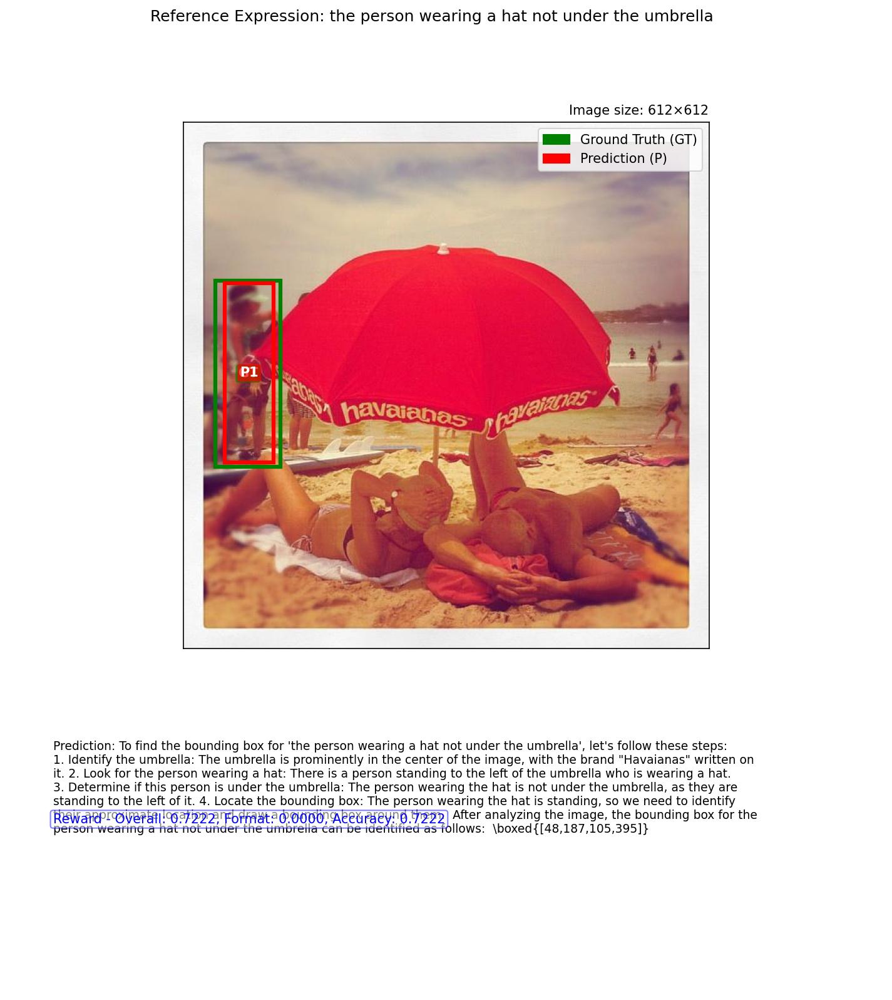

---

### Example 356

**Reference Expression**: the handbag on the shoulder of a person not under the umbrella

**Ground Truth**: [[119, 174, 192, 335]]

**Predicted**: [[122, 172, 229, 331]]

**Reward**: {'overall': 0.6182493249324933, 'format': 0.0, 'accuracy': 0.6182493249324933}

**Prediction**:
```
To find the handbag on the shoulder of a person not under the umbrella, we need to follow these steps:

1. Identify the person not under the umbrella. The person on the left is not under the umbrella.
2. Locate the handbag on the shoulder of this person. The person on the left is carrying a tan handbag on their shoulder.

The bounding box for the handbag on the shoulder of the person not under the umbrella is:
\boxed{[122,172,229,331]}
```

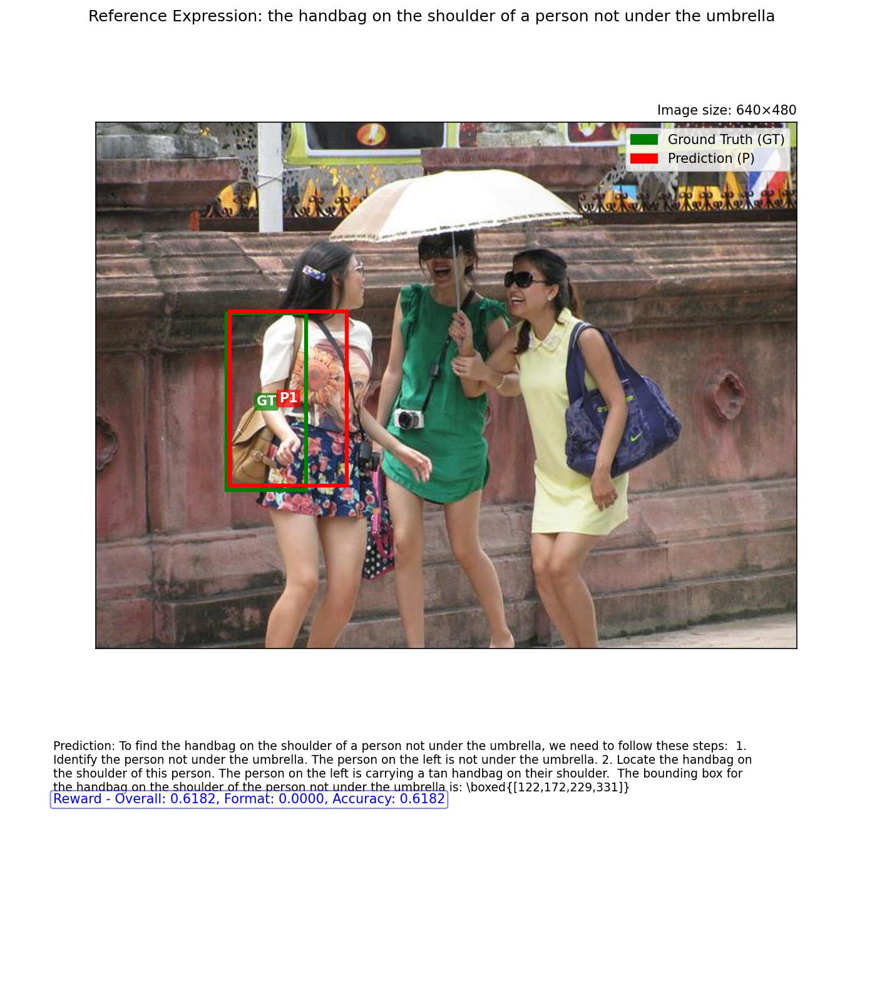

---

### Example 357

**Reference Expression**: the person with a hat under an umbrella

**Ground Truth**: [[139, 166, 251, 422]]

**Predicted**: [[144, 165, 251, 415]]

**Reward**: {'overall': 1.0, 'format': 0.0, 'accuracy': 1.0}

**Prediction**:
```
To find the person with a hat under an umbrella, we need to follow these steps:

1. Identify the umbrella in the image. The umbrella is black and red, and it is being held by a person in the center of the image.
2. Look for a person under this umbrella. The person appears to be wearing a hat and is positioned directly under the umbrella.
3. Locate the bounding box for this person. The person under the umbrella is wearing a zebra-print coat and a hat.

After analyzing the image, the bounding box for 'the person with a hat under an umbrella' is:
\boxed{[144,165,251,415]}
```

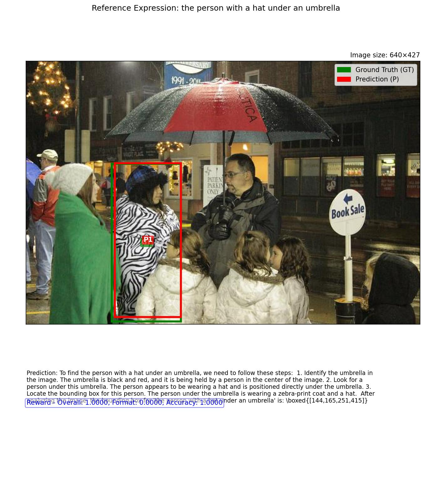

---

### Example 358

**Reference Expression**: the red umbrella overlapping with a blue one

**Ground Truth**: [[236, 456, 425, 628]]

**Predicted**: [[226, 462, 420, 634]]

**Reward**: {'overall': 0.8644854522812182, 'format': 0.0, 'accuracy': 0.8644854522812182}

**Prediction**:
```
To find the bounding box for 'the red umbrella overlapping with a blue one', let's follow these steps:

1. Identify the blue umbrella: It is the one in the center, slightly towards the right.
2. Identify the red umbrella: It is the one below the blue one.
3. Determine the overlapping area: The red umbrella overlaps with the blue one in the middle.

Now, we need to outline the bounding box for the red umbrella that overlaps with the blue one.

The bounding box for the red umbrella overlapping with the blue one would be:
\boxed{[226,462,420,634]}

This box captures the red umbrella's portion that overlaps with the blue one.
```

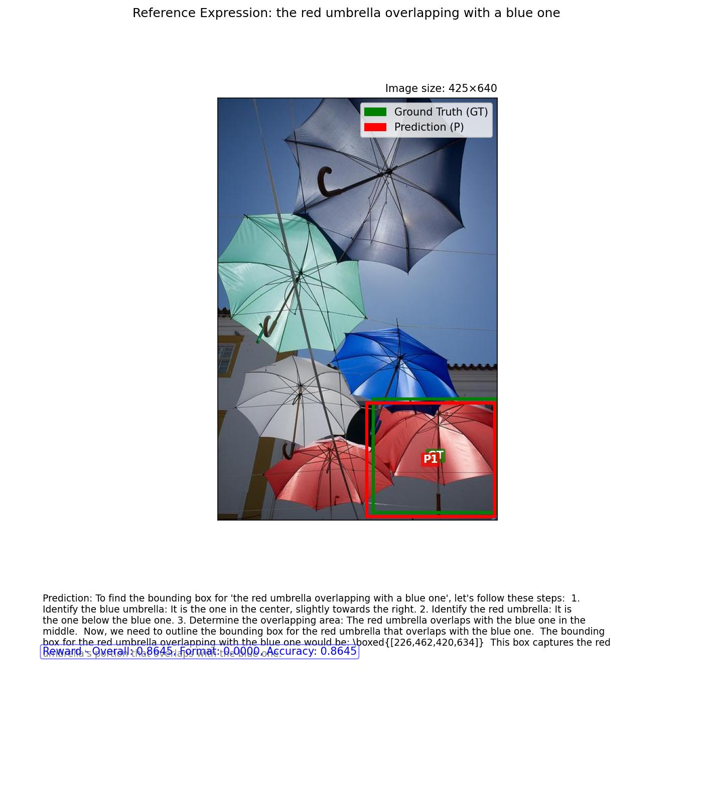

---

### Example 359

**Reference Expression**: the person wearing a black top and sitting

**Ground Truth**: [[190, 130, 207, 156]]

**Predicted**: [[200, 140, 218, 178]]

**Reward**: {'overall': 0.11045364891518737, 'format': 0.0, 'accuracy': 0.11045364891518737}

**Prediction**:
```
To find the bounding box for 'the person wearing a black top and sitting', let's follow these steps:

1. Identify the area where people are sitting. The image shows a group of people near a pathway, and some are sitting on the grass.
2. Look for individuals wearing black tops. Among the people near the pathway, there is one person wearing a black top.
3. Determine the sitting position. The person in the black top is sitting on the grass, not standing.
4. Locate the bounding box. The person in the black top is positioned to the left of the pathway, sitting on the grass.

Considering these observations, the bounding box for 'the person wearing a black top and sitting' would be:

\boxed{[200,140,218,178]}

This bounding box is based on the assumption that the person in the black top is the one sitting on the grass near the pathway.
```

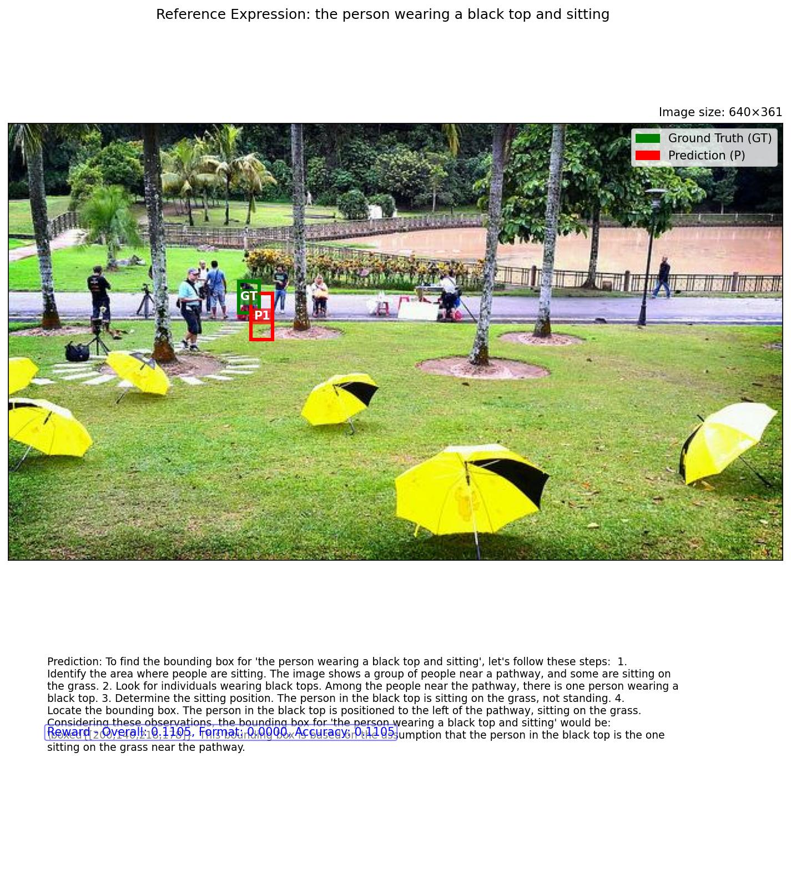

---

### Example 360

**Reference Expression**: the person wearing a white top and standing

**Ground Truth**: [[272, 208, 343, 370]]

**Predicted**: [[336, 206, 386, 361]]

**Reward**: {'overall': 0.0, 'format': 0.0, 'accuracy': 0.0}

**Prediction**:
```
To find the bounding box for 'the person wearing a white top and standing', let's follow these steps:

1. Identify the area where people are standing.
2. Look for individuals wearing a white top.
3. Among the people in the white top, identify the one who is standing.

Upon analyzing the image:
- There are two individuals in the foreground who appear to be standing.
- One of them is wearing a white top and red shorts.

The bounding box for the person wearing a white top and standing is:
\boxed{[336,206,386,361]}
```

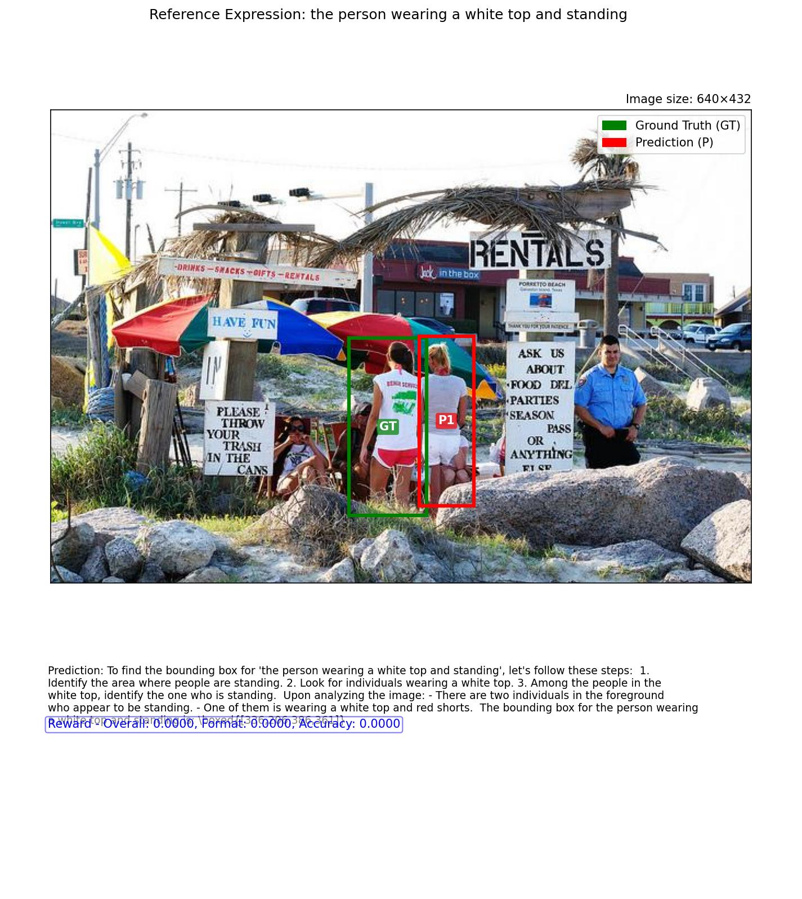

---

### Example 361

**Reference Expression**: the person with left leg forward wearing grey long socks

**Ground Truth**: [[201, 16, 369, 248]]

**Predicted**: [[583, 22, 782, 327]]

**Reward**: {'overall': 0.0, 'format': 0.0, 'accuracy': 0.0}

**Prediction**:
```
To determine the bounding box for 'the person with left leg forward wearing grey long socks', we need to follow these steps:

1. Identify the person who is sitting in such a way that their left leg is forward.
2. Confirm that the person is wearing grey long socks.

Step 1: Observing the image, the person on the far right has their left leg forward, which matches the description.

Step 2: The person on the far right is indeed wearing grey long socks.

Thus, the bounding box for this person is:
\boxed{[583,22,782,327]}
```

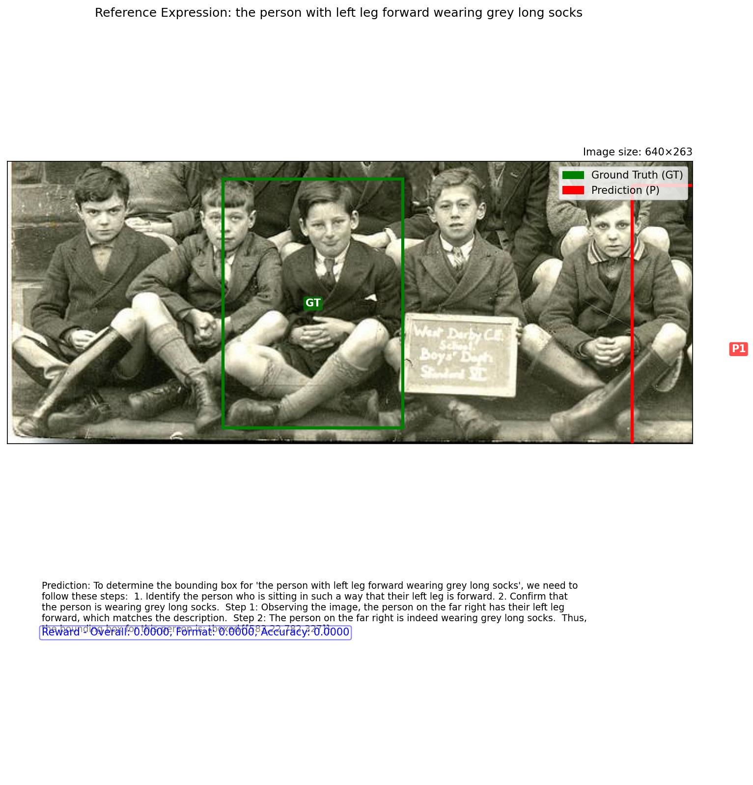

---

### Example 362

**Reference Expression**: the person in a black jacket not holding anything in hands

**Ground Truth**: [[452, 46, 629, 421]]

**Predicted**: [[434, 46, 619, 415]]

**Reward**: {'overall': 0.8439541476642426, 'format': 0.0, 'accuracy': 0.8439541476642426}

**Prediction**:
```
To find the bounding box for 'the person in a black jacket not holding anything in hands', let's follow these steps:

1. Identify the group of people in the image.
2. Focus on the individuals wearing black jackets.
3. Among the individuals in black jackets, find the one who is not holding anything in their hands.

- There are four individuals in the image.
- Three of them are in military uniforms, and one is in a civilian suit.
- The person in the civilian suit is on the far left.
- The next two individuals are in military uniforms, and they are holding awards.
- The fourth individual, on the far right, is also in a military uniform but is not holding anything.

The bounding box for the person in a black jacket not holding anything in hands is:

\boxed{[434,46,619,415]}
```

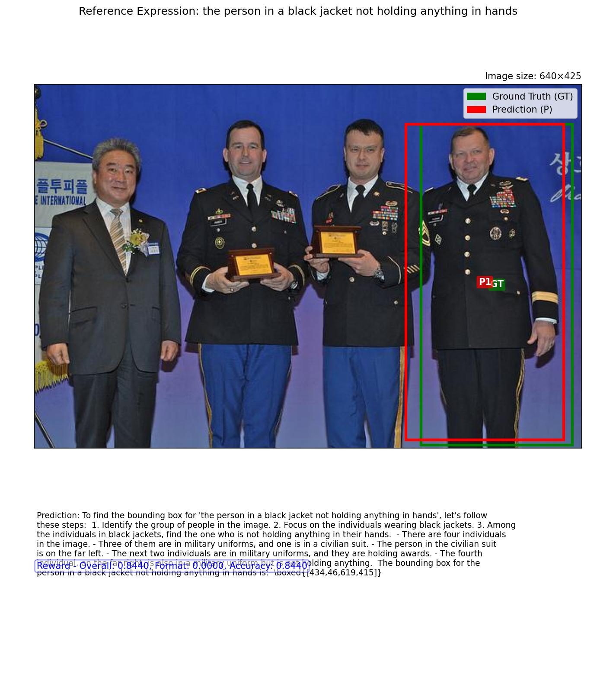

---

### Example 363

**Reference Expression**: the person wearing a green tie with legs extended straight while jumping

**Ground Truth**: [[435, 99, 598, 328]]

**Predicted**: [[439, 98, 597, 323]]

**Reward**: {'overall': 1.0, 'format': 0.0, 'accuracy': 1.0}

**Prediction**:
```
To find the bounding box for 'the person wearing a green tie with legs extended straight while jumping', we need to follow these steps:

1. Identify the green tie: Look for the person wearing a green tie. In the image, there are two people wearing green ties, but one of them is not fully extended while jumping.
2. Identify the extended jump: Among the people wearing a green tie, find the one whose legs are extended straight and who is in the middle of a jump.
3. Locate the bounding box: The person wearing the green tie with legs extended straight is on the right side of the image. This person is also wearing a light blue shirt and a light blue tie.

The bounding box for this person is:
\boxed{[439,98,597,323]}


```

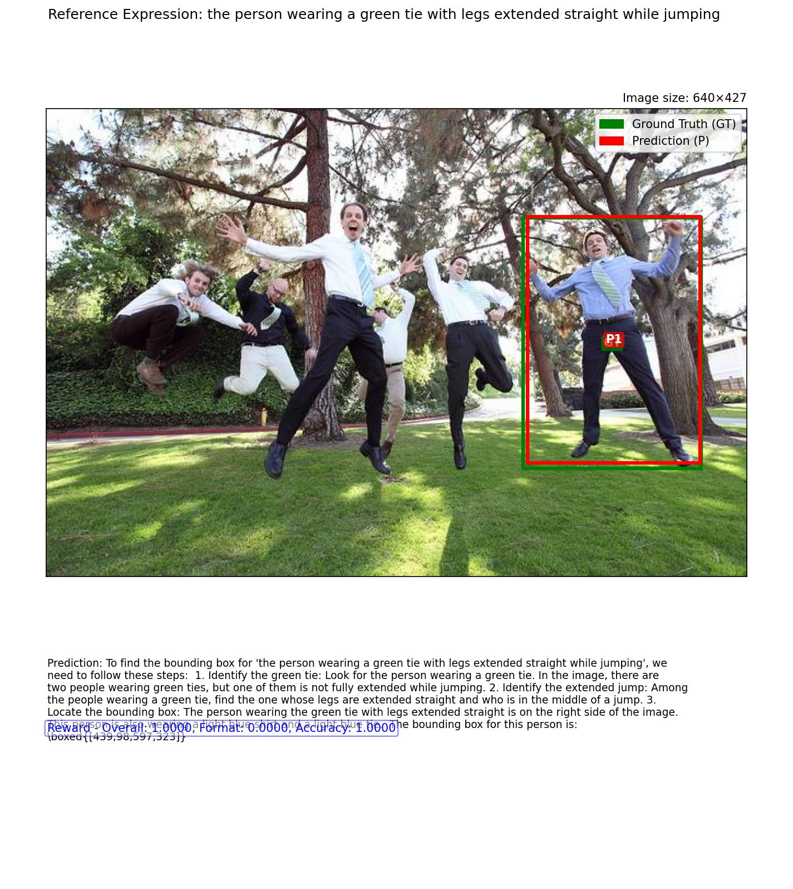

---

### Example 364

**Reference Expression**: the first red suitcase from the left

**Ground Truth**: [[237, 272, 308, 370]]

**Predicted**: [[279, 314, 339, 447]]

**Reward**: {'overall': 0.12197686645636173, 'format': 0.0, 'accuracy': 0.12197686645636173}

**Prediction**:
```
To find the bounding box for 'the first red suitcase from the left', let's follow these steps:

1. Identify the red suitcases: There are two red suitcases in the image.
2. Determine which one is 'the first red suitcase from the left': The red suitcase on the left side of the pile is the one we are looking for.
3. Locate the bounding box: The red suitcase on the left is positioned next to a black suitcase and is the first in the sequence of suitcases.

The bounding box for 'the first red suitcase from the left' is:
\boxed{[279,314,339,447]}
```

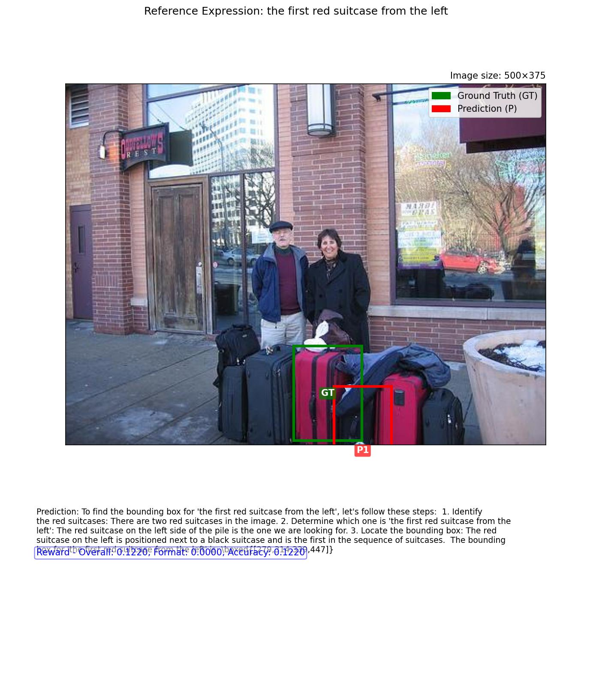

---

### Example 365

**Reference Expression**: the green bench that is not empty

**Ground Truth**: [[233, 279, 440, 434]]

**Predicted**: [[242, 255, 499, 434]]

**Reward**: {'overall': 0.6474956749229925, 'format': 0.0, 'accuracy': 0.6474956749229925}

**Prediction**:
```
To find the corresponding bounding box for 'the green bench that is not empty', let's follow these steps:

1. Identify the benches in the image: There are several benches, and we need to focus on the one that is not empty. The bench in question appears to be the one in the foreground, which is partially occupied by a man.
2. Check the condition: The bench in the foreground is partially occupied, so it is not empty.
3. Locate the bounding box: The green bench in question is the one closest to the camera and partially occupied by a man. It is located near the center of the image.

The bounding box for 'the green bench that is not empty' can be described as follows:
\boxed{[242,255,499,434]}

This bounding box captures the green bench that is not empty, as it is partially occupied by a man.
```

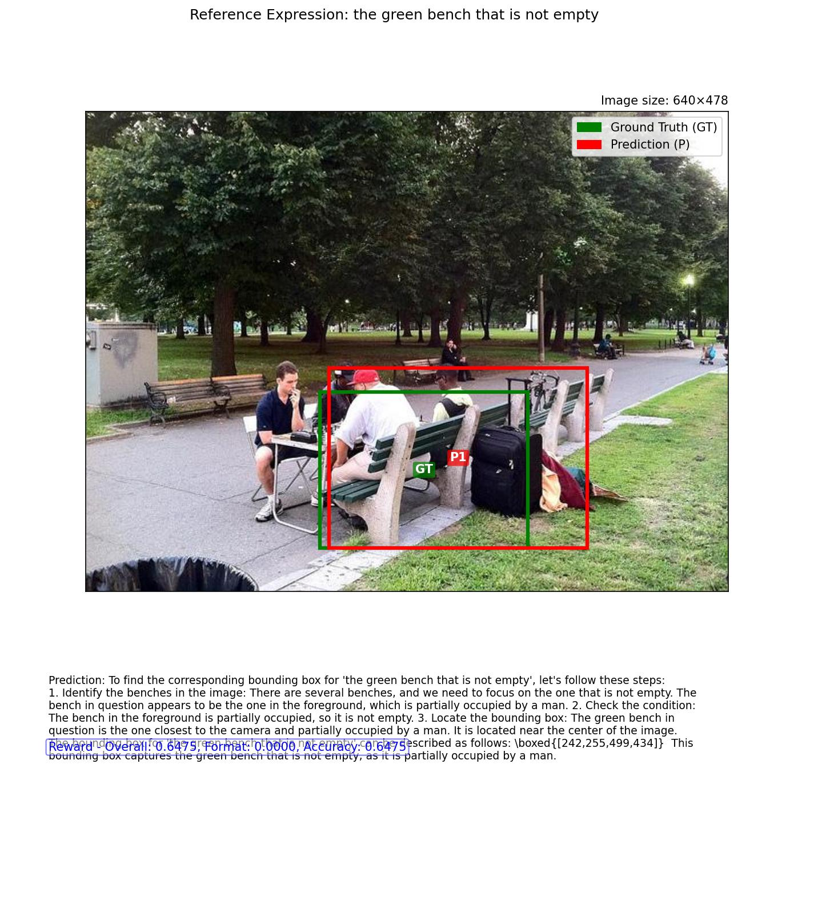

---

### Example 366

**Reference Expression**: the person wearing sneakers without a bag

**Ground Truth**: [[0, 146, 147, 330]]

**Predicted**: [[4, 149, 145, 319]]

**Reward**: {'overall': 0.8862023070097604, 'format': 0.0, 'accuracy': 0.8862023070097604}

**Prediction**:
```
To find the bounding box for 'the person wearing sneakers without a bag', let's follow these steps:

1. Identify the people in the image: There are three people riding elephants.
2. Determine the person wearing sneakers: The person on the far left is wearing sneakers and does not have a bag.
3. Identify the person without a bag: The person on the far left does not have a bag.
4. Locate the bounding box: The person on the far left is wearing a striped shirt and is seated on the elephant.

The bounding box for 'the person wearing sneakers without a bag' is:
\boxed{[4,149,145,319]}
```

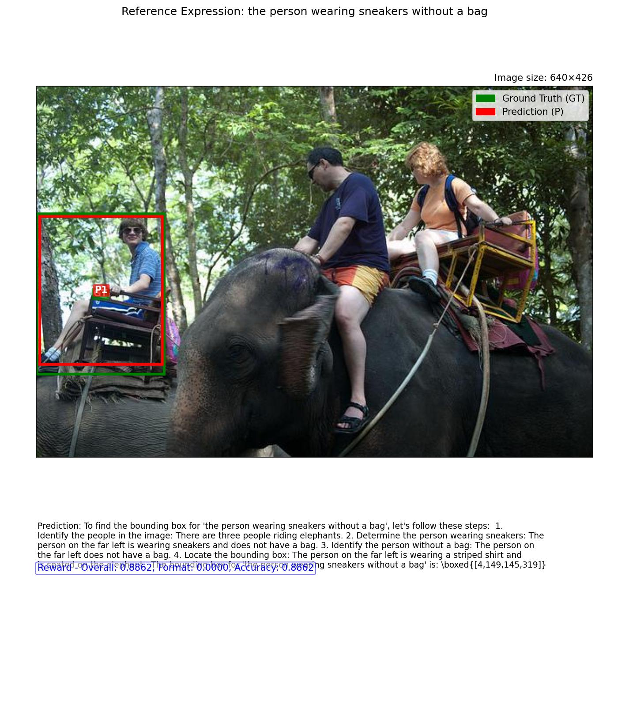

---

### Example 367

**Reference Expression**: the person with black hair between two trucks

**Ground Truth**: [[149, 202, 231, 377]]

**Predicted**: [[31, 299, 163, 476]]

**Reward**: {'overall': 0.0, 'format': 0.0, 'accuracy': 0.0}

**Prediction**:
```
To find the bounding box for 'the person with black hair between two trucks', let's follow these steps:

1. Identify the two trucks: One is on the left side of the image, and the other is on the right side.
2. Locate the person with black hair: This person is positioned between the two trucks, closer to the left truck.
3. Determine the bounding box: The person is wearing a high-visibility vest and is standing next to the left truck.

After analyzing the image, the bounding box for 'the person with black hair between two trucks' is:
\boxed{[31,299,163,476]}
```

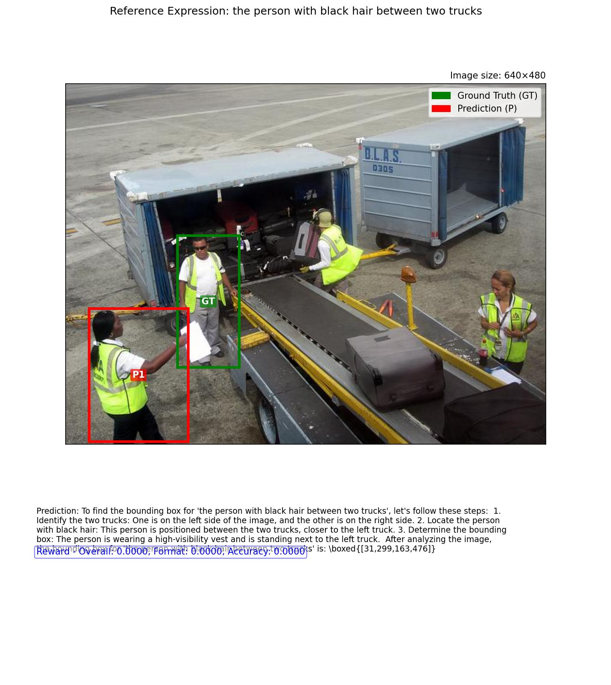

---

### Example 368

**Reference Expression**: the elephant on the left hand side of an elephant with earrings

**Ground Truth**: [[467, 52, 640, 508]]

**Predicted**: [[0, 77, 239, 421]]

**Reward**: {'overall': 0.0, 'format': 0.0, 'accuracy': 0.0}

**Prediction**:
```
To find the bounding box for 'the elephant on the left hand side of an elephant with earrings', we need to follow these steps:

1. Identify the elephant with earrings: The middle elephant in the image has yellow tassels hanging from its ears, so it is the one with earrings.
2. Locate the elephant to the left of the one with earrings: The elephant to the left of the one with earrings is the one on the far left side of the image.

The bounding box for the elephant on the left hand side of the elephant with earrings is:
\boxed{[0,77,239,421]}
```

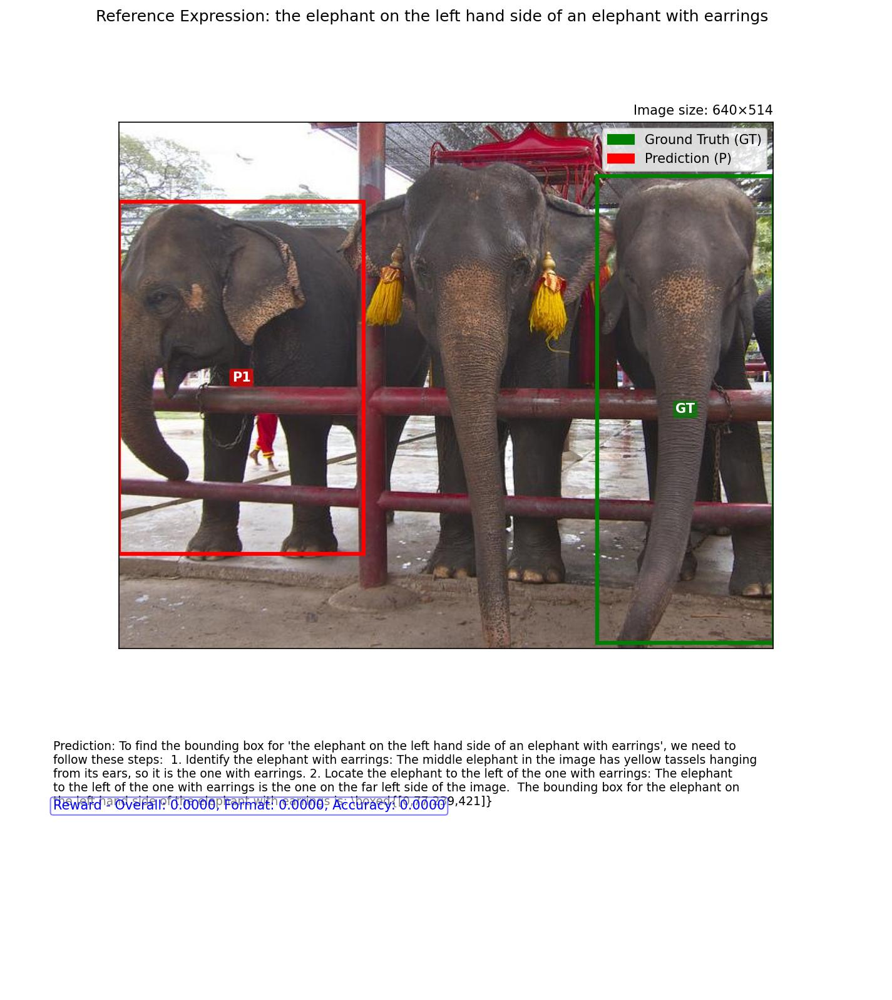

---

### Example 369

**Reference Expression**: the person wearing sandals and shorts holding a frisbee

**Ground Truth**: [[60, 115, 136, 403]]

**Predicted**: [[59, 114, 132, 398]]

**Reward**: {'overall': 1.0, 'format': 0.0, 'accuracy': 1.0}

**Prediction**:
```
To find the bounding box for 'the person wearing sandals and shorts holding a frisbee', let's follow these steps:

1. Identify the person who is wearing sandals and shorts.
2. Confirm that this person is also holding a frisbee.
3. Locate the bounding box that encompasses this person.

- The person wearing sandals and shorts is on the left side of the group.
- This person is holding a blue frisbee.
- The bounding box should capture this person from the waist up, as they are holding an object above the waist.

After analyzing the image, the bounding box for 'the person wearing sandals and shorts holding a frisbee' is:

\boxed{[59,114,132,398]}
```

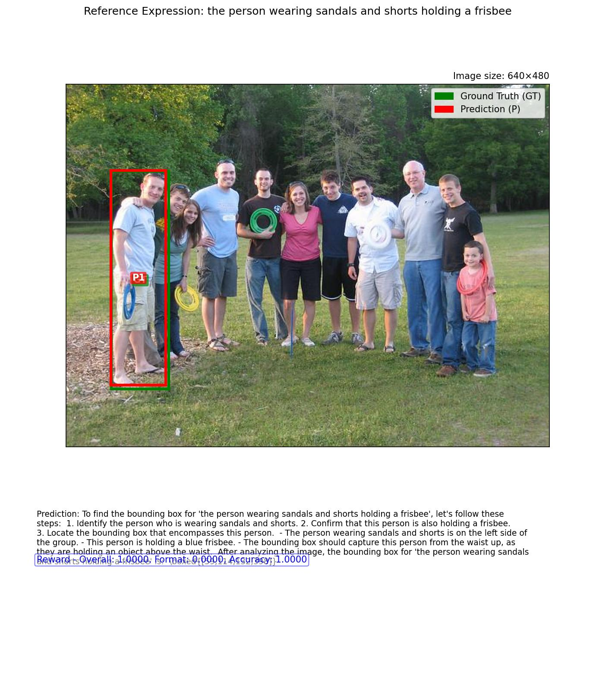

---

### Example 370

**Reference Expression**: the second red suitcase placed horizontally counting from top

**Ground Truth**: [[116, 276, 276, 335]]

**Predicted**: [[142, 100, 266, 140]]

**Reward**: {'overall': 0.0, 'format': 0.0, 'accuracy': 0.0}

**Prediction**:
```
To find the bounding box for 'the second red suitcase placed horizontally counting from top', we need to follow these steps:

1. Identify the red suitcases in the image.
2. Count the red suitcases from top to bottom.
3. Determine the second red suitcase from the top.
4. Provide the bounding box for that suitcase.

Step 1: Identifying the red suitcases.
- There are two red suitcases in the image. The first is at the top, and the second is the one immediately below it.

Step 2: Counting the red suitcases.
- The first red suitcase is at the top.
- The second red suitcase is the one immediately below the first one.

Step 3: Determining the second red suitcase.
- The second red suitcase is the one immediately below the first red suitcase.

Step 4: Providing the bounding box for the second red suitcase.
- The bounding box for the second red suitcase is [142, 100, 266, 140].

Thus, the bounding box for 'the second red suitcase placed horizontally counting from top' is:
\boxed{[142, 100, 266, 140]}
```

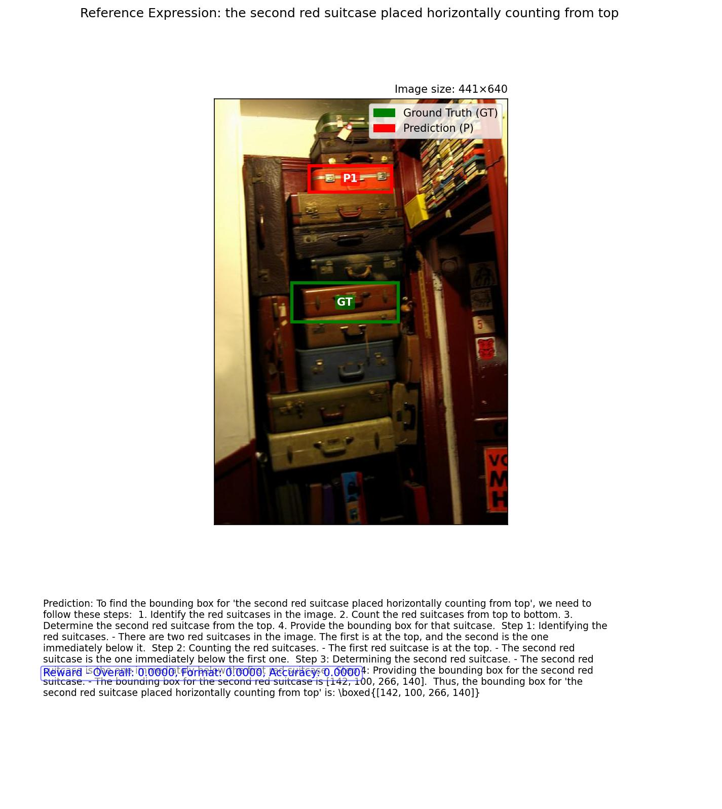

---

### Example 371

**Reference Expression**: the teddy bear with a bow tie but no clothes

**Ground Truth**: [[248, 97, 454, 333]]

**Predicted**: [[244, 98, 463, 327]]

**Reward**: {'overall': 1.0, 'format': 0.0, 'accuracy': 1.0}

**Prediction**:
```
To find the bounding box for 'the teddy bear with a bow tie but no clothes', let's follow these steps:

1. Identify the teddy bears in the image. There are three teddy bears in total.
2. Determine which teddy bear has a bow tie. The teddy bear in the middle has a bow tie.
3. Identify which teddy bear has a bow tie but no clothes. The teddy bear in the middle has a bow tie but is not wearing any clothes.
4. Locate the bounding box for this teddy bear. The teddy bear with the bow tie and no clothes is the one in the middle.

The bounding box for the teddy bear with a bow tie but no clothes is:
\boxed{[244,98,463,327]}
```

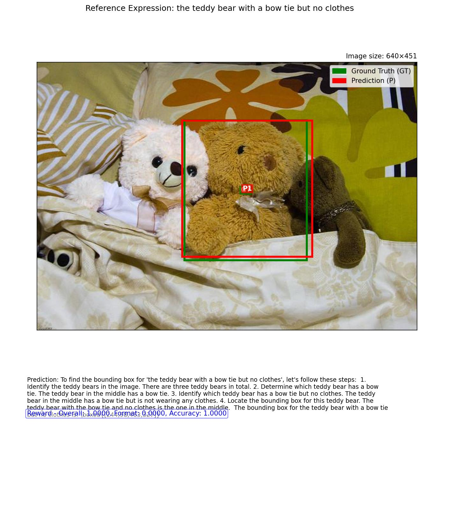

---

### Example 372

**Reference Expression**: the black suitcase carried by a person not in a white top

**Ground Truth**: [[427, 332, 469, 356]]

**Predicted**: [[428, 325, 472, 388]]

**Reward**: {'overall': 0.351931330472103, 'format': 0.0, 'accuracy': 0.351931330472103}

**Prediction**:
```
To find the bounding box for 'the black suitcase carried by a person not in a white top', we need to follow these steps:

1. Identify the person carrying a suitcase. The person in the image who is carrying a black suitcase is not wearing a white top. This person is located towards the right side of the image, near the center.
2. Locate the suitcase. The black suitcase is being carried by this person and is positioned close to the ground.
3. Define the bounding box for the suitcase. The bounding box should encapsulate the entire suitcase and the person carrying it.

After analyzing the image, the bounding box for the black suitcase carried by a person not in a white top is approximately:
\boxed{[428,325,472,388]}

This bounding box captures the black suitcase and the person carrying it.
```

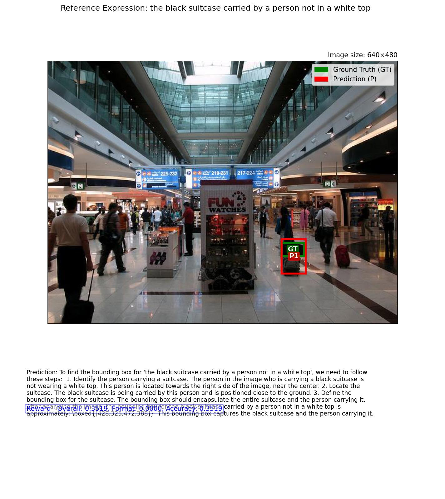

---

### Example 373

**Reference Expression**: the person wearing a red top carrying a handbag

**Ground Truth**: [[99, 180, 202, 414]]

**Predicted**: [[97, 181, 205, 406]]

**Reward**: {'overall': 1.0, 'format': 0.0, 'accuracy': 1.0}

**Prediction**:
```
To find the bounding box for 'the person wearing a red top carrying a handbag', follow these steps:

1. Identify the person wearing a red top in the image.
2. Check if this person is carrying a handbag.
3. Determine the bounding box that encloses this person and the handbag.

- The person wearing a red top is located towards the left side of the image.
- This person is indeed carrying a handbag.
- The bounding box should encompass the person and the handbag.

The bounding box for 'the person wearing a red top carrying a handbag' is:
\boxed{[97,181,205,406]}
```

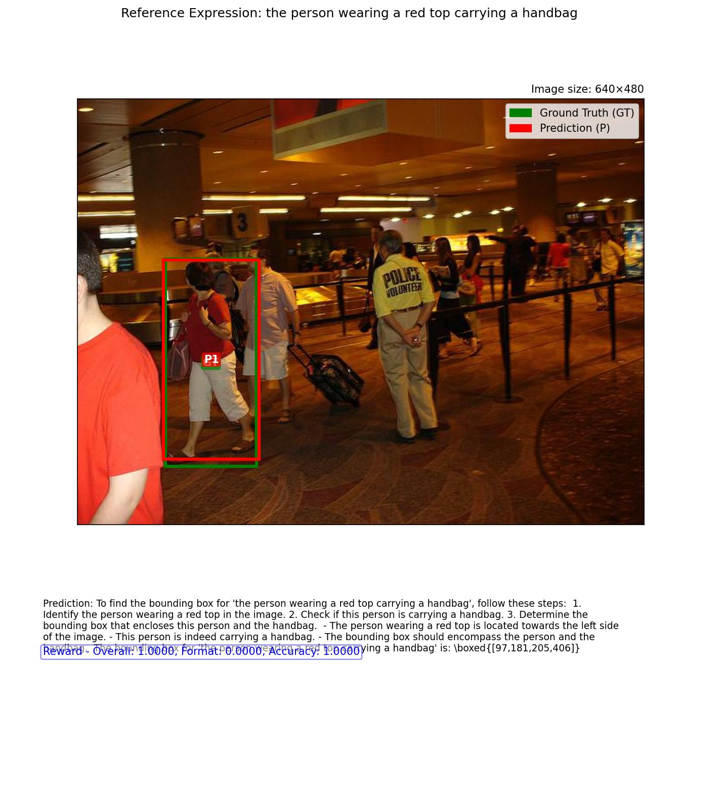

---

### Example 374

**Reference Expression**: the grey suitcase behind a blue suitcase

**Ground Truth**: [[64, 53, 131, 98]]

**Predicted**: [[431, 104, 623, 456]]

**Reward**: {'overall': 0.0, 'format': 0.0, 'accuracy': 0.0}

**Prediction**:
```
To find the bounding box for 'the grey suitcase behind a blue suitcase', let's follow these steps:

1. Identify the blue suitcase in the foreground on the right side of the image.
2. Locate the grey suitcase behind the blue suitcase. It is the second suitcase from the right in the second row.

The bounding box for 'the grey suitcase behind a blue suitcase' is:
\boxed{[431, 104, 623, 456]}
```

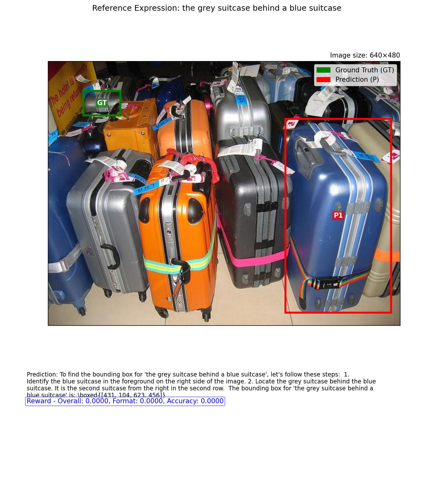

---

### Example 375

**Reference Expression**: the suitcase not on the trolley with handle placed vertically to the ground

**Ground Truth**: [[103, 166, 171, 336]]

**Predicted**: [[98, 161, 165, 333]]

**Reward**: {'overall': 0.8133542812254517, 'format': 0.0, 'accuracy': 0.8133542812254517}

**Prediction**:
```
To find the bounding box for the suitcase not on the trolley with the handle placed vertically to the ground, we need to follow these steps:

1. Identify the trolley with the suitcases on it. The trolley is the green cart with wheels, holding several suitcases.
2. Look for a suitcase that is not on the trolley and has its handle placed vertically to the ground.
3. Locate the suitcase in the image that fits this description. It appears to be the brown suitcase on the far left, lying on the ground with its handle facing upwards.

The bounding box for this suitcase is:
\boxed{[98,161,165,333]}
```

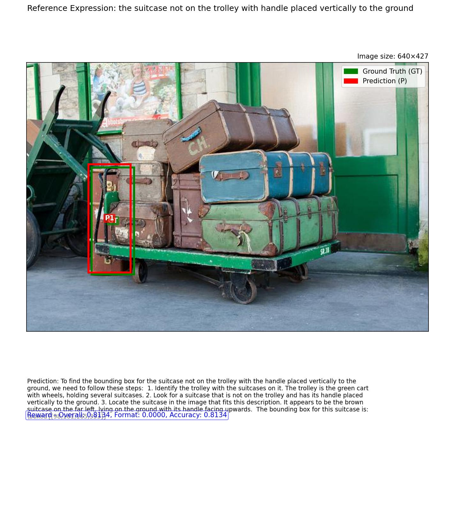

---

### Example 376

**Reference Expression**: the mug in front of a screen with white color inside

**Ground Truth**: [[111, 236, 162, 287]]

**Predicted**: [[112, 233, 163, 282]]

**Reward**: {'overall': 0.8214285714285714, 'format': 0.0, 'accuracy': 0.8214285714285714}

**Prediction**:
```
To find the corresponding bounding box for 'the mug in front of a screen with white color inside', we need to follow these steps:

1. Identify the screen with a white color inside. This screen is on the left side of the image and appears to be a monitor displaying some text.
2. Locate the mug in front of this screen. The mug is on the table and is positioned to the left of the laptop, closer to the monitor.
3. Determine the bounding box for this mug. The mug is a small, white, ceramic cup with a design on it.

Given these observations, the bounding box for 'the mug in front of a screen with white color inside' would be:

\boxed{[112,233,163,282]}
```

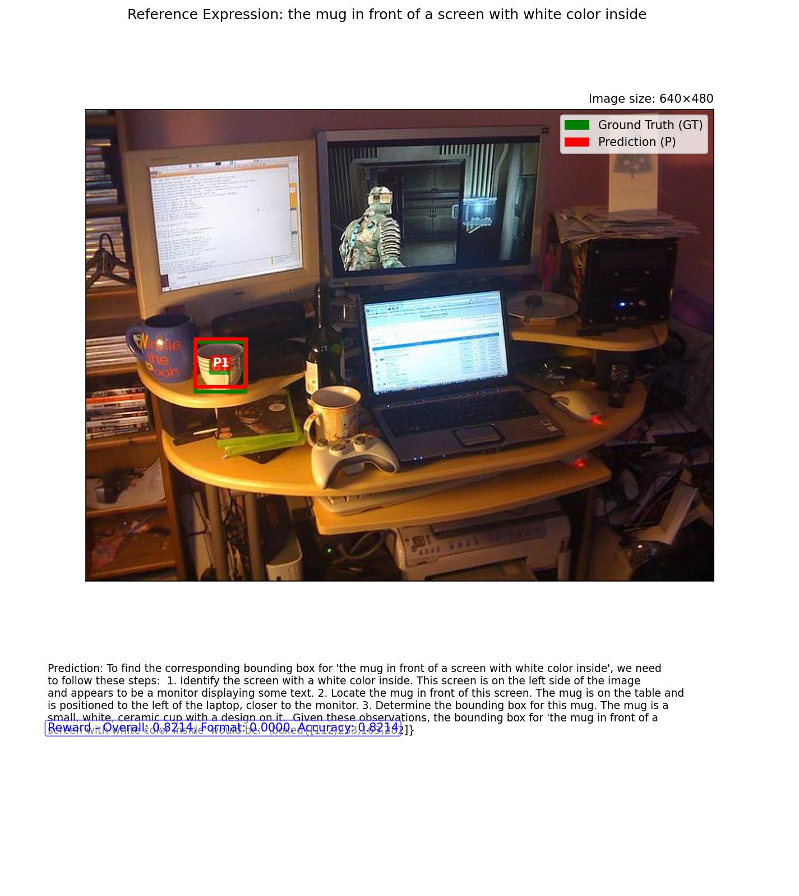

---

### Example 377

**Reference Expression**: the person standing and wearing jeans

**Ground Truth**: [[313, 268, 342, 377]]

**Predicted**: [[318, 266, 344, 374]]

**Reward**: {'overall': 0.7427737226277372, 'format': 0.0, 'accuracy': 0.7427737226277372}

**Prediction**:
```
To find the bounding box for 'the person standing and wearing jeans', let's follow these steps:

1. Identify the person standing: Look for a person standing in the image. This person should be distinct from the person sitting on the carriage.
2. Check for jeans: Among the standing individuals, identify the one wearing jeans. Jeans are typically darker and can be more easily distinguished from other clothing.
3. Locate the bounding box: Once the person wearing jeans is identified, draw a bounding box around them.

After analyzing the image:
- There is a person standing to the right of the horse, wearing jeans and light-colored pants.
- This person is near the curb and appears to be interacting with the horse or the carriage.

The bounding box for 'the person standing and wearing jeans' is:
\boxed{[318,266,344,374]}
```

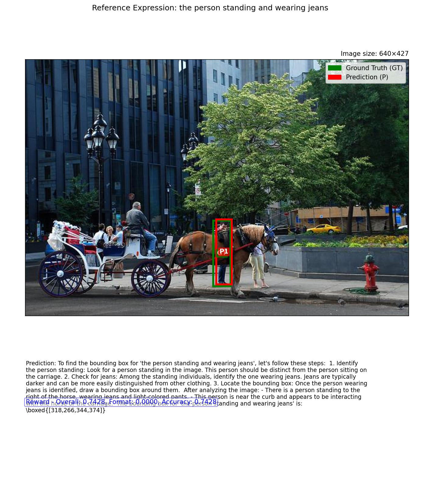

---

### Example 378

**Reference Expression**: the person sitting, not riding a horse

**Ground Truth**: [[0, 109, 71, 405]]

**Predicted**: [[0, 108, 68, 420]]

**Reward**: {'overall': 1.0, 'format': 0.0, 'accuracy': 1.0}

**Prediction**:
```
To find the bounding box for 'the person sitting, not riding a horse', let's follow these steps:

1. Identify the person riding the horse: The person is wearing a light blue shirt and is sitting on a small horse.
2. Identify the person sitting but not riding a horse: Look for another person who is sitting and not interacting with the horse.
3. Locate the person sitting: There is a person in the background, partially visible, sitting in a chair. This person is not interacting with the horse and is sitting.

After analyzing the image, the bounding box for 'the person sitting, not riding a horse' is:

\boxed{[0,108,68,420]}
```

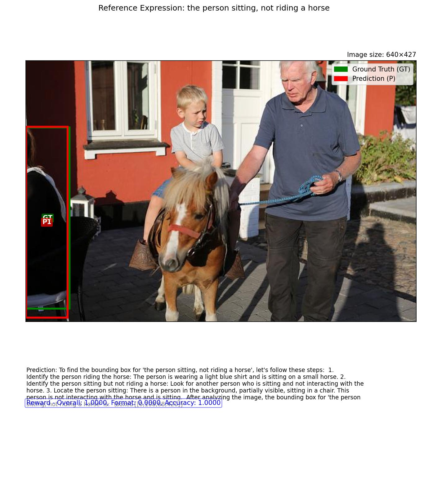

---

### Example 379

**Reference Expression**: the person in a red top next to the bar

**Ground Truth**: [[158, 87, 189, 167]]

**Predicted**: [[195, 105, 223, 197]]

**Reward**: {'overall': 0.0, 'format': 0.0, 'accuracy': 0.0}

**Prediction**:
```
To find the bounding box for 'the person in a red top next to the bar', we need to follow these steps:

1. Identify the bar in the image. The bar is the yellow railing on the side of the horse-drawn tram.
2. Locate the person in a red top near this bar. This person is standing on the tram, next to the yellow railing.
3. Determine the bounding box for this person. The bounding box should capture the person from the waist up, as they are standing and not significantly larger than the bar.

Following these steps, the bounding box for 'the person in a red top next to the bar' is:

\boxed{[195,105,223,197]}
```

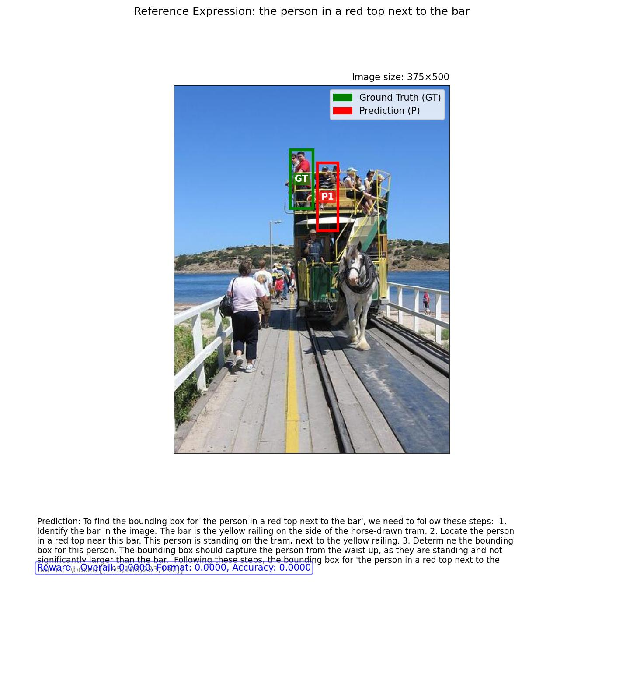

---

### Example 380

**Reference Expression**: the brown horse ridden by a person wearing an indigo jacket

**Ground Truth**: [[13, 173, 136, 270]]

**Predicted**: [[16, 165, 138, 265]]

**Reward**: {'overall': 0.8433274768925216, 'format': 0.0, 'accuracy': 0.8433274768925216}

**Prediction**:
```
To find the bounding box for 'the brown horse ridden by a person wearing an indigo jacket', we need to follow these steps:

1. Identify the person wearing an indigo jacket: The person on the far left is wearing a dark jacket, which could be indigo.
2. Identify the horse ridden by the person in the indigo jacket: The horse is the one on the far left, as it is closest to the person wearing the indigo jacket.
3. Determine the bounding box for the horse: The bounding box should encompass the entire horse, including its head, body, and legs.

Following these steps, the bounding box for the brown horse ridden by the person wearing an indigo jacket is:

\boxed{[16,165,138,265]}
```

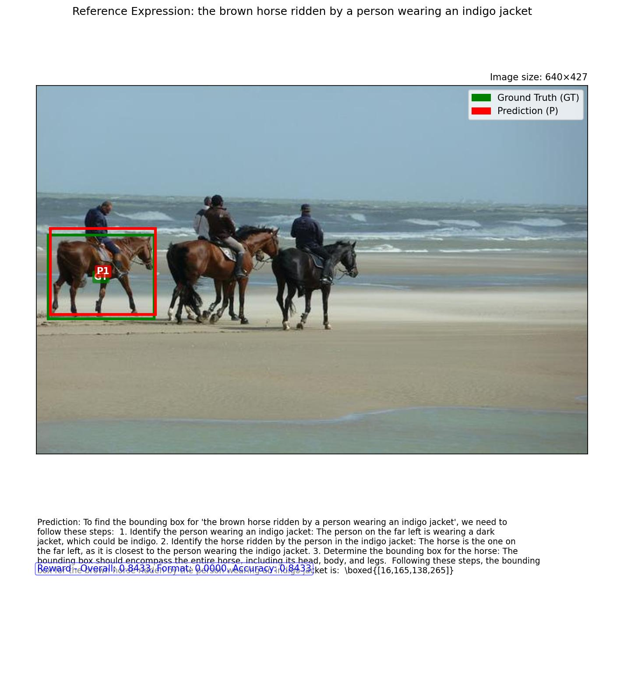

---

### Example 381

**Reference Expression**: the person wearing sunglasses and not a red top

**Ground Truth**: [[35, 180, 52, 214]]

**Predicted**: [[27, 179, 52, 274]]

**Reward**: {'overall': 0.24336842105263157, 'format': 0.0, 'accuracy': 0.24336842105263157}

**Prediction**:
```
To find the bounding box for 'the person wearing sunglasses and not a red top', let's follow these steps:

1. Identify the person wearing sunglasses: Look for a person in the audience who appears to be wearing sunglasses.
2. Check the color of their top: Ensure the person with sunglasses is not wearing a red top.
3. Locate the bounding box: Once you find the person, outline the bounding box around them.

After carefully examining the image:

- There is a person wearing sunglasses in the audience.
- This person is not wearing a red top.
- The bounding box for this person would be around the individual in the sunglasses.

The bounding box for the person wearing sunglasses and not a red top is:
\boxed{[27,179,52,274]}
```

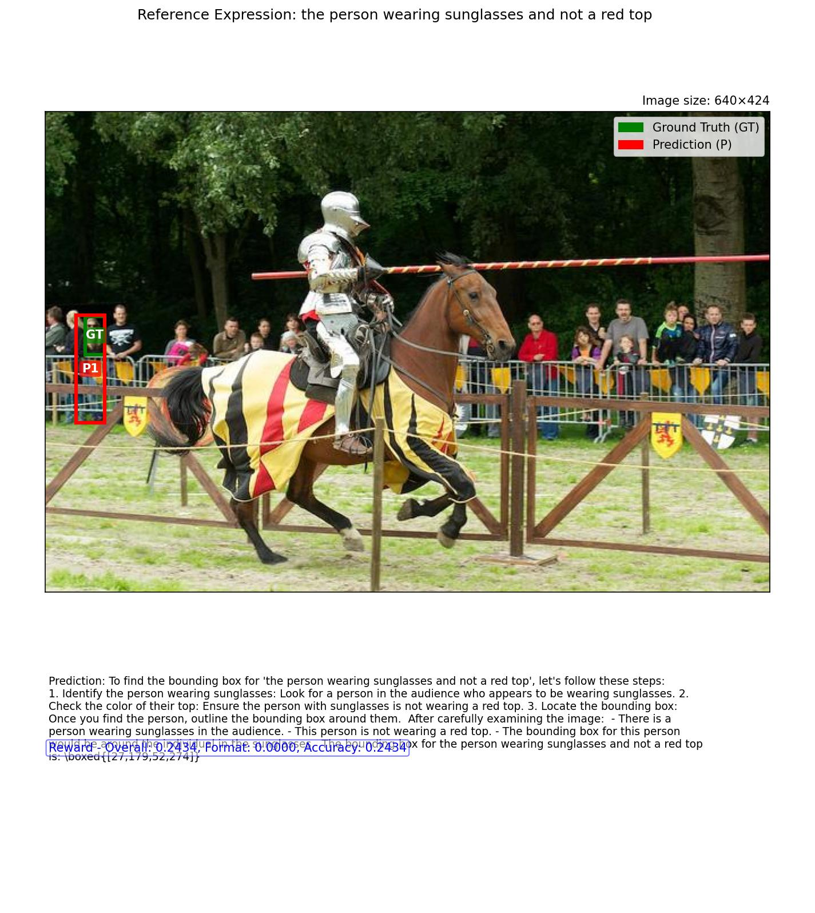

---

### Example 382

**Reference Expression**: the bench not under a banner or in front of people

**Ground Truth**: [[313, 197, 354, 214]]

**Predicted**: [[149, 216, 172, 229]]

**Reward**: {'overall': 0.0, 'format': 0.0, 'accuracy': 0.0}

**Prediction**:
```
To find the bounding box for 'the bench not under a banner or in front of people', let's follow these steps:

1. Identify the location of the 'Sunday Telegraph' banner in the image. The banner is located at the right side of the image, spanning across the width.
2. Look for a bench that is not under the banner and not in front of people. A bench is typically a horizontal structure placed on the ground, and it should not be directly in front of people or under the banner.
3. Scan the image for a bench that meets these criteria. In this image, there is a bench visible in the middle left side of the image, not under the banner and not in front of people.

Given these observations, the bounding box for 'the bench not under a banner or in front of people' is:

\boxed{[149,216,172,229]}
```

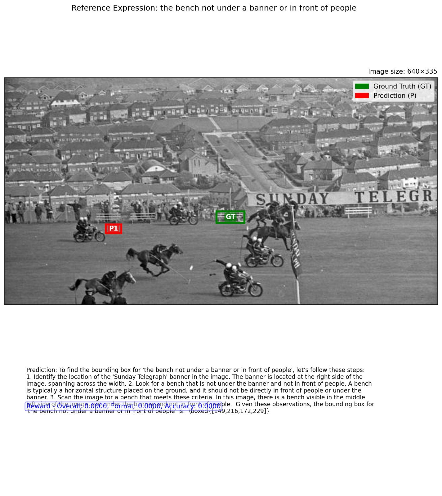

---

### Example 383

**Reference Expression**: the red flag on the yellow fence

**Ground Truth**: [[215, 94, 242, 150]]

**Predicted**: [[53, 141, 74, 162]]

**Reward**: {'overall': 0.0, 'format': 0.0, 'accuracy': 0.0}

**Prediction**:
```
To find the corresponding bounding box for 'the red flag on the yellow fence', let's follow these steps:

1. Identify the yellow fence: The yellow fence is a part of the obstacle the horse is jumping over. It is located in the middle of the image.
2. Locate the red flag: The red flag is attached to the yellow fence, and it is positioned at the top left of the yellow fence.
3. Determine the bounding box: The red flag is small and rectangular, so we need to define a bounding box that encapsulates it. Given its position, the bounding box should be small and close to the top left corner of the yellow fence.

After analyzing the image, the bounding box for the red flag on the yellow fence is:

\boxed{[53,141,74,162]}
```

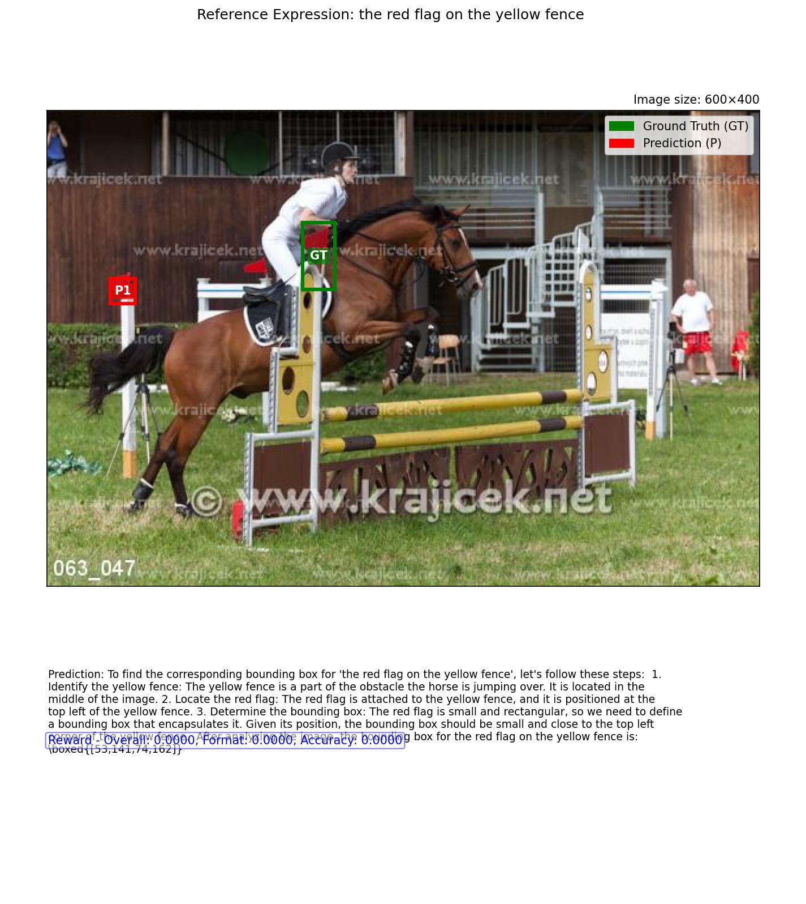

---

### Example 384

**Reference Expression**: the horse facing a different direction than the other horses

**Ground Truth**: [[475, 189, 534, 350]]

**Predicted**: [[473, 186, 536, 348]]

**Reward**: {'overall': 1.0, 'format': 0.0, 'accuracy': 1.0}

**Prediction**:
```
To find the horse facing a different direction than the other horses, we need to analyze the orientation of the horses relative to the camera. Here's the step-by-step reasoning:

1. Identify the horses: There are three horses in the image.
2. Observe their orientation: The first and second horses are facing the camera, while the third horse is facing away from the camera.
3. Determine the bounding box: The third horse is the one that is facing away from the camera.

The bounding box for the horse facing away from the camera is:
\boxed{[473,186,536,348]}
```

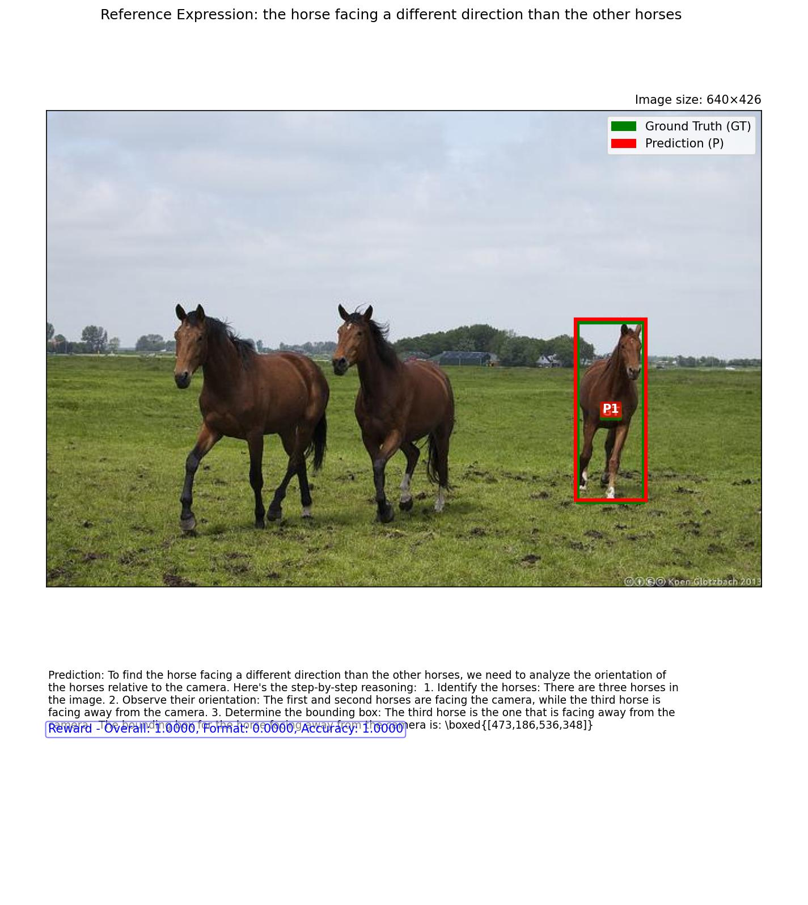

---

### Example 385

**Reference Expression**: the person wearing a hat not riding a black horse

**Ground Truth**: [[406, 56, 463, 174]]

**Predicted**: [[391, 52, 463, 173]]

**Reward**: {'overall': 0.7605200136845707, 'format': 0.0, 'accuracy': 0.7605200136845707}

**Prediction**:
```
To find the bounding box for 'the person wearing a hat not riding a black horse', we need to follow these steps:

1. Identify the black horse in the image. The black horse is the one on the far right.
2. Identify the person riding the black horse. The person on the black horse is wearing a hat.
3. Identify the person not riding the black horse. This person is the one on the second horse from the right.
4. Identify the hat worn by the person on the second horse from the right. This person is indeed wearing a hat.

The bounding box for the person wearing a hat not riding a black horse is the one on the second horse from the right.

The bounding box for this person is:
\boxed{[391,52,463,173]}
```

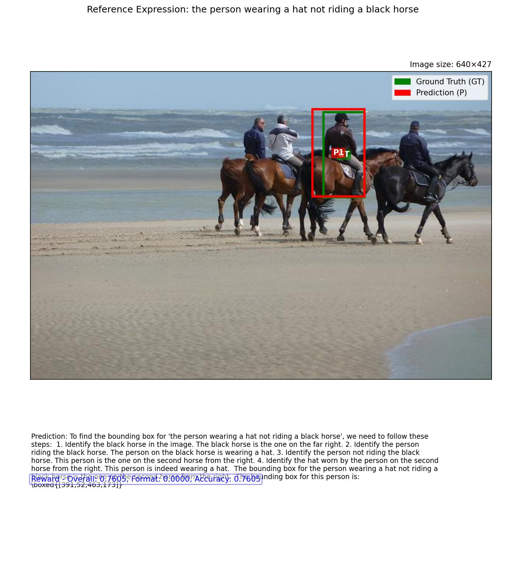

---

### Example 386

**Reference Expression**: the person with white trousers standing near the revolving door

**Ground Truth**: [[518, 125, 539, 226]]

**Predicted**: [[509, 103, 547, 231]]

**Reward**: {'overall': 0.4360608552631579, 'format': 0.0, 'accuracy': 0.4360608552631579}

**Prediction**:
```
To find the bounding box for 'the person with white trousers standing near the revolving door', we need to follow these steps:

1. Identify the location of the revolving door in the image. Revolving doors are typically circular and often located near the entrance of buildings.
2. Look for a person near this location. In this image, the revolving door is on the right side of the image.
3. Identify the person standing near the revolving door. This person is wearing white trousers and is standing on the right side of the image.
4. Define the bounding box for this person.

After analyzing the image, the person with white trousers standing near the revolving door is located in the upper right part of the image.

The bounding box for this person is:
\boxed{[509,103,547,231]}

This bounding box captures the person standing near the revolving door.
```

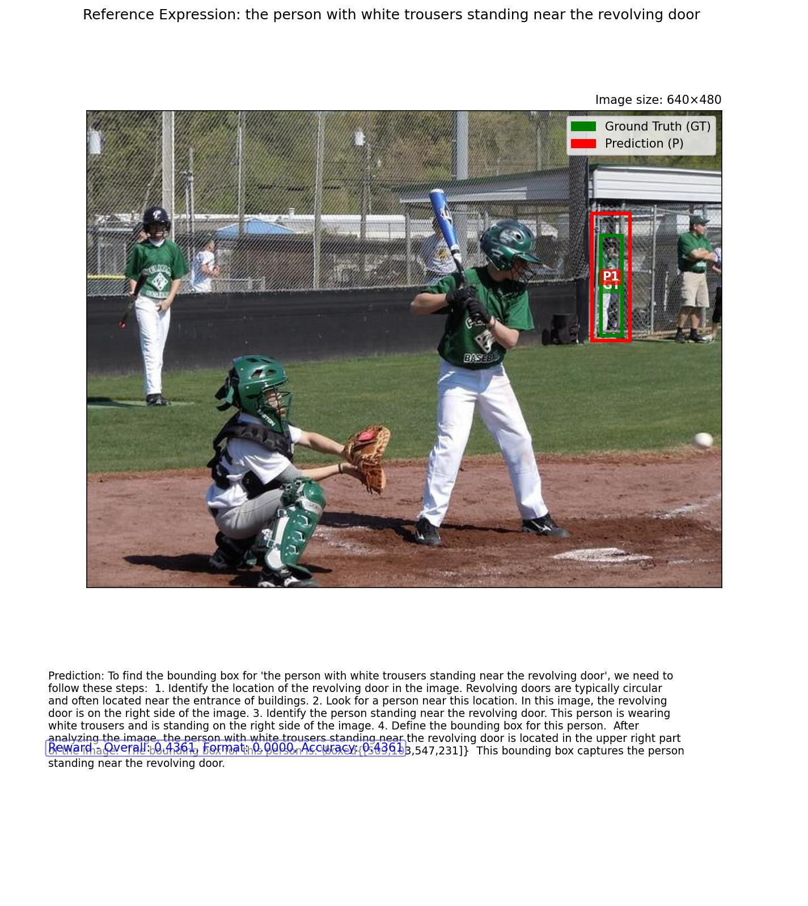

---

### Example 387

**Reference Expression**: the person wearing black pants not kneeling on the ground

**Ground Truth**: [[523, 228, 640, 401]]

**Predicted**: [[539, 226, 644, 395]]

**Reward**: {'overall': 0.7986647095032908, 'format': 0.0, 'accuracy': 0.7986647095032908}

**Prediction**:
```
To find the bounding box for 'the person wearing black pants not kneeling on the ground', we need to follow these steps:

1. Identify the person who is not kneeling and wearing black pants.
2. Locate the person in the image who fits this description.

- The person wearing black pants and not kneeling appears to be the umpire, who is standing behind the catcher.
- The catcher is the person kneeling behind the home plate.
- The umpire is the person standing behind the catcher, wearing a light blue shirt and black pants.

Now, let's locate the bounding box for the umpire:

\boxed{[539,226,644,395]}
```

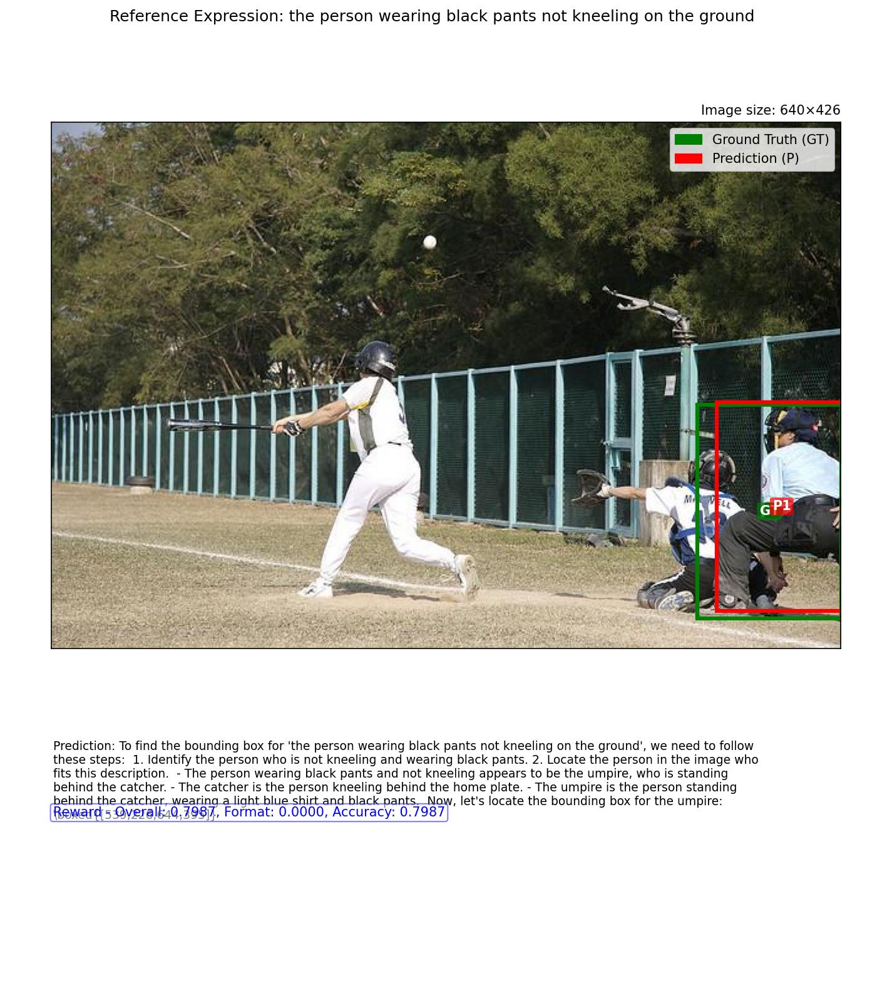

---

### Example 388

**Reference Expression**: the person wearing a blue top and not a black shorts

**Ground Truth**: [[361, 166, 489, 372]]

**Predicted**: [[368, 166, 491, 369]]

**Reward**: {'overall': 1.0, 'format': 0.0, 'accuracy': 1.0}

**Prediction**:
```
To find the bounding box for 'the person wearing a blue top and not a black shorts', let's follow these steps:

1. Identify the person wearing a blue top in the image.
2. Determine if the person is wearing black shorts or not.
3. If the person is not wearing black shorts, identify the bounding box for that person.

- There are two people wearing blue tops. One is on the left side of the image, and the other is in the center-right.
- The person on the left is wearing black shorts, so we need to focus on the person in the center-right.
- The person in the center-right is wearing a blue top and white shorts, not black shorts.

The bounding box for the person wearing a blue top and not black shorts is:
\boxed{[368,166,491,369]}
```


---

### Example 389

**Reference Expression**: the jumping person wearing a black top

**Ground Truth**: [[194, 270, 244, 412]]

**Predicted**: [[335, 310, 368, 418]]

**Reward**: {'overall': 0.0, 'format': 0.0, 'accuracy': 0.0}

**Prediction**:
```
To find the bounding box for 'the jumping person wearing a black top', let's follow these steps:

1. Identify the people in the image who appear to be jumping. These are individuals who are in mid-air or have their arms raised as if they are catching or throwing a frisbee.
2. Among the jumping individuals, look for the one wearing a black top. This person should be distinguishable by their dark clothing.
3. Once identified, determine the bounding box that encapsulates the person from head to toe, ensuring that the person's arms and legs are included.

After analyzing the image, the person jumping and wearing a black top is located in the center of the group. The bounding box for this person would be:

\boxed{[335,310,368,418]}

This bounding box captures the individual who is jumping and wearing a black top.
```

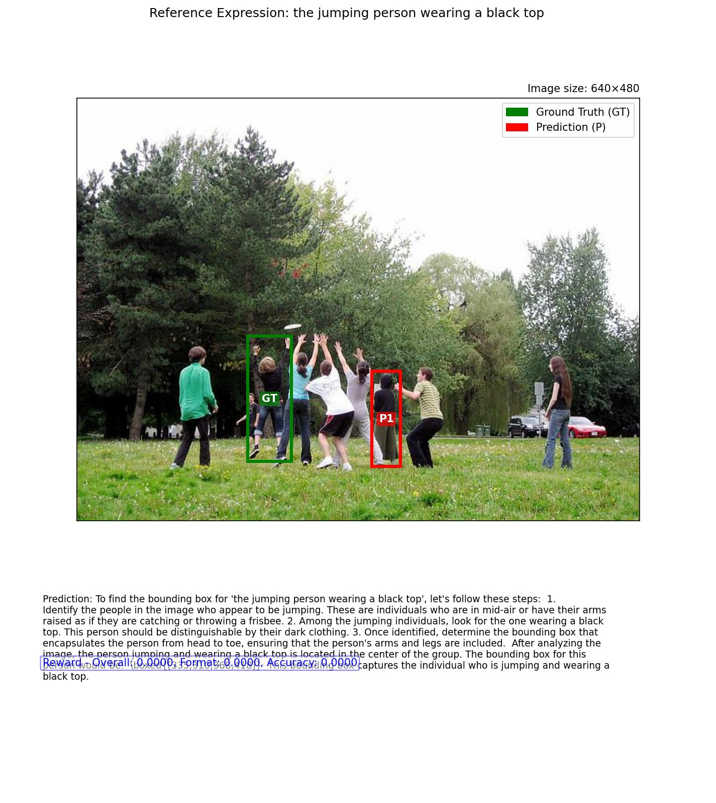

---

### Example 390

**Reference Expression**: the person wearing a t-shirt holding a red frisbee

**Ground Truth**: [[486, 127, 566, 368]]

**Predicted**: [[21, 130, 80, 363]]

**Reward**: {'overall': 0.0, 'format': 0.0, 'accuracy': 0.0}

**Prediction**:
```
To find the bounding box for 'the person wearing a t-shirt holding a red frisbee', let's follow these steps:

1. Identify the person holding the red frisbee:
   - The person on the far left is holding a red frisbee in their right hand.
   - They are also wearing a white t-shirt and a visor.

2. Locate the bounding box:
   - The bounding box should encompass the person from the head to the feet, including the red frisbee.
   - The person is standing on the left side of the image.

3. Define the coordinates:
   - The bounding box should be around the person, starting from the left edge of the image and extending to the right where the person is standing.
   - The top of the bounding box should be around the head, and the bottom should be around the feet.

After analyzing the image, the bounding box for 'the person wearing a t-shirt holding a red frisbee' is:
\boxed{[21,130,80,363]}
```

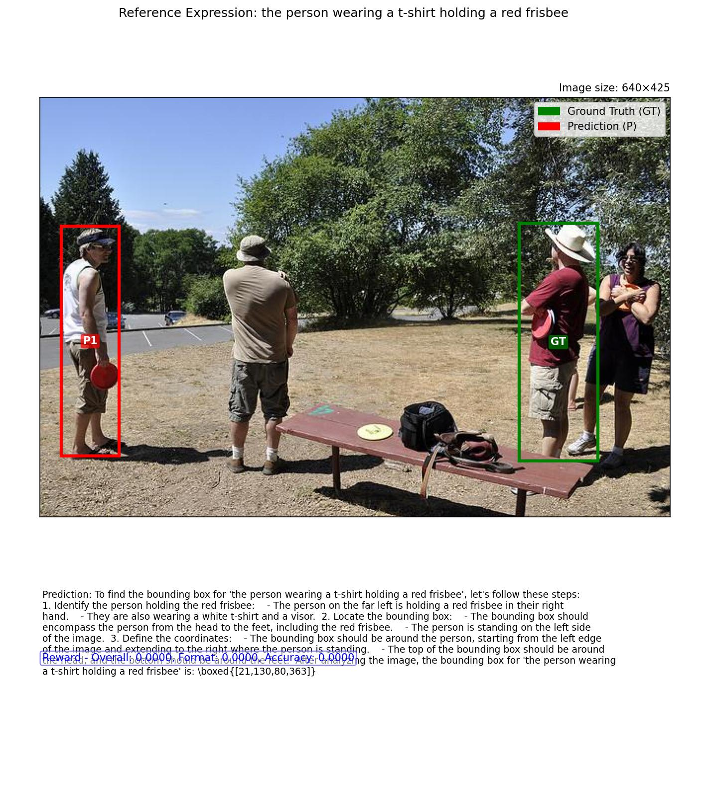

---

### Example 391

**Reference Expression**: the person wearing a white top and a hat

**Ground Truth**: [[231, 187, 256, 228]]

**Predicted**: [[291, 267, 329, 341]]

**Reward**: {'overall': 0.0, 'format': 0.0, 'accuracy': 0.0}

**Prediction**:
```
To find the bounding box for 'the person wearing a white top and a hat', let's follow these steps:

1. Identify the person in the image wearing a white top and a hat.
2. Observe the person's position in the image, specifically their upper body and head.
3. Determine the exact coordinates that encompass the person's upper body and head.

After analyzing the image:
- The person wearing a white top and a hat is located in the background, near the center of the image, slightly to the right.
- The bounding box should capture the upper body and head of this person.

The bounding box for 'the person wearing a white top and a hat' is:
\boxed{[291,267,329,341]}

This bounding box captures the upper body and head of the person in question.
```

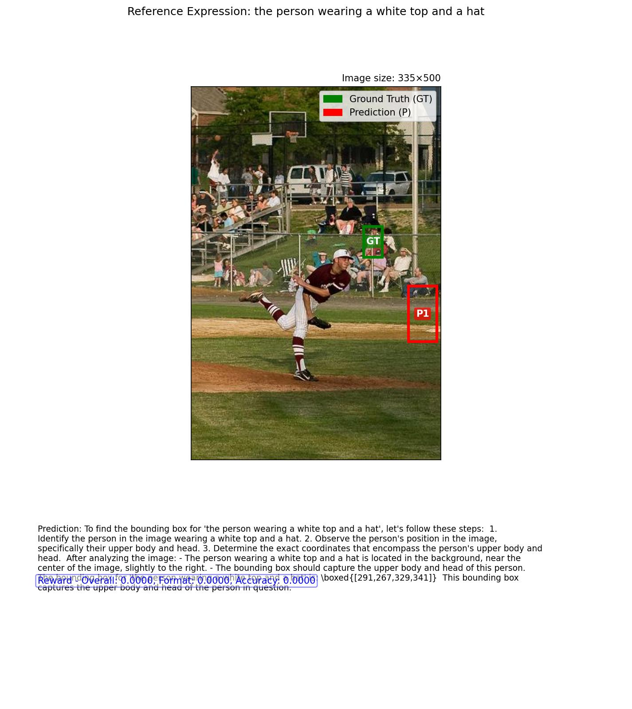

---

### Example 392

**Reference Expression**: the first person from the right among those wearing blue tops

**Ground Truth**: [[496, 227, 519, 273]]

**Predicted**: [[364, 231, 415, 324]]

**Reward**: {'overall': 0.0, 'format': 0.0, 'accuracy': 0.0}

**Prediction**:
```
To find the bounding box for 'the first person from the right among those wearing blue tops', let's follow these steps:

1. Identify the group of people wearing blue tops. There are two people in blue tops in the image.
2. Determine which one is on the right. The person on the far right is wearing a blue top.
3. Identify the bounding box for this person. The person is wearing a blue top and black shorts, and is positioned on the right side of the image.

The bounding box for 'the first person from the right among those wearing blue tops' is:
\boxed{[364,231,415,324]}
```

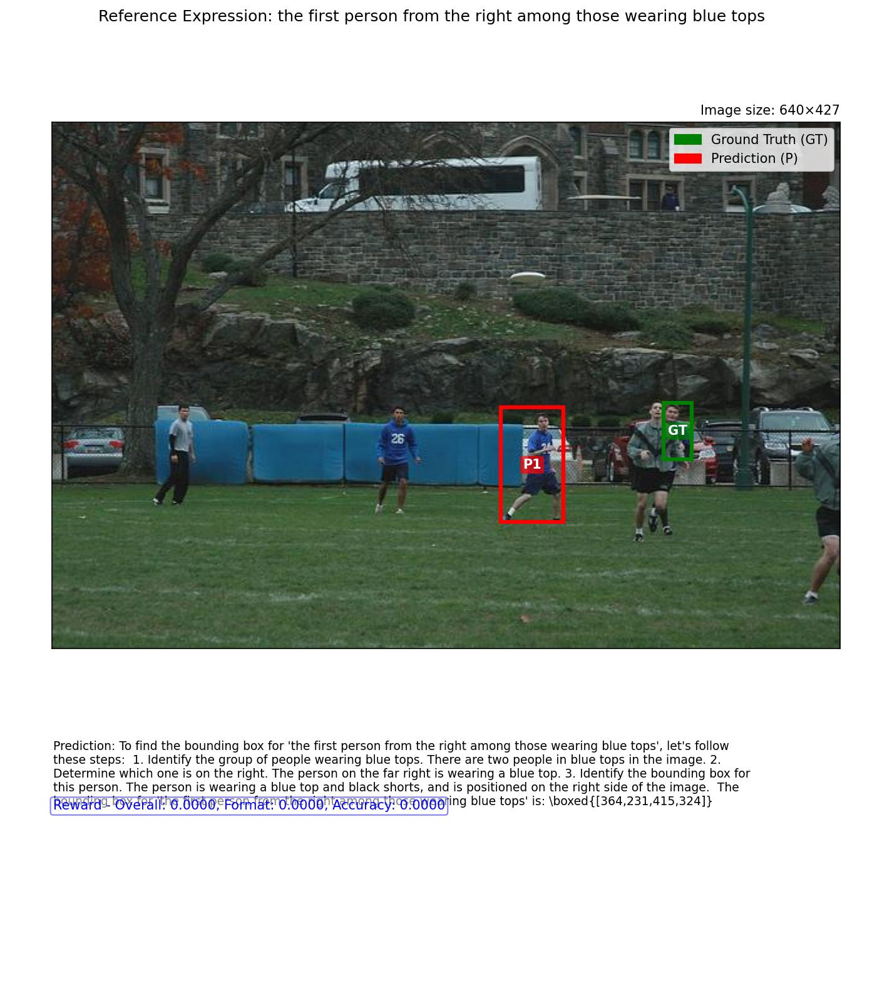

---

### Example 393

**Reference Expression**: the person wearing a blue hat and sitting

**Ground Truth**: [[33, 181, 92, 242]]

**Predicted**: [[34, 202, 104, 273]]

**Reward**: {'overall': 0.3712594015042407, 'format': 0.0, 'accuracy': 0.3712594015042407}

**Prediction**:
```
To find the bounding box for 'the person wearing a blue hat and sitting', let's follow these steps:

1. Identify the person wearing a blue hat in the image.
2. Check the seating area in the background to find the person wearing a blue hat.
3. The person wearing a blue hat appears to be sitting in the background, near the left side of the image.

The bounding box for the person wearing a blue hat and sitting is:
\boxed{[34, 202, 104, 273]}
```

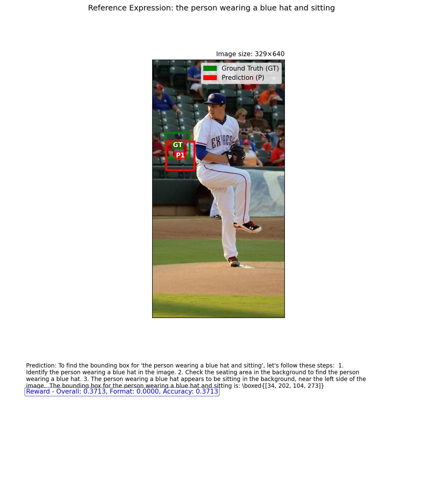

---

### Example 394

**Reference Expression**: the third book counting from the apple

**Ground Truth**: [[320, 228, 336, 299]]

**Predicted**: [[322, 225, 358, 291]]

**Reward**: {'overall': 0.33536121673003805, 'format': 0.0, 'accuracy': 0.33536121673003805}

**Prediction**:
```
To find 'the third book counting from the apple', we need to follow these steps:

1. Identify the apple: The apple is located on the right side of the desk, near the bell.
2. Identify the books: There are four books stacked on the desk, to the left of the apple.
3. Count the books from the apple: The apple is the fourth book from the left. Therefore, the third book from the left (and thus the third book counting from the apple) is the second book from the left.

Now, let's locate the bounding box for the second book from the left:
- The books are aligned in a row on the desk.
- The second book from the left is the book right next to the first book.
- The second book from the left is the book that is not the apple or the bell.

The bounding box for 'the third book counting from the apple' is:
\boxed{[322,225,358,291]}
```

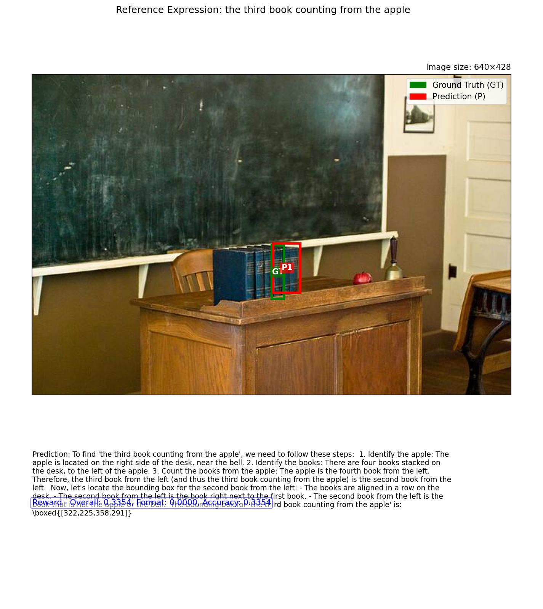

---

### Example 395

**Reference Expression**: the person wearing a white top not behind a cake

**Ground Truth**: [[0, 7, 49, 169]]

**Predicted**: [[0, 23, 56, 205]]

**Reward**: {'overall': 0.6517857142857143, 'format': 0.0, 'accuracy': 0.6517857142857143}

**Prediction**:
```
To find the bounding box for 'the person wearing a white top not behind a cake', we need to follow these steps:

1. Identify the person wearing a white top in the image.
2. Determine if this person is behind a cake. If they are, we need to find another person wearing a white top who is not behind a cake.
3. Once identified, provide the bounding box for that person.

Step 1: The person wearing a white top is located on the left side of the image, partially out of frame. This person is not behind a cake.

Step 2: Since the person in the white top is not behind a cake, we do not need to find another person.

Step 3: The bounding box for the person wearing a white top not behind a cake is the one we identified in step 1.

The bounding box for 'the person wearing a white top not behind a cake' is \boxed{[0,23,56,205]}.
```

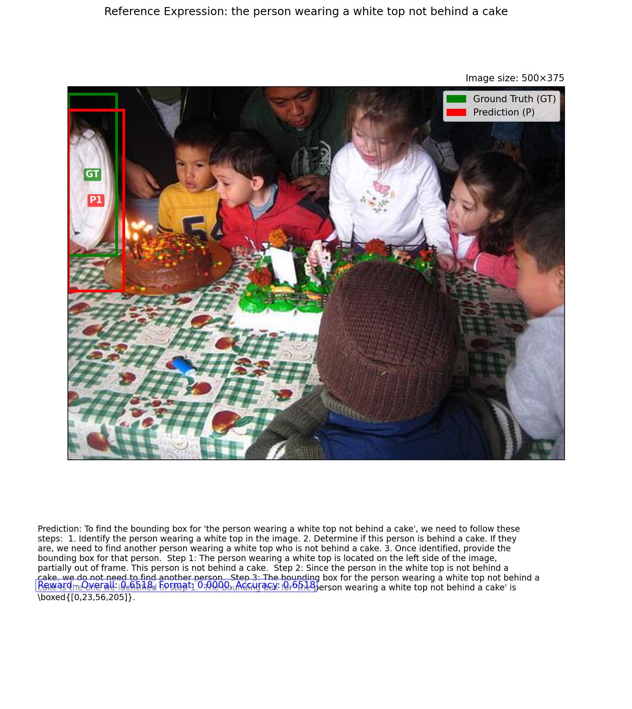

---

### Example 396

**Reference Expression**: the person wearing a hat not carrying a frisbee

**Ground Truth**: [[304, 88, 395, 332]]

**Predicted**: [[306, 85, 392, 325]]

**Reward**: {'overall': 1.0, 'format': 0.0, 'accuracy': 1.0}

**Prediction**:
```
To find the bounding box for 'the person wearing a hat not carrying a frisbee', let's follow these steps:

1. Identify the person wearing a hat: There are two individuals wearing hats in the image.
2. Determine which of these individuals is not carrying a frisbee: The person on the left is not carrying a frisbee, and the person on the right is holding a frisbee.
3. Focus on the person on the left who is wearing a hat but not holding a frisbee.

The bounding box for the person wearing a hat and not carrying a frisbee is:
\boxed{[306,85,392,325]}
```

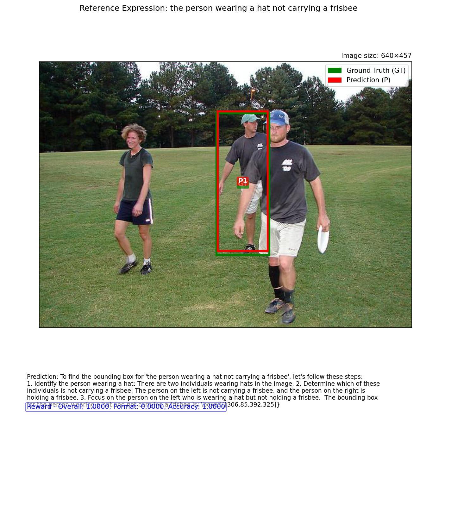

---

### Example 397

**Reference Expression**: the person not wearing sunglasses with no tattoos

**Ground Truth**: [[320, 80, 453, 277]]

**Predicted**: [[429, 111, 608, 388]]

**Reward**: {'overall': 0.0, 'format': 0.0, 'accuracy': 0.0}

**Prediction**:
```
To find the bounding box for 'the person not wearing sunglasses with no tattoos', let's follow these steps:

1. Identify the person wearing sunglasses: The person in the middle is wearing sunglasses.
2. Identify the person with tattoos: The person on the left has visible tattoos on their arm.
3. Identify the person without tattoos: The person on the right does not have visible tattoos.
4. Determine the bounding box: The person without tattoos and not wearing sunglasses is the one on the right.

The bounding box for the person on the right is:
\boxed{[429,111,608,388]}
```

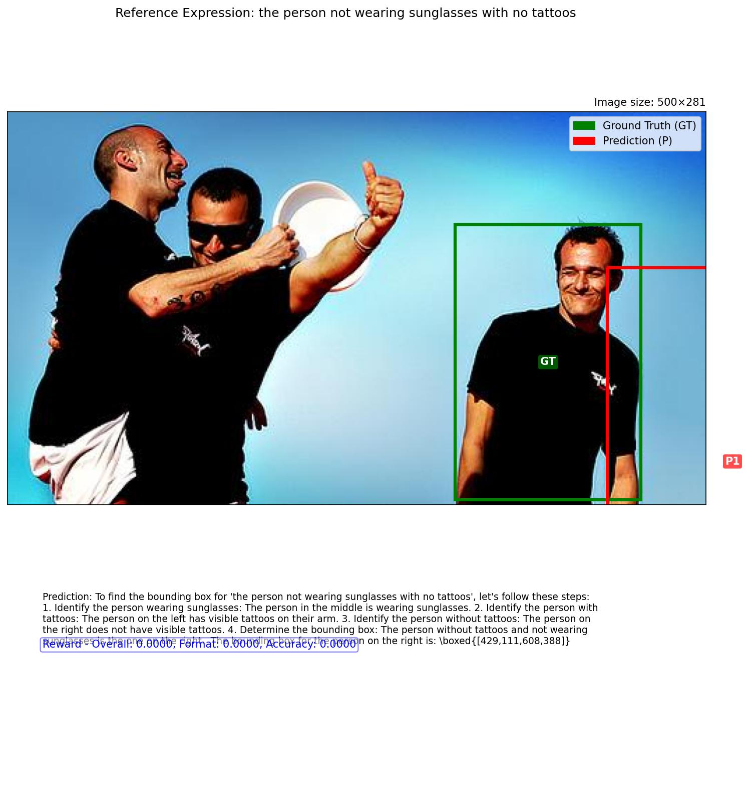

---

### Example 398

**Reference Expression**: the person in a white top next to a white box

**Ground Truth**: [[244, 181, 369, 412]]

**Predicted**: [[243, 174, 354, 393]]

**Reward**: {'overall': 0.7808732922582373, 'format': 0.0, 'accuracy': 0.7808732922582373}

**Prediction**:
```
To find the bounding box for 'the person in a white top next to a white box', let's follow these steps:

1. Identify the white box: Look for a white box in the image. It's located on the right side of the image, slightly below the center.
2. Identify the person in a white top: Look for a person wearing a white top near the white box. This person is on the right side of the image, next to the white box.
3. Define the bounding box: The person in a white top is seated and appears to be interacting with the box. The bounding box should enclose this person.

Following these steps, the bounding box for 'the person in a white top next to a white box' is:

\boxed{[243,174,354,393]}
```

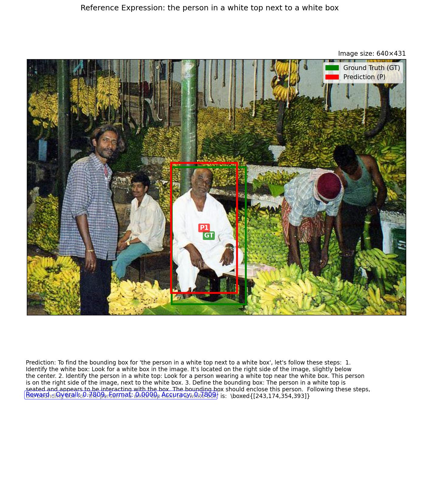

---

### Example 399

**Reference Expression**: the person with a white hat not wearing a baseball glove

**Ground Truth**: [[270, 167, 352, 298]]

**Predicted**: [[276, 161, 351, 295]]

**Reward**: {'overall': 0.8577555396711937, 'format': 0.0, 'accuracy': 0.8577555396711937}

**Prediction**:
```
To find the bounding box for 'the person with a white hat not wearing a baseball glove', let's follow these steps:

1. Identify the person with a white hat: In the image, there are several people wearing white hats. We need to determine which one does not have a baseball glove.
2. Check the gloves: Look at the hands of each person wearing a white hat to see if they are holding a glove.
3. Locate the person without a glove: Among the people with white hats, identify the one who is not holding a glove.

After analyzing the image:
- The person in the center of the image, wearing a white hat and standing on a base, is not holding a glove.

Thus, the bounding box for 'the person with a white hat not wearing a baseball glove' is:
\boxed{[276,161,351,295]}
```

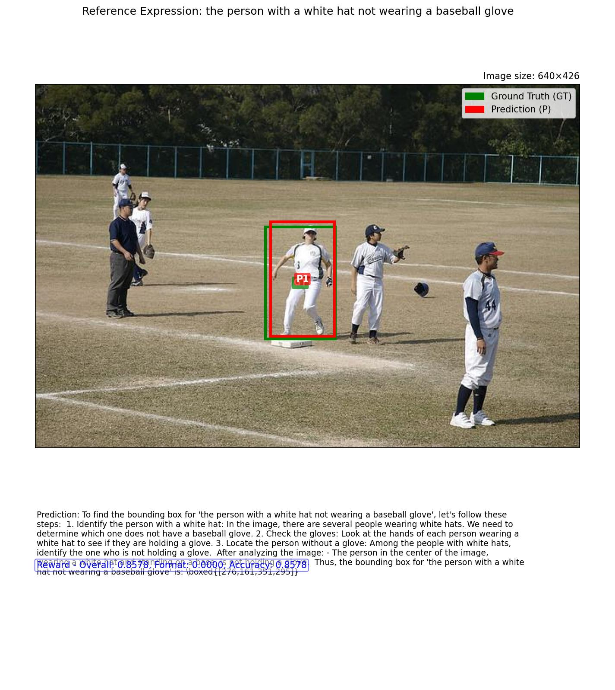

---

### Example 400

**Reference Expression**: the person with a white hat running

**Ground Truth**: [[3, 205, 255, 504]]

**Predicted**: [[6, 205, 279, 497]]

**Reward**: {'overall': 0.8828500655689931, 'format': 0.0, 'accuracy': 0.8828500655689931}

**Prediction**:
```
To find the bounding box for 'the person with a white hat running', let's follow these steps:

1. Identify the person with a white hat in the image.
2. Determine the person's position in the image, which appears to be in the foreground.
3. Observe the person's attire, which includes a white hat, a blue jersey, and gray pants.
4. Locate the person's movement, which suggests they are running.
5. Define the bounding box by capturing the person's full body from the top of their head to the bottom of their feet.

Following these steps, the bounding box for 'the person with a white hat running' is:

\boxed{[6,205,279,497]}
```

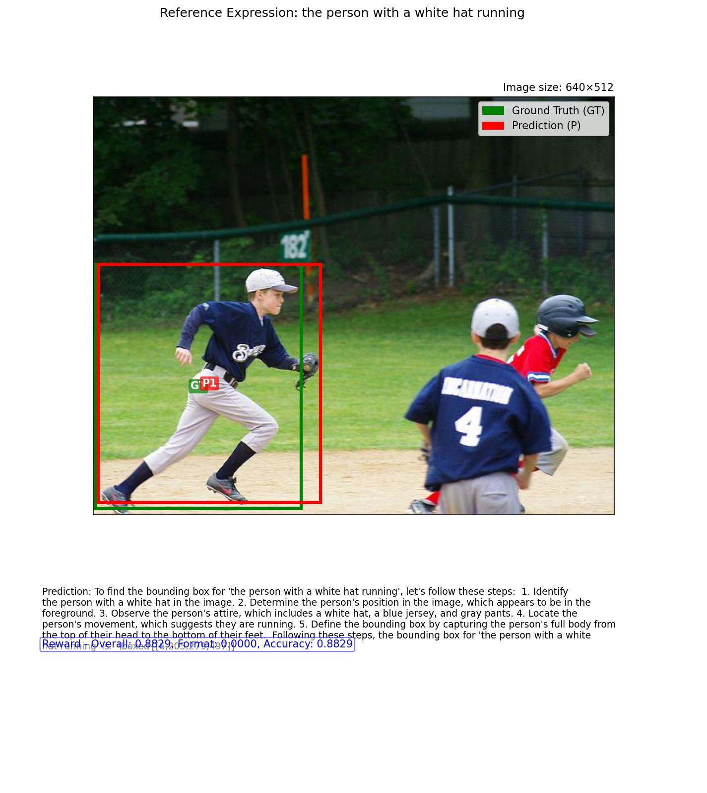

---

### Example 401

**Reference Expression**: the person jumping not wearing a green top

**Ground Truth**: [[169, 33, 300, 405]]

**Predicted**: [[164, 106, 297, 394]]

**Reward**: {'overall': 0.7347524515666108, 'format': 0.0, 'accuracy': 0.7347524515666108}

**Prediction**:
```
To find the bounding box for the person jumping not wearing a green top, let's follow these steps:

1. Identify the players in the image: There are two players in the foreground who appear to be jumping for the frisbee.
2. Determine which one is not wearing a green top: The person on the left is wearing a red top, while the person on the right is wearing a green top.
3. Focus on the person in the red top: This person is the one not wearing a green top.
4. Locate the bounding box for this person: The bounding box should encompass the entire body of the person in the red top.

Following these steps, the bounding box for the person jumping not wearing a green top is:

\boxed{[164,106,297,394]}
```

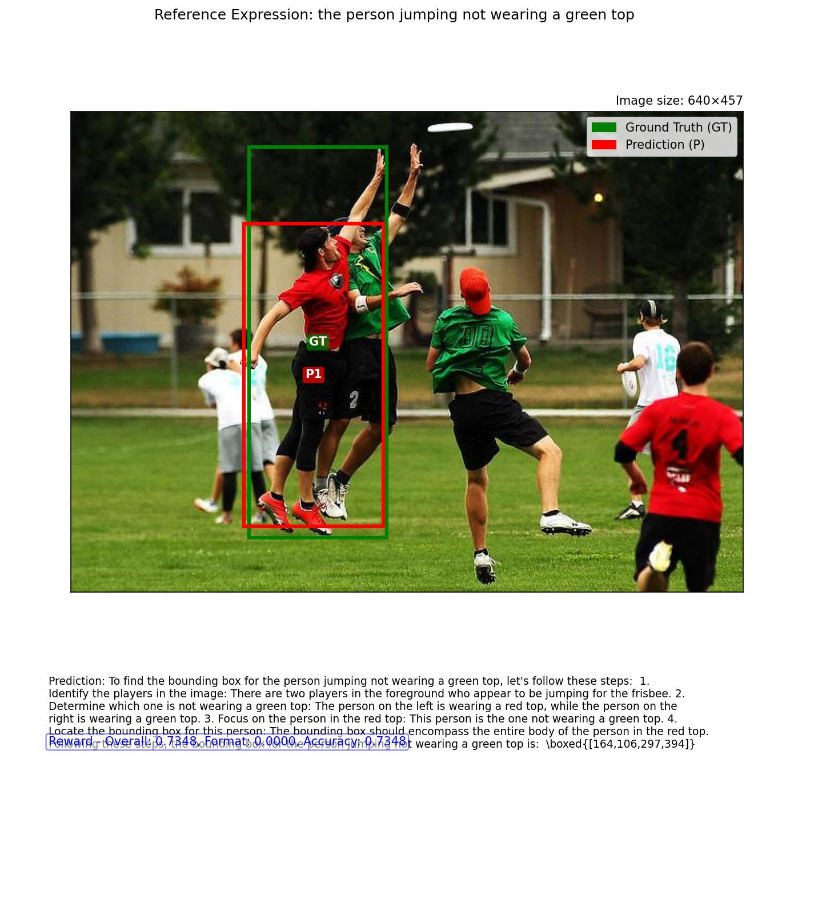

---

### Example 402

**Reference Expression**: the person wearing a black top not wearing a glove

**Ground Truth**: [[126, 195, 205, 329]]

**Predicted**: [[127, 193, 206, 327]]

**Reward**: {'overall': 1.0, 'format': 0.0, 'accuracy': 1.0}

**Prediction**:
```
To find the bounding box for 'the person wearing a black top not wearing a glove', we need to identify the individuals in the image and their roles in the baseball game. Here's the step-by-step reasoning:

1. **Identify the catcher**: The catcher is the person in the center of the image, wearing a white uniform with red accents, crouched behind home plate.
2. **Identify the batter**: The batter is the person holding the bat, standing in the batter's box, wearing a dark uniform.
3. **Identify the umpire**: The umpire is the person wearing a black top, standing behind the catcher, observing the game.
4. **Identify the person not wearing a glove**: The person not wearing a glove is the umpire, as the catcher is wearing a glove.

Given these observations, the person wearing a black top not wearing a glove is the umpire. The bounding box for the umpire is:

\boxed{[127,193,206,327]}
```

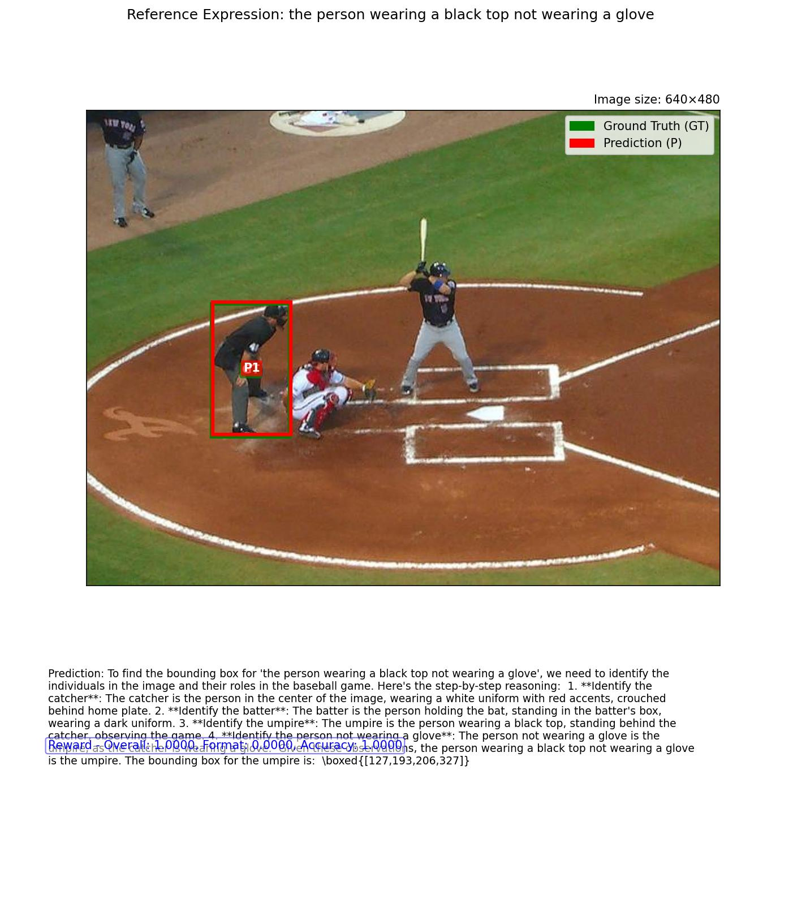

---

### Example 403

**Reference Expression**: the zebra facing a different direction than all the other zebras

**Ground Truth**: [[82, 262, 191, 388]]

**Predicted**: [[82, 258, 192, 385]]

**Reward**: {'overall': 1.0, 'format': 0.0, 'accuracy': 1.0}

**Prediction**:
```
To find the zebra facing a different direction than all the other zebras, we need to identify the zebra that is oriented in a way that is distinct from the others. Here's the step-by-step reasoning:

1. **Identify the group of zebras**: The zebras are clustered together, and we need to focus on their orientation.
2. **Determine the orientation**: The majority of the zebras are facing towards the right side of the image. We need to find the one that is facing the opposite direction.
3. **Locate the zebra facing the opposite direction**: Among the zebras, the one on the left side of the group is facing left, which is different from the others who are facing right.

Following these steps, the zebra facing a different direction than all the other zebras is the one on the left side. Its bounding box is:
\boxed{[82,258,192,385]}
```

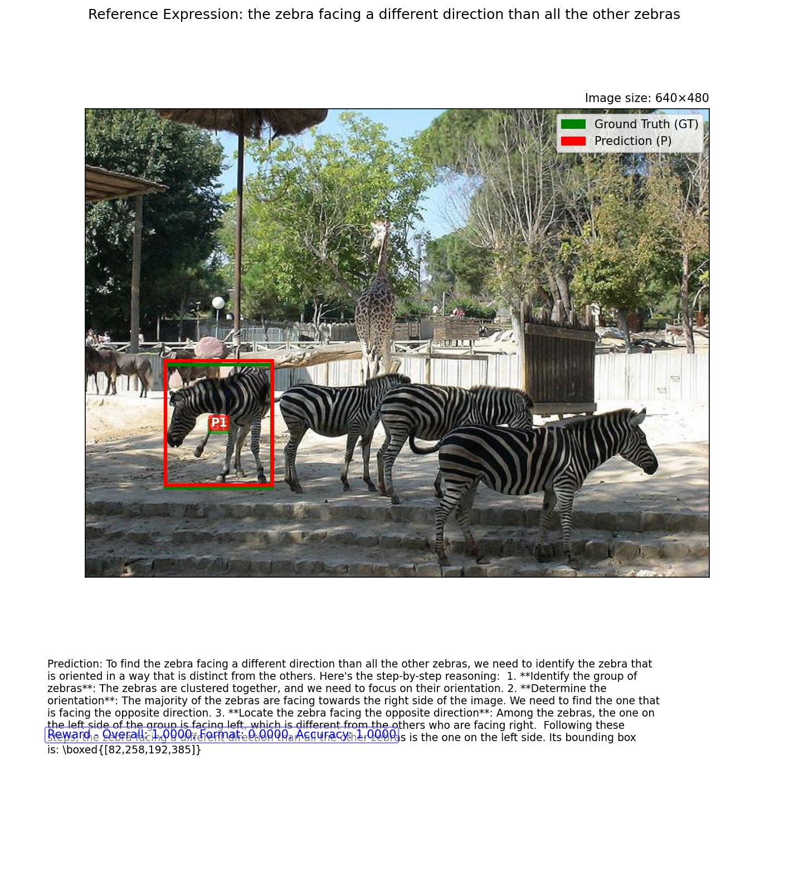

---

### Example 404

**Reference Expression**: the person wearing a t-shirt with red sleeves and arms hanging outside the railing

**Ground Truth**: [[0, 127, 78, 300]]

**Predicted**: [[3, 126, 60, 295]]

**Reward**: {'overall': 0.7066637148549922, 'format': 0.0, 'accuracy': 0.7066637148549922}

**Prediction**:
```
To find the bounding box for 'the person wearing a t-shirt with red sleeves and arms hanging outside the railing', we need to follow these steps:

1. Identify the area of the image where the railing is located. The railing is the green structure separating the field from the spectators.
2. Look for individuals with red sleeves who are standing or leaning against the railing.
3. Focus on the person who appears to have their arms hanging outside the railing.

Upon close inspection:
- There is a person on the left side of the image, wearing a red shirt and leaning on the railing.
- This person has their arms hanging down, which matches the description.

The bounding box for this person is:
\boxed{[3,126,60,295]}

This bounding box captures the individual wearing a red shirt with arms hanging outside the railing.
```

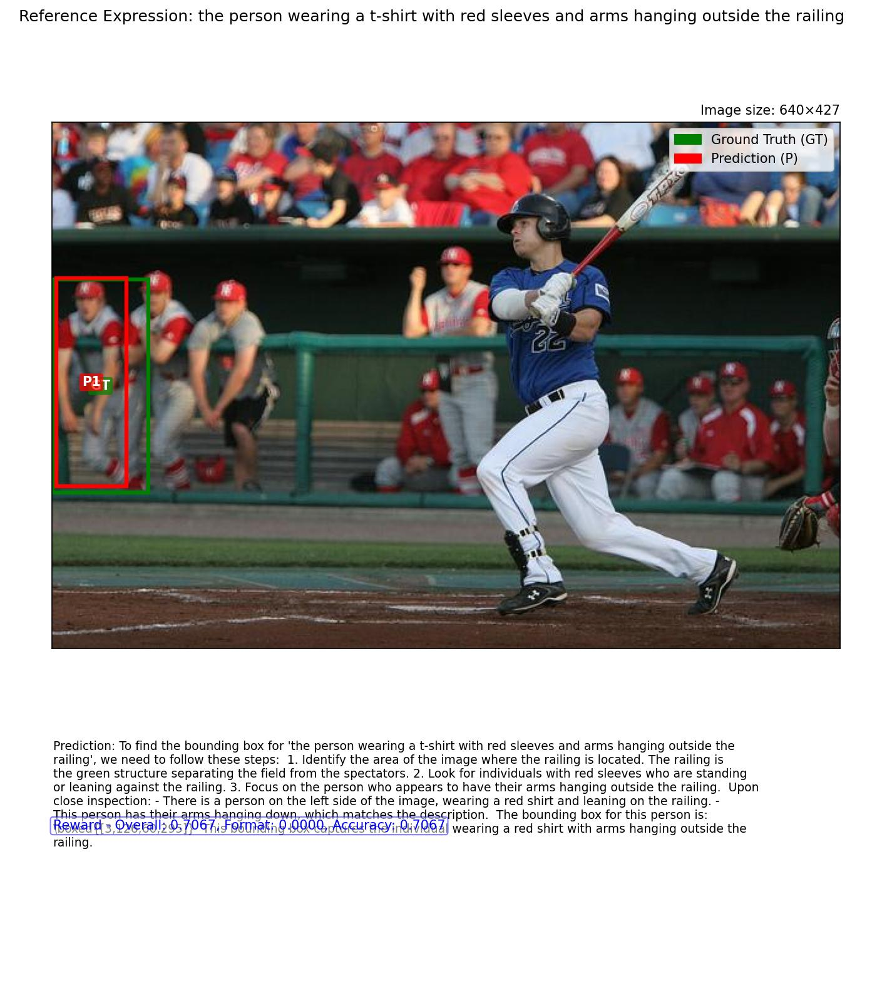

---

### Example 405

**Reference Expression**: the person running toward the crowd

**Ground Truth**: [[95, 139, 132, 221]]

**Predicted**: [[116, 176, 162, 275]]

**Reward**: {'overall': 0.10483401281304601, 'format': 0.0, 'accuracy': 0.10483401281304601}

**Prediction**:
```
To find the bounding box for 'the person running toward the crowd', we need to follow these steps:

1. Identify the crowd: The crowd appears to be the group of players huddled together in the center of the image.
2. Look for the person running: Among the players, there is one person who seems to be running towards the crowd. This person is positioned to the left of the crowd and is moving in their direction.
3. Determine the bounding box: The bounding box should encapsulate the person running. This person is wearing a dark blue jersey and white pants.

Given these observations, the bounding box for 'the person running toward the crowd' is:

\boxed{[116,176,162,275]}
```

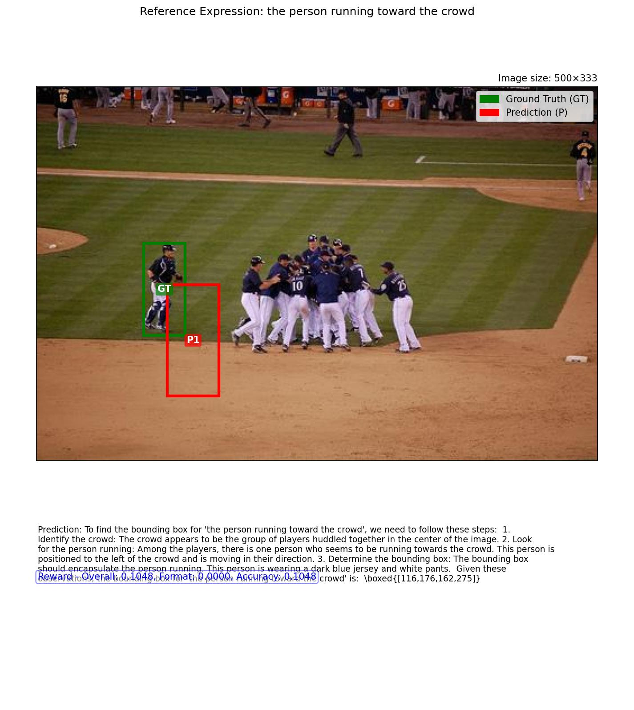

---

### Example 406

**Reference Expression**: the knife not in a plate and not the closest to the cake

**Ground Truth**: [[216, 311, 409, 422]]

**Predicted**: [[265, 280, 331, 343]]

**Reward**: {'overall': 0.0, 'format': 0.0, 'accuracy': 0.0}

**Prediction**:
```
To find the bounding box for 'the knife not in a plate and not the closest to the cake', let's follow these steps:

1. Identify the knife closest to the cake: It is the knife on the right side of the cake, lying on the table.
2. Identify the other knives: There is another knife on the table, which is closer to the cheese plate and not in a plate.
3. Determine which knife is not in a plate and not the closest to the cake: The knife that is on the table, next to the cheese plate, but not in a plate.

The bounding box for this knife is:
\boxed{[265,280,331,343]}
```

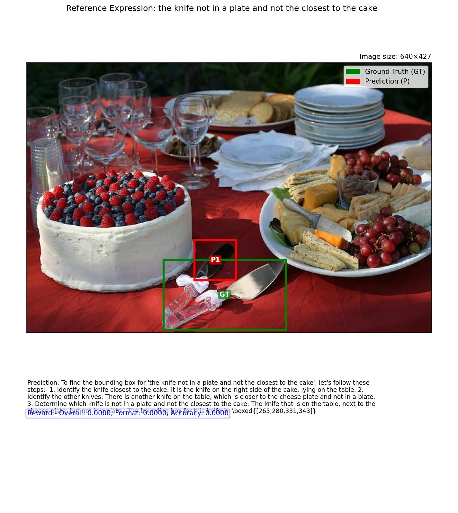

---

### Example 407

**Reference Expression**: the person with a hat next to a pair of skis but not wearing them

**Ground Truth**: [[455, 152, 499, 314]]

**Predicted**: [[137, 196, 183, 292]]

**Reward**: {'overall': 0.0, 'format': 0.0, 'accuracy': 0.0}

**Prediction**:
```
To find the bounding box for 'the person with a hat next to a pair of skis but not wearing them', we need to follow these steps:

1. Identify the pairs of skis in the image. There are a few pairs of skis on the snow.
2. Look for a person standing next to a pair of skis. There is a person standing next to a pair of skis on the left side of the image.
3. Check if this person is wearing skis. The person is not wearing skis, as they are standing on the snow without any ski boots.
4. Confirm that this person is wearing a hat.

Following these steps, the bounding box for the person described is:
\boxed{[137,196,183,292]}
```

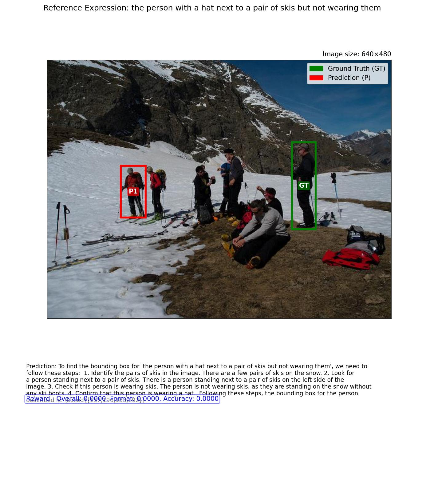

---

### Example 408

**Reference Expression**: the third zebra in a line of walking zebra

**Ground Truth**: [[237, 303, 321, 352]]

**Predicted**: [[246, 297, 320, 351]]

**Reward**: {'overall': 0.7789473684210526, 'format': 0.0, 'accuracy': 0.7789473684210526}

**Prediction**:
```
To find the bounding box for 'the third zebra in a line of walking zebra', let's follow these steps:

1. Identify the line of zebras that are walking in the image. These zebras are in the foreground, moving from the left side of the image towards the right.
2. Count the zebras in the line. There are four zebras in this line.
3. Determine which zebra is the third in this line. The zebras are in the following order from left to right: first, second, third, and fourth.

The third zebra in this line is located in the middle of the group, between the second and the fourth zebra.

After analyzing the image, the bounding box for 'the third zebra in a line of walking zebra' is:
\boxed{[246,297,320,351]}
```

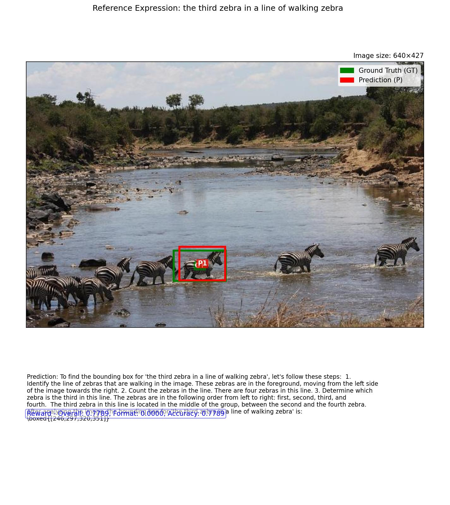

---

### Example 409

**Reference Expression**: the person with something in the hand but not eating it

**Ground Truth**: [[0, 158, 196, 630]]

**Predicted**: [[0, 159, 188, 635]]

**Reward**: {'overall': 1.0, 'format': 0.0, 'accuracy': 1.0}

**Prediction**:
```
To find the bounding box for 'the person with something in the hand but not eating it', let's follow these steps:

1. Identify the person who is holding something in their hand but is not eating it. In this image, the person on the left is holding a white object in their right hand, but they are not eating it.
2. Locate the bounding box for this person. The person on the left is wearing a gray Nike sweatshirt and is standing.
3. Define the bounding box for this person. The bounding box should encompass the entire body of the person holding the object.

The bounding box for 'the person with something in the hand but not eating it' is:
\boxed{[0,159,188,635]}
```

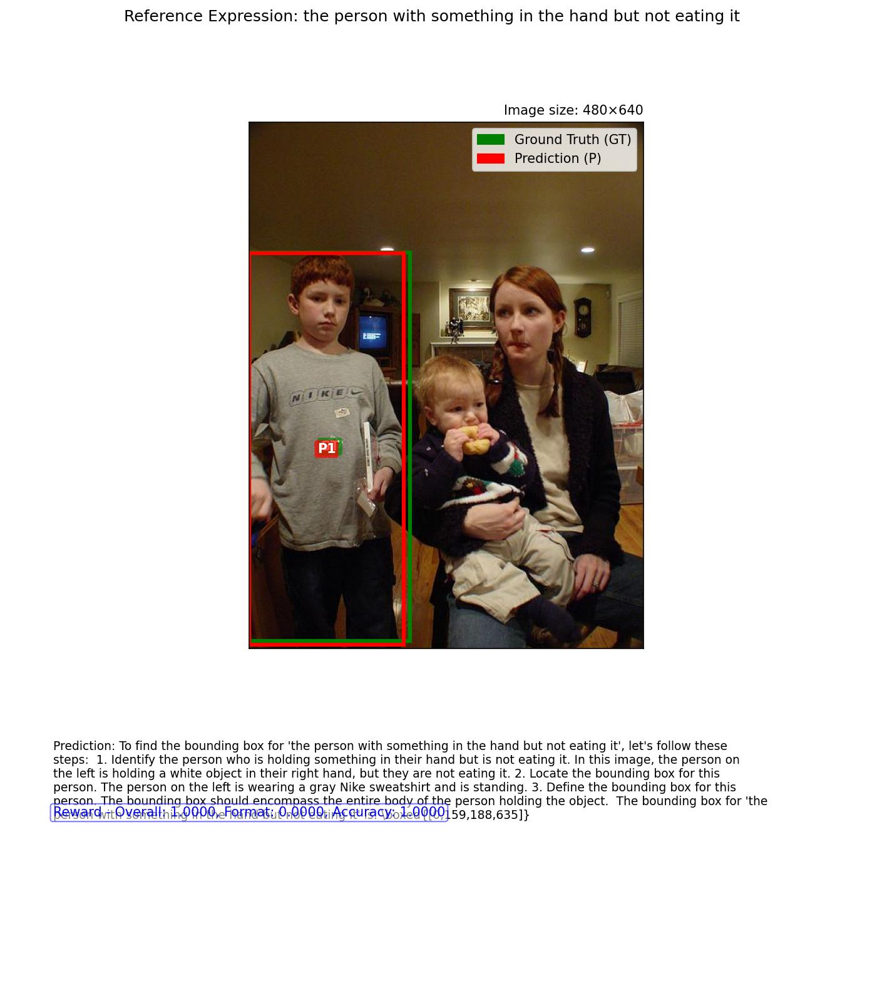

---

### Example 410

**Reference Expression**: the cake with a star on it close to a price card

**Ground Truth**: [[411, 226, 567, 389]]

**Predicted**: [[411, 226, 549, 351]]

**Reward**: {'overall': 0.6783860311467673, 'format': 0.0, 'accuracy': 0.6783860311467673}

**Prediction**:
```
To find the bounding box for 'the cake with a star on it close to a price card', we need to follow these steps:

1. Identify the price card in the image. The price card is on the right side of the image.
2. Look for a cake near this price card. The cake with a star on it is located near the price card.
3. Determine the bounding box for this cake. The cake is a white frosted cake with a star decoration.

After analyzing the image, the bounding box for 'the cake with a star on it close to a price card' is:

\boxed{[411,226,549,351]}
```

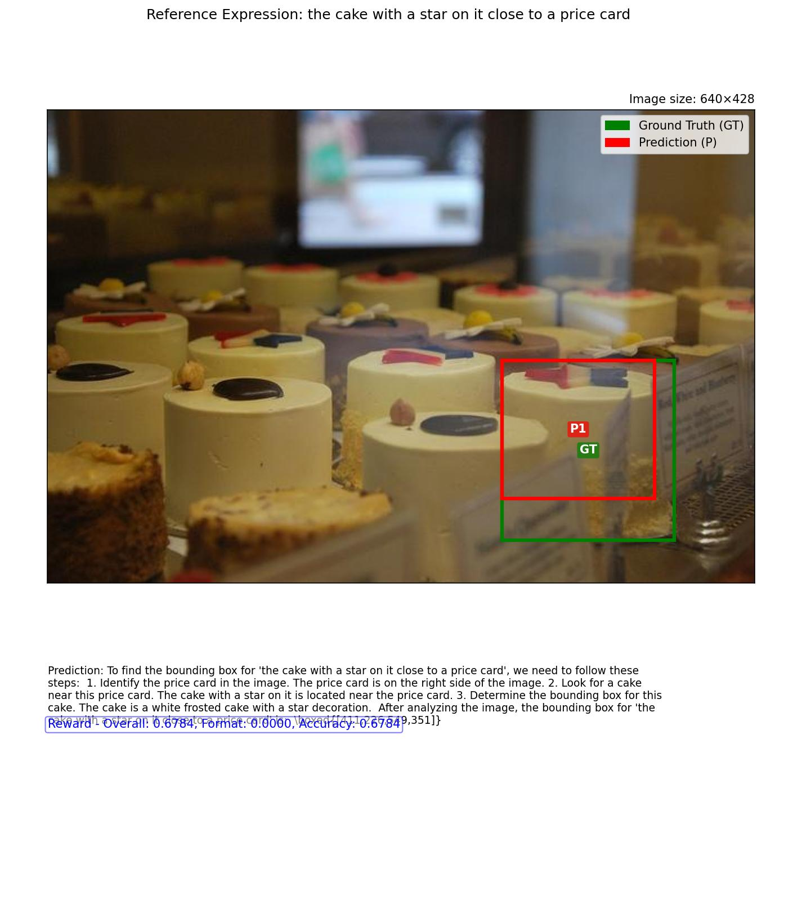

---

### Example 411

**Reference Expression**: the sandwich on a plate without forks

**Ground Truth**: [[363, 209, 569, 354]]

**Predicted**: [[362, 208, 571, 345]]

**Reward**: {'overall': 1.0, 'format': 0.0, 'accuracy': 1.0}

**Prediction**:
```
To find the corresponding bounding box for 'the sandwich on a plate without forks', let's follow these steps:

1. Identify the sandwich on a plate without forks: The sandwich on the right plate does not have a fork in the image.
2. Locate the plate with the sandwich: The plate on the right contains the sandwich without a fork.
3. Identify the sandwich: The sandwich is placed on the right plate and is partially cut.

Given these observations, the bounding box for 'the sandwich on a plate without forks' is:

\boxed{[362,208,571,345]}
```

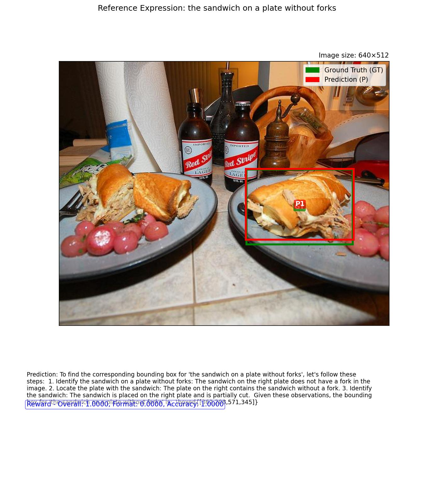

---

### Example 412

**Reference Expression**: the empty wine glass next to tissue

**Ground Truth**: [[333, 0, 438, 157]]

**Predicted**: [[336, 0, 437, 152]]

**Reward**: {'overall': 1.0, 'format': 0.0, 'accuracy': 1.0}

**Prediction**:
```
To find the empty wine glass next to the tissue, let's follow these steps:

1. Identify the tissue: The tissue is likely the white object in the upper right area of the image.
2. Locate the wine glass: Next to the tissue, there is a wine glass that appears to be empty.
3. Confirm the wine glass's location: The wine glass is positioned to the right of the tissue and is partially visible.

Given these observations, the bounding box for the empty wine glass next to the tissue would be:

\boxed{[336,0,437,152]}
```

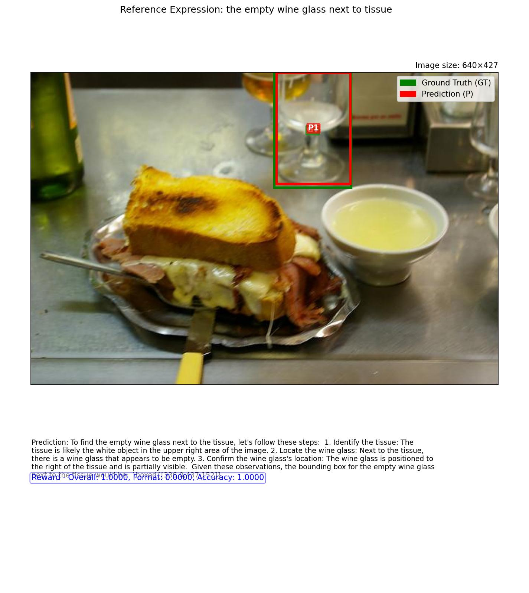

---

### Example 413

**Reference Expression**: the grey bowl in front of a sealed jar

**Ground Truth**: [[181, 164, 295, 241]]

**Predicted**: [[188, 251, 391, 408]]

**Reward**: {'overall': 0.0, 'format': 0.0, 'accuracy': 0.0}

**Prediction**:
```
To find the bounding box for the grey bowl in front of a sealed jar, let's follow these steps:

1. Identify the sealed jar: The sealed jar is a glass jar with a metal lid, located towards the back of the table.
2. Locate the grey bowl: The grey bowl is in front of the sealed jar, and it contains what appears to be sliced radishes.
3. Determine the bounding box: The grey bowl is a circular shape, and it is positioned to the left of the sealed jar. The bounding box should encompass the entire bowl.

The bounding box for the grey bowl in front of the sealed jar is:
\boxed{[188, 251, 391, 408]}
```

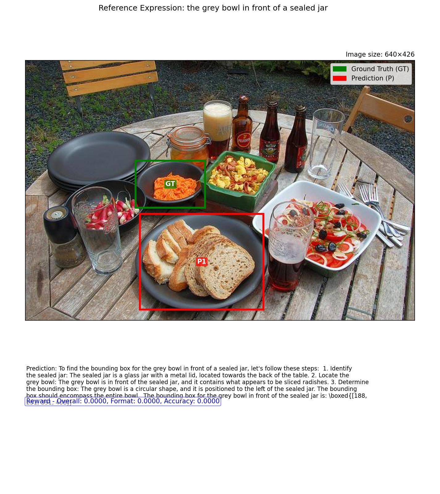

---

### Example 414

**Reference Expression**: the person wearing pink clothes not behind a cake

**Ground Truth**: [[50, 59, 63, 96]]

**Predicted**: [[266, 153, 389, 388]]

**Reward**: {'overall': 0.0, 'format': 0.0, 'accuracy': 0.0}

**Prediction**:
```
To find the bounding box for 'the person wearing pink clothes not behind a cake', let's follow these steps:

1. Identify the person wearing pink clothes: The person in the pink shirt is the child being held by the man in the plaid shirt.
2. Determine the location of the child relative to the cake: The child is not behind the cake; she is in front of it.
3. Locate the child in the image: The child is clearly visible in the center of the image, being held by the man.
4. Define the bounding box: The bounding box should encompass the child and not extend to include the cake.

The bounding box for the person wearing pink clothes (the child) is:
\boxed{[266,153,389,388]}

This bounding box captures the child in the pink shirt without including the cake or any other elements behind her.
```

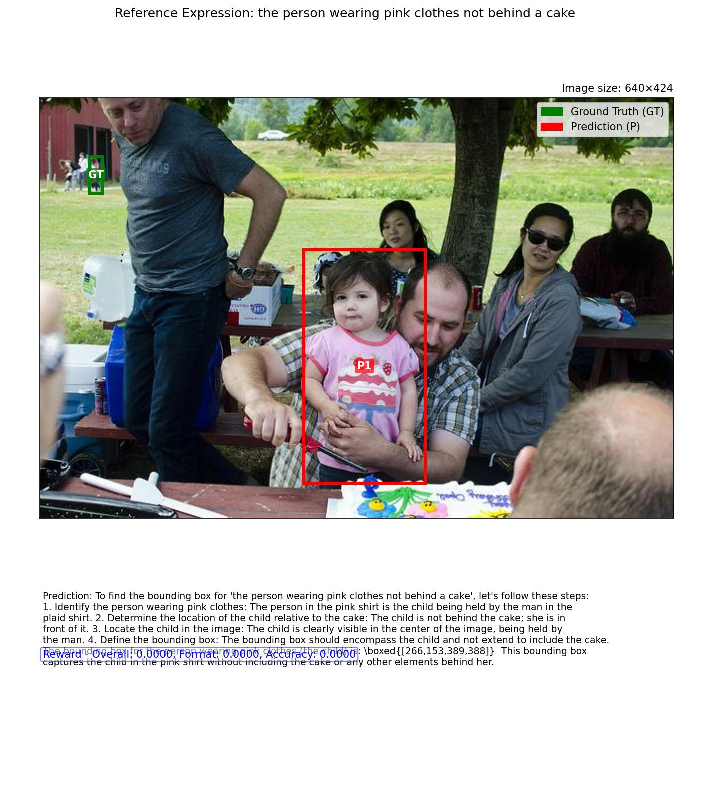

---

### Example 415

**Reference Expression**: the person wearing a grey top not carrying the ball

**Ground Truth**: [[126, 34, 181, 155]]

**Predicted**: [[125, 38, 180, 159]]

**Reward**: {'overall': 1.0, 'format': 0.0, 'accuracy': 1.0}

**Prediction**:
```
To find the bounding box for 'the person wearing a grey top not carrying the ball', follow these steps:

1. Identify the players in the image who are wearing grey tops.
2. Determine which of these players is not the one holding the ball.
3. Locate the player in the grey top who is not the one holding the ball.

- There are two players wearing grey tops in the image.
- One player in a grey top is holding the ball.
- The other player in a grey top is standing in the background, not holding the ball.

The bounding box for the person wearing a grey top not carrying the ball is:
\boxed{[125,38,180,159]}
```

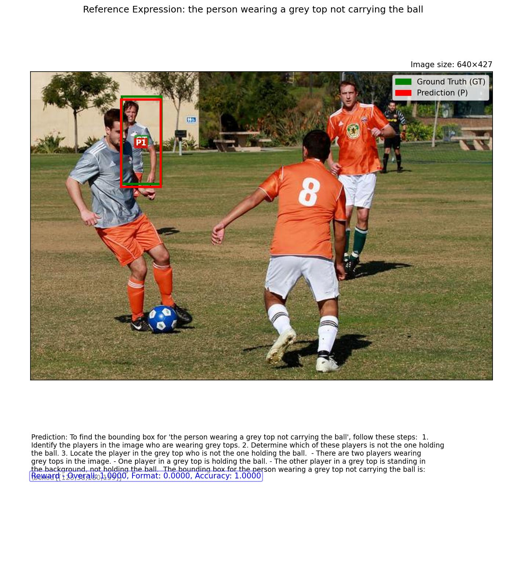

---

### Example 416

**Reference Expression**: the person wearing a white top who is farthest from the ball among those in white tops

**Ground Truth**: [[168, 53, 220, 154]]

**Predicted**: [[319, 43, 491, 364]]

**Reward**: {'overall': 0.0, 'format': 0.0, 'accuracy': 0.0}

**Prediction**:
```
To find the person wearing a white top who is farthest from the ball among those in white tops, we need to follow these steps:

1. Identify all the players in white tops.
2. Determine which of these players is farthest from the ball.

From the image:
- There are two players in white tops.
- The player closest to the ball is the one with the ball.
- The other player in white is further away from the ball.

The player in white who is further away from the ball is the one wearing blue shorts and a white headband.

The bounding box for this player is:
\boxed{[319,43,491,364]}


```

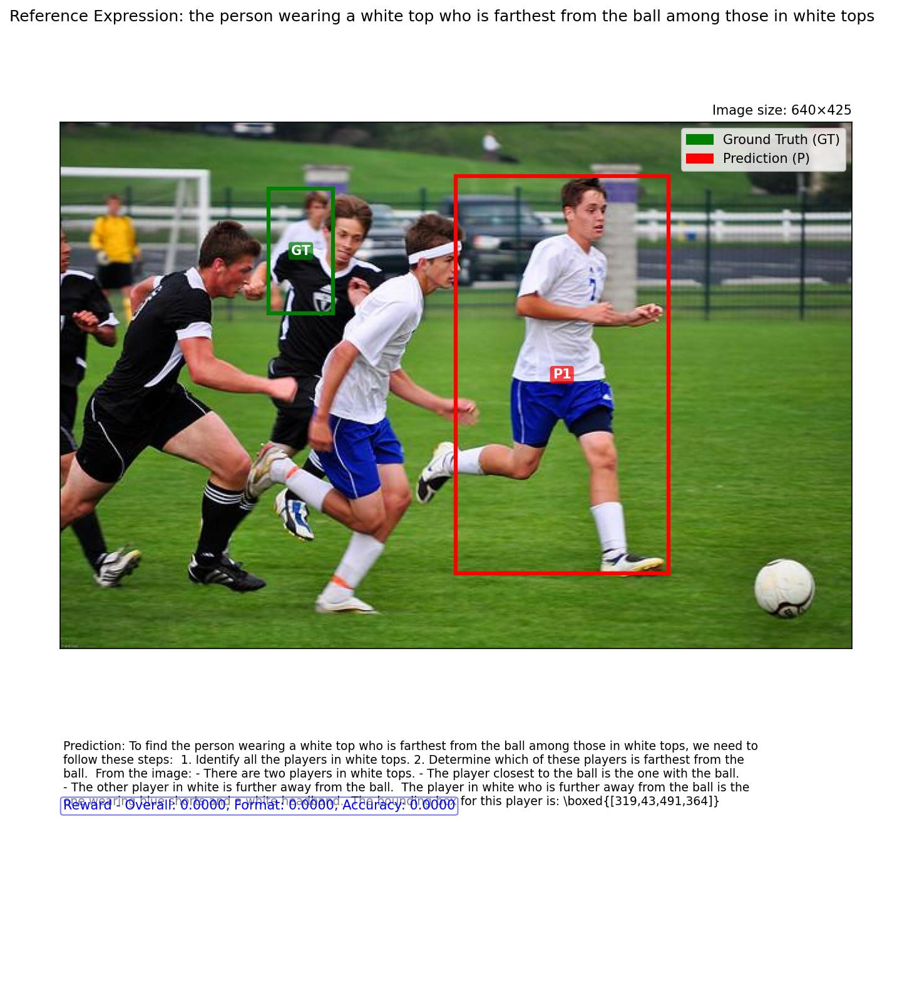

---

### Example 417

**Reference Expression**: the transparent glass next to the teapot

**Ground Truth**: [[434, 29, 521, 166]]

**Predicted**: [[441, 27, 523, 137]]

**Reward**: {'overall': 0.7024961378973901, 'format': 0.0, 'accuracy': 0.7024961378973901}

**Prediction**:
```
To find the bounding box for 'the transparent glass next to the teapot', let's follow these steps:

1. Identify the teapot: The teapot is a metallic object with a spout and handle, located in the center of the image.
2. Look for a transparent glass next to the teapot: To the right of the teapot, there is a transparent glass.
3. Determine the bounding box: The glass is transparent and has a cylindrical shape. It is positioned to the right of the teapot and is partially filled with a liquid.

Based on these observations, the bounding box for 'the transparent glass next to the teapot' is:

\boxed{[441,27,523,137]}
```

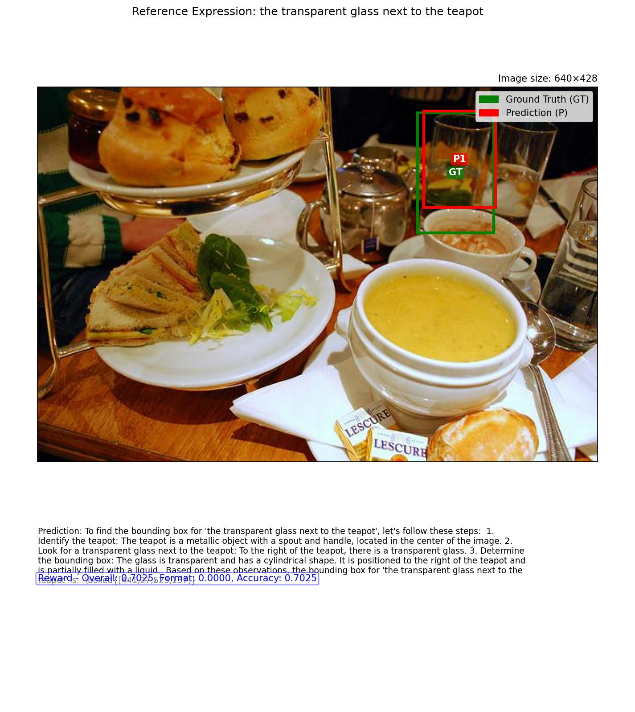

---

### Example 418

**Reference Expression**: the flag on the sandwich that has egg on it

**Ground Truth**: [[338, 328, 379, 365]]

**Predicted**: [[316, 338, 341, 362]]

**Reward**: {'overall': 0.0, 'format': 0.0, 'accuracy': 0.0}

**Prediction**:
```
To find the corresponding bounding box for 'the flag on the sandwich that has egg on it', let's follow these steps:

1. Identify the sandwich that has egg on it. The sandwich on the right side of the plate appears to have egg slices on it.
2. Locate the flag on the sandwich. The flag is placed on top of the egg slices.
3. Determine the bounding box for the flag. The flag is a small, rectangular object placed on top of the egg slices.

Given these observations, the flag on the sandwich with egg on it is the one located on the right side of the plate. The bounding box for this flag can be determined by identifying the coordinates of the sandwich and the flag on top of it.

The bounding box for the flag on the sandwich that has egg on it is:
\boxed{[316,338,341,362]}

This is a rough estimate based on the visual inspection of the image.
```

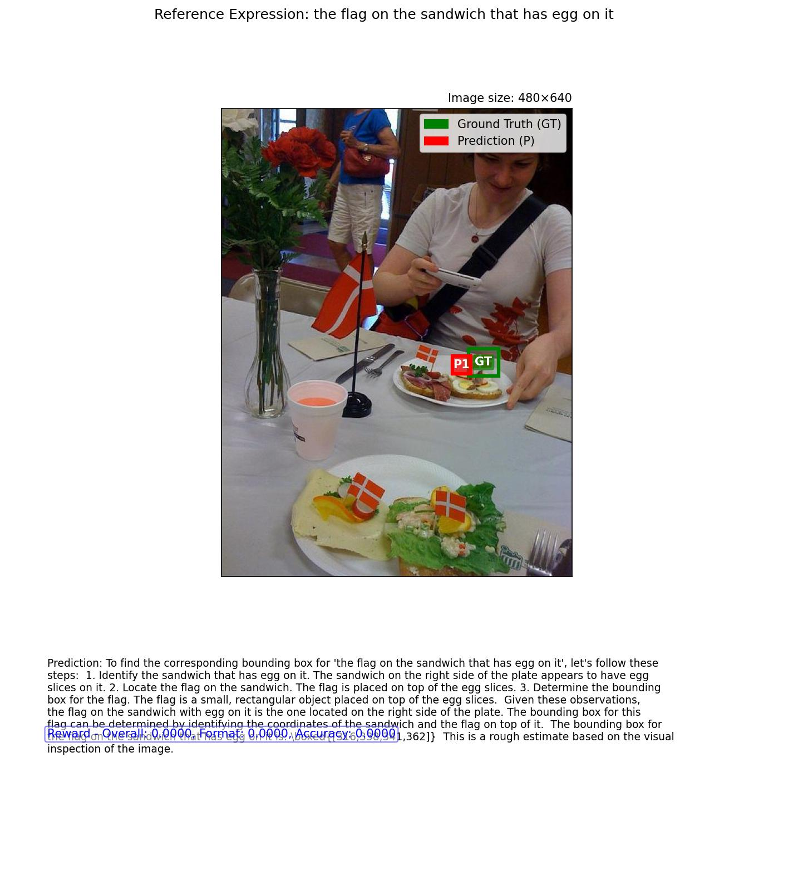

---

### Example 419

**Reference Expression**: the person wearing a white top next to a car

**Ground Truth**: [[10, 149, 42, 284]]

**Predicted**: [[14, 149, 43, 278]]

**Reward**: {'overall': 0.8118678354686446, 'format': 0.0, 'accuracy': 0.8118678354686446}

**Prediction**:
```
To find the bounding box for 'the person wearing a white top next to a car', follow these steps:

1. Identify the car in the image that is yellow and located near the left side of the image.
2. Look for a person standing next to this car. The person should be wearing a white top.
3. Locate the person who is standing next to the car and is wearing a white top. This person is on the left side of the image, near the car.

After identifying the person, the bounding box for 'the person wearing a white top next to a car' is:

\boxed{[14,149,43,278]}
```

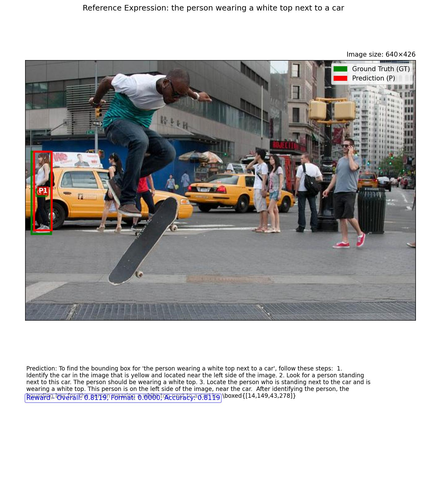

---

### Example 420

**Reference Expression**: the plate held by a person with a necklace

**Ground Truth**: [[214, 269, 242, 333]]

**Predicted**: [[221, 366, 280, 397]]

**Reward**: {'overall': 0.0, 'format': 0.0, 'accuracy': 0.0}

**Prediction**:
```
To find the plate held by the person with a necklace, we need to follow these steps:

1. Identify the person with a necklace: The person on the left is wearing a necklace and is holding a plate in her right hand.
2. Locate the plate: The plate held by the person with the necklace is the one in her right hand.
3. Define the bounding box: The plate is a circular object and can be identified by its shape and position relative to the person.

After analyzing the image, the plate held by the person with the necklace is located to the left of the larger plate that the person on the right is holding. The plate is on the table and is close to the person on the left.

The bounding box for the plate held by the person with the necklace is:
\boxed{[221,366,280,397]}
```

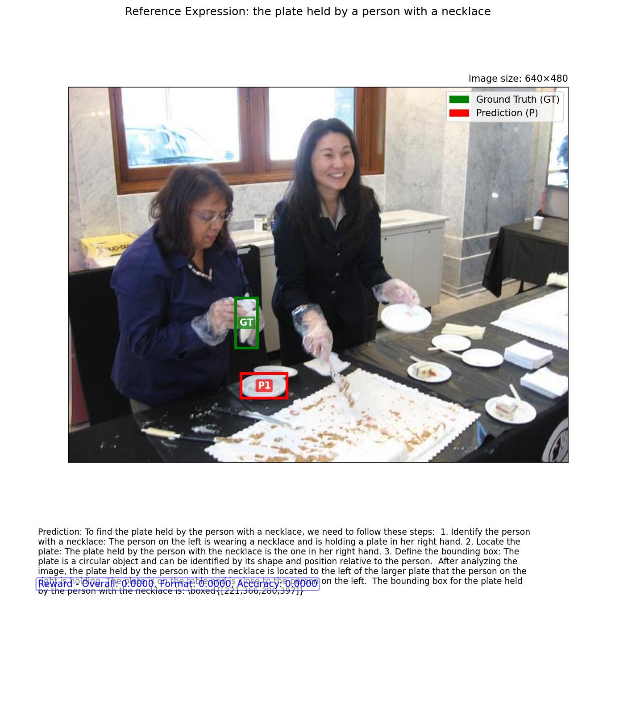

---

### Example 421

**Reference Expression**: the donut with pink frosting lying flat

**Ground Truth**: [[272, 330, 309, 357]]

**Predicted**: [[121, 475, 288, 644]]

**Reward**: {'overall': 0.0, 'format': 0.0, 'accuracy': 0.0}

**Prediction**:
```
To find the bounding box for 'the donut with pink frosting lying flat', let's follow these steps:

1. Identify the donuts on the tray: There are multiple donuts with different frostings and toppings.
2. Locate the donut with pink frosting: Among the donuts, there is one with pink frosting that appears to be lying flat.
3. Determine the bounding box: The donut with pink frosting is positioned towards the bottom left of the tray, and it has a round shape with pink frosting and some colorful sprinkles on top.

Given these observations, the bounding box for 'the donut with pink frosting lying flat' would be:

\boxed{[121,475,288,644]}
```


---

### Example 422

**Reference Expression**: the cake with green grape on it, not cut by a knife

**Ground Truth**: [[136, 107, 311, 237]]

**Predicted**: [[130, 218, 373, 396]]

**Reward**: {'overall': 0.0, 'format': 0.0, 'accuracy': 0.0}

**Prediction**:
```
To find the bounding box for 'the cake with green grape on it, not cut by a knife', let's follow these steps:

1. Identify the cakes in the image. There are three cakes in total.
2. Locate the cake with green grapes on it. This cake is in the middle and has green grapes on top along with other fruits.
3. Determine if the cake is being cut by a knife. The cake in the middle is not being cut by a knife; the knife is being used to cut the cake in the foreground.
4. Focus on the cake with green grapes that is not being cut. This cake is the middle one.

The bounding box for the cake with green grapes on it, not cut by a knife, is:
\boxed{[130,218,373,396]}
```

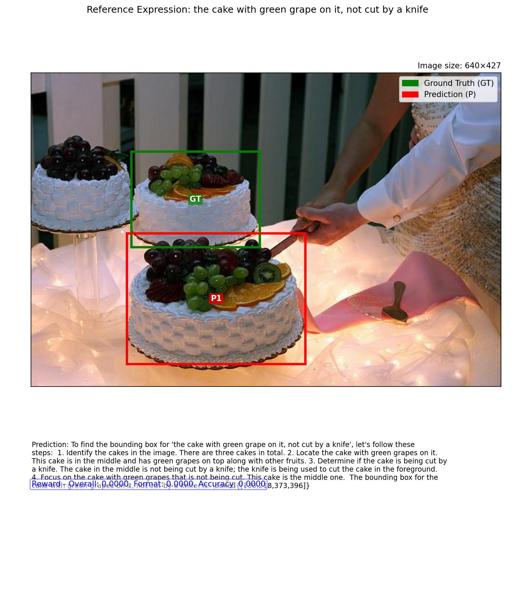

---

### Example 423

**Reference Expression**: the cupcake with a bus pattern, placed on the edge of the plate

**Ground Truth**: [[5, 381, 89, 452]]

**Predicted**: [[1, 362, 82, 442]]

**Reward**: {'overall': 0.6062992125984252, 'format': 0.0, 'accuracy': 0.6062992125984252}

**Prediction**:
```
To find the cupcake with a bus pattern placed on the edge of the plate, we need to follow these steps:

1. Identify the cupcakes on the plate with a bus pattern.
2. Determine which of these cupcakes is on the edge of the plate.

From the image:
- The cupcakes with bus patterns are on the left side of the plate.
- The cupcake with the bus pattern that is on the edge of the plate is the one closest to the bottom left corner of the plate.

After careful observation, the cupcake with the bus pattern that is on the edge of the plate is the one closest to the bottom left corner of the plate.

The bounding box for this cupcake is:
\boxed{[1,362,82,442]}
```

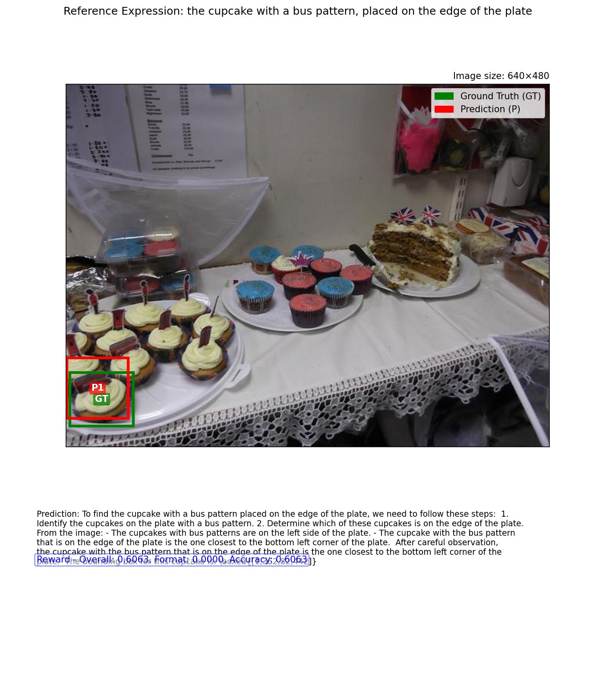

---

### Example 424

**Reference Expression**: the person with a pink ski jacket not wearing a pink helmet

**Ground Truth**: [[362, 103, 388, 139]]

**Predicted**: [[381, 156, 422, 214]]

**Reward**: {'overall': 0.0, 'format': 0.0, 'accuracy': 0.0}

**Prediction**:
```
To find the bounding box for 'the person with a pink ski jacket not wearing a pink helmet', we need to follow these steps:

1. Identify the person with a pink ski jacket in the image.
2. Check if the person is wearing a pink helmet.
3. If the person is not wearing a pink helmet, select the bounding box for that person.

Step 1: Identifying the person with a pink ski jacket:
- There are two people in the foreground wearing pink ski jackets. One is wearing a pink helmet, and the other is not.

Step 2: Checking if the person is wearing a pink helmet:
- The person on the left is wearing a pink helmet.
- The person on the right is not wearing a pink helmet.

Step 3: Selecting the bounding box:
- The person on the right, who is not wearing a pink helmet, is the one we need to select.

After analyzing the image, the bounding box for the person with a pink ski jacket not wearing a pink helmet is:
\boxed{[381,156,422,214]}
```

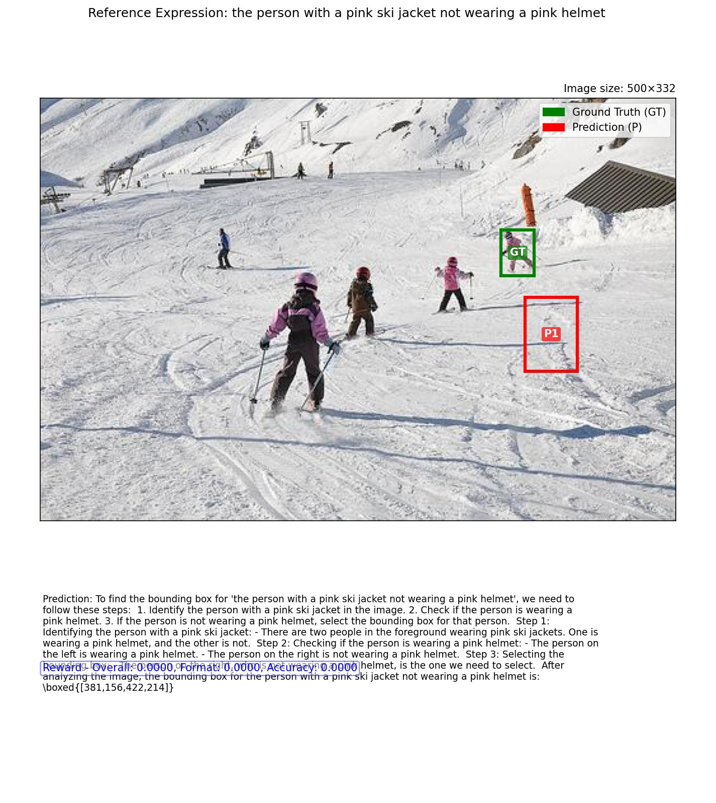

---

### Example 425

**Reference Expression**: the donuts with chocolate frosting, not on top of other donuts

**Ground Truth**: [[122, 309, 344, 422]]

**Predicted**: []

**Reward**: {'overall': 0.0, 'format': 0.0, 'accuracy': 0.0}

**Prediction**:
```
To find the donuts with chocolate frosting that are not on top of other donuts, we need to identify the donuts that have chocolate frosting and are not partially covered by other donuts. Here's the step-by-step reasoning:

1. Identify the donuts with chocolate frosting: These are the donuts that have a dark, glossy layer on top.
2. Determine which of these donuts are not on top of other donuts: We need to look for the donuts that are not partially covered by other donuts.

Upon examining the image:
- The donut in the bottom left corner has chocolate frosting and is not on top of another donut.
- The donut in the bottom center also has chocolate frosting and is not on top of another donut.
- The donut in the bottom right corner has chocolate frosting and is not on top of another donut.
- The donut in the top right corner has chocolate frosting but is partially covered by another donut.

So, the donuts with chocolate frosting that are not on top of other donuts are the ones in the bottom left, bottom center, and bottom right corners.

The bounding box for these donuts would be:
\boxed{[124,302,344,419,365,420,315,420]}

However, since the bounding box coordinates are not provided in the image, we can only describe the positions. The exact bounding box coordinates would depend on the specific image processing used.
```

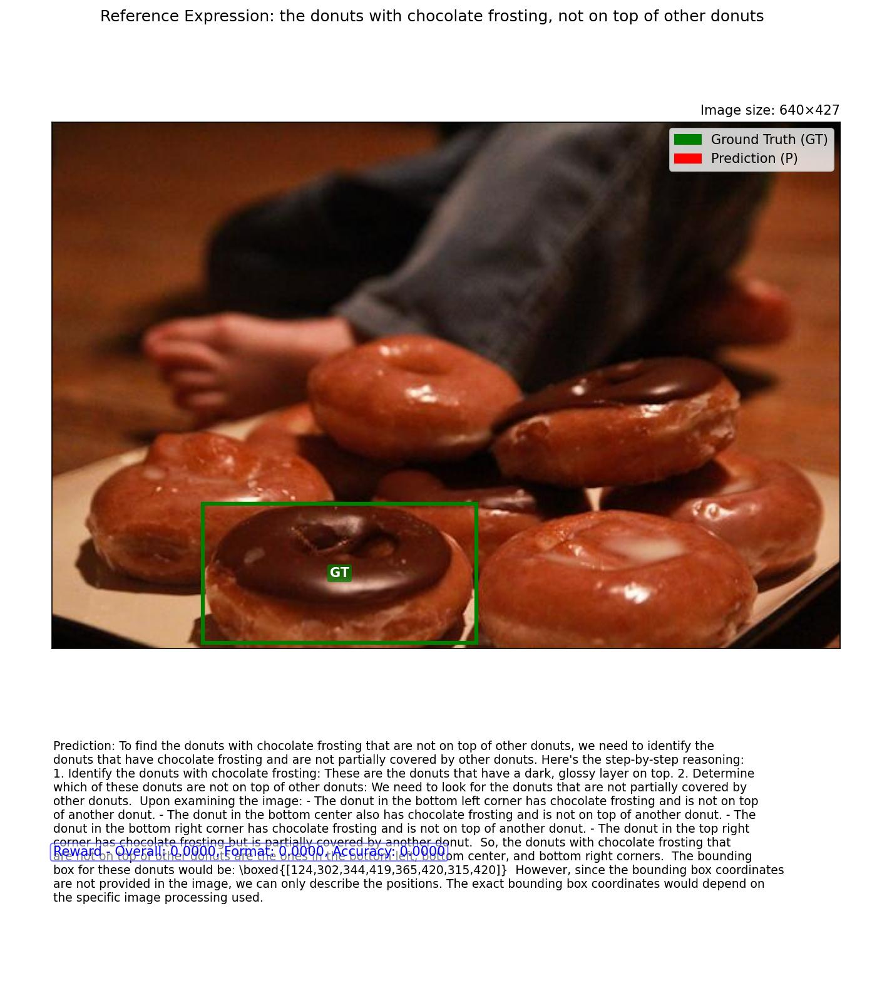

---

### Example 426

**Reference Expression**: the person wearing a hat, behind the table

**Ground Truth**: [[307, 40, 469, 269]]

**Predicted**: [[324, 43, 493, 297]]

**Reward**: {'overall': 0.6934862657129555, 'format': 0.0, 'accuracy': 0.6934862657129555}

**Prediction**:
```
To find the bounding box for 'the person wearing a hat, behind the table', we need to follow these steps:

1. Identify the person wearing a hat in the image. There are two people wearing hats in the image, but we need to determine which one is 'behind the table'.
2. Observe the positioning relative to the table. The person in the foreground (closer to the camera) is in front of the table, while the person we are looking for is behind the table.
3. The person behind the table is the one further away from the camera and is positioned behind the table with the food.

After analyzing the image, the person wearing a hat and standing behind the table is the one on the right side of the image. The bounding box for this person is:

\boxed{[324,43,493,297]}
```

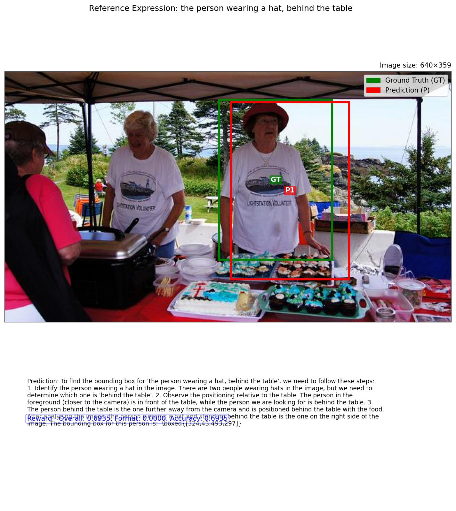

---

### Example 427

**Reference Expression**: the person wearing a grey top and a hat, not jumping in the air

**Ground Truth**: [[329, 263, 351, 332]]

**Predicted**: [[391, 325, 420, 389]]

**Reward**: {'overall': 0.0, 'format': 0.0, 'accuracy': 0.0}

**Prediction**:
```
To find the bounding box for 'the person wearing a grey top and a hat, not jumping in the air', let's follow these steps:

1. Identify the person wearing a grey top and a hat in the image.
2. Check the position of this person relative to the skateboarder who is in mid-air.
3. Ensure the person is not jumping and is standing or sitting on the ramp.

After analyzing the image:
- The person wearing a grey top and a hat is located on the ramp, not in the air.
- This person is positioned towards the right side of the image, sitting or standing on the ramp.

The bounding box for this person would be:
\boxed{[391,325,420,389]}

This bounding box corresponds to the person wearing a grey top and a hat who is not jumping in the air.
```

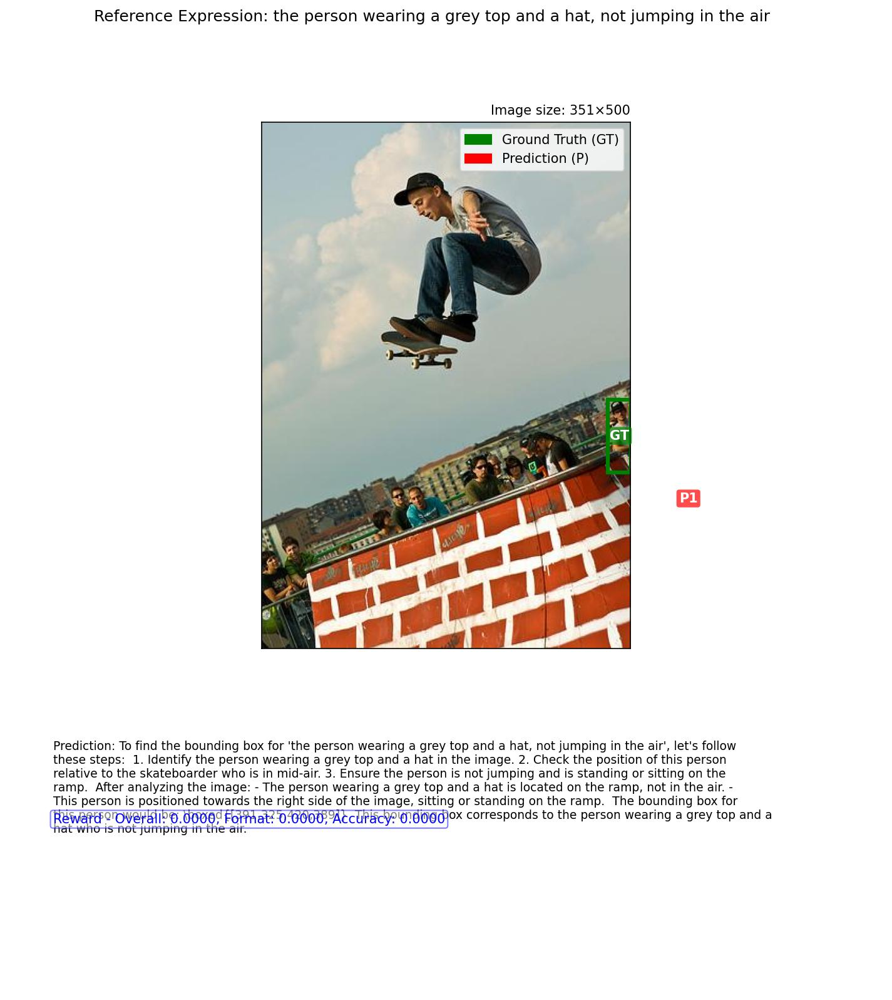

---

### Example 428

**Reference Expression**: the person wearing a green top next to some plastic boxes

**Ground Truth**: [[271, 64, 432, 249]]

**Predicted**: [[277, 65, 413, 247]]

**Reward**: {'overall': 0.8310223266745006, 'format': 0.0, 'accuracy': 0.8310223266745006}

**Prediction**:
```
To find the bounding box for 'the person wearing a green top next to some plastic boxes', let's follow these steps:

1. Identify the area where the plastic boxes are located. The plastic boxes are on the right side of the image, near the front.
2. Look for a person wearing a green top in that area. There is a person wearing a green top located near the center of the image, close to the plastic boxes.
3. Verify that the person is indeed wearing a green top and is positioned next to the plastic boxes.

The bounding box for 'the person wearing a green top next to some plastic boxes' is:
\boxed{[277, 65, 413, 247]}
```

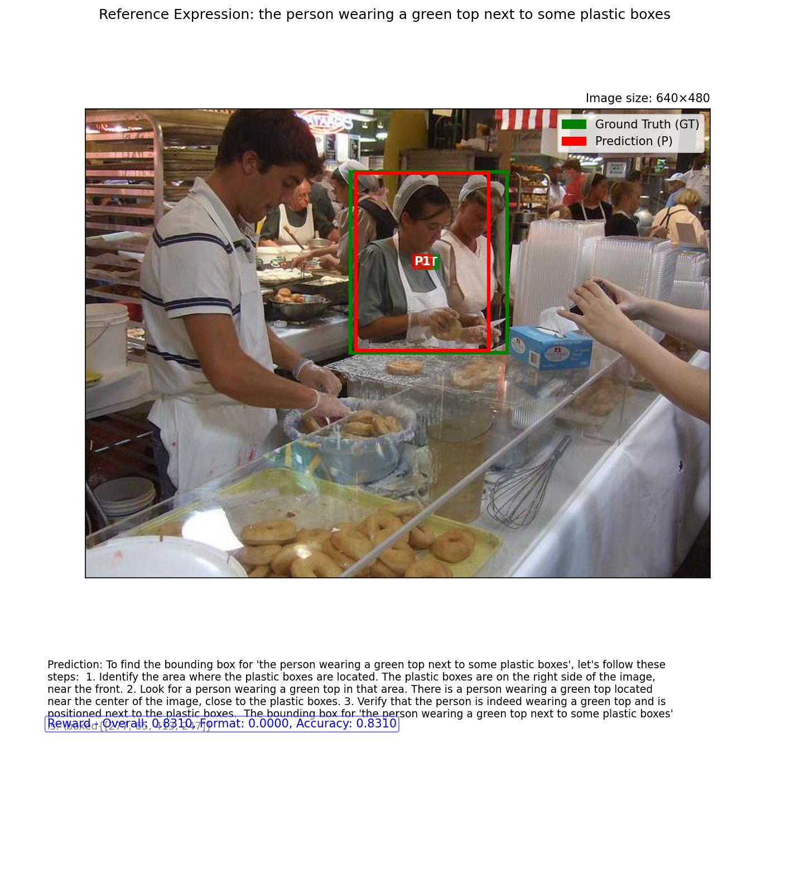

---

### Example 429

**Reference Expression**: the person not facing the camera and not behind the window

**Ground Truth**: [[447, 132, 611, 457]]

**Predicted**: [[449, 136, 610, 448]]

**Reward**: {'overall': 1.0, 'format': 0.0, 'accuracy': 1.0}

**Prediction**:
```
To find the bounding box for 'the person not facing the camera and not behind the window', we need to follow these steps:

1. Identify the person not facing the camera: This person is the one on the right side of the image, facing away from the camera and standing in front of the window.
2. Identify the person behind the window: This person is the reflection in the window, not the actual person in the scene.
3. The person we are looking for is the one on the right side of the image, facing away from the camera.

The bounding box for this person is:
\boxed{[449,136,610,448]}
```

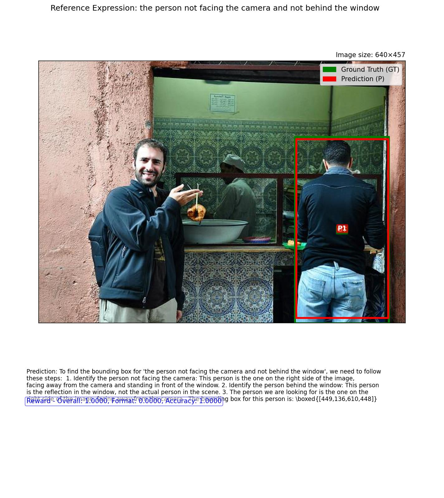

---

### Example 430

**Reference Expression**: the person wearing a hat and not behind the counter

**Ground Truth**: [[30, 18, 164, 276]]

**Predicted**: [[42, 29, 219, 364]]

**Reward**: {'overall': 0.47281628041987667, 'format': 0.0, 'accuracy': 0.47281628041987667}

**Prediction**:
```
To find the bounding box for 'the person wearing a hat and not behind the counter', we need to follow these steps:

1. Identify the person wearing a hat in the image.
2. Determine if this person is behind the counter or not.
3. If the person is not behind the counter, provide their bounding box.

Step 1: Identifying the person wearing a hat.
- There are two people wearing hats in the image. One is behind the counter, and the other is not.

Step 2: Determining if the person is behind the counter.
- The person wearing the hat and not behind the counter is the one on the left side of the image, standing next to the customer.

Step 3: Providing the bounding box.
- The person wearing the hat and not behind the counter is the woman on the left side of the image.

The bounding box for the person wearing a hat and not behind the counter is:
\boxed{[42,29,219,364]}
```

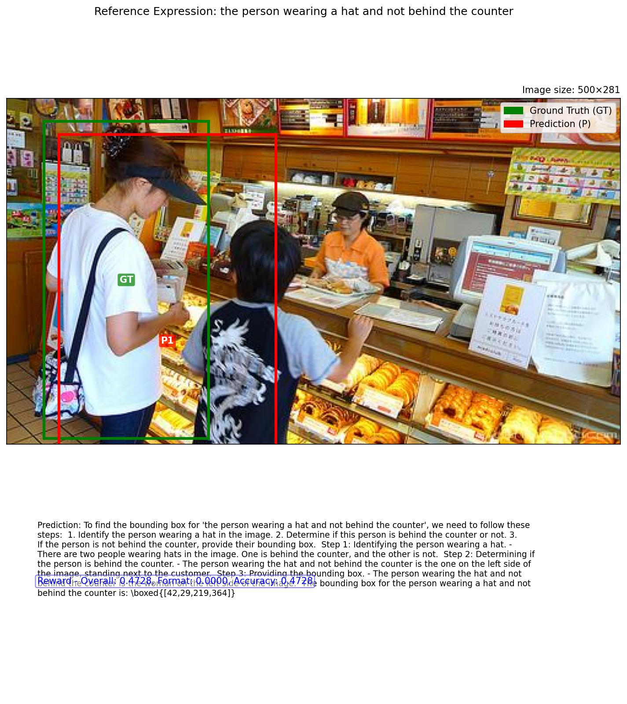

---

### Example 431

**Reference Expression**: the ski pole held in the right hand of the person wearing a black top

**Ground Truth**: [[136, 170, 163, 326]]

**Predicted**: [[155, 186, 189, 389]]

**Reward**: {'overall': 0.11206724034420652, 'format': 0.0, 'accuracy': 0.11206724034420652}

**Prediction**:
```
To find the bounding box for 'the ski pole held in the right hand of the person wearing a black top', we need to follow these steps:

1. Identify the person wearing a black top. In the image, there are three individuals. The person on the left and the person on the right are wearing black tops, but the person in the middle is wearing a blue top. Therefore, the person on the left and the person on the right are the ones we need to focus on.
2. Determine which of these two individuals is holding the ski pole in their right hand. The person on the left is holding the ski pole in their right hand.
3. Locate the ski pole in the image. The ski pole held in the right hand of the person on the left is the one that extends from the middle of the person's body to the ground.
4. Define the bounding box for this ski pole. The ski pole is a vertical object extending from the person's right hand down to the ground. The bounding box should encompass this vertical object.

Given these observations, the bounding box for 'the ski pole held in the right hand of the person wearing a black top' is:

\boxed{[155,186,189,389]}
```

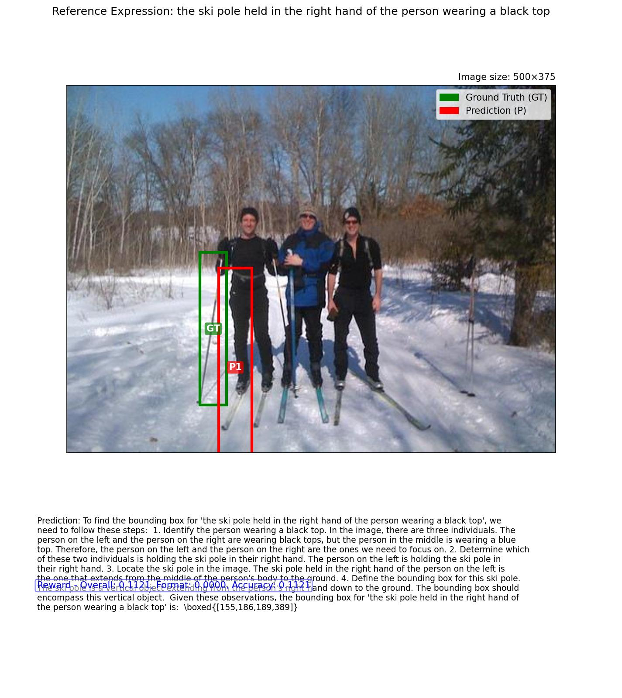

---

### Example 432

**Reference Expression**: the red bowl with food inside

**Ground Truth**: [[274, 339, 436, 471]]

**Predicted**: [[278, 328, 435, 462]]

**Reward**: {'overall': 0.8355761325775605, 'format': 0.0, 'accuracy': 0.8355761325775605}

**Prediction**:
```
To find the bounding box for 'the red bowl with food inside', follow these steps:

1. Identify the red bowl: Look for a red bowl that contains some food inside. It should be distinct from other bowls on the table.
2. Locate the food: Ensure the bowl has food inside it, which could be mashed potatoes or something similar.
3. Define the bounding box: Once the red bowl with food is identified, define its bounding box by selecting the coordinates that encompass the entire bowl and its contents.

After carefully analyzing the image, the red bowl with food inside is located in the foreground, to the right of the glass of orange juice. The bounding box for this bowl would be:

\boxed{[278,328,435,462]}

This bounding box captures the red bowl with food inside, along with a small portion of the tablecloth and the surrounding area.
```

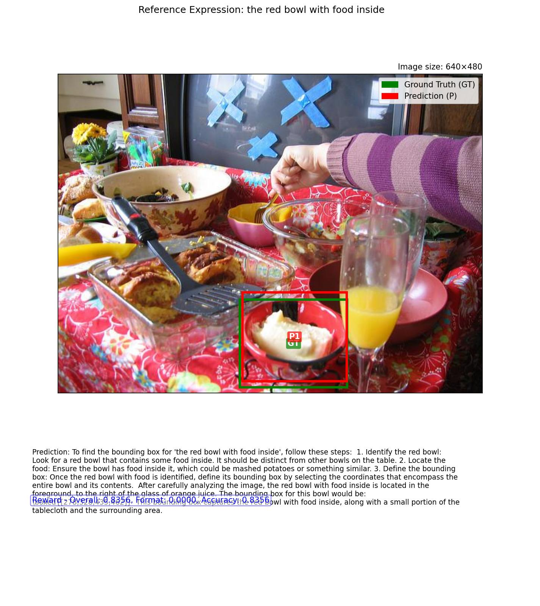

---

### Example 433

**Reference Expression**: one of the donuts that is on the edge of donut robot machine, and closest to the camera

**Ground Truth**: [[249, 404, 286, 433]]

**Predicted**: [[116, 422, 153, 464]]

**Reward**: {'overall': 0.0, 'format': 0.0, 'accuracy': 0.0}

**Prediction**:
```
To find the bounding box for 'one of the donuts that is on the edge of the donut robot machine, and closest to the camera', we need to follow these steps:

1. Identify the donut robot machine: It is the metallic machine on the left side of the image with the label "Donut Robot MARK II".
2. Locate the donuts on the edge of the donut robot machine: There are several donuts on the conveyor belt of the machine.
3. Determine which donut is closest to the camera: Among the donuts on the edge of the machine, the one closest to the camera would be the one furthest from the operator and the display stand.

By analyzing the image, the donut that is closest to the camera and on the edge of the donut robot machine is the one furthest from the operator and the display stand.

The bounding box for this donut is:
\boxed{[116,422,153,464]}
```

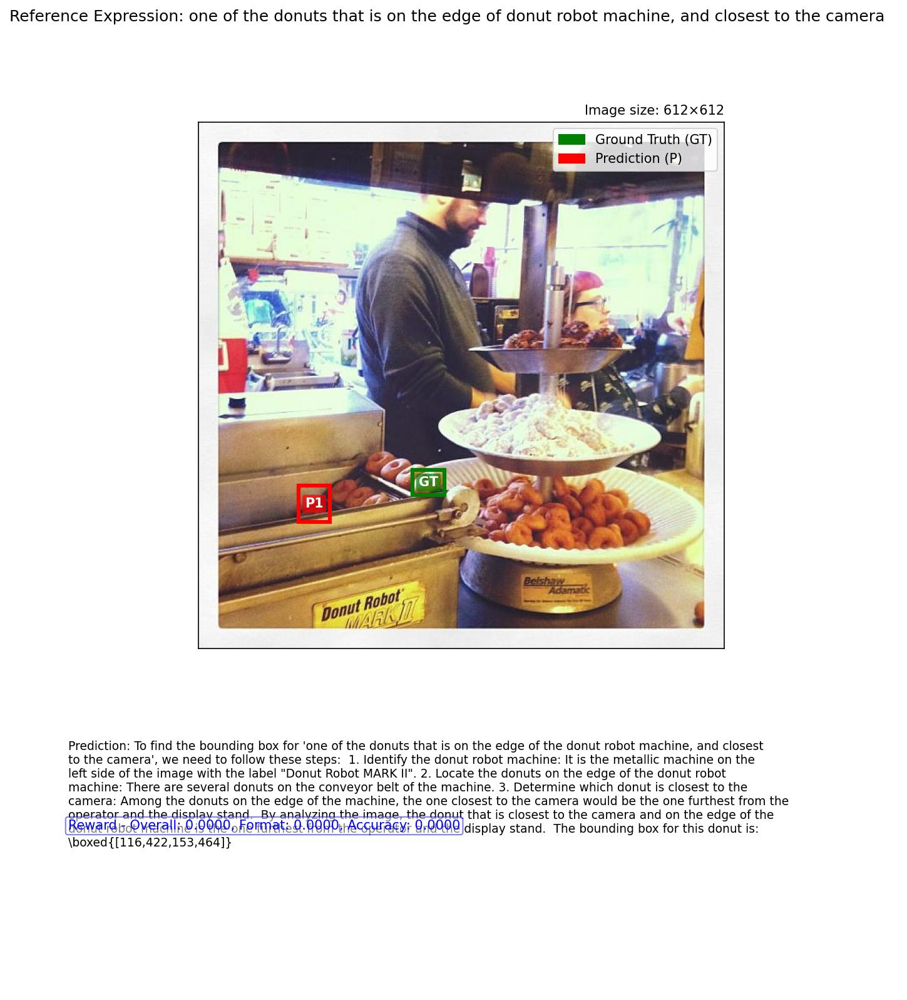

---

### Example 434

**Reference Expression**: the person in yellow jacket on the right hand side of the skier

**Ground Truth**: [[164, 175, 202, 273]]

**Predicted**: [[497, 191, 551, 360]]

**Reward**: {'overall': 0.0, 'format': 0.0, 'accuracy': 0.0}

**Prediction**:
```
To find the bounding box for 'the person in yellow jacket on the right hand side of the skier', follow these steps:

1. Identify the skier in the center of the image. The skier is wearing a helmet and holding ski poles.
2. Look to the right of the skier to find the person in a yellow jacket. This person appears to be standing and facing the skier.
3. Determine the bounding box for this person by observing the edges of their body. The person is wearing a yellow jacket and dark pants, and their head is visible.

Based on these observations, the bounding box for 'the person in yellow jacket on the right hand side of the skier' is:

\boxed{[497,191,551,360]}
```

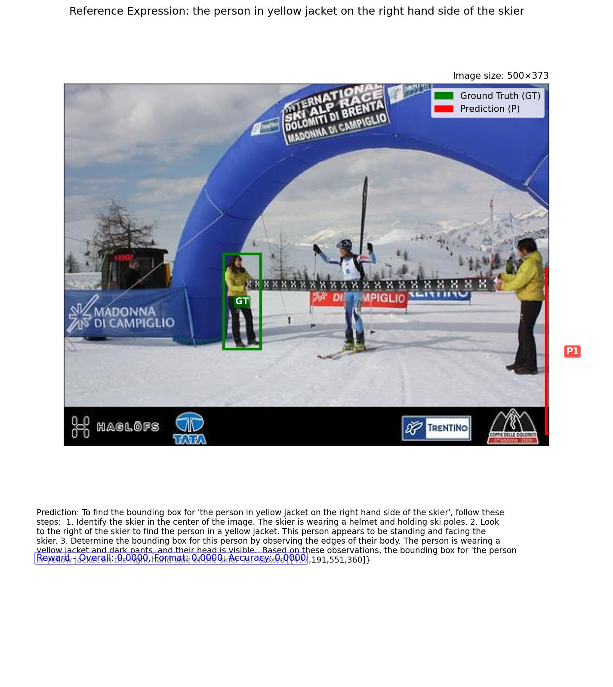

---

### Example 435

**Reference Expression**: the outer row of four old-fashioned donuts

**Ground Truth**: [[372, 325, 448, 353]]

**Predicted**: [[369, 298, 452, 356]]

**Reward**: {'overall': 0.44204403822185295, 'format': 0.0, 'accuracy': 0.44204403822185295}

**Prediction**:
```
To find the bounding box for 'the outer row of four old-fashioned donuts', we need to follow these steps:

1. Identify the shelf where the old-fashioned donuts are located. They are on the right side of the display, in the third row from the top.
2. Locate the specific donuts in question. These are the four donuts on the outer edge of the right side of the third row.
3. Determine the bounding box for these donuts. The bounding box should encompass the four donuts in a rectangular area.

The bounding box for 'the outer row of four old-fashioned donuts' is:
\boxed{[369,298,452,356]}

This bounding box captures the four old-fashioned donuts on the outer edge of the third row from the top.
```

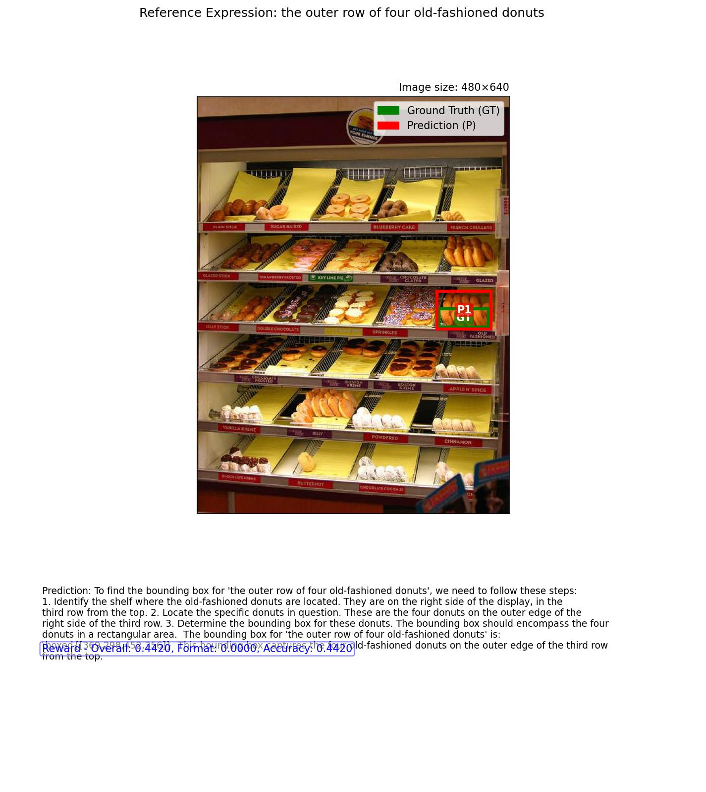

---

### Example 436

**Reference Expression**: the donuts with chocolate base and glaze on the top

**Ground Truth**: [[242, 267, 436, 453]]

**Predicted**: []

**Reward**: {'overall': 0.0, 'format': 0.0, 'accuracy': 0.0}

**Prediction**:
```
To find the bounding box for the donuts with chocolate base and glaze on the top, let's follow these steps:

1. Identify the donuts with chocolate base and glaze:
   - There are two donuts with a chocolate base and glaze on the top row.
   - The donut on the left side of the top row has a chocolate base and glaze.
   - The donut on the right side of the top row also has a chocolate base and glaze.

2. Determine the bounding box for these donuts:
   - The bounding box for the donut on the left side of the top row should include the entire donut, so the bounding box will be from the left edge of the box to the right edge of the chocolate donut.
   - The bounding box for the donut on the right side of the top row should also include the entire donut, so it will be from the right edge of the chocolate donut to the right edge of the box.

3. Combine the bounding boxes:
   - The bounding box for the two donuts should be a rectangle that encompasses both donuts.

Given these observations, the bounding box for the donuts with chocolate base and glaze on the top can be described as:
\boxed{[1,19,238,246,24,246]}

This bounding box captures both donuts with chocolate base and glaze on the top row.
```

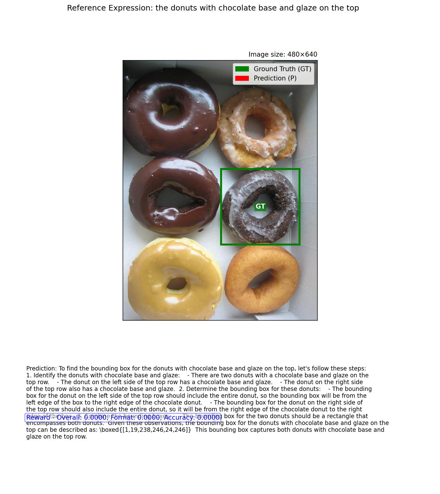

---

### Example 437

**Reference Expression**: the chocolate frosted donuts in the corner of the box

**Ground Truth**: [[47, 273, 266, 459]]

**Predicted**: [[49, 269, 269, 456]]

**Reward**: {'overall': 1.0, 'format': 0.0, 'accuracy': 1.0}

**Prediction**:
```
To find the bounding box for 'the chocolate frosted donuts in the corner of the box', we need to follow these steps:

1. Identify the chocolate frosted donuts in the image. There are two chocolate frosted donuts in the image.
2. Determine which donut is in the corner of the box. The chocolate frosted donuts are in the bottom row, and the one on the left side of the bottom row is in the corner.
3. Define the bounding box for the donut in the corner. The donut is located in the bottom left corner of the box.

The bounding box for the chocolate frosted donut in the bottom left corner of the box is:
\boxed{[49,269,269,456]}

This bounding box captures the chocolate frosted donut that is in the corner of the box.
```

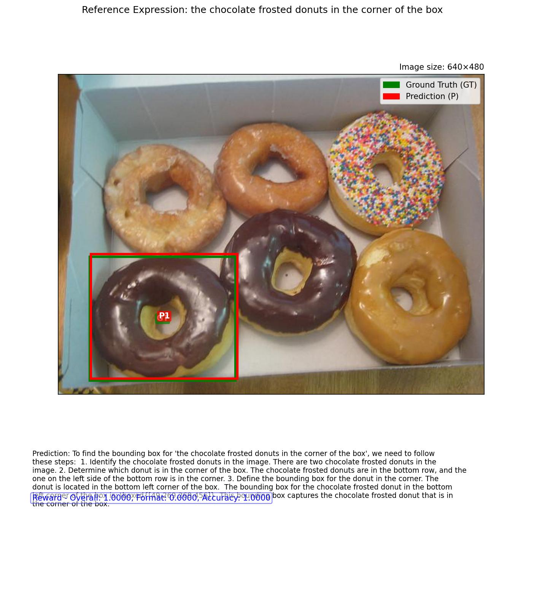

---

### Example 438

**Reference Expression**: the French Cruller donuts in the corner of the box

**Ground Truth**: [[389, 2, 556, 158]]

**Predicted**: [[377, 0, 554, 144]]

**Reward**: {'overall': 0.8335112059765208, 'format': 0.0, 'accuracy': 0.8335112059765208}

**Prediction**:
```
To find the bounding box for the French Cruller donuts in the corner of the box, we need to identify the donuts that are shaped like crullers (twisted and typically have a crisscross pattern). These are the donuts located in the top right corner of the box.

1. Identify the donuts in the top right corner.
2. Confirm that these donuts have the characteristic twisted, crisscross pattern of French Crullers.

The bounding box for the French Cruller donuts in the corner of the box is:
\boxed{[377,0,554,144]}
```

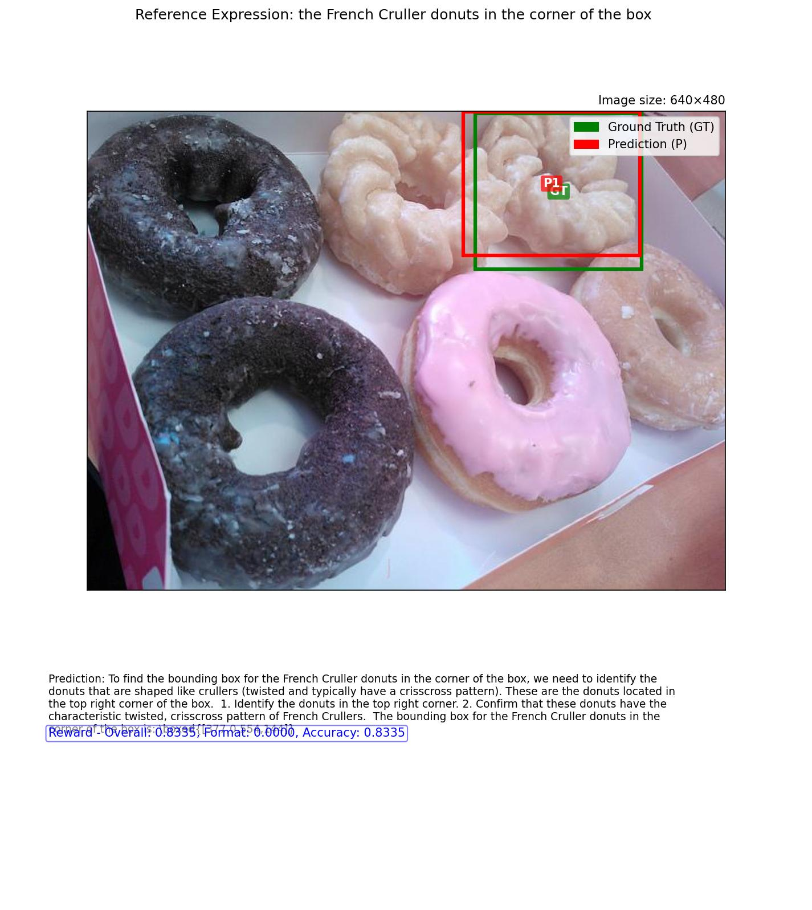

---

### Example 439

**Reference Expression**: the person wearing white socks behind a board

**Ground Truth**: [[385, 243, 434, 319]]

**Predicted**: [[280, 144, 385, 447]]

**Reward**: {'overall': 0.0, 'format': 0.0, 'accuracy': 0.0}

**Prediction**:
```
To find the bounding box for 'the person wearing white socks behind a board', let's follow these steps:

1. Identify the board in the image: The board is the white structure with the "Wii Fit" logo and the figure of a person on it. It's located in the foreground of the image.
2. Identify the person behind the board: The person behind the board is the one wearing white socks. They are partially obscured by the board but are visible on the right side of the board.
3. Determine the bounding box: The person behind the board is wearing white socks and white pants. The bounding box should capture this person from the waist up, as the board is blocking the lower part of their body.

After carefully analyzing the image, the bounding box for the person wearing white socks behind the board is:

\boxed{[280,144,385,447]}
```

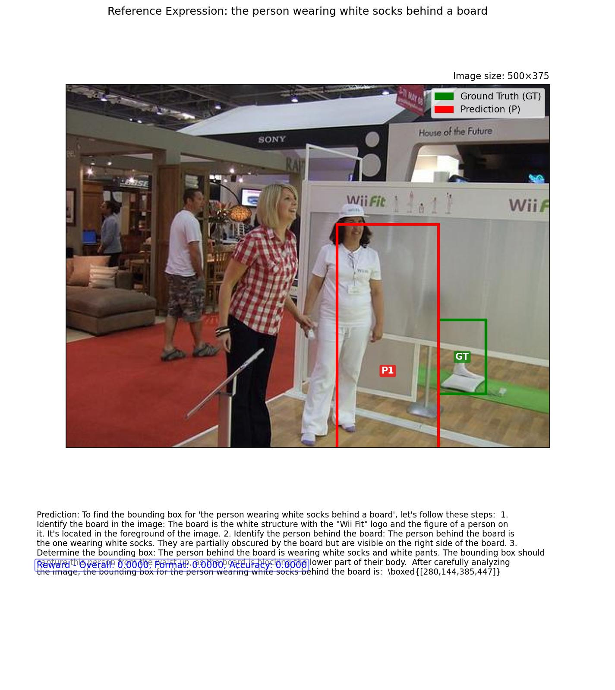

---

### Example 440

**Reference Expression**: the vase on the table which is not next to a sofa

**Ground Truth**: [[196, 155, 216, 206]]

**Predicted**: [[244, 199, 263, 255]]

**Reward**: {'overall': 0.0, 'format': 0.0, 'accuracy': 0.0}

**Prediction**:
```
To find the corresponding bounding box for 'the vase on the table which is not next to a sofa', let's follow these steps:

1. Identify the table in the image: The table is located in the left part of the image, and it has a white tablecloth with a patterned border.
2. Identify the vases on the table: There are two vases on the table. One is on the left side of the table and the other is on the right side.
3. Determine which vase is not next to a sofa: The sofa is on the right side of the image, so we need to identify the vase that is not near the sofa. The vase on the left side of the table is not next to the sofa.
4. Locate the vase on the left side of the table: The vase is placed on the left side of the table, closer to the window.

Given these observations, the bounding box for the vase on the table which is not next to a sofa is:

\boxed{[244,199,263,255]}
```

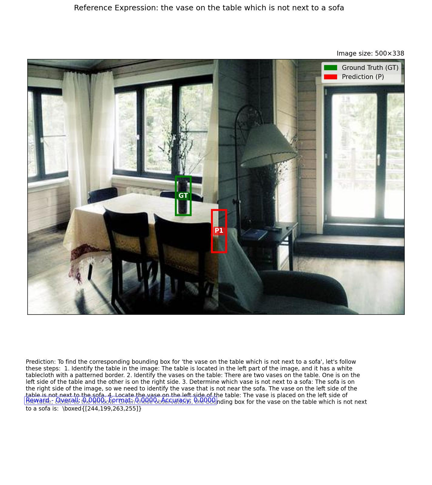

---

### Example 441

**Reference Expression**: the vase on the table which is not next to the window

**Ground Truth**: [[64, 378, 78, 391]]

**Predicted**: [[247, 287, 261, 308]]

**Reward**: {'overall': 0.0, 'format': 0.0, 'accuracy': 0.0}

**Prediction**:
```
To find the vase on the table which is not next to the window, let's follow these steps:

1. Identify the windows in the image. There are two windows visible, one on the left side and one on the right side of the room.
2. Look for tables in the room. There are two tables visible: one in the center of the room and one near the fireplace.
3. Determine which table is not next to the windows. The table near the fireplace is not next to any windows.
4. Check for vases on the table near the fireplace. There is a vase on this table.

Following these steps, the vase on the table which is not next to the window is located on the table near the fireplace.

The bounding box for 'the vase on the table which is not next to the window' is \boxed{[247,287,261,308]}.
```

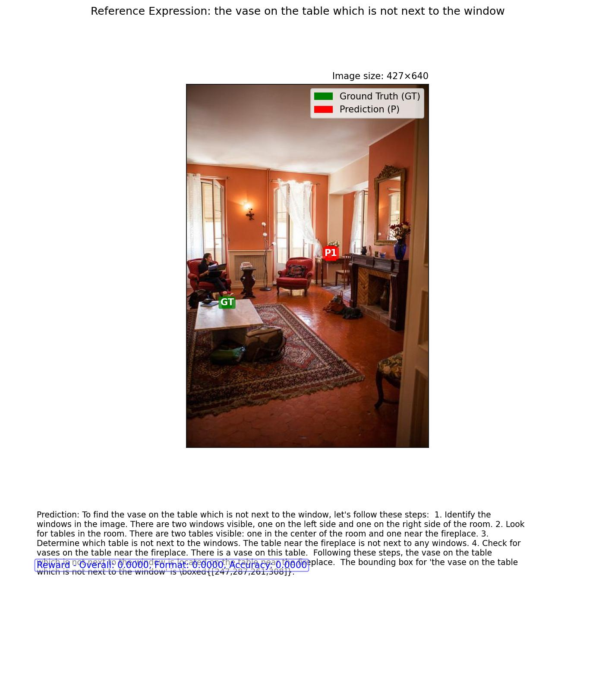

---

### Example 442

**Reference Expression**: the person wearing a white shirt holding something in one hand

**Ground Truth**: [[17, 191, 186, 428]]

**Predicted**: [[16, 187, 182, 415]]

**Reward**: {'overall': 1.0, 'format': 0.0, 'accuracy': 1.0}

**Prediction**:
```
To find the bounding box for 'the person wearing a white shirt holding something in one hand', let's follow these steps:

1. Identify the person in the white shirt: The person in the white shirt is on the left side of the image, holding a white object that resembles a Wii Remote.
2. Determine the bounding box: The bounding box should encompass the person from the waist up, as they are actively engaging in the activity.

Following these steps, the bounding box for 'the person wearing a white shirt holding something in one hand' is:
\boxed{[16,187,182,415]}
```

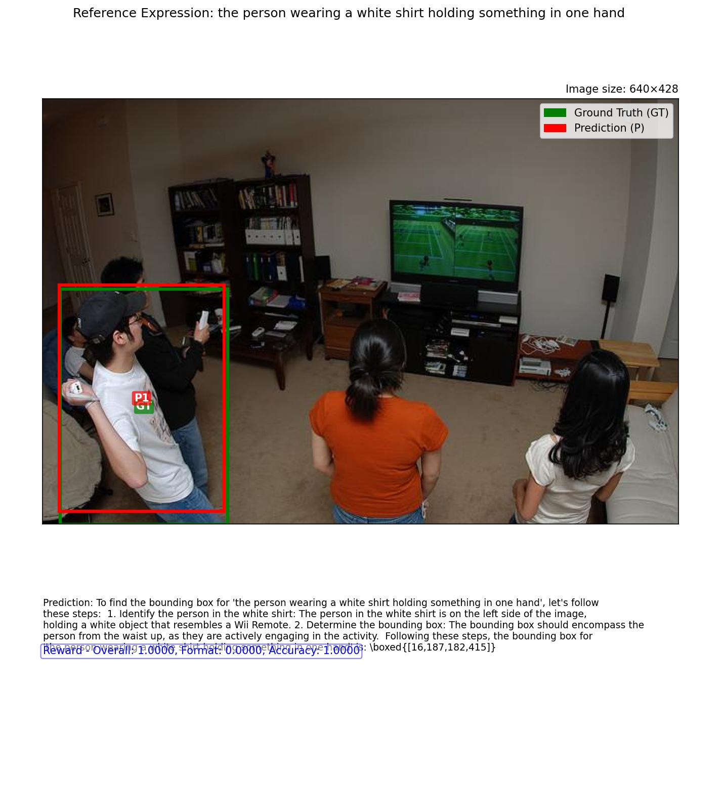

---

### Example 443

**Reference Expression**: the turned on laptop, not between two monitors

**Ground Truth**: [[370, 91, 541, 242]]

**Predicted**: [[385, 93, 540, 224]]

**Reward**: {'overall': 0.7863754308508578, 'format': 0.0, 'accuracy': 0.7863754308508578}

**Prediction**:
```
To find the turned-on laptop that is not between two monitors, we need to follow these steps:

1. Identify the turned-on laptops in the image.
2. Determine which of these laptops is not positioned between the two monitors.

Step 1: Identifying the turned-on laptops:
- There are two laptops on the desk. One is on the left side and the other is on the right side of the desk.
- The laptop on the left side of the desk is turned off, as the screen is dark.
- The laptop on the right side of the desk is turned on, as the screen is displaying content.

Step 2: Determining the position of the turned-on laptop:
- The turned-on laptop is on the right side of the desk.
- The turned-on laptop is not between the two monitors.

The turned-on laptop not between the two monitors is the one on the right side of the desk.

The bounding box for the turned-on laptop, not between two monitors, is:
\boxed{[385,93,540,224]}
```

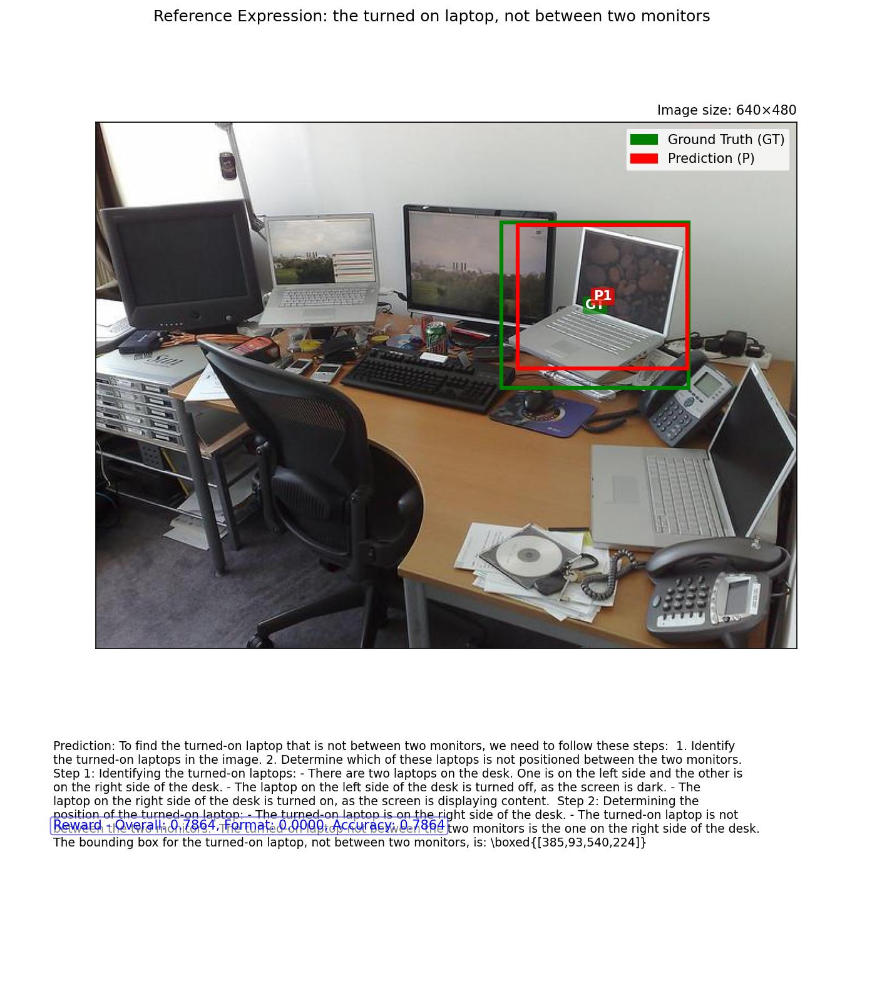

---

### Example 444

**Reference Expression**: the golden frame with a portrait inside

**Ground Truth**: [[87, 20, 159, 103]]

**Predicted**: [[451, 1, 553, 152]]

**Reward**: {'overall': 0.0, 'format': 0.0, 'accuracy': 0.0}

**Prediction**:
```
To find the corresponding bounding box for 'the golden frame with a portrait inside', let's follow these steps:

1. Identify the golden frame: Look for a frame that is golden in color and has a portrait inside.
2. Locate the frame: In the image, there are several frames on the wall. The golden frame with a portrait inside is positioned on the upper right side of the image.
3. Define the bounding box: The golden frame has a portrait inside, and it is rectangular in shape. The frame itself is also rectangular, and it is hanging on the wall.

After identifying the golden frame with a portrait inside, the bounding box for it is:
\boxed{[451,1,553,152]}
```

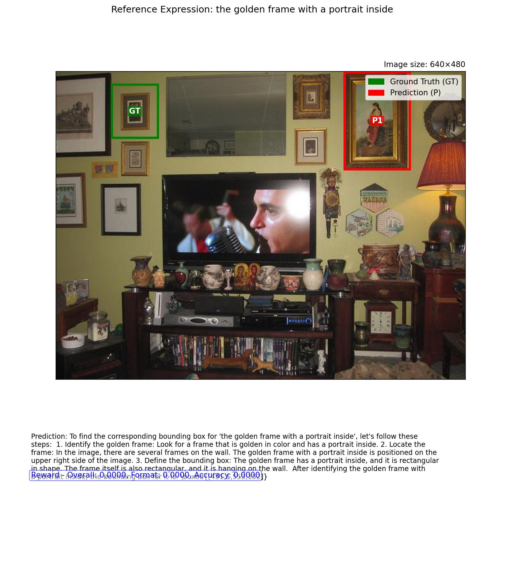

---

### Example 445

**Reference Expression**: the white long couch which is not on the balcony

**Ground Truth**: [[401, 240, 640, 393]]

**Predicted**: [[402, 238, 644, 388]]

**Reward**: {'overall': 1.0, 'format': 0.0, 'accuracy': 1.0}

**Prediction**:
```
To find the corresponding bounding box for 'the white long couch which is not on the balcony', let's follow these steps:

1. Identify the couches in the image: There are two couches in the image, one on the left side and one on the right side.
2. Determine which couch is on the balcony: The couch on the left side is on the balcony, as it is positioned outside the sliding glass doors.
3. Identify the couch that is not on the balcony: The couch on the right side is not on the balcony; it is inside the room.

Given these observations, the bounding box for 'the white long couch which is not on the balcony' is the couch on the right side.

The final answer is:
\boxed{[402,238,644,388]}
```

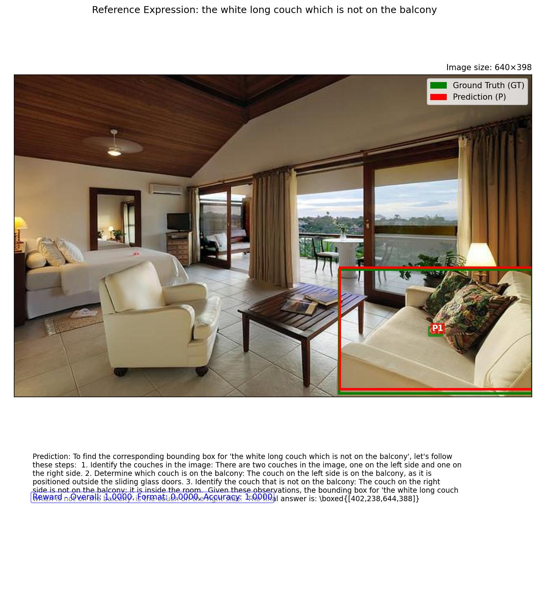

---

### Example 446

**Reference Expression**: the remote held in the right hand of a person with long hair

**Ground Truth**: [[184, 167, 211, 237]]

**Predicted**: [[183, 166, 212, 231]]

**Reward**: {'overall': 0.844162188568637, 'format': 0.0, 'accuracy': 0.844162188568637}

**Prediction**:
```
To find the bounding box for 'the remote held in the right hand of a person with long hair', let's follow these steps:

1. Identify the person with long hair: The person on the left in the image appears to have long hair.
2. Determine the remote held in the right hand: The person with long hair is holding a white object in their right hand, which is a Wii remote.
3. Locate the bounding box: The bounding box should encompass the remote and the hand holding it.

Following these steps, the bounding box for 'the remote held in the right hand of a person with long hair' is:
\boxed{[183,166,212,231]}
```

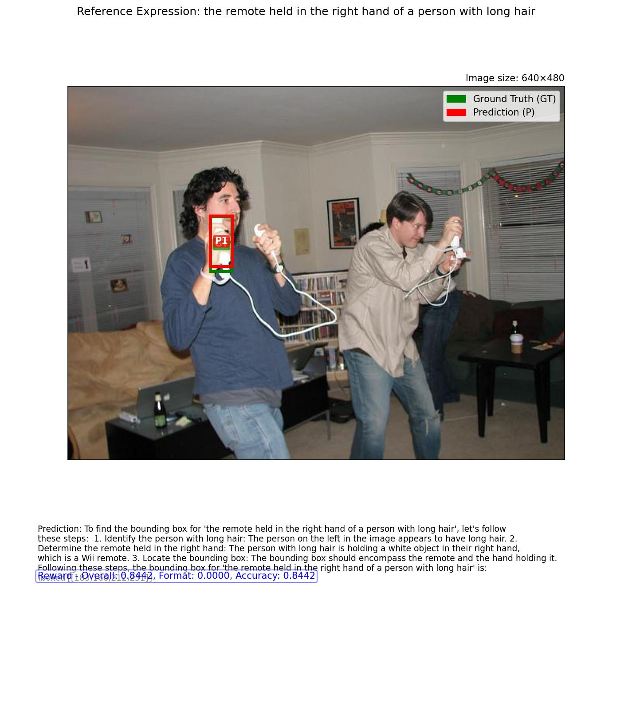

---

### Example 447

**Reference Expression**: the pizza on a plate not behind a glass with fork and knife in it

**Ground Truth**: [[328, 253, 410, 287]]

**Predicted**: [[272, 251, 555, 381]]

**Reward**: {'overall': 0.0, 'format': 0.0, 'accuracy': 0.0}

**Prediction**:
```
To find the bounding box for 'the pizza on a plate not behind a glass with fork and knife in it', let's follow these steps:

1. Identify the plates in the image: There are multiple plates with pizza on them.
2. Locate the plate with the fork and knife in it: The plate with the fork and knife in it is the one in the foreground with a slice of pizza on it.
3. Identify the pizza on a plate not behind a glass with a fork and knife: The pizza on the plate that is not behind a glass and has a fork and knife is the pizza in the background, which is on a plate with a slice of pizza and a fork and knife on the side.

Given these observations, the bounding box for the pizza on a plate not behind a glass with a fork and knife is the one in the background.

\boxed{[272,251,555,381]}
```

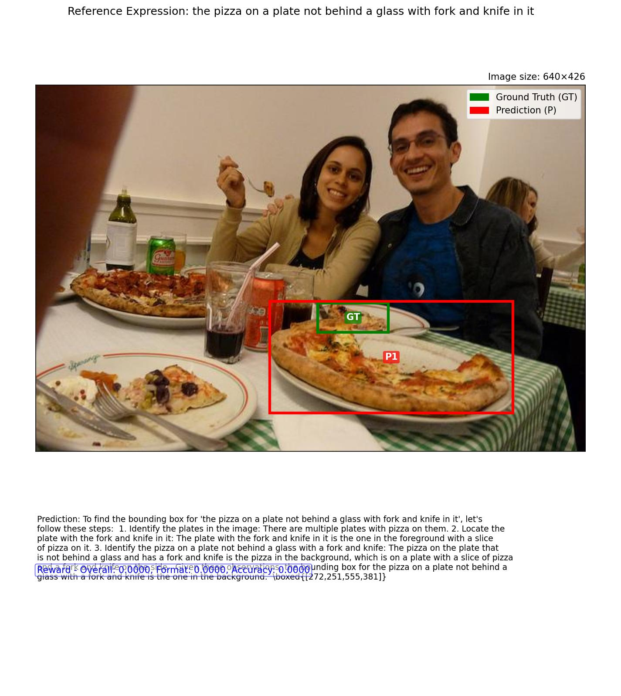

---

### Example 448

**Reference Expression**: red wine glass with wine inside, not held by a person and not close to the wall

**Ground Truth**: [[400, 380, 448, 501]]

**Predicted**: [[189, 344, 246, 447]]

**Reward**: {'overall': 0.0, 'format': 0.0, 'accuracy': 0.0}

**Prediction**:
```
To find the bounding box for the red wine glass with wine inside, not held by a person and not close to the wall, we need to follow these steps:

1. Identify all the wine glasses in the image.
2. Determine which wine glasses are not being held by a person.
3. Among those, identify which one is not close to the wall.
4. Check if the wine glass contains red wine.

Step 1: Identifying all wine glasses:
- There is a wine glass on the left side of the image, next to the person on the left.
- There is a wine glass in the middle of the image, next to the person in the middle.
- There is a wine glass on the right side of the image, next to the person on the right.

Step 2: Determining which wine glasses are not being held by a person:
- The wine glass on the left is not being held by a person.
- The wine glass in the middle is being held by a person.
- The wine glass on the right is not being held by a person.

Step 3: Among those, identifying which one is not close to the wall:
- The wine glass on the left is not close to the wall.
- The wine glass on the right is not close to the wall.

Step 4: Checking if the wine glass contains red wine:
- The wine glass on the left contains red wine.
- The wine glass on the right contains red wine.

Since we need the wine glass that is not held by a person and not close to the wall, and it contains red wine, the wine glass on the left fits the criteria.

The bounding box for the red wine glass with wine inside, not held by a person and not close to the wall is:
\boxed{[189,344,246,447]}
```

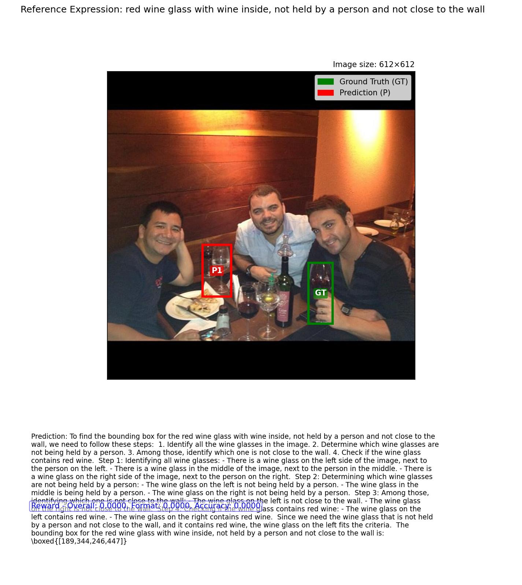

---

### Example 449

**Reference Expression**: the remote held in the right hand of a person not wearing glasses

**Ground Truth**: [[261, 265, 290, 343]]

**Predicted**: [[304, 317, 332, 354]]

**Reward**: {'overall': 0.0, 'format': 0.0, 'accuracy': 0.0}

**Prediction**:
```
To find the bounding box for 'the remote held in the right hand of a person not wearing glasses', let's follow these steps:

1. Identify the person not wearing glasses: The person on the right side of the image is not wearing glasses.
2. Determine the remote held in the right hand: The person on the right side is holding a white object in their right hand, which appears to be a remote control.
3. Locate the bounding box: The remote control is held in the right hand of the person on the right side, and it is white in color.

Based on these observations, the bounding box for 'the remote held in the right hand of a person not wearing glasses' is:
\boxed{[304,317,332,354]}
```

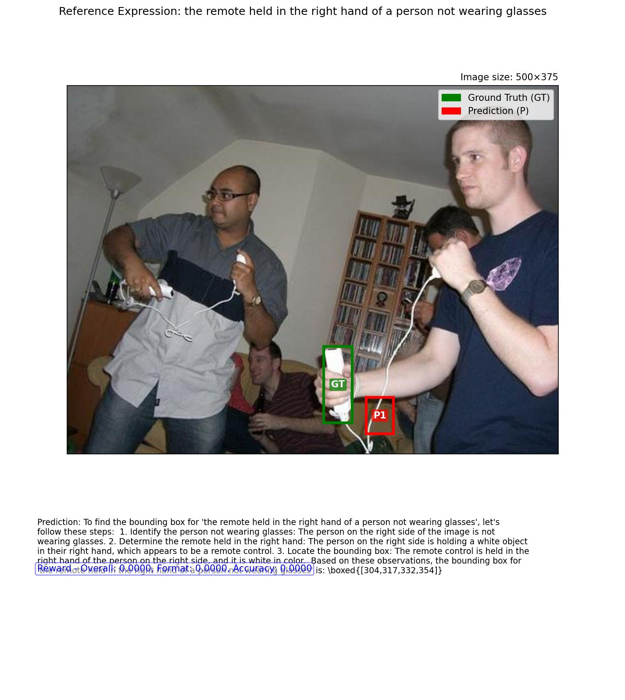

---

### Example 450

**Reference Expression**: the person closest to the frame with a picture of fruit inside

**Ground Truth**: [[412, 82, 625, 396]]

**Predicted**: [[419, 80, 620, 415]]

**Reward**: {'overall': 0.8876418716509852, 'format': 0.0, 'accuracy': 0.8876418716509852}

**Prediction**:
```
To find the bounding box for 'the person closest to the frame with a picture of fruit inside', we need to follow these steps:

1. Identify the frame with a picture of fruit: The picture of fruit is on the far right of the image, in the upper right corner.
2. Determine who is closest to that frame: The person closest to that frame is the one on the right side of the image, wearing a dark shirt with a graphic on it.
3. Define the bounding box for that person: The person is seated, and we need to capture their upper body and a portion of their face.

After carefully analyzing the image, the bounding box for the person closest to the frame with a picture of fruit is:
\boxed{[419,80,620,415]}
```

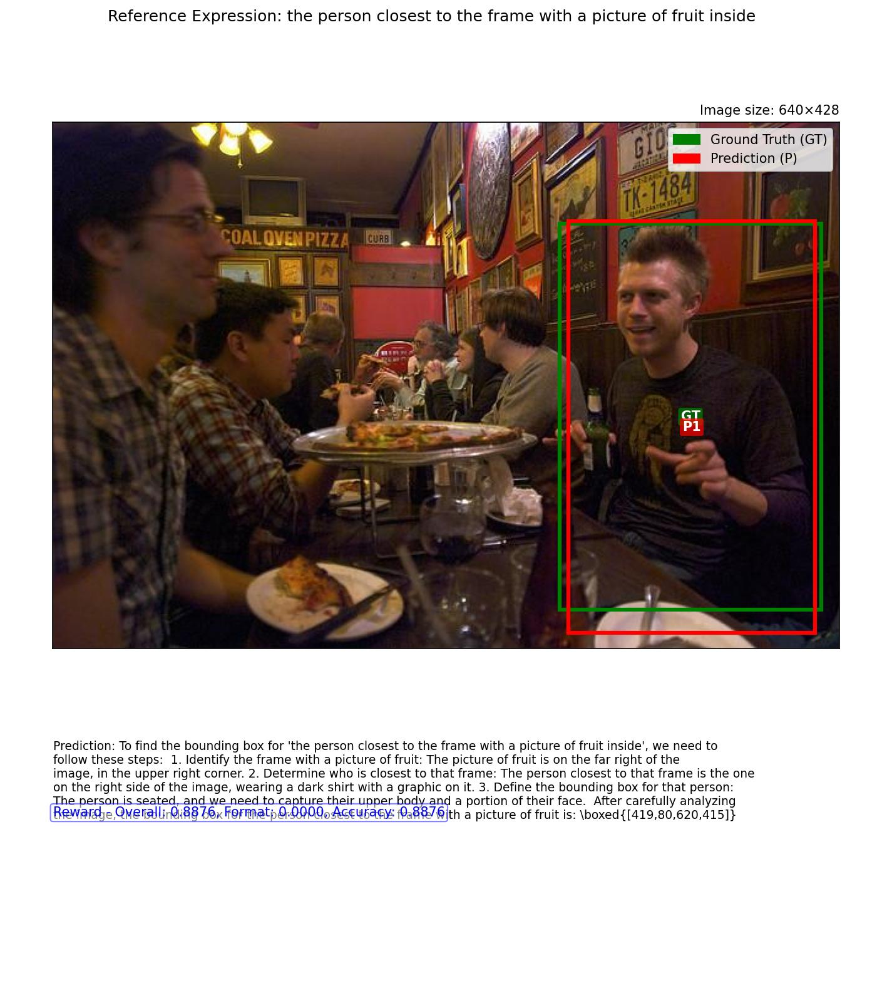

---

### Example 451

**Reference Expression**: the person holding a remote in the hand and not wearing a white top

**Ground Truth**: [[359, 54, 492, 432]]

**Predicted**: [[362, 52, 492, 427]]

**Reward**: {'overall': 1.0, 'format': 0.0, 'accuracy': 1.0}

**Prediction**:
```
To find the bounding box for 'the person holding a remote in the hand and not wearing a white top', let's follow these steps:

1. Identify the person in the image who is not wearing a white top.
2. Among the identified person, find the one who is holding a remote.
3. Determine the bounding box for this person.

- The person in the foreground on the right side of the image is not wearing a white top and appears to be holding a remote.
- The person on the far left is wearing a white top and does not appear to be holding a remote.

Therefore, the bounding box for 'the person holding a remote in the hand and not wearing a white top' is:

\boxed{[362,52,492,427]}
```

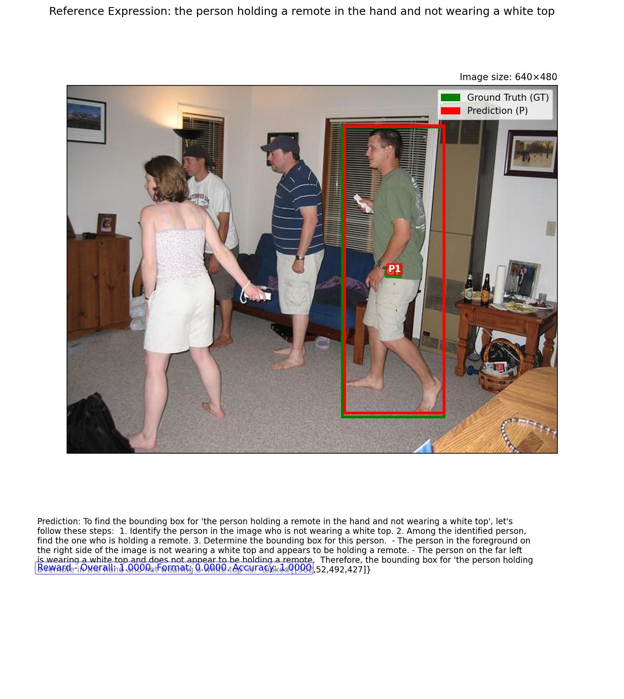

---

### Example 452

**Reference Expression**: one of the chairs with a cushion on it, closer to the window

**Ground Truth**: [[449, 224, 513, 303]]

**Predicted**: [[451, 222, 515, 296]]

**Reward**: {'overall': 0.8378378378378378, 'format': 0.0, 'accuracy': 0.8378378378378378}

**Prediction**:
```
To find the bounding box for 'one of the chairs with a cushion on it, closer to the window', let's follow these steps:

1. Identify the window: The window is located on the right side of the image, near the sliding doors.
2. Identify the chairs: There are two chairs in the room. One is closer to the window, and the other is closer to the center of the room.
3. Determine which chair is closer to the window: The chair closer to the window is the one on the right side, near the sliding doors.
4. Identify the cushion: The chair closer to the window has a blue cushion on it.

Given these observations, the bounding box for 'one of the chairs with a cushion on it, closer to the window' is the chair on the right side, near the sliding doors.

The final answer is:
\boxed{[451,222,515,296]}
```

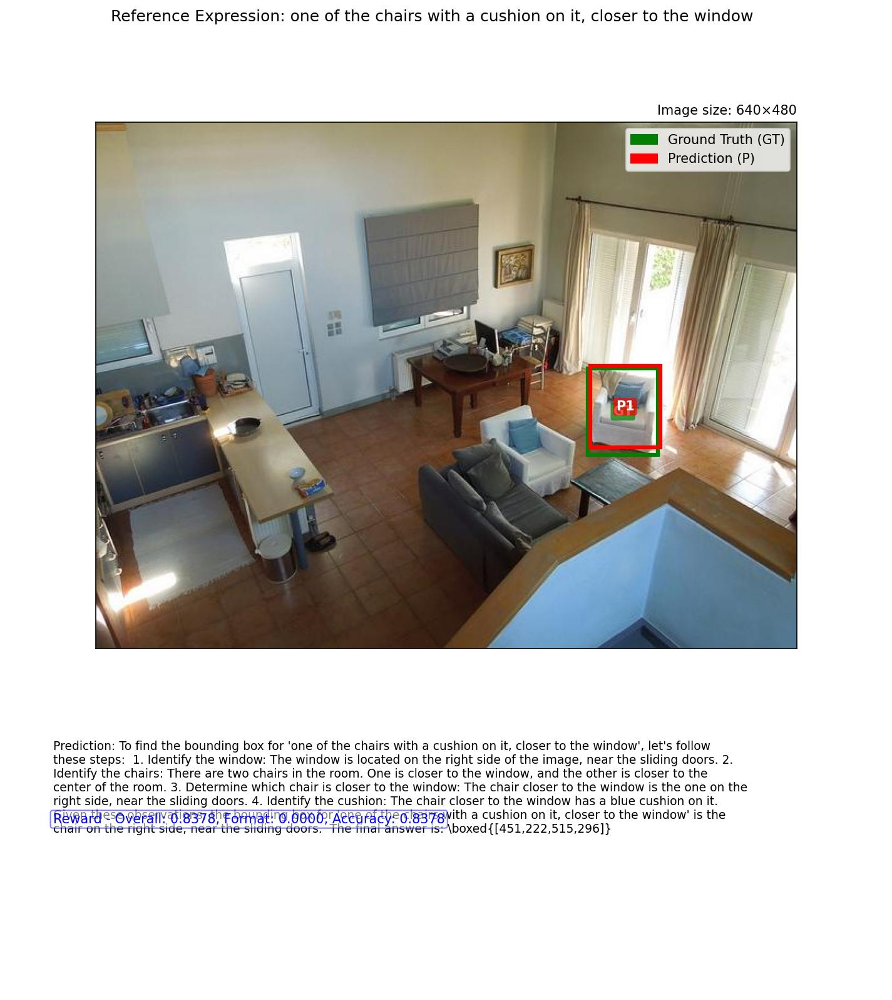

---

### Example 453

**Reference Expression**: the remote held in the right hand of a person wearing a white top

**Ground Truth**: [[491, 98, 511, 137]]

**Predicted**: [[458, 240, 590, 280]]

**Reward**: {'overall': 0.0, 'format': 0.0, 'accuracy': 0.0}

**Prediction**:
```
To find the bounding box for the remote held in the right hand of the person wearing a white top, let's follow these steps:

1. Identify the person wearing a white top: The person on the right side of the image is wearing a white top.
2. Locate the remote in the right hand: The person on the right is holding a white remote in their right hand.

Now, we need to determine the exact coordinates of this remote. The remote is held in the right hand and appears to be positioned near the waist area of the person.

Given these observations, the bounding box for the remote held in the right hand of the person wearing a white top would be:

\boxed{[458,240,590,280]}
```

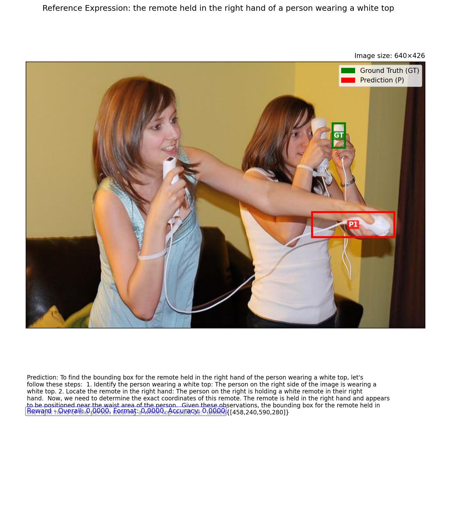

---

### Example 454

**Reference Expression**: the remote in the right hand of the person wearing sandals

**Ground Truth**: [[261, 159, 278, 192]]

**Predicted**: [[334, 195, 356, 212]]

**Reward**: {'overall': 0.0, 'format': 0.0, 'accuracy': 0.0}

**Prediction**:
```
To find the bounding box for 'the remote in the right hand of the person wearing sandals', let's follow these steps:

1. Identify the person wearing sandals: The person on the right is wearing sandals and holding a remote in their right hand.
2. Locate the remote: The remote is a small, white object that the person on the right is holding.
3. Determine the bounding box: The bounding box should encompass the entire remote and a small area around it to ensure it is clearly identified.

After analyzing the image, the bounding box for the remote in the right hand of the person wearing sandals is:
\boxed{[334,195,356,212]}
```

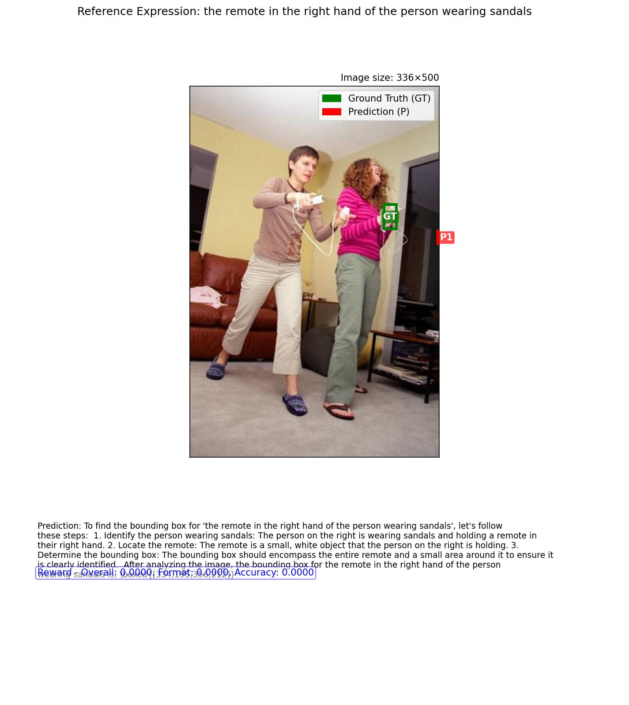

---

### Example 455

**Reference Expression**: the remote held by the person wearing a black suit and a tie

**Ground Truth**: [[571, 349, 615, 422]]

**Predicted**: [[576, 345, 621, 415]]

**Reward**: {'overall': 0.6795142555438226, 'format': 0.0, 'accuracy': 0.6795142555438226}

**Prediction**:
```
To find the bounding box for the remote held by the person wearing a black suit and a tie, we need to follow these steps:

1. Identify the person wearing a black suit and a tie. This person is on the right side of the image.
2. Look at the remote that this person is holding. It is white and located in their right hand.
3. Determine the bounding box for this remote. The remote is relatively small and can be described by its top-left and bottom-right corners.

After analyzing the image, the bounding box for the remote held by the person wearing a black suit and a tie is:

\boxed{[576,345,621,415]}
```

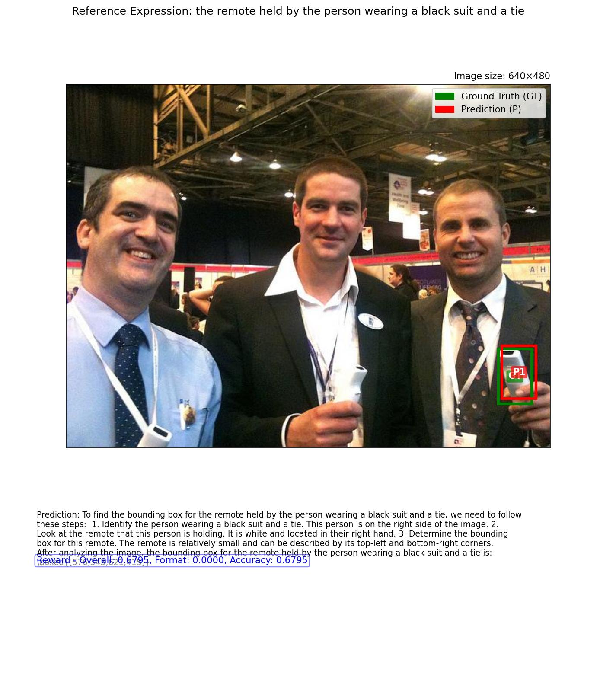

---

### Example 456

**Reference Expression**: the person wearing blue clothes outside the court fence

**Ground Truth**: [[0, 204, 35, 286]]

**Predicted**: [[0, 199, 40, 281]]

**Reward**: {'overall': 0.7800289435600579, 'format': 0.0, 'accuracy': 0.7800289435600579}

**Prediction**:
```
To find the bounding box for 'the person wearing blue clothes outside the court fence', let's follow these steps:

1. Identify the court: The court is the green and red area in the foreground of the image.
2. Locate the person outside the court fence: Look for a person wearing blue clothes who is not on the court and is near the fence.
3. Observe the person's position: The person in question is on the left side of the image, standing near the fence and appears to be interacting with something or someone, possibly a child.
4. Define the bounding box: The bounding box should encompass this person while excluding the court.

After analyzing the image, the bounding box for 'the person wearing blue clothes outside the court fence' is:
\boxed{[0,199,40,281]}
```

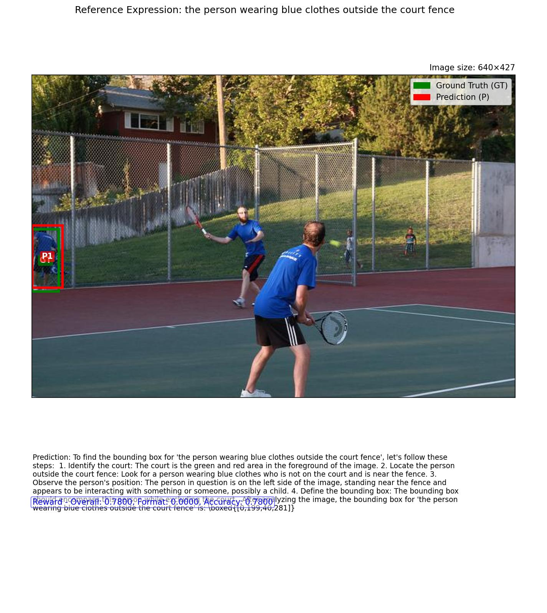

---

### Example 457

**Reference Expression**: the person wearing a white top not playing with a football

**Ground Truth**: [[309, 19, 338, 101]]

**Predicted**: [[307, 18, 341, 106]]

**Reward**: {'overall': 0.7947860962566845, 'format': 0.0, 'accuracy': 0.7947860962566845}

**Prediction**:
```
To find the bounding box for 'the person wearing a white top not playing with a football', we need to follow these steps:

1. Identify the person wearing a white top. This person is in the background and is standing and not actively involved in the play with the ball.
2. Ensure the person is not actively playing with the football, which means they are not kicking or attempting to kick the ball.

Following these steps, the person wearing a white top is located in the background, standing and not interacting with the ball. The bounding box for this person is:

\boxed{[307,18,341,106]}
```

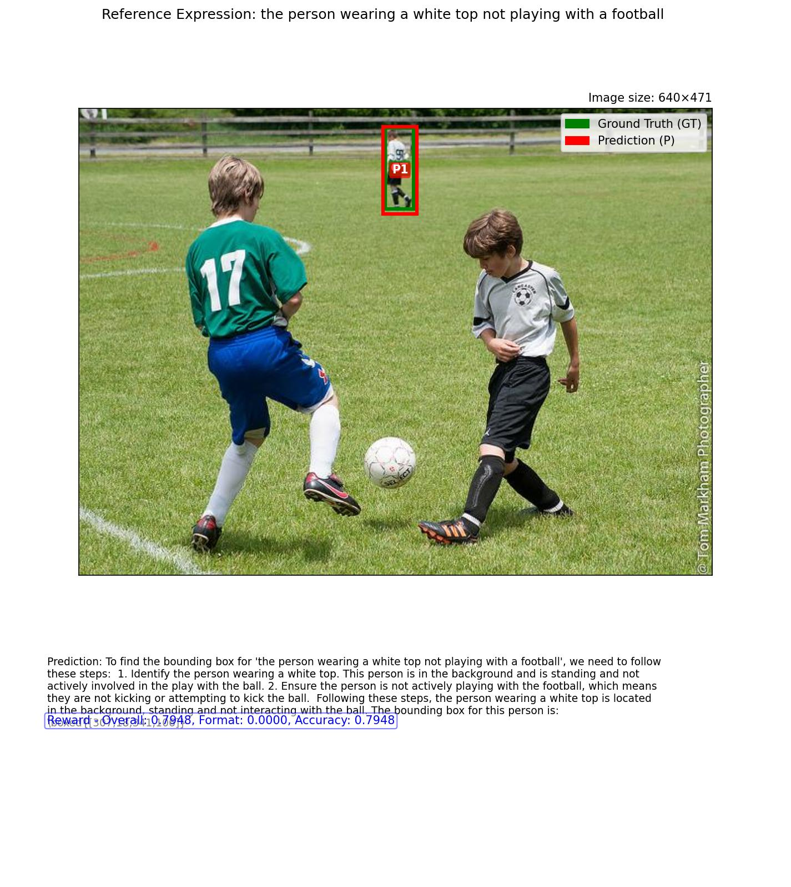

---

### Example 458

**Reference Expression**: the person sitting in the corner of the spectator area

**Ground Truth**: [[357, 13, 418, 88]]

**Predicted**: [[352, 14, 412, 63]]

**Reward**: {'overall': 0.5591286307053942, 'format': 0.0, 'accuracy': 0.5591286307053942}

**Prediction**:
```
To find the person sitting in the corner of the spectator area, we need to follow these steps:

1. Identify the spectator area: The area where spectators are seated is located at the top of the image, behind a wall and some green protective coverings.
2. Look for a person in the corner: In the spectator area, we need to find a person sitting in the corner. This would typically be the person closest to the wall and furthest from the main seating area.
3. Analyze the seating arrangement: The seating is arranged in a way that there are rows of seats. The corner of the spectator area would be the last seat in the last row.
4. Locate the person: Upon close inspection, there appears to be a person sitting in the corner of the spectator area, near the wall and to the right side of the image.

After analyzing the image, the bounding box for the person sitting in the corner of the spectator area is:

\boxed{[352,14,412,63]}
```

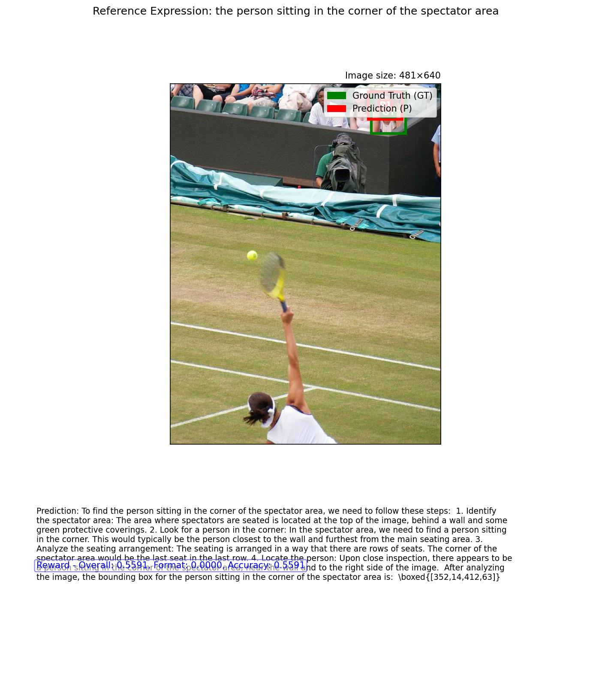

---

### Example 459

**Reference Expression**: the remote held in the left hand of a person with curly hair

**Ground Truth**: [[356, 191, 373, 202]]

**Predicted**: [[435, 220, 462, 242]]

**Reward**: {'overall': 0.0, 'format': 0.0, 'accuracy': 0.0}

**Prediction**:
```
To find the bounding box for the remote held in the left hand of a person with curly hair, we need to follow these steps:

1. Identify the person with curly hair: The person on the right side of the image appears to have curly hair.
2. Determine the left hand: The left hand of the person with curly hair is the one holding the remote.
3. Locate the remote: The remote is a white object held in the left hand of the person with curly hair.

By analyzing the image, the remote in the left hand of the person with curly hair is located near the bottom of the image, close to the person's waist.

The bounding box for the remote held in the left hand of a person with curly hair is:
\boxed{[435,220,462,242]}
```

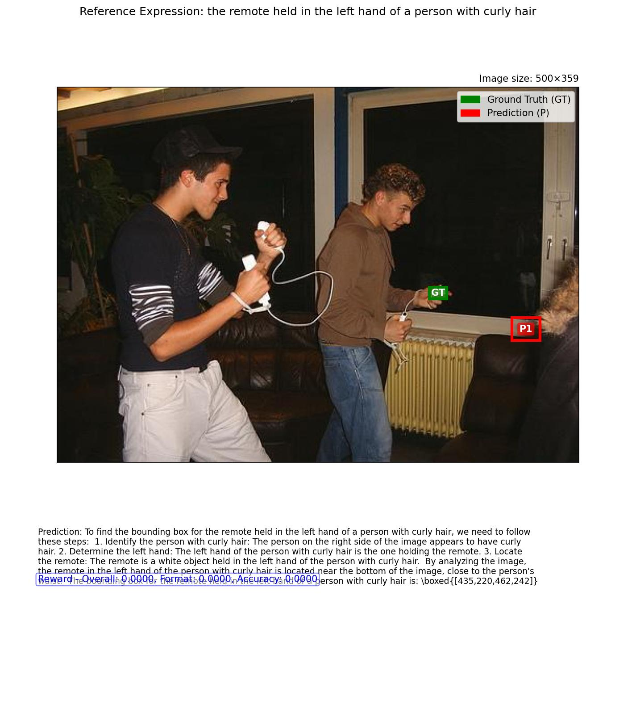

---

### Example 460

**Reference Expression**: the person on sitting on the surfboard

**Ground Truth**: [[423, 21, 495, 79]]

**Predicted**: [[422, 20, 499, 78]]

**Reward**: {'overall': 1.0, 'format': 0.0, 'accuracy': 1.0}

**Prediction**:
```
To find the bounding box for 'the person on sitting on the surfboard', let's follow these steps:

1. Identify the surfboards in the image.
2. Determine which surfboard the person is sitting on.
3. Locate the person sitting on that surfboard.

- First, there are three surfboards in the image. One is blue, one is white, and one is partially submerged.
- The person in the image is sitting on the blue surfboard, which is positioned further away from the camera.
- The person on the white surfboard appears to be lying down, not sitting.

Thus, the person sitting on the surfboard is on the blue surfboard, and the bounding box for this person is:

\boxed{[422,20,499,78]}
```

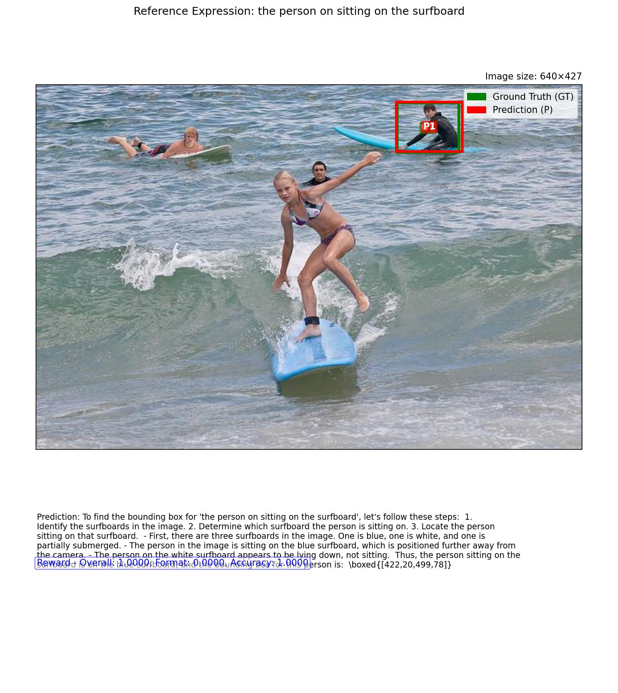

---

### Example 461

**Reference Expression**: the remote held in the right hand of the person wearing a black top

**Ground Truth**: [[442, 290, 464, 306]]

**Predicted**: [[322, 314, 341, 332]]

**Reward**: {'overall': 0.0, 'format': 0.0, 'accuracy': 0.0}

**Prediction**:
```
To find the bounding box for the remote held in the right hand of the person wearing a black top, let's follow these steps:

1. Identify the person wearing a black top: The person on the left side of the image is wearing a black top.
2. Locate the remote in the right hand: The person on the left is holding a white object in their right hand, which appears to be a remote control.
3. Define the bounding box: The remote is being held by the person's right hand, which is extended outward. We need to capture the remote and part of the hand in the bounding box.

Considering these points, the bounding box for the remote held in the right hand of the person wearing a black top would be:

\boxed{[322,314,341,332]}

This bounding box captures the remote control being held by the person's right hand.
```

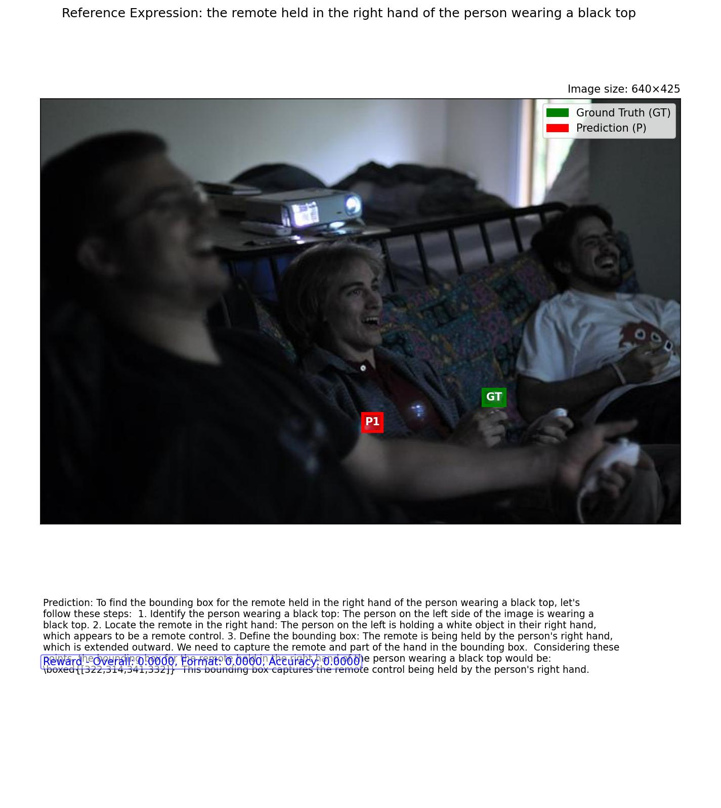

---

